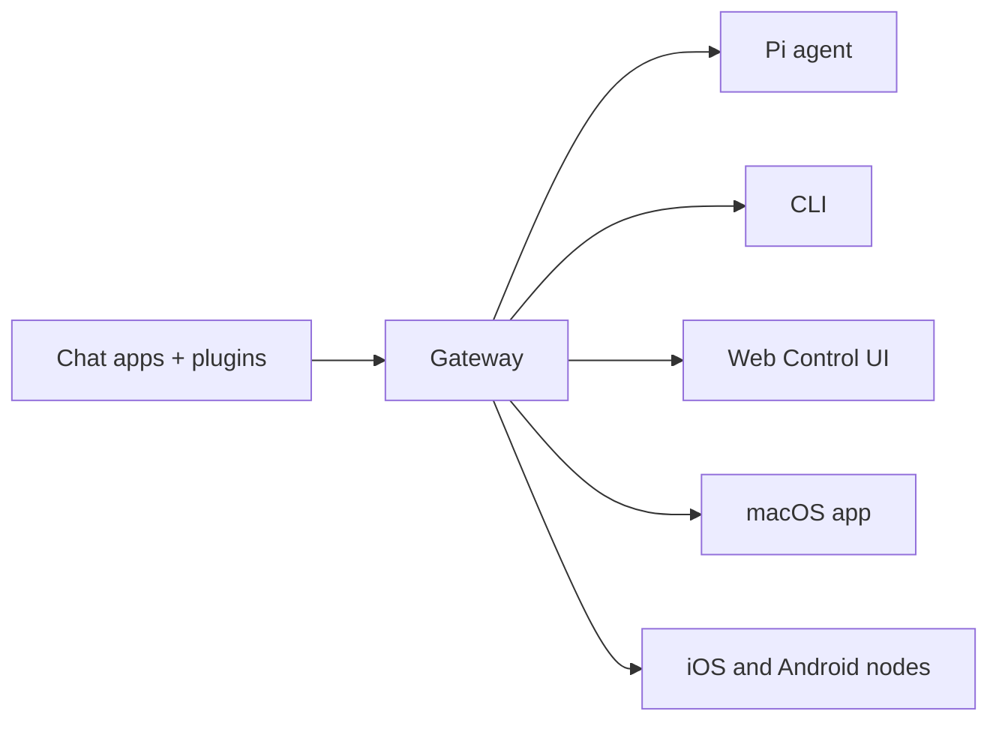

+++
title = "Get started"
date = 2026-04-02T16:32:05+08:00
weight = 10
type = "docs"
description = ""
isCJKLanguage = true
draft = false

+++


# OpenClaw


> *“EXFOLIATE! EXFOLIATE!”* — A space lobster, probably
>
> “去角质！去角质！”—— 大概是一只太空龙虾说的

**Any OS gateway for AI agents across WhatsApp, Telegram, Discord, iMessage, and more.**

​	一款可跨 WhatsApp、Telegram、Discord、iMessage 等平台使用、适配任意操作系统的 AI 智能体网关

Send a message, get an agent response from your pocket. Plugins add Mattermost and more.

​	发送一条消息，就能在手机上收到智能体的回复。插件可接入 Mattermost 等平台。

## Get Started

Install OpenClaw and bring up the Gateway in minutes.

​	几分钟内安装 OpenClaw 并启动 Gateway 。

## Run Onboarding

Guided setup with `openclaw onboard` and pairing flows.

​	通过`openclaw onboard`引导式设置和配对流程完成设置。

## Open the Control UI

Launch the browser dashboard for chat, config, and sessions.

​	启动浏览器仪表板以进行聊天、配置和会话管理。

## What is OpenClaw?

OpenClaw is a **self-hosted gateway** that connects your favorite chat apps — WhatsApp, Telegram, Discord, iMessage, and more — to AI coding agents like Pi. You run a single Gateway process on your own machine (or a server), and it becomes the bridge between your messaging apps and an always-available AI assistant.

​	OpenClaw 是一款**自托管网关**，可将你常用的聊天应用程序（WhatsApp、Telegram、Discord、iMessage 等）与 Pi 等人工智能编程智能体连接起来。你只需在自己的设备（或服务器）上运行一个网关进程，它就能成为你的消息应用与随时可用的人工智能助手之间的桥梁。

**Who is it for?** Developers and power users who want a personal AI assistant they can message from anywhere — without giving up control of their data or relying on a hosted service.**What makes it different?**

​	**适用人群？** 开发者和高级用户，他们想要一款个人人工智能助手，可随时随地与之发消息——同时又不会放弃对自身数据的控制权，也无需依赖托管服务。

- **Self-hosted**: runs on your hardware, your rules
- **自托管**：运行在你的硬件上，由你制定规则
- **Multi-channel**: one Gateway serves WhatsApp, Telegram, Discord, and more simultaneously
- **多渠道**：一个网关可同时服务 WhatsApp、Telegram、Discord 等平台
- **Agent-native**: built for coding agents with tool use, sessions, memory, and multi-agent routing
- **原生智能体**：专为支持工具使用、会话、记忆和多智能体路由的编码智能体而构建
- **Open source**: MIT licensed, community-driven
- **开源**：基于 MIT 许可证授权，由社区驱动

**What do you need?** Node 24 (recommended), or Node 22 LTS (`22.14+`) for compatibility, an API key from your chosen provider, and 5 minutes. For best quality and security, use the strongest latest-generation model available.

​	**你需要什么？** 推荐使用 Node 24，或兼容的 Node 22 长期支持版（`22.14+`）、你所选服务商的 API 密钥，以及 5 分钟时间。为获得最佳质量和安全性，请使用当前最新一代的最强性能模型。

## How it works



The Gateway is the single source of truth for sessions, routing, and channel connections.

​	Gateway 是会话、路由和 channel 连接的唯一真实来源。

## Key capabilities 核心功能


### Multi-channel gateway

WhatsApp, Telegram, Discord, and iMessage with a single Gateway process.

​	通过单一Gateway 进程连接 WhatsApp、Telegram、Discord 和 iMessage

### Plugin channels

Add Mattermost and more with extension packages.

​	通过扩展包添加 Mattermost 及其他应用。

### Multi-agent routing

Isolated sessions per agent, workspace, or sender.

​	每个智能体、工作区或发送方的独立会话

### Media support

Send and receive images, audio, and documents.

​	收发图片、音频和文档

### Web Control UI

Browser dashboard for chat, config, sessions, and nodes.

​	用于聊天、配置、会话和节点的浏览器控制面板

### Mobile nodes

Pair iOS and Android nodes for Canvas, camera, and voice-enabled workflows.

​	将 iOS 和 Android 节点配对，以支持画布、摄像头和语音驱动的工作流程。

## Quick start

1) Install OpenClaw

```
npm install -g openclaw@latest
```

2) Onboard and install the service

```
openclaw onboard --install-daemon
```

3) Chat

Open the Control UI in your browser and send a message:

​	在浏览器中打开控制界面并发送一条消息：

```
openclaw dashboard
```

Or connect a channel ([Telegram](https://docs.openclaw.ai/channels/telegram) is fastest) and chat from your phone.

​	或者连接一个渠道（[Telegram](https://docs.openclaw.ai/channels/telegram) 速度最快），然后用你的手机进行聊天。


Need the full install and dev setup? See [Getting Started](https://docs.openclaw.ai/start/getting-started).

​	需要完整的安装和开发环境设置吗？请查看[快速开始](./getting-started)。

## Dashboard

Open the browser Control UI after the Gateway starts.

​	Gateway 启动后打开浏览器控制界面。

- Local default: http://127.0.0.1:18789/
- Remote access: [Web surfaces](https://docs.openclaw.ai/web) and [Tailscale](https://docs.openclaw.ai/gateway/tailscale)


## Configuration (optional)

Config lives at `~/.openclaw/openclaw.json`.

​	配置文件位于 `~/.openclaw/openclaw.json`。

- If you **do nothing**, OpenClaw uses the bundled Pi binary in RPC mode with per-sender sessions.
- 如果你**什么都不做**，OpenClaw 会以 RPC 模式使用捆绑的 Pi 二进制文件，并采用按发送方会话的方式。
- If you want to lock it down, start with `channels.whatsapp.allowFrom` and (for groups) mention rules.
- 如果你想锁定它，先从 `channels.whatsapp.allowFrom` 开始，并且（针对群组）提及相关规则。

Example:

```json
{
  channels: {
    whatsapp: {
      allowFrom: ["+15555550123"],
      groups: { "*": { requireMention: true } },
    },
  },
  messages: { groupChat: { mentionPatterns: ["@openclaw"] } },
}
```

## Start here


### Docs hubs

All docs and guides, organized by use case.

​	所有文档和指南均按使用场景分类。

### Configuration

Core Gateway settings, tokens, and provider config.

​	核心 Gateway 设置、tokens 和提供商配置

### Remote access

SSH and tailnet access patterns.

​	SSH 和 tailnet 访问模式

### Channels

Channel-specific setup for WhatsApp, Telegram, Discord, and more.

​	WhatsApp、Telegram、Discord 等渠道的专属设置

### Nodes

iOS and Android nodes with pairing, Canvas, camera, and device actions.

​	支持配对、Canvas、摄像头及设备操作的iOS和Android节点

### Help

Common fixes and troubleshooting entry point.

​	常见修复与故障排除入口。

## Learn more


### Full feature list

Complete channel, routing, and media capabilities.

​	完整的频道、路由和媒体功能。

### Multi-agent routing

Workspace isolation and per-agent sessions.

​	工作区隔离与单代理会话。

### Security

Tokens, allowlists, and safety controls.

​	Tokens、白名单和安全控制。

### Troubleshooting 故障排除

Gateway diagnostics and common errors.

​	Gateway 诊断和常见错误。

### About and credits 关于和致谢

Project origins, contributors, and license.

​	项目起源、贡献者与许可证。
