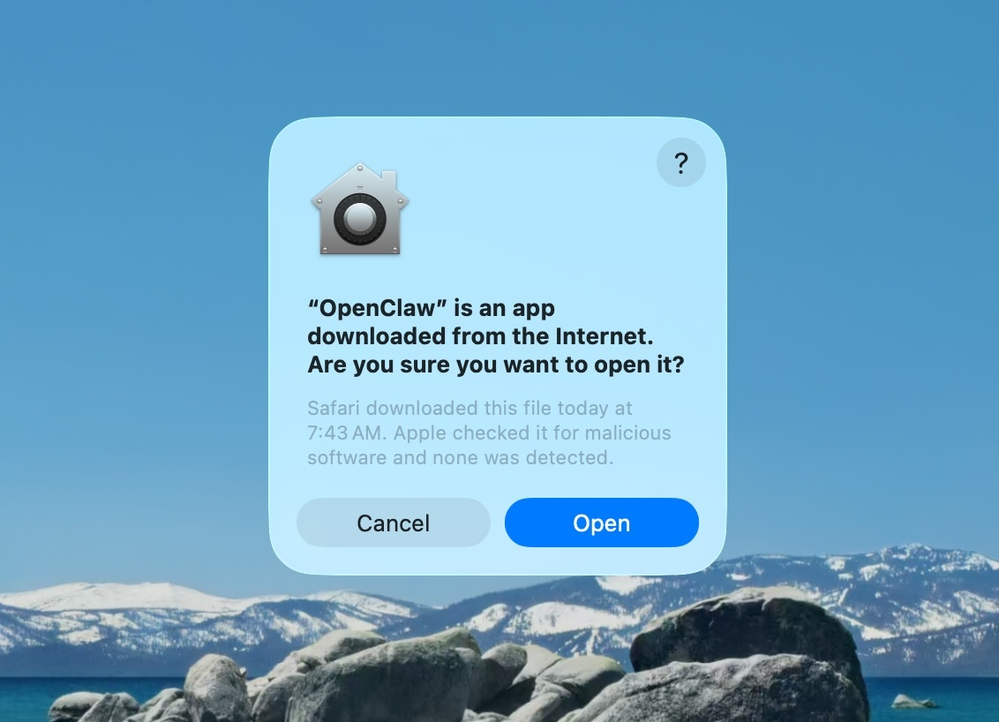
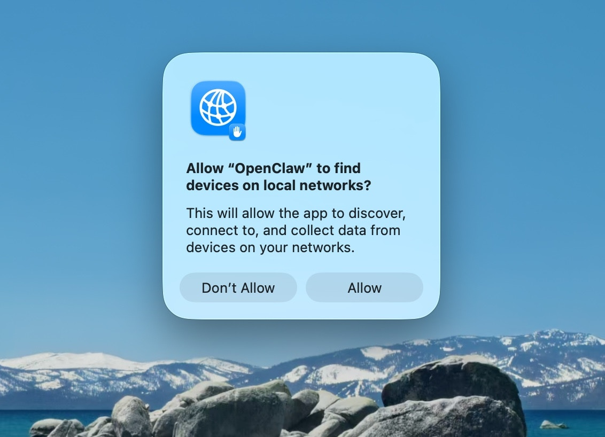
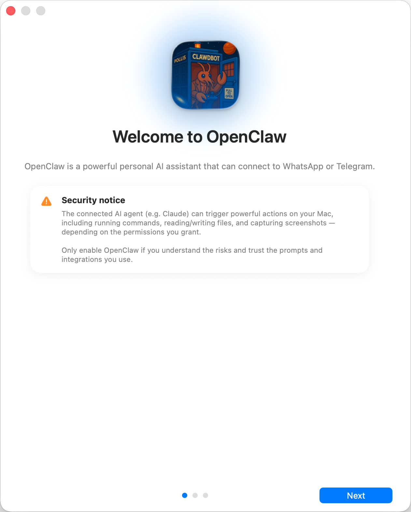
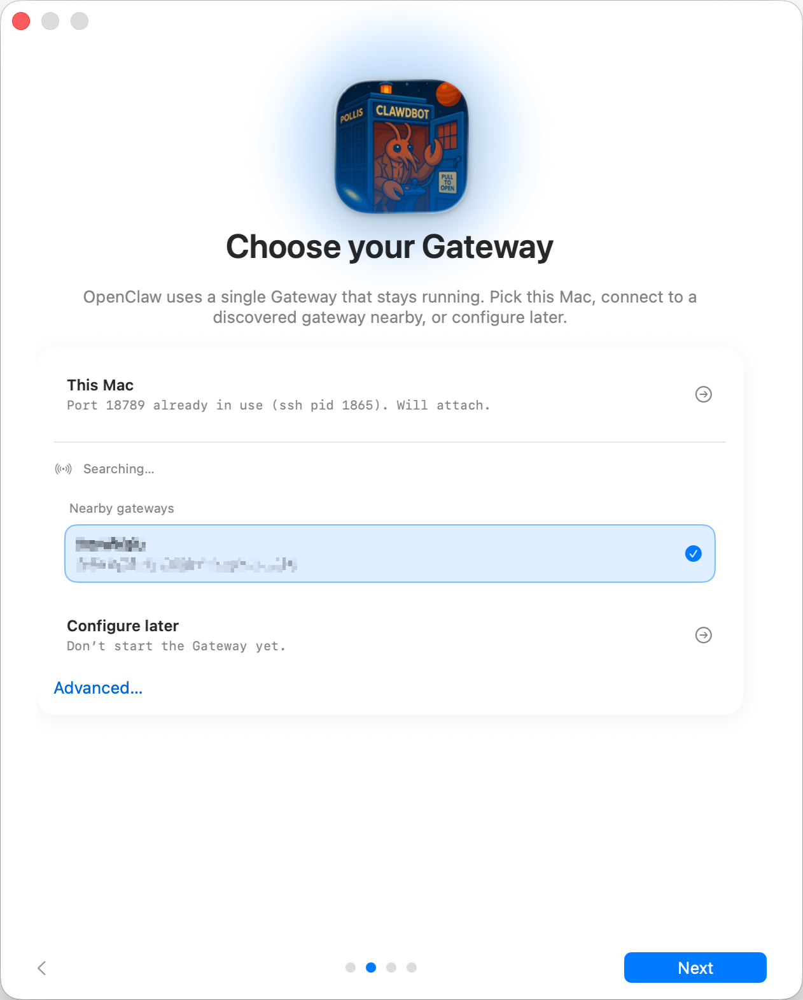
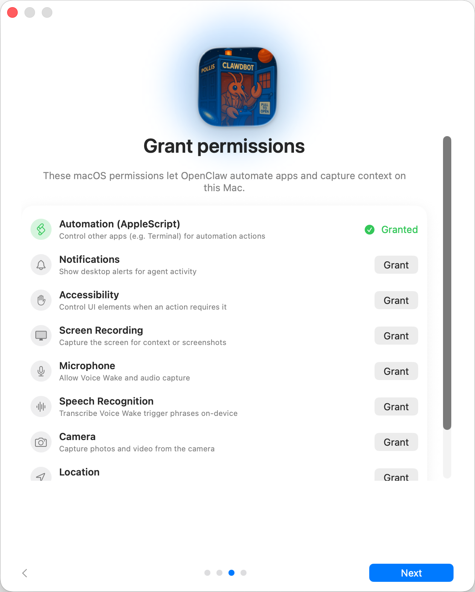

+++
title = "Onboarding (macOS App)"
date = 2026-04-03T08:36:08+08:00
weight = 30
type = "docs"
description = ""
isCJKLanguage = true
draft = false

+++

# Onboarding (macOS App)

This doc describes the **current** first‑run setup flow. The goal is a smooth “day 0” experience: pick where the Gateway runs, connect auth, run the wizard, and let the agent bootstrap itself. For a general overview of onboarding paths, see [Onboarding Overview](https://docs.openclaw.ai/start/onboarding-overview).

​	本文档介绍了 **当前** 的首次运行设置流程。其目标是实现流畅的“第0天”体验：选择 Gateway 运行位置、连接身份验证、运行向导并让代理自动完成引导。有关入职路径的总体概述，请参阅 [Onboarding 概述](https://docs.openclaw.ai/start/onboarding-overview)。

1) Approve macOS warning 批准macOS警告

2) Approve find local networks 允许查找本地网络

3) Welcome and security notice 欢迎与安全提示

Read the security notice displayed and decide accordingly

​	阅读显示的安全通知并据此做出决定

Security trust model: 安全信任模型：

- By default, OpenClaw is a personal agent: one trusted operator boundary.
  - 默认情况下，OpenClaw 是一款个人agent：拥有一个受信任的操作边界。
- Shared/multi-user setups require lock-down (split trust boundaries, keep tool access minimal, and follow [Security](https://docs.openclaw.ai/gateway/security)).
  - 共享/多用户设置需要进行锁定（划分信任边界，最大限度减少工具访问权限，并遵循[安全](https://docs.openclaw.ai/gateway/security)规范）。
- Local onboarding now defaults new configs to `tools.profile: "coding"` so fresh local setups keep filesystem/runtime tools without forcing the unrestricted `full` profile.
  - 本地 onboarding 流程现在将新配置默认设置为 `tools.profile: "coding"`，因此全新的本地设置可保留文件系统/运行时工具，同时无需强制启用无限制的 `full` 配置。
- If hooks/webhooks or other untrusted content feeds are enabled, use a strong modern model tier and keep strict tool policy/sandboxing.
  - 如果启用了 hooks/webhooks 或其他不可信的内容源，请使用功能强大的现代模型层级，并执行严格的工具策略/沙箱防护。

4) Local vs Remote 本地与远程

Where does the **Gateway** run?  **Gateway**运行在何处？

- **This Mac (Local only):** onboarding can configure auth and write credentials locally.
  - **此 Mac（仅限本地）：** onboarding 流程可在本地配置身份验证并写入凭据
- **Remote (over SSH/Tailnet):** onboarding does **not** configure local auth; credentials must exist on the gateway host.
  - **远程（通过 SSH/Tailnet）：**onboarding 流程**不**配置本地身份验证；gateway 主机上必须已存在凭据。
- **Configure later:** skip setup and leave the app unconfigured.
  - **稍后配置：**跳过设置，保持应用未配置状态。

> **Gateway auth tip:** **Gateway 身份验证提示：**
>
> - The wizard now generates a **token** even for loopback, so local WS clients must authenticate.
>   - 现在即便用回环连接，向导也会生成一个**令牌**，因此本地的 WebSocket 客户端必须进行身份验证。
> - If you disable auth, any local process can connect; use that only on fully trusted machines.
>   - 如果你禁用身份验证，任何本地进程都可以连接；仅可在完全受信任的设备上使用此设置。
> - Use a **token** for multi‑machine access or non‑loopback binds.
>   - 使用**令牌**进行多机器访问或非回环绑定。

5) Permissions 权限

Choose what permissions do you want to give OpenClaw

​	选择你想授予 OpenClaw 的权限

Onboarding requests TCC permissions needed for:

​	首次使用时需要的 TCC 权限：

- Automation (AppleScript)
- Notifications
- Accessibility 辅助功能
- Screen Recording 屏幕录制
- Microphone
- Speech Recognition 语音识别
- Camera
- Location

6) CLI

> This step is optional

The app can install the global `openclaw` CLI via npm/pnpm so terminal workflows and launchd tasks work out of the box.

​	该应用可通过 npm/pnpm 安装全局 `openclaw` CLI ，因此终端工作流和 launchd 任务可直接使用。

7) Onboarding Chat (dedicated session) Onboarding 聊天（专属会话）

After setup, the app opens a dedicated onboarding chat session so the agent can introduce itself and guide next steps. This keeps first‑run guidance separate from your normal conversation. See [Bootstrapping](https://docs.openclaw.ai/start/bootstrapping) for what happens on the gateway host during the first agent run.

​	设置完成后，应用会打开一个专属的 onboarding 聊天会话，以便 agent 进行自我介绍并指导后续步骤。这会将首次启动时的引导内容与你的正常对话区分开来。有关 agent 首次运行时 gateway 节点主机上发生的情况，请参阅[Bootstrapping](https://docs.openclaw.ai/start/bootstrapping)。
