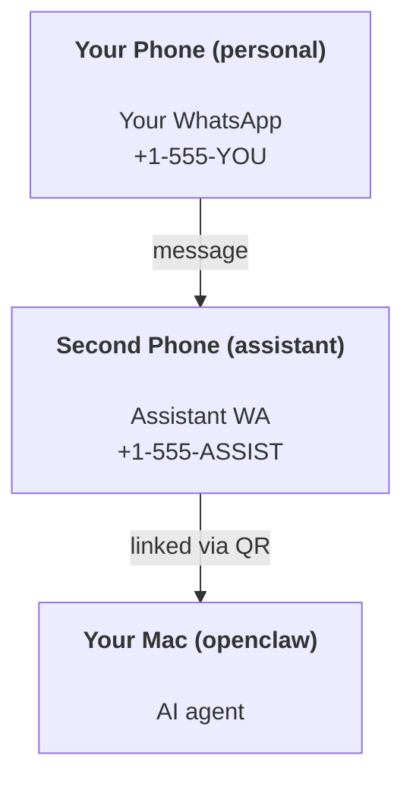

+++
title = "个人助手设置"
date = 2026-04-02T20:09:59+08:00
weight = 40
type = "docs"
description = ""
isCJKLanguage = true
draft = false

+++

# Personal Assistant Setup

OpenClaw is a self-hosted gateway that connects WhatsApp, Telegram, Discord, iMessage, and more to AI agents. This guide covers the “personal assistant” setup: a dedicated WhatsApp number that behaves like your always-on AI assistant.

​	OpenClaw 是一款自托管网关，可将 WhatsApp、Telegram、Discord、iMessage 等平台与智能体相连接。本指南将介绍“个人助手”的设置方法：一个专属的 WhatsApp 号码，可充当你全天候在线的人工智能助手。

## ⚠️ Safety first 安全第一

You’re putting an agent in a position to:

​	你让 agent 处于这样的境地：

- run commands on your machine (depending on your tool policy)
  - 在你的设备上运行命令（取决于你的工具策略）

- read/write files in your workspace
  - 在你的工作区中读写文件

- send messages back out via WhatsApp/Telegram/Discord/Mattermost (plugin)
  - 通过 WhatsApp、Telegram、Discord 或 Mattermost（插件）向外回复消息


Start conservative: 

​	从保守设置开始：

- Always set `channels.whatsapp.allowFrom` (never run open-to-the-world on your personal Mac).
  - 始终设置 `channels.whatsapp.allowFrom`（切勿在个人 Mac 上设置为对所有人开放）。

- Use a dedicated WhatsApp number for the assistant.
  - 为助手使用一个专用的 WhatsApp 号码。

- Heartbeats now default to every 30 minutes. Disable until you trust the setup by setting `agents.defaults.heartbeat.every: "0m"`.
  - 心跳现在默认每30分钟一次。要在信任设置前禁用此功能，请设置 `agents.defaults.heartbeat.every: "0m"`。


## Prerequisites  前提条件

- OpenClaw installed and onboarded — see [Getting Started](https://docs.openclaw.ai/start/getting-started) if you haven’t done this yet
  - 已安装并完成 OpenClaw 的初始配置——如果尚未完成，请查看 [Getting Started](https://docs.openclaw.ai/start/getting-started)

- A second phone number (SIM/eSIM/prepaid) for the assistant
  - 为助手准备的第二个电话号码（SIM卡/电子卡/预付费卡）


## The two-phone setup (recommended) 

You want this:




If you link your personal WhatsApp to OpenClaw, every message to you becomes “agent input”. That’s rarely what you want.

​	如果你将个人 WhatsApp 账号与 OpenClaw 关联，那么发给你的每条消息都会变成“agent input”。这通常不是你想要的结果。

## 5-minute quick start 5分钟快速入门

1) Pair WhatsApp Web (shows QR; scan with the assistant phone):

​	配对 WhatsApp 网页版（显示二维码；用助手手机扫描）：

```sh
openclaw channels login
```

2) Start the Gateway (leave it running):

​	启动 Gateway （保持其运行）：

```sh
openclaw gateway --port 18789
```

3) Put a minimal config in `~/.openclaw/openclaw.json`:

​	在 `~/.openclaw/openclaw.json` 中放入最小配置：

```json
{
  channels: { whatsapp: { allowFrom: ["+15555550123"] } },
}
```

Now message the assistant number from your allowlisted phone.

​	现在用你的授权号码给助手号码发消息。

When onboarding finishes, we auto-open the dashboard and print a clean (non-tokenized) link. If it prompts for auth, paste the token from `gateway.auth.token` into Control UI settings. To reopen later: `openclaw dashboard`.

​	onboarding 流程完成后，我们会自动打开控制面板并打印一个干净的（未标记化）链接。如果系统提示需要身份验证，请将`gateway.auth.token`中的令牌粘贴到控制面板用户界面设置中。之后要重新打开：`openclaw dashboard`。

## Give the agent a workspace (AGENTS) 为agent 创建一个工作区（AGENTS）

OpenClaw reads operating instructions and “memory” from its workspace directory.

​	OpenClaw 从其工作区目录读取操作指令和“memory”。

By default, OpenClaw uses `~/.openclaw/workspace` as the agent workspace, and will create it (plus starter `AGENTS.md`, `SOUL.md`, `TOOLS.md`, `IDENTITY.md`, `USER.md`, `HEARTBEAT.md`) automatically on setup/first agent run. `BOOTSTRAP.md` is only created when the workspace is brand new (it should not come back after you delete it). `MEMORY.md` is optional (not auto-created); when present, it is loaded for normal sessions. Subagent sessions only inject `AGENTS.md` and `TOOLS.md`.

​	默认情况下，OpenClaw 使用`~/.openclaw/workspace`作为 agent 工作区，并会在设置/首次运行智能体时自动创建该工作区（以及初始的`AGENTS.md`、`SOUL.md`、`TOOLS.md`、`IDENTITY.md`、`USER.md`、`HEARTBEAT.md`）。`BOOTSTRAP.md`仅在工作区为全新创建时生成（删除后不应再出现）。`MEMORY.md`为可选文件（不会自动创建）；存在时，会在常规会话中加载。子 agent 会话仅会加载`AGENTS.md`和`TOOLS.md`。

> Tip: treat this folder like OpenClaw’s “memory” and make it a git repo (ideally private) so your `AGENTS.md` + memory files are backed up. If git is installed, brand-new workspaces are auto-initialized.
>
> ​	提示：将此文件夹(`~/.openclaw/workspace`)视为 OpenClaw 的“memory”，并将其设为 git 仓库（最好是私有仓库），这样你的`AGENTS.md`和内存文件就能得到备份。如果已安装 git，全新的工作区会自动完成初始化。


```sh
openclaw setup
```

Full workspace layout + backup guide: [Agent workspace](https://docs.openclaw.ai/concepts/agent-workspace) Memory workflow: [Memory](https://docs.openclaw.ai/concepts/memory)

​	完整的工作区布局与备份指南：[Agent 工作区](https://docs.openclaw.ai/concepts/agent-workspace)内存工作流程：[Memory](https://docs.openclaw.ai/concepts/memory)

Optional: choose a different workspace with `agents.defaults.workspace` (supports `~`).

​	可选：使用`agents.defaults.workspace`选择其他工作区（支持`~`）。

```
{
  agent: {
    workspace: "~/.openclaw/workspace",
  },
}
```

If you already ship your own workspace files from a repo, you can disable bootstrap file creation entirely:

​	如果你已经从代码仓库部署了自己的工作区文件，你可以完全禁用 bootstrap 文件的创建：

```
{
  agent: {
    skipBootstrap: true,
  },
}
```

## The config that turns it into “an assistant” 将其转变为“助手”的配置

OpenClaw defaults to a good assistant setup, but you’ll usually want to tune:

​	OpenClaw 默认采用优质助手配置，但你通常需要对以下内容进行调整：

- persona/instructions in `SOUL.md`
  - `SOUL.md` 中的角色设定/指令

- thinking defaults (if desired)
  - 思考默认设置（如有需要）

- heartbeats (once you trust it)
  - 心跳（一旦你对它有信心）


Example:

​	示例：

```
{
  logging: { level: "info" },
  agent: {
    model: "anthropic/claude-opus-4-6",
    workspace: "~/.openclaw/workspace",
    thinkingDefault: "high",
    timeoutSeconds: 1800,
    // Start with 0; enable later.
    heartbeat: { every: "0m" },
  },
  channels: {
    whatsapp: {
      allowFrom: ["+15555550123"],
      groups: {
        "*": { requireMention: true },
      },
    },
  },
  routing: {
    groupChat: {
      mentionPatterns: ["@openclaw", "openclaw"],
    },
  },
  session: {
    scope: "per-sender",
    resetTriggers: ["/new", "/reset"],
    reset: {
      mode: "daily",
      atHour: 4,
      idleMinutes: 10080,
    },
  },
}
```

## Sessions and memory  会话与记忆

- Session files: `~/.openclaw/agents/<agentId>/sessions/{{SessionId}}.jsonl`
  - 会话文件：`~/.openclaw/agents/<agentId>/sessions/{{SessionId}}.jsonl`

- Session metadata (token usage, last route, etc):  会话元数据（令牌使用情况、最后路由等）：`~/.openclaw/agents/<agentId>/sessions/sessions.json` (legacy: `~/.openclaw/sessions/sessions.json`)
- `/new` or `/reset` starts a fresh session for that chat (configurable via `resetTriggers`). If sent alone, the agent replies with a short hello to confirm the reset.
  - `/new` 或 `/reset` 会为该聊天开启一个全新的会话（可通过 `resetTriggers` 进行配置）。如果单独发送该指令，智能体将回复一句简短的问候以确认重置操作。

- `/compact [instructions]` compacts the session context and reports the remaining context budget.
  - `/compact [instructions]` 压缩会话上下文并报告剩余上下文预算。


## Heartbeats (proactive mode) 心跳（主动模式）

By default, OpenClaw runs a heartbeat every 30 minutes with the prompt: `Read HEARTBEAT.md if it exists (workspace context). Follow it strictly. Do not infer or repeat old tasks from prior chats. If nothing needs attention, reply HEARTBEAT_OK.` Set `agents.defaults.heartbeat.every: "0m"` to disable.

​	默认情况下，OpenClaw 每 30 分钟运行一次心跳提示：`Read HEARTBEAT.md if it exists (workspace context). Follow it strictly. Do not infer or repeat old tasks from prior chats. If nothing needs attention, reply HEARTBEAT_OK.`将 `agents.defaults.heartbeat.every: "0m"` 设置为禁用心跳功能。

- If `HEARTBEAT.md` exists but is effectively empty (only blank lines and markdown headers like `# Heading`), OpenClaw skips the heartbeat run to save API calls.
  - 如果 `HEARTBEAT.md` 文件存在但实际上为空（仅包含空行和 `# Heading` 这类 Markdown 标题），OpenClaw 会跳过心跳检测以节省 API 调用次数。

- If the file is missing, the heartbeat still runs and the model decides what to do.
  - 如果该文件不存在，心跳检测仍会运行，由模型决定后续操作。

- If the agent replies with `HEARTBEAT_OK` (optionally with short padding; see `agents.defaults.heartbeat.ackMaxChars`), OpenClaw suppresses outbound delivery for that heartbeat.
  - 如果 agent 回复 `HEARTBEAT_OK`（可附带简短填充内容；参见 `agents.defaults.heartbeat.ackMaxChars`），OpenClaw 会抑制该心跳包的外发投递。

- By default, heartbeat delivery to DM-style `user:<id>` targets is allowed. Set `agents.defaults.heartbeat.directPolicy: "block"` to suppress direct-target delivery while keeping heartbeat runs active.
  - 默认情况下，允许将心跳信息发送到 DM 格式的 `user:<id>` 目标。设置 `agents.defaults.heartbeat.directPolicy: "block"` 可在保持心跳运行处于活动状态的同时，禁止直接目标发送。

- Heartbeats run full agent turns — shorter intervals burn more tokens.
  - 心跳执行完整的 agent 回合——间隔越短消耗的令牌越多。


```json
{
  agent: {
    heartbeat: { every: "30m" },
  },
}
```

## Media in and out 媒体接入与传出

Inbound attachments (images/audio/docs) can be surfaced to your command via templates:

​	入站附件（图片/音频/文档）可通过模板在你的指令中显示：

- `{{MediaPath}}` (local temp file path) 本地临时文件路径
- `{{MediaUrl}}` (pseudo-URL) 伪URL
- `{{Transcript}}` (if audio transcription is enabled) 如果启用了音频转录功能

Outbound attachments from the agent: include `MEDIA:<path-or-url>` on its own line (no spaces). Example:

​	agent 发出的外部附件：需单独一行（无空格）包含 ``MEDIA:<path-or-url>``。示例：

```txt
Here’s the screenshot.
MEDIA:https://example.com/screenshot.png
```

OpenClaw extracts these and sends them as media alongside the text. 

​	OpenClaw 提取这些内容，并将其作为媒体与文本一同发送。

Local-path behavior follows the same file-read trust model as the agent:

​	本地路径的行为遵循与 agent 相同的文件读取信任模型：

- If `tools.fs.workspaceOnly` is `true`, outbound `MEDIA:` local paths stay restricted to the OpenClaw temp root, the media cache, agent workspace paths, and sandbox-generated files.
  - 如果 `tools.fs.workspaceOnly` 为 `true`，则出站的 `MEDIA:` 本地路径将仍限制在 OpenClaw 临时根目录、媒体缓存、代理工作区路径以及沙箱生成的文件范围内。

- If `tools.fs.workspaceOnly` is `false`, outbound `MEDIA:` can use host-local files the agent is already allowed to read.
  - 如果 `tools.fs.workspaceOnly` 为 `false`，出站 `MEDIA:` 可使用代理已被允许读取的主机本地文件。

- Host-local sends still only allow media and safe document types (images, audio, video, PDF, and Office documents). Plain text and secret-like files are not treated as sendable media.
  - 本地主机发送仍仅允许媒体和安全文档类型（图片、音频、视频、PDF 以及 Office 文档）。纯文本和类似机密的文件不被视为可发送的媒体。


That means generated images/files outside the workspace can now send when your fs policy already allows those reads, without reopening arbitrary host-text attachment exfiltration.

​	这意味着，当你的文件系统策略已允许读取工作区之外的生成图像/文件时，现在就可以发送这些内容了，无需重新开启任意主机文本附件的数据窃取风险。

## Operations checklist  操作清单


```sh
openclaw status          # local status (creds, sessions, queued events)
openclaw status --all    # full diagnosis (read-only, pasteable)
openclaw status --deep   # adds gateway health probes (Telegram + Discord)
openclaw health --json   # gateway health snapshot (WS)
```

Logs live under `/tmp/openclaw/` (default: `openclaw-YYYY-MM-DD.log`).

​	日志存放在 `/tmp/openclaw/` 目录下（默认文件名为 `openclaw-YYYY-MM-DD.log`）。

## Next steps 

- WebChat: [WebChat](https://docs.openclaw.ai/web/webchat)
- Gateway ops: [Gateway runbook](https://docs.openclaw.ai/gateway)
- Cron + wakeups: [Cron jobs](https://docs.openclaw.ai/automation/cron-jobs)
- macOS menu bar companion: [OpenClaw macOS app](https://docs.openclaw.ai/platforms/macos)
- iOS node app: [iOS app](https://docs.openclaw.ai/platforms/ios)
- Android node app: [Android app](https://docs.openclaw.ai/platforms/android)
- Windows status: [Windows (WSL2)](https://docs.openclaw.ai/platforms/windows)
- Linux status: [Linux app](https://docs.openclaw.ai/platforms/linux)
- Security: [Security](https://docs.openclaw.ai/gateway/security)
