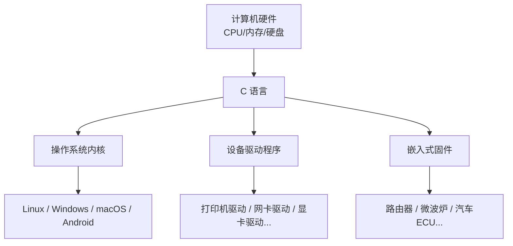
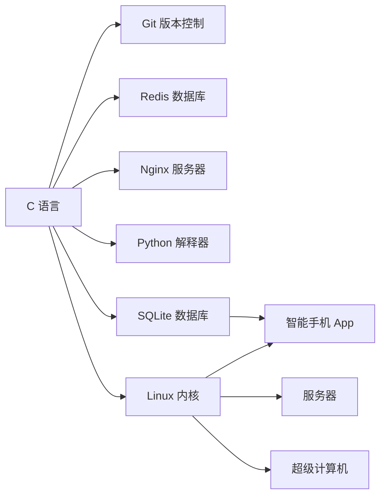

+++
title = "第 1 章：C 语言简介与历史演变"
weight = 10
date = "2026-03-29T22:34:00+08:00"
type = "docs"
description = ""
isCJKLanguage = true
draft = false
+++

# 第 1 章：C 语言简介与历史演变

想象一下，你穿越回了 1972 年的美国贝尔实验室。那时候的计算机还是个庞然大物——占用整栋楼的空调房，内存只有几十 KB，屏幕上跳动着绿色的字符。程序员们还在用汇编语言和机器直接对话，每写一行代码都得告诉 CPU "把这个寄存器里的数加到那个地址上去"。

就在这时，一个叫 Dennis Ritchie 的家伙和他的同事 Ken Thompson 坐在一起，干了一件改变世界的事——他们发明了 C 语言。

> 有趣的历史八卦：C 语言的名字来源于 BCPL（Basic Combined Programming Language），但 Ritchie 最终把它叫做 "C"，据说只是因为它是 BCPL 后面的一个字母。就像你给猫取名叫"猫"一样随性。

本章我们就来扒一扒这门古老又常青的编程语言的前世今生。

---

## 1.1 C 语言的诞生

1972 年，Dennis Ritchie 在贝尔实验室的 DEC PDP-11 计算机上成功开发出了 C 语言。那时候，Unix 操作系统也刚刚诞生（最初是用汇编语言写的），Ritchie 和 Thompson 决定用 C 语言重写 Unix。事实证明，这是一个极其明智的决定——Unix 后来成为了现代操作系统的祖师爷，而 C 语言则成为了编程语言的祖师爷之一。

### 故事要从 B 语言说起

在 C 语言之前，Ken Thompson 先搞出了 B 语言（灵感来自 BCPL）。B 语言是个比较简陋的家伙， Ritchie 嫌弃它功能不够强，于是在 B 的基础上"魔改"出了 C。所以准确地说，C 语言是"站在巨人肩膀上"的产物。

> 程序员之间的代际关系就是这么朴实无华：BCPL → B → C → Unix → Linux → Android → 你手机里的一切 App。

### C 语言的设计哲学

C 语言的设计理念是**简洁、高效、贴近硬件**。Ritchie 的核心思想是：

- **相信程序员**：给程序员最大的自由度，不做过多的安全检查
- **keep it simple**：语言特性尽量少，但每一条都很有用
- **性能为王**：生成的机器码要快，占用资源要少

这套哲学让 C 语言成为了"程序员的瑞士军刀"——小巧但功能强大，锋利但需要小心使用。

---

## 1.2 为什么选择 C 语言？

你可能会问：现在有 Python、JavaScript、Go、 Rust 这么多高级语言，为什么还要学 C？好问题！让我们掰开揉碎地聊一聊。

### 贴近硬件，想怎么玩就怎么玩

C 语言最厉害的地方就是它**几乎没有抽象**。你看 Python 里一个整数是什么？它是个对象，有类型，有方法，有内存管理。但在 C 里，一个 `int` 就是 4 个字节的原始数据，你可以对它做任何操作——包括把它当成一串二进制位来位运算，或者把它的内存地址拿出来到处传。

```c

#include <stdio.h>

int main() {
    int a = 42;
    int *ptr = &a;  // & 是取地址运算符，ptr 存的是 a 的内存地址

    printf("a 的值是: %d\n", a);          // 输出: a 的值是: 42
    printf("a 的地址是: %p\n", (void*)ptr); // 输出: a 的地址是: 0x...（十六进制地址）

    *ptr = 100;  // 通过指针修改 a 的值，C 允许你这么干！

    printf("修改后 a 的值是: %d\n", a);    // 输出: 修改后 a 的值是: 100

    return 0;
}

```

> 指针（pointer）是 C 语言的灵魂，也是让很多人又爱又恨的特性。你可以把它理解成一张写着"某人家门牌号"的纸条——通过这个号码，你能找到那户人家，甚至进去翻箱倒柜。

### 性能极致，没有中间商赚差价

C 语言是**编译型语言**，你的代码会直接被翻译成 CPU 能懂的机器码，没有虚拟机、没有解释器、没有运行时来拖后腿。

这就好比：

- Python 是叫外卖：有人帮你做饭、送餐，你等着吃就行（但得多付配送费）
- C 语言是自己做饭：去菜市场买菜，回来切菜炒菜，全程自己掌控（但你得会做）

同样的算法，用 C 写出来往往比 Python 快几十倍甚至上百倍。所以那些对性能有极致要求的核心模块，通常都是 C 写的。

### 系统级开发的不二之选

什么是"系统级开发"？就是开发操作系统、设备驱动、嵌入式系统、编译器这些东西——它们需要直接和硬件打交道，需要精确控制每一字节内存，需要极致的运行效率。

C 语言就是为这种场景而生的。Linux 内核、Windows 内核的底层、macOS 的核心组件、Android 的底层、嵌入式设备固件……全都有 C 的身影。

### 可移植性——一次编写，遍地运行

C 语言还有一个超级大招：**可移植性**。只要你写的代码只使用标准 C 规定的特性，理论上在任何一个平台上都能编译运行（只要那个平台有 C 编译器）。

这是因为 C 标准定义了语言本身和标准库的行为，但具体的实现（比如 `int` 到底占几个字节、函数调用约定是什么）交给编译器去决定。不同的硬件平台有不同的编译器，但只要它们都遵循同一个 C 标准，你的代码就能无缝迁移。

> 这就像你写中文信，只要内容不变，换个国家，找个翻译也能帮你传达意思（编译器就是那个翻译）。

---

## 1.3 C 语言的江湖地位

C 语言从诞生到现在已经走过了 50 多年，堪称编程语言界的"常青树"。它的影响力有多大？让我们来盘点一下。

### 操作系统——C 的主场

- **Linux 内核**：Linux 操作系统的心脏，几乎 100% 用 C 编写
- **Windows 内核**：Windows NT 内核的底层组件
- **macOS / iOS**：Darwin（苹果操作系统的核心）用 C 和 C++ 写成
- **Android 底层**：Android 的核心系统服务（binder、ashmem 等）都是 C



### 编程语言的"老母亲"

很多你现在常用的编程语言，最初都是用 C 写的，或者借鉴了 C 的设计思想：

- **C++**：C 语言的超集，最初叫 "C with Classes"
- **Java**：虚拟机设计借鉴了 C
- **Python**：解释器 CPython 是 C 写的
- **JavaScript**：V8 引擎是 C++ 写的（但语法设计受 C 影响很深）
- **Go**：runtime 部分借鉴了 C 的设计
- **Rust**：虽然没有用 C 实现，但语法和内存模型也深受 C 影响

> 换句话说，如果你学好了 C，再学其他语言会感觉轻松很多——因为很多语法糖都是 C 玩剩下的。

### 经典工具软件

- **Git**：没错，你每天用的 Git 版本控制系统，就是 Linus Torvalds 用 C 语言写的
- **Redis**：高性能内存数据库，核心代码是 C
- **Nginx**：高性能 Web 服务器，扛得住海量并发
- **MySQL**：最流行的开源数据库之一，核心是 C/C++
- **Python 解释器 CPython**：就是 C 写的



### 嵌入式和物联网

MCU（微控制器）、物联网设备、单片机开发——这些领域 C 语言几乎是**唯一的选择**。因为这些设备内存极小（几 KB 到几 MB）、没有操作系统、没有文件系统，你只能用 C 这种高效、可控、占用资源少的语言。

- STM32、Arduino、ESP32 开发——C/C++
- 路由器、交换机固件——C
- 汽车电子控制单元（ECU）——C

---

## 1.4 C 语言能做什么？不能做什么？

任何语言都有自己的擅长的领域和短板。C 语言也不例外。知道它的边界在哪里，和知道它能做什么一样重要。

### C 语言的强项 ✅

| 领域 | 说明 | 典型代表 |
|------|------|---------|
| 操作系统开发 | 直接操作硬件，极致性能 | Linux、Windows 内核 |
| 嵌入式开发 | 资源受限环境，无所不能 | STM32、ESP32 |
| 编译器开发 | 需要生成机器码 | GCC、Clang |
| 数据库开发 | 高性能数据处理 | MySQL、Redis、SQLite |
| 游戏引擎底层 | 渲染引擎、物理引擎 | Unreal Engine 核心 |
| 网络协议栈 | 底层通信 | TCP/IP 协议实现 |
| 驱动开发 | 硬件和操作系统的桥梁 | 显卡驱动、网卡驱动 |

### C 语言的短板 ❌

> 重要的事情说三遍：C 语言不是万能药！C 语言不是万能药！C 语言不是万能药！

- **Web 后端开发**：你当然可以用 C 写一个 Web 服务器（nginx 就是这么干的），但对于大多数业务逻辑，Python/Java/Go/Node.js 效率高得多。C 写 Web 的开发周期太长，bug 满天飞，性价比极低。

- **GUI 应用开发**：桌面图形界面程序、手机 App——这类东西用 C 也能做，但难度堪比登天。现代 UI 框架都是 C++/C#/Java/Swift/Flutter 写的，用 C 就是自讨苦吃。

- **复杂业务逻辑**：ERP 系统、电商平台、银行核心系统——这些需要大量数据结构、业务规则、人员协作的项目，用 C 写的维护成本高到离谱。这种场景 Java/C#/Go 是更好的选择。

- **大型团队协作项目**：C 对程序员要求极高，一个野指针就能让整个程序崩溃。几百人同时维护一个 C 项目，那叫一个酸爽。

### 灵魂拷问：我该学 C 吗？

学 C 语言的理由：

- 你想理解计算机底层是怎么工作的
- 你要搞嵌入式 / 操作系统 / 编译器开发
- 你想打下扎实的编程基础（C 是很多计算机课程的标配）
- 你需要极致性能优化

不学 C 也可以的理由：

- 你只想快速做 Web / App 开发
- 你更喜欢上层抽象，不想纠结内存管理
- 你的目标是数据科学 / AI / 机器学习（Python 更适合）

---

## 1.5 C 标准演进史

C 语言从 1972 年诞生到现在，并不是一成不变的。它经历了多个标准的迭代，每一次更新都带来了新的特性，同时也保留了对旧代码的兼容性（大部分情况下）。

但是在聊标准之前，我们得先搞清楚三个重要的概念：

### 重要术语提前解释

**implementation-defined（实现定义行为）**：这种行为是标准要求存在的，但具体的细节**由编译器自己决定**，并且**编译器必须文档化**它。比如：

```c
#include <stdio.h>

int main() {
    // sizeof(int) 在不同平台上可能不同
    // 这是 implementation-defined —— 编译器必须告诉你 int 占几个字节
    printf("int 类型的大小是: %zu 字节\n", sizeof(int));
    // 输出（取决于你的编译器）:
    // 在大多数 32 位系统上可能是: 4
    // 在一些老系统上可能是: 2

    return 0;
}
```

**undefined behavior（未定义行为）**：这种行为是标准没有定义的，编译器可以**任意处理**——包括正常工作、输出错误结果、甚至让你的电脑冒烟（理论上）。写 C 程序最怕的就是这个。

```c
#include <stdio.h>

int main() {
    int a[3] = {1, 2, 3};
    int *p = &a[0];
    p = p + 5;  // 越界访问数组！这是 undefined behavior
    printf("%d\n", *p);  // 天知道会输出什么！

    return 0;
}
```

**unspecified behavior（未指定行为）**：标准没有规定具体行为，但结果**是确定的**（取决于实现），编译器可能选择不同的合法方式。比如函数参数的求值顺序。

```c
#include <stdio.h>

int func(int x, int y) {
    return x + y;
}

int main() {
    int i = 5;
    // 这里 func 的两个参数哪个先求值？标准没说！
    // 可能是 10+10=20，也可能是 10+5=15（取决于编译器）
    printf("%d\n", func(10, i++));
    return 0;
}
```

> 记住：implementation-defined 是有据可查的，undefined behavior 是天马行空的，unspecified behavior 是标准放权给编译器的。

---

### 1.5.1 K&R C（1978，非标准时代）

1978 年，Dennis Ritchie 和 Brian Kernighan 联手出版了一本神书——《The C Programming Language》（就是传说中的 K&R）。这本书不仅是 C 语言的教材，更成了事实上的标准。

> 这本书的封面长这样：一个白色背景，简洁到不能再简洁。所以后来的 C 标准也沿用了这种简洁风格。

K&R C 是**非官方标准**，但它被广泛接受和遵循。这个版本的 C 语言特性相对原始：

- 没有标准库的概念（stdio.h 之类的是后来才标准化的）
- 函数参数类型检查很弱
- 没有 `void` 关键字（函数不返回值就用 `int`）
- 没有统一的代码风格

```c

/* K&R 风格的函数定义（没有声明参数类型） */
int add(a, b)
int a;
int b;
{
    return a + b;
}

/* 现代 C 风格是这样的： */
int add(int a, int b) {
    return a + b;
}

```

K&R C 时代还有一个有意思的事情：`printf` 里的 `%d` 和 `%s` 那些格式化符号，就是这时候定下来的。

---

### 1.5.2 C89 / ANSI C / ISO C90 —— 首个官方标准

1983 年，美国国家标准协会（ANSI）开始着手制定 C 语言标准。1989 年，C89（也叫 ANSI C 或 C90）正式诞生。1990 年，国际标准化组织（ISO）等效采纳了这个标准，所以它也叫 ISO C90。

**C89 = C90**：这两个名字指的是同一个标准，只是 ANSI 先通过，ISO 后采纳而已。

C89 是 C 语言的第一个**官方标准**，它规定了：

- C 语言的语法和语义
- 标准库函数（`stdio.h`、`stdlib.h`、`string.h` 等）
- 预处理器指令（`#include`、`#define` 等）

```c

#include <stdio.h>  /* 标准输入输出库 */

/* 这是一个完整的 C89 程序 */
int main(void) {
    char name[50];  /* 字符数组，存字符串用的 */
    int age;

    printf("请输入你的名字: ");  /* 输出到屏幕 */
    scanf("%s", name);           /* 从键盘读取 */

    printf("请输入你的年龄: ");
    scanf("%d", &age);           /* & 是取地址符 */

    printf("你好，%s！你今年 %d 岁了。\n", name, age);
    /* 输出示例: 你好，张三！你今年 25 岁了。 */

    return 0;
}

```

C89 的影响力极其深远。Windows API、POSIX 标准、Unix 系统调用——几乎所有 90 年代的系统级软件都是基于 C89 写的。直到今天，很多老代码仍然要求"兼容 C89"。

---

### 1.5.3 C95 —— 第一次修正案

1994 年，ISO 发布了 C 语言的第一个修正案——C95（ISO/IEC 9899:1990 Amendment 1）。

这次修正案主要增加了**国际化支持**和**一些有用的库函数**：

- `<iso646.h>`：提供了一些运算符的替代拼写，比如 `and` 代替 `&&`，`or` 代替 `||`，`not` 代替 `!`。这主要是为了照顾某些国家键盘上没有 `&`、`|`、`!` 键的人。

```c

#include <stdio.h>
#include <iso646.h>  /* 替代运算符拼写 */

int main(void) {
    int a = 5;
    int b = 3;

    if (a > 0 and b > 0) {           /* 等价于 if (a > 0 && b > 0) */
        printf("a 和 b 都是正数\n");
    }

    if (not (a == b)) {              /* 等价于 if (!(a == b)) */
        printf("a 和 b 不相等\n");
    }

    return 0;
}

```

- `<wchar.h>`：**宽字符**支持，用于处理非英文字符（比如中文、日文）。`wchar_t` 类型可以表示更大的字符集。

```c

#include <stdio.h>
#include <wchar.h>

int main(void) {
    wchar_t chinese[] = L"你好，世界";  /* L 前缀表示宽字符串 */
    wprintf(L"%ls\n", chinese);         /* 输出: 你好，世界 */
    return 0;
}

```

- `<wctype.h>`：**宽字符分类**，用来判断一个宽字符是什么类型（比如是不是数字、是不是字母、是不是空格）。

```c

#include <stdio.h>
#include <wctype.h>
#include <wchar.h>

int main(void) {
    wint_t ch = L'A';

    if (iswalpha(ch)) {    /* 判断是否是字母 */
        wprintf(L"'%lc' 是一个字母\n", ch);
    }

    if (iswdigit(L'5')) {  /* 判断是否是数字 */
        wprintf(L"'5' 是一个数字\n");
    }

    return 0;
}

```

#### ⚠️ 澄清 1：`//` 注释不是 C95 的特性

很多新手有个误解，以为 `//` 注释是 C95 引入的。这是**错的**！

实际上，`//` 注释（双斜杠注释）是从 C++ 那里借来的，但 C95 修正案并**没有正式标准化它**。直到 **C99**，`//` 才正式成为标准 C 的一部分。

> 所以如果你看到有人说 "这段代码是 C95 的，用了 // 注释"，你可以自信地指出这个错误。

#### ⚠️ 澄清 2：`char16_t` / `char32_t` 不是 C95 的特性

另一个常见误区：`char16_t` 和 `char32_t` 这两个 Unicode 字符类型，很多人以为它们是 C95 引入的。**这也是错的！**

`char16_t` 和 `char32_t` 是在 **C11** 才正式加入的。C95 只引入了 `<wchar.h>` 和宽字符的概念，但没有定义具体的 Unicode 类型。

---

### 1.5.4 C99 —— 现代化改革

1999 年，C 语言迎来了一个重要的版本——C99（ISO/IEC 9899:1999）。这次更新带来了大量新特性，让 C 语言变得更加现代化。

C99 的主要新特性：

#### `//` 单行注释正式加入

终于！双斜杠注释从 C99 开始正式合法化了：

```c

#include <stdio.h>

int main(void) {
    // 这是单行注释，C99 之前这是非标准的
    int x = 10;  // 行尾注释也行

    /*
     * 这是多行注释，
     * 从 C89 就有了。
     */
    printf("Hello, C99!\n");

    return 0;
}

```

#### `inline` 函数

`inline` 关键字建议编译器"把函数调用直接展开成函数体"，避免函数调用的开销。这个特性对于写高性能代码很有用。

```c

#include <stdio.h>

// inline 建议编译器内联这个函数
inline int max(int a, int b) {
    return (a > b) ? a : b;  /* 三目运算符：条件 ? 值1 : 值2 */
}

int main(void) {
    int a = 5, b = 8;
    int m = max(a, b);  // 编译器可能会直接展开成 m = (a > b) ? a : b;

    printf("最大值是: %d\n", m);  // 输出: 最大值是: 8

    return 0;
}

```

#### 变长数组（VLA, Variable Length Array）

C99 允许在函数内部使用变量来指定数组大小，这就是变长数组：

```c

#include <stdio.h>

int main(void) {
    int n = 10;

    // 数组大小由变量 n 决定，这是 C99 才支持的
    int arr[n];

    for (int i = 0; i < n; i++) {
        arr[i] = i * i;
    }

    for (int i = 0; i < n; i++) {
        printf("%d ", arr[i]);  // 输出: 0 1 4 9 16 25 36 49 64 81
    }
    printf("\n");

    return 0;
}

```

> 变长数组虽然方便，但有些编译器对 VLA 支持不太好（尤其是嵌入式场景）。C11 把 VLA 标记为可选特性，C23 则彻底废弃了它。

#### `for` 循环内声明变量

C99 允许在 `for` 循环的初始化部分声明变量：

```c

#include <stdio.h>

int main(void) {
    // C89 风格：变量必须在函数开头声明
    int i;
    int sum = 0;

    // C99 风格：在 for 循环里直接声明
    for (int i = 0; i <= 5; i++) {  // i 只在这个 for 循环里有效
        sum += i;
    }

    printf("1+2+3+4+5 = %d\n", sum);  // 输出: 1+2+3+4+5 = 15

    // C99 还允许在 while 条件里声明（但这不是标准，是 GCC 扩展）
    // int j = 0;
    // while (int k = j++) {  // 有些编译器支持，但标准 C 不允许

    return 0;
}

```

#### `<stdint.h>` 和 `<inttypes.h>` —— 固定宽度整数类型

这两个头文件让你可以精确控制整数类型的宽度，写跨平台代码时特别有用：

```c

#include <stdio.h>
#include <stdint.h>   // 固定宽度整数类型
#include <inttypes.h> // 格式说明符（PRI 和 SCN 宏）

int main(void) {
    int8_t  a = -10;      // 8位有符号整数，范围 -128~127
    int16_t b = 1000;     // 16位有符号整数
    int32_t c = 100000;   // 32位有符号整数
    int64_t d = 1000000;  // 64位有符号整数

    uint8_t  ua = 200;    // 8位无符号整数，范围 0~255
    uint64_t ud = 999999; // 64位无符号整数

    // printf 打印这些类型要用 inttypes.h 定义的格式宏
    printf("a=%" PRId8 ", b=%" PRId16 ", c=%" PRId32 ", d=%" PRId64 "\n",
           a, b, c, d);
    // 输出: a=-10, b=1000, c=100000, d=1000000

    return 0;
}

```

#### `_Bool` 和 `<stdbool.h>` —— 布尔类型

在 C99 之前，C 语言没有真正的布尔类型，用 `0` 表示假，`非0` 表示真。C99 引入了 `_Bool` 类型和 `<stdbool.h>` 头文件：

```c

#include <stdio.h>
#include <stdbool.h>  // 提供 bool, true, false

int main(void) {
    bool is_coding_fun = true;  // 布尔变量
    bool is_bug_free = false;

    if (is_coding_fun) {
        printf("编程很有趣！\n");  // 输出: 编程很有趣！
    }

    if (!is_bug_free) {
        printf("Bug 是不可避免的...\n");  // 输出: Bug 是不可避免的...
    }

    // bool 类型本质上是个整数，true = 1，false = 0
    printf("sizeof(bool) = %zu\n", sizeof(bool));  // 输出: sizeof(bool) = 1

    return 0;
}

```

#### `__func__` —— 函数名标识符

`__func__` 是一个预定义的标识符，它会展开成当前函数的名称，用于调试和日志输出：

```c

#include <stdio.h>

void hello(void) {
    printf("当前函数: %s\n", __func__);  // 输出: 当前函数: hello
}

int main(void) {
    printf("当前函数: %s\n", __func__);  // 输出: 当前函数: main
    hello();
    return 0;
}

```

#### `<complex.h>`、`<fenv.h>`、`<tgmath.h>`

- `<complex.h>`：复数支持
- `<fenv.h>`：浮点环境控制（舍入模式、异常等）
- `<tgmath.h>`：类型通用数学宏

这些是针对科学计算和数值分析场景的，一般 App 开发用不到。

---

### 1.5.5 C11 —— 现代化与多线程

2011 年，C11（ISO/IEC 9899:2011）正式发布。这是 C 语言历史上最重要的更新之一，引入了大量现代化特性，尤其是**原生多线程支持**。

#### `_Generic` —— 泛型选择

`_Generic` 类似于其他语言里的泛型/重载，可以根据表达式的类型选择不同的代码：

```c

#include <stdio.h>

// _Generic 根据 x 的类型选择打印方式
#define print_type(x) _Generic((x),      \
    int: "int",                          \
    float: "float",                      \
    double: "double",                    \
    char: "char",                        \
    char*: "字符串",                     \
    default: "未知类型"                  \
)

int main(void) {
    int a = 5;
    double b = 3.14;
    char *s = "hello";

    printf("a 的类型是: %s\n", print_type(a));    // int
    printf("b 的类型是: %s\n", print_type(b));    // double
    printf("s 的类型是: %s\n", print_type(s));    // 字符串

    return 0;
}

```

#### 多线程支持 —— `<threads.h>`

C11 引入了标准线程库，终于不用再依赖平台特定的 pthread 或者 Windows Thread 了：

```c

#include <stdio.h>
#include <threads.h>

// 线程要执行的函数
int thread_func(void *arg) {
    char *name = (char *)arg;
    for (int i = 0; i < 3; i++) {
        printf("%s 正在运行 (%d)\n", name, i);
        // 休眠 100 毫秒
        struct timespec ts = {0, 100000000};
        thrd_sleep(&ts, NULL);
    }
    return 0;  // 线程返回
}

int main(void) {
    thrd_t t1, t2;

    // 创建两个线程
    thrd_create(&t1, thread_func, "线程A");
    thrd_create(&t2, thread_func, "线程B");

    printf("主线程: 我启动了两个线程！\n");

    // 等待线程结束
    thrd_join(t1, NULL);
    thrd_join(t2, NULL);

    printf("主线程: 两个线程都完成了！\n");

    return 0;
}

```

#### `_Atomic` 原子操作

`_Atomic` 关键字用于声明原子类型，保证并发访问时的数据一致性：

```c

#include <stdio.h>
#include <threads.h>
#include <stdatomic.h>

_Atomic int counter = 0;  // 原子变量，多线程安全

int increment(void *arg) {
    (void)arg;  // 忽略参数
    for (int i = 0; i < 1000; i++) {
        atomic_fetch_add(&counter, 1);  // 原子加 1
    }
    return 0;
}

int main(void) {
    thrd_t t1, t2;

    thrd_create(&t1, increment, NULL);
    thrd_create(&t2, increment, NULL);

    thrd_join(t1, NULL);
    thrd_join(t2, NULL);

    // 如果没有原子操作，这个值可能不是 2000（竞态条件）
    // 使用 _Atomic 后，保证是 2000
    printf("counter = %d\n", counter);  // 输出: counter = 2000

    return 0;
}

```

#### 匿名结构体和匿名共用体

C11 支持在结构体内部直接定义匿名成员：

```c

#include <stdio.h>

struct Point {
    union {  // 匿名共用体
        struct { int x; int y; };  // 匿名结构体
        int coords[2];              // 也可以用数组访问
    };
};

int main(void) {
    struct Point p;
    p.x = 10;      // 直接访问 x（通过匿名结构体）
    p.y = 20;      // 直接访问 y

    printf("p.x=%d, p.y=%d\n", p.x, p.y);  // p.x=10, p.y=20

    // 也可以通过数组访问同一个内存
    printf("p.coords[0]=%d, p.coords[1]=%d\n", p.coords[0], p.coords[1]);
    // p.coords[0]=10, p.coords[1]=20

    return 0;
}

```

#### `_Alignas` 和 `_Alignof` —— 对齐控制

这两个关键字让你可以控制数据在内存中的对齐方式：

```c

#include <stdio.h>
#include <stdalign.h>

struct AlignedStruct {
    _Alignas(16) char data[13];  // 强制 16 字节对齐
};

int main(void) {
    printf("char 对齐: %zu\n", alignof(char));       // 1
    printf("int 对齐: %zu\n", alignof(int));          // 4（通常）
    printf("AlignedStruct 对齐: %zu\n", alignof(struct AlignedStruct)); // 16

    struct AlignedStruct s;
    printf("s 的地址: %p，对齐到: %zu\n",
           (void*)&s, alignof(struct AlignedStruct));

    return 0;
}

```

#### `_Static_assert` —— 编译时断言

`static_assert` 让你可以在编译时检查条件，如果不满足就报错：

```c

#include <stdio.h>
#include <assert.h>

// C11 的 _Static_assert（编译时断言）
_Static_assert(sizeof(int) >= 4, "int 必须至少是 4 字节！");

int main(void) {
    // 运行时断言
    int x = 5;
    assert(x > 0);  // 如果 x <= 0，程序会崩溃并报错

    printf("x = %d，断言通过！\n", x);

    return 0;
}

```

#### `_Noreturn` 和 `_Thread_local`

- `_Noreturn`：标记不会返回的函数（比如 `exit()`、`abort()`）
- `_Thread_local`：线程局部存储，每个线程有独立的变量副本

```c

#include <stdio.h>
#include <stdlib.h>

_Noreturn void fatal_error(const char *msg) {
    printf("严重错误: %s\n", msg);
    exit(1);  // 这个函数不会返回
}

int main(void) {
    _Thread_local int thread_id = 0;  // 每个线程有自己的 thread_id

    thread_id = 1;
    printf("当前线程 ID: %d\n", thread_id);

    // fatal_error("测试");  // 如果调用，程序会终止

    return 0;
}

```

#### Unicode 字符类型

C11 正式引入了 Unicode 支持：`char16_t`、`char32_t` 和 `<uchar.h>`：

```c

#include <stdio.h>
#include <uchar.h>

int main(void) {
    // char16_t: UTF-16 字符
    char16_t c16 = u'中';  // 中文字符的 UTF-16 编码

    // char32_t: UTF-32 字符
    char32_t c32 = U'文';  // U 前缀表示 UTF-32

    printf("char16_t 大小: %zu 字节\n", sizeof(char16_t));  // 2
    printf("char32_t 大小: %zu 字节\n", sizeof(char32_t));  // 4

    return 0;
}

```

---

### 1.5.6 C17 / C18 —— 维护性更新

2017 年和 2018 年，C 语言分别发布了 C17（ISO/IEC 9899:2017）和 C18（ISO/IEC 9899:2018，实际上是同一版本的不同称谓）。这两个版本都是**维护性勘误更新**，没有新增任何核心语言特性或标准库头文件。

C17 唯一的"实质更新"是引入了**标准属性**（standard attributes），使用双中括号语法：

```c

#include <stdio.h>

// [[nodiscard]]: 忽略返回值会给出警告
[[nodiscard]] int compute(void) {
    return 42;
}

// [[maybe_unused]]: 抑制未使用变量的警告
void process(int a, [[maybe_unused]] int b) {
    [[maybe_unused]] int temp = a * 2;
    // b 没被使用，但不会有警告
}

// [[deprecated]]: 标记为已废弃
[[deprecated("请使用 new_func 代替")]]
int old_func(void) {
    return 100;
}

// [[fallthrough]]: 用于 switch-case，表示故意穿透
void check(int x) {
    switch (x) {
        case 1:
            printf("case 1\n");
            [[fallthrough]];  // 故意穿透到 case 2
        case 2:
            printf("case 2\n");
            break;
        default:
            printf("其他\n");
            break;
    }
}

int main(void) {
    int result = compute();  // [[nodiscard]] 确保你不会忘记接收返回值
    printf("结果: %d\n", result);

    process(5, 10);
    check(1);

    // old_func();  // 编译时会给出警告：该函数已废弃

    return 0;
}

```

> C17 的主要价值在于**修复了之前标准中的缺陷和歧义**，让标准更加清晰一致。如果你不需要这些属性，C17 和 C11 几乎没有区别。

---

### 1.5.7 C23 —— 大刀阔斧的改革

2023 年发布的 C23（ISO/IEC 9899:2024，实际上是 2024 年正式发布，但人们习惯叫 C23）是 C 语言自 C11 以来最大的一次更新，引入了大量现代化特性。

#### `nullptr` —— 空指针常量

C23 引入了 `nullptr`，这是一个真正的空指针常量，类似于 C++ 里的 `nullptr`。之前 C 语言用 `NULL` 宏来表示空指针，但 `NULL` 本质上是 `0`，有时候会造成二义性。

```c

#include <stdio.h>

int main(void) {
    int *p1 = NULL;      // 传统方式
    int *p2 = nullptr;   // C23 的 nullptr

    if (p1 == p2) {
        printf("两者相等，都是空指针\n");
    }

    // nullptr 的类型是 typeof(nullptr)，可以隐式转换为任何指针类型
    double *pd = nullptr;
    char *pc = nullptr;

    printf("nullptr 的大小: %zu\n", sizeof(nullptr));  // 通常和 void* 一样大

    return 0;
}

```

#### `typeof` 和 `typeof_unqual` —— 类型推导

`typeof` 允许你从表达式中推导类型，`typeof_unqual` 则会去掉类型的限定符（const、volatile 等）：

```c

#include <stdio.h>

int main(void) {
    int x = 5;
    typeof(x) y = 10;       // y 的类型和 x 一样（int）

    const int cx = 100;
    typeof(cx) cy = 200;    // cy 是 const int

    typeof_unqual(cx) uy = 300;  // uy 是 int（去掉了 const）

    printf("x=%d, y=%d, cx=%d, cy=%d, uy=%d\n", x, y, cx, cy, uy);

    // 用 typeof 定义宏会更安全
    #define MAX(a, b) ({      \
        typeof(a) _a = (a);    \
        typeof(b) _b = (b);    \
        _a > _b ? _a : _b;     \
    })

    int m = MAX(3, 7);
    double dm = MAX(3.14, 2.71);
    printf("MAX(3,7)=%d, MAX(3.14,2.71)=%g\n", m, dm);

    return 0;
}

```

#### `constexpr` —— 常量表达式

C23 引入了 `constexpr` 关键字，用于声明编译期常量。虽然 C 语言的 `constexpr` 比 C++ 的弱很多，但它已经足够做一些编译期计算了：

```c

#include <stdio.h>

constexpr int ARRAY_SIZE = 100;  // 编译期常量
constexpr int SQUARE(int x) { return x * x; }  // 编译期函数

int main(void) {
    int arr[ARRAY_SIZE];  // 数组大小必须是常量
    printf("数组大小: %zu\n", sizeof(arr) / sizeof(arr[0]));  // 100

    enum { N = SQUARE(5) };  // 枚举常量，编译期计算
    printf("5 的平方: %d\n", N);  // 25

    return 0;
}

```

#### 二进制字面量 `0b`

C23 支持二进制字面量，用 `0b` 或 `0B` 前缀表示：

```c

#include <stdio.h>

int main(void) {
    int a = 0b1010;   // 二进制 1010 = 十进制 10
    int b = 0B11111111;  // 二进制 11111111 = 十进制 255

    printf("a = %d (二进制 1010)\n", a);   // 10
    printf("b = %d (二进制 11111111)\n", b); // 255

    // 数字分隔符（也支持其他进制）
    int mask = 0b1111'0000'1010;
    printf("mask = %d\n", mask);

    return 0;
}

```

#### `char8_t` 和 `u8` 前缀

C23 正式引入了 `char8_t` 类型，用于 UTF-8 字符：

```c

#include <stdio.h>

int main(void) {
    const char8_t *s = u8"你好，C23!";  // UTF-8 字符串
    char8_t c = u8'中';  // UTF-8 字符

    printf("这是一个 UTF-8 字符: %c\n", (char)c);  // 能显示就显示

    return 0;
}

```

#### 增强的属性语法

C23 扩展了属性的语法，`[[nodiscard]]` 可以带理由：

```c

#include <stdio.h>

[[nodiscard("别忘了检查返回值，可能返回了错误！")]]
int risky_function(void) {
    return -1;
}

int main(void) {
    // 如果直接忽略返回值，编译器会给出警告，包含我们写的理由
    risky_function();

    // 正确做法：
    int result = risky_function();
    if (result < 0) {
        printf("出错了！\n");
    }

    return 0;
}

```

#### `#embed` —— 嵌入二进制文件

C23 的 `#embed` 指令允许你直接把二进制文件嵌入到源代码中，这在游戏开发、嵌入式固件等场景非常有用：

```c

#include <stdio.h>

// 嵌入一个二进制文件的内容（这里假设存在一个 logo.bin）
const unsigned char logo_data[] = {
#embed "logo.bin"
};

int main(void) {
    printf("logo 大小: %zu 字节\n", sizeof(logo_data));
    return 0;
}

```

> 注意：`#embed` 是 C23 的新特性，目前只有少数编译器支持（如 GCC 14+、Clang 17+）。

#### 模块系统（预览）

C23 引入了**模块系统**的预览版，这是 C++ 早就有的特性。模块系统可以大幅改善编译时间和头文件的混乱局面：

```c

// mymodule.c
module;  // 开始模块单元

export int add(int a, int b) {  // export 导出函数
    return a + b;
}

export int multiply(int a, int b) {
    return a * b;
}
```

```c

// main.c
import mymodule;  // 导入模块

int main(void) {
    int r = add(3, 4);
    printf("3 + 4 = %d\n", r);
    return 0;
}
```

> 模块系统目前还是**可选特性**（mandatory feature），很多编译器还没有完整实现。预计在 C2x（未来的下一个标准）会成为必须支持的特性。

#### `_BitInt` —— 任意宽度整数

`_BitInt` 允许你声明任意位宽的整数类型，不再受 `int8_t`、`int16_t`、`int32_t`、`int64_t` 的限制：

```c

#include <stdio.h>
#include <stdbit.h>

int main(void) {
    // _BitInt(N): N 位的带符号整数
    _BitInt(7) small = 100;   // 7 位，范围 -64~63
    _BitInt(128) big = 12345; // 128 位，超级大

    _BitInt(256) huge = 1;
    for (int i = 0; i < 100; i++) {
        huge *= 2;  // 2 的 100 次方，256 位足够存
    }

    printf("small = %jd\n", (_BitInt(7))small);
    printf("big = %jd\n", (_BitInt(128))big);

    return 0;
}

```

#### `<stdbit.h>` —— 位操作库

C23 引入了 `<stdbit.h>` 头文件，提供了一系列位操作函数：

```c

#include <stdio.h>
#include <stdbit.h>

int main(void) {
    unsigned int x = 0b10110011;

    printf("x = 0x%x\n", x);

    // 统计前导零和尾随零
    printf("前导零: %u\n", ctlz(x));   // 最高位前有多少个 0
    printf("尾随零: %u\n", ctz(x));    // 最低位后有多少个 0

    // 统计置位数（1 的个数）
    printf("置位数: %u\n", popcount(x));

    // 单例检测（是否只有一个位是 1）
    printf("单例: %s\n", has_single_bit(x) ? "是" : "否");

    // 对数相关
    printf("最高位位置: %u\n", log2u(x));

    return 0;
}

```

#### `<stdckdint.h>` —— 安全的整数运算

C23 引入了一个"安全整数运算"库，帮你检测加减乘除是否会溢出：

```c

#include <stdio.h>
#include <stdckdint.h>

int main(void) {
    int a = INT_MAX;  // 32 位 int 的最大值

    int result;
    if (ckd_add(&result, a, 1)) {  // 检测加法溢出
        printf("检测到溢出！\n");
    } else {
        printf("结果: %d（正常）\n", result);
    }

    if (ckd_mul(&result, a, 2)) {  // 检测乘法溢出
        printf("检测到溢出！\n");
    } else {
        printf("结果: %d（正常）\n", result);
    }

    return 0;
}

```

#### `#elifdef` 和 `#elifndef`

C23 在预处理指令中增加了 `#elifdef` 和 `#elifndef`，让条件编译更简洁：

```c

#define FEATURE_X 1

#include <stdio.h>

int main(void) {
    // C23 之前要这么写：
    #if defined(FOO)
        printf("FOO defined\n");
    #elif defined(BAR)
        printf("BAR defined\n");
    #else
        printf("什么都不定义\n");
    #endif

    // C23 可以更直观：
    #elifdef FEATURE_X
        printf("FEATURE_X defined\n");
    #elifdef FEATURE_Y
        printf("FEATURE_Y defined\n");
    #else
        printf("什么都不定义\n");
    #endif

    return 0;
}

```

#### 字符串转换函数

C23 增加了一批新的字符串转数值函数：

```c

#include <stdio.h>
#include <stdlib.h>

int main(void) {
    char *end;

    // strfromd: double 转字符串
    char buf[50];
    strfromd(buf, sizeof(buf), "%.2f", 3.14159);
    printf("strfromd: %s\n", buf);  // 3.14

    // strfromf: float 转字符串
    strfromf(buf, sizeof(buf), "%.2f", 2.71828f);
    printf("strfromf: %s\n", buf);  // 2.72

    // strfroml: long double 转字符串
    // (用法类似)

    // strtod / strtof / strtold 已经早就有了
    double d = strtod("3.14159", &end);
    printf("strtod: %g, 剩余: '%s'\n", d, end);

    return 0;
}

```

#### `getdelim` 和 `getline` —— 安全的字符串读取

这两个函数比 `gets` 安全得多（`gets` 已经在 C11 被废弃），用于读取整行：

```c

#include <stdio.h>

int main(void) {
    char *line = NULL;      // 必须初始化为 NULL
    size_t len = 0;         // 必须初始化为 0
    ssize_t n;

    printf("请输入一行文字（输入 Ctrl+D/Ctrl+Z 结束）：\n");

    // getline 会自动分配内存，读取一整行
    while ((n = getline(&line, &len, stdin)) != -1) {
        printf("读取了 %zd 个字符: %s", n, line);
    }

    free(line);  // 用完要释放内存
    return 0;
}

```

#### `static_assert` 不需要括号

C23 放宽了对 `static_assert` 的语法要求，不再强制要求括号：

```c

#include <stdio.h>

// C23 之前：
_Static_assert(sizeof(int) >= 4, "int 必须至少是 4 字节");

// C23 开始，也可以：
static_assert(sizeof(int) >= 4, "int 必须至少是 4 字节");  // 不需要下划线
static_assert(sizeof(char) == 1);  // 甚至不需要第二个参数！

int main(void) {
    printf("所有 static_assert 都通过了！\n");
    return 0;
}

```

#### 改进的 `__func__`

C23 规定 `__func__` 不再需要提前声明，可以直接在函数中使用。

---

### 1.5.8 C29 —— 未来的标准

C29 是下一个 C 语言标准，目前还在制定中（预计 2027 年左右正式发布）。它的主要方向是**文本转码库**（text encoding）。

#### `<stdmchar.h>` —— 文本转码库

C29 计划引入 `<stdmchar.h>` 头文件，提供标准化的文本编码转换支持：

```c

// 这是一个预览示例，实际 API 可能有所不同
#include <stdio.h>
#include <stdmchar.h>

int main(void) {
    // 假设我们要把 UTF-8 转成 UTF-16
    char8_t utf8_str[] = u8"你好";
    char16_t utf16_buf[20];

    // C29 可能会提供这样的 API（预览）
    // mchar_from_utf8(utf8_str, utf16_buf, sizeof(utf16_buf));

    printf("文本转码库将是 C29 的主要特性\n");

    return 0;
}

```

> 注意：C29 的具体特性还在讨论中，以上内容基于目前的草案文档，实际 API 可能会有所变化。

---

## 1.6 各版本横向对比一览表

下面用一张表总结从 K&R C 到 C23 的主要特性：

| 特性 | K&R C | C89 | C95 | C99 | C11 | C17 | C23 |
|------|:-----:|:---:|:---:|:---:|:---:|:---:|:---:|
| 首个官方标准 | ❌ | ✅ | - | - | - | - | - |
| `void` 类型 | ❌ | ✅ | ✅ | ✅ | ✅ | ✅ | ✅ |
| `//` 注释 | ❌ | ❌ | ❌ | ✅ | ✅ | ✅ | ✅ |
| `inline` 函数 | ❌ | ❌ | ❌ | ✅ | ✅ | ✅ | ✅ |
| 变长数组 VLA | ❌ | ❌ | ❌ | ✅ | ✅ | - | ❌ |
| `for` 循环内声明变量 | ❌ | ❌ | ❌ | ✅ | ✅ | ✅ | ✅ |
| `<stdint.h>` | ❌ | ❌ | ❌ | ✅ | ✅ | ✅ | ✅ |
| `_Bool / <stdbool.h>` | ❌ | ❌ | ❌ | ✅ | ✅ | ✅ | ✅ |
| `__func__` | ❌ | ❌ | ❌ | ✅ | ✅ | ✅ | ✅ |
| `<wchar.h>` | ❌ | ❌ | ✅ | ✅ | ✅ | ✅ | ✅ |
| `<threads.h>` | ❌ | ❌ | ❌ | ❌ | ✅ | ✅ | ✅ |
| `_Atomic` | ❌ | ❌ | ❌ | ❌ | ✅ | ✅ | ✅ |
| `_Generic` | ❌ | ❌ | ❌ | ❌ | ✅ | ✅ | ✅ |
| Unicode 类型 `char16_t/char32_t` | ❌ | ❌ | ❌ | ❌ | ✅ | ✅ | ✅ |
| 匿名结构体/共用体 | ❌ | ❌ | ❌ | ❌ | ✅ | ✅ | ✅ |
| `_Alignas/_Alignof` | ❌ | ❌ | ❌ | ❌ | ✅ | ✅ | ✅ |
| `_Static_assert` | ❌ | ❌ | ❌ | ❌ | ✅ | ✅ | ✅ |
| `[[nodiscard]]` 等属性 | ❌ | ❌ | ❌ | ❌ | ❌ | ✅ | ✅ |
| `nullptr` | ❌ | ❌ | ❌ | ❌ | ❌ | ❌ | ✅ |
| `typeof` | ❌ | ❌ | ❌ | ❌ | ❌ | ❌ | ✅ |
| `constexpr` | ❌ | ❌ | ❌ | ❌ | ❌ | ❌ | ✅ |
| 二进制字面量 `0b` | ❌ | ❌ | ❌ | ❌ | ❌ | ❌ | ✅ |
| `#embed` | ❌ | ❌ | ❌ | ❌ | ❌ | ❌ | ✅ |
| `_BitInt` | ❌ | ❌ | ❌ | ❌ | ❌ | ❌ | ✅ |
| `<stdbit.h>` | ❌ | ❌ | ❌ | ❌ | ❌ | ❌ | ✅ |
| `<stdckdint.h>` | ❌ | ❌ | ❌ | ❌ | ❌ | ❌ | ✅ |
| 模块系统 | ❌ | ❌ | ❌ | ❌ | ❌ | ❌ | 预览 |

---

## 1.7 我该用哪个标准？

看到这里，你可能会有点懵：我到底该用哪个 C 标准来写代码？别急，我们来逐一分析。

### 新手推荐：C11

对于绝大多数新手来说，**C11 是最平衡的选择**：

- 支持所有现代化特性（`//` 注释、循环内声明变量、`<stdbool.h>`、`<stdint.h>` 等）
- 编译器支持非常好（GCC、Clang、MSVC 都完整支持）
- 标准稳定，没有太多坑
- 适合课堂和教材

> 如果你看到一本 C 语言教材还在教你用 K&R 风格声明函数（`int func(a, b) int a; int b;`），那这本书可能有点过时了。

### 生产环境推荐：C17

如果你在做真正的项目，**C17 是个好选择**：

- C17 = C11 + 所有 C11 的 bug 修复
- 增加了 `[[nodiscard]]` 等实用属性
- 没有引入 C23 的实验性特性，稳定性更好
- 编译器支持同样非常好

### 尝鲜推荐：C23

如果你想体验最新特性，**可以尝试 C23**：

- `nullptr`、`typeof`、二进制字面量等都很实用
- `<stdckdint.h>` 的安全整数运算可以减少 bug
- 但要注意：部分编译器支持还不完整（尤其是 MSVC）
- `#embed` 和模块系统目前主要是 GCC/Clang 支持

### 绝对不推荐：C89 写新代码

除非你：

1. 维护极其古老的遗留代码
2. 有严格的兼容性要求（比如必须用某些嵌入式编译器）
3. 在考古（不是在骂人）

否则，不要再用 C89 风格写新代码了。你值得享受 `//` 注释、循环内声明变量、`<stdbool.h>` 这些现代化的便利。

### 编译时指定标准

```bash

# GCC / Clang 指定 C 标准
gcc -std=c11 myprogram.c -o myprogram    # 用 C11 标准编译
gcc -std=c17 myprogram.c -o myprogram    # 用 C17 标准编译
gcc -std=c23 myprogram.c -o myprogram    # 用 C23 标准编译

# 显示所有警告（包括不符合标准的用法）
gcc -Wall -Wextra -std=c11 myprogram.c -o myprogram

```

```c

// 源代码里可以用一些 pragma 来提示编译器
#if __STDC_VERSION__ >= 202311L
    #define IS_C23 1
#elif __STDC_VERSION__ >= 201710L
    #define IS_C17 1
#elif __STDC_VERSION__ >= 201112L
    #define IS_C11 1
#elif __STDC_VERSION__ >= 199901L
    #define IS_C99 1
#else
    #define IS_C99 0
    #define IS_C11 0
    #define IS_C17 0
    #define IS_C23 0
#endif

#include <stdio.h>

int main(void) {
    printf("正在使用 C");
    #if IS_C23
        printf("23\n");
    #elif IS_C17
        printf("17\n");
    #elif IS_C11
        printf("11\n");
    #else
        printf("99 或更早\n");
    #endif
    return 0;
}

```

---

## 1.8 术语再详解：三种"不规范"行为

### implementation-defined（实现定义行为）

**特点**：标准有规定，但具体细节由编译器决定，且**必须文档化**。

**举例**：`sizeof(int)` 是多少？32 位系统上通常是 4，16 位系统上可能是 2。

**为什么存在**：不同的硬件平台有不同的特性，标准允许编译器针对具体平台做优化。

**怎么应对**：写跨平台代码时，不要假设 `int` 一定是 4 字节。用 `<stdint.h>` 的固定宽度类型（`int32_t`、`int64_t` 等）。

### undefined behavior（未定义行为）

**特点**：标准完全没规定，编译器可以**任意处理**。

**举例**：

- 数组越界访问
- 空指针解引用
- 使用未初始化的变量
- 有符号整数溢出

```c

// 未定义行为示例
#include <stdio.h>

int main(void) {
    int arr[3] = {1, 2, 3};
    int *p = arr;

    // 数组越界！这是 undefined behavior
    printf("%d\n", arr[1000]);  // 天知道会输出什么

    // 甚至可能：
    // 1. 程序崩溃
    // 2. 输出一个随机数
    // 3. 看起来正常工作（但这是侥幸）
    // 4. 编译器直接把你的程序优化没了！

    return 0;
}

```

**为什么存在**：标准不限制编译器的优化空间。现代编译器会对代码做大量优化，如果你的代码有 undefined behavior，编译器可能会假设"这种情况不会发生"，然后做出激进的优化，导致意想不到的结果。

**怎么应对**：严格遵守标准，不写越界代码，不使用未初始化变量，注意有符号整数溢出（用 `<stdckdint.h>` 的安全函数）。

### unspecified behavior（未指定行为）

**特点**：标准有规定，但**不唯一**，编译器可以合法选择不同的实现。

**举例**：函数参数的求值顺序。

```c

#include <stdio.h>

int func(int a, int b) {
    return a + b;
}

int main(void) {
    int i = 2;
    // func(10, i++) —— 第一个参数先求值还是第二个参数先求值？
    // 标准没说！
    // 可能是 func(10, 2) 返回 12
    // 也可能是先执行 i++（i 变成 3），再调用 func(10, 3) 返回 13
    printf("%d\n", func(10, i++));

    return 0;
}

```

**为什么存在**：给编译器实现留下灵活性。

**怎么应对**：同一个函数调用里不要依赖副作用的顺序。

### 一句话总结

- **implementation-defined**：标准允许，编译器必须告诉你怎么做的
- **undefined behavior**：标准不管，编译器可以随便处理的（尽量别碰）
- **unspecified behavior**：标准允许，编译器可以自己选的（别依赖它的具体选择）

---

## 本章小结

本章我们一起走过了 C 语言的诞生和发展历程：

1. **C 语言的诞生**：1972 年 Dennis Ritchie 在贝尔实验室发明了 C 语言，用于重写 Unix 操作系统。C 语言脱胎于 B 语言，设计哲学是简洁、高效、贴近硬件。

2. **为什么选 C**：C 语言能直接操作硬件地址（指针），性能极致，是系统级开发的标配，同时又有良好的可移植性。

3. **C 语言的江湖地位**：Linux 内核、Git、Redis、Nginx、Python 解释器、嵌入式系统……几乎所有"计算机世界的基建"都有 C 的身影。

4. **C 能做什么/不能做什么**：C 适合操作系统、嵌入式、编译器、高性能库；不适合 Web 后端、GUI 开发、复杂业务逻辑。

5. **C 标准演进史**：
   - **K&R C（1978）**：非官方标准，BCPL → B → C 的产物
   - **C89/C90（1989）**：首个官方标准，统一了语法和标准库
   - **C95（1994）**：增加了国际化支持（`<wchar.h>`、`<wctype.h>`、`<iso646.h>`）
   - **C99（1999）**：现代化改革，`//` 注释、`inline`、变长数组、`<stdint.h>`、`<stdbool.h>` 等
   - **C11（2011）**：多线程支持（`<threads.h>`）、`_Atomic`、`_Generic`、Unicode 类型
   - **C17/C18（2017/2018）**：维护性更新，主要增加 `[[nodiscard]]` 等标准属性
   - **C23（2023）**：`nullptr`、`typeof`、二进制字面量、`_BitInt`、`<stdbit.h>`、`<stdckdint.h>`、`#embed` 等大量新特性
   - **C29（预览）**：文本转码库 `<stdmchar.h>`

6. **推荐标准**：新手用 **C11**，生产环境用 **C17**，尝鲜用 **C23**。

7. **三个重要术语**：
   - **implementation-defined**：编译器必须文档化
   - **undefined behavior**：编译器可任意处理（危险！）
   - **unspecified behavior**：结果取决于编译器选择

> 恭喜你完成了 C 语言第一章的学习！你现在已经对 C 语言的前世今生有了全面的了解。下一章，我们将正式开始写代码，从 `Hello, World!` 开始，一步步走进 C 语言的世界！

第1章生成完毕
