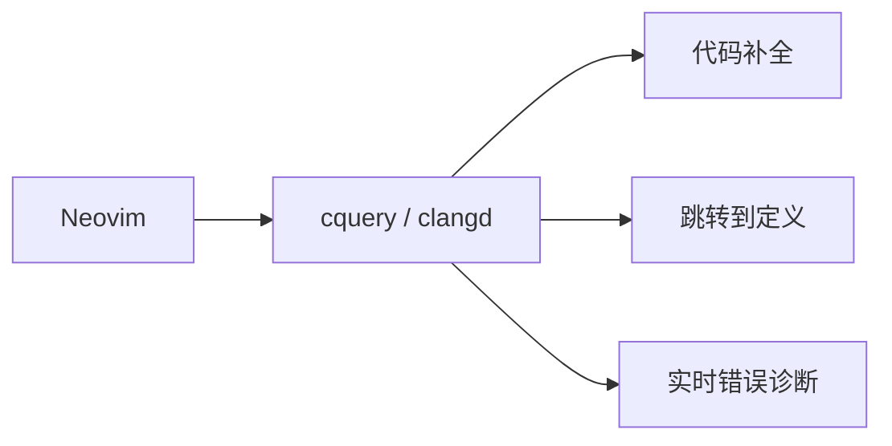
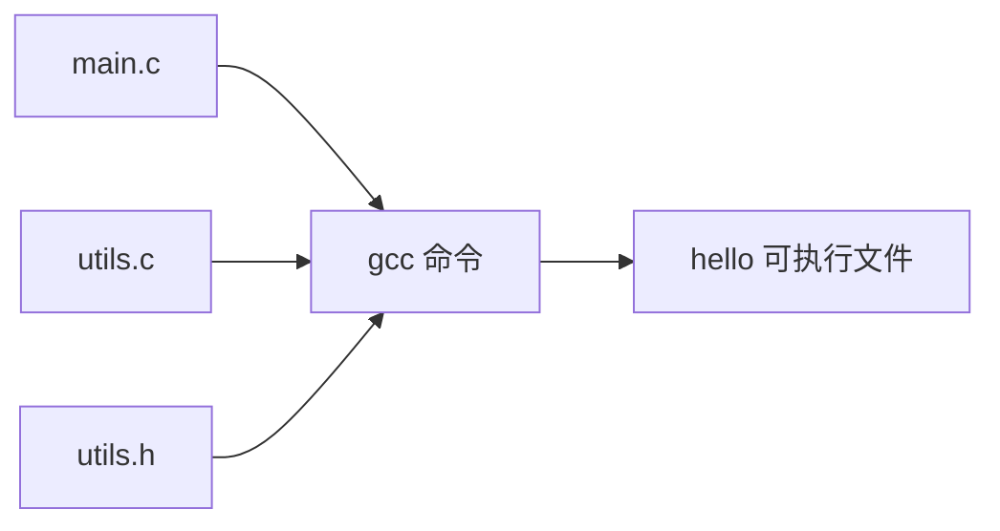

+++
title = "第 2 章：开发环境安装与第一个程序"
weight = 20
date = "2026-03-29T22:34:00+08:00"
type = "docs"
description = ""
isCJKLanguage = true
draft = false
+++

# 第 2 章：开发环境安装与第一个程序

> 上一章我们学会了 C 语言是什么、能干什么、前景如何，是不是已经摩拳擦掌、跃跃欲试了？但是等等——磨刀不误砍柴工！这一章咱们先来把"武器库"给搭建好。编程语言再好，也得有个趁手的家伙事儿不是？

话说回来，工欲善其事，必先利其器。你总不能徒手写代码吧？总不能对着空气说"电脑啊，给我编译一下"吧？（虽然我很希望未来真的可以这样，但现在还不行！）

这一章，我们就来搞定开发环境这件事。不同操作系统（Windows、macOS、Linux）有不同的安装方式，我会一一道来，保证你看完就能跑起你的第一个 C 程序！

准备好了吗？Let's go! 🚀

---

## 2.1 Windows：GCC（MinGW-w64 / MSYS2）/ Clang / Visual Studio

Windows 用户看过来！Windows 是世界上最大的桌面操作系统（别管 macOS 粉丝怎么争），所以咱们 Windows 用户也必须拥有姓名！

在 Windows 上写 C 语言，有三条路可以走：

### 2.1.1 方案一：MinGW-w64（轻量级，推荐小白）

**MinGW-w64** 的全称是 "Minimalist GNU for Windows 64-bit"。说人话就是：一个 Windows 上的 GNU 工具链，让你能在 Windows 上使用 GCC 编译器。

> 什么是 GCC？GCC 是 GNU Compiler Collection 的缩写，原本是 GNU C Compiler（GNU C 编译器），但后来 GNU 觉得它不只能编译 C，还能编译 C++、Fortran、Go 等等，于是改名叫 Collection。它是开源世界最著名的编译器，没有之一！

**安装步骤（简单到哭）：**

1. 打开浏览器，访问 **https://www.mingw-w64.org/** 或者直接搜索 "MinGW-w64 download"
2. 下载安装包（或者更推荐的方式：用 **MSYS2** 来安装 MinGW-w64）

等等，我推荐用 **MSYS2**！为什么？因为 MSYS2 是一个软件包管理器，它不仅帮你安装 MinGW-w64，还能让你轻松安装其他工具（比如 Git、Python、各种库）。相当于一个"软件全家桶"！

**MSYS2 安装步骤：**

1. 访问 https://www.msys2.org/ 
2. 下载安装包，文件名大概是 `msys2-x86_64-xxxxxx.exe`
3. 运行安装程序，一路点"下一步"就行
4. 安装完成后，会打开一个类似终端的窗口（叫做 MSYS2 MINGW64 Terminal）

在这个终端里，输入以下命令安装 GCC：

```bash
pacman -S mingw-w64-ucrt-x86_64-gcc
```

> 等等，`pacman` 是什么鬼？这是 Arch Linux 的包管理器！别慌，MSYS2 就是用这个来管理软件的。你不需要深入了解，知道这个命令能装 GCC 就行了！

安装完成后，输入：

```bash
gcc --version
```

如果看到类似这样的输出：

```
gcc.exe (Rev2, Built by MSYS2 project) 14.2.0
Copyright (C) 2024 Free Software Foundation, Inc.
This is free software; see the source for copying conditions.  There is NO
warranty; not even for MERCHANTABILITY or FITNESS FOR A PARTICULAR PURPOSE.
```

恭喜你！GCC 安装成功！🎉

**把 GCC 加入系统 PATH（可选但推荐）：**

如果你想在任意目录的普通命令提示符（CMD）或 PowerShell 里直接用 `gcc` 命令，需要把 MinGW 的 bin 目录加入 PATH。

通常路径是：`C:\msys64\ucrt64\bin`

加入方法：
1. 按 `Win + X`，选择"系统"
2. 点击"高级系统设置"
3. 点击"环境变量"
4. 在"系统变量"里找到"Path"，双击
5. 点击"新建"，输入 `C:\msys64\ucrt64\bin`
6. 确定保存

现在你可以在 CMD 或 PowerShell 里直接敲 `gcc` 了！

### 2.1.2 方案二：Clang / LLVM（现代化的选择）

**Clang** 是 LLVM 项目的一部分，是一个 C/C++/Objective-C 编译器，以编译速度快、错误信息清晰著称。如果你对 GCC 无感，可以试试 Clang。

在 Windows 上，Clang 通常通过 LLVM 的官方安装包来安装：

1. 访问 https://llvm.org/ 
2. 下载适合你的版本（一般是 `LLVM-x.x.x-win64.exe`）
3. 安装时记得勾选 "Add LLVM to the system PATH"

安装完成后，在终端里验证：

```bash
clang --version
```

```
clang version 18.1.0
Target: x86_64-pc-windows-msvc
Thread model: posix
InstalledDir: C:\Program Files\LLVM\bin
```

Clang 的一大优点是：它的报错信息比 GCC 友好一万倍！新手写错代码时，Clang 会告诉你"第几行大概是什么问题"，而 GCC 有时候会说一些天书一样的话。

> 当然，GCC 是"老大哥"，生态更广，某些平台，某些项目只认 GCC。所以两个都装着也不亏！

### 2.1.3 方案三：Visual Studio + MSVC（微软亲儿子，最强大）

**Visual Studio**（简称 VS，不是那个代码编辑器 VS Code）是微软出的完整 IDE（集成开发环境，Integrated Development Environment）。用它来写 C 语言，配置简单到令人发指，而且自带的 MSVC 编译器（Microsoft Visual C++ Compiler）非常专业。

**安装步骤：**

1. 访问 https://visualstudio.microsoft.com/ 
2. 下载 **Visual Studio 2022 Community**（社区版，免费！个人开发学习够用了）
3. 运行安装程序
4. 在"工作负载"选项卡里，勾选 **"使用 C++ 的桌面开发"**（注意：这个 workload 也包含了纯 C 语言的开发工具，不需要选 C++ 专属的）
5. 点击"安装"，等待下载和安装完成（可能需要 10-30 分钟，看网速）

安装完成后，打开 Visual Studio，创建你的第一个 C 项目：

1. 打开 VS，点击"创建新项目"
2. 选择"空项目"（Empty Project）
3. 设置项目名称和存放位置
4. 在"解决方案资源管理器"里，右键"源文件" → "添加" → "新建项"
5. 选择"C++ 文件"，但把扩展名改成 `.c`（不是 `.cpp`！）
6. 开始写代码！

> 等等，为什么 C 文件扩展名是 `.c` 而 C++ 是 `.cpp`？因为 C 语言比 C++ 资历老，所以`.c` 早就被 C 预定了！VS 默认创建 `.cpp`，所以我们要手动改一下。

**MSVC 和 GCC 的区别（快速了解）：**

- **GCC**：开源界的标杆，跨平台，支持几乎所有平台
- **MSVC**：微软的亲儿子，对 Windows API 支持最好，但跨平台能力弱
- **Clang**：新生代力量，错误提示友好，但某些特殊扩展可能不支持

初学者用 MinGW-w64 或者 Visual Studio Community 都完全 OK！

---

## 2.2 macOS：Xcode Command Line Tools

苹果用户看这边！macOS 是 Unix 的亲儿子（BSD 的后代），自带了强大的终端和 Unix 工具链。所以 macOS 上配置 C 开发环境，简单到令人感动！

### 2.2.1 检查是否已安装

打开你的终端（按 `Command + 空格`，搜索"终端"或"Terminal"），输入：

```bash
gcc --version
```

如果提示"command not found"（命令找不到），说明还没装。没关系！

### 2.2.2 安装 Xcode Command Line Tools

这一步简单到哭。在终端里输入：

```bash
xcode-select --install
```

然后会弹出一个窗口，点"安装"就行。大概 100 多 MB，等待下载和安装完成。

安装完成后，再次输入：

```bash
gcc --version
```

看到类似输出：

```
Apple clang version 15.0.0 (clang-1500.3.9.4)
Target: arm64-apple-darwin23.6.0
Thread model: posix
Installed: /Library/Developer/CommandLineTools/usr/bin/gcc
```

**等等！说好的 GCC 呢？怎么变成 Clang 了？**

好问题！苹果从 OS X 10.9 开始，就不再默认安装 GCC 了，而是用苹果自己定制的 Clang（叫 Apple Clang）。虽然名字叫 Clang，但使用体验和 GCC 非常接近，99% 的 C 代码都能编译！

如果你是强迫症，一定要用真正的 GCC，可以用 Homebrew 来安装：

```bash
/bin/bash -c "$(curl -fsSL https://raw.githubusercontent.com/Homebrew/install/HEAD/install.sh)"
brew install gcc
```

安装完后，用 `gcc-14` 这样的命令来调用（具体版本号看你安装的）。

> Homebrew 是 macOS 最流行的包管理器，相当于 macOS 上的"应用商店"，只不过主要面向命令行工具。安装 Homebrew 是个明智的选择，以后你装各种开发工具会方便很多！

### 2.2.3 验证安装成功

写一个最简单的 C 程序测试一下（这个我们下一节会详细讲，先剧透一下）：

```c
#include <stdio.h>

int main(void) {
    printf("Hello from macOS!\n");
    return 0;
}
```

保存为 `hello.c`，然后编译运行：

```bash
gcc hello.c -o hello && ./hello
```

看到 `Hello from macOS!` 就说明一切正常！🎉

---

## 2.3 Linux：apt / yum / dnf 安装 gcc

Linux 用户？你们已经站在了巨人的肩膀上！Linux 就是用 C 语言写的（内核是 C，用户态工具大多也是 C），所以 Linux 上的 C 开发工具，那是相当的成熟和方便！

### 2.3.1 Debian / Ubuntu：apt

Debian、Ubuntu、Linux Mint 等发行版使用 **apt**（Advanced Package Tool）作为包管理器。

一条命令搞定：

```bash
sudo apt update && sudo apt install build-essential
```

> `sudo` 是什么？Linux 的超级用户命令。因为安装软件是系统级操作，需要管理员权限，所以要用 `sudo` 临时提升权限。
> 
> `apt update` 是更新软件包列表，确保你安装的是最新版本。
> 
> `build-essential` 是一个软件包集合，里面包含了 GCC、G++、make、gdb 等编译 C/C++ 程序必备的工具！

安装完成后验证：

```bash
gcc --version
```

```
gcc (Ubuntu 13.2.0-23ubuntu4) 13.2.0
Copyright (C) 2023 Free Software Foundation, Inc.
This is free software; see the source for copying conditions.  There is NO
warranty; not even for MERCHANTABILITY or FITNESS FOR A PARTICULAR PURPOSE.
```

### 2.3.2 Red Hat / CentOS / Fedora（旧版）：yum

Red Hat 系列（以及 CentOS 7 及以前）使用 **yum**（Yellowdog Updater, Modified）作为包管理器。

```bash
sudo yum install gcc gcc-c++
```

### 2.3.3 Fedora（新版）/ CentOS Stream：dnf

Fedora 22+ 和 CentOS Stream 8+ 使用 **dnf**（Dandified YUM）。

```bash
sudo dnf install gcc gcc-c++
```

> `dnf` 就是新一代的 `yum`，功能差不多，但依赖解析更快更好用。CentOS Stream 8 开始全面转向 dnf，Red Hat 也建议新用户使用 dnf。

### 2.3.4 Arch Linux / Manjaro：pacman

Arch Linux 和它的衍生版（比如 Manjaro）使用 **pacman**。

```bash
sudo pacman -S gcc
```

### 2.3.5 发行版大合影

| 发行版家族 | 包管理器 | 安装命令 |
|-----------|---------|---------|
| Debian / Ubuntu / Mint | apt | `sudo apt install build-essential` |
| Red Hat / CentOS 7 | yum | `sudo yum install gcc gcc-c++` |
| Fedora / CentOS Stream 8+ | dnf | `sudo dnf install gcc gcc-c++` |
| Arch Linux / Manjaro | pacman | `sudo pacman -S gcc` |
| openSUSE | zypper | `sudo zypper install gcc gcc-c++` |

> 插播一条冷知识：Linux 的各种包管理器，就跟各地的方言一样。东北人说"嘎哈呢"，广东人说"做咩啊"，上海人说"啥事体"，都是问"你在干嘛"。apt、yum、dnf、pacman 本质上都是干同样的事——安装软件，只是"方言"不同而已。

### 2.3.6 验证安装

```bash
gcc --version
```

看到版本号输出，就说明一切 OK！

---

## 2.4 编辑器：VS Code + C/C++ 扩展 / CLion / Neovim + cquery / Source Insight

编译器装好了，接下来咱们需要一个写代码的"战场"——编辑器（或 IDE）。

### 2.4.1 VS Code + C/C++ 扩展（最流行，推荐！）

**VS Code**（Visual Studio Code，不是上面的 Visual Studio 哦！）是微软出的免费代码编辑器，轻量、快速、插件丰富，全球第一大代码编辑器！（虽然有些 Java 死忠粉不服，但事实如此）

**安装步骤：**

1. 访问 https://code.visualstudio.com/ 
2. 下载安装包，安装它！

**安装 C/C++ 扩展：**

1. 打开 VS Code
2. 按 `Ctrl + Shift + X`（macOS 是 `Cmd + Shift + X`）打开扩展商店
3. 搜索 "C" 或者 "C++"
4. 找到 **"C/C++"**（Microsoft 出品，官方插件！）
5. 点击"安装"

**配置 C/C++ 智能提示（IntelliSense）：**

安装完扩展后，你还需要配置编译器路径。按 `Ctrl + Shift + P`，输入 "C/C++: Edit Configurations (JSON)"，点击它。

这会打开一个 `c_cpp_properties.json` 文件，你需要确保 `compilerPath` 指向你安装的 GCC：

```json
{
    "configurations": [
        {
            "name": "Win32",
            "compilerPath": "C:/msys64/ucrt64/bin/gcc.exe",
            "includePath": [
                "${workspaceFolder}/**"
            ],
            "cStandard": "c17",
            "cppStandard": "c++17"
        }
    ]
}
```

> macOS 和 Linux 用户，`compilerPath` 改成 `/usr/bin/gcc` 或者 `/usr/local/bin/gcc`。

配置好后，你写代码时就有代码补全、语法高亮、错误提示了！

**VS Code 的 C/C++ 调试：**

VS Code 配合 C/C++ 扩展，还支持图形化调试！按 `F5` 启动调试，它会一步步执行代码，让你看到变量的值。

### 2.4.2 CLion（专业的 C/C++ IDE）

**CLion** 是 JetBrains 出品的专业 C/C++ IDE（收费，但有学生免费授权）。如果你想要一个"开箱即用"的完整 IDE，CLion 是非常好的选择。

优点：
- 完整的大型 IDE 功能
- CMake 支持开箱即用
- 调试功能强大
- 跨平台（Windows/macOS/Linux 都有）

缺点：
- 要花钱（虽然有学生免费版）
- 比较吃内存

> 如果你是学生，去 https://www.jetbrains.com/community/education/#students 申请学生免费授权，只需要学校邮箱！

### 2.4.3 Neovim + cquery / clangd（极客之选）

> ⚠️ 这是给高级用户准备的，如果你刚学 C 语言，可以先跳过这一节！

**Neovim** 是 Vim 的现代化重构版本，而 **cquery** 和 **clangd** 是基于 Clang 的 C/C++ 语言服务器（LSP），能提供代码补全、跳转、诊断等功能。



如果你追求"键盘流"的极致操作体验，不想离开终端，Neovim + LSP 是个很酷的选择。但配置起来确实需要花一些功夫。

### 2.4.4 Source Insight（代码阅读神器）

**Source Insight** 是 Windows 上的老牌代码阅读和分析工具，在大型 C/C++ 项目中特别流行。它的优势是：
- 快速分析代码结构和调用关系
- 支持跳转到定义、查找引用
- 代码窗口和符号窗口联动

但它不是一个完整的 IDE，更像是一个"代码浏览器"。很多游戏公司、嵌入式开发团队都在用。

> 当然，Source Insight 是收费软件（且只有 Windows 版）。如果你在找免费替代品，VS Code + C/C++ 扩展组合已经非常强大了！

### 2.4.5 编辑器对比一览

| 编辑器/IDE | 费用 | 难度 | 适合人群 |
|-----------|------|------|---------|
| VS Code + C/C++ | 免费 | ⭐ 简单 | 小白首选 |
| CLion | 付费/学生免费 | ⭐⭐ 中等 | 追求专业 IDE |
| Neovim + LSP | 免费 | ⭐⭐⭐⭐ 难 | 极客/键盘侠 |
| Source Insight | 付费 | ⭐⭐ 中等 | 代码阅读分析 |

---

## 2.5 第一个 C 程序：Hello, World!

好了好了，工具都准备好了，现在咱们来写第一个 C 程序！

还记得 C 语言的"Hello, World!"吗？1978 年 Brian Kernighan 和 Dennis Ritchie 在《The C Programming Language》这本书里首次引入了这个例子，从此它成了编程界的"Hello World"，就像婴儿学说话先说"妈妈"一样经典。

### 2.5.1 第一个程序：Hello, World!

废话不多说，直接上代码！新建一个文件，命名为 `hello.c`，然后输入以下内容：

```c
#include <stdio.h>

int main(void) {
    printf("Hello, World!\n");
    return 0;
}
```

保存文件。

然后编译运行（在终端里）：

```bash
gcc hello.c -o hello && ./hello
```

> macOS 和 Linux 用 `./hello`，Windows 在 MSYS2 终端里也是 `./hello`，但在普通 CMD/PowerShell 里是 `hello.exe` 或者 `.\hello`。

输出：

```
Hello, World!
```

🎉 **恭喜你！你写出并运行了第一个 C 程序！**

现在让我来逐一拆解这个程序，看看每个部分都是干啥的。

### 2.5.2 `stdio.h` 的作用

```c
#include <stdio.h>
```

这行代码，我们来逐字拆解：

- `#include` 是一个"预处理指令"（preprocessor directive）。`#` 开头的东西，在程序真正编译之前，会被先处理。
- `<stdio.h>` 是一个"头文件"（header file）。`.h` 就是 header 的缩写。
- `stdio` 是 "standard input/output" 的缩写，即"标准输入输出"。

**那为什么要 `#include <stdio.h>` 呢？**

因为 `printf()` 这个函数，不是凭空冒出来的！它属于 C 语言的标准库，由 `stdio.h` 这个头文件声明。

> 头文件（header file）就像是函数的"说明书"。它告诉编译器："嘿，有这么个函数，长这样，返回什么，接受什么参数。"编译器看到头文件里的声明，才能知道怎么调用这个函数。
>
> 类比一下：就像你去餐厅吃饭，菜单（头文件）告诉你有什么菜（函数），长什么样（参数），吃完给多少钱（返回值）。你不需要知道厨师（实现细节）是怎么做的，你只需要看菜单点菜就行了！

没有 `#include <stdio.h>`，编译器就会报错：

```
error: implicit declaration of function 'printf'
```

翻译成人话就是："我不知道 `printf` 是啥！因为你没有给我它的说明书！"

> 还有一点：`<stdio.h>` 用尖括号包起来，表示这是一个系统头文件，编译器去系统目录里找它。如果是你自己写的头文件，要用双引号：`#include "myheader.h"`。

### 2.5.3 `main` 函数返回值：`EXIT_SUCCESS` / `EXIT_FAILURE`

```c
int main(void) {
    printf("Hello, World!\n");
    return 0;
}
```

我们看到 `main` 函数的返回类型是 `int`（整数），最后 `return 0;`。

这个 `0` 代表什么？为什么要返回东西？

**`main` 函数的返回值，是给操作系统看的。**

- 返回 `0`（或者 `EXIT_SUCCESS`）表示："程序顺利执行完了，没毛病！"
- 返回非零值（或者 `EXIT_FAILURE`）表示："出问题了！我不正常退出了！"

> `EXIT_SUCCESS` 和 `EXIT_SUCCESS`（实际上是 `EXIT_FAILURE`）是定义在 `<stdlib.h>` 里的两个宏，本质上就是 `0` 和 `1`（或别的非零值）。用宏的好处是代码更可读：
>
> ```c
> return EXIT_SUCCESS;  // 比 return 0; 更清晰！
> ```

> 不过话说回来，在 `main` 函数里 `return 0;` 完全是标准做法，没必要非得用宏。就像你说"我很好"还是"状态码 0（一切正常）"，都能表达同一个意思。

那谁会看这个返回值呢？通常是：
- **shell 脚本**：如果你在脚本里调用程序，可以根据返回值判断程序是否成功
- **构建系统**：Makefile、CMake 等工具会根据返回值决定下一步
- **操作系统**：记录程序的退出状态

比如，你在终端里运行程序后，可以立即查看上一条命令的返回值（Linux/macOS）：

```bash
./hello
echo $?    # 打印上一条命令的返回值
```

输出：

```
Hello, World!
0
```

### 2.5.4 `int main(void)` vs `int main(int argc, char *argv[])`

我们的 Hello World 程序用的是 `int main(void)`。

```c
int main(void) {
    ...
}
```

这里的 `void` 表示"这个函数不接受任何参数"。

但是！C 语言的 `main` 函数还有另一种写法：

```c
int main(int argc, char *argv[]) {
    ...
}
```

**这是什么玩意儿？让我来解释：**

- `argc`：argument count 的缩写，"参数计数"。表示命令行参数的数量。
- `argv`：argument vector 的缩写，"参数向量"（就是数组）。存储具体的命令行参数字符串。

> 如果你写过 Python 的 `sys.argv`，概念是一样的！只是语法不同而已。

**举个例子：**

```c
#include <stdio.h>

int main(int argc, char *argv[]) {
    printf("一共有 %d 个参数\n", argc);
    
    for (int i = 0; i < argc; i++) {
        printf("参数 %d: %s\n", i, argv[i]);
    }
    
    return 0;
}
```

编译运行：

```bash
gcc args.c -o args && ./args hello world 2024
```

输出：

```
一共有 4 个参数
参数 0: ./args
参数 1: hello
参数 2: world
参数 3: 2024
```

> 看到了吗？`argv[0]` 是程序自己的名字（类似 `./args`），`argv[1]` 开始才是真正的命令行参数！

**为什么参数数组的类型是 `char *argv[]` 而不是 `string argv[]`？**

> 因为 C 语言没有字符串类型！字符串在 C 里就是字符数组，或者更准确地说，是指向字符的指针（`char *`）。这个我们在后续的"指针"章节会详细讲。现在你只需要知道：`char *argv[]` 大致等价于"字符串数组"。

### 2.5.5 环境变量参数 `char *envp[]`（非标准但广泛支持）

还有第三个参数（虽然不是标准 C 规定的，但几乎所有编译器都支持）：

```c
int main(int argc, char *argv[], char *envp[]) {
    // ...
}
```

`envp` 是 "environment pointer" 的缩写，它是一个环境变量数组。

**什么是环境变量？** 环境变量是操作系统传递给程序的一些"配置信息"，比如：
- `PATH`：告诉操作系统去哪找可执行文件
- `HOME`：当前用户的主目录
- `USER`：当前用户名
- 等等

**看个例子：**

```c
#include <stdio.h>

int main(int argc, char *argv[], char *envp[]) {
    printf("当前用户: %s\n", getenv("USER"));
    printf("主目录: %s\n", getenv("HOME"));
    printf("PATH: %s\n", getenv("PATH"));
    
    return 0;
}
```

> 注意！`getenv()` 函数需要包含 `<stdlib.h>` 头文件。

输出（Linux/macOS）：

```
当前用户: longx
主目录: /home/longx
PATH: /usr/local/bin:/usr/bin:/bin:...
```

> 不过，`envp` 参量虽然广泛支持，但它**不是 ANSI C 标准**的一部分。不同的编译器可能表现不同。所以，如果你需要访问环境变量，更标准的方式是用 `getenv()` 函数（在 `<stdlib.h>` 中）。

```c
#include <stdio.h>
#include <stdlib.h>

int main(void) {
    char *path = getenv("PATH");
    if (path != NULL) {
        printf("PATH = %s\n", path);
    }
    return 0;
}
```

> 小技巧：`getenv()` 如果找不到对应的环境变量，会返回 `NULL`（空指针），所以最好做个检查，就像上面的 `if (path != NULL)` 一样。

---

## 2.6 编译运行：`gcc main.c -o hello && ./hello`

好了，现在你知道怎么写 C 程序了。接下来最关键的一步：**编译和运行**！

### 2.6.1 编译命令详解

```bash
gcc main.c -o hello
```

我们来拆解这个命令：

| 部分 | 含义 |
|-----|------|
| `gcc` | GCC 编译器的命令 |
| `main.c` | 源代码文件名（输入） |
| `-o` | output 的缩写，"输出"的意思 |
| `hello` | 编译生成的二进制文件名（输出） |

> `-o` 后面跟的是输出文件名。你可以随便起名字，比如 `-o my_program`，`-o app`，`-o shadiao` 都行。但要注意：
> - Linux/macOS：建议不加扩展名，或者加 `.out`（如 `hello.out`），因为这些系统不靠扩展名识别文件类型
> - Windows：如果不加扩展名，生成的是 `hello.exe`

### 2.6.2 编译 + 运行一步到位

我们可以用 `&&` 把编译和运行连起来：

```bash
gcc main.c -o hello && ./hello
```

`&&` 的意思是："如果左边成功了（返回 0），就执行右边"。

> 类比：就像你去快餐店点餐说"汉堡加薯条加可乐"，收银员会依次给你这三样东西。`&&` 就是命令行的"加上"。

### 2.6.3 如果有警告也想编译？

GCC 默认只显示错误（error），但如果你想看到警告（warning），可以加 `-Wall` 参数：

```bash
gcc -Wall main.c -o hello
```

`-Wall` 是 "Warning all" 的缩写，开启所有常见警告。

> 建议：养成习惯，每次编译都加 `-Wall`！它能帮你发现很多潜在的 bug。比如变量用了但没初始化、函数声明和定义不匹配等等。

### 2.6.4 指定 C 标准

GCC 默认使用的可能是比较旧的 C 标准。如果你想明确指定使用 C17（目前最新的正式标准）：

```bash
gcc -std=c17 -Wall main.c -o hello
```

或者 `c11`、`c99` 等。

| 标准 | 年份 | 说明 |
|-----|------|------|
| C89/C90 | 1989/1990 | 第一个 ANSI/C ISO 标准 |
| C99 | 1999 | 增加了很多现代特性 |
| C11 | 2011 | 增加了多线程、泛型等 |
| C17/C18 | 2017/2018 | 主要是 bug 修复 |
| C23 | 2023 | 最新标准，增加了很多新特性 |

> 建议：学习用 `c17` 或 `c11` 就行，除非你写的是很老很老的代码。

---

## 2.7 常见编译错误解读（新手避坑指南）

写代码嘛，出错是常态。重要的是——看到错误信息不要慌！很多新手一看到满屏红字就心态崩溃，其实大多数错误都是那么几个类型。

### 2.7.1 错误：忘记分号

```c
#include <stdio.h>

int main(void) {
    printf("Hello, World!\n")  // 忘记分号！
    return 0;
}
```

编译报错：

```
error: expected ';' before 'return'
```

翻译："在 `return` 前面，我期待一个分号！"

**解决：** 在 `printf(...)` 后面加 `;`。

> C 语言的语句以分号结尾，这是一个强迫症级别的规则。每一行语句后面都要加分号，除了少数特殊情况（比如 `#include`、函数定义的花括号后面）。

### 2.7.2 错误：括号/花括号不匹配

```c
#include <stdio.h>

int main(void) {
    printf("Hello, World!\n");
    return 0;  
    // 少了一个 }
```

报错可能不明显，但编译器会告诉你：

```
error: expected declaration or statement at end of input
```

翻译："都读到文件末尾了，我发现括号还没配对！"

**解决：** 数一数你的 `{` 和 `}`，确保数量一样多。通常按缩进来检查是个好习惯。

> 小技巧：现代编辑器（VS Code）通常会自动高亮匹配的括号，如果你的括号不匹配，编辑器也会显示红色下划线警告。

### 2.7.3 错误：`printf` 拼写错误

```c
#include <stdio.h>

int main(void) {
    pintf("Hello, World!\n");  // 少了个 f！
    return 0;
}
```

报错：

```
error: implicit declaration of function 'pintf'; did you mean 'printf'?
```

翻译："我没听说过 `pintf` 这个函数，你是想说 `printf` 吗？"

> 哈哈，编译器有时候还挺贴心的，直接告诉你可能拼错了！

**解决：** 改成 `printf`。

### 2.7.4 错误：头文件拼错

```c
#inclued <stdio.h>  // include 拼成了 inclued！

int main(void) {
    printf("Hello, World!\n");
    return 0;
}
```

报错：

```
error: invalid preprocessing directive #inclued
```

翻译："`#inclued` 是什么鬼？预处理指令我只认识 `#include`！"

### 2.7.5 错误：变量未声明就使用

```c
#include <stdio.h>

int main(void) {
    int a = 10;
    printf("%d\n", b);  // b 从来没声明过！
    return 0;
}
```

报错：

```
error: 'b' undeclared (first use in this function)
```

翻译："`b` 是什么？我从来没见过这个变量！"

### 2.7.6 错误：类型不匹配

```c
#include <stdio.h>

int main(void) {
    int a = 3.14;  // 把小数赋给 int！
    printf("%d\n", a);
    return 0;
}
```

虽然能编译，但会**警告**（不是错误）：

```
warning: initialization makes integer from floating-point without a cast
```

翻译："我把一个小数塞进了整数类型里，这可能会丢失精度！"

> `%d` 是 `printf` 的格式说明符，表示"按十进制整数打印"。如果你想打印小数，应该用 `%f` 和 `double` 类型。

### 2.7.7 错误：`main` 函数写错

```c
#include <stdio.h>

void main(void) {  // main 的返回类型必须是 int！
    printf("Hello, World!\n");
}
```

报错：

```
error: 'void main(void)' is not allowed in C99 or later
```

翻译："`void main(void)` 这种写法在现代 C 标准里是不允许的！main 必须返回 int！"

**正确的写法：**

```c
int main(void) {
    // ...
    return 0;
}
```

### 2.7.8 错误：中文引号

```c
#include <stdio.h>

int main(void) {
    printf("Hello, World!\n");  // 这里用了中文引号！
    return 0;
}
```

有些新手在复制代码时，不小心用了中文的引号（`""`）而不是英文的（`""`），导致编译报错：

```
error: missing terminating " character
```

翻译："引号怎么只有一个？另一个去哪了？"

**解决：** 确保用的是英文半角引号。

### 2.7.9 错误对照表

| 错误信息 | 可能原因 | 解决方法 |
|---------|---------|---------|
| `expected ';' before 'return'` | 忘记分号 | 在上一行末尾加 `;` |
| `undeclared (first use in this function)` | 变量没声明 | 先声明变量 |
| `undefined reference to 'xxx'` | 链接错误 | 检查函数是否定义，或者漏了链接库 |
| `implicit declaration of function` | 没包含头文件 | 添加对应的 `#include` |
| `incompatible pointer type` | 指针类型不匹配 | 检查类型 |
| `error: invalid preprocessing directive` | `#include` 拼写错误 | 检查 `#include` 拼写 |

> 记住：**错误（error）必须修复，警告（warning）最好也修复**。警告虽然不影响编译，但通常意味着代码有问题或不可移植。

---

## 2.8 Makefile 入门

写一个小程序，`gcc main.c -o hello` 就搞定了。但是想象一下，如果你有几十个源文件（`.c` 文件），每个都要手动编译，还要处理它们之间的依赖关系……那可就麻烦了！

**Makefile** 就是来解决这个问题的！它是一个"构建脚本"，帮你自动管理编译流程。

### 2.8.1 一个简单的 Makefile

假设我们有两个文件：
- `main.c`
- `utils.c`
- `utils.h`

目录结构：

```
project/
├── main.c
├── utils.c
├── utils.h
└── Makefile
```

**`utils.h`：**

```c
#ifndef UTILS_H
#define UTILS_H

void say_hello(void);
int add(int a, int b);

#endif
```

**`utils.c`：**

```c
#include <stdio.h>
#include "utils.h"

void say_hello(void) {
    printf("Hello from utils!\n");
}

int add(int a, int b) {
    return a + b;
}
```

**`main.c`：**

```c
#include <stdio.h>
#include "utils.h"

int main(void) {
    say_hello();
    int result = add(3, 4);
    printf("3 + 4 = %d\n", result);
    return 0;
}
```

**Makefile：**

```makefile
# 这是一个简单的 Makefile

# 目标：最终的可执行文件
hello: main.c utils.c utils.h
    gcc main.c utils.c -o hello -Wall

# 清理生成的文件
clean:
    rm -f hello

# 伪目标，告诉 make 这不是文件
.PHONY: clean
```

> `Makefile` 的语法很特殊：缩进必须用**制表符（Tab）**，不能用空格！这是新手最容易踩的坑！

### 2.8.2 使用 Makefile

在终端里进入项目目录，执行：

```bash
make
```

Make 会自动找到当前目录下的 `Makefile` 或 `makefile`（注意大小写），然后执行第一条规则（也就是 `hello` 那个）。

输出：

```
gcc main.c utils.c -o hello -Wall
```

然后你就能运行 `./hello` 了！

如果你想清理生成的文件：

```bash
make clean
```

输出：

```
rm -f hello
```

### 2.8.3 Makefile 的基本语法

```makefile
目标: 依赖
	命令
```

- **目标（target）**：你要生成的文件名，或者一个"动作"名字（比如 `clean`）
- **依赖（prerequisites）**：生成目标需要哪些文件
- **命令（recipe）**：具体要执行的命令（前面要加 Tab）



### 2.8.4 更专业的 Makefile

上面的 Makefile 虽然能用，但有个问题：每次 `make` 都会重新编译所有文件，哪怕只改了一个 `.c` 文件。这在大型项目里会非常慢。

更专业的做法是：让 Make 只编译改过的文件。

```makefile
CC = gcc
CFLAGS = -Wall -std=c17
TARGET = hello

# 目标文件
OBJS = main.o utils.o

# 规则：生成目标文件
%.o: %.c
    $(CC) $(CFLAGS) -c $< -o $@

# 规则：生成可执行文件
$(TARGET): $(OBJS)
    $(CC) $(OBJS) -o $(TARGET)

# 清理
clean:
    rm -f $(OBJS) $(TARGET)

.PHONY: clean
```

解释一下特殊变量：

| 变量 | 含义 |
|-----|------|
| `$@` | 目标文件名 |
| `$<` | 第一个依赖文件名 |
| `$^` | 所有依赖文件 |
| `$(CC)` | 编译器（上面定义的 `gcc`） |
| `$(CFLAGS)` | 编译选项（上面定义的 `-Wall -std=c17`） |

### 2.8.5 Makefile 的工作原理

当你输入 `make` 时，Make 会按顺序做这些事情：

1. 找到 `Makefile`
2. 读取第一条规则（`hello` 或 `$(TARGET)`）
3. 检查依赖文件（`main.o`、`utils.o`）是否存在或需要更新
4. 如果需要，递归执行生成 `.o` 文件的规则
5. 最后执行生成可执行文件的命令

> 妙处在于：Make 会比较源文件和目标文件的时间戳。如果 `main.c` 比 `main.o` 新，才重新编译；否则跳过。这样就能节省大量编译时间！

---

## 2.9 CMake 构建项目

Makefile 功能强大，但是写起来确实有点繁琐。尤其当项目规模变大，文件数量几十上百的时候，手写 Makefile 会变成噩梦。

**CMake** 横空出世！CMake 的核心理念是：**用更简单的配置文件（`CMakeLists.txt`），自动生成 Makefile（或其他构建系统文件）**。

### 2.9.1 CMake 和 Makefile 的区别

| | Makefile | CMake |
|--|---------|-------|
| 配置文件 | 手写 Makefile | 写 CMakeLists.txt |
| 生成物 | 直接是可执行文件 | 生成 Makefile/Ninja 项目文件 |
| 学习曲线 | 陡峭 | 较平缓 |
| 适用场景 | 小型项目 | 中大型项目 |

> 打个比方：Makefile 就像是你自己手写歌词，而 CMake 就像是有一个 AI 帮你写歌词，然后你可以拿去唱（编译）。CMake 生成 Makefile，Makefile 再编译程序。

### 2.9.2 一个简单的 CMake 项目

目录结构：

```
project/
├── main.c
├── utils.c
├── utils.h
├── CMakeLists.txt
└── build/          # 建议单独建一个 build 目录
```

**`CMakeLists.txt`：**

```cmake
cmake_minimum_required(VERSION 3.10)
project(HELLO VERSION 1.0 LANGUAGES C)

# 设置 C 标准
set(CMAKE_C_STANDARD 17)
set(CMAKE_C_STANDARD_REQUIRED ON)

# 查找当前目录所有 .c 文件
file(GLOB SOURCES "*.c")

# 生成可执行文件
add_executable(hello ${SOURCES})

# 打印一些信息
message(STATUS "C compiler: ${CMAKE_C_COMPILER}")
message(STATUS "C standard: ${CMAKE_C_STANDARD}")
```

> `cmake_minimum_required` 声明你需要的最低 CMake 版本。
> `project` 定义项目名称和版本。
> `add_executable` 指定要生成的可执行文件以及用哪些源文件。

### 2.9.3 使用 CMake 构建

**第一步：配置（生成 Makefile）**

```bash
mkdir build && cd build
cmake ..
```

> 强烈建议使用独立的 `build` 目录来构建！这样不会污染源代码目录。

输出大概是这样：

```
-- The C compiler identification is GNU 13.2.0
-- The CXX compiler identification is GNU 13.2.0
-- Detecting C compiler ABI info
-- Detecting C compile features
-- C compiler: /usr/bin/gcc
-- C standard: 17
-- Configuring done
-- Generating done
-- Build files have been written to: /home/user/project/build
```

**第二步：编译**

```bash
cmake --build .
```

或者在 build 目录里直接 `make`：

```bash
make
```

输出：

```
[ 33%] Building C object CMakeFiles/hello.dir/main.c.o
[ 66%] Building C object CMakeFiles/hello.dir/utils.c.o
[ 66%] Linking C executable hello
[100%] Built target hello
```

**第三步：运行**

```bash
./hello
```

输出：

```
Hello from utils!
3 + 4 = 7
```

### 2.9.4 CMake 的优点

1. **跨平台**：Windows 用 CMake 可以生成 Visual Studio 项目；macOS 可以生成 Xcode 项目；Linux 生成 Makefile
2. **依赖管理**：CMake 可以帮你查找系统库（比如 `find_package`）
3. **不用手写 Makefile**：配置文件比 Makefile 简洁很多
4. **大型项目标配**：几乎所有开源 C/C++ 项目都用 CMake

> 比如著名的 Linux 桌面环境 KDE、图像处理库 OpenCV、游戏引擎 Unreal Engine（虚幻引擎），都用 CMake 作为构建系统！学好了 CMake，找工作都能多吹几句！😎

---

## 2.10 Linux 开发环境进阶配置：编辑器 + 终端 + 版本控制

Linux 是程序员的"梦中情系统"（别喷我，macOS 也是 Unix，也很好）。如果你用 Linux 来开发 C 语言，一些进阶配置能让你的效率飞起！

### 2.10.1 终端配置： oh-my-zsh

Linux 默认的 bash 终端已经很不错了，但 **oh-my-zsh** 可以让它变得更强大、更漂亮。

**安装：**

```bash
sh -c "$(curl -fsSL https://raw.github.com/ohmyzsh/ohmyzsh/master/tools/install.sh)"
```

**oh-my-zsh 的优点：**

- 自动补全增强版（输入命令按 Tab 补全文件名/参数）
- 插件系统（Git 插件、Python 插件等）
- 主题系统（自定义外观）
- 智能拼写纠错

> 自从用了 oh-my-zsh，每次打开终端都有好心情！（不是广告）

### 2.10.2 Git：版本控制的必备工具

**Git** 是目前最流行的版本控制系统，没有之一！它能帮你：

- 记录代码的历史版本
- 多人协作开发
- 分支管理（开发新功能不影响主线）

**安装：**

```bash
sudo apt install git      # Debian/Ubuntu
sudo yum install git      # Red Hat/CentOS
sudo dnf install git      # Fedora
```

**配置 Git：**

```bash
git config --global user.name "你的名字"
git config --global user.email "你的邮箱"
```

**常用 Git 命令：**

```bash
git init                  # 初始化仓库
git add .                # 添加所有文件到暂存区
git commit -m "提交信息"   # 提交
git status               # 查看状态
git log                  # 查看提交历史
git branch               # 查看分支
git checkout -b feature  # 创建并切换到新分支
git merge feature        # 合并分支
git push                 # 推送到远程仓库
git pull                 # 从远程拉取
```

> 版本控制就像游戏的"存档"功能！你可以随时回到之前的版本，不用担心改坏了代码。"哎呀，我昨天那个版本挺好的，怎么变成这样了？"——有了 Git，再也不怕这种问题！

### 2.10.3 tmux：终端复用器

**tmux** 是一个"终端复用器"，它的作用是：让你在一个终端里开多个"窗口"，还能把窗口拆分成多个"面板"。

**安装：**

```bash
sudo apt install tmux
```

**常用操作：**

| 操作 | 快捷键 |
|-----|-------|
| 新建窗口 | `Ctrl+b, c` |
| 切换窗口 | `Ctrl+b, 0/1/2...` |
| 垂直分屏 | `Ctrl+b, %` |
| 水平分屏 | `Ctrl+b, "` |
| 关闭面板 | `Ctrl+b, x` |
| 列出所有窗口 | `Ctrl+b, w` |

> tmux 的好处是：即使终端关了，你的任务还在跑（如果你用 tmux 启动的话）。适合跑长时间编译、远程服务器操作等场景。

### 2.10.4 完整的 Linux C 开发环境配置清单

如果你用的是 Ubuntu/Debian，一条命令搞定大部分开发工具：

```bash
sudo apt install build-essential git curl tmux zsh clang-format
```

| 软件包 | 作用 |
|-------|------|
| `build-essential` | GCC 编译器、make 等 |
| `git` | 版本控制 |
| `curl` | 下载工具 |
| `tmux` | 终端复用器 |
| `zsh` | 增强版 shell（配合 oh-my-zsh 使用） |
| `clang-format` | 代码格式化工具 |

---

## 本章小结

这一章，我们完成了 C 语言开发的"基础设施建设"！来回顾一下我们都学了什么：

### 开发环境安装

- **Windows**：可以用 MinGW-w64（通过 MSYS2 安装）、Clang、或 Visual Studio + MSVC。其中 MSYS2 是最推荐的轻量方案，Visual Studio 是功能最全的方案
- **macOS**：安装 Xcode Command Line Tools 即可，苹果实际上用的是 Apple Clang（GCC 的表亲）
- **Linux**：用 apt/yum/dnf/pacman 安装 `build-essential` 包，一步到位

### 编辑器选择

- **VS Code + C/C++ 扩展**：免费、轻量、插件丰富，小白首选
- **CLion**：专业 IDE，功能强大，但收费
- **Neovim + LSP**：极客之选，键盘流
- **Source Insight**：Windows 上的代码阅读神器

### Hello World 程序解析

- `#include <stdio.h>`：引入标准输入输出头文件，里面声明了 `printf` 等函数
- `int main(void)`：主函数，C 程序的入口，返回值告诉操作系统程序是否成功
- `return 0` 或 `return EXIT_SUCCESS`：正常退出
- `return EXIT_FAILURE`：异常退出
- `int main(int argc, char *argv[])`：带命令行参数的 main 函数写法
- `char *envp[]`：环境变量参数，虽然不是标准，但广泛支持

### 编译运行

- `gcc main.c -o hello`：编译
- `gcc -Wall -std=c17 main.c -o hello`：带警告和指定标准的编译
- `&& ./hello`：编译后直接运行

### 构建工具

- **Makefile**：手写构建脚本，用 Tab 缩进，定义目标和依赖
- **CMake**：用简洁的 CMakeLists.txt 生成 Makefile，更适合中大型项目

### Linux 进阶

- **oh-my-zsh**：让你的终端更好看更好用
- **Git**：版本控制，代码的"时光机"
- **tmux**：终端复用，同时做多件事

---

> 恭喜你！第二章圆满完成！🎉
> 
> 现在你已经掌握了 C 语言开发的全部基础设施。接下来，我们将正式进入 C 语言的语法学习！第三章我们会讲变量、数据类型、常量、运算符——这些是所有程序的基石！
> 
> 准备好了吗？系好安全带，我们继续飞！🚀
