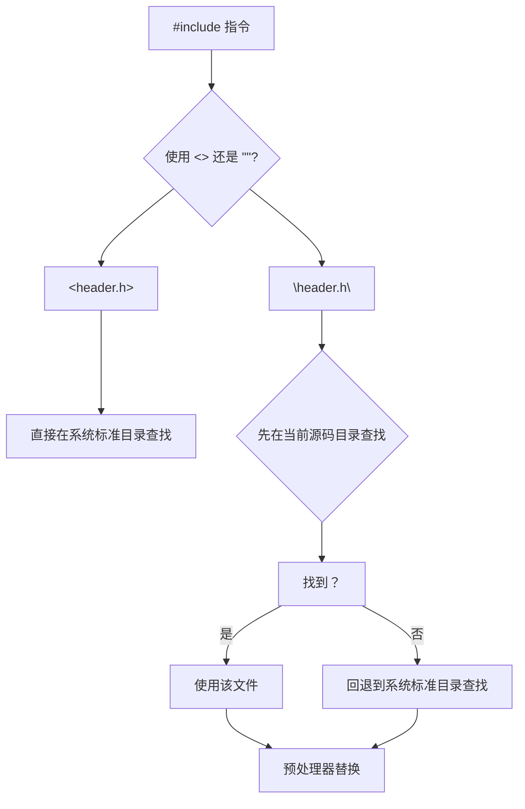
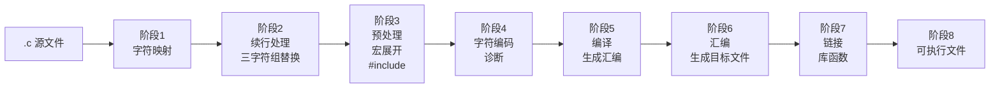
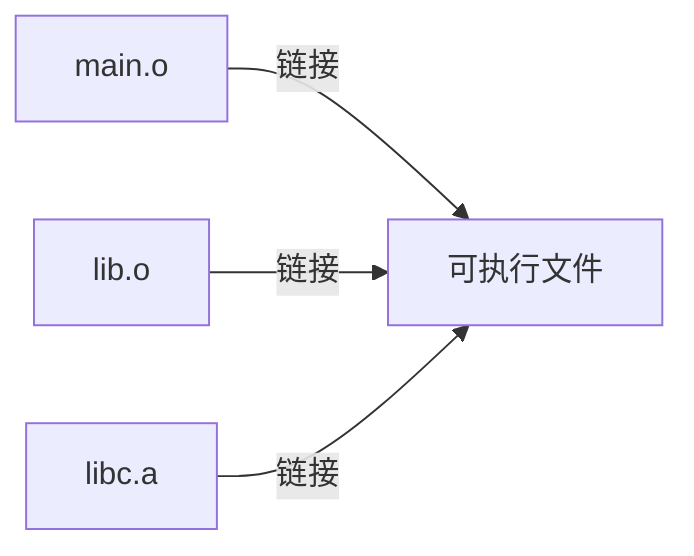
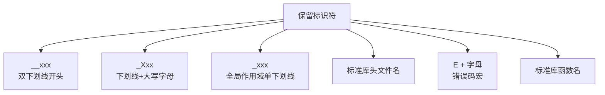

+++
title = "第 3 章：C 程序基本结构"
weight = 30
date = "2026-03-29T22:34:00+08:00"
type = "docs"
description = ""
isCJKLanguage = true
draft = false
+++

# 第 3 章：C 程序基本结构

> 🧐 想象一下，你要建一座房子。首先你得知道房子有哪些"标配房间"吧？门在哪里、客厅怎么走、窗户朝哪开。C 程序也一样，有它固定的"房间格局"，你不按这个格局来，编译器（compiler）就一脸懵，不知道你想干嘛。
>
> 本章就是带你参观 C 语言的"样板间"，把一个最最基本的 C 程序掰开揉碎讲清楚。别怕，咱们从最最简单的例子开始，保证你看完之后对 C 程序的结构了然于胸，甚至能跟朋友吹嘘："嘿，C 程序嘛，我懂！"

---

## 3.1 `#include` 预处理指令：`<>` vs `""` 的搜索路径差异

先来看一段代码，这大概是 C 语言里你能写出的最简程序之一了：

```c
#include <stdio.h>

int main(void) {
    printf("Hello, 扣钉啦！\n");
    return 0;
}
```

你有没有好奇过 `#include <stdio.h>` 这一行是怎么回事？

`#include` 是一个**预处理指令**（preprocessor directive），顾名思义，它在正式编译之前就"动手"了。你可以把它理解成——**"拷贝粘贴小能手"**。当你写 `#include <stdio.h>` 时，预处理器会找到 `stdio.h` 这个文件（standard input/output header，标准输入输出头文件），然后把它的**全部内容**原封不动地"粘贴"到你的代码里。

那 `<stdio.h>` 和 `"stdio.h"` 有什么区别呢？区别大了去了：

### 尖括号 `< >`：系统标准目录搜索

用尖括号，告诉预处理器：**"去系统默认的地方找这个文件，别来烦我！"** 系统会到编译器内置的标准 include 目录去找。在 Linux/macOS 上通常是 `/usr/include`，在 Windows 上取决于你的 IDE 设置。

### 双引号 `""`：先本地后系统

用双引号，预处理器会先在**当前目录**（也就是源代码所在的目录）里找，找不到才去系统目录"碰碰运气"。

### 一图胜千言



### 实战演示

假设你有这样的目录结构：

```
my_project/
├── main.c
├── my_utils.h        ← 你自己写的头文件
└── utils/
    └── helper.h      ← 子目录里的头文件
```

在 `main.c` 中：

```c
#include "my_utils.h"           // 先在当前目录找，找到了！
#include "utils/helper.h"       // 也可以用相对路径指定子目录
#include <stdio.h>              // 系统头文件，用尖括号
```

```c
// utils/helper.c
#include "../my_utils.h"        // 从子目录回退到上级目录找
#include <assert.h>             // 系统头文件
```

> 💡 **小技巧**：自己写的头文件用双引号，系统头文件用尖括号。这是一个约定俗成的规矩，体现了"谁写的谁负责"的精神。

### 万一找不到会怎样？

编译时会报错，类似这样：

```
fatal error: my_missing_header.h: No such file or directory
```

意思就是：**"我翻遍了所有能找的地方，都没找到你小子说的这个文件，你确定它存在吗？"**

---

## 3.2 `main` 函数：程序入口

如果说 C 程序是一座大楼，那 `main` 函数就是它的**正门**——程序运行时，CPU 从这里开始执行指令。没有 `main`？对不起，这程序没法跑，编译器会毫不客气地给你一个错误。

### 标准写法：`int main(void)`

```c
int main(void) {
    // 你的代码写在这里
    return 0;
}
```

这里 `int` 表示 `main` 函数的**返回值类型**（return type）是整数（integer），`main` 执行完毕后向操作系统返回一个整数。通常返回 0 表示"一切正常，没毛病"，返回非零表示"出了点岔子"。

`void` 在函数参数列表里表示"这个函数不接受任何参数"。在 C 语言里，不写 `void` 也是合法的（比如 `int main()`），但含义略有不同（空参数列表表示参数个数未知），所以**显式写 `void` 是更好的习惯**。

### ⚠️ 危险警告：`void main()` 是非标准扩展，切勿使用！

有些老旧的编译器、某些嵌入式开发环境、或者一些野路子教材会教你写：

```c
// ❌ 错误！不要这样写！
void main() {
    printf("这是错的！\n");
}
```

**千万别学！** 这是**非标准的**（non-standard）。ISO C 标准从来没有定义过 `void main()` 这种形式。虽然在一些特定的编译器/平台上它可能碰巧能跑，但这不代表它是正确的。

> 🚨 **血的教训**：如果你去面试，面试官看到你写 `void main()`，可能直接在心里给你扣分。养成好习惯，从今天起只用 `int main(void)`！

### 有些平台支持 `int main(int argc, char *argv[])`

如果你想让程序运行时接收命令行参数（比如 `myprogram.exe --help`），可以这么写：

```c
#include <stdio.h>

int main(int argc, char *argv[]) {
    // argc: 参数个数（argument count）
    // argv: 参数列表（argument vector），第一个是程序名
    printf("收到了 %d 个参数\n", argc);
    for (int i = 0; i < argc; i++) {
        printf("  argv[%d] = %s\n", i, argv[i]);
    }
    return 0;
}
```

运行结果：

```
收到了 1 个参数
  argv[0] = ./a.out

收到了 3 个参数
  argv[0] = ./a.out
  argv[1] = hello
  argv[2] = world
```

> 💡 `argc` 至少是 1（程序名本身），`argv[argc]` 是 `NULL`（空指针）。

### `return 0;` 真的需要吗？

在 `main` 函数末尾，`return 0;` 其实是可选的（从 C99 开始）。如果你省略它，编译器会帮你隐式地加上 `return 0;`。但为了代码清晰明了，**建议还是显式写出来**。

---

## 3.3 `printf` 与转义序列

`printf` 是 C 语言里最常用的**格式化输出函数**（formatted output function），来自 `stdio.h`，专门负责把数据打印到屏幕上。

### 基本用法

```c
#include <stdio.h>

int main(void) {
    printf("你好，世界！\n");          // 输出: 你好，世界！
    printf("数字: %d\n", 42);           // 输出: 数字: 42
    printf("小数: %.2f\n", 3.14159);    // 输出: 小数: 3.14
    printf("字符: %c\n", 'A');           // 输出: 字符: A
    printf("字符串: %s\n", "Hello");    // 输出: 字符串: Hello

    return 0;
}
```

### 什么是转义序列（Escape Sequence）？

你注意到上面的 `\n` 了吗？这不是两个字符，而是一个**转义序列**——以反斜杠 `\` 开头的特殊字符，用于表示那些"看不见的"或者"不好直接写"的字符。

#### 常用转义序列一览

| 转义序列 | 含义 | 生活中的比喻 |
|---------|------|-------------|
| `\n` | 换行（newline） | 打字机回车换行 |
| `\t` | 制表符（horizontal tab） | Word 里按 Tab，效果是空出一段 |
| `\r` | 回车（carriage return） | 打字机把手推回左边 |
| `\b` | 退格（backspace） | 键盘上的 Backspace |
| `\a` | 警告/响铃（alert） | 电脑发出"滴"的一声 |
| `\\` | 反斜杠本身 | 要打一个 \ |
| `\'` | 单引号本身 | 在字符串里打单引号 |
| `\"` | 双引号本身 | 在字符串里打双引号 |
| `\0` | 空字符（null character） | 字符串的"句号"，标志字符串结束 |

### 实战演示

```c
#include <stdio.h>

int main(void) {
    printf("第一行\n");          // 换行，光标移到下一行开头
    printf("第二行\t");          // 制表符，空出一段
    printf("对齐了\n");

    printf("ABC\bD\n");           // 退格，D 覆盖 C
                                  // 输出: ABD

    printf("双引号\"里面\"有双引号\n");
    // 输出: 双引号"里面"有双引号

    printf("反斜杠\\slash\n");
    // 输出: 反斜杠\slash

    printf("Hello\rWorld\n");     // 回车，光标回到行首
                                  // 输出: World

    printf("C:\\Users\\name\n");  // Windows 路径风格
    // 输出: C:\Users\name

    return 0;
}
```

运行结果：

```
第一行
第二行   对齐了
ABD
双引号"里面"有双引号
反斜杠\slash
World
C:\Users\name
```

### `\n` vs `\r`：傻傻分不清？

在 **Linux/macOS** 上，换行符是 `\n`（LF, Line Feed）。
在 **Windows** 上，传统上用 `\r\n`（CRLF, Carriage Return + Line Feed）。
在 **老 Mac**（OS X 之前）上，只用 `\r`。

现代编译器通常能自动处理，所以一般你只用 `\n` 就够了。但如果你写跨平台代码涉及文件读写，这事儿得留个心眼。

### `\0`：字符串的"隐形保镖"

每个字符串常量末尾都有一个隐藏的 `\0`（空字符），它标志着字符串的结束。C 语言的字符串处理函数都靠它来知道"到哪里为止"。

```c
#include <stdio.h>

int main(void) {
    char name[] = "ZhangSan";   // 编译器自动在末尾加 \0

    // 用循环手动打印字符串
    int i = 0;
    while (name[i] != '\0') {
        printf("%c", name[i]);
        i++;
    }
    printf("\n");

    return 0;
}
```

> 💡 编译器在处理 `"ZhangSan"` 时，偷偷在后面多加了一个字节，存的就是 `\0`。所以 `strlen("ZhangSan")` 返回 8，但 `sizeof("ZhangSan")` 返回 9——多出来那个就是 `\0`。

---

## 3.4 注释规范

注释（comment）是什么？**给人类看的说明文字，编译器直接无视。** 好的注释能让你的代码三年后自己还能看懂，烂的注释比没注释还害人。

### 注释的两种形式

#### 单行注释：`//`

```c
#include <stdio.h>

int main(void) {
    // 这是单行注释，双斜杠后面的内容编译器完全忽略
    int x = 10;  // 行尾也可以加注释
    return 0;
}
```

#### 多行注释：`/* ... */`

```c
#include <stdio.h>

int main(void) {
    /*
     * 这是多行注释
     * 可以写很多很多行
     * 很适合用来写详细的说明
     */
    int y = 20;
    return 0;
}
```

### ⚠️ `//` 是 C99 才支持的！

这是新手很容易踩的坑。`//` 单行注释是 **C99** 标准（1999年）才引入的。在此之前，C 语言只有 `/* */` 风格的注释。

如果你用古老的 **C89/ANSI C** 标准编译，`//` 会报错或者产生奇怪的行为：

```c
int x = 10; // 这是注释  <-- 在 C89 下，// 后面的 x 被当成代码，GG
```

> ⚡ **建议**：现在写代码一律用 C99 及以后的标准（`gcc -std=c11`），放心大胆用 `//`。如果有人让你用 C89，那可能是上世纪的教材，赶紧跑。

### 注释的"潜规则"

1. **注释要解释"为什么"，不是"是什么"**。代码本身已经说明了"是什么"，注释要说清楚动机和意图。

   ```c
   // ❌ 烂注释
   i++;  // i 加 1

   // ✅ 好注释
   i++;  // 跳过已处理的用户，因为数组紧凑后下标要前移
   ```

2. **保持注释和代码同步**。改代码不改注释，比没注释还误导人。

3. **不要用注释来"注释掉"代码**，尤其是在协作项目里。用版本控制（git）来管理历史。

---

## 3.5 C 程序的 8 个翻译阶段

你知道你写的 `.c` 文件是怎么变成可执行程序的吗？这中间经历了**8个翻译阶段**（translation phases）。听起来吓人？没关系，咱们一个个拆开来看。



### 3.5.1 字符映射与换行符标准化

**阶段1**：把源文件里的所有字符（以及三字符组，详见下节）映射到**源字符集**（source character set）。在这个阶段，文本行被拆解成独立的字符序列。

**阶段2**：续行处理在此完成，每行末尾的换行符被统一标准化（LF 或 CR+LF 转为统一的换行表示）。同时**三字符组**（trigraphs）在这个阶段被替换掉。

> 💡 源文件在阶段1之前都还是文本，阶段1之后编译器就只看到一串字符流了。

### 3.5.2 续行处理、三字符组（trigraph）替换

#### 续行处理

如果一行代码太长了，可以用 `\`（反斜杠）在行末**续行**：

```c
#include <stdio.h>

int main(void) {
    printf("这是一段非常非常长长长长"
           "可以拆成多行的字符串\n");
    return 0;
}
```

编译后和单行效果完全一样，因为 `\` 把两行"粘"在一起了。

#### 三字符组（Trigraph）

三字符组是 C89 引入的稀奇古怪的东西，目的是照顾那些键盘上没有某些特殊字符的设备。

| 三字符组 | 替换为 |
|---------|-------|
| `??=` | `#` |
| `??/` | `\` |
| `??(` | `[` |
| `??)` | `]` |
| `??<` | `{` |
| `??>` | `}` |
| `??=` | `#` |
| `??'` | `^` |
| `??!` | `|` |
| `??-` | `~` |

> 😂 举个例子：`??=` 会被替换成 `#`，所以 `??=include <stdio.h>` 会被当成 `#include <stdio.h>`。听起来很荒谬？确实！**C99 将其废弃（deprecated），C23 直接移除**了。所以现代 C 代码里你不需要（也不应该）使用三字符组。

### 3.5.3 预处理：宏展开、`#include` 插入

**阶段3** 是**预处理**（preprocessing），这是编译前最重要的一步。

预处理指令（以 `#` 开头的行）在这个阶段被执行：
- `#include`：把头文件内容"粘贴"进来
- `#define`：定义宏（macro），做文本替换
- `#if` / `#ifdef`：条件编译
- 等等

```c
#define PI 3.14159    // 定义宏 PI，之后所有 PI 都会被替换成 3.14159

#include <stdio.h>    // 插入 stdio.h 的内容

int main(void) {
    printf("圆周率约等于 %.5f\n", PI);
    return 0;
}
```

预处理后，`PI` 就消失了，全部变成了 `3.14159`。你可以通过 `gcc -E` 看到预处理后的结果。

### 3.5.4 编译 → 汇编 → 目标文件

**阶段4**：经过预处理的代码被交付给**编译器**（compiler）。编译器进行语法分析、语义分析，生成**翻译单元**（translation unit）。同时执行各种诊断检查（比如"这行语法有问题"）。

**阶段5**：编译器生成的中间表示被翻译成特定 CPU 架构的**汇编语言**（assembly）。

**阶段6**：**汇编器**（assembler）把汇编代码变成**目标文件**（object file），在 Linux/macOS 上是 `.o` 文件，在 Windows 上是 `.obj` 文件。


### 3.5.5 链接 → 可执行文件

**阶段7**：**链接器**（linker）出场了。它把一个或多个目标文件（以及你用到的库文件）"拼装"在一起解析符号引用（symbol reference）。

比如你调用 `printf`，链接器会去标准 C 库（libc）里找到 `printf` 的实现，把它的机器码合并进来。

**阶段8**：最终生成**可执行文件**（executable）。在 Linux/macOS 上没有扩展名，在 Windows 上是 `.exe`。



> 💡 链接分为**静态链接**（static linking，把库代码直接拷贝进来）和**动态链接**（dynamic linking，程序运行时才加载库）。动态链接的可执行文件体积更小，而且多个程序可以共享同一份库代码，节省内存。

---

## 3.6 编译警告：`gcc -Wall -Wextra -pedantic -Werror -Wconversion -Wshadow`

编译器不只是"报错"（error），它还会给你"警告"（warning）——那些代码可能有问题但还能编译的地方。**警告不是开玩笑**，很多bug的根源就是忽略了警告。

### GCC 常用警告选项

| 选项 | 含义 |
|-----|------|
| `-Wall` | 开启"所有常用警告"（enable all basic warnings） |
| `-Wextra` | 开启额外的一些有用警告（extra warnings） |
| `-pedantic` | 严格遵循 ISO C 标准，不放过任何非标准扩展 |
| `-Werror` | 把警告当错误处理（warnings as errors） |
| `-Wconversion` | 警惕隐式类型转换可能丢失数据 |
| `-Wshadow` | 检测变量遮蔽（内层变量和外层变量同名） |
| `-Wformat` | 检查 printf/scanf 的格式字符串是否匹配 |
| `-Wunused` | 检测未使用的变量或函数 |

### 实战演示

```c
#include <stdio.h>

int main(void) {
    int a = 10;
    double b = 3.14;

    // Wconversion: int 转 double 通常 OK，但 double 转 int 可能丢数据
    int c = b;  // 警告： implicit conversion from 'double' to 'int'

    // Wshadow: 内层 i 遮蔽了外层 i
    for (int i = 0; i < 3; i++) {
        printf("i = %d\n", i);
        for (int i = 0; i < 2; i++) {  // 警告： declaration of 'i' shadows a previous local
            printf("  inner i = %d\n", i);
        }
    }

    // Wunused: 未使用的变量
    int unused_var = 42;  // 警告： unused variable 'unused_var'

    return 0;
}
```

### 最佳实践：`-Wall -Wextra -Werror`

```bash
gcc -Wall -Wextra -Werror -pedantic -o myprogram myprogram.c
```

> 💡 建议把 `-Werror` 带上，这样有任何警告都会导致编译失败，逼着你把每个警告都修掉。很多大型项目的 CI/CD 流水线都是这样配置的。

---

## 3.7 编译选项实战：`-std=c11` `-O2` `-g` `-D` `-I` `-L` `-l` `-fsanitize=address`

光会写代码不会编译，就像光会做饭不会开火。gcc 的编译选项几十上百个，这里只讲最常用的那些。

### `-std=c11`：指定 C 标准

```bash
gcc -std=c11 myprogram.c -o myprogram    # 使用 C11 标准
gcc -std=c17 myprogram.c -o myprogram    # 使用 C17 标准
gcc -std=c23 myprogram.c -o myprogram    # 使用 C23 标准
gcc -std=c99 myprogram.c -o myprogram    # 使用 C99 标准（过时了）
```

### `-O2`：优化级别

| 选项 | 优化级别 | 适用场景 |
|-----|---------|---------|
| `-O0` | 无优化（默认） | 调试时，保留完整调试信息 |
| `-O1` | 基本优化 | 平衡编译速度和性能 |
| `-O2` | 较高优化 | 正式发布，性能更好 |
| `-O3` | 最高优化 | 极致性能，可能增加二进制体积 |
| `-Ofast` | 激进优化 | 忽略严格 IEEE 浮点，可能影响精度 |

```bash
gcc -O2 myprogram.c -o myprogram    # 生产环境用 O2
gcc -O0 -g myprogram.c -o myprogram  # 调试时用 O0+g
```

### `-g`：生成调试信息

没有 `-g`，gdb（GNU debugger）没法调试，因为没有行号和变量名的对应关系。

```bash
gcc -g myprogram.c -o myprogram    # 带上调试信息
```

### `-D`：定义宏

```c
#include <stdio.h>

int main(void) {
#ifdef DEBUG
    printf("调试模式：正在计算...\n");
#endif
    printf("结果: %d\n", 42);
    return 0;
}
```

```bash
gcc -DDEBUG myprogram.c -o myprogram    # 定义宏 DEBUG，相当于文件里写了 #define DEBUG
```

### `-I`：指定头文件搜索路径

```bash
gcc -I./include myprogram.c -o myprogram
```

### `-L` 和 `-l`：指定库搜索路径和链接库

```bash
gcc -L/usr/local/lib -lm myprogram.c -o myprogram
# -L: 指定库搜索路径
# -l: 链接名为 libm.a（数学库）的库
```

### `-fsanitize=address`：地址Sanitizer

这是个**神器**！如果你写程序遇到了神秘的内存问题（越界访问、使用未初始化内存、释放后使用等），用 AddressSanitizer（ASan）来检测。

```bash
gcc -fsanitize=address -g -O1 myprogram.c -o myprogram
./myprogram    # 如果有内存问题，ASan 会在运行时打印详细报告
```

> 💡 ASan 是现代 C/C++ 开发的标准工具，Google 内部的 C++ 代码库用它做持续测试。VS Code 配置 clangd 时也可以开启 ASan。

### 综合示例

```bash
gcc -std=c11 -O2 -Wall -Wextra -Werror -g \
    -DDEBUG_MODE -I./include -L./lib \
    -fsanitize=address \
    myprogram.c -lm -o myprogram
```

这条命令的意思是：
- 用 C11 标准
- 开启 2 级优化
- 开启所有警告并把警告当错误
- 带调试信息
- 定义 `DEBUG_MODE` 宏
- 在 `./include` 找头文件，在 `./lib` 找库
- 开启地址消毒剂
- 链接数学库
- 输出可执行文件 `myprogram`

---

## 3.8 C 标识符规则：C99 起支持 Unicode 通用字符名，C23 起 XID_Start/XID_Continue 规则

**标识符**（identifier）就是变量名、函数名、类型名等东西的名字。你不能随便起名，得遵守规则。

### 基本命名规则（C89 以来就有的）

1. 字符集：只能包含**字母**（A-Z, a-z）、**数字**（0-9）和**下划线**（`_`）
2. 首字符：不能以数字开头
3. 大小写敏感：`name` 和 `Name` 是两个不同的标识符
4. 不能是**关键字**（keyword/reserved word），比如 `if`、`while`、`int` 等

```c
int abc;       // ✅ 合法
int _private;  // ✅ 合法（但不推荐，以下划线开头的有些是保留的）
int 2fast;     // ❌ 非法，数字开头
int my-var;    // ❌ 非法，减号不是标识符的有效字符
int int;       // ❌ 非法，int 是关键字
```

### C99 增强：Unicode 通用字符名

从 C99 开始，你可以用 Unicode 通用字符名（Universal Character Name）来命名标识符，这样就可以用中文、日文等语言命名变量了！

语法是 `\uXXXX`（4位十六进制）或 `\UXXXXXXXX`（8位十六进制）：

```c
#include <stdio.h>

int \u4e2d\u6587\u53d8\u91cf = 100;  // 中文变量名："中文变量"

int main(void) {
    printf("中文变量 = %d\n", \u4e2d\u6587\u53d8\u91cf);
    return 0;
}
```

> 💡 在实际编码中，直接写中文变量名往往比写 `\uXXXX` 更方便——现代编译器（GCC、Clang、MSVC）都支持 UTF-8 源码，直接写 `int 中文变量 = 100;` 就行。但 `\u` 语法是给那些不支持 UTF-8 的老环境准备的。

### C23 增强：XID_Start 和 XID_Continue 规则

C23 采用了 Unicode 的 **XID_Start** 和 **XID_Continue** 属性来确定哪些字符可以作为标识符的开头字符和后续字符。这是一个更标准、更国际化的规则。

简单来说，只要一个 Unicode 字符被标记为"可以用作编程语言的标识符"，C23 就支持。理论上，全世界各种语言的字符都可以作为标识符。

### 标识符的长度

C 标准不规定标识符的最大长度，但编译器通常有实现限制。标准库宏 `sizeof` 相关的限制一般不影响日常编程。

---

## 3.9 C 语言保留标识符（5 条规则）

C 语言有一些标识符是**保留的**（reserved），你不应该使用它们，否则可能产生未定义行为（undefined behavior）。

### 保留标识符的 5 条规则

**规则 1：以双下划线 `__` 开头或单下划线加大写字母 `_X` 开头的标识符，全部保留**

```c
int __my_var;   // ❌ 危险！编译器可能内部使用
int _MyVar;     // ❌ 危险！
```

**规则 2：以单下划线 `_` 开头的标识符，在全局命名空间中保留**

```c
// 在文件作用域（所有函数外面）:
int _hidden;    // ❌ 危险！可能和编译器/链接器冲突
```

> 💡 简而言之：**永远不要用下划线开头的标识符**，除非你非常清楚自己在干什么。

**规则 3：所有标准库头文件名是保留的**

```c
#include "stdio.h"     // ❌ 你自己创建的头文件不要叫这个名字！
#include "stdlib.h"    // ❌
#include "my_stdio.h"  // ✅ 加个前缀就安全了
```

**规则 4：标准库中所有以 `E` 开头后跟大写字母或小写字母的宏名是保留的**（用于错误码）

```c
#define EIO 5      // ❌ 标准库已经定义了 EIO 等错误码
#define MY_EIO     // ❌
```

**规则 5：标准库标识符（含函数名）不应被重定义或重复声明**

```c
int printf = 42;   // ❌ 你把标准库的 printf 重定义了，灾难！
```

### 一图总结



> 💡 结论：**不要用下划线开头的名字**，不要定义和标准库同名的宏或函数。这是 C 语言的"交规"，违反了可能不会立刻出事故，但迟早会翻车。

---

## 3.10 命名规范（snake_case / camelCase / PascalCase）

代码写得对不对是一回事，看起来舒不舒服是另一回事。好的命名规范让代码**自解释**（self-documenting），看名字就知道是干啥的。

### 三大命名风格

#### snake_case（蛇形命名法）

所有字母小写，单词之间用下划线分隔。

```c
int student_age;
int max_buffer_size;
void calculate_total_price(void);
```

> 💡 这是 **C 语言社区最常用的风格**，因为 C 语言标准库本身就是这么命名的（`snprintf`、`strlen`、`memcpy`）。

#### camelCase（驼峰命名法）

第一个单词小写，后续单词首字母大写，看起来像驼峰。

```c
int studentAge;       // 驼峰
int maxBufferSize;    // 驼峰
```

> 💡 C 语言里用 camelCase 的人相对较少，但如果你之前写 JavaScript/Java/Python，迁移过来可能更习惯这个风格。

#### PascalCase（帕斯卡命名法）

每个单词首字母都大写。

```c
int StudentAge;       // 帕斯卡
int MaxBufferSize;    // 帕斯卡
```

> 💡 C 语言里 PascalCase 通常用于**类型名**（typedef、struct tag）和**常量宏**（有些项目这样用）。

### 一些常见约定

```c
// 结构体标签：通常用 snake_case 或 PascalCase
struct StudentRecord {     // PascalCase
    char name[64];
    int age;
};

// 类型别名：常用 _t 后缀（C 标准库就是这样：`size_t`, `ptrdiff_t`）
typedef unsigned long size_t;
typedef struct StudentRecord Student;  // 简短的类型名

// 常量宏：全大写 + 下划线
#define MAX_BUFFER_SIZE 1024
#define PI 3.14159

// 枚举值：全大写或 PascalCase
enum Color { RED, GREEN, BLUE };              // 全大写
enum Status { Success, Failure, Pending };    // PascalCase
```

### 项目风格统一最重要

命名风格没有绝对的对错，但**一个项目里必须统一**最关键。混用 snake_case 和 camelCase 会让代码看起来像"穿搭灾难"。

> 💡 如果你加入一个开源项目，第一件事就是看它的 `CONTRIBUTING.md` 或者 `.clang-format` / `.editorconfig`，了解项目的代码风格规范，然后老老实实遵守。

---

## 本章小结

本章我们一起参观了 C 程序的基本结构这座"样板间"，主要知识点包括：

1. **`#include` 预处理指令**：`<>` 从系统标准目录找头文件，`""` 先本地再系统。预处理器会在编译前把头文件内容原封不动地粘贴进来。

2. **`main` 函数**：程序入口点，标准签名是 `int main(void)`。**绝对不要写 `void main()`**，那是非标准的野路子写法。

3. **`printf` 和转义序列**：`printf` 是格式化输出函数。`\n`（换行）、`\t`（制表符）、`\r`（回车）、`\0`（空字符）等转义序列用于表示"看不见的"字符。

4. **注释规范**：单行注释 `//`（C99+）和多行注释 `/* */`（C89 就支持）。注释解释"为什么"，不要解释"是什么"。

5. **C 程序的 8 个翻译阶段**：字符映射 → 续行/三字符组 → 预处理 → 诊断/编码 → 编译 → 汇编 → 链接 → 可执行文件。

6. **编译警告**：学会用 `-Wall -Wextra -pedantic -Werror` 把所有警告都当错误处理。警告是朋友，不是噪音。

7. **常用编译选项**：`-std=c11`（C标准）、`-O2`（优化）、`-g`（调试信息）、`-D`（定义宏）、`-fsanitize=address`（内存问题检测）。

8. **标识符规则**：C99 支持 Unicode 通用字符名，C23 采用 XID_Start/XID_Continue 规则，可以轻松使用中文变量名。

9. **保留标识符 5 条规则**：双下划线、下划线加大写、单下划线全局、标准库头文件名、以 E 开头的错误码宏，都是雷区，不要踩。

10. **命名规范**：snake_case（推荐）、camelCase、PascalCase。风格要统一，项目里不能混用。

> 🎉 恭喜你！C 语言的"毛坯房"你已经逛完了。接下来几章我们会深入探讨数据类型、运算符、控制语句等"装修工程"，让这座房子真正变成你的家！

---

*下一章预告：数据类型和变量——C 语言的"建筑材料"*
