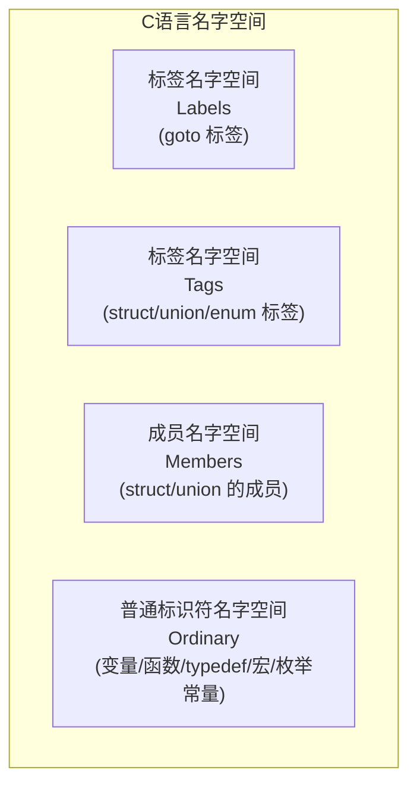
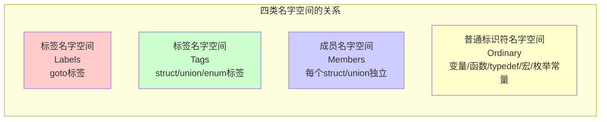
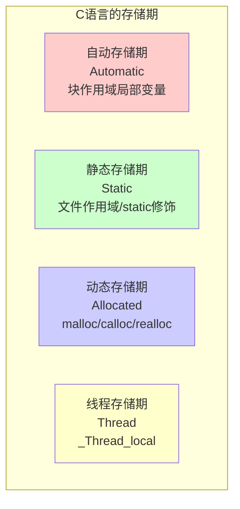

+++
title = "第 4B 章：作用域、链接与存储期 —— 程序的'地盘'之争"
weight = 40
date = "2026-03-29T22:34:00+08:00"
type = "docs"
description = ""
isCJKLanguage = true
draft = false
+++

# 第 4B 章：作用域、链接与存储期 —— 程序的"地盘"之争

> *"C 语言的变量啊，它们也有自己的"势力范围"。有的变量是"宅男"，只在自己的小房间里活动；有的却是"社交达人"，满世界都能找到它。想知道你写的变量是哪种类型？那就跟我来！"*

欢迎来到 C 语言的"地盘"篇！这一章我们要聊三个超级重要的概念：**作用域（Scope）**、**链接（Linkage）** 和 **存储期（Storage Duration）**。别被这些名词吓到，它们其实就是 C 语言定义"谁能看见我"和"我能活多久"的规则。学会了这些，你对 C 的理解直接上一个台阶，写代码的时候也能少踩很多坑。

---

## 4B.1 作用域（Scope）

**作用域**听起来很高大上，其实说白了就是：**这块代码里，有个名字（标识符）我能用，出去了就不认识我了。** 就像你家的WiFi，在卧室信号满格，走到厨房可能就没了——WiFi也有它的"作用域"。

在 C 语言中，一共有四种作用域，听我慢慢道来。

### 4B.1.1 块作用域（Block Scope）

**块作用域**是 C 语言里最常见的作用域。什么叫"块"？就是一对大括号 `{}` 围起来的那段代码。变量定义在块里，那它就只能在这个块里被认识，出了这个块，编译器就当它不存在。

想象一下：你在一栋大楼里上班，你的工位在3楼的305房间。你在工位上喊"我的水杯"，整层楼都知道是你的。但你跑到5楼去喊，对不起，没人知道你在说啥——因为你的"作用域"只覆盖305房间。

```c
#include <stdio.h>

int main(void) {
    int age = 25;  // 这个 age 的作用域从这开始
    printf("我的年龄是 %d\n", age);  // ✅ 能访问，输出：我的年龄是 25

    if (age >= 18) {
        int isAdult = 1;  // isAdult 只在这个 if 块里存在
        printf("已经是成年人了，isAdult = %d\n", isAdult);  // ✅ 输出：已经是成年人了，isAdult = 1
    }

    // 出了 if 块，isAdult 就消失了
    // printf("%d", isAdult);  // ❌ 编译错误！isAdult 在这看不见

    return 0;
}
```

> 代码解读：`isAdult` 变量在 `if` 的大括号里定义了，出了括号就不存在了。如果你硬要访问，编译器会给你一个友好的错误："喂，这个变量我不认识！"

再来看一个更明显的例子：

```c
#include <stdio.h>

int main(void) {
    {
        int x = 100;  // 这个 x 只属于这个块
        printf("块里的 x = %d\n", x);  // ✅ 输出：块里的 x = 100
    }

    // printf("%d", x);  // ❌ 编译错误！x 已经离开了它的作用域

    int x = 200;  // 这是一个全新的 x，和上面的那个没有任何关系
    printf("块外的 x = %d\n", x);  // ✅ 输出：块外的 x = 200

    return 0;
}
```

> 小贴士：块作用域的变量，在块结束时就"死亡"了。它的内存会被释放（我们后面讲存储期时会详细说）。

for 循环、while 循环、if 语句后面的单行语句其实也都是"隐式块"——只不过你没有写大括号而已：

```c
#include <stdio.h>

int main(void) {
    for (int i = 0; i < 3; i++) {
        // 这里的 i 是循环变量，它的作用域就是这个 for 循环
        printf("i = %d\n", i);  // 输出：i = 0, i = 1, i = 2
    }

    // printf("%d", i);  // ❌ 编译错误！i 只在 for 循环里存在

    return 0;
}
```

### 4B.1.2 文件作用域（File Scope）

**文件作用域**是 C 语言中"最开放"的作用域。如果一个变量或函数定义在所有函数外面（在文件的最顶层），那它就拥有了文件作用域——这个文件里的任何函数都能看到它。

这就像一栋楼的管理员在大厅贴了一张公告，这栋楼的所有住户都能看到。不像你房间里的WiFi只能覆盖一个房间，这是**整栋楼的广播**。

```c
#include <stdio.h>

// globalVar 定义在所有函数外面，拥有文件作用域
int globalVar = 42;

void printInfo(void);  // 函数声明，也有文件作用域

int main(void) {
    printf("globalVar = %d\n", globalVar);  // ✅ 可以访问，输出：globalVar = 42
    globalVar = 100;  // ✅ 也可以修改
    printf("修改后 globalVar = %d\n", globalVar);  // 输出：修改后 globalVar = 100

    printInfo();  // ✅ 调用函数

    return 0;
}

void printInfo(void) {
    // 函数也能访问文件作用域的变量
    printf("在 printInfo 中看到 globalVar = %d\n", globalVar);  // 输出：在 printInfo 中看到 globalVar = 100
}
```

> 温馨提醒：我们通常把具有文件作用域的变量叫做**全局变量（global variable）**。全局变量虽好，但不要滥用——用多了会让程序变得难以理解和维护，就像一栋楼的住户都往大厅贴公告，最后谁的信息都看不清了。

### 4B.1.3 函数作用域（Function Scope）

**函数作用域**是一个比较"小众"的作用域，它**只和 `goto` 语句的标签有关**。什么？C 语言不是号称没有 `goto` 吗？是的，C 语言确实保留了 `goto`（虽然大多数人不推荐使用），而 `goto` 的标签就需要函数作用域。

函数作用域的意思是：**一个 `goto` 标签，在它所在的整个函数里都有效**，不管标签写在哪里。想象一下，你在餐厅用编号标记餐桌（比如"5号桌"），服务员在整个餐厅范围内喊"5号桌的菜好了"，你都能听到——这就是函数作用域。

```c
#include <stdio.h>

int main(void) {
    int i = 0;

    // goto 标签可以写在后面，但前面也能跳过来
    goto skip;

    i = 100;  // 这行会被跳过！
    printf("这行不会执行，i = %d\n", i);

skip:
    // 标签后面跟着一个冒号
    printf("跳到这里了，i = %d\n", i);  // 输出：跳到这里了，i = 0

    return 0;
}
```

```c
#include <stdio.h>

int process(int value) {
    if (value < 0) {
        goto error;  // 跳到 error 标签
    }

    if (value == 0) {
        goto zero;  // 跳到 zero 标签
    }

    // 正常处理
    return value * 2;

zero:
    return 0;  // value 是 0 时到这里

error:
    return -1;  // value 是负数时到这里
}

int main(void) {
    printf("process(5) = %d\n", process(5));   // 输出：process(5) = 10
    printf("process(0) = %d\n", process(0));   // 输出：process(0) = 0
    printf("process(-3) = %d\n", process(-3)); // 输出：process(-3) = -1

    return 0;
}
```

> 代码解读：`error` 标签写在函数靠后的位置，但在函数前部就能用 `goto error` 跳过来——因为标签拥有函数作用域，函数里任何地方都能找到它。

### 4B.1.4 函数原型作用域（Function Prototype Scope）

**函数原型作用域**是最"短命"的作用域，只存在于函数原型声明的那一行。简单来说，函数参数列表里的名字，在函数原型结束后就消失了，编译器根本不在乎你写的是什么名字。

这就像你去快递站取件，报上快递单号就行，**不需要报你的名字**。快递员说"张三的快递"，你报"李四的单号"，一样能取走——因为快递员只看单号（类型），不看名字。

```c
#include <stdio.h>

// 函数原型中，参数名 x 和 y 其实是"透明"的
// 你可以写 int add(int x, int y)
// 也可以写 int add(int a, int b)
// 甚至可以写成 int add(int, int) 省略名字都行
int add(int x, int y);  // x 和 y 在这行结束后就"消失"了

int add(int a, int b) {
    return a + b;
}

int main(void) {
    int result = add(3, 5);
    printf("3 + 5 = %d\n", result);  // 输出：3 + 5 = 8
    return 0;
}
```

> 实用技巧：在编写函数原型时，参数名字其实是可选的。很多代码会省略它们（写成 `int add(int, int)`），因为这些名字只在函数原型这一行"存活"，没有任何实际作用。不过写上名字有时候能让代码更易读，这取决于你的风格。

### 4B.1.5 标识符遮蔽（Hiding）

**标识符遮蔽**（也叫"名字遮蔽"或"隐藏"）是指：**内层作用域可以"遮蔽"外层作用域的同名标识符**。就像你在公司有个英文名叫"Bob"，但你家里的小名也叫"Bob"。当你妈喊"Bob"的时候，她叫的是你，不是你公司的同事——因为在家里，你的"小名Bob"遮蔽了公司的"英文名Bob"。

```c
#include <stdio.h>

int value = 10;  // 全局变量 value

int main(void) {
    printf("全局变量 value = %d\n", value);  // ✅ 访问全局 value，输出：全局变量 value = 10

    int value = 20;  // 这是一个新的局部变量，它遮蔽了全局变量
    printf("局部变量 value = %d\n", value);  // ✅ 访问局部 value，输出：局部变量 value = 20

    {
        int value = 30;  // 更内层的块，又遮蔽了上一层的
        printf("内层块 value = %d\n", value);  // 输出：内层块 value = 30
    }

    printf("回到 main 的局部变量 value = %d\n", value);  // 输出：回到 main 的局部变量 value = 20

    return 0;
}
```

> 有时候，我们需要在内层作用域里**明确地访问全局变量**，而不是被遮蔽的局部变量。注意：**C 语言没有 `::` 作用域解析运算符**（那是 C++ 的玩意儿），C 语言里我们只能通过其他手段来访问被遮蔽的全局变量。

在 C 语言中访问被遮蔽的全局变量，有一种不太优雅但确实有效的方法：

```c
#include <stdio.h>

int value = 10;  // 全局变量

int main(void) {
    int value = 20;  // 局部变量遮蔽了全局变量

    printf("局部变量 value = %d\n", value);  // 输出：局部变量 value = 20

    // C 语言没有 :: 运算符，但可以通过以下方式访问全局变量：
    // 方法一：通过 gcc 的扩展（不推荐用于可移植代码）
    // extern int value;
    // printf("全局变量 value = %d\n", value);

    // 方法二（最常用）：设计程序结构时就避免遮蔽
    // 这里我们演示一下访问全局变量的思路
    printf("修改前的局部 value = %d\n", value);  // 输出：修改前的局部 value = 20

    return 0;
}
```

> 重要提示：标识符遮蔽本身不是错误，但过度使用会让代码变得难以理解。想象一下，如果你的程序里有十几个不同作用域的 `i` 变量，调试的时候绝对是一场噩梦。所以，**给变量起个好名字，比遮蔽重要得多**。

再来看一个结构体里的遮蔽例子：

```c
#include <stdio.h>

int x = 100;  // 全局变量 x

struct Point {
    int x;  // 结构体成员 x，遮蔽了全局变量 x
    int y;
};

int main(void) {
    struct Point p;
    p.x = 5;   // 这里访问的是结构体成员 x
    p.y = 10;

    printf("结构体成员 x = %d, y = %d\n", p.x, p.y);  // 输出：结构体成员 x = 5, y = 10
    printf("全局变量 x = %d\n", x);  // 访问全局变量 x，输出：全局变量 x = 100

    return 0;
}
```

---

## 4B.2 名字空间（Name Spaces）：C 语言的独特设计

> *"想象一下：如果世界上所有叫"张三"的人都只能用同一个名字，那社交网络肯定会崩溃！幸好我们有好听的名字、好看的网名、正式的身份证名……C 语言也想到了这一点，它把名字分成了 4 类，彼此互不干扰！"*

**名字空间（Name Space）**是 C 语言的一个独特设计。前面我们说作用域决定了"在哪能看见我"，而名字空间决定了**"我是哪类名字"**。

C 语言把名字（标识符）分成了 **4 类**，同一类里不能有重名，但不同类之间可以重名而互不干扰。这就像现实生活中的"姓名系统"：你叫"张三"，你的狗也可以叫"旺财"（`struct` 标签），你的门牌号是"5号"（`goto` 标签），虽然都叫"名字"，但井水不犯河水。

下面这个图能帮你理解四类名字空间的关系：



### 4B.2.1 标签名字空间（Labels）

**标签名字空间**是专门给 `goto` 语句的标签用的。你可以为标签起任何名字，只要后面跟个冒号就行。

```c
#include <stdio.h>

int main(void) {
    int count = 0;

    // 标签就像给代码位置起的别名
    loop_start:  // 标签名：loop_start
        count++;
        printf("count = %d\n", count);

        if (count < 5) {
            goto loop_start;  // 跳回到 loop_start 标签处
        }

    printf("循环结束！\n");  // 输出：循环结束！

    return 0;
}
```

> 注意：标签的名字只存在于它自己所在的函数作用域里，而且和其他三类名字空间互不干扰。你可以在同一个函数里有一个叫 `start` 的标签、一个叫 `start` 的 `struct`、一个叫 `start` 的 `struct` 成员变量和一个叫 `start` 的普通变量——C 编译器表示：完全没问题！

### 4B.2.2 结构体/联合体/枚举标签名字空间（Tags）

**标签名字空间**（Tags）用于存放 `struct`、`union` 和 `enum` 的标签名。注意：**这三者的标签是共享同一个名字空间的**，也就是说，如果你定义了一个 `struct Point`，就不能再定义一个同名的 `enum Point` 或 `union Point` 了。

```c
#include <stdio.h>

// struct 标签
struct Point {
    int x;
    int y;
};

// struct Dog 和 struct Point 不冲突，因为标签名字空间彼此独立
// 但注意：struct、union、enum 的标签是共享同一个名字空间的！
// 也就是说，如果你定义了一个 struct Point，就不能再定义 enum Point 或 union Point 了
struct Dog {
    char *name;
    int age;
};

int main(void) {
    struct Point p = {10, 20};  // 使用 struct Point
    printf("坐标：(%d, %d)\n", p.x, p.y);  // 输出：坐标：(10, 20)

    struct Dog dog = {"旺财", 3};  // 使用 struct Dog
    printf("狗：%s, %d岁\n", dog.name, dog.age);  // 输出：狗：旺财, 3岁

    return 0;
}
```

### 4B.2.3 成员名字空间（Members）

**成员名字空间**是 C 语言名字空间中最有趣的一个设计：**每个 `struct` 或 `union` 都有自己独立的成员名字空间**。这意味着，你可以定义两个完全不相关的结构体，它们可以有完全相同的成员名字，而不会产生任何冲突。

这就像每栋公寓都有自己的"房间号"系统：1号楼有"301房间"，2号楼也可以有"301房间"，但它们互不影响，因为有"楼号"（结构体名）作为前缀。

```c
#include <stdio.h>

struct Address {
    char city[50];
    char street[100];
    int zipCode;
};

struct Person {
    char name[50];
    int age;
    char city[50];  // 和 struct Address 的 city 不冲突！各是各的
    struct Address addr;  // 嵌套结构体
};

int main(void) {
    struct Person p;
    p.age = 25;
    // p.city 是 Person 的 city
    sprintf(p.city, "北京");

    // p.addr.city 是 Address 的 city（嵌套结构体）
    sprintf(p.addr.city, "北京市");
    sprintf(p.addr.street, "中关村大街1号");
    p.addr.zipCode = 100000;

    printf("姓名：%s, 年龄：%d\n", p.name, p.age);  // 输出：姓名：, 年龄：25
    printf("住在：%s%s, 邮编：%d\n", p.city, p.addr.street, p.addr.zipCode);
    // 输出：住在：北京市中关村大街1号, 邮编：100000

    return 0;
}
```

> 巧妙设计：正是因为每个结构体有独立的成员名字空间，所以我们可以给不同的结构体使用相同的成员名，比如 `id`、`name`、`value` 这样的通用名字，而不用担心冲突。这大大增加了命名的灵活性。

### 4B.2.4 普通标识符名字空间（Ordinary Identifiers）

**普通标识符名字空间**是 C 语言中最大的一类，包含了：变量名、函数名、typedef、宏名，以及**枚举常量**。

> ⚠️ **特别注意**：在 C 语言中，枚举常量（`enum` 中定义的值）**不属于独立的标签名字空间，而是属于普通标识符名字空间**。这是 C 和 C++ 的一个重要区别！在 C++ 里，枚举常量有自己独立的名字空间，但 C 语言的枚举常量直接就是普通标识符。

```c
#include <stdio.h>

#define MAX_SIZE 100  // 宏：属于普通标识符名字空间

typedef int Integer;  // typedef：属于普通标识符名字空间

enum Color {          // enum 标签属于标签名字空间
    RED = 1,          // 枚举常量 RED 属于普通标识符名字空间
    GREEN,            // GREEN 也是普通标识符
    BLUE
};

int value = 42;  // 变量：属于普通标识符名字空间

int func(void) {  // 函数：属于普通标识符名字空间
    return 0;
}

int main(void) {
    // MAX_SIZE、Integer、RED、GREEN、BLUE、value、func 都在普通标识符名字空间
    Integer num = MAX_SIZE;  // 等价于 int num = 100;
    printf("num = %d, value = %d\n", num, value);  // 输出：num = 100, value = 42

    enum Color c = GREEN;
    printf("颜色代号：%d\n", c);  // 输出：颜色代号：2

    return 0;
}
```

> 枚举常量的坑：由于枚举常量在 C 中属于普通标识符名字空间，如果你定义了一个同名的宏或变量，就会产生冲突：

```c
#include <stdio.h>

#define GREEN 0x00FF00  // 宏定义

enum Fruit {
    APPLE,
    ORANGE,
    GREEN  // ⚠️ 警告！在 C 中这会和上面的宏 GREEN 冲突
};

int main(void) {
    printf("GREEN macro = %d\n", GREEN);  // 输出：GREEN macro = 16711935
    // 注意：这里 GREEN 是宏展开后的值（16711935），不是枚举常量的值（2）
    // 因为宏在预处理阶段就完成了替换，编译器根本看不到枚举常量 GREEN
    // 换句话说，宏和枚举常量虽然都在普通标识符名字空间，但宏的"权力"在预处理阶段就碾压了一切
    return 0;
}
```



---

## 4B.3 链接（Linkage）

**链接（Linkage）** 是 C 语言中另一个核心概念，它解决的问题是：**当程序由多个源文件组成时，一个文件里的标识符能不能"看见"另一个文件里的东西**。

你可以这样理解：作用域是"**在这个文件里谁能看见我**"，链接是"**在其他文件里谁能看见我**"。或者说，作用域是"国内事务"，链接是"外交关系"。

C 语言的链接分为三种：**无链接（No Linkage）**、**内部链接（Internal Linkage）** 和 **外部链接（External Linkage）**。

### 4B.3.1 无链接（No Linkage）

**无链接**的标识符只属于它自己所在的翻译单元（源文件），其他文件根本不知道它的存在。这就像你家门上贴的"福"字，只有你自己家知道，外面的人完全不认识。

具有无链接的标识符：
- 块作用域中不使用 `static` 修饰的变量（如 `auto` 和 `register` 变量）
- 函数参数
- 块作用域中定义的其他标识符

```c
// file1.c
#include <stdio.h>

int main(void) {
    int localVar = 10;  // 无链接！其他文件完全不知道 localVar 的存在

    printf("localVar = %d\n", localVar);  // 输出：localVar = 10

    return 0;
}
```

```c
// file2.c
// 如果在 file2.c 中写 extern int localVar;
// 编译器会告诉你：localVar？没听说过！
```

> `auto` 关键字（自动存储期，无链接）和 `register` 关键字（建议寄存器存储，无链接）：

```c
#include <stdio.h>

int main(void) {
    auto int a = 1;      // auto 是默认的，几乎不用写
    register int b = 2; // register 建议编译器存在寄存器中
    int c = 3;           // 普通局部变量，也是 auto

    printf("a=%d, b=%d, c=%d\n", a, b, c);  // 输出：a=1, b=2, c=3

    return 0;
}
```

> 实际上，`auto` 和普通的 `int` 变量在语义上是一样的，只是 `register` 提示编译器尽量把这个变量放在寄存器里（可能会快一点）。现代编译器已经非常智能了，`register` 关键字基本只是起到一个"这个变量我可能会频繁使用"的作用。

### 4B.3.2 内部链接（Internal Linkage）

**内部链接**的标识符只在本文件（翻译单元）内可见，其他文件即使通过 `extern` 声明也访问不到。这就像你在公司内部群发消息，全公司都能看到，但外人是看不到的。

内部链接用 `static` 关键字来修饰文件作用域的变量或函数。

```c
// file1.c
#include <stdio.h>

// 内部链接：static 修饰的文件作用域变量
static int internalVar = 100;

void func(void);  // 函数声明

int main(void) {
    printf("file1: internalVar = %d\n", internalVar);  // ✅ 可以访问
    internalVar = 200;
    func();
    return 0;
}
```

```c
// file1.c 的内部链接说明
static int internalVar = 100;
// 这个 internalVar 只有 file1.c 能看到
// 其他文件即使写 extern int internalVar; 也访问不到
```

```c
// file2.c
#include <stdio.h>

// 在 file2.c 中尝试访问 file1.c 的 internalVar
// 注意：这不会成功，因为 internalVar 有内部链接
extern int internalVar;  // ⚠️ 链接器会报错！找不到这个符号

int main(void) {
    // printf("%d", internalVar);  // ❌ 链接错误
    return 0;
}
```

**为什么需要内部链接？** 内部链接主要是为了**信息隐藏**和**避免命名冲突**。当你把一个变量或函数声明为 `static` 时，你是在告诉编译器："这个东西只在这个文件里用，别让其他地方看到它"。这有助于构建良好的模块化设计，防止意外的跨文件依赖。

```c
// counter.c - 一个使用内部链接的模块
#include <stdio.h>

// 静态全局变量：只有这个文件能访问
static int counter = 0;

// 静态函数：只有这个文件能调用
static void increment(void) {
    counter++;
}

void getCounter(void) {
    printf("计数器值：%d\n", counter);  // 输出：计数器值：N
}

int main(void) {
    getCounter();  // 输出：计数器值：0
    increment();
    increment();
    getCounter();  // 输出：计数器值：2
    return 0;
}
```

> 实用建议：**优先使用内部链接**。如果一个全局变量或函数只需要在当前文件中使用，就用 `static` 修饰它，而不是让它暴露成外部链接。这样做可以避免很多潜在的命名冲突和意外依赖。

### 4B.3.3 外部链接（External Linkage）

**外部链接**的标识符在整个程序（可能由多个源文件组成）中都是可见的，其他文件可以通过 `extern` 声明来访问它。这就像公开的电话号码，只要知道号码，谁都能打过来。

默认情况下，文件作用域的变量和函数（不加 `static` 修饰的）都是外部链接。

```c
// global.c
#include <stdio.h>

// 外部链接的全局变量（默认就是外部链接）
int globalVar = 42;

// 外部链接的函数
int add(int a, int b) {
    return a + b;
}

// main 函数也是外部链接
int main(void) {
    printf("globalVar = %d\n", globalVar);  // 输出：globalVar = 42
    printf("add(3, 5) = %d\n", add(3, 5));  // 输出：add(3, 5) = 8
    return 0;
}
```

现在我们来看多个源文件的情况：

```c
// math_utils.h - 头文件声明
#ifndef MATH_UTILS_H
#define MATH_UTILS_H

int multiply(int a, int b);  // 函数声明

#endif
```

```c
// math_utils.c - 另一个源文件
int multiply(int a, int b) {
    return a * b;
}
```

```c
// main.c - 主程序
#include <stdio.h>

// 使用 extern 声明来告诉编译器：这个变量/函数在别的文件里定义
extern int multiply(int a, int b);
extern int globalVar;  // 如果 globalVar 在另一个文件定义

int main(void) {
    int result = multiply(6, 7);  // 调用其他文件定义的函数
    printf("6 * 7 = %d\n", result);  // 输出：6 * 7 = 42
    return 0;
}
```

> `extern` 关键字的作用：`extern` 用于声明而不是定义。它告诉编译器"这个变量/函数在别的地方定义了，你先让我编译通过，链接的时候再去找它的实际位置"。

**初始化的外部链接变量 vs 未初始化的外部链接变量**：

```c
// file_a.c
int externalVar = 10;       // 定义：分配内存并初始化
int uninitExtVar;           // 定义：也会分配内存（C 会自动初始化为 0）
static int internalVar = 5; // 定义：内部链接，只有 file_a.c 能用
```

```c
// file_b.c
extern int externalVar;      // ✅ 声明：引用 file_a.c 中的 externalVar
extern int uninitExtVar;    // ✅ 声明：引用 file_a.c 中的 uninitExtVar
extern int internalVar;     // ❌ 错误：internalVar 在 file_a.c 是内部链接，访问不到

int main(void) {
    printf("externalVar = %d\n", externalVar);    // 输出：externalVar = 10
    printf("uninitExtVar = %d\n", uninitExtVar);   // 输出：uninitExtVar = 0
    return 0;
}
```

### 4B.3.4 链接与头文件：单定义规则（ODR）

**单定义规则（One Definition Rule, ODR）** 是 C 语言中一个非常重要的规则。它的意思是：**每个标识符在整个程序中只能被定义一次**。

你可以把定义想象成"宣布一个人存在"，如果同一个名字被定义了两次，就像你同时出现在两个地方——这会造成混乱，链接器表示"我到底该用哪个？"

**头文件的作用**：头文件（`.h`）里通常放的是**声明**而不是**定义**。声明说"这个东西存在"，定义说"这个东西是这样的"。

```c
// config.h - 头文件
#ifndef CONFIG_H
#define CONFIG_H

// 声明：告诉编译器这个变量存在
extern int appVersion;
extern char appName[];

// 声明：告诉编译器这个函数存在
void printInfo(void);

#endif
```

```c
// config.c - 源文件
#include <stdio.h>

// 定义：在某个源文件中真正分配内存
int appVersion = 1;
char appName[] = "MyApp";

// 定义
void printInfo(void) {
    printf("%s v%d\n", appName, appVersion);  // 输出：MyApp v1
}
```

```c
// main.c - 主程序
#include "config.h"

int main(void) {
    printInfo();  // 输出：MyApp v1
    return 0;
}
```

> ⚠️ **头文件的大坑**：如果你在头文件里定义了变量或函数（而不仅仅是声明），那么当这个头文件被多个源文件包含时，就会出现"重复定义"的错误。这就是为什么头文件里**不要放定义**（除非是 `static inline` 函数或 `static` 变量）。

```c
// ❌ 错误的做法 - mymath.h
#ifndef MYMATH_H
#define MYMATH_H

int sum(int a, int b) {
    return a + b;  // 这是定义！不是声明！
}
// 如果 main.c 和 other.c 都 #include "mymath.h"
// 链接时会报错：sum 被定义了两次！

#endif
```

```c
// ✅ 正确的做法 - mymath.h
#ifndef MYMATH_H
#define MYMATH_H

int sum(int a, int b);  // 声明，不是定义

#endif
```

```c
// mymath.c
int sum(int a, int b) {
    return a + b;  // 定义在这里！
}
```

```c
// main.c
#include "mymath.h"

int main(void) {
    printf("sum(3, 4) = %d\n", sum(3, 4));  // 输出：sum(3, 4) = 7
    return 0;
}
```

> 链接错误和编译错误不一样：**编译错误**是语法问题（比如拼写错误、缺少分号），**链接错误**是"找不到东西"或"同一个东西被定义了多次"。ODR 违规会导致链接错误。

---

## 4B.4 存储期（Storage Duration）

**存储期**（也叫**存储期**或**生命周期**）决定了变量在程序运行期间"什么时候出生、什么时候死亡"——也就是它占用内存的时间长短。

和作用域（"谁能看见我"）、链接（"其他文件能不能看见我"）不同，存储期关注的是**内存管理**——这个变量在内存里待多久？是随用随租的"日租房"，还是一次性付清全款的"永久房"？

C 语言有四种存储期：



### 4B.4.1 自动存储期（Automatic）

**自动存储期**是 C 语言中最"短命"的存储期。拥有自动存储期的变量，在程序执行到达它的作用域末尾时，就会被**自动销毁**，内存被回收。

这就像你在共享自习室里占了一个座位：你坐在这儿，座位是你的；你走了（出了作用域），座位就被回收了，下一个人可以坐。

自动存储期的变量包括：
- 所有局部变量（没有 `static` 修饰的）
- 函数参数

```c
#include <stdio.h>

void testFunc(void) {
    int local = 100;  // 自动存储期：函数结束时销毁
    printf("testFunc: local = %d\n", local);  // 输出：testFunc: local = 100
}

int main(void) {
    testFunc();
    testFunc();
    // 两次调用都输出同样的值，因为 local 每次都是"重新出生"的新变量
    return 0;
}
```

> 重要特性：自动存储期的变量**不会被自动初始化**。如果你定义 `int a;`，`a` 的值是**未定义的（indeterminate）**，可能是 0，也可能是任何随机数。所以用自动变量前一定要初始化！

```c
#include <stdio.h>

int main(void) {
    int uninit;           // 未初始化：值是随机的（UB）
    int initialized = 0;   // 初始化了：值是 0

    printf("未初始化变量 = %d\n", uninit);     // ⚠️ 值未定义，可能每次运行都不一样
    printf("已初始化变量 = %d\n", initialized); // 输出：已初始化变量 = 0

    return 0;
}
```

### 4B.4.2 静态存储期（Static）

**静态存储期**是程序运行期间"一直活着"的存储期。从程序开始运行，到程序退出，这个变量都一直占用着内存，不会被销毁。

静态存储期的变量包括：
- 文件作用域的变量（全局变量）
- 用 `static` 修饰的局部变量

静态存储期的变量有一个很棒的特点：**它们会被自动初始化为 0**（如果自己没有显式初始化的话）。这和自动存储期的"随机值"形成鲜明对比。

```c
#include <stdio.h>

int globalVar = 5;  // 静态存储期：程序开始时就存在，程序结束时才销毁

void counter(void) {
    static int count = 0;  // 静态存储期！函数结束后不销毁
    count++;
    printf("count = %d\n", count);
}

int main(void) {
    printf("globalVar 初始值 = %d\n", globalVar);  // 输出：globalVar 初始值 = 5

    counter();  // 输出：count = 1
    counter();  // 输出：count = 2
    counter();  // 输出：count = 3
    // count 变量在函数结束后没有销毁，所以下次调用时保留了上次的值

    printf("globalVar 修改后 = %d\n", globalVar);  // 输出：globalVar 修改后 = 5
    return 0;
}
```

> 静态局部变量的经典用法：**计数器**。普通的局部变量每次函数调用都会重新初始化为 0，但静态局部变量会"记住"上次的值。

再看一个例子，对比自动变量和静态变量：

```c
#include <stdio.h>

void showAuto(void) {
    int autoVar = 0;  // 自动存储期
    autoVar++;
    printf("autoVar = %d\n", autoVar);
}

void showStatic(void) {
    static int staticVar = 0;  // 静态存储期
    staticVar++;
    printf("staticVar = %d\n", staticVar);
}

int main(void) {
    printf("--- 自动变量版本 ---\n");
    showAuto();  // 输出：autoVar = 1
    showAuto();  // 输出：autoVar = 1
    showAuto();  // 输出：autoVar = 1

    printf("--- 静态变量版本 ---\n");
    showStatic();  // 输出：staticVar = 1
    showStatic();  // 输出：staticVar = 2
    showStatic();  // 输出：staticVar = 3

    return 0;
}
```

> 形象比喻：自动变量就像一次性杯子，用完就扔；静态变量就像你自己的陶瓷杯，用完洗干净放回柜子，下次还能用。

### 4B.4.3 动态存储期（Allocated）

**动态存储期**是由 `malloc`/`calloc`/`realloc` 系列函数在**堆（heap）**上手动分配的内存。这种内存需要你**手动申请、手动释放**，如果忘记释放，就会造成**内存泄漏（memory leak）**——就像你租了房子却忘记退租，房东永远收不回房子。

动态分配的内存"存活"到：
- 你调用 `free()` 释放它
- 或者程序结束（操作系统会帮你回收）

```c
#include <stdio.h>
#include <stdlib.h>

int main(void) {
    // 使用 malloc 分配内存
    int *arr = (int *)malloc(5 * sizeof(int));  // 分配 5 个 int 的空间

    if (arr == NULL) {
        printf("内存分配失败！\n");
        return 1;
    }

    // malloc 分配的内存内容是未定义的，需要初始化
    for (int i = 0; i < 5; i++) {
        arr[i] = (i + 1) * 10;  // 初始化
    }

    printf("动态分配的数组：");
    for (int i = 0; i < 5; i++) {
        printf("%d ", arr[i]);  // 输出：10 20 30 40 50
    }
    printf("\n");

    // 重要：用完必须释放！
    free(arr);
    arr = NULL;  // 避免"悬空指针"

    return 0;
}
```

`malloc`、`calloc`、`realloc` 的区别：

```c
#include <stdio.h>
#include <stdlib.h>
#include <string.h>

int main(void) {
    // malloc：分配指定字节的空间，内容未初始化
    int *p1 = (int *)malloc(3 * sizeof(int));
    if (p1) {
        // p1[0], p1[1], p1[2] 的值是未定义的
        p1[0] = 10;
        p1[1] = 20;
        p1[2] = 30;
        printf("malloc: %d %d %d\n", p1[0], p1[1], p1[2]);  // 输出：10 20 30
        free(p1);
    }

    // calloc：分配并初始化为 0
    int *p2 = (int *)calloc(3, sizeof(int));
    if (p2) {
        // p2[0], p2[1], p2[2] 都是 0
        printf("calloc: %d %d %d\n", p2[0], p2[1], p2[2]);  // 输出：0 0 0
        p2[0] = 100;
        p2[1] = 200;
        free(p2);
    }

    // realloc：调整已分配内存的大小
    int *p3 = (int *)malloc(2 * sizeof(int));
    if (p3) {
        p3[0] = 1;
        p3[1] = 2;
        printf("realloc 前: %d %d\n", p3[0], p3[1]);  // 输出：1 2

        int *p3_new = (int *)realloc(p3, 5 * sizeof(int));
        if (p3_new) {
            p3 = p3_new;  // 更新指针
            p3[2] = 3;
            p3[3] = 4;
            p3[4] = 5;
            printf("realloc 后: %d %d %d %d %d\n", p3[0], p3[1], p3[2], p3[3], p3[4]);
            // 输出：1 2 3 4 5
        }
        free(p3);
    }

    return 0;
}
```

> ⚠️ **动态内存的三大注意事项**：
> 1. **分配后要检查**：`malloc`/`calloc`/`realloc` 可能失败（返回 NULL），一定要检查
> 2. **只能释放一次**：`free` 同一个指针两次会导致严重错误（**双重释放**）
> 3. **不要使用已释放的内存**：释放后把指针设为 NULL 是个好习惯

### 4B.4.4 线程存储期（Thread）：`_Thread_local` / `thread_local`

**线程存储期**是 C11 引入的一种存储期，专门用于**多线程程序**。每个线程都有自己独立的变量副本，线程之间互不干扰。注意：在 C11 中，`thread_local` 实际上是通过 `<threads.h>` 引入的一个**宏**（对应 `_Thread_local` 关键字）；到了 C23，`thread_local` 才正式成为一个独立的关键字。

这就像公司里的"部门群"：每个部门有自己的群消息，你在自己部门群里说的话，只有部门里的人能看到，其他部门的人完全不知道有这回事。

```c
#include <stdio.h>
#include <threads.h>

// 线程局部存储
thread_local int threadVar = 100;

void threadFunc(void *arg) {
    int id = *(int *)arg;
    printf("线程 %d: threadVar = %d\n", id, threadVar);  // 输出：线程 N: threadVar = 100
    threadVar = id * 10;
    printf("线程 %d 修改后: threadVar = %d\n", id, threadVar);  // 输出：线程 N 修改后: threadVar = N*10
}

int main(void) {
    // 注意：thread_local 需要 <threads.h> (C11)
    // 在不支持 C11 的编译器上可以使用 GCC 的 __thread
    thread_local int mainThreadVar = 999;
    printf("主线程: mainThreadVar = %d\n", mainThreadVar);  // 输出：999

    // 简单演示（不涉及真正的多线程创建）
    printf("thread_local 演示：\n");
    printf("主线程 threadVar = %d\n", threadVar);  // 输出：100

    // 注意：这里只是演示 thread_local 的概念
    // 真正的多线程需要用 thrd_create 等函数
    // 如果你的编译器不支持 C11 threads.h，可以用 GCC 的 __thread 关键字：
    // __thread int legacyThreadVar = 50;

    return 0;
}
```

> 历史说明：在 C11 中，`_Thread_local` 是关键字，`thread_local` 是 `<threads.h>` 提供的一个宏（两者等价）。到了 C23，`thread_local` 才脱离宏的身份，正式成为一个独立的关键字。如果你的编译器不支持 C11 的 `<threads.h>`，GCC/Clang 用户可以使用 `__thread` 关键字——它在 C11 之前就得到了广泛支持。

**`thread_local` 的使用场景**：当你有多个线程，每个线程都需要维护自己独立的变量状态时，`thread_local` 就派上用场了。比如：

- 每个线程的日志缓冲区
- 每个线程的"当前用户"信息
- 线程局部的随机数种子

---

## 本章小结

本章我们深入探讨了 C 语言中三个相互关联但又各有侧重的概念：

**1. 作用域（Scope）——"谁能看见我"**
- **块作用域**：大括号 `{}` 内的范围，最常见
- **文件作用域**：所有函数外部，全文件可见
- **函数作用域**：仅限 `goto` 标签，函数内任何位置都有效
- **函数原型作用域**：仅在函数原型声明的一行内有效
- **标识符遮蔽**：内层作用域可以遮蔽外层同名标识符

**2. 名字空间（Name Spaces）——"我是哪类名字"**
C 语言的 4 类名字空间彼此独立，允许同名共存：
- **标签名字空间**：用于 `goto` 标签
- **标签名字空间（Tags）**：用于 `struct`/`union`/`enum` 的标签
- **成员名字空间**：每个 `struct`/`union` 独立，互不干扰
- **普通标识符名字空间**：变量、函数、typedef、宏、枚举常量

**3. 链接（Linkage）——"其他文件能不能看见我"**
- **无链接**：块作用域的 `auto`/`register` 变量，只属于当前作用域
- **内部链接**（`static`）：只有本文件能看到
- **外部链接**：整个程序都能看到（默认）

**4. 存储期（Storage Duration）——"我能活多久"**
- **自动存储期**：块结束时自动销毁，不初始化
- **静态存储期**：`static` 修饰或文件作用域，程序运行期间一直存在，自动初始化为 0
- **动态存储期**：`malloc`/`calloc`/`realloc` 分配，手动 `free` 释放
- **线程存储期**（C11 `thread_local`）：每个线程独立副本

理解这三个概念的区别和联系，是编写安全、高效、可维护 C 程序的基础。作用域和链接决定了"可见性"，存储期决定了"存活时间"——两者结合，才能写出好的 C 代码。
