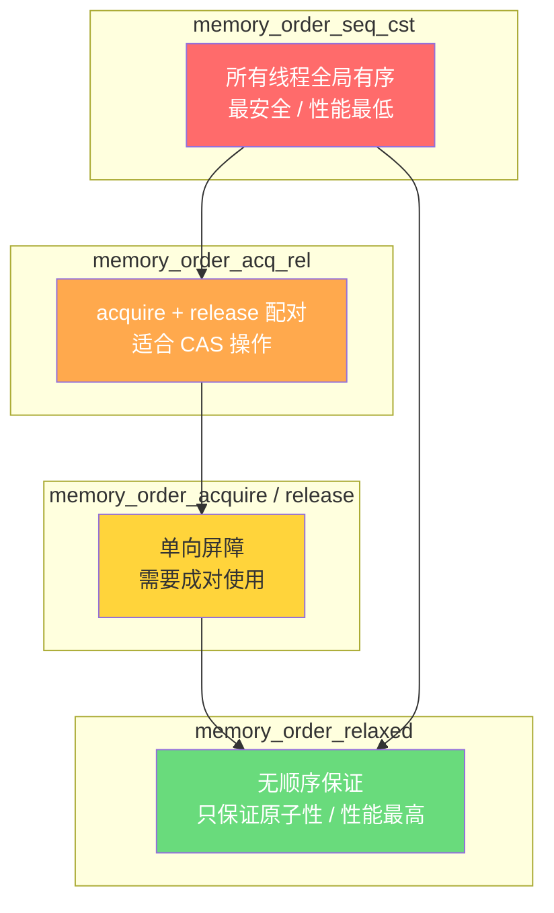

+++
title = "第 4C 章：类型限定符与原子操作"
weight = 40
date = "2026-03-29T22:34:00+08:00"
type = "docs"
description = ""
isCJKLanguage = true
draft = false
+++

# 第 4C 章：类型限定符与原子操作

> 🎯 **前置知识回顾**：本章是第 4 章的延伸章节。如果你已经掌握了变量、数据类型和基本运算，可以直接冲！如果你还在纠结 `int` 和 `float` 的区别，先去第 4 章打个卡，我们在这里等你。

---

想象一下，你有一套房子（C 程序），里面有各种房间（变量），每个房间都有不同的"使用规则"：

- 有的房间贴了"只读"标签，你只能看，不能改——这就是 **`const`**
- 有的房间门口写着"每次进来都要重新确认信息，别用缓存"——这就是 **`volatile`**
- 有的房间规定"必须走指定的门，禁止抄近道"——这就是 **`restrict`**
- 还有的房间装着"线程安全锁"，多人同时进出也不会乱——这就是 **`_Atomic`**

类型限定符（Type Qualifier）就是贴在变量身上的**"使用说明书"**，告诉编译器、硬件和其他程序员：这个变量应该怎么用、能不能改、能不能优化。

C 语言一共有四个类型限定符：`const`、`volatile`、`restrict`、`_Atomic`。前三个在 C89/C99 就有了，最后一个 ` _Atomic` 是 C11 引入的，用于**多线程编程**——这是 C 语言进军现代并发世界的里程碑。

让我们一个一个来认识它们。

---

## 4C.1 `const` 限定符：只读变量的语义

### 4C.1.1 `const` 的基本用法

`const` 是 "constant"（常数、不变）的缩写。顾名思义，用 `const` 修饰的变量**不能被修改**。

```c
#include <stdio.h>

int main(void)
{
    const int age = 25;           // 声明一个只读的 age
    const float pi = 3.14159f;    // 声明一个只读的圆周率

    printf("我的年龄是 %d\n", age);  // 读取没问题
    printf("圆周率是 %f\n", pi);    // 读取没问题

    // age = 26;  // ❌ 编译错误！不能修改 const 变量
    // pi = 3.14f; // ❌ 编译错误！

    return 0;
}
```

```
我的年龄是 25
圆周率是 3.141590
```

> 💡 **为什么需要 `const`？** 想象你有一份重要的合同，你会把它锁在保险箱里——不是说你永远不能看，而是给自己提个醒："这东西别乱改！" `const` 就是编程世界里的"保险箱"。

### `const` 的三大好处

**1. 防止手滑改错值**

```c
const int MAX_RETRIES = 3;
// 某天你迷迷糊糊写成了 MAX_RETRIES = 100;
// 编译器直接报错：对不起，手滑被抓住了！
```

**2. 让代码自文档化（Self-Documenting）**

```c
void print_message(const char* msg);
```

当你看到函数签名里有 `const`，立刻知道：这个函数的输入不会被修改，放心传！

**3. 帮助编译器优化**

编译器知道 `const` 变量不会变，可以把它放到**只读内存段**（`.rodata`），甚至做一些激进的常量折叠（Constant Folding）优化。比如编译器发现 `2 * 3.14f` 里有个常量，直接把结果 6.28 算出来，不用运行时再算。

### `const` 与指针的四种组合

> ⚠️ **高级内容预警**：这部分比较烧脑，建议先收藏，日后（学完指针章节后）再回来细看。现在只需留下一个印象：`const` 和指针的组合有四种，每种含义不同。

指针有两个角色：**指针本身**（它存的那个地址）和**指针指向的东西**（那块内存里的值）。

- `const int* p` —— 指针指向的内容不能改（但指针本身可以指向别处）
- `int* const p` —— 指针本身不能改（不能指向别处，但指向的内容可以改）
- `const int* const p` —— 两者都不能改
- `int const* p` —— 等价于 `const int* p`

```c
#include <stdio.h>

int main(void)
{
    int a = 10;
    int b = 20;

    // 场景1：指向常量的指针——可以通过 a 读值，但不能通过 p 修改 a
    const int* p1 = &a;
    printf("p1 指向 a，值为 %d\n", *p1);
    // *p1 = 99;  // ❌ 编译错误：不能通过 p1 修改 a
    p1 = &b;     // ✅ OK，指针本身可以指向别处
    printf("p1 指向 b，值为 %d\n", *p1);

    // 场景2：常量指针——指针固定指向 a，不能指向别处
    int* const p2 = &a;
    *p2 = 99;     // ✅ OK，可以通过 p2 修改 a
    printf("通过 p2 把 a 改成了 %d\n", a);
    // p2 = &b;   // ❌ 编译错误：指针本身是常量，不能指向别处

    // 场景3：指向常量的常量指针——两者都锁死
    const int* const p3 = &a;
    printf("p3 指向 a，值为 %d\n", *p3);
    // *p3 = 88;  // ❌
    // p3 = &b;   // ❌

    return 0;
}
```

```
p1 指向 a，值为 10
p1 指向 b，值为 20
通过 p2 把 a 改成了 99
p3 指向 a，值为 99
```

> 💡 **记忆技巧**：看 `const` 离谁近，谁就不能变。`*` 在 `const` 右边，则指针指向的东西不变；在 `const` 左边，则指针本身不变。

---

### 4C.1.2 `const` vs `#define` 的本质区别

很多初学者会问："既然 `const` 能定义常量，那还要 `#define` 干嘛？" 这个问题问得非常好！

让我们先看看两者的基本用法：

```c
#define PI 3.14159        // 宏定义，纯粹的文本替换
const float PI2 = 3.14159; // const 常量，有类型，有内存地址
```

它们之间有**五个本质区别**：

**区别一：类型检查**

```c
#define PI 3.14159
const float PI2 = 3.14159;

float area1 = PI * r * r;  // 编译时只做文本替换，编译器可能不知道 r 是什么类型
float area2 = PI2 * r * r; // 编译器知道 PI2 是 float，安全检查更到位
```

**区别二：内存占用**

```c
#include <stdio.h>

#define RAW_PI 3.14159
const float CONST_PI = 3.14159;

int main(void)
{
    printf("RAW_PI 的地址: %p (宏没有地址！)\n", (void*)&RAW_PI);
    printf("CONST_PI 的地址: %p (真有这块内存！)\n", (void*)&CONST_PI);
    return 0;
}
```

> ⚠️ 注意：`&RAW_PI` 在某些编译器上可能能取到地址（因为编译器可能会给宏分配一个变量），但语义上宏是**没有地址**的纯粹文本替换。

**区别三：作用域**

```c
{
    const int x = 10;   // ✅ 有作用域，离开块就消失
    // printf("%d", x); // ❌ 编译错误：x 已不在作用域内
}
// printf("%d", x); // ❌ 同样错误

// #define 则受预处理器支配，不受块作用域限制
{
    #define Y 20
    printf("%d\n", Y);  // ✅ OK
}
printf("%d\n", Y);      // ✅ 也 OK（除非在另一个翻译单元）
```

**区别四：调试体验**

宏在预处理阶段就被替换掉了，调试器里根本看不到 `PI`，只有 `3.14159`。而 `const` 变量有真实的地址和名字，调试器可以跟踪。

**区别五：能否用于数组维度**

```c
#define N 10
const int M = 10;

int arr1[N];  // ✅ 合法：宏可以用作数组维度（C99 变长数组）
// int arr2[M];  // ❌ 在 C89 中非法！const int 不能用于数组维度
              //     （因为 M 是只读变量，不是编译期常量）
              //     C99 中 VLA 支持这种用法，但传统 C 不行
```

### 什么时候用哪个？

> **口诀**：想定义**编译期常量**（数组大小、`case` 标签、位域等）用 `#define`；想定义**带类型的只读值**、让代码更安全、更易调试，用 `const`。

---

## 4C.2 `volatile` 限定符：防止编译器优化

### 为什么要防止优化？

先看一个"诡异"的例子：

```c
int flag = 0;

void wait_for_flag(void)
{
    while (flag == 0) {
        // 什么都不做，就是等 flag 变成 1
    }
    printf("Flag 变了！我继续执行！\n");
}
```

聪明的编译器看到 `while (flag == 0)` 里什么都没做，就想："这flag又没被这个函数修改，我把它**缓存**到寄存器里吧，反正外部也改不了它。"

于是编译器生成了类似这样的优化代码：

```c
// 编译器生成的"聪明"代码
int cached_flag = flag;     // 把 flag 从内存读到寄存器（一次）
while (cached_flag == 0) {
    // 每次只检查寄存器里的 cached_flag，根本不看内存！
}
```

这下完了！即使外部代码（比如硬件中断）把 `flag` 改成了 1，这个循环也**永远不会退出**——因为程序一直在读寄存器的旧值，根本不看内存！

这就是**编译器优化**惹的祸。

### `volatile` 的作用

`volatile` 的字面意思是"易变的"，用它修饰的变量告诉编译器：**"这个变量的值随时可能变，别缓存它，每次用的时候都去内存里重新读！"**

```c
volatile int flag = 0;  // 告诉编译器：flag 可能会被意想不到的力量改变

void wait_for_flag(void)
{
    while (flag == 0) {
        // 编译器知道每次都要重新从内存读取 flag
    }
    printf("Flag 变了！我继续执行！\n");
}
```

### 两大典型应用场景

#### 场景一：内存映射的硬件寄存器

在嵌入式开发中，硬件寄存器的值是由外部硬件控制的，编译器根本不知道硬件什么时候会改变它们。

```c
volatile uint32_t* const STATUS_REG = (volatile uint32_t*)0x40021000;
volatile uint32_t* const DATA_REG   = (volatile uint32_t*)0x40021004;

uint32_t read_sensor(void)
{
    // 触发传感器读取（向控制寄存器写命令）
    *DATA_REG = 0x01;

    // 等待数据就绪
    while ((*STATUS_REG & 0x01) == 0) {
        // 等待中……硬件会改变 STATUS_REG，我们每次都要读内存！
    }

    return *DATA_REG;  // 读取数据寄存器
}
```

> 💡 **嵌入式工程师的日常**：`*DATA_REG` 前面的 `volatile` 是修饰**指向的内容**（硬件寄存器可能随时变化），后面的 `const` 是修饰**指针本身**（这个寄存器的地址永远不会变）。两个限定符各司其职，互不冲突。

#### 场景二：多线程共享变量

```c
#include <stdio.h>
#include <threads.h>

volatile int g_running = 1;  // 主线程和子线程共享的标志

int thread_func(void* arg)
{
    while (g_running) {
        // 干活……每次循环都重新读取 g_running
        printf("子线程工作中...\n");
        thrd_sleep(&(struct timespec){.tv_sec = 1}, NULL);
    }
    printf("子线程收到停止信号，退出！\n");
    return 0;
}

int main(void)
{
    thrd_t t;
    thrd_create(&t, thread_func, NULL);

    printf("主线程：让子线程干 3 秒就停下\n");
    thrd_sleep(&(struct timespec){.tv_sec = 3}, NULL);

    g_running = 0;  // 主线程改变共享变量
    printf("主线程：已设置停止标志\n");

    thrd_join(t, NULL);
    printf("主线程：子线程已退出\n");
    return 0;
}
```

```
主线程：让子线程干 3 秒就停下
子线程工作中...
子线程工作中...
子线程工作中...
主线程：已设置停止标志
子线程收到停止信号，退出！
主线程：子线程已退出
```

> ⚠️ **重要提示**：`volatile` 只解决了"每次都从内存读"的问题，但**不解决原子性问题和内存可见性问题**。在真正的多线程程序中，你需要 ` _Atomic`（后文会讲）或者互斥锁（`mtx_lock`）来保证操作的原子性和可见性。`volatile` 只是一个"防止过度优化"的小助手。

### `const` 和 `volatile` 可以一起用吗？

完全可以！`const volatile` 的组合表示：**这个变量是只读的，但它的值可能在外力作用下自动变化**。最典型的例子就是**只读硬件寄存器**：

```c
const volatile uint32_t* const HARDWARE_ID = (volatile uint32_t*)0x40001234;
//  const：软件不能写
//  volatile：硬件可能随时改变值
//  const（指针本身）：这个寄存器的地址不会变
```

---

## 4C.3 `restrict` 限定符（C99）：消除指针别名优化

### 什么是"指针别名"？

在 C 语言中，同一块内存可以有**多个指针**指向它，这种情况叫**指针别名（Pointer Aliasing）**。

```c
int a = 10;
int* p1 = &a;
int* p2 = &a;  // p2 也是 a 的别名

*p1 = 20;      // 通过 p1 改 a
printf("%d\n", *p2);  // 通过 p2 读 a——当然是 20
```

两个指针指向同一个东西，这就是别名。这本身没问题，但问题是：**编译器不知道它们是不是别名**。

### 别名为什么让编译器头疼？

看这个函数：

```c
void process(int* a, int* b, int n)
{
    for (int i = 0; i < n; i++) {
        a[i] = b[i] * 2;
    }
}
```

如果 `a` 和 `b` 指向**不同的数组**，编译器可以大胆优化：先一次性把 `b` 的数据加载到 CPU 缓存，然后批量写回 `a`。

但如果 `a == b`（即两个指针互为别名）呢？这时 `a[i] = b[i] * 2` 实际上是在**自己读自己、原地乘以 2**，编译器就必须保守处理，每次写完后再读。

**编译器不知道 `a` 和 `b` 是不是别名，所以它只能假设最坏情况（可能是别名），从而放弃很多优化。**

### `restrict` 的作用

`restrict` 关键字就是一个**承诺**：

> "我保证，在这个指针的整个生命周期内，不会有任何其他指针指向它所指向的那块内存。"

```c
void process(int* restrict a, int* restrict b, int n)
{
    for (int i = 0; i < n; i++) {
        a[i] = b[i] * 2;  // 编译器现在可以放心大胆优化了！
    }
}
```

有了 `restrict`，编译器知道：
- `a` 指向的内存只有 `a` 一个指针访问
- `b` 指向的内存只有 `b` 一个指针访问
- `a` 和 `b` 绝对不可能是同一块内存的别名

于是编译器可以：
1. 把循环展开（Loop Unrolling）
2. 使用 SIMD 指令一次处理多个数据
3. 更好地调度 CPU 寄存器和缓存

### `restrict` 的实际效果

```c
#include <stdio.h>
#include <time.h>

#define SIZE 10000000

// 不使用 restrict：编译器保守
void add_arrays_naive(int* a, int* b, int* c, int n)
{
    for (int i = 0; i < n; i++) {
        a[i] = b[i] + c[i];
    }
}

// 使用 restrict：编译器可以放手优化
void add_arrays_restrict(int* restrict a,
                         int* restrict b,
                         int* restrict c,
                         int n)
{
    for (int i = 0; i < n; i++) {
        a[i] = b[i] + c[i];
    }
}

int main(void)
{
    int* a = malloc(SIZE * sizeof(int));
    int* b = malloc(SIZE * sizeof(int));
    int* c = malloc(SIZE * sizeof(int));

    // 初始化
    for (int i = 0; i < SIZE; i++) {
        b[i] = i;
        c[i] = i * 2;
    }

    // 测试 restrict 版本
    clock_t t1 = clock();
    add_arrays_restrict(a, b, c, SIZE);
    double time1 = (double)(clock() - t1) / CLOCKS_PER_SEC;
    printf("restrict 版本耗时: %.4f 秒\n", time1);
    printf("a[100] = %d (期望: %d)\n", a[100], b[100] + c[100]);

    // 重新初始化再测 naive 版本
    for (int i = 0; i < SIZE; i++) {
        b[i] = i;
        c[i] = i * 2;
    }

    clock_t t2 = clock();
    add_arrays_naive(a, b, c, SIZE);
    double time2 = (double)(clock() - t2) / CLOCKS_PER_SEC;
    printf("naive 版本耗时:   %.4f 秒\n", time2);

    free(a); free(b); free(c);
    return 0;
}
```

> 📝 注意：restrict 的优化效果取决于编译器、CPU 架构和优化级别。在某些系统上可以看到显著加速，在另一些系统上可能差别不大。关键是它给了编译器**更多的自由度**。

### 违反 `restrict` 承诺会怎样？

```c
int arr[10] = {0};
add_arrays_restrict(arr, arr, arr, 10);
//                                ↑ 三个指针都是同一个数组！
//                                但你跟编译器保证了"互不别名"
//                                结果：未定义行为（Undefined Behavior）！
```

> ⚠️ **未定义行为警告**：如果你违反了 `restrict` 的承诺（也就是撒谎了），程序的行为完全不可预测——可能正常运行，可能崩溃，可能产生错误结果。这就是"给自己挖坑"的典型案例。

---

## 4C.4 `_Atomic` 类型限定符（C11）：多线程的原子操作

### 为什么需要原子操作？

想象一个银行账户：

```c
long long balance = 1000;  // 余额 1000 元

// 线程1：存 500 块
void deposit(long long amount)
{
    balance = balance + amount;  // 读取 → 加 → 写回，三步操作！
}

// 线程2：取 300 块
void withdraw(long long amount)
{
    balance = balance - amount;  // 也是三步操作！
}
```

问题来了！当两个线程同时执行时：

```
线程1: 读取 balance=1000 → 加500=1500 → (还没写回)
线程2: 读取 balance=1000 → 减300=700  → 写回 balance=700
线程1: 写回 balance=1500  → 余额变成了 1500！
```

**钱凭空消失了 300 块！** 这不是科幻，这是真实的多线程竞态条件（Race Condition）。

> 💡 **什么是竞态条件？** 多个线程像在赛跑一样，谁先到达"读取-修改-写回"这段代码，谁就决定了最终结果。如果调度不凑巧，最终结果就会偏离预期。这就是"竞态"——race condition。

### `_Atomic` 的基本用法

C11 引入了 `_Atomic` 类型限定符，用来声明**原子变量**——这种变量的操作是不可分割的，编译器会保证它们在完成之前不会被其他线程插队。

```c
#include <stdio.h>
#include <threads.h>
#include <stdatomic.h>

_Atomic int counter = 0;  // 原子计数器

int thread_func(void* arg)
{
    int id = *(int*)arg;
    for (int i = 0; i < 100000; i++) {
        atomic_fetch_add(&counter, 1);  // 原子加 1
    }
    printf("线程 %d 完成！\n", id);
    return 0;
}

int main(void)
{
    thrd_t t1, t2;
    int id1 = 1, id2 = 2;

    thrd_create(&t1, thread_func, &id1);
    thrd_create(&t2, thread_func, &id2);

    thrd_join(t1, NULL);
    thrd_join(t2, NULL);

    printf("最终计数器值: %d (期望: %d)\n", counter, 200000);
    return 0;
}
```

```
线程 1 完成！
线程 2 完成！
最终计数器值: 200000 (期望: 200000)
```

完美！`atomic_fetch_add` 保证每次加 1 都是**原子**的——不存在"读了一半就被打断"的情况。钱不会凭空消失。

### `<stdatomic.h>` 函数族

`stdatomic.h` 提供了丰富的原子操作函数，分为几大类：

#### 1. 原子读（Load）和原子写（Store）

```c
#include <stdio.h>
#include <stdatomic.h>

_Atomic int data = 42;

int main(void)
{
    int val = atomic_load(&data);   // 原子读取 data
    printf("读到 data = %d\n", val);

    atomic_store(&data, 100);       // 原子写入 data
    printf("写入后 data = %d\n", atomic_load(&data));

    return 0;
}
```

#### 2. 原子增减（Fetch-and-Add / Fetch-and-Sub）

```c
#include <stdio.h>
#include <stdatomic.h>

_Atomic long stock = 1000;  // 库存

void sell(int amount)
{
    long old = atomic_fetch_sub(&stock, amount);  // 返回操作前的值
    printf("卖出了 %d 件，之前的库存是 %ld，现在库存是 %ld\n",
           amount, old, atomic_load(&stock));
}

int main(void)
{
    sell(10);  // 原子减 10
    sell(5);   // 原子减 5
    return 0;
}
```

```
卖出了 10 件，之前的库存是 1000，现在库存是 990
卖出了 5 件，之前的库存是 990，现在库存是 985
```

#### 3. 原子交换（Exchange）

```c
#include <stdio.h>
#include <stdatomic.h>

_Atomic int lock = 0;

void acquire_lock(void)
{
    // atomic_flag_test_and_set 是专门用于锁的原子操作
    // 不断尝试把锁从 0 变成 1，直到成功
    while (atomic_flag_test_and_set(&lock)) {
        // 锁被占用，自旋等待……
    }
    printf("拿到锁了！\n");
}

void release_lock(void)
{
    atomic_flag_clear(&lock);  // 把锁清零
    printf("释放锁！\n");
}

int main(void)
{
    acquire_lock();
    // 临界区代码……
    release_lock();
    return 0;
}
```

#### 4. 完整的原子操作函数列表

| 函数名 | 作用 | 返回值 |
|--------|------|--------|
| `atomic_load(&x)` | 原子读取 | x 的当前值 |
| `atomic_store(&x, v)` | 原子写入 | void |
| `atomic_fetch_add(&x, v)` | 原子加 | 操作前的值 |
| `atomic_fetch_sub(&x, v)` | 原子减 | 操作前的值 |
| `atomic_fetch_and(&x, v)` | 原子位与 | 操作前的值 |
| `atomic_fetch_or(&x, v)` | 原子位或 | 操作前的值 |
| `atomic_fetch_xor(&x, v)` | 原子位异或 | 操作前的值 |
| `atomic_exchange(&x, v)` | 原子交换 | x 的旧值 |
| `atomic_compare_exchange_strong(&x, &expected, desired)` | 原子CAS | 成功返回 true |
| `atomic_flag_test_and_set(&flag)` | 原子设锁 | 旧值 |
| `atomic_flag_clear(&flag)` | 清锁 | void |

---

### 4C.4.3 五种内存顺序语义

这是 ` _Atomic` 最烧脑、最容易让人头秃的部分——**内存顺序（Memory Order）**。

> 💡 **为什么需要"内存顺序"概念？** CPU 和编译器为了性能，会偷偷重排指令（Instruction Reordering）。在单线程里这没问题，但在多线程里，如果线程 A 的操作 1 先于操作 2 发生，但线程 B 看到的效果是操作 2 先于操作 1——这就乱了。内存顺序就是用来**规定操作在多线程间的可见顺序**的。

C11 定义了**六种**内存顺序（实际上还有一种是 `memory_order_consume`，但已经被弃用），这里介绍五种最常用的：

#### 一、`memory_order_relaxed`（宽松模式）

```c
atomic_store_explicit(&x, 1, memory_order_relaxed);
atomic_load_explicit(&y, memory_order_relaxed);
```

**特点**：只保证**原子性**，不保证**顺序**。

- CPU 可以随便重排指令
- 不同线程可能看到不同的操作顺序
- 适用于计数器等**只关心最终值、不关心先后顺序**的场景

```c
#include <stdio.h>
#include <threads.h>
#include <stdatomic.h>

_Atomic int counter = 0;

void increment(void)
{
    for (int i = 0; i < 100000; i++) {
        // relaxed 模式：只保证最终计数正确，不关心顺序
        atomic_fetch_add_explicit(&counter, 1, memory_order_relaxed);
    }
}

int main(void)
{
    thrd_t t1, t2;
    thrd_create(&t1, (thrd_start_t)increment, NULL);
    thrd_create(&t2, (thrd_start_t)increment, NULL);
    thrd_join(t1, NULL);
    thrd_join(t2, NULL);
    printf("counter = %d\n", counter);  // 一定是 200000
    return 0;
}
```

#### 二、`memory_order_acquire`（获取语义）

```c
atomic_load_explicit(&data, memory_order_acquire);
```

**特点**：**屏障（Barrier）**的作用。`acquire` 读操作之前的所有内存操作，都**必须在**这个读操作**之前**对其他线程可见。

类比：你在机场安检口，安检之前所有人都得老老实实排队，安检之后就可以自由散开了。

```c
volatile int data_available = 0;
char buffer[256];

// 生产者线程
void producer(void)
{
    // 先写入数据
    memcpy(buffer, "Hello, World!", 14);
    // 再设置标志——release 保证了屏障前的写操作不会被移到屏障后
    atomic_store_explicit(&data_available, 1, memory_order_release);
}

// 消费者线程
void consumer(void)
{
    // 等待标志
    while (atomic_load_explicit(&data_available, memory_order_acquire) == 0) {
        thrd_yield();  // 让出 CPU，等待一下再试
    }
    // 此时 buffer 里一定有完整的数据！
    printf("收到数据: %s\n", buffer);
}
```

> 💡 **为什么需要成对使用？** `release` 和 `acquire` 是一对好搭档。`release` 保证屏障前的写操作不会被移到屏障后；`acquire` 保证屏障后的读操作能看到屏障前的写操作。只要两边配对使用，就能保证"写入"对"读取"可见。

#### 三、`memory_order_release`（释放语义）

**特点**：`release` 写操作之后的**所有**内存操作，都**不能**被移到**这个写操作之前**。

```c
// 配合上面的 acquire 例子理解
atomic_store_explicit(&data_available, 1, memory_order_release);
// release 保证了：buffer 的数据写入 一定发生在 data_available 的写入 之前
// 换句话说：一旦消费者看到 data_available==1，他一定能看到 buffer 里的完整数据
```

#### 四、`memory_order_acq_rel`（获取+释放语义）

**特点**：同时具有 `acquire` 和 `release` 的特性，适用于**同时读写**的场景，比如**CAS（Compare-And-Swap）**操作。

```c
#include <stdatomic.h>
#include <stdio.h>

_Atomic int value = 0;

void compare_and_swap(void)
{
    int expected = 0;
    // CAS：比较 value 和 expected，如果相等则写入 desired
    // acq_rel 保证：读（acquire 语义）和写（release 语义）是一个不可分割的整体
    if (atomic_compare_exchange_strong_explicit(
            &value, &expected, 42,
            memory_order_acq_rel,
            memory_order_acq_rel)) {
        printf("CAS 成功！value 从 %d 变成了 42\n", expected);
    } else {
        printf("CAS 失败！value 是 %d（不是 %d）\n", atomic_load(&value), expected);
    }
}
```

#### 五、`memory_order_seq_cst`（顺序一致，默认最严格）

```c
atomic_store(&x, 1);       // 默认就是 seq_cst
int y = atomic_load(&x);   // 默认就是 seq_cst
```

**特点**：**所有线程看到的操作顺序完全一致**。这是 C11 原子的**默认模式**，也是最容易理解、最安全、但性能最差（因为约束最多）的模式。

```c
_Atomic int a = 0;
_Atomic int b = 0;

// 线程 1
void thread1(void)
{
    atomic_store(&a, 1);
    int y = atomic_load(&b);
    printf("thread1: y = %d\n", y);
}

// 线程 2
void thread2(void)
{
    atomic_store(&b, 1);
    int x = atomic_load(&a);
    printf("thread2: x = %d\n", x);
}
```

在 `seq_cst` 模式下，不可能出现 `x=0 && y=0` 的情况——所有线程都同意 `a` 和 `b` 的写入顺序。

### 内存顺序对比图



> 💡 **如何选择内存顺序？**
> - 如果你**不追求极致性能**，直接用**默认的 `seq_cst`**——省心、安全、不会出错。
> - 如果你**非常清楚**自己在做什么，且知道 `acquire`/`release` 配对的场景，用 `acquire`/`release` 可以提升性能。
> - 如果你**只做计数器**，不关心顺序，`relaxed` 足够且最快。
> - 如果你做 **`CAS` 循环**（ retry 机制），用 `acq_rel`。

### 实战：用 `seq_cst` 实现一个简单的自旋锁

```c
#include <stdio.h>
#include <thrd.h>
#include <stdatomic.h>

_Atomic int lock = 0;  // 0=未锁定, 1=已锁定

void spin_lock(void)
{
    // 不断尝试获取锁，直到成功
    while (atomic_exchange_explicit(&lock, 1, memory_order_seq_cst) == 1) {
        thrd_yield();  // 锁被占用，让出 CPU，避免浪费资源
    }
}

void spin_unlock(void)
{
    atomic_store_explicit(&lock, 0, memory_order_seq_cst);
}

_Atomic long counter = 0;

void worker(void)
{
    for (int i = 0; i < 100000; i++) {
        spin_lock();
        counter++;      // 临界区内，安全地增加计数器
        spin_unlock();
    }
}

int main(void)
{
    thrd_t t1, t2;
    thrd_create(&t1, (thrd_start_t)worker, NULL);
    thrd_create(&t2, (thrd_start_t)worker, NULL);

    thrd_join(t1, NULL);
    thrd_join(t2, NULL);

    printf("最终计数器: %ld (期望: %d)\n", counter, 200000);
    return 0;
}
```

---

## 本章小结

| 限定符 | 作用 | 引入版本 |
|--------|------|---------|
| `const` | 声明只读变量，防止意外修改；帮助编译器优化 | C89 |
| `volatile` | 告诉编译器每次都从内存读取，不缓存；用于硬件寄存器和多线程共享变量 | C89 |
| `restrict` | 承诺指针无别名，帮助编译器生成更高效的代码 | C99 |
| `_Atomic` | 声明原子变量，保证多线程操作的原子性和可见性 | C11 |

**关键收获**：

1. **`const`** 不是"常量"，而是"只读变量"——它有地址、有类型、受作用域约束，与 `#define` 有本质区别。

2. **`volatile`** 只做一件事：防止编译器缓存变量。每次读写都真实访问内存。记住它**不解决原子性和可见性**，真正的多线程同步还需要 ` _Atomic` 或互斥锁。

3. **`restrict`** 是一个"承诺"——承诺某个指针是访问某块内存的唯一途径。违反这个承诺会导致未定义行为，后果自负。

4. **`_Atomic`** 是 C11 带来的多线程利器，配合 `<stdatomic.h>` 的函数族和五种内存顺序语义，可以实现高效的多线程同步。默认使用 `seq_cst`，需要性能优化时再考虑其他顺序模式。

> 📚 **下一章预告**：第 5 章我们将进入 C 语言的**控制流**——if/else、switch、while、for、do-while，还有让新手头疼的 `break` 和 `continue`。准备好了吗？
