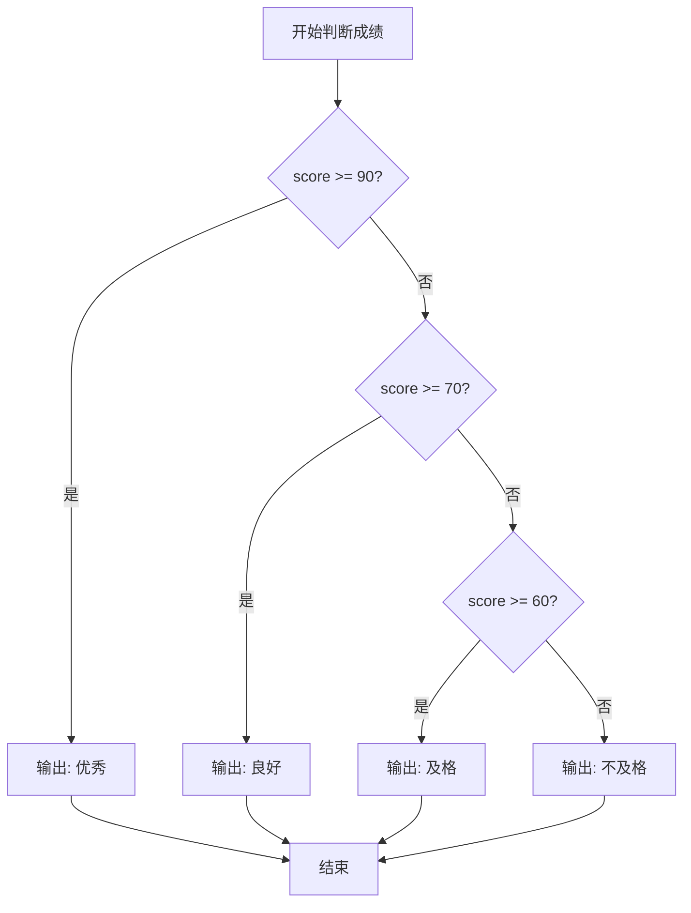
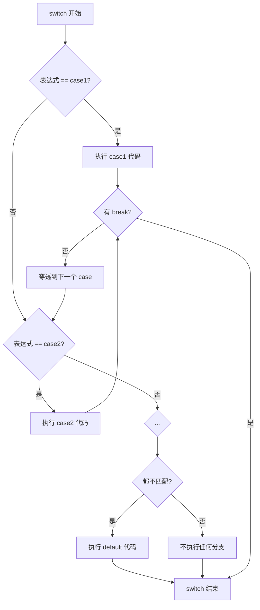
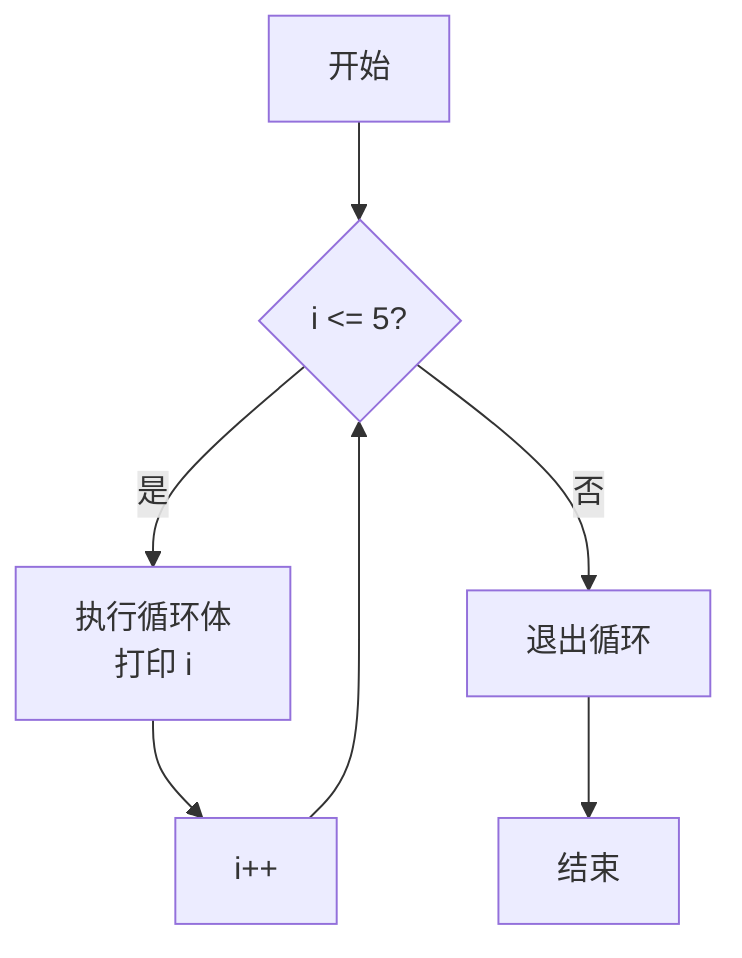
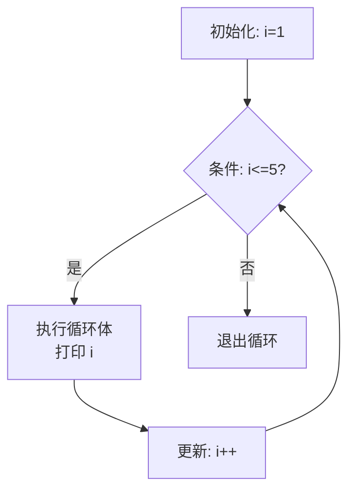

+++
title = "第 6 章：控制流程——程序的'红绿灯'与'跑步机'"
weight = 60
date = "2026-03-29T22:34:00+08:00"
type = "docs"
description = ""
isCJKLanguage = true
draft = false
+++

# 第 6 章：控制流程——程序的"红绿灯"与"跑步机"

想象一下，你早上出门上班，脑子里其实一直在做各种决定：

- "如果下雨，我就打车；否则，我骑自行车。"（选择）
- "只要还没到公司，我就一直往前走。"（循环）
- "先做早饭，再刷牙，再出门。"（顺序执行）

恭喜你，你已经在日常生活中使用"控制流程"了！程序也是一样的，只不过它更死板——你得一条一条告诉它该怎么做。

**控制流程（Control Flow）**，就是控制程序执行顺序的机制。没有它，程序就像一本按顺序印满文字的书，从第一页读到最后一页，一成不变。加上它之后，程序就能"见机行事"——下雨打伞，天晴晒被，根据不同情况走不同的路。

在 C 语言里，控制流程主要有三大类：

1. **选择结构**（Selection）：遇到岔路口，该走哪条路？
2. **循环结构**（Loop）：重复做某件事，直到满足条件
3. **跳转语句**（Jump）：突然改变执行路线

下面我们就来逐一揭晓！

---

## 6.1 选择结构：`if` / `if...else` / `if...else if...else`

### 6.1.1 最简单的 `if`：有条件地执行

`if` 是最基础的选择结构，意思是"如果……就……"。语法如下：

```c
if (条件表达式) {
    // 条件为真时执行这些代码
}
```

**条件表达式**是一个返回真（`true`，非零）或假（`false`，零）的表达式。括号里的条件成立，就执行花括号里的代码；不成立，就跳过，程序继续往下走。

举个例子——判断一个人是否成年：

```c
#include <stdio.h>

int main() {
    int age = 20;

    if (age >= 18) {
        printf("已成年，可以考驾照了！\n");  // 输出：已成年，可以考驾照了！
    }

    printf("程序继续往下走...\n");  // 输出：程序继续往下走...

    return 0;
}
```

运行结果：

```
已成年，可以考驾照了！
程序继续往下走...
```

如果 `age` 改成 `16`，那么第一个 `printf` 就不会执行，屏幕上只有"程序继续往下走..."。

> **小贴士：** 花括号 `{}` 在只有一条语句时可以省略，但建议初学者始终加上花括号，这样代码更清晰，也不容易出错。就像你给自己定规矩"如果下雨就打伞"，但如果同时写了"如果下雨就打伞，然后买彩票"，那到底哪句该执行？花括号就是用来消除歧义的。

### 6.1.2 `if...else`：二者必选其一

有的时候，事情不是"做不做"的问题，而是"二选一"的问题——下雨就打车，不下雨就骑车。这时候就用 `if...else`：

```c
if (条件表达式) {
    // 条件为真时执行
} else {
    // 条件为假时执行
}
```

一个完整的例子：

```c
#include <stdio.h>

int main() {
    int score = 75;

    if (score >= 60) {
        printf("及格啦！庆祝一下！\n");  // 输出：及格啦！庆祝一下！
    } else {
        printf("不及格... 加油补考！\n");
    }

    return 0;
}
```

`score = 75 >= 60`，条件为真，执行上面的分支。如果把 `score` 改成 `55`，就会输出"不及格... 加油补考！"

### 6.1.3 `if...else if...else`：多岔路口

生活远比二元对立复杂。比如考试成绩：

- 90 分以上：优秀
- 70-89 分：良好
- 60-69 分：及格
- 60 分以下：不及格

这就需要 `if...else if...else` 了：

```c
#include <stdio.h>

int main() {
    int score = 85;

    if (score >= 90) {
        printf("优秀！太强了！\n");  // 输出：优秀！太强了！
    } else if (score >= 70) {
        printf("良好！继续保持！\n");
    } else if (score >= 60) {
        printf("及格，险过！\n");
    } else {
        printf("不及格... 要加油了！\n");
    }

    return 0;
}
```

流程图如下：



> **注意：** `else if` 可以有任意多个，`else` 放在最后（也可以没有）。条件判断是**从上到下**依次进行的，一旦遇到一个满足的条件，就执行对应代码块，然后**跳出整个 if...else if...else 结构**，不再继续判断后面的条件。所以写条件时要注意顺序——比如把 `score >= 60` 放在 `score >= 70` 前面，就会先匹配到"及格"而不是"良好"。

### 6.1.4 三目运算符：`? :` —— if...else 的精简版

对于简单的二选一赋值，C 语言还提供了一个语法糖——**三目运算符**（Ternary Operator），格式为：

```c
条件 ? 值1 : 值2
```

意思是：如果条件为真，整个表达式取值1；否则取值2。例如：

```c
#include <stdio.h>

int main() {
    int age = 17;
    const char* result = (age >= 18) ? "成年" : "未成年";

    printf("这个人%s\n", result);  // 输出：这个人未成年

    int a = 10, b = 20;
    int max = (a > b) ? a : b;
    printf("最大值是: %d\n", max);  // 输出：最大值是: 20

    return 0;
}
```

`const char*` 是指向常量字符串的指针（后面讲指针时会详细介绍）。三目运算符可以嵌套，但不建议嵌套太深，否则代码会变得像"幽灵"一样难以理解。

### 6.1.5 常见的条件判断

回顾一下常用的比较运算符（Relational Operators）：

| 运算符 | 含义 | 示例 |
|--------|------|------|
| `==` | 等于 | `age == 18` |
| `!=` | 不等于 | `score != 0` |
| `>` | 大于 | `price > 100` |
| `<` | 小于 | `age < 60` |
| `>=` | 大于等于 | `height >= 180` |
| `<=` | 小于等于 | `weight <= 80` |

以及逻辑运算符（Logical Operators）：

| 运算符 | 含义 | 示例 |
|--------|------|------|
| `&&` | 逻辑与（AND）| `age > 18 && age < 30` |
| `\|\|` | 逻辑或（OR）| `grade == 'A' \|\| grade == 'B'` |
| `!` | 逻辑非（NOT）| `!is_empty` |

一个综合示例——判断是否能够购买火车票（年龄在 14-70 岁之间）：

```c
#include <stdio.h>

int main() {
    int age = 25;

    if (age >= 14 && age <= 70) {
        printf("可以购买火车票！\n");  // 输出：可以购买火车票！
    } else {
        printf("不在火车票发售年龄范围内。\n");
    }

    return 0;
}
```

---

## 6.2 嵌套 `if` 的 else 匹配规则——"就近原则"

`if` 里面还可以放 `if`，这就叫**嵌套 if**（Nested if）。但 `else` 到底跟哪个 `if` 配对，是一个容易出错的地方。

先看一个"惊悚"的例子——判断两个数的大小关系：

```c
#include <stdio.h>

int main() {
    int a = 10, b = 20;

    if (a == 10)
        if (a > b)
            printf("a > b\n");
        else
            printf("a < b or a == b\n");  // 输出：a < b or a == b

    return 0;
}
```

猜猜输出什么？程序判断 `a == 10` 为真，然后进入内层 `if`，`a > b`（10 > 20）为假，所以执行 `else`，输出"a < b or a == b"。这个程序的逻辑其实是：**当 a == 10 时，进一步判断 a 和 b 的大小**。

关键问题来了：`else` 到底属于外层的 `if (a == 10)` 还是内层的 `if (a > b)`？

答案是：**`else` 永远匹配距离它最近的、尚未配对的 `if`**。这就是传说中的**"最近邻原则"**（Closest Matching Rule），也叫"**悬空 else**"（Dangling else）问题。

用缩进（Indent）可以更直观地理解：

```c
// 这个缩进具有误导性！
if (a == 10)
    if (a > b)
        printf("a > b\n");
    else
        printf("a < b or a == b\n");

// 编译器眼中的真实结构是这样（else 属于内层 if）：
if (a == 10) {
    if (a > b) {
        printf("a > b\n");
    } else {
        printf("a < b or a == b\n");
    }
}
```

但如果你想让 `else` 属于**外层** `if`（即 a 不等于 10 时走 else），就必须用花括号显式地界定内层 `if` 的范围：

```c
#include <stdio.h>

int main() {
    int a = 5, b = 20;

    if (a == 10) {
        if (a > b) {
            printf("a > b\n");
        }
    } else {
        printf("a 不等于 10，别想了！\n");  // 输出：a 不等于 10，别想了！
    }

    return 0;
}
```

> **血泪教训：** 初学者经常因为省略花括号导致 `else` 匹配错对象，程序逻辑完全变样。建议：**始终使用花括号**，不要偷懒。代码写的时候省事了，调试的时候就哭了。

再来看一个更复杂的例子——成绩等级判断，用嵌套 if 实现：

```c
#include <stdio.h>

int main() {
    int score = 88;

    if (score >= 90) {
        printf("等级: A\n");
    } else {
        if (score >= 80) {
            printf("等级: B\n");  // 输出：等级: B
        } else {
            if (score >= 70) {
                printf("等级: C\n");
            } else {
                if (score >= 60) {
                    printf("等级: D\n");
                } else {
                    printf("等级: F\n");
                }
            }
        }
    }

    return 0;
}
```

这个嵌套结构完全可以用 `if...else if...else` 更优雅地写出来（如 6.1.3 节所示），也更不容易出错。嵌套 if 适合用在需要**在某个外层条件满足的前提下**再进行细分的场景。

---

## 6.3 `switch` 语句——多路分支的"选择器"

### 6.3.1 基本用法

`if...else if...else` 虽然好用，但当你需要比较一个变量与**多个离散值**时（比如根据菜单选项执行不同操作），`switch` 语句会更加清晰。

```c
switch (表达式) {
    case 常量1:
        // 表达式 == 常量1 时执行
        break;
    case 常量2:
        // 表达式 == 常量2 时执行
        break;
    default:
        // 所有 case 都不匹配时执行
        break;
}
```

`switch` 括号里的表达式必须是**整数类型**、**字符类型**或**枚举类型**（Enumeration，后面的章节会讲到）。`case` 后面跟的必须是**常量表达式**，不能是变量。

一个经典的例子——根据星期几输出不同的活动：

```c
#include <stdio.h>

int main() {
    int day = 3;

    switch (day) {
        case 1:
            printf("今天是周一，去上班！\n");
            break;
        case 2:
            printf("今天是周二，继续上班！\n");
            break;
        case 3:
            printf("今天是周三，加油！\n");  // 输出：今天是周三，加油！
            break;
        case 4:
            printf("今天是周四，快撑不住了！\n");
            break;
        case 5:
            printf("今天是周五，明天就休息了！\n");
            break;
        case 6:
        case 7:
            printf("周末啦！好好休息！\n");  // 周六和周日都执行这一句
            break;
        default:
            printf("输入错误，没有这个星期几！\n");
            break;
    }

    return 0;
}
```

运行结果：

```
今天是周三，加油！
```

### 6.3.2 `break` 的重要性——穿透效应

注意上面代码中，`case 6` 后面**没有 `break`**，直接接着 `case 7`。这意味着当 `day == 6` 时，程序匹配到 `case 6:`，然后"穿透"（Fall-through）到 `case 7:`，执行其中的代码。

这是一个**有意为之**的设计——周六和周日执行相同的代码，所以让它们"穿透"到一块儿。但如果不小心漏写了 `break`，就会引发"意外穿透"的 bug：

```c
#include <stdio.h>

int main() {
    int score = 85;

    switch (score) {
        case 90:
            printf("优秀\n");
            break;  // 漏写了这句？
        case 80:
            printf("良好\n");  // 本意是 80 分输出良好
            break;
        case 70:
            printf("及格\n");
            break;
        default:
            printf("其他\n");
            break;
    }

    return 0;
}
```

运行结果：

```
良好
```

虽然 `score = 85` 应该匹配 `default`（因为没有 `case 85`），但由于 `case 90` 缺少 `break`，程序"穿透"到了 `case 80`，输出了"良好"——完全错误！

> **划重点：** 每个 `case` 末尾一般都要加 `break`，除非你**故意**想利用穿透效应。养成习惯，忘记 `break` 是新手最常犯的错误之一。

### 6.3.3 `default` 分支

`default` 类似于 `if...else` 结构里的最终 `else`——当所有 `case` 都不匹配时执行。`default` 位置可以随意，可以放在开头、中间或结尾，不影响逻辑（但习惯上放在最后）。

```c
#include <stdio.h>

int main() {
    char grade = 'B';

    switch (grade) {
        case 'A':
            printf("90-100分\n");
            break;
        case 'B':
            printf("80-89分\n");  // 输出：80-89分
            break;
        case 'C':
            printf("70-79分\n");
            break;
        default:
            printf("非法成绩等级！\n");
            break;
    }

    return 0;
}
```

`switch` 只能比较**整数**、**字符**（char，本质上是整数）和**枚举**，不能比较浮点数（比如 `double`）或字符串。如果需要比较浮点数或进行范围判断，请使用 `if...else`。

### 6.3.4 switch 的流程图



---

## 6.4 `[[fallthrough]]` 属性（C17）——给"穿透"贴个标签

既然穿透效应既有用又危险，C17 标准特意引入了一个新属性 `[[fallthrough]]`，放在 `case` 的最后（`break` 之前或直接替代它），用来**显式声明"我这是故意的"**。

```c
#include <stdio.h>

int main() {
    int day = 6;

    switch (day) {
        case 6:
            printf("周六，想睡懒觉\n");
            [[fallthrough]];  // C17：显式标记穿透，编译器不会报警告
        case 7:
            printf("周日，也是周末！\n");  // 周六周日都执行
            break;
        default:
            printf("工作日，闹钟响\n");
            break;
    }

    return 0;
}
```

输出：

```
周六，想睡懒觉
周日，也是周末！
```

如果不写 `[[fallthrough]]`，在支持 C17 的编译器里（比如 GCC 7+、Clang 5+），使用 `-Wimplicit-fallthrough` 警告选项时，编译器会报警告："嗨，你这里可能漏写了 `break`！"加上 `[[fallthrough]]` 就是告诉编译器："我知道我在干什么，别警告我。"

> **兼容性提示：** `[[fallthrough]]` 是 C11 引入的属性语法（`[[...]]`），C17 才正式支持。如果你的代码需要兼容旧编译器，可能需要用注释（如 `/* fall through \*/`）或编译器特定的宏来达到类似效果。

---

## 6.5 `while` 循环——"只要……就一直……"

`while` 循环是最直观的循环结构，意思是"**只要条件满足，就一直做下去**"。

```c
while (条件) {
    // 循环体：条件为真时反复执行
}
```

每次循环开始前，先判断条件是否为真；如果为真，就执行循环体一遍；然后回到开头重新判断条件……如此反复，直到条件变为假，循环结束。

举个例子——打印 1 到 5：

```c
#include <stdio.h>

int main() {
    int i = 1;

    while (i <= 5) {
        printf("当前数字: %d\n", i);
        i++;  // 很重要！否则会死循环
    }

    return 0;
}
```

输出：

```
当前数字: 1
当前数字: 2
当前数字: 3
当前数字: 4
当前数字: 5
```

**`i++` 是自增运算符**，相当于 `i = i + 1`，每轮循环把计数器加 1，迟早会达到退出条件。如果忘了写 `i++`（或任何能让条件最终变假的操作），程序就会**死循环**——一直跑，停不下来，电脑风扇狂转，直到你手动强制终止（Ctrl+C）。

### while 循环的流程图



### 一个实用的例子——计算 1+2+3+...+100

```c
#include <stdio.h>

int main() {
    int sum = 0;
    int i = 1;

    while (i <= 100) {
        sum += i;  // 等价于 sum = sum + i
        i++;
    }

    printf("1+2+3+...+100 = %d\n", sum);  // 输出：1+2+3+...+100 = 5050

    return 0;
}
```

---

## 6.6 `do...while` 循环——"先斩后奏"

`while` 循环的特点是：**先判断条件，再执行循环体**。这意味着如果一开始条件就不满足，循环体**一次都不执行**。

但有时候，你需要**至少执行一次**再判断条件——比如菜单程序，至少要让用户看到菜单，用户才能选择退出还是继续。这种场景就用 `do...while`：

```c
do {
    // 循环体：先执行一遍
} while (条件);  // 注意：条件后面有分号！
```

```c
#include <stdio.h>

int main() {
    int i = 1;

    do {
        printf("当前数字: %d\n", i);
        i++;
    } while (i <= 5);

    return 0;
}
```

输出：

```
当前数字: 1
当前数字: 2
当前数字: 3
当前数字: 4
当前数字: 5
```

`while` vs `do...while` 的区别：

```c
#include <stdio.h>

int main() {
    printf("=== while 循环 ===\n");
    int i = 10;
    while (i < 5) {
        printf("不会执行\n");
        i++;
    }
    printf("循环结束，i = %d\n", i);  // 输出：循环结束，i = 10（一次都没执行）

    printf("=== do...while 循环 ===\n");
    int j = 10;
    do {
        printf("执行了一次，j = %d\n", j);  // 输出：执行了一次，j = 10
        j++;
    } while (j < 5);
    printf("循环结束，j = %d\n", j);  // 输出：循环结束，j = 11

    return 0;
}
```

> **注意语法细节：** `do...while` 末尾的**分号不能省**！写成了 `while (条件)` 而没有分号，编译器会报错。千万别忘了这个坑。

---

## 6.7 `for` 循环——循环中的"瑞士军刀"

### 6.7.1 标准 for 循环

`for` 循环是 C 语言中最强大、最灵活的循环结构，格式如下：

```c
for (初始化; 条件判断; 更新) {
    // 循环体
}
```

三个部分用分号隔开：

- **初始化（Initialization）**：在循环开始前执行一次，通常用于声明和初始化计数器变量
- **条件判断（Condition）**：每次循环开始前判断，为真则继续，为假则退出
- **更新（Update）**：每次循环体执行完后执行，通常用于更新计数器

用 `for` 循环打印 1 到 5：

```c
#include <stdio.h>

int main() {
    for (int i = 1; i <= 5; i++) {
        printf("当前数字: %d\n", i);
    }

    return 0;
}
```

输出：

```
当前数字: 1
当前数字: 2
当前数字: 3
当前数字: 4
当前数字: 5
```

执行顺序：



`for` 循环的三个部分**都可以省略**（甚至全部省略），但两个分号 `;;` 必须保留：

```c
// 省略初始化（计数器在外初始化）
int i = 1;
for (; i <= 5; i++) { ... }

// 省略更新（计数器在循环体里更新）
for (int i = 1; i <= 5; ) {
    printf("%d\n", i);
    i++;
}

// 三个都省略 = 死循环（见 6.10 节）
for (;;) { ... }
```

### 6.7.2 C99 特性：在 for 循环的初始化处声明变量

从 C99 标准开始，`for` 循环的初始化部分可以**直接声明变量**（之前只能在循环外部或用旧式 C 声明）：

```c
#include <stdio.h>

int main() {
    // C99 及以上：循环计数器 i 的作用域仅在 for 循环内部
    for (int i = 1; i <= 5; i++) {
        printf("%d ", i);  // 输出：1 2 3 4 5
    }
    // i 在这里已经不可用了（超出作用域）

    // 如果用 C89/C90 风格，就得这样写：
    int j;
    for (j = 1; j <= 5; j++) {
        printf("%d ", j);
    }

    return 0;
}
```

> **编译器选项：** GCC 和 Clang 默认支持 C11 及以上（`-std=c17` 可以指定 C17 标准）。如果你发现声明变量报错，可能需要确认编译时使用了正确的标准（如 `gcc -std=c99 main.c`）。

### 6.7.3 复合字面量与 for 循环的妙用

`for` 循环的一个常见模式——累加求和：

```c
#include <stdio.h>

int main() {
    int sum = 0;

    for (int i = 1; i <= 100; i++) {
        sum += i;
    }
    printf("1+2+...+100 = %d\n", sum);  // 输出：1+2+...+100 = 5050

    // 倒序打印
    for (int i = 5; i >= 1; i--) {
        printf("%d ", i);  // 输出：5 4 3 2 1
    }
    printf("\n");

    // 跳过某些数（continue 的用法，见 6.9.2 节）
    for (int i = 1; i <= 10; i++) {
        if (i % 2 == 0) {
            continue;  // 偶数跳过，直接进入下一轮
        }
        printf("%d ", i);  // 输出：1 3 5 7 9
    }
    printf("\n");

    return 0;
}
```

---

## 6.8 嵌套循环——循环里面有循环

循环体内可以再放一个循环，这就叫**嵌套循环**（Nested Loop）。外层循环每执行一次，内层循环就要从头到尾跑完一轮。

### 8.8.1 打印九九乘法表

嵌套循环最经典的例子——九九乘法表：

```c
#include <stdio.h>

int main() {
    for (int i = 1; i <= 9; i++) {        // 外层循环：控制行数
        for (int j = 1; j <= i; j++) {   // 内层循环：控制每行的列数
            printf("%d×%d=%2d  ", j, i, i * j);
        }
        printf("\n");  // 换行
    }

    return 0;
}
```

输出：

```
1×1= 1  
1×2= 2  2×2= 4  
1×3= 3  2×3= 6  3×3= 9  
1×4= 4  2×4= 8  3×4=12  4×4=16  
1×5= 5  2×5=10  3×5=15  4×5=20  5×5=25  
1×6= 6  2×6=12  3×6=18  4×6=24  5×6=30  6×6=36  
1×7= 7  2×7=14  3×7=21  4×7=28  5×7=35  6×7=42  7×7=49  
1×8= 8  2×8=16  3×8=24  4×8=32  5×8=40  6×8=48  7×8=56  8×8=64  
1×9= 9  2×9=18  3×9=27  4×9=36  5×9=45  6×9=54  7×9=63  8×9=72  9×9=81  
```

### 8.8.2 打印星号三角形

```c
#include <stdio.h>

int main() {
    int rows = 5;

    for (int i = 1; i <= rows; i++) {           // 外层：行数
        for (int j = 1; j <= rows - i; j++) {    // 打印空格
            printf(" ");
        }
        for (int k = 1; k <= 2 * i - 1; k++) {   // 打印星号
            printf("*");
        }
        printf("\n");
    }

    return 0;
}
```

输出（一个直角三角形）：

```
    *
   ***
  *****
 *******
*********
```

### 8.8.3 二维数组的遍历

嵌套循环在处理**二维数组**（Matrix）时特别有用——外层循环遍历行，内层循环遍历列：

```c
#include <stdio.h>

int main() {
    int matrix[3][4] = {
        {1, 2, 3, 4},
        {5, 6, 7, 8},
        {9, 10, 11, 12}
    };

    for (int i = 0; i < 3; i++) {         // 遍历每一行
        for (int j = 0; j < 4; j++) {     // 遍历每一列
            printf("%3d ", matrix[i][j]);
        }
        printf("\n");
    }

    return 0;
}
```

输出：

```
  1   2   3   4 
  5   6   7   8 
  9  10  11  12 
```

> **性能提示：** 嵌套循环的复杂度是 O(n×m)。如果内外层循环的边界相关联（比如在内层用外层变量作为边界），特别容易出错。写代码时可以在草稿纸上先画个表格模拟一下执行过程，心里会更有底。

---

## 6.9 `break` / `continue` / `goto`——程序里的"紧急逃生通道"

### 6.9.1 `break`——直接逃出循环

`break`（中断）的作用是**立即终止所在的循环**（`while`、`for`、`do...while` 或 `switch`），程序跳到循环体之外继续执行。

```c
#include <stdio.h>

int main() {
    for (int i = 1; i <= 10; i++) {
        if (i == 5) {
            printf("遇到5，不玩了，直接退出！\n");
            break;  // 跳出整个 for 循环
        }
        printf("当前数字: %d\n", i);
    }

    printf("循环外的代码，继续执行...\n");
    return 0;
}
```

输出：

```
当前数字: 1
当前数字: 2
当前数字: 3
当前数字: 4
遇到5，不玩了，直接退出！
循环外的代码，继续执行...
```

当 `i == 5` 时，`break` 把整个 `for` 循环终止了，后面的 6-10 都没机会展示了。

在嵌套循环中，`break` 只会**跳出最内层**的循环，不会一次性跳出所有循环。如果需要从深层嵌套中一次性退出，通常要借助**标签**（Label）和 `goto`（后文会讲），或者在外层循环设置标志位。

```c
#include <stdio.h>

int main() {
    for (int i = 1; i <= 3; i++) {
        for (int j = 1; j <= 3; j++) {
            if (j == 2) {
                break;  // 只跳出内层循环，外层 i 继续
            }
            printf("i=%d, j=%d\n", i, j);
        }
    }
    return 0;
}
```

输出：

```
i=1, j=1
i=2, j=1
i=3, j=1
```

### 6.9.2 `continue`——跳过本轮，进入下一轮

`continue`（继续）的作用是**跳过本次循环的剩余部分**，直接进入**下一次循环**的判断。它不会终止整个循环，只是"这一次不想干了，下一个"。

```c
#include <stdio.h>

int main() {
    for (int i = 1; i <= 5; i++) {
        if (i == 3) {
            printf("跳过3！\n");
            continue;  // 跳过后面打印 i 的语句
        }
        printf("当前数字: %d\n", i);
    }

    return 0;
}
```

输出：

```
当前数字: 1
当前数字: 2
跳过3！
当前数字: 4
当前数字: 5
```

`i == 3` 时，`continue` 导致 `printf("当前数字: %d\n", i)` 被跳过，但循环本身没有终止，`i` 继续变成 4、5。

### 6.9.3 `break` vs `continue` 对比

| 语句 | 作用 | 比喻 |
|------|------|------|
| `break` | 终止整个循环 | 老板说"今天就到这里，下班！" |
| `continue` | 跳过本次，进入下次 | 老板说"这个客户不用跟了，下一个！" |

```c
#include <stdio.h>

int main() {
    printf("=== break ===\n");
    for (int i = 1; i <= 5; i++) {
        if (i == 3) break;
        printf("%d ", i);  // 输出：1 2
    }
    printf("\n");

    printf("=== continue ===\n");
    for (int i = 1; i <= 5; i++) {
        if (i == 3) continue;
        printf("%d ", i);  // 输出：1 2 4 5
    }
    printf("\n");

    return 0;
}
```

### 6.9.4 `goto`——"传送门"⚠️

`goto` 是 C 语言中最"原始"的跳转语句，语法很简单：

```c
goto 标签名;
// ...
标签名:
    语句;
```

`goto` 会让程序**无条件地**跳转到指定标签处继续执行，像一个传送门一样无视一切顺序。

#### `goto` 的"正确用法"——错误处理

`goto` 在现代 C 代码中**唯一被广泛接受**的场景是**错误处理**（Error Handling）——当发生错误时，跳过后续清理工作，直接跳到统一的错误退出路径。这在资源管理场景下很有用：

```c
#include <stdio.h>
#include <stdlib.h>

int main() {
    FILE* fp = NULL;
    char* buffer = NULL;

    fp = fopen("nonexistent.txt", "r");
    if (fp == NULL) {
        printf("错误：无法打开文件！\n");
        goto cleanup;  // 跳到清理代码
    }

    buffer = malloc(1000);
    if (buffer == NULL) {
        printf("错误：内存分配失败！\n");
        goto cleanup;  // 跳到清理代码
    }

    // 正常业务逻辑...
    printf("文件处理成功！\n");

cleanup:
    if (buffer != NULL) free(buffer);
    if (fp != NULL) fclose(fp);
    printf("资源已清理。\n");
    return 0;
}
```

在这个例子里，`malloc` 或 `fopen` 失败时，不需要重复写两次 `free` 和 `fclose`——直接 `goto cleanup` 统一处理。

> **为什么要避免滥用 `goto`？**
>
> 想象一下，如果你的代码里到处都是 `goto`，你可以从任何一个地方跳到任何一个标签——就像在一栋大楼里，可以从厨房直接瞬移到地下室，再瞬移到屋顶。这种"随意跳转"会让代码的执行路径变得**极其难以理解**，一旦出问题，调试起来简直是噩梦。这就是为什么 `goto` 在 1968 年就被 Edsger Dijkstra（没错，就是那个发明最短路径算法的 Dijkstra）公开批判，标题就是《'goto 语句有害'》（"Go To Statement Considered Harmful"）。
>
> **总的原则：** `goto` 只用于**单一方向的向前跳转**（跳到函数末尾的错误处理块），不要用 `goto` 创建循环或向后跳转。在嵌入式开发中（资源极度受限的场景），`goto` 用于错误处理也是可以接受的。但如果不是在写底层系统代码或嵌入式程序，通常有更好的替代方案（设置标志位、外层循环判断等）。

---

## 6.10 死循环：`while(1)` vs `for(;;)`

**死循环**（Infinite Loop）是指循环条件永远为真，永远不会自动退出的循环。有时候这是故意的（比如游戏主循环、服务器事件循环），有时候是手滑写出来的 bug。

### 6.10.1 两种写法

```c
while (1) {
    // 永远循环下去
}

for (;;) {
    // 同样永远循环下去
}
```

这两种写法在汇编层面几乎完全一致，都是"跳回循环起始位置"。`while(1)` 语义更清晰——"只要1为真（即永远为真）就继续"；`for(;;)` 更简洁——"初始化为空、条件为空、更新为空，那我就跑到天荒地老"。

### 6.10.2 有意的死循环——事件驱动

一个典型的死循环应用——模拟简单的交互菜单：

```c
#include <stdio.h>

int main() {
    int choice;

    while (1) {
        printf("\n==== 简易计算器 ====\n");
        printf("1. 加法\n");
        printf("2. 减法\n");
        printf("3. 退出\n");
        printf("请选择: ");
        scanf("%d", &choice);

        if (choice == 3) {
            printf("再见！\n");
            break;  // 退出死循环
        }

        int a, b;
        printf("输入两个整数: ");
        scanf("%d %d", &a, &b);

        switch (choice) {
            case 1:
                printf("结果: %d\n", a + b);
                break;
            case 2:
                printf("结果: %d\n", a - b);
                break;
            default:
                printf("无效选项！\n");
                break;
        }
    }

    return 0;
}
```

### 6.10.3 死循环的危害

一旦死循环里没有 `break`/`return`/`exit`，程序就会卡死。对于命令行程序，可以通过 **Ctrl+C**（SIGINT 信号）强制终止；对于 GUI 程序，通常会无响应；对于嵌入式设备（没有操作系统干预），只能重启——所以在嵌入式开发中，死循环一定要确保有可靠的退出机制。

---

## 6.11 C23：`[[ likely ]]` / `[[ unlikely ]]`——分支预测提示

这是 C23 标准（C 语言的最新版本，于 2023 年发布）引入的一个新特性，`[[likely]]` 和 `[[unlikely]]` 是**属性声明**（Attribute），用来给编译器提供**分支预测**（Branch Prediction）的提示。

### 6.11.1 什么是分支预测？

现代 CPU 为了追求高性能，会**投机执行**（Speculative Execution）——在分支条件还没判断出来之前，CPU 就先"猜"一个分支提前执行。如果猜对了，皆大欢喜，性能提升；如果猜错了，就得"回滚"，浪费一些时钟周期。

编译器也在做类似的优化——如果它知道某个 `if` 条件"通常为真"或"通常为假"，就可以把"更可能执行的分支"的代码安排在更"热"（更容易被缓存命中）的位置。

### 6.11.2 怎么用？

在 `if` 或 `switch` 语句前加上 `[[likely]]` 或 `[[unlikely]]`：

```c
#include <stdio.h>

int main() {
    int errors = 0;

    // 假设正常情况下 errors 为 0（大概率走 else 分支）
    // 所以给 else 分支加 [[likely]]
    if (errors == 0) [[likely]] {
        printf("一切正常！\n");  // 输出：一切正常！
    } else {
        printf("出错了！\n");
    }

    // 另一个例子：错误处理通常是" unlikely" 的
    // 所以错误分支加 [[unlikely]]
    int result = 42;
    if (result < 0) [[unlikely]] {
        printf("结果为负数，异常！\n");
    } else {
        printf("结果正常: %d\n", result);  // 输出：结果正常: 42
    }

    return 0;
}
```

### 6.11.3 实际影响

`[[likely]]` 和 `[[unlikely]]` 是**编译提示**（Hint），不会改变程序的语义（逻辑结果永远不变），但编译器可以利用这些提示来优化生成的机器码：

- `[[likely]]`：告诉编译器"这个分支大概率会被执行"，编译器会把它的代码放在更"热"的位置，减少指令缓存（I-Cache）未命中的概率
- `[[unlikely]]`：告诉编译器"这个分支大概率不会被执行"，编译器会把它的代码放在不太影响性能的位置

在高性能场景（如网络协议栈、操作系统内核、游戏引擎、物理引擎）下，这种优化可能带来显著的性能提升。但在普通应用代码里，这种优化带来的收益可能微乎其微。

> **兼容性提示：** `[[likely]]` 和 `[[unlikely]]` 是 **C23 标准**的新特性。截至目前（2025年），只有最新版本的 GCC（14+）、Clang（16+）和 MSVC（19.35+）部分支持。如果你需要编写可移植的代码，应该用条件编译（`#ifdef __STDC_VERSION__`）包裹这些用法，或者干脆等主流编译器都稳定支持后再使用。

---

## 本章小结

本章我们学习了 C 语言中最核心的控制流程语句：

| 类别 | 语句 | 作用 |
|------|------|------|
| **选择结构** | `if` | 如果条件为真则执行 |
| | `if...else` | 二选一执行 |
| | `if...else if...else` | 多选一执行 |
| | `switch` | 基于整数/字符/枚举的多路分支 |
| | `? :` | 三目运算符，二选一赋值 |
| **循环结构** | `while` | 先判断条件再执行（可能一次都不执行） |
| | `do...while` | 先执行再判断条件（至少执行一次） |
| | `for` | 最灵活的循环，C99 起可在初始化处声明变量 |
| **跳转语句** | `break` | 跳出当前循环或 switch |
| | `continue` | 跳过本次循环，进入下一次 |
| | `goto` | 无条件跳转（慎用，仅推荐用于错误处理） |
| **特殊语法** | `[[fallthrough]]`（C17） | 显式标记 switch 的有意穿透 |
| | `[[likely]]` / `[[unlikely]]`（C23） | 分支预测提示，优化性能 |

**核心要点：**

- `if...else` 链按顺序从上到下匹配，一旦匹配成功就跳出
- `else` 遵循"最近匹配"原则，嵌套 `if` 时务必用 `{}` 明确作用域
- `switch` 中 `break` 不可忘，除非有意穿透；只能比较整数/字符/枚举
- `while` 先判断后执行，`do...while` 先执行后判断
- `for` 循环的三个部分均可省略，但分号必须保留；C99 起支持在初始化处声明变量
- `break` 跳出**最内层**循环，`continue` 跳过**本次**循环
- `goto` 慎用，只推荐用于错误处理的统一清理路径
- 死循环 `while(1)` 和 `for(;;)` 等价，需要确保有退出机制
- `[[likely]]` / `[[unlikely]]` 是 C23 新特性，用于分支预测优化

控制流程是程序的"交通系统"——选择结构是"十字路口"，循环是"环形公路"，跳转语句是"传送门和捷径"。掌握好这些，你就能写出"能思考、会判断、懂循环"的智能程序了！
