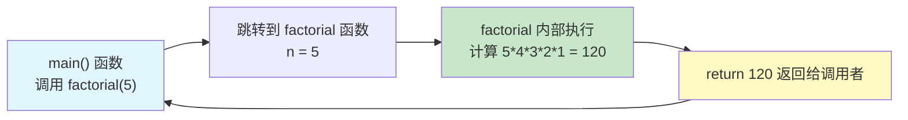
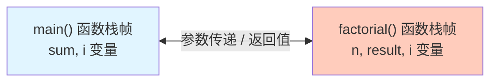
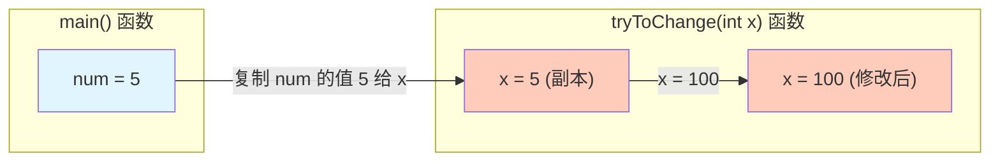
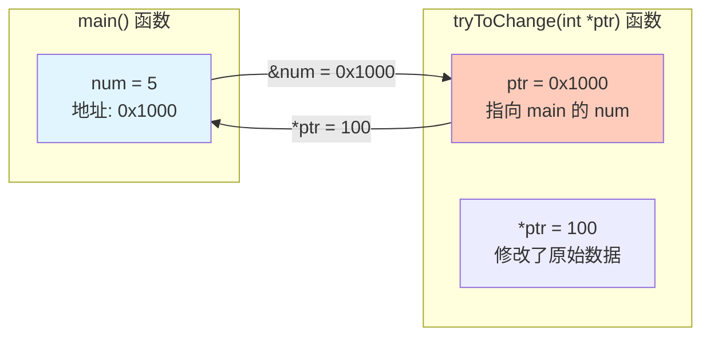
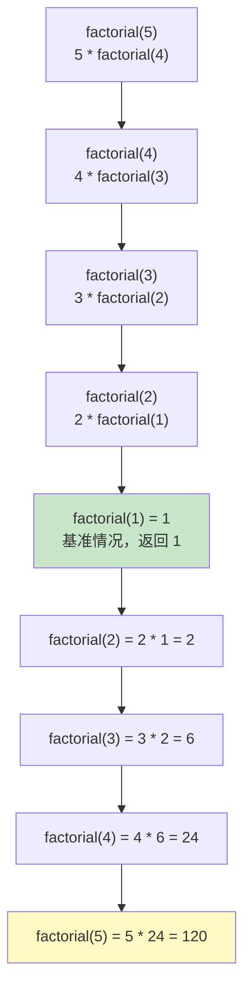
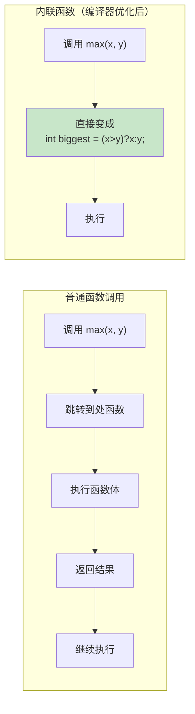
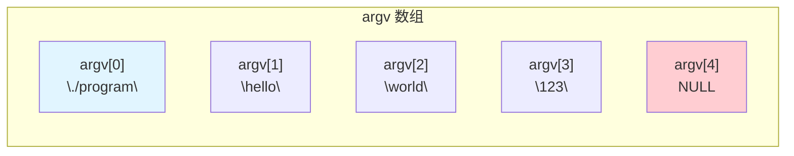
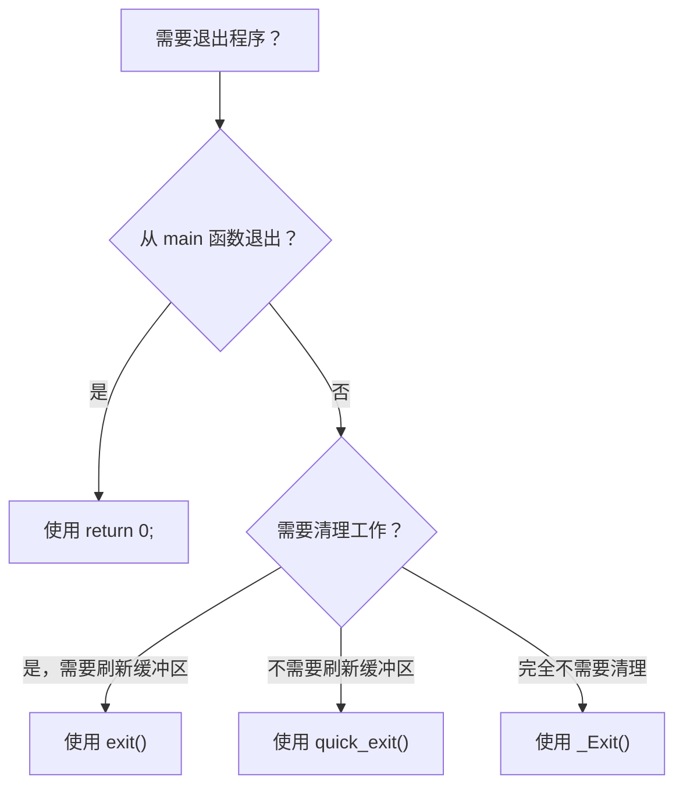

+++
title = "第 7 章：函数——C 语言的'百变大咖'"
weight = 70
date = "2026-03-29T22:34:00+08:00"
type = "docs"
description = ""
isCJKLanguage = true
draft = false
+++

# 第 7 章：函数——C 语言的"百变大咖"

嗨，朋友们！欢迎来到 C 语言最神奇的部分——函数（Function）！

想象一下，你走进一家餐厅。服务员问你要什么，你说："来一份宫保鸡丁！"然后厨房就开始忙活了——洗菜、切菜、炒菜、装盘，最后一盘香喷喷的宫保鸡丁就端到了你面前。你不需要知道厨房里发生了什么，你只需要"点菜"就行。

函数就是 C 语言里的"厨房"。你把原材料（参数）扔进去，函数内部进行一系列神秘操作，最后返回你想要的结果（返回值）。作为调用者，你根本不需要知道函数内部是怎么实现的——这就是**抽象（abstraction）**的力量！

## 7.1 函数的意义：代码复用、模块化、抽象

### 为什么要用函数？

好问题！在回答之前，我们先来看看没有函数的日子是什么样子的。

假设你要写一个程序，计算 1 到 10 的阶乘之和：

```
1! + 2! + 3! + ... + 10!
```

没有函数的时候，你可能得这样写：

```c
#include <stdio.h>

int main() {
    // 计算 1!
    int fact1 = 1;
    for (int i = 1; i <= 1; i++) fact1 *= i;

    // 计算 2!
    int fact2 = 1;
    for (int i = 1; i <= 2; i++) fact2 *= i;

    // 计算 3!
    int fact3 = 1;
    for (int i = 1; i <= 3; i++) fact3 *= i;

    // ... 以此类推
    // 写到这里你已经崩溃了
}
```

哦不！这也太痛苦了吧！计算阶乘的代码重复了 N 遍！如果你哪天发现阶乘的算法有 bug，你得改 N 个地方！这就是传说中的**代码重复（code duplication）**地狱。

### 函数带来的三大好处

**1. 代码复用（Code Reusability）—— DRY 原则**

> DRY = Don't Repeat Yourself（不要重复自己）

有了函数，计算阶乘的代码只需要写一次，然后想用多少次就用多少次：

```c
#include <stdio.h>

// 定义一个计算阶乘的函数，一劳永逸！
int factorial(int n) {
    int result = 1;
    for (int i = 1; i <= n; i++) {
        result *= i;
    }
    return result;
}

int main() {
    int sum = 0;
    for (int i = 1; i <= 10; i++) {
        sum += factorial(i);  // 每次调用一行代码搞定！
    }
    printf("阶乘之和是: %d\n", sum);
    return 0;
}
```

看！同样都是阶乘计算，我只需要写一次 `factorial` 函数，然后在 `main` 里想调用几次就调用几次。这就是**代码复用**的魔力！

**2. 模块化（Modularity）—— 分工合作**

想象一下，如果你要盖一栋大楼，你会让一个人从头建到尾吗？当然不会！你会分成地基组、框架组、水电组、装修组……每个组只负责自己的部分，最后组装起来。

函数就是编程世界的"分工合作"。你可以把程序分成不同的模块，每个模块负责一个特定的功能。

```c
// 不同的函数负责不同的任务
void drawMenu();       // 绘制菜单
void handleInput();   // 处理用户输入
void processData();   // 处理数据
void saveResult();    // 保存结果
```

这样一来，代码结构清晰，谁负责什么都一目了然！

**3. 抽象（Abstraction）—— 隐藏细节**

这是函数最厉害的地方！你只需要知道函数"做什么"，不需要知道"怎么做"。

举个例子，你知道 `printf("Hello")` 能在屏幕上打印文字，但你不需要知道它内部是怎么调用操作系统 API、怎么管理内存、怎么跟显卡通信的。**抽象**让你只需要关心接口（interface），不用关心实现（implementation）。

> 就像你开车，只需要知道踩油门车会走，踩刹车车会停，不需要成为汽车工程师！

### 函数调用原理图

让我们用图来理解函数是怎么工作的：





## 7.2 函数定义与函数原型（声明）

### 函数的基本结构

C 语言的函数就像一个带说明书的产品，基本结构如下：

```c
返回类型 函数名(参数列表) {
    // 函数体：函数要执行的代码
    return 表达式;  // 返回一个值
}
```

举个完整的例子：

```c
#include <stdio.h>

// 这是一个计算两个整数最大值的函数
int max(int a, int b) {
    if (a > b) {
        return a;  // 如果 a 更大，返回 a
    } else {
        return b;  // 否则返回 b
    }
}

int main() {
    int x = 10, y = 20;
    int biggest = max(x, y);  // 调用 max 函数
    printf("最大值是: %d\n", biggest);
    // 输出: 最大值是: 20
    return 0;
}
```

### 函数原型（Function Prototype）—— 提前"剧透"

你有没有遇到过这种情况：你想在 `main` 函数里调用一个函数，但这个函数的定义写在 `main` 的后面？

```c
int main() {
    int result = add(5, 3);  // 编译器报错：add 是什么？我不认识！
    printf("%d\n", result);
    return 0;
}

int add(int a, int b) {  // add 函数定义在 main 后面
    return a + b;
}
```

在 C 语言中，**编译器是从上往下扫描的**。当你写到 `add(5, 3)` 的时候，编译器还不知道 `add` 是什么，因为它还没看到 `add` 函数的定义！

解决方案很简单：**先声明，后定义**。在调用之前，先"剧透"一下这个函数的存在：

```c
#include <stdio.h>

// 函数原型（也叫函数声明）
// 告诉编译器："嘿，后面会有一个叫 add 的函数，它接受两个 int 参数，返回一个 int"
int add(int a, int b);

int main() {
    int result = add(5, 3);  // 现在编译器认识了，安心调用！
    printf("%d\n", result);
    // 输出: 8
    return 0;
}

// 函数定义（在声明之后）
int add(int a, int b) {
    return a + b;
}
```

### 函数原型的简化写法

函数原型中的参数名其实可以省略，只保留类型就行：

```c
// 这些写法都是等价的
int add(int a, int b);
int add(int, int);         // 参数名省略，简洁！
int add(int x, int y);     // 参数名不同也可以
```

实际开发中，很多程序员喜欢用简化写法，因为函数原型的主要作用是告诉编译器"有这样一个函数"，参数叫什么名字并不重要。

### void 函数——不返回值的函数

如果一个函数不返回任何值怎么办？用 `void` 作为返回类型：

```c
#include <stdio.h>

// 这个函数不返回值，只打印
void greet(char name[]) {
    printf("你好，%s！欢迎光临！\n", name);
}

int main() {
    greet("小明");
    // 输出: 你好，小明！欢迎光临！
    
    // 注意：void 函数不能用在赋值表达式中
    // int x = greet("小明");  // 错误！greet 不返回值
    return 0;
}
```

### 无参数函数

如果一个函数不接受任何参数，用 `void` 或者空参数列表：

```c
#include <stdio.h>

// 两种写法都表示"没有参数"
void printWelcome(void) {
    printf("==========\n");
    printf("  欢迎！  \n");
    printf("==========\n");
}

void printGoodbye() {
    printf("再见！欢迎下次光临！\n");
}

int main() {
    printWelcome();
    printGoodbye();
    return 0;
}
```

> 注意：`void printWelcome(void)` 表示明确没有参数，而 `void printWelcome()` 在 C 中表示参数"未知"（C++ 中才表示无参数）。为了代码清晰，建议用 `void` 明确表示无参数。

## 7.3 参数传递：值传递（Pass by Value）

这是 C 语言最重要的概念之一，也是新手最容易踩坑的地方！

### 什么是值传递？

**值传递（pass by value）** 的意思是：当调用函数时，把参数的**值**复制一份传给函数。函数内部操作的是那份**副本**，不是原始数据。

来，看个生活化的例子：

> 你有一份重要的文件（原始数据）。你让秘书去复印一份（复制），然后秘书在复印件上做修改。原文件（原始数据）会受到任何影响吗？当然不会！

```c
#include <stdio.h>

// 这是一个尝试修改参数的函数
void tryToChange(int x) {
    x = 100;  // 尝试把 x 改成 100
    printf("函数内部，x = %d\n", x);
}

int main() {
    int num = 5;
    printf("调用前，num = %d\n", num);
    // 输出: 调用前，num = 5

    tryToChange(num);  // 把 num 的值"复制"一份传给函数

    printf("调用后，num = %d\n", num);
    // 输出: 调用后，num = 5  ← 什么？！num 还是 5？！
    return 0;
}
```

运行结果：

```
调用前，num = 5
函数内部，x = 100
调用后，num = 5
```

看到了吗？函数内部把 `x` 改成了 100，但 `main` 函数里的 `num` 完全没有变化！这就是**值传递**的特性——函数拿到的是副本，原来的变量不受影响。

### 图解值传递



### C 语言没有引用传递，只有指针模拟！

很多从 Python、Java 过来的同学可能会问："C 语言有没有引用传递（pass by reference）啊？"

答案是：**没有！** C 语言原生不支持引用传递。但是，C 大神们用**指针（pointer）**完美模拟了引用传递的效果！

思路是这样的：如果你想修改 `main` 函数里的变量，你需要把变量的**地址**（用 `&` 获取）传给函数，然后函数通过**解引用（dereference）**来修改原始数据。

```c
#include <stdio.h>

// 用指针来"模拟"引用传递
void tryToChangeWithPointer(int *ptr) {
    *ptr = 100;  // 通过指针修改原始变量的值
    printf("函数内部，*ptr = %d\n", *ptr);
}

int main() {
    int num = 5;
    printf("调用前，num = %d\n", num);
    // 输出: 调用前，num = 5

    tryToChangeWithPointer(&num);  // 把 num 的地址传过去！

    printf("调用后，num = %d\n", num);
    // 输出: 调用后，num = 100  ← 成功了！
    return 0;
}
```

运行结果：

```
调用前，num = 5
函数内部，*ptr = 100
调用后，num = 100
```

太好了！这次 `num` 真的被修改了！

### 图解指针模拟引用传递



### 数组的特殊情况——数组名就是指针！

等等，既然是值传递，那数组传递给函数时会怎样？

答案是：**数组名在大多数情况下会自动转换为指针**！看这个例子：

```c
#include <stdio.h>

// 打印数组的所有元素
void printArray(int arr[], int size) {
    for (int i = 0; i < size; i++) {
        printf("%d ", arr[i]);
    }
    printf("\n");
}

// 修改数组的第一个元素
void modifyArray(int arr[]) {
    arr[0] = 999;  // 直接修改数组内容！
}

int main() {
    int nums[] = {1, 2, 3, 4, 5};
    
    printArray(nums, 5);
    // 输出: 1 2 3 4 5
    
    modifyArray(nums);  // 传入数组
    
    printArray(nums, 5);
    // 输出: 999 2 3 4 5  ← 数组第一个元素被改了！
    return 0;
}
```

这似乎和"值传递"矛盾了？别急，听我解释：

- `nums` 是数组名，它本身存储的是数组**首元素的地址**
- 当你把 `nums` 传给函数时，传递的是这个**地址**（指针）
- 所以函数拿到的是指向同一块内存的指针，自然能修改数组内容

> 这就是为什么 C 语言的数组传递是"伪装的值传递"——传的是地址（指针），不是整个数组的副本。如果真的传整个数组的副本，那效率也太低了！

### 完整对比：值传递 vs 指针模拟引用传递

```c
#include <stdio.h>

// 普通变量传递：值传递（副本）
void incrementValue(int x) {
    x++;
    printf("函数内 x = %d\n", x);
}

// 指针传递：模拟引用传递（能修改原始变量）
void incrementPointer(int *ptr) {
    (*ptr)++;
    printf("函数内 *ptr = %d\n", *ptr);
}

int main() {
    int a = 10;
    
    incrementValue(a);
    printf("调用后 a = %d\n", a);
    // 输出:
    // 函数内 x = 11
    // 调用后 a = 10  ← a 没变！

    printf("---\n");
    
    incrementPointer(&a);
    printf("调用后 a = %d\n", a);
    // 输出:
    // 函数内 *ptr = 11
    // 调用后 a = 11  ← a 变了！

    return 0;
}
```

运行结果：

```
函数内 x = 11
调用后 a = 10
---
函数内 *ptr = 11
调用后 a = 11
```

## 7.4 `return` 语句

`return` 语句是函数的"出口"，用它可以把结果返回给调用者。

### return 的基本用法

```c
#include <stdio.h>

// 返回两个整数的和
int add(int a, int b) {
    return a + b;  // 返回计算结果
}

// 返回较大值
int max(int a, int b) {
    if (a > b) {
        return a;
    } else {
        return b;
    }
}

// 返回布尔值（C中没有真正的bool，用int代替）
int isEven(int n) {
    return (n % 2 == 0);  // 返回 1（真）或 0（假）
}

int main() {
    printf("3 + 5 = %d\n", add(3, 5));
    // 输出: 3 + 5 = 8

    printf("max(10, 20) = %d\n", max(10, 20));
    // 输出: max(10, 20) = 20

    printf("isEven(4) = %d, isEven(7) = %d\n", isEven(4), isEven(7));
    // 输出: isEven(4) = 1, isEven(7) = 0
    return 0;
}
```

### return 的特性

**1. return 会立即结束函数**

```c
#include <stdio.h>

void printUntilFive(int n) {
    for (int i = 1; i <= 10; i++) {
        printf("%d ", i);
        if (i == n) {
            printf("\n遇到 %d，提前返回！\n", n);
            return;  // 立即结束函数，后面的循环不执行了
        }
    }
}

int main() {
    printUntilFive(4);
    // 输出:
    // 1 2 3 4 
    // 遇到 4，提前返回！
    return 0;
}
```

**2. void 函数也可以用 return 提前退出**

```c
#include <stdio.h>

void process(int condition) {
    if (condition < 0) {
        printf("条件不满足，直接返回！\n");
        return;  // 提前退出，不需要返回值
    }
    printf("开始处理...\n");
    // ... 更多处理逻辑
}

int main() {
    process(-1);
    // 输出: 条件不满足，直接返回！

    process(5);
    // 输出:
    // 开始处理...
    return 0;
}
```

**3. return 可以返回表达式的值**

```c
#include <stdio.h>

int absoluteValue(int n) {
    return n >= 0 ? n : -n;  // 使用三元运算符，简捷！
}

double calculateArea(double radius) {
    return 3.14159 * radius * radius;  // 返回表达式结果
}

int main() {
    printf("|-5| = %d\n", absoluteValue(-5));
    // 输出: |-5| = 5

    printf("半径为 3 的圆的面积 = %.2f\n", calculateArea(3));
    // 输出: 半径为 3 的圆的面积 = 28.27
    return 0;
}
```

### 没有返回值的函数（void 函数）的注意事项

如果你声明了返回类型为 `void`，那就**不要**使用 `return 值;` 的形式：

```c
// 错误示例
void greet() {
    printf("Hello!\n");
    return 100;  // 错误！void 函数不能返回值
}

// 正确示例
void greet() {
    printf("Hello!\n");
    return;  // 可以，只是提前退出，不返回任何值
}
```

## 7.5 递归函数

递归（Recursion）是 C 语言中最优雅也最让新手头疼的概念之一。别怕，我会用最通俗的方式解释！

### 什么是递归？

**递归**就是"函数自己调用自己"。想象一下，你有一面镜子，对着另一面镜子放。当你看镜子时，会看到无限循环的倒影——这就是递归的视觉比喻！

> 递归就像俄罗斯套娃——打开一个娃娃，里面还有一个；再打开，还有；直到打开最后一个最小的娃娃（基准情况），不能再开了。

### 递归三要素

1. **基准情况（Base Case）**：递归结束的条件，没有基准情况会无限递归下去
2. **递归情况（Recursive Case）**：函数调用自己，每次调用都应该更接近基准情况
3. **返回值**：把每一层的结果逐步返回上去

### 经典案例：阶乘

数学上，5! = 5 × 4 × 3 × 2 × 1 = 120

用递归怎么写？

```c
#include <stdio.h>

// 递归计算阶乘
int factorial(int n) {
    // 基准情况：0! = 1，1! = 1
    if (n == 0 || n == 1) {
        return 1;
    }
    // 递归情况：n! = n * (n-1)!
    return n * factorial(n - 1);
}

int main() {
    for (int i = 0; i <= 5; i++) {
        printf("%d! = %d\n", i, factorial(i));
    }
    // 输出:
    // 0! = 1
    // 1! = 1
    // 2! = 2
    // 3! = 6
    // 4! = 24
    // 5! = 120
    return 0;
}
```

### 递归调用图解

以 `factorial(5)` 为例：



### 经典案例：斐波那契数列

斐波那契数列是这样的：0, 1, 1, 2, 3, 5, 8, 13, 21, ...

规律是：**F(n) = F(n-1) + F(n-2)**，前两个是 0 和 1。

```c
#include <stdio.h>

// 递归计算斐波那契数
int fibonacci(int n) {
    // 基准情况
    if (n == 0) return 0;  // F(0) = 0
    if (n == 1) return 1;  // F(1) = 1
    
    // 递归情况
    return fibonacci(n - 1) + fibonacci(n - 2);
}

int main() {
    printf("斐波那契数列前 10 项:\n");
    for (int i = 0; i < 10; i++) {
        printf("%d ", fibonacci(i));
    }
    printf("\n");
    // 输出: 0 1 1 2 3 5 8 13 21 34
    return 0;
}
```

### 经典案例：汉诺塔（Hanoi Tower）

汉诺塔是递归的经典应用！有三根柱子，初始时所有盘子都在第一根柱子上（从上到下越来越大），要把所有盘子移动到第三根柱子上，每次只能移动一个盘子，且大盘子不能放在小盘子上面。

```c
#include <stdio.h>

/*
 * 汉诺塔问题
 * n: 盘子的数量
 * from: 源柱子 (起始位置)
 * to: 目标柱子
 * aux: 辅助柱子
 */
void hanoi(int n, char from, char to, char aux) {
    // 基准情况：只有一个盘子，直接移动
    if (n == 1) {
        printf("把盘子 1 从 %c 移动到 %c\n", from, to);
        return;
    }
    
    // 递归情况分三步：
    // 第一步：把上面的 n-1 个盘子从 from 移动到 aux（借助 to）
    hanoi(n - 1, from, aux, to);
    
    // 第二步：把最大的盘子（第 n 个）从 from 移动到 to
    printf("把盘子 %d 从 %c 移动到 %c\n", n, from, to);
    
    // 第三步：把 n-1 个盘子从 aux 移动到 to（借助 from）
    hanoi(n - 1, aux, to, from);
}

int main() {
    int disks = 3;
    printf("汉诺塔（%d 个盘子）的解法：\n\n", disks);
    hanoi(disks, 'A', 'C', 'B');  // A 是起始柱，C 是目标柱，B 是辅助柱
    return 0;
}
```

运行结果：

```
汉诺塔（3 个盘子）的解法：

把盘子 1 从 A 移动到 C
把盘子 2 从 A 移动到 B
把盘子 1 从 C 移动到 B
把盘子 3 从 A 移动到 C
把盘子 1 从 B 移动到 A
把盘子 2 从 B 移动到 C
把盘子 1 从 A 移动到 C
```

### 递归 vs 迭代：该怎么选？

这是一个非常重要的问题！让我给你一个清晰的对比：

| 特性 | 递归 | 迭代 |
|------|------|------|
| 代码简洁度 | 通常更简洁、更易读 | 可能需要更多代码 |
| 性能 | 有函数调用开销，可能栈溢出 | 没有调用开销，效率更高 |
| 内存 | 需要栈空间保存调用信息 | 只需要少量变量 |
| 适用场景 | 问题本身具有递归结构 | 一般循环能解决的问题 |

**什么时候用递归？**

- 问题天然具有递归结构（树、图、汉诺塔、分治算法）
- 代码可读性比性能更重要
- 递归深度不会太深

**什么时候用迭代？**

- 可以轻松用循环解决
- 性能要求高，递归深度可能很大
- 资源受限的环境

### 递归阶乘 vs 迭代阶乘

```c
#include <stdio.h>

// 递归版本
int factorialRecursive(int n) {
    if (n <= 1) return 1;
    return n * factorialRecursive(n - 1);
}

// 迭代版本（用循环）
int factorialIterative(int n) {
    int result = 1;
    for (int i = 1; i <= n; i++) {
        result *= i;
    }
    return result;
}

int main() {
    printf("递归: 5! = %d\n", factorialRecursive(5));
    // 输出: 递归: 5! = 120

    printf("迭代: 5! = %d\n", factorialIterative(5));
    // 输出: 迭代: 5! = 120
    return 0;
}
```

### 斐波那契的迭代优化版本

斐波那契用递归实现虽然简单，但效率很低（时间复杂度是指数级）。用迭代就快多了：

```c
#include <stdio.h>

// 迭代版本 - O(n) 时间复杂度
int fibonacciIterative(int n) {
    if (n <= 1) return n;
    
    int prev = 0, curr = 1;
    for (int i = 2; i <= n; i++) {
        int next = prev + curr;
        prev = curr;
        curr = next;
    }
    return curr;
}

int main() {
    for (int i = 0; i < 10; i++) {
        printf("%d ", fibonacciIterative(i));
    }
    printf("\n");
    // 输出: 0 1 1 2 3 5 8 13 21 34
    return 0;
}
```

## 7.6 变参函数：`stdarg.h`

你有没有想过 `printf` 是怎么工作的？它可以接受任意数量的参数！`printf("Hello")` 可以，`printf("%d %s %f", 42, "hi", 3.14)` 也可以。这就是**变参函数（variadic function）**的魔力！

### 什么是变参函数？

**变参函数**是 C 语言提供的一种机制，允许函数接受可变数量的参数。比如 `printf`，你想传几个参数就传几个参数，函数内部自己解析。

### `<stdarg.h>` 头文件

C 标准库提供了 `<stdarg.h>` 头文件，里面有几个宏，专门用来处理可变参数：

| 宏 | 作用 |
|-----|------|
| `va_list` | 定义一个参数列表变量（类似"迭代器"） |
| `va_start` | 初始化参数列表，让它指向第一个可变参数 |
| `va_arg` | 获取当前参数的值，并移动到下一个参数 |
| `va_end` | 清理，结束参数读取 |
| `va_copy` | 复制一份 va_list |

### 变参函数的基本用法

```c
#include <stdio.h>
#include <stdarg.h>  // 变参函数需要的头文件

// 这是一个求平均值的变参函数
// 第一个参数 n 表示后面有多少个数
double average(int n, ...) {
    va_list args;  // 定义参数列表
    va_start(args, n);  // 初始化，从 n 之后开始

    double sum = 0;
    for (int i = 0; i < n; i++) {
        sum += va_arg(args, double);  // 依次获取每个 double 类型的参数
    }

    va_end(args);  // 清理
    return sum / n;
}

int main() {
    printf("average(3, 1.0, 2.0, 3.0) = %.2f\n", average(3, 1.0, 2.0, 3.0));
    // 输出: average(3, 1.0, 2.0, 3.0) = 2.00

    printf("average(5, 10.0, 20.0, 30.0, 40.0, 50.0) = %.2f\n", 
           average(5, 10.0, 20.0, 30.0, 40.0, 50.0));
    // 输出: average(5, 10.0, 20.0, 30.0, 40.0, 50.0) = 30.00
    return 0;
}
```

### va_copy 的使用

有时候你需要保存参数列表的状态，以便多次遍历：

```c
#include <stdio.h>
#include <stdarg.h>

// 演示 va_copy 的用法
void demonstrateVaCopy(int first, ...) {
    va_list args1, args2;

    va_start(args1, first);

    // 用 va_copy 复制一份
    va_copy(args2, args1);

    // 第一次遍历
    printf("第一次遍历: ");
    for (int i = 0; i < 3; i++) {
        printf("%d ", va_arg(args1, int));
    }
    printf("\n");

    // 用复制的副本再遍历一次（从头开始）
    printf("第二次遍历: ");
    for (int i = 0; i < 3; i++) {
        printf("%d ", va_arg(args2, int));
    }
    printf("\n");

    va_end(args1);
    va_end(args2);
}

int main() {
    demonstrateVaCopy(1, 10, 20, 30);
    // 输出:
    // 第一次遍历: 10 20 30
    // 第二次遍历: 10 20 30
    return 0;
}
```

### 7.6.1 `printf` 实现原理（经典案例）

`printf` 是变参函数的最佳代表。让我来揭示它的工作原理！

`printf` 的原型是：

```c
int printf(const char *format, ...);
```

`format` 字符串包含了普通字符和**格式说明符**（以 `%` 开头），如：

- `%d` - 整数
- `%f` - 浮点数
- `%s` - 字符串
- `%c` - 字符

`printf` 的内部实现大致是这样的：

```c
#include <stdio.h>
#include <stdarg.h>

// 简化版的 my_printf
int my_printf(const char *format, ...) {
    va_list args;
    va_start(args, format);

    int count = 0;  // 统计打印的字符数

    while (*format != '\0') {
        if (*format == '%') {
            format++;  // 看下一个字符

            switch (*format) {
                case 'd': {  // 整数
                    int val = va_arg(args, int);
                    // 简单打印整数的逻辑
                    char buffer[20];
                    int len = 0;
                    if (val < 0) {
                        putchar('-');
                        count++;
                        val = -val;
                    }
                    // 把数字转成字符串
                    char temp[20];
                    int temp_len = 0;
                    if (val == 0) {
                        temp[temp_len++] = '0';
                    } else {
                        while (val > 0) {
                            temp[temp_len++] = '0' + (val % 10);
                            val /= 10;
                        }
                    }
                    // 逆序输出
                    for (int i = temp_len - 1; i >= 0; i--) {
                        putchar(temp[i]);
                        count++;
                    }
                    break;
                }
                case 'f': {  // 浮点数
                    double val = va_arg(args, double);
                    // 简化：只处理正数
                    int int_part = (int)val;
                    double frac_part = val - int_part;
                    printf("%d.", int_part);  // 简化处理
                    count++;
                    // 打印小数部分
                    for (int i = 0; i < 6; i++) {
                        frac_part *= 10;
                        putchar('0' + (int)frac_part % 10);
                        count++;
                    }
                    break;
                }
                case 's': {  // 字符串
                    char *s = va_arg(args, char *);
                    while (*s) {
                        putchar(*s);
                        s++;
                        count++;
                    }
                    break;
                }
                case 'c': {  // 字符
                    char c = va_arg(args, int);  // 注意：char 会提升为 int
                    putchar(c);
                    count++;
                    break;
                }
                default:
                    putchar(*format);
                    count++;
                    break;
            }
        } else {
            putchar(*format);
            count++;
        }
        format++;
    }

    va_end(args);
    return count;
}

int main() {
    my_printf("Hello, %s! Number: %d, Float: %f, Char: %c\n",
              "World", 42, 3.14159, 'X');
    return 0;
}
```

`printf` 之所以强大，是因为它使用了**格式字符串**来告诉函数接下来要读取什么类型的参数，然后通过 `va_arg` 来获取这些参数。

### 变参函数的注意事项

1. **必须至少有一个固定参数**，`va_start` 需要用它来确定可变参数的开始位置
2. **你自己要知道参数的类型**，`va_arg` 需要你指定类型
3. **没有类型安全检查**，编译器不会帮你检查你取出来的类型对不对

```c
#include <stdio.h>
#include <stdarg.h>

// 错误的用法示例 - 很容易出问题
void printAll(int count, ...) {
    va_list args;
    va_start(args, count);

    // 如果你告诉 va_arg 这是 int，但实际上传了 double
    // 程序可能会出奇怪的问题！
    for (int i = 0; i < count; i++) {
        printf("%d ", va_arg(args, int));  // 假设都是 int
    }
    printf("\n");

    va_end(args);
}

int main() {
    printAll(3, 1, 2, 3);  // 正常
    printAll(3, 1.5, 2.5, 3.5);  // 危险！传了 double 但按 int 读
    return 0;
}
```

## 7.7 内联函数：`inline`（C99）

### 什么是内联函数？

通常，函数调用是有开销的——CPU 需要跳转到函数地址，执行完后又跳转回来。虽然这个开销很小，但在高频调用的情况下（比如一个函数被调用几万次），累积起来也不小。

**内联函数（inline function）** 就是为了解决这个问题而生的。编译器会把内联函数的代码**直接插入**到调用处，而不是真正地调用函数。就像你把食谱直接写在菜谱里，而不是说"请参考第 37 页"。

### inline 的基本用法

```c
#include <stdio.h>

// 使用 inline 关键字声明内联函数
inline int max(int a, int b) {
    return (a > b) ? a : b;
}

int main() {
    int x = 10, y = 20;
    int biggest = max(x, y);  // 编译器可能会直接变成: biggest = (x > y) ? x : y;
    printf("最大值: %d\n", biggest);
    // 输出: 最大值: 20
    return 0;
}
```

### 内联函数 vs 普通函数



### 7.7.1 `static inline` vs `inline` vs `extern inline`

这三个变体让人眼花缭乱，让我用表格和例子解释清楚：

| 关键字组合 | 含义 | 适用场景 |
|------------|------|----------|
| `inline` | C99 引入，暗示编译器进行内联，但不做强制要求。如果函数只被当前文件使用，建议加 `static`。 | 头文件中的小型、频繁调用的函数 |
| `static inline` | 只能在本文件内使用，编译器可以进行内联优化 | 头文件中供单个文件使用的工具函数 |
| `extern inline` | 外部链接，函数定义在某处，用 `inline` 作为优化提示 | 库文件中的内联函数 |

### 详细解释与示例

**1. `static inline`——最常用的组合**

```c
// utils.h
#ifndef UTILS_H
#define UTILS_H

// static inline: 这个函数只属于包含这个头文件的 .c 文件
// 不同的 .c 文件包含这个头文件时，各自有一份独立的 max 函数
static inline int max(int a, int b) {
    return (a > b) ? a : b;
}

static inline int min(int a, int b) {
    return (a < b) ? a : b;
}

#endif
```

**2. `inline`（无 static）——可能有外部链接**

```c
// 在 .c 文件中
inline int getSquare(int x) {
    return x * x;
}

// 如果没有 static，也没有 extern，
// 有些编译器会要求你提供一个 non-inline 的外部定义：
// extern int getSquare(int x);  // 在某个地方
```

**3. `extern inline`——明确外部链接**

```c
// math_utils.c
#include <stdio.h>

// 这是外部定义（给没有内联的调用使用）
extern inline int compute(int x) {
    return x * 2 + 1;
}

// 如果其他地方调用 compute 但编译器没有内联，
// 它会使用这里的定义
```

### 什么函数适合内联？

**适合内联的函数：**

- 函数体很小（如一两行）
- 被频繁调用
- 不包含复杂控制流（循环、递归等）

**不适合内联的函数：**

- 函数体很大
- 包含循环或递归
- 地址被获取（`&func`），不能内联

```c
// 适合内联
inline int add(int a, int b) { return a + b; }
inline int isPositive(int n) { return n > 0; }

// 不适合内联（编译器可能会忽略 inline）
int complexCalculation(int *arr, int size) {
    int result = 0;
    for (int i = 0; i < size; i++) {
        result += arr[i] * arr[i];
        // ... 很多代码
    }
    return result;
}
```

## 7.8 `noreturn` 函数

有时候，函数会**永远不会返回**到调用点。比如，`exit()` 函数会直接终止程序，`abort()` 函数会直接崩溃程序。对于这类函数，C11 引入了 `noreturn` 标记来告诉编译器："这个函数不会返回，你不用生成返回相关的代码了"。

### 7.8.1 C11：`noreturn` 宏或 `_Noreturn` 关键字

**方法一：使用 `<stdnoreturn.h>` 中的 `noreturn` 宏**

```c
#define __STDC_VERSION__ 201112L
#include <stdio.h>
#include <stdnoreturn.h>  // C11 引入

// 声明这是一个不会返回的函数
noreturn void fatalError(const char *message) {
    printf("致命错误: %s\n", message);
    printf("程序即将退出...\n");
    exit(1);
}

int divide(int a, int b) {
    if (b == 0) {
        fatalError("除数不能为零！");  // 不会返回
    }
    return a / b;
}

int main() {
    int result = divide(10, 0);  // 会触发 fatalError
    printf("结果: %d\n", result);  // 这行永远不会执行
    return 0;
}
```

**方法二：使用 `_Noreturn` 关键字（C11）**

```c
#include <stdio.h>
#include <stdlib.h>

_Noreturn void myExit(void) {
    printf("程序正在退出...\n");
    exit(0);
}

int main() {
    printf("1. 第一步\n");
    printf("2. 第二步\n");
    myExit();  // 永远不会返回到这里
    printf("3. 第三步\n");  // 永远不会执行
    return 0;
}
```

### 7.8.2 C23：`[[noreturn]]` 属性（C23）

C23 引入了**属性语法**（类似 C++），`_Noreturn` 在 C23 中已被**废弃**，推荐使用 `[[noreturn]]`。

```c
#include <stdio.h>
#include <stdlib.h>

// C23 推荐的方式
[[noreturn]] void terminateProgram(void) {
    printf("程序终止！\n");
    exit(1);
}

// C23 也可以用 [[noreturn]] 在同一条声明中
[[noreturn]] void alwaysPanic(const char *msg) {
    fprintf(stderr, "PANIC: %s\n", msg);
    abort();
}

int main() {
    printf("输入一个正数: ");
    int n;
    if (scanf("%d", &n) != 1 || n <= 0) {
        terminateProgram();  // 不会返回
    }
    printf("你输入的是: %d\n", n);
    return 0;
}
```

### noreturn 的作用

为什么要有 `noreturn`？编译器可以据此进行优化：

1. **消除"返回值检查"警告**：如果你声明了 `noreturn` 函数，但代码却检查了它的返回值，编译器会报警告
2. **优化代码生成**：编译器知道不需要为返回做准备
3. **帮助静态分析**：分析工具可以更好地理解代码流程

## 7.9 `main` 函数完整参数

`main` 函数是程序的入口。你可能见过 `int main(void)` 或者 `int main()`，但你知道 `main` 还有完整的参数吗？

### main 的常见形式

```c
int main(void) {
    // 程序体
    return 0;
}
```

### main 的完整参数（非标准，但广泛支持）

```c
int main(int argc, char *argv[], char *envp[]) {
    // argc: 参数个数（argument count）
    // argv: 参数列表（argument vector），每个元素是一个字符串
    // envp: 环境变量（environment variables）
    return 0;
}
```

### 参数详解

**`argc`（Argument Count）**：命令行参数的数量，包括程序名称本身。

**`argv`（Argument Vector）**：指向字符串数组的指针，每个字符串是一个命令行参数。

- `argv[0]` - 程序名称（或启动路径）
- `argv[1]` - 第一个实际参数
- `argv[2]` - 第二个实际参数
- ...
- `argv[argc]` - 永远是 `NULL`

**`envp`（Environment Pointer）**：指向环境变量的指针数组，格式是 `"KEY=VALUE"`。

### 完整示例

```c
#include <stdio.h>

int main(int argc, char *argv[], char *envp[]) {
    printf("========== 程序信息 ==========\n");
    printf("程序名称 (argv[0]): %s\n", argv[0]);
    printf("参数个数 (argc): %d\n", argc);

    printf("\n========== 命令行参数 ==========\n");
    for (int i = 1; i < argc; i++) {
        printf("argv[%d] = %s\n", i, argv[i]);
    }

    printf("\n========== 环境变量（部分） ==========\n");
    int count = 0;
    for (int i = 0; envp[i] != NULL && count < 5; i++) {
        // 只显示前 5 个环境变量
        printf("%s\n", envp[i]);
        count++;
    }
    printf("(仅显示前 5 个环境变量...)\n");

    return 0;
}
```

如果编译后运行：

```bash
$ ./program hello world 123
```

输出可能是：

```
========== 程序信息 ==========
程序名称 (argv[0]): ./program
参数个数 (argc): 4

========== 命令行参数 ==========
argv[1] = hello
argv[2] = world
argv[3] = 123

========== 环境变量（部分） ==========
PATH=/usr/local/bin:/usr/bin:/bin
HOME=/home/user
USER=user
SHELL=/bin/bash
TERM=xterm-256color
(仅显示前 5 个环境变量...)
```

### 图解 argv



### 实用案例：命令行计算器

```c
#include <stdio.h>
#include <stdlib.h>
#include <string.h>

int main(int argc, char *argv[]) {
    if (argc != 4) {
        fprintf(stderr, "用法: %s <数字1> <运算符> <数字2>\n", argv[0]);
        fprintf(stderr, "例如: %s 10 + 5\n", argv[0]);
        return 1;
    }

    double a = atof(argv[1]);  // 字符串转浮点数
    char op = argv[2][0];      // 取运算符
    double b = atof(argv[3]);

    double result;
    switch (op) {
        case '+': result = a + b; break;
        case '-': result = a - b; break;
        case '*': result = a * b; break;
        case '/':
            if (b == 0) {
                fprintf(stderr, "错误: 除数不能为零！\n");
                return 1;
            }
            result = a / b;
            break;
        default:
            fprintf(stderr, "错误: 不支持的运算符 '%c'\n", op);
            return 1;
    }

    printf("%.2f %c %.2f = %.2f\n", a, op, b, result);
    return 0;
}
```

运行：

```bash
$ ./calc 10 + 5
10.00 + 5.00 = 15.00

$ ./calc 100 / 3
100.00 / 3.00 = 33.33
```

## 7.10 `exit` vs `return` vs `_Exit` vs `quick_exit`

在 C 语言中，退出程序有多种方式，它们各有特点：

| 函数 | 头文件 | 行为 | 清理工作 |
|------|--------|------|----------|
| `return` | - | 只能从 `main` 退出；返回给调用者 | 正常清理 |
| `exit` | `<stdlib.h>` | 从任何函数退出 | 执行 atexit 注册的清理函数、刷新缓冲区、关闭文件 |
| `_Exit` | `<stdlib.h>` | 从任何函数退出 | **不**做任何清理，直接终止 |
| `quick_exit` | `<stdlib.h>` | 从任何函数退出 | 执行 at_quick_exit 注册的清理函数（不刷新缓冲区） |

### `return` 在 main 中的特殊地位

```c
#include <stdio.h>

int main() {
    printf("使用 return 退出\n");
    return 0;  // 正常退出，返回 0 表示成功
}
```

> 注意：`return` 在 `main` 中使用时，效果等同于 `exit(0)`。但在普通函数中使用 `return` 不会退出程序！

### `exit` —— 全面的清理

```c
#include <stdio.h>
#include <stdlib.h>

void cleanup(void) {
    printf("清理函数被调用：关闭文件、释放资源...\n");
}

int main() {
    // 注册清理函数
    atexit(cleanup);

    printf("程序开始执行...\n");
    printf("调用 exit() 退出程序\n");

    exit(0);  // 会调用清理函数
    printf("这行不会执行\n");  // 永远不会执行

    return 0;
}
```

输出：

```
程序开始执行...
调用 exit() 退出程序
清理函数被调用：关闭文件、释放资源...
```

### `_Exit` —— 立即终止

```c
#include <stdio.h>
#include <stdlib.h>

void cleanup(void) {
    printf("清理函数（不会被调用）\n");
}

int main() {
    atexit(cleanup);  // 注册了也没用

    printf("使用 _Exit 退出...\n");
    _Exit(1);  // 立即终止，不做任何清理
    printf("这行不会执行\n");  // 永远不会执行

    return 0;
}
```

输出：

```
使用 _Exit 退出...
```

注意到没有？清理函数根本没有被调用！因为 `_Exit` 是"冷酷无情"的，直接终止进程。

### `quick_exit` —— 折中方案

```c
#include <stdio.h>
#include <stdlib.h>

void cleanup(void) {
    printf("清理函数被调用（quick_exit 路径）\n");
}

int main() {
    at_quick_exit(cleanup);  // 注册 quick_exit 专用的清理函数

    printf("使用 quick_exit 退出...\n");
    quick_exit(0);  // 调用清理函数，但不刷新 stdio 缓冲区
    printf("这行不会执行\n");

    return 0;
}
```

### 场景选择指南



- **正常退出（GUI 程序、Web 服务等）**：用 `exit()`，确保资源被正确释放
- **错误处理（紧急情况）**：用 `_Exit()`，快速终止
- **`main` 函数正常退出**：用 `return 0`，语义最清晰
- **需要清理但不刷新缓冲区**：用 `quick_exit()`

## 7.11 函数设计原则与最佳实践

恭喜你读到这里！现在让我们来聊聊如何写出高质量的函数。

### 单一职责原则（Single Responsibility Principle）

每个函数应该只做**一件事**，并且把这件事做好。

```c
// ❌ 糟糕的设计：函数做了太多事
void processUserData(char *name, int age, int saveToFile) {
    // 验证名字
    if (strlen(name) < 2) return;
    // 验证年龄
    if (age < 0 || age > 150) return;
    // 处理数据
    printf("处理用户: %s, %d岁\n", name, age);
    // 保存文件
    if (saveToFile) {
        // 复杂的文件操作...
    }
}

// ✅ 好的设计：每个函数只做一件事
int validateName(const char *name);
int validateAge(int age);
void printUser(const char *name, int age);
void saveUserToFile(const char *name, int age);
```

### 函数命名规范

好的函数名应该**见名知意**：

```c
// ❌ 糟糕的命名
void calc(int x);
void func(char *s);
void process1(int a, int b);

// ✅ 清晰的命名
int calculateArea(int width, int height);
void sendEmail(const char *recipient, const char *subject);
int findMaxValue(const int *array, int size);
```

### 参数不要太多

如果函数参数超过 3-4 个，考虑重构：

```c
// ❌ 参数太多，难以阅读
void createWindow(int x, int y, int width, int height, 
                  const char *title, int resizable, 
                  int hasBorder, int hasTitleBar);

// ✅ 使用结构体封装
typedef struct {
    int x, y;
    int width, height;
    const char *title;
    int flags;
} WindowConfig;

void createWindow(const WindowConfig *config);
```

### 使用 const 保护参数

如果函数不会修改参数，用 `const` 声明：

```c
// 这两个函数不会修改参数
int getLength(const char *str);
double calculateCircleArea(const double radius);

// 这样调用者就知道："传进去的参数是安全的，不会被修改"
```

### 避免全局变量，使用参数传递

```c
// ❌ 使用全局变量（危险！）
int total = 0;
void addToTotal(int value) {
    total += value;
}

// ✅ 参数传递（安全、可预测）
int addToTotal(int total, int value) {
    return total + value;
}
```

### 文档注释

给函数写清晰的注释：

```c
/**
 * 计算两个整数的最大公约数（GCD）
 *
 * 使用欧几里得算法（辗转相除法）
 *
 * @param a 第一个正整数
 * @param b 第二个正整数
 * @return a 和 b 的最大公约数
 *
 * @note 参数必须为正整数，0 会导致未定义行为
 */
int gcd(int a, int b) {
    while (b != 0) {
        int temp = b;
        b = a % b;
        a = temp;
    }
    return a;
}
```

### 错误处理

函数应该能够指示错误：

```c
#include <stdio.h>
#include <stdlib.h>

typedef enum {
    SUCCESS = 0,
    ERROR_NULL_POINTER = 1,
    ERROR_INVALID_INDEX = 2,
    ERROR_OUT_OF_MEMORY = 3
} ErrorCode;

// 返回错误码，而不是崩溃
ErrorCode getElement(const int *array, int size, int index, int *outValue) {
    // 检查空指针
    if (array == NULL || outValue == NULL) {
        return ERROR_NULL_POINTER;
    }

    // 检查索引
    if (index < 0 || index >= size) {
        return ERROR_INVALID_INDEX;
    }

    *outValue = array[index];
    return SUCCESS;
}

int main() {
    int arr[] = {10, 20, 30, 40, 50};
    int value;
    ErrorCode err;

    err = getElement(arr, 5, 2, &value);
    if (err == SUCCESS) {
        printf("元素值: %d\n", value);
        // 输出: 元素值: 30
    } else {
        printf("获取元素失败，错误码: %d\n", err);
    }

    // 测试错误情况
    err = getElement(arr, 5, 10, &value);  // 越界访问
    if (err != SUCCESS) {
        printf("错误！index 越界\n");
        // 输出: 错误！index 越界
    }

    return 0;
}
```

---

## 本章小结

恭喜你完成了 C 语言函数这一章的学习！让我们来回顾一下学到的内容：

### 核心概念

1. **函数的意义**：代码复用、模块化、抽象——这是写出优雅代码的基础
2. **函数定义与原型**：先声明后定义，函数原型让编译器提前认识你的函数
3. **值传递**：C 语言只有值传递，指针是模拟引用传递的唯一方式
4. **return 语句**：函数的出口，可以返回值或提前退出

### 高级主题

5. **递归函数**：函数调用自己，适合天然递归的问题（阶乘、斐波那契、汉诺塔）
6. **变参函数**：`stdarg.h` 提供了处理可变参数的能力，`printf` 就是最好的例子
7. **内联函数**：`inline` 关键字建议编译器将函数内联，减少调用开销
8. **noreturn 函数**：C11 的 `_Noreturn` 和 C23 的 `[[noreturn]]` 标记永不返回的函数
9. **main 函数参数**：`argc`、`argv`、`envp` 让你获取命令行参数和环境变量
10. **退出函数对比**：`return` vs `exit` vs `_Exit` vs `quick_exit`，各有各的用途

### 最佳实践

11. **函数设计原则**：单一职责、命名清晰、参数适量、使用 const、做好错误处理

### 思考题

1. 为什么 C 语言使用值传递而不是引用传递？指针传递有什么优缺点？
2. 递归和迭代各适合什么场景？为什么斐波那契的递归实现效率低？
3. `printf` 是如何实现可变数量参数的？
4. `static inline` 和 `extern inline` 的区别是什么？
5. 在 `main` 函数中，`return 0` 和 `exit(0)` 有什么区别？

---

> "写函数就像写故事——每个函数都应该有一个清晰的目的，简洁的实现，以及一个能准确描述其功能的名字。"
