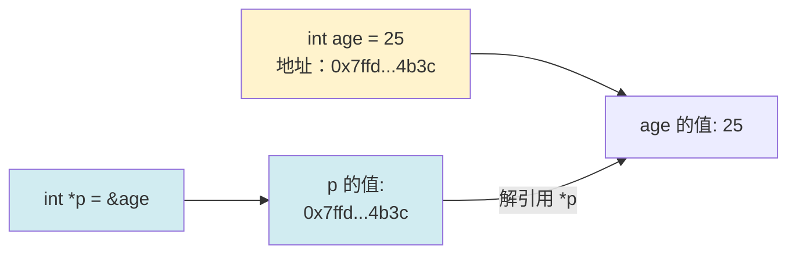
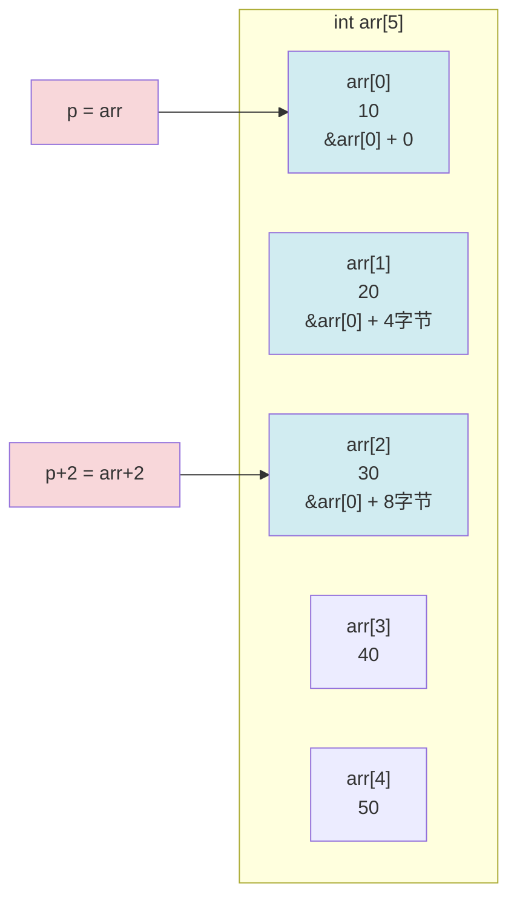

+++
title = "第 9 章：指针——C 语言的灵魂"
weight = 90
date = "2026-03-29T22:34:00+08:00"
type = "docs"
description = ""
isCJKLanguage = true
draft = false
+++

# 第 9 章：指针——C 语言的灵魂

> 如果说 C 语言是一把瑞士军刀，那指针就是军刀上最锋利的那片刀刃。学会了指针，你就能在 C语言的世界里上天入地；学不会指针，那你可能连门都摸不着。指针是 C 语言的精髓，也是让无数初学者魂牵梦萦、夜不能寐的"罪魁祸首"。但别怕！看完这一章，你会拍着大腿说："就这？"

我们先从一个生活中的比喻开始。

想象你有一栋超级大的仓库（这就是**内存**），里面有无数个小储物柜，每个储物柜都有一个独一无二的编号——0 号柜、1 号柜、2 号柜……一直排到不知道多少号。这些编号，就是**内存地址**。每个柜子里能放一样东西（一个变量的值）。

现在问题来了：柜子里的东西你会放，但你怎么快速找到你之前放的东西？你不可能记住每个柜子的编号吧？

于是，你想起了另一个小本子——**指针变量**。这个本子里不直接放东西，而是记着"哦，我的东西在 17 号柜"。通过这个本子，你能快速找到 17 号柜，然后拿出里面的东西。

**指针，就是那个记录"柜子编号"的小本子。指针变量，就是专门用来存放内存地址的变量。**

就这么简单！让我们正式开始吧。

---

## 9.1 指针基础：地址与内存的关系

计算机的内存（RAM）就像一条超级长的大街，街道上密密麻麻排列着无数个门牌号。每个**门牌号**就是一个**内存地址**（address），每个门牌号对应的**房子**就是一个**字节**（byte，8 个比特 bit）的存储空间。

当你声明一个变量时：

```c
int age = 25;
```

程序会在内存中"租"下几个连续的门牌号（`int` 通常占 4 个字节），然后把 `25` 这个数字"装"进这些房子里。计算机会牢牢记住 `age` 所在的第一个门牌号——这就是 `age` 的地址。

我们来写个程序，看看变量的地址长什么样：

```c
#include <stdio.h>

int main(void) {
    int age = 25;
    double salary = 12345.67;
    char grade = 'A';

    // %p 是专门用来打印地址的格式说明符
    // (void*) 是因为 %p 期望接收一个 void* 类型的指针
    printf("age 的值   = %d\n", age);
    printf("age 的地址 = %p\n", (void*)&age);

    printf("salary 的值   = %.2f\n", salary);
    printf("salary 的地址 = %p\n", (void*)&salary);

    printf("grade 的值   = %c\n", grade);
    printf("grade 的地址 = %p\n", (void*)&grade);

    return 0;
}
```

运行结果（地址每次运行可能不同）：

```
age 的值   = 25
age 的地址 = 0x7ffd5a3c4b44
salary 的值   = 12345.67
salary 的地址 = 0x7ffd5a3c4b38
grade 的值   = A
grade 的地址 = 0x7ffd5a3c4b34
```

> 看到了吗？每个变量都有自己专属的地址。而且你仔细观察会发现，`grade`、`salary`、`age` 的地址是**依次减小**的——这是因为程序在栈（stack）上分配局部变量，栈的生长方向是从高地址往低地址生长的。有趣吧？

用一张图来总结：

```mermaid
graph LR
    subgraph 内存地址空间
        A1["0x7ffd5a3c4b34<br>grade ('A')"]
        A2["0x7ffd5a3c4b38<br>salary (12345.67)"]
        A3["0x7ffd5a3c4b3c<br>age (25)"]
        A4["...")
    end
    style A1 fill:#e1f5ff
    style A2 fill:#e1f5ff
    style A3 fill:#e1f5ff
```

每个格子里存的是值，格子上面的编号就是地址。**指针变量**的作用，就是记录其中一个格子的地址编号。

---

## 9.2 指针变量的定义与初始化

### 如何定义一个指针变量

既然指针是一种变量，那就需要声明。声明指针的语法是这样的：

```c
int *p;      // p 是一个指向 int 类型变量的指针
char *pc;   // pc 是一个指向 char 类型变量的指针
double *pd; // pd 是一个指向 double 类型变量的指针
```

注意那个 `*`，它表示"这个变量是一个指针"。`int *p` 的意思是：**p 是一个指针，它指向一个 int 类型的变量**。

> 很多初学者会困惑：`int *p` 到底是说 `*p` 是 int 类型，还是 p 是 int 类型的指针？答案是后者——`p` 是一个"指向 int"的指针。写成 `int* p` 其实也可以（C 语言不关心空格），但写成 `int *p` 能更清晰地看出来 `*` 是修饰 `p` 的。

### ⚠️ 未初始化的指针是野指针！——这一点至关重要！

**重要的事情说三遍：**

**声明指针后一定要初始化！声明指针后一定要初始化！声明指针后一定要初始化！**

如果你这样做：

```c
int *p;  // 声明了一个指针 p，但此时 p 的值是未定义的（ garbage value）
printf("%p", p);  // 打印出一个随机地址，可能导致程序崩溃！
*p = 100;         // 危险！！！向一个未知地址写入数据！
```

`p` 此时是一个**野指针**（wild pointer / dangling pointer）——它指向一个随机的、我们不知道是哪里的内存地址。如果贸然往里面写东西，轻则程序崩溃，重则擦写掉了其他重要数据（想象你随机往一栋大楼的某个房间灌水泥，后果不堪设想）。

### 正确的初始化方式

**方式一：初始化为 NULL（空指针）**

```c
int *p = NULL;  // 明确表示"这个指针目前不指向任何有效地址"
```

**方式二：让它指向一个已存在的变量**

```c
int age = 25;
int *p = &age;  // & 是取地址运算符（下一节会详细讲）
                 // 现在 p 指向 age，p 的值就是 age 的地址
```

**方式三：动态分配内存（后面讲 malloc 时会深入）**

```c
int *p = (int *)malloc(sizeof(int));  // 在堆上分配一块内存
if (p != NULL) {
    *p = 42;  // 往分配到的内存里写入数据
}
```

> 养成好习惯：拿到一个指针，第一件事就是想清楚它该初始化成什么。如果暂时不知道指向谁，就先赋值为 `NULL`。之后每次使用指针前，都检查一下它是不是 `NULL`。这个习惯能帮你避开 90% 的指针bug。

---

## 9.3 取地址 `&` 与解引用 `*`

这是两个最基础也是最重要的运算符，`&` 和 `*` 在指针的场景下有着完全不同的含义。

### `&` —— 取地址运算符（Address-of Operator）

`&` 是一元运算符，放在变量前面，返回这个变量的内存地址。

```c
int age = 25;
int *p = &age;  // 把 age 的地址取出来，交给 p 保存
```

### `*` —— 解引用运算符（Dereference Operator）

`*` 也是一元运算符，但它的作用和 `&` 正好相反。`*` 放在指针前面，表示"顺着这个地址找到那个房间，然后拿出里面的东西"。

```c
int age = 25;
int *p = &age;       // p 指向 age

printf("%d\n", *p);  // 通过 p 找到它指向的变量，取出值：25

*p = 30;             // 通过 p 找到它指向的变量，把值改成 30
printf("%d\n", age); // age 的值现在是 30 了！
```

完整的例子：

```c
#include <stdio.h>

int main(void) {
    int age = 25;
    int *p = &age;

    printf("age 的值  = %d\n", age);   // 直接访问 age：25
    printf("age 的地址 = %p\n", (void*)&age);
    printf("p 的值（就是地址）= %p\n", (void*)p);
    printf("*p 的值（解引用）  = %d\n", *p); // 通过指针访问 age：25

    // 通过指针修改 age 的值
    *p = 30;

    printf("\n修改 *p = 30 之后：\n");
    printf("age 的值 = %d\n", age);    // 30
    printf("*p 的值 = %d\n", *p);       // 30

    return 0;
}
```

运行结果：

```
age 的值  = 25
age 的地址 = 0x7ffd5a3c4b3c
p 的值（就是地址）= 0x7ffd5a3c4b3c
*p 的值（解引用）  = 25

修改 *p = 30 之后：
age 的值 = 30
*p 的值 = 30
```

看到了吗？`*p = 30` 实际上是**通过指针间接修改了 age 的值**。这就好比你给朋友一把钥匙（指针），告诉他"去 17 号柜子，把里面的东西换成 30"——朋友去了 17 号柜，把东西换了。而 `age` 就住在 17 号柜，所以 `age` 的值也变了。



---

## 9.4 指针类型与 `void *` 万能指针

### 指针的类型

你可能会问：既然指针只是存地址，为什么还要分 `int *`、`char *`、`double *`？

好问题！**指针的类型决定了当你解引用时，计算机应该读取多少个字节。**

- `int *p`：解引用时读取 4 个字节（因为 `int` 占 4 字节）
- `char *pc`：解引用时读取 1 个字节（因为 `char` 占 1 字节）
- `double *pd`：解引用时读取 8 个字节（因为 `double` 占 8 字节）

看个例子：

```c
#include <stdio.h>

int main(void) {
    int a = 0x12345678;  // 十六进制表示的整数
    char *pc = (char *)&a;  // 把 int 的地址"强行"当作 char* 来用
    int *pi = &a;

    printf("a 的值（int解读）    = 0x%x\n", a);
    printf("*pi 解引用（4字节）  = 0x%x\n", *pi);
    printf("*pc 解引用（1字节）  = 0x%x\n", *pc);  // 只会读取第一个字节

    return 0;
}
```

运行结果：

```
a 的值（int解读）    = 0x12345678
*pi 解引用（4字节）  = 0x12345678
*pc 解引用（1字节）  = 0x78
```

> 小知识：由于不同类型的数据在内存中的存储方式（字节序）可能不同，在 x86 小端序（little-endian）的机器上，低位字节存放在低地址，所以 `*pc` 只读到了 `0x78`。这就是为什么指针需要类型——计算机需要知道"从地址开始，往后数多少个字节才算读完一个完整的值"。

### `void *` —— 万能指针

`void *` 是一种特殊的指针类型，中文叫"通用指针"或"空类型指针"。它不指向任何具体的类型，所以解引用前必须先强制类型转换。

为什么需要它？因为有些函数的参数或返回值需要"接受任意类型的指针"，比如内存拷贝函数 `memcpy`：

```c
void *memcpy(void *dest, const void *src, size_t count);
```

`void *` 就是为了让你可以传入 `int *`、`char *`、`double *` 各种指针而不用写无数个重载（C 语言没有重载，但 C++ 有——但即使 C++ 里也用 `void *` 作为通用接口）。

```c
#include <stdio.h>
#include <string.h>  // memcpy 在这里

int main(void) {
    int source = 42;
    int dest;

    // memcpy 的参数是 void*，所以 int* 可以直接传
    memcpy(&dest, &source, sizeof(int));

    printf("dest 的值 = %d\n", dest);  // 42

    return 0;
}
```

> 简单记忆：`void *` 就像一个"没有标签的快递盒"，你可以往里面放任何东西，但拿出来用的时候必须先知道里面是什么、怎么用。

---

## 9.5 空指针：`NULL` 宏 vs `nullptr`（C23 推荐）

**空指针**（null pointer）表示"这个指针目前不指向任何有效的内存地址"。

### `NULL` 宏

在 C 语言中，`NULL` 是一个常见的宏，定义在 `<stddef.h>`、`<stdio.h>`、`<stdlib.h>` 等头文件中。它的值通常就是 `0`（或者 `(void*)0`）：

```c
#define NULL ((void*)0)  // 常见的定义方式
```

```c
int *p = NULL;  // p 指向"空"，不指向任何有效地址

if (p == NULL) {
    printf("p 是空指针\n");
}
```

### `nullptr` —— C23 的新宠儿

C23 引入了一个新的关键字 `nullptr`，它是一个**类型安全的空指针字面量**（null pointer literal）。

为什么要搞一个新东西？因为 `NULL` 有个问题——在 C 语言里 `NULL` 就是 `0`，而 `0` 既是整数 0，也是空指针。这会导致一些奇怪的歧义：

```c
void foo(int x);
void foo(char *p);

foo(NULL);  // 到底是调用哪个？有些编译器会懵！
```

用 `nullptr` 就能彻底解决：

```c
int *p = nullptr;  // C23 推荐写法
```

> 如果你用的是 C23 标准的编译器（gcc 14+、clang 17+），请毫不犹豫地使用 `nullptr`。它不仅更安全，而且更符合现代 C++ 的风格。如果你还在用 C11/C17，`NULL` 依然是你的好朋友，记得每次用之前判断非空即可。

---

## 9.6 指针运算：加减整数、指针相减

指针不只能存地址、读地址，它还能做一些**有限的算术运算**。但要注意：**指针运算不是普通的整数运算！**

### 指针加上 / 减去整数

当我们对指针做加法时，实际上加的是"多少个元素"而不是"多少个字节"。

```c
int arr[5] = {10, 20, 30, 40, 50};
int *p = arr;      // arr == &arr[0]，指向第一个元素

printf("%d\n", *p);      // 10，指向 arr[0]
printf("%d\n", *(p+1));  // 20，指向 arr[1]
printf("%d\n", *(p+2));  // 30，指向 arr[2]
```

> 注意：`p+1` 不是简单地把地址加 1，而是加 `1 * sizeof(int)` 个字节。对于 4 字节的 `int`，`p+1` 实际上在地址上增加了 4 个字节。

图示：



### 指针减去整数

同理，指针减去整数就是往回跳：

```c
int arr[5] = {10, 20, 30, 40, 50};
int *p = &arr[4];  // 指向最后一个元素

printf("%d\n", *p);      // 50
printf("%d\n", *(p-1));  // 40，往回跳一个元素
printf("%d\n", *(p-2));  // 30
```

### 两个指针相减

**同一个数组中的两个指针可以相减**，结果是一个 `ptrdiff_t` 类型的整数，表示两个指针之间隔着多少个元素：

```c
int arr[10] = {0, 1, 2, 3, 4, 5, 6, 7, 8, 9};
int *p1 = &arr[2];
int *p2 = &arr[7];

ptrdiff_t diff = p2 - p1;
printf("%td\n", diff);  // 5，p2 和 p1 之间隔着 5 个元素
```

### ⚠️ 指针运算的禁区

**指针运算只能在同一个数组的范围内进行！** 超出数组边界的行为是**未定义行为**（undefined behavior），程序可能崩溃、可能读出垃圾数据、也可能"看起来正常"但悄悄出错——这才是最可怕的。

```c
int arr[3] = {1, 2, 3};
int *p = arr;

p = p + 10;  // 越界了！未定义行为！
printf("%d\n", *p);  // 天知道会输出什么
```

> 想象你在一排储物柜中取东西，如果你走到了走廊尽头还在伸手，那就是未定义行为——可能你够到了隔壁走廊的东西（读到了其他变量的数据），可能你摸到了墙壁（段错误），也可能什么都没发生但保安把你带走了（程序被操作系统终止）。

---

## 9.7 指针与数组：`arr[i] == *(arr + i)`

这是 C 语言中最优雅的等式之一，也是让指针和数组几乎可以互换使用的理论基础。

### 数组名就是指针？

在大多数情况下，**数组名会被隐式转换成指向其首元素的指针**。也就是说：

```c
int arr[5] = {10, 20, 30, 40, 50};

printf("%d\n", arr[0]);   // 数组下标方式：10
printf("%d\n", *(arr+0)); // 指针运算方式：10
printf("%d\n", arr[2]);   // 数组下标方式：30
printf("%d\n", *(arr+2)); // 指针运算方式：30
```

`arr[i]` 和 `*(arr + i)` 是**完全等价的**。编译器在底层会把 `arr[i]` 转换成 `*(arr + i)`。

### 下标运算和指针运算的对比

```c
#include <stdio.h>

int main(void) {
    int arr[5] = {10, 20, 30, 40, 50};
    int *p = arr;  // p 指向 arr[0]

    printf("arr[0]=%d  *(arr+0)=%d  *p=%d\n", arr[0], *(arr+0), *p);
    printf("arr[1]=%d  *(arr+1)=%d  *(p+1)=%d\n", arr[1], *(arr+1), *(p+1));
    printf("arr[2]=%d  *(arr+2)=%d  *(p+2)=%d\n", arr[2], *(arr+2), *(p+2));

    // p[i] 和 arr[i] 也是等价的——反过来指针也能用下标！
    printf("p[3]=%d  arr[3]=%d\n", p[3], arr[3]);

    return 0;
}
```

运行结果：

```
arr[0]=10  *(arr+0)=10  *p=10
arr[1]=20  *(arr+1)=20  *(p+1)=20
arr[2]=30  *(arr+2)=30  *(p+2)=30
p[3]=40  arr[3]=40
```

> 这就是 C 语言的哲学：**数组就是指针，指针就是数组的另一种表达方式**。当然，它们之间也有一些细微差别（比如 `sizeof(arr)` 和 `sizeof(p)` 结果不同，数组名不能赋值而指针可以自增自减），但理解了这个等价关系，你就打通了 C 语言的"任督二脉"。

### 指针遍历数组的两种方式

```c
#include <stdio.h>

int main(void) {
    int arr[5] = {10, 20, 30, 40, 50};
    int *p;
    int i;

    // 方式一：下标法（更直观）
    printf("下标法：");
    for (i = 0; i < 5; i++) {
        printf("%d ", arr[i]);
    }
    printf("\n");

    // 方式二：指针法（更"原始"，也更高效）
    printf("指针法：");
    for (p = arr; p < arr + 5; p++) {
        printf("%d ", *p);
    }
    printf("\n");

    return 0;
}
```

运行结果：

```
下标法：10 20 30 40 50
指针法：10 20 30 40 50
```

---

## 9.8 指针数组 vs 数组指针：`int *arr[5]` vs `int (*arr)[5]`

这是 C 语言里最容易混淆的两个语法之一。让我用最清晰的方式解释清楚。

### 指针数组：`int *arr[5]`

根据**运算符优先级**，`[]` 的优先级高于 `*`。所以 `int *arr[5]` 等价于 `int *(arr[5])`——一个**数组**，里面装着 **5 个 `int *` 类型的指针**。

```c
int a = 10, b = 20, c = 30, d = 40, e = 50;
int *arr[5] = {&a, &b, &c, &d, &e};  // 5 个指针组成的数组

printf("%d\n", *arr[0]);  // 10
printf("%d\n", *arr[1]);  // 20
```

形象地看：

```mermaid
graph LR
    subgraph "int *arr[5] —— 指针数组"
        A["arr[0]<br>&a"]
        B["arr[1]<br>&b"]
        C["arr[2]<br>&c"]
        D["arr[3]<br>&d"]
        E["arr[4]<br>&e"]
    end
    subgraph "int 变量"
        a["a = 10"]
        b["b = 20"]
        c["c = 30"]
        d["d = 40"]
        e["e = 50"]
    end
    A -->|指向| a
    B -->|指向| b
    C -->|指向| c
    D -->|指向| d
    E -->|指向| e
    style arr[0] fill:#d1ecf1
    style arr[1] fill:#d1ecf1
    style arr[2] fill:#d1ecf1
    style arr[3] fill:#d1ecf1
    style arr[4] fill:#d1ecf1
```

### 数组指针：`int (*arr)[5]`

加了括号，`*` 先和 `arr` 结合，所以 `arr` 是一个**指针**，它指向一个**包含 5 个 int 元素的数组**。

```c
int arr[5] = {10, 20, 30, 40, 50};
int (*p)[5] = &arr;  // p 是指向"包含5个int的数组"的指针

printf("%d\n", (*p)[0]);  // 10，先解引用得到数组，再下标
printf("%d\n", (*p)[2]);  // 30
```

### 记忆技巧

- `int *arr[5]` — `arr` **先**是个数组（`arr[5]`），里面的元素是指针（`int*`）
- `int (*arr)[5]` — `arr` **先**是个指针（`*arr`），指向的类型是数组（`int[5]`）

> 生活比喻：想象你有5把钥匙（指针）。`int *arr[5]` 是一个钥匙扣，挂着5把钥匙（钥匙的数组）。`int (*arr)[5]` 是一张地图（指针），地图上标注了一栋有5个房间的建筑（指向数组的指针）。

---

## 9.9 函数指针——指向函数的指针

终于到了指针家族中最"高深"的一员——**函数指针**。别担心，我会把它拆解得明明白白。

### 什么是函数指针？

在 C 语言中，函数也是一种数据，也有自己的地址。函数的地址就是函数体代码在内存中的起始位置。**函数指针**就是指向这个起始位置的指针。

### 9.9.1 函数指针的声明语法：`void (*pf)(int)`

这是函数指针最经典也最让人头秃的声明：`void (*pf)(int)`。

我们来一点点拆解：

```c
void (*pf)(int);
```

- 最外层的 `void (*pf)`：pf 是一个指针
- `(int)`：pf 指向一个接受一个 int 参数的函数
- `void`：pf 指向的函数返回类型是 void

所以 `pf` 是一个"指向返回 void、接受一个 int 参数的函数"的指针。

再看几个例子来熟悉语法：

```c
int (*pfn1)(int, int);           // 指向 int(int, int) 类型的函数
double (*pfn2)(double);         // 指向 double(double) 类型的函数
void (*pfn3)(char *, int);      // 指向 void(char*, int) 类型的函数
```

> 小技巧：看到一个函数指针声明，从里往外读：先找函数名（被 * 包围），然后看参数类型，最后看返回类型。

### 9.9.2 回调函数：`qsort` 中的比较函数

函数指针最经典的应用场景就是**回调函数**（callback function）——把一个函数作为参数传给别人调用。

C 语言的 `qsort` 函数就是一个完美的例子：

```c
void qsort(void *base, size_t nmemb, size_t size,
           int (*compare)(const void *, const void *));
```

`qsort` 接受一个函数指针 `compare`，在排序过程中每当需要比较两个元素时，就会调用这个 `compare` 函数。这让你可以用自定义的方式排序任意类型的数据。

```c
#include <stdio.h>
#include <stdlib.h>

// 比较两个整数（升序）
int compare_int(const void *a, const void *b) {
    // 由于是 void*，需要先转换成 int*，再解引用
    int ia = *(int *)a;
    int ib = *(int *)b;
    return ia - ib;  // 返回负数表示 a<b，正数表示 a>b，0表示相等
}

// 比较两个 double（按绝对值升序）
int compare_double_abs(const void *a, const void *b) {
    double da = *(double *)a;
    double db = *(double *)b;
    if (da < 0) da = -da;
    if (db < 0) db = -db;
    return (da > db) - (da < db);  // 防止溢出，比 da - db 更安全
}

int main(void) {
    int int_arr[] = {5, 2, 8, 1, 9, 3, 7, 4, 6};
    size_t n_int = sizeof(int_arr) / sizeof(int_arr[0]);

    qsort(int_arr, n_int, sizeof(int), compare_int);

    printf("整数升序：");
    for (size_t i = 0; i < n_int; i++) {
        printf("%d ", int_arr[i]);
    }
    printf("\n");

    double dbl_arr[] = {-3.5, 2.1, -8.8, 1.0, -0.5};
    size_t n_dbl = sizeof(dbl_arr) / sizeof(dbl_arr[0]);

    qsort(dbl_arr, n_dbl, sizeof(double), compare_double_abs);

    printf("按绝对值升序：");
    for (size_t i = 0; i < n_dbl; i++) {
        printf("%.1f ", dbl_arr[i]);
    }
    printf("\n");

    return 0;
}
```

运行结果：

```
整数升序：1 2 3 4 5 6 7 8 9
按绝对值升序：-0.5 1.0 2.1 -3.5 -8.8
```

> 回调函数的好处：排序算法本身不需要知道你在比较什么类型的数据，你只需要提供"比较规则"，`qsort` 会自动调用它。这就是"策略模式"的 C 语言实现。

### 9.9.3 转移表（Jump Table）替代 `switch`

函数指针的另一个经典应用是用**转移表**（jump table）替代一长串的 `if-else` 或 `switch` 语句，特别是在处理离散整数输入时特别有用。

假设你在写一个计算器，每次根据用户输入的操作符执行对应的运算：

```c
#include <stdio.h>
#include <stdlib.h>

// 四个运算函数
double add(double a, double b) { return a + b; }
double sub(double a, double b) { return a - b; }
double mul(double a, double b) { return a * b; }
double divd(double a, double b) {
    if (b == 0) { printf("除数不能为零！\n"); return 0; }
    return a / b;
}

int main(void) {
    // 函数指针数组（转移表）
    // '+' 的 ASCII 码是 43，'-' 是 45，'*' 是 42，'/' 是 47
    double (*operations[256])(double, double) = { NULL };  // 全初始化为 NULL

    // 只注册我们需要的操作符
    operations['+'] = add;
    operations['-'] = sub;
    operations['*'] = mul;
    operations['/'] = divd;

    double a = 10.0, b = 3.0;
    char op = '/';

    if (op >= 0 && op < 256 && operations[(unsigned char)op] != NULL) {
        printf("%.2f %c %.2f = %.2f\n", a, op, b, operations[op](a, b));
    } else {
        printf("不支持的操作符：%c\n", op);
    }

    return 0;
}
```

运行结果：

```
10.00 / 3.00 = 3.33
```

> 转移表的好处：如果用 `switch`，每个 case 都要写函数调用代码；而用转移表，直接通过字符的 ASCII 码作为索引找到对应的函数，一行就搞定了。更重要的是，如果以后要扩展新操作符，只需要添加一个函数并在表里注册一下，不需要改任何调用逻辑。

### 9.9.4 指向函数的指针作为返回值

函数指针不仅可以作为参数，还可以作为**返回值**！这在需要"动态选择函数"的场景下非常有用。

```c
#include <stdio.h>

int add_int(int a, int b) { return a + b; }
int sub_int(int a, int b) { return a - b; }

// 返回类型是 int (*)(int, int) —— 一个函数指针
int (*get_operation(char op))(int, int) {
    if (op == '+') return add_int;
    if (op == '-') return sub_int;
    return NULL;
}

int main(void) {
    int (*op)(int, int) = get_operation('+');
    if (op) {
        printf("3 + 5 = %d\n", op(3, 5));  // 8
    }

    op = get_operation('-');
    if (op) {
        printf("10 - 4 = %d\n", op(10, 4));  // 6
    }

    return 0;
}
```

运行结果：

```
3 + 5 = 8
10 - 4 = 6
```

> C23 还引入了 `typeof` 关键字，可以让这种复杂声明变得可读很多：

```c
// C23 新写法，清晰多了
typeof(&add_int) get_operation_modern(char op) {
    return (op == '+') ? &add_int : &sub_int;
}
```

---

## 9.10 指针的指针：`int **pp`

什么？还有"指针的指针"？是的，C 语言支持指针的嵌套——**指向指针的指针**。

### 什么时候需要二级指针？

最常见的场景：**在函数内部修改外部指针的值**（传入指针的地址）。

比如，你想在函数中动态分配一块内存，并让外部的指针指向这块内存：

```c
#include <stdio.h>
#include <stdlib.h>

// 如果直接传 int *p，能修改 p 本身吗？不能！
// 因为函数参数是按值传递的，p 的副本被修改，外部的 p 不受影响
//
// 所以需要传 int *p 的地址，即 int **pp
void allocate_array(int **pp, size_t n) {
    *pp = (int *)malloc(n * sizeof(int));
    if (*pp == NULL) {
        printf("内存分配失败！\n");
        return;
    }
    // 通过 *pp 写入分配的内存
    for (size_t i = 0; i < n; i++) {
        (*pp)[i] = (int)(i * 10);
    }
}

int main(void) {
    int *arr = NULL;  // 初始化为 NULL

    allocate_array(&arr, 5);  // 传 arr 的地址

    if (arr != NULL) {
        printf("数组内容：");
        for (size_t i = 0; i < 5; i++) {
            printf("%d ", arr[i]);
        }
        printf("\n");
        free(arr);  // 用完记得释放
    }

    return 0;
}
```

运行结果：

```
数组内容：0 10 20 30 40
```

图解这个过程：

```mermaid
graph LR
    subgraph "main 函数"
        A["int *arr<br>值：NULL → 分配后<br>为堆内存地址"]
    end
    subgraph "allocate_array 函数"
        B["int **pp<br>值：&arr"]
    end
    B -->|解引用 *pp| A
    subgraph "堆内存"
        C["malloc 分配的内存<br>0 10 20 30 40"]
    end
    A -->|allocate_array 中<br>*pp = malloc(...) 后| C
    style B fill:#f8d7da
    style A fill:#d1ecf1
```

> 简单记忆：**如果想在函数里改一个指针的值（让它指向别的地方），就必须传它的地址（指针的指针）**。这和"在函数里改一个 int 的值，就必须传 int 的地址（指针的指针）"是一个道理。

---

## 9.11 指针与 `const` 的四种组合

`const` 和指针结合时，有四种不同的组合，每种组合限制的能力各不相同。让我一个个讲清楚。

### 9.11.1 `int *p` —— 可修改指针和对象

这是最普通的指针，两边都可以改：

```c
int a = 10, b = 20;
int *p = &a;
*p = 15;   // ✅ 通过 p 修改 a 的值：a 变成 15
p = &b;    // ✅ p 指向别的变量
```

### 9.11.2 `const int *p` —— 不能通过此指针修改对象

`const` 修饰的是 `*p`，即"解引用后得到的东西不可修改"：

```c
int a = 10, b = 20;
const int *p = &a;
// *p = 15;   // ❌ 编译错误！不能通过 p 修改 a
p = &b;       // ✅ p 可以指向别的变量
```

> 这种指针通常用于**函数参数**，表示"我只需要读取这个数据，不需要修改它"。这是一种很好的文档化手段，告诉调用者"放心传给我，你的数据我不会改"。

### 9.11.3 `int * const p` —— 指针本身不可变

`const` 修饰的是 `p`，即"指针的指向不可修改"：

```c
int a = 10, b = 20;
int * const p = &a;
*p = 15;    // ✅ 可以通过 p 修改 a
// p = &b;   // ❌ 编译错误！p 不能再指向别处了
```

> 这种指针比较少见，通常用于**数组参数**的场景，表示"指针走到哪里由我控制，你不能让它指向别处"。

### 9.11.4 `const int * const p` —— 指针和对象都不能变

两边都加了 `const`，最严格的限制：

```c
int a = 10, b = 20;
const int * const p = &a;
// *p = 15;  // ❌ 编译错误
// p = &b;   // ❌ 编译错误
```

### 四种组合总结

| 声明 | `*p` 可修改？ | `p` 可修改？ | 示例 |
|------|-------------|-------------|------|
| `int *p` | ✅ | ✅ | 最普通的指针 |
| `const int *p` / `int const *p` | ❌ | ✅ | 只读指针 |
| `int * const p` | ✅ | ❌ | 固定指向的指针 |
| `const int * const p` | ❌ | ❌ | 完全固定 |

> 记忆技巧：看 `const` 离谁近谁就不能变。`const int *p`——`const` 离 `int` 近，所以 `int` 不能通过 `p` 改；`int * const p`——`const` 离 `p` 近，所以 `p` 本身不能变。

---

## 9.12 `restrict` 指针（C99）

`restrict` 是 C99 引入的一个关键字，只能用于指针声明。它是给**编译器**看的优化提示。

```c
int * restrict p;  // p 是一个 restrict 指针
```

`restrict` 的含义是：**这个指针是访问某个特定对象（或数组）的唯一方式**。换句话说，在 `restrict` 指针的生命周期内，不存在其他指针也指向同一个对象。

为什么重要？因为它告诉编译器："这块内存只有我这一个门进，你尽管优化，不用担心别人也在改。"

```c
#include <stdio.h>

// C 库函数 memcpy 就用了 restrict
// 它保证：dest 和 src 指向的内存区域不重叠
void *my_memcpy(void *dest, const void *src, size_t n) {
    char *d = (char *)dest;
    const char *s = (const char *)src;
    for (size_t i = 0; i < n; i++) {
        d[i] = s[i];
    }
    return dest;
}
```

> 实际编程中，`restrict` 主要是库函数作者和性能敏感代码的作者需要关心的。如果你是在写普通应用代码，了解这个概念即可，大多数情况下编译器会自己推断出来（尤其是在 C11 之后）。

---

## 9.13 `volatile` 指针

`volatile`（易变的）是另一个修饰指针的关键字，它的含义和 `const` 完全不同。

`volatile` 告诉编译器："这个内存位置的值可能会在程序不知情的情况下被改变"——比如：
- 由硬件寄存器修改（内存映射 I/O）
- 被另一个线程修改（多线程）
- 被中断服务程序修改

编译器看到 `volatile` 后，就不敢对这个内存位置的访问做任何"聪明"的优化——比如把多次读合并成一次，或者把值缓存在寄存器里。

```c
volatile int *p;  // p 指向一个 volatile int
```

```c
// 读取硬件状态寄存器的例子
#define STATUS_REG ((volatile uint32_t *)0x40021000)

uint32_t status = *STATUS_REG;  // 每次都真的去读硬件寄存器
status = *STATUS_REG;           // 编译器不能省略这一步（硬件值可能已变）
```

> 对于普通应用开发，`volatile` 用得不多。但如果你写嵌入式系统、驱动代码，或者涉及硬件寄存器，它就是必不可少的。

---

## 9.14 `[[no_unique_address]]`（C23）：零大小结构体成员

C23 引入了一个新的属性 `[[no_unique_address]]`，它可以用在结构体成员声明上，表示"如果这个成员的类型是空类型（没有非静态数据成员），就让它不占用任何空间"。

```c
// C23
#include <stdio.h>

struct Empty {
    // 空结构体，C 语言中不合法（零大小），但 C++ 中可以
};

// 但如果空结构体在 C 中作为数组成员就不合法了
// 所以这个属性主要是在 C++ 中才有实际意义
// C 语言中，我们可以"曲线救国"

int main(void) {
    printf("[[no_unique_address]] 是 C23 的属性\n");
    printf("主要用途是在结构体中嵌入一个可能不占空间的成员\n");
    return 0;
}
```

> 坦白说，这个属性在纯 C 语言中的实际用途比较有限，因为 C 语言不允许零长度的数组成员（这和 C++ 不同）。它更多是为了和 C++ 保持兼容性而引入的。如果你对第 11 章的"结构体与联合"有更深入的了解，会更好地理解这个属性的价值。

---

## 9.15 常见错误：野指针、空指针解引用、指针运算越界

指针是 C 语言中最强大也最危险的功能。用得好，效率飞升；用不好，程序崩溃没商量。让我们来看看三个最常见的指针错误。

### ⚠️ 错误一：野指针（未初始化指针）

```c
int *p;     // 未初始化，p 的值是随机的
*p = 100;   // 向随机地址写入数据！！！
```

后果：程序可能崩溃（如果随机地址不可写），或者悄悄破坏了其他数据（如果随机地址恰好可写但不是你想写的地方）。

**解决方法**：声明指针时立即初始化为 `NULL`，或者让它指向一个有效变量。

### ⚠️ 错误二：空指针解引用

```c
int *p = NULL;
// ... 某段代码没有检查 p 就直接用了 ...
*p = 42;  // 解引用 NULL 指针，程序崩溃！
```

空指针的地址是 `0`（或 `NULL`），访问地址 `0` 是非法操作，操作系统会立即杀掉你的程序（通常是"段错误 / segmentation fault"）。

**解决方法**：每次使用指针前，检查它是否为 `NULL`（或 `nullptr`）。

```c
int *p = NULL;
p = find_something();  // 可能返回 NULL
if (p != NULL) {       // 先检查再使用！
    printf("%d\n", *p);
}
```

### ⚠️ 错误三：指针运算越界

```c
int arr[3] = {1, 2, 3};
int *p = arr;

p = p + 10;    // 越出数组边界！未定义行为！
printf("%d\n", *p);  // 不知道会输出什么
```

或者在循环中走过头：

```c
int arr[5] = {10, 20, 30, 40, 50};
int *p = arr;
int i;
for (i = 0; i <= 5; i++) {  // 应该是 i < 5，<= 导致最后一次越界！
    printf("%d ", *(p + i));
}
```

**解决方法**：使用 `p < arr + n` 这种形式来限定边界，让循环条件更直观。

---

## 本章小结

本章我们深入探讨了 C 语言中最核心的概念——**指针**。以下是本章的关键知识点：

1. **指针的本质**：指针变量存储的是另一个变量的内存地址，通过地址可以间接访问和修改变量的值。

2. **取地址 `&` 和解引用 `*`**：`&` 取得变量的地址，`*` 通过地址取得变量。两者互为逆运算。

3. **指针类型**：`int *`、`char *`、`double *` 等类型决定了指针解引用时读取的字节数。`void *` 是通用指针，不关联具体类型。

4. **空指针**：`NULL`（宏）和 `nullptr`（C23 推荐）表示"不指向任何有效地址"，使用前必须检查。

5. **指针运算**：只能对同一数组中的指针做加减整数或相减运算。指针加 1 跳过一个完整元素（而非一个字节）。

6. **指针与数组的关系**：`arr[i] == *(arr + i)`，数组名在表达式中退化为指向首元素的指针。

7. **指针数组 vs 数组指针**：`int *arr[5]` 是包含 5 个指针的数组；`int (*arr)[5]` 是指向包含 5 个 int 的数组的指针。

8. **函数指针**：函数也有地址，函数指针允许将函数作为数据传递。典型应用包括 `qsort` 的回调函数和转移表。

9. **指针的指针**：`int **pp` 用于在函数内部修改外部指针的值。

10. **指针与 `const`**：`const` 可以修饰指针指向的对象（不可通过指针修改）或指针本身（指向不可变），共有四种组合。

11. **`restrict`（C99）**：提示编译器该指针是访问对象的唯一途径，启用更多优化。

12. **`volatile`**：提示编译器该内存位置可能被意外修改，禁止优化访问。

13. **`[[no_unique_address]]`（C23）**：C23 属性，允许空类型结构体成员不占用空间。

14. **常见错误**：野指针（未初始化）、空指针解引用、指针运算越界是三大杀手。养成初始化和检查的好习惯是避免指针bug的根本。

> 指针是 C 语言的灵魂，也是 C 语言区分于其他语言的核心竞争力。掌握指针，你就掌握了直接操控计算机内存的能力，这种能力既是 C 语言的魅力所在，也是 C 程序员的必备技能。多练、多思考、多画图，祝你在指针的世界里玩得开心！
