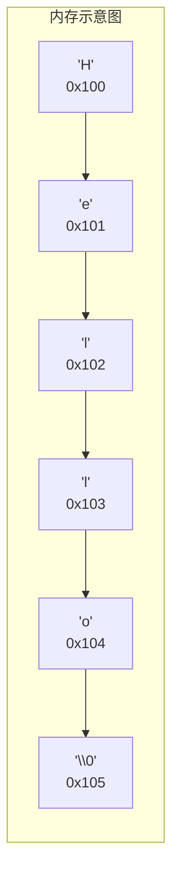
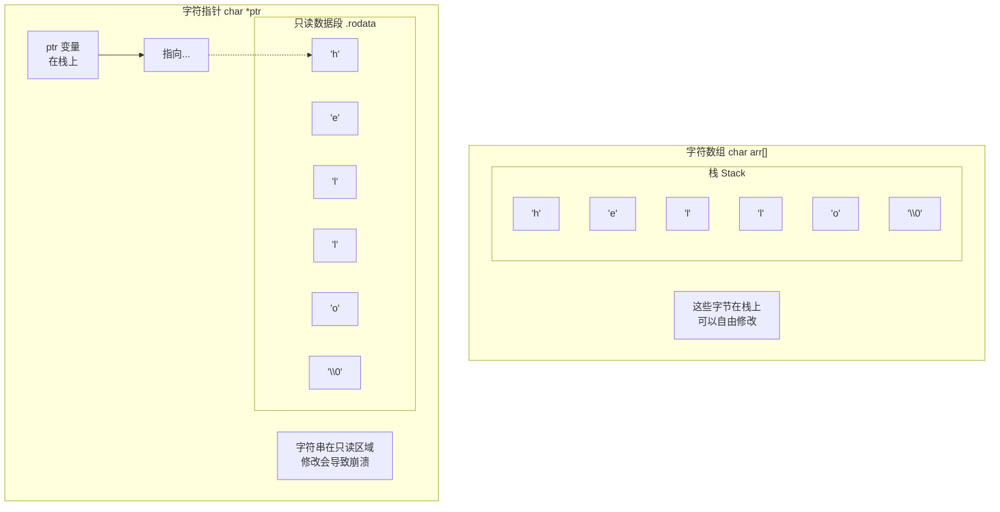
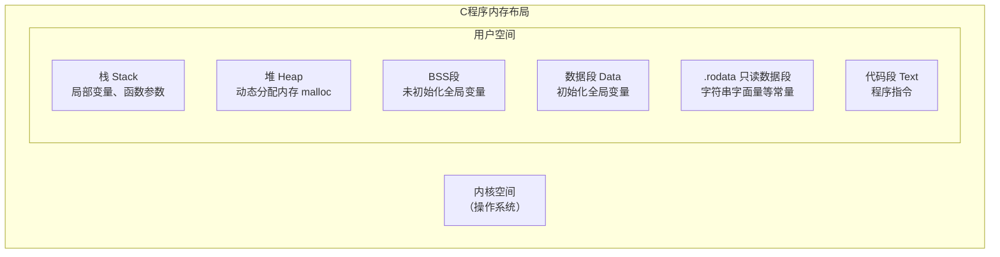
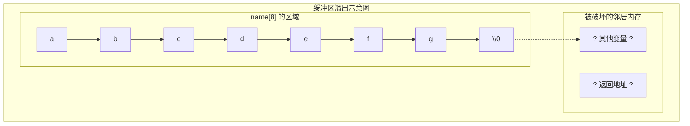
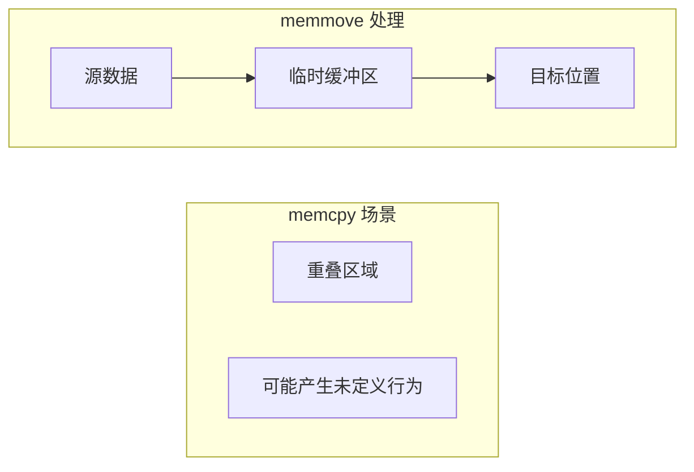
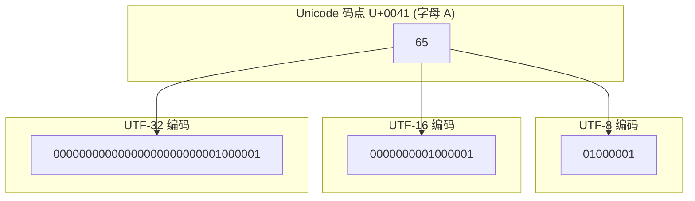

+++
title = "第 10 章：字符串处理 —— C 语言的文字魔法"
weight = 100
date = "2026-03-29T22:34:00+08:00"
type = "docs"
description = ""
isCJKLanguage = true
draft = false
+++

# 第 10 章：字符串处理 —— C 语言的文字魔法

> 本章你会学到什么？
>
> - 字符串的"真面目"——它其实是个披着羊皮的数组
> - 为什么你的字符串一会儿能改，一会儿不能改
> - 一堆让你又爱又恨的字符串函数，有的安全，有的危险
> - 字符串和数字之间的"翻译"技巧
> - 宽字符和 Unicode：让你的程序说"世界语"

---

想象一下，如果你是一个厨师，字符串就是你的菜谱。菜谱上写满了各种"指令"（字符），而你（CPU）需要按照顺序一个一个"执行"它们。但是问题来了——CPU 怎么知道菜谱在哪里结束？总不能让它一直读下去读到别人的菜谱去吧？

这就是 C 语言设计字符串的高明之处：**用一个特殊的"结束标记"来告诉程序"到此为止"**。这个标记叫做**空字符**（null character），写作 `'\0'`。

准备好了吗？让我们一起揭开字符串的神秘面纱！

---

## 10.1 字符串的本质：`char` 数组 + `'\0'`

在 C 语言的世界里，字符串并不是什么高级货色，它其实就是一串 **char 类型的数组**，外加一个"终止符" `'\0'`。

### 从生活理解字符串

把字符串想象成是一列火车：

```
字符:     'H'    'e'    'l'    'l'    'o'    '\0'
索引:      0      1      2      3      4      5
内存:   [ 48 ]  [ 65 ]  [ 6C ]  [ 6C ]  [ 6F ]  [ 00 ]
```

火车的每节车厢就是一个 `char`，装着一个字符。最后一节车厢是一个特殊的"终止车厢"（`'\0'`，ASCII 码是 0），它大声喊："到此为止！别再往前开了！"

### 定义字符串的两种方式

```c
#include <stdio.h>

int main() {
    // 方式一：字符数组，像是用砖头砌墙
    char str1[] = {'H', 'e', 'l', 'l', 'o', '\0'};
    printf("str1 = %s\n", str1);  // 输出: str1 = Hello

    // 方式二：字符串字面量，简单快捷（最常用！）
    char str2[] = "Hello";
    printf("str2 = %s\n", str2);  // 输出: str2 = Hello

    // 方式三：指针指向字符串常量（后面会详细讲）
    char *str3 = "Hello";
    printf("str3 = %s\n", str3);  // 输出: str3 = Hello

    return 0;
}
```

### ⚠️ 重要警告：长度与数组大小的区别

```c
#include <stdio.h>
#include <string.h>

int main() {
    char s[] = "Hello";  // 数组大小是 6，不是 5！
                        // 'H', 'e', 'l', 'l', 'o', '\0'

    printf("数组大小: %zu\n", sizeof(s));    // 输出: 数组大小: 6
    printf("字符串长度: %zu\n", strlen(s));  // 输出: 字符串长度: 5

    // 长度是不包含 '\0' 的！
    // sizeof 是包含 '\0' 的！

    return 0;
}
```

> 很多初学者在这里翻车：`strlen()` 告诉你字符串"有 5 个字符"，但 `sizeof()` 说"我给你留了 6 个位置"。记住：`strlen()` 是"居民数量"，`sizeof()` 是"房子数量"（包含物业——`\0`）。

### 内存中的字符串长这样



你看，`'\0'` 就站在最后，像一个尽职的门卫，告诉你"这条街到头了，别再往前走了"。

### 为什么 C 语言要用 `\0`？

这是 C 语言的"历史包袱"之一，也是它的设计哲学：**简单高效**。只需要一个额外的字节，就能让任何字符串函数通过线性扫描找到结尾，不需要额外存储长度信息。

对比一下其他语言：
- Python/Java 的字符串自带长度信息，所以 `len()` 是 O(1)
- C 语言的 `strlen()` 是 O(n)，从头数到尾

> 有人吐槽 C 语言字符串是"穿着睡衣的数组"，这话说得真贴切——它不告诉你衣服有多大，你得自己数！

---

## 10.2 字符数组 vs 字符指针

这是 C 语言中最容易让人迷惑的话题之一，也是面试官的最爱。让我用生活中的例子来解释清楚。

### 生活类比：买房 vs 租房

想象一下你要住在一个地方：

- **字符数组**（`char s[] = "hello"`）：相当于你**买了这套房**，房产证上是你的名字。你可以随便装修、砸墙、重新隔间。
- **字符指针**（`char *s = "hello"`）：相当于你**租了这套房**，房产证上是别人的名字。你可以住进去，但不能随便动结构。

### 代码验证

```c
#include <stdio.h>

int main() {
    // 字符数组 - 在栈上分配，可以修改
    char arr[] = "hello";
    arr[0] = 'H';  // ✅ 没问题！你是房主
    printf("%s\n", arr);  // 输出: Hello

    // 字符指针 - 指向常量区，不能修改
    char *ptr = "hello";
    // ptr[0] = 'H';  // ❌ 危险！可能导致崩溃

    printf("%s\n", ptr);  // 输出: hello

    return 0;
}
```

> 第二个 `ptr[0] = 'H'` 为什么会出问题？因为 `"hello"` 作为一个**字符串字面量**，被存储在程序的**只读数据段**（常量区）。你试图修改它，就像在租来的房子里偷偷砸墙——房东（操作系统）会找上门！

### 图解两者的区别



### 什么时候用哪个？

```c
// 用字符数组的场景：需要修改字符串内容
void modify_string(char s[]) {
    s[0] = toupper(s[0]);  // 修改第一个字符为大写
}

// 用字符指针的场景：只是读取，不修改
void print_string(const char *s) {
    printf("%s\n", s);  // 只读操作
}

// 更安全的方式：const 指针
void safe_print(const char *s) {
    // 编译器会阻止你试图修改 s 的行为
    printf("内容是: %s\n", s);
}
```

### 一个经典陷阱

```c
#include <stdio.h>

int main() {
    // 这个看起来像数组，其实是常量指针！
    char *s1 = "hello";  // ⚠️ 危险写法，不推荐

    // 推荐写法
    char s2[] = "hello";  // ✅ 安全

    return 0;
}
```

> **经验法则**：如果你的字符串需要修改，用数组；如果只是读取，用 `const char *`。

---

## 10.3 字符串字面量的存储

当你写 `"Hello, world!"` 这样的代码时，编译器会把它存到哪里呢？

### 三个存放区域

C 程序的内存可以分为几个区域：



### 字符串字面量在哪里？

```c
#include <stdio.h>

char *global_ptr = "Hello";  // 全局指针，指向 .rodata

int main() {
    char local_arr[] = "Hello";  // 局部数组，在栈上
    char *local_ptr = "Hello";   // 局部指针，指向 .rodata

    // local_arr 和 global_ptr 的行为完全不同！
    // local_arr 在栈上，可以改
    // global_ptr 指向 .rodata，不可以改

    return 0;
}
```

### 为什么字符串字面量在只读区？

这是编译器的一个**优化策略**：

1. **节省内存**：如果你的程序中有 100 处使用 `"hello"`，编译器可以让它们全部指向同一块内存，而不是复制 100 份。
2. **安全**：如果你不小心试图修改它，操作系统会直接让你的程序崩溃（Segmentation Fault），而不是让你偷偷改了别人的数据。

### 一个经典的段错误

```c
#include <stdio.h>

int main() {
    char *s = "hello";  // 指向只读区域

    printf("修改前: %s\n", s);  // 输出: 修改前: hello

    s[0] = 'H';  // 💥 程序崩溃！这就是著名的段错误(segfault)

    printf("修改后: %s\n", s);  // 永远不会执行到这里

    return 0;
}
```

运行结果：

```
修改前: hello
Segmentation fault (core dumped)
```

> 段错误就像你试图在租来的房子里砸墙，物业直接把你赶出去了——连个道歉都没有。

### 正确做法

```c
#include <stdio.h>
#include <string.h>

int main() {
    // 如果需要修改，先复制到可写的内存区域
    char *literal = "hello";           // 只读，别动它
    char buffer[100];                  // 可写区域
    strcpy(buffer, literal);           // 复制一份

    buffer[0] = 'H';                   // 现在可以放心改了！
    printf("%s\n", buffer);            // 输出: Hello

    return 0;
}
```

---

## 10.4 字符串输入输出

### 10.4.1 `scanf("%s")` — 只读单词，有风险

`scanf("%s")` 是最简单粗暴的字符串读取方式，但也是最容易出问题的。

```c
#include <stdio.h>

int main() {
    char name[50];

    printf("请输入你的名字: ");
    scanf("%s", name);  // ⚠️ 只读取到空白字符为止

    printf("你好, %s!\n", name);

    return 0;
}
```

运行示例：

```
请输入你的名字: 张三
你好, 张三!
```

```
请输入你的名字: 张 三
你好, 张!      // ❌ 只读取了"张"，后面的" 三"被留在了缓冲区
```

### ⚠️ 缓冲区溢出风险

```c
#include <stdio.h>

int main() {
    char name[8];  // 只能存7个字符 + \0

    printf("请输入名字: ");
    scanf("%s", name);  // 💥 如果输入超过7个字符，就会溢出！

    return 0;
}
```

输入 `"abcdefghijklmn"` 会发生什么？



> 想象你家的院子只有 8 平方米，但你往里面倒了 20 立方米的水。多出来的水会流到邻居家的院子里，淹没他们的花坛（其他变量）甚至冲进他们的客厅（返回地址）！

### 安全的做法：限制宽度

```c
#include <stdio.h>

int main() {
    char name[50];

    printf("请输入你的名字: ");
    scanf("%49s", name);  // ✅ 最多读取49个字符，留一个位置给 \0

    printf("你好, %s!\n", name);

    return 0;
}
```

### 10.4.2 ⚠️ `gets()` — 危险！已被移除！

> **重要警告：`gets()` 函数极其危险，在 C11 (C2011) 中已被完全移除！永远不要使用！**

`gets()` 的问题是：它**完全不检查缓冲区大小**。

```c
#include <stdio.h>

// 这个函数在 C11 中已经不存在了！
// 永远不要用！！！
int main() {
    char buffer[10];
    gets(buffer);  // 💥💥💥 危险！无论输入多长都往里塞！
    return 0;
}
```

如果你输入一个超长的字符串，程序会：
1. 溢出缓冲区
2. 覆盖其他内存区域
3. 可能被黑客利用执行恶意代码（缓冲区溢出攻击）

### 10.4.3 `fgets()` — 安全行读取

`fgets()` 是读取整行文本的安全方式，它有三个参数：

```c
char *fgets(char *str, int count, FILE *stream);
```

- `str`：存储读取内容的字符数组
- `count`：最多读取 `count - 1` 个字符（留一个位置给 `\0`）
- `stream`：从哪个文件流读取（用 `stdin` 从键盘读取）

```c
#include <stdio.h>

int main() {
    char name[100];

    printf("请输入你的名字: ");
    if (fgets(name, sizeof(name), stdin) != NULL) {
        printf("你输入的是: %s", name);
    }

    return 0;
}
```

运行示例：

```
请输入你的名字: 张三
你输入的是: 张三
```

### `fgets()` 的特点：保留换行符

`fgets()` 会保留输入中的换行符 `\n`，而 `scanf("%s")` 不会。

```c
#include <stdio.h>

int main() {
    char s1[100];
    char s2[100];

    printf("用 scanf 输入: ");
    scanf("%99s", s1);

    printf("用 fgets 输入: ");
    fgets(s2, sizeof(s2), stdin);

    // 看看两者区别
    printf("scanf 结果: [%s]\n", s1);
    printf("fgets 结果: [%s]\n", s2);

    return 0;
}
```

```
输入:
Hello World

输出:
scanf 结果: [Hello]      // 只有 Hello，没有空格也没有换行
fgets 结果: [Hello World
]                          // 包含空格和换行符
```

### 手动去除换行符

因为 `fgets()` 保留换行符，有时候需要手动去掉它：

```c
#include <stdio.h>
#include <string.h>

int main() {
    char buffer[100];

    printf("请输入: ");
    fgets(buffer, sizeof(buffer), stdin);

    // 手动去除末尾的换行符
    size_t len = strlen(buffer);
    if (len > 0 && buffer[len - 1] == '\n') {
        buffer[len - 1] = '\0';  // 把 '\n' 替换为 '\0'
    }

    printf("处理后: [%s]\n", buffer);

    return 0;
}
```

### 对比三种输入方式

| 特性 | `scanf("%s")` | `gets()` | `fgets()` |
|------|--------------|---------|----------|
| 安全性 | 中（可加宽度） | 危险 | 安全 |
| 读取内容 | 到空白字符 | 到换行符 | 到换行符 |
| 缓冲区溢出保护 | 可用宽度限制 | 无 | 有（`count` 参数） |
| 保留换行符 | 否 | 是 | 是 |
| 推荐程度 | ⚠️ 慎用 | ❌ 禁用 | ✅ 推荐 |

---

## 10.5 常用字符串函数（`<string.h>`）

`<string.h>` 是 C 语言的字符串工具箱，里面装满了各种有用的函数。让我一个一个给你介绍！

### 10.5.1 `strlen` — 测量字符串长度

```c
#include <stdio.h>
#include <string.h>

int main() {
    const char *s = "Hello, 世界!";

    printf("字符串: %s\n", s);
    printf("长度: %zu\n", strlen(s));    // 不包含 \0
    printf("占用: %zu\n", sizeof(s));    // 指针本身的大小

    // sizeof 和 strlen 的区别
    char arr[] = "Hello";
    printf("\n数组: %s\n", arr);
    printf("strlen: %zu\n", strlen(arr));  // 5
    printf("sizeof: %zu\n", sizeof(arr)); // 6 (包含 \0)

    return 0;
}
```

```
字符串: Hello, 世界!
长度: 13
占用: 8

数组: Hello
strlen: 5
sizeof: 6
```

> 注意：`strlen()` 返回的是"有效字符数"，不包含结尾的 `\0`。它是从头数到 `\0` 之前，复杂度是 O(n)。

### 10.5.2 `strcpy` / `strncpy` — 字符串复制

**`strcpy` — 危险但常用**

```c
#include <stdio.h>
#include <string.h>

int main() {
    char source[] = "Hello";
    char dest[20];  // 目标数组必须足够大！

    strcpy(dest, source);  // 从 source 复制到 dest
    printf("dest = %s\n", dest);  // 输出: dest = Hello

    return 0;
}
```

> ⚠️ **危险**：如果 `dest` 不够大，会发生缓冲区溢出！确保目标数组足够容纳源字符串加一个 `\0`。

**`strncpy` — 看起来安全，其实有坑**

```c
#include <stdio.h>
#include <string.h>

int main() {
    char dest[10];
    const char *source = "Hello, World!";

    strncpy(dest, source, sizeof(dest) - 1);
    dest[sizeof(dest) - 1] = '\0';  // ⚠️ 必须手动加 \0！

    printf("dest = %s\n", dest);

    return 0;
}
```

> ⚠️ **大坑**：`strncpy()` 不保证在目标字符串末尾加 `\0`！
>
> - 如果源字符串长度 >= `n`，它**不会**自动添加 `\0`
> - 如果源字符串长度 < `n`，它会用 `\0` 填充剩余位置
>
> 所以如果你用 `strncpy`，**必须手动确保 `\0` 的存在**！

```c
#include <stdio.h>
#include <string.h>

int main() {
    // 经典坑：strncpy 不会自动加 \0
    char dest[5];
    strncpy(dest, "Hello", sizeof(dest));

    printf("dest = %s\n", dest);  // 可能输出乱码！没有 \0

    // 正确做法：手动保证 \0
    strncpy(dest, "Hello", sizeof(dest) - 1);
    dest[sizeof(dest) - 1] = '\0';  // 手动加！

    printf("dest (修正后) = %s\n", dest);

    return 0;
}
```

### 10.5.3 `strcat` / `strncat` — 字符串拼接

**`strcat` — 把一个字符串接到另一个后面**

```c
#include <stdio.h>
#include <string.h>

int main() {
    char dest[50] = "Hello";
    const char *src = ", World!";

    strcat(dest, src);  // 把 src 接到 dest 后面

    printf("结果: %s\n", dest);  // 输出: 结果: Hello, World!

    return 0;
}
```

> ⚠️ **注意**：目标字符串必须足够大，能容纳原字符串 + 新字符串 + `\0`。
>
> 想象你有一个已经住了一些人的房子（dest），现在要让一群新人（src）搬进来。房子必须足够大才行！

**`strncat` — 拼接有限长度**

```c
#include <stdio.h>
#include <string.h>

int main() {
    char dest[50] = "Hello";
    const char *src = ", World!";

    strncat(dest, src, 5);  // 只拼接前 5 个字符: ", Wor"

    printf("结果: %s\n", dest);  // 输出: 结果: Hello, Wor

    return 0;
}
```

> `strncat` 会自动在末尾加 `\0`，不像 `strncpy` 那样有坑！这是它比 `strncpy` 好的地方。

### 10.5.4 `strcmp` / `strncmp` — 字符串比较

**`strcmp` — 比较两个字符串**

```c
#include <stdio.h>
#include <string.h>

int main() {
    const char *s1 = "apple";
    const char *s2 = "banana";
    const char *s3 = "apple";

    printf("apple vs banana: %d\n", strcmp(s1, s2));  // 负数，apple < banana
    printf("apple vs apple: %d\n", strcmp(s1, s3));   // 0，相等
    printf("banana vs apple: %d\n", strcmp(s2, s1));   // 正数，banana > apple

    return 0;
}
```

```
apple vs banana: -1
apple vs apple: 0
banana vs apple: 1
```

> 返回值：
> - `0`：两个字符串相等
> - `< 0`：第一个字符串小于第二个
> - `> 0`：第一个字符串大于第二个
>
> "小于"的意思是按字典顺序比较，比如 'a' < 'b'，所以 "apple" < "banana"。

**`strncmp` — 比较前 n 个字符**

```c
#include <stdio.h>
#include <string.h>

int main() {
    const char *url1 = "https://example.com";
    const char *url2 = "https://google.com";

    // 只比较前 8 个字符（协议部分）
    int result = strncmp(url1, url2, 8);

    if (result == 0) {
        printf("协议相同！\n");
    } else {
        printf("协议不同！\n");
    }

    // 另一个例子：检查字符串是否以特定前缀开头
    const char *filename = "document.pdf";
    if (strncmp(filename, "document.", 9) == 0) {
        printf("这是一个文档文件！\n");
    }

    return 0;
}
```

### 10.5.5 `strchr` / `strrchr` — 查找字符

**`strchr` — 找第一个匹配的字符**

```c
#include <stdio.h>
#include <string.h>

int main() {
    const char *str = "hello, world!";
    char target = 'o';

    char *pos = strchr(str, target);

    if (pos != NULL) {
        printf("找到 '%c' 在位置: %td\n", target, pos - str);
        printf("从该位置开始的子串: %s\n", pos);
    } else {
        printf("没找到 '%c'\n", target);
    }

    return 0;
}
```

```
找到 'o' 在位置: 4
从该位置开始的子串: o, world!
```

**`strrchr` — 找最后一个匹配的字符**

```c
#include <stdio.h>
#include <string.h>

int main() {
    const char *filename = "document.pdf";

    // 找到最后一个 '.'
    char *dot = strrchr(filename, '.');

    if (dot != NULL) {
        printf("文件扩展名: %s\n", dot + 1);  // pdf
        printf("文件名: %.*s\n", (int)(dot - filename), filename);  // document
    }

    return 0;
}
```

```
文件扩展名: pdf
文件名: document
```

> 这在处理文件名时特别有用！想象你要提取文件扩展名，`strrchr` 能找到最后一个点（因为文件名里可能有多个点）。

### 10.5.6 `strstr` — 查找子串

```c
#include <stdio.h>
#include <string.h>

int main() {
    const char *haystack = "The quick brown fox jumps over the lazy dog";
    const char *needle = "fox";

    char *found = strstr(haystack, needle);

    if (found != NULL) {
        printf("找到子串 '%s' 在位置: %td\n", needle, found - haystack);
        printf("从该位置开始: %s\n", found);
    } else {
        printf("没找到 '%s'\n", needle);
    }

    return 0;
}
```

```
找到子串 'fox' 在位置: 16
从该位置开始: fox jumps over the lazy dog
```

### 10.5.7 `strpbrk` / `strcspn` / `strspn` — 字符集查找

**`strpbrk` — 找到第一个属于字符集的字符**

```c
#include <stdio.h>
#include <string.h>

int main() {
    const char *str = "Hello, World! 123";
    const char *delimiters = " ,!?";  // 分隔符集合

    printf("原始字符串: %s\n", str);
    printf("查找字符集: [%s]\n", delimiters);
    printf("找到的分隔符位置:\n");

    char *p = str;
    while ((p = strpbrk(p, delimiters)) != NULL) {
        printf("  找到 '%c' 在位置 %td\n", *p, p - str);
        p++;  // 从下一个位置继续找
    }

    return 0;
}
```

```
原始字符串: Hello, World! 123
查找字符集: [ ,!?]
找到的分隔符位置:
  找到 ',' 在位置 5
  找到 ' ' 在位置 6
  找到 'W' 在位置 7  <-- W 不是分隔符！等等...
```

> 哦不对，`strpbrk` 返回的是**第一个属于字符集的字符**，所以 7 那里显示的是逗号（`,`）的位置，因为 `W` 本身不在分隔符集中。上面的输出有点问题，让我重新看...实际上每次循环打印的是 `*p`，即找到的字符，所以显示的是分隔符本身。

**`strcspn` — 找到第一个不属于字符集的字符位置**

```c
#include <stdio.h>
#include <string.h>

int main() {
    const char *password = "abc123";
    const char *bad_chars = "!@#$%^&*()";

    size_t pos = strcspn(password, bad_chars);

    if (pos == strlen(password)) {
        printf("密码合法！\n");
    } else {
        printf("密码包含非法字符 '%c' 在位置 %zu\n", password[pos], pos);
    }

    return 0;
}
```

```
密码合法！
```

**`strspn` — 找到第一个不属于字符集的字符位置（与 strcspn 相反）**

```c
#include <stdio.h>
#include <string.h>

int main() {
    const char *hex = "0xFFA1";
    const char *hex_chars = "0123456789xXaAbBcCdDeEfF";

    // 验证是否是有效的十六进制数
    size_t valid_len = strspn(hex, hex_chars);

    if (valid_len == strlen(hex)) {
        printf("'%s' 是有效的十六进制数\n", hex);
    } else {
        printf("'%s' 在位置 %zu 有无效字符 '%c'\n",
               hex, valid_len, hex[valid_len]);
    }

    return 0;
}
```

```
'0xFFA1' 是有效的十六进制数
```

### 10.5.8 `strtok` — 字符串分割（⚠️ 有坑！）

`strtok` 是 C 语言中用于分割字符串的经典函数，但它有几个严重的问题：

```c
#include <stdio.h>
#include <string.h>

int main() {
    char sentence[] = "The quick brown fox jumps over the lazy dog";
    const char *delimiters = " ,!";

    printf("原句: %s\n\n", sentence);

    char *token = strtok(sentence, delimiters);

    while (token != NULL) {
        printf("单词: %s\n", token);
        token = strtok(NULL, delimiters);  // 第一次之后传 NULL
    }

    return 0;
}
```

```
原句: The quick brown fox jumps over the lazy dog

单词: The
单词: quick
单词: brown
单词: fox
单词: jumps
单词: over
单词: the
单词: lazy
单词: dog
```

> **⚠️ `strtok` 的问题**：
>
> 1. **不是线程安全的**：它使用内部静态变量存储状态，多线程环境下会出问题
> 2. **会修改原字符串**：把分隔符替换成 `\0`，原字符串被破坏了
> 3. **不能处理连续的分隔符**：比如 `"a,,b"` 会被当成 `"a"` 和 `"b"`，中间的空白被忽略了
> 4. **C11 安全版本是 `strtok_s`**，POSIX 平台是 `strtok_r`

**`strtok_s` (C11) — 安全版本**

```c
#define __STDC_WANT_LIB_EXT1__ 1
#include <stdio.h>
#include <string.h>

int main() {
    char sentence[] = "The quick brown fox jumps over the lazy dog";
    const char *delimiters = " ,!";
    char *context = NULL;  // 存储分割状态

    printf("原句: %s\n\n", sentence);

    char *token = strtok_s(sentence, delimiters, &context);

    while (token != NULL) {
        printf("单词: %s\n", token);
        token = strtok_s(NULL, delimiters, &context);
    }

    return 0;
}
```

**`strtok_r` (POSIX) — 另一个安全版本**

```c
#include <stdio.h>
#include <string.h>

int main() {
    char sentence[] = "The quick brown fox jumps over the lazy dog";
    const char *delimiters = " ,!";
    char *saveptr = NULL;  // 状态指针

    printf("原句: %s\n\n", sentence);

    char *token = strtok_r(sentence, delimiters, &saveptr);

    while (token != NULL) {
        printf("单词: %s\n", token);
        token = strtok_r(NULL, delimiters, &saveptr);
    }

    return 0;
}
```

### 10.5.9 `strerror` — 错误码转字符串

```c
#include <stdio.h>
#include <string.h>
#include <errno.h>

int main() {
    // 触发一个错误
    FILE *f = fopen("nonexistent_file.txt", "r");

    if (f == NULL) {
        printf("打开文件失败！\n");
        printf("错误码: %d\n", errno);
        printf("错误信息: %s\n", strerror(errno));
        printf("perror 风格: ");
        perror("打开文件");
    }

    return 0;
}
```

```
打开文件失败！
错误码: 2
错误信息: No such file or directory
perror 风格: 打开文件: No such file or directory
```

> `strerror()` 把数字形式的错误码转换成人类可读的文字。`perror()` 更方便，直接打印加前缀的格式化错误信息。

### 10.5.10 `memset` / `memcpy` / `memmove` — 内存操作函数

这些函数操作的是"原始内存"，不像字符串函数那样以 `\0` 结尾。它们工作在任意字节数组上。

**`memset` — 填充内存**

```c
#include <stdio.h>
#include <string.h>

int main() {
    char buffer[100];

    // 用 0 填充整个缓冲区
    memset(buffer, 0, sizeof(buffer));

    // 用 'A' 填充前 10 个字节
    memset(buffer, 'A', 10);

    printf("buffer = ");
    for (int i = 0; i < 20; i++) {
        printf("%c", buffer[i]);
    }
    printf("\n");  // 输出: buffer = AAAAAAAAAA

    return 0;
}
```

> 常用于初始化数组或清零缓冲区。

**`memcpy` — 复制内存（⚠️ 不处理重叠区域）**

```c
#include <stdio.h>
#include <string.h>

int main() {
    char src[] = "Hello, World!";
    char dest[100];

    memcpy(dest, src, strlen(src) + 1);  // 别忘了 +1！

    printf("dest = %s\n", dest);  // 输出: dest = Hello, World!

    return 0;
}
```

> ⚠️ **重要警告**：`memcpy` 对于**重叠的内存区域**，行为是**未定义的（UB）**！
>
> 如果源和目标有重叠，用 `memmove`！

**`memmove` — 安全复制内存（处理重叠）**

```c
#include <stdio.h>
#include <string.h>

int main() {
    char buffer[] = "0123456789";

    printf("移动前: %s\n", buffer);

    // 将前 5 个字符向后移动 3 位，有重叠
    memmove(buffer + 3, buffer, 5);

    printf("移动后: %s\n", buffer);  // 输出: 0120123456789

    return 0;
}
```

> `memmove` 能处理重叠，因为它会先**复制到一个临时缓冲区**，再写入目标，所以永远不会覆盖还没复制的数据。

### 图解 memcpy vs memmove



### 10.5.11 `strdup` / `strndup` — 复制字符串（GNU 扩展，C23 标准化）

`strdup` 是 `strcpy` 的"豪华升级版"，它会自动分配内存并复制字符串：

```c
#include <stdio.h>
#include <string.h>
#include <stdlib.h>

int main() {
    const char *original = "Hello, World!";
    char *copy = strdup(original);

    if (copy == NULL) {
        printf("内存分配失败！\n");
        return 1;
    }

    printf("原字符串: %s\n", original);
    printf("复制品: %s\n", copy);

    // 复制品可以独立修改，不影响原字符串
    copy[0] = 'h';
    printf("修改后复制品: %s\n", copy);  // 输出: hello, World!
    printf("原字符串: %s\n", original);  // 输出: Hello, World! (不变)

    free(copy);  // 重要：释放内存！

    return 0;
}
```

```
原字符串: Hello, World!
复制品: Hello, World!
修改后复制品: hello, World!
原字符串: Hello, World!
```

> ⚠️ **重要**：`strdup` 分配的内存必须手动用 `free()` 释放，否则会造成**内存泄漏**！

**`strndup` — 指定最大长度**

```c
#include <stdio.h>
#include <string.h>
#include <stdlib.h>

int main() {
    const char *long_string = "Hello, World!";
    char *copy = strndup(long_string, 5);  // 最多复制 5 个字符

    printf("复制前 5 个字符: %s\n", copy);  // 输出: Hello

    free(copy);

    return 0;
}
```

> `strndup` 类似于 `strncpy`，但更简单——它总是保证结果以 `\0` 结尾，不像 `strncpy` 那样有坑。

---

## 10.6 字符串与数字转换

有时候你的程序需要把"123"变成数字 123，或者把数字 456 变成字符串"456"。这就是字符串与数字的转换。

### 10.6.1 ⚠️ 不推荐：`atoi` / `atof` / `atol`

这些是"简单粗暴"版本，好用但有严重问题：

```c
#include <stdio.h>
#include <stdlib.h>

int main() {
    const char *num_str = "42";
    int num = atoi(num_str);

    printf("字符串 \"%s\" 转为整数: %d\n", num_str, num);

    // 问题演示
    const char *bad_str = "123abc";
    printf("atoi(\"123abc\") = %d\n", atoi(bad_str));  // 123，没有报错！
                                                      // 但输入其实是无效的

    const char *empty_str = "";
    printf("atoi(\"\") = %d\n", atoi(empty_str));  // 0，无法判断是错误还是真的0

    const char *overflow = "99999999999999999";
    printf("atoi(溢出) = %d\n", atoi(overflow));  // 未定义行为！

    return 0;
}
```

```
字符串 "42" 转为整数: 42
atoi("123abc") = 123          // ⚠️ 没有报错
atoi("") = 0                   // ⚠️ 无法判断是错误还是0
atoi(溢出) = -1                // ⚠️ 未定义行为
```

> **问题**：
>
> 1. **无法检测错误**：无法区分"真的是 0"和"转换失败"
> 2. **没有溢出检测**：输入过大的数字会导致未定义行为
> 3. **没有错误码**：没有告诉你是哪里出了问题

### 10.6.2 推荐：`strtol` / `strtoul` / `strtod`

这是 C89 标准的安全版本，功能强大但用起来稍复杂：

```c
#include <stdio.h>
#include <stdlib.h>

int main() {
    const char *str = "123abc";
    char *endptr;

    errno = 0;
    long num = strtol(str, &endptr, 10);

    printf("输入: \"%s\"\n", str);
    printf("转换结果: %ld\n", num);
    printf("未转换部分: \"%s\"\n", endptr);
    printf("errno: %d\n", errno);

    if (endptr == str) {
        printf("完全没有数字被转换！\n");
    } else if (errno == ERANGE) {
        printf("数值超出范围！\n");
    }

    return 0;
}
```

```
输入: "123abc"
转换结果: 123
未转换部分: "abc"
errno: 0
```

**完整示例：检测各种错误**

```c
#include <stdio.h>
#include <stdlib.h>
#include <string.h>
#include <errno.h>

int main() {
    const char *test_cases[] = {
        "42",
        "  -123",
        "123abc",
        "abc",
        "",
        "999999999999999999999"
    };

    for (int i = 0; i < 6; i++) {
        const char *str = test_cases[i];
        char *endptr;

        printf("测试 %d: \"%s\"\n", i + 1, str);

        errno = 0;
        long num = strtol(str, &endptr, 10);

        if (endptr == str) {
            printf("  结果: 完全没有数字\n");
        } else {
            printf("  结果: %ld\n", num);
        }

        if (errno == ERANGE) {
            printf("  错误: 数值超出 long 范围！\n");
        }
        if (*endptr != '\0') {
            printf("  未转换: \"%s\"\n", endptr);
        }
        printf("\n");
    }

    return 0;
}
```

```
测试 1: "42"
  结果: 42

测试 2: "  -123"
  结果: -123

测试 3: "123abc"
  结果: 123
  未转换: "abc"

测试 4: "abc"
  结果: 完全没有数字

测试 5: ""
  结果: 完全没有数字

测试 6: "999999999999999999999"
  结果: 9223372036854775807
  错误: 数值超出 long 范围！
```

### 10.6.3 C99：`strtof` / `strtold`

C99 增加了对 `float` 和 `long double` 的支持：

```c
#include <stdio.h>
#include <stdlib.h>

int main() {
    const char *float_str = "3.14159";
    const char *long_double_str = "3.14159265358979323846";

    char *end;

    float f = strtof(float_str, &end);
    printf("strtof: %.5f (未转换: %s)\n", f, end);

    long double ld = strtold(long_double_str, &end);
    printf("strtold: %.18Lf (未转换: %s)\n", ld, end);

    return 0;
}
```

```
strtof: 3.14159 (未转换: )
strtold: 3.141592653589793238 (未转换: )
```

### 10.6.4 C11：`strtoimax` / `strtoumax`

C11 引入了处理最大整数类型的函数：

```c
#include <stdio.h>
#include <inttypes.h>
#include <stdlib.h>

int main() {
    const char *str = "12345";
    char *end;

    intmax_t val = strtoimax(str, &end, 10);
    printf("intmax_t: %jd\n", val);

    uintmax_t uval = strtoumax(str, &end, 10);
    printf("uintmax_t: %ju\n", uval);

    return 0;
}
```

### 10.6.5 C23：`strfromd` / `strfromf` / `strfroml` — 数字转字符串

这是 C23 新增的函数，提供了数字到字符串的安全转换（之前只能靠 `sprintf`）：

```c
#include <stdio.h>
#include <string.h>

int main() {
    char buffer[100];

    double pi = 3.141592653589793;
    float fav = 2.71828f;
    long double e = 2.718281828459045L;

    strfromd(buffer, sizeof(buffer), "%.6f", pi);
    printf("strfromd: %s\n", buffer);  // 输出: 3.141593

    strfromf(buffer, sizeof(buffer), "%.5f", fav);
    printf("strfromf: %s\n", buffer);  // 输出: 2.71828

    strfroml(buffer, sizeof(buffer), "%.15Lf", e);
    printf("strfroml: %s\n", buffer);  // 输出: 2.718281828459045

    return 0;
}
```

> 在 C23 之前，把数字转成字符串只能用 `sprintf`/`snprintf`，这对于初学者来说既复杂又不安全。

### 转换函数一览表

| 函数 | 功能 | 标准 | 特点 |
|------|------|------|------|
| `atoi/atol/atof` | 字符串 → 数值 | C89 | ⚠️ 简单但危险 |
| `strtol/strtoul/strtod` | 字符串 → 数值（安全） | C89 | ✅ 带错误检测 |
| `strtof/strtold` | 字符串 → float/long double | C99 | ✅ 安全 |
| `strtoimax/strtoumax` | 字符串 → 最大整数 | C11 | ✅ 安全 |
| `strfromd/strfromf/strfroml` | 数值 → 字符串 | C23 | ✅ 安全 |

---

## 10.7 宽字符串（C95）：`wchar_t` / `L"hello"`

有时候英文字母不够用，你需要处理中文、日文、阿拉伯文等。普通 `char` 只能存一个字节，对于非 ASCII 字符（比如中文）就力不从心了。**宽字符**（wide character）就是为了解决这个问题。

### 什么是宽字符？

宽字符是 `wchar_t` 类型的值，通常是 2 或 4 个字节，能够容纳 Unicode 字符。

```c
#include <stdio.h>
#include <wchar.h>
#include <locale.h>

int main() {
    // 设置本地化，让程序能正确处理中文
    setlocale(LC_ALL, "");

    // 普通字符串
    const char *normal = "Hello, 世界!";
    printf("普通字符串: %s\n", normal);

    // 宽字符串字面量，前面加 L
    const wchar_t *wide = L"Hello, 世界!";
    printf("宽字符串: %ls\n", wide);

    // 宽字符
    wchar_t ch = L'中';
    wprintf(L"宽字符: %lc\n", ch);

    return 0;
}
```

### `wchar_t` 的大小

```c
#include <stdio.h>
#include <wchar.h>

int main() {
    printf("char 大小: %zu 字节\n", sizeof(char));
    printf("wchar_t 大小: %zu 字节\n", sizeof(wchar_t));

    printf("L'hello' 字符串大小: %zu 字节\n", sizeof(L"hello"));

    return 0;
}
```

在 Linux (GCC) 上：
```
char 大小: 1 字节
wchar_t 大小: 4 字节
L'hello' 字符串大小: 20 字节 (5 * 4)
```

在 Windows (MSVC) 上：
```
char 大小: 1 字节
wchar_t 大小: 2 字节
L'hello' 字符串大小: 12 字节 (5 * 2 + 2)
```

> 宽字符的大小取决于平台！这也是为什么处理 Unicode 这么麻烦...

### 宽字符串的基本操作

```c
#include <stdio.h>
#include <wchar.h>
#include <string.h>
#include <locale.h>

int main() {
    setlocale(LC_ALL, "");

    // 定义宽字符串
    wchar_t wstr[] = L"Hello, 世界!";

    // 宽字符串长度（字符数，不是字节数）
    printf("字符数: %zu\n", wcslen(wstr));  // 11 (不含 \0)

    // 宽字符串占用字节数
    printf("字节数: %zu\n", sizeof(wstr));

    // 宽字符串复制
    wchar_t dest[100];
    wcscpy(dest, wstr);
    wprintf(L"复制: %ls\n", dest);

    // 宽字符串拼接
    wchar_t greeting[100] = L"你好, ";
    wcscat(greeting, L"世界!");
    wprintf(L"拼接: %ls\n", greeting);

    // 宽字符串比较
    if (wcscmp(L"abc", L"abc") == 0) {
        wprintf(L"字符串相等\n");
    }

    return 0;
}
```

> 注意：宽字符串函数名是在普通字符串函数名前面加 `wcs`（wide character string）。

### 宽字符分类函数（`<wctype.h>`）

```c
#include <stdio.h>
#include <wctype.h>
#include <locale.h>

int main() {
    setlocale(LC_ALL, "");

    wchar_t ch1 = L'A';
    wchar_t ch2 = L'中';
    wchar_t ch3 = L'1';

    printf("L'A' 是字母: %d\n", iswalpha(ch1));  // 非0，是
    printf("L'中' 是字母: %d\n", iswalpha(ch2)); // 非0，是
    printf("L'1' 是字母: %d\n", iswalpha(ch3));  // 0，不是

    printf("L'A' 是数字: %d\n", iswdigit(ch1));  // 0
    printf("L'1' 是数字: %d\n", iswdigit(ch3)); // 非0，是

    printf("L'a' 转为大写: %lc\n", (wint_t) towupper(ch1));
    printf("L'中' 转为大写: %lc\n", (wint_t) towupper(ch2));  // 中文没有大小写

    return 0;
}
```

---

## 10.8 UTF-8 / UTF-16 / UTF-32

现代编程离不开 Unicode。Unicode 是一个字符集，给世界上几乎所有文字的每个字符分配了一个唯一的编号（码点）。而 UTF-8、UTF-16、UTF-32 是三种不同的**编码方式**（字符集的实现），用来把这些编号存储到计算机内存中。

### 三种编码对比

| 编码 | 存储单位 | ASCII 兼容性 | 中文占比 | 使用场景 |
|------|---------|------------|---------|---------|
| UTF-8 | 1-4 字节 | ✅ 完全兼容 | 3 字节/字 | Web、Linux、JSON |
| UTF-16 | 2 或 4 字节 | ❌ 不兼容 | 2 字节/字 | Windows、JavaScript |
| UTF-32 | 4 字节 | ❌ 不兼容 | 4 字节/字 | 内部处理 |



### C11 新增：`char16_t` / `char32_t` / `u"..."` / `U"..."`

> ⚠️ 注意：这些是 **C11** 引入的，不是 C95！

```c
#include <stdio.h>
#include <uchar.h>

int main() {
    // char16_t: UTF-16 字符
    const char16_t *u16_str = u"Hello, 世界!";
    // char32_t: UTF-32 字符
    const char32_t *u32_str = U"Hello, 世界!";

    // 字符字面量
    char16_t u16_char = u'中';
    char32_t u32_char = U'中';

    printf("char16_t 大小: %zu\n", sizeof(char16_t));
    printf("char32_t 大小: %zu\n", sizeof(char32_t));

    return 0;
}
```

```
char16_t 大小: 2
char32_t 大小: 4
```

### C23 新增：`char8_t` (UTF-8 专用类型)

C23 引入了专用于 UTF-8 的 `char8_t` 类型和 `u8` 前缀：

```c
#include <stdio.h>
#include <uchar.h>

int main() {
    // UTF-8 字符串字面量 (C23)
    const char8_t *u8_str = u8"Hello, 世界!";

    // UTF-8 字符字面量 (C23)
    char8_t u8_char = u8'中';

    // 注意：char8_t 打印需要用 %s 和 (char*) 转换
    printf("UTF-8 字符串: %s\n", (const char*)u8_str);

    return 0;
}
```

### `<uchar.h>` 中的转换函数

C11 在 `<uchar.h>` 中提供了一些多字节和 Unicode 之间的转换函数：

**`mbrtoc16` — 多字节 → UTF-16**

```c
#include <stdio.h>
#include <uchar.h>
#include <string.h>

int main() {
    char mbstr[] = "你好";  // UTF-8 编码的中文
    char16_t u16chr;
    mbstate_t state = {0};
    size_t result;

    // 将多字节字符转换为 UTF-16 字符
    result = mbrtoc16(&u16chr, mbstr, MB_CUR_MAX, &state);

    if (result == 0) {
        printf("遇到了空字符\n");
    } else if (result > 0) {
        printf("转换了 %zu 个字节: 0x%04X\n", result, (unsigned)u16chr);
    }

    return 0;
}
```

**`c16rtomb` — UTF-16 → 多字节**

```c
#include <stdio.h>
#include <uchar.h>
#include <string.h>

int main() {
    char16_t u16str[] = L"你好";  // UTF-16 编码
    char mbstr[10];
    mbstate_t state = {0};

    size_t result = c16rtomb(mbstr, u16str[0], &state);
    if (result > 0) {
        printf("转换了 %zu 个字节\n", result);
    }

    return 0;
}
```

**C23 新增：`mbrtoc8` / `c8rtomb` — UTF-8 转换**

```c
// C23 新增
#include <stdio.h>
#include <uchar.h>

int main() {
    char8_t u8chr;
    char mbstr[] = "中";
    mbstate_t state = {0};

    // 多字节 UTF-8 转 char8_t
    mbrtoc8(&u8chr, mbstr, MB_CUR_MAX, &state);

    printf("char8_t 大小: %zu\n", sizeof(char8_t));

    return 0;
}
```

---

## 10.9 `<iso646.h>`（C95）：替代运算符拼写

C95 引入这个头文件是为了让代码更易读（特别是对于某些非英文键盘的用户）。它定义了一系列**宏**，将符号运算符替换成文字形式：

```c
#define and     &&
#define bitand  &
#define bitor   |
#define xor     ^
#define compl   ~
#define and_eq  &=
#define or_eq   |=
#define xor_eq  ^=
#define not     !
#define not_eq  !=
#define or      ||
```

### 使用示例

```c
#include <stdio.h>
#include <iso646.h>

int main() {
    int a = 5, b = 3;

    if (a > 0 and b > 0) {
        printf("a 和 b 都是正数\n");
    }

    if (a > 0 or b < 0) {
        printf("至少有一个是正数\n");
    }

    if (not (a == b)) {
        printf("a 不等于 b\n");
    }

    int flag = 0b1100;
    int mask = 0b1010;
    int result = flag bitand mask;  // 按位与
    printf("按位与结果: %d\n", result);  // 8 (0b1000)

    return 0;
}
```

```
a 和 b 都是正数
至少有一个是正数
a 不等于 b
按位与结果: 8
```

> 这个头文件在现代代码中很少使用，但了解它有助于阅读一些老的或跨平台的代码。实际开发中还是建议使用符号运算符，因为：
>
> 1. 符号运算符是 C 语言的"母语"，所有程序员都认识
> 2. 文字形式在某些编辑器中容易被误认为变量名

---

## 10.10 常见安全问题与最佳实践

### 缓冲区溢出 — C 程序的头号敌人

```c
// ❌ 危险：没有边界检查
void unsafe_copy(char *dest, const char *src) {
    while (*src) {
        *dest++ = *src++;
    }
    *dest = '\0';
}

// ✅ 安全：检查边界
void safe_copy(char *dest, size_t dest_size, const char *src) {
    size_t i;
    for (i = 0; i < dest_size - 1 && src[i]; i++) {
        dest[i] = src[i];
    }
    dest[i] = '\0';
}
```

### 使用 `snprintf` 而不是 `sprintf`

```c
#include <stdio.h>

int main() {
    char buffer[20];

    // ❌ 危险：sprintf 不检查缓冲区大小
    // sprintf(buffer, "%s", "这是一个很长的字符串");

    // ✅ 安全：snprintf 会限制写入的字符数
    snprintf(buffer, sizeof(buffer), "%s", "Hello, World!");
    printf("buffer = %s\n", buffer);

    return 0;
}
```

### 使用 `strncpy` 但不要忘记加 `\0`

```c
#include <stdio.h>
#include <string.h>

int main() {
    char dest[10];

    // ❌ strncpy 不会自动加 \0
    strncpy(dest, "Hello, World!", sizeof(dest) - 1);
    dest[sizeof(dest) - 1] = '\0';  // 必须手动加！

    // ✅ 更安全的方式：strlcpy (BSD 扩展，不是标准)
    // strlcpy(dest, "Hello, World!", sizeof(dest));

    printf("dest = %s\n", dest);

    return 0;
}
```

### 始终释放动态分配的内存

```c
#include <stdio.h>
#include <stdlib.h>
#include <string.h>

char *create_greeting(const char *name) {
    char *greeting = malloc(strlen(name) + 20);
    if (greeting == NULL) {
        return NULL;
    }
    sprintf(greeting, "你好, %s!", name);
    return greeting;
}

int main() {
    char *msg = create_greeting("张三");
    if (msg != NULL) {
        printf("%s\n", msg);
        free(msg);  // ✅ 用完记得释放
    }

    return 0;
}
```

### 使用 `const` 保护不想修改的数据

```c
#include <stdio.h>
#include <string.h>

// ✅ 用 const 告诉调用者：我不会修改这个字符串
size_t count_vowels(const char *str) {
    size_t count = 0;
    while (*str) {
        char c = *str;
        if (c == 'a' || c == 'e' || c == 'i' || c == 'o' || c == 'u' ||
            c == 'A' || c == 'E' || c == 'I' || c == 'O' || c == 'U') {
            count++;
        }
        str++;
    }
    return count;
}

int main() {
    const char *text = "Hello World";
    printf("元音字母数量: %zu\n", count_vowels(text));

    return 0;
}
```

### 字符串安全函数速查表

| 危险函数 | 替代方案 | 说明 |
|---------|---------|------|
| `gets()` | `fgets()` | C11 已移除 |
| `strcpy()` | `strncpy()` + 手动加 `\0`，或 `strlcpy()` | 注意 `strncpy` 不会自动加 `\0` |
| `strcat()` | `strncat()` | 自动加 `\0` |
| `sprintf()` | `snprintf()` | 限制缓冲区大小 |
| `scanf("%s")` | `scanf("%99s")` 或 `fgets()` | 加宽度限制 |
| `memcpy()` | `memmove()` | 处理重叠区域 |

---

## 本章小结

### 核心概念

1. **字符串本质**：C 语言的字符串就是 `char` 数组 + 结尾的 `'\0'`（空字符）。这个空字符是字符串函数的"导航信标"，告诉它们在哪里停下。

2. **数组 vs 指针**：`char s[]` 是在栈上分配的可写内存，`char *s = "..."` 是指向只读数据区的指针。前者可以修改，后者修改会崩溃。

3. **字符串字面量**存储在只读数据段（`.rodata`），修改它会导致段错误（Segmentation Fault）。

### 字符串输入输出

- `scanf("%s")` 只读单词，有溢出风险，要加宽度限制
- `gets()` **已被 C11 完全移除**，永远不要用！
- `fgets()` 是最安全的整行读取方式，但它会保留换行符，需要手动去除

### 常用字符串函数

- `strlen()`：返回不含 `\0` 的长度，O(n) 复杂度
- `strcpy()`：危险，用 `strncpy()` + 手动加 `\0`
- `strcat()`：拼接，要确保目标缓冲区够大
- `strcmp()`/`strncmp()`：字典序比较，返回 0/负数/正数
- `strchr()`/`strrchr()`：查找字符（第一个/最后一个）
- `strstr()`：查找子串
- `strtok()`：分割字符串，但**不是线程安全的**，用 `strtok_s`（C11）或 `strtok_r`（POSIX）
- `memset()`/`memcpy()`/`memmove()`：内存操作，`memcpy` 不处理重叠区域

### 字符串与数字转换

- **不推荐**：`atoi()`/`atof()`/`atol()`，无法检测错误
- **推荐**：`strtol()`/`strtod()` 系列，有完整的错误检测机制
- **C23 新增**：`strfromd()`/`strfromf()`/`strfroml()`，数字转字符串

### 宽字符与 Unicode

- `wchar_t` + `L"..."` 用于处理 Unicode（C95）
- C11：`char16_t`（UTF-16）、`char32_t`（UTF-32）
- C23：`char8_t`（UTF-8 专用）
- `<uchar.h>` 提供多字节和 Unicode 之间的转换函数

### 安全黄金法则

> **永远假设一切输入都是恶意的，永远不要相信缓冲区足够大。**

- 总是指定缓冲区大小
- 总是检查返回值
- 总是记得释放内存
- 永远不要用 `gets()`

---

恭喜你完成了字符串处理的学习！C 语言的字符串确实有点"原始"和"危险"，但一旦你理解了它的工作原理，就能写出既安全又高效的代码。记住这些坑，你就已经比大多数 C 程序员更专业了！🎉
