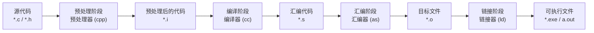
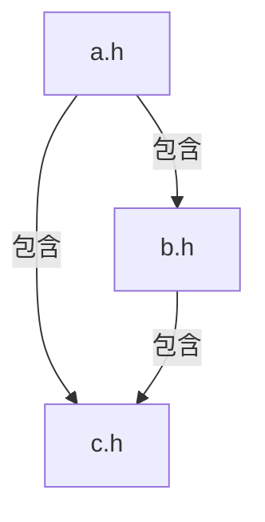

+++
title = "第 13 章：预处理指令——C 语言的'剧本编辑室'"
weight = 130
date = "2026-03-29T22:34:00+08:00"
type = "docs"
description = ""
isCJKLanguage = true
draft = false
+++

# 第 13 章：预处理指令——C 语言的"剧本编辑室"

欢迎来到第 13 章！如果你觉得前面的指针、数组、函数已经够刺激了，那预处理指令这章绝对会让你大开眼界。

想象一下：你是一名电影导演，拍完电影后、正式放映前，有一个神秘的"剧本编辑室"会帮你提前修改剧本——改台词、换场景、甚至删掉某些片段。预处理指令就是 C 编译器的这个"剧本编辑室"。它在你代码正式编译之前，先对你的源代码进行一番"魔改"。

这个阶段叫**预处理阶段**（Preprocessing Stage），它是编译的第一步，却又不属于真正的语法分析。它只是单纯地、粗暴地做文本替换和条件筛选。编译器拿到的是预处理后的"二手代码"，而不是你的原始代码。

---

## 13.1 预处理阶段：文本替换，非语法分析

让我们先搞清楚预处理到底干了什么。你写的每一行 C 代码，在交给真正的编译器之前，都要先经过预处理器（Preprocessor）的审查。

预处理器是一个**纯文本替换机器**。它不认识 C 语法，不理解变量是什么，不关心函数怎么调用。它只知道：找到这个，替换成那个。

### 整个编译流程是这样的



> 预处理器只做文本替换，不做语法分析。预处理器不认识 `if`、`while`、`int` 这些语法关键字，它只是按照指令机械地剪切、粘贴、替换文本。

### 预处理器指令的特点

所有预处理指令都以井号 `#` 开头。注意，这**不是** C 语言的语句，所以不需要分号结尾（加了分号反而可能出问题）。

```c
#define PI 3.14159    // 没有分号！
#include <stdio.h>   // 没有分号！
```

### 预处理器会做哪些事？

| 操作 | 相关指令 |
|------|----------|
| 文件包含 | `#include` |
| 宏定义 | `#define`、`#undef` |
| 条件编译 | `#if`、`#ifdef`、`#ifndef`、`#else`、`#elif`、`#endif` |
| 错误提示 | `#error`、`#warning` |
| 行号控制 | `#line` |
| 编译提示 | `#pragma` |
| 停用特性 | `#pragma`（如 `#pragma GCC warning`） |

我们会在接下来的一整章里，把这些指令一个个拆开来细细讲解。

---

## 13.2 `#include`：把你的代码"粘贴"进来

`#include` 是预处理指令家族中使用频率最高的老大。没有它，你的 C 程序几乎写不成——因为标准库的函数声明、类型定义全都靠它"包含"进来。

### 它的工作原理

`#include` 的本质就是一个"复制粘贴"指令。预处理器看到这行代码后，会找到指定的文件，把文件内容**整篇复制**进来，替换掉这行 `#include` 语句。

```c
// main.c
#include <stdio.h>

int main(void) {
    printf("Hello, World!\n");
    return 0;
}
```

当预处理器的"剪切板"处理完 `#include <stdio.h>` 后，编译器实际拿到的代码大概是这样的（简化版，实际上 `stdio.h` 很长）：

```c
// 预处理后大概像这样（简化版）
//stdio.h 的内容...
extern int printf(const char * __format, ...);
// ...更多内容

int main(void) {
    printf("Hello, World!\n");
    return 0;
}
```

### 两种搜索路径的差异

`#include` 有两种写法，区别在于预处理器去哪里找这个文件：

**尖括号形式 `#include <header.h>`**

预处理器会到**系统指定的include目录**里去找文件。通常是编译器自带的库目录，比如 Linux 上的 `/usr/include` 或者 MinGW 的 `mingw64/include`。

> 这种方式适合包含**标准库头文件**和**系统头文件**，比如 `<stdio.h>`、`<stdlib.h>`、`<string.h>` 等。

**双引号形式 `#include "header.h"`**

预处理器会先在**当前文件所在目录**寻找，找不到再去系统 include 目录找。

> 这种方式适合包含**你自己写的头文件**，或者**项目本地的头文件**。

```c
// 包含标准库，用尖括号
#include <stdio.h>
#include <stdlib.h>
#include <string.h>

// 包含你自己写的头文件，用双引号
#include "myutils.h"
#include "config.h"
```

### 头文件保护：防止重复包含

假设你的项目结构是这样的：



如果 `a.h` 和 `b.h` 都 `#include "c.h"`，而 `main.c` 同时包含了 `a.h` 和 `b.h`，那么 `c.h` 的内容就被粘贴了两次。这会导致**重复定义**错误。

为了解决这个问题，我们需要**头文件保护**（Header Guard）。

#### 方式一：传统的 `#ifndef` 保护

```c
// config.h
#ifndef CONFIG_H       // 如果 CONFIG_H 还没定义
#define CONFIG_H       // 就定义它

// 这里放头文件的内容
#define MAX_SIZE 1024
#define VERSION "1.0.0"

typedef struct {
    int id;
    char name[64];
} Config;

#endif                  // 结束 ifndef 块
```

工作原理：

1. 第一次包含 `config.h`：`CONFIG_H` 没定义，所以进入 `#ifndef` 分支，定义 `CONFIG_H`，然后粘贴内容
2. 第二次包含 `config.h`：`CONFIG_H` 已经定义了，`#ifndef CONFIG_H` 为假，跳过整个内容

> 简单理解：`#ifndef` 就是 "如果没有定义过这个宏，就执行里面的内容"。这是 C 语言里最经典的头文件保护方式，写头文件时**务必养成习惯**。

#### 方式二：`#pragma once`

现代编译器（GCC、Clang、MSVC 都支持）还支持一种更简洁的写法：

```c
// config.h
#pragma once

// 头文件内容
#define MAX_SIZE 1024
typedef struct {
    int id;
    char name[64];
} Config;
```

`#pragma once` 的效果和 `#ifndef` 一样，都是防止同一个文件被重复包含。它的优势是**更简洁**；劣势是**不是所有编译器都支持**（虽然现代编译器基本都支持了）。

> 建议：写库或者跨平台代码时，用 `#ifndef` 方式更保险；如果确定只用现代编译器，`#pragma once` 更优雅。

---

## 13.3 `#define` 宏定义——给东西起别名

`#define` 是预处理器的核心武器。它可以给一个值起名字，也可以给一段代码起名字，甚至可以给代码模板起名字（带参数的那种）。

宏（Macro）这个概念来自希腊语，意思是"大"。在计算机里，宏就是**把一小段代码或值命名成一个符号**，用这个名字来代替原来的内容。

### 13.3.1 简单宏与对象宏

最简单的一种宏叫**对象宏**（Object-like Macro），就是给一个常量起个名字：

```c
#define PI 3.1415926535
#define MAX_LINE 1024
#define VERSION "2.0"
#define NEWLINE '\n'
```

> 对象宏（Object-like Macro）：类似于对象的宏，但实际上不包含参数，看起来就像定义了一个"对象"一样。它和带参宏相对。

```c
#include <stdio.h>

#define PI 3.14159
#define MAX_RADIUS 100
#define MESSAGE "圆的面积 = "

int main(void) {
    double radius = 5.0;
    double area = PI * radius * radius;

    printf("%s%.2f\n", MESSAGE, area);  // 输出: 计算结果: 15.71
    return 0;
}
```

预处理后，这段代码会变成：

```c
#include <stdio.h>

int main(void) {
    double radius = 5.0;
    double area = 3.14159 * radius * radius;
    printf("%s%.2f\n", "圆的面积 = ", area);
    return 0;
}
```

所有的 `PI`、`MESSAGE` 都被替换成了它们对应的文本。这就是**文本替换**的本质。

### 13.3.2 带参宏：函数-like 的宏

比对象宏更强大的是**带参宏**（Function-like Macro），也叫类函数宏。它长得像函数，实际上是文本替换。

```c
#define MAX(a, b) ((a) > (b) ? (a) : (b))
#define MIN(a, b) ((a) < (b) ? (a) : (b))
#define SQUARE(x) ((x) * (x))
#define IS_EVEN(n) ((n) % 2 == 0)
```

注意这些括号！宏的括号非常重要，后面会详细讲。

```c
#include <stdio.h>

#define MAX(a, b) ((a) > (b) ? (a) : (b))
#define MIN(a, b) ((a) < (b) ? (a) : (b))
#define SQUARE(x) ((x) * (x))
#define IS_EVEN(n) ((n) % 2 == 0)

int main(void) {
    int x = 10, y = 20;
    printf("MAX(%d, %d) = %d\n", x, y, MAX(x, y));  // MAX(10, 20) = 20
    printf("MIN(%d, %d) = %d\n", x, y, MIN(x, y));  // MIN(10, 20) = 10

    int z = 5;
    printf("SQUARE(%d) = %d\n", z, SQUARE(z));      // SQUARE(5) = 25
    printf("SQUARE(%d) = %d\n", z+1, SQUARE(z+1));  // SQUARE(5+1) = 36

    int num = 42;
    printf("IS_EVEN(%d) = %s\n", num, IS_EVEN(num) ? "true" : "false");  // IS_EVEN(42) = true
    return 0;
}
```

等等，上面 `SQUARE(z+1)` 的结果你算对了吗？

展开后是 `((z+1) * (z+1))`，即 `((5+1) * (5+1))` = `(6 * 6)` = 36。这是正确的。

但如果宏写成这样 `#define SQUARE(x) x * x`（没有括号），展开后就变成 `z+1 * z+1`，由于乘法优先级高于加法，结果就变成了 `z + (1*z) + 1` = `5 + 5 + 1` = 11，完全错了！

> 所以带参宏**一定要给参数和整体都加括号**，否则会出现意想不到的错误。这就是宏的"文本替换"本质带来的陷阱。

### 13.3.3 ⚠️ 宏的副作用：`MAX(++a, ++b)` 参数被求值多次

这是宏的**头号天坑**，无数人栽在这里。

先看一个正常例子：

```c
#include <stdio.h>

#define MAX(a, b) ((a) > (b) ? (a) : (b))

int main(void) {
    int a = 5, b = 10;
    int result = MAX(a, b);
    printf("result = %d\n", result);  // result = 10
    return 0;
}
```

但如果参数是表达式呢？

```c
#include <stdio.h>

#define MAX(a, b) ((a) > (b) ? (a) : (b))

int main(void) {
    int a = 5, b = 10;
    int result = MAX(a++, b++);
    printf("result = %d, a = %d, b = %d\n", result, a, b);
    return 0;
}
```

展开后变成：

```c
int result = ((a++) > (b++) ? (a++) : (b++));
```

因为 `a++` 返回原值然后加 1，`b++` 也是如此。所以比较的是 `5 > 10`（假），然后取 `b++`，此时 `b++` 在比较阶段已经被求值了一次用于比较，返回 10，然后作为返回值时再次求值，返回 11。

所以最终 `result = 10`，`a = 6`，`b = 12`（`b++` 在比较时从 10 变成 11，在作为结果时从 11 变成 12）。

> 这里的 `++` 运算符被求值了**两次**！这叫**副作用**（Side Effect），是宏最危险的特性。

```c
#include <stdio.h>

#define MAX(a, b) ((a) > (b) ? (a) : (b))

int main(void) {
    int a = 5, b = 10;
    // 展开成: ((a++) > (b++) ? (a++) : (b++))
    // 比较 5 和 10 (false)
    // b++ 在比较时已经自增到 11，作为结果返回 10（自增前的值）
    // b++ 再作为结果时再次自增到 12
    int result = MAX(a++, b++);
    // 实际上执行了 2 次 ++b 的求值
    printf("result = %d, a = %d, b = %d\n", result, a, b);
    // 输出: result = 10, a = 6, b = 12
    return 0;
}
```

**结论：永远不要把带副作用的表达式传给宏参数！**

这和真正的函数调用完全不同——函数调用时参数只求值一次，而宏是文本替换，参数在代码里出现了几次，就会求值几次。

### 13.3.4 `#` 运算符（字符串化）与 `##` 运算符（令牌连接）

预处理还有两个秘密武器：字符串化运算符 `#` 和令牌连接运算符 `##`。

#### 字符串化运算符 `#`

在带参宏中，`#` 运算符可以把宏参数转换成字符串字面量。

```c
#include <stdio.h>

#define PRINT_INT(n) printf(#n " = %d\n", n)
#define PRINT_STR(s) printf("%s\n", #s)

int main(void) {
    int apple_count = 5;
    PRINT_INT(apple_count);   // apple_count = 5
    PRINT_INT(10 + 5);        // 10 + 5 = 15

    PRINT_STR(Hello World);   // Hello World
    PRINT_STR(123);           // 123
    return 0;
}
```

`#n` 会把参数 `n` 转换成字符串。比如 `apple_count` 变成了 `"apple_count"`。这个技巧在调试时特别有用，可以直接打印变量名。

> `#` 运算符只能在带参宏的体内使用，作用是把跟在其后的**宏参数**转换成一个字符串。

#### 令牌连接运算符 `##`

`##` 运算符可以把两个**记号（Token）**拼接成一个新记号。这在写泛型代码或者自动生成变量名时特别有用。

```c
#include <stdio.h>

#define CONCAT(a, b) a ## b
#define MAKE_VAR(name) int name ## _value = 100

int main(void) {
    // CONCAT(10, 20) 展开成 1020（两个数字拼接）
    int xy = 30;
    printf("xy = %d\n", xy);                    // xy = 30

    MAKE_VAR(xy);  // 展开成: int xy_value = 100;
    printf("xy_value = %d\n", xy_value);        // xy_value = 100

    // 另一个例子：拼接字符串
    printf("拼接结果: %d\n", CONCAT(1, 23));    // 123
    return 0;
}
```

> `##` 运算符在预处理阶段把两个记号（Token）粘合成一个记号。比如 `CONCAT(10, 20)` 展开后变成记号 `1020`（一个整数常量）。

### 13.3.5 `do { ... } while(0)` 技巧

这是 C 宏里最著名的"黑魔法"技巧之一，初次看到绝对一脸懵。

先说问题：如果你想定义一个宏，它包含多条语句，你会怎么写？

```c
#define SWAP(a, b) \
    int temp = a; \
    a = b; \
    b = temp;
```

这看起来没问题，但如果你这样用：

```c
if (x > 0)
    SWAP(x, y);  // 展开后只有第一条语句受 if 控制！
else
    printf("error\n");
```

展开后变成：

```c
if (x > 0)
    int temp = a;
    a = b;
    b = temp;  // 少了分号，而且这三行都不在 if 控制下！
else
    printf("error\n");
```

这编译必报错。

**解决方案：用 `do { ... } while(0)` 包裹宏体**

```c
#define SWAP(a, b) \
    do { \
        int temp = (a); \
        (a) = (b); \
        (b) = temp; \
    } while (0)
```

现在 `SWAP(x, y)` 展开后是一个完整的单语句，可以安全地用在任何地方：

```c
if (x > 0)
    SWAP(x, y);  // 完美！
else
    printf("error\n");
```

展开后：

```c
if (x > 0)
    do { int temp = (x); (x) = (y); (y) = temp; } while (0);
else
    printf("error\n");
```

这完美符合语法。

> `do { ... } while(0)` 技巧：**把宏体包裹在一个 do-while(0) 结构中**，这样宏展开后是一个完整的语句，可以在任何地方使用（if 后、单独一行、分号结束都可以），不会出现悬空分号或语句不在控制流内的问题。

```c
#include <stdio.h>

#define SWAP(a, b) \
    do { \
        int temp = (a); \
        (a) = (b); \
        (b) = temp; \
    } while (0)

#define LOG(msg) \
    do { \
        printf("[LOG] %s\n", msg); \
        printf("[LINE] %d\n", __LINE__); \
    } while (0)

int main(void) {
    int x = 10, y = 20;
    printf("交换前: x = %d, y = %d\n", x, y);  // 交换前: x = 10, y = 20

    if (x < y)
        SWAP(x, y);
    else
        LOG("不需要交换");

    printf("交换后: x = %d, y = %d\n", x, y);  // 交换后: x = 20, y = 10

    return 0;
}
```

---

## 13.4 条件编译：用编译器的" if 语句"选择代码

条件编译（Conditional Compilation）可能是预处理指令中最实用的一种。它允许你根据某些条件，选择性地让某段代码参与编译，或者被完全忽略。

你可以把它理解成"编译器级别的 if-else"——但这个 if-else 不是在程序运行时判断的，而是在**编译前**就决定好哪段代码要编译、哪段代码要丢弃。

### 13.4.1 条件编译指令家族

| 指令 | 含义 |
|------|------|
| `#if` | 如果常量表达式为真 |
| `#ifdef` | 如果宏已定义 |
| `#ifndef` | 如果宏未定义 |
| `#else` | 否则 |
| `#elif` | 否则如果 |
| `#elifdef` | 否则如果宏已定义（C23 新增） |
| `#elifndef` | 否则如果宏未定义（C23 新增） |
| `#endif` | 结束 if 块 |

#### `#ifdef` 和 `#ifndef`

这两个最常用，意思是"如果定义了某个宏"（ifdef = if defined）和"如果没有定义某个宏"（ifndef = if not defined）。

```c
#include <stdio.h>

#define DEBUG 1

int main(void) {
    int x = 100;

#ifdef DEBUG
    printf("调试模式: x = %d\n", x);  // 这行会编译
#endif

#ifndef DEBUG
    printf("发布模式: x = %d\n", x);  // 这行不会编译
#endif

    return 0;
}
```

在这个例子里，`DEBUG` 被定义了，所以 `#ifdef DEBUG` 块里的代码会编译，`#ifndef DEBUG` 块里的代码被完全丢弃（预处理阶段就删掉了）。

#### `#if` 和 `#elif`

`#if` 后面跟一个常量表达式，可以做更复杂的判断：

```c
#include <stdio.h>

#define LEVEL 2

int main(void) {
#if LEVEL == 1
    printf("运行级别: 基础模式\n");
#elif LEVEL == 2
    printf("运行级别: 标准模式\n");
#elif LEVEL == 3
    printf("运行级别: 高级模式\n");
#else
    printf("运行级别: 未知模式\n");
#endif
    return 0;
}
```

### 13.4.2 C23 新增：`#elifdef` 和 `#elifndef`

在 C23 之前，你想写"否则如果有定义 X"必须这样写：

```c
// C23 之前的写法
#ifdef DEBUG
    // ...
#else
#ifdef FEATURE_X
    // ...
#endif
#endif
```

嵌套越来越多，看得人头皮发麻。

C23 引入了 `#elifdef` 和 `#elifndef`，让代码更简洁：

```c
// C23 新语法
#if LEVEL == 1
    printf("基础模式\n");
#elifdef DEBUG        // 否则如果有定义 DEBUG
    printf("调试版本\n");
#elifdef FEATURE_X    // 否则如果有定义 FEATURE_X
    printf("特性X启用\n");
#elifndef DISABLE_LOG
    printf("日志启用\n");
#else
    printf("默认模式\n");
#endif
```

> C23 的 `#elifdef` 等于 `#else` + `#ifdef` 的组合，`#elifndef` 等于 `#else` + `#ifndef` 的组合。它们只是语法糖，让嵌套的条件编译更易读。

### 13.4.3 跨平台代码、调试开关

条件编译最经典的应用场景就是**跨平台开发**和**调试开关**。

#### 跨平台：Windows vs Linux

```c
#include <stdio.h>

#ifdef _WIN32
    #define PLATFORM "Windows"
    #define NEWLINE "\r\n"
#elif defined(__linux__)
    #define PLATFORM "Linux"
    #define NEWLINE "\n"
#elif defined(__APPLE__)
    #define PLATFORM "macOS"
    #define NEWLINE "\n"
#else
    #define PLATFORM "Unknown"
    #define NEWLINE "\n"
#endif

int main(void) {
    printf("当前平台: %s%s", PLATFORM, NEWLINE);
    printf("换行符长度: %zu\n", sizeof(NEWLINE) - 1);
    return 0;
}
```

> `_WIN32` 是 Windows 特有的宏，MSVC 和 MinGW 都会定义它。`__linux__` 是 Linux 上的 GCC/Clang 定义的。`__APPLE__` 是 macOS 上的编译器定义的。这些都是**预定义宏**（Predefined Macros），编译器自动提供的。

#### 调试开关：打印日志

```c
#include <stdio.h>

// 调试开关：注释掉这行可以关闭所有调试输出
#define DEBUG_MODE

void process_data(int *data, size_t len) {
#ifdef DEBUG_MODE
    printf("[DEBUG] 开始处理 %zu 个元素...\n", len);
#endif

    for (size_t i = 0; i < len; i++) {
        data[i] *= 2;
#ifdef DEBUG_MODE
        printf("[DEBUG] data[%zu] = %d\n", i, data[i]);
#endif
    }

#ifdef DEBUG_MODE
    printf("[DEBUG] 处理完成\n");
#endif
}

int main(void) {
    int arr[] = {1, 2, 3, 4, 5};
    process_data(arr, 5);
    // 注释掉 #define DEBUG_MODE 后，调试输出全部消失
    return 0;
}
```

发布程序时，只需要把 `#define DEBUG_MODE` 注释掉或删掉，所有调试代码在预处理阶段就被完全删除了——不会留下任何痕迹，也不会影响运行性能。

---

## 13.5 预定义宏：编译器给你的免费礼物

C 标准定义了一些**预定义宏**（Predefined Macros），这些宏不需要你手动定义，**编译器在编译时自动提供**。它们是了解编译环境和调试信息的神器。

| 宏 | 含义 | 示例值 |
|---|------|--------|
| `__FILE__` | 当前源文件名 | `"main.c"` |
| `__LINE__` | 当前行号 | `25` |
| `__DATE__` | 编译日期 | `"Mar 29 2026"` |
| `__TIME__` | 编译时间 | `"14:30:00"` |
| `__STDC__` | 是否符合标准 C | `1`（是） |
| `__STDC_VERSION__` | C 标准版本（C99 起） | `202310L`（C23） |
| `__STDC_HOSTED__` | 是否为宿主环境（C11 起） | `1` |
| `__func__` | 当前函数名字（C99 起） | `"main"` |

```c
#include <stdio.h>

void test_function(void) {
    printf("当前函数: %s\n", __func__);
    printf("所在文件: %s\n", __FILE__);
    printf("所在行号: %d\n", __LINE__);
}

int main(void) {
    printf("=== 预定义宏演示 ===\n");
    printf("编译日期: %s\n", __DATE__);   // Mar 29 2026
    printf("编译时间: %s\n", __TIME__);   // 14:30:00

    printf("文件: %s, 行: %d\n", __FILE__, __LINE__);  // main.c, 15

    test_function();

    printf("STDC版本: %ld\n", __STDC_VERSION__);  // 202310L (C23)
    printf("宿主环境: %d\n", __STDC_HOSTED__);    // 1

    return 0;
}
```

### 关于 `__STDC_HOSTED__` 的特别说明

> ⚠️ 很多人误以为 `__STDC_HOSTED__` 是 C99 引入的，实际上它是 **C11** 才引入的预定义宏。这个宏表示当前程序运行在"宿主环境"（Hosted Environment，有完整标准库）还是"独立环境"（Freestanding Environment，没有标准库）。大多数 PC 程序都是宿主环境，值为 `1`。

### `__func__`：函数名字的魔法

`__func__` 是一个标识符，不是字符串常量（前面没有 `#` 所以不会自动变成字符串）。如果你需要字符串，需要手动加 `#`：

```c
#include <stdio.h>

#define FUNC_NAME __func__

void hello(void) {
    printf("当前函数名: %s\n", __func__);       // 当前函数名: hello
    printf("函数名转字符串: %s\n", #__func__); // 函数名转字符串: hello
}

int main(void) {
    printf("主函数: %s\n", FUNC_NAME);  // 主函数: main
    hello();
    return 0;
}
```

---

## 13.6 `#error` 与 `#warning`：编译时的"大喊大叫"

`#error` 和 `#warning` 是预处理器的"报警器"。当预处理到它们时，会向编译器输出一条消息。不过它们的反应不同：

- `#error`：让编译**失败**，显示错误消息
- `#warning`：让编译**继续**，只显示警告消息

### `#error` 的典型用法

阻止不支持的配置继续编译：

```c
#include <stdio.h>

// 强制要求至少 C11 标准
#if __STDC_VERSION__ < 201112L
#error "此程序需要 C11 或更高版本支持！\n请使用 gcc -std=c11 或更高版本。"
#endif

int main(void) {
    printf("C 标准版本: %ld\n", __STDC_VERSION__);
    return 0;
}
```

如果用 C99 编译这段代码，预处理器会在这里停下来并报错：

```
error: #error "此程序需要 C11 或更高版本支持！"
```

### `#warning` 的典型用法

提示潜在问题，但不阻止编译：

```c
#include <stdio.h>

#define OLD_COMPILER

#ifdef OLD_COMPILER
#warning "你正在使用旧编译器，某些特性可能不支持。"
#endif

int main(void) {
    printf("继续运行...\n");
    return 0;
}
```

编译时会看到：

```
warning: #warning "你正在使用旧编译器，某些特性可能不支持。"
```

---

## 13.7 `#line` 与 `#pragma`

### `#line`：告诉编译器"行号其实不是这样的"

`#line` 指令可以**修改预定义宏 `__FILE__` 和 `__LINE__` 的值**，让编译器认为当前行号和文件名是指定的。

这看起来很奇怪，但在某些代码生成工具（比如 yacc、lex 生成的代码，或者编译器内部处理）里很有用：

```c
#include <stdio.h>

int main(void) {
    printf("第 1 行\n");
    printf("第 2 行\n");

    #line 100 "generated.c"
    // 告诉编译器：从现在开始，行号是 100，文件名是 generated.c

    printf("第 100 行（实际上是第 5 行）\n");
    printf("第 101 行（实际上是第 6 行）\n");
    printf("文件名: %s, 行号: %d\n", __FILE__, __LINE__);
    // 输出: 文件名: generated.c, 行号: 102

    return 0;
}
```

> `#line` 主要用于**调试信息生成**和**代码生成工具**。普通应用开发中几乎用不到，但理解它有助于理解编译器的错误信息是如何生成的。

### `#pragma`：给编译器的特殊指令

`#pragma` 是 C 标准提供的一种机制，允许实现（编译器）提供**机器特定或平台特定的指令**。不同编译器的 `#pragma` 完全不同，无法移植。

#### `#pragma once`（编译器支持）

前面已经讲过，用于防止头文件重复包含：

```c
#pragma once
// 头文件内容
```

#### `#pragma pack`：结构体对齐

MSVC 和 GCC 都支持，用于控制结构体的内存对齐：

```c
#include <stdio.h>

// 强制 1 字节对齐（紧凑模式）
#pragma pack(push, 1)
struct CompactStruct {
    char a;    // 1 字节
    int b;     // 4 字节
    char c;    // 1 字节
    // 总大小: 6 字节（如果不pack，默认对齐可能是 12 字节）
};
#pragma pack(pop)

struct NormalStruct {
    char a;    // 1 字节 + 3 字节填充
    int b;     // 4 字节
    char c;    // 1 字节 + 3 字节填充
    // 总大小: 12 字节（受默认对齐影响）
};

int main(void) {
    printf("CompactStruct 大小: %zu\n", sizeof(struct CompactStruct));  // 6
    printf("NormalStruct 大小: %zu\n", sizeof(struct NormalStruct));   // 12
    return 0;
}
```

#### `#pragma GCC`：GCC 特定的 pragma

GCC 支持很多 `#pragma` 指令，例如关闭警告：

```c
#pragma GCC diagnostic push
#pragma GCC diagnostic ignored "-Wunused-variable"
// 这段代码里 unused-variable 警告被忽略
int unused = 42;
#pragma GCC diagnostic pop
// 这里恢复了原来的警告设置
```

---

## 13.8 `_Pragma` 运算符（C99）：用代码生成 `#pragma`

有时候你不想写 `#pragma`（因为它不是宏），C99 提供了 `_Pragma` 运算符，可以在宏里生成 `#pragma` 指令。

```c
#include <stdio.h>

// 用 _Pragma 定义一个宏，等价于 #pragma once
_Pragma("once")

#define PRAGMA(msg) _Pragma(msg)

int main(void) {
    PRAGMA("GCC warning \"这是一个警告\"")
    printf("使用 _Pragma 运算符成功！\n");
    return 0;
}
```

> `_Pragma` 的参数是一个**字符串字面量**（需要加引号），它会被转换成对应的 `#pragma` 指令。由于 `_Pragma` 是一个运算符而不是指令，所以可以放在宏定义里，这是 `#pragma`做不到的。

---

## 13.9 C23 `#embed`：二进制文件内容嵌入为字节数组

这是 C23 引入的一个重磅特性！想象一下，你有一个图片文件、字体文件、或者任何二进制数据，想要直接嵌入到 C 代码里。以前你需要手动写十六进制数组或者用外部工具，但 C23 的 `#embed` 让这变得轻而易举。

```c
#include <stdio.h>

// 嵌入 binary.dat 文件的内容作为字节数组
const unsigned char data[] = {
#embed "binary.dat"
};

// 还可以限制嵌入的字节数
const unsigned char header[] = {
#embed "binary.dat" limit(16)
};

// 嵌入并指定填充值（如果文件不存在或读取失败）
const unsigned char fallback[] = {
#embed "binary.dat" or(0xFF)
};
```

### 实际演示

首先创建一个测试文件：

```c
// gen_data.c - 生成测试数据文件
#include <stdio.h>

int main(void) {
    FILE *f = fopen("sample.bin", "wb");
    if (!f) return 1;
    // 写入 10 个字节: 0x00 到 0x09
    for (int i = 0; i < 10; i++) {
        fputc(i, f);
    }
    fclose(f);
    printf("sample.bin 创建成功！\n");
    return 0;
}
```

然后用 `#embed` 读取：

```c
#include <stdio.h>

// 使用 #embed 嵌入 sample.bin
const unsigned char embedded_data[] = {
#embed "sample.bin"
};

int main(void) {
    size_t len = sizeof(embedded_data) - 1;  // -1 是为了排除自动添加的 \0
    printf("嵌入的字节数: %zu\n", len);  // 10

    printf("字节内容: ");
    for (size_t i = 0; i < len; i++) {
        printf("%02X ", embedded_data[i]);
    }
    printf("\n");
    // 输出: 00 01 02 03 04 05 06 07 08 09
    return 0;
}
```

> `#embed` 指令会读取指定文件的内容，将每个字节转换成十进制整数并用逗号分隔。如果文件不存在，C23 允许使用 `or()` 子句指定默认值。没有 `or()` 时，缺失文件通常会导致编译错误。

---

## 13.10 C23 `#include_next`：包含下一个搜索路径中的头文件

`#include_next` 是 C23 引入的另一个新指令，用于**强制包含下一个搜索路径中的同名头文件**，而不是当前目录的那个。

这听起来有点绕，来个场景：

假设你正在写一个操作系统内核，你想**替换**（Override）系统标准的 `<stdio.h>`，但同时又想在你的新 `<stdio.h>` 里**调用原来那个标准的 `<stdio.h>`**。这时候 `include_next` 就派上用场了。

```c
// my_stdio.h
// 这是你自己的 stdio.h 版本，但还想用原来标准的 printf

#ifndef MY_STDIO_H
#define MY_STDIO_H

// 先包含标准库的 stdio.h（通过 #include_next）
// 它会跳过当前目录的 stdio.h，去系统路径找
#include_next <stdio.h>

// 然后添加你自己的扩展
void my_custom_printf(const char *msg);

#endif
```

> `#include_next` 的主要用途是**编写可替换标准库头的库**，以及**编译器内部工具链**。普通应用开发者基本用不到，但如果你在写操作系统或编译器工具链，这就是必备技能。

---

## 13.11 三字符组（Trigraph）与二元组（Digraph）：历史遗留的字符

最后讲一个"考古"知识。三字符组和二元组是 C 语言历史上的两个特殊字符表示方式，它们分别在 **C99 被废弃**（Deprecated），在 **C23 被正式移除**（Removed）。

### 三字符组（Trigraph）

在某些老式键盘上，不是所有字符都能直接输入（比如 `|`、`\`、`~` 等）。为了解决这个问题，C89 引入了**三字符组**（Trigraph），用三个问号开头来表示这些特殊字符：

| 三字符组 | 代表字符 |
|---------|---------|
| `??=` | `#` |
| `??/` | `\` |
| `??'` | `^` |
| `??(` | `[` |
| `??)` | `]` |
| `??<` | `{` |
| `??>` | `}` |
| `??!` | `|` |
| `??-` | `~` |

```c
// 三字符组示例
??=include <stdio.h>   // 等价于 #include <stdio.h>

int main() ??<
    printf("Hello??/n");  // Hello\n
    return 0;
??>
```

> `??/` 在 C89 里代表反斜杠 `\`。所以 `??/n` 在老式编译器里会被当作 `\` + `n`，而不是 `??/n` 这个字符串。这是一个容易让人掉进坑里的历史遗留设计。

### 二元组（Digraph）

C99 引入了一种更"正常"的方式——**二元组**（Digraph），用两个字符来表示某些常用符号：

| 二元组 | 代表字符 |
|-------|---------|
| `<:` | `[` |
| `:>` | `]` |
| `<%` | `{` |
| `%>` | `}` |
| `%:` | `#` |
| `%:%:` | `##` |

```c
%:include <stdio.h>   // #include <stdio.h>

int main() <%
    printf("Hello%%:n");  // 注意：%: 在字符串外是 #，在字符串内还是 %:
    return 0;
%>
```

### 为什么 C23 要移除它们？

因为：
1. 现代编译器全面支持 Unicode 和 UTF-8，输入任何字符都没问题
2. `??` 组合在现代编辑器里会被自动替换成 Unicode 表情符号，反而容易引起混淆
3. 这些特性增加了语言复杂度，但几乎没有实际用途

> **现代 C 代码里完全不需要使用三字符组和二元组**，了解它们只是为了读懂几十年前的老代码。如果你碰到有人写 `??=` 开头的东西，那一定是祖传代码无疑了。

---

## 本章小结

本章我们全面探索了 C 语言的预处理指令系统。以下是核心要点：

1. **预处理阶段**发生在真正编译之前，纯文本替换是它的本质，不做语法分析
2. **`#include`** 将头文件内容粘贴进源文件，尖括号搜索系统目录，双引号先搜当前目录
3. **头文件保护**用 `#ifndef`/`#define`/`#endif` 组合或 `#pragma once` 防止重复包含
4. **`#define`** 定义宏，分为对象宏（简单常量）和带参宏（类函数宏）
5. **宏的副作用**是最大的陷阱：参数可能被求值多次，`MAX(++a, ++b)` 会让你欲哭无泪
6. **`#` 字符串化**和 **`##` 令牌连接**是带参宏的高级用法
7. **`do { ... } while(0)` 技巧**让多语句宏能安全地在任何地方使用
8. **条件编译**用 `#if`/`#ifdef`/`#ifndef`/`#else`/`#elif`/`#endif` 在编译时选择代码
9. **预定义宏**如 `__FILE__`、`__LINE__`、`__DATE__`、`__TIME__` 等提供编译环境信息
10. **`#error` 和 `#warning`** 分别终止编译和发出警告，用于编译时检查
11. **`_Pragma`** 运算符允许在宏内生成 `#pragma` 指令
12. **C23 `#embed`** 让二进制文件内容可以方便地嵌入为字节数组
13. **C23 `#include_next`** 用于编写可替换标准头的库
14. **三字符组和二元组**是历史遗留，C23 已移除，现代代码中无需使用

预处理指令虽然不是 C 语言的核心语法，但它们是构建大型项目、编写跨平台代码、实现高效调试不可或缺的工具。掌握好这一章，你就真正理解了 C 语言"从源码到可执行文件"的完整旅程。

下一章我们将进入 C 语言的更多高级主题，敬请期待！
