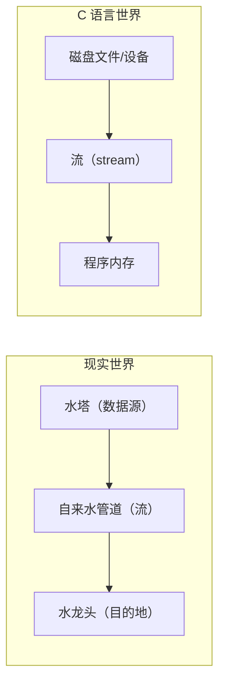
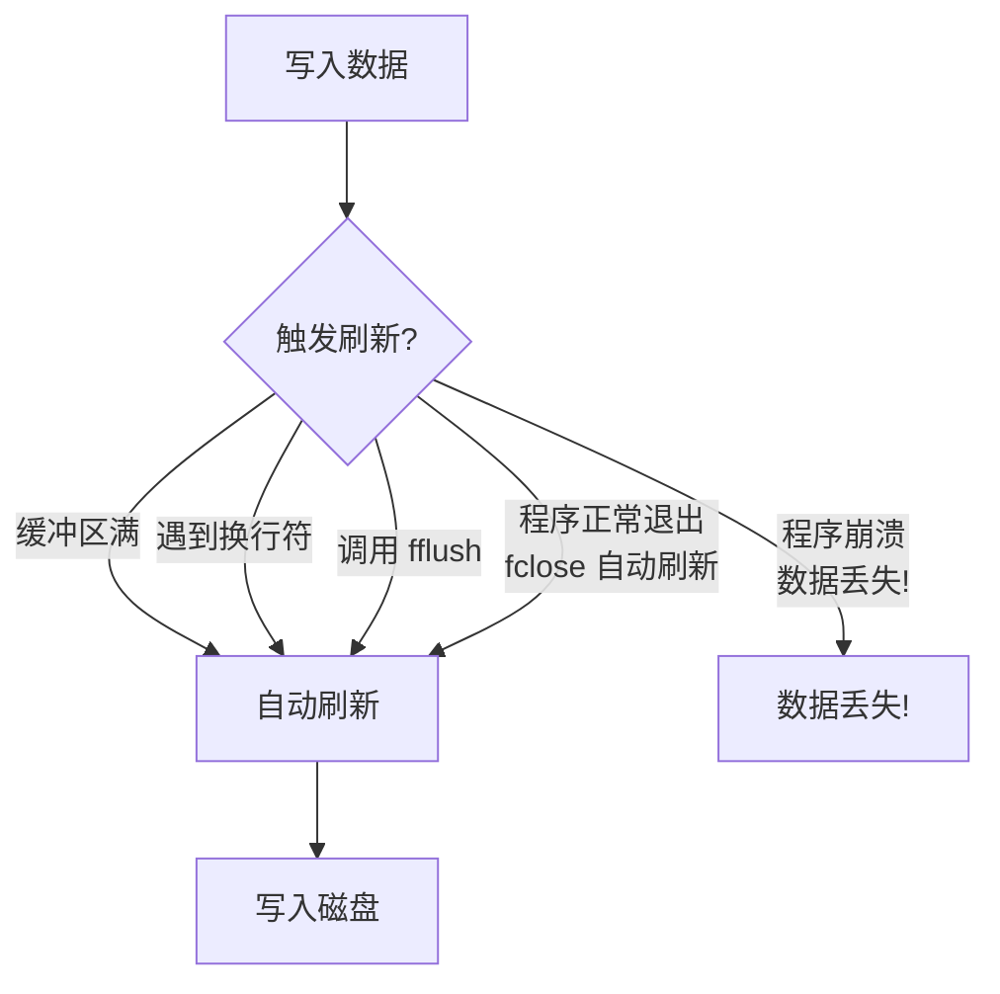

+++
title = "第 15 章：文件操作 —— 程序的'读心术'与'记忆术'"
weight = 150
date = "2026-03-29T22:34:00+08:00"
type = "docs"
description = ""
isCJKLanguage = true
draft = false
+++

# 第 15 章：文件操作 —— 程序的"读心术"与"记忆术"

> 本章你会学到什么？
>
> - 什么是流（stream）—— 数据流动的"管道"
> - 标准输入输出的三兄弟：stdin、stdout、stderr
> - 如何打开和关闭文件——敲门和关门的基本礼仪
> - 各种文件读取写入姿势——总有一款适合你
> - 文件指针的魔法——随意穿梭在文件的任何位置
> - 大文件处理的技巧——突破 2GB 天花板
> - C23 的酷炫新特性——位置参数

---

想象一下这个场景：你昨天写了一篇超级重要的日记，记录了你暗恋隔壁班小美的所有心路历程。结果今天一开机，日记没了！程序崩溃、关机、蓝屏——管它什么，反正你的心血结晶就这么人间蒸发了。

你崩溃不崩溃？

好消息是，在 C 语言的世界里，我们有办法把数据**永久保存**下来，不至于让它随着程序退出而灰飞烟灭。这就要靠我们今天要聊的主题——**文件操作**。

文件操作就像是给你的程序装了一个"记忆芯片"。程序可以把重要数据写进磁盘文件，下次运行时再读出来。这样就算程序崩溃了一万次，你的数据依然稳稳地躺在硬盘里，不离不弃。

> 本章我们将学习 C 语言中所有与文件相关的操作。从打开文件到读写文件，从文件指针定位到大文件处理，我们会一个一个拆解，让你彻底掌握文件操作的"十八般武艺"。

---

## 15.1 流（Stream）：数据流动的"管道"

在正式开始文件操作之前，我们得先理解一个核心概念——**流**（stream）。

### 什么是流？

想象你家的自来水管道。水从水塔（源头）流到你家的水龙头（目的地），中间经过的就是管道。**流**在 C 语言中的角色类似于这个管道——它是数据从"地方 A"传输到"地方 B"的通道。



流可以是：
- **输入流**：数据流进你的程序（比如从文件读取数据）
- **输出流**：数据流出你的程序（比如把数据写入文件）

### 二进制流 vs 文本流

C 语言的流分为两种类型，它们处理数据的方式完全不同：

**文本流**（text stream）—— 听话的"翻译员"

文本流把数据看作是一行一行的文本。计算机会自动帮你做一些转换：
- 在 Windows 上，把 `\n`（LF，换行）转换成 `\r\n`（CRLF，回车+换行）
- 在 Linux/macOS 上，直接就是 `\n`
- 文件结尾可能有一个 `EOF` 标记

简单说：**文本流会把数据"翻译"成人类可读的文本格式**。

**二进制流**（binary stream）—— 原汁原味的"搬运工"

二进制流不做任何转换，你写入什么字节，磁盘上就存储什么字节。图片、音频、视频、可执行文件——这些都得用二进制流来读写，否则会坏掉。

```c
// 文本模式：计算机会帮你处理换行符转换
FILE *text_file = fopen("notes.txt", "w");  // Windows 上写入 \n 会变成 \r\n

// 二进制模式：原封不动，爱写啥写啥
FILE *binary_file = fopen("image.png", "wb");  // 严格的字节对应
```

> 打个形象的比喻：文本流像是带着翻译出差的商务人士（说的话会被翻译成当地语言），而二进制流像是直接拎着现金箱子的土豪（直接给的就是原始的，不做任何加工）。

### 为什么这个区别很重要？

```c
#include <stdio.h>

int main() {
    // 用文本模式写入数字
    FILE *fp = fopen("number.txt", "w");
    fprintf(fp, "%d", 12345);
    fclose(fp);

    // 用二进制模式写入数字
    fp = fopen("number.bin", "wb");
    int num = 12345;
    fwrite(&num, sizeof(num), 1, fp);
    fclose(fp);

    // 查看文件大小：
    // number.txt: 5 个字节（"12345"的文本）
    // number.bin: 4 个字节（int 的二进制表示）

    return 0;
}
```

如果你在 Windows 上用文本模式读取一个包含 `\n` 的二进制文件，计算机会把它当作换行符处理，导致数据损坏。所以**读写图片、音频、压缩包等二进制文件时，一定要用 `b` 模式**。

---

## 15.2 标准输入输出：stdin / stdout / stderr

C 语言为每个程序默认打开了三个"特殊文件"——呃，或者说三个"特殊流"：

### 三兄弟一览表

| 流 | 名称 | 默认连接 | 缓冲类型 | 用途 |
|---|---|---|---|---|
| `stdin` | 标准输入 | 键盘 | **行缓冲** | 读取用户输入 |
| `stdout` | 标准输出 | 屏幕 | **全缓冲**（行缓冲在终端） | 正常输出 |
| `stderr` | 标准错误 | 屏幕 | **无缓冲** | 错误信息 |

### 生活中的类比

想象你在餐厅点餐：

- **stdin**：你的嘴——你说什么，服务员听什么
- **stdout**：餐厅的音箱——播报你的点单，大家都能听到
- **stderr**：服务员手里的对讲机——只有厨房经理能听到，而且是**立刻**听到，不需要等到这桌菜上完

为什么 stderr 要无缓冲？因为**错误信息必须马上显示**，不能让用户等到缓冲区满了才看到错误！

### 代码演示

```c
#include <stdio.h>

int main() {
    int age;

    // 从 stdin 读取输入
    printf("请输入你的年龄: ");  // 这货是 stdout
    scanf("%d", &age);           // 从 stdin 读取

    if (age < 0) {
        // 错误信息输出到 stderr（立即显示！）
        fprintf(stderr, "错误: 年龄不能是负数！\n");
        return 1;
    }

    printf("你的年龄是 %d 岁\n", age);  // stdout
    return 0;
}
```

运行效果（假设输入 -5）：

```
请输入你的年龄: -5
错误: 年龄不能是负数！
你的年龄是 -5 岁
```

等等，为什么错误信息反而先显示了？因为 **stderr 没有缓冲，立刻就输出了**。而 stdout 有缓冲，可能还在等缓冲区填满（或者等换行符触发行缓冲）。

### 重定向：从管道到文件

这三个标准流可以被**重定向**——也就是说，可以把它们的连接从键盘/屏幕改成文件：

```bash
# 把 stdout 重定向到文件：程序输出写入 output.txt
./my_program > output.txt

# 把 stdin 重定向：程序从文件读取输入
./my_program < input.txt

# 把 stderr 重定向到文件（注意：2 是 stderr 的文件描述符）
./my_program 2> error.txt

# 同时重定向 stdout 和 stderr
./my_program > all_output.txt 2>&1
```

> 这里的 `2>&1` 意思是"把 stderr（2）重定向到 stdout（1）当前的位置"。

---

## 15.3 `fopen`：打开文件——敲门的艺术

在现实生活里，你想进别人的房间，得先敲门。**在 C 语言里，你想读写文件，也得先"敲门"——调用 `fopen()`**。

### 函数签名

```c
#include <stdio.h>

FILE *fopen(const char *filename, const char *mode);
```

- `filename`：文件名（路径）
- `mode`：打开模式
- **返回值**：`FILE *` 指针（文件指针），或者失败时返回 `NULL`

### 打开模式一览

| 模式 | 含义 | 文件不存在 | 文件存在 | 指针位置 |
|---|---|---|---|---|
| `"r"` | 只读 | 失败 | 打开 | 文件头 |
| `"w"` | 只写 | **创建** | **清空** | 文件头 |
| `"a"` | 追加 | **创建** | 追加到末尾 | 文件尾 |
| `"r+"` | 读写 | 失败 | 打开 | 文件头 |
| `"w+"` | 读写 | **创建** | **清空** | 文件头 |
| `"a+"` | 读写+追加 | **创建** | 追加到末尾 | 读文件头，写文件尾 |

加 `b` 变成二进制模式：`"rb"`、`"wb"`、`"r+b"` 等。

### ⚠️ 重要警告：必须检查返回值！

**这是 C 语言文件操作中最最重要的规矩：每次 `fopen()` 都必须检查返回值！**

```c
#include <stdio.h>

int main() {
    // ❌ 错误示范：不检查返回值
    FILE *fp = fopen("data.txt", "r");
    fprintf(fp, "Hello");  // 如果文件不存在，fp 是 NULL，程序崩溃！
    fclose(fp);

    // ✅ 正确示范：检查返回值
    FILE *fp2 = fopen("data.txt", "r");
    if (fp2 == NULL) {
        printf("打开文件失败！\n");
        return 1;  // 或者做其他错误处理
    }
    // 现在可以安全地使用 fp2 了
    fclose(fp2);

    return 0;
}
```

> 把 `fopen()` 的返回值想象成餐厅的订位确认单。你打电话订位，服务员说"好的给您留着"。但你到了门口，发现没位子——这时候如果你直接往里冲（不检查），会被赶出来；如果你发现没位子就走（检查返回值），至少不会丢人现眼。

### 模式详解：生活中的类比

- **`"r"`（只读）**：像去图书馆看书，你可以看但不能涂改，也不能把书拿走
- **`"w"`（只写）**：像给你一支白色马克笔，让你把黑板上的字全部擦掉再重写——原来的内容会被"清空"
- **`"a"`（追加）**：像在日记本上继续写新内容，从来不会删除旧内容
- **`"r+"`（读写）**：像有编辑权限的 Wiki，可以修改现有内容，但不能创建新页面
- **`"w+"`（读写）**：先清空再开始，相当于格式化后再写入
- **`"a+"`（读写+追加）**：可以看全部内容，但只能在最后追加

### 代码示例

```c
#include <stdio.h>

int main() {
    // 写入新文件（不存在则创建）
    FILE *fp = fopen("hello.txt", "w");
    if (fp == NULL) {
        perror("创建文件失败");
        return 1;
    }
    fprintf(fp, "Hello, World!\n");
    fclose(fp);
    printf("文件写入成功！\n");

    // 追加内容
    fp = fopen("hello.txt", "a");
    if (fp == NULL) {
        perror("打开文件失败");
        return 1;
    }
    fprintf(fp, "这是追加的内容。\n");
    fclose(fp);
    printf("内容追加成功！\n");

    // 读取文件
    fp = fopen("hello.txt", "r");
    if (fp == NULL) {
        perror("打开文件失败");
        return 1;
    }
    char buffer[256];
    while (fgets(buffer, sizeof(buffer), fp) != NULL) {
        printf("%s", buffer);  // fgets 已经包含 '\n'
    }
    fclose(fp);

    return 0;
}
```

输出：

```
文件写入成功！
内容追加成功！
Hello, World!
这是追加的内容。
```

### 15.3.1 C11 安全版本：`fopen_s`

C11 引入了一个"更安全"的版本 `fopen_s()`。它通过**运行时约束检查**来避免一些传统 `fopen()` 的问题。

```c
#define __STDC_WANT_LIB_EXT1__ 1  // 必须定义这个才能用
#include <stdio.h>

errno_t fopen_s(FILE * * restrict stream,
                const char * restrict filename,
                const char * restrict mode);
```

### `fopen_s` vs `fopen` 的区别

| 特性 | `fopen()` | `fopen_s()` |
|---|---|---|
| 错误处理 | 返回 NULL，错误信息不明 | 返回错误码（`errno_t`），更精确 |
| 空指针检查 | 需要手动检查 | 自动检查（指针必须非 NULL） |
| 标准 | C89/C99/C11 | C11（可选支持） |

### 代码对比

```c
#include <stdio.h>
#define __STDC_WANT_LIB_EXT1__ 1

int main() {
    FILE *fp;

    // 传统方式：手动检查
    fp = fopen("data.txt", "r");
    if (fp == NULL) {
        perror("fopen 失败");
        return 1;
    }
    fclose(fp);

    // C11 安全方式
    errno_t err = fopen_s(&fp, "data.txt", "r");
    if (err != 0) {
        printf("fopen_s 失败，错误码: %d\n", err);
        // 可以用 strerrorerr_s 获取错误信息
        return 1;
    }
    fclose(fp);

    return 0;
}
```

> `fopen_s()` 看起来很美，但有个大问题：**它是可选支持的**！在某些编译器上（比如 GCC），你定义 `__STDC_WANT_LIB_EXT1__ 1` 也可能不生效。所以**最靠谱的方式还是手动检查 `fopen()` 的返回值**。

---

## 15.4 `fclose`：关闭文件——有始有终

用完文件后，记得关门。这不仅是基本礼仪，也能**防止数据丢失**（数据可能还在缓冲区里，没真正写入磁盘）。

### 函数签名

```c
#include <stdio.h>

int fclose(FILE *stream);
```

- **返回值**：成功返回 0，失败返回 `EOF`（通常是 -1）

### 为什么关闭文件很重要？

```c
#include <stdio.h>

int main() {
    FILE *fp = fopen("important.txt", "w");
    if (fp == NULL) {
        return 1;
    }

    // 写入内容
    fprintf(fp, "这是非常重要的数据！\n");
    fprintf(fp, "如果突然断电，这些数据可能还在缓冲区里...\n");

    // ❌ 错误：忘记关闭文件
    // return 0;  // 数据还在缓冲区，程序一退出就没了！

    // ✅ 正确：先刷新缓冲区，再关闭
    fflush(fp);  // 强制把缓冲区内容写入磁盘
    fclose(fp);  // 关闭文件

    return 0;
}
```

> 想象你写明信片：你把内容写好了（写入缓冲区），但还没把明信片放进邮筒（刷新缓冲区）。如果你直接出门（程序退出），明信片就躺在桌上，永远不会寄出去。`fflush()` 就是"把明信片塞进邮筒"的操作。

### 关闭所有打开的文件

如果你的程序打开了多个文件，别忘了**逐个关闭**：

```c
#include <stdio.h>

int main() {
    FILE *fp1 = fopen("file1.txt", "r");
    FILE *fp2 = fopen("file2.txt", "r");
    FILE *fp3 = fopen("file3.txt", "r");

    // ... 使用文件 ...

    // 正确关闭所有文件
    if (fp1) fclose(fp1);
    if (fp2) fclose(fp2);
    if (fp3) fclose(fp3);

    return 0;
}
```

---

## 15.5 `fread` / `fwrite`：二进制数据的搬运工

这对函数是**二进制文件操作的核心**。它们以"块"为单位读写数据，不做任何格式化转换。

### 函数签名

```c
#include <stdio.h>

// 读取数据
size_t fread(void *ptr, size_t size, size_t count, FILE *stream);

// 写入数据
size_t fwrite(const void *ptr, size_t size, size_t count, FILE *stream);
```

- `ptr`：数据缓冲区的地址
- `size`：每个元素的字节数
- `count`：要读/写的元素个数
- `stream`：文件指针
- **返回值**：实际读/写的**元素个数**（不是字节数！）

### 生活类比

想象你在搬家：

- `fread`/`fwrite` 就像**按箱子搬**：你告诉搬运工"每个箱子 4 公斤，我要搬 10 箱"
- `size` = 每箱的重量（字节数）
- `count` = 箱子的数量
- **返回值** = 实际搬了多少箱（可能比你要的少，说明出问题了）

### 读写基本数据类型

```c
#include <stdio.h>

int main() {
    // ===== 写入二进制数据 =====
    FILE *fp = fopen("numbers.bin", "wb");
    if (fp == NULL) {
        perror("打开文件失败");
        return 1;
    }

    int nums[] = {100, 200, 300, 400, 500};
    size_t written = fwrite(nums, sizeof(int), 5, fp);
    printf("写入了 %zu 个整数\n", written);  // 输出: 写入了 5 个整数
    fclose(fp);

    // ===== 读取二进制数据 =====
    fp = fopen("numbers.bin", "rb");
    if (fp == NULL) {
        perror("打开文件失败");
        return 1;
    }

    int read_nums[5];
    size_t read_count = fread(read_nums, sizeof(int), 5, fp);
    printf("读取了 %zu 个整数: ", read_count);
    for (int i = 0; i < 5; i++) {
        printf("%d ", read_nums[i]);
    }
    printf("\n");  // 输出: 读取了 5 个整数: 100 200 300 400 500
    fclose(fp);

    return 0;
}
```

### 读写结构体

```c
#include <stdio.h>
#include <string.h>

typedef struct {
    char name[50];
    int age;
    float gpa;
} Student;

int main() {
    Student s1 = {"张三", 20, 3.85f};
    Student s2;

    // 写入结构体
    FILE *fp = fopen("student.bin", "wb");
    if (fp == NULL) return 1;

    fwrite(&s1, sizeof(Student), 1, fp);
    fclose(fp);

    // 读取结构体
    fp = fopen("student.bin", "rb");
    if (fp == NULL) return 1;

    fread(&s2, sizeof(Student), 1, fp);
    printf("姓名: %s, 年龄: %d, GPA: %.2f\n",
           s2.name, s2.age, s2.gpa);
    // 输出: 姓名: 张三, 年龄: 20, GPA: 3.85
    fclose(fp);

    return 0;
}
```

### ⚠️ 返回值的小陷阱

```c
#include <stdio.h>

int main() {
    FILE *fp = fopen("small.bin", "rb");
    if (fp == NULL) return 1;

    char buffer[100];
    // 尝试读取 100 个字节，但文件可能只有 30 字节
    size_t n = fread(buffer, 1, 100, fp);

    printf("实际读取了 %zu 个字节\n", n);  // n < 100 说明文件没那么大

    // 判断是到了文件尾还是出错了？
    // 需要结合 feof() 和 ferror() 来判断！

    fclose(fp);
    return 0;
}
```

> 记住：`fread()` 返回小于你要求的数量，可能是文件结束了，也可能是出错了。具体是哪种情况，需要用 `feof()` 或 `ferror()` 来判断。

---

## 15.6 `fprintf` / `fscanf`：格式化读写——打印机和扫描仪

这对函数和 `printf()`/`scanf()` 长得很像，只是多了个**文件指针**参数。

### 函数签名

```c
#include <stdio.h>

int fprintf(FILE *stream, const char *format, ...);
int fscanf(FILE *stream, const char *format, ...);
```

### 代码示例

```c
#include <stdio.h>

int main() {
    // ===== fprintf: 格式化写入文件 =====
    FILE *fp = fopen("students.txt", "w");
    if (fp == NULL) return 1;

    fprintf(fp, "%s %d %.2f\n", "张三", 20, 3.85);
    fprintf(fp, "%s %d %.2f\n", "李四", 22, 3.92);
    fprintf(fp, "%s %d %.2f\n", "王五", 19, 3.78);
    fclose(fp);

    // ===== fscanf: 格式化读取文件 =====
    fp = fopen("students.txt", "r");
    if (fp == NULL) return 1;

    char name[50];
    int age;
    float gpa;

    printf("=== 学生信息 ===\n");
    while (fscanf(fp, "%s %d %f", name, &age, &gpa) == 3) {
        // fscanf 返回成功匹配的项目数
        printf("%s: 年龄=%d, GPA=%.2f\n", name, age, gpa);
    }
    fclose(fp);

    return 0;
}
```

输出：

```
=== 学生信息 ===
张三: 年龄=20, GPA=3.85
李四: 年龄=22, GPA=3.92
王五: 年龄=19, GPA=3.78
```

### ⚠️ `fscanf` 的坑

`fscanf` 遇到空格会停止读取，遇到换行符也会停止。所以**它不适合读取包含空格的字符串**！

```c
#include <stdio.h>

int main() {
    FILE *fp = fopen("test.txt", "w");
    fprintf(fp, "Hello World\n");  // 中间有空格
    fclose(fp);

    fp = fopen("test.txt", "r");
    char buffer[100];

    // ❌ 错误：fscanf 遇到空格就停了
    fscanf(fp, "%s", buffer);  // 只读到 "Hello"，"World" 被忽略了
    printf("fscanf: %s\n", buffer);

    // ✅ 正确：使用 fgets 读取整行
    rewind(fp);  // 回到文件开头
    fgets(buffer, sizeof(buffer), fp);
    printf("fgets: %s", buffer);

    fclose(fp);
    return 0;
}
```

输出：

```
fscanf: Hello
fgets: Hello World
```

---

## 15.7 `fgets` / `fputs`：整行读写——快递员的打包术

### `fgets`：读取一行

```c
#include <stdio.h>

char *fgets(char *s, int n, FILE *stream);
```

- `s`：存储读取内容的字符数组
- `n`：最多读取的字符数（包含 `\0`）
- **返回值**：成功返回 `s`，失败或读到文件尾返回 `NULL`

### `fputs`：写入一行

```c
#include <stdio.h>

int fputs(const char *s, FILE *stream);
```

- **返回值**：成功返回非负数，失败返回 `EOF`

### 代码演示

```c
#include <stdio.h>

int main() {
    // ===== 写入多行文本 =====
    FILE *fp = fopen("poem.txt", "w");
    if (fp == NULL) return 1;

    fputs("床前明月光\n", fp);
    fputs("疑是地上霜\n", fp);
    fputs("举头望明月\n", fp);
    fputs("低头思故乡\n", fp);
    fclose(fp);

    // ===== 逐行读取并显示 =====
    fp = fopen("poem.txt", "r");
    if (fp == NULL) return 1;

    char line[100];
    int line_num = 1;

    while (fgets(line, sizeof(line), fp) != NULL) {
        printf("%2d: %s", line_num++, line);
        // fgets 会保留换行符，所以 printf 不需要加 \n
    }

    // 检查是读完了还是出错了
    if (feof(fp)) {
        printf("\n文件读完了。\n");
    } else if (ferror(fp)) {
        printf("\n读取出错！\n");
    }

    fclose(fp);
    return 0;
}
```

输出：

```
 1: 床前明月光
 2: 疑是地上霜
 3: 举头望明月
 4: 低头思故乡

文件读完了。
```

### `fgets` 的安全保障

`fgets` 比 `gets()` **安全得多**：

- `gets()` 不检查缓冲区大小，会造成**缓冲区溢出**！（C11 已移除）
- `fgets()` 最多只读取 `n-1` 个字符，然后在末尾加 `\0`

```c
#include <stdio.h>

int main() {
    char buffer[10];

    // ❌ 危险：gets 不检查长度，输入超过 9 个字符会溢出
    // gets(buffer);  // C11 已经删除了 gets()

    // ✅ 安全：fgets 限制长度
    fgets(buffer, sizeof(buffer), stdin);
    // 如果输入 "HelloWorld123"，buffer 里只会是 "HelloWorl"
    // （前 9 个字符 + \0）

    printf("你输入了: %s\n", buffer);

    return 0;
}
```

---

## 15.8 `fgetc` / `fputc`：逐字符读写——一个字一个字地念

### `fgetc`：读取一个字符

```c
#include <stdio.h>

int fgetc(FILE *stream);
```

- **返回值**：成功返回字符的 `int` 值（0-255），失败或文件尾返回 `EOF`

### `fputc`：写入一个字符

```c
#include <stdio.h>

int fputc(int c, FILE *stream);
```

- **返回值**：成功返回写入的字符，失败返回 `EOF`

### 代码演示

```c
#include <stdio.h>

int main() {
    // ===== 复制文件（逐字符版） =====
    FILE *src = fopen("source.txt", "r");
    if (src == NULL) {
        perror("打开源文件失败");
        return 1;
    }

    FILE *dst = fopen("dest.txt", "w");
    if (dst == NULL) {
        fclose(src);
        perror("创建目标文件失败");
        return 1;
    }

    int ch;  // 注意：要用 int，不能用 char！
    while ((ch = fgetc(src)) != EOF) {
        fputc(ch, dst);
    }

    // 判断是正常结束还是出错了
    if (feof(src)) {
        printf("文件复制完成！\n");
    } else {
        printf("复制过程中出现错误！\n");
    }

    fclose(dst);
    fclose(src);

    return 0;
}
```

### ⚠️ 为什么 `fgetc` 返回 `int` 而不是 `char`？

因为要能表示 **255 个合法字符 + EOF（通常是 -1）**。如果返回 `char`，就无法区分"文件尾"和"字符 0xFF"了。

```c
#include <stdio.h>

int main() {
    // 读取一个二进制文件，里面可能有值是 255 的字节
    FILE *fp = fopen("binary.bin", "rb");
    if (fp == NULL) return 1;

    int ch;
    while ((ch = fgetc(fp)) != EOF) {
        // 如果用 char，这里会错过某些合法的字节
        putchar(ch);
    }

    fclose(fp);
    return 0;
}
```

---

## 15.9 `feof` / `ferror`：文件状态检查——安检员的火眼金睛

### ⚠️ 重要警告：`feof` 的坑

**`feof()` 不能提前预知文件是否结束，它只能在读取失败后告诉你"哦，原来是到文件尾了啊"！**

### 正确理解 `feof`

`feof()` 的工作机制：
1. 读取操作尝试读数据
2. 读取失败，检查原因
3. 如果是文件尾，设置 EOF 标志
4. 下次调用 `feof()` 才返回 true

也就是说：**你得先"撞墙"（读取失败），才知道墙在哪！**

### 生活类比

想象你在黑暗的走廊里走路：

- **错误理解**：`feof()` 像是一盏灯，提前照亮走廊的尽头
- **正确理解**：`feof()` 像是撞到墙上之后，你才说"哦，原来这里就是尽头了"

### 正确的读取循环写法

```c
#include <stdio.h>

int main() {
    FILE *fp = fopen("data.txt", "r");
    if (fp == NULL) return 1;

    // 方式一：循环读取，最后判断原因（推荐）
    int ch;
    while ((ch = fgetc(fp)) != EOF) {
        putchar(ch);
    }

    if (feof(fp)) {
        printf("\n正常到达文件末尾。\n");
    } else if (ferror(fp)) {
        printf("\n读取出错！\n");
    }

    // 方式二：用 fread 的返回值判断
    rewind(fp);
    char buffer[100];
    size_t n;
    while ((n = fread(buffer, 1, sizeof(buffer), fp)) > 0) {
        // 处理 buffer[0] 到 buffer[n-1]
        fwrite(buffer, 1, n, stdout);
    }

    if (feof(fp)) {
        printf("\n正常到达文件末尾。\n");
    } else if (ferror(fp)) {
        printf("\n读取出错！\n");
    }

    fclose(fp);
    return 0;
}
```

### 联合使用 `feof` 和 `ferror`

```c
#include <stdio.h>

int main() {
    FILE *fp = fopen("nonexistent.txt", "r");
    if (fp == NULL) {
        perror("打开文件失败");
        return 1;
    }

    // 先读取试试
    int ch = fgetc(fp);

    if (ch == EOF) {
        if (feof(fp)) {
            printf("文件是空的。\n");
        } else if (ferror(fp)) {
            printf("读取时发生错误！\n");
        }
    } else {
        printf("第一个字符是: %c\n", ch);
    }

    fclose(fp);
    return 0;
}
```

---

## 15.10 `ftell` / `fseek` / `rewind`：文件指针定位——时间旅行器

文件指针（不是 `FILE *` 指针）记录了当前读写的位置。这些函数让你可以**随意跳转到文件的任意位置**。

### `ftell`：当前位置在哪里？

```c
#include <stdio.h>

long ftell(FILE *stream);
```

返回从文件开头计算的字节偏移量。失败返回 -1。

### `fseek`：跳转到指定位置

```c
#include <stdio.h>

int fseek(FILE *stream, long offset, int whence);
```

- `offset`：偏移量（字节数）
- `whence`：基准点

基准点（whence）有三个值：

| 常量 | 值 | 含义 |
|---|---|---|
| `SEEK_SET` | 0 | 文件开头 |
| `SEEK_CUR` | 1 | 当前指针位置 |
| `SEEK_END` | 2 | 文件末尾 |

### `rewind`：回到起点

```c
#include <stdio.h>

void rewind(FILE *stream);
```

相当于 `fseek(stream, 0, SEEK_SET)`，但**不需要保存错误状态**。

### 代码演示

```c
#include <stdio.h>

int main() {
    FILE *fp = fopen("sample.txt", "w+");
    if (fp == NULL) return 1;

    // 写入数据
    fprintf(fp, "Hello, World!");
    printf("写入后，指针位置: %ld\n", ftell(fp));  // 输出: 13

    // ===== 各种跳转 =====
    fseek(fp, 0, SEEK_SET);  // 跳到开头
    printf("SEEK_SET 后: %ld\n", ftell(fp));  // 输出: 0

    fseek(fp, 7, SEEK_SET);  // 跳到第 7 个字节
    printf("跳到第7字节后: %ld\n", ftell(fp));  // 输出: 7

    fseek(fp, -1, SEEK_END);  // 跳到倒数第 1 个字节
    printf("倒数第1字节: %ld\n", ftell(fp));  // 输出: 12

    fseek(fp, -7, SEEK_CUR);  // 从当前位置后退 7 字节
    printf("后退7字节后: %ld\n", ftell(fp));  // 输出: 5

    // ===== 读取当前指针位置的内容 =====
    rewind(fp);  // 回到开头
    char buffer[20];
    fgets(buffer, sizeof(buffer), fp);
    printf("从头读取: %s\n", buffer);  // 输出: Hello, World!

    fclose(fp);
    return 0;
}
```

### 二进制文件的随机访问

```c
#include <stdio.h>

typedef struct {
    int id;
    char name[50];
    double salary;
} Employee;

int main() {
    FILE *fp = fopen("employees.bin", "wb+");
    if (fp == NULL) return 1;

    // 写入 3 个员工记录
    Employee e1 = {1, "张三", 5000.0};
    Employee e2 = {2, "李四", 6000.0};
    Employee e3 = {3, "王五", 7000.0};

    fwrite(&e1, sizeof(Employee), 1, fp);
    fwrite(&e2, sizeof(Employee), 1, fp);
    fwrite(&e3, sizeof(Employee), 1, fp);

    // 读取第 2 个员工（索引 1）
    long pos = 1 * sizeof(Employee);
    fseek(fp, pos, SEEK_SET);
    Employee emp;
    fread(&emp, sizeof(Employee), 1, fp);
    printf("第2个员工: ID=%d, 姓名=%s, 薪资=%.2f\n",
           emp.id, emp.name, emp.salary);
    // 输出: 第2个员工: ID=2, 姓名=李四, 薪资=6000.00

    // 修改第 3 个员工的薪资（涨薪 10%）
    pos = 2 * sizeof(Employee);
    fseek(fp, pos, SEEK_SET);
    Employee *emp_ptr = &emp;
    fread(emp_ptr, sizeof(Employee), 1, fp);
    emp.salary *= 1.1;
    fseek(fp, pos, SEEK_SET);  // 重新定位到该记录
    fwrite(&emp, sizeof(Employee), 1, fp);

    fclose(fp);
    return 0;
}
```

### 15.10.1 `fgetpos` / `fsetpos`：大文件定位（C89）

`ftell()` 返回 `long`，在 32 位系统上最大只能表示 2GB 文件。如果要处理**大文件**，需要用 `fgetpos()` 和 `fsetpos()`。

### 函数签名

```c
#include <stdio.h>

int fgetpos(FILE *stream, fpos_t *pos);
int fsetpos(FILE *stream, const fpos_t *pos);
```

`fpos_t` 类型是一个**不透明的类型**，可以精确定位超过 `long` 范围的超大文件。

### 代码对比

```c
#include <stdio.h>

int main() {
    // ===== 小文件（用 ftell） =====
    FILE *fp1 = fopen("small.bin", "rb");
    if (fp1 == NULL) return 1;
    long pos1 = ftell(fp1);
    printf("当前位置: %ld\n", pos1);
    fclose(fp1);

    // ===== 大文件（用 fgetpos/fsetpos） =====
    FILE *fp2 = fopen("large.bin", "rb");
    if (fp2 == NULL) return 1;

    fpos_t pos2;
    fgetpos(fp2, &pos2);  // 获取当前位置
    printf("当前位置: %lld\n", (long long)pos2);

    // 跳转到文件中间的某个位置（假设很大）
    // pos2.__pos = 5000000000;  // 5GB 位置
    // pos2.__mbstate = 0;
    // fsetpos(fp2, &pos2);

    fclose(fp2);
    return 0;
}
```

> 在现代系统上，`fpos_t` 通常是一个足够大的整数，可以表示非常大的文件偏移量。但在某些老系统上，它可能只是一个结构体。**最可移植的大文件方案是使用 C99 的 `_FILE_OFFSET_BITS` 宏**（后面会讲）。

---

## 15.11 `fflush`：强制刷新缓冲区——冲马桶

**`fflush()` 强制把输出缓冲区的内容写入文件或设备。**

### 函数签名

```c
#include <stdio.h>

int fflush(FILE *stream);
```

- 如果 `stream` 是输出流：刷新输出缓冲区
- 如果 `stream` 是输入流：**行为未定义**（不要这样用！）

### 为什么要刷新？

```c
#include <stdio.h>

int main() {
    printf("正在保存数据...");  // 没有换行，缓冲区不刷新

    FILE *fp = fopen("data.txt", "w");
    if (fp == NULL) return 1;

    fprintf(fp, "重要数据：42");
    fflush(fp);  // 强制立刻写入磁盘！

    // 假设这里突然断电...
    // 没有 fflush，数据可能还在缓冲区，就没了！

    fclose(fp);
    printf("保存完成！\n");

    return 0;
}
```

### 刷新时机



### `fflush(stdin)` 的争议

> 在某些编译器（如 MSVC）上，`fflush(stdin)` 可以清空输入缓冲区，**但这是非标准行为！** C 标准规定 `fflush` 只能用于输出流或更新流。

```c
#include <stdio.h>

int main() {
    // 在 MSVC 上有效，但不可移植
    // fflush(stdin);  // 清空输入缓冲区

    // 跨平台的方法：读取并丢弃
    int c;
    while ((c = getchar()) != '\n' && c != EOF) { }
    // 或者
    // scanf("%*[^\n]");  // 跳过到换行符
    // scanf("%*c");       // 吃掉换行符

    return 0;
}
```

---

## 15.12 临时文件：`tmpfile` / `mkstemp`

有时候你需要**临时的文件**，用完就自动删除，或者在程序结束后不需要保留。

### `tmpfile`：创建临时文件

```c
#include <stdio.h>

FILE *tmpfile(void);
```

- 以 `"w+b"` 模式创建
- 程序结束时自动删除（或者文件关闭时删除）
- 返回值和 `fopen` 一样，需要检查！

### 代码示例

```c
#include <stdio.h>

int main() {
    FILE *tmp = tmpfile();
    if (tmp == NULL) {
        perror("创建临时文件失败");
        return 1;
    }

    // 写入一些数据
    fprintf(tmp, "这是临时文件的内容\n");
    fprintf(tmp, "程序结束后会自动删除\n");

    // 读取回来验证
    rewind(tmp);
    char buffer[100];
    while (fgets(buffer, sizeof(buffer), tmp) != NULL) {
        printf("%s", buffer);
    }

    fclose(tmp);  // 关闭时自动删除！
    printf("\n临时文件已关闭并删除。\n");

    return 0;
}
```

### ⚠️ `tmpfile` 的问题

在某些系统上（如老版本 Windows），临时文件可能会**先写到磁盘再删除**，这会产生磁盘 I/O，影响性能。

### `mkstemp`：更安全的临时文件

`mkstemp()` 是 POSIX 标准提供的，**更安全**，让你自己决定文件名和位置。

```c
#include <stdlib.h>

int mkstemp(char *template);
```

- `template`：文件名模板，末尾必须是 `"XXXXXX"`
- 返回值：打开的文件描述符（不是 `FILE *`！），失败返回 -1
- 文件权限默认是 0600（只有创建者能读写）

### 代码对比

```c
#include <stdio.h>
#include <stdlib.h>
#include <string.h>

int main() {
    // ===== tmpfile（简单但不灵活） =====
    FILE *tmp1 = tmpfile();
    if (tmp1 == NULL) {
        perror("tmpfile 失败");
        return 1;
    }
    printf("tmpfile 创建成功\n");
    fclose(tmp1);  // 自动删除

    // ===== mkstemp（更安全更灵活） =====
    char template[] = "/tmp/myapp_XXXXXX";  // 必须是可以修改的数组！
    int fd = mkstemp(template);
    if (fd == -1) {
        perror("mkstemp 失败");
        return 1;
    }
    printf("临时文件创建成功: %s\n", template);
    printf("文件描述符: %d\n", fd);

    // 使用 fdopen 转换成 FILE *
    FILE *tmp2 = fdopen(fd, "w+");
    if (tmp2 == NULL) {
        perror("fdopen 失败");
        close(fd);  // 注意：如果 fdopen 失败，还是要手动 close
        return 1;
    }

    fprintf(tmp2, "Hello from mkstemp!\n");
    rewind(tmp2);

    char buf[100];
    fgets(buf, sizeof(buf), tmp2);
    printf("读取: %s", buf);

    fclose(tmp2);  // 会同时关闭 fd

    // 手动删除文件（因为 mkstemp 不会自动删除）
    // unlink(template);  // 删除文件名，但文件内容还能访问直到关闭
    printf("临时文件路径: %s\n", template);

    return 0;
}
```

### 安全建议

> 如果你要创建临时文件存储敏感信息（如密码、密钥），**一定要用 `mkstemp()`**，不要自己拼接文件名！因为如果你用 `sprintf()` 生成文件名，可能会被**符号链接攻击**——攻击者提前创建一个同名符号链接指向重要文件，你的程序就会覆盖它。

---

## 15.13 `freopen` / `freopen_s`：重新打开流——换门锁

### `freopen`：更换文件指针

```c
#include <stdio.h>

FILE *freopen(const char *filename, const char *mode, FILE *stream);
```

功能：
1. 关闭 `stream` 指向的流
2. 打开 `filename` 指向的文件
3. 把该文件与 `stream` 关联
4. 返回 `stream`（失败返回 `NULL`）

### 常用场景：重定向标准流

```c
#include <stdio.h>

int main() {
    // ===== 默认输出到屏幕 =====
    printf("这条消息显示在屏幕上\n");

    // ===== 重定向 stdout 到文件 =====
    FILE *fp = freopen("output.txt", "w", stdout);
    if (fp == NULL) {
        perror("重定向失败");
        return 1;
    }

    // 现在所有 stdout 的输出都会写到 output.txt
    printf("这条消息写入文件！\n");
    printf("这条也是！\n");

    // 恢复 stdout 到屏幕
    fp = freopen("/dev/tty", "w", stdout);  // Linux/macOS
    // fp = freopen("CON", "w", stdout);  // Windows

    printf("这条消息又回到屏幕上了！\n");

    return 0;
}
```

### `freopen_s`：C11 安全版

```c
#define __STDC_WANT_LIB_EXT1__ 1
#include <stdio.h>

errno_t freopen_s(FILE * restrict * restrict newstream,
                  const char * restrict filename,
                  const char * restrict mode,
                  FILE * restrict stream);
```

---

## 15.14 `rename` / `remove`：文件管理——搬家和销毁

### `rename`：重命名文件

```c
#include <stdio.h>

int rename(const char *old, const char *new);
```

- 成功返回 0，失败返回非零
- 可以用来**移动文件**（新路径不同即可）

### 代码示例

```c
#include <stdio.h>

int main() {
    // 先创建一个测试文件
    FILE *fp = fopen("old_name.txt", "w");
    if (fp == NULL) return 1;
    fprintf(fp, "测试内容\n");
    fclose(fp);

    // 重命名
    if (rename("old_name.txt", "new_name.txt") == 0) {
        printf("重命名成功！\n");
    } else {
        perror("重命名失败");
    }

    // 移动文件到其他目录（如果目录存在）
    // rename("new_name.txt", "/tmp/new_name.txt");

    // 验证
    fp = fopen("new_name.txt", "r");
    if (fp != NULL) {
        char buffer[100];
        fgets(buffer, sizeof(buffer), fp);
        printf("文件内容: %s", buffer);
        fclose(fp);
    }

    return 0;
}
```

### `remove`：删除文件

```c
#include <stdio.h>

int remove(const char *filename);
```

- 成功返回 0，失败返回非零
- 注意：**删除后无法恢复！**

```c
#include <stdio.h>

int main() {
    // 删除之前先创建个文件
    FILE *fp = fopen("to_delete.txt", "w");
    if (fp == NULL) return 1;
    fprintf(fp, "即将被删除...\n");
    fclose(fp);

    // 删除
    if (remove("to_delete.txt") == 0) {
        printf("文件删除成功！\n");
    } else {
        perror("删除失败");
    }

    // 验证
    if (fopen("to_delete.txt", "r") == NULL) {
        printf("确认：文件已不存在\n");
    }

    return 0;
}
```

---

## 15.15 二进制 vs 文本文件：跨平台换行符问题

这是 C 语言文件操作中最容易踩坑的地方之一。

### 换行符的"战国时代"

| 系统 | 换行符 | 英文名 |
|---|---|---|
| Windows | `\r\n`（CRLF） | Carriage Return + Line Feed |
| Linux/macOS | `\n`（LF） | Line Feed |
| 老 Mac（OS 9 之前） | `\r`（CR） | Carriage Return |

### C 语言的换行符处理

当你用**文本模式**打开文件时：

- **Windows**：写入 `\n` 会变成 `\r\n`，读取时 `\r\n` 会变回 `\n`
- **Linux/macOS**：不做转换（本来就是 `\n`）
- **二进制模式（`"b"`）**：完全不做转换

### 代码验证

```c
#include <stdio.h>

int main() {
    // ===== 文本模式：换行符会被转换 =====
    FILE *fp = fopen("text_mode.txt", "w");
    if (fp == NULL) return 1;
    fprintf(fp, "Line 1\nLine 2\n");
    fclose(fp);

    // 文本模式下，"\n" 在 Windows 上实际存储为 "\r\n"
    // 所以文件大小是 17 字节，不是 15 字节

    // ===== 二进制模式：不做转换 =====
    fp = fopen("binary_mode.bin", "wb");
    if (fp == NULL) return 1;
    fprintf(fp, "Line 1\nLine 2\n");  // 完全一样的代码
    fclose(fp);

    // 二进制模式下，"\n" 就是 "\n"
    // 文件大小是 15 字节

    return 0;
}
```

### 跨平台读取的坑

```c
#include <stdio.h>

int main() {
    // 在 Windows 上创建的文本文件
    FILE *fp = fopen("windows_text.txt", "r");  // 假设文件有 "\r\n"
    char buffer[100];

    // 用 fgets 读取一行
    fgets(buffer, sizeof(buffer), fp);

    // 在 Windows 上，fgets 会自动把 "\r\n" 转换成 "\n"
    // 所以 buffer 里只有 "\n"，没有 "\r"

    // 但如果你用 fgetc 逐字符读：
    int ch1 = fgetc(fp);  // 读到 'L'
    int ch2 = fgetc(fp);  // 读到 'i'
    // ...
    // int ch6 = fgetc(fp);  // 读到 '\r'
    // int ch7 = fgetc(fp);  // 读到 '\n'

    // 你需要自己处理 '\r' 的情况，否则每行末尾会多一个 '\r'
    // 在 Linux 上打开 Windows 文件，行尾会显示 ^M

    fclose(fp);
    return 0;
}
```

### 最佳实践

1. **二进制文件必须用 `"b"` 模式**：`"rb"`、`"wb"`、`"r+b"` 等
2. **文本文件在跨平台使用时注意换行符**：可以用 `text.c` 或者自己处理 `\r`
3. **网络传输统一用 `\n`**：大多数协议（HTTP、FTP 等）都用 LF 作为换行符

### 检测当前系统的换行符风格

```c
#include <stdio.h>

int main() {
#ifdef _WIN32
    printf("Windows 系统，换行符是 \\r\\n\n");
#elif defined(__linux__)
    printf("Linux 系统，换行符是 \\n\n");
#elif defined(__APPLE__)
    printf("macOS 系统，换行符是 \\n\n");
#else
    printf("未知系统\n");
#endif
    return 0;
}
```

---

## 15.16 大文件处理：C99 `_FILE_OFFSET_BITS`

在 32 位系统上，`long` 类型只有 4 字节，能表示的最大文件偏移量约 2GB。如果你的文件超过 2GB，就需要特殊处理。

### `_FILE_OFFSET_BITS` 宏

C99 引入了这个宏，定义后，`off_t` 类型会变成 64 位，允许处理超过 2GB 的文件。

### 使用方法

在**所有头文件包含之前**定义宏：

```c
#define _FILE_OFFSET_BITS 64  // 必须在 #include 之前！

#include <stdio.h>
#include <sys/types.h>

int main() {
    FILE *fp = fopen("large_file.bin", "rb+");
    if (fp == NULL) {
        perror("打开大文件失败");
        return 1;
    }

    // 现在 fseek/ftell 可以处理 64 位偏移了
    off_t size;
    fseek(fp, 0, SEEK_END);
    size = ftell(fp);
    printf("文件大小: %lld 字节\n", (long long)size);

    // 跳转到 5GB 的位置
    off_t pos = (off_t)5 * 1024 * 1024 * 1024;  // 5GB
    if (fseek(fp, pos, SEEK_SET) == 0) {
        printf("成功跳转到 5GB 位置\n");
    } else {
        printf("跳转失败（可能是文件系统不支持）\n");
    }

    fclose(fp);
    return 0;
}
```

### 编译选项

有些系统需要编译器选项：

```bash
gcc -D_FILE_OFFSET_BITS=64 -o myprogram myprogram.c
```

### 64 位系统不需要担心

如果你用的是 **64 位系统**，`off_t` 默认就是 64 位，不需要这个宏。但为了可移植性，加上也没问题。

---

## 15.17 C23 位置参数：`%1$d` —— printf 的"精准打击"

C23 标准化了一个从 POSIX 借来的特性：**printf 的位置参数**。

### 什么是位置参数？

正常情况下，`printf` 按照参数的顺序使用它们：

```c
printf("%s %d %s %d\n", "第一", 1, "第二", 2);
// 输出: 第一 1 第二 2
```

但如果用了位置参数，你可以**指定使用第几个参数**：

```c
printf("%2$d %1$d %4$d %3$d\n", 10, 20, 30, 40);
// 输出: 20 10 40 30
```

语法：`%N$` 后面跟格式说明符，其中 N 是从 1 开始的参数位置。

### C23 代码示例

```c
#include <stdio.h>

int main() {
    // ===== 基本用法 =====
    printf("%2$d %1$d\n", 100, 200);  // 输出: 200 100

    // ===== 位置参数 + 宽度 =====
    printf("%2$5d %1$5d\n", 42, 99);  // 输出: "   99" 和 "   42"
    //     %2$5d  -> 第2个参数，宽度5
    //     %1$5d  -> 第1个参数，宽度5

    // ===== 位置参数 + 精度 =====
    printf("%2$.2f %1$.3f\n", 3.14159, 2.71828);
    // 输出: 2.72 3.142

    // ===== 混用普通和位置参数（C23 标准支持）=====
    printf("%s %2$d %s\n", "hello", 123, "world");
    // 输出: hello 123 world
    // %s 用第1个参数(hello)，%2$d 用第2个参数(123)，%s 用第3个参数(world)

    // ===== 鸡兔同笼问题：位置参数的实用场景 =====
    int heads = 35, legs = 94;
    int chickens = (4 * heads - legs) / 2;
    int rabbits = heads - chickens;
    printf("有 %1$d 只鸡和 %2$d 只兔子\n", chickens, rabbits);
    printf("验证: 头=%1$d+%2$d=%3$d, 腿=%4$d*%1$d+%5$d*%2$d=%6$d\n",
           chickens, rabbits, heads,
           2, 2, rabbits, legs);
    // 输出会很复杂，但展示了位置参数的灵活性

    return 0;
}
```

### 位置参数的优势

1. **参数可以重复使用**：同一个参数可以在格式串中出现多次
2. **参数顺序可调**：可以按任意顺序输出，不依赖源代码顺序
3. **国际化友好**：不同语言的句子结构不同，位置参数让翻译更灵活

### ⚠️ 注意事项

- **POSIX 系统早就支持了**，C23 只是把它纳入标准
- **MSVC 支持较差**，可能需要使用 `%1$d` 的变体或其他方法
- 位置参数必须**从 1 开始连续编号**，不能跳过或重复（编译检查）

---

## 本章小结

本章我们学习了 C 语言文件操作的完整知识体系：

### 核心概念

- **流（stream）**：数据流动的管道，分为文本流和二进制流
- **标准流**：`stdin`（标准输入）、`stdout`（标准输出）、`stderr`（标准错误，无缓冲）

### 文件操作函数

| 函数 | 功能 | 关键点 |
|---|---|---|
| `fopen()` | 打开文件 | 必须检查返回值！ |
| `fclose()` | 关闭文件 | 自动刷新缓冲区 |
| `fread()` | 读取二进制数据块 | 返回实际读取的元素个数 |
| `fwrite()` | 写入二进制数据块 | 返回实际写入的元素个数 |
| `fprintf()` | 格式化写入 | 类似 printf，但写入文件 |
| `fscanf()` | 格式化读取 | 不适合读取含空格的字符串 |
| `fgets()` | 读取一行 | 包含换行符，有缓冲区大小限制 |
| `fputs()` | 写入一行 | 不自动加换行符 |
| `fgetc()` / `fputc()` | 读写单个字符 | 返回 int 类型以区分 EOF |
| `feof()` / `ferror()` | 检查文件状态 | `feof` 只在读取失败后才有效 |

### 文件指针操作

| 函数 | 功能 |
|---|---|
| `ftell()` | 获取当前位置（字节偏移） |
| `fseek()` | 跳转到指定位置（SEEK_SET/CUR/END） |
| `rewind()` | 回到文件开头 |
| `fgetpos()` / `fsetpos()` | 大文件定位（C89） |
| `fflush()` | 强制刷新缓冲区 |

### 高级操作

- **临时文件**：`tmpfile()`（自动删除）vs `mkstemp()`（更安全）
- **重定向流**：`freopen()`
- **文件管理**：`rename()`（重命名/移动）、`remove()`（删除）

### 跨平台注意事项

- **二进制文件必须用 `"b"` 模式**
- **文本模式会自动转换换行符**（Windows 上 `\n` ↔ `\r\n`）
- **大文件需要 `_FILE_OFFSET_BITS 64`**（32 位系统）

### C23 新特性

- **位置参数** `%N$` 允许指定 printf 使用第 N 个参数

> 文件操作是 C 语言中少数需要"手动管理资源"的地方。记住：**打开文件要检查返回值，关闭文件要养成习惯，敏感操作要刷新缓冲区**。掌握这些，你就拥有了让程序"记住"数据的能力！
