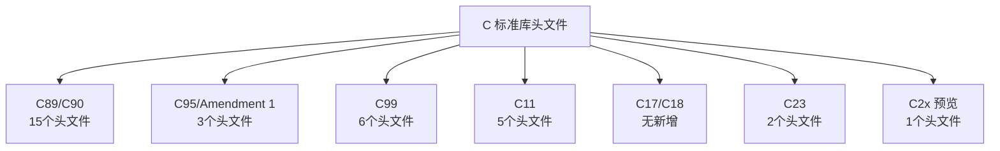

+++
title = "第 17 章：标准库常用函数汇总"
weight = 170
date = "2026-03-29T22:34:00+08:00"
type = "docs"
description = ""
isCJKLanguage = true
draft = false
+++

# 第 17 章：标准库常用函数汇总

> "不要重复造轮子"——这是程序员的第一金律。C 语言标准库就是那个轮子仓库，里面装满了各种现成的、好用的工具函数。本章我们就来清点这个大仓库，看看里面有哪些宝贝可以让我们事半功倍！

想象一下，你要写一个程序，需要生成随机数、排序数组、处理时间、计算数学公式……如果你从头开始写这些功能，不仅费时费力，还容易出错（你写的排序算法能有 C 标准库里的 `qsort` 快吗？大概率没有！）。幸运的是，C 语言给你准备了一个超级工具箱——**标准库**。

所谓**标准库**（Standard Library），就是 C 语言标准委员会帮你写好的一系列函数和宏，**任何符合标准的 C 编译器都必须实现这些功能**。也就是说，你在 Windows 上用 MSVC、在 Linux 上用 GCC、在 Mac 上用 Clang，标准库函数的行为应该是一样的（至少大部分是这样）。

标准库函数分散在各种**头文件**（header file）中，头文件的后缀是 `.h`。当你 `#include <xxx.h>` 时，就相当于把那些函数的"说明书"引入到你的代码里，然后你就可以调用它们了。

下面我们就按功能分类，逐个拆解那些最常用的标准库函数。让我们开始这场"工具箱探险"吧！

---

## 17.1 `<stdlib.h>`——万能工具箱

`<stdlib.h>` 是 C 标准库中最"全能"的一个头文件，它的名字 stands for **standard library**（标准库）。这个头文件里装的东西五花八门：内存管理、进程控制、随机数、排序查找、环境变量……堪称程序员瑞士军刀。

### 17.1.1 程序退出时的"遗言"——`atexit` 和 `at_quick_exit`

你有没有遇到过这种情况：你的程序做了一堆事情，在退出的时候你还想做点"收尾工作"，比如**关闭打开的文件**、**保存最后的日志**、**释放你手动申请的内存**。这时候，`atexit` 就是你的贴心小助手！

`atexit` 的作用是**注册一个在程序正常退出时自动调用的函数**。你可以注册多个退出处理函数，它们会按照**注册的反顺序**被调用（后注册的先执行）。

```c
#include <stdio.h>
#include <stdlib.h>

void cleanup(void) {
    printf("👋 程序要退出了，我在做最后的清理工作！\n");
}

void cleanup2(void) {
    printf("📝 正在保存日志...\n");
}

int main(void) {
    // 注册退出处理函数
    atexit(cleanup);   // 先注册，先被调用...不对！
    atexit(cleanup2);  // 后注册，后调用...不对不对！

    // 实际上执行顺序是反的：后注册的先执行
    printf("程序正在运行...\n");

    return 0;
    // 程序退出时会自动调用 cleanup2，然后 cleanup
}
```

执行结果：

```
程序正在运行...
📝 正在保存日志...
👋 程序要退出了，我在做最后的清理工作！
```

> **为什么是反顺序？** 想象你往桌子上叠盘子（push），拿的时候是从最上面开始拿（pop）。这种"后进先出"（LIFO）的顺序可以保证清理工作的正确性——比如你后打开的文件应该先关闭。

`atexit` 注册的函数在以下情况会被调用：
- `main` 函数正常返回
- 调用 `exit()` 函数
- 程序正常结束

与之对应的，`at_quick_exit`（C99 引入）是专门为**快速退出**场景设计的，它注册的函数只在调用 `quick_exit()` 时被调用，而不在 `exit()` 或 `main` 返回时被调用。

```c
#include <stdio.h>
#include <stdlib.h>

void quick_cleanup(void) {
    printf("⚡ 快速清理中，不刷新缓冲区！\n");
}

int main(void) {
    at_quick_exit(quick_cleanup);

    printf("准备快速退出...\n");
    quick_exit(0);  // 这会调用 quick_cleanup，但不会刷新 stdout 缓冲区

    // 这行不会执行
    printf("这行永远不会出现！\n");

    return 0;
}
```

> **什么时候用 `at_quick_exit`？** 当你的程序在某些紧急情况下需要立即退出（比如收到了某个致命信号），但又想做点必要清理时。但要注意，快速退出**不会刷新标准输出缓冲区**，所以如果你有未打印的输出，它们可能就丢了！

### 17.1.2 程序终止三兄弟——`exit`、`_Exit` 和 `abort`

程序退出的方式也是一门学问！C 语言给你提供了三种终止程序的"套餐"：

**套餐一：`exit()`——有礼貌地告别**

`exit()` 是最"正规"的退出方式，它会：
1. 调用所有通过 `atexit()` 注册的退出处理函数（按注册的反序）
2. **刷新所有标准库的缓冲区**（把还没写完的数据赶紧写完）
3. 关闭所有打开的标准 I/O 流
4. 返回退出状态码给操作系统

```c
#include <stdio.h>
#include <stdlib.h>

void cleanup(void) {
    printf("✅ 清理完成，缓冲区已刷新！\n");
}

int main(void) {
    atexit(cleanup);

    printf("正在写入重要数据...");  // 注意：没有 \n

    // 模拟某个致命错误
    printf("哎呀，遇到严重问题！\n");

    exit(1);  // 退出，状态码 1 表示异常退出
    // printf("这里不会执行！\n");

    return 0;
}
```

**退出状态码小知识**：在 Unix/Linux 系统中，`exit(0)` 表示程序正常退出，非零值表示异常。`exit(1)` 是最常见的异常退出码，Windows 也认这个。

**套餐二：`_Exit()`——冷酷无情，直接消失**

`_Exit()`（C99 引入，在 `<stdlib.h>` 中）就像按下电脑的**电源键**——立即断电，不给你任何反应时间：
- **不调用** `atexit` 注册的函数
- **不刷新** 任何缓冲区
- **不执行** 任何清理工作

```c
#include <stdio.h>
#include <stdlib.h>

void cleanup(void) {
    // 这个函数永远不会有机会执行
    printf("清理？我连出场的机会都没有！\n");
}

int main(void) {
    atexit(cleanup);

    printf("数据还没保存好...");
    _Exit(0);  // 直接消失！连缓冲区的数据都丢了

    return 0;
}
```

> **什么时候用 `_Exit`？** 主要在**守护进程**（daemon）或**fork 后的子进程**中，如果子进程不想继承父进程的任何清理行为，可以用 `_Exit` 快速了断。另外，如果你的程序已经严重损坏（比如堆内存都乱了），调用 `atexit` 可能反而导致崩溃，这时用 `_Exit` 更安全。

**套餐三：`abort()`——自杀式退出，还留"遗书"**

`abort()` 有点戏剧性：
- **不调用** `atexit` 函数
- **不刷新** 缓冲区
- 向程序发送 `SIGABRT` 信号（默认会终止程序并可能生成 core dump）

```c
#include <stdio.h>
#include <stdlib.h>

void cleanup(void) {
    printf("这个函数不会被调用！\n");
}

int main(void) {
    atexit(cleanup);

    printf("程序遇到了无法恢复的错误！\n");

    abort();  // 自杀！发送 SIGABRT 信号

    printf("永远不会执行到这里\n");

    return 0;
}
```

> **Core dump 是什么？** 简单说就是程序"自杀"时留给警察的"遗书"——它记录了程序挂掉时的内存状态，程序员可以用 gdb 之类的工具分析它来找 bug。不过在 Windows 上，这个概念叫"转储文件"。

**三者对比总结**：

| 特性 | `exit()` | `_Exit()` | `abort()` |
|------|---------|-----------|-----------|
| 调用 atexit 处理函数 | ✅ | ❌ | ❌ |
| 刷新缓冲区 | ✅ | ❌ | ❌ |
| 发送信号 | ❌ | ❌ | ✅ (SIGABRT) |
| 可指定退出码 | ✅ | ✅ | ❌（总是返回非零） |

**实战建议**：普通情况下用 `exit()` 就行，它最"体面"。只有在你明确知道不需要清理时，才考虑后两者。

### 17.1.3 快速退出不等待——`quick_exit`

前面已经稍微提过，`quick_exit`（C99）是 `exit` 的"快速通道"版本：

```c
#include <stdio.h>
#include <stdlib.h>

void fast_cleanup(void) {
    printf("⚡ 快速清理完成！\n");
}

int main(void) {
    at_quick_exit(fast_cleanup);

    printf("程序运行中...\n");

    // 在某些紧急情况下
    if (1) {  // 假设这是某个紧急条件
        quick_exit(0);  // 快速撤退！
    }

    return 0;
}
```

> **与 `exit()` 的核心区别**：普通 `exit()` 会刷新所有标准 I/O 缓冲区（`stdout`、`stderr` 等），这可能需要等待磁盘写入完成。`quick_exit()` 直接跳到"逃跑"环节，不等你收拾行李。如果你有一大堆数据还在内存缓冲区里没写到磁盘，用 `quick_exit()` 它们就**灰飞烟灭**了！

### 17.1.4 在 C 程序里"喊话"——`system`

你有没有想过：**能不能在 C 程序里执行 shell 命令？** 比如在 C 程序里调用 `ls`、`dir`、`notepad` 之类的系统命令？当然可以！`system` 函数就是那个"传声筒"。

```c
#include <stdio.h>
#include <stdlib.h>

int main(void) {
    printf("我要在 C 程序里执行一个 shell 命令！\n\n");

    // 调用系统的 ls 命令（Linux/Mac）或 dir 命令（Windows）
    system("ls -la");  // Linux/Mac
    // system("dir");  // Windows

    printf("\n命令执行完毕，回到 C 程序了！\n");

    return 0;
}
```

> **注意事项**：
> - `system` 会调用操作系统的命令行解释器（shell），所以它**非常强大**，但也**非常危险**——如果你的命令来自用户输入，务必小心**命令注入攻击**！
> - 在 Windows 上，`system("notepad")` 会打开记事本，程序会"卡住"直到你关闭记事本。

**更安全的替代方案**（C11）：`system_chk` 函数——它会检查缓冲区大小，防止溢出：

```c
#include <stdio.h>
#include <stdlib.h>

int main(void) {
    char command[] = "ls -la";
    size_t size = sizeof(command);

    // system_chk 在 C11 引入，会检查命令是否超过指定大小
    system_chk(command, size);  // 更安全！

    return 0;
}
```

### 17.1.5 环境变量操作——`getenv`、`setenv` 和 `putenv`

**环境变量**（environment variables）是操作系统传递给程序的"配置信息"。比如 `PATH` 告诉系统去哪里找可执行文件，`HOME` 记录你的主目录在哪。在 C 程序里，你可以读取甚至修改这些变量。

**读取环境变量——`getenv`**

```c
#include <stdio.h>
#include <stdlib.h>

int main(void) {
    // 读取 PATH 环境变量
    char *path = getenv("PATH");

    if (path != NULL) {
        printf("🔍 PATH 环境变量内容是：\n%s\n", path);
    } else {
        printf("PATH 环境变量不存在！\n");
    }

    // 读取 HOME（在 Windows 上是 USERPROFILE）
    char *home = getenv("HOME");  // Linux/Mac
    if (home == NULL) {
        home = getenv("USERPROFILE");  // Windows 备用
    }

    if (home != NULL) {
        printf("\n🏠 主目录：%s\n", home);
    }

    return 0;
}
```

**C11 安全版本——`getenv_s`**：

```c
#include <stdio.h>
#include <stdlib.h>
#include <string.h>

int main(void) {
    char buffer[1024];
    size_t buffer_size = sizeof(buffer);

    // getenv_s 是安全版本，会检查缓冲区大小
    errno_t err = getenv_s(&buffer_size, buffer, buffer_size, "PATH");

    if (err == 0) {
        printf("PATH = %s\n", buffer);
    } else {
        printf("读取 PATH 失败或缓冲区太小！\n");
    }

    return 0;
}
```

**修改环境变量——`setenv` 和 `putenv`**

```c
#include <stdio.h>
#include <stdlib.h>

int main(void) {
    // 读取原来的值
    char *old_value = getenv("MY_VAR");

    printf("原来的 MY_VAR = %s\n", old_value ? old_value : "(未设置)");

    // 设置新的值
    // setenv 需要三个参数：变量名、新值、是否覆盖（1=覆盖，0=不覆盖）
    if (setenv("MY_VAR", "Hello from setenv!", 1) == 0) {
        printf("✅ 设置成功！\n");
        printf("新的 MY_VAR = %s\n", getenv("MY_VAR"));
    } else {
        perror("setenv 失败");
    }

    // 用 putenv 也可以（但注意：putenv 可能会直接使用传入的字符串）
    putenv("ANOTHER_VAR=Hello from putenv!");
    printf("ANOTHER_VAR = %s\n", getenv("ANOTHER_VAR"));

    return 0;
}
```

> **`setenv` vs `putenv` 的区别**：
> - `setenv`：会**复制**你传入的字符串，所以原字符串你可以随便改
> - `putenv`：可能**直接使用**你传入的字符串（不复制），如果之后你修改或释放这个字符串，可能导致未定义行为
> - 建议优先使用 `setenv`，更安全！

### 17.1.6 二分查找神器——`bsearch` 和 `bsearch_s`

想象你在字典里找一个词——你会从第一页一页一页翻吗？当然不会！你会**直接翻到中间**，看看目标在左边还是右边，然后继续在对应的一半里找。这就是**二分查找**（binary search）的思想——比傻傻地从头到尾找快多了！

`bsearch` 就是 C 语言标准库里帮你实现二分查找的函数。

```c
#include <stdio.h>
#include <stdlib.h>

// 比较函数：告诉 bsearch 怎么比较两个元素
int compare_int(const void *a, const void *b) {
    int *pa = (int *)a;
    int *pb = (int *)b;
    return *pa - *pb;  // 返回负数表示 a<b，正数表示 a>b，0表示相等
}

int main(void) {
    // 注意：数组必须是有序的！二分查找的前提是有序数组
    int arr[] = {1, 5, 10, 15, 20, 25, 30, 35, 40, 50};
    int n = sizeof(arr) / sizeof(arr[0]);

    int target = 25;

    // bsearch 的参数：
    // key: 要找的东西
    // base: 数组的起始地址
    // num: 数组元素个数
    // width: 每个元素的大小（字节数）
    // comparison: 比较函数
    int *result = bsearch(&target, arr, n, sizeof(int), compare_int);

    if (result != NULL) {
        printf("🎯 找到了！%d 在数组的第 %ld 个位置（从0开始）\n",
               *result, result - arr);
    } else {
        printf("❌ 没找到 %d\n", target);
    }

    // 再找一个不存在的
    target = 27;
    result = bsearch(&target, arr, n, sizeof(int), compare_int);
    if (result == NULL) {
        printf("❌ %d 不在数组中\n", target);
    }

    return 0;
}
```

输出：

```
🎯 找到了！25 在数组的第 5 个位置（从0开始）
❌ 27 不在数组中
```

**为什么二分查找这么快？**

假设你有 100 万个元素：
- **线性查找**：最坏情况要比较 100 万次
- **二分查找**：最多只需要 log₂(1000000) ≈ 20 次！

差距就是这么大！这就是为什么二分查找是面试题里的常客。

**C11 安全版本——`bsearch_s`**：

```c
#include <stdio.h>
#include <stdlib.h>

int compare_int_s(const void *a, const void *b, void *ctx) {
    (void)ctx;  // 这个例子不用 context
    return (*(int *)a) - (*(int *)b);
}

int main(void) {
    int arr[] = {1, 5, 10, 15, 20, 25, 30, 35, 40, 50};
    int n = sizeof(arr) / sizeof(arr[0]);
    int target = 15;

    int *result = bsearch_s(&target, arr, n, sizeof(int), compare_int_s, NULL);

    if (result != NULL) {
        printf("找到了：%d\n", *result);
    }

    return 0;
}
```

> **`bsearch_s` 的改进**：它额外接收一个 `context` 参数，可以传递给比较函数。这在某些复杂场景下很有用——比如你需要在比较函数里访问某些全局状态。

### 17.1.7 排序不用自己写——`qsort` 和 `qsort_s`

排序是编程中最常见的需求之一。想象你有一堆乱序的扑克牌，要把它们按从小到大的顺序排好——你会怎么写代码？冒泡排序？选择排序？插入排序？

**别写了！** C 标准库给你准备好了 `qsort`（quick sort，快速排序），它比你写的任何"教科书式排序"都快得多！

```c
#include <stdio.h>
#include <stdlib.h>

// 比较函数
int compare_int(const void *a, const void *b) {
    int *pa = (int *)a;
    int *pb = (int *)b;
    return *pa - *pb;  // 升序排列
}

int main(void) {
    int arr[] = {64, 34, 25, 12, 22, 11, 90, 5, 77, 30};
    int n = sizeof(arr) / sizeof(arr[0]);

    printf("排序前：");
    for (int i = 0; i < n; i++) {
        printf("%d ", arr[i]);
    }
    printf("\n");

    // qsort 的参数：
    // base: 数组起始地址
    // num: 元素个数
    // width: 每个元素大小（字节）
    // comparison: 比较函数
    qsort(arr, n, sizeof(int), compare_int);

    printf("排序后：");
    for (int i = 0; i < n; i++) {
        printf("%d ", arr[i]);
    }
    printf("\n");

    return 0;
}
```

输出：

```
排序前：64 34 25 12 22 11 90 5 77 30
排序后：5 11 12 22 25 30 34 64 77 90
```

**搞定！** 你只需要写一个简单的比较函数，剩下的交给 `qsort`。

**排序字符串**：

```c
#include <stdio.h>
#include <stdlib.h>
#include <string.h>

int compare_str(const void *a, const void *b) {
    // a 和 b 是 char*，要比较字符串要用 strcmp
    char *sa = *(char **)a;  // 注意：传入的是指针数组，所以 a 是 char**
    char *sb = *(char **)b;
    return strcmp(sa, sb);  // strcmp 本身就返回负/正/0
}

int main(void) {
    char *fruits[] = {"banana", "apple", "cherry", "date", "elderberry"};
    int n = sizeof(fruits) / sizeof(fruits[0]);

    printf("排序前：");
    for (int i = 0; i < n; i++) {
        printf("%s ", fruits[i]);
    }
    printf("\n");

    qsort(fruits, n, sizeof(char *), compare_str);

    printf("排序后：");
    for (int i = 0; i < n; i++) {
        printf("%s ", fruits[i]);
    }
    printf("\n");

    return 0;
}
```

**C11 安全版本——`qsort_s`**：

```c
#include <stdio.h>
#include <stdlib.h>

int compare_s(const void *a, const void *b, void *ctx) {
    (void)ctx;
    return (*(int *)a) - (*(int *)b);
}

int main(void) {
    int arr[] = {3, 1, 4, 1, 5, 9, 2, 6, 5, 3, 5};
    int n = sizeof(arr) / sizeof(arr[0]);

    qsort_s(arr, n, sizeof(int), compare_s, NULL);

    printf("排序后：");
    for (int i = 0; i < n; i++) {
        printf("%d ", arr[i]);
    }
    printf("\n");

    return 0;
}
```

> **`qsort` vs 自己写排序**：C 标准库的 `qsort` 实现经过了无数优化，使用了各种"花活"（比如小数组用插入排序、三数取中划分 pivot 等）。除非你有特殊需求，否则**永远用 `qsort`**！

### 17.1.8 随机数家族——`rand`、`srand` 和 `RAND_MAX`

编程中经常需要**随机数**：游戏里骰子的点数、抽奖程序、密码生成……都离不开它。C 标准库通过 `<stdlib.h>` 提供了**伪随机数生成器**（PRNG，Pseudo-Random Number Generator）。

**基础用法——`rand` 和 `RAND_MAX`**

```c
#include <stdio.h>
#include <stdlib.h>

int main(void) {
    // 打印随机数（默认种子是 1，每次程序启动都得到相同序列）
    printf("第一个随机数：%d\n", rand());
    printf("第二个随机数：%d\n", rand());
    printf("第三个随机数：%d\n", rand());

    // RAND_MAX 是 rand 能返回的最大值
    printf("\nRAND_MAX = %d\n", RAND_MAX);
    printf("随机数范围：0 ~ %d\n", RAND_MAX);

    return 0;
}
```

**问题**：如果你直接运行上面的代码，每次运行的结果都是**一样的**！这是因为 `rand` 默认使用固定的种子（seed）。要让它"真正随机"，你需要设置一个**不同的种子**。

**设置种子——`srand`**

```c
#include <stdio.h>
#include <stdlib.h>
#include <time.h>  // time() 函数在这里

int main(void) {
    // 用当前时间作为种子——这样每次运行结果都不一样！
    srand((unsigned int)time(NULL));

    printf("随机数 1：%d\n", rand());
    printf("随机数 2：%d\n", rand());
    printf("随机数 3：%d\n", rand());

    return 0;
}
```

> **为什么用 `time(NULL)`？** 因为时间是不断变化的，每次程序运行时 `time()` 返回的值都不一样，所以种子不同，随机数序列也不同。

**生成指定范围的随机数**：

```c
#include <stdio.h>
#include <stdlib.h>
#include <time.h>

int main(void) {
    srand((unsigned int)time(NULL));

    // 生成 1~100 的随机整数
    int num1 = (rand() % 100) + 1;
    printf("1~100 的随机数：%d\n", num1);

    // 生成 0~99 的随机整数
    int num2 = rand() % 100;
    printf("0~99 的随机数：%d\n", num2);

    // 更均匀的分布（推荐方法）
    // 生成 [min, max] 范围的随机数
    int min = 10, max = 50;
    int num3 = min + (rand() % (max - min + 1));
    printf("%d~%d 的随机数：%d\n", min, max, num3);

    return 0;
}
```

> **小心 `rand() % n` 的陷阱**：对于小的模数，`rand() % n` 的分布可能不那么均匀（取决于 RAND_MAX 的大小）。如果对随机性要求很高，可以考虑更高级的随机数生成算法（比如 Mersenne Twister）。

### 17.1.9 C23 新玩具——`getdelim` 和 `getline`

C23 引入了两个新函数，让读取**包含特殊字符的行**变得更简单。以前用 `fgets` 读取一行有个问题：你得预先知道行的长度，如果行太长就会截断。`getline` 和 `getdelim` 可以帮你**动态分配缓冲区**，想读多长就读多长！

**`getline`——读取一整行，自动处理任意长度**

```c
#include <stdio.h>
#include <stdlib.h>

int main(void) {
    char *line = NULL;       // 缓冲区，初始为 NULL
    size_t len = 0;         // 缓冲区大小
    ssize_t nread;          // 实际读取的字符数

    printf("请输入一些文字（按 Ctrl+D/Ctrl+Z 结束输入）：\n");

    // getline 会自动分配/重新分配内存
    while ((nread = getline(&line, &len, stdin)) != -1) {
        printf("读取了 %zd 个字符，内容是：%s", nread, line);
    }

    free(line);  // 重要：记得释放内存！
    return 0;
}
```

> **`getline` 的优点**：它会帮你自动分配内存（如果缓冲区是 NULL 或太小），你不需要预先猜测行有多长！`nread` 返回实际读取的字符数（不包括结尾的 `\0`）。

**`getdelim`——自定义分隔符的读取**

```c
#include <stdio.h>
#include <stdlib.h>

int main(void) {
    char *line = NULL;
    size_t len = 0;
    ssize_t nread;

    // 假设我们要读取 CSV 格式的数据（用逗号分隔）
    // 每次遇到逗号就返回一次
    printf("输入 CSV 格式数据（用逗号分隔）：\n");

    // 这里用 '\n' 作为分隔符，所以和 getline 效果类似
    // 但你可以改成逗号或其他字符
    while ((nread = getdelim(&line, &len, ',', stdin)) != -1) {
        printf("读取到字段：%s（共 %zd 个字符）\n", line, nread);
    }

    free(line);
    return 0;
}
```

> **什么时候用 `getdelim`？** 当你处理**特定分隔符**的文件时很有用，比如 CSV（逗号分隔）、TSV（制表符分隔）等。

---

## 17.2 `<time.h>`——和时间做朋友

时间是我们每天都打交道的东西，程序也不例外：记录日志时间戳、测量程序运行时间、倒计时、显示日期……`<time.h>` 就是 C 语言处理时间的工具箱。

### 17.2.1 三种时间"面孔"——`time`、`difftime` 和 `clock`

C 语言里有多种"时间概念"，让我们一一认识：

**`time_t`——日历时间（Calendar Time）**

`time_t` 是一个表示"从某个固定起点到现在经过的秒数"的类型。在 Unix 系统中，这个起点是 **1970 年 1 月 1 日 00:00:00 UTC**（被称为"Unix 纪元"或"Epoch"）。在 Windows 上也是类似的概念。

```c
#include <stdio.h>
#include <time.h>

int main(void) {
    time_t now;

    // time() 获取当前时间
    now = time(NULL);  // NULL 表示我们不需要存储到变量，直接返回值

    printf("从 Unix 纪元到现在已经过了 %ld 秒！\n", (long)now);

    // 转换成可读的时间字符串
    printf("也就是：%s", ctime(&now));  // ctime 直接打印时间

    return 0;
}
```

**`difftime`——计算两个时间点的差距**

有时候你需要计算**时间差**（比如程序运行了多久）：

```c
#include <stdio.h>
#include <time.h>

int main(void) {
    time_t start, end;
    double seconds;

    start = time(NULL);

    // 模拟一些耗时操作
    printf("开始执行一个耗时的任务...\n");
    for (volatile long i = 0; i < 1000000000L; i++) {}  // 空循环，消耗 CPU 时间

    end = time(NULL);

    // difftime 计算两个 time_t 的差值（返回 double，单位秒）
    seconds = difftime(end, start);

    printf("任务完成了！\n");
    printf("实际耗时：%.2f 秒\n", seconds);

    return 0;
}
```

**`clock`——CPU 时钟（Processor Time）**

`time()` 返回的是"墙上的时钟"时间，而 `clock()` 返回的是**程序本身消耗的 CPU 时间**。这两个有什么区别？

- **墙上时钟时间（Wall Clock Time）**：从你启动程序到结束，总共过去了多少真实时间
- **CPU 时间（CPU Time）**：你的程序实际在 CPU 上运行了多久（不包括等待 I/O、sleep 等时间）

```c
#include <stdio.h>
#include <time.h>

int main(void) {
    clock_t start, end;

    start = clock();

    // 模拟一些计算密集型任务
    long sum = 0;
    for (long i = 0; i < 1000000000L; i++) {
        sum += i;
    }

    end = clock();

    // CLOCKS_PER_SEC 是每秒包含的时钟 "刻度" 数
    double cpu_time_used = ((double)(end - start)) / CLOCKS_PER_SEC;

    printf("CPU 时间：%.6f 秒\n", cpu_time_used);
    printf("sum = %ld\n", sum);

    return 0;
}
```

> **什么时候用 `time()`，什么时候用 `clock()`？** 
> - 如果你想知道程序**运行了多久**（包括等待时间），用 `time()`
> - 如果你想知道程序**实际消耗了多少 CPU 资源**，用 `clock()`
> - 在性能分析时，`clock()` 通常更准确反映纯计算任务的耗时

### 17.2.2 分解时间——`struct tm`

`time_t` 是一个大数字，对人类来说不友好。"1523484672 秒"是什么鬼？我们要的是 **2024年3月25日 15:30:42** 这种人类能看懂的时间格式。

`struct tm` 就是那个"分解时间"的结构体，它把时间拆成了一个个零件：

```c
struct tm {
    int tm_sec;    // 秒（0-60，60 是闰秒）
    int tm_min;    // 分钟（0-59）
    int tm_hour;   // 小时（0-23）
    int tm_mday;   // 一个月中的第几天（1-31）
    int tm_mon;    // 月份（0-11，0 表示一月！）⚠️
    int tm_year;   // 年份，从 1900 年开始 ⚠️
    int tm_wday;   // 一周中的第几天（0-6，0 表示周日）
    int tm_yday;   // 一年中的第几天（0-365）
    int tm_isdst;  // 夏令时标志（>0=启用，0=未启用，-1=未知）
};
```

> **⚠️ 两个容易踩的坑**：
> 1. **`tm_mon` 从 0 开始**：0 = 一月，1 = 二月，……，11 = 十二月。如果你直接打印 `tm_mon`，记得 `+1`！
> 2. **`tm_year` 是从 1900 开始的年份差**：如果 `tm_year = 124`，实际年份是 2024 年（1900 + 124 = 2024）

```c
#include <stdio.h>
#include <time.h>

int main(void) {
    time_t now = time(NULL);

    // localtime 把 time_t 转换成 struct tm（本地时间）
    struct tm *tm_local = localtime(&now);

    printf("当前时间（分解格式）：\n");
    printf("  年份：%d\n", tm_local->tm_year + 1900);  // ⚠️ 要加 1900
    printf("  月份：%d\n", tm_local->tm_mon + 1);       // ⚠️ 要加 1
    printf("  日期：%d\n", tm_local->tm_mday);
    printf("  小时：%d\n", tm_local->tm_hour);
    printf("  分钟：%d\n", tm_local->tm_min);
    printf("  秒数：%d\n", tm_local->tm_sec);
    printf("  星期：%d（0=周日，1=周一...）\n", tm_local->tm_wday);
    printf("  一年中的第 %d 天\n", tm_local->tm_yday + 1);

    if (tm_local->tm_isdst > 0) {
        printf("  夏令时：已启用 ☀️\n");
    } else if (tm_local->tm_isdst == 0) {
        printf("  夏令时：未启用\n");
    } else {
        printf("  夏令时：未知\n");
    }

    return 0;
}
```

**`gmtime` vs `localtime`**：

- `localtime`：返回**本地时间**（考虑时区和夏令时）
- `gmtime`：返回 **UTC 时间**（格林威治标准时间，不当时区）

```c
#include <stdio.h>
#include <time.h>

int main(void) {
    time_t now = time(NULL);

    struct tm *utc = gmtime(&now);
    struct tm *local = localtime(&now);

    printf("UTC 时间：%d年%d月%d日 %02d:%02d:%02d\n",
           utc->tm_year + 1900, utc->tm_mon + 1, utc->tm_mday,
           utc->tm_hour, utc->tm_min, utc->tm_sec);

    printf("本地时间：%d年%d月%d日 %02d:%02d:%02d\n",
           local->tm_year + 1900, local->tm_mon + 1, local->tm_mday,
           local->tm_hour, local->tm_min, local->tm_sec);

    return 0;
}
```

> **如果你是北京时间（UTC+8），你会看到 `gmtime` 的时间比 `localtime` 少 8 小时**。

**C11 安全版本——`localtime_s` 和 `gmtime_s`**：

传统的 `localtime` 和 `gmtime` 存在**线程安全问题**——它们返回的是指向静态变量的指针，多线程同时调用可能会互相覆盖！C11 引入了安全版本：

```c
#include <stdio.h>
#include <time.h>
#include <string.h>

int main(void) {
    time_t now = time(NULL);
    struct tm result;
    char buf[100];

    // localtime_s 是线程安全的版本
    errno_t err = localtime_s(&result, &now);

    if (err == 0) {
        printf("本地时间：%d年%d月%d日\n",
               result.tm_year + 1900,
               result.tm_mon + 1,
               result.tm_mday);

        // 还可以顺便获取格式化字符串
        strftime(buf, sizeof(buf), "%Y-%m-%d %H:%M:%S", &result);
        printf("格式化输出：%s\n", buf);
    }

    return 0;
}
```

> **POSIX 也有对应的线程安全版本**：`localtime_r()` 和 `gmtime_r()`，它们在 Linux/Mac 上广泛使用，和 C11 的 `_s` 版本参数顺序略有不同。

### 17.2.3 格式化时间字符串——`strftime`

`strftime` 是 C 语言里最强大的**时间格式化**函数。你可以像 `printf` 控制数字输出那样，控制时间字符串的格式。

```c
#include <stdio.h>
#include <time.h>

int main(void) {
    time_t now = time(NULL);
    struct tm *t = localtime(&now);

    char buf[200];

    // 各种格式化输出
    strftime(buf, sizeof(buf), "%Y-%m-%d", t);
    printf("日期（ISO 格式）：%s\n", buf);

    strftime(buf, sizeof(buf), "%H:%M:%S", t);
    printf("时间：%s\n", buf);

    strftime(buf, sizeof(buf), "%Y-%m-%d %H:%M:%S", t);
    printf("完整时间：%s\n", buf);

    strftime(buf, sizeof(buf), "%A, %B %d, %Y", t);
    printf("英文全写：%s\n", buf);

    strftime(buf, sizeof(buf), "今天是 %Y 年第 %j 天", t);
    printf("今天是 %s\n", buf);

    strftime(buf, sizeof(buf), "%p %I:%M %Z", t);
    printf("12小时制：%s\n", buf);

    return 0;
}
```

**常用格式符一览**：

| 格式符 | 含义 | 示例 |
|--------|------|------|
| `%Y` | 四位年份 | 2024 |
| `%y` | 两位年份 | 24 |
| `%m` | 月份（01-12） | 03 |
| `%d` | 日期（01-31） | 25 |
| `%H` | 小时（00-23） | 14 |
| `%M` | 分钟（00-59） | 30 |
| `%S` | 秒（00-60） | 45 |
| `%A` | 星期几（全名） | Monday |
| `%a` | 星期几（缩写） | Mon |
| `%B` | 月份（全名） | March |
| `%b` | 月份（缩写） | Mar |
| `%j` | 一年中的第几天（001-366） | 085 |
| `%p` | AM/PM | PM |
| `%I` | 12 小时制小时 | 02 |
| `%Z` | 时区名 | CST |
| `%c` | 标准的日期和时间 | Mon Mar 25 14:30:45 2024 |
| `%x` | 标准日期 | 03/25/24 |
| `%X` | 标准时间 | 14:30:45 |

> **C99 新增的格式符**（`*` 表示 C99 引入）：
> - `%E` / `%O`：用于替代格式（locale-specific）
> - `%g` / `%G`：ISO 周年份
> - `%u`：ISO 星期几（1-7）
> - `%V`：ISO 周数

### 17.2.4 `mktime`——从分解时间到日历时间

前面我们学了 `localtime`（`time_t` → `struct tm`），`mktime` 做的是**相反的事情**：把 `struct tm` 转换成 `time_t`。

```c
#include <stdio.h>
#include <time.h>

int main(void) {
    // 构造一个特定的时间：2025年1月1日 0点0分0秒
    struct tm t = {
        .tm_sec = 0,
        .tm_min = 0,
        .tm_hour = 0,
        .tm_mday = 1,
        .tm_mon = 0,     // 0 = January！
        .tm_year = 125   // 125 = 2025 - 1900
    };

    // mktime 会自动"规范化" tm 结构体
    // 比如如果 tm_wday 填错了，它会自动计算正确的值
    time_t timestamp = mktime(&t);

    printf("2025年1月1日 0点0分0秒（本地时间）对应的 time_t：%ld\n", (long)timestamp);
    printf("转换回来：%s", ctime(&timestamp));

    // 注意：mktime 使用本地时区！
    // 如果你在北京时间（UTC+8），mktime 会把 struct tm 当作本地时间来计算

    return 0;
}
```

> **`mktime` 的"魔法"**：如果你传入的 `struct tm` 里某些字段是无效的（比如 `tm_wday` 填错了，或者月份填了 15），`mktime` 会**自动帮你纠正**！它会算出正确的对应日期。这叫"time normalization"。

### 17.2.5 C11 高精度时间——`timespec_get`

`time()` 返回的精度是**秒**，但有时候我们需要**更高精度**的时间，比如毫秒、微秒、纳秒。C11 引入了 `timespec_get`，可以获取**纳秒级**的精度！

```c
#include <stdio.h>
#include <time.h>

int main(void) {
    struct timespec ts;

    // TIME_UTC 是目前唯一标准化的时钟类型
    timespec_get(&ts, TIME_UTC);

    printf("当前时间（纳秒精度）：\n");
    printf("  秒：%ld\n", (long)ts.tv_sec);
    printf("  纳秒：%ld\n", (long)ts.tv_nsec);
    printf("  总秒数：%lf\n", ts.tv_sec + ts.tv_nsec / 1000000000.0);

    return 0;
}
```

**C23 新增——`timespec_getres`**：

```c
#include <stdio.h>
#include <time.h>

int main(void) {
    struct timespec res;

    // 获取时钟分辨率（最小时间单位）
    timespec_getres(&res, TIME_UTC);

    printf("时钟分辨率为：%ld 秒 %ld 纳秒\n",
           (long)res.tv_sec, (long)res.tv_nsec);

    return 0;
}
```

> **什么是时钟分辨率？** 就是系统时钟的"最小刻度"。如果分辨率是 1 毫秒，那说明系统只能精确到 1 毫秒，更小的时间差会被四舍五入。通常系统时钟分辨率在纳秒到毫秒之间，取决于硬件和操作系统。

### 17.2.6 线程安全的本地时间和 UTC 时间

前面提过，传统 `localtime` 和 `gmtime` 不是线程安全的，C11 提供了安全版本：

```c
#include <stdio.h>
#include <time.h>
#include <string.h>
#include <errno.h>

int main(void) {
    time_t now = time(NULL);
    struct tm result;

    // localtime_s：线程安全的本地时间
    if (localtime_s(&result, &now) == 0) {
        char buf[100];
        strftime(buf, sizeof(buf), "%Y-%m-%d %H:%M:%S %Z", &result);
        printf("本地时间（线程安全）：%s\n", buf);
    }

    // gmtime_s：线程安全的 UTC 时间
    if (gmtime_s(&result, &now) == 0) {
        char buf[100];
        strftime(buf, sizeof(buf), "%Y-%m-%d %H:%M:%S UTC", &result);
        printf("UTC 时间（线程安全）：%s\n", buf);
    }

    return 0;
}
```

> **POSIX 的 `localtime_r` / `gmtime_r`**：在 Linux 和 macOS 上，你也可以用 POSIX 标准的 `localtime_r()` 和 `gmtime_r()`，它们的用法类似：
> ```c
> struct tm result;
> localtime_r(&now, &result);  // 参数顺序和 localtime_s 不同！
> ```

---

## 17.3 `<ctype.h>`——字符分类与转换

想象你在做一个"用户名验证"功能：用户名只能包含字母和数字，不能有特殊字符。这时候 `<ctype.h>` 就是你的好帮手——它提供了一系列**字符分类函数**，帮你快速判断一个字符是什么类型。

```c
#include <stdio.h>
#include <ctype.h>

int main(void) {
    char c;

    // 测试各种字符
    printf("字符分类测试：\n\n");

    c = 'A';
    printf("'%c': isalpha=%d, isupper=%d, isdigit=%d, isalnum=%d\n",
           c, isalpha(c), isupper(c), isdigit(c), isalnum(c));

    c = 'a';
    printf("'%c': isalpha=%d, islower=%d, isdigit=%d, isalnum=%d\n",
           c, isalpha(c), islower(c), isdigit(c), isalnum(c));

    c = '5';
    printf("'%c': isdigit=%d, isalpha=%d, isalnum=%d\n",
           c, isdigit(c), isalpha(c), isalnum(c));

    c = ' ';
    printf("'%c' (空格): isspace=%d, isprint=%d\n",
           c, isspace(c), isprint(c));

    c = '\n';
    printf("'\\n' (换行): isspace=%d, iscntrl=%d\n",
           c, isspace(c), iscntrl(c));

    c = '!';
    printf("'%c': ispunct=%d, isgraph=%d, isprint=%d\n",
           c, ispunct(c), isgraph(c), isprint(c));

    return 0;
}
```

**常用字符分类函数一览**：

| 函数 | 作用 | 返回值 |
|------|------|--------|
| `isalpha(c)` | 是字母（a-z, A-Z）？ | 非零=是，0=否 |
| `isdigit(c)` | 是数字（0-9）？ | 非零=是，0=否 |
| `isalnum(c)` | 是字母或数字？ | 非零=是，0=否 |
| `isspace(c)` | 是空白字符（空格、换行、制表符等）？ | 非零=是，0=否 |
| `isupper(c)` | 是大写字母（A-Z）？ | 非零=是，0=否 |
| `islower(c)` | 是小写字母（a-z）？ | 非零=是，0=否 |
| `isprint(c)` | 是可打印字符（包括空格）？ | 非零=是，0=否 |
| `ispunct(c)` | 是标点符号？ | 非零=是，0=否 |
| `isgraph(c)` | 是可显示字符（非空白、可打印）？ | 非零=是，0=否 |
| `iscntrl(c)` | 是控制字符？ | 非零=是，0=否 |

**字符转换函数**：

```c
#include <stdio.h>
#include <ctype.h>

int main(void) {
    char c;

    printf("字符转换示例：\n\n");

    c = 'a';
    printf("tolower('%c') = '%c'\n", c, tolower(c));

    c = 'Z';
    printf("toupper('%c') = '%c'\n", c, toupper(c));

    c = '7';
    printf("toupper('%c') = '%c' （数字不受影响）\n", c, toupper(c));

    c = '!';
    printf("tolower('%c') = '%c' （标点不受影响）\n", c, tolower(c));

    // 实用场景：忽略大小写的字符串比较
    char s1[] = "Hello";
    char s2[] = "hello";

    // 用 tolower 实现不区分大小写的比较
    int i = 0;
    while (s1[i] && s2[i]) {
        if (tolower((unsigned char)s1[i]) != tolower((unsigned char)s2[i])) {
            printf("'%s' 和 '%s' 不相等！\n", s1, s2);
            return 0;
        }
        i++;
    }

    if (s1[i] == s2[i]) {
        printf("'%s' 和 '%s' 相等（忽略大小写）！\n", s1, s2);
    }

    return 0;
}
```

> **为什么 `tolower` 和 `toupper` 的参数要用 `(unsigned char)` 转换？** 因为 `char` 在某些系统上可能是**有符号的**（范围 -128~127），如果你传入一个非 ASCII 字符（比如带重音的字母），可能会出现**未定义行为**。转换为 `unsigned char` 保证了参数范围是 0~255，更安全！

**实战应用——检测字符串是否只包含字母和数字**：

```c
#include <stdio.h>
#include <ctype.h>
#include <string.h>

int is_valid_username(const char *username) {
    size_t len = strlen(username);

    if (len < 3 || len > 20) {
        return 0;  // 用户名长度必须在 3-20 之间
    }

    for (size_t i = 0; i < len; i++) {
        if (!isalnum((unsigned char)username[i])) {
            return 0;  // 发现非法字符
        }
    }

    return 1;  // 所有字符都是字母或数字
}

int main(void) {
    const char *test1 = "JohnDoe123";
    const char *test2 = "Alice!@#";
    const char *test3 = "AB";

    printf("%s: %s\n", test1, is_valid_username(test1) ? "有效" : "无效");
    printf("%s: %s\n", test2, is_valid_username(test2) ? "有效" : "无效");
    printf("%s: %s\n", test3, is_valid_username(test3) ? "有效" : "无效");

    return 0;
}
```

---

## 17.4 `<math.h>`——数学计算神器

`<math.h>` 是 C 语言处理数学运算的"军火库"，从简单的三角函数到复杂的指数对数，应有尽有。不过要注意：**使用 `<math.h>` 时，编译时需要加 `-lm`**（链接数学库）。

### 17.4.1 三角函数、双曲函数、指数对数、四舍五入

**三角函数**：

```c
#include <stdio.h>
#include <math.h>

int main(void) {
    double angle = M_PI / 4;  // 45 度（注意：C 里的角度单位是弧度！）

    printf("三角函数示例（45度 = π/4 弧度）：\n\n");

    printf("sin(π/4) = %f\n", sin(angle));
    printf("cos(π/4) = %f\n", cos(angle));
    printf("tan(π/4) = %f\n", tan(angle));

    printf("\n反三角函数：\n");
    printf("asin(0.707) = %f 弧度 = %f 度\n", asin(0.707), asin(0.707) * 180 / M_PI);
    printf("acos(0.707) = %f 弧度 = %f 度\n", acos(0.707), acos(0.707) * 180 / M_PI);
    printf("atan(1.0) = %f 弧度 = %f 度\n", atan(1.0), atan(1.0) * 180 / M_PI);

    return 0;
}
```

> **⚠️ 重要提醒**：C 语言的三角函数使用**弧度**（radian）而不是**度**（degree）！180 度 = π 弧度。如果你要计算 sin(45度)，要先转换成弧度：`sin(45 * M_PI / 180)`。`M_PI` 定义在 `<math.h>` 中（需要定义 `_USE_MATH_DEFINES` 或使用 `-std=c99` 以上标准）。

**双曲函数**（hyperbolic functions）：

```c
#include <stdio.h>
#include <math.h>

int main(void) {
    double x = 1.0;

    printf("双曲函数示例（x = 1）：\n\n");

    printf("sinh(1) = %f\n", sinh(x));  // 双曲正弦
    printf("cosh(1) = %f\n", cosh(x));  // 双曲余弦
    printf("tanh(1) = %f\n", tanh(x));  // 双曲正切

    // 验证双曲恒等式
    printf("\n验证 cosh²(x) - sinh²(x) = 1：\n");
    printf("%f² - %f² = %f\n", cosh(x), sinh(x), cosh(x)*cosh(x) - sinh(x)*sinh(x));

    return 0;
}
```

**指数和对数**：

```c
#include <stdio.h>
#include <math.h>

int main(void) {
    double x = 2.0;

    printf("指数和对数函数示例：\n\n");

    // exp(x) = e^x
    printf("exp(1) = e^1 = %f\n", exp(1.0));
    printf("exp(2) = e^2 = %f\n", exp(2.0));

    // log(x) = ln(x)（自然对数）
    printf("log(e) = ln(e) = %f\n", log(M_E));
    printf("log(10) = ln(10) = %f\n", log(10.0));

    // log10(x) = 以 10 为底的对数
    printf("log10(100) = %f\n", log10(100.0));

    // log2(x) = 以 2 为底的对数
    printf("log2(1024) = %f\n", log2(1024.0));

    // pow(x, y) = x^y
    printf("pow(2, 10) = 2^10 = %f\n", pow(2.0, 10.0));
    printf("pow(9, 0.5) = 9^0.5 = %f\n", pow(9.0, 0.5));

    // sqrt(x) = x 的平方根
    printf("sqrt(16) = %f\n", sqrt(16.0));

    return 0;
}
```

**四舍五入和取整**：

```c
#include <stdio.h>
#include <math.h>

int main(void) {
    double x = 3.7;
    double y = -3.7;

    printf("四舍五入和取整函数示例：\n\n");

    printf("原数值：x = %.1f, y = %.1f\n\n", x, y);

    printf("ceil（向上取整）：\n");
    printf("  ceil(%.1f) = %.1f\n", x, ceil(x));
    printf("  ceil(%.1f) = %.1f\n", y, ceil(y));

    printf("floor（向下取整）：\n");
    printf("  floor(%.1f) = %.1f\n", x, floor(x));
    printf("  floor(%.1f) = %.1f\n", y, floor(y));

    printf("round（四舍五入）：\n");
    printf("  round(%.1f) = %.1f\n", x, round(x));
    printf("  round(%.1f) = %.1f\n", y, round(y));

    printf("trunc（截断，向零取整）：\n");
    printf("  trunc(%.1f) = %.1f\n", x, trunc(x));
    printf("  trunc(%.1f) = %.1f\n", y, trunc(y));

    printf("rint（根据当前舍入模式四舍五入）：\n");
    printf("  rint(%.1f) = %.1f\n", x, rint(x));

    return 0;
}
```

| 函数 | 说明 | 3.7 的结果 | -3.7 的结果 |
|------|------|-----------|------------|
| `ceil(x)` | 向上取整 | 4.0 | -3.0 |
| `floor(x)` | 向下取整 | 3.0 | -4.0 |
| `round(x)` | 四舍五入 | 4.0 | -4.0 |
| `trunc(x)` | 截断（向零取整） | 3.0 | -3.0 |

### 17.4.2 C99 特殊数值处理——`INFINITY`、`NAN` 和浮点分类函数

数学计算中可能会遇到一些"特殊分子"，比如**无穷大**和**NaN**（Not a Number，"非数字"）。C99 给你准备了一系列工具来处理它们。

```c
#include <stdio.h>
#include <math.h>

int main(void) {
    double pos_inf = INFINITY;       // 正无穷大
    double neg_inf = -INFINITY;      // 负无穷大
    double nan = NAN;                 // 非数字（0/0 或 sqrt(-1) 等）

    printf("特殊数值测试：\n\n");

    printf("INFINITY = %f\n", pos_inf);
    printf("-INFINITY = %f\n", neg_inf);
    printf("NAN = %f\n", nan);

    printf("\nisnan（判断是否为 NaN）：\n");
    printf("  isnan(0.0) = %d\n", isnan(0.0));
    printf("  isnan(NAN) = %d\n", isnan(nan));
    printf("  isnan(0.0/0.0) = %d\n", isnan(0.0/0.0));

    printf("\nisinf（判断是否为无穷大）：\n");
    printf("  isinf(1.0) = %d\n", isinf(1.0));
    printf("  isinf(INFINITY) = %d\n", isinf(pos_inf));
    printf("  isinf(-INFINITY) = %d\n", isinf(neg_inf));
    printf("  isinf(NAN) = %d\n", isinf(nan));

    printf("\nisfinite（判断是否为有限值）：\n");
    printf("  isfinite(1.0) = %d\n", isfinite(1.0));
    printf("  isfinite(INFINITY) = %d\n", isfinite(pos_inf));
    printf("  isfinite(NAN) = %d\n", isfinite(nan));

    printf("\nisnormal（判断是否为正规值）：\n");
    printf("  isnormal(1.0) = %d\n", isnormal(1.0));
    printf("  isnormal(0.0) = %d\n", isnormal(0.0));
    printf("  isnormal(INFINITY) = %d\n", isnormal(pos_inf));

    return 0;
}
```

**`fpclassify`——最详细的数值分类**：

```c
#include <stdio.h>
#include <math.h>

const char* classify(double x) {
    switch (fpclassify(x)) {
        case FP_INFINITE:  return "无穷大";
        case FP_NAN:        return "NaN";
        case FP_NORMAL:     return "正规数";
        case FP_SUBNORMAL:  return "次正规数（非常接近零）";
        case FP_ZERO:       return "零";
        default:            return "未知";
    }
}

int main(void) {
    printf("fpclassify 数值分类示例：\n\n");

    printf("1.0     -> %s\n", classify(1.0));
    printf("0.0     -> %s\n", classify(0.0));
    printf("INFINITY -> %s\n", classify(INFINITY));
    printf("-INFINITY -> %s\n", classify(-INFINITY));
    printf("NAN     -> %s\n", classify(NAN));
    printf("1e-310  -> %s\n", classify(1e-310));  // 可能会是次正规数

    return 0;
}
```

**哪些操作会产生 NaN 或无穷大？**

```c
#include <stdio.h>
#include <math.h>

int main(void) {
    printf("产生特殊值的情况：\n\n");

    printf("1.0 / 0.0 = %f (产生正无穷大)\n", 1.0 / 0.0);
    printf("-1.0 / 0.0 = %f (产生负无穷大)\n", -1.0 / 0.0);
    printf("0.0 / 0.0 = %f (产生 NaN)\n", 0.0 / 0.0);
    printf("sqrt(-1.0) = %f (产生 NaN)\n", sqrt(-1.0));
    printf("log(-1.0) = %f (产生 NaN)\n", log(-1.0));

    return 0;
}
```

> **重要提醒**：在 `<math.h>` 中使用 `INFINITY`、`NAN` 需要 C99 或更高标准。确保编译时使用 `-std=c99` 或更高（如 `-std=c11`）。

### 17.4.3 C99 复数支持——`<complex.h>`

当你需要处理**复数**（complex numbers）时，C99 的 `<complex.h>` 就是你的武器库。

```c
#include <stdio.h>
#include <complex.h>

int main(void) {
    // 定义复数：a + bi
    // 在 C 中，复数的虚部用 I 表示（不要和变量名混淆）
    double complex z1 = 3.0 + 4.0 * I;  // 3 + 4i
    double complex z2 = 1.0 + 2.0 * I;  // 1 + 2i

    printf("复数运算示例：\n\n");

    printf("z1 = %.1f + %.1fi\n", creal(z1), cimag(z1));
    printf("z2 = %.1f + %.1fi\n", creal(z2), cimag(z2));

    // 复数加法
    double complex sum = z1 + z2;
    printf("\nz1 + z2 = %.1f + %.1fi\n", creal(sum), cimag(sum));

    // 复数乘法
    double complex product = z1 * z2;
    printf("z1 * z2 = %.1f + %.1fi\n", creal(product), cimag(product));

    // 共轭复数
    double complex conj_z1 = conj(z1);
    printf("\nz1 的共轭 = %.1f - %.1fi\n", creal(conj_z1), cimag(conj_z1));

    // 复数的模
    double magnitude = cabs(z1);
    printf("|z1| = sqrt(3² + 4²) = %.1f\n", magnitude);

    // 复数的幅角（相位）
    double phase = carg(z1);
    printf("arg(z1) = %.4f 弧度 = %.2f 度\n", phase, phase * 180 / 3.14159265);

    return 0;
}
```

**常用的复数函数**：

| 函数 | 作用 |
|------|------|
| `cexp(z)` | e^z |
| `clog(z)` | ln(z) |
| `csqrt(z)` | √z |
| `cpow(z1, z2)` | z1^z2 |
| `csin(z)` | sin(z) |
| `ccos(z)` | cos(z) |
| `ctan(z)` | tan(z) |

### 17.4.4 C99 类型泛型数学——`<tgmath.h>`

想象一下：你要写一个函数，可以接受 `float`、`double` 或 `long double` 类型，而不需要为每种类型写一个版本。`<tgmath.h>` 就是来解决这个问题的——它提供**类型泛化**（type-generic）的数学函数。

```c
#include <stdio.h>
#include <tgmath.h>

int main(void) {
    float f = 3.14f;
    double d = 3.14;
    long double ld = 3.14L;

    // 不需要知道参数是什么类型，tgmath 会自动选择正确的函数
    printf("sin 结果：\n");
    printf("  float:    %.6f\n", sin(f));    // 自动调用 sinf
    printf("  double:   %.6f\n", sin(d));    // 自动调用 sin
    printf("  long dbl: %.6Lf\n", sin(ld));   // 自动调用 sinl

    printf("\nsqrt 结果：\n");
    printf("  float:    %.6f\n", sqrt(f));   // 自动调用 sqrtf
    printf("  double:   %.6f\n", sqrt(d));   // 自动调用 sqrt
    printf("  long dbl: %.6Lf\n", sqrt(ld)); // 自动调用 sqrtl

    printf("\nlog 结果：\n");
    printf("  float:    %.6f\n", log(f));    // 自动调用 logf
    printf("  double:   %.6f\n", log(d));    // 自动调用 log
    printf("  long dbl: %.6Lf\n", log(ld)); // 自动调用 logl

    return 0;
}
```

> **`<tgmath.h>` 的原理**：它本质上是一堆宏，根据参数类型自动"分派"到对应的 `float`、`double` 或 `long double` 版本的数学函数。

### 17.4.5 C99 高级数学函数——`fma`、`fmax`、`fmin` 等

**融合乘加（fused multiply-add）——`fma`**

`fma(a, b, c)` 计算的是 `a * b + c`，但它以**更高的精度**完成这个计算，避免了中间步骤的舍入误差：

```c
#include <stdio.h>
#include <math.h>

int main(void) {
    double a = 0.1;
    double b = 0.2;
    double c = 0.0;

    // 普通计算
    double normal = a * b + c;

    // fma 计算（更高精度）
    double fused = fma(a, b, c);

    printf("普通计算 (0.1 * 0.2 + 0)：%.20f\n", normal);
    printf("fma 计算：                %.20f\n", fused);
    printf("实际精确值：             %.20f\n", 0.02);

    // 在某些高精度场景下，这个差异很重要
    // 比如金融计算、科学计算

    return 0;
}
```

**取最大/最小值——`fmax` 和 `fmin`**

```c
#include <stdio.h>
#include <math.h>

int main(void) {
    double x = 5.0;
    double y = 3.0;

    printf("fmax(%.1f, %.1f) = %.1f\n", x, y, fmax(x, y));
    printf("fmin(%.1f, %.1f) = %.1f\n", x, y, fmin(x, y));

    // 还能处理 NaN！
    double nan_val = NAN;
    printf("fmax(%.1f, NaN) = %.1f （NaN 被忽略）\n", x, fmax(x, nan_val));
    printf("fmin(%.1f, NaN) = %.1f （NaN 被忽略）\n", x, fmin(x, nan_val));

    return 0;
}
```

**复制符号——`copysign`**

```c
#include <stdio.h>
#include <math.h>

int main(void) {
    double x = -5.0;
    double y = 3.0;

    // copysign(x, y) 返回一个值，其大小是 |x|，符号是 y 的符号
    printf("copysign(-5.0, 3.0) = %.1f\n", copysign(x, y));  // 结果是 5.0
    printf("copysign(5.0, -3.0) = %.1f\n", copysign(-x, -y)); // 结果是 -5.0

    // 常用场景：确保一个值是正数
    double val = -123.45;
    printf("\ncopysign(%.2f, 1.0) = %.2f\n", val, copysign(val, 1.0));

    return 0;
}
```

**下一个可表示的浮点数——`nextafter`**

```c
#include <stdio.h>
#include <math.h>

int main(void) {
    double x = 1.0;

    // nextafter(x, direction) 返回 x 在 direction 方向上的下一个可表示的浮点数
    double next = nextafter(x, 2.0);
    double prev = nextafter(x, 0.0);

    printf("nextafter(%.1f, +∞) = %.1f\n", x, next);
    printf("nextafter(%.1f, -∞) = %.20f\n", x, prev);

    printf("\n1.0 和下一个浮点数之间的差距：%.20e\n", next - x);

    return 0;
}
```

---

## 17.5 `<locale.h>`——本地化支持

你有没有想过：为什么有些程序显示的数字是 `3.14`，而有些是 `3,14`？为什么有些国家用 `$` 符号，有些用 `€`？这就是**本地化**（localization）的问题。

`<locale.h>` 提供了让程序适应不同地区习惯的功能。

```c
#include <stdio.h>
#include <stdlib.h>
#include <locale.h>

int main(void) {
    double value = 1234567.89;

    printf("本地化示例：\n\n");

    // 设置本地化（"" 表示使用系统默认）
    char *orig_locale = setlocale(LC_ALL, "");

    printf("当前 locale：%s\n", orig_locale);

    // 格式化数字
    printf("\n数字格式化：\n");
    printf("  默认格式：%.2f\n", value);

    struct lconv *lc = localeconv();
    printf("\n货币格式信息：\n");
    printf("  货币符号：%s\n", lc->currency_symbol);
    printf("  小数点：%s\n", lc->decimal_point);
    printf("  千位分隔符：%s\n", lc->thousands_sep);

    // 注意：在 Windows 中文系统上
    // decimal_point = "."
    // thousands_sep = ","

    return 0;
}
```

> **`setlocale` 的第一个参数**可以是：
> - `LC_ALL`：所有本地化设置
> - `LC_COLLATE`：字符串排序规则
> - `LC_CTYPE`：字符分类
> - `LC_MONETARY`：货币格式
> - `LC_NUMERIC`：数字格式（小数点、千位分隔符等）
> - `LC_TIME`：时间格式

---

## 17.6 `<fenv.h>`——浮点环境控制（C99）

你有没有想过：为什么 `1.0 + 2.0 == 3.0` 返回 `true`，但 `0.1 + 0.2 == 0.3` 返回 `false`？

```c
#include <stdio.h>
#include <math.h>

int main(void) {
    double a = 0.1 + 0.2;
    double b = 0.3;

    printf("0.1 + 0.2 = %.20f\n", a);
    printf("0.3       = %.20f\n", b);
    printf("\n0.1 + 0.2 == 0.3 ? %s\n", a == b ? "true" : "false");
}
```

这是因为**浮点数精度有限**，大多数小数（如 0.1、0.2、0.3）无法被精确表示。`<fenv.h>` 允许你**控制浮点运算的行为**，比如舍入模式、异常处理等。

```c
#include <stdio.h>
#include <fenv.h>

#pragma STDC FENV_ACCESS ON  // 告诉编译器我们可能会改变浮点环境

void print_rounding_mode(void) {
    int mode = fegetround();  // 获取当前舍入模式

    printf("当前舍入模式：");
    switch (mode) {
        case FE_TONEAREST:  printf("FE_TONEAREST（四舍五入，最近偶数）\n"); break;
        case FE_UPWARD:     printf("FE_UPWARD（向上取整）\n"); break;
        case FE_DOWNWARD:   printf("FE_DOWNWARD（向下取整）\n"); break;
        case FE_TOWARDZERO: printf("FE_TOWARDZERO（向零取整）\n"); break;
        default:            printf("未知模式\n"); break;
    }
}

int main(void) {
    printf("浮点环境控制示例：\n\n");

    // 查看当前舍入模式
    print_rounding_mode();

    // 改变舍入模式
    printf("\n改变为 FE_UPWARD...\n");
    fesetround(FE_UPWARD);
    print_rounding_mode();

    // 测试效果
    double x = 1.5;
    printf("\n对于 x = %.1f：\n", x);
    printf("  ceil(%.1f) = %.1f (向上取整)\n", x, ceil(x));

    // 恢复默认模式
    fesetround(FE_TONEAREST);
    printf("\n恢复为 FE_TONEAREST（四舍五入）\n");
    print_rounding_mode();

    return 0;
}
```

**浮点异常处理**：

```c
#include <stdio.h>
#include <fenv.h>
#include <math.h>

#pragma STDC FENV_ACCESS ON

int main(void) {
    printf("浮点异常测试：\n\n");

    // 清除所有异常标志
    feclearexcept(FE_ALL_EXCEPT);

    // 执行一些可能产生异常的操作
    double x = 1.0 / 0.0;  // 除零 -> 无穷大

    // 检查是否有异常发生
    int excepts = fetestexcept(FE_ALL_EXCEPT);

    printf("执行 1.0 / 0.0 后：\n");
    printf("  结果：%.1f\n", x);
    printf("  异常状态：\n");

    if (excepts & FE_DIVBYZERO) {
        printf("    - 除零异常 (FE_DIVBYZERO)\n");
    }
    if (excepts & FE_INVALID) {
        printf("    - 无效操作异常 (FE_INVALID)\n");
    }
    if (excepts & FE_INEXACT) {
        printf("    - 不精确异常 (FE_INEXACT)\n");
    }
    if (excepts & FE_OVERFLOW) {
        printf("    - 上溢异常 (FE_OVERFLOW)\n");
    }
    if (excepts & FE_UNDERFLOW) {
        printf("    - 下溢异常 (FE_UNDERFLOW)\n");
    }

    return 0;
}
```

---

## 17.7 C 标准库头文件一览

C 语言从诞生到现在，经历了很多版本的演进。标准委员会不断添加新的头文件和功能。下面的表格让你对 C 标准库的全貌有一个清晰的认识：



**按 C 标准版本分类**：

### C89/C90（1990 年）——元老级，15 个头文件

| 头文件 | 主要内容 |
|--------|---------|
| `<assert.h>` | 断言（`assert`），用于调试 |
| `<ctype.h>` | 字符分类与转换 |
| `<errno.h>` | 错误码（`errno`） |
| `<float.h>` | 浮点数的实现限制（`FLT_MAX`、`DBL_EPSILON` 等） |
| `<limits.h>` | 整数类型的范围限制（`INT_MAX`、`CHAR_BIT` 等） |
| `<locale.h>` | 本地化支持 |
| `<math.h>` | 数学函数 |
| `<setjmp.h>` | 非本地跳转（`setjmp`/`longjmp`） |
| `<signal.h>` | 信号处理 |
| `<stdarg.h>` | 可变参数列表（`va_list`、`va_start` 等） |
| `<stddef.h>` | 标准定义（`NULL`、`size_t`、`ptrdiff_t` 等） |
| `<stdio.h>` | 标准 I/O（`printf`、`scanf`、`fopen` 等） |
| `<stdlib.h>` | 通用工具函数（内存管理、进程控制等） |
| `<string.h>` | 字符串处理 |
| `<time.h>` | 时间和日期处理 |

### C95（1995 年）——国际化增强，3 个头文件

| 头文件 | 主要内容 |
|--------|---------|
| `<iso646.h>` | 替代拼写运算符（`and`、`or`、`not` 等，因为某些键盘没有 `&&`、`||` 等符号） |
| `<wchar.h>` | 宽字符处理（`wchar_t`、宽字符 I/O） |
| `<wctype.h>` | 宽字符分类（类似 `<ctype.h>` 但用于宽字符） |

### C99（1999 年）——现代化，6 个头文件

| 头文件 | 主要内容 |
|--------|---------|
| `<complex.h>` | 复数数学支持 |
| `<fenv.h>` | 浮点环境控制 |
| `<inttypes.h>` | 精确宽度的整数类型（`intmax_t` 等） |
| `<stdbool.h>` | 布尔类型（`bool`、`true`、`false`） |
| `<stdint.h>` | 固定宽度整数类型（`int32_t`、`uint64_t` 等） |
| `<tgmath.h>` | 类型泛型数学（自动选择正确精度的数学函数） |

### C11（2011 年）——多线程和安全增强，5 个头文件

| 头文件 | 主要内容 |
|--------|---------|
| `<stdalign.h>` | 对齐控制（`alignas`、`alignof`） |
| `<stdatomic.h>` | 原子操作（线程安全的计数器等） |
| `<stdnoreturn.h>` | 无返回值函数标记（`noreturn`） |
| `<threads.h>` | 多线程支持（`thrd_create`、`mtx_lock` 等） |
| `<uchar.h>` | UTF-16/UTF-32 字符支持 |

### C17/C18（2017/2018 年）——维护版本，0 个新头文件

C17 没有引入任何新的头文件，只是做了一些缺陷修复和澄清。

### C23（2023 年）——现代化和安全，2 个新头文件

| 头文件 | 主要内容 |
|--------|---------|
| `<stdbit.h>` | 位操作和字节检测函数 |
| `<stdckdint.h>` | 整数溢出检查（安全的加减乘除） |

### C2x 预览（即将到来）——1 个新头文件

| 头文件 | 主要内容 |
|--------|---------|
| `<stdmchar.h>` | 多字节字符处理（处理可变长度多字节编码如 UTF-8） |

### C23 废弃的"传统"头文件

随着 C 标准的演进，一些头文件被**废弃**（deprecated），因为它们定义的内容已经变成了 C 语言的**关键字**或**内置特性**：

| 被废弃的头文件 | 原因 |
|--------------|------|
| `<stdbool.h>` | `bool`、`true`、`false` 在 C23 成为内置关键字，不再需要这个头文件 |
| `<stdalign.h>` | `alignas`、`alignof` 在 C23 成为关键字 |
| `<stdnoreturn.h>` | `[[noreturn]]` 属性在 C23 标准化，不再需要 `noreturn` 宏 |

> **编译器的宽容度**：虽然这些头文件在 C23 中被标记为"废弃"，但大多数编译器为了向后兼容，仍然会支持它们。不过在新代码中，建议直接使用关键字而不是包含这些头文件。

---

## 本章小结

本章我们系统地学习了 C 语言标准库中最常用的函数和工具。总结一下核心要点：

### 17.1 `<stdlib.h>`——万能工具箱
- **`atexit`/`at_quick_exit`**：注册程序退出时自动调用的清理函数（注意执行顺序是后进先出）
- **`exit` vs `_Exit` vs `abort`**：`exit()` 最体面（刷新缓冲区、调用清理函数），`_Exit()` 直接消失，`abort()` 发送信号终止程序
- **`quick_exit`**：快速退出，不刷新缓冲区，适用于紧急终止场景
- **`system`**：在 C 程序里执行 shell 命令，但要注意安全风险
- **`getenv`/`setenv`/`putenv`**：读取和修改环境变量，`setenv` 比 `putenv` 更安全
- **`bsearch`/`bsearch_s`**：二分查找，前提是**数组必须有序**，时间复杂度 O(log n)
- **`qsort`/`qsort_s`**：快速排序，你只需要提供比较函数，标准库帮你搞定一切
- **`rand`/`srand`/`RAND_MAX`**：伪随机数生成器，记得用 `srand(time(NULL))` 设置种子
- **`getline`/`getdelim`**（C23）：动态读取整行，无需预设缓冲区大小

### 17.2 `<time.h>`——和时间打交道
- **`time_t`**：从 Unix 纪元（1970-01-01）到现在的秒数
- **`difftime`**：计算两个时间点的秒数差
- **`clock`**：获取程序消耗的 CPU 时间（墙钟时间 vs CPU 时间要分清）
- **`struct tm`**：把时间分解成年月日时分秒（注意 `tm_mon` 从 0 开始，`tm_year` 要加 1900）
- **`strftime`**：强大的时间格式化函数，支持多种格式符
- **`mktime`**：把 struct tm 转换成 time_t，会自动规范化输入
- **`timespec_get`**（C11）：获取纳秒级精度的当前时间
- **`localtime_s`/`gmtime_s`**（C11）：线程安全的时间转换函数

### 17.3 `<ctype.h>`——字符分类与转换
- 分类函数：`isalpha`、`isdigit`、`isalnum`、`isspace`、`isupper`、`islower`、`isprint`、`ispunct`、`isgraph`、`iscntrl`
- 转换函数：`tolower`、`toupper`
- 注意参数要转换为 `(unsigned char)` 以避免未定义行为

### 17.4 `<math.h>`——数学运算
- 三角/双曲函数使用**弧度**而非度
- 取整函数：`ceil`（向上）、`floor`（向下）、`round`（四舍五入）、`trunc`（向零截断）
- `INFINITY`、`NAN`：表示无穷大和非数字
- `isnan`、`isinf`、`isfinite`、`fpclassify`：检测特殊浮点值
- `<complex.h>`（C99）：复数支持，`3.0 + 4.0 * I` 表示复数
- `<tgmath.h>`（C99）：类型泛型数学，自动根据参数类型选择正确精度的函数
- `fma`：融合乘加，高精度计算 a*b + c
- `fmax`/`fmin`：处理 NaN 时更有用（NaN 参数会被忽略）

### 17.5 `<locale.h>`——本地化
- **`setlocale`**：设置程序使用的地区
- **`localeconv`**：获取数字、货币的本地格式化信息

### 17.6 `<fenv.h>`——浮点环境（C99）
- **`fegetround`/`fesetround`**：获取/设置舍入模式
- **`fetestexcept`/`feclearexcept`**：检测/清除浮点异常

### 17.7 C 标准库头文件版本史
- C89：15 个头文件（元老）
- C95：3 个（国际化支持）
- C99：6 个（复数、布尔、精确宽度整数等）
- C11：5 个（多线程、原子操作等）
- C17：0 个（维护版本）
- C23：2 个（位操作、整数溢出检查）
- C23 废弃：`stdbool.h`、`stdalign.h`、`stdnoreturn.h`（相关特性已内置为关键字）

> **最后的忠告**：标准库是 C 语言的"瑞士军刀"，功能强大且经过高度优化。在实现某个功能之前，**先查查标准库有没有现成的函数**——重复造轮子不仅浪费时间，还可能引入 bug。当然，理解这些函数背后的原理同样重要，这能帮助你写出更好的代码！

---

*本章完！下一章我们将学习 C 语言的预处理指令（#define、#include、#if 等），敬请期待！*
