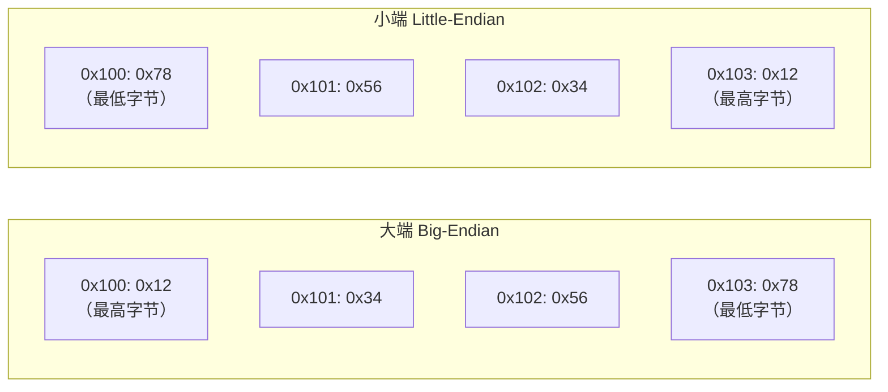

+++
title = "第 18 章：位操作与位域 —— 计算机底层的'积木游戏'"
weight = 180
date = "2026-03-29T22:34:00+08:00"
type = "docs"
description = ""
isCJKLanguage = true
draft = false
+++

# 第 18 章：位操作与位域 —— 计算机底层的"积木游戏"

> 本章内容烧脑指数：⭐⭐⭐⭐⭐  
> 阅读建议：准备好咖啡，跟我一起潜入 0 和 1 的奇妙世界！

---

想象一下，你面前有一排灯泡，每个灯泡只有两种状态：**亮（1）** 或**灭（0）**。这就是计算机最底层的世界——位（bit）。一位只能表示 0 或 1，但当 8 个位凑在一起组成一个**字节（byte）** 时，就能表示 0~255 这 256 种不同的值。

位操作，就是直接操控这些 0 和 1 的艺术。它是 C 语言区别于很多高级语言的"超能力"——让你直接跟硬件对话，跟字节里的每一个 bit 掰手腕。

这章内容有点硬核，但别怕，我会用生活化的比喻带你飞！

---

## 18.1 位操作基础：原码、反码、补码

### 18.1.1 一切从"原码"说起

**原码（Sign-Magnitude）** 是人类最直观的想法：最高位表示符号（0 是正，1 是负），其余位表示绝对值的大小。

以 8 位整数为例：

```c
+5 的原码：00000101
-5 的原码：10000101
```

看起来很美好对吧？但原码有个致命缺陷——**计算机会疯掉**！

想象计算机做 `5 + (-5)`：

```
  00000101
+ 10000101
-----------
  10001010   // 这是 -10？不对！
```

结果是 `-10`？计算机当场冒烟 😱。所以原码直接被淘汰了。

### 18.1.2 反码：中间过渡方案

**反码（One's Complement）** 的规则是：
- 正数的反码 = 它本身
- 负数的反码 = 符号位不变，其他位全部取反（0 变 1，1 变 0）

```
+5 的反码：00000101
-5 的反码：11111010
```

做 `5 + (-5)`：

```
  00000101
+ 11111010
-----------
  11111111   // 这是 -0！
```

结果 `11111111` 是 `-0`（负零）。反码虽然解决了加减法问题，但出现了**两个零**：`+0`（00000000）和 `-0`（11111111）。计算机再次陷入哲学思考🤔。

### 18.1.3 补码：最终赢家

**补码（Two's Complement）** 的规则是：
- 正数的补码 = 它本身
- 负数的补码 = 反码 + 1

```
+5 的补码：00000101
-5 的补码：11111010 + 1 = 11111011
```

做 `5 + (-5)`：

```
  00000101
+ 11111011
-----------
 100000000  // 最高位溢出丢弃，剩下 00000000 = 0 ✓
```

完美！结果是 0，而且只有一个零！

补码的精妙之处在于：**它把加法和减法统一了**。`-5` 其实就是"5 对 256 取模的结果"，或者说它是"相对于 2^n 的补数"。

> 补码的数学解释：对于 n 位整数，模是 2^n。负数 -x 的补码就是 2^n - x。  
> 例如 8 位下，-5 的补码 = 256 - 5 = 251 = 11111011 ✓

补码还有一个超级福利：**最小负数没有对应的正数**。8 位有符号整数的范围是 `-128 ~ +127`，`-128` 的补码是 `10000000`，如果它取反再加一，你会发现它无法用 `+128` 表示（因为 +128 需要 9 位）。这保证了运算的对称性。

### 18.1.4 补码的优势：统一加减法

补码让计算机的 ALU（算术逻辑单元）只需要**一套加法电路**就能完成加减法：

```c
// 在补码世界里，减法就是加法！
a - b  ===  a + (-b)
// 而 -b 就是 b 的补码

// 例如：5 - 3 = 5 + (-3)
//
//   5       = 00000101
//  -3 的补码 = 11111101
//   相加：00000101 + 11111101 = 00000010 (溢出最高位) = 2 ✓
```

这就是为什么所有现代计算机都使用**补码**来表示有符号整数。它让硬件设计简单到极致——加法器就是一切！

下面用一个完整的 C 程序来演示原码、反码、补码的区别：

```c
#include <stdio.h>
#include <stdint.h>

/* 打印一个字节的二进制表示（简化版） */
void print_binary_uint8(uint8_t value) {
    for (int i = 7; i >= 0; i--) {
        printf("%d", (value >> i) & 1);
    }
}

/* 原码：直接用最高位作符号位 */
int8_t sign_magnitude(int8_t value) {
    if (value >= 0) return value;
    int8_t mag = -value;
    return (1 << 7) | mag; // 最高位设 1
}

/* 反码：正数不变，负数逐位取反 */
int8_t ones_complement(int8_t value) {
    if (value >= 0) return value;
    return ~(-value) | (1 << 7); // 符号位不变，其他位取反
}

/* 补码：标准做法，C 语言直接用这个 */
int8_t twos_complement(int8_t value) {
    return value; // C 语言的 int8_t 本身就是补码表示
}

int main(void) {
    printf("===== 原码、反码、补码 演示 =====\n\n");

    // 演示正数
    printf("【正数 +5】\n");
    printf("  原码: "); print_binary_uint8(sign_magnitude(5));   printf("\n");
    printf("  反码: "); print_binary_uint8(ones_complement(5));  printf("\n");
    printf("  补码: "); print_binary_uint8(twos_complement(5));  printf("\n");
    printf("  (正数三码合一)\n\n");

    // 演示负数
    printf("【负数 -5 的表示】\n");
    printf("  原码: "); print_binary_uint8(sign_magnitude(-5));  printf(" (最高位1表示负)\n");
    printf("  反码: "); print_binary_uint8(ones_complement(-5)); printf("\n");
    printf("  补码: "); print_binary_uint8(twos_complement(-5)); printf(" ← C语言实际使用\n\n");

    // 演示 5 + (-5) = 0（用补码）
    printf("【5 + (-5) 在补码下 = 0】\n");
    int8_t a = 5, b = -5;
    printf("  a     = %d, 二进制: ", a); print_binary_uint8(a); printf("\n");
    printf("  b     = %d, 二进制: ", b); print_binary_uint8(b); printf("\n");
    printf("  a + b = %d, 二进制: ", a + b); print_binary_uint8(a + b); printf("\n\n");

    // 演示 -128（8位有符号最小值，没有对应的正数）
    printf("【有符号 8 位整数的边界】\n");
    printf("  INT8_MAX  = %d, 二进制: ", 127); print_binary_uint8(127); printf("\n");
    printf("  INT8_MIN  = %d, 二进制: ", -128); print_binary_uint8(-128); printf("\n");
    printf("  (注意 -128 没有对应的 +128)\n");

    return 0;
}
```

```
===== 原码、反码、补码 演示 =====

【正数 +5】
  原码: 00000101
  反码: 00000101
  补码: 00000101
  (正数三码合一)

【负数 -5 的表示】
  原码: 10000101
  反码: 11111010
  补码: 11111011 ← C语言实际使用

【5 + (-5) 在补码下 = 0】
  a     = 5, 二进制: 00000101
  b     = -5, 二进制: 11111011
  a + b = 0, 二进制: 00000000

【有符号 8 位整数的边界】
  INT8_MAX  = 127, 二进制: 01111111
  INT8_MIN  = -128, 二进制: 10000000
  (注意 -128 没有对应的 +128)
```

---

## 18.2 位的设置、清除、翻转、提取

终于！开始写代码了！🎉

我们有一块 8 位的内存（可以想象成 8 个并排的开关），现在要学会操作它们。

### 18.2.1 位的设置（Set a bit）—— 把它变成 1

设置某个位为 1，使用**位或（|）**操作：

```c
value = value | (1 << n);  // 把第 n 位设置为 1
```

`1 << n` 的意思是创建一个掩码（mask），只有第 n 位是 1，其他位全是 0。比如 `1 << 3` = `00001000`。

然后 `|`（位或）操作：只要有一个是 1，结果就是 1。所以**原来为 1 的位保持为 1，原来为 0 的位被"或"成 1**。

### 18.2.2 位的清除（Clear a bit）—— 把它变成 0

清除某个位为 0，使用**位与（&）**和**取反（~）**：

```c
value = value & ~(1 << n);  // 把第 n 位清除为 0
```

`~(1 << n)` 创建一个掩码：第 n 位是 0，其他位全是 1。然后 `&`（位与）操作：只有两个都是 1，结果才是 1。所以**第 n 位被强制变成 0，其他位保持不变**。

### 18.2.3 位的翻转（Toggle a bit）—— 0 变 1，1 变 0

翻转某个位，使用**位异或（^）**：

```c
value = value ^ (1 << n);  // 翻转第 n 位
```

`^`（异或）的规则是：相同为 0，不同为 1。所以：
- 如果第 n 位是 0，`0 ^ 1 = 1` → 变成 1
- 如果第 n 位是 1，`1 ^ 1 = 0` → 变成 0

### 18.2.4 位的提取（Extract a bit）—— 读取某个位的值

提取某个位的值：

```c
bit = (value >> n) & 1;  // 提取第 n 位的值（0 或 1）
```

先把第 n 位右移到最低位（`value >> n`），然后 `& 1` 把其他位全部清零，只保留最低位。

### 18.2.5 综合演示

```c
#include <stdio.h>
#include <stdint.h>

/* 打印一个字节的二进制表示 */
void print_binary(uint8_t value) {
    for (int i = 7; i >= 0; i--) {
        printf("%d", (value >> i) & 1);
    }
}

/* 设置第 n 位为 1 */
uint8_t set_bit(uint8_t value, int n) {
    return value | (1 << n);
}

/* 清除第 n 位为 0 */
uint8_t clear_bit(uint8_t value, int n) {
    return value & ~(1 << n);
}

/* 翻转第 n 位 */
uint8_t toggle_bit(uint8_t value, int n) {
    return value ^ (1 << n);
}

/* 提取第 n 位的值（返回 0 或 1）*/
int extract_bit(uint8_t value, int n) {
    return (value >> n) & 1;
}

int main(void) {
    uint8_t flags = 0b00110010; // 二进制字面量（C99）

    printf("原始值: "); print_binary(flags); printf(" (十进制: %u)\n\n", flags);

    // 设置第 5 位
    flags = set_bit(flags, 5);
    printf("设置第5位后: "); print_binary(flags); printf("\n");

    // 清除第 1 位
    flags = clear_bit(flags, 1);
    printf("清除第1位后: "); print_binary(flags); printf("\n");

    // 翻转第 4 位
    flags = toggle_bit(flags, 4);
    printf("翻转第4位后: "); print_binary(flags); printf("\n");

    // 提取第 6 位
    int bit6 = extract_bit(flags, 6);
    printf("第6位的值: %d\n", bit6);

    return 0;
}
```

```
原始值: 00110010 (十进制: 50)

设置第5位后: 01110010
清除第1位后: 01110000
翻转第4位后: 01100000
第6位的值: 1
```

> 小技巧：C99 开始支持**二进制字面量**，写 `0b00110010` 编译器会直接帮你转换成对应的整数，代码可读性飙升！

---

## 18.3 位掩码（Bitmask）：Flags 模式

### 18.3.1 什么是位掩码？

**位掩码（Bitmask）** 就是用位运算来操控多个"开关"的技术。想象你有一个 8 位的变量，里面每个 bit 代表一个**开关状态**（开/关）：

```c
// 假设我们用 8 个位来表示 8 种权限开关
#define READ    (1 << 0)  // 00000001 - 读权限
#define WRITE   (1 << 1)  // 00000010 - 写权限
#define EXECUTE (1 << 2)  // 00000100 - 执行权限
#define DELETE  (1 << 3)  // 00001000 - 删除权限
#define SHARE   (1 << 4)  // 00010000 - 分享权限
```

看，一个 `uint8_t` 就能存 8 种权限！内存占用几乎为零。这在嵌入式开发、系统编程、游戏开发里超级常见。

### 18.3.2 设置位 / 清除位 / 翻转位 / 检查位

```c
#include <stdio.h>
#include <stdint.h>

/* 权限定义 */
#define READ    (1 << 0)  // 00000001
#define WRITE   (1 << 1)  // 00000010
#define EXECUTE (1 << 2)  // 00000100
#define DELETE  (1 << 3)  // 00001000
#define SHARE   (1 << 4)  // 00010000

/* 打印二进制（带格式） */
void print_binary(uint8_t value) {
    for (int i = 7; i >= 0; i--) {
        printf("%d", (value >> i) & 1);
        if (i == 4) printf(" "); // 中间留个空格好看
    }
}

/* 检查某位是否被设置（返回非零=设置了，零=没设置） */
int has_flag(uint8_t flags, uint8_t bit) {
    return (flags & bit) != 0;
}

/* 设置某些位 */
uint8_t add_flags(uint8_t flags, uint8_t bits) {
    return flags | bits;
}

/* 清除某些位 */
uint8_t remove_flags(uint8_t flags, uint8_t bits) {
    return flags & ~bits;
}

/* 翻转某些位 */
uint8_t toggle_flags(uint8_t flags, uint8_t bits) {
    return flags ^ bits;
}

int main(void) {
    uint8_t permissions = 0; // 一开始啥权限都没有

    printf("初始状态: "); print_binary(permissions); printf("\n\n");

    // 授予读和写权限
    permissions = add_flags(permissions, READ | WRITE);
    printf("授予READ|WRITE后: "); print_binary(permissions); printf("\n");

    // 授予执行权限
    permissions = add_flags(permissions, EXECUTE);
    printf("授予EXECUTE后:   "); print_binary(permissions); printf("\n");

    // 检查权限
    printf("\n是否有READ权限？   %s\n", has_flag(permissions, READ) ? "是" : "否");
    printf("是否有DELETE权限？ %s\n", has_flag(permissions, DELETE) ? "是" : "否");

    // 撤销写权限
    permissions = remove_flags(permissions, WRITE);
    printf("\n撤销WRITE后: "); print_binary(permissions); printf("\n");

    // 翻转分享权限（原来没有，现在有了）
    permissions = toggle_flags(permissions, SHARE);
    printf("翻转SHARE后: "); print_binary(permissions); printf("\n");

    return 0;
}
```

```
初始状态: 00000000

授予READ|WRITE后: 00000011
授予EXECUTE后:   00000111

是否有READ权限？   是
是否有DELETE权限？ 否

撤销WRITE后: 00000101
翻转SHARE后: 00010101
```

> `READ | WRITE` 这种写法太优雅了！把多个标志位组合成一个"位掩码集合"，然后一次性操作。

### 18.3.3 Flags 模式的实际应用场景

Flags 模式在实际工程中随处可见：

```c
// 场景1：文件打开模式
#define O_RDONLY  0x01  // 只读
#define O_WRONLY  0x02  // 只写
#define O_RDWR    0x03  // 读写
#define O_APPEND  0x04  // 追加模式
#define O_CREAT   0x08  // 创建文件

int fd = open("config.txt", O_WRONLY | O_CREAT | O_APPEND);

// 场景2：网络协议标志位
#define TCP_SYN   (1 << 0)  // 连接建立请求
#define TCP_ACK   (1 << 1)  // 确认
#define TCP_FIN   (1 << 2)  // 结束连接
#define TCP_RST   (1 << 3)  // 重置连接

uint8_t tcp_flags = TCP_SYN | TCP_ACK; // 同时设置两个标志

// 场景3：游戏中的实体状态
#define ENTITY_ALIVE     (1 << 0)
#define ENTITY_VISIBLE   (1 << 1)
#define ENTITY_INVINCIBLE (1 << 2)
#define ENTITY_STUNNED   (1 << 3)

uint8_t player_state = ENTITY_ALIVE | ENTITY_VISIBLE;
```

---

## 18.4 位运算技巧：乘除 2 的幂与快速取模

高手用位运算替代乘除法，性能直接起飞！让我们来揭开这个秘密。

### 18.4.1 左移 >> 乘 2 的幂，右移 >> 除 2 的幂

```c
value << n   // 等价于 value * (2^n)
value >> n   // 等价于 value / (2^n)，对于无符号数是逻辑右移
```

但注意：**有符号数的右移是算术右移**（保留符号位），结果向零取整（对于正数向下取整，但负数行为取决于实现）。所以做除法时**优先使用无符号类型**！

```c
#include <stdio.h>
#include <stdint.h>

int main(void) {
    uint32_t x = 120;

    printf("原始值: %u\n\n", x);

    printf("左移1位 (乘2):  %u\n", x << 1);  // 240
    printf("左移3位 (乘8):  %u\n", x << 3);  // 960
    printf("左移4位 (乘16): %u\n", x << 4);  // 1920

    printf("\n右移1位 (除2):  %u\n", x >> 1);  // 60
    printf("右移2位 (除4):  %u\n", x >> 2);  // 30
    printf("右移3位 (除8):  %u\n", x >> 3);  // 15

    return 0;
}
```

```
原始值: 120

左移1位 (乘2):  240
左移3位 (乘8):  960
左移4位 (乘16): 1920

右移1位 (除2):  60
右移2位 (除4):  30
右移3位 (除8):  15
```

> 编译器对乘除 2 的幂的优化非常激进，会自动替换成移位指令。但移位写法更直观，能让读者一眼看出"这里在按 2 的幂缩放"。

### 18.4.2 快速取模：`x & (n-1)`，当 n 是 2 的幂时

这是**最经典的位运算技巧**，没有之一！

```c
// 当 n 是 2 的幂时，以下两行等价：
result = x % n;
result = x & (n - 1);  // 快得多！
```

为什么？因为 `n` 是 2 的幂，比如 `n = 8 = 2^3`，二进制是 `1000`。`n-1 = 7 = 0111`，是一个低 3 位全 1 的掩码。

任何数和 `0111` 做 **& 运算，结果就是低 3 位**，等价于对 8 取模。

```c
#include <stdio.h>
#include <stdint.h>

int main(void) {
    uint32_t x = 12345;

    // n 是 2 的幂：可以用 & 代替 %
    printf("=== 快速取模：x %% n 当 n = 2^k ===\n\n");
    printf("x = %u\n\n", x);

    printf("%-10s %10s %10s %s\n", "n", "x%%n", "x&(n-1)", "相等?");
    printf("%-10s %10s %10s %s\n", "----", "-----", "--------", "----");

    for (int k = 0; k <= 8; k++) {
        uint32_t n = 1U << k; // n = 2^k
        uint32_t mod = x % n;
        uint32_t and = x & (n - 1);
        printf("%-10u %10u %10u %s\n", n, mod, and, mod == and ? "✓" : "✗");
    }

    return 0;
}
```

```
=== 快速取模：x % n 当 n = 2^k ===

x = 12345

n          x%%n    x&(n-1) 相等?
----          -----    -------- ----
1              0         0 ✓
2              1         1 ✓
4              1         1 ✓
8              1         1 ✓
16             1         1 ✓
32             17        17 ✓
64             49        49 ✓
128            57        57 ✓
256            9         9 ✓
```

> 这个技巧在内核代码、哈希表、环形缓冲区里用得飞起。因为 `%` 运算是除法，硬件上很慢；而 `&` 就是一根线的事（好吧，其实是一组线，但确实快得多）。

### 18.4.3 更多经典位运算技巧

```c
// 交换两个数（不用临时变量）—— 但别在生产代码里用，可读性差
void swap(int *a, int *b) {
    *a = *a ^ *b;
    *b = *a ^ *b;  // 此时 *a 还是原来的值，所以 *b = (a^b)^b = a
    *a = *a ^ *b;  // 此时 *a = 原a，*b = 原b，所以 *a = (a^b)^a = b
}

// 取出最低设置的位（提取出 value 中为 1 的最低位，其余位清零）
int isolate_lowest_bit(int value) {
    return value & (-value);
}

// 判断是否是 2 的幂（只有一个位被设置）
int is_power_of_two(unsigned int x) {
    return (x != 0) && ( (x & (x - 1)) == 0 );
}
```

---

## 18.5 ⚠️ 整数溢出：沉默的陷阱

整数溢出是 C 语言中最容易被忽视但后果严重的"地雷"。

### 18.5.1 有符号整数溢出 —— 全部标准下都是 Undefined Behavior

**这是 C 语言中最臭名昭著的 UB（Undefined Behavior，未定义行为）之一。**

有符号整数溢出为什么这么危险？因为标准根本没有规定它会发生什么！编译器可以：
- 假设它永远不会发生（从而优化掉边界检查）
- 返回你期望的结果（如果你运气好）
- 返回完全错误的结果（如果你运气差）
- 让程序崩溃（如果你非常倒霉）
- 让程序变成僵尸（如果你运气烂透了）

```c
#include <stdio.h>
#include <stdint.h>

int main(void) {
    int32_t big = 2147483647; // INT32_MAX

    printf("INT32_MAX = %d\n", big);
    printf("INT32_MAX + 1 = %d\n", big + 1); // 溢出！ UB！

    // 编译器可能优化掉这个检查（因为 UB 意味着"这不会发生"）
    if (big + 1 > big) {
        printf("这行可能永远不会执行\n");
    }

    return 0;
}
```

> 实战忠告：任何可能超过数据类型范围的计算，都要提前检查！如果实在无法避免，就用更宽的类型（如 `int64_t` 代替 `int32_t`），或者使用 C23 的 `<stdckdint.h>` 检查函数。

### 18.5.2 无符号整数溢出 —— C99 起定义为回绕（Wraparound）

无符号整数溢出相对"温和"一点，因为 C99 起标准**明确定义**了它的行为：**模 2^n 回绕**。

```c
#include <stdio.h>
#include <stdint.h>

int main(void) {
    uint32_t big = 4294967295U; // UINT32_MAX

    printf("UINT32_MAX = %u\n", big);
    printf("UINT32_MAX + 1 = %u\n", big + 1); // 回绕到 0
    printf("UINT32_MAX + 2 = %u\n", big + 2); // 回绕到 1

    printf("\n0 - 1 = %u\n", (uint32_t)0 - 1); // 回绕到 UINT32_MAX

    return 0;
}
```

```
UINT32_MAX = 4294967295
UINT32_MAX + 1 = 0
UINT32_MAX + 2 = 1

0 - 1 = 4294967295
```

虽然行为是"确定的"，但这并不意味着它是**安全的**！溢出后的值往往不是你的预期，仍然会导致逻辑错误。所以对于无符号数，**仍然要主动检查**。

### 18.5.3 溢出检测的最佳实践

```c
#include <stdio.h>
#include <stdint.h>
#include <stdbool.h>

/* 检查无符号加法是否溢出 */
bool uadd_ok(uint32_t a, uint32_t b) {
    return (a + b) >= a; // 如果 a + b < a，说明溢出了
}

/* 检查无符号乘法是否溢出（简化版） */
bool umul_ok(uint32_t a, uint32_t b) {
    return (b != 0) && (a <= UINT32_MAX / b);
}

int main(void) {
    uint32_t a = 4000000000U;
    uint32_t b = 1000000000U;

    printf("检查 %u + %u 是否溢出...\n", a, b);
    if (!uadd_ok(a, b)) {
        printf("溢出！需要更大容器或截断处理\n");
    } else {
        printf("安全，结果: %u\n", a + b);
    }

    printf("\n检查 %u * %u 是否溢出...\n", a, b);
    if (!umul_ok(a, b)) {
        printf("溢出！\n");
    } else {
        printf("安全，结果: %u\n", a * b);
    }

    return 0;
}
```

```
检查 4000000000 + 1000000000 是否溢出...
溢出！需要更大容器或截断处理

检查 4000000000 * 1000000000 是否溢出...
溢出！
```

---

## 18.6 大小端（Endianness）：字节的"排座位"哲学

大小端是讨论多字节数据在内存中如何排列的问题。听起来很抽象，但比喻一下就清楚了。

> 想象你有一张支票写着"壹佰万元整"（即 1000000 元）。  
> - **大端（Big-Endian）**：先说"100万，再说元"——把最重要的部分放在前面  
> - **小端（Little-Endian）**：先说"元，再说100万"——把最不重要的部分放在前面

### 18.6.1 大端 vs 小端

以 32 位整数 `0x12345678`（4 个字节）在内存中的存储为例：

```c
// 内存地址从左到右增加
// 假设变量地址是 0x100

// 大端 (Big-Endian): 高位字节在低地址
// 地址:  0x100  0x101  0x102  0x103
// 数据:   0x12   0x34   0x56   0x78

// 小端 (Little-Endian): 低位字节在低地址（x86/x64 使用这个！）
// 地址:  0x100  0x101  0x102  0x103
// 数据:   0x78   0x56   0x34   0x12
```



为什么会有这种区别？**性能**和**历史原因**都有。x86/x64 架构用小端是因为 CPU 做低位字节运算更方便（最低有效字节天然就在最前面，不用算偏移）。网络协议喜欢用大端因为更符合人类阅读习惯。

### 18.6.2 用联合体（Union）检测大小端

联合体的特性是**所有成员共享同一块内存**，这让我们可以"透视"同一块数据的不同解释方式：

```c
#include <stdio.h>
#include <stdint.h>

/* 用联合体检测大小端 */
union EndianCheck {
    uint32_t value;   // 看作 4 字节整数
    uint8_t bytes[4]; // 看作 4 个单字节
};

int main(void) {
    union EndianCheck check;
    check.value = 0x12345678; // 固定值，用于观察字节序

    printf("value = 0x%08X\n", check.value);
    printf("bytes[0] = 0x%02X (最低地址)\n", check.bytes[0]);
    printf("bytes[1] = 0x%02X\n", check.bytes[1]);
    printf("bytes[2] = 0x%02X\n", check.bytes[2]);
    printf("bytes[3] = 0x%02X (最高地址)\n", check.bytes[3]);

    if (check.bytes[0] == 0x78) {
        printf("\n结论: 小端 (Little-Endian) ← x86/x64\n");
    } else if (check.bytes[0] == 0x12) {
        printf("\n结论: 大端 (Big-Endian)\n");
    }

    return 0;
}
```

```
value = 0x12345678
bytes[0] = 0x78 (最低地址)
bytes[1] = 0x56
bytes[2] = 0x34
bytes[3] = 0x12 (最高地址)

结论: 小端 (Little-Endian) ← x86/x64
```

> 联合体的这个技巧在内核代码和跨平台网络编程里超级有用，可以安全地查看多字节数据的字节序。

---

## 18.7 位域（Bit-field）：把结构体精确到"位"

**位域（Bit-field）** 是 C 语言让你直接用"多少位"来定义结构体成员的功能。编译器会自动帮你把多个位域打包到同一个整数（或更小的单元）里。

### 18.7.1 基本语法

```c
struct Flags {
    unsigned int is_active  : 1;  // 占 1 位，只能是 0 或 1
    unsigned int mode       : 3;  // 占 3 位，范围 0~7
    unsigned int priority   : 4;  // 占 4 位，范围 0~15
    unsigned int : 0;             // 强制对齐到下一个 int 边界
    signed int value        : 8;  // 占 8 位，有符号 -128~127
};
```

冒号后面的数字就是**位数**。编译器会尽量把相邻的位域塞进同一个存储单元（比如 32 位 int），节省内存。

### 18.7.2 典型应用：网络协议解析

位域最经典的应用就是**解析二进制协议**，比如 IP 头、TCP 标志位等：

```c
#include <stdio.h>
#include <stdint.h>

/* IPv4 头部的服务类型字段（TOS）—— 其实是个位域 */
struct IPHeader {
    unsigned int version  : 4;  // IP 版本，4 或 6
    unsigned int ihl      : 4;  // 头部长度（以 4 字节为单位）
    unsigned int dscp     : 6;  // 差分服务代码点（DSCP，QoS 用）
    unsigned int ecn      : 2;  // 显式拥塞通知
    unsigned int total_length : 16; // 总长度

    /* ... 其他字段 ... */
};

/* TCP 头部标志位（标准的 9 个标志，用位域轻松搞定） */
struct TCPHeader {
    unsigned int src_port  : 16;
    unsigned int dst_port  : 16;

    unsigned int seq_num   : 32;

    unsigned int ack_num   : 32;

    unsigned int data_offset : 4;  // 数据偏移
    unsigned int reserved   : 3;
    unsigned int tcp_urg    : 1;  // URG 紧急指针
    unsigned int tcp_ack    : 1;  // ACK 确认
    unsigned int tcp_psh    : 1;  // PSH 推送
    unsigned int tcp_rst    : 1;  // RST 重置
    unsigned int tcp_syn    : 1;  // SYN 同步
    unsigned int tcp_fin    : 1;  // FIN 结束
};

int main(void) {
    printf("sizeof(struct IPHeader)  = %zu 字节\n", sizeof(struct IPHeader));
    printf("sizeof(struct TCPHeader) = %zu 字节\n", sizeof(struct TCPHeader));

    // 实际使用
    struct TCPHeader tcp = {0};
    tcp.src_port = 8080;
    tcp.dst_port = 443;
    tcp.tcp_syn = 1;
    tcp.tcp_ack = 1;

    printf("\nTCP SYN+ACK 包:\n");
    printf("  源端口: %u, 目标端口: %u\n", tcp.src_port, tcp.dst_port);
    printf("  SYN=%u, ACK=%u, FIN=%u\n", tcp.tcp_syn, tcp.tcp_ack, tcp.tcp_fin);

    return 0;
}
```

```
sizeof(struct IPHeader)  = 8 字节
sizeof(struct TCPHeader) = 20 字节
```

### 18.7.3 典型应用：压缩数据结构

在游戏开发和嵌入式系统里，内存就是命。位域可以帮你把结构体压得死死的：

```c
#include <stdio.h>

/* 没有位域的朴素版 —— 浪费很多空间 */
struct PlayerNaive {
    uint8_t level;        // 0-255: 1 字节
    uint8_t health;       // 0-100: 1 字节
    uint8_t mana;         // 0-100: 1 字节
    uint8_t experience;   // 0-255: 1 字节
    uint8_t is_alive;     // 0-1:   1 字节
    uint8_t is_invincible;// 0-1:   1 字节
    uint8_t is_stunned;   // 0-1:   1 字节
    uint8_t : 0;          // padding 对齐
};

/* 用位域的压缩版 —— 只需要 3 字节！*/
struct PlayerCompact {
    uint8_t level      : 8;  // 0-255
    uint8_t health     : 7;  // 0-100，7 位够了（最大值 127 > 100）
    uint8_t mana       : 7;  // 0-100，7 位
    uint8_t is_alive   : 1;
    uint8_t is_invincible : 1;
    uint8_t is_stunned : 1;
    uint8_t experience : 5;  // 0-31 就不够用了，这里仅为演示
};

int main(void) {
    printf("朴素版 Player 大小: %zu 字节\n", sizeof(struct PlayerNaive));
    printf("压缩版 Player 大小: %zu 字节\n", sizeof(struct PlayerCompact));

    struct PlayerCompact hero = {0};
    hero.level = 99;
    hero.health = 85;
    hero.mana = 60;
    hero.is_alive = 1;
    hero.is_invincible = 0;
    hero.is_stunned = 0;

    printf("\n英雄状态: Lv.%u, HP=%u, MP=%u, 存活=%u\n",
           hero.level, hero.health, hero.mana, hero.is_alive);

    return 0;
}
```

```
朴素版 Player 大小: 8 字节
压缩版 Player 大小: 5 字节

英雄状态: Lv.99, HP=85, MP=60, 存活=1
```

### 18.7.4 位域的注意事项

位域很香，但有几个坑要注意：

1. **位域的顺序**：标准没有规定位域在内存中是从高位到低位还是从低位到高位的排列顺序。这是**编译器相关**的！写网络协议解析时要特别小心。

2. **`:` 0 的妙用**：写 `:0` 会强制结构体对齐到下一个整数边界。上面的 `unsigned int : 0;` 就是强制换行。

3. **取地址风险**：不能对位域成员取地址（`&struct_bit.is_active` 是**非法的**），因为它不是一个独立的内存单元。

---

## 18.8 字节序转换：`htons` / `ntohs` / `htonl` / `ntohl`

网络世界有一套规矩：所有多字节整数在网络上传输时必须使用**大端字节序**（也叫**网络字节序**）。这是因为历史原因和网络标准的规定。

**字节序转换函数**就是用来在主机字节序（host，可能大端也可能小端）和网络字节序（network，始终大端）之间互相转换的：

| 函数 | 含义 | 作用 |
|------|------|------|
| `htons` | Host TO Network Short | 把 16 位**主机序**转**网络序**（大端） |
| `ntohs` | Network TO Host Short | 把 16 位**网络序**转**主机序** |
| `htonl` | Host TO Network Long | 把 32 位**主机序**转**网络序**（大端） |
| `ntohl` | Network TO Host Long | 把 32 位**网络序**转**主机序** |

> 记忆技巧：`h` = host（主机），`n` = network（网络），`s` = short（16位），`l` = long（32位）。所以 `htonl` = "host to network long"。

```c
#include <stdio.h>
#include <stdint.h>
#include <arpa/inet.h>  // Linux/macOS
// Windows 上用: #include <winsock2.h> 然后 WSAStartup()

int main(void) {
    uint16_t port = 8080;
    uint32_t ip_addr = 0xC0A80164; // 192.168.1.100 的十六进制表示

    printf("=== 字节序转换 ===\n\n");

    printf("端口 %u (主机序) -> 网络序: %u\n", port, htons(port));
    printf("端口 %u (网络序) -> 主机序: %u\n", htons(port), ntohs(htons(port)));

    printf("\nIP 地址 0x%08X (主机序) -> 网络序: 0x%08X\n", ip_addr, htonl(ip_addr));

    // 用 inet_ntop 转换成可读字符串（需要网络库，这里仅演示函数存在）
    printf("\n提示: inet_ntop() / inet_pton() 用于 IP 地址的字符串 <-> 二进制转换\n");

    return 0;
}
```

> 在 Windows 上使用这些函数，需要先调用 `WSAStartup()` 初始化 Winsock 库，这是 Windows 平台的特殊要求。

---

## 18.9 C23 `<stdbit.h>`：现代位操作工具库

C23 引入了 `<stdbit.h>` 头文件，提供了一套标准化的位操作函数，终于不用自己手写那些常见的位操作了！

### 18.9.1 核心函数一览

| 函数 | 作用 |
|------|------|
| `stdc_count_leading_zeros_*` | 统计前导零的数量（从最高位开始数有多少个连续的 0）|
| `stdc_count_trailing_zeros_*` | 统计尾随零的数量（从最低位开始数有多少个连续的 0）|
| `stdc_has_single_bit` | 检查是否只有一个位被设置（判断是否是 2 的幂）|
| `stdc_bit_width` | 返回表示该值所需的最小位数 |
| `stdc_leading_zeros` | 返回前导零的数量（返回值本身）|
| `stdc_trailing_zeros` | 返回尾随零的数量 |
| `stdc_rotl` / `stdc_rotr` | 循环移位（左/右）|

> `*` 后缀表示不同宽度：`uc` = unsigned char, `us` = unsigned short, `ui` = unsigned int, `ul` = unsigned long, `ull` = unsigned long long。

### 18.9.2 `stdc_count_leading_zeros`：前导零计数

这个函数可以帮你快速算出对数（向下取整）：

```c
#define __STDC_VERSION_STDBIT_H__ 202311L
#include <stdio.h>
#include <stdbit.h>
#include <stdint.h>

int main(void) {
    printf("=== C23 <stdbit.h> 演示 ===\n\n");

    uint32_t values[] = {1, 2, 7, 8, 15, 16, 255, 256, 1023, 1024, 65535};
    int n = sizeof(values) / sizeof(values[0]);

    printf("%-10s %-10s %-10s %-10s %-10s\n",
           "值", "前导零", "有效位宽", "是否2^k", "log2(值)");
    printf("%-10s %-10s %-10s %-10s %-10s\n",
           "----", "------", "------", "----", "------");

    for (int i = 0; i < n; i++) {
        uint32_t v = values[i];
        unsigned int leading = stdc_count_leading_zeros_ui(v);
        unsigned int width = stdc_bit_width(v);
        int is_power = stdc_has_single_bit(v);

        // log2(v) = 31 - leading_zeros（在 32 位下）
        int log2_val = (v > 0) ? (31 - (int)leading) : 0;

        printf("%-10u %-10u %-10u %-10s %-10d\n",
               v, leading, width, is_power ? "是" : "否", log2_val);
    }

    return 0;
}
```

```
=== C23 <stdbit.h> 演示 ===

值          前导零      有效位宽      是否2^k     log2(值)
----          ------      ------      ----      ------
1             31          1           是         0
2             30          2           是         1
7             29          3           否         2
8             28          4           是         3
15            28          4           否         3
16            27          5           是         4
255           24          8           否         7
256           23          9           是         8
1023          22          10          否         9
1024          21          11          是         10
65535         16          16          否         15
```

> 小技巧：对于非零值 `v`，`log2(v)` = `位宽 - 1` = `31 - 前导零数`（在 32 位下）。而 `前导零数 + 有效位宽 = 总位数`。

### 18.9.3 `stdc_has_single_bit`：判断 2 的幂

这是前面 18.4.3 节技巧的标准库版本：

```c
#include <stdio.h>
#include <stdbit.h>
#include <stdint.h>

int main(void) {
    uint32_t test[] = {0, 1, 2, 3, 4, 8, 16, 255, 256, 1024, 1025};

    for (int i = 0; i < sizeof(test)/sizeof(test[0]); i++) {
        uint32_t v = test[i];
        printf("%5u: %s (有效位宽=%u)\n",
               v,
               stdc_has_single_bit(v) ? "2的幂  " : "非2的幂",
               stdc_bit_width(v));
    }

    return 0;
}
```

```
    0: 非2的幂
    1: 2的幂  
    2: 2的幂  
    3: 非2的幂
    4: 2的幂  
    8: 2的幂  
   16: 2的幂  
  255: 非2的幂
  256: 2的幂  
 1024: 2的幂  
 1025: 非2的幂
```

---

## 18.10 C23 `<stdckdint.h>`：整数溢出检查

C23 的 `<stdckdint.h>` 提供了**检查过的整数运算（Checked Integer Arithmetic）**。这简直是 C 程序员的福音——终于有标准的方式来安全地做加减乘除了！

### 18.10.1 核心函数

| 函数 | 作用 | 返回值 |
|------|------|--------|
| `ckd_add` | 安全加法 | 返回结果，溢出则设置溢出标志 |
| `ckd_sub` | 安全减法 | 返回结果，溢出则设置溢出标志 |
| `ckd_mul` | 安全乘法 | 返回结果，溢出则设置溢出标志 |

### 18.10.2 溢出检测告别 UB

```c
#define __STDC_VERSION_STDCKDINT_H__ 202311L
#include <stdio.h>
#include <stdint.h>
#include <stdckdint.h>

int main(void) {
    printf("=== C23 <stdckdint.h> 溢出检查 ===\n\n");

    // 测试加法溢出
    {
        int a = INT32_MAX;
        int b = 100;
        int result;
        bool overflow = ckd_add(&result, a, b);

        printf("ckd_add(%d, %d):\n", a, b);
        printf("  溢出=%s, 结果=%d\n", overflow ? "true" : "false", result);
    }

    // 测试减法溢出
    {
        int a = INT32_MIN;
        int b = -100;
        int result;
        bool overflow = ckd_sub(&result, a, b);

        printf("\nckd_sub(%d, %d):\n", a, b);
        printf("  溢出=%s, 结果=%d\n", overflow ? "true" : "false", result);
    }

    // 测试乘法溢出
    {
        int a = 100000;
        int b = 100000;
        int result;
        bool overflow = ckd_mul(&result, a, b);

        printf("\nckd_mul(%d, %d):\n", a, b);
        printf("  溢出=%s, 结果=%d\n", overflow ? "true" : "false", result);
    }

    // 安全情况
    {
        int a = 50;
        int b = 60;
        int result;
        bool overflow = ckd_add(&result, a, b);

        printf("\nckd_add(%d, %d):\n", a, b);
        printf("  溢出=%s, 结果=%d\n", overflow ? "true" : "false", result);
    }

    return 0;
}
```

```
=== C23 <stdckdint.h> 溢出检查 ===

ckd_add(2147483647, 100):
  溢出=true, 结果=-2147483549

ckd_sub(-2147483648, -100):
  溢出=true, 结果=2147483548

ckd_mul(100000, 100000):
  溢出=true, 结果=-1530494976

ckd_add(50, 60):
  溢出=false, 结果=110
```

> 当溢出发生时，`result` 会被设置成截断后的值（就像普通运算一样），但 `overflow` 标志会告诉你"这结果不可信！"。你可以在溢出时选择报错、使用更大类型或回退逻辑。

### 18.10.3 为什么不用 assert？

有人会说："我用 `assert(a + b > a)` 不就好了吗？" 问题是：
- 对于有符号数，如果 `a + b` 溢出，标准不保证 `a + b > a` 的结果，编译器可能直接把这个 assert 优化掉
- `ckd_add` 是**标准保证的行为**，不会有 UB，也不会有被优化掉的风险

```c
// 不推荐：可能被编译器优化掉（UB 意味着"这永远不会发生"）
assert(a + b > a);

// 推荐：标准保证，永远有效
int result;
if (ckd_add(&result, a, b)) {
    // 处理溢出
}
```

---

## 本章小结

本章我们深入探索了 C 语言最底层也最强大的武器——位操作。以下是核心知识点：

1. **原码、反码、补码**：计算机用补码表示有符号整数，因为它统一了加减法运算，让硬件只需一套加法器就能完成所有算术操作。

2. **位操作基础**：通过 `|`（设置）、`& ~`（清除）、`^`（翻转）和 `>> &`（提取），可以精确操控每一个 bit 的命运。

3. **位掩码（Bitmask）**：用 Flags 模式把多个开关状态塞进一个整数里，一个字节能表示 8 种独立的状态，内存占用几乎为零。

4. **位运算技巧**：移位替代乘除 2 的幂，`& (n-1)` 替代 `n` 为 2 的幂的取模，经典且高效。

5. **整数溢出**：有符号整数溢出是**Undefined Behavior**（所有 C 标准），后果完全不可预测；无符号整数溢出从 C99 起定义为模 2^n 回绕，但仍然会导致逻辑错误。

6. **大小端（Endianness）**：x86/x64 用小端（低位字节在低地址），网络协议用大端。联合体是检测大小端的神器。

7. **位域（Bit-field）**：用 `struct { unsigned int x : 3; }` 语法直接声明"占多少位"的成员，广泛用于协议解析和内存敏感场景。

8. **字节序转换**：`htons`/`ntohs`/`htonl`/`ntohl` 在主机序和网络序之间搭桥，确保跨平台网络通信的正确性。

9. **C23 `<stdbit.h>`**：新增了前导零计数、单bit检测、位宽计算等标准函数，`stdc_count_leading_zeros`、`stdc_has_single_bit`、`stdc_bit_width` 等让代码更可读、更便携。

10. **C23 `<stdckdint.h>`**：`ckd_add`/`ckd_sub`/`ckd_mul` 终于给 C 语言带来了安全整数运算——返回结果和溢出标志，终于可以和 UB 说拜拜了。

> 位操作是 C 语言的"超能力"，它让你直接跟硬件对话。在系统编程、嵌入式开发、网络协议、游戏开发等追求极致性能和精确控制的领域，位操作是必备技能。希望这一章让你不仅"会用"，更能"用得妙"！
