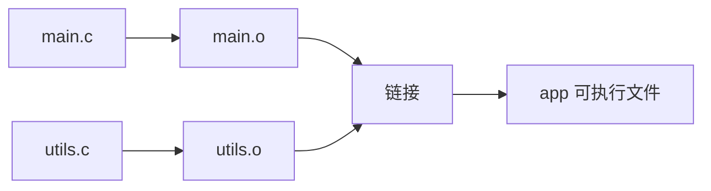

+++
title = "第 19 章：构建系统与工程管理"
weight = 190
date = "2026-03-29T22:34:00+08:00"
type = "docs"
description = ""
isCJKLanguage = true
draft = false
+++

# 第 19 章：构建系统与工程管理

> "写代码一时爽，编译部署火葬场。" —— 每一个被 Makefile 折磨过的程序员

恭喜你来到 C 语言学习的终点站——不对，是**中转站**！前面 18 章你学会了怎么用 C 写逻辑、写算法、写数据结构，感觉自己已经天下无敌了？很好，现在我们来聊聊当你写完代码之后，**怎么让它变成可执行文件**，以及**怎么管理一个正经的工程**。

你以为 `gcc main.c -o main` 就够了？天真！那只是小打小闹。当你面对一个有几百个源文件、几十个目录、依赖十几个第三方库的超级项目时，裸敲命令行就像用手挖隧道——不是不行，是你活不到挖通的那天。

这时候，你就需要**构建系统**（Build System）来帮你自动完成编译、链接、打包、部署这一整套流程。它就像厨房里的全自动炒菜机：你把原材料（源代码）丢进去，设定好菜谱（构建脚本），它就能给你端出一盘色香味俱全的佳肴（可执行文件），全程不需要你守在灶台前。

本章我们将认识 C 语言世界最流行的几种构建工具：**Makefile / CMake / Autotools / Ninja / Meson**，并学会用它们管理从"Hello World"到"大型开源项目"的各种工程。准备好了吗？系好安全带，我们发车了！

---

## 19.1 Makefile 从入门到精通

Make 是 Unix/Linux 世界的元老级构建工具，几乎每一个 C/C++ 程序员都和它打过交道。它的核心思想其实特别简单：**找出哪些文件变了，只重新编译那些需要更新的文件**。这听起来像废话，但正是这"增量构建"的思想，让 Make 成为所有现代构建系统的老祖宗。

### 19.1.1 基本语法：目标、依赖、规则

Makefile 的基本单元是**规则**（Rule），每条规则长这样：

```makefile
目标(target): 依赖(prerequisites)
    命令(commands)
```

**目标**是你想要生成的东西，**依赖**是生成这个目标需要用到的文件，**命令**则是具体的操作步骤。

想象一下做蛋糕的场景：你想做"生日蛋糕"（目标），需要"面粉+鸡蛋+奶油"（依赖），然后你执行"搅拌+烘烤+裱花"（命令）。Makefile 就是这么个菜谱。

先来看最经典的使用场景——编译一个 C 程序：

```makefile
# 这是一个最简单的 Makefile
# 含义：构建可执行文件 main，依赖 main.c
# 执行：用 gcc 编译

main: main.c
    gcc main.c -o main
```

> **专业词汇：** `main` 在这里是一个**目标**（Target），`main.c` 是它的**依赖**（Prerequisite），`gcc` 那一行是**命令**（Command）。注意：命令前面**必须是一个 Tab 字符**，不是空格！这坑了 90% 的初学者，我们后面会详细讲。

把上述内容保存为 `Makefile`（注意大小写），然后在终端执行：

```bash
make
```

Make 会自动找到名为 `Makefile` 的文件，执行第一条规则（也就是第一个目标）。如果你想指定特定目标，可以：

```bash
make main          # 构建 main 这个目标
make clean         # 构建 clean 目标（通常是删除生成的文件）
```

让我们看一个更实用的例子——有两个源文件：

```makefile
# Makefile
# 目标 app 依赖 main.o 和 utils.o
# 链接生成可执行文件 app

app: main.o utils.o
    gcc main.o utils.o -o app

# main.o 依赖 main.c
main.o: main.c
    gcc -c main.c -o main.o

# utils.o 依赖 utils.c
utils.o: utils.c
    gcc -c utils.c -o utils.o

clean:
    rm -f app main.o utils.o
```

执行 `make` 后，Make 会：
1. 检查 `main.o`、`utils.o` 是否存在
2. 如果不存在或比源文件旧，就先编译
3. 最后链接生成 `app`

整个过程就像一条流水线：**源文件 → 目标文件 → 可执行文件**。



---

### 19.1.2 变量：`=` / `:=` / `?=` / `+=`

和所有编程语言一样，Makefile 也支持变量（虽然叫"变量"，但更像是**字符串宏**）。声明变量用 `=`、`:=`、`?=` 或 `+=`，它们各有特点。

#### 递归展开变量 `=`

```makefile
# 用 = 定义的变量是"延迟展开"的
# 只有在变量被使用时才展开，而且是递归展开

A = $(B)
B = hello

all:
    echo $(A)   # 输出: hello
```

递归展开的好处是你可以先引用后定义，但危险是容易造成**无限循环**：

```makefile
# 危险！这个会报错
A = $(A) + 1
```

#### 简单展开变量 `:=`

```makefile
# 用 := 定义的变量是"立即展开"的
# 定义时立即求值，不会出现循环引用

A := hello
B := $(A) world

all:
    echo $(B)   # 输出: hello world
```

> **建议：** 99% 的情况下用 `:=`，它更安全、更容易理解。只有当你确实需要"先引用后定义"这种延时求值特性时，才考虑用 `=`。

#### 条件赋值 `?=`

```makefile
# 如果变量还没定义，就赋值；已经定义了就跳过
CC ?= gcc

all:
    echo $(CC)   # 输出: gcc（如果是首次定义）
```

这个常用于**允许用户在命令行覆盖默认值**：

```bash
make CC=clang    # 用 clang 而不是 gcc 来编译
```

#### 追加赋值 `+=`

```makefile
# 给变量追加内容
CFLAGS = -Wall -O2
CFLAGS += -g     # 追加调试符号

all:
    echo $(CFLAGS)   # 输出: -Wall -O2 -g
```

#### 综合示例

```makefile
# 完整演示四种赋值方式
CC := gcc                    # 编译器
CFLAGS := -Wall -O2 -g      # 编译选项
TARGET := myapp             # 最终可执行文件名
SRCS := main.c utils.c       # 源文件列表
OBJS := $(SRCS:.c=.o)       # 把 .c 替换成 .o: main.o utils.o

# 如果用户没有指定 BINDIR，就用默认值
BINDIR ?= /usr/local/bin

$(TARGET): $(OBJS)
    $(CC) $(OBJS) -o $(TARGET)

main.o: main.c
    $(CC) $(CFLAGS) -c main.c -o main.o

utils.o: utils.c
    $(CC) $(CFLAGS) -c utils.c -o utils.o

clean:
    rm -f $(TARGET) $(OBJS)

install: $(TARGET)
    cp $(TARGET) $(BINDIR)
```

这里出现了一个小技巧：`$(SRCS:.c=.o)` 是**变量替换**语法，意思是把 `SRCS` 变量中所有 `.c` 替换成 `.o`。这比手动列目标文件优雅多了！

---

### 19.1.3 自动变量：`$@` `$<` `$^` `$?`

如果每次写 Makefile 都要重复写目标名和依赖名，那简直是在浪费生命。Make 贴心地准备了一系列**自动变量**，让规则中的命令自动获取当前规则的上下文信息。

| 自动变量 | 含义 |
|---------|------|
| `$@` | 目标（target）的完整名称 |
| `$<` | 第一个依赖（prerequisite） |
| `$^` | 所有依赖，以空格分隔 |
| `$?` | 所有比目标新的依赖 |

来看具体例子：

```makefile
# 使用自动变量简化规则
app: main.o utils.o
    # $@ = app, $^ = main.o utils.o
    gcc $^ -o $@

main.o: main.c
    # $< = main.c, $@ = main.o
    gcc -c $< -o $@

utils.o: utils.c
    gcc -c $< -o $@
```

再看一个更清晰的示例，解释每个变量的值：

```makefile
# 假设我们执行: make app
app: main.o utils.o
    # $@ = app
    # $< = main.o（第一个依赖）
    # $^ = main.o utils.o（所有依赖，空格分隔）
    # $? = main.o utils.o（比 app 新的依赖，这里全部都是因为 app 还不存在）
    @echo "目标: $@"
    @echo "第一个依赖: $<"
    @echo "所有依赖: $^"
    gcc -o $@ $^
```

`@` 符号放在命令前面表示**静默执行**，不打印这条命令本身，只输出命令的输出。如果没有 `@`，Make 会先打印执行的命令再执行它。

---

### 19.1.4 模式匹配：`%.o: %.c`

如果你有 100 个 `.c` 文件，难道要写 100 条 `%.o: %.c` 规则？打死也不！Make 提供了**模式规则**（Pattern Rule），用通配符 `%` 来匹配。

`%` 的意思是"任意非空字符串"。`%.o: %.c` 意思是：**任何一个 .o 文件，依赖同名的 .c 文件**。

```makefile
CC := gcc
CFLAGS := -Wall -O2

# 模式规则：所有 .o 文件都由同名 .c 编译而来
%.o: %.c
    $(CC) $(CFLAGS) -c $< -o $@

app: main.o utils.o
    gcc $^ -o $@

main.o: main.c
utils.o: utils.c

clean:
    rm -f app *.o
```

> **重要：** 模式规则必须是**精确匹配**的，不能跨多个 `%`。`%.o: %.c` 是正确的，`%.o: %.c%.h` 也是正确的（依赖两个文件），但 `%x.o: %y.c` 就是非法的——模式规则中**只能有一个 %**，而且两边的 % 各自独立代表"同一个字符串"。

模式规则的精妙之处在于它描述的是**一类文件的构建规则**，而不是单个文件。当你 `make app` 时，Make 发现需要 `main.o` 和 `utils.o`，它就会用 `%.o: %.c` 规则自动推导出：需要 `main.c` 和 `utils.c`，然后执行对应的编译命令。

---

### 19.1.5 条件指令：`ifeq` / `ifneq` / `ifdef` / `ifndef`

Makefile 里也可以写条件逻辑，让构建过程根据不同情况生成不同结果。

```makefile
# ifeq = if equal，判断两个参数是否相等
ifeq ($(DEBUG),1)
    CFLAGS := -Wall -O0 -g
else
    CFLAGS := -Wall -O2
endif

# ifneq = if not equal
ifneq ($(PLATFORM),)
    CFLAGS += -DPLATFORM=$(PLATFORM)
endif

# ifdef = if defined，判断变量是否已定义（已定义且非空）
ifdef VERBOSE
    MAKEFLAGS += --print-directory
endif

# ifndef = if not defined
ifndef OUTPUT
    OUTPUT := dist/app
endif
```

来看一个实际场景——区分 Debug 和 Release 构建：

```makefile
# 根据 BUILD_TYPE 选择编译参数
BUILD_TYPE ?= Release

ifeq ($(BUILD_TYPE),Debug)
    CFLAGS := -Wall -g -O0 -DDEBUG
    TARGET := $(TARGET)-debug
else
    CFLAGS := -Wall -O2 -DNDEBUG
    TARGET := $(TARGET)-release
endif

app: main.o utils.o
    gcc $^ -o $(TARGET)

%.o: %.c
    gcc $(CFLAGS) -c $< -o $@

clean:
    rm -f *.o *-debug *-release

# 使用方法:
# make              # 默认 Release
# make BUILD_TYPE=Debug    # Debug 版本
```

---

### 19.1.6 函数：`$(wildcard)` / `$(filter)` / `$(patsubst)` / `$(foreach)` / `$(call)`

Make 内置了一系列函数，用于操作字符串、文件名等。函数调用语法是 `$(函数名 参数)` 或 `${函数名 参数}`。

#### `$(wildcard pattern)`

列出匹配模式的文件：

```makefile
# 找出当前目录下所有 .c 文件
SRCS := $(wildcard *.c)

# 找出 src 目录下所有 .c 文件
SRCS := $(wildcard src/*.c)
```

#### `$(filter pattern..., text)`

从文本中筛选出匹配模式的词：

```makefile
# 从所有 .c 和 .h 文件中，只保留 .c 文件
FILES := main.c main.h utils.c utils.h
CSOURCES := $(filter %.c, $(FILES))
# 结果: main.c utils.c
```

#### `$(patsubst pattern, replacement, text)`

文本替换——把每个词按模式重新格式化：

```makefile
# 把所有 .c 文件替换成 .o 文件
SRCS := main.c utils.c config.c
OBJS := $(patsubst %.c, %.o, $(SRCS))
# 结果: main.o utils.o config.o
```

这和前面提到的 `$(SRCS:.c=.o)` 效果一样，但 `patsubst` 更强大——`%.c` 这种带 `%` 的模式替换只有 `patsubst` 才支持。

#### `$(foreach var, list, body)`

遍历列表，对每个元素执行操作：

```makefile
# 给所有源文件加上 -I 前缀
DIRS := src utils test
CFLAGS := $(foreach dir, $(DIRS), -I$(dir))
# 结果: -Isrc -Iutils -Itest
```

#### `$(call expr, param...)`

调用自定义函数。`expr` 中的 `$(1)`、`$(2)` 等代表第 1、2 个参数：

```makefile
# 定义一个函数：把字符串转成大写（用 sed）
toupper = $(shell echo $(1) | tr 'a-z' 'A-Z')

# 定义一个函数：求最大值
max = $(if $(1),$(if $(2),$(if $(call gt,$(1),$(2)),$(1),$(2)),$(1)),)

# 使用函数
NAME := $(call toupper, hello)
# 结果: HELLO

all:
    @echo "大写: $(NAME)"
```

#### 综合示例：自动收集源文件并编译

```makefile
CC := gcc
CFLAGS := -Wall -O2

# 自动找出所有 .c 文件（递归搜索）
SOURCES := $(wildcard *.c) $(wildcard src/*.c) $(wildcard utils/*.c)

# 自动把 .c 替换成 .o
OBJECTS := $(SOURCES:.c=.o)

# 只保留存在的 .o 文件（删除不存在的）
OBJECTS := $(wildcard $(OBJECTS))

# 过滤掉可能的空值
OBJECTS := $(filter %.o, $(OBJECTS))

app: $(OBJECTS)
    echo "编译: $(OBJECTS)"
    $(CC) $^ -o $@

%.o: %.c
    $(CC) $(CFLAGS) -c $< -o $@

clean:
    rm -f app $(OBJECTS)

.PHONY: all clean app
```

> **小贴士：** `.PHONY` 声明的目标表示"这些不是真正的文件"，只是"动作"的名称。比如 `clean` 不会真的生成一个叫 `clean` 的文件，但如果不用 `.PHONY`，恰好你的项目里有个文件就叫 `clean`，`make clean` 就不会执行删除操作了。

---

### 19.1.7 递归展开 vs 非递归展开（`${VAR}` vs `${:pattern=replacement}`）

这是 Makefile 中最容易让人迷糊的部分。我们来把它彻底讲清楚。

#### 递归展开（Recursive Expansion）—— 用 `=`

```makefile
A = $(B)
B = $(C)
C = hello

all:
    @echo $(A)   # 输出: hello
```

递归展开的特点：**等用到的时候才展开，而且一直展开到没有变量引用为止**。所以 `$(A)` 最终会变成 `hello`。

这听起来很完美？但有个致命问题——**无限循环**：

```makefile
A = $(B)
B = $(A)

all:
    @echo $(A)   # Make 报错: Makefile:2: *** Recursive variable 'A' references itself (apparent).
```

#### 简单展开（Simple Expansion）—— 用 `:=`

```makefile
A := $(B)
B := hello

all:
    @echo $(A)   # 输出: hello（立即展开）
```

简单展开的特点：**定义的时候立即求值**。`A := $(B)` 执行时，`$(B)` 立刻被替换成当时的值（空字符串，因为 `B` 还没定义），而不是等 `A` 被使用时。

所以如果你这样写：

```makefile
A := $(B)
B := hello

all:
    @echo $(A)   # 输出: （空！因为定义 A 时 B 还没值）
```

#### `?=` 的展开时机

```makefile
A := hello
A ?= $(B)   # A 已定义，跳过
B := world

all:
    @echo $(A)   # 输出: hello
```

`?=` 只在变量**未定义或为空**时才赋值。一旦赋了值，后续的简单展开或递归展开都直接用已有值。

#### 变量替换的高级用法：`$(var:pattern=replacement)`

```makefile
SRCS := main.c utils.c config.c

# 方法1: 用 := 和 patsubst
OBJS1 := $(patsubst %.c, %.o, $(SRCS))

# 方法2: 用替换语法（简单展开的一种）
OBJS2 := $(SRCS:.c=.o)

# 方法3: 用 := 和通配符替换
SRCS2 := main.c utils.c config.c io.c
OBJS3 := $(SRCS2:%.c=%.o)

all:
    @echo "方法1: $(OBJS1)"
    @echo "方法2: $(OBJS2)"
    @echo "方法3: $(OBJS3)"
```

> **核心区别总结：**
> - `=` 定义递归展开变量：引用时展开，可能产生循环
> - `:=` 定义简单展开变量：定义时展开，更安全
> - `?=` 条件赋值：只在未定义时生效
> - `${VAR:pattern=replacement}`：变量替换语法，替换后缀
> - `$(patsubst pattern, repl, text)`：更通用的模式替换

---

### 19.1.8 常见陷阱：`Tab` vs 空格、隐式规则冲突

这是 Makefile 新手死亡率最高的几个坑，请务必仔细阅读！

#### 陷阱一：Tab vs 空格（头号杀手）

```makefile
# 错误示范！命令前的空格不是 Tab，Make 会报错
app: main.c
    gcc main.c -o main   # 这里用的是空格！

# 正确示范
app: main.c
    gcc main.c -o app     # 这里必须是 Tab！
```

报错信息通常长这样：

```
Makefile:3: *** missing separator.  Stop.
```

**missing separator** 的意思就是"缺少 Tab"。当你看到这条报错，99% 的情况是因为命令前面用的是空格而不是 Tab。

> **经验之谈：** 在编辑器中把"显示空格"打开。Tab 显示为一个箭头 `→`，空格显示为圆点 `.`，一目了然。很多 IDE（VSCode、CLion）会在你按 Tab 时自动插入 Tab，但有些编辑器可能被配置成插入空格。务必检查你的编辑器设置！

#### 陷阱二：隐式规则冲突

Make 自带很多**隐式规则**（Implicit Rules），比如 `%.o: %.c` 就是 Make 内置的隐式规则之一。当你写了一个自定义规则，它可能和 Make 的内置规则"打架"。

```makefile
# 你想自定义 .o 文件的编译方式
%.o: %.c
    @echo "正在编译: $<"   # 自定义输出
    gcc -c $< -o $@

# 但是 Make 可能用它的内置规则覆盖你的设置
# 或者反过来，你以为用了你的规则，实际用的是内置的
```

解决方案：**明确声明规则，不要依赖隐式规则**，或者用 `.PHONY` 声明所有非文件目标。

#### 陷阱三：命令执行目录

```makefile
# 假设你的 Makefile 在项目根目录
# 但你在子目录里执行 make
# 那么所有相对路径都会出问题！

app: src/main.o
    gcc $^ -o app   # 找不到 src/main.o，因为你在 src/ 目录里

# 正确做法：使用 $(CURDIR) 或 Makefile 的绝对路径
TOP := $(CURDIR)
app: $(TOP)/src/main.o
    gcc $^ -o $(TOP)/app
```

#### 陷阱四：变量为空导致命令错误

```makefile
# 如果 $(SRCS) 为空，命令会变成裸的 gcc
app: $(SRCS)
    gcc -o app $^   # 如果 SRCS 为空，就成了: gcc -o app
```

解决方案：检查变量是否为空，或者使用 `$(if $(SRCS), ...)` 条件判断。

#### 陷阱五：注释里也有坑

```makefile
# 这是一个关于 CFLAGS 的注释:
# CFLAGS = -Wall -O2
# 上面这行会被 Make 认为是空目标！正确的注释不能在行首有空格
```

注释应该顶格写，或者用 `#` 前留空格但不要在依赖列表的上下文中出现。

---

## 19.2 CMake 实战

当你终于把 Makefile 学到炉火纯青，可以管理几十个源文件的时候，你会遇到一个新问题：**跨平台**。

你的项目在 Linux 上用 Makefile 编译得好好的，但 Windows 用户呢？macOS 用户呢？让他们手工改 Makefile？那简直是噩梦。

于是 **CMake** 出现了。它的核心思想是：**写一份构建配置（CMakeLists.txt），CMake 生成对应平台的原生构建文件**——在 Linux 上生成 Makefile，在 Windows 上生成 Visual Studio 项目文件，在 macOS 上生成 Xcode 项目。

CMake 就像一个**翻译官**：你说"我要构建一个叫 app 的可执行文件，依赖 main.c"，CMake 帮你翻译成 Make 能看懂的语言，或者 MSBuild 能看懂的语言，或者 Xcode 能看懂的语言。

### 19.2.1 `CMakeLists.txt` 基本结构

`CMakeLists.txt` 是 CMake 的配置文件，通常放在项目根目录。每个目录也可以有自己的 `CMakeLists.txt`，形成**层次化的构建配置**。

```cmake
# CMakeLists.txt 示例（项目根目录）
cmake_minimum_required(VERSION 3.10)
project(MyApp VERSION 1.0.0 LANGUAGES C)

# 设置 C 标准
set(CMAKE_C_STANDARD 11)
set(CMAKE_C_STANDARD_REQUIRED ON)

# 设置默认构建类型为 Release
if(NOT CMAKE_BUILD_TYPE)
    set(CMAKE_BUILD_TYPE Release)
endif()

# 打印配置信息
message(STATUS "Build type: ${CMAKE_BUILD_TYPE}")
message(STATUS "C compiler: ${CMAKE_C_COMPILER}")

# 添加可执行文件
add_executable(app main.c utils.c)
```

```cmake
# 包含子目录的 CMakeLists.txt
add_subdirectory(src)     # src 目录有独立的 CMakeLists.txt
add_subdirectory(utils)
add_subdirectory(tests)
```

```cmake
# src/CMakeLists.txt
# 从父目录继承变量
aux_source_directory(. SRCS)   # 找出当前目录所有源文件

add_library(mylib ${SRCS})    # 编译成静态库
target_include_directories(mylib PUBLIC ${CMAKE_SOURCE_DIR}/include)

# AUX_SOURCE_DIRECTORY 的陷阱：如果源文件是后来加的，需要重新运行 CMake
# 更好的方式是使用 GLOB 或手动列出源文件
```

### 19.2.2 `find_package` / `find_library` / `target_link_libraries`

现代 C 项目几乎都会用第三方库。CMake 用 `find_package` 来**定位已安装的库**。

#### `find_package`：查找依赖包

```cmake
# 查找 OpenSSL 库
find_package(OpenSSL REQUIRED)

# 查找 SDL2 库
find_package(SDL2 CONFIG REQUIRED)

# 如果找到，CMake 会设置:
# - OpenSSL_FOUND (BOOL)
# - OpenSSL_INCLUDE_DIRS (PATH)
# - OpenSSL_LIBRARIES (LIST)
# - OpenSSL::SSL (ALIAS target, 现代 CMake 推荐)
```

#### `find_library`：查找单个库文件

```cmake
# 查找数学库 libm.so（或 libm.a / m.lib）
find_library(MATH_LIBRARY m)
if(MATH_LIBRARY)
    message(STATUS "Found math library: ${MATH_LIBRARY}")
else()
    message(FATAL_ERROR "math library not found")
endif()
```

#### `target_link_libraries`：链接库到目标

这是现代 CMake 的核心——把库"链接"到具体的编译目标上：

```cmake
# 旧式（不推荐）：
# target_link_libraries(app ${MATH_LIBRARY} ${OPENSSL_LIBRARIES})

# 现代 CMake（推荐）：使用 ALIAS target
find_package(OpenSSL REQUIRED)
find_package(Threads REQUIRED)

add_executable(app main.c)

# 按依赖顺序链接，PRIVATE/PUBLIC/INTERFACE 指定链接传播方式
target_link_libraries(app
    PRIVATE
        OpenSSL::SSL
        Threads::Threads
        math
)

# PRIVATE: 仅 app 本身使用这些符号
# PUBLIC:  app 和链接到 app 的其他目标都使用
# INTERFACE: 仅链接到 app 的目标使用，app 本身不使用
```

#### 完整示例：链接 OpenSSL

```cmake
cmake_minimum_required(VERSION 3.14)
project(SSLDemo C)

set(CMAKE_C_STANDARD 11)

find_package(OpenSSL REQUIRED)

add_executable(ssl_demo main.c)

target_link_libraries(ssl_demo PRIVATE OpenSSL::SSL OpenSSL::Crypto)
target_include_directories(ssl_demo PRIVATE ${OPENSSL_INCLUDE_DIR})
```

```c
// main.c - 演示使用 OpenSSL
#include <stdio.h>
#include <openssl/err.h>
#include <openssl/ssl.h>

int main() {
    SSL_library_init();
    SSL_load_error_strings();

    printf("OpenSSL 版本: %s\n", OpenSSL_version(OPENSSL_VERSION));
    printf("OpenSSL 初始化成功！\n");

    ERR_free_strings();
    EVP_cleanup();

    return 0;
}
```

### 19.2.3 条件配置：`if` / `option` / `target_compile_definitions`

#### 条件构建

```cmake
# 根据平台选择不同的源码
if(WIN32)
    set(PLATFORM_SRCS win32.c network.c)
    target_compile_definitions(app PRIVATE _WIN32_WINNT=0x0601)
elseif(UNIX AND NOT APPLE)
    set(PLATFORM_SRCS linux.c network.c)
    target_compile_definitions(app PRIVATE _GNU_SOURCE=1)
elseif(APPLE)
    set(PLATFORM_SRCS macos.c network.c)
    target_compile_definitions(app PRIVATE _DARWIN_C_SOURCE=1)
endif()

add_executable(app main.c ${PLATFORM_SRCS})
```

#### `option`：用户可配置的开关

```cmake
# 定义一个用户可选的选项，默认关闭
option(ENABLE_TESTS "Build and run tests" OFF)

# 定义一个可选的调试模式
option(ENABLE_DEBUG "Enable debug output" OFF)

if(ENABLE_DEBUG)
    add_definitions(-DDEBUG=1)
    set(CMAKE_C_FLAGS "${CMAKE_C_FLAGS} -g -O0")
else()
    set(CMAKE_C_FLAGS "${CMAKE_C_FLAGS} -O2")
endif()

# 如果用户启用了测试
if(ENABLE_TESTS)
    enable_testing()
    add_subdirectory(tests)
endif()
```

用户可以在 CMake GUI 或命令行中修改这些选项：

```bash
cmake -B build -DENABLE_TESTS=ON -DENABLE_DEBUG=OFF
```

#### `target_compile_definitions`：传递宏定义

```cmake
# 给目标添加编译宏定义
add_executable(myapp main.c)

target_compile_definitions(myapp PRIVATE
    VERSION_MAJOR=1
    VERSION_MINOR=2
    DEBUG_MODE
)

# 在代码中可以使用：
# #if defined(DEBUG_MODE)
#     printf("调试信息...\n");
# #endif
```

### 19.2.4 现代 CMake：target-based 方法（取代全局变量）

传统的 CMake 写法充满了**全局变量**污染：变量满天飞，谁都不知道它们从哪来到哪去。现代 CMake 推崇 **target-based 方法**——一切都绑定到具体的编译目标上。

#### 旧式 CMake（问题一堆）

```cmake
# 不推荐！全局变量会污染整个项目
include_directories(/usr/local/include)
link_directories(/usr/local/lib)
link_libraries(m)

add_executable(app main.c)
# 没人知道 app 需要哪些 include 和 lib！
```

#### 现代 CMake（清晰可控）

```cmake
# 推荐！一切都通过 target 传递
cmake_minimum_required(VERSION 3.15)

# 创建一个 interface 库，用于存放公共头文件路径
add_library(myproject_headers INTERFACE)
target_include_directories(myproject_headers
    INTERFACE
        ${CMAKE_CURRENT_SOURCE_DIR}/include
)

# 创建实际的库
add_library(mylib STATIC src/mylib.c)
target_link_libraries(mylib PUBLIC myproject_headers)

# 创建可执行文件
add_executable(app src/main.c)
target_link_libraries(app PRIVATE mylib)

# 使用 PRIVATE/PUBLIC/INTERFACE：
# - PRIVATE:  mylib 自己的源文件用到这些头/库，app 不会继承
# - PUBLIC:   mylib 和 app 都会用到
# - INTERFACE: mylib 本身不用，但链接它的目标会继承（纯头文件库）
```

> **核心理念：** 每一个库、每一个可执行文件都是独立的 **target**。target 有自己的 include 路径、库依赖、编译选项。这些属性**沿着依赖链传递**，但不会污染全局空间。

---

## 19.3 Autotools（configure / autoconf / automake）

Autotools 是 Unix/Linux 世界的**老前辈**，Linux 内核早期版本、MySQL、Apache 这些上古项目都是用它管理构建的。它的设计哲学是：**尽可能适应任何环境**——在那个 Linux 发行版还没统一的年代，每个系统的路径、编译器选项都不一样，Autotools 就是为了解决这个问题而生的。

Autotools 是一套工具链：

- **autoconf**：生成 `configure` 脚本（检查系统特性）
- **automake**：生成 `Makefile.in` 和 `Makefile`（标准化 Makefile）
- **configure**：用户运行的配置脚本（检测环境、生成 Makefile）

### Autotools 的典型工作流程

```bash
# 开发者操作（写代码的人）：
autoscan                    # 扫描源码，生成 configure.scan
mv configure.scan configure.ac   # 重命名并编辑
# 编辑 configure.ac，添加检查项
aclocal                     # 生成 aclocal.m4（宏定义）
autoconf                    # 生成 configure 脚本
automake --add-missing      # 生成 Makefile.am 和相关文件

# 用户操作（用代码的人）：
./configure                # 检测环境，生成 Makefile
make                       # 编译
make install               # 安装
```

### 一个简单的 `configure.ac`

```makefile
# configure.ac 示例
AC_INIT([myapp], [1.0.0], [bug@example.com])
AM_INIT_AUTOMAKE([foreign -Wall -Werror])
AC_PROG_CC
AC_CHECK_HEADERS([stdio.h stdlib.h string.h])

# 检查库
AC_CHECK_LIB([m], [cos], [], [AC_MSG_ERROR([libm not found])])

AC_CONFIG_FILES([Makefile])
AC_OUTPUT
```

### `Makefile.am`

```makefile
# Makefile.am 示例
bin_PROGRAMS = myapp
myapp_SOURCES = main.c utils.c
myapp_CFLAGS = -Wall -O2
```

虽然 Autotools 现在已经不是新项目的首选（CMake、Meson 等更现代的工具取代了它），但**学会读懂 Autotools 构建脚本**对于参与 Linux 内核、SQLite、MySQL 等历史项目的开发非常有帮助。

> **小知识：** SQLite 至今仍使用 Autotools。虽然它的构建系统历史悠久，但维护得非常好，理解它的 configure.ac 就能深入了解 SQLite 的编译期配置机制。

---

## 19.4 Ninja：高性能构建系统

当你的项目变大到像 **Chromium**（几千万行代码）或 **Android** 这样的规模时，Make 的速度就成了瓶颈。Chromium 的开发者等一次完整构建需要几十分钟甚至几小时，Make 的串行执行根本不够用。

于是 Google 的工程师们开发了 **Ninja**——一个专注于**速度**的构建系统。它的核心设计思想：

1. **并行执行**：充分利用 CPU 多核
2. **只做增量构建**：和 Make 一样，但执行更快
3. **输入文件尽可能简单**：通常由 CMake 或其他工具生成

### Ninja 文件语法

Ninja 的构建文件叫 `build.ninja`，语法和 Makefile 完全不同，更接近**声明式**：

```ninja
# build.ninja 示例
# 语法非常简洁，没有变量替换，没有模式规则

cc = gcc
cflags = -Wall -O2

# 构建 app，依赖 main.o utils.o
build app: link main.o utils.o

# 编译 main.o
build main.o: cc $ccflags -c main.c

# 编译 utils.o
build utils.o: cc $ccflags -c utils.c

# 清理
build clean: phony
    rm -f app *.o

# 默认目标
default app
```

```bash
# 使用 ninja 构建（比 make 快很多！）
ninja
ninja clean
ninja -j8    # 指定 8 个并行任务
```

### Ninja 的优势

| 特性 | Make | Ninja |
|------|------|-------|
| 并行构建 | 支持但效率一般 | 极高效率 |
| 增量构建 | 慢（重新分析依赖） | 极快 |
| 文件格式 | Makefile | build.ninja |
| 生成方式 | 手工写 | 通常由 CMake 生成 |
| 典型用户 | 小型项目 | Chromium、Android、LLVM |

> **实战经验：** Chromium 项目用 Ninja 构建，能把原本几小时的构建时间缩短到 20 分钟左右。Android 项目的构建系统也基于 Ninja。如果你参与这些项目，你需要知道 `ninja -C out/Debug chrome` 而不是 `make chrome`。

---

## 19.5 Meson（如 systemd、Zig）

Meson 是近几年的新星，主打**人类可读的构建配置 + 极快的构建速度**。它被 systemd、Zig、GStreamer、GTK 等项目采用。

Meson 的配置语言是 **Python 子集风格**，比 CMake 的 CMakeScript 更直观，比 Makefile 更强大：

```meson
# meson.build 示例
project('myapp', 'c',
    version: '1.0.0',
    default_options: ['warning_level=all', 'optimization=2']
)

# 查找依赖
libm = meson.get_compiler('c').find_library('m')
openssl = dependency('openssl', version: '>=1.1')

# 编译参数
cargs = ['-DHAVE_CONFIG_H']

# 创建可执行文件
executable('myapp',
    'main.c',
    'utils.c',
    dependencies: [openssl, libm],
    install: true
)

# 启用测试
test('unit_tests', executable('tests', 'test_main.c'))
```

```bash
# Meson 构建流程
meson setup builddir        # 配置（生成 build.ninja）
cd builddir
meson compile               # 编译（用 ninja）
meson test                  # 运行测试
meson install               # 安装
```

Meson 的特点：**配置直观、执行快速、输出是 Ninja 文件**。你写的是 Meson 语法，但实际构建用的是 Ninja——这兼顾了"人类友好"和"机器高效"两个优点。

---

## 19.6 跨平台构建：`#ifdef _WIN32` / `__linux__` / `__APPLE__` / `__ANDROID__`

有时候你需要在同一份源代码中处理不同平台的差异。这时候就轮到**预处理器宏**登场了。

### 常用平台检测宏

| 宏 | 平台 |
|----|------|
| `_WIN32` | Windows（32/64位） |
| `_WIN64` | Windows 64位 |
| `__linux__` | Linux |
| `__APPLE__` | macOS / iOS |
| `__ANDROID__` | Android |
| `__FreeBSD__` | FreeBSD |
| `__sun` | Solaris |

### 实际代码示例

```c
#include <stdio.h>

// 根据不同平台包含不同的头文件
#ifdef _WIN32
    #include <winsock2.h>
    #include <ws2tcpip.h>
    #define CLOSE_SOCKET closesocket
    typedef int socklen_t;
#elif defined(__linux__)
    #include <sys/socket.h>
    #include <netinet/in.h>
    #include <unistd.h>
    #define CLOSE_SOCKET close
    typedef int SOCKET;
    #define INVALID_SOCKET (-1)
#elif defined(__APPLE__)
    #include <sys/socket.h>
    #include <netinet/in.h>
    #include <unistd.h>
    #define CLOSE_SOCKET close
    typedef int SOCKET;
#endif

// 获取错误信息
const char* get_socket_error(void) {
#ifdef _WIN32
    static char msg[256];
    FormatMessageA(FORMAT_MESSAGE_FROM_SYSTEM, NULL, WSAGetLastError(),
                    MAKELANGID(LANG_NEUTRAL, SUBLANG_DEFAULT),
                    msg, sizeof(msg), NULL);
    return msg;
#else
    return strerror(errno);
#endif
}

// 跨平台 sleep 函数
void crossplatform_sleep(int seconds) {
#ifdef _WIN32
    Sleep(seconds * 1000);         // Windows 的 Sleep 是毫秒级
#else
    sleep(seconds);                 // Unix 的 sleep 是秒级
#endif
}

int main() {
    printf("当前平台: ");
#ifdef _WIN32
    printf("Windows\n");
#elif defined(__linux__)
    printf("Linux\n");
#elif defined(__APPLE__)
    printf("macOS / iOS\n");
#elif defined(__ANDROID__)
    printf("Android\n");
#else
    printf("未知平台\n");
#endif

    crossplatform_sleep(1);
    printf("sleep 完成！\n");

    return 0;
}
```

### 跨平台路径处理

```c
#include <stdio.h>
#include <stdlib.h>
#include <string.h>

// 跨平台路径分隔符
#ifdef _WIN32
    #define PATH_SEP '\\'
    #define PATH_SEP_STR "\\"
#else
    #define PATH_SEP '/'
    #define PATH_SEP_STR "/"
#endif

// 跨平台获取用户主目录
const char* get_home_dir(void) {
#ifdef _WIN32
    return getenv("USERPROFILE");
#else
    return getenv("HOME");
#endif
}

// 构建跨平台路径
void build_path(char* output, size_t size, const char* dir, const char* filename) {
    snprintf(output, size, "%s%s%s", dir, PATH_SEP_STR, filename);
}

int main() {
    char config_path[512];
    const char* home = get_home_dir();

    build_path(config_path, sizeof(config_path), home, ".myapprc");

    printf("配置文件路径: %s\n", config_path);
    // Linux 输出: /home/用户名/.myapprc
    // Windows 输出: C:\Users\用户名\.myapprc

    return 0;
}
```

> **温馨提醒：** 虽然 `#ifdef` 能解决跨平台问题，但不要滥用！如果能用 POSIX 标准库解决的问题，就不要用平台特定的宏。过度的条件编译会让代码变成"意大利面条"——到处都是 `#ifdef`，没人能看懂。

---

## 19.7 pkg-config：获取库编译/链接参数

想象一下：你要用 OpenSSL，但你不知道它安装在哪、头文件在哪、链接参数是什么。难道要去翻文档或者 `find /usr -name ssl.h`？**pkg-config** 就是来解决这个问题的。

### pkg-config 工作原理

每个库提供一个 `.pc` 文件（通常在 `/usr/lib/pkgconfig/` 或 `/usr/local/lib/pkgconfig/`），里面记录了：

- 头文件路径
- 链接参数
- 依赖的其他库
- 版本信息

### 命令行使用

```bash
# 查看已安装的所有包
pkg-config --list-all

# 查看某个包的信息
pkg-config --modversion openssl
pkg-config --cflags openssl    # 输出编译参数: -I/usr/include/openssl
pkg-config --libs openssl      # 输出链接参数: -lssl -lcrypto

# 同时获取编译和链接参数
pkg-config --cflags --libs openssl

# 检查包是否满足版本要求
pkg-config --exists "openssl >= 1.0.0"
echo $?   # 0 表示满足
```

### 在 Makefile 中使用

```makefile
# 直接使用 pkg-config
CC := gcc
CFLAGS := $(shell pkg-config --cflags openssl)
LIBS := $(shell pkg-config --libs openssl)

app: main.c
    $(CC) $< -o $@ $(CFLAGS) $(LIBS)
```

### 在 CMake 中使用

```cmake
# CMake 自带 pkg-config 支持
find_package(PkgConfig REQUIRED)
pkg_check_modules(OPENSSL REQUIRED openssl)

add_executable(app main.c)
target_include_directories(app PRIVATE ${OPENSSL_INCLUDE_DIRS})
target_link_libraries(app PRIVATE ${OPENSSL_LIBRARIES})
target_compile_options(app PRIVATE ${OPENSSL_CFLAGS_OTHER})
```

### 写自己的 .pc 文件

```bash
# mylib.pc 文件内容
prefix=/usr/local
exec_prefix=${prefix}
libdir=${exec_prefix}/lib
includedir=${prefix}/include

Name: mylib
Description: My awesome library
Version: 1.2.3
Libs: -L${libdir} -lmylib
Libs.private: -lpthread
Cflags: -I${includedir}/mylib
Requires: openssl >= 1.1
```

---

## 19.8 实战：如何读懂大型开源项目的构建系统

学会用工具是基础，但更重要的是**能读懂别人写的构建配置**。让我们来解剖几个真实的大型开源项目。

### 19.8.1 Linux 内核 Makefile

Linux 内核的 Makefile 是一个**传奇**——它用 Make 写出了一个能编译几千万行代码的构建系统。

```makefile
# Linux 内核 Makefile 片段（简化版）

# VERSION/PATCHLEVEL 等定义了内核版本
VERSION = 5
PATCHLEVEL = 15
SUBLEVEL = 0
EXTRAVERSION =

# KERNELRELEASE 是内核发布时设置的版本字符串
KERNELRELEASE = $(VERSION).$(PATCHLEVEL).$(SUBLEVEL)$(EXTRAVERSION)

# ARCH 指定目标架构（x86, arm, riscv 等）
ARCH ?= $(SUBARCH)
CROSS_COMPILE ?=

# 顶层 Makefile 包含各种子 Makefile
include $(srctree)/Makefile

# 编译内核和模块
all: vmlinux

# vmlinux 是未经压缩的内核镜像
vmlinux: $(vmlinux-objs) vmlinuxoflags $(vmlinux-lds)
    $(call if_changed,link)

# modules 是编译所有内核模块的目标
modules: $(modules)

# 模块安装
modules_install:
    $(make) -C $(KDIR) M=$(pwd) modules_install
```

> **关键理解：** Linux 内核 Makefile 的核心哲学是**一切皆模块**。`make menuconfig` 生成 `.config` 文件（包含各种配置选项），然后 Makefile 根据这些配置决定编译哪些代码、如何编译。

理解 Linux 内核 Makefile 的诀窍：
1. 先看 `.config` 文件——它包含了你启用了哪些功能
2. 再看 `arch/$(ARCH)/Makefile`——架构特定的构建规则
3. 最后看 `Makefile` 和 `Makefile.*` 系列——通用规则

### 19.8.2 SQLite 构建系统

SQLite 虽然古老，但构建系统维护得很好。它既可以用 Autotools 构建，也可以用 Makefile 直接构建：

```makefile
# SQLite Makefile 片段
CC = gcc
TCC = $(CC) -DSQLITE_THREADSAFE=1 \
      -DSQLITE_ENABLE_FTS5 \
      -DSQLITE_ENABLE_JSON1 \
      -DHAVE_USLEEP=1

# SQLite 的 Makefile 会根据 TCCS 和 TCLSH 等变量
# 动态生成 tclsqlite.c 和 sqlite3.h

libsqlite3.a: sqlite3.o
    ar rcs $@ $^

sqlite3.o: sqlite3.c sqlite3.h
    $(TCC) -c sqlite3.c -o $@

# 测试目标
tclsh: sqlite3.o tclsqlite.o
    $(CC) $^ -o $@ -ltcl

check: tclsh
    ./tclsh $(TOP)/test/permutations.test veryquick
```

```bash
# 标准的 SQLite 编译方式（Amalgamation 单文件版本）
gcc -DSQLITE_THREADSAFE=1 -DSQLITE_ENABLE_FTS5 sqlite3.c -o sqlite3 -lpthread -ldl

# 或者用 Makefile
make clean
make sqlite3.c
make
make test
```

> **小知识：** SQLite 发布两种形式：`sqlite-amalgamation.zip`（所有源码合并成一个 `.c` 文件），和完整源码包。前者适合直接嵌入你的项目，编译飞快；后者适合参与 SQLite 本身开发。

### 19.8.3 Redis 构建系统

Redis 的 Makefile 简洁实用：

```makefile
# Redis Makefile 片段
CC:= gcc
OPTIMIZATION:= -O2
CFLAGS:= -std=c11 -Wall -Werror $(OPTIMIZATION) -pedantic

# 动态检测源文件
REDIS_SERVER_SRC:= $(wildcard src/anet.c src/ae.c src/server.c)
REDIS_CLI_SRC:= $(wildcard src/anet.c src/ae.c src/anrio.c)

# 编译可执行文件
redis-server: $(REDIS_SERVER_SRC)
    $(CC) $(CFLAGS) $^ -o $@ -lm

redis-cli: $(REDIS_CLI_SRC)
    $(CC) $(CFLAGS) $^ -o $@

# 安装
install: redis-server redis-cli
    install -m 755 redis-server $(DESTDIR)/usr/local/bin/
    install -m 755 redis-cli $(DESTDIR)/usr/local/bin/

.PHONY: clean install
```

### 如何阅读任意项目的构建系统

1. **找入口文件**：`Makefile`、`CMakeLists.txt`、`meson.build`、`configure.ac`
2. **找构建命令**：通常在 README.md 或 INSTALL.md 里
3. **找依赖声明**：`find_package`、`pkg_check_modules`、`AC_CHECK_HEADERS`
4. **找输出目标**：`add_executable`、`add_library`，弄清楚生成了什么
5. **找测试目标**：`enable_testing`、`add_test`、`meson.build` 里的 test()
6. **找安装规则**：`install`、`DESTDIR`、`CMAKE_INSTALL_PREFIX`

---

## 本章小结

本章我们学习了 C 语言的**构建系统与工程管理**，这是从"写小程序"到"做大型工程"的必经之路。以下是本章的核心要点：

### Makefile 基础
- **规则语法**：`目标: 依赖` + `Tab + 命令`。Tab 是生死大事！
- **自动变量**：`$@`=目标，`$<`=第一个依赖，`$^`=所有依赖，`$?`=比目标新的依赖
- **模式规则**：`%.o: %.c` 用 `%` 通配符批量匹配文件

### Makefile 进阶
- **四种变量赋值**：`=` 递归展开（危险），`:=` 简单展开（安全），`?=` 条件赋值，`+=` 追加
- **常用函数**：`$(wildcard)` 找文件，`$(patsubst)` 替换，`$(foreach)` 遍历，`$(call)` 调用自定义函数
- **条件指令**：`ifeq`/`ifneq`/`ifdef`/`ifndef` 控制构建流程

### 现代构建工具
- **CMake**：跨平台构建，用 `CMakeLists.txt` 生成原生构建文件。推荐用 **target-based 方法**，避免全局变量污染
- **Ninja**：高性能构建，并行执行飞快。CMake 可以输出 Ninja 文件
- **Meson**：人类可读的 DSL，构建速度快，输出也是 Ninja

### 跨平台与工具链
- **预处理器宏**：`_WIN32`、`__linux__`、`__APPLE__`、`__ANDROID__` 处理平台差异
- **pkg-config**：统一管理库的编译/链接参数，`--cflags --libs` 一键获取

### 工程阅读能力
- Linux 内核用 Makefile 管理几千万行代码，靠的是层次化的 Makefile 结构
- SQLite 用 Autotools 或纯 Makefile，核心是 amalgamated 单文件编译
- Redis 用简洁的 Makefile + wildcard 自动收集源文件

**记住：** 构建系统没有银弹。选对工具，看懂别人写的配置，能在项目中灵活切换——这才是本章的真正目标。当你面对一个新项目时，先花 10 分钟读它的 README 和构建配置，远比盲目 `gcc *.c` 然后面对一堆链接错误要明智得多。

> "授人以鱼不如授人以渔"——学会构建系统，你就能从"码农"进化成"工程师"了！下一章（如果有的话）我们将继续探索 C 语言的更多高级主题。加油！ 🚀
