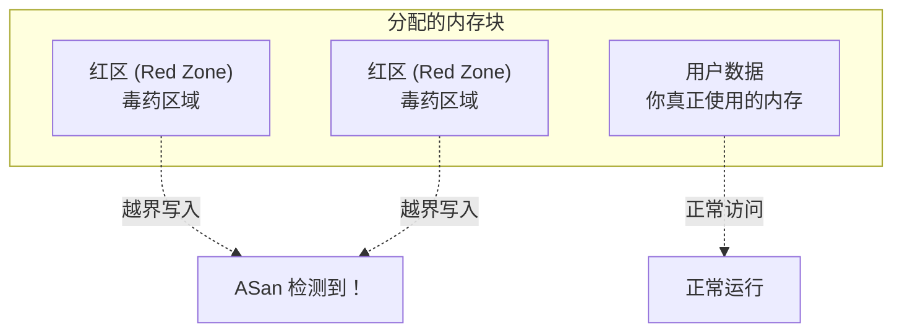

+++
title = "第 20 章：调试技术——与 Bug 的斗智斗勇"
weight = 200
date = "2026-03-29T22:34:00+08:00"
type = "docs"
description = ""
isCJKLanguage = true
draft = false
+++

# 第 20 章：调试技术——与 Bug 的斗智斗勇

'/%3E%3Cpath d='M475 80 L600 80' stroke='%232c3e50' stroke-width='3' marker-end='url(%23arrow)'/%3E%3Crect x='200' y='180' width='400' height='150' rx='15' fill='%233498db' stroke='%232c3e50' stroke-width='2' opacity='0.2'/%3E%3Ctext x='400' y='220' text-anchor='middle' fill='%232c3e50' font-size='16' font-family='Arial' font-weight='bold'%3E调试工具箱%3C/text%3E%3Ctext x='400' y='250' text-anchor='middle' fill='%232c3e50' font-size='13' font-family='Arial'%3EGDB / LLDB / Valgrind / ASan / UBSan / printf%3C/text%3E%3Ctext x='400' y='280' text-anchor='middle' fill='%232c3e50' font-size='13' font-family='Arial'%3E核心转储 / 远程调试 / 日志分析%3C/text%3E%3Cdefs%3E%3Cmarker id='arrow' markerWidth='10' markerHeight='10' refX='9' refY='3' orient='auto'%3E%3Cpath d='M0,0 L0,6 L9,3 z' fill='%232c3e50'/%3E%3C/marker%3E%3C/defs%3E%3C/svg%3E)

各位亲爱的 C 语言战士们，欢迎来到第 20 章！

如果说写代码是一场冒险，那么调试（Debugging）就是这场冒险中最刺激的"打怪环节"。你的程序莫名其妙崩溃了、内存像水一样哗哗漏掉了、明明赋值了但变量跟失忆了一样还是零——这些都是 Bug 在作祟。

Bug 这个词直译是"虫子"，但它可不是什么可爱的小昆虫。程序里的 Bug 是这样的：它可能在第 387 行的某个角落里偷偷改了你变量的值，然后让你的程序在完全不相干的地方崩溃。就好像你家厨房的蟑螂，你明明在卧室睡觉，它却在厨房把燃气灶打开了。

本章我们将学习各种调试技术，从老派的 `printf` 大法到现代化的 AddressSanitizer，从命令行调试器到生产环境远程调试。准备好了吗？让我们开始这场"虫虫大作战"！

---

## 20.1 GDB 全面掌握——命令行调试之王

GDB（GNU Debugger）是 Linux 环境下最强大的调试工具。如果说 Visual Studio 的调试器是自动挡汽车，那 GDB 就是手动挡——你需要自己换挡（输入命令），但你能感受到每一个细节，而且省油（资源占用极低）。

很多初学者看到 GDB 的黑框框就怂了，心想："这玩意儿怎么跟黑客电影似的？"别怕，GDB 其实是个好脾气的大叔，你只要用对命令，它就会乖乖听话。

### 20.1.1 编译时开启调试信息——给 GDB 戴上眼镜

你想让 GDB 帮你调试？那首先得让它"看见"你的代码。

普通编译出来的程序，GDB 看到的是一堆机器码，就像让你看没有字幕的《猫和老鼠》——你知道老鼠在搞事情，但你不知道它具体在干嘛。

```c
// debug_demo.c
#include <stdio.h>

int add(int a, int b) {
    int result = a + b;
    return result;
}

int main(void) {
    int x = 10;
    int y = 20;
    int sum = add(x, y);
    printf("10 + 20 = %d\n", sum);
    return 0;
}
```

用 `-g` 选项编译：

```c
gcc -g debug_demo.c -o debug_demo
```

`-g` 会把调试信息嵌入可执行文件，包括：
- **行号对应关系**：告诉 GDB 机器码对应源代码的哪一行
- **变量名**：而不是一堆抽象的寄存器地址
- **函数名和参数**：让你知道调用栈里都是谁

但光有 `-g` 还不够。对于调试，我们通常还会加 `-O0`，意思是"零优化"（字母 O 加大写字母零）：

```c
gcc -g -O0 debug_demo.c -o debug_demo
```

为什么要关闭优化？因为编译器优化后会"重排"代码。举个例子：

```c
int calculate() {
    int a = 10;      // 编译器可能直接把这个改成常数 10
    int b = a + 5;   // 优化成 b = 15
    return b * 2;    // 优化成 return 30
}
```

优化后，GDB 看到的变量 `a` 和 `b` 可能已经被"优化掉"了，或者它们的值在寄存器里而不是内存里，你用 GDB 看的时候会发现变量"消失"了。

> **小贴士**：`-O0` 中的 `O` 是大写字母 O，不是数字零。初学者经常搞混，编译器会报错"unrecognized option '-O0'"——这时候就要检查你是不是把 O 打成了 0。

### 20.1.2 核心命令——GDB 的六脉神剑

启动 GDB 调试程序：

```c
gdb ./debug_demo
```

或者更懒人的方式，一步到位：

```c
gdb -ex "run" -ex "quit" ./debug_demo
```

进入 GDB 后，你会看到 `(gdb)` 提示符。常用命令来了：

#### `run`（简写 `r`）——启动程序

```c
(gdb) run
```

就一个字：跑！如果程序正常退出，你会看到正常的输出和退出状态。如果程序崩溃了，GDB 会停下来告诉你崩溃在哪里。

#### `break`（简写 `b`）——设置断点

断点就像红绿灯，告诉程序："你给我停这儿！"

```c
(gdb) break main          // 在 main 函数入口停下来
(gdb) break 15            // 在第 15 行停下来
(gdb) break add           // 在 add 函数开头停下来
(gdb) break debug_demo.c:20  // 在指定文件的第 20 行停下来
```

设置成功后，GDB 会显示：`Breakpoint 1 at 0x... : file debug_demo.c, line 15.`

#### `next`（简写 `n`）——单步执行（不进入函数）

假设你现在停在 `main` 函数里，下一行是 `sum = add(x, y);`：

```c
(gdb) next
```

GDB 会把 `add` 函数当做一个整体执行完，然后停在下一行。它不会钻进 `add` 函数内部去看热闹。

#### `step`（简写 `s`）——单步执行（进入函数）

```c
(gdb) step
```

GDB 会钻进 `add` 函数内部，一行一行地执行。这样你就能看到 `add` 函数里发生了什么。

> **生活比喻**：`next` 就像看电视剧时按"下一集"，跳过片头片尾；`step` 就像按"下一帧"，慢动作播放。

#### `finish`（简写 `fi`）——运行到当前函数返回

当你钻进一个函数后发现"嗯，这函数没问题"，可以：

```c
(gdb) finish
```

GDB 会执行完当前函数剩余代码，停在调用者的下一行。

#### `continue`（简写 `c`）——继续运行到下一个断点

```c
(gdb) continue
```

程序会继续跑，直到遇到下一个断点或者程序结束。

### 20.1.3 查看数据——GDB 的透视眼

程序停下来了，怎么知道各个变量的值？GDB 给你准备了几把透视镜。

#### `print`（简写 `p`）——打印变量值

```c
(gdb) print x
$1 = 10
(gdb) print y
$2 = 20
(gdb) print sum
$3 = 30
(gdb) print &x            // 打印变量地址
$4 = (int *) 0x7fff5fbff42c
(gdb) print *0x7fff5fbff42c  // 打印地址里的值
$5 = 10
```

`print` 还能做数学运算：

```c
(gdb) print x + y
$6 = 30
(gdb) print sizeof(int)
$7 = 4
```

#### `display`（简写 `disp`）——自动显示

每次程序停下来，自动显示某些变量的值：

```c
(gdb) display x
(gdb) display sum
```

这样你就不用每次手动 `print` 了，特别适合循环里追踪变量变化。

取消自动显示：

```c
(gdb) undisplay 1    // 取消编号为 1 的自动显示
(gdb) disable display  // 暂停所有自动显示
```

#### `info registers`——查看寄存器

寄存器是 CPU 内部的小仓库，读写速度比内存快得多（但也贵得多）。

```c
(gdb) info registers
rax            0x0    0
rbx            0x0    0
rcx            0x0    0
rdx            0x0    0
rsi            0x0    0
rdi            0x0    0
rbp            0x7fff5fbff430  0x7fff5fbff430
rsp            0x7fff5fbff428  0x7fff5fbff428
r8             0x0    0
r9             0x0    0
...
```

只看某个寄存器：

```c
(gdb) print $rax
```

#### `x`——查看内存

`x` 是 examine（检查）的缩写，用来查看原始内存数据。

```c
(gdb) x/4x &x      // 以十六进制格式查看 &x 开始的 4 个 4 字节整数
0x7fff5fbff42c: 0x0000000a  0x00000014  0x0000001e  0x00000000

(gdb) x/s 0x4005b9    // 以字符串格式查看
0x4005b9: "Hello, GDB!"

(gdb) x/10c &sum     // 以字符格式查看
0x7fff5fbff438: 48 '0'  50 '2'  32 ' '  43 '+'  32 ' '  50 '2'  10 '\n'  0 '\0'
```

`x` 的格式是 `x/[数量][格式][单位] 地址`：
- **格式**：x（十六进制）、d（十进制）、c（字符）、s（字符串）、f（浮点数）
- **单位**：b（字节）、h（半字=2字节）、w（字=4字节）、g（双字=8字节）

### 20.1.4 调用栈——函数的"朋友圈"

当程序崩溃时，调用栈能告诉你"谁把谁叫出来了"。想象一下：你在公司开会，老板叫你，老板是经理叫的，经理是 CEO 叫的——这就是调用栈。

#### `backtrace`（简写 `bt`）——查看调用栈

```c
(gdb) bt
#0  add (a=10, b=20) at debug_demo.c:3
#1  0x00000000004005a6 in main () at debug_demo.c:11
```

这表示：
- 当前停在 `add` 函数（第 0 层）
- `add` 是被 `main` 函数的第 11 行调用的（第 1 层）

#### `frame`（简写 `f`）——切换栈帧

```c
(gdb) frame 1    // 切换到第 1 层（main 函数）
#1  0x00000000004005a6 in main () at debug_demo.c:11
11        sum = add(x, y);
```

现在你看到的就是 `main` 函数的上下文了。

#### `up` 和 `down`——在栈中移动

```c
(gdb) up    // 往调用者方向移动一层（看谁调用的我）
(gdb) down  // 往被调用者方向移动一层（看我调用的谁）
```

### 20.1.5 条件断点 / 监视点 / 命令列表——断点的豪华升级版

普通断点是"遇则停"，但有时候你需要更智能的断点。

#### 条件断点——设置门槛

假设你在一个循环里，第 10000 次循环时才出问题：

```c
(gdb) break 25 if i == 10000
Breakpoint 1 at 0x4005a9: file debug_demo.c, line 25.
```

这样断点只在 `i == 10000` 时生效，不用按 10000 次 `next` 了！

修改现有断点的条件：

```c
(gdb) condition 1 i == 5000    // 给断点 1 添加条件
(gdb) condition 1              // 删除断点 1 的条件，变成普通断点
```

#### 监视点——盯着变量

监视点（Watchpoint）不是停在哪一行，而是当某个变量被读取或修改时停下。

```c
(gdb) watch sum       // 当 sum 被写入时停下
(gdb) rwatch sum      // 当 sum 被读取时停下
(gdb) awatch sum      // 当 sum 被读写时停下
```

> **使用场景**：假设你有个变量莫名其妙被改掉了，但你不知道是谁干的。设置 `watch` 变量，GDB 会停在修改它的那一刻——"凶手"就暴露了。

监视点配合条件更强大：

```c
(gdb) break 30 if sum > 100
```

#### 命令列表——断点的自动脚本

当断点触发时，让 GDB 自动执行一系列命令：

```c
(gdb) commands 1
> print x
> print y
> print sum
> continue
> end
```

这样每次断点 1 触发，GDB 会自动打印变量然后继续运行，特别适合在循环中观察数据变化。

### 20.1.6 GDB TUI——给 GDB 装上可视化界面

纯命令行的 GDB 看起来有点单调？GDB TUI（Text User Interface）给你一个简易的源码窗口！

```c
gdb -tui ./debug_demo
```

或者进入 GDB 后按 `Ctrl+X` 然后按 `A` 切换 TUI 模式。

常用 TUI 命令：

```c
(gdb) layout src      // 显示源码窗口
(gdb) layout asm      // 显示汇编窗口
(gdb) layout split    // 同时显示源码和汇编
(gdb) layout regs     // 显示寄存器和源码
```

在 TUI 模式下，你可以看到当前执行到的行有箭头指示，断点显示为 `B+` 标记。

> **快捷键**：
> - `Ctrl+P` / `Ctrl+N`：上下切换历史命令
> - `Ctrl+L`：刷新屏幕（当显示乱的时候）
> - `Ctrl+X A`：退出 TUI 模式

### 20.1.7 调试优化代码的技巧——在迷雾中寻找真相

有时候你不得不在 `-O2` 优化的代码里调试，这就像在化了妆的嫌疑人里找凶手——有点难度，但不是没有办法。

#### 行号错位

优化后，源码和机器码的对应关系可能"漂移"：

```c
(gdb) list
1: int calculate() {
2:     int a = 10;
3:     int b = 20;
4:     int c = a + b;
5:     return c;
6: }
```

但 GDB 可能显示你停在"第 2 行"，而源码里第 2 行只是一个空行。这是因为编译器把多条源码语句合并成一条机器指令了。

**应对策略**：用 `list` 查看当前 GDB 认为的代码，用 `info line *0x...` 查看实际对应的机器码地址。

#### 内联函数

`inline` 关键字告诉编译器"把这个函数直接展开在调用处，不要单独生成函数代码"。

结果是：调用栈里看不到这个函数名，因为它的代码已经"融化"在调用者里面了。

**应对策略**：用 `print` 手动查看相关变量，或者在源代码里找内联函数的开始位置（通常是调用者文件内）。

#### 寄存器优化

优化后，变量的值可能在寄存器里而不是内存里。这时候 `print` 变量可能显示 `<optimized out>`——变量被"优化掉"了。

**应对策略**：
1. 尽量用 `-O0` 调试
2. 如果必须用 `-O2`，用 `info registers` 查看寄存器，手动推断值
3. 把变量声明为 `volatile` 可以阻止编译器把它放到寄存器里优化掉

```c
volatile int critical_value;  // volatile 告诉编译器"别动这个变量"
```

---

## 20.2 LLDB——macOS 和部分 Linux 的调试利器

LLDB（Low Level Debugger）是 macOS（以及部分 Linux 发行版）上的默认调试器，由 LLVM 项目开发。它的命令和 GDB 很相似，但语法略有不同。

```c
lldb ./debug_demo
(lldb) target create ./debug_demo
```

### LLDB vs GDB 命令对照

| 功能 | GDB | LLDB |
|------|-----|------|
| 运行 | `run` / `r` | `process launch` / `run` |
| 单步（不进入） | `next` / `n` | `next` / `n` |
| 单步（进入） | `step` / `s` | `step` / `s` |
| 继续 | `continue` / `c` | `continue` / `c` |
| 设置断点 | `break 15` | `breakpoint set --line 15` |
| 打印变量 | `print x` | `frame variable x` |
| 查看调用栈 | `backtrace` / `bt` | `thread backtrace` |
| 查看寄存器 | `info registers` | `register read` |

### LLDB 的特色功能

#### 静态分析（不运行程序）

```c
(lldb) image lookup --address 0x1234   // 查找地址对应的源码信息
(lldb) source list                     // 列出当前文件源码
```

#### 进程附加

调试一个正在运行的程序：

```c
lldb -p <进程ID>
```

或者：

```c
(lldb) process attach --pid <进程ID>
```

### 一个小例子

```c
// lldb_demo.c
#include <stdio.h>

int factorial(int n) {
    if (n <= 1) return 1;
    return n * factorial(n - 1);
}

int main(void) {
    int result = factorial(5);
    printf("5! = %d\n", result);  // 输出: 5! = 120
    return 0;
}
```

在 LLDB 中调试：

```c
(lldb) breakpoint set --name main
(lldb) run
(lldb) step
(lldb) frame variable n    // 查看变量 n
(int) n = 5
(lldb) next
(lldb) continue
Process 12345 exited with status = 0
```

---

## 20.3 Valgrind——内存问题的福尔摩斯

Valgrind 是一套强大的动态分析工具集，其中最著名的就是 **memcheck**（内存检查器）。它能检测出 C/C++ 程序中的：
- **内存泄漏**（malloc 了但没 free）
- **越界访问**（数组下标超出范围）
- **使用未初始化内存**（读取了没有赋值的变量）
- **释放后使用**（free 之后再访问）

### 20.3.1 memcheck——内存泄漏的克星

```c
// valgrind_demo.c
#include <stdlib.h>
#include <stdio.h>

void leak_memory() {
    int *ptr = (int *)malloc(sizeof(int) * 10);
    ptr[0] = 42;
    // 忘记 free(ptr)！内存泄漏了！
}

int main(void) {
    leak_memory();
    printf("程序结束了\n");  // 输出: 程序结束了
    return 0;
}
```

编译并运行（不用加 `-g` 也可以，但加了能看到更详细的行号）：

```c
gcc -g valgrind_demo.c -o valgrind_demo
valgrind --leak-check=full ./valgrind_demo
```

Valgrind 的输出：

```
==12345== Memcheck, a memory error detector
==12345== Copyright (C) 2002-2024, and GNU GPL'd, by Julian Seward et al.
==12345== Using Valgrind-3.21.0 and LibVEX; rerun with -h for copyright info
==12345== Command: ./valgrind_demo
==12345==
程序结束了
==12345==
==12345== HEAP SUMMARY:
==12345==   in use at exit: 40 bytes in 1 blocks
==12345==   total heap usage: 1 allocs, 0 frees, 40 bytes allocated
==12345==
==12345== 40 bytes in 1 blocks are definitely lost in loss record 1 of 1:
==12345==    at 0x4C29B3F: malloc (vg_replace_malloc.c:...)
==12345==    by 0x1086AB: leak_memory (valgrind_demo.c:6)
==12345==    by 0x1086D3: main (valgrind_demo.c:12)
==12345==
==12345== LEAK SUMMARY:
==12345==    definitely lost: 40 bytes in 1 blocks
```

看！Valgrind 精准地告诉你：
1. 有 40 字节内存在 1 个 block 里泄漏了
2. 泄漏发生在 `leak_memory` 函数的第 6 行（`malloc` 调用）
3. 调用链是 `main` -> `leak_memory`

### 20.3.2 越界访问检测

```c
// out_of_bounds.c
#include <stdlib.h>
#include <stdio.h>

int main(void) {
    int *arr = (int *)malloc(sizeof(int) * 5);  // 分配 5 个 int 的空间

    for (int i = 0; i <= 5; i++) {  // 注意是 <=，多循环了一次！
        arr[i] = i;
    }

    printf("arr[0] = %d\n", arr[0]);  // 输出: arr[0] = 0

    free(arr);
    return 0;
}
```

```c
gcc -g out_of_bounds.c -o out_of_bounds
valgrind ./out_of_bounds
```

Valgrind 会报告：

```
Invalid write of size 4
   at 0x1086AB: main (out_of_bounds.c:7)
Address 0x... is 20 bytes after a block of size 20 alloc'd
```

### 20.3.3 helgrind——数据竞争的探测器

多线程程序里最头疼的问题之一是**数据竞争**（Data Race）——两个线程同时访问同一个内存位置，至少有一个是写操作，而且没有任何同步机制。

```c
// helgrind_demo.c
#include <pthread.h>
#include <stdio.h>

int counter = 0;  // 全局变量，多个线程会访问它

void *thread_func(void *arg) {
    for (int i = 0; i < 100000; i++) {
        counter++;  // 这行有数据竞争！
    }
    return NULL;
}

int main(void) {
    pthread_t t1, t2;
    pthread_create(&t1, NULL, thread_func, NULL);
    pthread_create(&t2, NULL, thread_func, NULL);
    pthread_join(t1, NULL);
    pthread_join(t2, NULL);
    printf("counter = %d\n", counter);  // 输出可能是 200000，也可能不是
    return 0;
}
```

编译时要加 `-pthread`：

```c
gcc -g -pthread helgrind_demo.c -o helgrind_demo
valgrind --tool=helgrind ./helgrind_demo
```

Helgrind 会报告：

```
Possible data race during write of size 4 at 0x... by thread #1
   ...at 0x... in thread_func (helgrind_demo.c:9)
This conflicts with a previous read of size 4 at 0x... by thread #2
   ...at 0x... in thread_func (helgrind_demo.c:9)
```

### 20.3.4 cachegrind——缓存命中率的分析器

缓存（Cache）是 CPU 和内存之间的"中转站"，速度比内存快很多。如果程序经常要访问的数据都在缓存里，程序就快；如果缓存老miss（未命中），程序就慢。

```c
gcc -g program.c -o program
valgrind --tool=cachegrind ./program
```

Cachegrind 会输出类似：

```
I1  refs:       12,345
I1  misses:       123
I1  miss rate:     1.0%

D1  refs:       67,890
D1  misses:     2,345
D1  miss rate:     3.5%

LL refs:         345
LL misses:       123
LL miss rate:     0.3%
```

- **I1**：一级指令缓存
- **D1**：一级数据缓存
- **LL**：最后一级缓存（Last Level）

---

## 20.4 AddressSanitizer（ASan）——速度与精度兼备的内存检测

Valgrind 功能强大，但有个致命缺点：**慢**。它是用模拟的方式运行程序，速度会慢 10-50 倍。有时候你等 Valgrind 跑完一个程序，茶都凉了。

AddressSanitizer（ASan）就不一样了！它是编译器内置的内存检测工具，速度只慢 2 倍左右。

### 20.4.1 工作原理——在内存周围建"警戒线"

ASan 的思想是在每次 `malloc` 分配内存时，在用户数据前后各加一块"红区"（Red Zone），并标记为不可访问。如果程序越界写到红区，或者释放后继续使用，ASan 立刻就能检测到。



### 20.4.2 使用方法——加个编译选项就行

```c
gcc -g -fsanitize=address out_of_bounds.c -o out_of_bounds
./out_of_bounds
```

输出：

```
=================================================================
==23456== AddressSanitizer: heap-buffer-overflow on address 0x...
==23456== WRITE of size 4 at 0x... thread T0
==23456==    #0 0x... in main out_of_bounds.c:7
==23456== 0x... is located 20 bytes after a block of size 20 alloc'd
==23456==    #0 0x... in malloc printf
==23456==    #0 0x... in main out_of_bounds.c:6
```

### 20.4.3 ASan vs Valgrind——速度与精度的权衡

| 特性 | AddressSanitizer | Valgrind (memcheck) |
|------|------------------|---------------------|
| 速度影响 | 约 2x  slowdown | 约 10-50x slowdown |
| 内存开销 | 约 2x | 约 3-5x |
| 检测范围 | 堆/栈/全局越界<br/>内存泄漏<br/>释放后使用 | 同左，另外有<br/>未初始化读取检测 |
| 平台支持 | GCC 4.8+ / Clang 3.1+ | x86, ARM, MIPS 等 |
| 附加调试 | 否 | 可配合 GDB |

> **实战建议**：
> - 开发阶段、快速迭代：用 ASan，速度快
> - 找不到问题、需要更详细信息：用 Valgrind，慢慢来但查得全
> - 两者结合用也不失为一种策略

---

## 20.5 MemorySanitizer（MSan）——未初始化内存的克星

你有没有遇到过这种玄学 Bug：变量明明应该有个值，但打印出来是乱码？很可能就是**读取了未初始化的内存**。

MemorySanitizer（MSan）专门检测这类问题。

```c
// msan_demo.c
#include <stdio.h>

int main(void) {
    int x;           // 没有初始化！
    if (x > 0) {     // 读取了未初始化内存！
        printf("x 是正数\n");
    } else {
        printf("x 不是正数\n");
    }
    return 0;
}
```

编译并运行：

```c
gcc -g -fsanitize=memory msan_demo.c -o msan_demo
./msan_demo
```

MSan 会报错：

```
==34567== MemorySanitizer: use-of-uninitialized-value
==34567==     #0 0x... in main msan_demo.c:6
==34567==   Caused by: 1 byte in a stack frame
```

> **注意**：MSan 目前只支持 Clang 编译器（macOS 和 Linux 的 Clang 都支持）。GCC 用户可以考虑用 Valgrind 的 memcheck 工具来检测未初始化内存。

---

## 20.6 UndefinedBehaviorSanitizer（UBSan）——未定义行为的警报器

C 语言有一些"未定义行为"（Undefined Behavior，简称 UB），意思是标准没有规定这种情况下程序该怎么表现。编译器可能：
- 假设这种情况永远不会发生，然后优化掉相关代码
- 产生一些"诡异"的机器指令
- 随机返回结果

常见 UB 包括：
- **除以零**：`int x = 5 / 0;`
- **有符号整数溢出**：`int x = INT_MAX + 1;`
- **空指针解引用**：`int *p = NULL; *p = 42;`
- **数组越界访问**：`int arr[5]; arr[10] = 1;`
- **访问不存在联合体成员**

```c
// ubsan_demo.c
#include <stdio.h>
#include <limits.h>

int main(void) {
    int big = INT_MAX;  // 2147483647
    int overflow = big + 1;  // 有符号整数溢出 UB！
    printf("overflow = %d\n", overflow);
    return 0;
}
```

编译并运行：

```c
gcc -g -fsanitize=undefined ubsan_demo.c -o ubsan_demo
./ubsan_demo
```

输出：

```
ubsan_demo.c:6:19: runtime error: addition of unsigned offset to
pointer of type 'int *' overflowed
```

UBSan 会检测以下未定义行为：
- `-fsanitize=shift`：移位超出范围
- `-fsanitize=integer-divide-by-zero`：整数除以零
- `-fsanitize=unreachable`：到达不可达代码
- `-fsanitize=vla-bound`：变长数组边界为负
- `-fsanitize=null`：空指针解引用
- `-fsanitize=alignment`：对齐访问违规

可以一次性开启所有检测：

```c
gcc -g -fsanitize=undefined -fno-sanitize-recover=all ubsan_demo.c -o ubsan_demo
```

`-fno-sanitize-recover=all` 让程序在遇到第一个 UB 时就 abort，方便调试。

---

## 20.7 Windows 调试工具——WinDbg 与 Visual Studio

在 Windows 上，我们有更"现代化"的调试工具。

### 20.7.1 Visual Studio Debugger——IDE 里的瑞士军刀

如果你用 Visual Studio 打开 C 项目，调试非常直观：

1. **设置断点**：点击代码行号左边，或者按 F9
2. **启动调试**：按 F5（或绿色三角按钮）
3. **单步执行**：F10（不进入函数）/ F11（进入函数）
4. **查看变量**：鼠标悬停在变量上，或者打开"监视"窗口
5. **调用栈**：打开"调用堆栈"窗口

Visual Studio 的调试器还支持：
- **条件断点**：右键断点 -> 条件表达式
- **监视点**：调试 -> Windows -> 断点 -> 新建 -> 监视断点
- **即时窗口**：输入代码片段实时执行

### 20.7.2 WinDbg——微软的官方调试器

WinDbg 是微软提供的命令行调试器，功能强大，特别适合调试内核问题。

```c
// windbg_demo.c
#include <stdio.h>

int main(void) {
    printf("Hello, WinDbg!\n");  // 输出: Hello, WinDbg!
    return 0;
}
```

编译（Debug 模式）：

```c
cl /Zi /Od windbg_demo.c /Fe:windbg_demo.exe
```

启动 WinDbg，加载程序：

```c
WinDbg -g windbg_demo.exe
```

常用命令：

```c
bp main          // 在 main 函数设置断点
g                // 继续运行
p                // 单步执行（不进入）
t                // 单步执行（进入）
? esp            // 查看寄存器
dump dump.bin    // 导出内存
```

### 20.7.3 PageHeap——Windows 的堆检查器

PageHeap 是 Windows SDK 自带的工具，专门用来检测堆相关的错误（类似 Linux 上的 Valgrind）。

启用全局 PageHeap（需要管理员权限）：

```c
gflags /p /enable myprogram.exe /full
```

之后运行程序，PageHeap 会在每次堆操作时做额外检查，发现问题时会弹出对话框或写入日志。

---

## 20.8 核心转储——程序崩溃时的"黑匣子"

想象一下：飞机失事了，调查员会去找黑匣子（Cockpit Voice Recorder / Flight Data Recorder）。程序崩溃了，调查员去找**核心转储**（Core Dump）。

核心转储是程序崩溃那一瞬间的"快照"——把进程的内存状态、寄存器值、调用栈全部保存到一个文件里。之后你可以用 GDB 加载这个快照，慢慢分析崩溃原因。

### 20.8.1 开启核心转储——先建好"黑匣子"

在 Linux 上，核心转储默认可能是关闭的。需要手动开启：

#### 方法一：`ulimit` 命令（当前会话有效）

```bash
ulimit -c unlimited    # 允许生成任意大小的核心转储文件
```

#### 方法二：永久开启

在 `/etc/security/limits.conf` 中添加：

```
*    soft    core    unlimited
```

在 `/proc/sys/kernel/core_pattern` 中设置核心转储文件的命名格式：

```bash
echo "/tmp/core-%e-%p-%t" > /proc/sys/kernel/core_pattern
```

- `%e`：程序名（executable name）
- `%p`：进程 ID
- `%t`：时间戳

### 20.8.2 触发核心转储

现在运行会崩溃的程序：

```c
// crash_demo.c
#include <stdio.h>

int main(void) {
    int *ptr = NULL;
    *ptr = 42;  // 空指针解引用，程序崩溃！
    return 0;
}
```

```bash
gcc -g crash_demo.c -o crash_demo
./crash_demo
# 终端会打印：Segmentation fault (core dumped)
# 当前目录会生成 core-%e-%p-%t 文件
```

### 20.8.3 用 GDB 分析核心转储

```bash
gdb ./crash_demo /tmp/core-crash_demo-12345-1234567890
```

进入 GDB 后：

```c
(gdb) bt         // 查看崩溃时的调用栈
#0  0x00000000004005a7 in main () at crash_demo.c:5
(gdb) print ptr
$1 = (int *) 0x0
(gdb) info registers
```

核心转储让你可以事后分析崩溃现场，特别适合：
- **生产环境**：程序在用户机器上崩溃了，用户把核心转储发给你
- **长时间运行的程序**：程序运行了 3 天才崩溃，你不可能等 3 天再调试

### 20.8.4 `coredumpctl`——systemd 系统的核心转储管理

现代 Linux（用 systemd 的发行版）可以用 `coredumpctl` 管理核心转储：

```bash
# 列出所有核心转储
coredumpctl list

# 查看最新的核心转储信息
coredumpctl info

# 用 GDB 分析最新的核心转储
coredumpctl gdb

# 清理核心转储
coredumpctl delete
```

---

## 20.9 `printf` 调试法的艺术——古老而有效

你可能会想："我费这么大劲学 GDB，最后发现还是 `printf` 最香？" 别笑，这是很多老程序员的真实想法。

`printf` 调试法简单粗暴、门槛低、不需要任何工具、随时随地可用。它的精髓是：**在可疑的地方插入 print 语句，看看变量的值是什么**。

```c
// printf_debug.c
#include <stdio.h>

int binary_search(int arr[], int len, int target) {
    int left = 0, right = len - 1;
    while (left <= right) {
        int mid = left + (right - left) / 2;
        printf("[调试] left=%d, right=%d, mid=%d, arr[mid]=%d\n",
               left, right, mid, arr[mid]);  // 打印每次迭代的状态
        if (arr[mid] == target) {
            printf("[调试] 找到了！在索引 %d\n", mid);
            return mid;
        } else if (arr[mid] < target) {
            left = mid + 1;
        } else {
            right = mid - 1;
        }
    }
    printf("[调试] 没找到 %d\n", target);
    return -1;
}

int main(void) {
    int arr[] = {1, 3, 5, 7, 9, 11, 13, 15, 17, 19};
    int len = sizeof(arr) / sizeof(arr[0]);
    int idx = binary_search(arr, len, 7);
    printf("找到了，索引 = %d\n", idx);  // 输出: 找到了，索引 = 3
    return 0;
}
```

### `printf` 调试的进阶技巧

#### 1. 宏定义调试开关

```c
#ifdef DEBUG
    #define D printf
#else
    #define D if(0) printf  // 调试结束后设成 0，一行代码禁用所有调试输出
#endif

int main(void) {
    int x = 10;
    D("[DEBUG] x = %d\n", x);
    // 正式发布时，编译选项加 -DDEBUG 可以看到输出
    // 或者注释掉 #define D if(0) printf 改成 #define D printf
    return 0;
}
```

#### 2. 时间戳和函数名

```c
#define LOG(fmt, ...) \
    fprintf(stderr, "[%s:%s:%d] " fmt "\n", \
            __FILE__, __FUNCTION__, __LINE__, ##__VA_ARGS__)

LOG("x = %d, y = %d", x, y);
// 输出: [myfile.c:main:42] x = 10, y = 20
```

#### 3. 二分查找法定位问题

别傻傻地从程序开头一路 print 到底。用二分法：先在程序中间 print，发现问题在前半段还是后半段，再去那一半的中间 print，依次类推。log n 的时间复杂度，比线性查找快多了！

> **什么时候用 `printf`，什么时候用 GDB？**
> 
> `printf` 适合：简单逻辑、变量值不多、快速验证
> GDB 适合：复杂调用栈、内存问题、需要频繁切换上下文

---

## 20.10 生产环境调试——远程调试与日志分析

到了生产环境（Production Environment），你的程序跑在用户的服务器上，你没法跑到用户电脑前插上显示器打开 GDB。这个时候怎么办？

### 20.10.1 远程调试——人在家中坐，BUG 天上来

#### gdbserver——让程序"直播"给 GDB

思路：程序在远程机器上跑，但把调试信息传给本地 GDB。

**远程机器（程序运行环境）**：

```bash
gdbserver localhost:12345 ./myprogram
```

**本地机器（你有 GDB 和源码）**：

```bash
gdb ./myprogram
(gdb) target remote 远程机器IP:12345
(gdb) bt    # 查看远程程序的调用栈
(gdb) print x  # 查看远程程序的变量
```

现在你在本地 GDB 里的每一步操作，都会在远程程序上实时反映出来。

> **安全提示**：远程调试会暴露程序的完整控制权，一定要通过加密通道（如 SSH 隧道）进行，不要直接暴露在公网上！

#### 编译带调试信息的二进制文件

远程调试时，二进制文件需要包含调试信息（`-g`），但不要包含优化（`-O0`）：

```bash
gcc -g -O0 -fno-omit-frame-pointer myprogram.c -o myprogram
```

`-fno-omit-frame-pointer` 确保调用栈信息完整，这在生产环境调试中很重要。

### 20.10.2 日志分析——程序的"日记本"

如果说核心转储是飞机的黑匣子（记录"发生了什么"），那日志就是程序的日记本（记录"每一步在想什么"）。

#### 设计好的日志系统

```c
// logger.h
#ifndef LOGGER_H
#define LOGGER_H

#include <stdio.h>
#include <time.h>

typedef enum {
    LOG_DEBUG = 0,
    LOG_INFO,
    LOG_WARN,
    LOG_ERROR
} LogLevel;

extern LogLevel g_log_level;

#define LOG(level, fmt, ...) \
    do { \
        if (level >= g_log_level) { \
            time_t now = time(NULL); \
            struct tm *t = localtime(&now); \
            fprintf(stderr, "[%04d-%02d-%02d %02d:%02d:%02d] [%s] " fmt "\n", \
                    t->tm_year + 1900, t->tm_mon + 1, t->tm_mday, \
                    t->tm_hour, t->tm_min, t->tm_sec, \
                    #level, ##__VA_ARGS__); \
        } \
    } while(0)

#define DEBUG(fmt, ...) LOG(LOG_DEBUG, fmt, ##__VA_ARGS__)
#define INFO(fmt, ...)  LOG(LOG_INFO, fmt, ##__VA_ARGS__)
#define WARN(fmt, ...)  LOG(LOG_WARN, fmt, ##__VA_ARGS__)
#define ERROR(fmt, ...) LOG(LOG_ERROR, fmt, ##__VA_ARGS__)

#endif
```

```c
// logger.c
#include "logger.h"

LogLevel g_log_level = LOG_INFO;  // 默认只显示 INFO 及以上
```

```c
// main.c
#include "logger.h"
#include <unistd.h>

int main(void) {
    INFO("程序启动，PID = %d", getpid());
    DEBUG("这是一条调试信息（默认不显示）");

    g_log_level = LOG_DEBUG;  // 改成 DEBUG 级别
    DEBUG("现在能看到这条了");

    int data[] = {1, 2, 3, 4, 5};
    for (int i = 0; i < 5; i++) {
        DEBUG("arr[%d] = %d", i, data[i]);
    }

    INFO("程序正常退出");
    return 0;
}
```

编译运行：

```bash
gcc -g main.c logger.c -o myprogram
./myprogram
# [2026-03-29 14:30:00] [LOG_INFO] 程序启动，PID = 12345
# [2026-03-29 14:30:00] [LOG_DEBUG] 现在能看到这条了
# [2026-03-29 14:30:00] [LOG_DEBUG] arr[0] = 1
# [2026-03-29 14:30:00] [LOG_DEBUG] arr[1] = 2
# [2026-03-29 14:30:00] [LOG_DEBUG] arr[2] = 3
# [2026-03-29 14:30:00] [LOG_DEBUG] arr[3] = 4
# [2026-03-29 14:30:00] [LOG_DEBUG] arr[4] = 5
# [2026-03-29 14:30:00] [LOG_INFO] 程序正常退出
```

#### 生产环境日志最佳实践

1. **分级日志**：DEBUG / INFO / WARN / ERROR 四级，线上默认 INFO 或 WARN
2. **结构化输出**：JSON 格式方便机器解析
   ```json
   {"level":"ERROR","time":"2026-03-29T14:30:00Z","msg":"连接失败","error":"timeout","host":"db.example.com"}
   ```
3. **记录上下文**：用户 ID、请求 ID、IP地址等，方便定位问题
4. **不要用 print 来调试**：用专门的日志系统，上线时可以通过配置关闭 DEBUG 日志

### 20.10.3 `assert`——防御式编程的好帮手

`assert` 是 C 标准库 `<assert.h>` 提供的宏，可以在调试阶段检查"不可能发生"的条件。如果条件为假，程序会 abort 并打印断言失败的文件和行号。

```c
#include <assert.h>
#include <stdio.h>

int divide(int a, int b) {
    assert(b != 0 && "除数不能为零！");  // 防御性检查
    return a / b;
}

int main(void) {
    int result = divide(10, 0);  // 这里会触发 assert
    return 0;
}
```

运行结果：

```
a.out: assert_demo.c:6: divide: Assertion `b != 0 && "除数不能为零！"' failed.
Aborted (core dumped)
```

> **注意**：release 版本记得关闭 assert（编译时加 `-DNDEBUG`），否则 assert 会检查造成性能损失。不过大部分编译器会自动优化掉没用的 assert。

---

## 本章小结

本章我们学习了 C 语言调试的各种"十八般武艺"：

### 调试工具全家桶

| 工具 | 擅长领域 | 速度 | 备注 |
|------|----------|------|------|
| **GDB** | 命令行调试、断点、查看内存/寄存器 | 快 | Linux 默认调试器 |
| **LLDB** | 同 GDB，语法略有不同 | 快 | macOS / LLVM 默认 |
| **Valgrind memcheck** | 内存泄漏、越界、未初始化读取 | 慢（10-50x） | 全模拟器 |
| **Valgrind helgrind** | 多线程数据竞争 | 慢 | 多线程专用 |
| **Valgrind cachegrind** | 缓存命中率分析 | 慢 | 性能优化用 |
| **AddressSanitizer** | 内存错误检测 | 快（2x） | 编译器内置 |
| **MemorySanitizer** | 未初始化内存读取 | 快 | Clang 专用 |
| **UndefinedBehaviorSanitizer** | 未定义行为检测 | 快 | 编译器内置 |
| **WinDbg / VS Debugger** | Windows 平台调试 | 快 | 图形界面友好 |
| **核心转储** | 程序崩溃后分析 | 无运行时开销 | 离线分析 |

### 调试技巧总结

1. **编译时加 `-g -O0`**：开启调试信息，关闭优化
2. **善用断点**：普通断点、条件断点、监视点配合使用
3. **调用栈分析**：`backtrace` 帮你理清函数调用关系
4. **ASan 是开发好朋友**：开发阶段用 ASan 快速发现问题
5. **Valgrind 是深度检查官**：ASan 找不到的问题再用 Valgrind
6. **`printf` 调试永不过时**：简单场景最有效
7. **生产环境靠日志和核心转储**：提前埋好日志，上线不慌张

### 心态最重要

调试是一场与 Bug 的斗智斗勇。Bug 很狡猾，但更狡猾的是那些隐藏得很深的 Bug——它们可能只在特定条件下触发（月圆之夜？用户输入特定字符串？内存布局恰好对齐？）。

遇到 Bug 时，深呼吸，理性分析，善用工具。你可能会花 2 小时调试一个问题，然后花 5 分钟修复——这很正常，这就是程序员的生活。高级工程师和初级工程师的区别，不在于写代码的速度，而在于调试的效率。

> **调试的秘诀**：耐心、逻辑、系统化。二分查找是调试界的"万能钥匙"——不断缩小问题范围，直到精确定位。

祝你在与 Bug 的战斗中旗开得胜！下一章见！

---

*版权声明：本教程由 OpenClaw AI 助手编写，版权所有 © 2026。允许任何人免费学习、参考，但禁止商业用途转载。*
