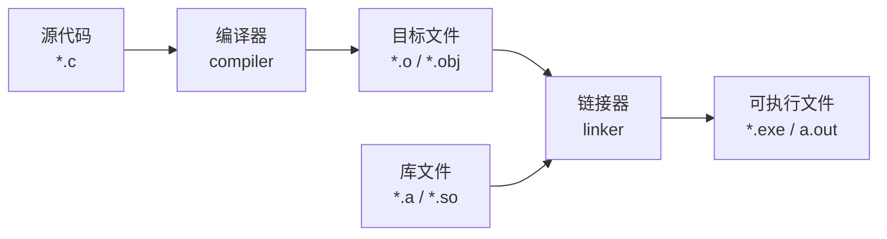
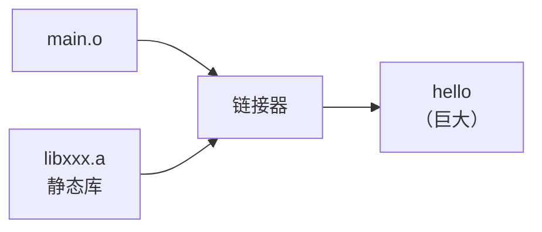
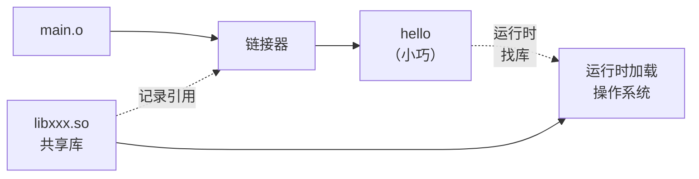
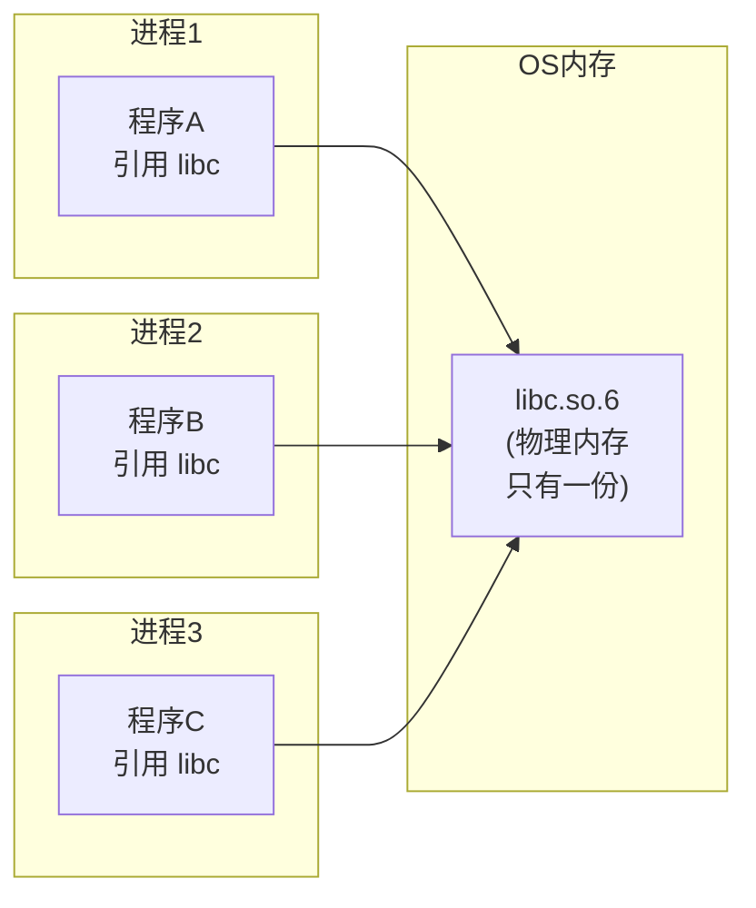

+++
title = "第 21 章：链接与多文件项目——代码的'拼图大赛'"
weight = 210
date = "2026-03-29T22:34:00+08:00"
type = "docs"
description = ""
isCJKLanguage = true
draft = false
+++

# 第 21 章：链接与多文件项目——代码的"拼图大赛"

嗨，亲爱的读者！欢迎来到 C 语言进阶的又一关键战场。

想象一下，你是一个大型乐高城市的设计师。你不会把城市的每一块砖都捏在手里——那太蠢了！你会把不同的模块分开做：办公楼一块、居民楼一块、桥梁一块……然后在最后时刻，把它们咔嚓一声拼在一起，变成一座完整的城市。

链接（Linking），就是 C 语言世界里的这个"咔嚓拼接"过程。

当你写一个hello world程序时，你可能觉得一切都是理所当然：`gcc main.c -o hello` 就搞定了。但编译器背后默默做了多少工作？链接器（linker）又是怎么把各种碎片组装成可执行文件的？本章将掀开这层神秘的面纱，让你真正理解"链接"这个幕后英雄。

---

## 21.1 编译 vs 链接：分别做了什么？

先来一张镇楼图：



来，让我们把这个过程想象成做菜：

### 编译：洗菜切菜阶段

**编译（Compilation）** 做的是"把原料变成半成品"的工作。具体来说：

- **语法检查**：看看你的代码有没有低级错误（比如括号不匹配、分号漏写）
- **语义分析**：检查类型是否匹配、变量是否声明
- **生成目标文件**：把你的 `.c` 文件翻译成机器能看懂的中间产品——目标文件（`.o` 文件）

这时，编译器就像一个严格的厨师：它把你的原材料（代码）洗干净、切好、摆盘，但**还没开始炒菜**。它不知道你的菜要和什么一起吃，也不知道有没有其他厨师也在做配套的菜。

### 链接：装盘上桌阶段

**链接（Linking）** 做的是"把所有半成品组装成完整菜肴"的工作。具体来说：

- **符号解析**：把函数调用和函数定义对上号（比如 `main()` 调用了 `printf()`，链接器要找到 `printf()` 在哪里）
- **地址重定位**：把代码里"placeholder"式地址翻译成真实的内存地址
- **合并段**：把多个目标文件的同类段合并（比如所有 `.text` 段合并到一起）
- **制作可执行文件**：把最终产物打包成一个完整的可执行文件

再用一个更生活化的比喻：

> 编译是写小说的一章，作者只需要专注自己这一章的剧情和人物，不关心其他章节发生了什么。
>
> 链接是总编审，把所有章节合在一起：检查张三在第一章说他是独生子，到第五章就不能突然冒出个双胞胎弟弟；检查每章的"敬请期待下回"能不能真的接到下一章的开头。

### 动手验证

来，用一个超级简单的例子感受一下：

```c
/* main.c */
#include <stdio.h>

void greet(void);  /* 声明：我需要这个函数，但不定义它 */

int main(void) {
    greet();
    return 0;
}
```

```c
/* greet.c */
#include <stdio.h>

void greet(void) {
    printf("Hello! 你好!\n");
}
```

```c
/* utils.c */
int square(int x) {
    return x * x;
}
```

编译目标文件（注意：`gcc -c` 只编译不链接）：

```bash
gcc -c main.c    # 生成 main.o
gcc -c greet.c   # 生成 greet.o
gcc -c utils.c   # 生成 utils.o
```

这时你会得到三个 `.o` 文件。每个文件都是"半成品"，单独是不能运行的。

链接成可执行文件：

```bash
gcc main.o greet.o utils.o -o hello
```

现在运行：

```bash
./hello
# 输出: Hello! 你好!
```

如果你只链接 `main.o` 和 `utils.o`（不链接 `greet.o`）：

```bash
gcc main.o utils.o -o hello
```

会发生什么？

```bash
# 链接错误:
# main.o: In function `main':
# main.c:(.text+0xa): undefined reference to `greet'
# collect2: error: ld returned 1 exit status
```

这就是"未定义的引用"错误——链接器找不到 `greet()` 函数的定义，因为定义在 `greet.c` 里，你没给它！

---

## 21.2 目标文件结构（ELF 格式初步）

好，现在你知道了链接器处理的是目标文件（`.o` 文件）。那目标文件里面到底是什么？

在 Linux 上，可执行文件和目标文件通常使用 **ELF**（Executable and Linkable Format，可执行和可链接格式）。这是 Unix/Linux 世界的标准格式——就像 PDF 在文档世界的地位。

> Windows 上用的是 **PE/COFF** 格式（`.exe` 和 `.obj`），macOS 用的是 **Mach-O** 格式。原理相通，细节不同。

用 `file` 命令可以看看文件类型：

```bash
file main.o
# main.o: ELF 64-bit LSB relocatable, x86-64, version 1 (SYSV), not stripped
```

`relocatable` 的意思就是"可重定位"——还没最终确定地址，等链接器来安排。

### 21.2.1 段（Section）：代码的"抽屉"

ELF 文件内部被划分成一个个**段（Section）**，你可以理解为一个文件柜里的不同抽屉，每个抽屉放不同类型的东西：

| 段名 | 存放内容 | 比喻 |
|------|----------|------|
| `.text` | 程序代码（机器指令） | 菜谱的文字步骤 |
| `.data` | 已初始化的全局/静态变量 | 准备好配料的房间（配料已经摆好） |
| `.bss` | 未初始化的全局/静态变量 | 准备好配料的房间（配料是空的，但占着位置） |
| `.rodata` | 只读数据（常量） | 刻在石板上的配方，不能改 |
| `.symtab` | 符号表（函数名、变量名） | 目录/索引 |
| `.strtab` | 字符串表（符号名字符串） | 符号名字符串本身 |
| `.rel.text` / `.rela.text` | `.text` 段的重定位信息 | 告诉链接器"这里有个地址等下要改" |
| `.rel.data` / `.rela.data` | `.data` 段的重定位信息 | 同上 |

为什么要有 `.bss` 段？这里有个小故事：

> 话说当年计算机内存很贵（现在也不便宜啦！）。有个聪明人想到：如果我声明了 1000 个 int 变量但都不初始化，它们的值反正都是 0，我为什么要真的在磁盘文件里写出 4000 个零字节？我只需要记录"这里有 4000 个字节需要清零"就行了！
>
> `.bss` 就是干这个的：它只记录"有这么多空间要清零"，不占用实际的磁盘空间。但程序加载运行时，操作系统会真的分配这些内存并清零。

验证一下 `.bss` 的"不占空间"魔法：

```c
/* bss_demo.c */
int uninitialized[1000000];  /* 在 .bss 段 */
int initialized[100] = {1, 2, 3};  /* 在 .data 段 */

int main(void) {
    return 0;
}
```

```bash
gcc -c bss_demo.c
ls -l bss_demo.o
# 文件很小，因为 .bss 不占磁盘空间

# 但是：
size bss_demo.o
#    text    data     bss     dec     hex filename
#     142      400  4000000  4000542  3d0a4e bss_demo.o
```

看，`data` 只有 400 字节（100 × 4），但 `bss` 有 4000000 字节（1000000 × 4）！磁盘文件里却只有 142 字节的代码。

### 21.2.2 工具：窥探目标文件的魔法道具

学会了用工具，你就像有了 X 光眼睛，能直接看到文件的"骨骼"。

#### `objdump -t`：看符号表

```bash
objdump -t greet.o
# greet.o:     file format elf64-x86-64
# 
# SYMBOL TABLE:
# ...

# 更友好的格式：
objdump -t greet.o | grep -E "FUNC|GLOB"
```

#### `objdump -d`：反汇编（看代码段内容）

```bash
objdump -d greet.o
```

输出大概是：

```
greet.o:     file format elf64-x86-64

Disassembly of section .text:

0000000000000000 <greet>:
   0:   55                      push   %rbp
   1:   48 89 e5                mov    %rsp,%rbp
   4:   48 83 ec 10             sub    $0x10,%rsp
   8:   48 8d 3d 00 00 00 00    lea    0x0(%rip),%rdi   # b <greet+0xb>
   f:   e8 00 00 00 00          call   0 <greet+0x14>
  14:   90                      nop
  15:   c9                      leave
  16:   c3                      ret
```

> 那些 `00 00 00 00` 就是还没填上的地址——链接以后才会被修正。

#### `nm`：列出符号

```bash
nm greet.o
# 0000000000000000 T greet
#                  U puts
```

- `T` = 符号在 `.text` 段（已定义，是可以执行的代码）
- `U` = 符号未定义（Undefined），等别人来提供

看 `puts` 为什么出现了？因为 `printf` 在 glibc 里被优化成了 `puts`（当参数不含格式符时）。

#### `readelf -a`：完整的 ELF 信息

```bash
readelf -a greet.o
```

这是最全的 ELF 查看工具，能看到段头（Section Headers）、符号表、重定位信息等等。

```bash
readelf -S greet.o   # 看所有段
readelf -s greet.o    # 看符号表（类似 nm）
readelf -r greet.o    #看重定位条目
```

---

## 21.3 静态链接 vs 动态链接

这是 C 语言里最重要的概念之一，很多人工作了好几年都没搞清楚。

### 静态链接：打包带走

**静态链接**把需要的库代码**复制**到最终的可执行文件里。



优点：
- 发布方便——一个文件搞定，不需要带着库文件跑
- 稳定性——永远不会出现"找不到库"的错误（因为已经打包进去了）

缺点：
- **体积大**：每个可执行文件都包含一份库代码，10 个程序就是 10 份
- **更新麻烦**：库更新了，所有用到这个库的程序都得重新编译链接

### 动态链接：共享租借

**动态链接**不复制代码，而是在可执行文件里**记录"去这里找这个库"**。



程序运行时，操作系统负责把共享库加载进内存，多个程序可以**共享同一份**库代码在内存中的副本。

### 21.3.1 静态库（`.a` / `.lib`）

**静态库**本质上是多个 `.o` 文件打包成一个 `.a` 文件（archive，存档）。

#### 创建静态库

```c
/* math_utils.c */
int add(int a, int b) {
    return a + b;
}

int multiply(int a, int b) {
    return a * b;
}
```

```c
/* string_utils.c */
#include <string.h>

int string_length(const char *s) {
    return (int)strlen(s);
}
```

```bash
# 1. 先编译成 .o（注意加 -fPIC 不是必须的，但最好加）
gcc -c -fPIC math_utils.c
gcc -c -fPIC string_utils.c

# 2. 用 ar 打包成静态库
ar rcs libmath_utils.a math_utils.o string_utils.o

# 3. 验证
ar -t libmath_utils.a
# math_utils.o
# string_utils.o
```

#### 使用静态库

```c
/* main.c */
#include <stdio.h>

extern int add(int a, int b);  /* 或者 #include "math_utils.h" */
extern int string_length(const char *s);

int main(void) {
    printf("3 + 5 = %d\n", add(3, 5));
    printf("Length of 'hello': %d\n", string_length("hello"));
    return 0;
}
```

```bash
# 方式1：直接指定库
gcc main.c libmath_utils.a -o main

# 方式2：使用 -l 和 -L（更常见）
gcc main.c -o main -L. -lmath_utils
# -L. 表示在当前目录找库
# -lmath_utils 自动找 libmath_utils.a 或 libmath_utils.so

./main
# 3 + 5 = 8
# Length of 'hello': 5
```

> `ar` 是 Unix 世界的"打包工具"，名字来自 archive（存档）。Windows 上对应的是 `lib.exe`。

### 21.3.2 共享库（`.so` / `.dll` / `.dylib`）

**共享库**（Shared Library，也叫动态库）是程序运行时才加载的库。不同系统名字不同：

| 系统 | 格式 | 例子 |
|------|------|------|
| Linux | `.so`（Shared Object） | `libc.so.6` |
| Windows | `.dll`（Dynamic Link Library） | `user32.dll` |
| macOS | `.dylib`（Dynamic Library） | `libSystem.dylib` |

#### 创建共享库

```bash
# 编译成位置无关代码（Position Independent Code）
gcc -c -fPIC math_utils.c
gcc -c -fPIC string_utils.c

# 链接成共享库
gcc -shared math_utils.o string_utils.o -o libmath_utils.so

# 验证
ldd libmath_utils.so  # 看看它依赖什么
```

> 为什么要 `-fPIC`？因为共享库被加载到内存时，操作系统可以把它放到**任意地址**。`-fPIC` 生成能在任何地址运行的代码。相比之下，普通 `.o` 文件假设自己会放在某个固定地址。

#### 使用共享库

```bash
# 编译时链接（记录"需要 libmath_utils.so"）
gcc main.c -o main_dynamic -L. -lmath_utils

# 运行时会报错，因为找不到库：
./main_dynamic
# ./main_dynamic: error while loading shared libraries: libmath_utils.so: cannot open shared object file: No such file or directory
```

这是新手最常遇到的问题——**运行时找不到共享库**。我们后面会讲怎么解决。

### 21.3.3 动态链接优势：节省内存、热更新、插件系统

动态链接的三大杀手锏：

#### 1. 节省内存——合租省钱

想象你和室友合租一套三室一厅，每个人分担房租。但如果你们各自单独租三套三室一厅……那开销可就大了。

动态库就是这样：操作系统加载一份到内存，所有用到它的程序共享这份"物理内存"。操作系统还通过 **ASLR**（Address Space Layout Randomization，地址空间布局随机化）让每个进程的库地址看起来不同，但物理内存只有一份。



#### 2. 热更新——不用关店翻新

静态链接的程序，库更新了？对不起，你得把整个店拆了重建。

动态链接的程序，库更新了？只需要在营业时间换掉招牌——不对，是替换库文件，程序下次启动自动用新的。

这就是为什么 Linux 的安全更新很多都不需要重启：glibc 更新了，内核还在跑呢。

#### 3. 插件系统——乐高积木的秘密

动态库最厉害的应用：**插件系统**。

想象你的程序是一个手机系统，插件就是各种 App。你不需要重新刷机就能安装卸载 App。

```c
/* plugin.h - 插件接口 */
#ifndef PLUGIN_H
#define PLUGIN_H

typedef void (*PluginFunc)(void);

typedef struct {
    const char *name;
    PluginFunc  func;
} PluginInfo;

PluginInfo *get_plugin_info(void);  /* 每个插件必须提供这个函数 */

#endif
```

```c
/* plugin_a.c - 插件A */
#include "plugin.h"
#include <stdio.h>

void do_something_a(void) {
    printf("插件A：我擅长处理图片！\n");
}

PluginInfo plugin_info = {
    .name = "ImageProcessor",
    .func = do_something_a
};

PluginInfo *get_plugin_info(void) {
    return &plugin_info;
}
```

```c
/* main.c - 主程序 */
#include <stdio.h>
#include <dlfcn.h>  /* 动态链接相关函数 */
#include "plugin.h"

int main(void) {
    void *handle = dlopen("./libplugin_a.so", RTLD_NOW);
    if (!handle) {
        fprintf(stderr, "加载插件失败: %s\n", dlerror());
        return 1;
    }

    /* 获取插件信息 */
    PluginInfo *info = (PluginInfo *)dlsym(handle, "get_plugin_info");
    if (!info) {
        fprintf(stderr, "获取插件信息失败: %s\n", dlerror());
        dlclose(handle);
        return 1;
    }

    printf("发现插件：%s\n", info->name);
    info->func();  /* 调用插件的函数！ */

    dlclose(handle);
    return 0;
}
```

```bash
# 编译插件（共享库）
gcc -shared -fPIC -o libplugin_a.so plugin_a.c

# 编译主程序
gcc -o main main.c -ldl   # -ldl 让程序能调用 dlopen/dlsym/dlclose

./main
# 发现插件：ImageProcessor
# 插件A：我擅长处理图片！
```

> `dlopen`/`dlsym`/`dlclose` 是 POSIX 标准提供的动态链接操作接口。Windows 上对应的是 `LoadLibrary`/`GetProcAddress`/`FreeLibrary`。

### 21.3.4 动态库搜索路径：找不到库怎么办？

这是日常开发中最让人抓狂的问题之一。程序明明编译成功了，运行却报 `error while loading shared libraries`？这是因为**编译时**和**运行时**搜索库的路径是两回事！

#### 搜索路径优先级（运行时）

从高到低：

1. **DT_RPATH**（古老的、已deprecated）
2. **环境变量** `LD_LIBRARY_PATH`（临时的、调试用）
3. **DT_RUNPATH**（现代的、推荐用）
4. **系统缓存** `/etc/ld.so.cache`（由 `/etc/ld.so.conf` 配置）
5. **系统默认路径** `/lib`, `/usr/lib`（最后的保底）

#### `LD_LIBRARY_PATH`：临时改道

```bash
# 临时设置（当前 shell 有效）
export LD_LIBRARY_PATH=/path/to/your/libs:$LD_LIBRARY_PATH
./your_program
```

> 就像你的 GPS 导航临时添加了一个"小路"——只对这次导航有效。

#### `rpath`：写死在可执行文件里

```bash
# 编译时指定 rpath
gcc main.c -o main -L./lib -Wl,-rpath,'$ORIGIN/lib'
# $ORIGIN 是可执行文件所在的目录（Unix 的特殊变量）

# 查看可执行文件的 rpath
readelf -d main | grep RUNPATH
# 0x1d (RUNPATH)     Library runpath: [$ORIGIN/lib]
```

> `$ORIGIN` 是链接器认识的一个特殊字符串，代表"可执行文件所在目录"。这意味着无论你把整个程序目录复制到哪里，只要 `lib/` 在同目录下，库就能找到。
>
> Windows 上类似的概念是 **相对路径** 或 **manifest** 里配置的路径。

#### `/etc/ld.so.conf`：系统级配置

```bash
cat /etc/ld.so.conf
# include /etc/ld.so.conf.d/*.conf

# 添加自己的库路径（需要 root）
echo "/usr/local/my_libs" | sudo tee -a /etc/ld.so.conf.d/my_libs.conf

# 更新缓存（必须！否则不生效）
sudo ldconfig

# 验证
ldconfig -p | grep my_libs
```

#### 实用排查流程

遇到"找不到库"的错误？按这个流程走：

```bash
# 1. 看看程序需要哪些库
ldd your_program
# linux-vdso.so.1 (0x00007fff...)
# libmath_utils.so => not found  <-- 就是这个找不到！
# libc.so.6 => /lib/x86_64-linux-gnu/libc.so.6 (0x00007f2c...)
# /lib64/ld-linux-x86-64.so.2 (0x00007f2c...)

# 2. 确认库文件确实存在
ls -la /path/to/libmath_utils.so

# 3. 把路径加进去（选择一种方式）
export LD_LIBRARY_PATH=/path/to:$LD_LIBRARY_PATH

# 4. 再次验证
ldd your_program
```

---

## 21.4 符号解析：强符号与弱符号

想象一个合唱团，每个人都要唱自己的声部。如果两个人同时唱同一个声部，就乱套了——链接器也这么认为。

### 强符号 vs 弱符号

**强符号**：函数定义、已初始化的全局变量

**弱符号**：未初始化的全局变量（默认）、带 `__attribute__((weak))` 标记的符号

```c
/* 强符号：已初始化的全局变量 */
int global_strong = 42;

/* 弱符号：未初始化的全局变量（默认） */
int global_weak;

/* 弱符号：显式标记的 */
__attribute__((weak)) void weak_func(void) {
    printf("我是弱函数\n");
}
```

### 链接规则——谁赢？

规则说起来有点绕，但记住一个生活比喻：

> 你和室友都想吃冰箱里的 pizza，但冰箱里只有一份。你们商量：
> - 如果有一方**明确说要吃**（强符号定义），听他的
> - 如果双方都**没说要不要吃**（都是弱符号），随便选一个，另一个的内存位置被"覆盖"（实际占用一个位置）
> - **绝对不允许**两个强符号同时存在——那是要打起来的！

具体规则：

1. **多个强符号不允许共存**：如果两个文件都定义了同名的已初始化全局变量，链接器会报 `multiple definition` 错误
2. **一个强符号 + 多个弱符号**：使用强符号的定义，弱符号被忽略
3. **多个弱符号**：随便选一个（通常选第一个遇到的），其他被忽略

### 实战演示

```c
/* file1.c */
#include <stdio.h>

int value = 100;  /* 强符号 */
void show(void) { printf("file1: value = %d\n", value); }
```

```c
/* file2.c */
#include <stdio.h>

int value = 200;  /* 强符号，和 file1.c 的 value 冲突！ */
void show(void) { printf("file2: I am here!\n"); }
```

```bash
gcc -c file1.c -o file1.o
gcc -c file2.c -o file2.o
gcc file1.o file2.o -o program
# 文件冲突!
# /usr/bin/ld: file2.o:(.data+0x0): multiple definition of `value'; file1.o:(.data+0x0): first defined here
# collect2: error: ld returned 1 exit status
```

现在把 file2.c 改成弱符号试试：

```c
/* file2.c */
#include <stdio.h>

__attribute__((weak)) int value = 200;  /* 弱符号！ */
void show(void) { printf("file2: value is now 200\n"); }
```

```bash
gcc -c file2.c -o file2.o
gcc file1.o file2.o -o program
./program
# file1: value = 100   <-- 强符号赢了！
```

### 弱符号的妙用：可选实现

弱符号最优雅的用法是**提供默认实现，同时允许用户覆盖**：

```c
/* library.c - 库代码 */
#include <stdio.h>

__attribute__((weak)) void log_message(const char *msg) {
    printf("[LOG] %s\n", msg);  /* 默认实现：打印到 stdout */
}

void do_something_useful(void) {
    printf("正在做有意义的事...\n");
    log_message("事情做完了");  /* 用户没定义就用默认的 */
}
```

```c
/* user.c - 用户代码 */
#include <stdio.h>

/* 覆盖默认的 log_message */
void log_message(const char *msg) {
    fprintf(stderr, "[自定义日志] %s\n", msg);
}

int main(void) {
    do_something_useful();
    return 0;
}
```

```bash
gcc -c library.c -o library.o
gcc -c user.c -o user.o
gcc library.o user.o -o program
./program
# 正在做有意义的事...
# [自定义日志] 事情做完了  <-- 用户的实现覆盖了默认的！
```

这就是很多库的"自定义 hook"机制背后的原理。

---

## 21.5 链接错误解析

链接错误是 C 语言开发中常见的"拦路虎"。让我们来认识它们，一一攻克。

### 21.5.1 `undefined reference to 'xxx'`

**原因**：代码里引用了一个符号（变量/函数），但链接器找不到它的定义。

常见场景：
- 函数声明了但没定义
- 忘记链接某个 `.o` 文件或库
- 拼写错误（符号名不匹配）
- C++ 和 C 混编时名字粉碎（name mangling）问题

```c
/* bug1.c */
int main(void) {
    int result = add(3, 5);  /* add 在哪里？！ */
    return 0;
}
```

```bash
gcc bug1.c -o bug1
# /usr/bin/ld: /tmp/ccXXXXXX.o: in function `main':
# bug1.c:(.text+0x11): undefined reference to `add'
# collect2: error: ld returned 1 exit status
```

修复：

```c
/* 补上定义 */
int add(int a, int b) { return a + b; }
```

或者提供声明后链接：

```bash
# 先声明extern，再链接
gcc main.c add.o -o program
```

> **小技巧**：用 `nm` 或 `objdump -t` 查看目标文件里有哪些符号可用。

### 21.5.2 `multiple definition of 'xxx'`

**原因**：同一个符号在两个地方都定义了（且都是强符号）。

常见场景：
- 头文件里定义了变量而不是声明（非常常见的新手错误！）
- 同一个 `.c` 文件被编译了两次（比如在 Makefile 里重复了）
- 全局变量重复定义

```c
/* utils.h */
#ifndef UTILS_H
#define UTILS_H

int count = 0;  /* 错误！头文件里定义了变量！ */

#endif
```

```c
/* main.c */
#include "utils.h"
```

```c
/* processor.c */
#include "utils.h"
```

两个 `.c` 文件都包含了 `utils.h`，于是 `count` 被定义了两次。

**正确做法**：

```c
/* utils.h */
#ifndef UTILS_H
#define UTILS_H

extern int count;  /* 只是声明，不是定义 */

#endif
```

```c
/* utils.c */
#include "utils.h"

int count = 0;  /* 在一个 .c 文件里定义 */

#endif
```

### 21.5.3 循环依赖库顺序问题

如果库 A 依赖库 B，库 B 又依赖库 A，链接器按顺序从左到右扫描时，就会遇到"还没见过你但你先用了你"的尴尬。

```bash
# 错误：libA 需要 libB 的符号，libB 又需要 libA 的符号
gcc main.o -lA -lB -lA  # 必须重复指定两次！
```

这很反人类。还好 GNU ld 提供了 `--start-group` 和 `--end-group`：

```bash
gcc main.o \
    -Wl,--start-group \
    -lA -lB -lC \
    -Wl,--end-group \
    -o program
```

> `-Wl,xxx` 表示把 `xxx` 传给链接器（ld）。`--start-group` 和 `--end-group` 之间的库会被**反复扫描**，直到没有新的未定义符号出现——完美解决循环依赖问题。

---

## 21.6 `extern` 与头文件最佳实践

这一节告诉你怎么把代码组织得优雅、可维护、不出错。

### `extern` 的正确用法

`extern` 的作用是**声明而不定义**：

```c
extern int global_count;  /* 声明：我知道这个变量存在，在别的地方 */
int global_count = 10;    /* 定义：真正分配内存 */
```

### 头文件的正确打开方式

头文件应该只放**声明**，不放**定义**（除非是 `inline` 函数或 `static inline` 函数）。

#### 三原则

1. **声明放头文件，定义放 .c 文件**
2. **全局变量在 .c 文件定义，在 .h 文件 `extern` 声明**
3. **防止重复包含**（`#ifndef` 包裹整个头文件内容）

```c
/* math_utils.h */
#ifndef MATH_UTILS_H
#define MATH_UTILS_H

/* 函数声明 */
int add(int a, int b);
int multiply(int a, int b);

/* 全局变量声明（不是定义！） */
extern int global_result;  /* 记得在 math_utils.c 里定义 int global_result; */

#endif
```

```c
/* math_utils.c */
#include "math_utils.h"

/* 全局变量定义（分配内存） */
int global_result = 0;

/* 函数定义 */
int add(int a, int b) {
    return a + b;
}

int multiply(int a, int b) {
    return a * b;
}
```

```c
/* main.c */
#include <stdio.h>
#include "math_utils.h"

int main(void) {
    printf("3 + 5 = %d\n", add(3, 5));
    printf("3 * 5 = %d\n", multiply(3, 5));
    global_result = 42;
    return 0;
}
```

```bash
gcc main.c math_utils.c -o program
./program
# 3 + 5 = 8
# 3 * 5 = 15
```

---

## 21.7 Windows DLL：`__declspec(dllexport)` 与 `__declspec(dllimport)`

Windows 的动态链接库叫做 **DLL**（Dynamic Link Library），文件扩展名是 `.dll`。

### 导出符号：`__declspec(dllexport)`

当你想让其他程序使用你的 DLL 中的函数时，需要把这些函数**导出**：

```c
/* mydll.h */
#ifdef MYDLL_EXPORTS
    #define MYDLL_API __declspec(dllexport)
#else
    #define MYDLL_API __declspec(dllimport)
#endif

MYDLL_API int add(int a, int b);
MYDLL_API void greet(const char *name);
```

```c
/* mydll.c */
#define MYDLL_EXPORTS  /* 在编译 DLL 时定义 */
#include "mydll.h"
#include <stdio.h>

MYDLL_API int add(int a, int b) {
    return a + b;
}

MYDLL_API void greet(const char *name) {
    printf("Hello, %s!\n", name);
}
```

### 导入符号：`__declspec(dllimport)`

使用 DLL 的程序（客户端）需要**导入**这些符号：

```c
/* client.c */
#include "mydll.h"  /* 包含导出声明的头文件 */
#include <stdio.h>

int main(void) {
    int result = add(10, 20);
    printf("10 + 20 = %d\n", result);
    greet("World");
    return 0;
}
```

编译 DLL（Windows 上使用 MSVC 或 MinGW）：

```bash
# MinGW 方式
gcc -shared -o mydll.dll mydll.c -Wl,--out-implib,libmydll.a
# 生成：
#   mydll.dll        - 实际的 DLL
#   libmydll.a       - 导入库（客户端链接用）
```

编译客户端程序：

```bash
gcc -o client.exe client.c -L. -lmydll
# 或者直接
gcc -o client.exe client.c mydll.dll
```

### 导出 vs 导入的宏——为什么这样设计？

注意到那个 `MYDLL_EXPORTS` 宏了吗？它的设计非常巧妙：

> 编译 DLL 本身的时候，定义 `MYDLL_EXPORTS`，所以 `MYDLL_API` 展开为 `__declspec(dllexport)` —— 告诉编译器"把这些函数放到 DLL 的导出表里"。
>
> 编译客户端程序的时候，不定义 `MYDLL_EXPORTS`，所以 `MYDLL_API` 展开为 `__declspec(dllimport)` —— 告诉编译器"这些函数在 DLL 里，加载时来找我"。

### 加载 DLL 的两种方式

#### 隐式加载（最常用）

上面的方式，程序启动时操作系统自动加载 DLL。如果 DLL 不存在，程序直接启动失败。

#### 显式加载（更灵活）

```c
#include <windows.h>
#include <stdio.h>

typedef int (*AddFunc)(int, int);

int main(void) {
    HMODULE h = LoadLibrary("mydll.dll");
    if (!h) {
        printf("加载 DLL 失败! 错误码: %lu\n", GetLastError());
        return 1;
    }

    AddFunc add = (AddFunc)GetProcAddress(h, "add");
    if (add) {
        printf("10 + 20 = %d\n", add(10, 20));
    }

    FreeLibrary(h);
    return 0;
}
```

> `LoadLibrary` 允许程序运行时按需加载 DLL，找不到也不崩溃，可以优雅地处理。

---

## 21.8 链接时优化（LTO）：`-flto`

**LTO**（Link-Time Optimization，链接时优化）是 GCC 的一个大杀器。

### 普通编译的局限

正常情况下，编译器只看到单个 `.c` 文件。它不知道其他文件里有什么，所以很多跨文件的优化没法做。比如：

```c
/* a.c */
int square(int x) { return x * x; }

/* main.c */
int square(int x);  /* 编译器不知道 square 的实现 */
int main(void) {
    return square(5);  /* 只能老老实实调用函数 */
}
```

编译器看到 `square()` 是个外部函数，不能内联（inline），不能做常量传播。

### LTO 的魔法

开启 LTO 后，编译器把每个 `.c` 文件编译成一种特殊的"中间语言"（LLVM IR 或 GCC 的 GIMPLE），链接器在把所有 `.o` 文件合并时，能看到**完整的程序**，于是可以做：

- **跨文件内联**：如果 `square()` 足够简单，链接器直接把它展开到 `main()` 里
- **死代码消除**：没被调用的函数直接删掉
- **常量传播**：在链接时就能算出结果，不需要运行时计算

### 使用方法

```bash
# 方法1：编译和链接都加 -flto
gcc -flto -c a.c -o a.o
gcc -flto -c main.c -o main.o
gcc -flto a.o main.o -o program

# 方法2：一条命令搞定（推荐）
gcc -flto -c a.c
gcc -flto -c main.c
gcc -flto a.o main.o -o program

# 方法3：直接一条命令编译所有源文件
gcc -flto *.c -o program
```

### 对比效果

```c
/* lto_test.c */
#include <stdio.h>

static inline int square(int x) { return x * x; }  /* static inline 本来就能内联 */

int get_value(void) { return 5; }

int main(void) {
    int v = get_value();
    printf("%d squared is %d\n", v, square(v));
    return 0;
}
```

```bash
# 看汇编（有 LTO）
gcc -flto -S lto_test.c -o lto_test.s
grep -A5 "main:" lto_test.s

# 不带 LTO 编译再看
gcc -S lto_test.c -o no_lto_test.s
```

> LTO 会增加编译时间（链接过程更慢），但通常能得到更小更快的可执行文件。对于最终发布版本，开启 LTO 是值得的。

---

## 21.9 实战：阅读大型开源项目的 Makefile / CMakeLists.txt

最后这一节，我们来点实战！学会看别人的构建脚本，是成为 C 语言高手的必经之路。

### 从一个简单的 Makefile 入手

```makefile
# Makefile
CC = gcc
CFLAGS = -Wall -g -Iinclude
LDFLAGS = -Llib -lm

TARGET = myprogram
SRCS = main.c utils.c parser.c network.c
OBJS = $(SRCS:.c=.o)

all: $(TARGET)

$(TARGET): $(OBJS)
    $(CC) $(OBJS) -o $(TARGET) $(LDFLAGS)

%.o: %.c
    $(CC) $(CFLAGS) -c $< -o $@

clean:
    rm -f $(OBJS) $(TARGET)

.PHONY: all clean
```

**解读**：

- `CC`：编译器
- `CFLAGS`：编译选项。`-Wall` 开启所有警告，`-g` 生成调试信息，`-Iinclude` 告诉编译器去 `include/` 目录找头文件
- `LDFLAGS`：链接选项。`-Llib` 去 `lib/` 找库，`-lm` 链接数学库（libm）
- `$(SRCS:.c=.o)`：自动把 `.c` 后缀替换成 `.o`，生成目标文件列表

### CMake 入门

现代大型项目越来越多用 CMake。它比 Makefile 更高级、更跨平台。

```cmake
# CMakeLists.txt
cmake_minimum_required(VERSION 3.16)
project(MyProject C)

# 设置 C 标准
set(CMAKE_C_STANDARD 11)
set(CMAKE_C_STANDARD_REQUIRED ON)

# 搜索所有 .c 文件
file(GLOB SOURCES "src/*.c")

# 添加可执行文件
add_executable(myprogram ${SOURCES})

# 包含头文件目录
target_include_directories(myprogram PRIVATE include)

# 链接库
target_link_libraries(myprogram PRIVATE m)  # 数学库
target_link_libraries(myprogram PRIVATE pthread)  # 线程库
```

```bash
# 构建项目
mkdir build
cd build
cmake ..
make
```

### 读懂一个真实的 Makefile（Linux 内核）

Linux 内核的 Makefile 是地球上最复杂的 Makefile 之一。但核心思想是相通的：

```makefile
# 内核 Makefile（简化版理解）
obj-y += kernel/
obj-y += fs/
obj-y += net/

# 编译成单个大文件（ monolithic build）
# vs
# 编译成模块（ modular build）
obj-m += ext4.o    # -m 表示编译成模块
```

> 内核采用 **monolithic build**（把所有代码编译成一个巨大的 vmlinuz 文件）+ **模块化**（可选地编译成 `.ko` 模块，按需加载）。

### 常见编译选项速查

| 选项 | 含义 | 比喻 |
|------|------|------|
| `-Wall` | 开启所有警告 | 教练喊"所有错误都要纠正" |
| `-Wextra` | 额外警告 | 更严格的教练 |
| `-g` | 生成调试信息 | 保留地图，方便事后分析 |
| `-O2` / `-O3` | 优化等级 | 追求速度/极致速度 |
| `-Ipath` | 添加头文件搜索路径 | 告诉编译器去哪个目录找头文件 |
| `-Lpath` | 添加库文件搜索路径 | 告诉链接器去哪个目录找库 |
| `-lname` | 链接 libname.so/a | 需要哪个库 |
| `-fPIC` | 位置无关代码 | 可以在任何地方安家的家具 |
| `-flto` | 链接时优化 | 全局统筹优化 |
| `-Dmacro` | 定义宏 | 条件编译开关 |

---

## 本章小结

1. **编译和链接是两道不同的工序**：编译（`gcc -c`）把 `.c` 变成 `.o`；链接把所有 `.o` 和库合并成可执行文件。

2. **ELF 目标文件有多个段（Section）**：
   - `.text` 存代码、`.data` 存已初始化的全局变量、`.bss` 存未初始化的全局变量（不占磁盘空间）
   - `.symtab` 存符号表、`.strtab` 存符号名字符串
   - 用 `objdump`、`nm`、`readelf` 可以窥探目标文件的内部结构

3. **静态链接把库代码复制进可执行文件**，体积大但发布简单；**动态链接在运行时加载库**，多个程序共享一份内存，节省空间且支持热更新。

4. **动态库的搜索路径**（运行时）优先级：rpath > `LD_LIBRARY_PATH` > `/etc/ld.so.cache` > 系统默认路径。编译时和运行时是两套不同的路径体系！

5. **强符号（已初始化的全局变量/函数定义）** 不能重复定义；**弱符号（未初始化的全局变量）** 可以被强符号覆盖。弱符号的妙用：提供默认实现，同时允许用户覆盖。

6. **常见的链接错误**：未定义引用（`undefined reference`）和重复定义（`multiple definition`）。前者是没提供定义，后者是多个地方同时提供了强定义。

7. **循环依赖的库**用 `-Wl,--start-group` / `--end-group` 包裹解决。

8. **头文件只放声明不放定义**，`extern` 用于声明全局变量，`#ifndef` 防止重复包含。

9. **Windows DLL** 用 `__declspec(dllexport)` 导出符号，用 `__declspec(dllimport)` 导入符号。

10. **LTO（链接时优化）** 用 `-flto` 开启，可以让链接器做跨文件的内联和死代码消除。

11. **阅读 Makefile 和 CMakeLists.txt** 是理解大型项目的钥匙。学会从构建脚本中读懂项目的依赖关系和编译流程。

> 链接是 C 语言世界里"化零为整"的魔法。理解了链接，你就理解了大型 C 项目是怎么从千千万万个 `.c` 文件组装成完整系统的。下一次你运行 `gcc program.c -o program` 时，希望你能真正感受到背后那套精密的"乐高拼装系统"在默默运转！

---

*本章结束。下一章我们将探索 C 语言的内存管理进阶：堆(heap)与栈(stack)的深入较量。敬请期待！*
