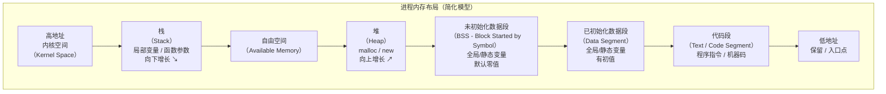
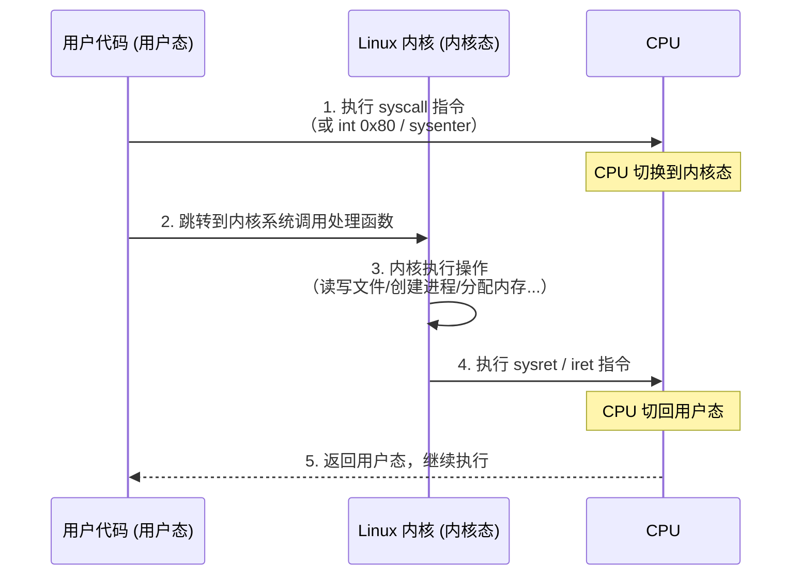

+++
title = "第 22 章：进程、信号与系统调用"
weight = 220
date = "2026-03-29T22:34:00+08:00"
type = "docs"
description = ""
isCJKLanguage = true
draft = false
+++

# 第 22 章：进程、信号与系统调用

> 📌 本章代码实验环境为 Linux (GCC)。Windows 用户建议使用 WSL2，或者把本章当小说看也是极好的——毕竟，程序员的世界里，理论比代码更精彩。

想象一下：你坐在电脑前，打开了一个 QQ 音乐播放器，又打开了浏览器，还顺手开了个 VS Code 写代码。你有没有想过，这些"正在运行的程序"到底是个什么东西？它们是怎么来的？它们之间是怎么通信的？为什么你按 `Ctrl+C` 就能把一个程序给中断了？

这些问题，都藏在这一章里。准备好了吗？让我们一起潜入操作系统的心脏——去看看进程、信号和系统调用这三兄弟到底在搞什么鬼。

---

## 22.1 进程基础

### 22.1.1 进程与程序的区别

先来玩一个类比：

- **程序**就像是一份**菜谱**（食谱）。它告诉你步骤一二三，原料有哪些，但菜谱本身不是菜，它只是纸上的文字。
- **进程**则是那道**正在烹饪的菜**。厨师（CPU）正在按照菜谱的步骤执行，此时原料（数据）在锅里滋滋作响（正在被处理）。

换句话说：

- **程序**是静态的，是躺在磁盘上的一个 `.exe` 或 a.out 文件。
- **进程**是动态的，是程序被操作系统加载到内存中、开始执行时的一个"运行实例"。

一个菜谱可以做出多份菜（多次运行同一个程序产生多个进程），一份菜谱的步骤也可以被多个厨师同时执行（多核 CPU 并行）。这大概就是"一个程序可以有多个进程"的最直观解释了。

> 简单记忆：**程序 = 菜谱**，**进程 = 正在做的菜**。菜谱可以复印（复制），但只有正在被厨师做的才叫进程。

### 22.1.2 进程内存布局：代码段 / 数据段 / BSS / 堆 / 栈

一个进程在内存中不是乱七八糟的，它的布局是井井有条的。想象一栋写字楼，每个楼层各有分工：



或者更直白一点，用一张表格来总结每个楼层（段）的职责：

| 区域 | 存储内容 | 特点 |
|------|---------|------|
| **代码段（Text Segment）** | 程序的机器指令 | 只读，防止被意外修改 |
| **已初始化数据段（Data）** | 有初值的全局变量和静态变量 | 如 `int count = 42;` |
| **未初始化数据段（BSS）** | 默认零值的全局/静态变量 | 如 `int buffer[100];`（未赋值） |
| **堆（Heap）** | 动态分配的内存，`malloc`/`free`/`new`/`delete` | 向高地址增长，需手动管理 |
| **栈（Stack）** | 函数参数、局部变量、返回地址 | 向低地址增长，函数调用自动管理 |

为什么要知道这些？因为出了 bug 你就得知道往哪儿找：

- 段错误（Segmentation Fault）→ 访问了不该访问的内存，多半是栈或指针出了问题
- 内存泄漏 → `malloc` 了忘记 `free`，堆越涨越高
- 数据被莫名修改 → 可能是栈溢出踩到了隔壁的内存

### 22.1.3 `fork`：创建子进程

好了，终于到了重头戏——`fork()`。

`fork` 是 Unix/Linux 系统中最有意思的一个系统调用，没有之一。它的作用是：**克隆**。把你当前正在运行的进程，完完整整地克隆一份，包括代码、变量、内存状态、打开的文件描述符（后面会详细说这个"克隆"的精妙之处）……

克隆完之后，原本的一个进程就变成了**两个进程**：

- **父进程**（Parent Process）：原来的那个，继续执行 `fork` 之后的代码
- **子进程**（Child Process）：克隆出来的那份，也是从 `fork` 之后开始执行

最骚的是：`fork` **只调用了一次，但返回了两次**！一次在父进程里返回子进程的 PID，一次在子进程里返回 0。如果返回 -1，那就是出错了（比如系统进程数达到上限）。

来，看代码：

```c
#include <stdio.h>
#include <stdlib.h>
#include <unistd.h>   // fork()
#include <sys/wait.h> // wait()

int main(void) {
    pid_t pid = fork();  // 一声雷，劈出两个我

    if (pid < 0) {
        perror("fork 失败");
        exit(EXIT_FAILURE);
    }

    if (pid == 0) {
        // 这里是子进程的代码
        printf("我是子进程！我的 PID 是 %d，fork 返回值是 %d\n", getpid(), pid);
        printf("子进程说：我要去睡觉了，2秒后再见~\n");
        sleep(2);
        printf("子进程：zzZ... 醒了！\n");
        exit(EXIT_SUCCESS);  // 子进程必须记得 exit，否则会继续执行后面的代码！
    } else {
        // 这里是父进程的代码
        printf("我是父进程！我的 PID 是 %d，子进程的 PID 是 %d\n", getpid(), pid);
        printf("父进程说：我先去忙别的，等子进程完成...\n");

        int status;
        wait(&status);  // 父进程在这里等子进程结束

        if (WIFEXITED(status)) {
            printf("父进程：子进程已结束，退出码是 %d\n", WEXITSTATUS(status));
        }
    }

    return 0;
}
```

编译运行：

```bash
gcc fork_demo.c -o fork_demo
./fork_demo
```

输出（每次运行顺序可能略有不同，因为父子进程在竞争 CPU）：

```
我是父进程！我的 PID 是 12345，子进程的 PID 是 12346
父进程说：我先去忙别的，等子进程完成...
我是子进程！我的 PID 是 12346，fork 返回值是 0
子进程说：我要去睡觉了，2秒后再见~
子进程：zzZ... 醒了！
父进程：子进程已结束，退出码是 0
```

> ⚠️ **重点来了：文件描述符的克隆细节！**

这是面试和实际开发中极其容易搞错的一个点。让我细细说来：

`fork` 之后，父子进程各有各的**文件描述符表**（fd table），但它们各自表项里的指针，指向的是**同一个内核中的文件描述符（file description）**。

用人话来说就是这样：

> 你有一份文件的复印件（子进程的 fd 表），复印件上写着"第 5 页对应的是磁盘上的第 3 份文件原件"。你和你克隆出来的自己，各自拿了一份复印件。你们各自都可以翻到第 5 页，但是你们翻到的那一页，指向的是**同一份原件**！

这意味着：

1. **父子进程共享文件偏移量（file offset）**。如果子进程先读取了文件的前 100 个字节，父进程再读，就会从第 101 个字节开始——因为他们操作的是同一份"原件"。
2. **各自有独立的 fd 表**，所以关闭子进程的 fd **不会影响父进程的 fd**。你把你的复印件上第 5 页撕了，你克隆的那份复印件还是完整的。

看代码验证：

```c
#include <stdio.h>
#include <stdlib.h>
#include <unistd.h>
#include <sys/wait.h>
#include <sys/types.h>
#include <fcntl.h>

int main(void) {
    int fd = open("test.txt", O_RDONLY);  // 打开一个文件
    if (fd < 0) {
        perror("open 失败");
        exit(EXIT_FAILURE);
    }

    printf("父进程 PID=%d，打开文件 fd=%d\n", getpid(), fd);

    pid_t pid = fork();

    if (pid == 0) {
        // 子进程：先读 5 个字节
        char buf[32];
        ssize_t n = read(fd, buf, 5);
        buf[n] = '\0';
        printf("子进程读了 %zd 字节: \"%s\"\n", n, buf);
        close(fd);
        exit(EXIT_SUCCESS);
    } else {
        // 父进程：等子进程读完再读
        wait(NULL);
        char buf[32];
        ssize_t n = read(fd, buf, 32);  // 从第 6 个字节开始读！
        buf[n] = '\0';
        printf("父进程读了 %zd 字节: \"%s\"\n", n, buf);  // 输出：偏移量已被子进程移动
        close(fd);
    }

    return 0;
}
```

如果 `test.txt` 内容是 `Hello, World!`，输出会是：

```
父进程 PID=12345，打开文件 fd=3
子进程读了 5 字节: "Hello"
父进程读了 12 字节: ", World!"
```

看到了吗？子进程读完 `Hello`（5 字节）后，文件偏移量移到了第 6 个字节。父进程再读，就直接从 `, World!` 开始了——因为他们在共享同一个偏移量！

### 22.1.4 `exec` 系列： execve / execv / execl / execvp

`fork` 是克隆，那么 `exec` 就是——**夺舍**。

想象一下：你克隆了一个自己（`fork`），然后你的克隆人突然被外星科技改造了，大脑被换成了一段全新的程序。它还是那个克隆人（PID 没变），但思想已经完全不同了——脑子里装的不是你的代码，而是一个全新的程序。

`exec` 系列函数就是这样：它们**不创建新进程**，而是**用新程序替换当前进程的映像**。进程还是那个进程（PID 不变），但代码段、数据段、堆、栈全部被新的程序覆盖了。

`exec` 家族有多个成员，名字里的字母很有规律：

| 函数 | 含义 | 参数风格 |
|------|------|---------|
| `execve` | e=环境变量（env） | `execve(path, argv, envp)` — **POSIX 系统调用内核接口，唯一直接进入内核的系统调用** |
| `execv` | v=矢量数组（argv） | `execv(path, argv)` — 用数组传递参数 |
| `execl` | l=列表（list） | `execl(path, arg0, arg1, ..., NULL)` — 用可变参数列表传递 |
| `execvp` | v=矢量 + p=搜索 PATH | `execvp(file, argv)` — 自动在 PATH 中找程序 |

> 重点：`execve` 是 POSIX 标准中唯一直接对应的系统调用内核接口，其他都是标准库封装，最终都调用 `execve`。

```c
#include <stdio.h>
#include <stdlib.h>
#include <unistd.h>
#include <sys/wait.h>

int main(void) {
    pid_t pid = fork();

    if (pid == 0) {
        // 子进程：执行 ls 命令
        printf("子进程（PID=%d）：我要执行 ls -la 了！\n", getpid());

        // execl 版本：参数一个一个列出来
        execl("/bin/ls", "ls", "-la", "/tmp", NULL);

        // 如果 execl 成功了，这行以下的代码不会执行
        // 如果执行到这里，说明 execl 失败了
        perror("execl 失败");  // perror 会打印 "execl 失败: No such file or directory"
        exit(EXIT_FAILURE);
    } else {
        // 父进程
        wait(NULL);
        printf("父进程：子进程已经执行完 ls 了，我还在！\n");
    }

    return 0;
}
```

再看 `execvp`——找程序不用写完整路径，更方便：

```c
#include <stdio.h>
#include <stdlib.h>
#include <unistd.h>
#include <sys/wait.h>

int main(void) {
    pid_t pid = fork();

    if (pid == 0) {
        // execvp 会在 PATH 中找 "ls"，不用写 /bin/ls
        char *args[] = {"ls", "-lh", "/tmp", NULL};
        execvp("ls", args);  // 自动在 $PATH 中找 ls

        perror("execvp 失败");
        exit(EXIT_FAILURE);
    } else {
        wait(NULL);
        printf("父进程：搞定了！\n");
    }

    return 0;
}
```

**`fork` + `exec` 是 Unix 编程的黄金搭档**：

1. `fork` 克隆一个自己
2. 子进程用 `exec` 换成另一个程序
3. 父进程用 `wait` 等子进程结束

这几乎是你在 Unix 里启动任何外部程序的"标准姿势"。

### 22.1.5 `wait` / `waitpid`：回收子进程

子进程结束后去哪儿了？它变成了一个**僵尸进程**（Zombie）。

等等，僵尸进程？听起来很恐怖。让我解释一下：

当一个子进程退出时，它并不是瞬间消失的。它的退出状态（exit code）还在内核里保存着，等待父进程来收走。父进程如果不调用 `wait`，这个已经"死了"的子进程就还占着进程表项——这就是僵尸。

> 僵尸进程就像一个已经去世了但还在占着房子不搬走的人。它本身不占用 CPU（已经死了），但它占着系统资源（进程表项），如果僵尸太多，系统就会崩溃。

所以，`wait` 和 `waitpid` 就是父进程去"收尸"的函数。

```c
#include <stdio.h>
#include <stdlib.h>
#include <unistd.h>
#include <sys/wait.h>

int main(void) {
    pid_t pid = fork();

    if (pid == 0) {
        printf("子进程：我要退出了，退出码 42\n");
        sleep(1);
        exit(42);  // 子进程退出，退出码 42
    } else {
        int status;
        pid_t child_pid = wait(&status);  // 父进程等待并回收

        printf("父进程：回收了子进程 PID=%d\n", child_pid);

        if (WIFEXITED(status)) {
            printf("父进程：子进程正常退出，退出码 = %d\n", WEXITSTATUS(status));
            // 输出：子进程正常退出，退出码 = 42
        }
    }

    return 0;
}
```

`waitpid` 更精细，可以指定要等哪个子进程，或者用 `WNOHANG` 不阻塞：

```c
#include <stdio.h>
#include <stdlib.h>
#include <unistd.h>
#include <sys/wait.h>

int main(void) {
    pid_t pid1 = fork();
    if (pid1 == 0) { sleep(2); exit(1); }

    pid_t pid2 = fork();
    if (pid2 == 0) { sleep(1); exit(2); }

    // 父进程不等死等活，先检查 pid1 再检查 pid2
    int status;
    while (waitpid(pid2, &status, WNOHANG) == 0) {
        printf("pid2 还没退出，干点别的...\n");
        sleep(1);
    }

    printf("pid2 搞定了！\n");

    // 最后确保 pid1 也被回收
    waitpid(pid1, &status, 0);

    return 0;
}
```

`wait` 和 `waitpid` 的宏判断：

| 宏 | 含义 |
|----|------|
| `WIFEXITED(status)` | 子进程是否正常退出（调用了 exit 或 return） |
| `WEXITSTATUS(status)` | 正常退出时的退出码 |
| `WIFSIGNALED(status)` | 子进程是否被信号终止 |
| `WTERMSIG(status)` | 杀死子进程的信号编号 |
| `WIFSTOPPED(status)` | 子进程是否被信号暂停（STOP） |

### 22.1.6 `vfork`：历史遗留，切勿在有多线程的程序中使用

`vfork` 是 `fork` 的"上古版本"。在古代（没有虚拟内存的年代），`fork` 要克隆整个内存，代价很大，于是弄了个 `vfork`——它**不克隆内存**，子进程直接共享父进程的内存，直到子进程调用 `exec` 或 `exit`。

但这带来了巨大的坑：

- 子进程可以随意修改父进程的内存！相当于两个人住同一间房，还各干各的，不打架才怪。
- 如果子进程在共享状态下修改变量，父进程恢复执行时变量已经被改了——Bug 就这么来了。

现代操作系统有了**写时复制（Copy-On-Write, COW）**技术，`fork` 的效率已经很高了，`vfork` 基本上只有历史价值了。

> ⚠️ **绝对不要在多线程程序中使用 `vfork`！** 多线程程序中，多个线程共享地址空间，调用 `vfork` 后子进程的行为完全不可预测，可能导致死锁、数据崩溃等各种诡异问题。

记住：老老实实用 `fork`，别玩火。

---

## 22.2 进程管理进阶

### 22.2.1 `fork` + `exec` 的简化：`posix_spawn`

`fork` + `exec` 很强大，但写起来还是有点繁琐。特别是一些嵌入式场景或者 Windows 迁移过来的代码，想简单地"启动一个外部程序"，还得先 `fork` 再 `exec`，中间出了岔子还得处理错误。

`posix_spawn` 就是来解决这个问题的——它把 `fork` + `exec` 封装成了一个函数，一步到位：

```c
#include <stdio.h>
#include <stdlib.h>
#include <spawn.h>
#include <sys/wait.h>

int main(void) {
    pid_t pid;
    char *argv[] = {"ls", "-lh", "/tmp", NULL};
    char *envp[] = {NULL};  // 继承当前环境

    // posix_spawn = fork + exec，一步完成
    int ret = posix_spawn(&pid, "/bin/ls", NULL, NULL, argv, envp);

    if (ret != 0) {
        perror("posix_spawn 失败");
        exit(EXIT_FAILURE);
    }

    int status;
    waitpid(pid, &status, 0);
    printf("posix_spawn 启动的程序已结束\n");

    return 0;
}
```

> 💡 在很多嵌入式系统（比如 Android早期的进程启动）背后，`posix_spawn` 被广泛使用，因为它比手写 `fork+exec` 更高效，也更容易控制子进程的属性（文件描述符继承、信号处理等）。

### 22.2.2 守护进程（Daemon）

你有没有想过，为什么服务器能 7x24 小时运行，从来不关机，也不会被"终端关闭"影响？答案是——它们大多是**守护进程**（Daemon）。

守护进程就是"脱离了终端的后台进程"。它有三个特点：

1. **没有控制终端**（no controlling terminal）：不会受到 `Ctrl+C` 或终端关闭的影响
2. **在后台运行**：不受前台/后台切换的影响
3. **由系统自动管理**：通常开机自启动

写一个守护进程的标准步骤（每一步都有深刻道理）：

```c
#include <stdio.h>
#include <stdlib.h>
#include <unistd.h>
#include <sys/stat.h>
#include <sys/wait.h>
#include <signal.h>
#include <fcntl.h>

void become_daemon(void) {
    // 第一步：fork() 一次，父进程退出
    // 目的：让子进程成为 init/Systemd 的子进程，脱离原来的终端关系
    pid_t pid = fork();
    if (pid < 0) { perror("fork"); exit(EXIT_FAILURE); }
    if (pid > 0) { exit(EXIT_SUCCESS); }  // 父进程，再见！

    // 第二步：setsid() 创建新会话
    // 目的：子进程成为新会话的首领（session leader），彻底脱离原终端
    if (setsid() < 0) { perror("setsid"); exit(EXIT_FAILURE); }

    // 第三步：再 fork() 一次（可选但推荐）
    // 目的：防止子进程再次打开终端（理论上会话首领可以打开终端，再 fork 一次确保不可能）
    pid = fork();
    if (pid < 0) { perror("fork"); exit(EXIT_FAILURE); }
    if (pid > 0) { exit(EXIT_SUCCESS); }

    // 第四步：chdir("/") 改变工作目录
    // 目的：防止守护进程占住一个已卸载的文件系统，无法卸载
    chdir("/");

    // 第五步：umask(0) 清零文件模式掩码
    // 目的：让守护进程创建文件时不受奇怪的权限限制
    umask(0);

    // 第六步：关闭所有文件描述符
    // 目的：不再继承父进程的标准输入/输出/错误
    for (int i = 0; i < sysconf(_SC_OPEN_MAX); i++) {
        close(i);
    }

    // 重定向标准输入/输出/错误到 /dev/null
    open("/dev/null", O_RDWR);  // stdin -> fd 0
    dup(0);                      // stdout -> fd 1
    dup(0);                      // stderr -> fd 2

    // 守护进程的核心代码写在这里
    printf("守护进程已启动，PID=%d\n", getpid());  // 实际上 printf 也没用，因为 stdout 已被重定向到 /dev/null
    FILE *f = fopen("/var/log/my_daemon.log", "a");
    if (f) {
        fprintf(f, "守护进程运行中，PID=%d\n", getpid());
        fclose(f);
    }

    while (1) {
        sleep(10);
        // 守护进程的主循环
    }
}

int main(void) {
    become_daemon();
    // 主进程已经变成守护进程了
    while (1) { sleep(1); }  // 保持运行
    return 0;
}
```

运行这个程序后，它会彻底脱离终端，即使用户 logout 它也会继续运行。这就是一个"真正的"后台服务了。

---

## 22.3 信号（Signal）

信号是操作系统送给进程的一种"**软中断**"——操作系统可以随时打断进程，告诉它"有个事儿你得处理一下"。

可以把它想象成你正在专心写代码，突然有人拍了拍你的肩膀说："嘿，有人找你"——那个"拍肩膀"的动作就是信号。

### 22.3.1 标准信号

Linux 中的信号有很多种，下面是最常见的几种：

| 信号 | 编号 | 含义 | 类比 |
|------|------|------|------|
| `SIGTERM` | 15 | 优雅终止请求（可以被捕获、忽略） | 轻声说："你该下班了" |
| `SIGKILL` | 9 | 强制杀死（**无法捕获、无法忽略、无法阻止**） | 直接拔你电脑电源 |
| `SIGINT` | 2 | 中断信号（`Ctrl+C` 发送） | "先停一下！" |
| `SIGSEGV` | 11 | 段错误（访问了无效内存） | 你走进了一堵墙（墙说：你谁啊） |
| `SIGFPE` | 8 | 浮点异常（除以 0 等） | 数学老师说：你算错了！ |
| `SIGABRT` | 6 | 异常终止（`abort()` 发送） | 程序自己对自己说：我不行了 |
| `SIGCHLD` | 17 | 子进程结束（父进程会收到，默认忽略） | 你孩子说：爸我下班了 |
| `SIGALRM` | 14 | 闹钟信号（`alarm()` 定时器到期） | 微波炉叮的一声 |

### 22.3.2 ⚠️ `signal` vs `sigaction`：必须用 `sigaction`

老式的 `signal()` 函数历史遗留问题一大堆——不同系统对同一个信号的处理方式居然不一样！有些系统上信号处理完就恢复默认了，有些系统上信号处理完还是你设置的那个。这种不一致性是灾难的根源。

所以，**永远用 `sigaction`！**

```c
#include <stdio.h>
#include <stdlib.h>
#include <signal.h>
#include <unistd.h>

// 自定义的信号处理函数
void handle_sigint(int signum) {
    printf("\n收到了 SIGINT 信号（编号=%d）！我不退出，我要继续运行！\n", signum);
    // 注意：printf 也不完全安全（见 22.3.5 可重入问题），但这里为了演示
}

int main(void) {
    struct sigaction sa;
    sa.sa_handler = handle_sigint;       // 处理函数
    sigemptyset(&sa.sa_mask);           // 处理信号时，阻塞（屏蔽）这些信号
    sa.sa_flags = 0;                     // 0 = 默认行为

    if (sigaction(SIGINT, &sa, NULL) < 0) {
        perror("sigaction 设置失败");
        exit(EXIT_FAILURE);
    }

    printf("按 Ctrl+C 试试看？（程序会继续运行）\n");
    printf("按 Ctrl+\\ 强制退出\n");

    while (1) {
        printf("程序运行中... PID=%d\n", getpid());
        sleep(3);
    }

    return 0;
}
```

运行效果：

```bash
$ ./signal_demo
按 Ctrl+C 试试看？（程序会继续运行）
按 Ctrl+\ 强制退出
程序运行中... PID=12345
程序运行中... PID=12345
^C
收到了 SIGINT 信号（编号=2）！我不退出，我要继续运行！
程序运行中... PID=12345
^C
收到了 SIGINT 信号（编号=2）！我不退出，我要继续运行！
程序运行中... PID=12345
^\Quit (core dumped)
```

> 💡 `Ctrl+C` 发送的是 `SIGINT`，可以被捕获（像上面这样）。`Ctrl+\` 发送的是 `SIGQUIT`，默认行为是终止进程并 core dump。

### 22.3.3 `sig_atomic_t`：信号处理函数中唯一安全的类型

在信号处理函数里，有一条铁律：**不要调用不保证可重入的函数**。

什么是可重入？简单说就是一个函数正在执行的时候，第二次调用它不会出问题——它的所有状态都是独立的，不依赖任何全局变量或静态变量。

`sig_atomic_t` 是 C 标准定义的一个原子类型（在 C++ 中对应 `std::atomic<int>`）。"原子"的意思是这个类型的读写操作是**不可分割**的——不会被信号中断，也不需要加锁。

看一个安全通信的经典模式：

```c
#include <stdio.h>
#include <stdlib.h>
#include <signal.h>
#include <unistd.h>
#include <stdbool.h>

// 必须是 volatile sig_atomic_t！
// volatile：防止编译器优化，每次都从内存读
// sig_atomic_t：保证读/写是原子操作
volatile sig_atomic_t g_running = true;

void handle_sigterm(int signum) {
    (void)signum;  // 避免未使用警告
    g_running = false;
    // 注意：这里只能做最简单的操作，不能调用不安全的函数
}

int main(void) {
    struct sigaction sa;
    sa.sa_handler = handle_sigterm;
    sigemptyset(&sa.sa_mask);
    sa.sa_flags = 0;

    sigaction(SIGTERM, &sa, NULL);

    printf("程序运行中，PID=%d\n", getpid());
    printf("发送 SIGTERM 信号来终止：kill %d\n", getpid());

    while (g_running) {
        printf("还在跑...\n");
        sleep(1);
    }

    printf("收到 SIGTERM，优雅退出！\n");
    return 0;
}
```

```bash
$ gcc -o sig_atomic_demo sig_atomic_demo.c
$ ./sig_atomic_demo
程序运行中，PID=12345
发送 SIGTERM 信号来终止：kill 12345
还在跑...
还在跑...
kill 12345   # 在另一个终端输入
收到 SIGTERM，优雅退出！
```

### 22.3.4 `kill` / `raise` / `alarm` / `pause`

- **`kill(pid, sig)`**：向指定进程发送信号。可以是同进程（`kill(getpid(), SIGTERM)`），也可以是其他进程。
- **`raise(sig)`**：向**当前进程**自己发送信号，等价于 `kill(getpid(), sig)`。
- **`alarm(seconds)`**：设置一个定时器，seconds 秒后给自己发 `SIGALRM`。返回值为上一次 alarm 剩余的时间。
- **`pause()`**：让进程睡死过去，直到收到任意一个信号。

```c
#include <stdio.h>
#include <stdlib.h>
#include <signal.h>
#include <unistd.h>
#include <time.h>

void handle_alarm(int signum) {
    (void)signum;
    printf("闹钟响了！时间到！\n");
}

int main(void) {
    signal(SIGALRM, handle_alarm);

    printf("设置 3 秒后响闹钟...\n");

    unsigned int remaining = alarm(3);  // 3 秒后收到 SIGALRM
    printf("上一个 alarm 剩余时间（如果有）: %u 秒\n", remaining);

    time_t start = time(NULL);
    while (time(NULL) - start < 5) {
        printf("等待中... %ld 秒\n", time(NULL) - start);
        sleep(1);
    }

    printf("程序结束\n");
    return 0;
}
```

```
设置 3 秒后响闹钟...
上一个 alarm 剩余时间（如果有）: 0 秒
等待中... 0 秒
等待中... 1 秒
等待中... 2 秒
闹钟响了！时间到！
等待中... 3 秒
等待中... 4 秒
程序结束
```

再看 `pause` 的用法——实现一个"等待信号才继续"的模式：

```c
#include <stdio.h>
#include <stdlib.h>
#include <signal.h>
#include <unistd.h>

volatile sig_atomic_t got_signal = 0;

void handler(int sig) {
    (void)sig;
    got_signal = 1;
}

int main(void) {
    signal(SIGUSR1, handler);

    printf("主程序在此暂停，等待 SIGUSR1 信号...\n");
    printf("PID: %d，从另一个终端输入: kill -USR1 %d\n", getpid(), getpid());

    while (!got_signal) {
        pause();  // 睡眠直到被信号唤醒
    }

    printf("收到信号，程序继续执行！\n");
    return 0;
}
```

### 22.3.5 可重入函数 vs 非可重入函数

这是 C 语言中一个极其容易踩坑的地方。

**可重入函数**：可以被多个"执行上下文"（进程、线程、信号处理函数）同时调用而不会出问题。因为它：
- 不使用静态或全局数据
- 不调用任何不可重入的函数
- 不依赖硬件资源（如中断）

**非可重入函数**：在信号处理函数中使用，轻则数据错乱，重则死锁、系统崩溃。

经典的例子是 `strtok` vs `strtok_r`：

```c
// ❌ strtok 是非可重入的！
// 它内部维护了一个静态指针状态
#include <stdio.h>
#include <string.h>
#include <signal.h>

char *str = "hello,world,how,are,you";

void handler(int sig) {
    (void)sig;
    // 在信号处理函数中调用 strtok —— 危险！
    char *token = strtok(str, ",");
    printf("信号中 token: %s\n", token);
}

int main(void) {
    signal(SIGINT, handler);

    // 主程序先调用了一次 strtok
    char *token = strtok(str, ",");  // 第一次调用，初始化内部状态
    printf("主程序 token: %s\n", token);

    // 此时如果收到信号，在信号处理函数中调用 strtok
    // strtok 会看到"脏"的内部状态，导致错误

    while (1) pause();
    return 0;
}
```

```c
// ✅ strtok_r 是可重入版本（线程安全/信号安全版本）
// strtok_r 需要你传入一个 char* saveptr，自己管理状态
#include <stdio.h>
#include <string.h>
#include <signal.h>
#include <stdlib.h>

char *str = "hello,world,how,are,you";

void handler(int sig) {
    (void)sig;
    char *saveptr;
    // strtok_r 每次调用需要传入上次的 saveptr，但字符串本身也要小心
    // 注意：str 作为全局变量，在信号处理中修改也是不安全的
    // 更好的做法是用线程局部存储（thread-local storage）或者纯局部变量
    printf("信号中查看了 str\n");
}

int main(void) {
    signal(SIGINT, handler);

    char *saveptr;
    char *token = strtok_r(str, ",", &saveptr);  // 线程安全版本
    printf("主程序 token: %s\n", token);

    while (1) pause();
    return 0;
}
```

> 💡 简单总结：只要看到函数名里有 `_r`（reentrant 版本），那就是可重入的。

---

## 22.4 系统调用原理

### 22.4.1 用户态 → 内核态切换

我们写的普通 C 代码，运行在**用户态**（User Mode）。用户态的代码有诸多限制——不能直接访问硬件，不能读写其他进程的内存，不能执行特权指令。

而**内核态**（Kernel Mode / Privileged Mode）则是"管理员模式"，什么都能干。

当你调用 `read()`、`fork()`、`write()` 这样的系统调用时，CPU 需要从用户态切换到内核态，完成操作后再切换回来。这个切换的过程如下：



在 x86-64 Linux 中，系统调用使用 `syscall` 指令。拿 `read` 举例：

- `rax` 寄存器存放系统调用号（read = 0）
- `rdi`、`rsi`、`rdx` 分别存放文件描述符、缓冲区地址、字节数
- `rax` 返回读取的字节数（或负数表示错误）

> 📖 这就好比你去银行（内核）办事：你在柜台（用户态）填好单子，递给柜员（系统调用指令），柜员去金库（内核）办完事，再把结果还给你。这个"递单子、柜员办事、还结果"的过程就是一次用户态→内核态→用户态的切换。

### 22.4.2 Linux 系统调用查看

想知道你的 Linux 系统有多少个系统调用？试试这些：

```bash
# 查看系统调用手册（推荐）
man 2 syscalls

# 查看所有已注册的系统调用符号
cat /proc/kallsyms | grep sys_ | head -20

# 查看当前内核支持多少个系统调用
cat /usr/include/asm/unistd_64.h | wc -l
```

一个常见系统调用的结构如下（用 `strace` 可以追踪程序调用的所有系统调用）：

```bash
# 跟踪 ls 命令的所有系统调用（-c 汇总，-f 跟踪 fork 的子进程）
strace -c ls /tmp
```

输出类似：

```
% time     seconds  usecs/call     calls    errors syscall
------ ----------- ----------- --------- --------- ----------------
  0.00    0.000000           0        10           read
  0.00    0.000000           0         5           write
  0.00    0.000000           0         3           openat
  0.00    0.000000           0         3           close
  0.00    0.000000           0         1           execve
  0.00    0.000000           0         1           getdents64
------ ----------- ----------- --------- --------- total
```

> 💡 `strace` 是 Linux 调试神器！想知道你的程序在偷偷干什么，用 `strace ./my_program` 就能看到它调用的每一个系统调用，参数是什么，返回值是什么。

### 22.4.3 常用系统调用：read / write / open / close / pipe / dup2

这些是 Unix 编程中最最基础的系统调用。掌握它们，你就掌握了 Unix I/O 的精髓。

```c
#include <stdio.h>
#include <stdlib.h>
#include <unistd.h>    // read, write, close
#include <fcntl.h>     // open, O_RDONLY, O_WRONLY, O_CREAT
#include <sys/wait.h>

int main(void) {
    // ============ open / close ============
    // O_WRONLY | O_CREAT | O_TRUNC：只写 / 不存在则创建 / 存在则清空
    // 0664：文件权限 rwxr-xr-x（新人可写）
    int fd = open("hello.txt", O_WRONLY | O_CREAT | O_TRUNC, 0664);
    if (fd < 0) {
        perror("open 失败");
        exit(EXIT_FAILURE);
    }
    printf("成功打开文件，fd=%d\n", fd);

    // ============ write ============
    const char *msg = "你好，世界！Hello, World!\n";
    ssize_t written = write(fd, msg, 30);  // 写 30 个字节
    printf("写入了 %zd 字节\n", written);

    close(fd);  // 关闭文件

    // ============ read ============
    fd = open("hello.txt", O_RDONLY);
    char buf[128];
    ssize_t n = read(fd, buf, sizeof(buf) - 1);
    buf[n] = '\0';
    printf("读取内容: %s", buf);
    close(fd);

    return 0;
}
```

再看管道 `pipe` 和 `dup2`——这两个是进程间通信和 I/O 重定向的基础：

```c
#include <stdio.h>
#include <stdlib.h>
#include <unistd.h>
#include <sys/wait.h>

int main(void) {
    int pipefd[2];  // pipefd[0]=读端, pipefd[1]=写端

    if (pipe(pipefd) < 0) {
        perror("pipe 创建失败");
        exit(EXIT_FAILURE);
    }

    pid_t pid = fork();

    if (pid == 0) {
        // 子进程：关闭读端，把标准输出重定向到管道写端
        close(pipefd[0]);              // 不需要读
        dup2(pipefd[1], STDOUT_FILENO); // 把 stdout 重定向到管道写端
        close(pipefd[1]);              // 写端已 dup，可以关闭原始 fd

        execlp("ls", "ls", "/tmp", NULL);
        perror("execlp 失败");
        exit(EXIT_FAILURE);
    } else {
        // 父进程：关闭写端，从管道读端读取子进程的输出
        close(pipefd[1]);  // 不需要写

        char buf[1024];
        ssize_t n;
        printf("=== 子进程（ls）的输出 ===\n");
        while ((n = read(pipefd[0], buf, sizeof(buf))) > 0) {
            write(STDOUT_FILENO, buf, n);  // 打印到父进程的标准输出
        }
        close(pipefd[0]);

        wait(NULL);
        printf("=== 输出结束 ===\n");
    }

    return 0;
}
```

`dup2(fd, newfd)` 的作用是把 `newfd` 指向和 `fd` 相同的内核文件表项。上面的例子中，我们把 `pipefd[1]`（管道的写端）复制到了 `STDOUT_FILENO`（文件描述符 1，也就是标准输出），这样 `execlp` 执行 `ls` 时，输出就不会打印到终端，而是写入管道——父进程就能读取了。

> 💡 管道是 Unix 中最古老的进程间通信机制。它是**半双工**的（单向），数据从写端流入，从读端流出。

---

## 22.5 `<setjmp.h>`：非局部跳转

这大概是 C 语言中最"叛逆"的一个特性了——它允许你在一个函数里`goto`到另一个函数里！正常情况下 `goto` 只能在同一个函数内部跳转，但 `setjmp` + `longjmp` 可以跨函数跳跃。

### 22.5.1 longjmp 后非 volatile 局部变量的值不确定

工作原理：

- `setjmp(jmp_buf env)`：**保存**当前函数的执行上下文（寄存器、栈指针等）到 `env` 中。第一次调用返回 0。
- `longjmp(jmp_buf env, int val)`：**恢复**之前保存的执行上下文，让程序跳回到 `setjmp` 的地方继续执行。此时 `setjmp` 返回 `val`（但如果 `val` 为 0，`setjmp` 会返回 1）。

```c
#include <stdio.h>
#include <stdlib.h>
#include <setjmp.h>

jmp_buf env;  // 保存执行上下文

void func_b(void) {
    printf("func_b: 哎呀，出错了！跳回去！\n");
    longjmp(env, 42);  // 跳回 setjmp 那里，setjmp 返回 42
    printf("func_b: 这行永远不会执行\n");  // longjmp 不会返回
}

void func_a(void) {
    printf("func_a: 调用 func_b\n");
    func_b();
    printf("func_a: 这行也永远不会执行\n");
}

int main(void) {
    int ret = setjmp(env);  // 第一次执行：保存上下文，返回 0

    if (ret == 0) {
        // 正常执行路径
        printf("setjmp 第一次返回，ret=%d（正常执行）\n", ret);
        func_a();  // 走到 func_b 里触发 longjmp
    } else {
        // longjmp 跳转回来
        printf("setjmp 第二次返回，ret=%d（从 func_b 跳回来的！）\n", ret);
        printf("异常处理：程序从 func_b 跳转回来继续执行\n");
    }

    printf("程序继续正常结束\n");
    return 0;
}
```

```
setjmp 第一次返回，ret=0（正常执行）
func_a: 调用 func_b
func_b: 哎呀，出错了！跳回去！
setjmp 第二次返回，ret=42（从 func_b 跳回来的！）
异常处理：程序从 func_b 跳转回来继续执行
程序继续正常结束
```

> 💡 想象你正在一栋大楼里（一层层函数调用），突然发现了紧急情况（错误），正常情况下你要一层层 return 回去。但 `longjmp` 就像是一部"电梯"，直接把你从 10 楼送回 1 楼（`setjmp` 保存的位置）。

**⚠️ 重要警告：longjmp 后非 volatile 局部变量的值不确定！**

这是 C 语言中最容易被忽略的坑之一。当 `longjmp` 从 `func_b` 跳回 `main` 时，优化器可能已经"认为"某些局部变量已经没用了，于是把它们放在了寄存器里。`longjmp` 恢复寄存器状态后，这些非 `volatile` 的局部变量就会恢复到 `setjmp` 被调用时的值——而不是它们在 `longjmp` 被调用时的值。

```c
#include <stdio.h>
#include <setjmp.h>

jmp_buf env;

void func(void) {
    int critical_value = 99;  // 非 volatile，危险！
    printf("func: critical_value = %d\n", critical_value);
    longjmp(env, 1);
    // critical_value 的值在 longjmp 后可能不是 99！
}

int main(void) {
    if (setjmp(env) == 0) {
        func();
    } else {
        // 这里 critical_value 的值是未定义的！
        printf("从 func 跳回来了！但 critical_value 的值不确定\n");
    }

    return 0;
}
```

解决方案：**把需要在 `longjmp` 恢复后继续使用的局部变量，声明为 `volatile`**：

```c
volatile int critical_value = 0;  // ✅ 加了 volatile，值可以预测
```

> 📖 `volatile` 告诉编译器："这个变量的值随时可能被外部力量改变，不要优化它，每次都要从内存读写。"

**`setjmp` + `longjmp` 的典型应用场景**：

1. **错误处理**（类似 try-catch）：在 C 没有异常机制的时代，这是实现"跨函数异常"的唯一方法
2. **状态机实现**：保存状态，恢复执行
3. **协程/轻量级并行**：保存/恢复执行上下文

不过坦率地说，在现代 C++ 中，`setjmp`/`longjmp` 已经很少使用了（因为 C++ 的 RAII 和异常机制更安全），但在 C 代码和内核代码中偶尔还能看到它。

---

## 本章小结

这一章我们深入探索了进程、信号和系统调用这三个操作系统核心概念：

1. **进程与程序**：程序是静态的菜谱，进程是动态的运行实例。进程的内存布局分为代码段、数据段、BSS、堆（向上增长）和栈（向下增长）。

2. **fork**：克隆当前进程，返回两次（父进程中返回子进程 PID，子进程中返回 0）。子进程拥有独立的文件描述符表，但描述符指向内核中同一个 file description，因此**共享文件偏移量**。

3. **exec 系列**：`execve` 是 POSIX 系统调用的内核接口，其他都是封装。`fork + exec` 是 Unix 启动外部程序的黄金搭档。

4. **wait/waitpid**：回收子进程，防止僵尸进程（zombie）。子进程退出后需要父进程"收尸"。

5. **vfork**：历史遗留问题多多，**切勿在多线程程序中使用**。

6. **posix_spawn**：`fork + exec` 的一步到位封装，用法更简单。

7. **守护进程（daemon）**：标准创建流程是 `fork` + `setsid` + `chdir("/")` + `umask(0)` + 关闭所有 fd。

8. **信号（Signal）**：操作系统的软中断机制。永远使用 `sigaction` 而不是 `signal`（行为不可移植）。

9. **sig_atomic_t**：唯一在信号处理函数中可安全读写的类型，搭配 `volatile` 使用。

10. **可重入函数**：在信号处理函数中只能调用可重入函数。`strtok` → `strtok_r`（带 `_r` 的是可重入版本）。

11. **系统调用原理**：用户态通过 `syscall` 指令（或 `int 0x80`）触发内核态切换，由内核代为执行特权操作。

12. **setjmp/longjmp**：跨函数的非局部跳转，`longjmp` 后**非 volatile 局部变量值不确定**，必须加 `volatile` 声明。

> 下一章我们将探讨 C 语言的**网络编程**—— socket、TCP/UDP、HTTP 请求……让我们的程序能够和整个互联网对话！敬请期待！
