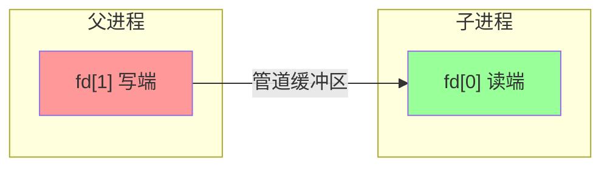
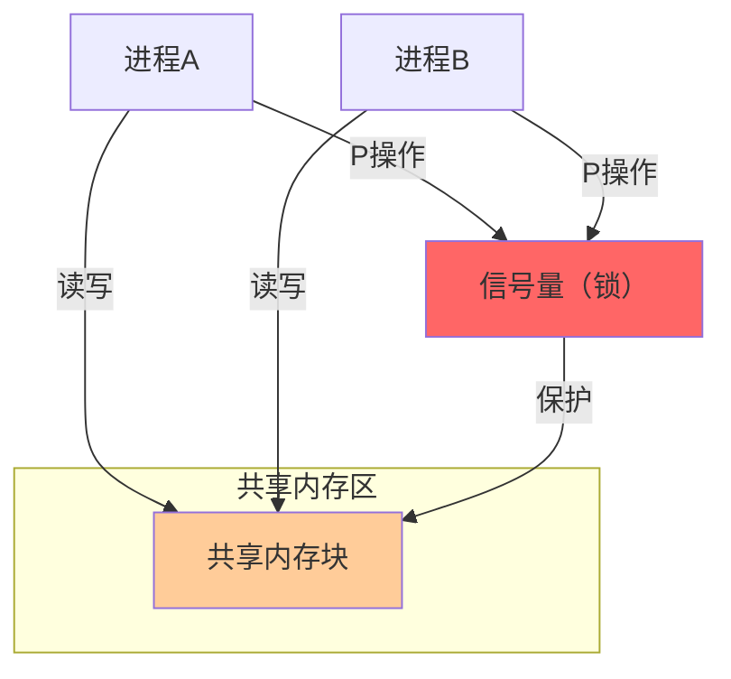
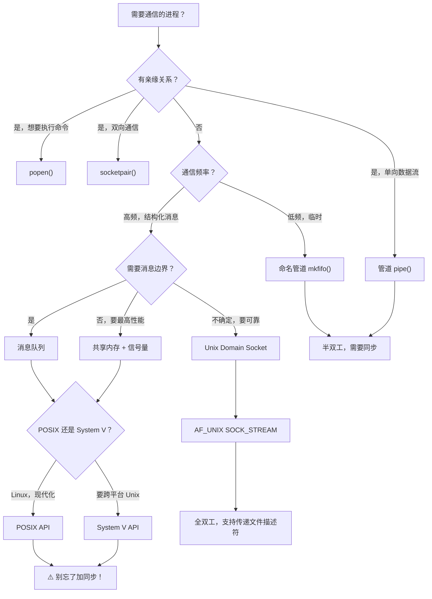

+++
title = "第 23 章：进程间通信（IPC）"
weight = 230
date = "2026-03-29T22:34:00+08:00"
type = "docs"
description = ""
isCJKLanguage = true
draft = false
+++

# 第 23 章：进程间通信（IPC）

> "独木不成林，单进程不成事。" — 当你的程序想要和隔壁进程唠唠嗑、传传纸条、甚至共享一块"秘密基地"时，就需要进程间通信了。

想象一下，你和你的室友（两个独立的进程）住在同一栋公寓（同一台电脑）里。你们想要交流？可以通过对讲机（管道）、留言条（消息队列）、在冰箱上贴便签（共享内存）、或者干脆打电话（Socket）。每种方式各有优劣，适用场景也不同。

本章我们就来聊聊这些"进程间的聊天工具"，让你从"一个人默默干活"升级到"团队协作"！

## 23.1 管道（Pipe）

管道是最古老、最简单、也是最经典的 IPC 方式之一。顾名思义，管道就是一根"水管"——一头进水，一头出水。数据从一端进去，从另一端出来，**单向流动**。

### 23.1.1 `pipe`：匿名管道，亲缘进程间通信

`pipe()` 是 Linux/Unix 系统中创建管道的系统调用。它创建的是一个**匿名管道**，意味着这个管道没有名字，只通过文件描述符（file descriptor）来访问。只有**有亲缘关系**的进程之间才能使用（比如父进程和子进程），因为子进程会继承父进程打开的文件描述符。

**文件描述符**是什么？简单理解，就是操作系统给每个打开的文件/资源分配的一个整数编号。0 是标准输入，1 是标准输出，2 是标准错误。`pipe()` 会返回两个文件描述符：`fd[0]` 是读端，`fd[1]` 是写端。

```c
#include <stdio.h>
#include <stdlib.h>
#include <unistd.h>
#include <sys/types.h>

int main(void) {
    int fd[2];  // fd[0] 是读端，fd[1] 是写端
    pid_t pid;
    char buf[128];

    // 创建一个管道
    if (pipe(fd) == -1) {
        perror("pipe 创建失败");
        exit(EXIT_FAILURE);
    }

    pid = fork();  // 创建子进程
    if (pid == -1) {
        perror("fork 失败");
        exit(EXIT_FAILURE);
    }

    if (pid == 0) {
        // 子进程：关闭读端，向管道写数据
        close(fd[0]);
        const char *msg = "你好，我是子进程！我发现了一个秘密：π 约等于 3.14159！\n";
        write(fd[1], msg, strlen(msg));
        close(fd[1]);
        exit(EXIT_SUCCESS);
    } else {
        // 父进程：关闭写端，从管道读数据
        close(fd[1]);
        ssize_t n = read(fd[0], buf, sizeof(buf) - 1);
        if (n > 0) {
            buf[n] = '\0';
            printf("父进程收到消息：%s", buf);
        }
        close(fd[0]);
        wait(NULL);  // 等待子进程结束
    }

    return 0;
}
```

输出：

```
父进程收到消息：你好，我是子进程！我发现了一个秘密：π 约等于 3.14159！
```

> **小贴士**：管道是半双工的（只能单向流动）。如果需要双向通信，就得创建两个管道，或者用后面要讲的 `socketpair`。

**工作原理图示：**



### 23.1.2 `popen` / `pclose`：创建管道 + 执行命令

有时候你不想手动创建管道、再 fork、再写读代码那么麻烦。`popen()` 就是你的"一键搞定"工具！它会创建一个管道，同时启动一个子进程来执行指定的命令。返回一个 FILE* 文件指针，让你像操作普通文件一样读写命令的输入输出。

`pclose()` 关闭由 `popen()` 打开的流，等待子进程结束并返回其退出状态。

```c
#include <stdio.h>
#include <stdlib.h>

int main(void) {
    // 读取当前目录下有多少 .c 文件（Linux/macOS）
    FILE *fp = popen("ls -la *.c 2>/dev/null | wc -l", "r");
    if (fp == NULL) {
        perror("popen 失败");
        return EXIT_FAILURE;
    }

    char buf[256];
    // 读取命令的输出
    while (fgets(buf, sizeof(buf), fp) != NULL) {
        printf("当前目录 .c 文件数量：%s", buf);
    }

    int status = pclose(fp);
    if (status == -1) {
        perror("pclose 失败");
    } else {
        printf("子进程正常退出，退出码：%d\n", WEXITSTATUS(status));
    }

    return 0;
}
```

输出（取决于你的目录内容）：

```
当前目录 .c 文件数量：5
子进程正常退出，退出码：0
```

> **"r" vs "w"**：第二个参数 `"r"` 表示读取子进程输出（像读文件一样读命令结果），`"w"` 表示向子进程输入（像写文件一样向命令发送数据）。注意：**不能同时既读又写**！

> **跨平台注意**：`popen()` 在 POSIX 系统上可用，但在 Windows 上需要用 `_popen()`。如果想写跨平台代码，需要做一些条件编译。

### 23.1.3 `mkfifo`：命名管道（FIFO），无亲缘关系进程间通信

匿名管道的局限在于只能用于父子进程。那如果两个完全不相干的进程想要聊天怎么办？这时候就需要**命名管道**（也叫 FIFO）了！

`mkfifo()` 创建一个有名字的管道文件（在文件系统中看得见摸得着），任何知道这个名字的进程都可以打开它进行通信。这就像你在公寓门口放了一个"意见箱"，任何人都可以往里面投纸条。

```c
// 进程A：写端（发送消息）
#include <stdio.h>
#include <stdlib.h>
#include <string.h>
#include <unistd.h>
#include <sys/types.h>
#include <sys/stat.h>

#define FIFO_PATH "/tmp/my_awesome_fifo"

int main(void) {
    // 创建命名管道（如果不存在）
    mkfifo(FIFO_PATH, 0666);

    printf("正在打开 FIFO 写端...\n");
    FILE *fp = fopen(FIFO_PATH, "w");
    if (fp == NULL) {
        perror("打开 FIFO 失败");
        exit(EXIT_FAILURE);
    }

    const char *messages[] = {
        "你好呀，FIFO！",
        "这是第二条消息！",
        "第三条！收到请回答！",
        "拜拜~"
    };

    for (int i = 0; i < 4; i++) {
        fprintf(fp, "%s\n", messages[i]);
        fflush(fp);  // 重要：立即刷新缓冲区！
        printf("发送：%s\n", messages[i]);
        sleep(1);
    }

    fclose(fp);
    unlink(FIFO_PATH);  // 删除 FIFO 文件
    return 0;
}
```

```c
// 进程B：读端（接收消息）
#include <stdio.h>
#include <stdlib.h>
#include <unistd.h>
#include <sys/stat.h>

#define FIFO_PATH "/tmp/my_awesome_fifo"

int main(void) {
    // 注意：如果 FIFO 不存在，先创建（或者由写端创建）
    // mkfifo(FIFO_PATH, 0666);

    printf("正在打开 FIFO 读端...\n");
    FILE *fp = fopen(FIFO_PATH, "r");
    if (fp == NULL) {
        perror("打开 FIFO 失败");
        exit(EXIT_FAILURE);
    }

    char buf[256];
    while (fgets(buf, sizeof(buf), fp) != NULL) {
        printf("收到：%s", buf);
    }

    fclose(fp);
    return 0;
}
```

需要先运行读端，再运行写端。输出（读端）：

```
正在打开 FIFO 读端...
收到：你好呀，FIFO！
收到：这是第二条消息！
收到：第三条！收到请回答！
收到：拜拜~
```

> **注意**：`fgets()` 会在读到换行符时返回，FIFO 中的每条消息应该以 `\n` 结尾。另外，`fopen()` 默认是阻塞的——读端会等待写端打开连接，反之亦然。

## 23.2 消息队列

管道和 FIFO 都是**字节流**（无边界的原始数据流），没有"消息"的概念。而消息队列就像邮局——每封信都有收件人、有边界、有类型。接收方可以按类型选择性接收，不用按到达顺序来。

### 23.2.1 POSIX 消息队列：`mq_open` / `mq_send` / `mq_receive`

POSIX 消息队列是一套现代化的消息队列 API，以 `mq_` 开头。它们操作的是**消息**，每条消息由数据负载和优先级组成。

**消息队列描述符**（`mqd_t`）是 POSIX 消息队列的核心，它不是简单的整数，而是一个专门的结构类型。

```c
// sender.c - 发送消息
#include <stdio.h>
#include <stdlib.h>
#include <string.h>
#include <mqueue.h>
#include <unistd.h>
#include <sys/stat.h>
#include <fcntl.h>

#define QUEUE_NAME "/my_posix_queue"
#define MAX_MSG_SIZE 256
#define MAX_MESSAGES 10

int main(void) {
    // 创建并打开消息队列
    mqd_t mq = mq_open(QUEUE_NAME, O_CREAT | O_WRONLY, 0666, NULL);
    if (mq == (mqd_t)-1) {
        perror("mq_open 失败");
        exit(EXIT_FAILURE);
    }

    struct mq_attr attr;
    mq_getattr(mq, &attr);
    printf("队列最大消息数：%ld，每条最大字节：%ld\n",
           attr.mq_maxmsg, attr.mq_msgsize);

    char *msgs[] = {"消息类型A：打折啦！", "消息类型B：新产品上线！", "消息类型A：最后一天！"};
    unsigned int priorities[] = {1, 2, 1};  // 优先级

    for (int i = 0; i < 3; i++) {
        if (mq_send(mq, msgs[i], strlen(msgs[i]) + 1, priorities[i]) == -1) {
            perror("mq_send 失败");
        } else {
            printf("发送成功（优先级=%u）：%s\n", priorities[i], msgs[i]);
        }
        sleep(1);
    }

    mq_close(mq);
    printf("发送完成，队列关闭。\n");
    return 0;
}
```

```c
// receiver.c - 接收消息
#include <stdio.h>
#include <stdlib.h>
#include <mqueue.h>
#include <unistd.h>

#define QUEUE_NAME "/my_posix_queue"
#define MAX_MSG_SIZE 256

int main(void) {
    // 打开已存在的队列
    mqd_t mq = mq_open(QUEUE_NAME, O_RDONLY);
    if (mq == (mqd_t)-1) {
        perror("mq_open 失败（队列可能不存在）");
        exit(EXIT_FAILURE);
    }

    char buffer[MAX_MSG_SIZE];
    unsigned int priority;

    for (int i = 0; i < 3; i++) {
        ssize_t bytes_read = mq_receive(mq, buffer, MAX_MSG_SIZE, &priority);
        if (bytes_read >= 0) {
            buffer[bytes_read] = '\0';  // 确保字符串终止
            printf("收到（优先级=%u）：%s\n", priority, buffer);
        } else {
            perror("mq_receive 失败");
        }
    }

    // 清理：删除队列（通常由最后使用的进程删除）
    mq_close(mq);
    mq_unlink(QUEUE_NAME);
    printf("接收完成，队列已删除。\n");
    return 0;
}
```

先运行 `sender`，再运行 `receiver`，输出（receiver）：

```
收到（优先级=1）：消息类型A：打折啦！
收到（优先级=2）：消息类型B：新产品上线！
收到（优先级=1）：消息类型A：最后一天！
```

> **优先级机制**：消息有优先级（0~`MQ_PRIO_MAX`，通常为 32768）。高优先级的消息总是先被投递。POSIX 消息队列支持"取走最高优先级消息"或"取走最早消息"两种语义（取决于实现）。

### 23.2.2 System V 消息队列：`msgget` / `msgsnd` / `msgrcv` / `msgctl`

System V 消息队列是更"古老"的一套 API，比 POSIX 早很多，至今仍广泛使用。它和 POSIX 消息队列的核心区别是：**用键（key）来标识队列**，而不是用路径名。

**键（key）** 是一个 `key_t`（通常是 32 位整数），通过 `ftok()` 函数从文件路径生成。这就像用"文件路径 + 项目 ID"来生成一个唯一的"邮编"。

```c
// sv_sender.c - System V 消息发送
#include <stdio.h>
#include <stdlib.h>
#include <string.h>
#include <sys/types.h>
#include <sys/ipc.h>
#include <sys/msg.h>

#define PROJECT_ID 42
#define MSG_TYPE 1

struct msgbuf {
    long mtype;       // 消息类型（必须 > 0）
    char mtext[256];  // 消息数据
};

int main(void) {
    key_t key = ftok("/tmp", PROJECT_ID);  // 生成唯一键
    if (key == -1) {
        perror("ftok 失败");
        exit(EXIT_FAILURE);
    }
    printf("生成的键值：%d\n", key);

    // 获取或创建消息队列
    int msgid = msgget(key, IPC_CREAT | 0666);
    if (msgid == -1) {
        perror("msgget 失败");
        exit(EXIT_FAILURE);
    }
    printf("消息队列 ID：%d\n", msgid);

    struct msgbuf msg;
    const char *msgs[] = {"第一封信：祝你学习愉快！",
                          "第二封信：IPC 其实没那么难！",
                          "第三封信：欢迎常来！"}; 

    for (int i = 0; i < 3; i++) {
        msg.mtype = MSG_TYPE;
        snprintf(msg.mtext, sizeof(msg.mtext), "%s", msgs[i]);

        if (msgsnd(msgid, &msg, strlen(msg.mtext) + 1, 0) == -1) {
            perror("msgsnd 失败");
        } else {
            printf("发送：%s\n", msg.mtext);
        }
        sleep(1);
    }

    return 0;
}
```

```c
// sv_receiver.c - System V 消息接收
#include <stdio.h>
#include <stdlib.h>
#include <string.h>
#include <sys/types.h>
#include <sys/ipc.h>
#include <sys/msg.h>

#define PROJECT_ID 42
#define MSG_TYPE 1

struct msgbuf {
    long mtype;
    char mtext[256];
};

int main(void) {
    key_t key = ftok("/tmp", PROJECT_ID);
    if (key == -1) {
        perror("ftok 失败");
        exit(EXIT_FAILURE);
    }

    int msgid = msgget(key, 0666);  // 打开已存在的队列
    if (msgid == -1) {
        perror("msgget 失败");
        exit(EXIT_FAILURE);
    }
    printf("消息队列 ID：%d\n", msgid);

    struct msgbuf msg;

    for (int i = 0; i < 3; i++) {
        // 阻塞式接收（第四个参数 0 表示阻塞直到有消息）
        if (msgrcv(msgid, &msg, sizeof(msg.mtext), MSG_TYPE, 0) == -1) {
            perror("msgrcv 失败");
        } else {
            printf("收到：%s\n", msg.mtext);
        }
    }

    // 删除消息队列
    if (msgctl(msgid, IPC_RMID, NULL) == -1) {
        perror("msgctl 删除失败");
    } else {
        printf("消息队列已删除。\n");
    }

    return 0;
}
```

先运行 `sv_sender`，再运行 `sv_receiver`，输出（receiver）：

```
消息队列 ID：0
收到：第一封信：祝你学习愉快！
收到：第二封信：IPC 其实没那么难！
收到：第三封信：欢迎常来！
消息队列已删除。
```

> **POSIX vs System V**：POSIX 消息队列用路径名操作（更直观），System V 用键值（更适合复杂场景）。Linux 两种都支持，但 POSIX 接口更现代化。另外，`msgctl(msgid, IPC_RMID, NULL)` 是删除队列的"标准动作"。

## 23.3 共享内存（最快的 IPC 方式）

如果说管道是"通过邮局寄信"，那共享内存就是"两个人住在同一屋檐下，直接看到同一份报纸"。**共享内存**是速度最快的 IPC 方式，因为数据不需要在进程之间复制——两个进程直接访问同一块物理内存！

代价是什么？**同步**。没有同步机制，两个进程同时读写同一块内存，就会变成"车祸现场"（数据竞争，data race）。

### 23.3.1 POSIX 共享内存：`shm_open` / `shm_unlink` / `mmap` / `munmap`

POSIX 共享内存通过 `shm_open()` 创建一个**共享内存对象**（类似文件），然后用 `mmap()` 将它映射到进程的地址空间。

```c
// posix_shm_writer.c - 往共享内存写数据
#include <stdio.h>
#include <stdlib.h>
#include <string.h>
#include <unistd.h>
#include <sys/mman.h>
#include <sys/stat.h>
#include <fcntl.h>

#define SHM_NAME "/my_posix_shm"
#define SHM_SIZE 4096  // 共享内存大小（页对齐最好）

typedef struct {
    int counter;
    char message[256];
} shared_data_t;

int main(void) {
    // 创建并打开共享内存对象
    int shm_fd = shm_open(SHM_NAME, O_CREAT | O_RDWR, 0666);
    if (shm_fd == -1) {
        perror("shm_open 失败");
        exit(EXIT_FAILURE);
    }

    // 设置共享内存大小
    if (ftruncate(shm_fd, SHM_SIZE) == -1) {
        perror("ftruncate 失败");
        exit(EXIT_FAILURE);
    }

    // 将共享内存映射到进程地址空间
    shared_data_t *shm_ptr = mmap(NULL, SHM_SIZE,
                                   PROT_READ | PROT_WRITE,
                                   MAP_SHARED,
                                   shm_fd, 0);
    if (shm_ptr == MAP_FAILED) {
        perror("mmap 失败");
        exit(EXIT_FAILURE);
    }

    // 初始化数据
    shm_ptr->counter = 0;
    strcpy(shm_ptr->message, "初始消息");

    printf("共享内存写入演示：\n");
    for (int i = 1; i <= 5; i++) {
        shm_ptr->counter = i;
        snprintf(shm_ptr->message, sizeof(shm_ptr->message),
                 "第 %d 次更新", i);
        printf("写入：counter=%d, message=%s\n", shm_ptr->counter, shm_ptr->message);
        sleep(1);
    }

    // 清理
    munmap(shm_ptr, SHM_SIZE);
    close(shm_fd);
    shm_unlink(SHM_NAME);  // 删除共享内存对象
    printf("写入完成，共享内存已清理。\n");

    return 0;
}
```

```c
// posix_shm_reader.c - 从共享内存读数据
#include <stdio.h>
#include <stdlib.h>
#include <unistd.h>
#include <sys/mman.h>
#include <sys/stat.h>
#include <fcntl.h>

#define SHM_NAME "/my_posix_shm"
#define SHM_SIZE 4096

typedef struct {
    int counter;
    char message[256];
} shared_data_t;

int main(void) {
    // 打开已存在的共享内存
    int shm_fd = shm_open(SHM_NAME, O_RDONLY, 0666);
    if (shm_fd == -1) {
        perror("shm_open 失败（检查写入端是否先运行）");
        exit(EXIT_FAILURE);
    }

    // 映射为只读
    shared_data_t *shm_ptr = mmap(NULL, SHM_SIZE,
                                   PROT_READ,
                                   MAP_SHARED,
                                   shm_fd, 0);
    if (shm_ptr == MAP_FAILED) {
        perror("mmap 失败");
        exit(EXIT_FAILURE);
    }

    printf("共享内存读取演示（只读）：\n");
    for (int i = 0; i < 5; i++) {
        printf("读取：counter=%d, message=%s\n",
               shm_ptr->counter, shm_ptr->message);
        sleep(1);
    }

    munmap(shm_ptr, SHM_SIZE);
    close(shm_fd);

    return 0;
}
```

先运行 writer，再运行 reader。输出（reader）：

```
共享内存读取演示（只读）：
读取：counter=1, message=第 1 次更新
读取：counter=2, message=第 2 次更新
读取：counter=3, message=第 3 次更新
读取：counter=4, message=第 4 次更新
读取：counter=5, message=第 5 次更新
```

### 23.3.2 System V 共享内存：`shmget` / `shmat` / `shmdt` / `shmctl`

System V 共享内存是另一套经典 API，用 `shmget()` 创建或获取共享内存段，返回一个**共享内存标识符**（整数），然后用 `shmat()`（share attach）将这段内存附加到进程的地址空间。

```c
// sv_shm_writer.c
#include <stdio.h>
#include <stdlib.h>
#include <string.h>
#include <sys/types.h>
#include <sys/ipc.h>
#include <sys/shm.h>

#define PROJECT_ID 99
#define SHM_SIZE 1024

typedef struct {
    int value;
    char text[256];
} shared_data_t;

int main(void) {
    key_t key = ftok("/tmp", PROJECT_ID);
    if (key == -1) {
        perror("ftok 失败");
        exit(EXIT_FAILURE);
    }

    // 创建共享内存段
    int shmid = shmget(key, SHM_SIZE, IPC_CREAT | 0666);
    if (shmid == -1) {
        perror("shmget 失败");
        exit(EXIT_FAILURE);
    }
    printf("共享内存 ID：%d\n", shmid);

    // 附加到当前进程
    shared_data_t *shm_ptr = (shared_data_t *)shmat(shmid, NULL, 0);
    if (shm_ptr == (void *)-1) {
        perror("shmat 失败");
        exit(EXIT_FAILURE);
    }

    // 写入数据
    for (int i = 1; i <= 3; i++) {
        shm_ptr->value = i * 100;
        snprintf(shm_ptr->text, sizeof(shm_ptr->text),
                 "System V 共享内存，第 %d 次写入", i);
        printf("写入：value=%d, text=%s\n", shm_ptr->value, shm_ptr->text);
        sleep(1);
    }

    // 分离共享内存
    shmdt(shm_ptr);

    return 0;
}
```

```c
// sv_shm_reader.c
#include <stdio.h>
#include <stdlib.h>
#include <sys/types.h>
#include <sys/ipc.h>
#include <sys/shm.h>

#define PROJECT_ID 99
#define SHM_SIZE 1024

typedef struct {
    int value;
    char text[256];
} shared_data_t;

int main(void) {
    key_t key = ftok("/tmp", PROJECT_ID);
    if (key == -1) {
        perror("ftok 失败");
        exit(EXIT_FAILURE);
    }

    int shmid = shmget(key, SHM_SIZE, 0666);
    if (shmid == -1) {
        perror("shmget 失败");
        exit(EXIT_FAILURE);
    }

    shared_data_t *shm_ptr = (shared_data_t *)shmat(shmid, NULL, SHM_RDONLY);
    if (shm_ptr == (void *)-1) {
        perror("shmat 失败");
        exit(EXIT_FAILURE);
    }

    printf("共享内存读取：\n");
    for (int i = 0; i < 3; i++) {
        printf("读取：value=%d, text=%s\n", shm_ptr->value, shm_ptr->text);
        sleep(1);
    }

    shmdt(shm_ptr);

    // 删除共享内存（通常由最后一个使用的进程执行）
    shmctl(shmid, IPC_RMID, NULL);
    printf("共享内存已删除。\n");

    return 0;
}
```

### ⚠️ 23.3.3 共享内存需要同步机制

> **警告：数据竞争（Data Race）！**

上面的例子能正常运行，是因为读和写是"交替"的（时间错开）。但如果两个进程同时读写同一块共享内存，结果可能是：
- 读到半更新状态的数据（脏读）
- 数据被互相覆盖
- 程序崩溃（想象一下你正在写数据，有人把你的笔记本撕成了两半）

**解决方案**：给共享内存加"门锁"——**信号量**或**互斥锁**。我们会在 23.4 节详细介绍信号量。



## 23.4 信号量

信号量（Semaphore）本质上是一个**计数器**，用来控制同时访问某个资源的进程数量。你可以把它想象成停车场的"剩余车位显示牌"：车位满了，新来的车就得等。

- **P 操作（wait/decrement）**：想用车位？先减 1。如果计数器已经为 0，就阻塞等待。
- **V 操作（signal/increment）**：车走了，加 1，唤醒一个等待的进程。

如果最大值是 1，信号量就退化为**互斥锁**（binary semaphore）。

### 23.4.1 POSIX 信号量：`sem_open` / `sem_wait` / `sem_post`

POSIX 信号量有两种：**命名信号量**（有名字，像文件一样操作）和**无名信号量**（存在内存中，需要手动初始化）。

```c
// named_sem.c - 命名 POSIX 信号量
// 模拟：两个进程争抢一个"公共资源"
#include <stdio.h>
#include <stdlib.h>
#include <unistd.h>
#include <semaphore.h>
#include <fcntl.h>
#include <sys/stat.h>

#define SEM_NAME "/my_named_semaphore"

int main(int argc, char *argv[]) {
    int is_parent = (argc > 1 && strcmp(argv[1], "child") != 0);
    // 第一次运行创建信号量，第二次运行打开已存在的
    sem_t *sem = sem_open(SEM_NAME, O_CREAT, 0666, 1);  // 初始值=1
    if (sem == SEM_FAILED) {
        perror("sem_open 失败");
        exit(EXIT_FAILURE);
    }

    printf("进程 %d 尝试获取信号量...\n", getpid());

    sem_wait(sem);  // P 操作：计数器减 1，如果为 0 则阻塞
    printf("进程 %d 获得了信号量！正在使用公共资源...\n", getpid());

    // 模拟使用公共资源
    for (int i = 0; i < 3; i++) {
        printf("  [%d] 正在工作... %d/3\n", getpid(), i + 1);
        sleep(1);
    }

    printf("进程 %d 释放信号量。\n", getpid());
    sem_post(sem);  // V 操作：计数器加 1

    sem_close(sem);
    if (is_parent) {
        sleep(1);
        sem_unlink(SEM_NAME);  // 删除命名信号量
    }

    return 0;
}
```

运行时，先运行 writer（不带参数），再运行另一个进程（带参数），可以观察互斥效果。

### 23.4.2 System V 信号量：`semget` / `semop` / `semctl`

System V 信号量比 POSIX 的更复杂，但功能也更强大——**信号量集**（一个信号量集合可以包含多个信号量）。

```c
// sv_sem.c - System V 信号量
#include <stdio.h>
#include <stdlib.h>
#include <string.h>
#include <sys/types.h>
#include <sys/ipc.h>
#include <sys/sem.h>
#include <unistd.h>

#define PROJECT_ID 77
#define SEM_ID 0

union semun {
    int val;
    struct semid_ds *buf;
    unsigned short *array;
};

int main(void) {
    key_t key = ftok("/tmp", PROJECT_ID);
    if (key == -1) {
        perror("ftok 失败");
        exit(EXIT_FAILURE);
    }

    // 创建包含 1 个信号量的信号量集
    int semid = semget(key, 1, IPC_CREAT | 0666);
    if (semid == -1) {
        perror("semget 失败");
        exit(EXIT_FAILURE);
    }

    // 初始化信号量值为 1
    union semun arg;
    arg.val = 1;
    if (semctl(semid, SEM_ID, SETVAL, arg) == -1) {
        perror("semctl 初始化失败");
        exit(EXIT_FAILURE);
    }

    printf("进程 %d 尝试获取信号量（System V）...\n", getpid());

    // P 操作：sem = -1
    struct sembuf p_op = {SEM_ID, -1, 0};
    if (semop(semid, &p_op, 1) == -1) {
        perror("semop P 操作失败");
        exit(EXIT_FAILURE);
    }

    printf("进程 %d 获得了信号量！\n", getpid());
    sleep(3);  // 模拟使用公共资源

    // V 操作：sem = +1
    struct sembuf v_op = {SEM_ID, 1, 0};
    semop(semid, &v_op, 1);
    printf("进程 %d 释放了信号量。\n", getpid());

    // 删除信号量集（由创建者执行）
    semctl(semid, 0, IPC_RMID);
    printf("信号量集已删除。\n");

    return 0;
}
```

> **无名 POSIX 信号量**：`sem_init()` 用于初始化无名信号量，`sem_wait()` / `sem_post()` 操作，`sem_destroy()` 销毁。它常用于线程同步（同一进程的线程间），因为无名信号量放在共享内存中时也可以跨进程使用。

## 23.5 内存映射（`mmap`）

`mmap()` 不仅仅用于共享内存！它是一个通用的**内存映射函数**，可以把文件、设备或匿名内存映射到进程的地址空间。映射之后，你就可以像操作普通数组一样操作文件内容了——操作系统会自动处理磁盘 I/O。

### 23.5.1 文件映射：`mmap` + `munmap` + `msync`

把文件映射到内存，读取就像读数组，写入会自动同步到磁盘（由操作系统决定时机，或手动调用 `msync()`）。

```c
// file_mmap.c - 把文件映射到内存
#include <stdio.h>
#include <stdlib.h>
#include <string.h>
#include <unistd.h>
#include <sys/mman.h>
#include <sys/stat.h>
#include <fcntl.h>

int main(void) {
    const char *filename = "mmap_test.txt";

    // 创建一个测试文件并写入内容
    int fd = open(filename, O_RDWR | O_CREAT | O_TRUNC, 0666);
    if (fd == -1) {
        perror("open 失败");
        exit(EXIT_FAILURE);
    }

    const char *content = "Hello from mmap! 这段文字在文件里，但我们把它映射到了内存。\n";
    size_t file_size = strlen(content);

    // 扩展文件大小（mmap 要求文件大小已确定）
    if (ftruncate(fd, file_size) == -1) {
        perror("ftruncate 失败");
        exit(EXIT_FAILURE);
    }

    // 执行内存映射
    char *mapped = mmap(NULL, file_size,
                         PROT_READ | PROT_WRITE,
                         MAP_SHARED,
                         fd, 0);
    if (mapped == MAP_FAILED) {
        perror("mmap 失败");
        exit(EXIT_FAILURE);
    }
    close(fd);  // 映射后即可关闭文件描述符

    // 像操作数组一样操作文件内容
    printf("原始内容：%s", mapped);
    strcpy(mapped, "通过 mmap 修改了文件内容！操作系统会在合适时机写回磁盘。\n");
    printf("修改后：%s", mapped);

    // 强制同步到磁盘
    if (msync(mapped, file_size, MS_SYNC) == -1) {
        perror("msync 失败");
    } else {
        printf("已强制同步到磁盘。\n");
    }

    // 解除映射
    munmap(mapped, file_size);

    // 验证文件内容
    fd = open(filename, O_RDONLY);
    char buf[256];
    read(fd, buf, sizeof(buf));
    printf("最终文件内容：%s", buf);
    close(fd);

    unlink(filename);  // 删除测试文件
    return 0;
}
```

输出：

```
原始内容：Hello from mmap! 这段文字在文件里，但我们把它映射到了内存。
修改后：通过 mmap 修改了文件内容！操作系统会在合适时机写回磁盘。
已强制同步到磁盘。
最终文件内容：通过 mmap 修改了文件内容！操作系统会在合适时机写回磁盘。
```

### 23.5.2 匿名映射（进程间共享）

不关联任何文件的映射称为**匿名映射**。使用 `MAP_ANONYMOUS` 标志，`fd` 参数设为 `-1`。这种映射用于**进程间共享内存**（不需要文件系统支持），也是实现 `malloc()` 的底层机制之一（`MAP_ANONYMOUS` + `MAP_PRIVATE` 即为进程私有堆）。

```c
// anon_mmap.c - 匿名内存映射（跨进程共享）
#include <stdio.h>
#include <stdlib.h>
#include <unistd.h>
#include <sys/mman.h>
#include <sys/stat.h>
#include <fcntl.h>
#include <string.h>

#define MAP_SIZE 4096

int main(int argc, char *argv[]) {
    int is_parent = (argc > 1 && strcmp(argv[1], "child") != 0);
    void *shared_mem;

    if (is_parent) {
        // 父进程：创建匿名共享内存
        shared_mem = mmap(NULL, MAP_SIZE,
                           PROT_READ | PROT_WRITE,
                           MAP_SHARED | MAP_ANONYMOUS,
                           -1, 0);
        if (shared_mem == MAP_FAILED) {
            perror("mmap 失败");
            exit(EXIT_FAILURE);
        }

        // 写入数据
        int *counter = (int *)shared_mem;
        *counter = 42;
        strcpy((char *)shared_mem + sizeof(int), "父进程的数据！");

        printf("父进程写入：counter=%d, msg=%s\n",
               *counter, (char *)shared_mem + sizeof(int));
        printf("父进程 PID：%d，请运行另一个进程读取。\n", getpid());
        sleep(5);

        printf("父进程再次读取：counter=%d\n", *counter);
        munmap(shared_mem, MAP_SIZE);
    } else {
        // 子进程：attach 到同一块内存（通过 /dev/zero 或继承）
        // 这里演示的是子进程继承匿名映射的情况
        // 实际跨进程共享需要用文件支持的映射或 POSIX 共享内存
        shared_mem = mmap(NULL, MAP_SIZE,
                           PROT_READ | PROT_WRITE,
                           MAP_SHARED | MAP_ANONYMOUS,
                           -1, 0);
        if (shared_mem == MAP_FAILED) {
            perror("mmap 失败");
            exit(EXIT_FAILURE);
        }

        int *counter = (int *)shared_mem;
        *counter = 100;
        strcpy((char *)shared_mem + sizeof(int), "子进程覆盖了数据！");
        printf("子进程写入：counter=%d, msg=%s\n",
               *counter, (char *)shared_mem + sizeof(int));

        munmap(shared_mem, MAP_SIZE);
    }

    return 0;
}
```

> **更简单的跨进程匿名共享**：`mmap()` 创建匿名共享内存后，通过 `fork()` 继承（子进程会继承父进程的内存映射），实现真正的零拷贝共享。如果是完全不相关的进程，还是用 `shm_open()` + `mmap()` 的 POSIX 共享内存方案。

### 23.5.3 `mprotect`：修改保护权限

`mprotect()` 让你可以修改一段内存区域的**保护权限**（读/写/执行）。这在实现 JIT 编译器、内存权限控制、或者动态代码加载时非常有用。

```c
// mprotect_demo.c
#include <stdio.h>
#include <stdlib.h>
#include <string.h>
#include <sys/mman.h>
#include <unistd.h>
#include <errno.h>

#define PAGE_SIZE 4096

int main(void) {
    // 分配一页可读可写的内存
    void *mem = mmap(NULL, PAGE_SIZE,
                      PROT_READ | PROT_WRITE,
                      MAP_PRIVATE | MAP_ANONYMOUS,
                      -1, 0);
    if (mem == MAP_FAILED) {
        perror("mmap 失败");
        exit(EXIT_FAILURE);
    }

    printf("原始权限：PROT_READ | PROT_WRITE\n");

    // 写入一些数据
    strcpy((char *)mem, "这是一段可读可写的内存。");
    printf("写入内容：%s\n", (char *)mem);

    // 修改为只读
    if (mprotect(mem, PAGE_SIZE, PROT_READ) == -1) {
        perror("mprotect 失败");
        exit(EXIT_FAILURE);
    }
    printf("权限已改为：PROT_READ（只读）\n");

    // 再次写入会引发 SIGSEGV（段错误）
    printf("尝试写入只读内存...\n");
    char *p = (char *)mem;
    p[0] = 'X';  // 这行会崩溃！

    return 0;  // 不会执行到这里
}
```

运行会看到段错误（SIGSEGV），因为尝试写入只读内存。

## 23.6 Unix Domain Socket

终于聊到 Socket 了！不过这里说的是 **Unix Domain Socket**（也叫 **本地 Socket**），它是同一台主机上进程间通信的"终极武器"。它比管道和 FIFO 强大得多：支持**双向通信**、**字节流和数据报两种模式**、**可以传递文件描述符**、**支持抽象地址**（不需要文件系统路径）。

### 23.6.1 `AF_UNIX`：同一主机进程间通信

`AF_UNIX`（也叫 `AF_LOCAL`）是 Unix Domain Socket 的地址家族。它使用文件系统路径作为地址（类似 `/tmp/my_socket`）。

```c
// unix_socket_server.c
#include <stdio.h>
#include <stdlib.h>
#include <string.h>
#include <unistd.h>
#include <sys/socket.h>
#include <sys/un.h>
#include <unistd.h>

#define SOCKET_PATH "/tmp/my_unix_socket"

int main(void) {
    int server_fd, client_fd;
    struct sockaddr_un server_addr, client_addr;
    socklen_t client_len;
    char buf[256];

    // 创建 socket
    server_fd = socket(AF_UNIX, SOCK_STREAM, 0);  // SOCK_STREAM = 字节流（类 TCP）
    if (server_fd == -1) {
        perror("socket 创建失败");
        exit(EXIT_FAILURE);
    }

    // 清理旧 socket 文件（如果存在）
    unlink(SOCKET_PATH);

    // 绑定地址
    memset(&server_addr, 0, sizeof(server_addr));
    server_addr.sun_family = AF_UNIX;
    strncpy(server_addr.sun_path, SOCKET_PATH, sizeof(server_addr.sun_path) - 1);

    if (bind(server_fd, (struct sockaddr *)&server_addr, sizeof(server_addr)) == -1) {
        perror("bind 失败");
        exit(EXIT_FAILURE);
    }

    // 开始监听
    if (listen(server_fd, 5) == -1) {
        perror("listen 失败");
        exit(EXIT_FAILURE);
    }
    printf("Unix Domain Socket 服务器已启动，监听：%s\n", SOCKET_PATH);

    // 接受客户端连接
    client_len = sizeof(client_addr);
    client_fd = accept(server_fd, (struct sockaddr *)&client_addr, &client_len);
    if (client_fd == -1) {
        perror("accept 失败");
        exit(EXIT_FAILURE);
    }
    printf("客户端已连接！\n");

    // 接收数据
    ssize_t n = recv(client_fd, buf, sizeof(buf) - 1, 0);
    if (n > 0) {
        buf[n] = '\0';
        printf("收到：%s\n", buf);
    }

    // 发送响应
    const char *response = "服务器收到，over！\n";
    send(client_fd, response, strlen(response), 0);

    // 清理
    close(client_fd);
    close(server_fd);
    unlink(SOCKET_PATH);
    printf("服务器关闭。\n");

    return 0;
}
```

```c
// unix_socket_client.c
#include <stdio.h>
#include <stdlib.h>
#include <string.h>
#include <unistd.h>
#include <sys/socket.h>
#include <sys/un.h>

#define SOCKET_PATH "/tmp/my_unix_socket"

int main(void) {
    int sock_fd;
    struct sockaddr_un server_addr;
    char buf[256];

    sock_fd = socket(AF_UNIX, SOCK_STREAM, 0);
    if (sock_fd == -1) {
        perror("socket 创建失败");
        exit(EXIT_FAILURE);
    }

    memset(&server_addr, 0, sizeof(server_addr));
    server_addr.sun_family = AF_UNIX;
    strncpy(server_addr.sun_path, SOCKET_PATH, sizeof(server_addr.sun_path) - 1);

    if (connect(sock_fd, (struct sockaddr *)&server_addr, sizeof(server_addr)) == -1) {
        perror("connect 失败（检查服务器是否先启动）");
        exit(EXIT_FAILURE);
    }
    printf("已连接到服务器。\n");

    // 发送数据
    const char *msg = "你好，服务器！我是一个 Unix Domain Socket 客户端！\n";
    send(sock_fd, msg, strlen(msg), 0);
    printf("发送：%s", msg);

    // 接收响应
    ssize_t n = recv(sock_fd, buf, sizeof(buf) - 1, 0);
    if (n > 0) {
        buf[n] = '\0';
        printf("收到服务器响应：%s", buf);
    }

    close(sock_fd);
    return 0;
}
```

先运行 server，再运行 client。输出：

server:

```
Unix Domain Socket 服务器已启动，监听：/tmp/my_unix_socket
客户端已连接！
收到：你好，服务器！我是一个 Unix Domain Socket 客户端！
服务器关闭。
```

client:

```
已连接到服务器。
发送：你好，服务器！我是一个 Unix Domain Socket 客户端！
收到服务器响应：服务器收到，over！
```

### 23.6.2 `socketpair`：创建双向已连接 socket 对

`socketpair()` 可以直接创建一对**已连接的双向 socket**，就像一根电话线两端。适用于父子进程之间的全双工通信。

```c
// socketpair_demo.c
#include <stdio.h>
#include <stdlib.h>
#include <string.h>
#include <unistd.h>
#include <sys/socket.h>
#include <sys/wait.h>

int main(void) {
    int sv[2];  // sv[0] 和 sv[1] 是一对已连接的 socket

    if (socketpair(AF_UNIX, SOCK_STREAM, 0, sv) == -1) {
        perror("socketpair 失败");
        exit(EXIT_FAILURE);
    }

    pid_t pid = fork();
    if (pid == -1) {
        perror("fork 失败");
        exit(EXIT_FAILURE);
    }

    if (pid == 0) {
        // 子进程：使用 sv[0]
        close(sv[1]);

        char buf[128];
        sprintf(buf, "子进程 PID=%d 发送的消息", getpid());
        send(sv[0], buf, strlen(buf), 0);
        printf("子进程发送：%s\n", buf);

        sleep(1);

        ssize_t n = recv(sv[0], buf, sizeof(buf), 0);
        if (n > 0) {
            buf[n] = '\0';
            printf("子进程收到回复：%s\n", buf);
        }

        close(sv[0]);
        exit(EXIT_SUCCESS);
    } else {
        // 父进程：使用 sv[1]
        close(sv[0]);

        char buf[128];
        ssize_t n = recv(sv[1], buf, sizeof(buf), 0);
        if (n > 0) {
            buf[n] = '\0';
            printf("父进程收到：%s\n", buf);
        }

        sprintf(buf, "父进程 PID=%d 确认收到", getpid());
        send(sv[1], buf, strlen(buf), 0);
        printf("父进程发送回复：%s\n", buf);

        close(sv[1]);
        wait(NULL);  // 等待子进程
    }

    return 0;
}
```

输出：

```
子进程发送：子进程 PID=12345 发送的消息
父进程收到：子进程 PID=12345 发送的消息
父进程发送回复：父进程 PID=12346 确认收到
子进程收到回复：父进程 PID=12346 确认收到
```

## 23.7 IPC 机制选择指南

面对这么多种 IPC 机制，该如何选择呢？下面是懒人指南：



**快速选择表：**

| 场景 | 推荐方案 | 原因 |
|------|---------|------|
| 父子进程单向传数据 | `pipe()` | 轻量，简单 |
| 想执行 shell 命令并获取输出 | `popen()` | 一行代码搞定 |
| 无关进程临时通信 | 命名管道 `mkfifo()` | 简单，无需复杂设置 |
| 高频消息传递，有边界 | POSIX 消息队列 | 现代化 API，有优先级 |
| 大量数据共享（最快） | 共享内存 + 信号量 | 零拷贝，性能王者 |
| 需要可靠双向通信 | Unix Domain Socket | 全双工，功能最全 |
| 同一进程内线程同步 | POSIX 无名信号量 / mutex | 轻量，POSIX 标准 |

**注意事项：**

- **共享内存最快，但不是银弹**——没有同步机制的情况下，它是最危险的方案。务必配合信号量或互斥锁使用。
- **管道和 FIFO 是半双工的**——如果需要双向通信，考虑两个管道（每个方向一个）或直接用 Socket。
- **System V vs POSIX**：Linux 两种都支持。POSIX 是趋势（更简洁、更现代），System V 在大型 Unix 系统上仍有广泛应用。混用也可以，但建议在一个项目内保持一致。
- **资源清理**：大多数 IPC 机制创建的"文件"（FIFO、共享内存、socket 文件）需要手动清理（`unlink`、`shm_unlink`、`msgctl IPC_RMID` 等）。记得在程序退出或完成后清理，否则会留下"僵尸资源"！

## 本章小结

本章我们学习了进程间通信（IPC）的各种"聊天工具"：

1. **管道（Pipe）**：`pipe()` 创建匿名管道用于父子进程间单向通信；`popen()` 一键创建管道并执行命令；`mkfifo()` 创建命名管道让无关进程也能通信。

2. **消息队列**：POSIX（`mq_open`/`mq_send`/`mq_receive`）和 System V（`msgget`/`msgsnd`/`msgrcv`/`msgctl`）两套 API，支持带类型和优先级的消息投递，比管道更有结构。

3. **共享内存**：POSIX（`shm_open`/`mmap`）和 System V（`shmget`/`shmat`/`shmdt`/`shmctl`）两种实现。共享内存是速度最快的 IPC，但**必须配合信号量等同步机制**，否则会发生数据竞争。

4. **信号量**：POSIX（`sem_open`/`sem_wait`/`sem_post`）和 System V（`semget`/`semop`/`semctl`）实现，本质是计数器，控制同时访问共享资源的进程数量，是共享内存的"守护神"。

5. **内存映射（`mmap`）**：将文件或匿名内存映射到进程地址空间。可用于文件 I/O 加速（文件映射），也可用于进程间共享（匿名映射，`MAP_ANONYMOUS`）。`mprotect()` 动态修改内存权限，`msync()` 强制刷盘。

6. **Unix Domain Socket**：`AF_UNIX` 地址族的 Socket，支持 SOCK_STREAM（字节流）和 SOCK_DGRAM（数据报）两种模式，比管道/FIFO 功能强大（全双工、可传文件描述符）。`socketpair()` 直接创建一对已连接的双向 socket。

7. **选择指南**：根据进程关系、通信频率、数据量和功能需求选择合适的 IPC 方式。记住：**共享内存最快，但需要同步；Socket 最全能，是复杂场景的首选。**
