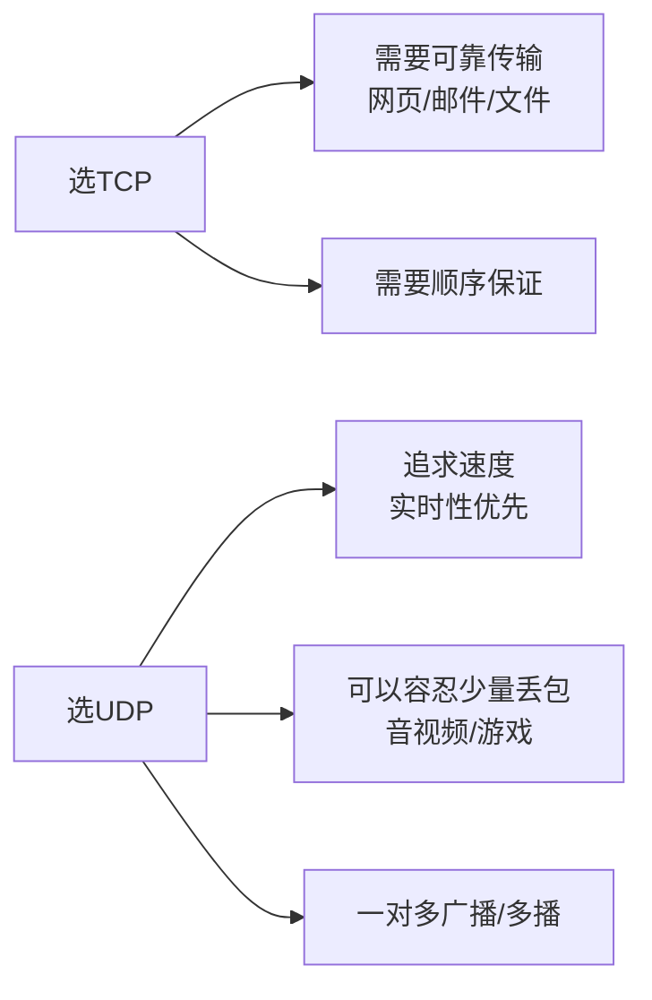
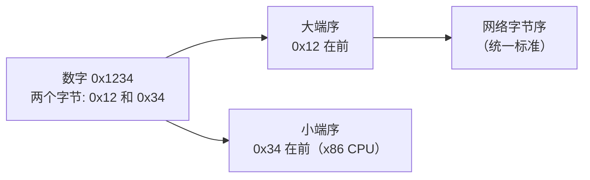

+++
title = "第 25 章：网络编程——让计算机聊聊天"
weight = 250
date = "2026-03-29T22:34:00+08:00"
type = "docs"
description = ""
isCJKLanguage = true
draft = false
+++

# 第 25 章：网络编程——让计算机聊聊天

> 本章你会：理解 Socket 是什么，学会用 C 语言写 TCP/UDP 程序，搞定字节序、地址转换、I/O 多路复用，还能顺手处理 Windows 的 Winsock。读完之后，你就能让两台电脑隔空对话了！

想象一下，你住在一栋巨大的公寓楼里（这就是**网络**），每户人家都有一个独一无二的门牌号（**IP 地址**），每户可能提供不同的服务——有的是快递代收（**UDP**），有的是高级餐厅需要预约（**TCP**）。而 **Socket**（套接字），就是你家的"电话机"——有了它，你才能跟隔壁楼的小明（另一台电脑）煲电话粥。

本章我们将用 C 语言，给你的电脑装上一台"网络电话"！

---

## 25.1 Socket 基础

### 25.1.1 BSD Socket API：头文件一览

在 Unix/Linux 的世界里，一切网络通信的鼻祖是 **BSD Socket API**。这是一套古老的、经过时间检验的接口，就像网络编程界的"普通话"——几乎所有编程语言的网络功能底层都靠它。

你需要引入以下三个头文件：

| 头文件 | 作用 | 类比 |
|---|---|---|
| `<sys/socket.h>` | 定义 socket 的核心结构体和函数 | 电话机的"说明书" |
| `<netinet/in.h>` | 定义 IP 地址结构体、端口、协议家族 | 通讯录和地址簿 |
| `<arpa/inet.h>` | 地址转换函数（把字符串 IP 转成二进制） | 姓名↔电话号码互查 |

```c
#include <stdio.h>
#include <stdlib.h>
#include <string.h>
#include <sys/socket.h>   // socket, bind, listen, accept, connect
#include <netinet/in.h>   // struct sockaddr_in, IPPROTO_TCP
#include <arpa/inet.h>    // inet_pton, inet_ntop
#include <unistd.h>       // close (Linux/Unix)
#include <errno.h>        // 错误码
```

> **什么是 sockaddr_in？** 这是"互联网地址结构体"，就像一张名片，包含：IP 地址（门牌号）和端口号（具体服务窗口）。我们会在后面看到它的具体用法。

### 25.1.2 核心函数：socket 的"生老病死"

一个 Socket 的生命周期，大致可以用五个动作概括：


**服务端（接电话的一方）**：

| 函数 | 做什么 | 类比 |
|---|---|---|
| `socket()` | 创建一个 socket | 买一台电话机 |
| `bind()` | 把 socket 绑定到一个地址（IP+端口） | 把电话机安装到具体的房间（而不是随便扔在走廊） |
| `listen()` | 开始监听连接 | 电话机打开铃声，等人打进来 |
| `accept()` | 阻塞等待，直到有人打电话来，然后接受 | 有人打电话来，你接起听筒 |
| `read()` / `recv()` | 读取对方说的话 | 听对方说话 |
| `write()` / `send()` | 对对方说话 | 说话 |
| `close()` | 挂机，销毁 socket | 挂断电话 |

**客户端（打电话的一方）**：

| 函数 | 做什么 | 类比 |
|---|---|---|
| `socket()` | 创建一个 socket | 买一台电话机 |
| `connect()` | 拨打对方的电话号码（IP+端口） | 拨号 |
| `read()` / `recv()` | 听对方说话 | 听 |
| `write()` / `send()` | 说话 | 说 |
| `close()` | 挂机 | 挂断 |

> **阻塞（blocking）是什么？** 就像你打电话时对方占线，你就只能拿着听筒在那儿"嘟嘟嘟"地等。`accept()` 默认就是阻塞的——如果没人打电话来，程序就卡在这儿不动。`recv()` 也是，如果对方还没发数据，它也会一直等着。

```c
// socket() 的基本用法
// AF_INET 表示"IPv4 协议族"
// SOCK_STREAM 表示"面向连接的流式套接字"（TCP）
// SOCK_DGRAM 表示"无连接的报文套接字"（UDP）
int sockfd = socket(AF_INET, SOCK_STREAM, 0);
if (sockfd < 0) {
    perror("socket 创建失败");
    exit(1);
}
```

```c
// bind() 的基本用法
struct sockaddr_in my_addr;
memset(&my_addr, 0, sizeof(my_addr));          // 先清零
my_addr.sin_family = AF_INET;                  // IPv4
my_addr.sin_addr.s_addr = htonl(INADDR_ANY);   // 监听所有网卡（0.0.0.0）
my_addr.sin_port = htons(8080);                // 端口 8080

// 注意：bind 的第二个参数是 struct sockaddr*，需要强制转换
if (bind(sockfd, (struct sockaddr *)&my_addr, sizeof(my_addr)) < 0) {
    perror("bind 失败");
    close(sockfd);
    exit(1);
}
```

---

## 25.2 TCP vs UDP 的选择

这是程序员生涯中永恒的灵魂拷问：**TCP 还是 UDP？**

| 特性 | TCP | UDP |
|---|---|---|
| 连接方式 | 面向连接（三次握手） | 无连接（直接发） |
| 可靠性 | 可靠，不丢包、不乱序 | 尽最大努力，可能丢包 |
| 数据边界 | 无边界（流式） | 有边界（每个数据包独立） |
| 速度 | 相对较慢（因为要确认、重传） | 快（没有这些开销） |
| 适用场景 | 网页、邮件、文件传输、SSH | 视频通话、DNS 查询、游戏实时数据、广播 |

用生活中的例子来理解：

> **TCP 就像打电话**：你拨号，对方接起，你们确认彼此在线，然后开始说话。如果对方说"喂？刚才那句没听清"，你会重说一遍。保证你每一句话都送到了。
>
> **UDP 就像发短信**：你直接发出去，对方可能收到了，可能手机没信号没收到，也可能顺序错了先收到了后面的消息。你不在乎，你只管发。



简单粗暴的选法：
- **不知道用什么的时候，用 TCP**——除非你有特殊需求
- **做实时游戏、直播、VoIP（网络电话）用 UDP**

---

## 25.3 TCP 编程：完整的打电话流程

### 服务端：接电话的人

```c
/*
 * TCP 服务端示例：接电话，然后说 Hello
 * 编译：gcc server.c -o server
 * 运行：./server
 * 测试：用 telnet localhost 8888 或运行 client.c
 */

#include <stdio.h>
#include <stdlib.h>
#include <string.h>
#include <unistd.h>
#include <sys/socket.h>
#include <netinet/in.h>
#include <arpa/inet.h>

#define PORT 8888
#define BUFFER_SIZE 1024

int main(void) {
    int server_fd, client_fd;
    struct sockaddr_in server_addr, client_addr;
    socklen_t client_len;
    char buffer[BUFFER_SIZE];
    ssize_t bytes_read;

    /* 第1步：创建 socket（买电话机） */
    server_fd = socket(AF_INET, SOCK_STREAM, 0);
    if (server_fd < 0) {
        perror("socket 创建失败");
        exit(1);
    }
    printf("[*] socket 创建成功，文件描述符：%d\n", server_fd);
    // 输出: [*] socket 创建成功，文件描述符：3

    /* 第2步：bind（把电话绑定到具体的端口） */
    // 先设置地址复用，避免 Address already in use
    int opt = 1;
    setsockopt(server_fd, SOL_SOCKET, SO_REUSEADDR, &opt, sizeof(opt));

    memset(&server_addr, 0, sizeof(server_addr));
    server_addr.sin_family = AF_INET;               // IPv4
    server_addr.sin_addr.s_addr = htonl(INADDR_ANY); // 监听所有网卡
    server_addr.sin_port = htons(PORT);              // 端口 8888

    if (bind(server_fd, (struct sockaddr *)&server_addr, sizeof(server_addr)) < 0) {
        perror("bind 失败");
        close(server_fd);
        exit(1);
    }
    printf("[*] bind 成功，监听端口 %d\n", PORT);
    // 输出: [*] bind 成功，监听端口 8888

    /* 第3步：listen（打开铃声，等电话） */
    // 第二个参数是"最大等待连接队列长度"——就像电话总机的等待线路数
    if (listen(server_fd, 10) < 0) {
        perror("listen 失败");
        close(server_fd);
        exit(1);
    }
    printf("[*] 开始监听...\n等待客户端连接...\n");
    // 输出: [*] 开始监听... 等待客户端连接...

    /* 第4步：accept（接电话） */
    // accept 会阻塞，直到有人打电话进来
    client_len = sizeof(client_addr);
    client_fd = accept(server_fd, (struct sockaddr *)&client_addr, &client_len);
    if (client_fd < 0) {
        perror("accept 失败");
        close(server_fd);
        exit(1);
    }
    // inet_ntoa 把二进制 IP 转成人能看懂的字符串
    printf("[*] 客户端连上了！IP: %s, 端口: %d\n",
           inet_ntoa(client_addr.sin_addr),
           ntohs(client_addr.sin_port));
    // 输出: [*] 客户端连上了！IP: 127.0.0.1, 端口: xxxxx

    /* 第5步：read/write（通话） */
    bytes_read = read(client_fd, buffer, BUFFER_SIZE - 1);
    if (bytes_read > 0) {
        buffer[bytes_read] = '\0';  // 加上字符串结束符
        printf("[*] 收到客户端消息: %s\n", buffer);
    }

    // 回复客户端
    const char *reply = "Hello from server! 你好，服务端已收到\n";
    write(client_fd, reply, strlen(reply));

    /* 第6步：close（挂电话） */
    close(client_fd);
    close(server_fd);
    printf("[*] 对话结束，连接已关闭\n");
    // 输出: [*] 对话结束，连接已关闭

    return 0;
}
```

### 客户端：打电话的人

```c
/*
 * TCP 客户端示例：打电话给服务端
 * 编译：gcc client.c -o client
 * 运行：./client
 */

#include <stdio.h>
#include <stdlib.h>
#include <string.h>
#include <unistd.h>
#include <sys/socket.h>
#include <netinet/in.h>
#include <arpa/inet.h>

#define SERVER_IP "127.0.0.1"
#define SERVER_PORT 8888
#define BUFFER_SIZE 1024

int main(void) {
    int sockfd;
    struct sockaddr_in server_addr;
    char buffer[BUFFER_SIZE];

    /* 第1步：创建 socket */
    sockfd = socket(AF_INET, SOCK_STREAM, 0);
    if (sockfd < 0) {
        perror("socket 创建失败");
        exit(1);
    }

    /* 第2步：connect（拨号） */
    memset(&server_addr, 0, sizeof(server_addr));
    server_addr.sin_family = AF_INET;
    server_addr.sin_port = htons(SERVER_PORT);

    // 把字符串 IP 转成二进制格式
    if (inet_pton(AF_INET, SERVER_IP, &server_addr.sin_addr) <= 0) {
        perror("IP 地址格式错误");
        close(sockfd);
        exit(1);
    }

    printf("[*] 正在连接 %s:%d ...\n", SERVER_IP, SERVER_PORT);
    if (connect(sockfd, (struct sockaddr *)&server_addr, sizeof(server_addr)) < 0) {
        perror("连接失败");
        close(sockfd);
        exit(1);
    }
    printf("[*] 连接成功！\n");
    // 输出: [*] 连接成功！

    /* 第3步：write（说话） */
    const char *msg = "Hello server, this is client! 你好服务端！\n";
    write(sockfd, msg, strlen(msg));

    /* 第4步：read（听对方说） */
    ssize_t n = read(sockfd, buffer, BUFFER_SIZE - 1);
    if (n > 0) {
        buffer[n] = '\0';
        printf("[*] 收到服务端回复: %s\n", buffer);
    }

    /* 第5步：close */
    close(sockfd);
    printf("[*] 连接已关闭\n");
    // 输出: [*] 连接已关闭

    return 0;
}
```

> **TCP 重要特性——全双工（full-duplex）**：TCP 连接一旦建立，双方可以同时读写，互不影响。就像打电话时双方可以同时说话，不需要等一方说完另一方才能说。

---

## 25.4 UDP 编程：发短信模式

UDP 比 TCP 简单多了——不需要 connect，不需要 listen，不需要 accept。直接发、直接收！

### 服务端：收短信的人

```c
/*
 * UDP 服务端示例：收短信
 * 编译：gcc udp_server.c -o udp_server
 * 运行：./udp_server
 */

#include <stdio.h>
#include <stdlib.h>
#include <string.h>
#include <unistd.h>
#include <sys/socket.h>
#include <netinet/in.h>

#define PORT 9999
#define BUFFER_SIZE 1024

int main(void) {
    int sockfd;
    struct sockaddr_in server_addr, client_addr;
    char buffer[BUFFER_SIZE];
    socklen_t addr_len;
    ssize_t n;

    /* 第1步：创建 socket（SOCK_DGRAM 表示 UDP） */
    sockfd = socket(AF_INET, SOCK_DGRAM, 0);
    if (sockfd < 0) {
        perror("socket 创建失败");
        exit(1);
    }

    /* 第2步：bind */
    memset(&server_addr, 0, sizeof(server_addr));
    server_addr.sin_family = AF_INET;
    server_addr.sin_addr.s_addr = htonl(INADDR_ANY);
    server_addr.sin_port = htons(PORT);

    if (bind(sockfd, (struct sockaddr *)&server_addr, sizeof(server_addr)) < 0) {
        perror("bind 失败");
        close(sockfd);
        exit(1);
    }
    printf("[*] UDP 服务端已启动，监听端口 %d\n", PORT);
    printf("[*] 等待客户端发来消息...\n");
    // 输出: [*] UDP 服务端已启动，监听端口 9999

    /* 第3步：recvfrom（接收消息，能知道是谁发的） */
    addr_len = sizeof(client_addr);
    n = recvfrom(sockfd, buffer, BUFFER_SIZE - 1, 0,
                 (struct sockaddr *)&client_addr, &addr_len);
    if (n > 0) {
        buffer[n] = '\0';
        printf("[*] 收到来自 %s:%d 的消息: %s\n",
               inet_ntoa(client_addr.sin_addr),
               ntohs(client_addr.sin_port),
               buffer);
    }

    /* 第4步：sendto（回复消息） */
    const char *reply = "服务端收到你的短信了！\n";
    sendto(sockfd, reply, strlen(reply), 0,
           (struct sockaddr *)&client_addr, sizeof(client_addr));

    close(sockfd);
    printf("[*] UDP 服务端关闭\n");
    // 输出: [*] UDP 服务端关闭

    return 0;
}
```

### 客户端：发短信的人

```c
/*
 * UDP 客户端示例：发短信
 * 编译：gcc udp_client.c -o udp_client
 * 运行：./udp_client
 */

#include <stdio.h>
#include <stdlib.h>
#include <string.h>
#include <unistd.h>
#include <sys/socket.h>
#include <netinet/in.h>
#include <arpa/inet.h>

#define SERVER_IP "127.0.0.1"
#define SERVER_PORT 9999
#define BUFFER_SIZE 1024

int main(void) {
    int sockfd;
    struct sockaddr_in server_addr;
    char buffer[BUFFER_SIZE];

    /* 第1步：创建 socket */
    sockfd = socket(AF_INET, SOCK_DGRAM, 0);
    if (sockfd < 0) {
        perror("socket 创建失败");
        exit(1);
    }

    /* 第2步：设置服务端地址 */
    memset(&server_addr, 0, sizeof(server_addr));
    server_addr.sin_family = AF_INET;
    server_addr.sin_port = htons(SERVER_PORT);
    inet_pton(AF_INET, SERVER_IP, &server_addr.sin_addr);

    /* 第3步：sendto（直接发出去，不需要 connect） */
    const char *msg = "你好，UDP SMS 测试！\n";
    sendto(sockfd, msg, strlen(msg), 0,
           (struct sockaddr *)&server_addr, sizeof(server_addr));
    printf("[*] 消息已发送\n");
    // 输出: [*] 消息已发送

    /* 第4步：recvfrom（收回复） */
    socklen_t len = sizeof(server_addr);
    ssize_t n = recvfrom(sockfd, buffer, BUFFER_SIZE - 1, 0,
                         (struct sockaddr *)&server_addr, &len);
    if (n > 0) {
        buffer[n] = '\0';
        printf("[*] 收到回复: %s\n", buffer);
    }

    close(sockfd);
    return 0;
}
```

> **UDP 的 recvfrom 和 sendto**：为什么 UDP 需要"从哪里收、发到哪里去"？因为 UDP 是无连接的——每次发消息都像在信封上写明收件人地址和发件人地址（struct sockaddr）。TCP 已经在 connect 时建立了"永久连接"，所以后面直接 read/write 就行。

---

## 25.5 字节序转换——大端小端的世纪之争

这是网络编程中最容易踩坑的地方，没有之一！

### 什么是字节序？

**字节序（Byte Order）**，就是多字节数据在内存中的存放顺序。就像中文地址是"省-市-区-街-号"（从大到小），而英文地址是"号-街-区-市-省"（从小到大）。

假设我们有一个 16 位的数字 `0x1234`（十进制 4660）：

- **大端序（Big Endian）**：高位字节在前，低位字节在后。`0x12` 存在低地址，`0x34` 存在高地址。**网络字节序统一使用大端序**。
- **小端序（Little Endian）**：低位字节在前，高位字节在后。`0x34` 存在低地址，`0x12` 存在高地址。**x86 和 x86-64 架构（大多数个人电脑）都是小端序**。



> **为什么要有这个差异？** 这是历史原因导致的。不同的 CPU 厂商当年选择了不同的存储方式，就像有的国家驾驶座在左边（靠左行），有的在右边（靠右行）。网络协议为了统一，规定了"大家都用大端序"，这就是 **网络字节序（Network Byte Order）**。

### 25.5.1 字节序转换函数

别慌，C 语言提供了一组函数，帮你把"主机字节序"（Host Byte Order，就是你 CPU 的字节序）和"网络字节序"（Network Byte Order，始终是大端）互相转换：

| 函数 | 含义 | 用途 |
|---|---|---|
| `htons` | Host to Network Short（16位） | 转换端口号（2字节） |
| `ntohs` | Network to Host Short（16位） | 还原端口号 |
| `htonl` | Host to Network Long（32位） | 转换 IP 地址（4字节） |
| `ntohl` | Network to Host Long（32位） | 还原 IP 地址 |

> **小技巧**：带 **s** 的是 short（16位，2字节），带 **l** 的是 long（32位，4字节）。"h" 是 host，"n" 是 network。

```c
#include <arpa/inet.h>

int main(void) {
    unsigned short port = 8080;
    unsigned long ip = 0x7F000001;  // 十六进制 IP，练习用

    /* 主机小端 → 网络大端 */
    unsigned short port_net = htons(port);  // 8080 -> 网络字节序
    unsigned long ip_net = htonl(ip);        // IP -> 网络字节序

    /* 网络大端 -> 主机字节序 */
    unsigned short port_host = ntohs(port_net);
    unsigned long ip_host = ntohl(ip_net);

    printf("端口 %u -> 网络序: 0x%x -> 主机序: %u\n", port, port_net, port_host);
    // 输出: 端口 8080 -> 网络序: 0x1f90 -> 主机序: 8080
    printf("IP 0x%lx -> 网络序: 0x%lx -> 主机序: 0x%lx\n", ip, ip_net, ip_host);
    // 输出: IP 0x7f000001 -> 网络序: 0x0100007f -> 主机序: 0x7f000001

    return 0;
}
```

> **什么时候必须用这些函数？**
> - **端口号**：任何时候都要转
> - **IP 地址**：当你手动构造 IP 数据包时需要转换
> - 实际上，`inet_pton` 和 `inet_ntop` 这些函数内部已经帮你做了字节序转换，所以如果你用这些函数，就不用再手动调用 `htonl` 了。但记住 `htons` 用于端口号永远是对的！

---

## 25.6 地址转换——字符串 IP 和二进制 IP 互转

### 25.6.1 推荐函数：inet_pton / inet_ntop

这是现代编程中**唯一推荐使用**的地址转换函数，它们同时支持 IPv4 和 IPv6：

```c
#include <arpa/inet.h>

// inet_pton：把字符串 IP 转成二进制
// 成功返回 1，失败返回 0，地址族不支持返回 -1
int inet_pton(int af, const char *src, void *dst);

// inet_ntop：把二进制 IP 转成字符串
// 成功返回指向 dst 的指针，失败返回 NULL
const char *inet_ntop(int af, const void *src, char *dst, socklen_t size);
```

```c
#include <stdio.h>
#include <arpa/inet.h>

int main(void) {
    struct in_addr ip_binary;    // 存储二进制 IP
    char ip_str[INET_ADDRSTRLEN]; // 存储字符串 IP, INET_ADDRSTRLEN = 16

    /* === IPv4: 字符串 -> 二进制 === */
    const char *ipv4_str = "192.168.1.100";
    if (inet_pton(AF_INET, ipv4_str, &ip_binary) == 1) {
        printf("[*] IPv4 转换成功: %s -> 0x%x\n", ipv4_str, ip_binary.s_addr);
        // 输出: [*] IPv4 转换成功: 192.168.1.100 -> 0x6401a8c0
    } else {
        printf("[!] IPv4 转换失败\n");
    }

    /* === IPv4: 二进制 -> 字符串 === */
    // 注意：inet_ntop 第二个参数需要的是 in_addr*，不是 in_addr**
    inet_ntop(AF_INET, &ip_binary, ip_str, sizeof(ip_str));
    printf("[*] 二进制转字符串: 0x%x -> %s\n", ip_binary.s_addr, ip_str);
    // 输出: [*] 二进制转字符串: 0x6401a8c0 -> 192.168.1.100

    /* === IPv6 示例 === */
    struct in6_addr ip6_binary;
    char ip6_str[INET6_ADDRSTRLEN];  // INET6_ADDRSTRLEN = 46

    const char *ipv6_str = "2001:db8::1";
    if (inet_pton(AF_INET6, ipv6_str, &ip6_binary) == 1) {
        printf("[*] IPv6 转换成功: %s\n", ipv6_str);
        // 输出: [*] IPv6 转换成功: 2001:db8::1
    }

    inet_ntop(AF_INET6, &ip6_binary, ip6_str, sizeof(ip6_str));
    printf("[*] IPv6 二进制转字符串: %s\n", ip6_str);
    // 输出: [*] IPv6 二进制转字符串: 2001:db8::1

    return 0;
}
```

> **INET_ADDRSTRLEN 和 INET6_ADDRSTRLEN**：分别是 IPv4 和 IPv6 地址字符串的最大长度（包括结尾的 `\0`）。直接用这些宏，比你手写 `16` 或 `46` 更专业！

### 25.6.2 旧函数 inet_addr / inet_ntoa——能不碰就别碰

```c
// 不推荐的旧函数：
in_addr_t inet_addr(const char *cp);          // 字符串 -> 二进制（有bug）
char *inet_ntoa(struct in_addr in);           // 二进制 -> 字符串（不可重入）
```

这两个函数的问题：

1. **`inet_addr()` 的 bug**：它无法表示 IP 地址 `255.255.255.255`（因为该函数的返回值被用来表示错误，已经被占用）。此外，返回值是 `in_addr_t` 类型，有些平台上还是 64 位的，容易出问题。
2. **`inet_ntoa()` 不可重入**：它使用静态缓冲区存储结果，下次调用会覆盖之前的结果。如果你在多线程程序中调用，两个线程的结果会打架！

> **永远用 `inet_pton` 和 `inet_ntop`**——这是标准答案。写代码时谁要是敢用 `inet_addr`，你就把这段文章链接甩给他！

---

## 25.7 I/O 多路复用——一个服务员服务多桌客人

想象你在一家餐厅当服务员：

- **阻塞 I/O 模式**（一个服务员只服务一桌）：你站在桌 A 旁边，等 A 点完菜、吃完、结完账，才去服务桌 B。如果你等 A 点菜等 10 分钟，桌 B 就只能干等着。
- **I/O 多路复用模式**：你同时关注 A、B、C、D 四桌。当任何一桌需要你时（举手、按铃），你就过去服务。这就是一个服务员（一个线程）同时服务多个桌子（多个 socket 连接）的秘诀！

这就是 **I/O 多路复用（I/O Multiplexing）**，是高性能网络编程的核心技术。

### 25.7.1 select：老前辈，够用但有限制

`select` 是最早出现的 I/O 多路复用方案，兼容性好，但有硬伤：

- **最大文件描述符数量限制**：Linux 上默认是 1024（由 `FD_SETSIZE` 宏定义）。超过这个数，你就得换方案了。
- **每次调用都要重新设置和轮询**：效率不高，O(n) 复杂度。

```c
#include <stdio.h>
#include <stdlib.h>
#include <string.h>
#include <unistd.h>
#include <sys/socket.h>
#include <sys/select.h>
#include <netinet/in.h>

#define PORT 8888
#define MAX_FD 1024  // select 能处理的最大 fd 数

int main(void) {
    int server_fd, client_fd[MAX_FD];
    struct sockaddr_in server_addr;
    fd_set readfds, master;  // readfds 是临时用的，master 是总账本
    int maxfd, i;
    char buffer[1024];

    /* 创建 server_fd（省略错误处理） */
    server_fd = socket(AF_INET, SOCK_STREAM, 0);
    int opt = 1;
    setsockopt(server_fd, SOL_SOCKET, SO_REUSEADDR, &opt, sizeof(opt));

    memset(&server_addr, 0, sizeof(server_addr));
    server_addr.sin_family = AF_INET;
    server_addr.sin_addr.s_addr = htonl(INADDR_ANY);
    server_addr.sin_port = htons(PORT);
    bind(server_fd, (struct sockaddr *)&server_addr, sizeof(server_addr));
    listen(server_fd, 5);

    printf("[*] TCP select 服务器已启动，端口 %d\n", PORT);
    // 输出: [*] TCP select 服务器已启动，端口 8888

    /* 初始化 */
    FD_ZERO(&master);           // 清空 master 集合
    FD_SET(server_fd, &master); // 把 server_fd 加入监听集合
    maxfd = server_fd;

    /* 初始化客户端数组 */
    for (i = 0; i < MAX_FD; i++) {
        client_fd[i] = -1;
    }

    /* 主循环 */
    while (1) {
        readfds = master;  // 每次都要复制一份！因为 select 会修改它

        /* select 会阻塞，直到有 fd 准备好 */
        int activity = select(maxfd + 1, &readfds, NULL, NULL, NULL);
        if (activity < 0) {
            perror("select 失败");
            break;
        }

        /* 检查 server_fd 是否有新连接 */
        if (FD_ISSET(server_fd, &readfds)) {
            struct sockaddr_in client_addr;
            socklen_t addr_len = sizeof(client_addr);
            int newfd = accept(server_fd, (struct sockaddr *)&client_addr, &addr_len);

            /* 找一个空位存入 newfd */
            for (i = 0; i < MAX_FD; i++) {
                if (client_fd[i] < 0) {
                    client_fd[i] = newfd;
                    break;
                }
            }

            if (i == MAX_FD) {
                printf("[!] 达到最大连接数，无法接受新连接\n");
                close(newfd);
            } else {
                FD_SET(newfd, &master);  // 加入 master 集合
                if (newfd > maxfd) maxfd = newfd;
                printf("[*] 新客户端连接，fd=%d (总共 %d 个连接)\n", newfd, i + 1);
            }
        }

        /* 检查已连接的客户端是否有数据 */
        for (i = 0; i < MAX_FD; i++) {
            if (client_fd[i] < 0) continue;

            if (FD_ISSET(client_fd[i], &readfds)) {
                memset(buffer, 0, sizeof(buffer));
                ssize_t n = read(client_fd[i], buffer, sizeof(buffer) - 1);

                if (n <= 0) {
                    /* 客户端关闭了连接 */
                    printf("[*] 客户端 fd=%d 断开连接\n", client_fd[i]);
                    close(client_fd[i]);
                    FD_CLR(client_fd[i], &master);  // 从 master 集合移除
                    client_fd[i] = -1;
                } else {
                    buffer[n] = '\0';
                    printf("[*] 收到 fd=%d 的消息: %s", client_fd[i], buffer);
                    /* 广播给所有其他客户端 */
                    for (int j = 0; j < MAX_FD; j++) {
                        if (client_fd[j] > 0 && client_fd[j] != client_fd[i]) {
                            char msg[2048];
                            snprintf(msg, sizeof(msg), "[广播] fd=%d: %s", client_fd[i], buffer);
                            write(client_fd[j], msg, strlen(msg));
                        }
                    }
                }
            }
        }
    }

    close(server_fd);
    return 0;
}
```

### 25.7.2 poll：解决数量限制的问题

`poll` 是 `select` 的改进版，没有 `FD_SETSIZE` 1024 的硬性限制。但原理类似——每次调用也要重新构建数组，效率还是 O(n)。

```c
#include <stdio.h>
#include <stdlib.h>
#include <string.h>
#include <unistd.h>
#include <sys/socket.h>
#include <netinet/in.h>
#include <poll.h>

#define PORT 8888
#define MAX_CLIENTS 65535  // poll 没有 FD_SETSIZE 限制

int main(void) {
    int server_fd, client_fd;
    struct sockaddr_in server_addr;
    struct pollfd fds[MAX_CLIENTS];
    int nfds = 1;  // 当前数组中的 fd 数量
    char buffer[1024];

    /* 创建 server_fd */
    server_fd = socket(AF_INET, SOCK_STREAM, 0);
    setsockopt(server_fd, SOL_SOCKET, SO_REUSEADDR, &(int){1}, sizeof(int));
    memset(&server_addr, 0, sizeof(server_addr));
    server_addr.sin_family = AF_INET;
    server_addr.sin_addr.s_addr = htonl(INADDR_ANY);
    server_addr.sin_port = htons(PORT);
    bind(server_fd, (struct sockaddr *)&server_addr, sizeof(server_addr));
    listen(server_fd, 10);

    /* 初始化 pollfd 数组 */
    fds[0].fd = server_fd;
    fds[0].events = POLLIN;  // 监听可读事件
    for (int i = 1; i < MAX_CLIENTS; i++) {
        fds[i].fd = -1;
    }

    printf("[*] poll 服务器已启动，端口 %d\n", PORT);

    while (1) {
        /* poll 阻塞，直到有事件发生 */
        int ret = poll(fds, nfds, -1);  // -1 表示无限等待
        if (ret < 0) {
            perror("poll 失败");
            break;
        }

        /* 检查 server_fd 是否有新连接 */
        if (fds[0].revents & POLLIN) {
            struct sockaddr_in client_addr;
            socklen_t addr_len = sizeof(client_addr);
            client_fd = accept(server_fd, (struct sockaddr *)&client_addr, &addr_len);

            /* 找空位 */
            int i;
            for (i = 1; i < MAX_CLIENTS; i++) {
                if (fds[i].fd < 0) {
                    fds[i].fd = client_fd;
                    fds[i].events = POLLIN;
                    if (i >= nfds) nfds = i + 1;
                    printf("[*] 新连接，fd=%d\n", client_fd);
                    break;
                }
            }
            if (i == MAX_CLIENTS) {
                printf("[!] 连接已满\n");
                close(client_fd);
            }
        }

        /* 检查各个客户端 */
        for (int i = 1; i < nfds; i++) {
            if (fds[i].fd < 0) continue;
            if (fds[i].revents & POLLIN) {
                ssize_t n = read(fds[i].fd, buffer, sizeof(buffer) - 1);
                if (n <= 0) {
                    printf("[*] 客户端 fd=%d 断开\n", fds[i].fd);
                    close(fds[i].fd);
                    fds[i].fd = -1;
                } else {
                    buffer[n] = '\0';
                    printf("[*] fd=%d: %s", fds[i].fd, buffer);
                }
            }
        }
    }

    close(server_fd);
    return 0;
}
```

### 25.7.3 epoll：Linux 的高性能秘密武器

`epoll` 是 Linux 独有的，比 `select` 和 `poll` 效率高得多，特别适合"大量连接，但只有少数活跃"的场景（比如 Web 服务器）。

核心三个函数：

| 函数 | 作用 |
|---|---|
| `epoll_create()` / `epoll_create1()` | 创建一个 epoll 实例 |
| `epoll_ctl()` | 注册、修改、删除要监控的 fd 和事件 |
| `epoll_wait()` | 等待事件发生，返回就绪的 fd 列表 |

```c
#include <stdio.h>
#include <stdlib.h>
#include <string.h>
#include <unistd.h>
#include <sys/socket.h>
#include <sys/epoll.h>
#include <netinet/in.h>
#include <fcntl.h>

#define PORT 8888
#define MAX_EVENTS 1024

int main(void) {
    int server_fd, epfd;
    struct epoll_event ev, events[MAX_EVENTS];
    struct sockaddr_in server_addr;

    /* 创建 server_fd */
    server_fd = socket(AF_INET, SOCK_STREAM, 0);
    setsockopt(server_fd, SOL_SOCKET, SO_REUSEADDR, &(int){1}, sizeof(int));

    memset(&server_addr, 0, sizeof(server_addr));
    server_addr.sin_family = AF_INET;
    server_addr.sin_addr.s_addr = htonl(INADDR_ANY);
    server_addr.sin_port = htons(PORT);
    bind(server_fd, (struct sockaddr *)&server_addr, sizeof(server_addr));
    listen(server_fd, 10);

    /* 创建 epoll 实例 */
    epfd = epoll_create1(0);  // 参数 0 在新版本内核中可忽略
    if (epfd < 0) {
        perror("epoll_create1 失败");
        exit(1);
    }

    /* 注册 server_fd 到 epoll，监听 EPOLLIN（可读）事件 */
    ev.events = EPOLLIN;         // 边缘触发（ET）还是水平触发（LT）？
                                 // 这里先使用 LT（默认），后面会解释
    ev.data.fd = server_fd;
    if (epoll_ctl(epfd, EPOLL_CTL_ADD, server_fd, &ev) < 0) {
        perror("epoll_ctl 添加 server_fd 失败");
        exit(1);
    }

    printf("[*] epoll 服务器已启动，端口 %d\n", PORT);
    // 输出: [*] epoll 服务器已启动，端口 8888

    /* 主循环 */
    while (1) {
        /* epoll_wait 只返回已经就绪的 fd，不阻塞 */
        int nfds = epoll_wait(epfd, events, MAX_EVENTS, -1);  // -1 无限等待
        if (nfds < 0) {
            perror("epoll_wait 失败");
            break;
        }

        for (int i = 0; i < nfds; i++) {
            int fd = events[i].data.fd;

            if (fd == server_fd) {
                /* server_fd 就绪，表示有新连接 */
                struct sockaddr_in client_addr;
                socklen_t addr_len = sizeof(client_addr);
                int client_fd = accept(server_fd, (struct sockaddr *)&client_addr, &addr_len);

                /* 设置非阻塞（ET 模式需要非阻塞） */
                int flags = fcntl(client_fd, F_GETFL, 0);
                fcntl(client_fd, F_SETFL, flags | O_NONBLOCK);

                ev.events = EPOLLIN | EPOLLET;  // 边缘触发模式
                ev.data.fd = client_fd;
                epoll_ctl(epfd, EPOLL_CTL_ADD, client_fd, &ev);
                printf("[*] 新连接，fd=%d (ET 模式)\n", client_fd);
            } else {
                /* 客户端 fd 就绪 */
                char buffer[1024];
                ssize_t n = read(fd, buffer, sizeof(buffer) - 1);
                if (n <= 0) {
                    printf("[*] 客户端 fd=%d 断开\n", fd);
                    epoll_ctl(epfd, EPOLL_CTL_DEL, fd, NULL);
                    close(fd);
                } else {
                    buffer[n] = '\0';
                    printf("[*] fd=%d: %s", fd, buffer);
                }
            }
        }
    }

    close(server_fd);
    close(epfd);
    return 0;
}
```

> **LT（Level Triggered，水平触发） vs ET（Edge Triggered，边缘触发）**：
> - **LT**：只要条件满足就一直通知。就像电饭锅的保温灯——饭好了就亮，你不拿走它一直亮着。
> - **ET**：只在状态变化时通知一次。就像门铃——按下响一声，你不关门它不再响。
>
> ET 效率更高，但编程更复杂（你需要用循环一次性读/写完所有数据）。通常 web 服务器（nginx 等）会用 ET 模式。

### 25.7.4 BSD kqueue：macOS 和 BSD 的选择

`kqueue` 是 macOS、FreeBSD 等 BSD 系统上的高性能 I/O 多路复用机制，功能和 `epoll` 类似，但 API 设计略有不同。如果你做跨平台开发（比如同时支持 Linux 和 macOS），可以用 libevent 或 libuv 这些封装好的库，省去写多套代码的麻烦。

```c
// kqueue 示例（简化版，关键结构展示）
#include <sys/event.h>

int kq = kqueue();  // 创建 kqueue 实例

struct kevent change;
EV_SET(&change, fd, EVFILT_READ, EV_ADD, 0, 0, NULL);
kevent(kq, &change, 1, NULL, 0, NULL);  // 注册事件

struct kevent event;
kevent(kq, NULL, 0, &event, 1, NULL);  // 等待事件
```

---

## 25.8 高级主题

### 25.8.1 非阻塞 I/O：让电话永不占线

默认情况下，`read`、`write`、`accept`、`recv`、`send` 等函数在没有数据时会**阻塞**——程序就在那儿等着，不往下执行。

通过设置 `O_NONBLOCK`（非阻塞模式），这些函数会**立即返回**——如果有数据就处理，没有数据就返回一个错误码（通常是 `EAGAIN` 或 `EWOULDBLOCK`），程序可以继续干别的事。

```c
#include <fcntl.h>
#include <unistd.h>

int flags = fcntl(sockfd, F_GETFL, 0);       // 获取当前 flags
fcntl(sockfd, F_SETFL, flags | O_NONBLOCK);  // 添加 O_NONBLOCK

/* 现在 recv 不会阻塞了 */
char buffer[1024];
ssize_t n = recv(sockfd, buffer, sizeof(buffer), 0);
if (n < 0) {
    if (errno == EAGAIN || errno == EWOULDBLOCK) {
        /* 没有数据，过会儿再来 */
        printf("[*] 暂时没数据，稍后再试\n");
    } else {
        perror("recv 错误");
    }
}
```

非阻塞 I/O 通常和 I/O 多路复用（select/poll/epoll）配合使用——用 `epoll_wait` 告诉你"哪个 socket 有数据了"，再去读，这样就不会浪费 CPU 在空转上了。

### 25.8.2 getsockopt / setsockopt：调教 Socket 的各种参数

Socket 有很多可配置的选项，比如是否允许地址复用、缓冲区大小、超时时间等。通过 `getsockopt`（获取）和 `setsockopt`（设置）来操作：

```c
#include <sys/socket.h>

int getsockopt(int sockfd, int level, int optname, void *optval, socklen_t *optlen);
int setsockopt(int sockfd, int level, int optname, const void *optval, socklen_t optlen);
```

**常用选项示例**：

```c
/* SO_REUSEADDR：地址复用——关闭程序后立即重启，不报 "Address already in use" */
int opt = 1;
setsockopt(sockfd, SOL_SOCKET, SO_REUSEADDR, &opt, sizeof(opt));

/* SO_RCVBUF / SO_SNDBUF：设置接收/发送缓冲区大小 */
int rcvbuf = 65536;
setsockopt(sockfd, SOL_SOCKET, SO_RCVBUF, &rcvbuf, sizeof(rcvbuf));

/* SO_RCVTIMEO / SO_SNDTIMEO：设置超时 */
struct timeval tv;
tv.tv_sec = 5;   // 5 秒
tv.tv_usec = 0;
setsockopt(sockfd, SOL_SOCKET, SO_RCVTIMEO, &tv, sizeof(tv));

/* 获取某个选项的值 */
int rcvbuf_val;
socklen_t len = sizeof(rcvbuf_val);
getsockopt(sockfd, SOL_SOCKET, SO_RCVBUF, &rcvbuf_val, &len);
printf("[*] 当前接收缓冲区大小: %d 字节\n", rcvbuf_val);
```

### 25.8.3 shutdown：优雅关闭连接

`close()` 直接关闭整个 socket，但有时候你只想**关闭一半**——比如告诉对方"我说完了，你继续说"或者"我不想再听了，你说完就挂"。

```c
#include <sys/socket.h>

int shutdown(int sockfd, int how);

/*
 * how 参数：
 *   SHUT_RD  = 不再接收数据（关闭读半边）
 *   SHUT_WR  = 不再发送数据（关闭写半半边）← 最常用！
 *   SHUT_RDWR = 两边都关闭
 */
```

**典型应用场景**：

```c
/* 客户端发送完数据后，告诉对方"我说完了" */
const char *msg = "这是我最后一句话了...\n";
send(sockfd, msg, strlen(msg), 0);

shutdown(sockfd, SHUT_WR);  // 关闭写半边——服务器会收到 EOF
printf("[*] 数据已发送，关闭写端\n");

/* 然后还能继续读服务器的回复 */
char buffer[1024];
while (read(sockfd, buffer, sizeof(buffer)) > 0) {
    printf("%s", buffer);
}
```

> **`close()` vs `shutdown()`**：
> - `close()`：引用计数减一。如果同一个 socket 被 `dup()` 复制过，只有所有副本都 close 了，连接才真正关闭。
> - `shutdown()`：直接切断双向通信通道，不受引用计数影响。通常配合 `close()` 使用——先用 `shutdown(SHUT_WR)` 告诉对方发送完毕，再用 `close()` 关闭。

### 25.8.4 sendfile：零拷贝的魔法

在 Web 服务器中，一个常见的操作是：读取磁盘上的文件，然后通过 socket 发送出去。

普通做法（4 次拷贝）：
1. 磁盘 → 内核缓冲区（read）
2. 内核缓冲区 → 用户空间（copy to user）
3. 用户空间 → 内核缓冲区（write to kernel）
4. 内核缓冲区 → 网卡（NIC）

**sendfile** 的做法（2 次拷贝）：
1. 磁盘 → 内核缓冲区（DMA 拷贝）
2. 内核缓冲区 → 网卡（DMA 拷贝）

数据**完全不经过用户空间**，直接从内核缓冲区送到网卡，效率极高。这就是 Linux 高性能 Web 服务器（如 nginx）的秘密之一。

```c
#include <sys/sendfile.h>

/*
 * ssize_t sendfile(int out_fd, int in_fd, off_t *offset, size_t count);
 * out_fd: 目标 socket
 * in_fd: 源文件（必须是可以 mmap 的文件）
 * offset: 文件中的起始位置（NULL 表示从头开始）
 * count: 发送多少字节
 */

/* 示例：发送文件内容 */
int file_fd = open("big_file.bin", O_RDONLY);
if (file_fd < 0) {
    perror("打开文件失败");
    return;
}

off_t file_size = lseek(file_fd, 0, SEEK_END);  // 获取文件大小
lseek(file_fd, 0, SEEK_SET);                    // 回到开头

/* 发送整个文件 */
ssize_t sent = sendfile(sockfd, file_fd, NULL, file_size);
printf("[*] 已发送 %zd 字节（零拷贝）\n", sent);
// 输出: [*] 已发送 xxxxxx 字节（零拷贝）

close(file_fd);
```

---

## 25.9 Windows Winsock：Windows 上的网络编程

终于到 Windows 了！Windows 的网络编程和 Linux/Unix 有一些不同，主要体现在两点：

1. 头文件不同：**`<winsock2.h>`** 和 **`<ws2tcpip.h>`**（而不是 `<sys/socket.h>`）
2. 使用前必须初始化，使用后必须清理——通过 `WSAStartup()` 和 `WSACleanup()`

> **为什么 Windows 不直接用 BSD Socket？** 历史上 Windows 有自己的一套 API 叫 Winsock（Windows Sockets API），后来为了和 Unix 兼容，Winsock 也实现了 BSD Socket 的接口，但加了一层"初始化"的门槛。

```c
/*
 * Windows TCP 客户端示例
 * 编译（MSVC）：cl client.c ws2_32.lib
 * 或在代码里加上链接指令：
 * #pragma comment(lib, "ws2_32.lib")
 */

#include <stdio.h>
#include <stdlib.h>
#include <string.h>

/* Windows 头文件 */
#define WIN32_LEAN_AND_MEAN
#include <winsock2.h>
#include <ws2tcpip.h>

/* 链接 ws2_32.lib 库 */
#pragma comment(lib, "ws2_32.lib")

#define SERVER_IP "127.0.0.1"
#define SERVER_PORT 8888
#define BUFFER_SIZE 1024

int main(void) {
    WSADATA wsa_data;   // 存储 Winsock 版本信息
    SOCKET sockfd;
    struct sockaddr_in server_addr;
    char buffer[BUFFER_SIZE];

    /* 第0步（Windows 特有）：初始化 Winsock */
    // MAKEWORD(2, 2) 表示请求 Winsock 2.2 版
    if (WSAStartup(MAKEWORD(2, 2), &wsa_data) != 0) {
        printf("[!] WSAStartup 失败，错误码: %d\n", WSAGetLastError());
        return 1;
    }
    printf("[*] Winsock 初始化成功，版本: %d.%d\n",
           LOBYTE(wsa_data.wVersion), HIBYTE(wsa_data.wVersion));
    // 输出: [*] Winsock 初始化成功，版本: 2.2

    /* 第1步：创建 socket */
    sockfd = socket(AF_INET, SOCK_STREAM, 0);
    if (sockfd == INVALID_SOCKET) {
        printf("[!] socket 创建失败，错误码: %d\n", WSAGetLastError());
        WSACleanup();
        return 1;
    }

    /* 第2步：connect */
    memset(&server_addr, 0, sizeof(server_addr));
    server_addr.sin_family = AF_INET;
    server_addr.sin_port = htons(SERVER_PORT);

    // Windows 上也可以用 InetPton（ws2tcpip.h 提供）
    if (InetPton(AF_INET, SERVER_IP, &server_addr.sin_addr) <= 0) {
        printf("[!] IP 地址格式错误\n");
        closesocket(sockfd);
        WSACleanup();
        return 1;
    }

    if (connect(sockfd, (struct sockaddr *)&server_addr, sizeof(server_addr)) == SOCKET_ERROR) {
        printf("[!] 连接失败，错误码: %d\n", WSAGetLastError());
        closesocket(sockfd);
        WSACleanup();
        return 1;
    }
    printf("[*] 连接成功！\n");

    /* 第3步：send / recv */
    const char *msg = "Hello from Windows Winsock client!\n";
    send(sockfd, msg, (int)strlen(msg), 0);

    int n = recv(sockfd, buffer, BUFFER_SIZE - 1, 0);
    if (n > 0) {
        buffer[n] = '\0';
        printf("[*] 收到回复: %s\n", buffer);
    }

    /* 第4步：清理 */
    closesocket(sockfd);
    WSACleanup();  // Windows 特有，必须调用
    printf("[*] Winsock 已清理，程序结束\n");
    // 输出: [*] Winsock 已清理，程序结束

    return 0;
}
```

> **Linux vs Windows Socket API 主要差异**：
>
> | 差异 | Linux/Unix | Windows |
> |---|---|---|
> | 关闭 socket | `close()` | `closesocket()` |
> | 获取错误码 | `errno` | `WSAGetLastError()` |
> | 初始化 | 不需要 | `WSAStartup()` |
> | 清理 | 不需要 | `WSACleanup()` |
> | 无阻塞设置 | `fcntl()` | `ioctlsocket()` |
> | 头文件 | `<sys/socket.h>` | `<winsock2.h>` |

---

## 本章小结

本章我们从 Socket 的"生老病死"出发，完整学习了 C 语言网络编程的核心内容：

1. **Socket 基础**：BSD Socket API 是 Unix/Linux 网络编程的基石，通过 `socket()` → `bind()` → `listen()` → `accept()` → `read/write` → `close()` 完成一次完整的 TCP 通信。

2. **TCP vs UDP**：TCP 面向连接、可靠、有序，适合网页、邮件、文件传输；UDP 无连接、快速、不保证可靠性，适合实时音视频、游戏等。

3. **TCP 编程**：服务端经历"创建→绑定→监听→接受→读写→关闭"，客户端则是"创建→连接→读写→关闭"。

4. **UDP 编程**：更简单，用 `recvfrom` 和 `sendto` 直接收发光包，不需要建立连接。

5. **字节序转换**：网络字节序统一是大端（Big Endian），主机字节序取决于 CPU（x86 是小端）。用 `htons`/`ntohs`/`htonl`/`ntohl` 做转换。

6. **地址转换**：`inet_pton` 和 `inet_ntop` 是现代推荐的 IPv4/IPv6 地址转换函数，`inet_addr` 和 `inet_ntoa` 有坑，别用。

7. **I/O 多路复用**：用单线程同时管理多个 socket 连接。`select` 有 1024 fd 限制；`poll` 无限制但每次重建数组；`epoll`（Linux）和 `kqueue`（macOS/BSD）是高性能方案。

8. **高级主题**：非阻塞 I/O（`O_NONBLOCK`）、Socket 选项配置（`SO_REUSEADDR` 等）、优雅关闭（`shutdown(SHUT_WR)`）、零拷贝（`sendfile`）。

9. **Windows Winsock**：Windows 上需要 `WSAStartup()` 初始化、`WSACleanup()` 清理，用 `closesocket()` 关闭，用 `WSAGetLastError()` 获取错误码。

> 网络编程是 C 语言的"高级武功"，涉及操作系统、网络协议、多线程等多个领域的交叉。但一旦掌握，你就具备了编写高性能服务器、网络工具、甚至自己的 Web 服务器的能力。Keep coding！
