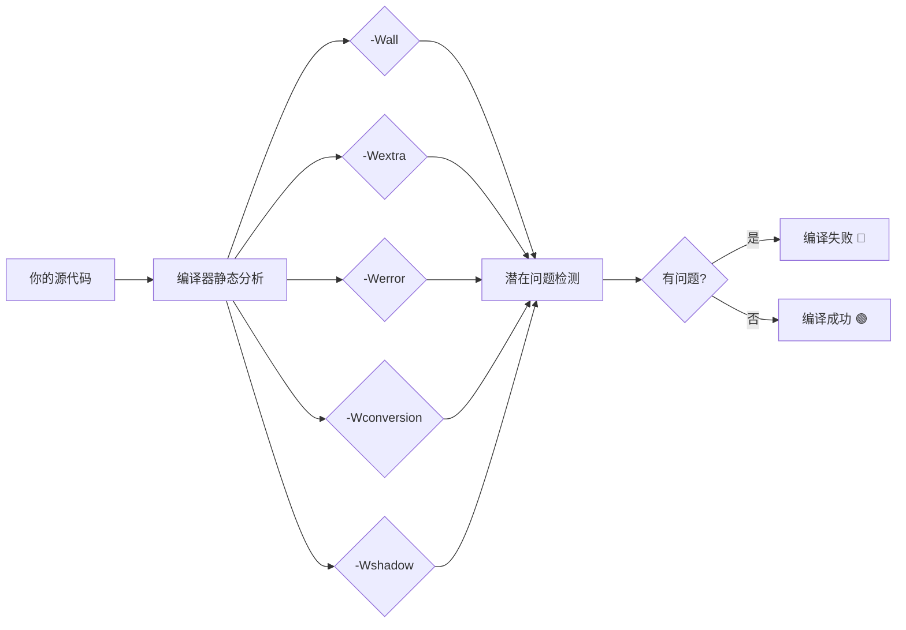

+++
title = "第 28 章：调试、测试与代码质量"
weight = 280
date = "2026-03-29T22:34:00+08:00"
type = "docs"
description = ""
isCJKLanguage = true
draft = false
+++

# 第 28 章：调试、测试与代码质量

> "代码写出来的那一刻，它就已经错了。问题是——错在哪里？"
> —— 某位被 bug 折磨了二十年的 C 语言老兵

想象一下，你盖了一栋房子🏠，但没有质检、没有监理、没有消防检查，你就直接住进去了。恭喜你，你住进了 C 语言的世界！

C 语言就是这样一门"给你锤子让你自己造"的语言。它快如闪电🔥，能直接操控硬件，驱动世界万物从微波炉到火星车。但代价是——它不会帮你检查错误，所有的问题都要靠你自己来发现。

这就是为什么**调试（Debugging）**、**测试（Testing）**和**代码质量（Code Quality）**在 C 语言中如此重要。你不是在写代码，你是在驾驶一辆没有安全气囊的赛车🏎️——要想活命，就得自己系好安全带，自己检查刹车，自己看路况。

好消息是，本章就是你的"安全带"。我们会教你如何让编译器当你的唠叨老妈🧑‍🦰，如何用工具自动帮你找 bug，如何写出让人竖大拇指的高质量代码。

准备好了吗？系好安全带，我们发车了！

---

## 28.1 静态分析编译选项：编译器免费送你的人工智能质检员

你知道吗？你的 GCC/Clang 编译器其实内置了一个**静态分析器（Static Analyzer）**——它能在你运行程序之前就发现潜在的 bug！而且这些功能完全是免费的！白嫖的快乐你懂吗？😎

所谓**静态分析**，就是"不动手执行程序，光看代码就能发现问题"的技术。就像老中医👨‍⚕️看病，看一眼你的脸色（代码），就知道你哪里不对劲。

### 一切的基础：`-Wall`

`-Wall` 是 "Warn All" 的缩写，意思是"警告所有能警告的问题"。把它想象成你请了一个极度负责的室友👀，你每次出门（编译）TA 都要检查你有没有忘关煤气、有没有锁门。

```c
#include <stdio.h>

int main(void) {
    int x = 10;
    printf("x = %d\n", x); // x = 10
    return 0;
}
```

```bash
gcc -Wall test.c -o test
```

没开 `-Wall` 的时候，你的编译器就像一个佛系的物业——只要你不把楼炸了，它就不说话🙃。加上 `-Wall`，它就开始唠叨了：

```
warning: unused variable 'x' [-Wunused-variable]
```

看！编译器告诉你"喂，x 这个变量你定义了但没用，浪费了啊！"这在大型项目里是非常有用的提醒。很多 bug 就是因为某个变量本该用结果没用，逻辑上悄悄出错了。

### 进阶唠叨：`-Wextra`

`-Wextra`（也叫 `-W`）是 `-Wall` 的增强版，相当于给那个佛系物业升级成了居委会大妈👵，更加严格：

```c
#include <stdio.h>

int main(void) {
    int a = 5;
    int b = 3;

    if (a = b) {  // 警告！这是赋值不是比较！
        printf("相等\n"); // 相等
    }

    return 0;
}
```

```bash
gcc -Wall -Wextra test.c -o test
```

```
warning: suggest parentheses around assignment used as truth value [-Wparentheses]
```

如果没有 `-Wextra`，`if (a = b)` 这种低级错误可能逃过你的眼睛。编译器说"你是不是想写 `a == b`？"——多么及时的一记耳光啊！😱

### 把警告当错误：`-Werror`

有时候你会想："警告而已嘛，又不是错误，凑合用吧..." 大错特错！**警告就是未来的错误**！今天一个不起眼的警告，明天可能就是程序崩溃的元凶🧨。

`-Werror` 的作用是把所有警告都当成错误处理——换句话说，你的代码要么完美，要么就别想编译通过。

```bash
gcc -Wall -Wextra -Werror test.c -o test
```

> **提示：** `-Werror` 特别适合用在 CI/CD 流水线中，确保没有人能把带警告的代码提交上去。

### 严格模式：`-pedantic`

`-pedantic` 是一位来自 ISO C 标准的严格考官📝。它会检查你的代码是否符合 ANSI/ISO C 标准——即使代码能正常编译运行，只要它不符合标准，就给你开一张"不合格"通知单。

```c
#include <stdio.h>

int main() {  // 警告！K&R 风格函数定义不符合 ISO C
    printf("Hello\n"); // Hello
    return 0;
}
```

```bash
gcc -Wall -pedantic test.c -o test
```

```
warning: function declaration isn't a prototype [-Wstrict-prototypes]
```

这个选项特别适合写**跨平台代码**的程序员。如果你想让你的代码在 gcc、clang、msvc 等各种编译器上都能顺利编译，`-pedantic` 就是你的好朋友。

### 类型安全检查：`-Wconversion`

`-Wconversion` 能检测**隐式类型转换**导致的精度丢失或符号问题。这就像一个海关🛃，严格检查每件"货物"（数据）过境时有没有被偷偷拆包换包装。

```c
#include <stdio.h>

int main(void) {
    int big = 300;
    char small = big;  // 300 超出 char 范围（通常 -128~127）
    printf("small = %d\n", small); // small = 44
    return 0;
}
```

```bash
gcc -Wall -Wconversion test.c -o test
```

```
warning: conversion to 'char' may change value [-Wconversion]
```

编译器告诉你："你把 300 塞进了一个只能装 -128 到 127 的箱子里，东西会变形的！" 实际上 300 在二进制补码表示下会变成 44（300 - 256）。这种 bug 查起来极其隐蔽，但 `-Wconversion` 能在编译时就抓住它！

### 变量遮蔽检测：`-Wshadow`

你有没有经历过"我明明定义了一个变量，但值怎么不对？"的困惑？很可能就是**变量遮蔽（Shadowing）**在作怪！

**变量遮蔽**就是内层作用域定义了一个和外层同名的变量，把外层的给"挡住"了。就像你家里有两个叫"小明"的人🏠，每次喊小明，弟弟先答应了，哥哥被无视了。

```c
#include <stdio.h>

int x = 100;  // 全局变量

int main(void) {
    int x = 200;  // 遮蔽了全局变量！
    printf("x = %d\n", x); // x = 200 （你以为是 100，其实是 200）
    return 0;
}
```

```bash
gcc -Wall -Wshadow test.c -o test
```

```
warning: declaration of 'x' shadows a global declaration [-Wshadow]
```

有了 `-Wshadow`，编译器会大声喊出来："你遮住了一个全局变量！小心点！"

### 函数原型检查：`-Wstrict-prototypes`

C 语言允许你写没有参数声明的函数——`int foo()` 和 `int foo(void)` 看起来差不多，其实天差地别！

- `int foo()` 表示"参数任意，我不在乎"
- `int foo(void)` 表示"严格无参数"

`-Wstrict-prototypes` 强制你使用后者，避免歧义。

```c
int foo();  // 警告！应该写成 foo(void)

int foo(void) {
    return 42;
}
```

```bash
gcc -Wall -Wstrict-prototypes test.c -o test
```

```
warning: function declaration isn't a prototype [-Wstrict-prototypes]
```

### 缺失函数原型：`-Wmissing-prototypes`

**函数原型（Function Prototype）**是函数的"使用说明书"，告诉编译器这个函数的返回类型和参数类型。缺失原型就像超市货架上没有价格标签——系统不知道该怎么"定价"你的函数。

```c
// test1.c
int helper() {  // 没有在头文件中声明，也没有在 main 之前声明
    return 99;
}

// test2.c 假设这里调用了 test1.c 的 helper 函数...
// 如果没有正确声明原型，链接器可能找不到这个函数！
```

```bash
gcc -Wall -Wmissing-prototypes test1.c -o test1
```

```
warning: no previous prototype for 'helper' [-Wmissing-prototypes]
```

这个警告尤其重要，因为没有原型的函数可能在你不知情的情况下被其他文件调用，一旦你改动了函数签名，所有调用者都会遭殃——而且这种错误往往在**链接阶段**才爆发，那才是真正的"事后诸葛亮"！

### 未初始化变量：`-Wuninitialized`

未初始化的局部变量是 C 语言中最阴险的 bug 之一。**局部变量**（在函数内部定义的）不会像**全局变量**那样被自动初始化为 0，它们的默认值是"随机的垃圾值"——就像拆开包裹发现里面是别人用过的纸巾🧻，你根本不知道之前是谁用过的。

```c
#include <stdio.h>

int main(void) {
    int a;  // 未初始化！
    int b = 10;
    int c = a + b;  // a 是垃圾值，结果不可预测！
    printf("c = %d\n", c);
    return 0;
}
```

```bash
gcc -Wall -O2 -Wuninitialized test.c -o test
```

> **注意：** `-Wuninitialized` 需要开启优化（`-O1` 或更高）才能工作！因为编译器需要通过数据流分析来判断变量是否被初始化，而这是优化阶段才做的事情。

### 组合技：一键开启所有检查

想要一次性开启所有这些检查？超简单！

```bash
gcc -Wall -Wextra -Wpedantic -Wconversion -Wshadow \
    -Wstrict-prototypes -Wmissing-prototypes \
    -Wuninitialized -Werror \
    -O2 -g \
    your_code.c -o your_program
```

解释一下其他参数：
- `-O2`：二级优化，让代码运行更快（也让静态分析更准确）
- `-g`：生成调试信息，让 gdb 等工具能用



---

## 28.2 cppcheck：开源静态分析工具，代码界的"福尔摩斯"

上一节的编译选项是编译器自带的质检员，**cppcheck** 则是专门为 C/C++ 打造的开源静态分析工具——相当于把质检员升级成了私人侦探🔍！

**cppcheck** 的特点：
- 开源免费，跨平台（Windows、Linux、macOS）
- 专注于内存泄漏、未初始化变量、空指针解引用等危险操作
- 不报真正的语法错误（编译器已经做了），专门找**逻辑错误**和**危险写法**

### 安装 cppcheck

**Linux (Ubuntu/Debian)：**
```bash
sudo apt-get install cppcheck
```

**macOS：**
```bash
brew install cppcheck
```

**Windows：**去 https://cppcheck.sourceforge.io/ 下载安装包。

### 基本使用

```bash
cppcheck your_code.c
```

### 有趣示例：内存泄漏检测

```c
#include <stdlib.h>
#include <stdio.h>

void leaky_function(void) {
    int* ptr = (int*)malloc(sizeof(int) * 10);
    printf("分配了内存\n");

    // 糟糕！忘记 free 就返回了！
    // return 之前没有 free(ptr);
}

int main(void) {
    leaky_function();
    leaky_function();
    leaky_function();
    // 运行三次，泄漏了 3 次内存！
    printf("程序结束\n"); // 程序结束
    return 0;
}
```

```bash
cppcheck --enable=all leaky.c
```

cppcheck 输出：
```
[leaky.c:5]: (error) Memory leak: ptr
```

它不仅告诉你"这里有内存泄漏"，还精确到**行号**！就像福尔摩斯指着犯罪现场说："这里是凶手留下的脚印！"

### cppcheck 高级选项

```bash
# 检查所有文件（包括标准库的头文件）
cppcheck --check-config your_code.c

# 生成 HTML 报告
cppcheck --html-output=report.html your_code.c

# 只检查特定类别的错误
cppcheck --enable=warning your_code.c
cppcheck --enable=performance your_code.c
cppcheck --enable=portability your_code.c
```

`--enable=all` 会开启所有检查类别，包括：
- **error**：严重错误（如内存泄漏、空指针解引用）
- **warning**：警告（如使用不安全的函数）
- **style**：风格问题（如冗余代码、未使用的函数）
- **performance**：性能问题（如传入非 const 指针给期望 const 的函数）
- **portability**：跨平台兼容性问题

### 在项目中批量检查

```bash
# 检查整个 src 目录
cppcheck --enable=all --std=c11 --verbose src/
```

> **小技巧：** 把 cppcheck 集成到你的 Makefile 中，让它成为自动化构建的一部分！
>
> ```makefile
> check:
>     cppcheck --enable=all --std=c11 -j4 src/
> ```

---

## 28.3 Clang Static Analyzer：LLVM 家族的王牌探员

如果说 cppcheck 是独立侦探，那么 **Clang Static Analyzer** 就是 CIA 特工——基于 LLVM/Clang 生态的专业级静态分析工具，由苹果公司主导开发，深度集成于 clang 编译器中。

**Clang Static Analyzer** 的优势：
- 使用**符号执行（Symbolic Execution）**技术，能模拟程序的所有可能执行路径
- 能发现那些需要"真正理解程序逻辑"才能找到的 bug
- 内置于 clang 中，无需额外安装（如果你已经装了 clang）

### 基本用法

**方法一：scan-build（推荐）**

`scan-build` 是一个"分析+编译"一条龙工具，用它替换 `gcc/clang` 来编译你的项目：

```bash
# 安装（如果没装）
# Ubuntu: sudo apt-get install clang-tools

scan-build gcc your_code.c -o your_program
```

**方法二：直接用 clang 分析**

```bash
clang --analyze your_code.c -o your_program
```

### 有趣示例：空指针解引用

```c
#include <stdlib.h>
#include <stdio.h>

int main(void) {
    int* ptr = NULL;

    // 模拟某种条件
    int x = 5;
    if (x > 0) {
        ptr = (int*)malloc(sizeof(int));
    }

    // 如果 x <= 0，ptr 就是 NULL，这里直接解引用就会崩溃！
    *ptr = 42;  // 空指针解引用！
    printf("值为: %d\n", *ptr); // 崩溃！
    free(ptr);
    return 0;
}
```

```bash
scan-build gcc null_deref.c -o null_deref 2>&1
```

Clang Static Analyzer 会告诉你：
```
null_deref.c:10:5: warning: Dereference of null pointer (loaded from variable 'ptr')
```

### Clang Analyzer 能发现的问题类型

| 问题类型 | 说明 | 危险程度 |
|---------|------|---------|
| 空指针解引用 | NULL + * = 💥 | ⭐⭐⭐⭐⭐ |
| 内存泄漏 | malloc 没 free | ⭐⭐⭐⭐ |
| 使用未初始化变量 | 随机垃圾值 | ⭐⭐⭐⭐⭐ |
| 越界访问 | 数组下标超出范围 | ⭐⭐⭐⭐⭐ |
| 释放后使用 | free 之后又访问 | ⭐⭐⭐⭐⭐ |
| 缓冲区溢出 | 写的比分配的多了 | ⭐⭐⭐⭐⭐ |

### 生成 HTML 报告

```bash
scan-build -o ./report make -j4
# 然后用浏览器打开 ./report/index.html
```

生成的报告会像网页一样，列出所有发现的 bug，点击每个条目可以看到**调用图（Call Graph）**——展示了问题是如何从 A 函数传播到 B 函数的。

---

## 28.4 单元测试框架：Check / Unity / CMocka

现在我们要聊一个让很多 C 程序员闻风丧胆的话题——**单元测试（Unit Testing）**😱。

"等等，C 语言还要写测试？C 不是只要 `gcc a.c -o a && ./a` 就完了吗？"

不！大错特错！**没有测试的代码就像没有安全带的赛车**🏎️——开起来很爽，出事故的时候哭都来不及。

**单元测试**就是针对程序中最小可测试单元（通常是单个函数）进行的验证。你把函数的输入扔进去，检查输出对不对。就像食品加工厂对每个零件进行质检一样。

### Check：Linux 桌面级单元测试框架

**Check** 是 Linux 环境下最流行的 C 单元测试框架，专为 POSIX 系统设计。

#### 安装

```bash
# Ubuntu/Debian
sudo apt-get install check

# macOS
brew install check
```

#### 第一个 Check 测试

想象一下你在开发一个计算器，需要测试加法函数：

```c
/* calculator.h */
#ifndef CALCULATOR_H
#define CALCULATOR_H

int add(int a, int b);
int subtract(int a, int b);
int multiply(int a, int b);
double divide(int a, int b);  // 如果 b=0 返回 0.0

#endif
```

```c
/* calculator.c */
#include "calculator.h"

int add(int a, int b) {
    return a + b;
}

int subtract(int a, int b) {
    return a - b;
}

int multiply(int a, int b) {
    return a * b;
}

double divide(int a, int b) {
    if (b == 0) {
        return 0.0;  // 糟糕的错误处理！
    }
    return (double)a / b;
}
```

```c
/* test_calculator.c */
#include <check.h>
#include <stdlib.h>
#include "calculator.h"

/* 测试 add 函数 */
START_TEST(test_add) {
    ck_assert_int_eq(add(1, 2), 3);
    ck_assert_int_eq(add(-1, 1), 0);
    ck_assert_int_eq(add(0, 0), 0);
    ck_assert_int_eq(add(-5, -3), -8);
}
END_TEST

/* 测试 subtract 函数 */
START_TEST(test_subtract) {
    ck_assert_int_eq(subtract(5, 3), 2);
    ck_assert_int_eq(subtract(3, 5), -2);
    ck_assert_int_eq(subtract(0, 0), 0);
}
END_TEST

/* 测试 multiply 函数 */
START_TEST(test_multiply) {
    ck_assert_int_eq(multiply(3, 4), 12);
    ck_assert_int_eq(multiply(-2, 5), -10);
    ck_assert_int_eq(multiply(0, 100), 0);
}
END_TEST

/* 测试 divide 函数 */
START_TEST(test_divide) {
    ck_assert_double_eq(divide(10, 2), 5.0);
    ck_assert_double_eq(divide(7, 2), 3.5);
    ck_assert_double_eq(divide(0, 5), 0.0);
}
END_TEST

/* 主函数，组装测试用例 */
int main(void) {
    Suite* s = suite_create("Calculator");  // 创建一个测试套件
    TCase* tc_core = tcase_create("Core");   // 创建一个测试用例组

    /* 把测试用例添加到组里 */
    tcase_add_test(tc_core, test_add);
    tcase_add_test(tc_core, test_subtract);
    tcase_add_test(tc_core, test_multiply);
    tcase_add_test(tc_core, test_divide);

    /* 把测试用例组添加到套件里 */
    suite_add_tcase(s, tc_core);

    /* 运行测试 */
    SRunner* sr = srunner_create(s);
    srunner_run_all(sr, CK_NORMAL);
    int number_failed = srunner_ntests_failed(sr);
    srunner_free(sr);

    /* 返回 0 表示全部通过，非 0 表示有失败 */
    return (number_failed == 0) ? EXIT_SUCCESS : EXIT_FAILURE;
}
```

```makefile
# Makefile
CC = gcc
CFLAGS = -Wall -Wextra -std=c11
LDFLAGS = -lcheck -lsubunit -lm -lrt -lpthread

TARGET = test_calculator
SRC = calculator.c test_calculator.c

$(TARGET): $(SRC)
    $(CC) $(CFLAGS) -o $(TARGET) $(SRC) $(LDFLAGS)

clean:
    rm -f $(TARGET)

.PHONY: clean
```

```bash
make && ./test_calculator
```

输出：
```
Running suite(s): Calculator
0%: Checks: 4, Failures: 0, Errors: 0
```

全部通过！🎉 如果 `divide(10, 2)` 返回了 `5.001`，测试就会失败并告诉你："期望 5.0，但得到了 5.001"。

#### Check 的常用断言

| 断言 | 作用 | 示例 |
|------|------|------|
| `ck_assert_int_eq(a, b)` | 整数相等 | `ck_assert_int_eq(add(2,3), 5)` |
| `ck_assert_double_eq(a, b)` | 双精度浮点数相等 | `ck_assert_double_eq(divide(10,3), 3.333)` |
| `ck_assert_str_eq(a, b)` | 字符串相等 | `ck_assert_str_eq(get_name(), "Alice")` |
| `ck_assert_ptr_ne(a, b)` | 指针不相等 | `ck_assert_ptr_ne(p, NULL)` |
| `ck_assert(a)` | 通用条件判断 | `ck_assert(ptr != NULL)` |

### Unity：嵌入式系统的轻量级测试框架

在嵌入式开发中（想想智能手环、汽车 ECU 🏎️），硬件资源极其有限——没有操作系统、没有文件系统、连内存都只有几 KB。这种环境下，Check 框架太"重"了，跑不动。

**Unity** 就是为这种场景设计的——轻量、简单、无依赖、纯 C 实现，是嵌入式测试的事实标准。Arduino、STM32、ESP32 都能用！

#### Unity 基本用法

```c
/* test_gpio.c */
#include "unity.h"
#include "gpio.h"  /* 假设这是你的 GPIO 驱动头文件 */

/* 全局变量，用于存放测试结果 */
extern int gpio_read_counter;
extern int gpio_write_counter;

/* 测试前设置（类似 pytest 的 setup） */
void setUp(void) {
    gpio_read_counter = 0;
    gpio_write_counter = 0;
}

/* 测试后清理（类似 pytest 的 teardown） */
void tearDown(void) {
    /* 清理工作 */
}

/* 测试 GPIO 初始化 */
void test_gpio_init(void) {
    gpio_init(GPIO_PIN_5, GPIO_MODE_OUTPUT);
    TEST_ASSERT_TRUE(gpio_is_initialized(GPIO_PIN_5));
    TEST_ASSERT_EQUAL_INT(GPIO_MODE_OUTPUT, gpio_get_mode(GPIO_PIN_5));
}

/* 测试 GPIO 写入 */
void test_gpio_write(void) {
    gpio_init(GPIO_PIN_5, GPIO_MODE_OUTPUT);
    gpio_write(GPIO_PIN_5, GPIO_HIGH);
    TEST_ASSERT_EQUAL_INT(GPIO_HIGH, gpio_read(GPIO_PIN_5));
}

/* 测试 GPIO 读取 */
void test_gpio_read(void) {
    gpio_init(GPIO_PIN_3, GPIO_MODE_INPUT);
    TEST_ASSERT_TRUE(gpio_read(GPIO_PIN_3) == GPIO_HIGH ||
                     gpio_read(GPIO_PIN_3) == GPIO_LOW);
}

/* 主函数 */
int main(void) {
    UNITY_BEGIN();
    RUN_TEST(test_gpio_init);
    RUN_TEST(test_gpio_write);
    RUN_TEST(test_gpio_read);
    return UNITY_END();
}
```

#### Unity 的断言宏

```c
TEST_ASSERT_TRUE(condition);        // 断言为真
TEST_ASSERT_FALSE(condition);      // 断言为假
TEST_ASSERT_EQUAL_INT(a, b);       // 整数相等
TEST_ASSERT_EQUAL_HEX32(a, b);    // 32位十六进制相等
TEST_ASSERT_EQUAL_STRING(a, b);   // 字符串相等
TEST_ASSERT_TRUE_MESSAGE(c, msg);  // 带错误信息的断言
```

Unity 小到可以放在单片机上运行，也可以跑在 PC 上做开发测试。这种"先在 PC 上写测试，再烧录到嵌入式设备"的模式叫做**Hardware-in-the-Loop (HIL)** 测试。

### CMocka：跨平台通用测试框架

如果你的 C 代码要跑在 Windows、Linux、macOS 等多种平台，**CMocka** 是一个好选择。它受 JUnit 启发，设计简洁，也不需要额外的运行时依赖。

#### 安装 CMocka

```bash
# Ubuntu/Debian
sudo apt-get install libcmocka-dev

# 源码安装
git clone https://git.cryptomilk.org/projects/cmocka.git
cd cmocka && cmake . && make && sudo make install
```

#### CMocka 示例

```c
/* test_string.c */
#include <stdarg.h>
#include <stddef.h>
#include <setjmp.h>
#include <cmocka.h>
#include <string.h>
#include <stdio.h>

/* 假设的字符串处理函数 */
int string_length(const char* str) {
    if (str == NULL) return -1;
    return strlen(str);
}

/* 测试正常字符串 */
static void test_string_length_normal(void** state) {
    (void) state;  /* 未使用的参数 */
    assert_int_equal(string_length("hello"), 5);
    assert_int_equal(string_length(""), 0);
    assert_int_equal(string_length("C is fun!"), 10);
}

/* 测试空指针 */
static void test_string_length_null(void** state) {
    (void) state;
    assert_int_equal(string_length(NULL), -1);
}

/* 测试边界 */
static void test_string_length_boundary(void** state) {
    (void) state;
    assert_int_equal(string_length("a"), 1);
    assert_int_equal(string_length("ab"), 2);
}

/* 主函数 */
int main(void) {
    const struct CMUnitTest tests[] = {
        cmocka_unit_test(test_string_length_normal),
        cmocka_unit_test(test_string_length_null),
        cmocka_unit_test(test_string_length_boundary),
    };

    return cmocka_run_group_tests(tests, NULL, NULL);
}
```

```bash
gcc -Wall -Wextra -std=c11 -o test_string test_string.c -lcmocka && ./test_string
```

输出：
```
[==========] Running 3 test(s).
[==========] 3 test(s) run, 3 passed, 0 failed.
```

---

## 28.5 模糊测试（Fuzzing）：让黑客都失业的神器

现在介绍一个既高大上又好玩的测试技术——**模糊测试（Fuzzing）**🎯。

想象你要测试一扇门的防盗能力，你会怎么做？

**传统测试方法**：你用钥匙尝试开锁，尝试了几把钥匙，都开不开，满意了。

**模糊测试方法**：你找了一万个疯子🔨，让他们用锤子、喷火器、大象、弹簧床等各种匪夷所思的方式攻击这扇门。结果门居然被大象踩烂了！你发现了意想不到的弱点。

这就是模糊测试的核心思想：**用随机、畸形、极端的数据（"fuzz"）喂给程序，看它会不会崩溃**。

### AFL++：覆盖率引导的模糊测试

**AFL++（American Fuzzy Lop Plus）** 是最流行的模糊测试工具之一。它聪明的地方在于——它会**引导** fuzzing 过程，基于代码覆盖率来决定接下来生成什么样的输入，从而更高效地找到漏洞。

简单说：AFL++ 不是乱撞，而是有策略地撞！

#### 安装 AFL++

```bash
# Ubuntu
sudo apt-get install afl++
```

#### 使用 AFL++ 对程序进行模糊测试

首先，你需要有一个从文件读取输入的程序：

```c
/* fuzz_target.c - 一个存在漏洞的简单程序 */
#include <stdio.h>
#include <string.h>

/* 假设这是一个解析配置文件的程序 */
void parse_config(const char* input) {
    char buffer[32];

    /* 简单的解析逻辑：找冒号 */
    const char* colon = strchr(input, ':');
    if (colon != NULL) {
        size_t key_len = colon - input;
        /* 危险！没有检查 key_len 是否 < 32 */
        strncpy(buffer, input, key_len);
        buffer[key_len] = '\0';
        printf("key = %s\n", buffer);
    }
}

int main(int argc, char* argv[]) {
    if (argc < 2) {
        printf("Usage: %s <input_file>\n", argv[0]);
        return 1;
    }

    FILE* f = fopen(argv[1], "r");
    if (!f) {
        printf("无法打开文件\n");
        return 1;
    }

    char line[256];
    while (fgets(line, sizeof(line), f)) {
        parse_config(line);
    }

    fclose(f);
    return 0;
}
```

#### 第一步：用 AFL++ 编译器重新编译目标程序

```bash
# 用 AFL++ 的编译器替换 gcc
AFL_USE_ASAN=1 afl-gcc-fast fuzz_target.c -o fuzz_target
```

> **注意：** `AFL_USE_ASAN=1` 开启了 Address Sanitizer，能检测出内存错误（缓冲区溢出、使用后释放等）。

#### 第二步：准备初始输入样本

```bash
mkdir input output
echo "name:Alice" > input/seed1.txt
echo "port:8080" > input/seed2.txt
```

#### 第三步：运行模糊测试

```bash
afl-fuzz -i input -o output ./fuzz_target @@
```

AFL++ 会自动启动一个界面，显示模糊测试的进度、覆盖率和发现的崩溃：

```
american fuzzy lop ++4.21c (default) [fast] {0}
┌─ Process timing ────────────────────────────────────┐
│        run time : 0 days, 0 hrs, 4 min, 23 sec      │
│   last new find : 0 days, 0 hrs, 0 min, 12 sec     │
│ last uniq crash : 0 days, 0 hrs, 0 min, 34 sec      │
│  last uniq hang : none seen yet                      │
├─ Overall results ────────────────────────────────────┤
│  cycles done : 3                                     │
│  corpus count : 47                                   │
│  saved crashes : 2                                   │
│  saved hangs : 0                                     │
├─ Stage progress ─────────────────────────────────────┤
│  now trying : splice 2                               │
│ stage execs : 1287/4096 (31.43%)                    │
│ total execs : 48.3k                                  │
│  exec speed : 184.6/sec                             │
├─ Findings ───────────────────────────────────────────┤
│  crashes : 2                                        │
│  hangs : 0                                          │
├─ Fuzzing strategy yields ───────────────────────────┤
│   bit flips : 5/16, 6/16, 7/16                      │
│   byte flips : 2/4                                  │
│   arithmetics : 0/2048                             │
│   known ints : 0/332                                │
│   dictionary : 0/8                                  │
│   splice : 0/17                                    │
└─────────────────────────────────────────────────────┘
```

AFL++ 发现了 2 个崩溃！这说明它成功找到了那个缓冲区溢出的漏洞！🎯

### libFuzzer：LLVM 内置的内存内模糊测试

如果说 AFL++ 是外部模糊测试器（从文件输入），那么 **libFuzzer** 就是**内嵌在程序里的模糊测试引擎**。它集成在 LLVM 项目中，是 LLVM 的一个组件，不需要外部进程，直接在进程内生成和执行测试用例。

libFuzzer 的优点：
- 集成在测试代码中，不需要独立进程
- 覆盖率引导，更智能
- 支持自定义**变异器（Mutator）**
- Google 大量使用它来 fuzz Chrome、FuzzTL 等项目

#### libFuzzer 使用示例

```c
/* libfuzzer_demo.c */
#include <stdint.h>
#include <stddef.h>
#include <stdio.h>
#include <string.h>

/* 这是我们要 fuzz 的目标函数 */
/* LLVM_FUZZER_SIZED_INPUT 是 libFuzzer 提供的宏 */
int LLVM_FUZZER_SIZED_INPUT(const char* data, size_t size) {
    if (size < 2) return 0;

    char buffer[10];

    /* 这里故意制造一个缓冲区溢出 */
    /* 如果 data 长度 >= 10，就会溢出 */
    memcpy(buffer, data, size > 10 ? 10 : size);
    buffer[10] = '\0';  // 危险！buffer 只有 10 字节

    /* 解析逻辑... */
    if (data[0] == 'A' && size > 5) {
        /* 检查是否有特殊标记 */
        if (data[4] == 'X') {
            printf("找到特殊标记！\n");
        }
    }

    return 0;
}

/* libFuzzer 入口函数 */
int main(int argc, char** argv) {
    /* 告诉 libFuzzer 要测试的函数 */
    /* 我们用一个包装函数 */
    return 0;
}
```

实际上 libFuzzer 的标准写法是这样的：

```c
#include <stdint.h>
#include <stddef.h>

/* Fuzzer 入口函数，libFuzzer 会自动调用它无数次，喂各种随机数据 */
int LLVMFuzzerTestOneInput(const uint8_t* data, size_t size) {
    if (size < 2) return 0;

    char buffer[10];

    /* 缓冲区溢出！ */
    memcpy(buffer, data, size);
    buffer[10] = '\0';

    /* 使用 buffer... */
    return 0;
}
```

用 clang 编译（需要 LLVM 工具链）：

```bash
clang -fsanitize=fuzzer,address -g -O2 libfuzzer_demo.c -o libfuzzer_demo
./libfuzzer_demo
```

libFuzzer 会自动生成海量随机输入，直到发现 crash：

```
INFO: Seed: 1353768643
INFO: Loaded 1 modules   (12 guards): 12
INFO: -max_len is not provided, using 64
Running: /home/user/crash_adfeb1234abcd
ALARM: executing /home/user/libfuzzer_demo took too long, killing
...
```

### AFL++ vs libFuzzer 对比

| 特性 | AFL++ | libFuzzer |
|------|-------|-----------|
| 运行环境 | 独立进程 | 内嵌进程内 |
| 编译器 | afl-gcc/afl-clang | LLVM clang |
| 覆盖率引导 | ✅ | ✅ |
| 输入来源 | 文件 | 内存数据 |
| 适用场景 | CLI 工具、文件解析器 | 库函数、协议解析器 |
| 生态 | 大 | 非常大（OSS-Fuzz） |

---

## 28.6 代码覆盖率：你的测试够全面吗？

现在你有测试了，有模糊测试了，但怎么知道你的测试**真正覆盖了多少代码**？有没有哪些代码从来没被测到过？

这就是**代码覆盖率（Code Coverage）**要解决的问题！

**代码覆盖率**衡量的是：测试执行过程中，有多少源代码被执行了。它就像一张"地图"🗺️，告诉你哪些区域已经被探索过，哪些还是未知的"黑暗森林"。

### gcov：GCC 内置的覆盖率工具

**gcov** 是 GCC 自带的代码覆盖率工具，配合 `-fprofile-arcs -ftest-profile` 编译选项使用。

#### 示例：有问题的代码和测试

```c
/* coverage_demo.c */
#include <stdio.h>
#include <stdlib.h>

int classify_number(int n) {
    if (n > 0) {
        return 1;  // 正数
    } else if (n < 0) {
        return -1;  // 负数
    } else {
        return 0;  // 零
    }
}

int main(void) {
    int input;
    printf("请输入一个整数: ");
    scanf("%d", &input);

    int result = classify_number(input);

    if (result == 1) {
        printf("正数\n"); // 正数
    } else if (result == -1) {
        printf("负数\n"); // 负数
    } else {
        printf("零\n"); // 零
    }

    return 0;
}
```

```c
/* coverage_test.c - 测试程序 */
#include <stdio.h>

int classify_number(int n);  // 声明待测函数

int main(void) {
    /* 测试用例：只测了正数和零，没测负数！ */
    printf("测试结果: %d\n", classify_number(5));   // 1
    printf("测试结果: %d\n", classify_number(0));   // 0
    printf("测试结果: %d\n", classify_number(10));  // 1
    printf("测试结果: %d\n", classify_number(0));   // 0

    return 0;
}
```

#### 编译并运行覆盖率测试

```bash
# 用覆盖率信息编译
gcc -fprofile-arcs -ftest-profile -O0 -g coverage_test.c coverage_demo.c -o coverage_test

# 运行测试
./coverage_test

# 生成覆盖率报告
gcov coverage_demo.c
```

输出：
```
File 'coverage_demo.c'
Lines executed: 66.67% of 6
coverage_demo.c:creating 'coverage_demo.c.gcov'
```

看！代码覆盖率是 **66.67%**！说明有三分之一的代码没有被执行到——这正是我们故意漏掉的"负数"分支！

查看详细报告：
```bash
cat coverage_demo.c.gcov
```

```
      -:    0:Source:coverage_demo.c
      -:    0:Graph:coverage_demo.gcno
      -:    0:Data:coverage_demo.gcda
      -:    1:#include <stdio.h>
      -:    2:#include <stdlib.h>
      -:    3:
      -:    4:int classify_number(int n) {
      4:    5:    if (n > 0) {
      4:    6:        return 1;  // 正数
      2:    7:    } else if (n < 0) {
      #####:    8:        return -1;  // 负数 ← 从未被执行！
      -:    9:    } else {
      2:   10:        return 0;  // 零
      -:   11:    }
      -:   12:}
      -:   13:
      -:   14:int main(void) {
      2:   15:    int input;
      2:   16:    printf("请输入一个整数: ");
      -:   17:    scanf("%d", &input);
      -:   18:
      2:   19:    int result = classify_number(input);
      -:   20:
      2:   21:    if (result == 1) {
      2:   22:        printf("正数\n"); // 正数
      -:   23:    } else if (result == -1) {
    #####:   24:        printf("负数\n"); // 负数 ← 从未被执行！
      -:   25:    } else {
      2:   26:        printf("零\n"); // 零
      -:   27:    }
      -:   28:
      2:   29:    return 0;
      -:   30:}
```

每一行前面的数字表示该行被执行的次数。`#####` 表示从未被执行——这正是被漏掉的负数分支！

### lcov：可视化覆盖率报告

**gcov** 生成的是文本报告，**lcov** 可以把数据变成漂亮的 HTML 图表📊。

```bash
# 安装 lcov
sudo apt-get install lcov

# 生成 HTML 报告
genhtml coverage_demo.gcda -o coverage_report

# 用浏览器打开
# firefox coverage_report/index.html
```

生成的报告会显示：
- 每个源文件的覆盖率百分比
- 用绿色/红色标注的源代码视图（绿色=已覆盖，红色=未覆盖）
- 函数覆盖率和分支覆盖率


---

## 28.7 性能分析：让你的代码跑得更快

代码能跑了，测试也有了，但跑得太慢怎么办？

**性能分析（Profiling）**就是帮你找出"拖慢程序"的罪魁祸首！它能告诉你：
- 哪个函数占用最多 CPU 时间
- 哪个函数被调用次数最多
- 哪里有性能瓶颈

### 28.7.1 gprof：GCC 的经典性能分析器

**gprof** 是 GCC 内置的性能分析工具，通过在编译时插入计时代码来测量函数的执行时间。

#### 基本使用方法

```bash
# 编译时加 -pg 选项（"profiling"的意思）
gcc -pg -O2 -g my_program.c -o my_program

# 运行程序（这会生成 gmon.out 文件）
./my_program

# 生成性能分析报告
gprof my_program gmon.out > profile.txt
```

#### 有趣示例：找出性能杀手

```c
/* profiling_demo.c */
#include <stdio.h>
#include <stdlib.h>

/* 一个计算斐波那契数列的（低效）递归函数 */
long fibonacci(int n) {
    if (n <= 1) return n;
    return fibonacci(n - 1) + fibonacci(n - 2);
}

/* 一个计算阶乘的函数 */
long factorial(int n) {
    if (n <= 1) return 1;
    return n * factorial(n - 1);
}

/* 主函数 */
int main(void) {
    printf("斐波那契(30) = %ld\n", fibonacci(30)); // 斐波那契(30) = 832040
    printf("阶乘(12) = %ld\n", factorial(12));     // 阶乘(12) = 479001600
    return 0;
}
```

```bash
gcc -pg -O0 -g profiling_demo.c -o profiling_demo
./profiling_demo
gprof profiling_demo gmon.out | head -50
```

gprof 输出（节选）：
```
Flat profile:

Each sample counts as 0.01 seconds.
  %   cumulative   self              self     total
  time   seconds   seconds      calls  ms/call  ms/call  name
 85.00      0.85     0.85     2692537     0.00     0.00  fibonacci
 10.00      0.95     0.10      479001600     0.00     0.00  factorial
  5.00      1.00     0.05                             main
```

看！**gprof 告诉你：fibonacci 函数占了 85% 的运行时间！** 这不是废话吗——递归的斐波那契算法复杂度是 O(2^n)，简直是性能杀手！

gprof 还会显示**调用图（Call Graph）**：
```
                    <spontaneous>
[1]    85.0%  fibonacci

                    <spontaneous>
[2]    10.0%  factorial

                    <spontaneous>
[3]     5.0%  main
```

> **注意：** gprof 不能分析多线程程序，因为它的原理是基于单线程的定时器中断。

### 28.7.2 perf：Linux 专业性能分析工具

**perf** 是 Linux 内核自带的性能分析工具，比 gprof 强大得多！它能分析 CPU 缓存命中率、分支预测失败率、内存访问模式等高级指标。

#### 安装 perf

```bash
# Ubuntu
sudo apt-get install linux-tools-common linux-tools-generic
```

#### perf stat：统计概览

想知道程序整体性能指标？`perf stat` 给你一览无余！

```bash
perf stat -e cycles,instructions,cache-references,cache-misses ./profiling_demo
```

输出：
```
Performance counter stats for './profiling_demo':

      3,456,789,123  cycles                    # 3.46 GHz
      2,123,456,789  instructions              # 每个周期 0.61 条指令
         123,456,789  cache-references
          12,345,678  cache-misses             # 10% 缓存未命中率
          5.234567 秒   总时间
```

#### perf record 和 perf report：深入分析

```bash
# 记录性能数据（会生成 perf.data 文件）
perf record -g ./profiling_demo

# 查看报告（交互式界面）
perf report
```

`perf report` 会启动一个交互式界面，按 CPU 消耗排序所有函数。你可以逐层展开，查看每个函数的调用关系。

#### perf top：实时监控

```bash
# 实时显示系统中最热的函数（按 Ctrl+C 退出）
sudo perf top
```

这就像 Linux 版的"任务管理器"，但显示的是**每个函数的 CPU 占用**，而不是进程级别。

```
Overhead  Shared Object       Function
  45.23%  profiling_demo      [.] fibonacci
  12.34%  libc-2.31.so        [.] __printf_chk
   3.21%  [kernel]            [k] native_queued_spin_lock_slowpath
```

### 28.7.3 Instruments（macOS）和 VTune（Intel）

#### Instruments（macOS）

如果你在 macOS 上开发，使用 Xcode 自带的 **Instruments** 就足够了。它有图形界面，操作直观，是 macOS 平台最好的性能分析工具之一。

打开方式：
```bash
# 用命令行启动 Instruments
instruments -t TimeProfiler ./my_program
```

或者直接在 Xcode 中：Product → Profile（Cmd+I）

Instruments 提供的模板包括：
- **Time Profiler**：时间分析，类似于 Linux 的 perf
- **Leaks**：内存泄漏检测
- **Allocations**：内存分配追踪
- **Core Animation**：图形性能分析
- **System Trace**：系统级追踪

#### Intel VTune Profiler

**VTune** 是 Intel 出品的专业性能分析工具，专注于 x86 架构的性能优化。它能分析：
- CPU 使用效率
- 内存访问模式（NUMA、缓存命中率）
- 线程并行度
- SIMD/向量化的效果

```bash
# 安装（需要 Intel oneAPI 工具包）
# 下载地址：https://www.intel.com/content/www/us/en/developer/tools/oneapi/vtune-profiler.html

# 基本用法
vtune -collect hotspots -- ./my_program

# 生成 HTML 报告
vtune -report summary -format html -o vtune_report.html
```

VTune 特别适合分析高性能计算应用（如科学计算、图像处理、机器学习推理等），因为它能帮你发现向量化不充分、内存带宽瓶颈等问题。

---

## 28.8 断言：代码中的"防盗门"

**断言（Assertion）**是一种在程序中**声明某个条件必须为真**的机制。如果条件为假（即断言失败），程序会立即报错并终止——就像防盗门检测到非法入侵后自动报警🔔。

### assert：运行时断言

`assert` 宏定义在 `<assert.h>` 中，是最常用的断言形式。

```c
#include <stdio.h>
#include <assert.h>
#include <stdlib.h>

double safe_divide(int a, int b) {
    /* 断言：除数不能为零 */
    assert(b != 0 && "除数不能为零！");

    return (double)a / b;
}

int main(void) {
    printf("10 / 2 = %f\n", safe_divide(10, 2));  // 10 / 2 = 5.000000

    printf("尝试除以零...\n");
    safe_divide(10, 0);  // 触发断言！程序崩溃！

    return 0;
}
```

运行结果（当 b=0 时）：
```
10 / 2 = 5.000000
尝试除以零...
Assertion failed: b != 0 && "除数不能为零！", file test.c, line 7
Abort trap: 6
```

程序在断言处崩溃，并明确告诉你：**"第 7 行的条件 'b != 0' 失败了"**。

#### NDEBUG：关闭所有断言

正常发布的程序不应该触发断言（因为正常输入应该都通过验证了）。但断言本身有轻微的性能开销（条件判断）。在**发布版本（Release Build）**中，你可以通过定义 `NDEBUG` 宏来**禁用所有 assert**：

```c
/* 在所有 include assert.h 之前定义 NDEBUG */
#define NDEBUG
#include <assert.h>

/* 现在所有 assert 都变成了空操作！ */
assert(1 == 0);  // 不会崩溃，不做任何检查
```

```bash
# 或者在编译时定义
gcc -DNDEBUG -O2 my_program.c -o my_program
```

> **重要提醒：** 断言是用来检测**程序员错误**（bug）的，不是用来处理**用户错误输入**的！如果要处理用户输入错误，应该用 if 判断 + 错误提示，而不是 assert！

### static_assert：编译期断言

C11 引入了 **`static_assert`**（也叫 `_Static_assert`），它是**编译期**的断言——如果条件不满足，程序**根本无法编译**！

这就像是在盖房子之前📐，质检员说："地基的钢筋数量不够！不许开工！"

```c
#include <stdio.h>

int main(void) {
    /* 编译期断言：验证 int 至少是 32 位 */
    static_assert(sizeof(int) >= 4, "int 类型太小了！");

    /* 编译期断言：验证 double 恰好是 64 位 */
    static_assert(sizeof(double) == 8, "double 不是 64 位！");

    printf("int 大小: %zu 字节\n", sizeof(int));  // int 大小: 4 字节
    printf("double 大小: %zu 字节\n", sizeof(double));  // double 大小: 8 字节

    /* 这个断言会失败并导致编译错误！ */
    /* static_assert(sizeof(char) == 4, "char 不应该是 4 字节！"); */

    return 0;
}
```

如果把 `static_assert(sizeof(char) == 4, ...)` 取消注释，编译会直接报错：
```
error: static assertion failed: "char 不应该是 4 字节！"
```

#### static_assert 的常见用途

```c
/* 确保结构体大小符合预期（跨平台兼容性） */
static_assert(sizeof(struct PacketHeader) == 16,
    "PacketHeader 结构体大小必须是 16 字节");

/* 确保枚举类型大小 */
static_assert(sizeof(enum Color) == 4,
    "枚举类型大小不符合预期");

/* 验证字节序（endianness） */
static_assert(1 == *(char*)&(int){1},
    "仅支持小端序系统");
```

### assert vs static_assert 对比

| 特性 | assert | static_assert |
|------|--------|--------------|
| 检查时机 | 程序运行时 | 编译时 |
| 所在头文件 | `<assert.h>` | `<assert.h>` 或内置 |
| 条件类型 | 运行时表达式 | 编译期常量表达式 |
| C 标准 | C89 | C11 |

---

## 28.9 CERT C 安全编码标准

前面我们聊的都是如何让代码**正确**和**高效**，但还有一个维度同等重要——**安全**🔐！

C 语言以其"信任程序员"的设计哲学著称，但这也意味着它把很多安全责任交给了程序员。如果你不小心，缓冲区溢出、空指针解引用、格式化字符串攻击等问题就会接踵而至。

**CERT C 安全编码标准**是由卡内基梅隆大学软件工程研究所（SEI）发布的 C 语言安全编码规范。它是业界公认的安全编码基准，被 NASA、FBI、美国军方等机构广泛采用。

### 什么是 CERT？

**CERT** 是 "Computer Emergency Response Team" 的缩写，但这里的 CERT 协调中心专门研究**安全漏洞的预防和修复**。他们发布的 C、C++、Java 安全编码标准在全球被广泛引用。

### 关键规则精选

#### ARR30-C：不要产生或接受越界指针或下标

这是最经典的安全漏洞——**缓冲区溢出（Buffer Overflow）**。

```c
#include <stdio.h>
#include <string.h>

/* 危险版本：没有边界检查！ */
void unsafe_copy(char* dest, const char* src, size_t dest_size) {
    /* 危险！strcpy 不知道 dest 有多大！ */
    strcpy(dest, src);  // 如果 src > dest_size，溢出！
}

/* 安全版本：使用 strncpy 并检查长度 */
void safe_copy(char* dest, const char* src, size_t dest_size) {
    size_t src_len = strlen(src);
    if (src_len >= dest_size) {
        /* 截断并记录错误（这里只是示例） */
        printf("警告：字符串被截断！\n");
        src_len = dest_size - 1;
    }
    strncpy(dest, src, src_len);
    dest[src_len] = '\0';  // 确保字符串以 '\0' 结尾！
}

int main(void) {
    char buffer[5] = {0};

    printf("安全版本测试:\n");
    safe_copy(buffer, "Hello", sizeof(buffer));  // 警告：字符串被截断！
    printf("buffer = \"%s\"\n", buffer);  // buffer = "Hell"

    return 0;
}
```

#### STR31-C：保证字符数据以 null 结尾

```c
#include <stdio.h>
#include <string.h>

/* 危险版本：只分配了 5 字节，但 "Hello" 需要 6 字节（含 \0） */
char* get_message(void) {
    char buffer[5];
    /* 循环拷贝字符串，但没有确保 null 结尾 */
    const char* msg = "Hello";
    for (int i = 0; i < 5; i++) {
        buffer[i] = msg[i];  // 没有拷贝 '\0'！
    }
    /* buffer 末尾没有 '\0'！ */
    return buffer;  // 返回悬空指针/未终止字符串！
}

/* 安全版本 */
char* safe_get_message(void) {
    char buffer[6];
    memset(buffer, 0, sizeof(buffer));
    const char* msg = "Hello";
    strncpy(buffer, msg, sizeof(buffer) - 1);
    buffer[sizeof(buffer) - 1] = '\0';  // 确保 null 结尾
    return buffer;
}

int main(void) {
    /* 危险版本会导致未定义行为！ */
    /* printf("%s\n", get_message()); */

    /* 安全版本 */
    printf("%s\n", safe_get_message());  // Hello
    return 0;
}
```

#### FLP32-C：避免精度丢失导致的意外行为

```c
#include <stdio.h>

/* 危险版本：整数除法的陷阱 */
double compute_average(int sum, int count) {
    /* 整数除法！5/10 = 0，不是 0.5 */
    return sum / count;  // 返回整数，精度丢失！
}

/* 安全版本：先转成 double */
double safe_average(int sum, int count) {
    if (count == 0) {
        return 0.0;  // 防御性检查
    }
    return (double)sum / (double)count;  // 浮点除法
}

int main(void) {
    printf("危险版本: %f\n", compute_average(5, 10));   // 0.000000
    printf("安全版本: %f\n", safe_average(5, 10));      // 0.500000
    return 0;
}
```

### CERT 规则分类

| 类别 | 含义 | 示例规则 |
|------|------|---------|
| ARR | 数组 | ARR30-C 不要产生越界指针 |
| STR | 字符串 | STR31-C 保证 null 结尾 |
| FLP | 浮点数 | FLP32-C 避免精度丢失 |
| INT | 整数 | INT30-C 防止整数溢出 |
| ENV | 环境交互 | ENV38-C 正确处理 FILE 环境 |
| ERR | 错误处理 | ERR34-C 检测 scanf 返回值 |

完整的 CERT C 标准有上百条规则。如果你想深入学习，可以访问：https://wiki.sei.cmu.edu/confluence/display/c/CERT+C+Coding+Standard

---

## 28.10 MISRA C：汽车行业强制标准

如果说 CERT C 是"安全指南"，那么 **MISRA C** 就是汽车行业的"交通法规"🚗——不遵守？不好意思，你的产品不能上路！

### 什么是 MISRA C？

**MISRA** 是 "Motor Industry Software Reliability Association" 的缩写。它是英国汽车制造商协会发布的软件安全标准，其中 **MISRA C** 是专门针对 C 语言的编码规范。

**为什么汽车行业这么严格？**

因为汽车软件故障可能会导致**人员伤亡**！刹车失灵、安全气囊不弹、发动机控制出错——这些都是要命的事！所以汽车行业制定了极其严格的编码标准，要求代码：
- 可预测（deterministic）
- 可验证（verifiable）
- 无未定义行为（no undefined behavior）

### 关键规则精选

#### Rule 1.1：程序不应超出标准定义的范围

所有代码必须符合 ISO C 标准。不允许使用编译器特定扩展。

```c
/* 违反：使用非标准扩展 */
void bad_practice(void) {
    int x = 10;
    __asm__("nop");  // 内联汇编，非标准！
}

/* 符合：在标准 C 中使用带符号右移 */
void good_practice(void) {
    int x = -10;
    int y = x >> 1;  // 算术右移（实现定义，但可接受）
}
```

#### Rule 17.2：禁止使用递归

你没看错！**递归在汽车代码中是禁止的！**🚫

原因：递归调用可能导致栈溢出，而栈溢出在嵌入式系统中是**不可预测的**（deterministic 要求不允许）。汽车 ECU 需要实时响应，内存必须严格管理。

```c
/* 违反：递归求斐波那契 */
long fib_bad(int n) {
    if (n <= 1) return n;
    return fib_bad(n - 1) + fib_bad(n - 2);  // 递归！
}

/* 符合：迭代求斐波那契 */
long fib_good(int n) {
    if (n <= 1) return n;
    long a = 0, b = 1;
    for (int i = 2; i <= n; i++) {
        long temp = a + b;
        a = b;
        b = temp;
    }
    return b;
}
```

#### Rule 21.20：动态内存分配的限制

在汽车行业，很多代码跑在没有操作系统、没有 malloc 的嵌入式环境里。即使有 malloc，**实时系统也不能容忍内存碎片化和不可预测的分配延迟**。

```c
/* 违反：动态内存分配 */
void bad_alloc(void) {
    int* p = (int*)malloc(sizeof(int));  // 危险！
    if (p) {
        *p = 42;
        free(p);
    }
}

/* 符合：使用静态/栈内存 */
void good_no_alloc(void) {
    int x = 42;  // 栈上分配，确定性！
}
```

#### Rule 8.12：短生命周期对象的处理

```c
/* 违反：返回栈上变量的地址 */
int* bad_return(void) {
    int local = 42;
    return &local;  // 函数返回后，local 被销毁！
}

/* 符合：使用参数传递输出结果 */
void good_return(int* out) {
    *out = 42;  // 调用者提供存储空间
}
```

### MISRA C 版本

| 版本 | 年份 | 描述 |
|------|------|------|
| MISRA C:1998 | 1998 | 第一版，针对 C90 |
| MISRA C:2004 | 2004 | 第二版，更严格 |
| MISRA C:2012 | 2012 | 第三版，支持 C99，分为"强制"和"必要"规则 |

### 静态分析工具检查 MISRA 合规性

```bash
# 使用 clang-tidy 检查 MISRA 规则
clang-tidy -checks='-*,misra-*' my_code.c

# 使用 PC-lint Plus
pc-lint -MISRA(2012) my_code.c
```

---

## 28.11 代码审查清单

代码写完了，测试也通过了，现在还需要**人工审查（Code Review）**！机器能发现大部分 bug，但人工审查能发现设计问题、逻辑漏洞、可读性差等机器不容易发现的问题。

### 代码审查是什么？

**代码审查（Code Review）** 就是让另一个程序员阅读你的代码，检查是否有问题。这就像论文发表前的同行评审（Peer Review）——再厉害的作者也需要别人来挑毛病📝。

### 通用代码审查清单

#### 1. 正确性

- [ ] 代码能正确解决问题吗？
- [ ] 边界条件是否都处理了？（空输入、极大值、极小值）
- [ ] 是否有潜在的**整数溢出**？
- [ ] 浮点数比较是否用了容差（epsilon）？
- [ ] 循环是否有**死循环**的风险？

#### 2. 内存安全

- [ ] 所有 `malloc` 都有对应的 `free` 吗？
- [ ] 是否有**内存泄漏**（malloc 后忘了 free）？
- [ ] 是否有**双重释放**（free 两次同一块内存）？
- [ ] 是否有**悬空指针**（指向已释放内存的指针）？
- [ ] 数组访问是否都在边界内？
- [ ] 字符串操作是否有**缓冲区溢出**？

#### 3. 错误处理

- [ ] 函数返回值是否被检查了？
- [ ] 是否有**忽略错误**的代码（如 `scanf(...)` 返回值没检查）？
- [ ] 错误消息是否有意义（能帮助定位问题）？
- [ ] 资源泄漏了吗？（文件打开后是否关闭？锁是否释放？）

#### 4. 可读性与可维护性

- [ ] 变量名是否有意义？（`x` 还是 `user_age`？）
- [ ] 函数是否太大？（建议不超过 50-100 行）
- [ ] 注释是否必要且准确？（不要写废话注释）
- [ ] 是否有**魔法数字**（magic number）需要用常量替代？
- [ ] 代码风格是否一致？

#### 5. 性能

- [ ] 是否有不必要的重复计算？
- [ ] 循环是否可以优化？
- [ ] 动态内存分配是否在热路径中（会被频繁调用）？
- [ ] 是否有不必要的内存拷贝？

#### 6. 安全性

- [ ] 用户输入是否经过验证？
- [ ] 是否有**格式化字符串漏洞**（`printf(user_input)` 而不是 `printf("%s", user_input)`）？
- [ ] 是否使用了安全函数（如 `fgets` 替代 `gets`）？
- [ ] 是否有**权限提升**的风险？

### 示例：审查一段有问题的代码

```c
/* 这段代码有什么问题？ */
#include <stdio.h>
#include <stdlib.h>

void process_data(char* input) {
    char buffer[100];
    strcpy(buffer, input);
    printf("%s\n", buffer);
}

int main(int argc, char* argv[]) {
    if (argc > 1) {
        process_data(argv[1]);
    }
    return 0;
}
```

**审查结果：**

❌ **严重安全问题：** `strcpy` 没有边界检查，如果 `argv[1]` 长度超过 100 字节，会发生缓冲区溢出！

❌ **未检查 NULL：** `process_data` 没有检查 `input` 是否为 NULL。

❌ **未使用安全函数：** 应该使用 `strncpy` 或 `snprintf`。

✅ **改进版本：**
```c
#include <stdio.h>
#include <string.h>

void process_data(const char* input) {
    if (input == NULL) {
        fprintf(stderr, "错误：输入为空！\n");
        return;
    }

    char buffer[100];
    strncpy(buffer, input, sizeof(buffer) - 1);
    buffer[sizeof(buffer) - 1] = '\0';
    printf("%s\n", buffer);
}

int main(int argc, char* argv[]) {
    if (argc > 1) {
        process_data(argv[1]);
    } else {
        fprintf(stderr, "用法：%s <输入字符串>\n", argv[0]);
    }
    return 0;
}
```

---

## 28.12 防御性编程：写代码时假设"人人都是黑客"

**防御性编程（Defensive Programming）** 是一种编程思想——**永远不要相信外部输入，永远假设代码会被以各种匪夷所思的方式调用**。

就像现实中的防御工事：城墙要能扛住炮弹，电网要能挡住黑客，门锁要能防贼。好的程序也要能在"异常情况"下优雅地失败，而不是崩溃或者被攻击。

### 输入验证：拦截一切可疑数据

用户输入是不可信的！不管是键盘输入、文件输入、网络数据，都要**先验证再使用**。

```c
#include <stdio.h>
#include <stdlib.h>
#include <string.h>
#include <ctype.h>

#define MAX_NAME_LEN 64
#define MAX_AGE 150

typedef struct {
    char name[MAX_NAME_LEN];
    int age;
} Person;

/* 防御性函数：安全地解析人员信息 */
int parse_person(const char* input, Person* out) {
    /* 检查空指针 */
    if (input == NULL || out == NULL) {
        fprintf(stderr, "错误：空指针！\n");
        return -1;
    }

    /* 检查输入长度 */
    if (strlen(input) == 0) {
        fprintf(stderr, "错误：输入为空！\n");
        return -1;
    }

    if (strlen(input) >= MAX_NAME_LEN) {
        fprintf(stderr, "错误：输入太长！（最大 %d 字符）\n", MAX_NAME_LEN);
        return -1;
    }

    /* 解析 "name,age" 格式 */
    char name_part[MAX_NAME_LEN];
    int age_part;

    if (sscanf(input, "%63[^,],%d", name_part, &age_part) != 2) {
        fprintf(stderr, "错误：格式应该是 \"名字,年龄\"！\n");
        return -1;
    }

    /* 验证年龄范围 */
    if (age_part < 0 || age_part > MAX_AGE) {
        fprintf(stderr, "错误：年龄必须在 0-%d 之间！\n", MAX_AGE);
        return -1;
    }

    /* 验证名字只包含可见字符 */
    for (size_t i = 0; i < strlen(name_part); i++) {
        if (!isprint((unsigned char)name_part[i])) {
            fprintf(stderr, "错误：名字包含非法字符！\n");
            return -1;
        }
    }

    /* 一切验证通过，赋值 */
    strncpy(out->name, name_part, MAX_NAME_LEN - 1);
    out->name[MAX_NAME_LEN - 1] = '\0';
    out->age = age_part;

    return 0;  /* 成功 */
}

int main(void) {
    Person p;

    /* 测试各种输入 */
    const char* tests[] = {
        "Alice,25",      /* 正常 */
        "",              /* 空字符串 */
        NULL,            /* NULL 指针 */
        "Bob,200",       /* 年龄超出范围 */
        "Charlie,30",    /* 正常 */
        "Dave\x01\x02",  /* 包含控制字符 */
    };

    for (int i = 0; i < 6; i++) {
        printf("测试 %d: ", i + 1);
        if (parse_person(tests[i], &p) == 0) {
            printf("成功 -> %s, %d岁\n", p.name, p.age);
        } else {
            printf("失败！\n");
        }
    }

    return 0;
}
```

输出：
```
测试 1: 成功 -> Alice, 25岁
测试 2: 错误：输入为空！
失败！
测试 3: 错误：空指针！
失败！
测试 4: 错误：年龄必须在 0-150 之间！
失败！
测试 5: 成功 -> Charlie, 30岁
测试 6: 错误：名字包含非法字符！
失败！
```

### 边界检查：别让你的数组"越界"

C 语言的数组是**不会自动检查下标**的！访问 `arr[100]` 而数组只有 10 个元素？编译器不管，程序照跑，结果是**未定义行为**——可能恰好没事，也可能直接崩溃，还可能"悄悄地"损坏了其他数据。

```c
#include <stdio.h>
#include <stdlib.h>

#define ARRAY_SIZE 10

/* 危险版本：没有边界检查 */
int get_element_unsafe(int* arr, int size, int index) {
    return arr[index];  /* 没有检查 index 是否越界！ */
}

/* 安全版本：带边界检查 */
int get_element_safe(int* arr, int size, int index) {
    if (arr == NULL) {
        fprintf(stderr, "错误：数组指针为空！\n");
        return 0;  /* 或者返回错误码 */
    }

    if (index < 0 || index >= size) {
        fprintf(stderr, "错误：下标 %d 超出范围 [0, %d)！\n", index, size);
        return 0;  /* 或者使用 assert(index >= 0 && index < size) */
    }

    return arr[index];
}

/* 更安全：使用宏封装 */
#define GET_ELEMENT(arr, size, index) \
    ((index >= 0 && index < (size)) ? (arr)[index] : (fprintf(stderr, "数组越界！\n"), 0))
```

### 错误处理：让程序优雅地失败

"优雅地失败"的意思是：**出了错不要假装没事，也不要直接崩溃，而是返回一个明确的错误码，并尽可能恢复状态**。

```c
#include <stdio.h>
#include <stdlib.h>
#include <errno.h>

typedef enum {
    SUCCESS = 0,
    ERR_NULL_POINTER = 1,
    ERR_INVALID_PARAM = 2,
    ERR_OUT_OF_MEMORY = 3,
    ERR_IO = 4,
} ErrorCode;

/* 错误码转字符串 */
const char* error_to_string(ErrorCode err) {
    switch (err) {
        case SUCCESS: return "成功";
        case ERR_NULL_POINTER: return "空指针错误";
        case ERR_INVALID_PARAM: return "无效参数";
        case ERR_OUT_OF_MEMORY: return "内存不足";
        case ERR_IO: return "IO错误";
        default: return "未知错误";
    }
}

/* 示例：安全地分配并初始化数组 */
ErrorCode init_array(int** arr, int size) {
    if (arr == NULL) {
        return ERR_NULL_POINTER;
    }

    if (size <= 0) {
        return ERR_INVALID_PARAM;
    }

    *arr = (int*)malloc(sizeof(int) * size);
    if (*arr == NULL) {
        return ERR_OUT_OF_MEMORY;
    }

    /* 初始化为 0 */
    for (int i = 0; i < size; i++) {
        (*arr)[i] = 0;
    }

    return SUCCESS;
}

int main(void) {
    int* numbers = NULL;
    ErrorCode err;

    err = init_array(&numbers, 5);
    if (err != SUCCESS) {
        fprintf(stderr, "初始化失败：%s\n", error_to_string(err));
        return 1;
    }

    printf("数组初始化成功！\n");
    free(numbers);
    return 0;
}
```

### 防御性编程的核心原则

```
┌──────────────────────────────────────────────────────┐
│           防御性编程四大黄金法则                        │
├──────────────────────────────────────────────────────┤
│                                                      │
│  1. 永远验证输入（Trust but verify）                  │
│     ─ 用户输入、函数参数、返回值，都值得怀疑           │
│                                                      │
│  2. 失败要优雅（Fail gracefully）                    │
│     ─ 不要崩溃，返回错误码，日志记录                   │
│                                                      │
│  3. 资源要清理（Clean up resources）                  │
│     ─ malloc/free、open/close、配对出现               │
│                                                      │
│  4. 最小权限原则（Principle of least privilege）      │
│     ─ 只申请你需要的内存/权限，不要多要                 │
│                                                      │
└──────────────────────────────────────────────────────┘
```

---

## 本章小结

本章我们深入探讨了 C 语言中**调试、测试与代码质量**的完整工具链。从编译器的静态分析到专门的静态分析工具，从单元测试框架到模糊测试，从性能分析到安全编码标准，你现在已经拥有了成为"高质量 C 代码"工程师的完整装备。

**核心要点回顾：**

1. **编译选项是免费的质检员**：`gcc -Wall -Wextra -Werror -pedantic -Wconversion -Wshadow` 等选项能帮你把大量 bug 扼杀在编译阶段。

2. **静态分析工具（cppcheck、Clang Static Analyzer）** 是编译器的升级版，能发现更深层次的逻辑错误和危险写法。

3. **单元测试框架**（Check/Unity/CMocka）让你的代码有"自动验收"能力——改代码后跑一遍测试，自动确认有没有引入新 bug。

4. **模糊测试（Fuzzing）** 用海量随机输入攻击你的程序，专门发现那些"正常人想不到的极端输入"导致的崩溃。

5. **代码覆盖率（gcov + lcov）** 告诉你"测试有没有覆盖到代码的每个角落"，避免遗漏关键分支。

6. **性能分析工具（gprof、perf、Instruments、VTune）** 能精准定位性能瓶颈，让你的优化有的放矢。

7. **断言（assert / static_assert）** 是代码中的"质检点"，运行时和编译期双重保障。

8. **CERT C 安全编码标准** 是编写安全代码的指南手册，帮你远离格式化字符串、缓冲区溢出等常见安全漏洞。

9. **MISRA C** 是汽车行业的强制标准，如果你做嵌入式/车载开发，这是必修课。

10. **代码审查清单** 是人工检查的实用工具，确保每一行代码都经过"第二双眼睛"的审视。

11. **防御性编程** 是贯穿所有章节的核心理念：永远不要相信外部输入，永远假设最坏情况，永远让程序优雅地失败。

> 💡 **记住：** C 语言给你最大的自由，但自由意味着责任。好的 C 程序员不是"写完代码再修 bug"，而是"用工具和流程确保 bug 从一开始就很少出现"。工具链 + 规范 + 防御性思维 = 工业级高质量 C 代码！

---

*本章完*
