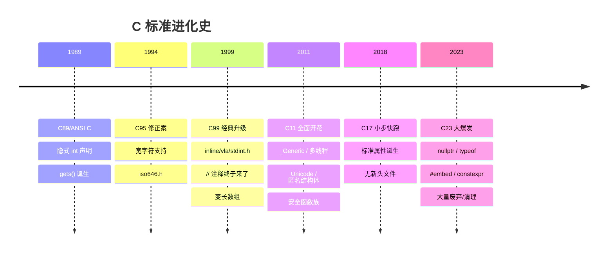
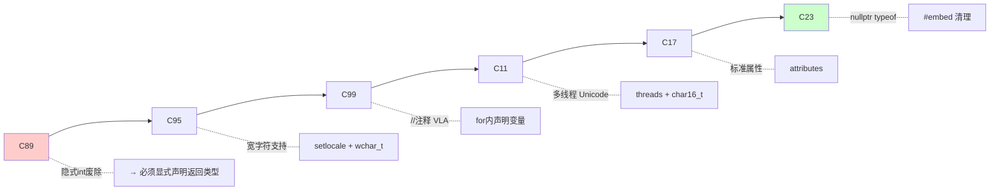
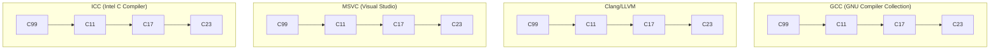

+++
title = "第 29 章 各 C 标准详解"
weight = 290
date = "2026-03-29T22:34:00+08:00"
type = "docs"
description = ""
isCJKLanguage = true
draft = false
+++

# 第 29 章 各 C 标准详解

> "C 语言是一门古老的语言，但它并不服老。从 1972 年诞生至今，它一直在进化，始终站在系统编程的第一线。" 本章我们就来扒一扒 C 标准的进化史——那些让人又爱又恨的特性，那些"我当年居然这么写代码"的黑历史，以及那些让你代码瞬间高大上的新语法。

先上一张总览图，让你对 C 标准的演进有个全局印象：



---

## 29.1 C89 标准详解

1989 年，C 语言迎来了它的第一个正式标准——ANSI C，也叫 C89。这是 C 语言的"成人礼"，意味着这门语言终于有了规范化的行为准则，不再是"野孩子"了。

### 29.1.1 隐式 `int` 声明（C99 起不允许）

在 C89 时代，如果你写一个函数不加返回值类型，编译器会"心领神会"地认为你返回的是 `int`。看这个"上古代码"：

```c
/* C89 风格的隐式 int 声明 - 请勿在新代码中使用！ */
max(a, b)      /* 编译器理解为 int max(int a, int b) */
    int a, b;
{
    return a > b ? a : b;  /* 返回 int */
}
```

这代码看起来像是给变量起名字时手抖了——函数名、参数列表、变量声明全挤在一起，不缩进，不写类型，活脱脱一幅"抽象画"。

> 警告：这种写法在 C99 及以后的标准中是**语法错误**。如果你用 GCC 加上 `-std=c99` 或更高标准编译，编译器会毫不客气地报错：`error: return type defaults to 'int'`。

正确写法是这样的：

```c
/* 现代 C 标准的正确写法 */
int max(int a, int b) {
    return a > b ? a : b;
}
```

为什么 C99 要废除隐式 int？因为这种"心照不宣"的默契太容易出 bug 了。你少写了一个类型，编译器帮你猜，猜对了皆大欢喜，猜错了——恭喜你，一个难以察觉的 bug 上线了。

**同样的隐式 int 还出现在这些地方：**

```c
/* C89: 函数返回值默认是 int */
foo(x)    /* 等价于 int foo(int x) */
    int x;
{
    return x * 2;
}

/* C89: 不写返回类型的全局变量默认是 int */
x = 5;    /* 等价于 int x = 5; —— 现代 C 也会报错！ */
```

C99 的设计哲学是：**"不要让我猜，你明确告诉我。"** 这是一个巨大的进步。

### 29.1.2 ⚠️ `gets()`：C11 废弃，C17 移除，**切勿使用**

`gets()` 函数——C 语言界的"著名罪犯"，江湖人称"缓冲区杀手"。它的问题极其简单粗暴：**不检查输入长度，只管往里塞**。

```c
#include <stdio.h>

int main(void) {
    char buffer[8];  /* 只给了 8 个字节 */
    printf("请输入用户名：");
    gets(buffer);    /* 💀 如果你输入超过 7 个字符，程序就完蛋了 */
    printf("你好，%s！\n", buffer);
    return 0;
}
```

当你输入 `abcdefghijklmn`（14个字符）时，`buffer` 只有 8 字节，栈上的其他数据就被覆盖了。攻击者可以利用这个漏洞执行任意代码——这就是著名的**缓冲区溢出攻击**。

`gets()` 的罪行清单：
- 没有任何边界检查
- 不知道目标缓冲区有多大
- 输入超长直接覆盖相邻内存
- 轻则程序崩溃，重则被黑客接管

**C 语言的"亡羊补牢"历程：**

| 标准 | 对 gets() 的态度 |
|------|------------------|
| C89 | ✅ 出生即带，原生支持 |
| C99 | ⚠️ 添加了警告，但没移除 |
| C11 | 🚫 标记为"废弃"（deprecated） |
| C17 | 🚫 彻底移除，告别历史舞台 |

> 正确替代方案：用 `fgets()` 替代 `gets()`。`fgets()` 会接收一个缓冲区大小参数，永远不会写超过这个大小的数据。

```c
#include <stdio.h>

int main(void) {
    char buffer[64];
    printf("请输入用户名：");
    /* fgets 会保留换行符在 buffer 里，记得处理掉 */
    if (fgets(buffer, sizeof(buffer), stdin) != NULL) {
        buffer[strcspn(buffer, "\n")] = '\0';  /* 去掉换行符 */
        printf("你好，%s！\n", buffer);
    }
    return 0;
}
```

> 小贴士：`strcspn(buffer, "\n")` 的作用是找到第一个换行符的位置，然后把它替换成 `\0`（字符串结束符）。

---

## 29.2 C95 标准详解（1994 修正案）

1994 年，C 语言发布了第一个修正案——C95。这次更新主要是**国际化支持**，让 C 语言能够更好地处理世界各国文字（尤其是那些字母比英语多的语言）。

### ⚠️ 两个常见的"历史误会"

在讲 C95 之前，先来澄清两个流传甚广的**谣言**：

> **谣言 1**：`//` 注释是 C95 加入的。
> **真相**：不是！`//` 注释是 **C99** 才加入的。C95 只能用 `/* */` 注释。

> **谣言 2**：`char16_t` 和 `char32_t` 是 C95 引入的。
> **真相**：不是！这两个类型是 **C11** 才加入的。C95 没有 Unicode 原生支持。

这两个谣言的流传原因可能是：大家觉得 C95 引入了宽字符和多语言支持，就想当然地认为"那 Unicode 类型肯定也是那时候加的"。但实际上，C95 只是引入了**处理宽字符的基础设施**，真正的 Unicode 类型要等到 C11。

### 29.2.1 `<iso646.h>` / `<wchar.h>` / `<wctype.h>`

这三个头文件是 C95 为国际化（i18n）和多字符集支持打下的基石。

#### `<iso646.h>`：运算符的"别名"

这个头文件可能看起来最莫名其妙——它提供了一些**运算符的替代写法**：

```c
#include <iso646.h>

/* 在欧洲，& | ^ ! 等符号键盘布局不同
 * 所以 C95 提供了文字形式的替代写法 */

/* and 替代 && */
if (a > 0 and b > 0) { ... }

/* or 替代 || */
if (x == 1 or x == 2) { ... }

/* not 替代 ! */
if (not flag) { ... }

/* bitand 替代 & */
c = a bitand b;

/* bitor 替代 | */
c = a bitor b;

/* compl 替代 ~（按位取反）*/
unsigned int flags = compl 0xFF;  /* 得到 0xFFFFFF00 */
```

> 这个头文件主要是为了方便某些非英语国家的程序员，因为他们键盘上没有这些特殊符号。不过说实话，现代编程中几乎没人用这些"文字版"运算符——写 `&&` 比写 `and` 简洁多了，而且大家都是这么学的。

#### `<wchar.h>`：宽字符支持

**宽字符**（wide character）是一种用多个字节表示一个字符的机制。C 语言原来的 `char` 类型只能表示一个字节的字符（ASCII 码 0-127），但中文、日文、阿拉伯文等文字需要更多空间。

```c
#include <stdio.h>
#include <wchar.h>
#include <locale.h>

int main(void) {
    /* 使用宽字符处理中文 */
    setlocale(LC_ALL, "");  /* 设置本地化，让程序识别中文环境 */

    wchar_t chinese_char = L'中';  /* L 前缀表示宽字符常量 */
    wprintf(L"一个中文字符：%lc\n", chinese_char);

    wchar_t *greeting = L"你好，世界！";  /* 宽字符串 */
    wprintf(L"宽字符串：%ls\n", greeting);

    /* 用 %d 看看一个汉字占多少字节 */
    wprintf(L"'中' 占 %d 个字节（sizeof(wchar_t)=%d）\n",
            (int)sizeof(chinese_char), (int)sizeof(wchar_t));
    return 0;
}
```

在 Windows 上，`wchar_t` 通常是 2 字节（UTF-16）；在 Linux 上通常是 4 字节（UTF-32）。这就是为什么 Windows 上处理中文有时会出现"乱码"，因为两个系统的宽字符实现不一样。

> 宽字符的"痛苦"在于：不同系统处理方式不同，字节序也不同。UTF-16 有大端小端问题，UTF-32 好一些但更占空间。这就是为什么现代程序更倾向于用 UTF-8（变长编码，一个字符 1-4 字节）来处理多语言文本。

#### `<wctype.h>`：字符分类

这个头文件提供了一系列**字符分类函数**，帮你判断一个字符是什么类型：

```c
#include <stdio.h>
#include <wctype.h>
#include <wchar.h>

int main(void) {
    wchar_t ch;

    /* 宽字符的分类函数 */
    wprintf(L"宽字符分类判断：\n");

    ch = L'A';
    wprintf(L"'A': iswalpha=%d, iswdigit=%d, iswspace=%d\n",
            !!iswalpha(ch), !!iswdigit(ch), !!iswspace(ch));
    /* 输出：'A': iswalpha=1, iswdigit=0, iswspace=0 */

    ch = L'9';
    wprintf(L"'9': iswalpha=%d, iswdigit=%d, iswspace=%d\n",
            !!iswalpha(ch), !!iswdigit(ch), !!iswspace(ch));
    /* 输出：'9': iswalpha=0, iswdigit=1, iswspace=0 */

    ch = L' ';
    wprintf(L"' ': iswalpha=%d, iswdigit=%d, iswspace=%d\n",
            !!iswalpha(ch), !!iswdigit(ch), !!iswspace(ch));
    /* 输出：' ': iswalpha=0, iswdigit=0, iswspace=1 */

    ch = L'中';  /* 中文不是字母 */
    wprintf(L"'中': iswalpha=%d, iswdigit=%d, iswspace=%d\n",
            !!iswalpha(ch), !!iswdigit(ch), !!iswspace(ch));
    /* 输出：'中': iswalpha=0, iswdigit=0, iswspace=0 */

    return 0;
}
```

> 注意那些 `!!` 双感叹号——这是把非零值"正规化"成 0 或 1 的小技巧。因为有些分类函数返回值不是严格的 0 或 1，而是"符合条件就返回非零值"，所以用 `!!` 把它强制转成布尔值。

---

## 29.3 C99 标准详解

1999 年，C 语言迎来了史上最重要的升级——C99。这次更新引入了大量现代化特性，让 C 语言焕发第二春。很多我们今天习以为常的特性，比如 `//` 注释、for 循环里直接声明变量、变长数组等，都是 C99 带进来的。

### 29.3.1 `inline` 函数 / 变长数组 / `<stdint.h>` / `_Bool` / `//` 注释 / for 循环内声明

C99 的这几项改进，每一项都能让你的代码更简洁、更安全。

#### `inline` 函数：性能优化的利器

**内联函数**（inline function）是一种"建议"编译器"把函数调用直接展开成函数体代码"的优化手段。传统函数调用有开销——需要跳转到函数地址、执行完毕后还要跳转回来。**内联函数**直接把这个开销抹掉：编译器把函数调用处替换成函数体的完整代码，"调用"变成了"粘贴"。

```c
#include <stdio.h>

/* inline 关键字建议编译器在这里"展开"而非"调用" */
static inline int max(int a, int b) {
    return a > b ? a : b;
}

int main(void) {
    int x = 10, y = 20;
    /* 编译器可能把这行变成：return x > y ? x : y; */
    int m = max(x, y);
    printf("最大值是 %d\n", m);  /* 输出：最大值是 20 */
    return 0;
}
```

什么时候用 `inline`？
- 函数体很小（通常几行）
- 调用很频繁
- 不是递归调用

> 注意：`inline` 是**建议**而非命令。编译器如果觉得内联不合适（比如函数太大，或者需要取地址），可以选择不内联。现代编译器（如 GCC、Clang）的优化能力很强，通常不需要你手动加 `inline`，它自己能判断。

#### 变长数组（VLA - Variable Length Array）

C99 引入了**变长数组**，数组的长度可以在运行时用变量指定——在此之前，数组长度必须是编译期常量：

```c
#include <stdio.h>

int main(void) {
    int n;
    printf("请输入数组大小：");
    scanf("%d", &n);

    /* C99 之前，这是不可能的！数组大小必须是常量表达式 */
    int arr[n];  /* 变长数组，长度在运行时决定 */

    for (int i = 0; i < n; i++) {
        arr[i] = i * i;
    }

    printf("数组内容：");
    for (int i = 0; i < n; i++) {
        printf("%d ", arr[i]);
    }
    printf("\n");

    return 0;
}
```

> 这个程序里，如果你输入 `5`，就会创建一个 `int arr[5]`。

变长数组的好处是代码更灵活，坏处是：
- 栈空间有限，太大的 VLA 会栈溢出
- 编译器优化难度增加，性能可能受影响
- C11 把 VLA 变成可选特性（但大多数编译器仍然支持）

#### `<stdint.h>`：精确尺寸的整数类型

之前你想声明"恰好 32 位的整数"吗？在 C99 之前，你只能靠经验（`long` 可能是 32 位也可能是 64 位，看平台），猜得头疼。C99 的 `<stdint.h>` 给你提供了**精确尺寸的整数类型**：

```c
#include <stdio.h>
#include <stdint.h>
#include <inttypes.h>  /* 用于 printf 的 PRI 宏 */

int main(void) {
    /* 有符号整数 */
    int8_t  i8  = -100;       /* 恰好 8 位有符号 */
    int16_t i16 = 20000;      /* 恰好 16 位有符号 */
    int32_t i32 = -1234567890;/* 恰好 32 位有符号 */
    int64_t i64 = 9876543210LL;/* 恰好 64 位有符号 */

    /* 无符号整数 */
    uint8_t  u8  = 255;
    uint32_t u32 = 4000000000U;
    uint64_t u64 = 18000000000000000000ULL;

    /* 打印时要用 %d 或 % PRI32 宏 */
    printf("int8=%" PRId8 ", int32=%" PRId32 "\n", i8, i32);
    printf("uint8=%" PRIu8 ", uint32=%" PRIu32 "\n", u8, u32);

    /* 打印 64 位要用 ll 修饰符或 PRI 宏 */
    printf("int64=%" PRId64 "\n", i64);
    printf("uint64=%" PRIu64 "\n", u64);

    /* 还有极值常量 */
    printf("int32_t 最大值：%" PRId32 ", 最小值：%" PRId32 "\n",
           INT32_MAX, INT32_MIN);
    printf("uint32_t 最大值：%" PRIu32 "\n", UINT32_MAX);

    /* ptrdiff_t：指针相减的结果类型 */
    int arr[5] = {1, 2, 3, 4, 5};
    int *p1 = &arr[1];
    int *p2 = &arr[3];
    ptrdiff_t diff = p2 - p1;  /* 差值是 2 */
    printf("指针相差：%td\n", diff);

    return 0;
}
```

> `$PRId64`、`$PRIu32` 这些宏是为了解决 `printf` 的类型安全问题。在 C99 之前，如果你 `printf("%d", int64_t_value)`，格式不对应会出各种奇怪问题。有了这些宏，编译器可以帮你检查格式字符串是否与参数类型匹配。

#### `_Bool`：布尔类型终于来了

在 C99 之前，C 语言没有布尔类型——用 `0` 表示假，非零表示真，全靠程序员自觉。C99 引入了 `_Bool` 类型和 `<stdbool.h>` 宏：

```c
#include <stdio.h>
#include <stdbool.h>  /* 提供了 bool, true, false 宏 */

int main(void) {
    bool is_raining = false;   /* false 就是 0 */
    bool has_umbrella = true;  /* true 就是 1 */
    bool is_wet = is_raining && !has_umbrella;

    if (is_wet) {
        printf("淋雨了！\n");
    } else {
        printf("安全！\n");
    }

    /* 赋值规则：有隐式转换 */
    bool b1 = 42;      /* 42 变成 true（1） */
    bool b2 = 0;       /* 0 变成 false（0） */
    bool b3 = -3.14;   /* 非零浮点数变成 true */
    printf("bool: true=%d, false=%d\n", true, false);
    /* 输出：bool: true=1, false=0 */

    return 0;
}
```

#### `//` 注释：千呼万唤始出来

终于！C99 把 `//` 单行注释纳入了标准。之前 C 语言只能用 `/* */` 注释：

```c
// C99 支持单行注释
int x = 5;  // 这是一个注释

/*
 * 之前只能用这种多行注释
 * 写起来麻烦
 * 嵌套还容易出错
 */

int main(void) {
    // 看看多方便！
    return 0;
}
```

> 在 C99 之前，如果你写 `/* /* */ */`，内部的 `*/` 会导致注释提前结束，产生语法错误。C99 的 `//` 注释没有这个问题。

#### for 循环内声明变量

这是 C99 另一个让人"相见恨晚"的特性——在 for 循环的初始化部分直接声明循环变量：

```c
#include <stdio.h>

int main(void) {
    /* C99 之前：循环变量必须提前声明 */
    int i;
    for (i = 0; i < 5; i++) {
        printf("%d ", i);
    }
    printf("\n");

    /* C99 起：直接在 for 里声明，作用域更清晰 */
    for (int j = 0; j < 5; j++) {
        printf("%d ", j);
    }
    printf("\n");

    /* 循环变量作用域仅在 for 内部，不会污染外部 */
    /* printf("%d\n", j); */  /* 这行如果取消注释，会报错：j 未定义 */

    /* 字符串逆序打印 */
    const char *s = "Hello";
    for (int idx = 0; s[idx] != '\0'; idx++) {
        printf("s[%d] = '%c'\n", idx, s[idx]);
    }

    return 0;
}
```

这个特性的好处是：
- 循环变量作用域仅限于循环体内，不会意外污染外部命名空间
- 代码更紧凑，逻辑更清晰
- 符合 C++ 的写法习惯

### 29.3.2 `<complex.h>` / `_Complex` / `_Imaginary` / `I`（虚数单位）

C99 引入了**复数**（complex numbers）支持，让你直接用 C 编写数学运算，处理复数就像处理普通数字一样自然。

```c
#include <stdio.h>
#include <complex.h>

int main(void) {
    /* 声明复数变量 */
    double complex c1 = 3.0 + 4.0 * I;  /* 3 + 4i */
    double complex c2 = 1.0 - 2.0 * I;  /* 1 - 2i */

    /* 复数运算 */
    double complex sum = c1 + c2;      /* (3+4i) + (1-2i) = 4 + 2i */
    double complex product = c1 * c2;   /* 复数乘法 */
    double complex conjugate = conj(c1);/* 共轭复数 3 - 4i */

    printf("c1 = %.1f + %.1fi\n", creal(c1), cimag(c1)); /* 输出 c1 = 3.0 + 4.0i */
    printf("c2 = %.1f + %.1fi\n", creal(c2), cimag(c2)); /* 输出 c2 = 1.0 - 2.0i */
    printf("和 = %.1f + %.1fi\n", creal(sum), cimag(sum)); /* 输出和 = 4.0 + 2.0i */

    /* 取模和相位 */
    printf("|c1| = %.2f\n", cabs(c1));   /* |3+4i| = 5.00 */
    printf("arg(c1) = %.2f rad\n", carg(c1));  /* 53.13° */

    /* 欧拉公式：e^(i*pi) = -1 */
    double complex e_i_pi = cexp(I * M_PI);
    printf("e^(i*pi) ≈ %.1f + %.1fi（应该是 -1+0i）\n",
           creal(e_i_pi), cimag(e_i_pi));

    return 0;
}
```

> **什么是复数？** 复数就是形如 `a + bi` 的数，其中 `i` 是**虚数单位**，定义为 `i² = -1`。在 C 的 `<complex.h>` 中，虚数单位用 `I` 表示。`creal()` 取复数的实部，`cimag()` 取虚部，`cabs()` 取模（绝对值），`conj()` 取共轭。

> `_Imaginary` 是纯虚数的类型，比如 `double _Imaginary pure = 3.0 * I;`。不过这个特性后来被证实用处不大，C23 已经把它标记为**废弃**了。

### 29.3.3 `<tgmath.h>` / `__func__` / `<fenv.h>` / `restrict` 指针

#### `<tgmath.h>`：类型通用数学函数

**tgmath** 是 "type-generic math" 的缩写。这个头文件提供了一套"自动选择正确版本"的数学函数——你不需要记住要用 `sinf` 还是 `sin` 还是 `sinl`，写一个 `sin(x)`，编译器根据 `x` 的类型自动选择。

```c
#include <stdio.h>
#include <tgmath.h>

int main(void) {
    float f = 3.14f;
    double d = 3.14;
    long double ld = 3.14L;

    /* 不需要记住函数名的后缀，tgmath 自动选择正确的版本 */
    float sf = sin(f);     /* 调用 sinf */
    double sd = sin(d);    /* 调用 sin */
    long double sld = sin(ld); /* 调用 sinl */

    printf("sin(float)    = %f\n", sf);
    printf("sin(double)   = %f\n", sd);
    printf("sin(long dbl) = %Lf\n", sld);

    /* 复数也能用 */
    double complex c = 1.0 + 2.0 * I;
    double complex cs = sin(c);  /* 自动选择 csin */
    printf("sin(1+2i) = %.2f + %.2fi\n", creal(cs), cimag(cs));

    return 0;
}
```

> 如果没有 `<tgmath.h>`，你要记住一堆函数：`sinf(float)`、`sin(double)`、`sinl(long double)`、`csin(double complex)`、`csinf(float complex)`...太折磨人了！

#### `__func__`：当前函数名

`__func__` 是一个预定义标识符，在函数内部使用时，它是一个 `const char *` 字符串，内容是**当前函数的名称**。这在写日志和调试信息时特别有用：

```c
#include <stdio.h>

void divide(int a, int b) {
    if (b == 0) {
        /* 打印出错的函数名 */
        fprintf(stderr, "[错误] 函数 %s: 除数不能为 0！\n", __func__);
        return;
    }
    printf("%d / %d = %d\n", a, b, a / b);
}

int main(void) {
    divide(10, 2);
    divide(10, 0);
    return 0;
}
```

输出：
```
10 / 2 = 5
[错误] 函数 divide: 除数不能为 0！
```

> `__func__` 不是宏，是一个标识符（identifier）。它在函数作用域内自动定义，类型是 `const char *`，始终指向函数名字符串。

#### `<fenv.h>`：浮点数环境控制

**浮点数环境**（floating-point environment）是指控制浮点数运算行为的一些标志和模式，比如舍入方式（向零取整、向上取整、向下取整、四舍五入）、哪些异常被触发等。

```c
#include <stdio.h>
#include <fenv.h>
#include <math.h>

#pragma STDC FENV_ACCESS ON  /* 告诉编译器：我要操控浮点环境！ */

int main(void) {
    double x = 1.0;
    double y = 3.0;

    printf("默认模式：1.0 / 3.0 = %.20f\n", x / y);

    /* 改成"向上取整"模式 */
    fesetround(FE_UPWARD);
    printf("向上取整：1.0 / 3.0 = %.20f\n", x / y);

    /* 改成"向下取整"模式 */
    fesetround(FE_DOWNWARD);
    printf("向下取整：1.0 / 3.0 = %.20f\n", x / y);

    /* 恢复默认 */
    fesetround(FE_TONEAREST);

    /* 测试异常：除以零 */
    feclearexcept(FE_ALL_EXCEPT);  /* 先清除所有异常标志 */
    double z = 1.0 / 0.0;           /* 产生除零异常 */
    if (fetestexcept(FE_DIVBYZERO)) {
        printf("检测到除零异常！\n");
    }

    /* 输出：检测到除零异常！ */
    return 0;
}
```

> `<fenv.h>` 主要用于科学计算、图形渲染等对精度有特殊要求的场景。普通应用程序很少需要操控浮点环境。

#### `restrict` 指针：别名优化提示

**restrict** 是 C99 引入的一个类型限定符（type qualifier），它告诉编译器：**这个指针是访问对应对象的唯一方式**，即这个对象不会有别的指针（或别名）来访问它。这样编译器就可以放手做激进优化。

```c
#include <stdio.h>

/* 没有 restrict：编译器必须保守处理，因为 a 和 b 可能重叠 */
void copy_bad(double *a, double *b, int n) {
    for (int i = 0; i < n; i++) {
        a[i] = b[i];  /* 编译器不敢假设 a 和 b 不重叠 */
    }
}

/* 有 restrict：告诉编译器这两个指针绝不重叠，可以大胆优化 */
void copy_good(double *restrict a, double *restrict b, int n) {
    for (int i = 0; i < n; i++) {
        a[i] = b[i];  /* 编译器可以并行化或重排这段代码 */
    }
}

int main(void) {
    double arr[5] = {1.1, 2.2, 3.3, 4.4, 5.5};
    copy_good(arr, arr + 2, 3);  /* 从 arr[2] 复制到 arr[0] */
    for (int i = 0; i < 5; i++) {
        printf("%.1f ", arr[i]);
    }
    printf("\n");
    return 0;
}
```

> 违反 `restrict` 的约束（让你的指针真的重叠）会导致**未定义行为**——编译器可能会生成错误的代码。所以使用 `restrict` 时一定要确保你的两个指针真的不会指向同一片内存区域。

### ⚠️ 29.3.4 **`snprintf` 是 C99**（不是 C11！很多人记错）

这是一个超级常见的**历史误会**！很多人以为 `snprintf` 是 C11 的安全特性（毕竟 C11 有那么多安全函数），但实际上 **`snprintf` 是 C99 引入的**。

`snprintf` 的好处是：永远不会写超过缓冲区大小，永远不会造成缓冲区溢出，并且会告诉你实际需要多少空间：

```c
#include <stdio.h>

int main(void) {
    char buffer[10];
    int ret;

    /* snprintf: (缓冲区, 缓冲区大小, 格式, ...)
     * 返回值：如果被截断，返回"原本应该写入的字符数"（不含 \0）
     *        如果没被截断，返回实际写入的字符数（不含 \0）
     */
    ret = snprintf(buffer, sizeof(buffer), "Hello, World!");
    printf("返回值: %d\n", ret);  /* 输出：返回值: 13（因为 "Hello, World!" 是 13 字符） */
    printf("实际写入: %s\n", buffer);  /* 输出：Hello, Wor（截断了） */

    /* 安全的字符串拼接 */
    char path[100];
    snprintf(path, sizeof(path), "/home/%s/documents", "alice");
    printf("路径: %s\n", path);

    /* 动态确定需要的缓冲区大小 */
    int needed = snprintf(NULL, 0, "x=%d, s=%s, f=%.2f", 42, "hello", 3.14);
    printf("需要的缓冲区大小: %d（不含 \\0）\n", needed);
    char *buf = malloc(needed + 1);
    snprintf(buf, needed + 1, "x=%d, s=%s, f=%.2f", 42, "hello", 3.14);
    printf("构建的字符串: %s\n", buf);
    free(buf);

    return 0;
}
```

> 如果你想知道一个格式化字符串需要多大缓冲区，可以传 `NULL` 和 `0` 给 `snprintf`，它会返回"本应该写入的字符数"，这样你就能精确分配内存了。

### 29.3.5 灵活数组成员：结构体里的"弹性尾巴"

C99 引入了**灵活数组成员**（flexible array member），这是一种特殊的结构体设计——结构体的最后一个成员是一个没有指定大小的数组。你可以通过这个机制让结构体"尾巴可变长"：

```c
#include <stdio.h>
#include <string.h>
#include <stdlib.h>

/* 灵活数组成员的结构体
 * 注意：fruites 必须是最后一个成员，且前面必须有至少一个其他成员
 */
struct packet {
    int type;
    int length;
    char data[];  /* 灵活数组成员——没有大小！ */
};

int main(void) {
    /* 创建一个带 10 字节数据的 packet */
    int data_size = 10;
    struct packet *p = malloc(sizeof(struct packet) + data_size);

    p->type = 1;
    p->length = data_size;
    memcpy(p->data, "Hello123!", data_size);

    printf("packet type=%d, length=%d, data=", p->type, p->length);
    for (int i = 0; i < p->length; i++) {
        printf("%c", p->data[i]);
    }
    printf("\n");

    free(p);
    return 0;
}
```

> 灵活数组成员的原理是：`sizeof(struct packet)` 不包含 `data` 的空间，所以你需要 `malloc(sizeof(struct packet) + 你想要的大小)` 来分配足够的内存。

使用场景：
- 网络数据包（长度不固定）
- 文件读取缓冲区
- 消息队列消息体

> 注意：你不能直接 `struct packet p; p.data[10] = 'x';`——必须用 `malloc` 分配内存，否则 `data` 没有空间可用。另外，**不能直接对灵活数组成员取 `sizeof`**，因为它的大小是 0。

---

## 29.4 C11 标准详解

2011 年发布的 C11 是 C 语言的又一次重大升级，引入了**多线程**、**泛型**（`_Generic`）、**Unicode 原生支持**、**匿名结构体**和**安全函数族**等特性。C11 让 C 语言正式进入了 21 世纪。

### 29.4.1 `_Generic` / 多线程 `<threads.h>` / `<stdatomic.h>`

#### `_Generic`：编译期类型选择

**泛型选择表达式**（generic selection）是 C11 引入的一个强大特性，类似于其他语言中的"重载"或"泛型"。它让你根据**表达式的类型**在编译期选择不同的代码路径：

```c
#include <stdio.h>

/* _Generic 的基本语法：
 * _Generic(表达式, 类型1: 值1, 类型2: 值2, ..., default: 值N)
 */

/* 获取类型的字符串名称 */
const char *type_name(double x) {
    return _Generic(x,
        int:      "int",
        float:    "float",
        double:   "double",
        char:     "char",
        default:  "unknown"
    );
}

/* 泛型绝对值函数 */
#define ABS(x) _Generic((x), \
    int:   ( (x) < 0 ? -(x) : (x) ), \
    float: ( (x) < 0 ? -(x) : (x) ), \
    double: ( (x) < 0 ? -(x) : (x) ), \
    long: ( (x) < 0 ? -(x) : (x) ), \
    default: 0 \
)

/* 泛型 swap */
#define SWAP(x, y) do { \
    typeof(x) _tmp = (x); \
    (x) = (y); \
    (y) = (_tmp); \
} while(0)

int main(void) {
    int i = -42;
    double d = -3.14;
    float f = -2.5f;

    printf("i 的类型: %s\n", type_name(i));   /* 输出：i 的类型: int */
    printf("d 的类型: %s\n", type_name(d));   /* 输出：d 的类型: double */

    printf("|i| = %d\n", ABS(i));             /* 输出：|i| = 42 */
    printf("|d| = %.2f\n", ABS(d));           /* 输出：|d| = 3.14 */
    printf("|f| = %.2f\n", ABS(f));           /* 输出：|f| = 2.50 */

    int a = 1, b = 2;
    printf("交换前: a=%d, b=%d\n", a, b);     /* 输出：交换前: a=1, b=2 */
    SWAP(a, b);
    printf("交换后: a=%d, b=%d\n", a, b);     /* 输出：交换后: a=2, b=1 */

    return 0;
}
```

> `_Generic` 的本质是**编译期的 switch-case**，只不过判断的不是值，而是**类型**。编译器在编译时就确定了走哪个分支，所以没有运行时开销。

#### 多线程 `<threads.h>`

C11 正式引入了**标准多线程支持**，在此之前，C 程序要写多线程只能依赖平台特定的 API（如 POSIX 的 `pthread`，Windows 的 `CreateThread`）。

```c
#define __STDC_NO_THREADS__ 1  /* 如果编译器不支持 threads.h，这个宏会被定义 */

#include <stdio.h>
#include <threads.h>

/* 线程函数：返回值是 int，参数是 void* */
int thread_func(void *arg) {
    const char *name = (const char *)arg;
    for (int i = 0; i < 5; i++) {
        printf("%s: 第 %d 次执行\n", name, i);
        /* thrd_sleep 让线程休眠（纳秒精度） */
        struct timespec ts = {0, 100000000};  /* 0.1 秒 */
        thrd_sleep(&ts, NULL);
    }
    return 0;  /* 线程正常退出，返回值可被其他线程通过 thrd_join 获取 */
}

int main(void) {
    thrd_t t1, t2;

    /* 创建两个线程 */
    if (thrd_create(&t1, thread_func, "线程A") != thrd_success) {
        fprintf(stderr, "线程 A 创建失败！\n");
        return 1;
    }
    if (thrd_create(&t2, thread_func, "线程B") != thrd_success) {
        fprintf(stderr, "线程 B 创建失败！\n");
        return 1;
    }

    printf("主线程: 已创建两个工作线程\n");

    /* 等待线程结束 */
    thrd_join(t1, NULL);
    thrd_join(t2, NULL);
    printf("主线程: 所有工作线程已完成\n");

    return 0;
}
```

> 注意：`<threads.h>` 在 Windows 上通常需要 `-lpthread`（通过 pthreads4w）或 MinGW-w64 的线程支持，所以很多人其实还是在用平台特定的 API。但 C11 的多线程头文件提供了一个**标准接口层**，方便写跨平台代码。

> 如果你的编译器不支持 `<threads.h>`，可以检查 `__STDC_NO_THREADS__` 宏——如果定义了，就说明不支持。

### 29.4.2 `_Alignas` / `_Alignof` / `_Atomic` / `_Noreturn` / `_Static_assert` / `_Thread_local`

#### `_Alignas` / `_Alignof`：对齐控制

**对齐**（alignment）是指一个对象的地址必须能够被某个数整除。比如一个 `int` 通常要求 4 字节对齐（地址是 4 的倍数），这样 CPU 访问起来效率最高。C11 提供了控制对齐的工具：

```c
#include <stdio.h>
#include <stdalign.h>  /* C23 起推荐直接用 alignas/alignof 关键字 */

struct person {
    char name[10];   /* 1 字节对齐 */
    int age;         /* 4 字节对齐 */
    double salary;    /* 8 字节对齐 */
};

/* 要求 32 字节对齐的结构体 */
struct aligned_struct {
    int x;
    char c;
    /* 编译器会自动在 c 后面填充 padding 使 y 对齐到 32 字节 */
    double y;
} alignas(32) s1;  /* _Alignas(32) 要求整个结构体按 32 字节对齐 */

int main(void) {
    printf("int 对齐要求: %zu 字节\n", _Alignof(int));
    printf("double 对齐要求: %zu 字节\n", _Alignof(double));
    printf("struct person 对齐要求: %zu 字节\n", _Alignof(struct person));
    printf("aligned_struct 对齐要求: %zu 字节\n", _Alignof(struct aligned_struct));

    /* 打印对齐后的结构体大小 */
    printf("sizeof(struct person) = %zu\n", sizeof(struct person));
    /* 输出：sizeof(struct person) = 24（name[10] + 2填充 + 4 + 8，8字节对齐） */

    /* alignof 返回类型是 size_t */
    size_t alignment = _Alignof(char);
    printf("char 对齐要求: %zu\n", alignment);

    /* 用 _Alignas 声明一个对齐的缓冲区（常用于 SIMD 指令） */
    alignas(16) char simd_buffer[64];  /* 16 字节对齐，适合 SSE */
    printf("simd_buffer 对齐: %zu\n", alignof(simd_buffer));

    return 0;
}
```

> 为什么需要对齐？现代 CPU 访问内存时，一次能读取多个字节（通常 4 或 8 字节）。如果一个 `int` 恰好落在 4 字节边界上，CPU 一次读取就够了；如果落在两个 4 字节块中间，CPU 需要读两次再拼起来，性能就差了。

#### `_Atomic`：原子操作

**原子操作**（atomic operation）是指操作在执行过程中不会被其他线程干扰——要么完全做完，要么完全没做，不存在"做到一半被切换走"的情况。这在多线程编程中至关重要，是实现线程安全的基础。

```c
#include <stdio.h>
#include <stdatomic.h>

int main(void) {
    /* 原子整数类型 */
    atomic_int counter = 0;

    /* 原子加载和存储 */
    atomic_store(&counter, 42);
    int val = atomic_load(&counter);
    printf("counter = %d\n", val);  /* 输出：counter = 42 */

    /* 原子加法（++counter） */
    atomic_fetch_add(&counter, 10);  /* counter 变成 52，返回旧值 42 */
    printf("counter after +10 = %d\n", atomic_load(&counter)); /* 52 */

    /* 原子交换 */
    int old = atomic_exchange(&counter, 100);
    printf("旧值 = %d, 新值 = %d\n", old, atomic_load(&counter)); /* 旧值=52, 新值=100 */

    /* 比较并交换（CAS）：如果 counter 等于 100，就换成 200 */
    int expected = 100;
    if (atomic_compare_exchange_strong(&counter, &expected, 200)) {
        printf("CAS 成功: counter = %d\n", atomic_load(&counter)); /* 200 */
    } else {
        printf("CAS 失败: counter 不是 %d，而是 %d\n", 100, expected);
    }

    /* 原子布尔标志 */
    atomic_flag lock = ATOMIC_FLAG_INIT;
    /* atomic_flag_test_and_set 返回旧值并设置为 true */
    if (!atomic_flag_test_and_set(&lock)) {
        printf("获得了锁！\n");
        /* 临界区 */
        atomic_flag_clear(&lock);  /* 释放锁 */
        printf("释放了锁！\n");
    }

    return 0;
}
```

> `_Atomic` 既是一个**关键字**（用于声明原子类型），也是一系列**原子操作函数**的集合。`<stdatomic.h>` 提供了 `atomic_load`、`atomic_store`、`atomic_fetch_add`、`atomic_compare_exchange_strong` 等函数。

#### `_Noreturn`：告诉编译器这个函数不返回

```c
#include <stdio.h>
#include <stdlib.h>

/* _Noreturn 告诉编译器：这个函数不会返回到调用者
 * 编译器可以利用这个信息做优化，并给出更好的警告
 */
_Noreturn void fatal_error(const char *msg) {
    fprintf(stderr, "Fatal: %s\n", msg);
    exit(1);
    /* 编译器知道这里不会返回，所以不会给出"未到达函数末尾"的警告 */
}

int main(void) {
    printf("程序开始...\n");
    fatal_error("这是一个致命错误！");
    printf("这行永远不会执行\n");  /* 编译器可能会警告你 */
    return 0;
}
```

> 典型的 `_Noreturn` 函数：`exit()`、`abort()`、`longjmp()`（不返回到原调用点）。如果一个函数被标记为 `_Noreturn` 但实际上返回了，行为是**未定义的**。

#### `_Static_assert`：编译期断言

**静态断言**在编译时检查条件，如果条件为假，编译直接失败并显示你指定的错误消息。这比运行时断言（`assert`）更早发现问题：

```c
#include <stdio.h>
#include <limits.h>

/* C11: 带括号的写法 */
_Static_assert(sizeof(int) >= 4, "int 至少需要是 32 位的");
_Static_assert(sizeof(void*) >= 4, "指针至少需要是 32 位的");

/* C23: 不带括号也可以 */
static_assert(CHAR_BIT == 8, "char 必须恰好是 8 位");

int main(void) {
    printf("int 大小: %zu 字节\n", sizeof(int));
    printf("所有静态断言通过！\n");
    return 0;
}
```

> `_Static_assert` 在 `#include` 阶段（翻译阶段 4）就检查了，所以比运行时的 `assert` 更早发现问题。尤其适合检查平台相关的假设，比如"我们假设 int 至少 32 位"。

#### `_Thread_local`：线程局部存储

**线程局部存储**（Thread-Local Storage, TLS）是一种每个线程都有独立实例的变量。`_Thread_local` 修饰的变量，每个线程看到的是自己的版本，互不干扰：

```c
#include <stdio.h>
#include <threads.h>

/* 每个线程都有独立的 counter 副本 */
_Thread_local int counter = 0;

int thread_func(void *arg) {
    const char *name = (const char *)arg;
    counter = 100;  /* 只修改这个线程的 counter */
    printf("%s: counter = %d\n", name, counter);  /* 输出 100 */
    return 0;
}

int main(void) {
    counter = 42;  /* 主线程的 counter 是独立的 */
    printf("主线程: counter = %d\n", counter);  /* 输出 42 */

    thrd_t t;
    thrd_create(&t, thread_func, "工作线程");
    thrd_join(t, NULL);

    printf("主线程: counter = %d（不受工作线程影响）\n", counter);  /* 还是 42 */
    return 0;
}
```

### 29.4.3 Unicode：`char16_t` / `char32_t` / `u""` / `U""` / `<uchar.h>`

> ⚠️ **重要提示**：`char16_t` 和 `char32_t` 是 **C11** 才引入的！它们不是 C95 的特性。这是一个极其常见的误解。C95 只引入了宽字符的基础设施，没有原生的 Unicode 类型。

```c
#include <stdio.h>
#include <uchar.h>
#include <string.h>

int main(void) {
    /* UTF-16 字符串字面量：u"" 前缀 */
    char16_t u16str[] = u"你好";  /* UTF-16 编码的中文字符串 */

    /* UTF-32 字符串字面量：U"" 前缀 */
    char32_t u32str[] = U"Hello 🌍";

    /* 打印 char16_t 的内容 */
    printf("char16_t 大小: %zu 字节\n", sizeof(u16str));
    printf("char32_t 大小: %zu 字节\n", sizeof(u32str));

    /* 访问 UTF-32 字符 */
    printf("第 0 个字符: U+%04X\n", (unsigned)u32str[0]);  /* 0x48 = 'H' */
    printf("第 6 个字符: U+%04X\n", (unsigned)u32str[6]);  /* 0x1F30D = 🌍 */

    /* char16_t 和 char32_t 的字符常量 */
    char16_t c1 = u'中';   /* UTF-16 编码的中文字符 */
    char32_t c2 = U'文';   /* UTF-32 编码的中文字符 */
    printf("u'中' 的值: 0x%X\n", (unsigned)c1);
    printf("U'文' 的值: 0x%X\n", (unsigned)c2);

    /* mbrtoc16 / c16rtomb: 多字节字符和 UTF-16 之间的转换
     * （用于程序内部处理和外部存储/传输之间的转换）*/
    char mbstr[] = "你好";
    char16_t out16[10];
    mbstate_t ps = {0};  /* 转换状态 */
    size_t len = mbstoc16(out16, mbstr, 10);
    if (len == (size_t)-1) {
        printf("转换失败！\n");
    } else {
        printf("mbstoc16 转换了 %zu 个 16 位字符\n", len);
    }

    return 0;
}
```

### 29.4.4 匿名结构体 / 匿名共用体

**匿名结构体**和**匿名共用体**是 C11 引入的语法糖——给没有名字的结构体/共用体直接用，让你不用单独定义就能访问它们的成员：

```c
#include <stdio.h>

/* 匿名结构体示例 */
struct point {
    int x;
    struct {     /* 匿名结构体！没有名字 */
        int y;   /* 可以直接用 p.y 访问，不需要 p.coord.y */
        int z;
    };
};

struct variant {
    int type;
    union {      /* 匿名共用体 */
        int i;
        double d;
        char *s;
    };           /* 可以直接用 v.i, v.d, v.s 访问，不需要中间名字 */
};

int main(void) {
    struct point p = {.x = 1, .y = 2, .z = 3};
    printf("p.x=%d, p.y=%d, p.z=%d\n", p.x, p.y, p.z);
    /* 输出：p.x=1, p.y=2, p.z=3 */

    struct variant v;
    v.type = 1;
    v.i = 42;  /* 直接访问共用体的成员，不需要 v.u.i */
    printf("v.i = %d\n", v.i);  /* 输出：v.i = 42 */

    v.type = 2;
    v.d = 3.14;
    printf("v.d = %.2f\n", v.d);  /* 输出：v.d = 3.14 */

    return 0;
}
```

> 匿名结构体/共用体的本质是：编译器在父结构体中"展开"了它们的成员。所以 `p.y` 实际上是编译器帮你翻译成了某个隐藏的中间成员名。

匿名结构体常用于实现"嵌套命名空间"的效果，而不用写很长的 `p.coord.y`。

### 29.4.5 Bounds-Checking 接口（安全函数族）：`gets_s` / `fopen_s` / `strtok_s` / `strerror_s` / `memcpy_s` 等

C11 引入了一大堆带 `_s` 后缀的**边界检查安全函数**（bounds-checking interfaces）。这些函数是**可选的**，通过定义 `__STDC_WANT_LIB_EXT1__` 宏来启用。它们的设计目标是：**让缓冲区溢出等安全问题在编译期/运行时被及时检测到，而不是悄悄产生未定义行为**。

```c
#define __STDC_WANT_LIB_EXT1__ 1  /* 必须放在所有 #include 之前！ */
#include <stdio.h>
#include <string.h>
#include <stdlib.h>
#include <errno.h>

int main(void) {
    /* gets_s: 安全版的 gets
     * 参数：缓冲区, 缓冲区大小, stdin
     * 如果输入超过缓冲区大小，读取并丢弃剩余输入，然后返回 NULL
     */
    char name[10];
    printf("请输入名字（最多 9 个字符）：");
    if (gets_s(name, sizeof(name)) == NULL) {
        printf("读取失败或输入被截断\n");
    } else {
        printf("你好，%s！\n", name);
    }

    /* fopen_s: 安全版的 fopen
     * 返回值是 errno_t 类型（0 表示成功）
     */
    errno_t err;
    FILE *fp;
    err = fopen_s(&fp, "test.txt", "w");
    if (err != 0) {
        printf("fopen_s 失败，错误码: %d\n", err);
    } else {
        fprintf(fp, "Hello, 安全文件操作！\n");
        fclose(fp);
    }

    /* strtok_s: 安全版的 strtok
     * 多了两个参数：上下文指针和剩余字符数
     */
    char input[] = "hello,world,how,are,you";
    char buffer[100];
    strcpy_s(buffer, sizeof(buffer), input);

    char *saveptr;  /* 保存上一次的扫描位置 */
    char *token = strtok_s(buffer, ",", &saveptr);
    while (token != NULL) {
        printf("Token: %s\n", token);
        token = strtok_s(NULL, ",", &saveptr);
    }

    /* strerror_s: 安全版的 strerror
     * 保证字符串以 '\0' 结尾，最多写入指定字节数
     */
    char errbuf[64];
    strerror_s(errbuf, sizeof(errbuf), ENOENT);  /* No such file or directory */
    printf("错误信息: %s\n", errbuf);

    /* memcpy_s: 安全版的 memcpy
     * 多了一个参数：目标缓冲区大小，超出则不执行拷贝
     */
    char src[] = "Hello, World!";
    char dest[20];
    size_t dest_size = sizeof(dest);
    errno_t mem_err = memcpy_s(dest, dest_size, src, strlen(src) + 1);
    if (mem_err != 0) {
        printf("memcpy_s 失败！\n");
    } else {
        printf("dest = %s\n", dest);
    }

    return 0;
}
```

> 注意：带 `_s` 后缀的安全函数是**可选的**（Annex K），很多编译器默认不启用。而且这些函数本身也有争议——有些实现存在性能问题，或者接口设计不够理想。但在大规模代码库中，使用安全函数确实能帮助减少缓冲区溢出漏洞。

---

## 29.5 C17 标准详解

2018 年发布的 C17（或称 C18，因为它在 2018 年发布但编号为 2018）是一个**维护性版本**，没有引入任何新特性，只是修复了一些 C11 的缺陷和改进文档。**没有新增头文件！**

但是 C17 引入了一个重要的新语法：**标准属性**（standard attributes）。

### 29.5.1 无新增头文件

C17 没有新增任何头文件，也没有引入任何新特性——这是一个纯粹的"bug 修复和澄清"版本。所以如果你听说 C17 "有什么很酷的新特性"，那多半是误传。

### 29.5.2 标准属性：`[[nodiscard]]` / `[[maybe_unused]]` / `[[deprecated]]` / `[[fallthrough]]`

**属性**（attribute）是一种给代码附加元信息的方式。C11 在 `<stdnoreturn.h>` 里用宏实现了 `_Noreturn`，C17 把这种方式标准化成了 **`[[...]]` 语法**，并定义了四个标准属性：

```c
#include <stdio.h>

/* [[nodiscard]]: 函数的返回值不应被忽略
 * 如果调用者忽略了返回值，编译器会发出警告
 */
[[nodiscard]]
int *find_element(int *arr, int n, int target) {
    for (int i = 0; i < n; i++) {
        if (arr[i] == target) {
            return &arr[i];
        }
    }
    return NULL;
}

/* [[maybe_unused]]: 抑制"未使用变量"的警告
 * 适用于变量、函数、参数
 */
[[maybe_unused]]
int square(int x) {
    return x * x;
}

/* [[deprecated]]: 标记为废弃
 * 使用这个函数/类型会收到警告，提示应该换用新接口
 */
[[deprecated("请使用 new_allocator 代替")]]
void *old_allocator(size_t size) {
    return malloc(size);
}

/* [[deprecated]] 还能用于变量和类型 */
[[deprecated]]
struct OldStruct {
    int x;
};

/* [[nodiscard]] 还可以用于 enum 和类型声明 */
typedef enum { OK, ERROR } Status [[nodiscard]];

/* [[likely]] / [[unlikely]]: C23 才支持，这是 C17 的四个 */
int process(int value) {
    switch (value) {
        case 1:
            return 10;
        case 2:
            return 20;
        default:
            /* 故意漏掉 break，编译器不会警告了——因为我们标注了 [[fallthrough]] */
            /* [[fallthrough]] 表示"故意"穿过这个 case */
            [[fallthrough]];
        case 3:
            return 30;  /* case 2 也会走到这里 */
    }
}

int main(void) {
    int arr[] = {1, 2, 3, 4, 5};
    int *found;

    /* 警告：如果不加 (void)，编译器会说"忽略 nodiscard 返回值" */
    found = find_element(arr, 5, 3);
    (void)found;  /* 明确表示"我故意不用这个返回值" */

    /* 不会产生警告，即使 square 没被使用 */
    int r [[maybe_unused]] = square(5);

    /* 旧 API 的使用会产生警告，提示使用替代品 */
    void *ptr = old_allocator(100);  /* 警告：deprecated */
    (void)ptr;

    printf("process(1) = %d\n", process(1));  /* 输出 10 */
    printf("process(2) = %d\n", process(2));  /* 输出 30（fallthrough） */
    printf("process(5) = %d\n", process(5));  /* 输出 30（default） */

    return 0;
}
```

> 属性语法的设计非常简洁：`[[属性名]]` 或 `[[属性名(参数)]]`。在 C++ 里也有类似的语法（实际上 C++11 就引入了），所以 C 和 C++ 的属性语法是兼容的。

四个标准属性的用途总结：

| 属性 | 含义 | 典型用法 |
|------|------|----------|
| `[[nodiscard]]` | 返回值不应被忽略 | 分配内存的函数、错误检查函数 |
| `[[maybe_unused]]` | 允许变量/函数/参数未使用 | 某些函数有"可选"参数 |
| `[[deprecated]]` | 标记为废弃 | 旧 API 过渡期 |
| `[[fallthrough]]` | 故意穿过 switch case | 多 case 共用代码 |

---

## 29.6 C23 标准详解

2023 年发布的 C23（也称 C2x）是 C 语言自 C99 以来**最大的一次更新**。它引入了 `nullptr`、`typeof`、编译期求值、`#embed`、大量安全改进，并对语言进行了大规模"打扫"——废弃和移除了一堆老旧、危险、有歧义的特性。

### 29.6.1 `nullptr` / `typeof` / `constexpr` / `char8_t` / `_BitInt` / `_Decimal`

#### `nullptr`：空指针常量

C23 引入了 **`nullptr`**——终于不用再写 `NULL` 了！之前 `NULL` 的定义五花八门，有的是 `(void*)0`，有的是 `0`，有的甚至是 `((void*)0)`。`nullptr` 是一个真正的**空指针常量**，类型是 `void*`：

```c
#include <stdio.h>

int main(void) {
    int *p1 = NULL;        /* 旧的 NULL */
    int *p2 = nullptr;     /* C23 的 nullptr */

    printf("p1 = %p, p2 = %p\n", (void*)p1, (void*)p2);

    /* nullptr 可以隐式转换为任何指针类型 */
    double *pd = nullptr;
    char *pc = nullptr;

    /* nullptr_t 类型 */
    _Null_ptr p3 = nullptr;  /* _Null_ptr 是 nullptr 的类型（C23 新增） */
    printf("p3 是空指针: %d\n", p3 == nullptr);  /* 输出 1（真） */

    /* 判断一个指针是否为空的最佳方式 */
    int *ptr = nullptr;
    if (ptr == nullptr) {
        printf("ptr 是空指针\n");
    }

    return 0;
}
```

> `nullptr` 和 `NULL` 的关键区别：`NULL` 是一个整数常量（通常是 `0`），而 `nullptr` 是一个**空指针常量**。在模板或重载场景中，这个区别很重要。

#### `typeof`：编译期类型获取

`typeof` 是 C23 引入的一个强大特性，它让你在编译期**获取一个表达式的类型**。这在宏和泛型编程中极其有用：

```c
#include <stdio.h>

int main(void) {
    int x = 42;
    double y = 3.14;

    /* typeof 获取变量的类型 */
    typeof(x) a = 100;      /* int */
    typeof(y) b = 2.718;   /* double */

    /* typeof 获取表达式的类型 */
    typeof(x + y) sum = x + y;  /* double，因为 int + double = double */

    printf("typeof(x)   = int,    a = %d\n", a);
    printf("typeof(y)   = double, b = %.2f\n", b);
    printf("typeof(x+y) = double, sum = %.2f\n", sum);

    /* 用 typeof 写一个类型安全的 swap */
    #define SWAP_TYPESAFE(a, b) do { \
        typeof(a) _tmp = (a); \
        (a) = (b); \
        (b) = (_tmp); \
    } while(0)

    int i1 = 1, i2 = 2;
    SWAP_TYPESAFE(i1, i2);
    printf("SWAP: i1=%d, i2=%d\n", i1, i2);  /* 输出：SWAP: i1=2, i2=1 */

    double d1 = 1.1, d2 = 2.2;
    SWAP_TYPESAFE(d1, d2);
    printf("SWAP: d1=%.1f, d2=%.1f\n", d1, d2);  /* 输出：SWAP: d1=2.2, d2=1.1 */

    /* typeof 可以用于数组推导 */
    int arr[] = {1, 2, 3, 4, 5};
    typeof(arr) *p = arr;  /* p 是指向 arr 数组的指针 */
    printf("*p = %d\n", *p);  /* 输出：*p = 1 */

    return 0;
}
```

> `typeof` 是编译器在**翻译阶段 7**（语法分析之后）处理的，所以它能"看到"你写的一切变量、表达式、类型。C++ 的 `decltype` 灵感就来自这里。

#### `constexpr`：编译期求值

C23 引入了 **`constexpr`** 关键字，它标记一个表达式或函数为**可在编译期求值**的（类似于 C++ 的 `constexpr`）。这为编译期计算打开了大门：

```c
#include <stdio.h>

/* constexpr 函数：编译器会尝试在编译时求值
 * 如果所有参数都是常量表达式，结果也会是常量表达式
 */
constexpr int factorial(int n) {
    if (n <= 1) return 1;
    return n * factorial(n - 1);
}

constexpr int fib(int n) {
    if (n <= 1) return n;
    return fib(n - 1) + fib(n - 2);
}

/* constexpr 变量 */
constexpr int ARRAY_SIZE = 10;  /* 编译期常量，可以用来定义数组大小 */
constexpr int FIB_10 = fib(10);  /* 编译器会计算出 fib(10) = 55 */

int main(void) {
    /* 编译期求值：用常量表达式初始化数组 */
    int arr[ARRAY_SIZE];
    printf("ARRAY_SIZE = %d（编译期常量）\n", ARRAY_SIZE);
    printf("fib(10) = %d（编译器计算）\n", FIB_10);

    /* factorial 也在编译期计算了 */
    printf("factorial(6) = %d\n", factorial(6));  /* 输出：factorial(6) = 720 */

    /* 如果参数不是常量，constexpr 函数也会在运行时求值 */
    int n = 5;
    printf("factorial(%d) = %d\n", n, factorial(n));  /* 运行时计算 */

    return 0;
}
```

#### `char8_t`：UTF-8 字符类型

C20 引入了 `char8_t`，但 C23 正式将它纳入标准，并增加了 `u8""` 字符串前缀：

```c
#include <stdio.h>

int main(void) {
    /* C23: u8"" 前缀创建 UTF-8 字符串字面量，类型是 char8_t[] */
    const char8_t *utf8_str = u8"你好，世界！🌍";

    /* char8_t 的字符常量 */
    char8_t c = u8'中';
    printf("u8'中' 的字节值: 0x%02X 0x%02X 0x%02X\n",
           (unsigned char)c[0], (unsigned char)c[1], (unsigned char)c[2]);

    /* 以前 char[] 可以存储 UTF-8，但类型不够精确 */
    /* 现在 char8_t* 明确表示"这是 UTF-8 编码的字符串" */
    printf("UTF-8 字符串字面量的类型: char8_t[%zu]\n", sizeof(u8"你好")/sizeof(char8_t));

    return 0;
}
```

#### `_BitInt`：任意宽度整数

`_BitInt(N)` 表示一个恰好 **N 位**（N 是编译期常量）的有符号或无符号整数：

```c
#include <stdio.h>
#include <stdbit.h>

int main(void) {
    /* _BitInt(7): 7 位有符号整数，范围 -64 ~ 63 */
    _BitInt(7) small = 63;

    /* _BitInt(99): 99 位无符号整数 */
    unsigned _BitInt(99) big = 12345678901234567890UL;

    printf("small = %d\n", small);  /* 输出：small = 63 */
    printf("big   = %llu\n", (unsigned long long)big);  /* 输出 big */

    /* 固定宽度类型别名 */
    _BitInt(128) my_int = 123;
    printf("my_int = %lld\n", (long long)my_int);

    /* _BitInt 可以用于位域操作 */
    _BitInt(3) flag = 5;  /* 只用 3 位，最大 7 */
    printf("flag = %d\n", flag);

    return 0;
}
```

> `_BitInt` 特别适合需要精确宽度整数的场景：加密算法（经常需要 128 位、256 位整数）、硬件寄存器映射、需要特定宽度协议的通信等。

#### `_Decimal`：十进制浮点数

`_Decimal32`、`_Decimal64`、`_Decimal128` 是**十进制浮点类型**，区别于普通的二进制浮点数：

```c
#include <stdio.h>

int main(void) {
    /* 十进制浮点数：0.1 + 0.2 == 0.3（精确！）
     * 二进制浮点数：0.1 + 0.2 != 0.3（精度误差）*/

    _Decimal64 a = 0.1dd;
    _Decimal64 b = 0.2dd;
    _Decimal64 c = 0.3dd;

    printf("二进制浮点: 0.1 + 0.2 = %.20f\n", 0.1 + 0.2);
    printf("十进制浮点: 0.1 + 0.2 = %.20DD\n", a + b);

    /* 十进制浮点在金融计算中特别有用 */
    _Decimal64 price1 = 19.99dd;
    _Decimal64 price2 = 0.01dd;
    _Decimal64 tax = 0.10dd;  /* 10% 税 */

    _Decimal64 total = (price1 + price2) * (1.0dd + tax);
    printf("总价（含税）= %.2DD\n", total);

    return 0;
}
```

> 二进制浮点数的问题：`0.1` 在二进制中是无限循环小数，只能近似存储。所以 `0.1 + 0.2` 在二进制中不等于 `0.3`。金融计算要求精确的十进制运算，所以有了 `_Decimal`。

### 29.6.2 `<stdbit.h>` / `<stdckdint.h>`

#### `<stdbit.h>`：位操作工具函数

C23 引入了 `<stdbit.h>`，提供了一套**位操作标准库函数**，让以前需要手写或依赖编译器内置函数的常见位操作变得标准化：

```c
#include <stdio.h>
#include <stdbit.h>
#include <stdint.h>

int main(void) {
    unsigned int x = 0b10110100;  /* 二进制 180 */

    printf("原数: 0x%X = %u\n", x, x);

    /* 统计前导零（前导 0 的个数）*/
    printf("前导零个数: %u\n", stdc_leading_zeros(x));
    /* 统计尾随零（末尾 0 的个数）*/
    printf("尾随零个数: %u\n", stdc_trailing_zeros(x));
    /* 统计 1 的个数 */
    printf("1 的个数: %u\n", stdc_popcount(x));

    /* 找第一个 1 的位置（从 MSB 开始数，0-indexed）*/
    printf("最高位 1 的位置: %u\n", 31 - stdc_leading_zeros(x));

    /* 判断字节序（大小端）*/
    uint16_t test = 0x0001;
    unsigned char *bytes = (unsigned char *)&test;
    if (bytes[0] == 0x01) {
        printf("小端字节序（Little Endian）\n");
    } else {
        printf("大端字节序（Big Endian）\n");
    }

    /* 旋转左移/右移 */
    unsigned int rot = 0b11110000;
    printf("旋转左移 3 位: 0x%02X\n", stdc_rotl(rot, 3));

    return 0;
}
```

> 在此之前，`__builtin_clz`（GCC/Clang 内置函数）提供了类似功能，但它是编译器扩展，不是标准。C23 的 `<stdbit.h>` 让这些函数成为标准化的。

#### `<stdckdint.h>`：checked integer arithmetic（溢出检测算术）

**溢出检测**是 C 语言的一个老大难问题——`int` 加法溢出了？C 语言不会报错，只会给你一个" wrapping around" 的结果（undefined behavior for signed）。`<stdckdint.h>` 提供了一套**检测溢出**的安全算术函数：

```c
#include <stdio.h>
#include <stdckdint.h>

int main(void) {
    int a = INT_MAX;  /* 2147483647 */
    int b = 1;
    int result;

    /* 普通的加法溢出了也不会报错 */
    printf("普通加法: INT_MAX + 1 = %d（溢出了！）\n", a + b);

    /* checked 加法：溢出时返回 false，result 被设为某个值 */
    if (ckd_add(&result, a, b)) {
        printf("ckd_add: 没有溢出，结果 = %d\n", result);
    } else {
        printf("ckd_add: 检测到溢出！\n");
    }

    /* checked 乘法 */
    int c = 100000;
    int d = 100000;
    if (ckd_mul(&result, c, d)) {
        printf("ckd_mul: 没有溢出，结果 = %d\n", result);
    } else {
        printf("ckd_mul: 检测到溢出！\n");
    }

    /* checked 减法（INT_MIN - 1 也会溢出）*/
    int e = INT_MIN;
    if (ckd_sub(&result, e, 1)) {
        printf("ckd_sub: 没有溢出，结果 = %d\n", result);
    } else {
        printf("ckd_sub: 检测到溢出！\n");
    }

    return 0;
}
```

> 这对于安全关键系统（航空控制、医疗设备、嵌入式系统）特别重要——溢出在这些场景中是致命的 bug。

### 29.6.3 `[[ likely ]]` / `[[ unlikely ]]` / `[[no_unique_address]]`

#### `[[ likely ]]` / `[[ unlikely ]]`：分支预测提示

这是 C23 为**分支预测优化**提供的提示属性。CPU 有分支预测器，可以"猜"一个 if 分支大概率会走哪条路，提前执行。`[[likely]]` 和 `[[unlikely]]` 告诉编译器你的期望，让它生成更高效的机器码：

```c
#include <stdio.h>
#include <stdlib.h>
#include <time.h>

int main(void) {
    srand((unsigned)time(NULL));

    int hit_count = 0;
    int total = 1000000;

    /* 绝大多数情况下 error_code == 0（成功）
     * 我们标注 [[likely]] 帮助 CPU 提前准备好"成功"路径 */
    for (int i = 0; i < total; i++) {
        int error_code = (rand() % 100 == 0) ? 1 : 0;

        if (error_code == 0 [[likely]]) {
            /* 编译器会把这里作为"热路径"优化 */
            hit_count++;
        } else {
            /* [[unlikely]] 告诉编译器：这里几乎不会执行 */
            /* 减少这里的预取和分支预测资源 */
        }
    }

    printf("成功率: %.2f%%\n", (double)hit_count / total * 100);
    return 0;
}
```

> 在高性能代码（网络协议栈、数据库内核、游戏引擎）中，分支预测优化可以带来巨大的性能提升。但如果你的猜测是错的（大多数情况走了 `[[unlikely]]` 分支），性能反而会下降。

#### `[[no_unique_address]]`：不占用独特地址

**零大小成员**优化：`[[no_unique_address]]` 标记结构体成员，如果这个成员是非类类型（aggregate）且为空，编译器可以选择不分配任何空间：

```c
#include <stdio.h>
#include <stddef.h>

/* 以前：即使 Empty 没有任何数据，也要占一个字节 */
struct old_style {
    int x;
    struct Empty { } e;  /* 即使是空结构体，也要占 sizeof(int) 之后的某个位置 */
};

/* C23: [[no_unique_address]] 告诉编译器：
 * 如果 Empty 实例不需要独特地址，可以把它压缩到不占空间 */
struct empty {};

struct new_style {
    int x;
    [[no_unique_address]] struct empty e;  /* 可能不占任何空间！ */
};

int main(void) {
    printf("sizeof(old_style) = %zu\n", sizeof(struct old_style));
    printf("sizeof(new_style) = %zu\n", sizeof(struct new_style));
    printf("offsetof(new_style, x) = %zu\n", offsetof(struct new_style, x));

    /* 如果编译器把 e 优化掉了，new_style 的大小应该等于 sizeof(int) */
    return 0;
}
```

> 这个特性的典型用途是给类型打"标签"（tag type）或嵌入一个"空壳"类型来添加语义，不增加任何内存开销。

### 29.6.4 `#embed` / `#elifdef` / `#elifndef`

#### `#embed`：二进制文件嵌入

这是 C23 最酷的特性之一！之前如果你想嵌入一个二进制文件（如图片、字体、密钥），需要手写十六进制数组或用工具转换。现在直接 `#embed`：

```c
#include <stdio.h>

/* 直接嵌入二进制文件！
 * 这个指令会把文件内容作为字节序列插入
 */
const unsigned char png_header[] = {
#embed "test.png"
};

/* 还可以指定最大长度和跳过部分内容 */
const unsigned char jpeg_start[] = {
#embed "photo.jpg" limit(1024)   /* 只嵌入前 1024 字节 */
};

/* offset: 跳过前 N 个字节 */
/* separator: 指定分隔符 */
const unsigned char bin_data[] = {
#embed "data.bin" offset(16) separator(", ")
};

int main(void) {
    printf("PNG 头: %zu 字节\n", sizeof(png_header));
    printf("前几个字节: ");
    for (size_t i = 0; i < 8 && i < sizeof(png_header); i++) {
        printf("%02X ", png_header[i]);
    }
    printf("\n");

    return 0;
}
```

> 典型用途：游戏引擎嵌入资源文件、固件烧录时嵌入二进制固件、数字签名或密钥文件的嵌入式存储等。

#### `#elifdef` / `#elifndef`：改进的条件编译

C23 允许在 `#if` 条件编译指令中使用 `#elifdef` 和 `#elifndef`，让代码更简洁：

```c
#include <stdio.h>

/* 以前需要这么写： */
#if defined(DEBUG)
    const char *mode = "debug";
#elif defined(RELEASE)
    const char *mode = "release";
#else
    const char *mode = "unknown";
#endif

/* C23 的 #elifdef 更直观： */
#ifdef DEBUG
    const char *mode2 = "debug";
#elifdef RELEASE
    const char *mode2 = "release";
#else
    const char *mode2 = "unknown";
#endif

/* 或者用 #elifndef（相当于 else if not defined）*/
#ifndef FEATURE_X
    const char *feature = "未启用";
#elifdef FEATURE_Y
    const char *feature = "Y 启用";
#else
    const char *feature = "其他";
#endif

int main(void) {
    printf("mode = %s\n", mode);
    return 0;
}
```

### 29.6.5 安全函数扩展：`strfromd` / `getdelim` / `getline`

C23 扩展了安全函数库，增加了一些之前缺失的实用函数：

```c
#define __STDC_WANT_LIB_EXT1__ 1
#include <stdio.h>
#include <stdlib.h>
#include <string.h>

int main(void) {
    /* strfromd / strfromf / strfroml: 将浮点数转换为字符串
     * 比 sprintf 更安全，自动处理格式和精度
     */
    char buf[64];
    strfromd(buf, sizeof(buf), 3.1415926535, "%.6g");  /* "3.14159" */
    printf("strfromd: %s\n", buf);

    strfromd(buf, sizeof(buf), 123.456789, "%.2f");   /* "123.46" */
    printf("strfromd: %s\n", buf);

    /* getline / getdelim: 安全地读取一行文本
     * getdelim: 指定分隔符
     * getline: 分隔符固定为 '\n'
     * 这两个函数自动分配和扩展缓冲区，不用担心溢出
     */
    char *line = NULL;
    size_t cap = 0;
    ssize_t len;

    printf("输入一行文字（getline 演示）：\n");
    len = getline(&line, &cap, stdin);  /* 自动分配/扩展 */
    if (len > 0) {
        printf("读取了 %zd 字节: %s", len, line);
    }
    free(line);

    /* getdelim：可以指定任意分隔符 */
    char *field = NULL;
    size_t field_cap = 0;
    printf("输入逗号分隔的字段（按 Ctrl+D 结束）：\n");
    while ((len = getdelim(&field, &field_cap, ',', stdin)) != -1) {
        if (len > 0 && field[len-1] == '\n') {
            field[len-1] = '\0';  /* 去掉换行符 */
        }
        printf("字段: %s\n", field);
    }
    free(field);

    return 0;
}
```

> `getline` 和 `getdelim` 的优势在于：它们会在需要时自动 `realloc` 扩展缓冲区，你不需要提前猜缓冲区大小。不用担心恶意输入导致缓冲区溢出。

### 29.6.6 `static_assert` 不需要括号

C23 简化了 `_Static_assert` 的语法——不需要括号了：

```c
#include <stdio.h>

/* C23: 不用括号，更简洁 */
static_assert(sizeof(int) >= 4, "int 至少 4 字节");
static_assert(CHAR_BIT == 8, "char 必须是 8 位");
static_assert(42, "C23 中，非零常量表达式本身就是 true，不需要括号！");

/* 仍然支持带括号的写法（C11 风格），向下兼容 */
_Static_assert(sizeof(long) >= 4, "long 至少 4 字节");

int main(void) {
    printf("static_assert 检查通过！\n");
    return 0;
}
```

> `static_assert`（不带括号）和 `_Static_assert`（带括号）是同一个东西的两种写法。C23 两种都支持。

### 29.6.7 C23 废弃/移除：大规模"打扫"

C23 进行了大规模的语言清理，废弃或移除了许多老旧、有问题或不安全的特性。

#### Trigraphs 移除

**Trigraphs**（三字符组）是 C89 引入的一种替代字符序列，用三个字符表示一个字符。这是因为某些老式键盘缺少某些特殊符号（如 `[`、`\`、`]`）：

| Trigraph | 实际字符 |
|----------|----------|
| `??(` | `[` |
| `??)` | `]` |
| `??<` | `{` |
| `??>` | `}` |
| `??=` | `#` |
| `??/` | `\` |
| `??!` | `|` |
| `??-` | `~` |

C23 **移除了 trigraphs**。这是因为：
- 现代键盘都有这些符号
- trigraphs 造成了大量"意外代码"——比如字符串 `"??/"` 会被编译器误解为转义序列
- 实际使用率接近零

```c
/* C23 之前：??/ 在字符串里会被误解 */
/* const char *s = "??/n"; */  /* 可能是 ??/ → \，变成换行符！ */
/* C23: trigraphs 已被移除，这种歧义不存在了 */
```

#### Digraphs（保留但不推荐）

**Digraphs**（二字符组）和 trigraphs 类似，但用两个字符表示：

| Digraph | 实际字符 |
|---------|----------|
| `<:` | `[` |
| `:>` | `]` |
| `<%` | `{` |
| `%>` | `}` |
| `%:` | `#` |

Digraphs 在 C23 中**保留**（没有移除），但**新代码不推荐使用**。理由是它们主要用于支持缺少特殊符号的键盘，但现代 IDE 和编辑器都可以正常输入这些字符。

#### `<stdbool.h>` 废弃（deprecated）

C23 把 `<stdbool.h>` 标记为 **deprecated**，因为 `bool`、`true`、`false` 和 `and`、`or`、`not` 等宏都已经是**关键字**了，不需要头文件就能使用：

```c
#include <stdio.h>

/* C23: bool/true/false 已经是关键字，不需要 <stdbool.h> */
int main(void) {
    bool is_valid = true;  /* 直接用，不需要 include */
    bool done = false;

    if (is_valid && !done) {
        printf("C23: bool 是关键字，简洁！\n");
    }

    /* and/or/not 也可以直接用（作为关键字，不是宏）*/
    if (is_valid and not done) {
        printf("and/or/not 也是关键字！\n");
    }

    return 0;
}
```

> `<stdbool.h>` 仍然可用（为了向后兼容），但新的 C 代码应该直接使用 `bool`/`true`/`false`。

#### `<stdalign.h>` 废弃（deprecated）

类似地，C23 把 `<stdalign.h>` 标记为 deprecated，因为 `alignas` 和 `alignof` 已经是**关键字**了：

```c
#include <stdio.h>

int main(void) {
    /* alignas/alignof 是关键字，不需要头文件 */
    alignas(16) char buffer[64];
    printf("buffer 对齐: %zu\n", alignof(buffer));

    return 0;
}
```

#### `<stdnoreturn.h>` 废弃（deprecated）

`[[noreturn]]` 在 C11 就引入了，但之前需要通过 `<stdnoreturn.h>` 中的 `_Noreturn` 宏使用。C23 标准化了 `[[noreturn]]` 属性，所以 `<stdnoreturn.h>` 也被标记为 deprecated：

```c
#include <stdio.h>

/* C23: [[noreturn]] 是标准属性，不需要头文件 */
[[noreturn]] void exit_with_error(const char *msg) {
    fprintf(stderr, "错误: %s\n", msg);
    exit(1);
}

int main(void) {
    exit_with_error("演示 [[noreturn]]");
}
```

#### 六大关键字别名废弃

C11 引入了一批带下划线前缀的"关键字别名"，用于兼容不使用 `_Bool`、`_Noreturn` 等关键字的旧代码。C23 正式废弃了这些别名，**`[[...]]` 属性语法成为唯一标准写法**：

| 旧写法（C11） | 新写法（C23） | 说明 |
|---------------|---------------|------|
| `_Noreturn` | `[[noreturn]]` | 函数不返回 |
| `_Alignas` | `alignas` | 对齐要求 |
| `_Alignof` | `alignof` | 对齐查询 |
| `_Static_assert` | `static_assert` | 静态断言 |
| `_Thread_local` | `thread_local` | 线程局部存储 |
| `_Bool` | `bool` | 布尔类型 |

```c
/* C23 推荐写法：使用标准关键字和属性 */
[[noreturn]] void fatal(void) { exit(1); }
alignas(16) char buf[64];
static_assert(sizeof(int) >= 4, "int 太小了");
thread_local int tls_var = 0;

/* 这些旧别名仍然能用（向后兼容），但新代码不要用 */
_Bool old_bool = 0;      /* deprecated */
_Noreturn void old_fatal(void) { exit(1); }  /* deprecated */
_Static_assert(1, "old");  /* deprecated */
```

---

## 29.7 迁移指南：C89 → C95 → C99 → C11 → C17 → C23

从老标准迁移到新标准需要注意哪些问题？以下是按时间顺序的迁移要点：



### 从 C89 迁移到 C95

| 问题 | C89 | C95 建议 |
|------|-----|----------|
| 注释 | 只能用 `/* */` | 仍然只能用 `/* */`（`//` 是 C99 才有的！）|
| 宽字符 | 没有原生支持 | 用 `setlocale` + `wchar_t` + `L""` 前缀 |

### 从 C95 迁移到 C99

这是**最重要的一次迁移**。需要注意：

```c
/* ⚠️ C99 强制检查的参数类型 */
int printf(const char *restrict format, ...);  /* format 不能是 NULL */

/* ⚠️ 隐式 int 彻底废除 */
int foo();      /* OK，返回类型明确 */
     foo();     /* ❌ C99 报错：隐式 int */

/* ⚠️ VLA 是 C99 才有的 */
int arr[n];     /* C99 OK，C89 ❌ */

/* ✅ C99 新增特性，放心用 */
int x = 5;      // 注释
for (int i = 0; i < n; i++) { ... }  // for 内声明
inline int max(int a, int b) { ... }
_Bool flag = true;
```

### 从 C99 迁移到 C11

```c
/* C11 改进点 */

/* ✅ _Generic：类型选择 */
#define sqrt(x) _Generic(x, float: sinf, double: sin, default: sinl)

/* ✅ 多线程标准库 */
#include <threads.h>
thrd_t t;
thrd_create(&t, func, arg);
thrd_join(t, NULL);

/* ✅ 安全函数（可选启用）*/
#define __STDC_WANT_LIB_EXT1__ 1
#include <string.h>
strcpy_s(dest, dest_size, src);

/* ⚠️ gets_s 是 C11 替代 gets，但 C17 又把它删了
 * 永远用 fgets() 而不是 gets_s() 或 gets() */

/* ✅ 匿名结构体/共用体 */
struct { int x; struct { int y; }; } s;
s.y = 10;  /* 直接访问 */
```

### 从 C11 迁移到 C17

C17 到 C11 几乎**没有破坏性变更**：

- C17 唯一新增的语法是标准属性 `[[...]]`
- 没有任何特性被废弃或移除
- 如果你的代码在 C11 下编译通过，几乎不用改就能在 C17 下编译通过

```c
/* C17 新语法：标准属性（可选使用，不影响兼容性）*/
[[nodiscard]] int func(void) { return 42; }
[[maybe_unused]] int unused_var;
[[deprecated]] void old_func(void);
[[fallthrough]];  /* 在 switch 中使用 */
```

### 从 C17 迁移到 C23

C23 是一次较大的更新，有一些**破坏性变更**需要注意：

```c
/* ⚠️ trigraphs 移除（影响极小，几乎没人用）*/
/* 但注意：??/ 在字符串中不再有特殊含义 */

/* ⚠️ <stdbool.h>/<stdalign.h>/<stdnoreturn.h> deprecated
 * 仍然能用，但建议移除 #include，用关键字代替 */

/* ✅ C23 新特性，放心用 */
nullptr_t np = nullptr;
typeof(x + y) sum;     /* typeof 推断类型 */
constexpr int N = 100; /* 编译期常量 */

/* ✅ #embed 二进制嵌入 */
const unsigned char data[] = {
#embed "file.bin"
};

/* ✅ 安全算术 */
int result;
if (ckd_add(&result, a, b)) { ... }  /* 检测溢出 */

/* ⚠️ 旧关键字别名 deprecated
 * _Bool → bool, _Noreturn → [[noreturn]]
 * 新代码用新写法，老代码可以继续用（向后兼容）*/
```

---

## 29.8 主流编译器对 C 标准的支持（GCC / Clang / MSVC / ICC）

了解了各标准的内容，最后来看看各大主流编译器对 C 标准的支持情况：



### GCC 对 C 标准的支持

GCC 是对 C 标准支持最全面、最积极的编译器之一：

| 标准 | GCC 支持版本 | 编译选项 |
|------|--------------|----------|
| C89/C90 | 所有版本 | `-std=c89` 或 `-ansi` |
| C95 | 所有版本 | `-std=c95` |
| C99 | GCC 4.5+ 完整支持 | `-std=c99` |
| C11 | GCC 5+ 完整支持 | `-std=c11` 或 `-std=c1x` |
| C17 | GCC 8+ 完整支持 | `-std=c17` 或 `-std=c18` |
| C23 | GCC 14+（部分支持）| `-std=c23` 或 `-std=c2x` |

GCC 的标准支持情况：
- GCC 14（2024 年发布）对 C23 的支持已经相当完善，包括 `nullptr`、`typeof`、`constexpr`、`#embed`、`_BitInt` 等大部分特性
- GCC 13 对 C23 的部分特性已经可用
- 建议使用最新版本的 GCC 以获得最佳 C23 支持

### Clang 对 C 标准的支持

Clang 的 C 标准支持与 GCC 基本同步，因为它使用相同的 LLVM 后端：

| 标准 | Clang 支持版本 | 编译选项 |
|------|----------------|----------|
| C89/C90 | 所有版本 | `-std=c89` |
| C95 | 所有版本 | `-std=c95` |
| C99 | Clang 3.0+ 完整支持 | `-std=c99` |
| C11 | Clang 3.1+ 完整支持 | `-std=c11` |
| C17 | Clang 5.0+ 完整支持 | `-std=c17` |
| C23 | Clang 17+（部分支持）| `-std=c23` |

> Clang 对 C23 的支持在不断改进中。最新的 Clang 版本对 `nullptr`、`typeof`、`constexpr`、`_BitInt` 等核心特性都有良好支持。

### MSVC (Visual Studio) 对 C 标准的支持

MSVC 对 C 标准的支持历史上一直比较落后，但近年来在快速追赶：

| 标准 | MSVC 支持情况 | 编译选项 |
|------|--------------|----------|
| C89/C90 | ✅ 完整支持 | 默认 |
| C95 | ✅ 完整支持 | 默认 |
| C99 | ⚠️ 有限支持，很多特性缺失 | `/std:c11`（VS 2022 17.0+）|
| C11 | ⚠️ 部分支持（VS 2022 17.0+ 开始）| `/std:c11` |
| C17 | ⚠️ 作为 C11 的小版本更新 | 同 C11 |
| C23 | ❌ 尚无明确支持 | — |

MSVC 的特殊之处：
- `/std:c11` 和 `/std:c17` 选项在 Visual Studio 2022 version 17.0（2022 年）中才引入
- MSVC 对 C99 特性（如 `inline`、`snprintf`、`变长数组`）的支持一直不完整
- `_Noreturn` 等关键字 MSVC 有自己的非标准实现（`__declspec(noreturn)`）
- 如果需要跨平台 C 代码，建议用 GCC 或 Clang

### ICC (Intel C Compiler) 对 C 标准的支持

Intel C 编译器（ICC）与 GCC 兼容性很高，通常紧随 GCC 的支持进度：

| 标准 | ICC 支持情况 |
|------|--------------|
| C89/C90 | ✅ 完整支持 |
| C95 | ✅ 完整支持 |
| C99 | ✅ 完整支持（ICC 12.0+）|
| C11 | ✅ 完整支持（ICC 16.0+）|
| C17 | ✅ 完整支持 |
| C23 | ⚠️ 进行中（跟随 GCC/Clang）|

> ICC 的优势在于它的优化能力特别强——它是 Intel 的亲儿子，对 Intel CPU 的指令集和微架构特性利用得最充分。

### 编译选项速查表

```bash
# GCC / Clang 编译选项示例

# 指定 C 标准
gcc -std=c99   main.c   # 使用 C99 标准
gcc -std=c11   main.c   # 使用 C11 标准
gcc -std=c17   main.c   # 使用 C17 标准
gcc -std=c23   main.c   # 使用 C23 标准（实验性）

# 显示所有警告（包括不符合标准的扩展）
gcc -Wall -Wextra -pedantic -std=c99 main.c

# MSVC 编译选项
cl /std:c11 /W4 main.c   # 使用 C11 标准，警告级别 4

# 查看 GCC 支持的 C 标准
gcc --version
gcc -std=c99 --help | grep -i standard

# 列出所有支持的 C 标准
gcc -std=c99   # 如果编译器不支持 c99，会报错

# 查看 GCC 的 C23 支持程度
gcc -std=c23 -dM -E -x c /dev/null | grep __STDC_VERSION__
```

> 编译选项中的 `-pedantic` 非常重要！它会让编译器严格按标准行动，拒绝所有非标准扩展。开启 `-pedantic` 后，如果代码有问题，编译器会给出警告。

### 如何判断编译器支持哪些标准

```c
#include <stdio.h>

int main(void) {
    /* 检查编译器支持的 C 标准版本 */
#ifdef __STDC_VERSION__
    printf("__STDC_VERSION__ = %ldL\n", (long)__STDC_VERSION__);
    /*
     * C89/C90: 199409L
     * C95:     199901L
     * C99:     199901L
     * C11:     201112L
     * C17:     201710L
     * C23:     202311L
     */
#else
    printf("__STDC_VERSION__ 未定义（非标准编译器）\n");
#endif

#ifdef __STDC_HOSTED__
    printf("__STDC_HOSTED__ = %d（%s）\n",
           __STDC_HOSTED__,
           __STDC_HOSTED__ ? "托管实现" : "独立实现");
#endif

    /* 检查特定特性是否可用 */
#ifdef __STDC_NO_THREADS__
    printf("threads.h 不可用\n");
#else
    printf("threads.h 可用\n");
#endif

    /* GCC/Clang 特定宏 */
#ifdef __GNUC__
    printf("GCC/Clang 版本: %d.%d.%d\n",
           __GNUC__, __GNUC_MINOR__, __GNUC_PATCHLEVEL__);
#endif

    return 0;
}
```

---

## 本章小结

本章我们从 C89 一路讲到 C23，完整梳理了 C 语言标准化的进化历程：

### C89（1989）：一切的开始
- C 语言的第一个正式标准
- 确立了 C 语言的基本语法、类型系统和标准库
- ⚠️ **隐式 int 声明**是 C99 才废除的
- ⚠️ **`gets()`** 危险函数，**永远不要用**

### C95（1994）：国际化萌芽
- 引入了宽字符支持（`<wchar.h>`、`<wctype.h>`、`<iso646.h>`）
- ⚠️ `//` 注释**不是** C95 的特性（C99 才加入）
- ⚠️ `char16_t`/`char32_t`**不是** C95 的特性（C11 才加入）

### C99（1999）：现代化大升级
- `inline` 函数、`//` 注释、`for` 循环内声明变量
- 变长数组（VLA）、`<stdint.h>`、`_Bool`
- `<complex.h>` 复数支持
- `restrict` 指针、`__func__`、`<tgmath.h>`
- ⚠️ **`snprintf` 是 C99 的**（不是 C11！）
- 灵活数组成员

### C11（2011）：多线程与安全
- `_Generic` 泛型选择
- 标准多线程 `<threads.h>`、`<stdatomic.h>`、`_Thread_local`
- `char16_t`/`char32_t`/`u""`/`U""`（**C11 才有的 Unicode 支持**）
- 匿名结构体/共用体
- Bounds-checking 安全函数族（`gets_s`、`memcpy_s` 等）
- `_Alignas`、`_Alignof`、`_Atomic`、`_Noreturn`、`_Static_assert`

### C17（2018）：维护更新
- 没有新增头文件
- 引入了**标准属性语法** `[[nodiscard]]` / `[[maybe_unused]]` / `[[deprecated]]` / `[[fallthrough]]`

### C23（2023）：大爆发
- `nullptr`、`typeof`、`constexpr`、`char8_t`、`_BitInt`、`_Decimal`
- `<stdbit.h>` 位操作库、`<stdckdint.h>` 溢出检测
- `[[ likely ]]` / `[[ unlikely ]]` / `[[no_unique_address]]`
- `#embed` 二进制嵌入、`#elifdef` / `#elifndef`
- 大量**清理工作**：trigraphs 移除、digraphs 不推荐、`<stdbool.h>`/`<stdalign.h>/<stdnoreturn.h>` deprecated、关键字别名废弃

> C 语言的演进始终围绕着一个核心原则：**让代码更安全、更易写、更易维护**。从隐式 int 到显式类型，从 `gets()` 到 `fgets()`，从无类型选择到 `_Generic`，每一步都是在踩坑之后的改进。理解这些标准背后的设计动机，才能真正用好 C 语言。

**第29章生成完毕**
