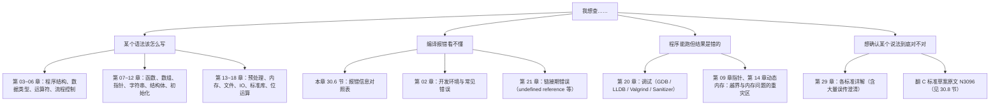

+++
title = "第 30 章 C 语言速查手册（附录）"
weight = 300
date = "2026-03-29T22:34:00+08:00"
type = "docs"
description = ""
isCJKLanguage = true
draft = false
+++

# 第 30 章 C 语言速查手册（附录）

这一章不讲新知识，只做一件很实用的事：把前面 29 章里**最容易忘、最常查**的内容压缩成几张表，放在一起。写代码时把它当成贴在显示器旁边的那张纸——需要的时候扫一眼就行。

> 💡 **使用建议**：真正卡住的时候，先翻到对应的表格定位问题，再回到具体章节看详细的原理和例子。死记硬背没有意义，能在 30 秒内查到答案才是这一章的价值。

---

## 30.1 迷路了？先看这张导航图



---

## 30.2 类型与格式符对照表

这是**出错率最高**的一张表。记两条铁律：

1. `printf` 看到的是**提升后**的类型（`float` 会变成 `double`，`char`/`short` 会变成 `int`）；
2. `scanf` 需要的是**指针**，而且**不会**发生那种提升——`%f` 要的是 `float *`，不是 `double *`。

### 30.2.1 `printf` / `fprintf` 的转换字符

| 转换字符 | 期望的参数类型 | 说明 |
|---|---|---|
| `%d` `%i` | `int` | 十进制整数 |
| `%u` | `unsigned int` | 无符号十进制 |
| `%o` | `unsigned int` | 八进制 |
| `%x` `%X` | `unsigned int` | 十六进制（小写 / 大写） |
| `%b` `%B` | `unsigned int` | **C23 新增**：二进制（小写 / 大写） |
| `%c` | `int` | 输出一个字符 |
| `%s` | `char *` | 输出字符串（到 `\0` 为止） |
| `%p` | `void *` | 指针地址；其他指针类型建议显式转成 `void *` |
| `%f` `%F` | `double` | 十进制小数（`float` 会自动提升为 `double`） |
| `%e` `%E` | `double` | 科学计数法 |
| `%g` `%G` | `double` | 自动在 `%f` 和 `%e` 之间挑更短的形式 |
| `%a` `%A` | `double` | 十六进制浮点（可精确往返） |
| `%n` | `int *` | **写入**到目前为止输出的字符数（有安全隐患，慎用） |
| `%%` | 无 | 输出一个百分号 |

### 30.2.2 长度修饰符

| 修饰符 | 写在哪些转换字符前面 | 需要的参数类型 |
|---|---|---|
| `hh` | `d` `i` / `o` `u` `x` `X` `b` | `signed char` / `unsigned char` |
| `h` | `d` `i` / `o` `u` `x` `X` `b` | `short` / `unsigned short` |
| `l` | `d` `i` / `o` `u` `x` `X` `b` | `long` / `unsigned long` |
| `l` | `c` / `s` | `wint_t` / `wchar_t *`（宽字符用法，与上面的整型用法互不干扰） |
| `ll` | `d` `i` / `o` `u` `x` `X` `b` | `long long` / `unsigned long long` |
| `j` | `d` `i` / `o` `u` `x` `X` `b` | `intmax_t` / `uintmax_t` |
| `z` | `d` `i` / `o` `u` `x` `X` `b` | `size_t` 的**有符号**对应类型 / `size_t`（最常用的是 `%zu`） |
| `t` | `d` `i` / `o` `u` `x` `X` `b` | `ptrdiff_t` 及其无符号对应类型 |
| `L` | `a` `A` `e` `E` `f` `F` `g` `G` | `long double` |
| `wN` | `d` `i` `o` `u` `x` `X` `b` | **C23 新增**：位宽为 N 的 `_BitInt(N)` |

> 关于 `%n`：它要求的是**指向有符号整数的指针**（`%hhn` 用 `signed char *`、`%n` 用 `int *`、`%ln` 用 `long *`……），而且它有被恶意格式串利用的历史，除非确实需要统计输出长度，否则不要用。

最常用的三个组合，背下来就够用：

```c
#include <stdio.h>
#include <string.h>   /* strlen */
#include <stddef.h>   /* size_t, ptrdiff_t */

int main(void) {
    const char *s = "hello";
    size_t n = strlen(s);
    printf("%zu\n", n);            /* size_t 用 %zu，输出 5 */

    int arr[10];
    int *p1 = &arr[0], *p2 = &arr[7];
    ptrdiff_t d = p2 - p1;
    printf("%td\n", d);            /* ptrdiff_t 用 %td，输出 7 */

    long long big = 1LL << 40;
    printf("%lld\n", big);         /* long long 用 %lld，输出 1099511627776 */

    return 0;
}
```

### 30.2.3 `scanf` 的配对（注意指针类型！）

| 格式 | 需要的参数 | 常见错误 |
|---|---|---|
| `%d` | `int *` | 写成 `scanf("%d", a)`——传了值而不是地址 |
| `%zu` | `size_t *` | 用 `%d` 接收 `size_t`，在高位截断 |
| `%f` | **`float *`** | 用 `%f` 去读 `double`：类型不匹配，结果不可预测 |
| `%lf` | `double *` | 读 `double` 必须写成 `%lf`（和 `printf` 不一样！） |
| `%Lf` | `long double *` | |
| `%c` | `char *` | 前面若留了换行符，会读到那个换行符 |
| `%s` | `char *` | **必须加宽度**，如 `%19s`，否则就是缓冲区溢出的经典写法 |
| `%19s` | `char *` | 最多读 19 个字符，留出 `\0` 的位置 |

```c
#include <stdio.h>

int main(void) {
    char name[20];
    int age;
    double height;

    /* 正确：%19s 限宽，%d 配 &age，%lf 配 &height */
    if (scanf("%19s %d %lf", name, &age, &height) == 3) {
        printf("姓名: %s, 年龄: %d, 身高: %.2f\n", name, age, height);
    }

    return 0;
}
```

> ⚠️ 生产代码里通常不用 `scanf` 读字符串——它遇到空格就停，还容易把缓冲区写爆。用 `fgets` 读整行，再用 `strtol` / `strtod` 转数值，是更稳的组合（详见第 10、16 章）。

---

## 30.3 运算符优先级与结合性（完整版）

一共 15 级，**级别越小越先算**。这张表不用背，但"哪些坑必须知道"要记住：

| 级别 | 运算符 | 结合性 |
|---|---|---|
| 1（最高） | `()` `[]` `->` `.` （后置`++` `--`、复合字面量） | 从左到右 |
| 2 | `!` `~` `+` `-` （一元）`++` `--` （前置）`*`（解引用）`&`（取地址）`sizeof` `_Alignof` `(类型)` 强制转换 | 从右到左 |
| 3 | `*` `/` `%` | 从左到右 |
| 4 | `+` `-` （二元） | 从左到右 |
| 5 | `<<` `>>` | 从左到右 |
| 6 | `<` `<=` `>` `>=` | 从左到右 |
| 7 | `==` `!=` | 从左到右 |
| 8 | `&` （按位与） | 从左到右 |
| 9 | `^` （按位异或） | 从左到右 |
| 10 | `\|` （按位或） | 从左到右 |
| 11 | `&&` | 从左到右 |
| 12 | `\|\|` | 从左到右 |
| 13 | `?:` 条件运算符 | 从右到左 |
| 14 | `=` `+=` `-=` `*=` `/=` `%=` `<<=` `>>=` `&=` `^=` `\|=` | 从右到左 |
| 15（最低） | `,` 逗号运算符 | 从左到右 |

### 必须记住的五个坑

1. **`&`、`|` 的优先级比 `==` 低**：`if (x & 0x0F == 0)` 等价于 `x & (0x0F == 0)`，也就是 `x & 0`。想判断位必须写 `if ((x & 0x0F) == 0)`。
2. **`<<` 的优先级比加减法低**：`1 << n + 1` 是 `1 << (n + 1)`，不是 `(1 << n) + 1`。
3. **`sizeof` 只管紧跟其后的那一个操作数**：`sizeof arr + 1` 是 `(sizeof arr) + 1`，不是 `sizeof(arr + 1)`；而且**它的操作数通常不会被求值**——`sizeof(x++)` 之后 `x` 根本没动（变长数组的长度表达式是例外）。
4. **`?:` 和赋值的结合性是从右到左**：`a = b = c` 等价于 `a = (b = c)`；`x ? y : z = 1` 会先算赋值（所以真要用请加括号）。
5. **`&&` / `||` 有短路求值**：`p != NULL && p->x > 0` 是安全的，左边的空指针判断挡住了右边。但**不要把有副作用的表达式塞进去**，比如 `i++ < n && arr[i] > 0`——两边的求值顺序虽然有保证，逻辑却容易写崩。

> 📌 还有一个"不是优先级但同样坑人"的知识点：**大多数运算符的求值顺序是未指定的**。`f() + g()` 到底先调谁，标准没说；`i = i++ + 1` 这类写法更是**未定义行为**。不确定就拆成两行（详见第 05、27 章）。

---

## 30.4 头文件速查

| 头文件 | 关注点 | 最常用的东西 |
|---|---|---|
| `<stdio.h>` | 输入输出 | `printf` `fprintf` `snprintf` `fopen` `fgets` `FILE` |
| `<stdlib.h>` | 通用工具 | `malloc` `free` `atoi` `strtol` `qsort` `exit` `rand` |
| `<string.h>` | 字符串与内存 | `strlen` `strcpy` `strncpy` `strcmp` `memcpy` `memmove` `memset` |
| `<math.h>` | 数学 | `sqrt` `pow` `fabs` `sin`；Linux 链接时要加 `-lm` |
| `<ctype.h>` | 字符分类 | `isalpha` `isdigit` `isspace` `tolower` `toupper` |
| `<time.h>` | 时间 | `time` `clock` `strftime` `timespec_get` `struct tm` |
| `<stdint.h>` | 定宽整数 | `int32_t` `uint64_t` `INT32_MAX` `UINT64_C` |
| `<inttypes.h>` | 定宽整数的格式符 | `PRId64` `PRIu32`（配合 `<stdint.h>` 使用） |
| `<stddef.h>` | 基础类型 | `size_t` `ptrdiff_t` `NULL` `offsetof` |
| `<limits.h>` | 整型极限 | `INT_MAX` `CHAR_BIT` `BITINT_MAXWIDTH`（C23） |
| `<float.h>` | 浮点极限 | `FLT_MAX` `DBL_EPSILON` |
| `<assert.h>` | 断言 | `assert` `static_assert`（C23 起 `static_assert` 是关键字） |
| `<errno.h>` | 错误码 | `errno` `ERANGE` `EINVAL` `strerror` |
| `<stdarg.h>` | 可变参数 | `va_list` `va_start` `va_arg` `va_end` |
| `<stdbool.h>` | 布尔 | `bool` `true` `false`（**C23 起这些已是关键字，此头文件成为过时特性**） |
| `<stdalign.h>` | 对齐 | `alignof` `alignas`（**C23 起是关键字，此头文件过时**） |
| `<stdnoreturn.h>` | 不返回 | `noreturn`（**C23 起过时，改用 `[[noreturn]]`**） |
| `<setjmp.h>` | 非局部跳转 | `setjmp` `longjmp`（慎用，容易破坏资源管理） |
| `<signal.h>` | 信号 | `signal` `raise` `SIGINT` |
| `<locale.h>` | 区域设置 | `setlocale` `LC_ALL` |
| `<stdatomic.h>` | 原子操作 | `atomic_int` `atomic_load` `atomic_fetch_add` |
| `<threads.h>` | C11 线程 | `thrd_create` `mtx_t`；**macOS 与旧 MSVC 没有此头文件** |
| `<stdbit.h>` | C23 位操作 | `stdc_count_ones` `stdc_leading_zeros`；**需较新 glibc，macOS 暂无** |
| `<stdckdint.h>` | C23 溢出检查 | `ckd_add` `ckd_mul` |
| `<uchar.h>` | C11 Unicode | `char16_t` `char32_t` `mbrtoc16`；**macOS 上 Apple Clang 未提供** |
| `<complex.h>` / `<tgmath.h>` | 复数与泛型数学 | `double complex` `csqrt` |

> 🧭 **可移植性排序（从好到差）**：ISO C 标准头文件 → POSIX 头文件（`<unistd.h>` `<pthread.h>` `<sys/socket.h>`）→ 附录 K 的 `_s` 函数 → 编译器扩展。跨平台项目尽量往左边靠。

---

## 30.5 常用标准库函数一句话索引

| 想干的事 | 该用 | 别用 |
|---|---|---|
| 读一行（含空格） | `fgets` / POSIX `getline` | ~~`gets`~~（C11 已从标准中移除） |
| 拷字符串 | `snprintf` / `strncpy` + 手动补 `\0` | ~~`strcpy`~~ |
| 拼接字符串 | `snprintf` | ~~`strcat`~~ |
| 字符串转整数 | `strtol` / `strtoll`（能报错） | `atoi`（无法区分错误和输入 0） |
| 整数转字符串 | `snprintf` | ~~`itoa`~~（不是标准函数） |
| 内存块拷贝（**可能重叠**） | `memmove` | `memcpy`（重叠时是未定义行为） |
| 内存块拷贝（**确定不重叠**） | `memcpy` | `memmove`（能跑但没必要） |
| 排序 | `qsort` | 手写冒泡（除非教学） |
| 二分查找 | `bsearch`（数组必须已排序） | 在未排序数组上调用 |
| 分配内存 | `malloc` + 判空 + `free` | 忘了 `free`、不检查返回值是否为 `NULL` |
| 分配并清零 | `calloc` | `malloc` + `memset`（能用但啰嗦） |
| 写入格式化文本到固定缓冲区 | `snprintf` | `sprintf` |
| 比较字符串 | `strcmp`（只保证符号，不保证是 -1/1） | 用 `==` 比较 `char *` |

---

## 30.6 编译 / 链接错误信息对照表

编译器报错**一次往往只报第一条是最准确的**，后面的常常是连带的"假错误"。永远从**第一条**开始改。

| 报错信息（关键字） | 真实含义 | 怎么改 |
|---|---|---|
| `expected ';' before ...` | 上一行漏了分号 | 看它指出位置的前一行 |
| `expected identifier` | 用了保留字/宏把名字替换掉了 | 换一个变量名，检查同名宏 |
| `implicit declaration of function 'xxx'` | 没有 `#include` 对应头文件 | 补上头文件（C99 起这是错误，不是警告） |
| `'xxx' undeclared` / `use of undeclared identifier` | 名字拼错、作用域不对、或未声明 | 检查拼写与作用域 |
| `'main' must return 'int'` | 写成了 `void main` | 改成 `int main(void)` |
| `redefinition of 'xxx'` | 同一个作用域里定义了两次 | 删掉重复定义 |
| `conflicting types for 'xxx'` | 声明与定义不一致 | 让两者完全一致 |
| `control reaches end of non-void function` | 有分支没 `return` | 补上返回值 |
| `unused variable` | 声明了没用 | 删掉或加 `(void)x;` |
| `format '%d' expects argument of type 'int', but argument has type ...` | 格式串与实参类型不匹配 | 按 30.2 节换正确的格式符 |
| `array subscript is above array bounds` | 下标越界 | 检查循环边界（经典：`i <= n`） |
| `fatal error: 'xxx.h' file not found` | 头文件不存在或路径没加 | 用 `-I` 指定目录，或确认拼写 |
| `undefined reference to 'xxx'`（**链接期**） | 只有声明，没有定义 | 把实现文件加进编译命令，或补上 `-l` 库 |
| `multiple definition of 'xxx'`（链接期） | 同一符号被定义了多次 | 头文件里只放 `extern` 声明，定义放在**一个** `.c` 里 |
| `ld: library not found for -lxxx` | 找不到库 | 确认安装、用 `-L` 指定路径 |
| 运行时 `Segmentation fault` | 空指针/越界/野指针/栈溢出 | 用 ASan 或调试器定位（第 14、20 章） |
| 运行时 `Stack smashing detected` / `*** stack smashing ***` | 把局部数组写爆了 | 检查 `strcpy`、`scanf("%s")`、数组长度 |

---

## 30.7 术语速查：把概念钉死

C 语言里很多争执都源于术语用法不统一。这一节帮你把最容易被混用的几组概念一次钉死。

| 术语 | 一句话定义 | 容易记错的地方 |
|---|---|---|
| **声明** | 告诉编译器"有这么个名字，类型是什么" | 可以反复出现，通常写在头文件里 |
| **定义** | 真正分配存储空间 / 提供函数体 | **整个程序（每个符号）只能有一次**外部定义 |
| **作用域** | 名字在源码里**看得见**的范围 | 与生命周期无关 |
| **链接**（linkage） | 跨翻译单元能否找到同一个名字 | `static` 全局变量是内部链接 |
| **存储期** | 对象的**生命周期** | `static` 局部变量可见性仍是块作用域，但活到程序结束 |
| **左值**（lvalue） | 有确定位置、能取地址的对象 | 数组名是"不可修改的左值"，但多数场景会退化成指针 |
| **数组退化** | 数组名在多数表达式里变成指向首元素的指针 | `sizeof(数组)`、`&数组` 是例外，不退化 |
| **未定义行为（UB）** | 标准不作任何要求，编译器可以做任何事 | 不是"能跑就行"，优化后可能突然崩溃 |
| **未指定行为** | 标准给了几种可能，但不说选哪个 | 例如函数参数的求值顺序 |
| **实现定义行为** | 由实现决定，但**必须写进文档** | 例如 `char` 是否有符号、右移负数 |
| **翻译单元** | 一个 `.c` 文件连同它展开的所有头文件 | `#include` 是纯文本插入 |
| **完整类型** | 大小已知的类型 | `struct Foo;` 是不完整类型，不能声明对象 |

---

## 30.8 常用的编译命令与验证手段

### 30.8.1 编译参数速查

| 参数 | 作用 |
|---|---|
| `-std=c23` / `-std=c17` / `-std=c11` | 选择语言标准（想用扩展就写 `gnu23` 等） |
| `-Wall -Wextra -Wpedantic` | 打开常用警告（**强烈建议默认加上**） |
| `-Werror` | 把警告当错误，适合 CI |
| `-O0` / `-O2` / `-Os` | 关闭优化 / 常规优化 / 优化体积 |
| `-g` | 生成调试信息（可以和 `-O2` 共存，但要单步调试时建议用 `-O0 -g`） |
| `-fsanitize=address,undefined` | 运行时检测内存越界、泄漏、UB（**极其有用**） |
| `-fanalyzer` | GCC 的静态分析（编译变慢，但能提前发现问题） |
| `-c` / `-S` / `-E` | 只编译到目标文件 / 汇编 / 预处理 |
| `-I 目录` / `-L 目录` / `-l 库名` | 头文件路径 / 库路径 / 链接库 |
| `-D名字=值` / `-U名字` | 命令行定义宏 / 取消宏 |
| `-pthread` | 启用 POSIX 线程（编译和链接都要加） |
| `-fPIC -shared` | 生成位置无关代码并打包成动态库 |
| `-MMD -MP` | 生成 `.d` 依赖文件，供 Makefile 追踪头文件变化 |

> 📌 小提醒：`-std=c23` 这个写法是后来才定下名字的——**GCC 14 起**才接受它，GCC 9~13 里要写 `-std=c2x`（同一个东西的旧名字）；Clang 也是从 18 版起才认 `-std=c23`。好在 `c2x` 现在仍然被接受，写 `-std=c2x` 能在新旧编译器上都跑通。`-std=c17`、`-std=c11` 则在所有主流编译器上都可用。

### 30.8.2 一套"能跑起来"的最小组合

```bash
# 日常开发：严格要求 + 调试信息 + 内存检查
clang -std=c23 -Wall -Wextra -Wpedantic -g -O0 \
      -fsanitize=address,undefined -fno-omit-frame-pointer \
      main.c utils.c -o app

# 发布：优化打开，不要 Sanitizer
clang -std=c23 -Wall -Wextra -O2 -DNDEBUG main.c utils.c -o app
```

> ⚠️ **注意**：优化（`-O2`）和 Sanitizer、以及和 `-g` 都可以共存，但**调试体验最好的是 `-O0 -g`**。另外 `-DNDEBUG` 会让 `assert` 失效，别在还在排查问题的版本上加它。

### 30.8.3 想确认一个说法对不对？查原始文档

网上（包括 AI 生成的教程）关于 C 语言的错误说法极多。遇到不确定的点，按这个顺序求证：

1. **C 标准草案**：N3096 是 C23 的草案，官网 `open-std.org` 上有 PDF，能搜索全文。标准说了算。
2. **cppreference 的 C 部分**：查函数原型和可用性版本非常方便，注意区分 C 和 C++ 的页面。
3. **编译器实际行为**：写一段 10 行的最小程序，把 `-Wall -Wextra -Wpedantic` 全打开跑一遍。文档会写错，编译器不会撒谎。

```c
/* 验证"某个特性在哪个标准里"的标准套路 */
#include <stdio.h>

int main(void) {
#if defined(__STDC_VERSION__)
    printf("__STDC_VERSION__ = %ld\n", (long)__STDC_VERSION__);
#else
    printf("这是 C89（没有 __STDC_VERSION__）\n");
#endif
    printf("编译器: %s\n",
#if defined(__clang__)
           "Clang " __clang_version__
#elif defined(__GNUC__)
           "GCC " __VERSION__
#else
           "未知编译器"
#endif
    );
    return 0;
}
```

> `__STDC_VERSION__` 的取值：C99 是 `199901L`，C11 是 `201112L`，C17 是 `201710L`，**C23 是 `202311L`**。这个宏是判断"编译器到底认哪个标准"最可靠的办法。

---

## 30.9 收尾：一份"交作业前自查清单"

写完一个 C 程序，准备提交或交付之前，过一遍这张清单：

- [ ] 编译命令里带了 `-Wall -Wextra`，并且**做到了零警告**（警告往往就是 bug 的苗子）
- [ ] 每个 `malloc` / `calloc` / `realloc` 都有对应的 `free`，错误分支上也记得释放
- [ ] 每个 `fopen` 都有对应的 `fclose`，返回值都检查过
- [ ] 所有数组下标都在范围内（特别注意 `<=` 和 `sizeof` 的配合）
- [ ] 所有字符串都以 `\0` 结尾，`strncpy` 之后手动补过 `\0`
- [ ] 用 `scanf` 读字符串时都带了宽度（`%19s` 这种）
- [ ] `printf` 的格式符与实参类型完全匹配（尤其 `%zu` / `%lld` / `%lf`）
- [ ] 没有依赖"未定义行为"（如 `i = i++`、越界访问、重叠 `memcpy`）
- [ ] 用 `valgrind` 或 `-fsanitize=address,undefined` 跑过一遍，没有报错
- [ ] 在 `-O2` 下也测试过——优化会暴露 UB，`-O0` 能跑不代表代码是对的

---

## 30.10 写在最后

到这里，这套 C 语言教程就结束了。回头看，我们从 1972 年的贝尔实验室一路走到 C23 标准，覆盖了语法、内存、标准库、并发、网络、工程实践和标准细节。

但 C 语言真正的功夫不在记语法，而在于三件事：

1. **清楚每一块内存归谁管**——是栈上的、静态区的，还是堆上要自己释放的；
2. **分清哪些行为有保证、哪些是"看编译器心情"**——UB、未指定行为、实现定义行为，这三者的区别值得反复体会；
3. **把"能跑"和"正确"分开看**——能跑只说明这次运气好。

遇到不确定的问题，回到 30.8.3 节的办法：查标准、查编译器行为、写最小例子验证。**不要相信任何没有来源的断言，包括本章**——但本章的每一条，你都可以用上面的方法自己验一遍。
