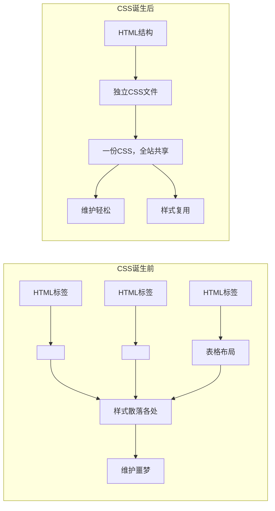
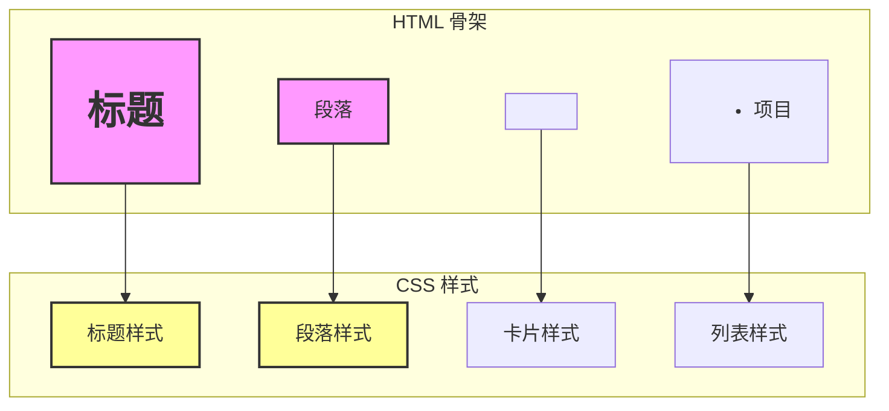
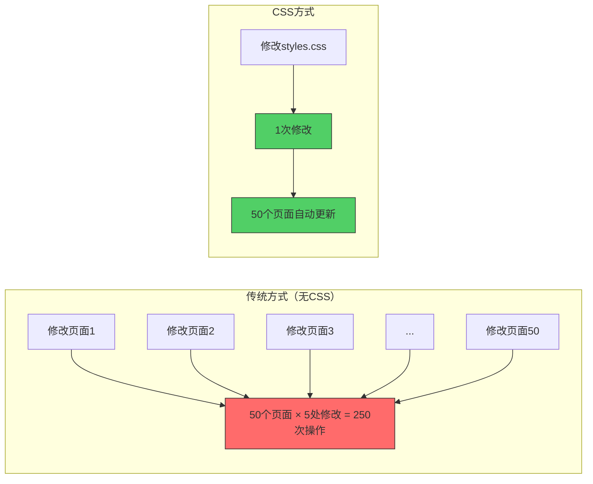
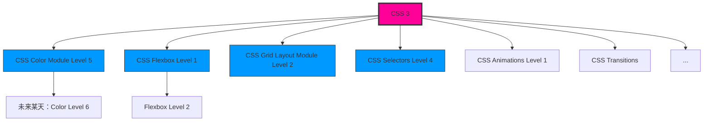
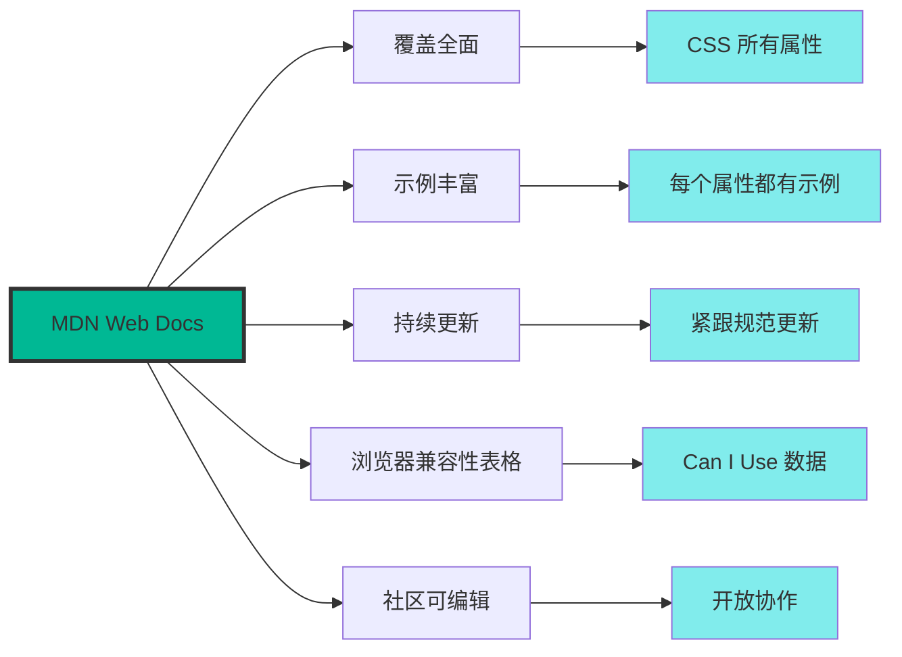
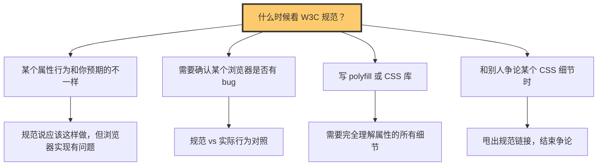
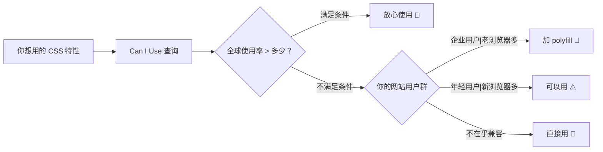
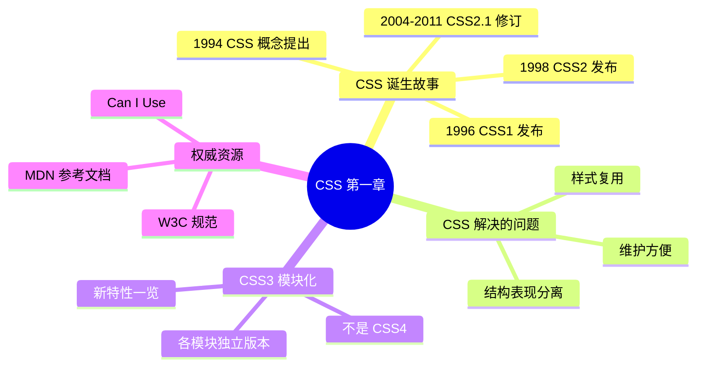

+++
title = "第1章 什么是CSS"
weight = 10
date = "2026-03-27T16:53:00+08:00"
type = "docs"
description = ""
isCJKLanguage = true
draft = false
+++

# 第一章：CSS 是什么

> 如果把网页比作一个人，那么 HTML 就是骨骼和器官，CSS 就是它的外衣和妆容。没有 CSS 的网页，就像一个人裸奔出门——技术上没问题，但回头率嘛... 主要是惊恐的那种。

## 1.1 CSS 的诞生故事

话说在很久很久以前（其实也就是 1990 年代），互联网刚刚起步，那时候的网页长这样：**白底黑字，链接是蓝色的，点击变紫色**。设计师们看着这些网页，心里苦啊——就好比你只能穿同一件灰色外套出门参加所有场合，从婚礼到葬礼都一样。

### 1.1.1 1994 年 CSS 诞生——哈肯·维姆·莱在 CERN 提出 CSS 想法，让网页样式独立于结构

1994 年，一个叫 **哈肯·维姆·莱**（Håkon Wium Lie）的大佬，在欧洲核子研究组织（CERN，就是那个搞出互联网的地方）工作。他看着当时乱七八糟的网页样式，心想在 1994 年：我们已经能往 PPT 里加样式了，为什么网页不行？

于是他提出了 CSS 的想法。CSS 全称 **Cascading Style Sheets**，翻译过来就是"层叠样式表"。这个名字听起来像叠叠乐游戏，但实际上它解决的是网页"谁说了算"的问题——想象一下，你、你妈、你老婆同时对你穿什么衣服发表意见，这时候就需要一套"层叠"规则来决定最终听谁的。

哈肯的想法很简单：**把网页的结构（HTML）和样式（CSS）分开**。就像装修房子，骨架（HTML）和装修（CSS）应该是两套独立的系统，装修公司改配色不会让你家多出一堵墙吧？

**关键人物小档案：**
- **哈肯·维姆·莱**（Håkon Wium Lie）——CSS 之父，目前在 Opera Software 工作
- 他写博士论文的时候顺便发明了 CSS，这大概就是传说中的"顺便改变世界"吧

```css
/* CSS 诞生之初，语法大概长这样 */
h1 {
  color: red;
  font-size: 24pt;
}

/* 是的，那时候支持 font-size 单位是 pt（点），你是不是以为 px 是亲生的？ */
```

### 1.1.2 1996 年 CSS1 发布——W3C 正式发布第一个 CSS 规范，包含字体、颜色、文本、盒模型基础

1996 年，W3C（万维网联盟，一个专门给网页定规矩的国际组织）正式发布了 **CSS1** 规范。这就好比秦始皇统一度量衡——虽然当时还没那么完善，但至少大家有了一套共同的标准。

CSS1 主要解决了以下"人民内部矛盾"：

| 功能 | 说明 | 当时的心情 |
|------|------|-----------|
| 字体属性 | font-family、font-size、font-weight | 终于不用只能用一个字体了！ |
| 颜色属性 | color、background-color | 黑白电视升级彩色电视！ |
| 文本属性 | text-align、text-indent、line-height | 排版终于能看了！ |
| 盒模型 | margin、padding、border | 我知道一个 div 有多大了！ |

不过说实话，CSS1 其实还挺简陋的。就像第一代 iPhone——它确实是智能手机，但你能用它做的事情大概也就打打电话、发发短信。CSS1 允许你改字体、颜色、间距，但要说到复杂布局？那时候的设计师们还得靠 `<table>` 标签来"作弊"布局。

```css
/* CSS1 时代的典型操作 */
/* 注意：CSS1 时代 px 单位支持很烂，标准单位是 pt（点）和 em */
/* 别被现在满屏的 px 迷惑了，当年的前端用的是 pt！ */
body {
  font-family: "Times New Roman", serif;
  font-size: 12pt;   /* pt 是 CSS1 时代的主流单位，不是 px */
  color: black;
  background-color: white;
}

h1 {
  font-size: 24pt;    /* 当年没有 px，都是 pt */
  font-weight: bold;
  text-align: center;
}

p {
  text-indent: 2em;  /* 首行缩进两个字符，这在当时是刚需 */
  line-height: 1.5;
}
```

### 1.1.3 1998 年 CSS2 发布——增加定位、浮动、媒体类型、伪类伪元素，布局能力大幅增强

1998 年，CSS2 横空出世！这次 W3C 憋了个大招，加入了一堆让前端工程师眼前一亮的功能。

**CSS2 的王炸功能：**

**1. 定位系统（Positioning）**
终于可以精确控制元素的位置了！想象一下，以前你只能把东西按顺序摆放，现在你可以直接说"这个广告牌给我钉在页面右上角，别动"。

```css
/* 固定定位——元素死死钉在视口某个位置 */
.fixed-ad {
  position: fixed;
  top: 0;
  right: 0;
  width: 300px;
  height: 250px;
  background-color: #ff6600;
}

/* 绝对定位——元素相对于最近的定位祖先移动 */
/* 注意：以下示例同时演示了 CSS3 的 transform，这两个凑在一起 */
/* 是因为现代开发中它们经常配合使用——别被误导以为 CSS2 原生支持 transform */
.modal-overlay {
  position: absolute;
  top: 50%;
  left: 50%;
  /* 真正的 CSS2 居中做法：靠 margin:auto + 负边距手动算，或者直接不用居中 */
  /* transform: translate(-50%, -50%);  ← CSS3 才有的东西，这里先预告 */
  background: white;
  padding: 20px;
  border-radius: 8px;          /* ← CSS3 圆角 */
  box-shadow: 0 4px 20px rgba(0, 0, 0, 0.3);  /* ← CSS3 阴影 */
}

/* 相对定位——相对于元素正常位置偏移 */
.floating-label {
  position: relative;
  top: -10px;
  left: 10px;
  font-size: 12px;
  color: #666;
}
```

**2. 浮动（Float）**
这玩意儿本来是用来实现文字环绕图片效果的，结果被设计师们玩坏了——直接用来做多列布局！就好比你买了个电钻，结果用它来当开瓶器（别说，还真好用）。

```css
/* 文字环绕图片——float 的本职工作 */
.image-float-left {
  float: left;
  margin-right: 15px;
  margin-bottom: 10px;
}

/* 两栏布局——被玩坏的 float */
.sidebar {
  float: left;
  width: 250px;
  background: #f5f5f5;
}

.content {
  float: left;
  width: calc(100% - 250px);  /* calc 是后来才有的，这里先预告一下 */
}

/* 清除浮动——这大概是 CSS 历史上最玄学的操作之一 */
.clearfix::after {
  content: "";
  display: table;
  clear: both;
}
```

**3. 媒体类型（Media Types）**
这下牛了！同一个页面可以根据不同的设备输出不同的样式。想象一下，你穿正装去开会，穿睡衣在家躺着——同一个你，不同场景穿不同的衣服。

```css
/* 屏幕设备 */
@media screen {
  body {
    font-size: 16px;
    line-height: 1.6;
  }
}

/* 打印机——打印的时候自动切换 */
@media print {
  body {
    font-size: 12pt;  /* 打印用 pt 单位，专业！ */
    color: black;
    background: white;
  }

  .no-print {
    display: none;  /* 打印的时候隐藏广告、导航之类的东西 */
  }
}

/* 投影演示（deprecated：现代浏览器已不支持，改用 @media screen 配合视口大小）*/
@media screen {
  body {
    font-size: 24px;
  }
}
```

**4. 伪类和伪元素（Pseudo-classes & Pseudo-elements）**
这是一个让你能"选中不存在的东西"的魔法！比如"鼠标悬停的元素"、"段落的第一个字母"、"某个元素之后的内容"...

```css
/* 伪类——鼠标悬停变色，就像变色龙 */
a:hover {
  color: #ff6600;
  text-decoration: underline;
}

/* 第一个子元素 */
li:first-child {
  font-weight: bold;
}

/* 伪元素——给段落开头加装饰 */
p::first-letter {
  font-size: 3em;  /* 首字下沉，报刊杂志风格 */
  float: left;
  line-height: 1;
  padding-right: 8px;
  color: #c00;
}

/* 之前/之后插入内容 */
.price-label::before {
  content: "原价: ";
  color: #999;
  text-decoration: line-through;
}
```

### 1.1.4 2004-2011 年 CSS2.1 修订期——对 CSS2 的修订，修复规范中的模糊之处，2004 年发布候选推荐，2011 年正式成为 W3C 推荐标准，是 IE6/7 时代的主流规范

CSS2 发布之后，大家发现这玩意儿有点...怎么说呢...模糊。就像你买了个说明书，上面写着"适量盐"，但"适量"到底是多少？不同的浏览器给出了不同的答案，导致同样的代码在不同浏览器里长得完全不一样。

于是 W3C 开始了漫长的修订之路，从 2004 年到 2011 年，整整 7 年！抗日战争都打完了，CSS2.1 才正式成为 W3C 推荐标准。

**CSS2.1 都修订了啥？**

主要就是**说清楚那些模糊的地方**：

```css
/* 盒模型终于统一了！ */
/* 在 IE6 时代，如果没写 DOCTYPE，IE 会用错误的盒模型 */
/* 正确的盒模型：width = 内容宽度，不包含 padding 和 border */

/* 标准盒模型（现代浏览器） */
.standard-box {
  box-sizing: content-box;  /* width 只包含内容 */
  width: 200px;
  padding: 20px;
  border: 5px solid black;
  /* 实际占用宽度 = 200 + 20*2 + 5*2 = 250px */
}

/* IE 盒模型（旧版 IE 的" quirks 模式"） */
.quirks-box {
  box-sizing: border-box;  /* width = 内容 + padding + border */
  width: 200px;
  padding: 20px;
  border: 5px solid black;
  /* 实际占用宽度 = 200px，内容区域被压缩为 150px */
}

/* 最好的实践：全局使用 border-box */
*, *::before, *::after {
  box-sizing: border-box;
}
```

**IE6/IE7 时代的那些糟心事：**
- `:hover` 在 IE6 只对 `<a>` 标签有效
- `min-width` 和 `max-width` 在 IE6 根本不支持
- `png` 图片透明度在 IE6 显示成一坨奇怪的灰色
- 各种神奇的 `hasLayout` 问题...

```css
/* 为了兼容 IE6/7，前端工程师们发明了各种 hack */

/* IE6 专属下划线 hack */
#navigation {
  _height: 100px;  /* IE6 会读到这个属性，其他浏览器忽略 */
}

/* IE6/7 专属 * 号 hack */
.container {
  *zoom: 1;  /* 触发 hasLayout，顺便清除浮动 */
}

/* 条件注释——微软官方推荐的兼容方法 */
<!--[if IE 6]>
  <link rel="stylesheet" href="ie6.css">
<![endif]-->
/* 注意：这是 HTML 注释，不是 CSS 注释，上面示例是为了说明语法才放在一起的 */
```

> 💡 **冷知识**：CSS2.1 实际上是一个"向后看"的规范——它不是向前进的，而是把浏览器已经实际实现的东西标准化。所以你可以说 CSS2.1 是"事实标准"的规范化。

### 1.1.5 CSS 诞生之前的状态——样式直接写在 HTML 标签里，如 `<font color="red">`，无法复用，维护困难

在 CSS 诞生之前，前端工程师（那时候可能叫"网页制作人"）是怎么给网页上色的？

**远古时代的十八般武艺：**

**1. `<font>` 标签——HTML 的万金油**

```html
<!-- 原始写法，直接在标签里写样式 -->
<font size="7" face="Arial" color="red">大标题</font>
<font size="4" color="blue">副标题</font>
<font face="Times New Roman" color="#333333">正文内容</font>
```

**2. `<center>` 标签——居中神器**

```html
<!-- 让内容居中，没错，这曾经是一个标签 -->
<center>让我居中！</center>

<!-- 嵌套使用，效果拔群 -->
<center>
  <font size="5" color="purple">
    <center>我超级居中！</center>
  </font>
</center>
```

**3. `<b>` 和 `<i>` 标签——加粗和斜体**

```html
<!-- Bold 和 Italic，虽然现在还在用，但语义已经变了 -->
<b>这是加粗的文字</b>
<i>这是斜体文字</i>

<!-- 配合 font 标签使用 -->
<font size="5">
  <b>
    <i>我是又大又粗又斜的文字</i>
  </b>
</font>
```

**4. `<hr>` 标签——分隔线**

```html
<!-- 水平线，虽然能设颜色宽度，但... -->
<hr width="80%" color="red" size="5">
```

**5. `<body>` 标签的属性——全页面通用设置**

```html
<!-- 整个页面的默认样式都在这儿了 -->
<body bgcolor="white" text="black" link="blue" vlink="purple" alink="red">
  <!-- 文字链接被点击后变紫色，这是当年的"已访问链接"效果 -->
</body>
```

**6. 表格布局——最大的灾难**

```html
<!-- 用表格来布局，这大概是前端史上最离谱的"曲线救国" -->
<table width="800" cellpadding="0" cellspacing="0" border="0" align="center">
  <tr>
    <td colspan="2" bgcolor="header-color">
      <font size="7" face="Arial">网站标题</font>
    </td>
  </tr>
  <tr>
    <td width="200" bgcolor="sidebar-color" valign="top">
      <font face="Arial">
        <b>导航菜单</b><br>
        <a href="home.html">首页</a><br>
        <a href="about.html">关于我们</a>
      </font>
    </td>
    <td width="600" valign="top">
      <font size="4" face="Times New Roman">
        正文内容...
      </font>
    </td>
  </tr>
</table>
```

**这种方式的问题有多大？**

| 问题 | 具体表现 | 痛苦指数 |
|------|----------|----------|
| 无法复用 | 每个页面都要单独写样式 | ⭐⭐⭐⭐⭐ |
| 维护困难 | 要改全局颜色？一个个文件改吧 | ⭐⭐⭐⭐⭐ |
| 代码臃肿 | 一个 100 行的页面，60 行是样式 | ⭐⭐⭐⭐ |
| 语义混乱 | `<table>` 本来是用来显示数据的 | ⭐⭐⭐⭐⭐ |
| 无法响应式 | 想做移动端？重新做一个页面吧 | ⭐⭐⭐⭐⭐ |

```html
<!-- 假设你有 100 个页面，都要改成蓝色主题 -->
<!-- 旧方式：每个文件都要改 5 处地方，共 500 处！-->
<font color="blue">导航1</font>
<font color="blue">导航2</font>
<font color="blue">导航3</font>
<!-- 改完之后手指都抽筋了 -->

<!-- CSS 方式：一行搞定 -->
<!-- 只需要改一个文件里的一行代码 -->
```

**Mermaid 图：CSS 诞生前后的对比**



## 1.2 CSS 解决什么问题

> 想象一下：你开了一家连锁奶茶店，每家分店都要用不同的配方——这不是在折磨调茶师吗？CSS 诞生之前，网页设计师就是在被这样折磨。

CSS 的出现，完美解决了网页样式领域的"三座大山"问题。

### 1.2.1 结构和表现分离——HTML 负责结构，CSS 负责样式

这可能是 CSS 最重要的贡献了。想象一下：

- **HTML** 是房子的**骨架和管道**：承重墙、水管、电线都在这儿
- **CSS** 是房子的**装修和家具**：刷什么颜色、摆什么沙发、挂什么窗帘

这两者分开，有什么好处？

```html
<!-- HTML 只负责说"这是一个标题" -->
<h1>欢迎来到我的网站</h1>
<p>这是一段介绍文字</p>
<ul>
  <li>列表项一</li>
  <li>列表项二</li>
  <li>列表项三</li>
</ul>
```

```css
/* CSS 负责说"这个标题长什么样" */
/* 同样的 HTML 结构，换一套 CSS 就是完全不同的风格 */

h1 {
  font-size: 48px;
  font-family: "Microsoft YaHei", sans-serif;
  color: #1a1a1a;
  text-align: center;
  margin-bottom: 20px;
}

p {
  font-size: 18px;
  line-height: 1.8;
  color: #333;
  max-width: 800px;
  margin: 0 auto;
}

ul {
  list-style: none;  /* 去掉默认的列表样式 */
  padding: 0;
}

ul li {
  padding: 10px 20px;
  margin-bottom: 8px;
  background: linear-gradient(135deg, #667eea 0%, #764ba2 100%);
  color: white;
  border-radius: 25px;
  transition: transform 0.3s ease;
}

ul li:hover {
  transform: translateX(10px);
}
```

**换个主题，同一套 HTML 结构，立刻变成另一种风格：**

```css
/* 暗黑模式主题 */
body.dark-theme {
  background-color: #1a1a2e;
  color: #eee;
}

body.dark-theme h1 {
  color: #00d9ff;
  text-shadow: 0 0 20px rgba(0, 217, 255, 0.5);
}

body.dark-theme ul li {
  background: linear-gradient(135deg, #434343 0%, #000000 100%);
  border: 1px solid #555;
}
```

**Mermaid 图：结构与表现分离的架构**



### 1.2.2 样式复用——一份 CSS 全站共享

这是 CSS 最香的功能之一。想象一下这个场景：

**没有 CSS 的时代：**

```html
<!-- index.html -->
<font size="5" face="Arial" color="blue">网站标题</font>

<!-- about.html -->
<font size="5" face="Arial" color="blue">网站标题</font>

<!-- contact.html -->
<font size="5" face="Arial" color="blue">网站标题</font>

<!-- products.html -->
<font size="5" face="Arial" color="blue">网站标题</font>

<!-- services.html -->
<font size="5" face="Arial" color="blue">网站标题</font>

<!-- ...你有50个页面... -->

<!-- 然后产品经理说：标题改成红色 -->
<!-- 你：？？？ -->
```

**有了 CSS 之后：**

```css
/* styles.css —— 一处定义，到处使用 */
/* 定义一次，全站生效 */

h1 {
  font-size: 48px;
  font-family: "Arial", sans-serif;
  color: blue;
  text-align: center;
  margin-bottom: 30px;
  letter-spacing: 2px;
}

/* 改颜色？一行搞定！ */
h1 {
  color: red;  /* 就改这一行，50个页面瞬间全部更新 */
}
```

```html
<!-- index.html -->
<link rel="stylesheet" href="styles.css">
<h1>网站标题</h1>

<!-- about.html -->
<link rel="stylesheet" href="styles.css">
<h1>网站标题</h1>

<!-- contact.html -->
<link rel="stylesheet" href="styles.css">
<h1>网站标题</h1>

<!-- 所有50个页面共用同一套样式 -->
<!-- 改一处，全站生效，完美！ -->
```

**复用的高级玩法：类选择器**

```css
/* 给不同的元素起不同的"外号" */
/* 相同的"外号"有相同的样式 */

.btn-primary {
  background-color: #007bff;
  color: white;
  padding: 12px 24px;
  border-radius: 6px;
  font-size: 16px;
  border: none;
  cursor: pointer;
  transition: background-color 0.3s ease;
}

.btn-primary:hover {
  background-color: #0056b3;
}

.btn-danger {
  background-color: #dc3545;
  color: white;
  padding: 12px 24px;
  border-radius: 6px;
}

.btn-success {
  background-color: #28a745;
  color: white;
  padding: 12px 24px;
  border-radius: 6px;
}
```

```html
<!-- 同一个样式类，可以用在任何元素上 -->
<button class="btn-primary">确认下单</button>
<a href="/cancel" class="btn-danger">取消订单</a>
<div class="btn-success">操作成功！</div>
<input type="submit" class="btn-primary" value="提交表单">
```

### 1.2.3 维护方便——修改一处，全站生效

这是 CSS 的终极奥义。想象一下这个场景：

**场景一：换主题色**

```css
/* 定义主题色变量 */
:root {
  --primary-color: #007bff;  /* 主色调 */
  --secondary-color: #6c757d;  /* 次要色 */
  --success-color: #28a745;  /* 成功色 */
  --danger-color: #dc3545;  /* 危险色 */
  --warning-color: #ffc107;  /* 警告色 */
}

/* 所有使用主题色的地方都会自动更新 */
.btn-primary {
  background-color: var(--primary-color);  /* 自动继承 #007bff */
}

.badge-success {
  background-color: var(--success-color);  /* 自动继承 #28a745 */
}

.text-danger {
  color: var(--danger-color);  /* 自动继承 #dc3545 */
}

/* 换主题？改一行！ */
/* :root {
     --primary-color: #8b5cf6;  // 换成紫色主题
     --success-color: #10b981;  // 换成绿色主题
   } */
/* 全站主题色瞬间切换，爽不爽？ */
```

**场景二：响应式布局修改**

```css
/* 桌面端布局 */
.container {
  max-width: 1200px;
  margin: 0 auto;
  padding: 0 20px;
}

.grid {
  display: grid;
  grid-template-columns: repeat(4, 1fr);  /* 4列布局 */
  gap: 30px;
}

/* 平板端布局 */
@media (max-width: 1024px) {
  .grid {
    grid-template-columns: repeat(2, 1fr);  /* 改成2列 */
    gap: 20px;
  }
}

/* 手机端布局 */
@media (max-width: 640px) {
  .grid {
    grid-template-columns: 1fr;  /* 改成1列 */
    gap: 15px;
  }
}

/* 一套 CSS，覆盖所有设备 */
/* 维护成本 = 1 */
/* 产品经理：能不能做个手机版？ */
/* 你（CSS 工程师）：已经做了。 */
/* 产品经理：什么时候的事？ */
/* 你：五年前。响应式布局，一套走天下。 */
```

**Mermaid 图：CSS 维护流程 vs 传统方式**



**小故事：CSS 拯救了一个差点离职的前端工程师**

> 话说有个叫小明的工程师，入职第一天产品经理就让他把公司 200 个页面的"主题色"从蓝色改成紫色。
>
> 小明看着那 200 个充斥着 `<font color="blue">` 的 HTML 文件，默默打开了招聘网站...
>
> 就在他准备提交辞职报告的时候，隔壁工位的老王悠悠地说："你为啥不用 CSS 呢？"
>
> 小明花了一个小时把样式抽离到 CSS 文件，然后... 一行代码搞定！
>
> 后来小明成了 CSS 的狂热粉丝，每次开会都念叨"结构与表现分离"，人送外号"CSS 传教士"。

## 1.3 CSS3 模块化

> CSS3 不是 CSS4！重要的事情说三遍：CSS3 不是 CSS4！CSS3 不是 CSS4！CSS3 是模块化的，各个模块可以有自己的版本号——这就像智能手机的不同 app 各自更新，互不影响。
>
> 什么？你以为 CSS3 之后是 CSS4 → CSS5 → CSS6？太年轻了！CSS 的版本号就像 Web 开发者的发际线——到 3 就差不多止步了，不是没长进，是选择了另一种进化方式。

### 1.3.1 CSS3 不是 CSS4——各模块独立演进，版本号独立，如 CSS Color Module Level 3 → Level 5

这是 CSS 历史上最容易被误解的概念之一。很多人以为 CSS 会像软件版本一样，从 3 直接跳到 4，但现实是：**CSS 永远不会有一个叫"CSS4"的东西**。

**为什么 CSS3 之后没有 CSS4？**

因为 CSS 从版本 3 开始，采用了一种全新的策略——**模块化（Modularization）**。



**你可以这样理解：**
- CSS 1 = 一本完整的书
- CSS 2 = 另一本完整的书
- CSS 3 = 一个图书馆，每个书架是一个模块，每个书架可以独立更新

**CSS 模块版本号示例：**

| 模块名称 | 当前版本 | 说明 |
|----------|----------|------|
| CSS Color Module | Level 5 | 新增 lch()、oklch()、color-mix() 等 |
| CSS Selectors Module | Level 4 | 新增 :has()、:is()、:where() 等 |
| CSS Flexible Box Layout | Level 1 | Flexbox 布局 |
| CSS Grid Layout | Level 2 | Grid 布局，新增 subgrid |
| CSS Backgrounds and Borders | Level 5 | 圆角、阴影、边框图片 |
| CSS Text Module | Level 4 | 文字装饰、断行规则 |
| CSS Fonts Module | Level 5 | 字体特性、字体变体 |

**所以当你看到这些写法时，别慌：**

```css
/* CSS Color Module Level 4 新增的 color() 函数 */
.element {
  color: color(display-p3 0.8 0.2 0.4);  /* P3 广色域 */
}

/* CSS Color Module Level 5 新增的 oklch() */
.流行色 {
  color: oklch(70% 0.2 240);  /* 非常流行的蓝紫色 */
}

/* CSS Color Module Level 5 新增的 color-mix() */
.mixed {
  background-color: color-mix(in lch, #ff0000 30%, #0000ff 70%);
  /* 红色30% + 蓝色70% = 紫色 */
}
```

### 1.3.2 CSS3 新能力——圆角、渐变、阴影、动画、变换、媒体查询、Flexbox、Grid

CSS3 简直是前端工程师的"梦想成真"时刻。在 CSS3 之前，实现这些效果要么用图片，要么用 JavaScript，要么... 就别想了。

> CSS3 出现之前，前端工程师做圆角的方法：切四个角的小图片，用 background-image 拼起来，费时费力还容易穿帮。现在你只需要一行 `border-radius: 50%` 就能画个圆——这大概就是科技进步的意义吧。

**圆角（border-radius）**

```css
/* CSS3 之前：方角盒子，看起来硬邦邦的 */
.old-school {
  background-color: #3498db;
  width: 200px;
  height: 100px;
  /* 四个角都是 90 度直角 */
}

/* CSS3 之后：圆角盒子，温柔可人 */
.cute-box {
  background-color: #3498db;
  width: 200px;
  height: 100px;
  border-radius: 20px;  /* 圆角！ */
}

.circular {
  width: 150px;
  height: 150px;
  border-radius: 50%;  /* 正圆！ */
  background: linear-gradient(135deg, #667eea 0%, #764ba2 100%);
}
```

**渐变（Gradient）**

```css
/* 线性渐变 */
.linear-gradient {
  background: linear-gradient(45deg, #ff6b6b, #feca57);
  /* 从左下到右上的对角线渐变 */
}

.multi-stop {
  background: linear-gradient(
    to right,
    red 0%,
    orange 25%,
    yellow 50%,
    green 75%,
    blue 100%
  );
  /* 多色渐变，彩虹效果 */
}

/* 径向渐变 */
.radial-gradient {
  background: radial-gradient(circle, #ff6b6b, #feca57);
  /* 从中心向外扩散 */
}

.glow-effect {
  background: radial-gradient(
    circle at center,
    rgba(255, 215, 0, 0.8) 0%,
    rgba(255, 165, 0, 0) 70%
  );
  /* 发光效果 */
}
```

**阴影（Box-shadow & Text-shadow）**

```css
/* 盒子阴影 */
.card {
  box-shadow: 0 10px 30px rgba(0, 0, 0, 0.15);
  /* 水平偏移 垂直偏移 模糊距离 颜色 */
}

.fancy-card {
  box-shadow:
    0 4px 6px rgba(0, 0, 0, 0.1),   /* 第一层阴影 */
    0 10px 20px rgba(0, 0, 0, 0.08), /* 第二层阴影 */
    0 20px 40px rgba(0, 0, 0, 0.06); /* 第三层阴影 */
  /* 多层阴影，立体感更强 */
}

.inset-shadow {
  box-shadow: inset 0 2px 4px rgba(0, 0, 0, 0.2);
  /* 内凹效果 */
}

/* 文字阴影 */
.glowing-text {
  color: #fff;
  text-shadow:
    0 0 10px #ff6b6b,
    0 0 20px #ff6b6b,
    0 0 40px #ff6b6b;
  /* 发光文字效果 */
}
```

**动画（Animation & Transition）**

```css
/* 过渡效果 - 鼠标悬停时平滑变化 */
.button {
  background-color: #3498db;
  transform: scale(1);
  transition: all 0.3s ease;
  /* transition: 属性 持续时间 缓动函数; */
}

.button:hover {
  background-color: #2980b9;
  transform: scale(1.05);
  box-shadow: 0 5px 20px rgba(52, 152, 219, 0.4);
  /* 悬停时变大变深 */
}

/* 关键帧动画 - 更复杂的动画效果 */
@keyframes bounce {
  0%, 100% { transform: translateY(0); }
  50% { transform: translateY(-20px); }
}

.bouncing-ball {
  animation: bounce 1s ease-in-out infinite;
  /* 无限循环的弹跳动画 */
}

@keyframes spin {
  from { transform: rotate(0deg); }
  to { transform: rotate(360deg); }
}

.spinner {
  width: 40px;
  height: 40px;
  border: 4px solid #f3f3f3;
  border-top: 4px solid #3498db;
  border-radius: 50%;
  animation: spin 1s linear infinite;
  /* 加载动画 */
}
```

**变换（Transform）**

```css
/* 2D 变换 */
.transform-demo {
  transform: rotate(45deg);           /* 旋转45度 */
  transform: scale(1.5);              /* 放大1.5倍 */
  transform: translate(20px, 30px);   /* 移动 x:20px, y:30px */
  transform: skew(-20deg, 10deg);     /* 倾斜 */
}

/* 3D 变换 */
.perspective-container {
  perspective: 1000px;  /* 3D 视角深度 */
}

.rotating-3d {
  transform: rotateY(45deg);
  transform-style: preserve-3d;
}

/* 组合变换 */
.combo {
  transform: rotate(15deg) scale(1.2) translate(10px, -5px);
  /* 同时旋转、缩放、移动 */
}
```

**媒体查询（Media Query）**

```css
/* 响应式设计的基础 */
@media (max-width: 768px) {
  /* 平板及以下尺寸的样式 */
  .container {
    padding: 0 15px;
  }

  .sidebar {
    display: none;  /* 小屏幕隐藏侧边栏 */
  }
}

@media (max-width: 480px) {
  /* 手机尺寸的样式 */
  .header h1 {
    font-size: 24px;
  }

  .btn {
    width: 100%;
    display: block;
  }
}

/* 打印样式 */
@media print {
  .no-print {
    display: none;
  }

  body {
    font-size: 12pt;
    color: black;
  }
}
```

**Flexbox 弹性盒布局**

```css
/* Flexbox 简直是布局神器 */
.flex-container {
  display: flex;
  justify-content: space-between;  /* 主轴对齐方式 */
  align-items: center;             /* 侧轴对齐方式 */
  gap: 20px;                        /* 项目间距 */
}

.flex-item {
  flex: 1;  /* 所有项目平分空间 */
}

/* 典型导航栏 */
.navbar {
  display: flex;
  justify-content: space-between;
  align-items: center;
  padding: 15px 30px;
  background: white;
  box-shadow: 0 2px 10px rgba(0, 0, 0, 0.1);
}

.nav-links {
  display: flex;
  gap: 30px;
}

.nav-links a {
  text-decoration: none;
  color: #333;
  transition: color 0.2s;
}

.nav-links a:hover {
  color: #3498db;
}
```

**Grid 网格布局**

```css
/* Grid 是二维布局的最佳武器 */
.grid-container {
  display: grid;
  grid-template-columns: repeat(3, 1fr);  /* 3列等宽 */
  grid-template-rows: auto 1fr auto;       /* 行高自动调整 */
  gap: 20px;                                /* 网格间距 */
  padding: 20px;
}

/* 网格区域命名 */
.dashboard {
  display: grid;
  grid-template-columns: 250px 1fr 200px;
  grid-template-rows: 60px 1fr 50px;
  grid-template-areas:
    "header header header"
    "sidebar main aside"
    "footer footer footer";
  height: 100vh;
}

.header { grid-area: header; }
.sidebar { grid-area: sidebar; }
.main { grid-area: main; }
.aside { grid-area: aside; }
.footer { grid-area: footer; }

/* 响应式 Grid */
.responsive-grid {
  display: grid;
  grid-template-columns: repeat(auto-fit, minmax(250px, 1fr));
  gap: 20px;
  /* 自动填充，每列最小 250px，不够就换行 */
}
```

## 1.4 权威学习资源

> 工欲善其事，必先利其器。在 CSS 的学习道路上，选择正确的资料就像找对老师一样重要——跟错老师，轻则走弯路，重则被带沟里去。

### 1.4.1 MDN Web Docs——最权威的 CSS 参考文档

**MDN Web Docs**（以前叫 Mozilla Developer Network，或者更早的 MDC）基本上就是 CSS 的"新华字典"。它不是最好的 CSS 学习教程，但它是最可靠的 CSS 参考文档。MDN 的内容多到什么程度？据说如果你把它打印出来，可以用来当世界上最厚的便签纸——当然，没人会这么干。

**MDN 的特点：**



**MDN 正确使用方法：**

```css
/* 当你想查某个 CSS 属性的时候，去 MDN 搜索 */
/* 例如：搜索 "background-color" */

/* MDN 会告诉你： */

/* 1. 属性的语法 */
background-color: <color>;

/* 2. 属性的取值 */
background-color: red;           /* 颜色名 */
background-color: #ff0000;       /* 十六进制 */
background-color: rgb(255, 0, 0); /* RGB */
background-color: hsl(0, 100%, 50%); /* HSL */

/* 3. 值的详细说明 */
background-color: transparent;  /* 默认值，透明 */

/* 4. 浏览器兼容性 */
/* Chrome: ✓ (所有版本) */
/* Firefox: ✓ (所有版本) */
/* Safari: ✓ (所有版本) */
/* Edge: ✓ (所有版本) */

/* 5. 示例代码 */
.example {
  background-color: #3498db;
  /* 这会设置元素的背景颜色为蓝色 */
}
```

**MDN 使用技巧：**

| 技巧 | 说明 |
|------|------|
| 直接搜索 | 在地址栏输入 `mdn css [属性名]`，如 `mdn css flexbox` |
| 快捷键 | 按 `Tab` 键可以自动补全搜索词 |
| 示例运行 | MDN 提供的示例可以"实时编辑"并预览效果 |
| 兼容性查看 | 页面底部的 Browser Compatibility 表格是灵魂 |

**MDN 的 CSS 学习路径推荐：**

```text
MDN CSS 学习路线：
    │
    ├── CSS 入门
    │   ├── 第一步：样式基础
    │   ├── 第二步：文本样式
    │   ├── 第三步：盒子模型
    │   └── 第四步：布局入门
    │
    ├── 构建带样式的 HTML
    │   ├── HTML + CSS 小项目实践
    │   └── 调试 CSS 的方法
    │
    ├── CSS 构建块
    │   ├── 层叠、优先级和继承
    │   ├── 盒子模型
    │   ├── 背景和边框
    │   ├── Flexbox
    │   ├── Grid
    │   └── 浮动
    │
    └── CSS 高级功能
        ├── CSS 动画
        ├── CSS 变换
        └── CSS 层级
```

### 1.4.2 W3C 规范——官方技术规范，适合深入研究

**W3C CSS 规范**是 CSS 的"宪法"。所有的浏览器都要按照这个规范来实现 CSS，所有其他教程都是基于这个规范编写的。

**但 W3C 规范有个问题：它不是用来"学习"的，它是用来"查证"的。**

```css
/* W3C 规范中的语言风格大概是这样的： */

/* CSS 规范片段示例： */
/*
"3. 'Backgrounds and Borders' 模块定义了
   background 相关属性的语法和语义。
   这些属性用于绘制元素的背景区域..."

翻译成人话：
"background-color 用来设置背景颜色，这是它的正确用法"
*/
```

**W3C 规范适用场景：**



**W3C 规范的正确打开方式：**

```text
W3C 规范查找步骤：

1. 访问 https://www.w3.org/TR/CSS/ （CSS 规范首页）
2. 找到你想查的模块，如 CSS Color Module Level 5
3. 按 Ctrl + F 搜索属性名
4. 仔细阅读"Value"（取值）和"Computed Value"（计算值）部分

注意：规范里有很多 "maybe" 和 "may be implemented differently"
这意味着浏览器实现可能有差异！翻译过来就是："我们也不知道浏览器会怎么实现，你自己测试去吧。"——这是 W3C 最诚实的时刻。
```

**主要 CSS 规范列表：**

| 规范名称 | 最新版本 | 状态 | 主要内容 |
|----------|----------|------|----------|
| CSS Syntax Module | Level 3 | REC | CSS 语法规则 |
| CSS Selectors Module | Level 4 | REC | 所有选择器 |
| CSS Cascade | Level 5 | REC | 层叠、优先级和继承 |
| CSS Custom Properties | Level 1 | REC | CSS 自定义属性（变量） |
| CSS Color Module | Level 5 | REC | 颜色相关属性 |
| CSS Flexible Box | Level 1 | REC | Flexbox 布局 |
| CSS Grid Layout | Level 2 | PR | Grid 布局 |
| CSS Animations | Level 1 | WD | 动画 |

> 💡 **小技巧**：当你和一个坚持"CSS 某个行为应该是 XXX"的同事争论时，直接甩出 W3C 规范的链接，这是最有力的证据。不过要注意，规范有时候写得很绕，需要耐心阅读。

### 1.4.3 Can I Use——查询浏览器兼容性

**Can I Use**（网站：caniuse.com）是前端工程师的"天气预报"。它告诉你各个 CSS 特性在不同浏览器、不同版本中的支持情况。每个前端工程师每天打开它的次数，可能比打开微信还多——这绝对不是夸张。

**为什么 Can I Use 如此重要？**

想象一下这个场景：你兴高采烈地写完了一个超酷的 CSS 动画，结果用户打开 IE 11一看——动画？不存在的，只有静态的方块在那里杵着。你是修还是不修？不修，用户骂你；修，你骂 IE。所以，提前用 Can I Use 查一查，能救你一命。



**Can I Use 的界面解读：**

```
┌─────────────────────────────────────────────────────────────┐
│  CSS flexbox                                                │
│  https://caniuse.com/flexbox                                 │
├─────────────────────────────────────────────────────────────┤
│                                                              │
│  全球使用率: 98.73% ✅                                       │
│                                                              │
│  Chrome  121: ✅ (2015+)                                     │
│  Firefox 122: ✅ (2012+)                                     │
│  Safari  17: ✅ (2012+)                                      │
│  Edge    121: ✅ (2012+)                                     │
│  iOS Safari 17: ✅                                          │
│  Opera Mini: ❌ (所有版本不支持)                             │
│                                                              │
│  📊 详细数据图表（饼图/折线图）                             │
│  📱 移动端 vs 桌面端支持率对比                               │
│  🔧 Polyfill 建议                                            │
└─────────────────────────────────────────────────────────────┘
```

**Can I Use 实际使用示例：**

```css
/* 场景：你想在一个面向大众的网站使用 CSS Grid */

/* 1. 去 caniuse.com 搜索 "CSS Grid" */
/* 2. 看到全球支持率是 95.47%，你可以放心用 */

/* 3. 但是！你的网站有很多企业用户，他们还在用 IE 11 */
/* 4. IE 11 不支持 CSS Grid */

/* 解决方案： */

.grid-container {
  display: grid;
  /* 现代浏览器使用 Grid */
}

@supports (display: grid) {
  .grid-container {
    display: grid;
    grid-template-columns: repeat(3, 1fr);
    gap: 20px;
  }
}

/* 如果浏览器不支持 grid，使用浮动作为降级方案 */
@supports not (display: grid) {
  .grid-container::after {
    content: "";
    display: table;
    clear: both;
  }

  .grid-item {
    float: left;
    width: 33.33%;
  }
}
```

**使用 Can I Use 的正确姿势：**

```text
Can I Use 使用口诀：

1. 引入新特性前，先查一查
2. 关注 "Global" 百分比，也关注你用户的具体数据
3. 移动端数据要看清楚（iOS Safari、Android Browser）
4. 有 polyfill 的特性，可以更放心使用
5. 企业内部系统，慎用新的 CSS 特性
6. 最重要的是：测试！测试！测试！
```

**其他好用的兼容查询工具：**

| 工具名称 | 网址 | 特点 |
|----------|------|------|
| Can I Use | caniuse.com | 界面友好，数据权威 |
| MDN Browser Compatibility | developer.mozilla.org | 和 MDN 集成 |
| CSS Feature Queries | css-validators.org | 检查 @supports 支持情况 |
| Autoprefixer | github.com/postcss/autoprefixer | 自动添加浏览器前缀 |

---

## 本章小结

恭喜你完成了第一章的学习！让我们来回顾一下这一章的精华：

### 核心知识点

| 章节 | 重点内容 |
|------|----------|
| 1.1 CSS 的诞生故事 | CSS 诞生于 1994 年，经过 CSS1、CSS2、CSS2.1 的漫长发展 |
| 1.2 CSS 解决什么问题 | 结构与表现分离、样式复用、维护方便 |
| 1.3 CSS3 模块化 | CSS3 不是 CSS4，各模块独立演进，圆角、渐变、阴影、动画、Flexbox、Grid |
| 1.4 权威学习资源 | MDN（字典）、W3C 规范（宪法）、Can I Use（天气预报） |

### 学习路径图



### 关键术语回顾

- **CSS**：层叠样式表，负责网页的外观和样式
- **W3C**：万维网联盟，制定 CSS 规范的国际组织
- **模块化**：CSS3 采用的策略，各功能独立演进
- **结构与表现分离**：HTML 负责结构，CSS 负责样式

### 实战练习建议

1. **动手实验**：打开 Chrome DevTools，在 Elements 面板中尝试修改本章节示例中的 CSS 属性
2. **对比观察**：用 Can I Use 查询几个你感兴趣的 CSS 特性的浏览器支持情况
3. **资料阅读**：在 MDN 上通读一遍 CSS 入门教程

### 下章预告

下一章我们将穿越时空，回顾 CSS 的完整发展历史：从表格布局的黑暗时代，到浮动布局的艰难岁月，再到 Flexbox 和 Grid 的黄金年代。同时我们也会了解 Sass、Less、PostCSS、Tailwind CSS 等 CSS 工具链的前世今生。准备好了吗？系好安全带，我们出发！

