+++
title = "第2章 CSS历史与技术演进"
weight = 20
date = "2026-03-27T16:53:00+08:00"
type = "docs"
description = ""
isCJKLanguage = true
draft = false
+++

# 第二章：CSS 历史与技术演进

> 如果把 CSS 的发展历程拍成一部电影，那它一定是一部史诗级大片。有过黑暗时代（表格布局），有过文艺复兴（Flexbox/Grid），有过工具革命（Sass/Less），也有过哲学之争（Tailwind CSS vs 传统 CSS）。准备好了吗？让我们一起走进这部 CSS 史诗。

## 2.1 布局方式的历史演变

话说 CSS 诞生之初，大家都很兴奋："哇，我们终于可以给网页加样式了！"

然后设计师们发现一个问题：CSS 本身**没有布局能力**。

这就像给你一盒乐高积木，但告诉你这些积木只能一个叠一个往上堆，不能横向排列，不能精确控制位置。

所以前端工程师们发挥"中华民族的勤劳智慧"，发明了各种"曲线救国"的布局方式。

### 2.1.1 表格布局时代（1998-2006）——用 table 标签搭建页面，语义混乱，性能差

**表格布局**是 CSS 诞生初期最流行的布局方式。不是因为它有多好，而是因为它是当时唯一能实现"多列布局"的方法。

**表格布局的典型代码：**

```html
<!-- 经典的表格布局 -->
<table width="960" cellpadding="0" cellspacing="0" border="0" align="center">
  <!-- 顶部导航 -->
  <tr>
    <td colspan="2" class="header">
      
      <font size="5" face="Arial" color="white">我的网站</font>
    </td>
  </tr>

  <!-- 主内容区 -->
  <tr>
    <!-- 左侧边栏 -->
    <td width="200" class="sidebar" valign="top">
      <a href="/"><font color="blue">首页</font></a><br>
      <a href="/about"><font color="blue">关于我们</font></a><br>
      <a href="/products"><font color="blue">产品中心</font></a>
    </td>

    <!-- 主内容 -->
    <td width="760" class="content" valign="top">
      <h1><font size="6" color="#333">欢迎访问我们的网站</font></h1>
      <p>
        <font size="4" face="Times New Roman" color="#666">
          这是网站的主要内容...
        </font>
      </p>
    </td>
  </tr>

  <!-- 底部 -->
  <tr>
    <td colspan="2" class="footer">
      <font size="3" color="gray">版权所有 2003-2006</font>
    </td>
  </tr>
</table>
```

**表格布局的 CSS 版本（稍微现代一点）：**

```html
<style>
  table.layout {
    width: 960px;
    margin: 0 auto;
    border-collapse: collapse;
  }

  td.header {
    background: linear-gradient(135deg, #667eea 0%, #764ba2 100%);
    padding: 20px;
    text-align: center;
  }

  td.sidebar {
    width: 200px;
    background: #f5f5f5;
    vertical-align: top;
    padding: 15px;
  }

  td.sidebar a {
    display: block;
    padding: 8px 0;
    color: #3498db;
    text-decoration: none;
  }

  td.sidebar a:hover {
    text-decoration: underline;
  }

  td.content {
    padding: 20px;
    vertical-align: top;
  }

  td.footer {
    background: #333;
    color: #fff;
    text-align: center;
    padding: 15px;
  }
</style>

<table class="layout">
  <tr>
    <td colspan="2" class="header">
      <h1>🎉 我的网站</h1>
    </td>
  </tr>
  <tr>
    <td class="sidebar">
      <nav>
        <a href="/">首页</a>
        <a href="/about">关于我们</a>
        <a href="/products">产品中心</a>
        <a href="/contact">联系方式</a>
      </nav>
    </td>
    <td class="content">
      <h2>欢迎访问</h2>
      <p>这里是网站的主要内容区域...</p>
    </td>
  </tr>
  <tr>
    <td colspan="2" class="footer">
      <p>&copy; 2006 版权所有</p>
    </td>
  </tr>
</table>
```

**表格布局的问题：**

| 问题 | 具体表现 | 严重程度 |
|------|----------|----------|
| 语义混乱 | `<table>` 本意是展示表格数据，不是布局工具 | ⭐⭐⭐⭐⭐ |
| 代码臃肿 | 一个简单的两栏布局需要 30+ 行 HTML | ⭐⭐⭐⭐ |
| 难以维护 | 想改布局？老老实实改 HTML 结构 | ⭐⭐⭐⭐ |
| SEO 不友好 | 搜索引擎不喜欢乱七八糟的 table 结构 | ⭐⭐⭐ |
| 性能差 | 表格需要等所有内容加载完才能渲染 | ⭐⭐⭐⭐ |
| 响应式噩梦 | 想做移动端？重新做一个页面吧 | ⭐⭐⭐⭐⭐ |

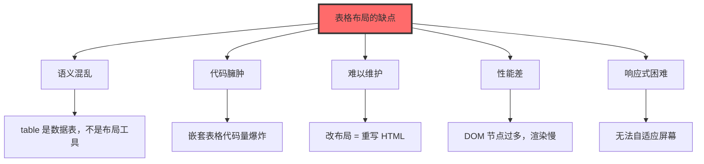

### 2.1.2 浮动布局时代（2004-2012）——用 float 创建列布局，clearfix 成为必备技能

2004 年左右，前端工程师们终于发现了一个"惊天秘密"：**float 属性可以拿来做布局**！

float 本来的设计目的是让文字环绕图片：

```css
/* float 的"本职工作" */
img.illustration {
  float: left;
  margin-right: 15px;
  margin-bottom: 10px;
}
```

但工程师们想："既然 float 能让元素飘到左边/右边，那我让两个 div 都飘左边，不就是两栏布局了吗？"

于是**浮动布局**诞生了。

**浮动布局基础：**

```html
<style>
  /* 清除浮动的影响 */
  .clearfix::after {
    content: "";
    display: table;
    clear: both;
  }

  .container {
    width: 960px;
    margin: 0 auto;
  }

  .sidebar {
    float: left;     /* 飘到左边 */
    width: 250px;
    background: #f0f0f0;
    padding: 20px;
  }

  .content {
    float: left;     /* 也飘到左边，这样就和 sidebar 并排了 */
    width: 710px;    /* 960 - 250 = 710，刚好填满 */
    padding: 20px;
  }

  .footer {
    clear: both;     /* 清除浮动，不然会飘上去 */
    background: #333;
    color: white;
    padding: 20px;
    text-align: center;
  }
</style>

<div class="container clearfix">
  <aside class="sidebar">
    <h3>侧边栏</h3>
    <ul>
      <li>导航项 1</li>
      <li>导航项 2</li>
      <li>导航项 3</li>
    </ul>
  </aside>

  <main class="content">
    <h1>主内容区</h1>
    <p>这里是网页的主要内容...</p>
  </main>
</div>

<footer class="footer">
  <p>页脚内容</p>
</footer>
```

**两栏/三栏布局完整示例：**

```css
/* ========== 两栏布局 ========== */
.layout-two-col {
  max-width: 1200px;
  margin: 0 auto;
}

.layout-two-col .col-sidebar {
  float: left;
  width: 25%;
  padding: 20px;
  background: #f8f9fa;
  box-sizing: border-box;
}

.layout-two-col .col-main {
  float: right;
  width: 75%;
  padding: 20px;
  box-sizing: border-box;
}

.layout-two-col::after {
  content: "";
  display: table;
  clear: both;
}

/* ========== 三栏布局 ========== */
.layout-three-col {
  max-width: 1200px;
  margin: 0 auto;
}

.layout-three-col .col-left {
  float: left;
  width: 20%;
}

.layout-three-col .col-center {
  float: left;
  width: 60%;
}

.layout-three-col .col-right {
  float: right;
  width: 20%;
}

.layout-three-col .col-left,
.layout-three-col .col-center,
.layout-three-col .col-right {
  padding: 20px;
  box-sizing: border-box;
}

/* 通用清除浮动 */
.clearfix::after {
  content: "";
  display: table;
  clear: both;
}
```

**Clearfix 的演变史：**

```css
/* 原始版 clearfix（2004年） */
.clearfix {
  clear: both;
}

/* 改进版 clearfix（2006年）—— 解决父元素高度坍塌 */
.clearfix::after {
  content: "";
  display: block;
  clear: both;
}

/* 现代版 clearfix（2010年后）—— micro clearfix */
.clearfix::before,
.clearfix::after {
  content: "";
  display: table;
}

.clearfix::after {
  clear: both;
}

/* 还可以给需要浮动的元素加 overflow: hidden; 来触发 BFC */
.bfc-wrapper {
  overflow: hidden;  /* 触发块级格式化上下文，清除内部浮动 */
}
```

**浮动布局的痛点：**

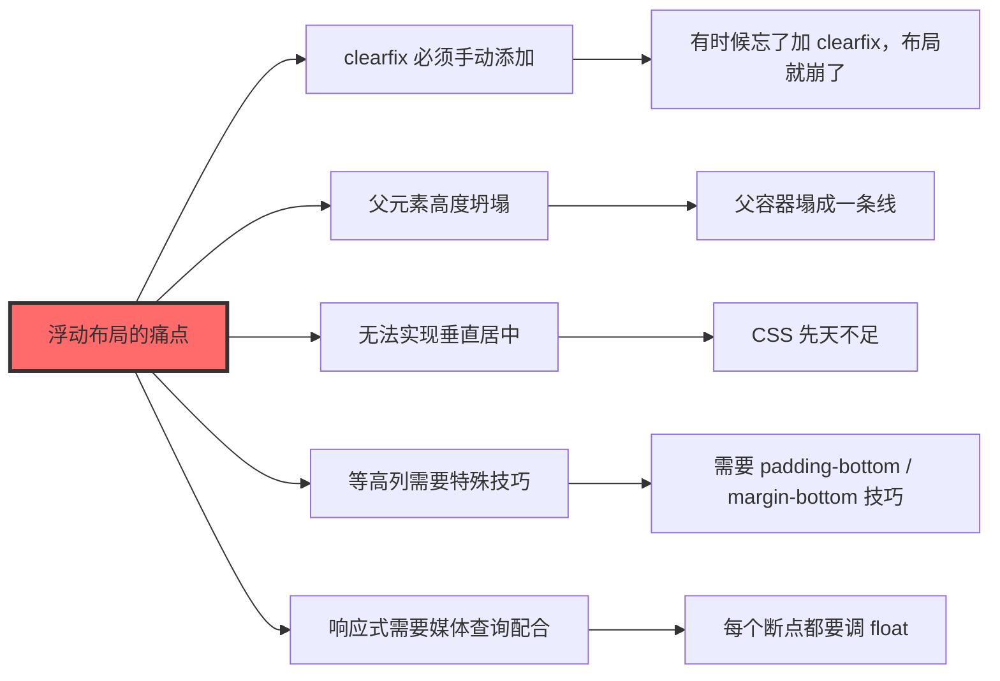

### 2.1.3 定位布局——用 position 精确控制位置，适合弹窗、遮罩，固定导航

**Position 定位**是 CSS 布局的"精确制导武器"。它不是用来做整体布局的，但它在特定场景下是无可替代的。

**position 的四个值：**

| 值 | 说明 | 常用场景 |
|------|------|----------|
| static | 默认值，正常文档流 | 一般元素 |
| relative | 相对于自身正常位置偏移 | 微调、作为 absolute 的参照 |
| absolute | 相对于最近的定位祖先偏移 | 弹窗、下拉菜单、浮动层 |
| fixed | 相对于视口固定 | 固定导航、回到顶部按钮 |

**各种定位的实战应用：**

```css
/* ========== 固定导航栏 ========== */
.navbar {
  position: fixed;  /* 相对于视口固定 */
  top: 0;
  left: 0;
  right: 0;
  height: 60px;
  background: rgba(255, 255, 255, 0.95);
  box-shadow: 0 2px 10px rgba(0, 0, 0, 0.1);
  z-index: 1000;  /* 确保在最上层 */
}

/* 占位，防止内容被固定导航遮挡 */
body {
  padding-top: 60px;
}

/* ========== 绝对定位：弹窗 ========== */
.modal-overlay {
  position: fixed;
  top: 0;
  left: 0;
  right: 0;
  bottom: 0;
  background: rgba(0, 0, 0, 0.5);  /* 半透明黑色遮罩 */
  display: flex;
  justify-content: center;
  align-items: center;
  z-index: 2000;
}

.modal-box {
  position: relative;  /* 相对于父元素定位 */
  background: white;
  padding: 30px;
  border-radius: 12px;
  box-shadow: 0 20px 60px rgba(0, 0, 0, 0.3);
  max-width: 500px;
  width: 90%;
}

.modal-close {
  position: absolute;
  top: 15px;
  right: 15px;
  width: 30px;
  height: 30px;
  border: none;
  background: #f0f0f0;
  border-radius: 50%;
  cursor: pointer;
  font-size: 18px;
}

/* ========== 相对定位：微调 ========== */
.icon-wrapper {
  position: relative;
  display: inline-block;
}

.badge {
  position: absolute;
  top: -5px;
  right: -5px;
  background: #ff4757;
  color: white;
  font-size: 12px;
  padding: 2px 6px;
  border-radius: 10px;
}

/* ========== 堆叠顺序（z-index） ========== */
.layer-1 {
  position: absolute;
  top: 10px;
  left: 10px;
  z-index: 1;
}

.layer-2 {
  position: absolute;
  top: 20px;
  left: 20px;
  z-index: 2;  /* 数值越大，越在上面 */
}

.layer-3 {
  position: absolute;
  top: 30px;
  left: 30px;
  z-index: 3;
}
```

```html
<!-- 弹窗完整示例 -->
<div class="modal-overlay">
  <div class="modal-box">
    <button class="modal-close">&times;</button>
    <h2>登录</h2>
    <form>
      <input type="text" placeholder="用户名">
      <input type="password" placeholder="密码">
      <button type="submit">登录</button>
    </form>
  </div>
</div>
```

**定位布局的黄金法则：**

> 💡 **记住**：定位是用来"精确控制个别元素位置"的，不是用来做整体页面布局的。如果你发现自己用了很多 absolute 来布局整个页面，那一定是打开方式不对。

### 2.1.4 Flexbox 时代（2009-2017）——2009 年首次草案，2012 年规范修订，2017 年浏览器全面支持

**Flexbox**（弹性盒布局）是 CSS 布局史上的一座里程碑。它解决了一维布局（水平或垂直方向）的所有痛点。

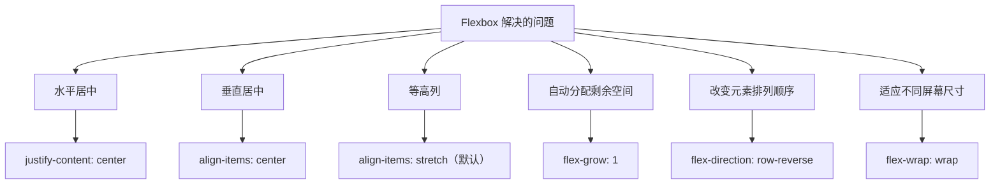

**Flexbox 核心概念：**

```css
/* Flex 容器和 Flex 项目 */
.flex-container {
  display: flex;  /* 开启 Flexbox */

  /* 主轴方向（默认从左到右） */
  flex-direction: row;         /* row | row-reverse | column | column-reverse */

  /* 是否换行（默认不换行） */
  flex-wrap: wrap;             /* nowrap | wrap | wrap-reverse */

  /* 主轴对齐方式 */
  justify-content: space-between;  /* flex-start | flex-end | center | space-between | space-around | space-evenly */

  /* 侧轴对齐方式 */
  align-items: center;             /* flex-start | flex-end | center | stretch | baseline */

  /* 多行内容对齐方式（换行后生效） */
  align-content: space-between;     /* flex-start | flex-end | center | space-between | space-around | stretch */
}

.flex-item {
  /* 项目放大比例（默认 0，不放大） */
  flex-grow: 1;

  /* 项目缩小比例（默认 1，可缩小） */
  flex-shrink: 0;

  /* 项目基准宽度 */
  flex-basis: auto;

  /* 简写：flex: grow shrink basis */
  flex: 1;        /* flex: 1 1 0% */
  flex: 0 0 200px; /* 固定宽度，不放大不缩小 */

  /* 单独设置对齐方式（覆盖容器 align-items） */
  align-self: flex-end;
}
```

**Flexbox 实战案例：**

```css
/* ========== 经典导航栏 ========== */
.navbar {
  display: flex;
  justify-content: space-between;
  align-items: center;
  padding: 0 30px;
  height: 70px;
  background: white;
  box-shadow: 0 2px 10px rgba(0, 0, 0, 0.1);
}

.logo {
  font-size: 24px;
  font-weight: bold;
  color: #3498db;
}

.nav-links {
  display: flex;
  gap: 30px;  /* 项目之间的间距 */
}

.nav-links a {
  text-decoration: none;
  color: #333;
  transition: color 0.2s;
}

.nav-links a:hover {
  color: #3498db;
}

/* ========== 卡片网格（自动换行） ========== */
.card-grid {
  display: flex;
  flex-wrap: wrap;
  gap: 20px;
  padding: 20px;
}

.card {
  flex: 1 1 300px;  /* 最小 300px，尽量填满，自动换行 */
  padding: 20px;
  background: white;
  border-radius: 8px;
  box-shadow: 0 2px 8px rgba(0, 0, 0, 0.1);
}

/* ========== 圣杯布局 ========== */
.holy-grail {
  display: flex;
  height: 100vh;
}

.holy-grail header {
  flex: 0 0 60px;  /* 不放大，不缩小，固定 60px */
}

.holy-grail .sidebar-left,
.holy-grail .sidebar-right {
  flex: 0 0 200px;
}

.holy-grail main {
  flex: 1;  /* 占据所有剩余空间 */
  overflow: auto;  /* 内容超出可滚动 */
}

.holy-grail footer {
  flex: 0 0 60px;
}
```

**Flexbox 居中问题终结者：**

```css
/* 水平居中 */
.center-horizontal {
  display: flex;
  justify-content: center;
}

/* 垂直居中 */
.center-vertical {
  display: flex;
  align-items: center;
}

/* 水平垂直居中 */
.center-both {
  display: flex;
  justify-content: center;
  align-items: center;
}

/* 如果只有一个项目，这是最简单的写法 */
.single-element {
  display: flex;
  justify-content: center;
  align-items: center;
  height: 100vh;
}
```

### 2.1.5 Grid 时代（2017-至今）——2017 年主流浏览器全面支持，二维布局变得简单

**CSS Grid**（网格布局）是 CSS 布局史上的另一座里程碑。如果说 Flexbox 是解决"一维布局"的利器，那 Grid 就是解决"二维布局"（同时控制行和列）的神器。

**Grid vs Flexbox：**

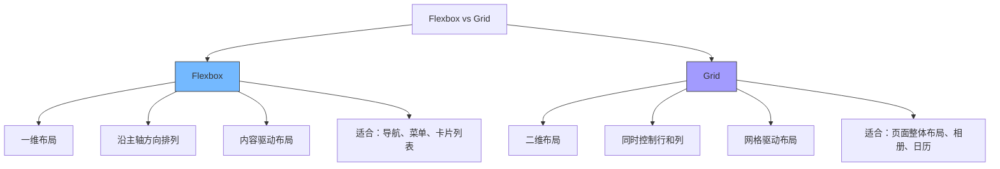

**Grid 基础语法：**

```css
/* 定义网格容器 */
.grid-container {
  display: grid;

  /* 定义列（3列，每列 1fr 等宽） */
  grid-template-columns: 1fr 1fr 1fr;

  /* 定义行（自动行高） */
  grid-template-rows: auto;

  /* 行列间距 */
  gap: 20px;

  /* 简写：repeat(次数, 值) */
  grid-template-columns: repeat(3, 1fr);

  /* 更有意思的写法 */
  grid-template-columns: 200px 1fr 200px;  /* 左右固定，中间自适应 */
  grid-template-columns: minmax(200px, 1fr) 1fr 1fr;  /* 最小200px，最大平分 */
}

/* grid-item 网格项目 */
.grid-item {
  /* 占据第1列到第3列（列的 1 号线到 4 号线） */
  grid-column: 1 / 3;

  /* 占据第2行到第4行 */
  grid-row: 2 / 4;

  /* 简写：grid-area */
  grid-area: 1 / 1 / 3 / 3;  /* row-start / col-start / row-end / col-end */
}
```

**Grid 实战案例：**

```css
/* ========== 页面整体布局 ========== */
.page-layout {
  display: grid;
  grid-template-columns: 250px 1fr;
  grid-template-rows: 70px 1fr 50px;
  grid-template-areas:
    "header  header"
    "sidebar main"
    "footer  footer";
  height: 100vh;
  gap: 0;
}

.page-layout header {
  grid-area: header;
  background: #3498db;
  color: white;
}

.page-layout .sidebar {
  grid-area: sidebar;
  background: #f8f9fa;
  padding: 20px;
}

.page-layout main {
  grid-area: main;
  padding: 20px;
  overflow-y: auto;  /* 内容区可滚动 */
}

.page-layout footer {
  grid-area: footer;
  background: #333;
  color: white;
}

/* ========== 响应式网格 ========== */
.auto-fit-grid {
  display: grid;
  grid-template-columns: repeat(auto-fit, minmax(280px, 1fr));
  gap: 20px;
  padding: 20px;
}

.auto-fit-grid .card {
  background: white;
  padding: 20px;
  border-radius: 8px;
  box-shadow: 0 2px 8px rgba(0, 0, 0, 0.1);
  /* 自动根据容器宽度计算列数，每个卡片最小280px */
}

/* ========== 经典 12 栏网格系统 ========== */
.row {
  display: grid;
  grid-template-columns: repeat(12, 1fr);
  gap: 20px;
}

.col-1 { grid-column: span 1; }
.col-2 { grid-column: span 2; }
.col-3 { grid-column: span 3; }
.col-4 { grid-column: span 4; }  /* 1/3 宽度 */
.col-6 { grid-column: span 6; }  /* 1/2 宽度 */
.col-8 { grid-column: span 8; }  /* 2/3 宽度 */
.col-12 { grid-column: span 12; } /* 100% 宽度 */

/* 响应式断点 */
@media (max-width: 768px) {
  .col-3, .col-4, .col-6, .col-8 {
    grid-column: span 12;  /* 手机上全部占满 */
  }
}
```

**Grid 布局的"骚操作"：**

```css
/* ========== 宫格照片墙 ========== */
/* 注意：这里的"瀑布流"效果实际上是多行多列网格，
   不是真正的 masonry 布局（masonry 需要 grid-template-rows: masonry，
   目前仅 Firefox 135+ 支持） */
.masonry-grid {
  display: grid;
  grid-template-columns: repeat(4, 1fr);
  grid-auto-rows: 200px;
  gap: 10px;
}

.masonry-grid .item:nth-child(1) { grid-row: span 2; }
.masonry-grid .item:nth-child(4) { grid-column: span 2; }
.masonry-grid .item:nth-child(6) { grid-row: span 2; }

/* ========== 表格效果的 Grid 实现 ========== */
.data-table {
  display: grid;
  grid-template-columns: 1fr 2fr 1fr 1fr;
}

.header-row {
  display: contents;  /* 不生成包裹元素，直接使用子元素 */
}

.header-row > * {
  background: #3498db;
  color: white;
  padding: 12px;
  font-weight: bold;
}

.data-row {
  display: contents;
}

.data-row > * {
  padding: 12px;
  border-bottom: 1px solid #eee;
}
```

### 2.1.6 响应式设计兴起（2010-至今）——2010 年 Responsive Web Design 概念提出，移动端适配成为标配

2010 年，**Ethan Marcotte** 在 A List Apart 杂志上发表了一篇文章，标题是"Responsive Web Design"。这篇文章彻底改变了前端开发的历史。

**响应式设计的核心理念：**

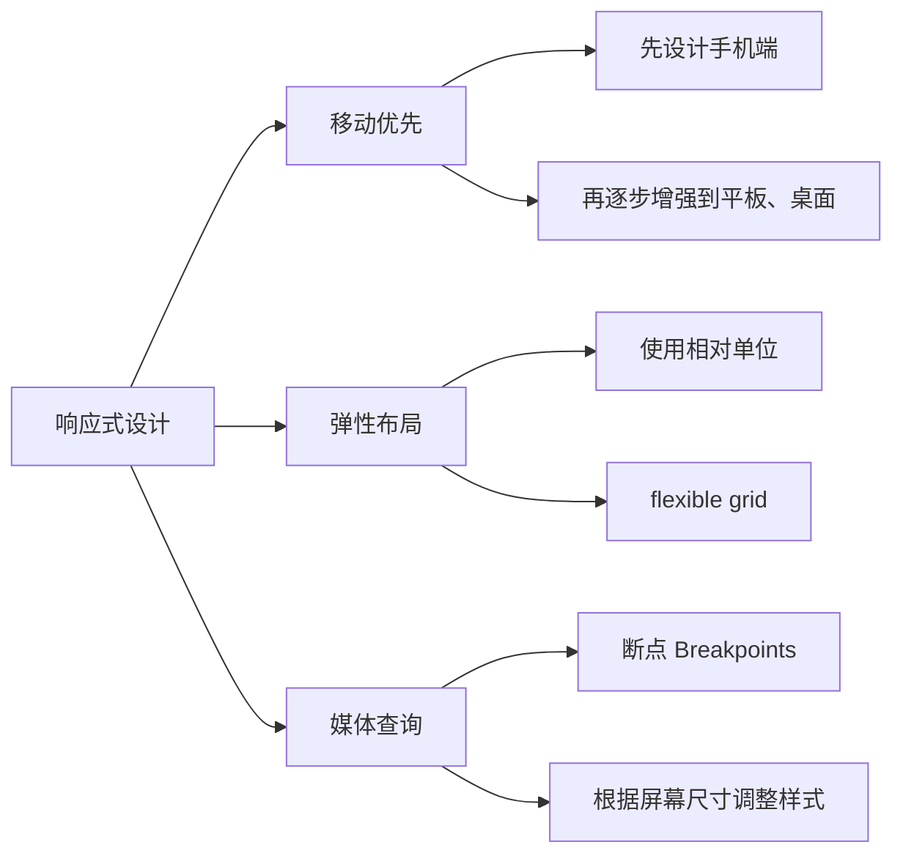

**媒体查询的三种使用方式：**

```css
/* 方式1：在 CSS 文件中使用 @media */
.container {
  width: 100%;
  padding: 15px;
}

@media (min-width: 768px) {
  .container {
    width: 750px;
    padding: 20px;
  }
}

@media (min-width: 1024px) {
  .container {
    width: 970px;
    padding: 30px;
  }
}

@media (min-width: 1200px) {
  .container {
    width: 1170px;
  }
}

/* 方式2：引入外部 CSS 文件 */
<link rel="stylesheet" media="screen and (max-width: 768px)" href="mobile.css">
<link rel="stylesheet" media="screen and (min-width: 769px)" href="desktop.css">

/* 方式3：在 link 标签中直接写媒体查询 */
<link rel="stylesheet" href="base.css">
<link rel="stylesheet" href="tablet.css" media="(min-width: 768px) and (max-width: 1024px)">
```

**响应式布局的常用断点：**

```css
/* 移动优先的断点设计 */

/* 小手机 */
@media (min-width: 375px) { /* iPhone SE */ }

/* 大手机 */
@media (min-width: 414px) { /* iPhone XR */ }

/* 平板竖屏 */
@media (min-width: 768px) { /* iPad */ }

/* 平板横屏 */
@media (min-width: 1024px) { /* iPad Pro */ }

/* 桌面显示器 */
@media (min-width: 1280px) { /* 笔记本 */ }

/* 大桌面 */
@media (min-width: 1536px) { /* 27寸显示器 */ }

/* 常用简写断点 */
@media (min-width: 640px) { /* 手机到平板 */ }
@media (min-width: 768px) { /* 平板 */ }
@media (min-width: 1024px) { /* 小桌面 */ }
@media (min-width: 1280px) { /* 大桌面 */ }
```

**响应式实战模板：**

```css
/* ========== 响应式页面模板 ========== */

/* 基础样式（移动端默认） */
.page {
  display: flex;
  flex-direction: column;
  min-height: 100vh;
}

.header {
  background: #333;
  color: white;
  padding: 15px;
  order: 1;  /* 移动端导航在上 */
}

.nav {
  display: none;  /* 移动端默认隐藏导航 */
}

.main {
  flex: 1;
  padding: 15px;
  order: 2;
}

.footer {
  background: #f5f5f5;
  padding: 15px;
  order: 3;
}

/* 平板及以上 */
@media (min-width: 768px) {
  .nav {
    display: flex;
    gap: 20px;
    padding: 15px;
    background: #444;
    order: 0;  /* 平板导航在最上 */
  }

  .nav a {
    color: white;
    text-decoration: none;
  }

  .main {
    padding: 30px;
  }
}

/* 桌面及以上 */
@media (min-width: 1024px) {
  .page {
    flex-direction: row;
    flex-wrap: wrap;
  }

  .header {
    width: 100%;
  }

  .nav {
    width: 250px;
    flex-direction: column;
    display: flex;
  }

  .main {
    flex: 1;
    order: 1;
  }

  .footer {
    width: 100%;
  }
}
```

## 2.2 CSS 工具链的演进

> 原生 CSS 的问题，就像一个没有调料包的泡面——能吃，但总觉得差点意思。CSS 预处理器和工具链的出现，就像是给泡面加了一整套豪华调料，瞬间让味道升华了。

### 2.2.1 原生 CSS 的局限性——没有变量、没有逻辑控制、代码重复多

在 CSS 预处理器出现之前，原生 CSS 的问题简直让人崩溃：

**问题一：没有变量**

```css
/* 想象你要修改主题色，发现要改 100 处 */
.button-primary {
  background-color: #3498db;  /* 第1处 */
  color: white;
}

.card-header {
  background-color: #3498db;  /* 第2处 */
}

.nav-link:hover {
  background-color: #3498db;  /* 第3处 */
}

.badge {
  background-color: #3498db;  /* 第4处 */
}

/* ...还有96处 */

.product-manager {
  color: #3498db;  /* 第100处，想死 */
}

/* 然后客户说：蓝色太丑，换成紫色 */
```

**问题二：没有逻辑控制**

```css
/* 你想实现： */
<!-- 如果是管理员，显示红色标签；如果是普通用户，显示蓝色标签 -->

/* CSS：对不起，我不会 if/else */

/* 只能这样： */
.admin .badge {
  background-color: #e74c3c;
}

.user .badge {
  background-color: #3498db;
}
```

**问题三：代码重复**

```css
/* 同样的样式要写 N 遍 */
.card {
  padding: 20px;
  border-radius: 8px;
  box-shadow: 0 2px 8px rgba(0, 0, 0, 0.1);
}

.modal {
  padding: 20px;  /* 重复代码开始 */
  border-radius: 8px;  /* 重复代码 */
  box-shadow: 0 2px 8px rgba(0, 0, 0, 0.1);  /* 重复代码结束 */
}

.popover {
  padding: 20px;  /* 又要写一遍 */
  border-radius: 8px;
  box-shadow: 0 2px 8px rgba(0, 0, 0, 0.1);
}

.tooltip {
  padding: 20px;  /* 崩溃边缘 */
  border-radius: 8px;
  box-shadow: 0 2px 8px rgba(0, 0, 0, 0.1);
}
```

**问题四：嵌套无法组织结构**

```css
/* 想把相关的样式放在一起，但 CSS 不支持嵌套 */
.nav {
  background: #333;
}

.nav .nav-item {
  display: inline-block;
}

.nav .nav-item .nav-link {
  color: white;
  text-decoration: none;
}

.nav .nav-item .nav-link:hover {
  color: #3498db;
}

/* 完全没有层级感，很难一眼看出结构 */
```

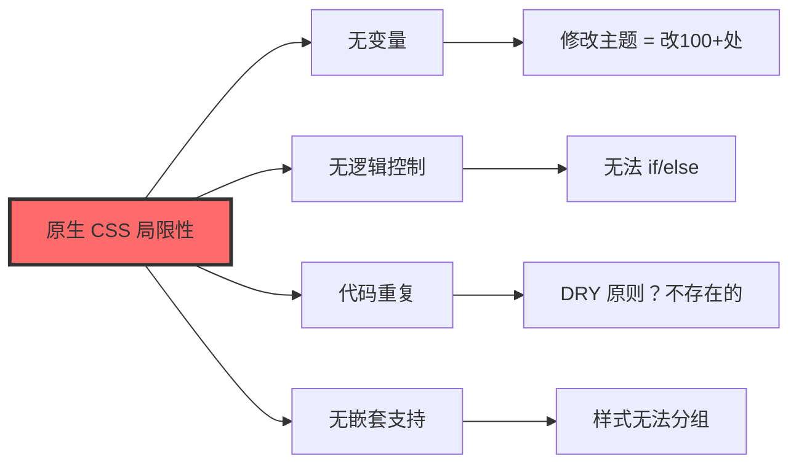

### 2.2.2 Sass（2006 年）——最初缩进语法，后改进为 SCSS，支持变量、嵌套、Mixin、继承

**Sass**（Syntactically Awesome Style Sheets）是 CSS 预处理器的"老大哥"，诞生于 2006 年，最初使用缩进语法（无大括号），后来因为太反人类，改成了 SCSS 语法（和 CSS 一样有大括号）。

**两种语法对比：**

```sass
/* Sass 语法（缩进风格，已经过时） */
.nav
  background: #333
  .nav-item
    display: inline-block
    .nav-link
      color: white
      &:hover
        color: #3498db

/* SCSS 语法（推荐，和 CSS 几乎一样） */
.nav {
  background: #333;

  .nav-item {
    display: inline-block;

    .nav-link {
      color: white;

      &:hover {
        color: #3498db;
      }
    }
  }
}
```

**Sass 核心功能：**

```scss
/* ========== 1. 变量 ========== */
$primary-color: #3498db;
$font-stack: "Helvetica Neue", sans-serif;
$spacing-unit: 20px;
$border-radius: 8px;

.button {
  background-color: $primary-color;
  font-family: $font-stack;
  padding: $spacing-unit;
  border-radius: $border-radius;
}

/* 修改变量，全局生效 */
$primary-color: #9b59b6;  /* 改成紫色 */

/* ========== 2. 嵌套 ========== */
.navbar {
  background: #333;
  padding: 15px 30px;

  .nav-list {
    list-style: none;
    display: flex;
    gap: 20px;
    margin: 0;
    padding: 0;

    .nav-item {
      position: relative;

      .nav-link {
        color: white;
        text-decoration: none;
        padding: 8px 12px;
        border-radius: 4px;
        transition: background 0.2s;

        &:hover {
          background: rgba(255, 255, 255, 0.1);
        }

        &.active {
          background: $primary-color;
        }
      }

      /* 嵌套中使用 & 引用父选择器 */
      &:first-child .nav-link {
        padding-left: 0;
      }
    }
  }
}

/* ========== 3. Mixin（可重用的样式块） ========== */
@mixin flex-center {
  display: flex;
  justify-content: center;
  align-items: center;
}

@mixin card($padding: 20px, $radius: 8px) {
  padding: $padding;
  border-radius: $radius;
  box-shadow: 0 2px 8px rgba(0, 0, 0, 0.1);
}

/* 使用 Mixin */
.modal {
  @include flex-center;
  position: fixed;
  inset: 0;
  background: rgba(0, 0, 0, 0.5);
}

.card {
  @include card(25px, 12px);  /* 传入参数 */
}

.simple-card {
  @include card();  /* 使用默认参数 */
}

/* ========== 4. 继承（@extend） ========== */
.message {
  padding: 15px 20px;
  border-radius: 6px;
  border: 1px solid;
}

.message-success {
  @extend .message;
  background: #d4edda;
  border-color: #c3e6cb;
  color: #155724;
}

.message-error {
  @extend .message;
  background: #f8d7da;
  border-color: #f5c6cb;
  color: #721c24;
}

.message-warning {
  @extend .message;
  background: #fff3cd;
  border-color: #ffeeba;
  color: #856404;
}

/* ========== 5. 运算 ========== */
$base-size: 16px;
$scale: 1.25;

h1 { font-size: $base-size * $scale * $scale * $scale; }  /* 31.25px */
h2 { font-size: $base-size * $scale * $scale; }           /* 25px */
h3 { font-size: $base-size * $scale; }                     /* 20px */
h4 { font-size: $base-size; }                              /* 16px */

/* ========== 6. 条件语句和循环 ========== */

/* 条件 */
@mixin button-style($type) {
  @if $type == primary {
    background: #3498db;
    color: white;
  } @else if $type == danger {
    background: #e74c3c;
    color: white;
  } @else if $type == outline {
    background: transparent;
    border: 2px solid #3498db;
    color: #3498db;
  } @else {
    background: #95a5a6;
    color: white;
  }
}

.btn {
  padding: 10px 20px;
  border-radius: 6px;
  cursor: pointer;

  &.btn-primary { @include button-style(primary); }
  &.btn-danger { @include button-style(danger); }
  &.btn-outline { @include button-style(outline); }
  &.btn-default { @include button-style(default); }
}

/* 循环 */
@for $i from 1 through 12 {
  .col-#{$i} {
    width: calc(100% / 12 * #{$i});
  }
}

/* each 遍历 */
$colors: (primary: #3498db, danger: #e74c3c, success: #2ecc71, warning: #f39c12);

@each $name, $color in $colors {
  .text-#{$name} {
    color: $color;
  }

  .bg-#{$name} {
    background-color: $color;
  }
}
```

**编译后的 CSS：**

```css
/* 编译后，上述 Sass 代码会变成标准的 CSS */
.navbar .nav-list .nav-item .nav-link {
  color: white;
  text-decoration: none;
  padding: 8px 12px;
  border-radius: 4px;
  transition: background 0.2s;
}

.col-1 { width: calc(100% / 12 * 1); }
.col-2 { width: calc(100% / 12 * 2); }
/* ... 一直到 col-12 */
```

### 2.2.3 Less（2009 年）——JavaScript 实现，Bootstrap 3 曾使用

**Less** 诞生于 2009 年，由 Alexis Sellier 开发。它和 Sass 非常像，但实现语言是 JavaScript（Node.js），所以在前端项目中集成更加方便。

**Less 语法示例：**

```less
/* ========== Less 变量 ========== */
@primary-color: #3498db;
@font-stack: "Helvetica Neue", sans-serif;
@spacing: 20px;

/* ========== Less 嵌套 ========== */
.navbar {
  background: #333;
  padding: 15px;

  .nav-list {
    list-style: none;
    display: flex;
    gap: 20px;

    .nav-item {
      .nav-link {
        color: white;
        text-decoration: none;

        &:hover {
          color: @primary-color;
        }
      }
    }
  }
}

/* ========== Less Mixin ========== */
.flex-center() {
  display: flex;
  justify-content: center;
  align-items: center;
}

.card() {
  padding: 20px;
  border-radius: 8px;
  box-shadow: 0 2px 8px rgba(0, 0, 0, 0.1);
}

/* 带参数的 Mixin */
.card-padding(@padding: 20px) {
  padding: @padding;
}

.modal-overlay {
  .flex-center();  /* 使用无参数的 Mixin */
  position: fixed;
  inset: 0;
  background: rgba(0, 0, 0, 0.5);
}

.card {
  .card-padding(25px);  /* 传入自定义参数 */
}

/* ========== Less 运算 ========== */
@base-size: 16px;

h1 { font-size: @base-size * 2; }   /* 32px */
h2 { font-size: @base-size * 1.5; } /* 24px */
h3 { font-size: @base-size * 1.25;} /* 20px */

/* ========== Less 继承 ========== */
.message {
  padding: 15px 20px;
  border-radius: 6px;
}

.success:extend(.message) {
  background: #d4edda;
  color: #155724;
}

.error:extend(.message) {
  background: #f8d7da;
  color: #721c24;
}
```

**Sass vs Less 对比：**

| 特性 | Sass | Less |
|------|------|------|
| 诞生时间 | 2006 | 2009 |
| 实现语言 | Ruby → Dart Sass | JavaScript |
| 语法 | SCSS（推荐）/ Sass | Less |
| 变量符号 | `$` | `@` |
| 循环 | @for, @each, @while | 只有 @for |
| 条件语句 | @if, @else | when（guard） |
| 混合语法 | @mixin / @include | .class() 或 #mixin() |
| 生态 | Compass, Bourbon | Bootstrap 3 |

> 💡 **历史趣闻**：Twitter Bootstrap 3（2013年发布）使用的是 Less，之后的 Bootstrap 4 切换成了 Sass。所以如果你在维护一个用 Less 的老项目，很可能是 Bootstrap 3 的项目。

### 2.2.4 Stylus（2010 年）——极简语法，可不写大括号和分号

**Stylus** 是 CSS 预处理器家族中的"极简主义者"，语法自由度极高，大括号、分号、冒号... 能省则省。

**Stylus 语法示例：**

```stylus
/* ========== Stylus 变量 ========== */
primary-color = #3498db
font-stack = "Helvetica Neue", Arial, sans-serif
spacing = 20px

/* ========== Stylus 嵌套 ========== */
.navbar
  background: #333
  padding: 15px 30px

  .nav-list
    display: flex
    list-style: none
    gap: 20px

    .nav-item
      .nav-link
        color: white
        text-decoration: none

        &:hover
          color: primary-color

/* ========== 无大括号写法 ========== */
.button
  padding spacing
  border-radius 8px
  background primary-color
  color white
  cursor pointer

  &:hover
    background darken(primary-color, 10%)  /* 内置函数：颜色变暗 */

/* ========== Stylus 混入（Mixin） ========== */
flex-center()
  display flex
  justify-content center
  align-items center

card(padding = 20px, radius = 8px)
  padding padding
  border-radius radius
  box-shadow 0 2px 8px rgba(0, 0, 0, 0.1)

.modal
  flex-center()
  position fixed
  inset 0
  background rgba(0, 0, 0, 0.5)

.content-card
  card(25px, 12px)
```

**三种语法风格对比：**

```stylus
/* 传统 CSS 风格 */
.nav { background: #333; }
.nav .nav-item { display: inline-block; }

/* 大括号 + 分号风格（Stylus 也支持） */
.nav { background: #333; .nav-item { display: inline-block; } }

/* 纯 Stylus 风格（无大括号无分号） */
.nav
  background: #333
  .nav-item
    display: inline-block
```

### 2.2.5 PostCSS（2015 年）——插件化工具链，autoprefixer 是最成功的应用

**PostCSS** 不是传统意义上的预处理器，它是一个"CSS 的 JavaScript 编译器"。你可以把它理解成一个插件平台，通过不同的插件实现不同的功能。

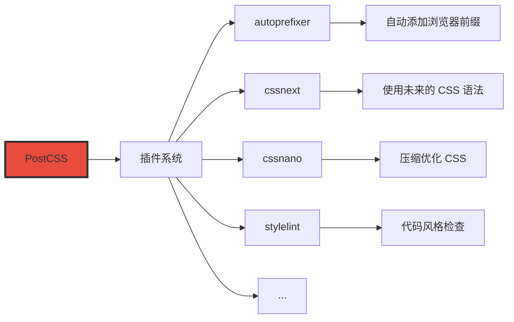

**PostCSS 工作流程：**

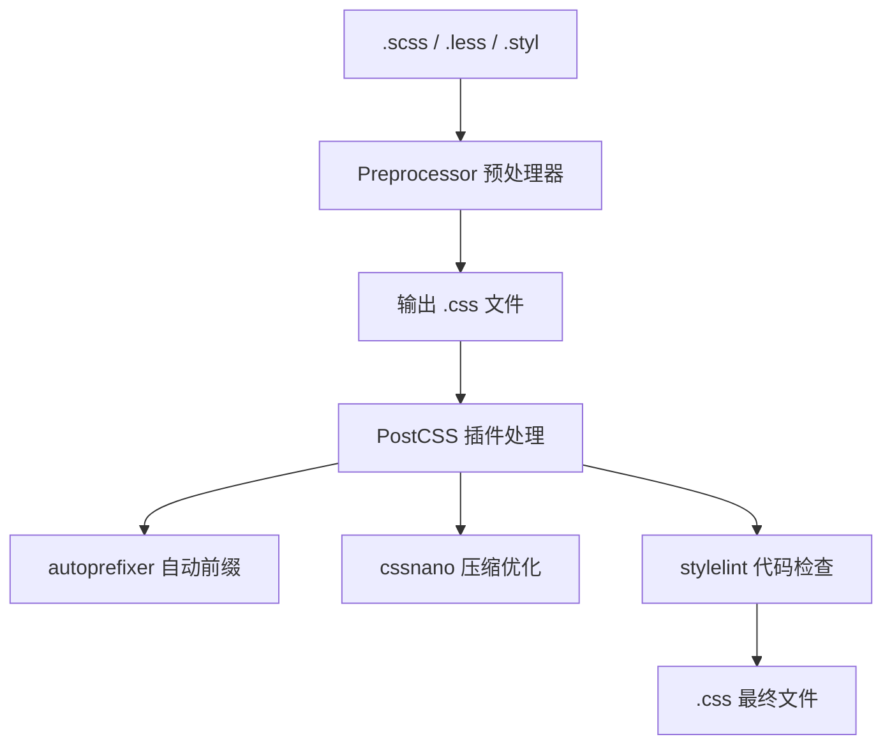

**PostCSS 常用配置（Webpack / Vite）：**

```javascript
// postcss.config.js
module.exports = {
  plugins: [
    // 1. autoprefixer：自动添加浏览器前缀
    require('autoprefixer')({
      /* 
         browsers 参数指定需要兼容的浏览器范围
         "> 1%"：全球使用率 > 1% 的浏览器
         "last 2 versions"：每个浏览器的最近两个版本
         "not ie <= 8"：不包括 IE8 及以下
      */
      overrideBrowserslist: [
        '> 1%',
        'last 2 versions',
        'not ie <= 8',
        'not op_mini all'
      ]
    }),

    // 2. cssnano：压缩优化 CSS
    require('cssnano')({
      preset: 'default',  // 或 'advanced'（更激进优化）
    }),

    // 3. postcss-preset-env：使用未来的 CSS 语法
    require('postcss-preset-env')({
      stage: 2,  // 支持程度：0-4，2 是比较安全的
    }),
  ]
}
```

**PostCSS 插件示例：**

```css
/* 源代码 */
.container {
  display: flex;
  justify-content: center;
  align-items: center;
  user-select: none;
  column-count: 3;
}

/* 经过 autoprefixer 处理后 */
.container {
  display: -webkit-box;
  display: -ms-flexbox;
  display: flex;
  -webkit-box-pack: center;
  -ms-flex-pack: center;
  justify-content: center;
  -webkit-box-align: center;
  -ms-flex-align: center;
  align-items: center;
  -webkit-user-select: none;
  -moz-user-select: none;
  user-select: none;
  -webkit-column-count: 3;
  -moz-column-count: 3;
  column-count: 3;
}
```

**其他实用 PostCSS 插件：**

| 插件名称 | 功能 |
|----------|------|
| postcss-preset-env | 支持最新的 CSS 语法（变量、嵌套等） |
| postcss-normalize | 类似 normalize.css |
| postcss-flexbugs-fixes | 修复 Flexbox 的已知 bug |
| postcss-sorting | CSS 属性排序 |
| postcss-comment | 保留注释 |
| stylelint | 代码风格检查 |

### 2.2.6 CSS-in-JS（2014 年后）——样式写入 JavaScript，代表作 styled-components

**CSS-in-JS** 是一种将 CSS 样式直接写在 JavaScript 文件中的技术，最早在 React 生态中流行起来。代表作有 styled-components、emotion 等。

**styled-components 语法示例：**

```javascript
// Button.js
import React from 'react';
import styled from 'styled-components';

// 创建带样式的组件
const ButtonWrapper = styled.button`
  /* 这里写 CSS，但是可以用 JS 变量 */
  background-color: ${props => props.primary ? '#3498db' : '#95a5a6'};
  color: white;
  padding: 10px 20px;
  border: none;
  border-radius: 6px;
  font-size: 16px;
  cursor: pointer;
  transition: all 0.2s ease;

  /* 嵌套写法 */
  &:hover {
    background-color: ${props => props.primary ? '#2980b9' : '#7f8c8d'};
    transform: translateY(-2px);
  }

  &:active {
    transform: translateY(0);
  }

  /* 根据 props 条件应用样式 */
  ${props => props.large && `
    padding: 15px 30px;
    font-size: 18px;
  `}
`;

// 使用
function Button({ children, primary, large, onClick }) {
  return (
    <ButtonWrapper primary={primary} large={large} onClick={onClick}>
      {children}
    </ButtonWrapper>
  );
}

export default Button;
```

**其他 CSS-in-JS 方案：**

| 库名称 | 特点 |
|--------|------|
| styled-components | 最流行，模板字符串语法 |
| emotion | 性能更好，支持 CSS prop |
| JSS | 老牌方案，JSON 风格 |
| linaria | 零运行时，编译时生成 CSS |

> 💡 **CSS-in-JS 的争议**：虽然 CSS-in-JS 在 React 生态中很流行，但它也有一些争议，比如：
> - 额外的运行时开销
> - 无法利用浏览器的 CSS 原生优化
> - 对 SSR（服务端渲染）不友好
> - 小众框架生态不完善
>
> 所以选择需谨慎，React 项目可以优先考虑。

### 2.2.7 Tailwind CSS（2017 年）——原子化 CSS，所有样式都是工具类

**Tailwind CSS** 是 CSS 框架界的"颠覆者"。它不走传统 CSS 框架"组件化"的老路，而是采用"原子化 CSS"（Utility-First）的全新理念。

**传统 CSS 框架 vs Tailwind：**

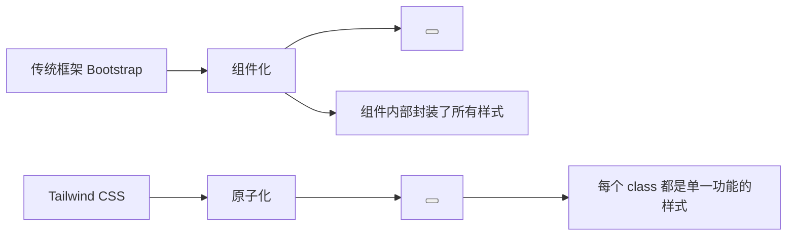

**Tailwind 示例：**

```html
<!-- 传统 CSS 框架 -->
<button class="btn btn-primary">点击我</button>

<!-- Tailwind CSS -->
<button class="bg-blue-500 hover:bg-blue-600 text-white px-4 py-2 rounded-lg transition-colors">
  点击我
</button>
```

**Tailwind 常用工具类：**

```html
<!-- 布局 -->
<div class="flex justify-between items-center p-4 m-4">
  <!-- flex | justify-between | items-center | p-4 | m-4 -->

  <!-- 间距：p- = padding，m- = margin -->
  <!-- 4 表示 1rem (16px * 0.25 = 4px) -->

  <!-- flexbox -->
  <div class="flex flex-col gap-4">
    <!-- flex-col | gap-4（子元素间距） -->
  </div>

  <!-- grid -->
  <div class="grid grid-cols-3 gap-4">
    <!-- grid-cols-3 | gap-4 -->
  </div>
</div>

<!-- 文字样式 -->
<p class="text-xl font-bold text-gray-800 leading-relaxed">
  <!-- text-xl | font-bold | text-gray-800 | leading-relaxed -->
</p>

<!-- 颜色和背景 -->
<div class="bg-red-500 text-white border-2 border-blue-300">
  <!-- bg-red-500 | text-white | border-2 | border-blue-300 -->
</div>

<!-- 响应式 -->
<div class="w-full md:w-1/2 lg:w-1/3">
  <!-- w-full（默认手机）| md:w-1/2（平板）| lg:w-1/3（桌面） -->
</div>

<!-- 状态变体 -->
<button class="bg-blue-500 hover:bg-blue-600 focus:ring-4 active:scale-95">
  <!-- hover: | focus: | active: -->
</button>
```

**Tailwind 配置文件（tailwind.config.js）：**

```javascript
// tailwind.config.js
module.exports = {
  content: ['./src/**/*.{html,js}'],  // 扫描哪些文件

  theme: {
    extend: {
      // 自定义颜色
      colors: {
        brand: {
          light: '#6ee7b7',
          DEFAULT: '#34d399',
          dark: '#059669',
        },
      },

      // 自定义间距
      spacing: {
        '128': '32rem',
        '144': '36rem',
      },

      // 自定义字体
      fontFamily: {
        sans: ['Inter', 'system-ui', 'sans-serif'],
        mono: ['Fira Code', 'monospace'],
      },

      // 自定义断点
      screens: {
        'sm': '640px',
        'md': '768px',
        'lg': '1024px',
        'xl': '1280px',
      },
    },
  },

  plugins: [
    // 插件系统
    require('@tailwindcss/forms'),   // 表单样式插件
    require('@tailwindcss/typography'), // 文章内容排版
    require('@tailwindcss/line-clamp'),  // 文字截断
  ],
}
```

**Tailwind CSS vs 传统框架对比：**

| 维度 | Bootstrap | Tailwind |
|------|-----------|----------|
| 设计理念 | 组件化 | 原子化 |
| CSS 体积 | 整个框架，不管用不用都加载 | Tree-shaking 后极小 |
| 学习曲线 | 低（记住组件名就行） | 高（记住工具类名） |
| 定制性 | 通过变量覆盖 | 直接写工具类 |
| 代码可读性 | 高（语义清晰） | 低（长 class 名） |
| 适合场景 | 快速原型 | 定制化设计系统 |

## 2.3 CSS 框架的演进

> CSS 框架的出现，就像给不会做饭的人送来了预制菜。方便是方便，但每个人做出来都是一个味道。CSS 框架的演进史，也是一部"方便"与"个性"之间的博弈史。

### 2.3.1 960 Grid System（2008 年）——12 栏网格系统

**960 Grid System** 是 CSS 网格系统的"先驱"，诞生于 2008 年。它解决了一个核心问题：**设计师们需要一个统一的网格系统来对齐设计稿**。

**960px 的由来：**

| 屏幕宽度 | 960px 的考虑 |
|----------|--------------|
| 1024 × 768 | 当时的主流显示器分辨率 |
| 1024 - 浏览器边框 - 滚动条 ≈ 960px | 实际可用宽度 |
| 960 = 12 × 80 | 12 栏，每栏 80px |
| 960 = 16 × 60 | 也支持 16 栏网格 |

**960 Grid System 使用方法：**

```css
/* 960 Grid System 核心代码 */
.container-12 {
  width: 960px;
  margin: 0 auto;
}

.grid_1 { width: 80px; }
.grid_2 { width: 160px; }
.grid_3 { width: 240px; }
.grid_4 { width: 320px; }  /* 4/12 = 1/3 */
.grid_5 { width: 400px; }
.grid_6 { width: 480px; }  /* 6/12 = 1/2 */
.grid_7 { width: 560px; }
.grid_8 { width: 640px; }  /* 8/12 = 2/3 */
.grid_9 { width: 720px; }
.grid_10 { width: 800px; }
.grid_11 { width: 880px; }
.grid_12 { width: 960px; } /* 12/12 = 100% */

/* 列之间的间距（gutter） */
.grid_1,
.grid_2,
.grid_3,
.grid_4,
.grid_5,
.grid_6,
.grid_7,
.grid_8,
.grid_9,
.grid_10,
.grid_11,
.grid_12 {
  margin-left: 10px;
  margin-right: 10px;
  float: left;
  display: inline;  /* 解决 IE 双边距 bug */
}

/* 清除浮动 */
.container-12:after {
  content: "";
  display: table;
  clear: both;
}
```

**使用示例：**

```html
<div class="container-12">
  <!-- 头部占满 12 列 -->
  <header class="grid_12">
    <h1>网站标题</h1>
  </header>

  <!-- 侧边栏占 4 列，内容区占 8 列 -->
  <aside class="grid_4">
    <nav>
      <ul>
        <li><a href="#">导航项 1</a></li>
        <li><a href="#">导航项 2</a></li>
        <li><a href="#">导航项 3</a></li>
      </ul>
    </nav>
  </aside>

  <main class="grid_8">
    <article>
      <h2>文章标题</h2>
      <p>文章正文内容...</p>
    </article>
  </main>

  <!-- 页脚占满 12 列 -->
  <footer class="grid_12">
    <p>&copy; 2010 版权所有</p>
  </footer>
</div>
```

**960 Grid 的历史贡献：**

```mermaid
graph TD
    A["960 Grid System"] --> B["普及了网格布局理念"]
    A --> C["统一了设计师和开发者的度量单位"]
    A --> D["催生了 Bootstrap 等更完善的框架"]
    A --> E["为响应式设计奠定了基础"]

    B --> B1["网格不是 CSS 原生概念，但设计师需要"]
    C --> C1[""这个间距是几个格子？"有标准答案了"]
    D --> D1["Bootstrap 的 12 栏网格直接继承自此"]
    E --> E1["后来的框架都支持响应式网格"]
```

> 💡 **历史意义**：960 Grid System 虽然已经过时，但它普及了"12 栏网格"的概念，这个概念至今仍被 Bootstrap 等框架使用。可以说，没有 960 Grid，就没有后来的 Bootstrap。

### 2.3.2 Blueprint CSS（2007 年）——早期 CSS 框架

**Blueprint CSS** 诞生于 2007 年，是最早的一批综合 CSS 框架之一。它提供了完整的 CSS 重置、网格系统、排版和表单样式。

**Blueprint CSS 核心功能：**

```css
/* Blueprint CSS 核心文件结构 */
/* 1. reset.css - 重置浏览器默认样式 */
html {
  margin: 0;
  padding: 0;
}

body {
  font-size: 13px;  /* Blueprint 默认字号 */
  line-height: 1.6;
}

/* 2. grid.css - 网格系统 */
.container {
  width: 950px;
  margin: 0 auto;
}

.span-1 { width: 30px; }
.span-2 { width: 70px; }
.span-3 { width: 110px; }
/* ... 继续到 span-24 */

/* 3. typography.css - 排版 */
h1 { font-size: 24px; }
h2 { font-size: 18px; }
h3 { font-size: 14px; }

/* 4. forms.css - 表单样式 */
input.text {
  padding: 5px;
  border: 1px solid #ccc;
}
```

**Blueprint 的特点：**

| 特点 | 说明 |
|------|------|
| 网格宽度 | 950px（比 960 Grid 少 10px） |
| 列数 | 24 列（比 960 Grid 更细） |
| 列间距 | 10px |
| 默认字体 | 13px |
| 颜色 | Blueprint 蓝（#6699CC） |

**Blueprint 的使用方式：**

```html
<!-- Blueprint CSS 引入 -->
<link rel="stylesheet" href="blueprint/screen.css" type="text/css" media="screen, projection">
<link rel="stylesheet" href="blueprint/print.css" type="text/css" media="print">

<div class="container">
  <div class="span-16">
    <!-- 左侧内容 -->
  </div>
  <div class="span-8 append-1">
    <!-- 右侧边栏 -->
  </div>
</div>
```

> 💡 **历史地位**：Blueprint 和 960 Grid 并称"CSS 框架双雄"，但两者都比较简单，没有提供 JavaScript 组件。随着 Bootstrap 的崛起，这两个框架都逐渐退出了历史舞台。

### 2.3.3 Twitter Bootstrap（2011 年）——栅格+组件库+jQuery，统治前端框架时代多年

**Bootstrap** 是 CSS 框架史上最具影响力的作品，没有之一。它由 Twitter 的 Mark Otto 和 Jacob Thornton 开发，2011 年开源发布。

**Bootstrap 的核心优势：**

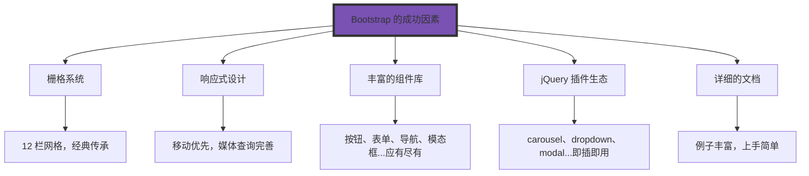

**Bootstrap 栅格系统详解：**

```html
<!-- Bootstrap 栅格系统使用 -->
<div class="container">
  <!-- 行 -->
  <div class="row">
    <!-- 列 - xs（手机）sm（平板）md（桌面）lg（大桌面） -->
    <div class="col-xs-12 col-md-8">
      <!-- 手机全宽，平板/桌面 8/12 宽度 -->
    </div>
    <div class="col-xs-12 col-md-4">
      <!-- 手机全宽，平板/桌面 4/12 宽度 -->
    </div>
  </div>

  <!-- 另一个例子：自动等宽列 -->
  <div class="row">
    <div class="col">
      <!-- 自动平分 -->
    </div>
    <div class="col">
      <!-- 自动平分 -->
    </div>
    <div class="col">
      <!-- 自动平分 -->
    </div>
  </div>
</div>
```

```css
/* Bootstrap 栅格系统核心 */
/* container */
.container {
  width: 100%;
  padding-right: 15px;
  padding-left: 15px;
  margin-right: auto;
  margin-left: auto;
}

@media (min-width: 576px) { .container { max-width: 540px; } }
@media (min-width: 768px) { .container { max-width: 720px; } }
@media (min-width: 992px) { .container { max-width: 960px; } }
@media (min-width: 1200px) { .container { max-width: 1140px; } }

/* row */
.row {
  display: -ms-flexbox;
  display: flex;
  -ms-flex-wrap: wrap;
  flex-wrap: wrap;
  margin-right: -15px;
  margin-left: -15px;
}

/* col */
.col {
  -ms-flex-preferred-size: 0;
  flex-basis: 0;
  -ms-flex-positive: 1;
  flex-grow: 1;
  max-width: 100%;
  padding-right: 15px;
  padding-left: 15px;
}

/* 具体列宽 */
.col-md-8 { -ms-flex: 0 0 66.666667%; flex: 0 0 66.666667%; max-width: 66.666667%; }
.col-md-4 { -ms-flex: 0 0 33.333333%; flex: 0 0 33.333333%; max-width: 33.333333%; }
.col-md-6 { -ms-flex: 0 0 50%; flex: 0 0 50%; max-width: 50%; }
```

**Bootstrap 常用组件示例：**

```html
<!-- 按钮 -->
<button class="btn btn-primary">主要按钮</button>
<button class="btn btn-secondary">次要按钮</button>
<button class="btn btn-outline-success">成功</button>
<button class="btn btn-danger btn-lg">危险（大）</button>

<!-- 卡片 -->
<div class="card">
  <div class="card-header">卡片头部</div>
  <div class="card-body">
    <h5 class="card-title">卡片标题</h5>
    <p class="card-text">卡片内容...</p>
    <a href="#" class="btn btn-primary">了解更多</a>
  </div>
</div>

<!-- 模态框 -->
<button type="button" class="btn btn-primary" data-toggle="modal" data-target="#myModal">
  打开模态框
</button>

<div class="modal fade" id="myModal">
  <div class="modal-dialog">
    <div class="modal-content">
      <div class="modal-header">
        <h5 class="modal-title">模态框标题</h5>
        <button type="button" class="close" data-dismiss="modal">&times;</button>
      </div>
      <div class="modal-body">
        模态框内容
      </div>
      <div class="modal-footer">
        <button type="button" class="btn btn-secondary" data-dismiss="modal">关闭</button>
        <button type="button" class="btn btn-primary">保存</button>
      </div>
    </div>
  </div>
</div>

<!-- 表单 -->
<form>
  <div class="form-group">
    <label for="email">邮箱地址</label>
    <input type="email" class="form-control" id="email" placeholder="请输入邮箱">
  </div>
  <div class="form-group">
    <label for="password">密码</label>
    <input type="password" class="form-control" id="password" placeholder="请输入密码">
  </div>
  <div class="form-check">
    <input type="checkbox" class="form-check-input" id="remember">
    <label class="form-check-label" for="remember">记住我</label>
  </div>
  <button type="submit" class="btn btn-primary">提交</button>
</form>
```

**Bootstrap 版本演进：**

| 版本 | 发布时间 | 主要变化 |
|------|----------|----------|
| Bootstrap 2 | 2012 | 响应式布局支持 |
| Bootstrap 3 | 2014 | 移动优先、Flat UI、LESS |
| Bootstrap 4 | 2015-2019 | Flexbox、 Sass、Python 改写、jQuery 移除（v5） |
| Bootstrap 5 | 2021 | 移除 jQuery、改进 API、RTL 支持 |

> 💡 **Bootstrap 的历史地位**：Bootstrap 不仅仅是一个 CSS 框架，它更重要的是**普及了响应式设计理念**。在 Bootstrap 出现之前，很多网站根本不考虑移动端；在 Bootstrap 出现之后，"你的网站支持移动端吗"成了标配问题。

### 2.3.4 Bulma（2016 年）——纯 CSS 框架，基于 Flexbox

**Bulma** 诞生于 2016 年，是一个相对较晚的 CSS 框架。它最大的特点是**纯 CSS 实现，不依赖 JavaScript**，并且全面拥抱 Flexbox。

**Bulma 核心特点：**

```css
/* Bulma 基于 Flexbox 的栅格系统 */
.columns {
  display: flex;
  flex-wrap: wrap;
}

.column {
  display: block;
  flex-basis: 0;
  flex-grow: 1;
  flex-shrink: 1;
  padding: 0.75rem;
}

/* 列大小 */
.columns.is-mobile > .column.is-1 { flex: none; width: 8.33333337%; }
.columns.is-mobile > .column.is-2 { flex: none; width: 16.66666667%; }
.columns.is-mobile > .column.is-3 { flex: none; width: 25%; }
.columns.is-mobile > .column.is-4 { flex: none; width: 33.33333333%; }
.columns.is-mobile > .column.is-5 { flex: none; width: 41.66666667%; }
.columns.is-mobile > .column.is-6 { flex: none; width: 50%; }
/* ... 继续到 is-12 */
```

**Bulma 使用示例：**

```html
<!-- Bulma 引入（只需要一个 CSS 文件） -->
<link rel="stylesheet" href="https://cdn.jsdelivr.net/npm/bulma@0.9.4/css/bulma.min.css">

<!-- 导航栏 -->
<nav class="navbar is-primary" role="navigation">
  <div class="navbar-brand">
    <a class="navbar-item" href="#">
      
    </a>
  </div>
  <div class="navbar-menu">
    <div class="navbar-start">
      <a class="navbar-item" href="#">首页</a>
      <a class="navbar-item" href="#">产品</a>
      <a class="navbar-item" href="#">关于</a>
    </div>
    <div class="navbar-end">
      <div class="navbar-item">
        <div class="buttons">
          <a class="button is-primary">注册</a>
          <a class="button is-light">登录</a>
        </div>
      </div>
    </div>
  </div>
</nav>

<!-- Hero 区域 -->
<section class="hero is-medium is-primary">
  <div class="hero-body">
    <div class="container has-text-centered">
      <h1 class="title is-1">欢迎来到我的网站</h1>
      <h2 class="subtitle">这是一个基于 Bulma 的页面</h2>
    </div>
  </div>
</section>

<!-- 卡片网格 -->
<div class="container">
  <div class="columns">
    <div class="column">
      <div class="card">
        <div class="card-image">
          <figure class="image is-4by3">
            
          </figure>
        </div>
        <div class="card-content">
          <div class="media">
            <div class="media-content">
              <p class="title is-4">卡片标题</p>
            </div>
          </div>
          <div class="content">
            卡片内容描述...
          </div>
        </div>
      </div>
    </div>
    <div class="column">
      <div class="card">
        <!-- 第二个卡片 -->
      </div>
    </div>
    <div class="column">
      <div class="card">
        <!-- 第三个卡片 -->
      </div>
    </div>
  </div>
</div>

<!-- 表单 -->
<div class="field">
  <label class="label">姓名</label>
  <div class="control">
    <input class="input" type="text" placeholder="请输入姓名">
  </div>
</div>

<div class="field">
  <label class="label">邮箱</label>
  <div class="control">
    <input class="input" type="email" placeholder="请输入邮箱">
  </div>
</div>

<div class="field">
  <div class="control">
    <button class="button is-link">提交</button>
  </div>
</div>
```

**Bulma vs Bootstrap：**

| 维度 | Bootstrap | Bulma |
|------|-----------|-------|
| JS 依赖 | 有（需要 jQuery） | 无（纯 CSS） |
| CSS 方案 | Less → Sass | Sass |
| 默认布局 | float | Flexbox |
| 默认主题 | Bootstrap 蓝 | Bulma 蓝（偏紫） |
| 学习曲线 | 中等 | 较低 |
| 组件完整性 | 非常完整 | 相对简洁 |
| 响应式 | 支持 | 支持 |

### 2.3.5 Tailwind CSS（2017 年后）——Utility-First 理念

Tailwind CSS 在上一节的工具链部分已经介绍过，这里重点讨论它作为**框架**的特性。

**Tailwind 的框架优势：**

```css
/* Tailwind CSS 的 utility-first 理念 */

/* 传统 CSS 框架写法 */
<button class="btn btn-primary">按钮</button>

/* Tailwind CSS 写法 */
<button class="bg-blue-500 hover:bg-blue-700 text-white font-bold py-2 px-4 rounded">
  按钮
</button>

/* 看起来很长，但优点是： */
/* 1. 不需要记忆组件类名 */
/* 2. 可以精确控制每个样式 */
/* 3. 没有"这个组件样式被污染了"的问题 */

/* Tailwind 帮你提取可复用组件 */
const Button = styled.button`
  ${tw`bg-blue-500 hover:bg-blue-700 text-white font-bold py-2 px-4 rounded`}
`;
/* 或者使用 @apply */
.btn-primary {
  @apply bg-blue-500 text-white font-bold py-2 px-4 rounded;
}
```

**Tailwind 响应式示例：**

```html
<!-- 响应式布局 -->
<div class="flex flex-col md:flex-row gap-4">
  <!-- 手机：垂直排列 -->
  <!-- 平板/桌面：水平排列 -->

  <div class="w-full md:w-1/3">
    <!-- 手机：全宽 -->
    <!-- 桌面：1/3 宽 -->
  </div>

  <div class="w-full md:w-2/3">
    <!-- 手机：全宽 -->
    <!-- 桌面：2/3 宽 -->
  </div>
</div>
```

**CSS 框架进化史图：**

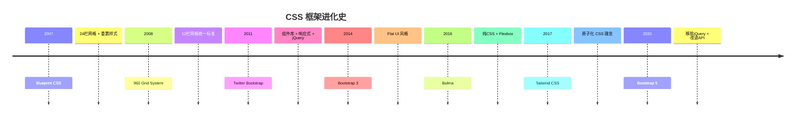

## 2.4 CSS 新特性的历史

> CSS 的进化就像手机升级：从功能机（只能打电话、发短信）到智能机（什么都能干）。CSS 新特性的出现，让 CSS 从"能看"变成了"能打"。

### 2.4.1 CSS 变量（2017 年）——原生变量支持，JavaScript 可动态读写

**CSS 变量**（也叫 CSS 自定义属性）是 CSS 诞生以来最重要的新特性之一。它终于让 CSS 有了"变量"的概念。

**CSS 变量的基础语法：**

```css
/* 定义变量 */
/* 变量名以 -- 开头 */
:root {
  --primary-color: #3498db;
  --secondary-color: #2ecc71;
  --danger-color: #e74c3c;
  --font-stack: "Helvetica Neue", sans-serif;
  --spacing-unit: 20px;
  --border-radius: 8px;
  --box-shadow: 0 2px 8px rgba(0, 0, 0, 0.1);
}

/* 使用变量 */
/* var() 函数读取变量 */
.button {
  background-color: var(--primary-color);
  color: white;
  font-family: var(--font-stack);
  padding: var(--spacing-unit);
  border-radius: var(--border-radius);
  box-shadow: var(--box-shadow);
  border: none;
  cursor: pointer;
  transition: transform 0.2s ease, box-shadow 0.2s ease;
}

.button:hover {
  transform: translateY(-2px);
  box-shadow: 0 4px 12px rgba(0, 0, 0, 0.15);
}

.button:active {
  transform: translateY(0);
}
```

**CSS 变量的高级用法：**

```css
/* 变量默认值 */
.alert {
  /* 如果 --alert-color 变量不存在，使用红色 */
  background-color: var(--alert-color, #ff4444);
  color: var(--alert-text-color, white);
}

/* 变量组合使用 */
:root {
  --hue: 200;
  --saturation: 100%;
  --lightness: 50%;
}

.color-primary {
  /* 使用 calc() 计算 hsl 颜色 */
  background-color: hsl(var(--hue), var(--saturation), var(--lightness));
}

.color-secondary {
  /* 改变色相，创造配对色 */
  background-color: hsl(calc(var(--hue) + 180), var(--saturation), var(--lightness));
}

/* 响应式主题切换 */
@media (prefers-color-scheme: dark) {
  :root {
    --bg-color: #1a1a1a;
    --text-color: #ffffff;
    --border-color: #333333;
  }
}

/* 组件级别的变量覆盖 */
.card {
  --card-bg: white;
  --card-text: #333;
  --card-padding: 20px;

  background-color: var(--card-bg);
  color: var(--card-text);
  padding: var(--card-padding);
}

.card.inverted {
  /* 子组件可以覆盖父组件的变量 */
  --card-bg: #333;
  --card-text: white;
}
```

**JavaScript 操作 CSS 变量：**

```javascript
// 获取变量值
const styles = getComputedStyle(document.documentElement);
const primaryColor = styles.getPropertyValue('--primary-color').trim();
console.log(primaryColor); // #3498db

// 设置变量值
document.documentElement.style.setProperty('--primary-color', '#e74c3c');

// 动态主题切换
function setTheme(themeName) {
  const themes = {
    blue: { '--primary-color': '#3498db', '--secondary-color': '#2ecc71' },
    purple: { '--primary-color': '#9b59b6', '--secondary-color': '#e74c3c' },
    dark: {
      '--bg-color': '#1a1a1a',
      '--text-color': '#ffffff',
      '--card-bg': '#2d2d2d'
    }
  };

  const theme = themes[themeName];
  Object.entries(theme).forEach(([key, value]) => {
    document.documentElement.style.setProperty(key, value);
  });
}

// 实时颜色选择器
document.querySelector('.color-picker').addEventListener('input', (e) => {
  document.documentElement.style.setProperty('--primary-color', e.target.value);
});
```

**CSS 变量的应用场景：**

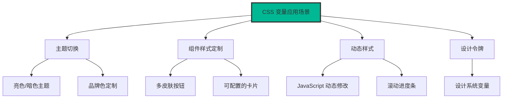

### 2.4.2 CSS 嵌套（2023 年）——原生嵌套语法，无需预处理器

**CSS 嵌套**是 CSS 诞生以来语法层面最重要的改进。2023 年，所有主流浏览器都支持了 CSS 原生嵌套，这意味着 Sass/Less 的嵌套功能不再是独有的了。

**CSS 嵌套基础语法：**

```css
/* 基本嵌套 */
.card {
  background: white;
  border-radius: 8px;
  box-shadow: 0 2px 8px rgba(0, 0, 0, 0.1);

  /* & 代表父选择器 */
  &:hover {
    box-shadow: 0 4px 16px rgba(0, 0, 0, 0.15);
  }

  /* 嵌套选择器 */
  .card-header {
    padding: 15px 20px;
    border-bottom: 1px solid #eee;

    h3 {
      margin: 0;
      font-size: 18px;
    }
  }

  /* 嵌套伪类 */
  &:first-child {
    border-top-left-radius: 8px;
    border-top-right-radius: 8px;
  }

  &:last-child {
    border-bottom-left-radius: 8px;
    border-bottom-right-radius: 8px;
  }
}
```

**编译后的 CSS（浏览器原生支持，不需要编译）：**

```css
.card { background: white; border-radius: 8px; box-shadow: 0 2px 8px rgba(0, 0, 0, 0.1); }
.card:hover { box-shadow: 0 4px 16px rgba(0, 0, 0, 0.15); }
.card .card-header { padding: 15px 20px; border-bottom: 1px solid #eee; }
.card .card-header h3 { margin: 0; font-size: 18px; }
.card:first-child { border-top-left-radius: 8px; border-top-right-radius: 8px; }
.card:last-child { border-bottom-left-radius: 8px; border-bottom-right-radius: 8px; }
```

**CSS 嵌套的高级用法：**

```css
/* 无父选择器的嵌套（浏览器自动添加父选择器） */
.card {
  color: #333;

  padding: 20px;  /* 直接写属性，浏览器理解为 .card { padding: 20px; } */
  font-size: 16px;
}

/* 条件嵌套 @when */
@when supports(display: grid) {
  .grid-layout {
    display: grid;
    grid-template-columns: repeat(3, 1fr);
    gap: 20px;
  }
}

/* @else 条件 */
@when supports(display: grid) {
  .layout { display: grid; }
} @else {
  .layout {
    display: flex;
    flex-wrap: wrap;
  }
}

/* 媒体查询嵌套 */
.sidebar {
  width: 250px;
  background: #f5f5f5;

  @media (max-width: 768px) {
    width: 100%;

    &:hover {
      background: #eee;
    }
  }
}

/* 嵌套中的选择器组合 */
.nav {
  .item {
    /* &.active 等于 .nav .item.active */
    &.active {
      background: var(--primary-color);
    }

    /* 父选择器 + 新选择器 */
    & + .item {
      border-top: 1px solid #ddd;
    }

    /* 逗号分隔的多个选择器 */
    &:hover,
    &:focus {
      outline: 2px solid var(--primary-color);
    }
  }
}
```

**Sass 嵌套 vs CSS 原生嵌套对比：**

```scss
/* Sass 写法（需要预处理器） */
.nav {
  .item {
    &.active { /* 嵌套 */ }

    @media (max-width: 768px) { /* 嵌套媒体查询 */ }

    @if $condition { /* if 语句 */ }
  }
}

/* CSS 原生写法（2023年后，浏览器原生支持） */
.nav {
  .item {
    &.active { /* 嵌套 */ }

    /* 注意：CSS 原生不支持 @if/@else 等逻辑嵌套 */
  }
}
```

> 💡 **重要提醒**：CSS 原生嵌套不支持 `@if`/`@else`/`@for` 等逻辑语句，这些仍然是 Sass/Less 的专属功能。如果你需要这些逻辑控制，还是需要预处理器。但对于纯视觉层面的嵌套，CSS 原生已经完全够用了。

### 2.4.3 @layer 层叠规则（2022 年）——显式控制层叠顺序

**@layer** 是 CSS 层叠规则的一次重大升级。它让你可以显式地控制不同样式块的优先级顺序。

**@layer 的基础用法：**

```css
/* 定义层叠层级 */
/* 越后面定义的层，优先级越高（除非使用 !important） */
@layer reset, base, components, utilities;

/* @layer reset 重置样式 */
@layer reset {
  * {
    margin: 0;
    padding: 0;
    box-sizing: border-box;
  }
}

/* @layer base 基础样式 */
@layer base {
  body {
    font-family: system-ui, sans-serif;
    line-height: 1.5;
  }

  h1 { font-size: 2em; }
  h2 { font-size: 1.5em; }
}

/* @layer components 组件样式 */
@layer components {
  .button {
    display: inline-flex;
    align-items: center;
    padding: 10px 20px;
    border-radius: 6px;
    border: none;
    cursor: pointer;
  }

  .card {
    background: white;
    border-radius: 8px;
    box-shadow: 0 2px 8px rgba(0, 0, 0, 0.1);
  }
}

/* @layer utilities 工具类（最高优先级） */
@layer utilities {
  .text-center { text-align: center; }
  .mt-4 { margin-top: 1rem; }
  .hidden { display: none; }
}
```

**@layer 的优先级规则：**

```css
/* 同一层内，后定义的样式覆盖先定义的 */
@layer components {
  .button {
    background: blue;
  }

  .button {
    background: red;  /* 覆盖上面的蓝色 */
  }
}

/* 不同层之间，排在后面的层优先级更高 */
@layer components {
  .button {
    background: blue;  /* 普通声明，会被后面的 utilities 层覆盖 */
  }
}

@layer utilities {
  .bg-red {
    background: red;  /* utilities 层在后面，所以这个样式会生效 */
  }
}
```

**@layer 的实际应用：**

```css
/* 应用场景：第三方库样式和自定义样式的冲突 */

/* 引入第三方库（通常是第一个 layer） */
@layer normalize, bootstrap, custom;

/* 第三方库样式 */
@layer bootstrap {
  .btn {
    padding: 10px 20px;
    border-radius: 4px;
  }
}

/* 自定义样式（可以覆盖第三方库的样式） */
@layer custom {
  .btn {
    padding: 15px 30px;  /* 覆盖 bootstrap 的 padding */
    border-radius: 8px;  /* 覆盖 bootstrap 的 border-radius */
  }
}
```

### 2.4.4 容器查询（2019 年后）——组件级响应式，基于组件自身尺寸

**容器查询**（Container Queries）是 CSS 响应式设计的下一代解决方案。传统的 `@media` 是基于**视口**尺寸来响应，而容器查询是基于**组件自身容器**的尺寸来响应。

**容器查询解决了什么问题？**

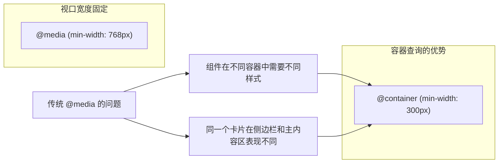

**容器查询的使用方法：**

```css
/* 1. 定义容器（必须先定义容器） */
.card-container {
  container-type: inline-size;
  container-name: card;  /* 可选，给容器起个名字 */
}

/* 2. 使用容器查询 */
.card {
  display: flex;
  flex-direction: column;
}

.card-image {
  width: 100%;
  height: 200px;
  object-fit: cover;
}

.card-content {
  padding: 15px;
}

/* 容器宽度 >= 300px 时的样式 */
@container card (min-width: 300px) {
  .card {
    flex-direction: row;
  }

  .card-image {
    width: 40%;
    height: auto;
  }

  .card-content {
    width: 60%;
    padding: 20px;
  }
}

/* 容器宽度 >= 500px 时的样式 */
@container card (min-width: 500px) {
  .card-image {
    width: 50%;
  }

  .card-content {
    padding: 30px;
  }
}
```

**容器查询 vs 媒体查询对比：**

| 维度 | 媒体查询 @media | 容器查询 @container |
|------|-----------------|---------------------|
| 参照物 | 视口（viewport） | 组件的父容器 |
| 适用场景 | 页面整体布局 | 可复用组件 |
| 组件独立性 | 低（依赖页面宽度） | 高（组件自己决定样式） |
| 响应式粒度 | 页面级别 | 组件级别 |

### 2.4.5 :has() 选择器（2021 年）——"父选择器"

**`:has()`** 是 CSS 选择器史上最强选择器，没有之一。它是历史上第一个真正的"父选择器"，可以选中包含特定子元素的父元素。

**`:has()` 的基础用法：**

```css
/* 选中包含 .card 子元素的 .container */
.container:has(.card) {
  background: #f5f5f5;
}

/* 选中包含 h1 的 article */
article:has(h1) {
  border-left: 4px solid #3498db;
  padding-left: 20px;
}

/* 选中包含 img 的 figure */
figure:has(img) {
  margin: 0;
}

/* 选中不包含特定子元素的元素 */
.card:not(:has(.badge)) {
  padding-bottom: 20px;
}
```

**`:has()` 的高级应用：**

```css
/* 选中有错误提示的表单组 */
.form-group:has(.error-message) {
  border-color: #e74c3c;
}

.form-group:has(.error-message) .label {
  color: #e74c3c;
}

/* 选中包含勾选图标的列表项 */
.list-item:has(.check-icon) {
  color: green;
}

/* 选中有图标的按钮 */
.button:has(.icon) {
  display: inline-flex;
  align-items: center;
  gap: 8px;
}

/* 选中所有兄弟项都隐藏的行 */
.table-row:has(.cell:only-child) {
  opacity: 0.5;
}

/* 复杂组合 */
.card:has(.featured-image):has(.badge) {
  border: 2px solid gold;
}
```

**`:has()` 的实际应用场景：**

```html
<!-- 场景1：表单验证 -->
<style>
  .input-group:has(input:invalid) {
    border-color: red;
  }

  .input-group:has(input:focus) {
    border-color: blue;
  }

  .input-group:has(input:disabled) {
    opacity: 0.5;
  }
</style>

<div class="input-group">
  <label>邮箱</label>
  <input type="email" required>
</div>

<!-- 场景2：响应式导航 -->
<style>
  .nav:has(.mobile-menu-toggle) {
    /* 有移动端菜单按钮时的样式 */
  }

  .nav:has(.mobile-menu-toggle[aria-expanded="true"]) .mobile-menu {
    display: flex;
  }
</style>

<!-- 场景3：购物车数量显示 -->
<style>
  .cart-icon:has(.cart-count) {
    position: relative;
  }

  .cart-count:empty {
    display: none;
  }
</style>
```

### 2.4.6 滚动驱动动画（2024 年）——CSS 原生滚动同步动画

**滚动驱动动画**（Scroll-driven Animations）是 CSS 2024 年的重磅新特性。它让你不需要 JavaScript，就能实现滚动同步的动画效果。

**scroll-timeline 基础用法：**

```css
/* 定义滚动时间线 */
@keyframes fade-in {
  from { opacity: 0; transform: translateY(20px); }
  to { opacity: 1; transform: translateY(0); }
}

.scroll-animate {
  animation: fade-in linear;
  animation-timeline: scroll();  /* 绑定到滚动条 */
  animation-range: entry 0% cover 20%;  /* 动画范围 */
}

/* scroll() 也可以指定滚动容器 */
/* 注意：scroll(element) 需要元素有 container-type 属性，
   或者使用 scroll(nearest) 绑定到最近祖先滚动容器 */
.scroll-animate {
  animation-timeline: scroll(nearest);  /* 绑定到最近祖先的滚动条 */
}
```

**滚动驱动动画的实际应用：**

```css
/* 1. 滚动时显示进度条 */
@keyframes progress-bar {
  from { transform: scaleX(0); }
  to { transform: scaleX(1); }
}

.progress-bar {
  position: fixed;
  top: 0;
  left: 0;
  width: 100%;
  height: 4px;
  background: #3498db;
  transform-origin: left;
  animation: progress-bar linear;
  animation-timeline: scroll(root);  /* 根元素的滚动条 */
}

/* 2. 滚动时让元素进入视图 */
@keyframes slide-in {
  from {
    opacity: 0;
    transform: translateY(50px);
  }
  to {
    opacity: 1;
    transform: translateY(0);
  }
}

.reveal-on-scroll {
  animation: slide-in linear both;
  animation-timeline: view();
  animation-range: entry 0% entry 100%;  /* 元素完全进入视口时动画结束 */
}

/* 3. 视差效果 */
.parallax-bg {
  position: fixed;
  inset: 0;
  z-index: -1;
  animation: parallax-move linear;
  animation-timeline: scroll(root);
}

@keyframes parallax-move {
  from { transform: translateY(0); }
  to { transform: translateY(50vh); }
}

/* 4. 滚动时改变颜色 */
.theme-scroll {
  animation: color-change linear;
  animation-timeline: scroll();
}

@keyframes color-change {
  0% { background: #ffffff; }
  50% { background: #f0f0f0; }
  100% { background: #1a1a1a; }
}
```

### 2.4.7 @property——为 CSS 变量注册类型，支持动画

**`@property`** 让你可以给 CSS 自定义属性（变量）注册类型，使得它们可以被动画化。

**@property 基础用法：**

```css
/* 定义可动画的自定义属性 */
@property --gradient-angle {
  syntax: '<angle>';        /* 值类型 */
  initial-value: 0deg;      /* 初始值 */
  inherits: false;          /* 是否继承 */
}

@property --gradient-pos {
  syntax: '<percentage>';  /* 值类型 */
  initial-value: 0%;        /* 初始值 */
  inherits: false;          /* 是否继承 */
}

.animated-gradient {
  background: linear-gradient(
    var(--gradient-angle),
    #ff6b6b,
    #feca57,
    #48dbfb,
    #ff6b6b
  );

  animation: rotate-gradient 3s linear infinite;
}

@keyframes rotate-gradient {
  to {
    --gradient-angle: 360deg;  /* 动画！ */
  }
}
```

**@property vs 普通 CSS 变量的区别：**

```css
/* 普通变量，无法动画 */
:root {
  --progress: 0;
}

.animated {
  /* 尝试动画 --progress，但不会生效 */
  animation: grow 2s ease forwards;
}

@keyframes grow {
  to {
    --progress: 100%;  /* 不会平滑过渡 */
  }
}

/* @property 注册的变量，可以动画 */
@property --progress {
  syntax: '<percentage>';
  initial-value: 0%;
  inherits: false;
}

.animated {
  animation: grow 2s ease forwards;
}

@keyframes grow {
  to {
    --progress: 100%;  /* 平滑过渡！ */
  }
}

/* 应用 */
.progress-bar {
  width: var(--progress);
  height: 10px;
  background: linear-gradient(90deg, #3498db, #2ecc71);
}
```

### 2.4.8 color-mix()——CSS 颜色混合

**`color-mix()`** 函数让你可以在 CSS 中直接混合两种颜色，无需预处理器或 JavaScript。

**color-mix() 基础用法：**

```css
/* 混合两种颜色 */
/* in lch 表示在 LCH 色彩空间混合（更自然） */
.mixed-red-blue {
  background-color: color-mix(in lch, #ff0000 30%, #0000ff 70%);
  /* 30% 红色 + 70% 蓝色 = 紫色 */
}

/* 使用 alpha 通道 */
.transparent-blue {
  background-color: color-mix(in srgb, #007bff 50%, transparent);
  /* 50% 蓝色 + 50% 透明 */
}

/* 主题色应用 */
.button {
  background: #3498db;
}

.button:hover {
  background: color-mix(in srgb, #3498db 85%, black 15%);
  /* 悬停时颜色变深 */
}

.button:active {
  background: color-mix(in srgb, #3498db 80%, white 20%);
  /* 点击时颜色变浅 */
}

/* 自动化主题生成 */
:root {
  --base-color: #6366f1;
}

.theme-1 {
  --base-color: #6366f1;
}

.theme-2 {
  --base-color: #ec4899;
}

.card {
  background: var(--base-color);
}

.card-light {
  background: color-mix(in srgb, var(--base-color) 20%, white 80%);
}

.card-dark {
  background: color-mix(in srgb, var(--base-color) 20%, black 80%);
}
```

### 2.4.9 oklch / lch 色彩空间——更直观地调整颜色

**oklch** 和 **lch** 是新一代的色彩空间表示法，比传统的 rgb、hsl 更符合人类直觉。

**为什么需要 oklch？**

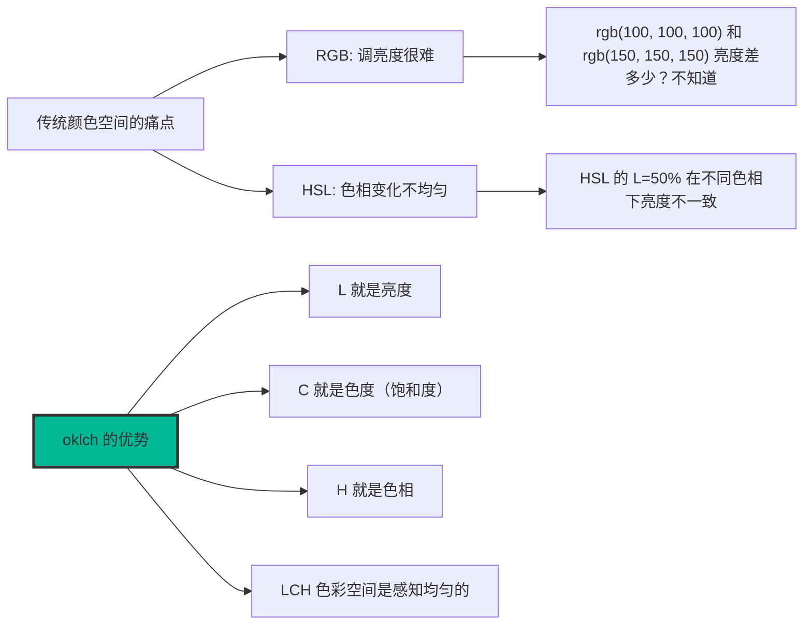

**oklch / lch 基础用法：**

```css
/* oklch 颜色表示法 */
/* oklch(L C H / A) */
/* L: 亮度（0-1 或 0%-100%） */
/* C: 色度（类似饱和度） */
/* H: 色相（0-360） */
/* A: alpha 透明度（可选） */

.color-primary {
  background-color: oklch(50% 0.15 240);
  /* 50% 亮度，15% 色度，240 度色相（蓝色） */
}

.color-success {
  background-color: oklch(65% 0.2 145);
  /* 65% 亮度，20% 色度，145 度色相（绿色） */
}

/* 颜色变亮/变暗的正确方式 */
/* 改变 L 值，而不是用 opacity */
.color-light {
  background-color: oklch(70% 0.15 240);  /* 更亮的蓝色 */
}

.color-dark {
  background-color: oklch(30% 0.15 240);  /* 更暗的蓝色 */
}

/* 使用 calc() 微调颜色 */
.color-dynamic {
  background-color: oklch(calc(50% + 10%) 0.15 240);
}

/* lch 颜色表示法（和 oklch 类似，但色彩空间不同） */
.color-lch {
  background-color: lch(50% 80 240);
}
```

## 2.5 浏览器兼容性的历史

> 如果你是一个有 10 年以上经验的前端工程师，听到"IE6 兼容"这几个字，可能会下意识地打个寒颤。IE6 时代的浏览器兼容性，简直就是前端工程师的噩梦。

### 2.5.1 黑暗时代——IE6/IE7 bug 众多，需要各种 hack

在 2000 年代，Internet Explorer 6（IE6）是浏览器市场的绝对霸主，市场占有率一度超过 90%。但 IE6 的 CSS 支持充满了各种 bug 和非标准行为，前端工程师们为此发明了各种"Hack"技巧。

**IE6 的经典 bug：**

```css
/* ========== 1. 双外边距 bug ========== */
/* IE6 会把 float 元素的左/右外边距加倍 */
.sidebar {
  float: left;
  margin-left: 100px;  /* IE6 中实际渲染为 200px！ */
}

/* 解决方案：添加 display: inline; */
.sidebar {
  float: left;
  margin-left: 100px;
  display: inline;  /* 修复双外边距 bug，不影响其他浏览器 */
}

/* ========== 2. 3 像素文本偏移 bug ========== */
/* 当 float 元素挨着另一个元素时，文本会被偏移 3px */
.float-left {
  float: left;
  width: 200px;
}

.content {
  /* IE6 中，这段文字会被向左推 3px */
}

/* 解决方案：给 content 也加上 float 或者设置负 margin */
.content {
  margin-left: -3px;  /* IE6 hack */
}

/* ========== 3. 重复字符 bug ========== */
/* 当 float 元素有重复的字符时，IE6 会多显示一个字符 */
<div class="float-element">test_string</div>
/* IE6 可能显示：test_stringt */

/* ========== 4. 消失的浮动元素 ========== */
/* 有时候 IE6 会让 float 元素完全消失 */
```

**IE6 Hack 大全：**

```css
/* ========== IE6 专属 hack ========== */

/* 下划线 hack（IE6 及以下） */
.element {
  width: 200px;
  _width: 180px;  /* 只有 IE6 认识下划线前缀 */
}

/* 星号 hack（IE6/IE7） */
.element {
  width: 200px;
  *width: 180px;  /* 只有 IE6/IE7 认识星号前缀 */
}

/* html 前缀 hack（IE6） */
html > body .element {
  width: 200px;  /* 正常浏览器 */
}

html #element {
  width: 180px;  /* 只有 IE6 认识 html# 前缀 */
}

/* !important hack */
.element {
  width: 200px !important;  /* 正常浏览器 */
  width: 180px;              /* IE6 忽略 !important */
}

/* ========== IE7 专属 hack ========== */

/* + 号 hack（IE7 及以下） */
.element {
  width: 200px;
  +width: 180px;  /* 只有 IE7 认识 + 号前缀 */
}

/* ========== 选择器 hack ========== */

/* Star HTML Hack（IE6） */
* html .element { /* ... */ }

/* Star Plus Hack（IE7） */
* html .element { /* IE6 */ }
*:first-child+html .element { /* IE7 */ }

/* ========== 条件注释 ========== */
/* 微软官方推荐的 IE 兼容方法 */

<!--[if IE 6]>
  <link rel="stylesheet" href="ie6.css">
<![endif]-->

<!--[if lte IE 6]>
  <p class="browser-warning">你的浏览器太旧了，请升级！</p>
<![endif]-->

<!--[if IE 7]>
  <link rel="stylesheet" href="ie7.css">
<![endif]-->

<!--[if !IE]><!-->
  <link rel="stylesheet" href="modern.css">
<!--<![endif]-->
```

**常见 IE bug 及其解决方案表：**

| Bug 名称 | 表现 | 解决方案 |
|----------|------|----------|
| 双外边距 | float 元素的左右 margin 加倍 | `display: inline;` |
| 3px 文本偏移 | 文字被向左推 3px | `margin-left: -3px;` |
| hasLayout 问题 | 元素不显示或显示异常 | `zoom: 1;` 或 `overflow: hidden;` |
| PNG 透明 | PNG 透明区域显示灰色 | 使用 IE PNG Fix 脚本 |
| 最小高度 | `min-height` 不支持 | `height: auto; _height: 300px;` |
| 盒子模型 | 没有 `box-sizing` | 使用条件注释加载补丁 |

**hasLayout 问题的解决方案：**

```css
/* hasLayout 是 IE 的一个特殊概念 */
/* 很多 IE bug 都是因为元素没有 hasLayout */

/* 触发 hasLayout 的方法 */
.trigger-haslayout {
  /* 方法1：zoom（最常用） */
  zoom: 1;

  /* 方法2：overflow */
  overflow: hidden;  /* 或 auto */

  /* 方法3：width/height */
  width: 100%;  /* 或任何非 auto 的值 */

  /* 方法4：position */
  position: relative;
}

/* clearfix 在 IE 中的写法 */
.clearfix {
  *zoom: 1;  /* 触发 hasLayout */
}

.clearfix:after {
  content: "";
  display: table;
  clear: both;
}
```

### 2.5.2 浏览器前缀时代——-webkit-、-moz-、-ms-、-o-

在现代浏览器标准统一之前，各个浏览器厂商会实验性地实现一些 CSS 新特性，但还没有成为标准。为了不与正式标准冲突，这些实验性特性需要加**浏览器前缀**。

**浏览器前缀列表：**

| 前缀 | 浏览器 | 时代 |
|------|--------|------|
| `-webkit-` | Chrome、Safari、Opera（新版）、Edge | 至今仍广泛使用 |
| `-moz-` | Firefox | 至今仍广泛使用 |
| `-ms-` | Internet Explorer、Edge（旧版） | Edge 已转向 webkit |
| `-o-` | Opera（旧版） | Opera 已转向 webkit |

**需要加前缀的 CSS 属性（历史示例）：**

```css
/* Flexbox 需要加一堆前缀 */
.flex-container {
  display: -webkit-box;      /* Chrome 4-20, Safari 3.1-6 */
  display: -moz-box;         /* Firefox 2-21 */
  display: -ms-flexbox;       /* IE 10 */
  display: -webkit-flex;      /* Chrome 21-28, Safari 7-8 */
  display: flex;              /* 现代浏览器（标准语法） */
}

.flex-item {
  -webkit-box-flex: 1;        /* Chrome 4-20 */
  -moz-box-flex: 1;          /* Firefox 2-21 */
  -ms-flex: 1;               /* IE 10 */
  -webkit-flex: 1;           /* Chrome 21-28 */
  flex: 1;                     /* 现代浏览器 */
}

/* 渐变需要加一堆前缀 */
.gradient {
  background: -webkit-linear-gradient(left, red, blue);  /* Chrome 26-, Safari 7- */
  background: -moz-linear-gradient(left, red, blue);      /* Firefox 3.6-15 */
  background: -ms-linear-gradient(left, red, blue);      /* IE 10 */
  background: -o-linear-gradient(left, red, blue);      /* Opera 11.1-12 */
  background: linear-gradient(to right, red, blue);       /* 现代浏览器 */
}

/* 过渡需要加前缀 */
.transition {
  -webkit-transition: all 0.3s ease;  /* Chrome 26-, Safari 7- */
  -moz-transition: all 0.3s ease;      /* Firefox 16- */
  -ms-transition: all 0.3s ease;      /* IE 10 */
  -o-transition: all 0.3s ease;       /* Opera 12- */
  transition: all 0.3s ease;          /* 现代浏览器 */
}

/* 动画需要加前缀 */
@keyframes spin {
  from { transform: rotate(0deg); }
  to { transform: rotate(360deg); }
}

.spinning {
  -webkit-animation: spin 1s linear infinite;  /* Chrome 43-, Safari 9- */
  -moz-animation: spin 1s linear infinite;     /* Firefox 5- */
  -ms-animation: spin 1s linear infinite;      /* IE 10 */
  -o-animation: spin 1s linear infinite;      /* Opera 12- */
  animation: spin 1s linear infinite;         /* 现代浏览器 */
}

/* 圆角需要加前缀 */
.rounded {
  -webkit-border-radius: 8px;  /* Chrome 4-, Safari 5- */
  -moz-border-radius: 8px;     /* Firefox 3.6- */
  border-radius: 8px;           /* 现代浏览器 */
}

/* 阴影需要加前缀 */
.shadow {
  -webkit-box-shadow: 0 2px 8px rgba(0, 0, 0, 0.1);  /* Chrome 9-, Safari 5- */
  -moz-box-shadow: 0 2px 8px rgba(0, 0, 0, 0.1);      /* Firefox 3.6- */
  box-shadow: 0 2px 8px rgba(0, 0, 0, 0.1);           /* 现代浏览器 */
}

/* 变换需要加前缀 */
.transformed {
  -webkit-transform: rotate(45deg);  /* Chrome 36-, Safari 9- */
  -moz-transform: rotate(45deg);      /* Firefox 16- */
  -ms-transform: rotate(45deg);      /* IE 9 */
  -o-transform: rotate(45deg);       /* Opera 12- */
  transform: rotate(45deg);           /* 现代浏览器 */
}
```

### 2.5.3 autoprefixer——自动化添加前缀

**autoprefixer** 是一个 PostCSS 插件，它能自动分析你的 CSS 代码，根据 Can I Use 的数据，只为你需要兼容的浏览器添加必要的前缀。

**autoprefixer 工作原理：**

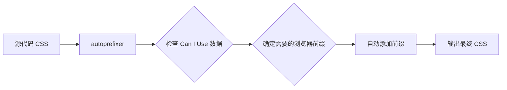

**autoprefixer 配置示例：**

```javascript
// postcss.config.js
module.exports = {
  plugins: [
    require('autoprefixer')({
      // browserslist 语法
      overrideBrowserslist: [
        '> 1%',                 // 全球使用率 > 1% 的浏览器
        'last 2 versions',       // 每个浏览器的最近两个版本
        'not ie <= 8',          // 排除 IE8 及以下
        'not op_mini all'       // 排除 Opera Mini
      ],

      // 或者使用 .browserslistrc 文件
      // grid: true,             // 是否为 Grid 布局添加 IE 前缀
      // flexbox: 'no-2009',     // 是否为 flexbox 添加 2009 语法前缀
    })
  ]
}
```

```css
/* .browserslistrc 文件 */
# 注释：以空格或换行分隔

> 0.5%
last 2 versions
not dead
not IE 11

/* 或者分多行写 */
> 1%
last 2 versions
not ie <= 8
```

**autoprefixer 使用前后对比：**

```css
/* 源代码（开发者写的） */
.container {
  display: flex;
  justify-content: space-between;
  gap: 20px;
}

.card {
  background: linear-gradient(135deg, #667eea 0%, #764ba2 100%);
  border-radius: 8px;
  box-shadow: 0 4px 12px rgba(0, 0, 0, 0.1);
  transform: rotate(0deg);
}

/* 经过 autoprefixer 处理后（2019年的浏览器范围） */
.container {
  display: -webkit-box;
  display: -ms-flexbox;
  display: flex;
  -webkit-box-pack: justify;
  -ms-flex-pack: justify;
  justify-content: space-between;
  gap: 20px;
}

.card {
  background: -webkit-linear-gradient(135deg, #667eea 0%, #764ba2 100%);
  background: linear-gradient(135deg, #667eea 0%, #764ba2 100%);
  -webkit-border-radius: 8px;
  border-radius: 8px;
  -webkit-box-shadow: 0 4px 12px rgba(0, 0, 0, 0.1);
  box-shadow: 0 4px 12px rgba(0, 0, 0, 0.1);
  -webkit-transform: rotate(0deg);
  -ms-transform: rotate(0deg);
  transform: rotate(0deg);
}
```

**现代 CSS 开发工作流：**

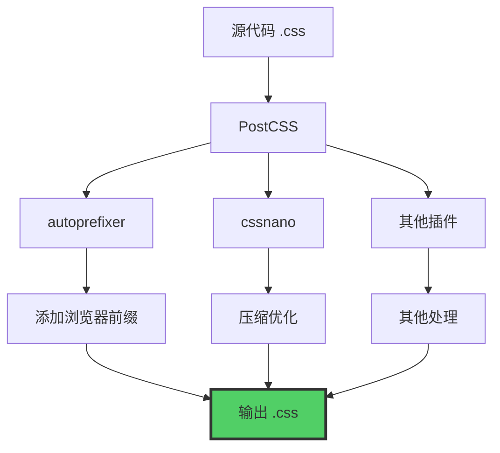

### 2.5.4 现代浏览器兼容性——主流浏览器兼容性大幅改善

到了 2020 年代，浏览器的兼容性问题已经大大改善。Chrome、Firefox、Safari、Edge 四大浏览器对标准 CSS 的支持已经非常完善。

**现代浏览器兼容性的改善：**

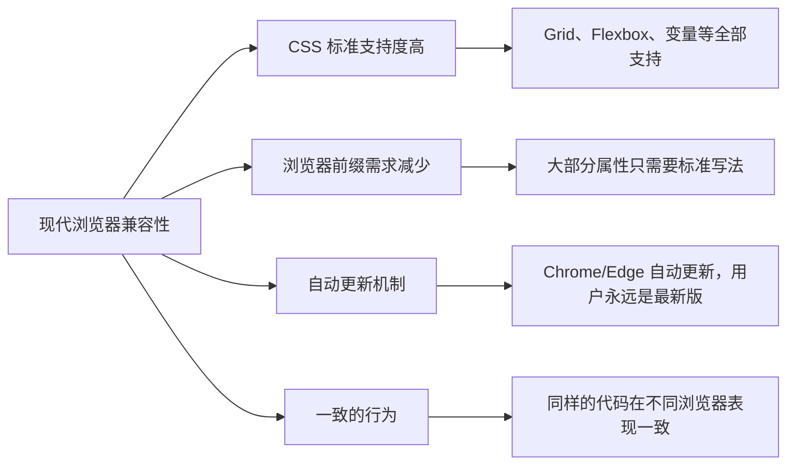

**现代 CSS 开发注意事项：**

```css
/* 1. Flexbox - 不需要任何前缀了 */
.flex {
  display: flex;
  justify-content: center;
  align-items: center;
  gap: 20px;
  flex-wrap: wrap;
}

/* 2. Grid - 不需要任何前缀了 */
.grid {
  display: grid;
  grid-template-columns: repeat(3, 1fr);
  gap: 20px;
}

/* 3. CSS 变量 - 完全不需要前缀 */
:root {
  --primary: #3498db;
}

.using-var {
  color: var(--primary);
}

/* 4. 圆角、阴影、变换 - 完全不需要前缀 */
.rounded-shadow {
  border-radius: 8px;
  box-shadow: 0 4px 12px rgba(0, 0, 0, 0.1);
  transform: scale(1.05);
}

/* 5. CSS 嵌套 - 现代浏览器原生支持 */
.nested {
  color: #333;

  &:hover {
    color: #000;
  }
}

/* 仍然需要前缀的少数属性：*/

.backdrop-blur {
  /* backdrop-filter 在 Safari 还需要前缀 */
  -webkit-backdrop-filter: blur(10px);
  backdrop-filter: blur(10px);
}

.clip-path {
  /* clip-path 在某些旧版本还需要前缀 */
  -webkit-clip-path: polygon(0 0, 100% 0, 100% 80%, 0 100%);
  clip-path: polygon(0 0, 100% 0, 100% 80%, 0 100%);
}

.position-sticky {
  /* position: sticky 在某些情况下 Safari 还需要 */
  position: -webkit-sticky;
  position: sticky;
  top: 0;
}
```

**现代浏览器兼容性检查流程：**

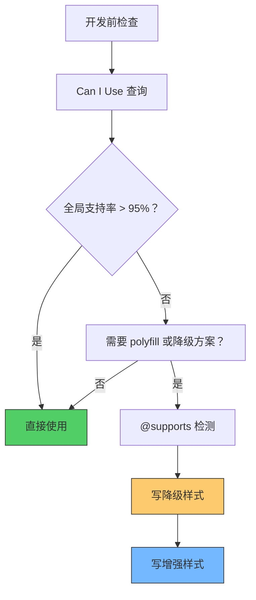

**@supports 条件检测：**

```css
/* 检测浏览器是否支持某个 CSS 特性 */
@supports (display: flex) {
  .flex-container {
    display: flex;
    /* 只有支持 flexbox 的浏览器才会应用这些样式 */
  }
}

@supports not (display: grid) {
  .grid-alternative {
    display: table;
    /* 不支持 grid 的浏览器的降级方案 */
  }
}

/* 组合条件 */
@supports (display: flex) and (backdrop-filter: blur(10px)) {
  .glass-effect {
    display: flex;
    backdrop-filter: blur(10px);
  }
}

/* 选择器支持检测 */
@supports (selector(::marker)) {
  ::marker {
    color: red;
  }
}
```

**浏览器兼容性的最佳实践：**

```css
/* 1. 渐进增强（Progressive Enhancement）*/
.card {
  /* 基础样式（所有浏览器都支持）*/
  padding: 20px;
  border: 1px solid #ddd;
}

/* 现代浏览器增强 */
@supports (backdrop-filter: blur(10px)) {
  .card {
    backdrop-filter: blur(10px);
    background: rgba(255, 255, 255, 0.8);
  }
}

/* 2. 优雅降级（Graceful Degradation）*/
.hero {
  /* 视觉效果（现代浏览器）*/
  background: linear-gradient(135deg, #667eea 0%, #764ba2 100%);
}

/* 旧浏览器的简单背景 */
@supports not (background: linear-gradient(to right, red, blue)) {
  .hero {
    background: #667eea;
  }
}

/* 3. 使用 CSS 原生特性而不是依赖工具 */
:root {
  /* 直接用 CSS 变量，不需要预处理器 */
  --primary: #3498db;
}
```

---

## 本章小结

恭喜你完成了第二章的学习！让我们来回顾一下这章的精华：

### 核心知识点

| 章节 | 重点内容 |
|------|----------|
| 2.1 布局方式的历史演变 | 表格布局 → 浮动布局 → Flexbox → Grid → 响应式设计 |
| 2.2 CSS 工具链的演进 | 原生 CSS 局限 → Sass/Less/Stylus → PostCSS → CSS-in-JS → Tailwind |
| 2.3 CSS 框架的演进 | 960 Grid → Blueprint → Bootstrap → Bulma → Tailwind |
| 2.4 CSS 新特性的历史 | CSS 变量、嵌套、@layer、:has()、容器查询、滚动动画等 |
| 2.5 浏览器兼容性的历史 | IE6 hack → 浏览器前缀 → autoprefixer → 现代浏览器 |

### CSS 布局进化图谱

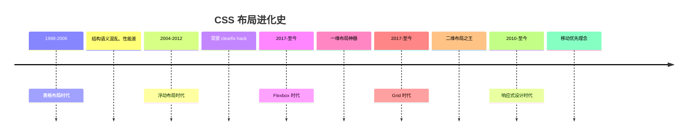

### CSS 工具进化图谱

```mermaid
mindmap
  root((CSS 工具链))
    原生 CSS
      无变量
      无嵌套
      无逻辑
    预处理器
      Sass/SCSS
      Less
      Stylus
      变量嵌套Mixin
    PostCSS
      autoprefixer
      cssnano
      插件化
    CSS-in-JS
      styled-components
      emotion
    Tailwind
      原子化
      Utility-First
```

### 关键术语回顾

- **表格布局**：用 `<table>` 标签做页面布局（不推荐）
- **浮动布局**：使用 `float` 属性实现列布局（已过时）
- **Flexbox**：一维弹性布局（现代布局标配）
- **Grid**：二维网格布局（现代布局标配）
- **CSS 预处理器**：Sass/Less/Stylus 等
- **PostCSS**：CSS 插件化工具链
- **CSS-in-JS**：将 CSS 写在 JavaScript 中
- **Tailwind CSS**：原子化 CSS 框架
- **浏览器前缀**：-webkit-、-moz-、-ms-、-o-
- **hasLayout**：IE 浏览器的特殊概念

### 实战练习建议

1. **动手实验**：用 Flexbox 和 Grid 分别实现一个经典的两栏布局
2. **对比体验**：对比 Tailwind CSS 和 Bootstrap 的组件写法
3. **工具尝试**：在项目中引入 autoprefixer，体验自动化前缀
4. **历史回顾**：如果你有机会，看看 IE6 时代的网站截图，感受一下那个时代的"艰难"

### 下章预告

下一章我们将开始动手实践！第三章将手把手教你编写第一个 CSS 页面，包括开发环境搭建、开发者工具使用、三种 CSS 引入方式，以及让你的第一个网页变得美观起来！

