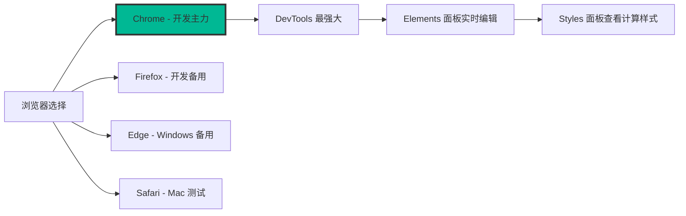
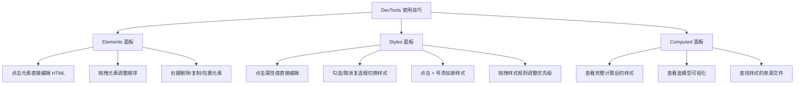
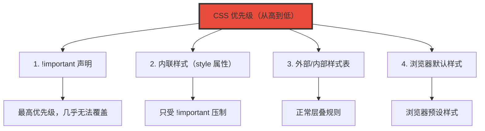
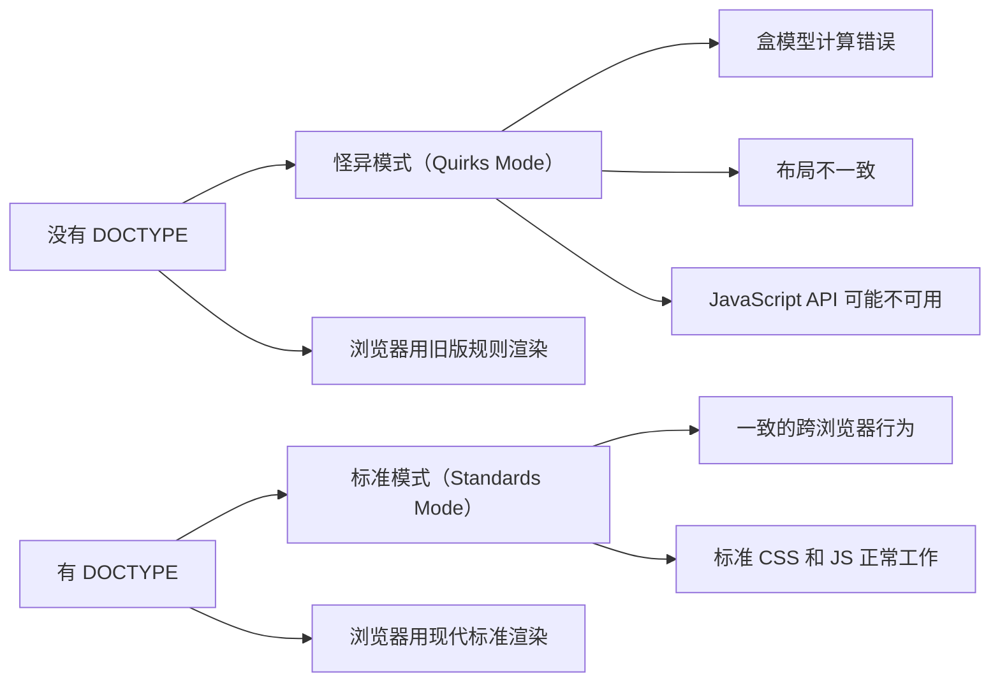
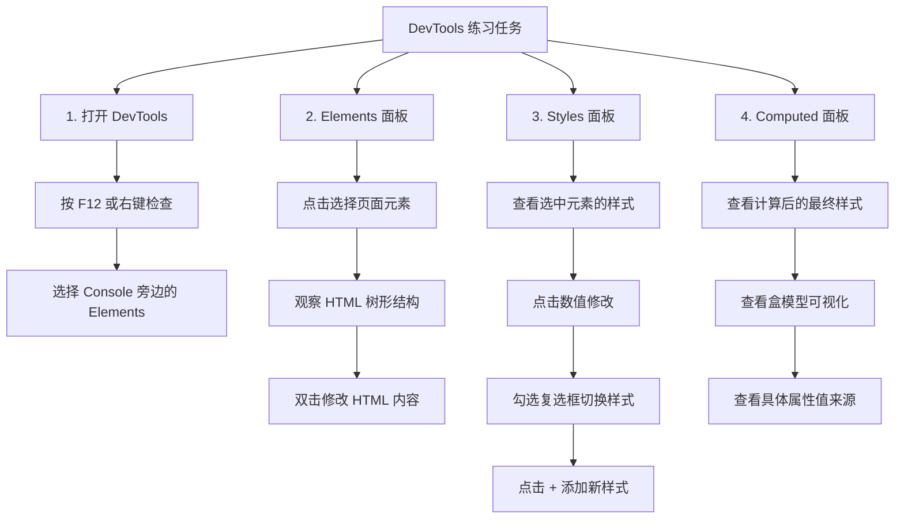
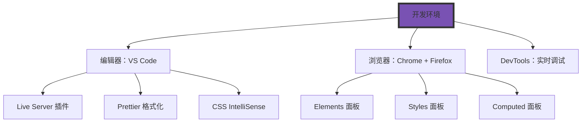

+++
title = "第3章 编写你的第一个CSS页面"
weight = 30
date = "2026-03-27T16:53:00+08:00"
type = "docs"
description = ""
isCJKLanguage = true
draft = false
+++

# 第三章：编写第一个 CSS 页面

> 纸上得来终觉浅，绝知此事要躬行。看了这么多 CSS 历史和理论，是时候动手写代码了！这一章，我们将从零开始搭建一个真实的网页，让你的浏览器变成你的画布，CSS 变成你的画笔。

## 3.1 搭建开发环境

古语有云："工欲善其事，必先利其器。"在开始写 CSS 之前，我们需要先准备好工具。放心，这个工具箱很简单，不需要花一分钱。

### 3.1.1 浏览器和编辑器——Chrome/Firefox + VS Code

**浏览器选择：**

对于 CSS 开发来说，你需要至少两个浏览器：

| 浏览器 | 推荐指数 | 适合场景 | 下载地址 |
|--------|----------|----------|----------|
| Chrome | ⭐⭐⭐⭐⭐ | 开发主力，DevTools 最强大 | chrome.google.com |
| Firefox | ⭐⭐⭐⭐⭐ | 开发备用，DevTools 也很棒 | mozilla.org/firefox |
| Edge | ⭐⭐⭐⭐ | Windows 用户备选，基于 Chromium | microsoft.com/edge |
| Safari | ⭐⭐⭐ | Mac 用户测试用 | 预装在 Mac 上 |



**编辑器选择：**

| 编辑器 | 推荐指数 | 特点 | 下载地址 |
|--------|----------|------|----------|
| VS Code | ⭐⭐⭐⭐⭐ | 免费、轻量、插件丰富 | code.visualstudio.com |
| WebStorm | ⭐⭐⭐⭐ | 专业、功能强大 | jetbrains.com/webstorm |
| Sublime Text | ⭐⭐⭐ | 轻量、快速 | sublimetext.com |
| Vim/Neovim | ⭐⭐ | 键盘流终极选择 | vim.org / neovim.io |

**VS Code 推荐插件安装：**

```text
VS Code 必装插件列表：
    │
    ├── 1. Live Server
    │   └── 实时预览 HTML 页面，保存即刷新
    │
    ├── 2. CSS Peek
    │   └── 在 HTML 中查看 CSS 定义，快速跳转
    │
    ├── 3. Auto Rename Tag
    │   └── 自动同步修改 HTML 标签名
    │
    ├── 4. Prettier - Code formatter
    │   └── 自动格式化代码，保持风格统一
    │
    ├── 5. IntelliSense for CSS class names
    │   └── CSS 类名自动补全
    │
    └── 6. Color Highlight
        └── 代码中高亮显示颜色值
```

**VS Code 设置建议（settings.json）：**

```json
{
  // 格式化配置
  "editor.defaultFormatter": "esbenp.prettier-vscode",
  "editor.formatOnSave": true,
  "editor.tabSize": 2,

  // CSS 相关
  "files.associations": {
    "*.css": "css",
    "*.scss": "scss"
  },

  // Live Server 配置
  "liveServer.settings.port": 5500,

  // 主题（个人喜好）
  "workbench.colorTheme": "One Dark Pro"
}
```

### 3.1.2 开发者工具——右键"检查"打开 DevTools，Elements 面板查看和编辑 CSS

**打开开发者工具的三种方法：**

| 方法 | 操作步骤 |
|------|----------|
| 右键菜单 | 在页面任意位置**右键** → 选择"**检查**"或"Inspect" |
| 快捷键 | **F12** 或 **Ctrl+Shift+I**（Windows/Linux）|
| 菜单栏 | 点击浏览器右上角 **⋮** → **更多工具** → **开发者工具** |

**开发者工具界面介绍：**

```
┌─────────────────────────────────────────────────────────────────┐
│  Elements  Console  Sources  Network  Performance  ...          │
├─────────────────────────────────┬───────────────────────────────┤
│                                 │                               │
│  HTML 结构面板                   │   Styles 面板                 │
│  ─────────────────              │   ──────────────              │
│  <head>                         │   element.style {              │
│    <meta charset="UTF-8">       │     color: #3498db;          │
│    <title>我的网页</title>       │   }                           │
│    <link rel="stylesheet"        │                               │
│      href="style.css">          │   .card {                     │
│  </head>                        │     background: white;        │
│  <body>                         │     padding: 20px;  ← 可编辑  │
│    <div class="container">       │   }                           │
│      <h1>欢迎</h1>  ← 可选择   │                               │
│      <p class="intro">          │   :hover ← 点击添加伪类       │
│        你好世界                  │   :active                      │
│      </p>                       │   ::before                    │
│    </div>                       │   ::after                     │
│  </body>                        │                               │
│                                 │   Computed 面板               │
│                                 │   ─────────────               │
│                                 │   padding: 20px               │
│                                 │   margin: 8px                 │
│                                 │   border-radius: 4px           │
│                                 │   ...                         │
└─────────────────────────────────┴───────────────────────────────┘
```

**DevTools 使用技巧：**



**实战演练：在 DevTools 中修改 CSS：**

```css
/* 1. 选择元素：在 Elements 面板点击 <h1> 标签 */
<h1>欢迎来到我的网站</h1>

/* 2. Styles 面板会显示 h1 的所有样式 */
h1 {
  color: #333;         /* ← 点击可编辑 */
  font-size: 32px;    /* ← 点击可编辑 */
  font-weight: bold;  /* ← 点击可编辑 */
  margin: 20px 0;     /* ← 点击可编辑 */
}

/* 3. 尝试修改颜色 */
color: #e74c3c;        /* 改成红色，立刻看到效果！ */

/* 4. 添加新样式 */
text-align: center;     /* 文字居中！ */

/* 5. 尝试 hover 伪类（注意：这里的代码块展示的是 :active，实际操作时请切换到 :hover 试试） */
:active {
  color: #c0392b;      /* 鼠标按下时变深红 */
  transition: color 0.3s;
}
```

**盒模型可视化：**

```
DevTools 中的盒模型展示：

┌────────────────────────────────────┐
│           margin: 20px             │
│  ┌──────────────────────────────┐  │
│  │         border: 2px          │  │
│  │  ┌────────────────────────┐  │  │
│  │  │    padding: 20px      │  │  │
│  │  │  ┌──────────────────┐  │  │  │
│  │  │  │    content        │  │  │  │
│  │  │  │   width: 300px    │  │  │  │
│  │  │  │  height: 200px    │  │  │  │
│  │  │  └──────────────────┘  │  │  │
│  │  └────────────────────────┘  │  │
│  └──────────────────────────────┘  │
└────────────────────────────────────┘

点击任何区域可以直接修改数值！
```

**常用 DevTools 快捷键：**

| 快捷键 | 功能 |
|--------|------|
| Ctrl + Shift + I | 打开 DevTools |
| Ctrl + Shift + C | 选择元素（点击页面选择） |
| Ctrl + F | 在 Elements 面板搜索 |
| Ctrl + B | 切换元素边框显示 |
| Ctrl + Shift + M | 切换移动设备模拟器 |
| Esc | 打开/关闭 Console |

## 3.2 三种引入方式

CSS 有三种引入方式，就像做菜有三种方式：直接炒（内联）、半成品加工（内部）、成品加热（外部）。每种方式都有它的适用场景。

### 3.2.1 内联样式——style 属性，只影响当前元素，慎用

**内联样式**（Inline Styles）是最直接的 CSS 写法，直接写在 HTML 元素的 `style` 属性里。

**基本语法：**

```html
<!-- 内联样式示例 -->
<h1 style="color: #3498db; font-size: 48px; text-align: center;">
  这是内联样式标题
</h1>

<p style="color: #666; line-height: 1.8; font-size: 18px;">
  内联样式直接写在 HTML 标签的 style 属性里，<br>
  这种写法最直接，但最不推荐在正式项目中使用。
</p>

<button style="background: #e74c3c; color: white; padding: 12px 24px; border: none; border-radius: 6px; cursor: pointer;">
  点我
</button>
```

**内联样式的特点：**

| 优点 | 缺点 |
|------|------|
| 优先级最高，不受其他样式影响 | 无法复用，重复代码多 |
| 适合快速原型和测试 | 维护困难，改一处要改多处 |
| 适合动态生成的样式 | 样式和结构混杂，语义混乱 |
| 适合邮件/新闻通讯（某些客户端） | 无法利用浏览器缓存 |

**内联样式的适用场景：**

```html
<!-- 场景1：快速测试和调试 -->
<!-- 想快速看看某个颜色效果，直接加 style -->
<div style="background: red;">看看效果</div>

<!-- 场景2：JavaScript 动态生成的样式 -->
<div id="dynamic-box">动态盒子</div>

<script>
  // JavaScript 动态设置样式
  const box = document.getElementById('dynamic-box');
  box.style.backgroundColor = '#3498db';
  box.style.color = 'white';
  box.style.padding = '20px';
  box.style.borderRadius = '8px';
</script>

<!-- 场景3：电子邮件模板（某些邮件客户端不支持外部 CSS） -->
<td style="background-color: #f4f4f4; padding: 20px;">
  <h1 style="color: #333; font-size: 24px;">邮件标题</h1>
</td>

<!-- 场景4：React/Vue 等框架中的内联样式（组件化写法） -->
<div style={{
  backgroundColor: isActive ? '#3498db' : '#95a5a6',
  padding: '20px',
  borderRadius: '8px'
}}>
  组件内容
</div>
```

**内联样式的优先级陷阱：**

```html
<!-- 内联样式的优先级非常高，会覆盖其他所有样式！ -->
<style>
  .title { color: blue; font-size: 24px; }  /* 这条会被覆盖 */
  #title { color: green; }                    /* 这条也会被覆盖 */
</style>

<h1 id="title" class="title" style="color: red;">标题</h1>
<!-- 最终颜色是 red，因为内联样式优先级最高！ -->
```

### 3.2.2 内部样式表——style 标签，单页面临时样式

**内部样式表**（Internal Stylesheet）是把 CSS 写在 HTML 文件的 `<style>` 标签里。

**基本语法：**

```html
<!DOCTYPE html>
<html lang="zh-CN">
<head>
  <meta charset="UTF-8">
  <title>内部样式表示例</title>

  <!-- 内部样式表开始 -->
  <style>
    /* CSS 规则写在这里 */

    /* 选择器 + 大括号 + 声明 */
    h1 {
      color: #3498db;
      font-size: 36px;
      text-align: center;
      margin-bottom: 20px;
    }

    p {
      color: #666;
      font-size: 18px;
      line-height: 1.8;
    }

    .card {
      background: white;
      padding: 30px;
      border-radius: 12px;
      box-shadow: 0 4px 12px rgba(0, 0, 0, 0.1);
      margin: 20px auto;
      max-width: 600px;
    }

    .btn {
      display: inline-block;
      padding: 12px 24px;
      background: #3498db;
      color: white;
      text-decoration: none;
      border-radius: 6px;
      transition: background 0.3s;
    }

    .btn:hover {
      background: #2980b9;
    }
  </style>
  <!-- 内部样式表结束 -->

</head>
<body>

  <div class="card">
    <h1>欢迎学习 CSS</h1>
    <p>这是内部样式表的示例。CSS 写在 &lt;style&gt; 标签里，适合单个页面的临时样式。</p>
    <a href="#" class="btn">了解更多</a>
  </div>

</body>
</html>
```

**内部样式表的特点：**

| 优点 | 缺点 |
|------|------|
| 样式集中在文件头部，便于管理 | 样式只对当前页面有效 |
| 可以使用复杂的选择器 | 多个页面有相同样式时，代码重复 |
| 可以利用 CSS 的层叠和继承 | 样式和 HTML 在同一个文件，文件大 |
| 适合单页面应用或测试 | 无法利用浏览器缓存 |

**内部样式表的适用场景：**

```html
<!-- 场景1：单页面演示/原型 -->
<!-- 快速写一个页面，不用创建额外文件 -->

<!-- 场景2：学习/测试 CSS -->
<!-- 想实验某个 CSS 属性，直接在 style 里写 -->

<!-- 场景3：动态生成页面的服务器端渲染 -->
<!-- 服务器端模板可以动态生成 style 标签 -->
```

### 3.2.3 外部样式表——.css 文件 + link 标签，最佳实践

**外部样式表**（External Stylesheet）是把 CSS 写在一个独立的 `.css` 文件里，然后用 `<link>` 标签引入。这是**最推荐的方式**。

**基本语法：**

```html
<!-- 在 HTML 文件的 <head> 中引入 -->
<head>
  <meta charset="UTF-8">
  <title>外部样式表示例</title>

  <!-- rel="stylesheet" 是必须的，href 指向 CSS 文件 -->
  <link rel="stylesheet" href="styles.css">

  <!-- 也可以引入多个 CSS 文件 -->
  <link rel="stylesheet" href="reset.css">
  <link rel="stylesheet" href="main.css">
  <link rel="stylesheet" href="components.css">
</head>
```

**styles.css 文件内容：**

```css
/* styles.css */

/* CSS 注释：用 /* ... */

/* ========== 全局样式 ========== */
* {
  margin: 0;
  padding: 0;
  box-sizing: border-box;
}

body {
  font-family: "Microsoft YaHei", "Segoe UI", sans-serif;
  line-height: 1.6;
  color: #333;
  background-color: #f5f5f5;
}

/* ========== 布局 ========== */
.container {
  max-width: 1200px;
  margin: 0 auto;
  padding: 0 20px;
}

/* ========== 卡片组件 ========== */
.card {
  background: white;
  padding: 30px;
  border-radius: 12px;
  box-shadow: 0 2px 8px rgba(0, 0, 0, 0.1);
  margin-bottom: 20px;
}

.card-title {
  font-size: 24px;
  font-weight: bold;
  color: #2c3e50;
  margin-bottom: 15px;
}

.card-content {
  font-size: 16px;
  color: #666;
  line-height: 1.8;
}

/* ========== 按钮组件 ========== */
.btn {
  display: inline-block;
  padding: 12px 24px;
  background: #3498db;
  color: white;
  text-decoration: none;
  border-radius: 6px;
  border: none;
  cursor: pointer;
  font-size: 16px;
  transition: background 0.3s ease;
}

.btn:hover {
  background: #2980b9;
}

.btn-primary { background: #3498db; }
.btn-danger { background: #e74c3c; }
.btn-success { background: #27ae60; }
.btn-warning { background: #f39c12; color: #333; }
```

**外部样式表的特点：**

| 优点 | 缺点 |
|------|------|
| 样式和 HTML 完全分离 | 需要额外创建 CSS 文件 |
| 多个页面共享同一 CSS 文件 | 需要额外的 HTTP 请求（但可被缓存） |
| 浏览器可以缓存 CSS 文件 | 需要正确管理文件路径 |
| 团队协作方便，分离关注点 | 初次加载需要下载 CSS 文件 |
| 易于维护和修改 | |

**外部样式表的适用场景：**

```html
<!-- 场景1：正式项目 -->
<!-- 所有样式都放在 assets/css/ 目录下 -->
<link rel="stylesheet" href="/assets/css/main.css">
<link rel="stylesheet" href="/assets/css/components.css">
<link rel="stylesheet" href="/assets/css/pages/home.css">

<!-- 场景2：CDN 引入第三方库 -->
<!-- 引入 Bootstrap -->
<link rel="stylesheet" href="https://cdn.jsdelivr.net/npm/bootstrap@5.3.0/dist/css/bootstrap.min.css">

<!-- 引入 Font Awesome -->
<link rel="stylesheet" href="https://cdnjs.cloudflare.com/ajax/libs/font-awesome/6.4.0/css/all.min.css">

<!-- 引入 Google Fonts -->
<link rel="stylesheet" href="https://fonts.googleapis.com/css2?family=Inter:wght@400;500;600&display=swap">
```

**三种引入方式的优先级对比：**



**三种引入方式的最佳实践总结：**

| 方式 | 适用场景 | 推荐程度 |
|------|----------|----------|
| 内联样式 | 动态样式、邮件、快速测试 | ⭐ |
| 内部样式表 | 单页面、原型、学习 | ⭐⭐ |
| 外部样式表 | 正式项目、多页面 | ⭐⭐⭐⭐⭐ |

```html
<!-- 实际项目的推荐结构 -->
<!DOCTYPE html>
<html lang="zh-CN">
<head>
  <meta charset="UTF-8">
  <meta name="viewport" content="width=device-width, initial-scale=1.0">
  <title>我的网站</title>

  <!-- 外部样式表：这是最佳实践 -->
  <link rel="stylesheet" href="css/reset.css">
  <link rel="stylesheet" href="css/main.css">

  <!-- 内联样式：仅在必要时使用 -->
  <!-- 例如：首屏关键样式可以内联以加快渲染 -->
  <style>
    /* 关键 CSS 可以内联，首屏不需要额外请求 */
    body { margin: 0; font-family: system-ui; }
    .hero { min-height: 100vh; }
  </style>
</head>
<body>
  <!-- 内容 -->

  <!-- 内联样式：仅在 JavaScript 动态设置时使用 -->
  <div id="app"></div>

  <script>
    // JavaScript 动态设置样式
    document.getElementById('app').style.color = 'red';
  </script>
</body>
</html>
```

## 3.3 第一个 CSS 示例

理论学完了，是时候真刀真枪地干一场了！这一节我们会创建一个完整的网页，用到我们学过的所有知识。

### 3.3.1 HTML 文件结构——DOCTYPE、meta viewport、link 引入 CSS

**标准 HTML 文件结构：**

```html
<!DOCTYPE html>
<html lang="zh-CN">
<!--
  DOCTYPE 声明告诉浏览器使用 HTML5 标准解析页面
  lang="zh-CN" 声明页面语言为简体中文，有助于搜索引擎和屏幕阅读器
-->
<head>
  <meta charset="UTF-8">
  <!--
    charset="UTF-8" 声明字符编码
    UTF-8 几乎支持世界上所有字符，包括中文
  -->

  <meta name="viewport" content="width=device-width, initial-scale=1.0">
  <!--
    viewport 元数据用于响应式设计
    width=device-width: 页面宽度等于设备宽度
    initial-scale=1.0: 初始缩放比例为 1（不缩放）
  -->

  <meta name="description" content="这是我的第一个 CSS 页面，包含完整的学习示例">
  <!--
    description 提供页面描述，搜索引擎会显示在搜索结果中
  -->

  <title>CSS 学习 - 我的第一个网页</title>

  <!-- 引入外部样式表 -->
  <link rel="stylesheet" href="styles.css">
</head>
<body>
  <!-- 页面内容将在这里 -->
</body>
</html>
```

**为什么要 DOCTYPE？**



**为什么要 viewport meta？**

```html
<!-- 没有 viewport meta 的后果 -->
<!-- 手机上访问时，页面会被缩放到一个很小的尺寸 -->

<!-- 桌面浏览器宽度 1920px -->
<!-- 手机浏览器宽度 375px -->

<!-- 如果没有 viewport 设置 -->
<!-- 浏览器会强制把 1920px 的页面缩放到 375px 显示 -->
<!-- 用户看到的文字会非常小，需要放大才能看 -->

<!-- 有 viewport 设置后 -->
<!-- width=device-width 告诉浏览器：页面宽度等于设备宽度 -->
<!-- 页面内容不需要缩放，直接以最优方式显示 -->
```

### 3.3.2 DevTools 使用——Elements 面板查看样式，Styles 面板实时修改

**完整实战演练：**

```html
<!-- index.html - 完整示例 -->
<!DOCTYPE html>
<html lang="zh-CN">
<head>
  <meta charset="UTF-8">
  <meta name="viewport" content="width=device-width, initial-scale=1.0">
  <title>CSS 实战 - DevTools 练习</title>

  <!-- 内部样式表：用于演示 -->
  <style>
    /* 全局样式 */
    * {
      margin: 0;
      padding: 0;
      box-sizing: border-box;
    }

    body {
      font-family: "Microsoft YaHei", "Segoe UI", sans-serif;
      line-height: 1.6;
      background: linear-gradient(135deg, #667eea 0%, #764ba2 100%);
      min-height: 100vh;
      padding: 40px 20px;
    }

    /* 容器样式 */
    .container {
      max-width: 800px;
      margin: 0 auto;
    }

    /* 卡片样式 */
    .card {
      background: white;
      border-radius: 16px;
      padding: 40px;
      box-shadow: 0 20px 60px rgba(0, 0, 0, 0.3);
      margin-bottom: 30px;
    }

    /* 标题样式 */
    .card h1 {
      font-size: 36px;
      color: #2c3e50;
      margin-bottom: 20px;
      text-align: center;
    }

    .card h2 {
      font-size: 24px;
      color: #34495e;
      margin: 30px 0 15px 0;
      padding-bottom: 10px;
      border-bottom: 2px solid #ecf0f1;
    }

    /* 段落样式 */
    .card p {
      color: #555;
      font-size: 16px;
      margin-bottom: 15px;
      line-height: 1.8;
    }

    /* 按钮样式 */
    .btn {
      display: inline-block;
      padding: 14px 28px;
      border-radius: 8px;
      text-decoration: none;
      font-weight: 600;
      transition: all 0.3s ease;
      cursor: pointer;
      border: none;
      font-size: 16px;
    }

    .btn-primary {
      background: #3498db;
      color: white;
    }

    .btn-primary:hover {
      background: #2980b9;
      transform: translateY(-2px);
      box-shadow: 0 5px 20px rgba(52, 152, 219, 0.4);
    }

    .btn-success {
      background: #2ecc71;
      color: white;
    }

    .btn-success:hover {
      background: #27ae60;
    }

    /* 列表样式 */
    .feature-list {
      list-style: none;
      padding: 0;
      margin: 20px 0;
    }

    .feature-list li {
      padding: 12px 0;
      border-bottom: 1px solid #ecf0f1;
      display: flex;
      align-items: center;
    }

    .feature-list li:last-child {
      border-bottom: none;
    }

    .feature-list li::before {
      content: "✓";
      color: #2ecc71;
      font-weight: bold;
      margin-right: 12px;
      font-size: 18px;
    }

    /* 代码块样式 */
    code {
      background: #f8f9fa;
      padding: 2px 8px;
      border-radius: 4px;
      font-family: "Fira Code", "Consolas", monospace;
      color: #e74c3c;
      font-size: 14px;
    }

    pre {
      background: #2c3e50;
      color: #ecf0f1;
      padding: 20px;
      border-radius: 8px;
      overflow-x: auto;
      margin: 20px 0;
      font-family: "Fira Code", "Consolas", monospace;
      font-size: 14px;
      line-height: 1.5;
    }

    pre code {
      background: none;
      padding: 0;
      color: #ecf0f1;
    }

    /* 内联样式示例 */
    .highlight {
      background: linear-gradient(120deg, #ffeaa7 0%, #ffeaa7 100%);
      background-repeat: no-repeat;
      background-size: 100% 40%;
      background-position: 0 90%;
      padding: 0 4px;
    }

    /* 警告框 */
    .tip-box {
      background: #fff3cd;
      border-left: 4px solid #ffc107;
      padding: 15px 20px;
      border-radius: 0 8px 8px 0;
      margin: 20px 0;
    }

    .tip-box strong {
      color: #856404;
    }
  </style>
</head>
<body>
  <div class="container">
    <!-- 主卡片 -->
    <div class="card">
      <h1>🎨 CSS 实战演练</h1>
      <p style="text-align: center; color: #888;">
        <!-- 内联样式示例：文字居中 -->
        通过这个页面学习 HTML 结构和 CSS 样式的结合使用
      </p>

      <h2>📝 HTML 文件结构</h2>
      <p>
        一个标准的 HTML 文件包含 <code>&lt;!DOCTYPE html&gt;</code> 声明，
        <code>&lt;html&gt;</code> 根元素，以及 <code>&lt;head&gt;</code> 和
        <code>&lt;body&gt;</code> 两个主要部分。
      </p>

      <div class="tip-box">
        <strong>💡 小提示：</strong>
        <code>&lt;head&gt;</code> 中的内容不会显示在页面上，
        但包含了对浏览器和搜索引擎重要的元数据。
      </div>

      <h2>✨ CSS 三种引入方式</h2>
      <ul class="feature-list">
        <li>外部样式表：通过 <code>&lt;link&gt;</code> 标签引入 <code>.css</code> 文件</li>
        <li>内部样式表：在 <code>&lt;style&gt;</code> 标签中编写 CSS</li>
        <li>内联样式：直接在 HTML 元素的 <code>style</code> 属性中编写</li>
      </ul>

      <h2>🛠 DevTools 实战练习</h2>
      <p>按照以下步骤练习 DevTools 的使用：</p>
      <ol style="margin: 20px 0; padding-left: 25px;">
        <li style="margin-bottom: 10px;">在页面任意位置<strong>右键</strong>，选择"检查"</li>
        <li style="margin-bottom: 10px;">在 <strong>Elements</strong> 面板中点击 <code>&lt;h1&gt;</code> 元素</li>
        <li style="margin-bottom: 10px;">在 <strong>Styles</strong> 面板中修改 <code>color</code> 属性，观察页面变化</li>
        <li style="margin-bottom: 10px;">尝试添加新的 CSS 属性，如 <code>font-size: 48px;</code></li>
        <li>尝试勾选/取消某些样式前的复选框，看看会发生什么</li>
      </ol>

      <h2>📂 实践任务</h2>
      <p>
        完成以下任务来巩固今天的学习：
      </p>
      <ul class="feature-list">
        <li>创建一个新的 HTML 文件，命名为 <code>my-page.html</code></li>
        <li>包含标准的 DOCTYPE、html、head、body 结构</li>
        <li>在 body 中添加一个自我介绍的卡片</li>
        <li>使用内部样式表为卡片添加样式</li>
        <li>用 DevTools 实时修改样式，熟悉各个面板的功能</li>
      </ul>

      <div style="text-align: center; margin-top: 30px;">
        <a href="#" class="btn btn-primary">继续学习下一章</a>
        <a href="#" class="btn btn-success">下载示例代码</a>
      </div>
    </div>
  </div>
</body>
</html>
```

**styles.css - 外部样式表文件：**

```css
/* styles.css - 外部样式表示例 */
/* 这个文件应该和 index.html 在同一目录下 */

/* ========== CSS 变量定义 ========== */
:root {
  --primary-color: #3498db;
  --primary-hover: #2980b9;
  --success-color: #2ecc71;
  --success-hover: #27ae60;
  --danger-color: #e74c3c;
  --danger-hover: #c0392b;
  --warning-color: #f39c12;
  --dark-color: #2c3e50;
  --light-color: #ecf0f1;
  --shadow: 0 4px 6px rgba(0, 0, 0, 0.1);
  --radius: 8px;
}

/* ========== 重置样式 ========== */
* {
  margin: 0;
  padding: 0;
  box-sizing: border-box;
}

html {
  font-size: 16px;
}

body {
  font-family: "Microsoft YaHei", "Segoe UI", -apple-system, sans-serif;
  line-height: 1.6;
  color: #333;
  background-color: #f5f7fa;
}

/* ========== 布局容器 ========== */
.container {
  width: 100%;
  max-width: 1200px;
  margin: 0 auto;
  padding: 0 20px;
}

/* ========== 卡片组件 ========== */
.card {
  background: white;
  border-radius: var(--radius);
  box-shadow: var(--shadow);
  padding: 30px;
  margin-bottom: 20px;
  transition: transform 0.3s ease, box-shadow 0.3s ease;
}

.card:hover {
  transform: translateY(-5px);
  box-shadow: 0 10px 20px rgba(0, 0, 0, 0.15);
}

.card-header {
  font-size: 24px;
  font-weight: 600;
  color: var(--dark-color);
  margin-bottom: 15px;
  padding-bottom: 10px;
  border-bottom: 2px solid var(--light-color);
}

.card-body {
  color: #555;
  font-size: 16px;
  line-height: 1.8;
}

/* ========== 按钮组件 ========== */
.btn {
  display: inline-flex;
  align-items: center;
  justify-content: center;
  padding: 10px 20px;
  border: none;
  border-radius: var(--radius);
  font-size: 16px;
  font-weight: 500;
  text-decoration: none;
  cursor: pointer;
  transition: all 0.2s ease;
}

.btn:hover {
  transform: translateY(-2px);
}

.btn-primary {
  background: var(--primary-color);
  color: white;
}

.btn-primary:hover {
  background: var(--primary-hover);
}

.btn-success {
  background: var(--success-color);
  color: white;
}

.btn-success:hover {
  background: var(--success-hover);
}

.btn-danger {
  background: var(--danger-color);
  color: white;
}

.btn-danger:hover {
  background: var(--danger-hover);
}

.btn-outline {
  background: transparent;
  border: 2px solid var(--primary-color);
  color: var(--primary-color);
}

.btn-outline:hover {
  background: var(--primary-color);
  color: white;
}

/* ========== 响应式设计 ========== */
@media (max-width: 768px) {
  .container {
    padding: 0 15px;
  }

  .card {
    padding: 20px;
  }

  .btn {
    width: 100%;
    margin-bottom: 10px;
  }
}
```

**DevTools 练习任务：**



---

## 本章小结

恭喜你完成了第三章的学习！让我们来回顾一下这章的精华：

### 核心知识点

| 小节 | 重点内容 |
|------|----------|
| 3.1 开发环境 | VS Code + Chrome/Firefox + DevTools |
| 3.2 三种引入方式 | 内联样式、内部样式表、外部样式表 |
| 3.3 第一个 CSS 示例 | 完整 HTML 结构 + DevTools 实战 |

### 开发环境配置图



### CSS 三种引入方式对比

| 方式 | 语法 | 优先级 | 推荐程度 |
|------|------|--------|----------|
| 内联样式 | `style="..."` | 最高 | ⭐ |
| 内部样式表 | `<style>...</style>` | 中 | ⭐⭐ |
| 外部样式表 | `<link rel="stylesheet" href="...">` | 最低 | ⭐⭐⭐⭐⭐ |

### HTML 文件标准结构

```html
<!DOCTYPE html>
<html lang="zh-CN">
<head>
  <meta charset="UTF-8">
  <meta name="viewport" content="width=device-width, initial-scale=1.0">
  <meta name="description" content="页面描述">
  <title>页面标题</title>
  <link rel="stylesheet" href="styles.css">
</head>
<body>
  <!-- 页面内容 -->
</body>
</html>
```

### 关键术语回顾

- **DOCTYPE**：声明文档类型，告诉浏览器使用哪个 HTML 版本
- **viewport**：视口元数据，控制页面在移动设备上的缩放
- **DevTools**：浏览器开发者工具，用于调试和检查页面
- **内联样式**：直接在 HTML 元素的 style 属性中编写
- **内部样式表**：在 `<style>` 标签中编写 CSS
- **外部样式表**：在独立的 `.css` 文件中编写，通过 `<link>` 引入

### 实战练习建议

1. **环境搭建**：安装 VS Code 和 Chrome/Firefox 浏览器
2. **插件安装**：安装 Live Server、Prettier 等推荐插件
3. **文件创建**：按照示例创建你的第一个 HTML 文件
4. **DevTools 练习**：打开 DevTools，尝试修改页面上的任意样式
5. **样式实验**：修改字体大小、颜色、间距等，观察变化

### 下章预告

下一章我们将深入学习 CSS 语法基础，这是你 CSS 学习之路的重要里程碑！我们将学习 CSS 规则的构成、属性值类型等核心概念。准备好了吗？CSS 大师之路，从这一章开始！

