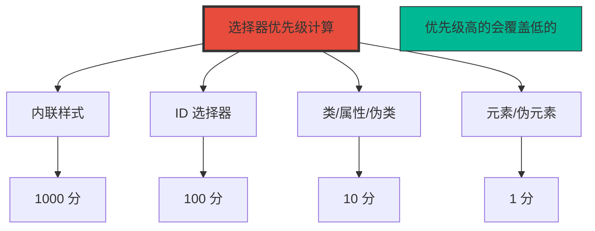
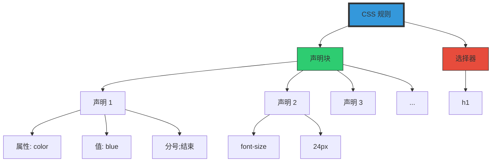
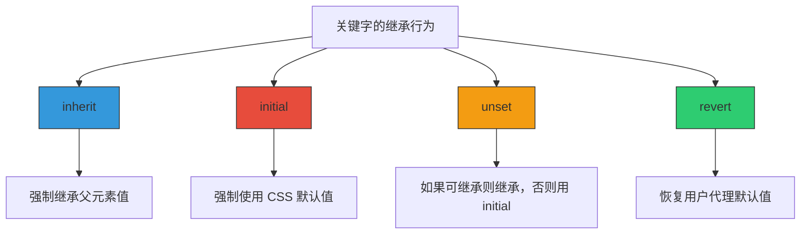
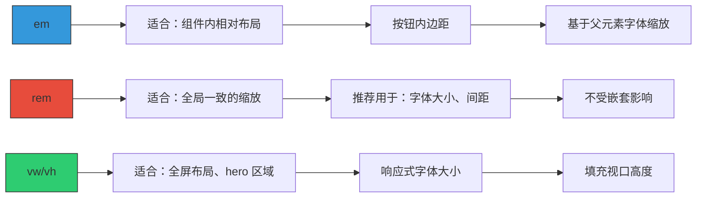
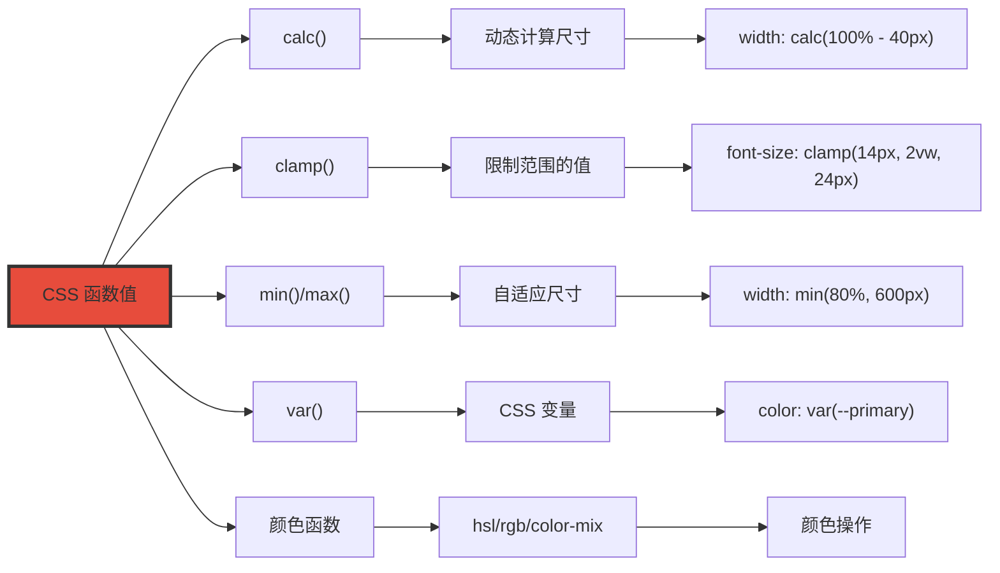
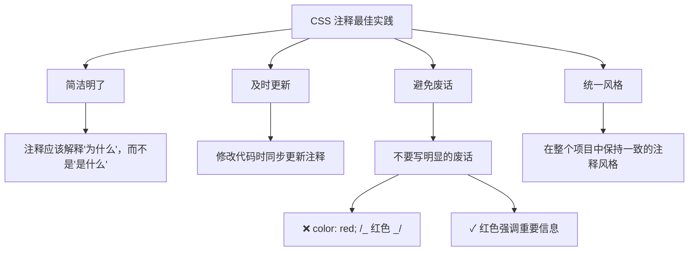
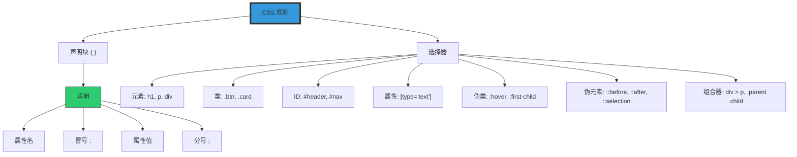
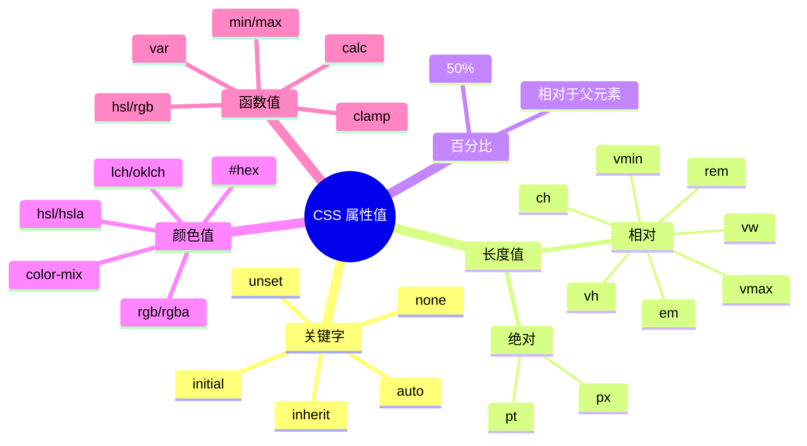

+++
title = "第4章 CSS规则结构"
weight = 40
date = "2026-03-27T16:53:00+08:00"
type = "docs"
description = ""
isCJKLanguage = true
draft = false
+++

# 第四章：CSS 规则的构成

> CSS 就像一门语言，有自己的语法规则。学会这些规则，你就能写出规范、美观、易维护的 CSS 代码。这一章，我们将深入了解 CSS 的"语法"——从最小的组成部分开始。

## 4.1 CSS 规则的组成

CSS 规则就像是一句话，有主语、谓语、宾语。只不过在 CSS 里，叫做**选择器**、**声明**和**声明块**。

### 4.1.1 选择器——指定要样式化的元素，如 p、.btn、#header

**选择器**是 CSS 规则的"灵魂"，它告诉浏览器：**"我要样式化哪些元素？"**

**常见选择器类型：**

```css
/* ========== 1. 元素（标签）选择器 ========== */
/* 匹配所有 <p> 元素 */
p {
  color: #333;
  line-height: 1.8;
}

/* 匹配所有 <h1> 元素 */
h1 {
  font-size: 36px;
  font-weight: bold;
}

/* 匹配所有 <a> 元素 */
a {
  color: #3498db;
  text-decoration: none;
}

/* ========== 2. 类（class）选择器 ========== */
/* 匹配所有 class="btn" 的元素 */
.btn {
  padding: 10px 20px;
  border-radius: 6px;
  cursor: pointer;
}

/* 一个元素可以有多个类 */
.button-primary {
  background: #3498db;
  color: white;
}

.button-large {
  padding: 15px 30px;
  font-size: 18px;
}

/* ========== 3. ID 选择器 ========== */
/* 匹配 id="header" 的元素 */
#header {
  height: 60px;
  background: #333;
  color: white;
}

/* ========== 4. 通配符选择器 ========== */
/* 匹配所有元素 */
* {
  margin: 0;
  padding: 0;
  box-sizing: border-box;
}

/* ========== 5. 属性选择器 ========== */
/* 匹配所有带 href 属性的 <a> 元素 */
a[href] {
  color: #3498db;
}

/* 匹配所有 href 以 https:// 开头的 <a> 元素 */
a[href^="https://"] {
  color: green;
}

/* 匹配所有 href 以 .pdf 结尾的 <a> 元素 */
a[href$=".pdf"]::after {
  content: " (PDF)";
  color: #e74c3c;
}

/* ========== 6. 伪类选择器 ========== */
/* 匹配鼠标悬停的 <a> 元素 */
a:hover {
  color: #2980b9;
  text-decoration: underline;
}

/* 匹配第一个子元素 */
li:first-child {
  font-weight: bold;
}

/* ========== 7. 伪元素选择器 ========== */
/* 匹配 <p> 的第一个字母 */
p::first-letter {
  font-size: 2em;
  color: #e74c3c;
  float: left;
  line-height: 1;
  margin-right: 5px;
}

/* 在 <h1> 前面插入内容 */
h1::before {
  content: "§ ";
  color: #999;
}

/* 选中文字时的样式（鼠标选中文本）*/
p::selection {
  background: #3498db;
  color: white;
}

/* 输入框占位符样式 */
input::placeholder {
  color: #999;
  font-style: italic;
}

/* ========== 8. 组合器选择器 ========== */
/* 通过组合多个选择器来选中特定关系的元素 */

/* 后代组合器（空格）：选中所有后代 */
.article p {
  line-height: 1.8;          /* 选中 .article 里所有的 <p>，包括嵌套的 */
}

/* 子组合器（>）：只选中直接子元素 */
.nav > li {
  border-bottom: 1px solid #ddd;  /* 只选中 .nav 的直接子元素 <li> */
}

/* 相邻兄弟组合器（+）：选中紧邻的下一个兄弟 */
h1 + p {
  font-size: 1.2em;          /* 选中紧跟在 <h1> 后面的 <p> */
  color: #666;
}

/* 通用兄弟组合器（~）：选中之后所有兄弟 */
h2 ~ p {
  margin-left: 20px;         /* 选中 <h2> 后面所有的 <p> 兄弟 */
}

/* 组合使用 */
.post > .content p:first-child {
  font-weight: bold;         /* 选中 .post > .content 里第一个 <p> */
}
```

**选择器优先级（Specificity）计算规则：**



| 选择器类型 | 示例 | 优先级分数 |
|------------|------|------------|
| 内联样式 | `style="color: red;"` | 1000 |
| ID 选择器 | `#header` | 100 |
| 类选择器 | `.btn` | 10 |
| 属性选择器 | `[type="text"]` | 10 |
| 伪类 | `:hover` | 10 |
| 元素选择器 | `div` | 1 |
| 伪元素 | `::before` | 1 |

```css
/* 优先级计算示例 */
#header .nav li a.link {  /* #=100 + .=10 + li=1 + a=1 + .=10 = 122 */
  color: red;
}

.nav .link {              /* .=10 + .=10 = 20 */
  color: blue;
}

/* 最终颜色是 red，因为 122 > 20 */
```

### 4.1.2 声明块——大括号 { } 包裹的所有声明

**声明块**是 CSS 规则的"身体"，用大括号 `{ }` 包裹，它包含了所有要应用的样式声明。

```css
/* 选择器 + 声明块 */
h1 {
  /* 声明块开始 */

  /* 声明 1 */
  color: #2c3e50;

  /* 声明 2 */
  font-size: 36px;

  /* 声明 3 */
  font-weight: bold;

  /* 声明块结束 */
}
```

**声明块的语法规则：**

```css
/* 正确格式 */
/* 选择器 { 属性: 值; 属性: 值; } */

h1 {
  color: #333;
  font-size: 24px;
  margin-bottom: 20px;
}

/* 常见的错误格式 */

/* 错误1：忘记写分号 */
h1 {
  color: #333    /* 会导致下一行也被合并 */
  font-size: 24px;
}

/* 错误2：使用中文冒号 */
h1 {
  color：#333;   /* 中文冒号，浏览器不认识 */
}

/* 错误3：属性名拼写错误 */
h1 {
  colours: #333;  /* 正确的属性名是 color，不是 colours */
  font-sizee: 24px;  /* 正确的属性名是 font-size */
}

/* 错误4：大括号不匹配 */
h1 {
  color: #333;
  font-size: 24px;
  /* 缺少右大括号 */
```

### 4.1.3 声明——property: value; 如 color: red;

**声明**是 CSS 的最小单元，由**属性名**、**冒号**、**属性值**和**分号**组成。

```css
/* 声明的组成 */
color: red;
/* │    │  │
   │    │  └── 分号（可选，最后一个声明可省略）
   │    └── 冒号
   └── 属性名
*/

/* 完整的声明格式 */
property: value;

/* 示例 */
color: red;
font-size: 16px;
margin: 20px;
background-color: #f5f5f5;
```

**声明的书写规范：**

```css
/* 推荐格式：属性名冒号后加空格 */
h1 {
  color: #333;
  font-size: 24px;
}

/* 属性名可以用短横线连接 */
background-color: white;      /* ✓ 正确 */
background_color: white;       /* ✗ 错误：CSS 属性用短横线，不用下划线 */
font_family: Arial;           /* ✗ 错误 */

/* 属性值如果是多个单词，需要引号吗？ */
/* 大多数情况下不需要引号 */
font-family: Arial, sans-serif;  /* ✓ 不需要引号 */
font-family: "Times New Roman";  /* ✓ 可以加引号 */
background: url("image.png");   /* ✓ URL 需要引号 */

/* 数值单位不能省略 */
margin: 20px;      /* ✓ 正确 */
margin: 20;        /* ✗ 错误：缺少单位 */
line-height: 1.5;   /* ✓ 正确：line-height 可以用无单位数字 */
```

### 4.1.4 示例：h1 { color: blue; font-size: 24px; }

**完整 CSS 规则示例：**

```css
/* 选择器 + 声明块 + 多个声明 */
h1 {
  color: blue;
  font-size: 24px;
}

/* 多个选择器共享同一个声明块 */
h1, h2, h3 {
  font-family: "Microsoft YaHei", sans-serif;
  margin-bottom: 15px;
}

/* 组合示例：选择器 + 声明块 + 声明 + 注释 */
.card {
  /* 背景样式 */
  background-color: white;
  background-image: linear-gradient(135deg, #667eea 0%, #764ba2 100%);

  /* 文字样式 */
  color: #2c3e50;
  font-size: 16px;
  line-height: 1.6;

  /* 间距 */
  padding: 30px;
  margin: 20px;

  /* 边框和圆角 */
  border: 1px solid #ddd;
  border-radius: 12px;

  /* 阴影 */
  box-shadow: 0 4px 12px rgba(0, 0, 0, 0.1);
}
```

**CSS 规则的完整结构图：**



## 4.2 属性值类型

CSS 属性的值就像做菜的材料，种类繁多，各有用途。了解这些值类型，是写好 CSS 的基础。

### 4.2.1 关键字——auto、none、inherit、initial、unset、revert、normal、revert-layer

**CSS 关键字**是浏览器预定义的词汇，每个关键字都有特定的含义。

**常用关键字详解：**

```css
/* ========== auto ========== */
/* 自动计算值，让浏览器决定合适的值 */
div {
  margin: auto;              /* 水平居中：需配合 width 使用 */
  width: 80%;
  max-width: 1200px;        /* 最大宽度限制 */
}

/* margin: auto 实现水平居中的条件： */
/* 1. 元素必须是块级（block）*/
/* 2. 元素必须设置了 width（非 auto）*/
/* 注意：auto 默认只处理水平方向，垂直方向默认是 0 */
.container {
  margin-left: auto;
  margin-right: auto;        /* 块级元素水平居中（经典写法）*/
  text-align: center;        /* 让内部行内元素居中 */
}

.flex-container {
  display: flex;
  justify-content: space-between;  /* 两侧对齐 */
}

/* ========== none ========== */
/* 表示"无"或"不存在"，用于隐藏或重置 */
a {
  text-decoration: none;     /* 去掉链接下划线 */
}

.hidden {
  display: none;             /* 完全隐藏元素 */
}

.no-border {
  border: none;              /* 无边框 */
}

/* ========== inherit ========== */
/* 继承父元素的对应属性值 */
.child {
  color: inherit;            /* 继承父元素的 color */
  font-size: inherit;        /* 继承父元素的 font-size */
}

p {
  color: blue;
}

p span {
  color: inherit;            /* span 会是蓝色，继承了 p 的 color */
}

/* ========== initial ========== */
/* 设置为 CSS 规范的默认值 */
.reset {
  color: initial;            /* 黑色（默认文本颜色） */
  font-size: initial;        /* 16px（默认字体大小） */
}

/* ========== unset ========== */
/* 如果能继承则继承，否则使用 initial */
.parent {
  color: red;
}

.child-unset {
  color: unset;              /* 会继承父元素的 red */
}

/* ========== revert ========== */
/* 恢复到用户代理（浏览器）默认样式 */
button {
  appearance: revert;        /* 恢复为浏览器默认按钮样式 */
}

/* ========== revert-layer ========== */
/* 恢复到同一层叠层级之前的值 */
@layer base {
  p {
    color: blue;            /* base 层中 p 是蓝色 */
  }
}

@layer components {
  p {
    color: revert-layer;    /* 回到 base 层的 blue */
  }
}
```

**关键字的继承行为对比：**



### 4.2.2 长度值

长度值是 CSS 中最常用的值类型之一，用于指定距离、尺寸等。

#### 4.2.2.1 绝对长度——px（像素）、pt（点），px 最常用

**绝对长度单位**是固定值，不随屏幕或父元素变化。

| 单位 | 名称 | 说明 | 换算 |
|------|------|------|------|
| px | 像素 | 屏幕上的一个点，最常用 | 1px = 1/96 inch |
| pt | 点 | 印刷行业常用 | 1pt = 1/72 inch ≈ 1.33px |
| in | 英寸 | 很少使用 | 1in = 96px |
| cm | 厘米 | 很少使用 | 1cm ≈ 37.8px |
| mm | 毫米 | 很少使用 | 1mm ≈ 3.78px |

```css
/* px - 像素，最常用的绝对单位 */
.box {
  width: 300px;
  height: 200px;
  padding: 20px;
  margin: 10px;
  border: 1px solid #333;
}

/* pt - 点，印刷行业常用 */
.print-only {
  font-size: 12pt;          /* 打印时用 12pt 字体 */
  line-height: 1.5;
}

/* 为什么 px 是最常用的？ */
/* 1px = 屏幕上的一个物理像素点 */
/* 在大多数设备上，1px 大约是 1/96 英寸 */
/* 但在 Retina/高清屏幕上，1 CSS 像素 = 2 或 3 个物理像素 */
```

#### 4.2.2.2 相对长度——em、rem、vw、vh、vmin、vmax

**相对长度单位**的值是相对于其他某个参考值计算的，这让响应式设计成为可能。

| 单位 | 参考对象 | 说明 |
|------|----------|------|
| em | 父元素 font-size | 相对于父元素字体大小 |
| rem | 根元素 font-size | 相对于根元素（html）字体大小 |
| vw | 视口宽度 | 1vw = 视口宽度的 1% |
| vh | 视口高度 | 1vh = 视口高度的 1% |
| vmin | vw 和 vh 中较小者 | 用于适配不同屏幕比例 |
| vmax | vw 和 vh 中较大者 | 用于适配不同屏幕比例 |
| ch | 字符"0"的宽度 | 常用于输入框最小宽度 |
| ex | 字标 x 的高度 | 很少使用 |

```css
/* ========== em ========== */
/* 相对于父元素的字体大小 */
.parent {
  font-size: 16px;
}

.child {
  font-size: 2em;           /* 2em = 16px * 2 = 32px */
  padding: 1.5em;            /* 1.5em = 16px * 1.5 = 24px */
}

/* em 会层层叠加，要小心 */
.outer {
  font-size: 10px;
}

.middle {
  font-size: 2em;           /* 20px */
}

.inner {
  font-size: 2em;           /* 20px * 2 = 40px！嵌套会叠加 */
}

/* ========== rem ========== */
/* 相对于根元素（html）的字体大小，推荐使用 */
html {
  font-size: 16px;          /* 大多数浏览器默认是 16px */
}

.relative-box {
  font-size: 1rem;          /* 16px */
  padding: 2rem;             /* 32px */
  margin: 0.5rem;           /* 8px */
}

.card-title {
  font-size: 2rem;           /* 32px，不会受父元素影响 */
}

/* ========== vw 和 vh ========== */
/* 视口单位，常用于全屏布局 */
.full-screen {
  height: 100vh;            /* 100vh = 视口高度，100vh 全屏 */
  width: 100vw;             /* 100vw = 视口宽度 */
}

.hero {
  height: 100vh;
  display: flex;
  align-items: center;
  justify-content: center;
  background: linear-gradient(135deg, #667eea 0%, #764ba2 100%);
}

/* ========== vmin 和 vmax ========== */
/* vmin = 视口宽高中较小的那个的 1% */
/* vmax = 视口宽高中较大的那个的 1% */
.responsive-box {
  width: 80vmin;            /* 宽高中较小的 80% */
  height: 40vmin;
  background: #3498db;
}

/* 适配横屏和竖屏 */
.square {
  width: 80vmin;
  height: 80vmin;
  background: #2ecc71;
}

/* ========== ch ========== */
/* 相对于字符"0"的宽度 */
.username-input {
  min-width: 20ch;          /* 至少能显示 20 个字符 */
  padding: 0.5rem 1rem;
  font-family: monospace;
}

/* ========== 组合使用 ========== */
.card {
  font-size: 1rem;          /* 基础字体 16px */
  padding: 1.5rem;           /* 24px */
  margin: 0.5rem;            /* 8px */
  border-radius: 0.5rem;      /* 8px */
}

.card-title {
  font-size: 1.5rem;         /* 24px = 1.5 * 16px */
  margin-bottom: 0.75rem;    /* 12px = 0.75 * 16px */
}
```

**相对单位的应用场景对比：**



### 4.2.3 百分比——相对于某个参考值，如父元素宽度的 50%

**百分比值**是相对于某个参考值计算的。

```css
/* ========== 相对于父元素宽度 ========== */
.parent {
  width: 1000px;
}

.child {
  width: 50%;               /* 500px = 1000px * 50% */
}

/* ========== 相对于自身字体大小 ========== */
.text {
  font-size: 20px;
  line-height: 1.5;         /* 1.5 * 20px = 30px */
}

/* ========== 相对于父元素高度 ========== */
.container {
  height: 400px;
}

.box {
  height: 50%;              /* 200px = 400px * 50% */
}

/* ========== 常见的百分比用法 ========== */
.card {
  width: 80%;               /* 父宽度的 80% */
  max-width: 600px;         /* 最大 600px，防止过宽 */
  margin: 0 auto;           /* 水平居中 */
}

.image {
  width: 100%;              /* 填满父容器 */
  height: auto;             /* 高度自适应，保持宽高比 */
}

/* ========== 响应式百分比布局 ========== */
.grid {
  display: grid;
  grid-template-columns: repeat(3, 1fr);  /* 3 列等宽 */
  gap: 2%;                  /* 列间距为容器宽度的 2% */
}

.col-2 {
  width: 66.6666%;          /* 2/3 宽度 */
}

.col-3 {
  width: 33.3333%;          /* 1/3 宽度 */
}
```

### 4.2.4 颜色值

CSS 支持多种颜色表示方法，从简单到复杂都有。

#### 4.2.4.1 颜色名——red、blue 等，不推荐在项目中使用

```css
/* CSS 预定义颜色名 */
/* 共 140+ 个颜色名，但实际项目很少用 */

.red { color: red; }
.blue { color: blue; }
.green { color: green; }
.yellow { color: yellow; }
.purple { color: purple; }
.orange { color: orange; }
.pink { color: pink; }
.gray { color: gray; }
.white { color: white; }
.black { color: black; }

/* 问题：颜色名不精确 */
/* "blue" 在不同浏览器可能显示不同蓝色 */
/* 解决方案：使用十六进制或 RGB */

/* 不推荐在项目中使用颜色名，原因： */
/* 1. 颜色名有限，只有 140+ 个 */
/* 2. 语义化命名困难，"red" 按钮变成蓝色后很尴尬 */
/* 3. 难以精确控制颜色 */
```

#### 4.2.4.2 十六进制——#fff 或 #ffffff，支持透明度 #rrggbbaa

```css
/* 十六进制颜色是最常用的颜色表示法 */

/* 6 位十六进制：#RRGGBB */
.color1 { color: #ff0000; }       /* 纯红 */
.color2 { color: #00ff00; }       /* 纯绿 */
.color3 { color: #0000ff; }       /* 纯蓝 */
.color4 { color: #ffffff; }       /* 白色 */
.color5 { color: #000000; }       /* 黑色 */

/* 3 位简写（每两位相同时可简写） */
.color6 { color: #f00; }          /* = #ff0000，简写 */
.color7 { color: #0f0; }         /* = #00ff00，简写 */
.color8 { color: #00f; }         /* = #0000ff，简写 */
.color9 { color: #fff; }         /* = #ffffff，简写 */
.color10 { color: #000; }        /* = #000000，简写 */

/* 8 位十六进制（带透明度，CSS4）：#RRGGBBAA */
.color11 { color: #ff0000ff; }    /* 完全不透明的红 */
.color12 { color: #ff000080; }    /* 50% 透明的红 */
.color13 { color: #ff000033; }    /* 20% 透明的红 */

/* 4 位简写（带透明度）：#RGBA */
.color14 { color: #f00f; }        /* = #ff0000ff */
.color15 { color: #f008; }        /* = #ff000080 */
```

#### 4.2.4.3 RGB/RGBA——rgb(255,0,0)、rgba(255,0,0,0.5)

```css
/* RGB：红、绿、蓝，每通道 0-255 */

/* 纯色 */
.rgb-red { color: rgb(255, 0, 0); }
.rgb-green { color: rgb(0, 255, 0); }
.rgb-blue { color: rgb(0, 0, 255); }
.rgb-white { color: rgb(255, 255, 255); }
.rgb-black { color: rgb(0, 0, 0); }

/* 混合色 */
.rgb-mix { color: rgb(128, 128, 128); }  /* 灰色 */
.rgb-purple { color: rgb(128, 0, 128); } /* 紫色 */

/* 常用颜色 */
.rgb-primary { color: rgb(52, 152, 219); }  /* Bootstrap 主色 */
.rgb-success { color: rgb(46, 204, 113); }  /* 绿色 */
.rgb-danger { color: rgb(231, 76, 60); }    /* 红色 */

/* RGBA：带透明度，A = 0（完全透明）到 1（完全不透明） */
.rgba-red { color: rgba(255, 0, 0, 1); }      /* 完全不透明的红 */
.rgba-red-50 { color: rgba(255, 0, 0, 0.5); } /* 50% 透明的红 */
.rgba-red-20 { color: rgba(255, 0, 0, 0.2); } /* 20% 透明的红 */

/* 背景透明示例 */
.overlay {
  background-color: rgba(0, 0, 0, 0.5);  /* 50% 透明的黑色遮罩 */
}
```

#### 4.2.4.4 HSL/HSLA——hsl(120,100%,50%)，更直观表达色相、饱和度、亮度

```css
/* HSL：色相(Hue)、饱和度(Saturation)、亮度(Lightness) */

/* H 色相：0-360 度，代表颜色在色轮上的位置 */
.h-red { color: hsl(0, 100%, 50%); }      /* 0度 = 红色 */
.h-green { color: hsl(120, 100%, 50%); }   /* 120度 = 绿色 */
.h-blue { color: hsl(240, 100%, 50%); }    /* 240度 = 蓝色 */

/* 色轮角度对应 */
.h-red { color: hsl(0, 100%, 50%); }
.h-yellow { color: hsl(60, 100%, 50%); }
.h-green { color: hsl(120, 100%, 50%); }
.h-cyan { color: hsl(180, 100%, 50%); }
.h-blue { color: hsl(240, 100%, 50%); }
.h-magenta { color: hsl(300, 100%, 50%); }

/* S 饱和度：0%（灰色）到 100%（纯色）*/
.s-gray { color: hsl(240, 0%, 50%); }      /* 0% 饱和度 = 纯灰 */
.s-light { color: hsl(240, 25%, 50%); }    /* 25% 饱和度 */
.s-normal { color: hsl(240, 100%, 50%); }  /* 100% 饱和度 = 纯蓝 */

/* L 亮度：0%（黑色）到 100%（白色）*/
.l-black { color: hsl(240, 100%, 0%); }    /* 0% 亮度 = 黑 */
.l-dark { color: hsl(240, 100%, 25%); }    /* 25% 亮度 */
.l-normal { color: hsl(240, 100%, 50%); }  /* 50% 亮度 */
.l-light { color: hsl(240, 100%, 75%); }   /* 75% 亮度 */
.l-white { color: hsl(240, 100%, 100%); }  /* 100% 亮度 = 白 */

/* HSLA：带透明度 */
.overlay {
  background-color: hsla(0, 0%, 0%, 0.5);  /* 50% 透明的黑 */
}

/* 实用的 HSL 颜色调整 */
.primary {
  color: hsl(210, 100%, 50%);             /* 主色蓝 */
}

.primary-light {
  color: hsl(210, 100%, 70%);             /* 浅蓝（增加亮度）*/
}

.primary-dark {
  color: hsl(210, 100%, 30%);             /* 深蓝（减少亮度）*/
}

.primary-saturated {
  color: hsl(210, 80%, 50%);              /* 降低饱和度，更柔和 */
}
```

#### 4.2.4.5 lch()——lch(L C H)，亮度、色度、色相

```css
/* LCH：亮度(Lightness)、色度(Chroma)、色相(Hue) */

/* 这是面向人眼感知的颜色空间，比 HSL 更直观 */
/* L: 0-100（实际可以超过100），表示亮度 */
/* C: 0-230+，表示色度（饱和度）*/
/* H: 0-360，表示色相 */

.lch-blue { color: lch(50% 80 240); }
.lch-red { color: lch(50% 80 30); }
.lch-green { color: lch(50% 80 140); }

/* LCH vs HSL 的区别 */
/* HSL 的 L=50% 在不同色相下看起来亮度不同 */
/* LCH 的 L 就是真正的亮度感知 */
```

#### 4.2.4.6 oklch()——oklch(L C H / A)，基于 OKLab 色彩空间，更直观的色差感知

```css
/* OKLCH：基于 OKLab 色彩空间的颜色表示法（2023年新增）*/

/* 这是目前最符合人类视觉感知的颜色表示法 */
/* L: 0-1（亮度）*/
/* C: 0-0.4（色度，上限因色相而异）*/
/* H: 0-360（色相）*/

.oklch-blue { color: oklch(60% 0.2 240); }
.oklch-red { color: oklch(60% 0.2 30); }

/* 亮度调整的正确方式 */
/* 改变 L 值，而不是 HSL 中改变 L */
.oklch-light { color: oklch(80% 0.15 240); }   /* 更亮 */
.oklch-dark { color: oklch(30% 0.15 240); }    /* 更暗 */

/* 同一色相的亮度渐变 */
.gradient-1 { color: oklch(95% 0.02 240); }
.gradient-2 { color: oklch(80% 0.1 240); }
.gradient-3 { color: oklch(60% 0.2 240); }
.gradient-4 { color: oklch(40% 0.2 240); }
.gradient-5 { color: oklch(25% 0.15 240); }
```

#### 4.2.4.7 hwb()——hwb(h w b / A)，色相、白度、黑度

```css
/* HWB：色相(Hue)、白度(Whiteness)、黑度(Blackness) */

/* 非常直观的颜色表示法 */
/* H: 0-360，色相 */
/* W: 0-100%，白色多少 */
/* B: 0-100%，黑色多少 */

.hwb-red { color: hwb(0 0% 0%); }        /* 纯红 */
.hwb-pink { color: hwb(0 30% 0%); }      /* 白色混合的粉红 */
.hwb-dark-red { color: hwb(0 0% 30%); }   /* 加黑色变深红 */
.hwb-gray { color: hwb(0 50% 50%); }      /* 50%白+50%黑=灰色 */

/* 带透明度 */
.hwb-with-alpha { color: hwb(0 0% 0% / 0.5); }
```

#### 4.2.4.8 lab()——lab(L a b)，CIE Lab 色彩空间

```css
/* LAB：CIE Lab 色彩空间 */

/* 专业的色彩空间，用于精确的颜色管理 */
/* L: 0-100，亮度 */
/* a: 负值=绿色，正值=红色 */
/* b: 负值=蓝色，正值=黄色 */

.lab-blue { color: lab(30% 50 -80); }
.lab-green { color: lab(50% -50 50); }
.lab-yellow { color: lab(90% 0 90); }
```

#### 4.2.4.9 color()——color(display-p3 r g b / alpha)，指定色彩空间

```css
/* color()：指定色彩空间 */

/* 使用 display-p3 广色域 */
.display-p3-blue {
  color: color(display-p3 0 0.5 1);
}

/* 使用 srgb 色彩空间（默认）*/
.srgb-blue {
  color: color(srgb 0 0 1);
}

/* 带透明度 */
.with-alpha {
  color: color(display-p3 0 0.5 1 / 0.8);
}

/* 用于渐变和动画 */
@keyframes color-change {
  from {
    background: color(display-p3 1 0 0);
  }
  to {
    background: color(display-p3 0 0 1);
  }
}
```

#### 4.2.4.10 color-mix()——color-mix(in lch, color1 30%, color2 70%)，混合两种颜色

```css
/* color-mix()：混合两种颜色 */

.mixed-50-50 {
  /* 50% 红色 + 50% 蓝色 = 紫色 */
  background-color: color-mix(in lch, #ff0000 50%, #0000ff 50%);
}

.mixed-30-70 {
  /* 30% 红色 + 70% 蓝色 */
  background-color: color-mix(in lch, #ff0000 30%, #0000ff 70%);
}

/* 使用不同色彩空间混合，效果不同 */
.mixed-srgb {
  background-color: color-mix(in srgb, #ff0000 50%, #0000ff 50%);
}

.mixed-lch {
  background-color: color-mix(in lch, #ff0000 50%, #0000ff 50%);
}

/* 实用场景：生成主题色的深浅变体 */
:root {
  --primary: #3498db;
  --primary-light: color-mix(in srgb, var(--primary) 70%, white);
  --primary-dark: color-mix(in srgb, var(--primary) 70%, black);
}
```

#### 4.2.4.11 light-dark()——根据 color-scheme 返回亮色或暗色值，light-dark(light-color, dark-color)

```css
/* light-dark()：根据用户配色方案自动选择颜色（2023年新增）*/

.element {
  /* 亮色模式下显示深色文字，暗色模式下显示浅色文字 */
  color: light-dark(#333, #f0f0f0);
  background-color: light-dark(#f0f0f0, #333);
}

/* 实用场景 */
.button {
  background-color: light-dark(
    #3498db,           /* 亮色：蓝色 */
    #5dade2           /* 暗色：浅蓝 */
  );
  color: light-dark(
    white,             /* 亮色：白色文字 */
    #1a1a1a            /* 暗色：深色文字 */
  );
}

/* 自动跟随系统主题，不需要媒体查询 */
```

### 4.2.5 URL 值——url("image.png")

```css
/* URL 值用于引用外部资源 */

/* 背景图片 */
.hero {
  background-image: url("images/hero-bg.jpg");
  background-size: cover;
  background-position: center;
}

/* 背景图片（不同路径格式）*/
.url-absolute {
  background-image: url("https://example.com/image.png");  /* 绝对 URL */
}

.url-relative {
  background-image: url("./images/photo.png");  /* 相对路径 */
  background-image: url("../images/photo.png");  /* 上一级目录 */
  background-image: url("/static/image.png");    /* 相对于网站根目录 */
}

/* 带引号或不带引号都可以 */
.quote {
  background-image: url("photo.png");   /* 带引号 */
  background-image: url(photo.png);     /* 不带引号也行 */
}

/* SVG 嵌入 */
.svg-icon {
  background-image: url("data:image/svg+xml,%3Csvg xmlns='http://www.w3.org/2000/svg' viewBox='0 0 24 24' fill='none' stroke='currentColor' stroke-width='2'%3E%3Cpath d='M12 2v20M2 12h20'/%3E%3C/svg%3E");
}

/* 图标字体：使用字符编码，不是 URL */
.icon::before {
  font-family: "Font Awesome";
  content: "\f015";           /* ✓ 正确：使用 Unicode 字符编码 */
  font-size: 24px;
  color: #3498db;
}

/* 或者使用 CSS 变量定义图标字符 */
.icon-book::before {
  content: "\f02d";
}
.icon-mail::before {
  content: "\f0e0";
}
```

### 4.2.6 函数值——calc()、min()、max()、clamp()、var()、attr()、color-mix()、hsl()、rgb()、round()、mod()、rem()

CSS 提供了大量的内置函数，让你可以进行计算和动态取值。

```css
/* ========== calc() ========== */
/* 计算运算，支持 + - * / */
.calculate {
  width: calc(100% - 40px);       /* 100% 减去 40px */
  height: calc(100vh - 80px);     /* 视口高度减去 80px */
  padding: calc(10px + 5px);     /* 15px */
  font-size: calc(16px * 1.5);    /* 24px */
}

/* 三栏布局 */
.grid {
  display: grid;
  grid-template-columns: 250px calc(100% - 500px) 250px;
  gap: 20px;
}

/* 响应式字体 */
.responsive-text {
  font-size: calc(16px + 2vw);  /* 基础 16px + 2% 视口宽度 */
}

/* ========== min() ========== */
/* 取最小值 */
.min-demo {
  width: min(80%, 600px);  /* 在 80% 和 600px 中取较小的 */
}

/* ========== max() ========== */
/* 取最大值 */
.max-demo {
  width: max(80%, 600px);  /* 在 80% 和 600px 中取较大的 */
}

/* ========== clamp() ========== */
/* clamp(最小值, 首选值, 最大值) */
.clamp-demo {
  font-size: clamp(14px, 2vw, 24px);  /* 最小 14px，最大 24px，中间自适应 */
  width: clamp(300px, 80%, 800px);    /* 最小 300px，最大 800px */
}

/* ========== var() ========== */
/* 读取 CSS 变量 */
:root {
  --primary: #3498db;
  --spacing: 20px;
}

.variable-demo {
  color: var(--primary);          /* 读取 --primary 变量 */
  padding: var(--spacing);        /* 读取 --spacing 变量 */
  margin: var(--custom-gap, 10px); /* 带默认值的变量 */
}

/* ========== hsl() ========== */
/* HSL 颜色函数 */
.hsl-demo {
  background-color: hsl(210, 100%, 50%);      /* 蓝色 */
  background-color: hsl(210, 100%, 50%, 0.5);  /* 带透明度 */
}

/* ========== rgb() ========== */
/* RGB 颜色函数 */
.rgb-demo {
  background-color: rgb(52, 152, 219);       /* 蓝色 */
  background-color: rgba(52, 152, 219, 0.5); /* 带透明度 */
}

/* ========== round() ========== */
/* 四舍五入 */
.round-demo {
  width: round(100px / 3);      /* 33px */
  width: round(up, 100px / 3);   /* 34px，向上取整 */
  width: round(down, 100px / 3); /* 33px，向下取整 */
}

/* ========== mod() ========== */
/* 取模运算 */
.mod-demo {
  /* 100px 对 30px 取模 = 10px */
  width: mod(100px, 30px);
}

/* ========== attr() ========== */
/* 获取 HTML 属性值（目前仅支持 content 属性）*/
.data-label::before {
  content: attr(data-value);  /* 读取 data-value 属性的值 */
}

/* ========== color-mix() ========== */
/* 颜色混合 */
.mix-demo {
  background-color: color-mix(in srgb, #ff0000 30%, #0000ff);
}

/* ========== scale() ========== */
/* 变换函数 */
.scale-demo {
  transform: scale(1.2);              /* 放大 1.2 倍 */
  transform: scale(1.2, 0.8);         /* X 方向 1.2，Y 方向 0.8 */
  transform: scaleX(1.5);             /* 只放大 X 方向 */
  transform: scaleY(0.5);             /* 只缩小 Y 方向 */
}

/* ========== translate() ========== */
/* 平移函数 */
.translate-demo {
  transform: translate(20px, 30px);   /* X 方向 20px，Y 方向 30px */
  transform: translateX(20px);         /* 只 X 方向平移 */
  transform: translateY(30px);         /* 只 Y 方向平移 */
}

/* ========== rotate() ========== */
/* 旋转函数 */
.rotate-demo {
  transform: rotate(45deg);           /* 顺时针旋转 45 度 */
  transform: rotate(-30deg);          /* 逆时针旋转 30 度 */
}

/* ========== 组合使用 ========== */
/* clamp + calc 响应式布局 */
.responsive-box {
  width: clamp(300px, 80% - 40px, 800px);
  font-size: clamp(14px, 2vw + 0.5rem, 24px);
  padding: max(20px, 5vmin);
}
```

**函数值应用场景图：**



## 4.3 CSS 注释

CSS 注释是用来解释代码、标记区块、临时禁用代码的重要工具。好的注释能让代码更易维护。

### 4.3.1 注释语法——/* 这里是注释 */

```css
/* 单行注释 */
p {
  color: #333;  /* 行内注释 */
}

/* 多行注释
   可以跨越多行
   适合详细说明 */

/* ========== 分隔线注释 ========== */
/* 这是分隔线注释，常用于标记主要区块 */

/* ---------------------------------------- */
/* 区块标题：基础样式                        */
/* ---------------------------------------- */

/* ✏️ TODO: 未来需要优化的代码 */
/* ✏️ FIXME: 这里有 bug，需要修复 */
/* ✏️ NOTE: 特别需要注意的地方 */

/* 🔥 警告：不要轻易修改这里的代码 */
```

### 4.3.2 注释用途——解释代码、分区标记、临时禁用

**用途一：解释代码**

```css
/* 按钮基础样式
   - padding 的设计遵循 8px 网格系统
   - border-radius 使用 6px，视觉上最柔和
   - transition 设置 0.2s，响应迅速但不突兀 */
.btn {
  padding: 12px 24px;         /* 遵循 8px 网格，12px = 8 + 4 */
  border-radius: 6px;         /* 最佳视觉比例 */
  transition: all 0.2s ease;   /* 0.2s = 200ms，响应迅速 */
}

/* BEM 命名注释
   .card__header--primary
   - card: 块（Block）
   - __header: 元素（Element）
   - --primary: 修饰符（Modifier）*/
.card__header--primary {
  background: linear-gradient(135deg, #667eea 0%, #764ba2 100%);
}
```

**用途二：分区标记**

```css
/* ============================================
   CSS 文件结构

   1. CSS 变量定义
   2. 重置样式（Reset）
   3. 基础样式（Base）
   4. 布局（Layout）
   5. 组件（Components）
   6. 工具类（Utilities）
   7. 响应式（Responsive）
   ============================================ */

/* ----------------------------------------
   1. CSS 变量定义
   ---------------------------------------- */
:root {
  --primary-color: #3498db;
  --secondary-color: #2ecc71;
  --text-color: #333;
  --spacing-unit: 8px;
}

/* ----------------------------------------
   2. 重置样式
   ---------------------------------------- */
* {
  margin: 0;
  padding: 0;
  box-sizing: border-box;
}

/* ----------------------------------------
   3. 基础样式
   ---------------------------------------- */
body {
  font-family: system-ui, -apple-system, sans-serif;
  line-height: 1.6;
  color: var(--text-color);
}

/* ----------------------------------------
   4. 布局
   ---------------------------------------- */
.container {
  max-width: 1200px;
  margin: 0 auto;
  padding: 0 calc(var(--spacing-unit) * 3);
}

/* ----------------------------------------
   5. 组件
   ---------------------------------------- */
.card {
  background: white;
  border-radius: 8px;
  padding: calc(var(--spacing-unit) * 3);
  box-shadow: 0 2px 8px rgba(0, 0, 0, 0.1);
}

/* ----------------------------------------
   6. 工具类
   ---------------------------------------- */
.text-center { text-align: center; }
.mt-1 { margin-top: var(--spacing-unit); }
.mt-2 { margin-top: calc(var(--spacing-unit) * 2); }

/* ----------------------------------------
   7. 响应式
   ---------------------------------------- */
@media (max-width: 768px) {
  .container {
    padding: 0 calc(var(--spacing-unit) * 2);
  }
}
```

**用途三：临时禁用**

```css
/* 临时禁用某条规则 */
.disabled-rule {
  /* display: none; 暂时禁用 */
}

/* 临时禁用整个规则块
.card {
  background: red;
  display: none;
}
*/

/* 使用条件禁用
调试时启用，完成后删除
.card {
  background: red;  ← 调试用，完成后删除这行
}
*/

/* 注释掉的代码示例：
.card {
  background: blue;
  padding: 20px;
  margin: 10px;
}
*/
```

**注释风格最佳实践：**



**好的注释 vs 坏的注释：**

```css
/* ❌ 坏的注释：废话型 */
/* 按钮样式 */
.btn {
  padding: 12px 24px;  /* 内边距 12px 上下，24px 左右 */
}

/* ❌ 坏的注释：过时型 */
/* 按钮样式 - 旧版本，蓝色主题 */
/* .btn {
     background: blue;  ← 实际已经是绿色了！
   } */

/* ❌ 坏的注释：重复型 */
/* font-size: 16px; */
/* font-size: 16px; */  ← 这行注释有什么意义？

/* ✅ 好的注释：解释设计意图 */
/* 按钮样式：padding 使用 8px 网格，min-width 确保移动端点击区域足够大 */
.btn {
  padding: 12px 24px;
  min-width: 44px;  /* 满足触摸设备的最小点击区域（WCAG 标准）*/
  min-height: 44px;
}

/* ✅ 好的注释：标记特殊处理 */
/* iOS Safari 需要额外的圆角处理 */
.btn {
  -webkit-appearance: none;  /* 移除 iOS 原生按钮样式 */
  border-radius: 8px;
}

/* ✅ 好的注释：解释魔法数字 */
.modal {
  z-index: 1000;  /* 1000: 高于固定导航栏（999）和模态遮罩（999） */
}

/* ✅ 好的注释：标记待办 */
.sidebar {
  width: 250px;
  /* TODO: 未来支持折叠功能，需要改为 60px + 动画 */
}
```

---

## 本章小结

恭喜你完成了第四章的学习！让我们来回顾一下这章的精华：

### 核心知识点

| 小节 | 重点内容 |
|------|----------|
| 4.1 CSS 规则的构成 | 选择器、声明块、声明的完整结构 |
| 4.2 属性值类型 | 关键字、长度值、百分比、颜色值、函数值 |
| 4.3 CSS 注释 | 解释代码、分区标记、临时禁用 |

### CSS 规则完整结构图



### CSS 属性值类型总览



### 关键术语回顾

- **选择器**：指定要样式化的 HTML 元素
- **声明块**：用 `{ }` 包裹的声明集合
- **声明**：属性名 + 冒号 + 属性值 + 分号
- **优先级（Specificity）**：决定哪些样式生效的计算规则
- **CSS 变量**：用 `--` 定义的可在多处复用的值
- **函数值**：calc()、clamp()、var() 等可计算的值

### 选择器优先级速查表

| 选择器类型 | 优先级分数 | 示例 |
|------------|------------|------|
| 内联样式 | 1000 | `style="..."` |
| ID 选择器 | 100 | `#header` |
| 类/属性/伪类 | 10 | `.btn`, `[type]`, `:hover` |
| 元素/伪元素 | 1 | `div`, `::before` |
| 组合器 | 0（无 specificity，规则同右） | `div > p`（取组合中最高者） |

### 注释规范建议

```
注释风格建议：

1. 文件顶部注释
   /*
    * 文件名：main.css
    * 描述：全局样式表
    * 作者：XXX
    * 更新：2024-01-01
   */

2. 区块分隔注释
   /* ========== 组件样式 ========== */

3. 行内注释（解释"为什么"）
   padding: 12px;  /* 遵循 8px 网格系统 */
```

### 实战练习建议

1. **选择器练习**：尝试用不同的选择器选中同一个元素，比较它们的优先级
2. **单位练习**：对比 `em`、`rem`、`vw`、`vh` 在响应式布局中的效果
3. **颜色练习**：尝试用 HSL 和 LCH 调整颜色亮度，比较哪个更直观
4. **注释练习**：给现有的 CSS 代码添加注释，整理文件结构

### 下章预告

下一章（也是本教程的最后一章）我们将学习 CSS 属性缩写与嵌套，包括 margin/padding 缩写、font 缩写、flex 缩写、CSS 嵌套语法等。这些技巧能让你的 CSS 代码更加简洁优雅！准备好迎接最后的挑战了吗？

