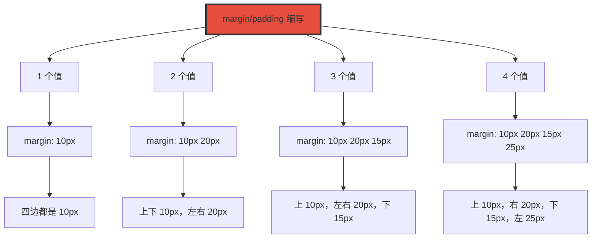

+++
title = "第5章 CSS属性缩写与嵌套"
weight = 50
date = "2026-03-27T16:53:00+08:00"
type = "docs"
description = ""
isCJKLanguage = true
draft = false
+++

# 第五章：CSS 属性缩写与嵌套

> CSS 代码写长了会很繁琐。CSS 的缩写规则和嵌套语法就是来解决这个问题的。学会这些技巧，你的 CSS 代码会变得像诗歌一样优雅。

## 5.1 margin 和 padding 缩写

margin 和 padding 是最常用的属性之一，缩写规则相同，学会一个就学会了另一个。

### 5.1.1 一个值——margin: 10px;（四边都是 10px）

```css
/* 一个值：四个方向都相同 */
/* margin: 值;  等于  margin-top: 值; margin-right: 值; margin-bottom: 值; margin-left: 值; */

margin: 10px;
/* 等于： */
margin-top: 10px;
margin-right: 10px;
margin-bottom: 10px;
margin-left: 10px;

padding: 15px;
/* 等于： */
padding-top: 15px;
padding-right: 15px;
padding-bottom: 15px;
padding-left: 15px;

/* 实用场景：按钮的内边距 */
.btn {
  padding: 12px;  /* 上下左右都是 12px */
}

/* 居中块级元素 */
.center-block {
  margin: 0 auto;  /* 上下 0，左右 auto（居中）*/
}

/* 重置外边距 */
.reset-margin {
  margin: 0;  /* 所有方向都是 0 */
}
```

### 5.1.2 两个值——margin: 10px 20px;（上下 10px，左右 20px）

```css
/* 两个值：第一个值给上下，第二个值给左右 */
/* margin: 上下 左右; */

margin: 10px 20px;
/* 等于： */
margin-top: 10px;
margin-right: 20px;
margin-bottom: 10px;
margin-left: 20px;

/* 实用场景：标题的上下外边距和水平内边距 */
.card-title {
  margin: 20px 0;  /* 上下 20px，左右 0 */
}

/* 按钮的内边距：垂直 12px，水平 24px */
.btn {
  padding: 12px 24px;
}

/* 图标和文字的水平间距 */
.icon-text {
  padding: 8px 16px;
}
```

### 5.1.3 三个值——margin: 10px 20px 15px;（上 10px，左右 20px，下 15px）

```css
/* 三个值：第一个给上，第二个给左右，第三个给下 */
/* margin: 上 左右 下; */

margin: 10px 20px 15px;
/* 等于： */
margin-top: 10px;
margin-right: 20px;
margin-bottom: 15px;
margin-left: 20px;

/* 实用场景：文章段落的间距 */
.article-paragraph {
  margin: 0 auto 20px;  /* 上 0，左右 auto（水平居中），下 20px */
}

/* 导航链接的内边距 */
.nav-link {
  padding: 16px 20px 12px;  /* 上 16px，右 20px，下 12px，左 20px */
}

/* 卡片组件 */
.card {
  padding: 30px 20px 20px;  /* 上 30px，左右 20px，下 20px */
}
```

### 5.1.4 四个值——margin: 10px 20px 15px 25px;（上 10px，右 20px，下 15px，左 25px，顺时针）

```css
/* 四个值：按顺时针顺序，从顶部开始 */
/* margin: 上 右 下 左; */

margin: 10px 20px 15px 25px;
/* 等于： */
margin-top: 10px;       /* 上 = 10px */
margin-right: 20px;     /* 右 = 20px */
margin-bottom: 15px;    /* 下 = 15px */
margin-left: 25px;      /* 左 = 25px */

/* 记忆口诀：上右下左，顺时针一圈 */

/* 实用场景：精细控制元素间距 */
.detail-item {
  margin: 5px 10px 5px 15px;
  /* 上 5px，右 10px，下 5px，左 15px */
}

/* 页面容器的水平居中 + 顶部间距 */
.page-container {
  margin: 0 auto;  /* 如果只需要上下相同，左右 auto */
}

/* 重置所有间距 */
.no-spacing {
  margin: 0;
  padding: 0;
}
```

**margin/padding 缩写速查表：**

| 值数量 | 语法 | 效果 |
|--------|------|------|
| 1 个值 | `margin: 10px` | 四边都是 10px |
| 2 个值 | `margin: 10px 20px` | 上下 10px，左右 20px |
| 3 个值 | `margin: 10px 20px 15px` | 上 10px，左右 20px，下 15px |
| 4 个值 | `margin: 10px 20px 15px 25px` | 上 10px，右 20px，下 15px，左 25px |



## 5.2 font 缩写

font 属性是 CSS 中最复杂的缩写之一，它可以把多个字体相关属性合并成一行。

### 5.2.1 完整顺序——font: font-style font-variant font-weight font-size/line-height font-family

```css
/* font 缩写完整格式： */
/* font: style variant weight size/line-height family; */

/* 各属性顺序很重要！ */
/* 1. font-style（可选）*/
/* 2. font-variant（可选）*/
/* 3. font-weight（可选）*/
/* 4. font-size（必填）/line-height（可选）*/
/* 5. font-family（必填）*/

font: italic small-caps bold 16px/1.5 "Microsoft YaHei", sans-serif;

/*     │       │         │    │       │                    │
        │       │         │    │       │                    └── 字体族（必须）
        │       │         │    │       └── 行高（可选）
        │       │         │    └── 字号（必须）
        │       │         └── 字重（可选）
        │       └── 小型大写字母变体（可选）
        └── 字体样式（可选）
```

### 5.2.2 必须包含 font-size 和 font-family，其他可省略

```css
/* 最小化的 font 缩写：必须包含 size 和 family */
font: 16px "Microsoft YaHei";           /* 字号 + 字体 */

/* 常用组合示例 */
font: 14px/1.5 "Helvetica Neue";        /* 字号 + 行高 + 字体 */

/* 常用字体族 */
font: 16px Arial, sans-serif;           /* sans-serif 无衬线字体 */
font: 16px "Times New Roman", serif;     /* serif 衬线字体 */
font: 16px "Fira Code", monospace;       /* monospace 等宽字体 */

/* 完整写法 vs 缩写写法对比 */
.full {
  font-style: normal;
  font-variant: normal;
  font-weight: bold;
  font-size: 16px;
  line-height: 1.5;
  font-family: "Microsoft YaHei", sans-serif;
}

.shorthand {
  font: bold 16px/1.5 "Microsoft YaHei", sans-serif;
}

/* 常用场景 */
body {
  font: 16px/1.6 "Microsoft YaHei", "Segoe UI", sans-serif;
}

h1 {
  font: bold 32px/1.2 "Microsoft YaHei", sans-serif;
}

h2 {
  font: 600 24px/1.3 "Microsoft YaHei", sans-serif;
}

.caption {
  font: 12px/1.4 Arial, sans-serif;
  color: #666;
}
```


## 5.3 background 缩写

background 属性是所有背景相关属性的缩写。

### 5.3.1 顺序——background: color image repeat attachment position/size

```css
/* background 完整缩写顺序：*/
/* background: color image repeat attachment position/size */

/* 各属性说明：*/
/* 1. background-color（可选）*/
/* 2. background-image（可选）*/
/* 3. background-repeat（可选）*/
/* 4. background-attachment（可选）*/
/* 5. background-position / background-size（可选）*/

.hero {
  background:
    #3498db                    /* 颜色 */
    url("hero-bg.jpg")         /* 图片 */
    no-repeat                  /* 平铺方式 */
    center                     /* 位置 */
    / cover;                   /* 尺寸（/ 分隔）*/
}

/* 等同于：*/
.hero {
  background-color: #3498db;
  background-image: url("hero-bg.jpg");
  background-repeat: no-repeat;
  background-attachment: scroll;
  background-position: center;
  background-size: cover;
}

/* 常用场景 */
.page-header {
  background:
    linear-gradient(135deg, #667eea 0%, #764ba2 100%)
    no-repeat
    center
    / cover;
}

/* 渐变 + 纯色叠加 */
.card {
  background:
    rgba(52, 152, 219, 0.8)   /* 半透明色层 */
    url("texture.png")         /* 纹理图片 */
    center;                    /* 居中 */
}
```

## 5.4 border 缩写

border 属性可以同时设置宽度、样式和颜色。

### 5.4.1 基本写法——border: width style color，如 border: 1px solid #333;

```css
/* border 缩写格式：*/
/* border: width style color */

/* 1px = 宽度，solid = 样式（实线），#333 = 颜色 */

.card {
  border: 1px solid #333;
}

/* 等同于：*/
.card {
  border-width: 1px;
  border-style: solid;
  border-color: #333;
}

/* 单独方向的 border */
.card {
  border-top: 2px solid #3498db;
  border-bottom: 1px dashed #ccc;
  border-left: 3px double #e74c3c;
  border-right: none;  /* 右边无边框 */
}

/* border-style 可选值：*/
.none { border-style: none; }      /* 无边框 */
.solid { border-style: solid; }    /* 实线 */
.dashed { border-style: dashed; }  /* 虚线 */
.dotted { border-style: dotted; }  /* 点线 */
.double { border-style: double; }  /* 双线 */
.groove { border-style: groove; }  /* 凹槽效果 */
.ridge { border-style: ridge; }   /* 凸脊效果 */
.inset { border-style: inset; }    /* 内凹效果 */
.outset { border-style: outset; } /* 外凸效果 */

/* 实用场景：按钮边框 */
.btn-outline {
  border: 2px solid #3498db;
  color: #3498db;
  background: transparent;
  transition: all 0.3s;
}

.btn-outline:hover {
  background: #3498db;
  color: white;
}
```

## 5.5 border-radius 缩写

border-radius 用于创建圆角。

### 5.5.1 一个值——border-radius: 10px;（四角都是 10px）

```css
/* 一个值：四个角都相同 */
.rounded {
  border-radius: 10px;
}

/* 等同于：*/
.rounded {
  border-top-left-radius: 10px;
  border-top-right-radius: 10px;
  border-bottom-right-radius: 10px;
  border-bottom-left-radius: 10px;
}

/* 常用值 */
.round-sm { border-radius: 4px; }
.round-md { border-radius: 8px; }
.round-lg { border-radius: 16px; }
.round-xl { border-radius: 24px; }
.round-full { border-radius: 9999px; }  /* 圆形 */
```

### 5.5.2 四个值——border-radius: 10px 20px 30px 40px;（左上 右上 右下 左下，顺时针）

```css
/* 四个值：按顺时针顺序，从左上角开始 */
/* border-radius: 左上 右上 右下 左下; */

.corners {
  border-radius: 10px 20px 30px 40px;
}

/* 等同于：*/
.corners {
  border-top-left-radius: 10px;
  border-top-right-radius: 20px;
  border-bottom-right-radius: 30px;
  border-bottom-left-radius: 40px;
}

/* 对称写法：第一个和第三个相同，第二个和第四个相同 */
/* border-radius: 10px 20px; */
/* 等于：10px 20px 10px 20px */
```

### 5.5.3 椭圆写法——border-radius: 50% / 50%;（x轴半径 / y轴半径）

```css
/* 椭圆圆角：水平半径 / 垂直半径 */

.ellipse {
  border-radius: 50% / 50%;
  /* 50% / 50% = 圆形 */
}

/* 椭圆示例 */
.oval {
  width: 200px;
  height: 100px;
  border-radius: 50% / 50%;
  /* 水平方向是宽度的一半，垂直方向是高度的一半 = 完美椭圆 */
}

/* 不同角的椭圆 */
.fancy {
  border-radius: 20px 40px 60px 80px / 10px 20px 30px 40px;
  /* 水平方向四个角 */
  /* / 垂直方向四个角 */
}

/* 实用场景：药丸形按钮 */
.pill-btn {
  border-radius: 9999px;
  padding: 12px 24px;
}

/* 实用场景：半圆 */
.half-circle {
  width: 100px;
  height: 50px;
  border-radius: 50px 50px 0 0;
}
```

## 5.6 flex 缩写

flex 属性是 flex-grow、flex-shrink 和 flex-basis 的缩写。

### 5.6.1 flex: 1——等于 flex: 1 1 0%

```css
/* flex: 1 的完整含义：*/
/* flex-grow: 1（项目可以放大）*/
/* flex-shrink: 1（项目可以缩小）*/
/* flex-basis: 0%（基准尺寸为 0）*/

.flex-item {
  flex: 1;
}

/* 等同于：*/
.flex-item {
  flex-grow: 1;
  flex-shrink: 1;
  flex-basis: 0%;
}

/* 场景：三栏等宽布局 */
.flex-container {
  display: flex;
}

.flex-item {
  flex: 1;
  /* 三个项目平分空间 */
}
```

### 5.6.2 flex: auto——等于 flex: 1 1 auto

```css
/* flex: auto 的完整含义：*/
/* flex-grow: 1（项目可以放大）*/
/* flex-shrink: 1（项目可以缩小）*/
/* flex-basis: auto（基准尺寸为自身内容尺寸）*/

.flex-item-auto {
  flex: auto;
}

/* 等同于：*/
.flex-item-auto {
  flex-grow: 1;
  flex-shrink: 1;
  flex-basis: auto;
}

/* 场景：中间区域自适应，侧边栏固定 */
.sidebar-left {
  flex: 0 0 250px;  /* 不放大，不缩小，固定 250px */
}

.main-content {
  flex: auto;        /* 自动适应剩余空间 */
}

.sidebar-right {
  flex: 0 0 200px;  /* 不放大，不缩小，固定 200px */
}
```

### 5.6.3 flex: none——等于 flex: 0 0 auto

```css
/* flex: none 的完整含义：*/
/* flex-grow: 0（不放大）*/
/* flex-shrink: 0（不缩小）*/
/* flex-basis: auto（基准尺寸为自身内容尺寸）*/

.flex-item-fixed {
  flex: none;
}

/* 等同于：*/
.flex-item-fixed {
  flex-grow: 0;
  flex-shrink: 0;
  flex-basis: auto;
}

/* 场景：按钮不参与 flex 分配空间 */
.flex-container {
  display: flex;
  align-items: center;
}

.label {
  flex: none;  /* 标签保持原大小 */
}

.input {
  flex: 1;    /* 输入框占据剩余空间 */
}
```

**flex 缩写速查表：**

| 缩写 | 完整写法 | 说明 |
|------|----------|------|
| flex: 1 | flex: 1 1 0% | 项目可伸缩，基准为 0 |
| flex: auto | flex: 1 1 auto | 项目可伸缩，基准为自身 |
| flex: none | flex: 0 0 auto | 项目固定，不伸缩 |
| flex: 0 0 200px | flex: 0 0 200px | 固定宽度 200px |
| flex: 1 0 300px | flex: 1 0 300px | 最小 300px，可放大 |

## 5.7 gap 缩写

gap 属性用于设置网格或 flex 项目之间的间距。

### 5.7.1 一个值——gap: 10px;（行间距和列间距都是 10px）

```css
/* 一个值：行列间距相同 */
.grid-container {
  display: flex;
  flex-wrap: wrap;
  gap: 20px;
  /* 等于：row-gap: 20px; column-gap: 20px; */
}

.grid-container {
  display: grid;
  grid-template-columns: repeat(3, 1fr);
  gap: 20px;
}
```

### 5.7.2 两个值——gap: 10px 20px;（行间距 10px，列间距 20px）

```css
/* 两个值：第一个是行间距，第二个是列间距 */
.grid-container {
  display: grid;
  grid-template-columns: repeat(3, 1fr);
  gap: 20px 40px;
  /* 等于：row-gap: 20px; column-gap: 40px; */
}

/* 场景：卡片网格，行间距大，列间距小 */
.card-grid {
  display: flex;
  flex-wrap: wrap;
  gap: 24px 16px;
  /* 行间距 24px，列间距 16px */
}
```

## 5.8 逻辑属性缩写

逻辑属性是 CSS 近年来的重要改进，它使用逻辑方向而不是物理方向，让 RTL（从右到左）语言更容易支持。

### 5.8.1 margin-block——margin-block-start + margin-block-end

```css
/* 逻辑属性 vs 物理属性对比：*/
/* 物理属性：margin-top / margin-right / margin-bottom / margin-left */
/* 逻辑属性：margin-block-start / margin-block-end / margin-inline-start / margin-inline-end */

/* margin-block = 上下边距 */
.block-margin {
  margin-block: 20px;
  /* 等于：*/
  /* ltr: margin-top + margin-bottom */
  /* rtl: margin-top + margin-bottom（不变，因为是块方向）*/
}

/* margin-block-start = 上边距 */
.block-start {
  margin-block-start: 20px;
  /* 等于：*/
  /* ltr: margin-top */
  /* rtl: margin-top */
}

/* margin-block-end = 下边距 */
.block-end {
  margin-block-end: 20px;
  /* 等于：*/
  /* ltr: margin-bottom */
  /* rtl: margin-bottom */
}
```

### 5.8.2 margin-inline——margin-inline-start + margin-inline-end

```css
/* margin-inline = 左右边距 */
.inline-margin {
  margin-inline: 20px;
  /* 等于：*/
  /* ltr: margin-left + margin-right */
  /* rtl: margin-right + margin-left（自动翻转！）*/
}

/* 场景：文本段落 */
.paragraph {
  margin-inline: auto;  /* 水平居中 */
  max-width: 70ch;
}

/* margin-inline-start = 左边距（ltr）/ 右边距（rtl）*/
.inline-start {
  margin-inline-start: 10px;
}

/* margin-inline-end = 右边距（ltr）/ 左边距（rtl）*/
.inline-end {
  margin-inline-end: 10px;
}
```

### 5.8.3 padding-block——padding-block-start + padding-block-end

```css
/* padding-block = 上下内边距 */
.block-padding {
  padding-block: 20px;
  /* 等于：padding-top + padding-bottom */
}

/* padding-block-start = 上内边距 */
.block-start-padding {
  padding-block-start: 20px;
}

/* padding-block-end = 下内边距 */
.block-end-padding {
  padding-block-end: 20px;
}
```

### 5.8.4 padding-inline——padding-inline-start + padding-inline-end

```css
/* padding-inline = 左右内边距 */
.inline-padding {
  padding-inline: 20px;
  /* 等于：padding-left + padding-right（ltr）*/
}

/* 场景：按钮 */
.btn {
  padding-inline: 16px;
  padding-block: 8px;
}
```

### 5.8.5 inset——对应物理方向 top + right + bottom + left 的逻辑缩写

```css
/* inset 属性一次性设置 top、right、bottom、left */
.positioned {
  /* 四个值：上右下左 */
  inset: 10px 20px 15px 25px;
  /* 等于：*/
  /* top: 10px; right: 20px; bottom: 15px; left: 25px; */
}

/* 两个值：上下、左右 */
.positioned-center {
  inset: 0 auto;
  /* 等于：top: 0; bottom: 0; left: auto; right: auto; */
}

/* inset: 0 auto = 垂直撑满（需 flex 配合才能水平居中）*/
/* 真正完全居中用 inset: 0 + margin: auto：*/
.modal-overlay {
  position: fixed;
  inset: 0;
  margin: auto;
  /* 等于 top/right/bottom/left 全 0 + 四周 margin auto */
  background: rgba(0, 0, 0, 0.5);
  display: flex;
  justify-content: center;
  align-items: center;
}

/* inset-block / inset-inline */
.relative-block {
  position: relative;
  inset-block: 20px;
  /* 等于：top: 20px; bottom: 20px; */
}

.relative-inline {
  position: relative;
  inset-inline: 20px;
  /* 等于：left: 20px; right: 20px;（ltr）*/
}
```

**物理属性 vs 逻辑属性对照表：**

| 物理属性 | 逻辑属性 | 说明 |
|----------|----------|------|
| margin-top | margin-block-start | 块方向开始 |
| margin-bottom | margin-block-end | 块方向结束 |
| margin-left | margin-inline-start | 行内方向开始 |
| margin-right | margin-inline-end | 行内方向结束 |
| padding-top | padding-block-start | - |
| border-top | border-block-start | - |
| top | inset-block-start | - |
| width | inline-size | 逻辑尺寸 |
| height | block-size | 逻辑尺寸 |

## 5.9 grid 缩写

grid 属性是多个 grid 相关属性的缩写。

### 5.9.1 grid-template 缩写——grid-template: rows / columns

```css
/* grid-template 缩写：*/
/* grid-template: rows / columns */

/* 简单用法 */
.grid-container {
  grid-template: 1fr 1fr 1fr / 1fr 2fr 1fr;
  /* 等于：*/
  /* grid-template-rows: 1fr 1fr 1fr; */
  /* grid-template-columns: 1fr 2fr 1fr; */
}

/* 使用 repeat() */
.grid-container {
  grid-template: repeat(3, 1fr) / repeat(4, 1fr);
  /* 等于：*/
  /* grid-template-rows: 1fr 1fr 1fr; */
  /* grid-template-columns: 1fr 1fr 1fr 1fr; */
}

/* 常用布局 */
.page-layout {
  grid-template: auto 1fr auto / 250px 1fr;
  /* rows: auto（header）1fr（main）auto（footer）*/
  /* columns: 250px（sidebar）1fr（content）*/
}
```

### 5.9.2 grid 缩写（完整写法）——grid: grid-template-rows / grid-template-columns

```css
/* grid 缩写是最完整的版本：*/
/* grid: grid-template-rows / grid-template-columns */
/* 同时隐式设置 grid-auto-columns、grid-auto-rows 和 grid-auto-flow */

.page {
  display: grid;
  grid-template: auto 1fr auto / 250px 1fr;
  /* 等于设置：*/
  /* grid-template-rows: auto 1fr auto; */
  /* grid-template-columns: 250px 1fr; */
  /* grid-template-areas: none; */
  /* grid-auto-flow: row; */
  /* grid-auto-rows: auto; */
  /* grid-auto-columns: auto; */
}

/* 使用 grid-area 命名 */
.dashboard {
  display: grid;
  grid-template:
    "header header header" auto
    "sidebar main aside" 1fr
    "footer footer footer" auto
    / 200px 1fr 150px;
  min-height: 100vh;
  gap: 1rem;
}

.dashboard > header { grid-area: header; }
.dashboard > aside:first-of-type { grid-area: sidebar; }
.dashboard > main { grid-area: main; }
.dashboard > aside:last-of-type { grid-area: aside; }
.dashboard > footer { grid-area: footer; }
```

## 5.10 CSS 嵌套（原生嵌套）

CSS 原生嵌套是 2023 年的重磅新特性，让 CSS 可以像 Sass 一样嵌套选择器。

### 5.10.1 基本语法——父选择器内直接写子规则

```css
/* CSS 原生嵌套语法 */
.card {
  background: white;
  border-radius: 8px;
  box-shadow: 0 2px 8px rgba(0, 0, 0, 0.1);

  /* 直接写子选择器，浏览器会自动添加父选择器 */
  .card-header {
    padding: 15px 20px;
    border-bottom: 1px solid #eee;

    h3 {
      margin: 0;
      font-size: 18px;
      color: #333;
    }
  }

  .card-body {
    padding: 20px;
  }
}
```

### 5.10.2 & 父选择器引用——& 代表父选择器

```css
/* & 代表父选择器 */
.nav {
  background: #333;
  padding: 15px 30px;

  /* &:hover 等于 .nav:hover */
  &:hover {
    background: #444;
  }

  /* &-item 等于 .nav-item */
  &-item {
    display: inline-block;
    padding: 8px 16px;

    /* 嵌套中再嵌套 */
    &:last-child {
      margin-right: 0;
    }
  }

  /* 组合选择器 */
  &.active {
    background: #3498db;
  }
}

/* 编译后等价于：*/
.nav { background: #333; padding: 15px 30px; }
.nav:hover { background: #444; }
.nav-item { display: inline-block; padding: 8px 16px; }
.nav-item:last-child { margin-right: 0; }
.nav.active { background: #3498db; }
```

### 5.10.3 无父选择器的嵌套——直接写属性名

```css
/* 直接写属性名，浏览器自动添加父选择器 */
.card {
  /* 浏览器理解为：.card { color: #333; } */
  color: #333;
  font-size: 16px;
  padding: 20px;

  /* 浏览器理解为：.card .card-title { font-size: 24px; } */
  .card-title {
    font-size: 24px;
    font-weight: bold;
  }
}

/* 注意：这种方式只能用于嵌套子选择器，不能用于伪类等 */
.card {
  &:hover {
    box-shadow: 0 4px 12px rgba(0, 0, 0, 0.15);
  }

  &:last-child {
    margin-bottom: 0;
  }
}
```

### 5.10.4 嵌套局限性——不支持 @media 查询、条件规则（@if/@else）等逻辑嵌套

```css
/* CSS 原生嵌套的限制：*/

/* ❌ 不支持 @if/@else 等逻辑语句 */
/* Sass 可以这样写：*/
.sass-example {
  @if $theme == dark {
    background: black;
    color: white;
  } @else {
    background: white;
    color: black;
  }
}

/* CSS 原生嵌套做不到，必须这样写：*/
.light-theme {
  background: white;
  color: black;
}

.dark-theme {
  background: black;
  color: white;
}

/* ❌ 不支持 @for/@each 等循环语句 */
/* Sass 可以生成网格类：*/
.sass-loop {
  @for $i from 1 through 12 {
    .col-#{$i} { width: calc(100% / 12 * #{$i}); }
  }
}

/* CSS 原生嵌套做不到，必须手写或用构建工具 */

/* ✅ 支持媒体查询嵌套 */
.card {
  padding: 20px;

  @media (max-width: 768px) {
    padding: 15px;

    .card-title {
      font-size: 18px;
    }
  }
}

/* ✅ 支持 @supports 嵌套 */
.card {
  @supports (backdrop-filter: blur(10px)) {
    backdrop-filter: blur(10px);
  }
}

/* ℹ️ @when 条件嵌套（来自 CSS 条件规则模块 Level 4，非嵌套模块 Level 1）*/
/* 这是一个较新的语法，浏览器支持有限 */
/*
@when supports(display: grid) {
  .grid-layout {
    display: grid;
    grid-template-columns: repeat(3, 1fr);
    gap: 20px;
  }
} @else {
  .grid-layout {
    display: flex;
    flex-wrap: wrap;
  }
}
*/
```

**CSS 嵌套 vs Sass 嵌套对比：**

| 功能 | CSS 原生嵌套 | Sass 嵌套 |
|------|-------------|-----------|
| 基本嵌套 | ✅ 支持 | ✅ 支持 |
| & 父选择器 | ✅ 支持 | ✅ 支持 |
| @media 嵌套 | ✅ 支持 | ✅ 支持 |
| @supports 嵌套 | ✅ 支持 | ✅ 支持 |
| @if/@else | ❌ 不支持 | ✅ 支持 |
| @for/@each | ❌ 不支持 | ✅ 支持 |
| @mixin/@include | ❌ 不支持 | ✅ 支持 |
| @when 条件嵌套 | ⚠️ 需 Level 4 模块 | ✅ 支持 |

> 💡 **注**：`@when` 条件嵌套来自 CSS 条件规则模块 Level 4（CSS Conditional Rules Module Level 4），不是 CSS 嵌套模块 Level 1，目前浏览器支持有限。

---

## 本章小结

恭喜你完成了第五章的学习！让我们来回顾一下这章的精华：

### 缩写规则速查表

```
margin/padding 缩写（顺时针）：
    ├── 1 值：margin: 10px          → 四边相同
    ├── 2 值：margin: 10px 20px    → 上下、左右
    ├── 3 值：margin: 10px 20px 15px → 上、左右、下
    └── 4 值：margin: 10px 20px 15px 25px → 上、右、下、左

font 缩写：
    └── font: style variant weight size/line-height family

background 缩写：
    └── background: color image repeat attachment position/size

flex 缩写：
    ├── flex: 1        → flex: 1 1 0%
    ├── flex: auto     → flex: 1 1 auto
    └── flex: none     → flex: 0 0 auto

gap 缩写：
    ├── gap: 10px      → 行列间距相同
    └── gap: 10px 20px → 行间距、列间距
```

### CSS 嵌套语法

```css
/* 基本嵌套 */
.parent {
  color: #333;

  .child {
    color: #666;
  }
}

/* & 父选择器引用 */
.button {
  color: white;

  &:hover {
    background: #2980b9;
  }
}

/* 无父选择器嵌套 */
.card {
  color: #333;  /* 直接写属性 */

  .card-title {
    font-size: 24px;
  }
}
```

### 逻辑属性 vs 物理属性

| 物理属性 | 逻辑属性 |
|----------|----------|
| margin-top | margin-block-start |
| margin-bottom | margin-block-end |
| margin-left | margin-inline-start |
| margin-right | margin-inline-end |

### 恭喜你完成 CSS 核心教程！

经过这 5 章的学习，你已经掌握了 CSS 的核心知识：

```
CSS 学习路线图：

第一章 CSS 基础
    ├── CSS 是什么
    ├── CSS 诞生故事
    └── CSS 解决什么问题

第二章 CSS 历史
    ├── 布局方式演变
    ├── 工具链演进
    ├── 框架演进
    ├── 新特性历史
    └── 浏览器兼容性

第三章 第一个 CSS 页面
    ├── 开发环境搭建
    ├── 三种引入方式
    └── DevTools 使用

第四章 CSS 语法基础
    ├── CSS 规则构成
    ├── 属性值类型
    └── CSS 注释

第五章 属性缩写与嵌套
    ├── margin/padding 缩写
    ├── font/background/border 缩写
    ├── flex/gap 缩写
    ├── 逻辑属性
    ├── grid 缩写
    └── CSS 嵌套
```

### 下一步学习建议

恭喜你完成了 CSS 核心教程！接下来你可以学习：

1. **CSS 布局进阶**：深入学习 Flexbox 和 Grid 的高级用法
2. **CSS 动画**：学习 @keyframes、transition、transform
3. **CSS 响应式设计**：媒体查询、容器查询、适配不同设备
4. **CSS 最佳实践**：BEM 命名规范、CSS 架构、设计系统
5. **实践项目**：动手做几个真实项目，如个人博客、电商首页等

### 实战项目建议

```
项目练习建议：

1. 个人简历页面
   - HTML 语义化结构
   - CSS 布局（Flexbox/Grid）
   - 响应式设计

2. 电商卡片组件
   - 图片 + 标题 + 价格 + 按钮
   - 悬停效果
   - 响应式网格布局

3. 博客文章页面
   - 导航栏
   - 侧边栏
   - 文章内容排版
   - 评论列表

4. 管理后台仪表盘
   - 侧边导航
   - 顶部统计卡片
   - 数据表格
   - 响应式布局
```

### 祝你学习愉快！

CSS 是前端开发的核心技能之一，掌握好这些基础知识，你已经具备了成为优秀前端工程师的基本功。继续加油，多写代码，多做项目，CSS 大师的称号在向你招手！🚀


