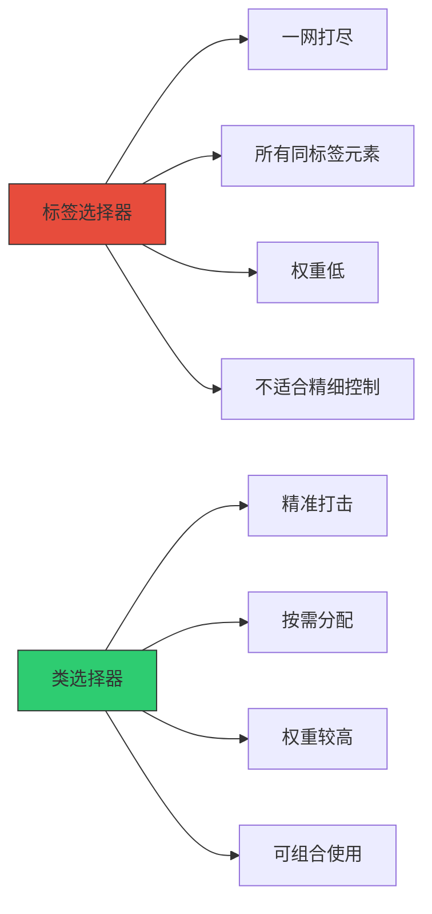
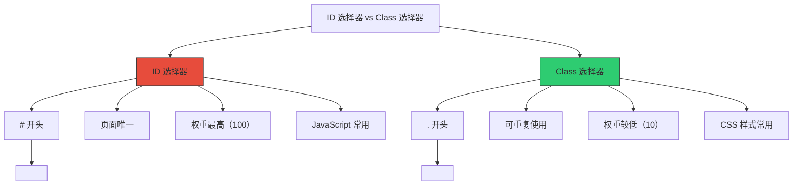
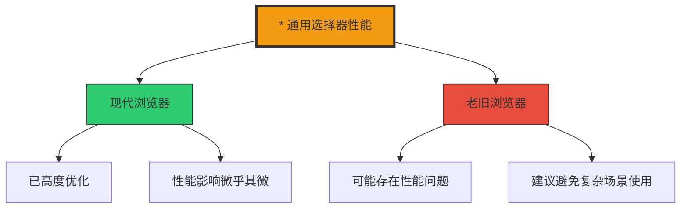
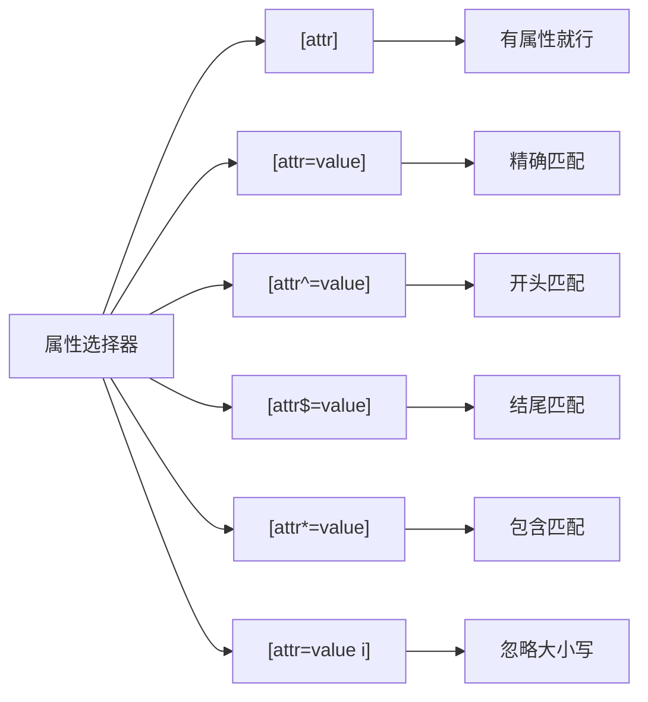

+++
title = "第6章 基础选择器"
weight = 60
date = "2026-03-27T16:53:00+08:00"
type = "docs"
description = ""
isCJKLanguage = true
draft = false
+++

# 第六章：基础选择器

> 选择器是 CSS 的"遥控器"，没有它你连电视都开不了。学会了选择器，你就能精准地控制页面上任意一个元素——是让它变红、变蓝，还是让它跳一段舞。本章我们就来认识这些"万能遥控器"。

## 6.1 标签选择器

### 6.1.1 用法——直接写 HTML 标签名，如 p { }、h1 { }

**标签选择器**（也叫元素选择器）是最基础的选择器，直接用 HTML 标签名作为"遥控器"。

```css
/* 选中所有的段落 */
p {
  color: #333;
  line-height: 1.8;
}

/* 选中所有的二级标题 */
h2 {
  font-size: 24px;
  color: #2c3e50;
  margin-bottom: 15px;
}

/* 选中所有的一级标题 */
h1 {
  font-size: 36px;
  font-weight: bold;
  color: #1a1a1a;
}

/* 选中所有的链接 */
a {
  color: #3498db;
  text-decoration: none;
}

/* 选中所有的图片 */
img {
  max-width: 100%;
  height: auto;
  display: block;
}

/* 选中所有的列表 */
ul, ol {
  padding-left: 25px;
  margin-bottom: 20px;
}

li {
  margin-bottom: 8px;
  line-height: 1.6;
}
```

**使用场景：**

```html
<!-- 当你写这样的 HTML -->
<h1>主标题</h1>
<h2>副标题</h2>
<p>这是一个段落。</p>
<p>这是另一个段落。</p>

<!-- CSS 标签选择器会选中所有对应标签 -->
```

### 6.1.2 作用——选中页面中所有该标签的元素

标签选择器的特点是"一网打尽"——选中页面上**所有**该标签的元素，不留一个。

```css
/* 选中所有按钮 */
button {
  cursor: pointer;
  padding: 10px 20px;
  border: none;
  border-radius: 6px;
  font-size: 16px;
}

/* 页面上不管有多少个 <button>，都会被选中 */
/* 这就是标签选择器的"集体作战"能力 */
```

**实际应用示例：**

```css
/* 全局重置某些标签的默认样式 */
body {
  margin: 0;
  padding: 0;
  font-family: "Microsoft YaHei", sans-serif;
}

h1, h2, h3, h4, h5, h6 {
  margin-top: 0;
  margin-bottom: 15px;
  font-weight: 600;
}

p {
  margin-top: 0;
  margin-bottom: 15px;
  line-height: 1.6;
}

a {
  color: #3498db;
  text-decoration: none;
}

a:hover {
  text-decoration: underline;
}

img {
  max-width: 100%;
  height: auto;
}
```

**标签选择器的优缺点：**

| 优点 | 缺点 |
|------|------|
| 简单直接，一目了然 | 会选中页面上所有该标签，无法精细控制 |
| 适合设置全局基础样式 | 权重低，容易被其他选择器覆盖 |

> 💡 **小技巧**：标签选择器适合设置**全局统一的基础样式**，但不适合需要精细控制的样式。

---

## 6.2 类选择器

### 6.2.1 用法——HTML 中 class="btn"，CSS 中 .btn { }

**类选择器**（Class Selector）是 CSS 中最常用的选择器，没有之一。它用 `.` 开头，后面跟你定义的类名。

```css
/* 定义一个叫 "btn" 的类 */
.btn {
  display: inline-block;
  padding: 12px 24px;
  background-color: #3498db;
  color: white;
  border-radius: 6px;
  font-size: 16px;
  cursor: pointer;
  transition: background-color 0.3s ease;
}

.btn:hover {
  background-color: #2980b9;
}

/* 定义一个叫 "card" 的类 */
.card {
  background: white;
  border-radius: 12px;
  padding: 20px;
  box-shadow: 0 4px 12px rgba(0, 0, 0, 0.1);
  margin-bottom: 20px;
}

/* 定义一个叫 "title" 的类 */
.title {
  font-size: 24px;
  font-weight: bold;
  color: #2c3e50;
  margin-bottom: 10px;
}

.text-center {
  text-align: center;
}

.text-red {
  color: #e74c3c;
}
```

```html
<!-- HTML 中使用 class 属性引用 -->
<button class="btn">点击我</button>
<div class="card">
  <h3 class="title">卡片标题</h3>
  <p>卡片内容...</p>
</div>
<a href="#" class="btn btn-primary">主要按钮</a>
```

### 6.2.2 一个元素可有多个 class（空格分隔）

这是类选择器的"超能力"——一个元素可以同时拥有多个类，就像一个人可以穿多件衣服！

```css
/* 基础按钮样式 */
.btn {
  padding: 12px 24px;
  border-radius: 6px;
  font-size: 16px;
  cursor: pointer;
}

/* 颜色变体 */
.btn-primary {
  background-color: #3498db;
  color: white;
}

.btn-danger {
  background-color: #e74c3c;
  color: white;
}

.btn-success {
  background-color: #2ecc71;
  color: white;
}

/* 尺寸变体 */
.btn-large {
  padding: 16px 32px;
  font-size: 18px;
}

.btn-small {
  padding: 8px 16px;
  font-size: 14px;
}

/* 边框变体 */
.btn-outline {
  background-color: transparent;
  border: 2px solid #3498db;
  color: #3498db;
}

/* 组合使用：一个大号的成功按钮 */
.btn-large.btn-success {
  padding: 20px 40px;
  font-size: 20px;
}
```

```html
<!-- 一个元素可以同时使用多个类 -->
<button class="btn btn-primary">主要按钮</button>
<button class="btn btn-danger">危险按钮</button>
<button class="btn btn-large btn-success">大号成功按钮</button>
<button class="btn btn-small btn-outline">小号边框按钮</button>

<!-- 更有意思的组合 -->
<div class="card shadow-lg rounded-lg">大阴影卡片</div>
<div class="card shadow-sm rounded-full">小阴影圆形卡片</div>
<div class="title text-center text-red">红色居中标题</div>
```

**类选择器的命名规范（BEM 命名法示例）：**

```css
/* BEM = Block Element Modifier */

/* Block */
.card {
  padding: 20px;
  border-radius: 8px;
}

/* Element */
.card__title {
  font-size: 20px;
  margin-bottom: 10px;
}

.card__image {
  width: 100%;
  border-radius: 6px;
}

.card__content {
  color: #666;
}

/* Modifier */
.card--featured {
  border: 2px solid gold;
  background: linear-gradient(135deg, #fff9e6 0%, #fff 100%);
}

.card--dark {
  background: #333;
  color: white;
}

.card__title--small {
  font-size: 16px;
}
```

```html
<!-- BEM 命名法的 HTML -->
<article class="card card--featured">
  <h2 class="card__title card__title--small">特色卡片</h2>
  <div class="card__content">内容区域</div>
</article>

<article class="card card--dark">
  <h2 class="card__title">深色卡片</h2>
  <div class="card__content">内容区域</div>
</article>
```

**类选择器 vs 标签选择器对比：**



> 💡 **实战建议**：在现代 CSS 开发中，**类选择器是绝对的主力**。建议使用语义化的类名，如 `.nav`、`.header`、`.btn-primary`，而不是 `.red-text`、`.big-font` 这种纯描述样式的名字。

---

## 6.3 ID 选择器

### 6.3.1 用法——HTML 中 id="header"，CSS 中 #header { }

**ID 选择器**用 `#` 开头，就像人的身份证号——每个 ID 在整个页面中只能出现一次。

```css
/* 定义一个 ID 选择器 */
#header {
  height: 60px;
  background-color: #333;
  color: white;
  display: flex;
  align-items: center;
  justify-content: space-between;
  padding: 0 20px;
}

#footer {
  height: 80px;
  background-color: #f5f5f5;
  border-top: 1px solid #ddd;
  padding: 20px;
  text-align: center;
}

#main-content {
  min-height: calc(100vh - 140px);
  padding: 40px 20px;
}

#sidebar {
  width: 250px;
  background: white;
  border-right: 1px solid #eee;
  padding: 20px;
}
```

```html
<!-- HTML 中使用 id 属性 -->
<header id="header">
  <nav>导航栏</nav>
</header>

<main id="main-content">
  <h1>主要内容区域</h1>
  <p>这是页面的核心内容...</p>
</main>

<aside id="sidebar">
  <ul>
    <li>侧边栏内容</li>
    <li>侧边栏内容</li>
  </ul>
</aside>

<footer id="footer">
  <p>版权信息</p>
</footer>
```

### 6.3.2 id 应唯一，权重最高的基础选择器

ID 选择器的最大特点就是**唯一性**——每个 ID 在整个页面中只能出现一次。这就像身份证号，全中国14亿人，没有两个人的身份证号是一样的。

```css
/* ⚠️ 错误示范：一个页面出现多个相同的 id */
#header { background: blue; }
#header { background: red; }  /* 浏览器会一脸懵，不知道该听谁的 */

/* ✅ 正确做法：一个 id 只出现一次 */
/* #header { background: blue; } */
```

**ID 选择器的优先级是最高的（仅次于内联样式）：**

```css
/* ID 选择器权重：100 */
/* 类选择器权重：10 */
/* 标签选择器权重：1 */

#header { color: blue; }       /* 权重 100，优先级最高 */
.header { color: red; }          /* 权重 10 */
header { color: green; }          /* 权重 1 */

/* 如果同一个元素同时有这三种样式，最终颜色是 blue（ID 选择器胜出） */
```

```html
<header id="header" class="header">
  这个 header 是什么颜色？
</header>
```

**ID 选择器的"最佳使用场景"：**

```css
/* 1. 页面主要区块的锚点定位 */
#introduction { scroll-margin-top: 80px; }
#features { scroll-margin-top: 80px; }
#pricing { scroll-margin-top: 80px; }
#contact { scroll-margin-top: 80px; }

/* 2. 表单中唯一标识的字段 */
#username-input { border-color: #3498db; }
#password-input { border-color: #3498db; }
#email-input { border-color: #3498db; }

/* 3. JavaScript 需要操作的元素 */
#modal-overlay {
  position: fixed;
  top: 0;
  left: 0;
  right: 0;
  bottom: 0;
  background: rgba(0, 0, 0, 0.5);
}
```

**ID vs Class 选择器对比：**



> 💡 **实战建议**：虽然 ID 选择器权重很高，但在实际开发中**更推荐使用类选择器**。原因：
> 1. ID 选择器太"霸道"，很难被覆盖
> 2. 一个页面中 id 用多了容易冲突
> 3. JavaScript 获取元素时用 class 比用 id 更灵活
>
> **ID 选择器的最佳用途**：页面锚点和 JavaScript 操作元素。

---

## 6.4 通用选择器

### 6.4.1 用法——* { }，选中所有元素

**通用选择器**（Universal Selector）用 `*` 表示，它是 CSS 选择器中的"全能选手"——页面上每一个元素，它都要管！

```css
/* 选中页面上所有元素 */
* {
  margin: 0;
  padding: 0;
  box-sizing: border-box;
}

/* 这三行是 CSS Reset 的经典开头 */
/* 它把浏览器给所有元素加的默认 margin 和 padding 都清零了 */
```

### 6.4.2 用途——CSS Reset 中清除默认样式

通用选择器最常见的用途就是 **CSS Reset**——把浏览器的默认样式全部"归零"，从零开始打造你的设计。

```css
/* 经典 CSS Reset */
* {
  margin: 0;
  padding: 0;
  box-sizing: border-box;
}

/* 更完整的 Reset */
*,
*::before,
*::after {
  margin: 0;
  padding: 0;
  box-sizing: border-box;
}

/* 然后再建立自己的基础样式 */
body {
  font-family: "Microsoft YaHei", "Segoe UI", sans-serif;
  line-height: 1.6;
  color: #333;
  background-color: #fff;
}

a {
  color: inherit;
  text-decoration: none;
}

ul, ol {
  list-style: none;
}

img {
  max-width: 100%;
  height: auto;
  display: block;
}

button {
  cursor: pointer;
  border: none;
  background: none;
  font: inherit;
}

input, textarea, select {
  font: inherit;
}
```

**通用选择器的其他用途：**

```css
/* 选中页面上的所有元素 */
* {
  /* 有些设计师喜欢在这里加过渡效果 */
  transition: all 0.3s ease;
}

/* 但是这样会很慢！因为每个元素的每个属性变化都会触发过渡 */
/* 所以更好的做法是指定具体属性 */
/* transition: background-color 0.3s, transform 0.2s; */
```

```css
/* 选中所有没有类的元素（调试用） */
/* 这在排查样式问题时很有用 */
/* *:not([class]) {
     outline: 1px dashed red;
   } */

/* 选中所有直接子元素 */
.container > * {
  margin-bottom: 20px;
}

/* 选中 body 的所有后代元素 */
body * {
  /* 某些调试场景会用到 */
}
```

**通用选择器的权重：**

```css
/* 通用选择器的权重是 0 */
/* * { color: red; }  ← 权重 0 */
/* 这意味着任何其他选择器都能覆盖它 */

* {
  color: red;  /* 所有元素默认红色 */
}

p {
  color: blue;  /* 段落是蓝色，权重 1 > 0 */
}

.highlight {
  color: yellow;  /* 高亮是黄色，权重 10 > 1 */
}

#special {
  color: green;  /* 特殊是绿色，权重 100 > 10 */
}
```

**通用选择器性能考量：**



> 💡 **性能小贴士**：在老旧的浏览器（如 IE6-7）中，通用选择器 `*` 可能会导致性能问题，因为浏览器需要检查页面上每一个元素。但在现代浏览器中，这个问题已经不存在了，可以放心使用。

---

## 6.5 属性选择器

### 6.5.1 [attr]——具有该属性的元素

**属性选择器**是最"挑剔"的选择器——它只选择那些"身上挂着特定牌子"的元素。这个"牌子"就是 HTML 属性。

```css
/* 选中所有具有 href 属性的链接 */
a[href] {
  color: #3498db;
  text-decoration: none;
}

/* 选中所有具有 disabled 属性的按钮 */
button[disabled] {
  opacity: 0.5;  /* 变灰，表示不可用 */
  cursor: not-allowed;
}

/* 选中所有具有 placeholder 属性的输入框 */
input[placeholder] {
  color: #999;
  background-color: #f5f5f5;
}
```

### 6.5.2 [attr=value]——属性值等于指定值

```css
/* 选中所有 type="text" 的输入框 */
input[type="text"] {
  border: 1px solid #ddd;
  padding: 8px 12px;
  border-radius: 4px;
}

/* 选中所有 type="email" 的输入框 */
input[type="email"] {
  border-color: #3498db;
}

/* 选中所有 type="password" 的输入框 */
input[type="password"] {
  /* 密码输入框特殊处理 */
}

/* 选中所有 target="_blank" 的链接（打开新窗口的链接）*/
a[target="_blank"] {
  /* 给这些链接加个小图标提示 */
}

a[target="_blank"]::after {
  content: " ↗";  /* 加个外链图标 */
}

/* 选中所有 rel="nofollow" 的链接 */
a[rel="nofollow"] {
  color: #666;
}
```

### 6.5.3 [attr^=value]——属性值以指定值开头

```css
/* 选中所有 href 以 http 开头的链接（外部链接）*/
a[href^="http"] {
  color: #3498db;
  font-weight: 500;
}

/* 选中所有 href 以 / 开头的链接（站内链接）*/
a[href^="/"] {
  color: #2c3e50;
}

/* 选中所有以 image/ 开头的图片（预防图片加载失败显示）*/
img[src^="image/"] {
  border-radius: 8px;
}

/* 选中所有 class 以 "btn-" 开头的元素（按钮系列）*/
[class^="btn-"] {
  display: inline-flex;
  align-items: center;
  justify-content: center;
  padding: 10px 20px;
  border-radius: 6px;
  font-weight: 500;
  cursor: pointer;
  transition: all 0.2s;
}
```

### 6.5.4 [attr$=value]——属性值以指定值结尾

```css
/* 选中所有 href 以 .pdf 结尾的链接（PDF 文档）*/
a[href$=".pdf"] {
  color: #e74c3c;  /* 红色表示文档 */
}

a[href$=".pdf"]::before {
  content: "📄 ";  /* 加个 PDF 图标 */
}

/* 选中所有 href 以 .doc 结尾的链接（Word 文档）*/
a[href$=".doc"],
a[href$=".docx"] {
  color: #3498db;
}

a[href$=".doc"]::before,
a[href$=".docx"]::before {
  content: "📝 ";
}

/* 选中所有 src 以 .jpg 结尾的图片 */
img[src$=".jpg"] {
  border: 1px solid #ddd;
}

/* 选中所有 href 以 / 结尾的链接（导航链接常见写法）*/
a[href$="/"] {
  font-weight: bold;
}
```

### 6.5.5 [attr*=value]——属性值包含指定值

```css
/* 选中所有 href 中包含 "google" 的链接 */
a[href*="google"] {
  color: #4285f4;
}

/* 选中所有 href 中包含 "github" 的链接 */
a[href*="github"] {
  color: #333;
}

/* 选中所有 src 中包含 "avatar" 的图片（头像）*/
img[src*="avatar"] {
  border-radius: 50%;  /* 圆形头像 */
  border: 3px solid #fff;
  box-shadow: 0 2px 8px rgba(0, 0, 0, 0.15);
}

/* 选中所有 class 中包含 "active" 的元素 */
[class*="active"] {
  background-color: #f0f0f0;
  border-left: 3px solid #3498db;
}

/* 选中所有 title 中包含 "重要" 的元素 */
[title*="重要"] {
  color: #e74c3c;
  font-weight: bold;
}
```

### 6.5.6 [attr=value i]——i 修饰符表示大小写不敏感

```css
/* 选中所有 lang="en" 的元素（不区分大小写）*/
html[lang="en" i] {
  /* 无论 HTML 写的是 lang="EN" 还是 lang="en" 都能匹配 */
}

/* 选中所有 type="TEXT" 的输入框 */
input[type="text" i] {
  border-color: #3498db;
}

/* 选中所有 class="BTN-PRIMARY" 的元素 */
[class="btn-primary" i] {
  background-color: #3498db;
  color: white;
}

/* 区分大小写的写法（默认行为，不加 i）*/
input[type="text" s] {
  /* 只有 type="text" 能匹配，type="TEXT" 不行 */
  /* s 表示大小写敏感（case-Sensitive）*/
}
```

**属性选择器汇总表：**

| 选择器 | 说明 | 示例 |
|--------|------|------|
| `[attr]` | 具有该属性的元素 | `a[href]` |
| `[attr=value]` | 属性值完全等于 | `input[type="text"]` |
| `[attr^=value]` | 属性值以...开头 | `a[href^="http"]` |
| `[attr$=value]` | 属性值以...结尾 | `a[href$=".pdf"]` |
| `[attr*=value]` | 属性值包含... | `a[href*="google"]` |
| `[attr=value i]` | 大小写不敏感 | `div[class="btn" i]` |

**属性选择器实战应用：**

```css
/* 1. 表单样式精细化 */
input[type="text"] { /* 文本输入框 */ }
input[type="email"] { /* 邮箱输入框 */ }
input[type="password"] { /* 密码输入框 */ }
input[type="number"] { /* 数字输入框 */ }
input[type="tel"] { /* 电话输入框 */ }
input[type="date"] { /* 日期选择器 */ }
input[type="time"] { /* 时间选择器 */ }
input[type="file"] { /* 文件上传 */ }
input[type="range"] { /* 滑块 */ }
input[type="color"] { /* 颜色选择器 */ }

/* 2. 根据 data-* 属性选择 */
[data-status="active"] {
  color: green;
}

[data-status="inactive"] {
  color: gray;
}

[data-role="admin"] {
  background: #fff3cd;
  border: 1px solid #ffc107;
}

/* 3. 根据 aria-* 属性选择（无障碍相关）*/
[aria-disabled="true"] {
  opacity: 0.5;
  pointer-events: none;
}

[aria-expanded="true"] .expand-icon {
  transform: rotate(180deg);
}

/* 4. 打印样式：隐藏所有外部链接的实际 URL 显示 */
@media print {
  a[href^="http"]::after {
    content: " (" attr(href) ")";
    font-size: 10px;
    color: #666;
  }
}
```



---

## 本章小结

恭喜你完成了第六章的学习！让我们来回顾一下这章的精华：

### 核心知识点

| 选择器 | 语法 | 说明 |
|--------|------|------|
| 标签选择器 | `p`, `h1` | 选中所有该标签 |
| 类选择器 | `.btn` | 选中所有该类，可复用 |
| ID 选择器 | `#header` | 页面唯一，权重最高 |
| 通用选择器 | `*` | 选中所有元素 |
| 属性选择器 | `[href]`, `[type="text"]` | 按属性筛选 |

### 选择器权重速查

```
权重从高到低：
  内联样式（style="..."）> ID选择器（#id）> 类选择器（.class）> 标签选择器（p）> 通用选择器（*）

换算成数字：
  1000（内联）> 100（ID）> 10（类）> 1（标签）> 0（通用）
```

### 实战建议

1. **样式用类，定位用 ID**：日常样式开发以类选择器为主
2. **ID 不要滥用**：一个页面中每个 ID 只用一次
3. **属性选择器很强大**：可以精准选中特定属性值的元素
4. **CSS Reset 必备**：通用选择器用于清除默认样式

### 下章预告

下一章我们将学习组合选择器与伪类，这是 CSS 选择器的"高级玩法"。通过组合选择器，你可以选中那些"嵌套在某个元素里面的某个元素"；通过伪类，你可以选中那些"第一个""最后一个""鼠标悬停的"元素。准备好了吗？


