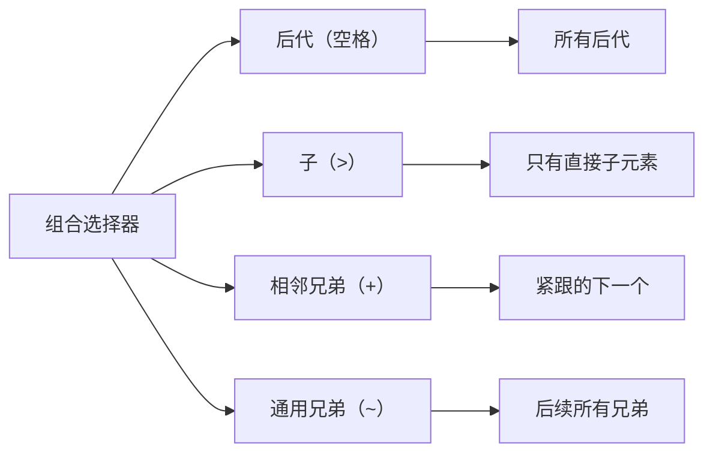
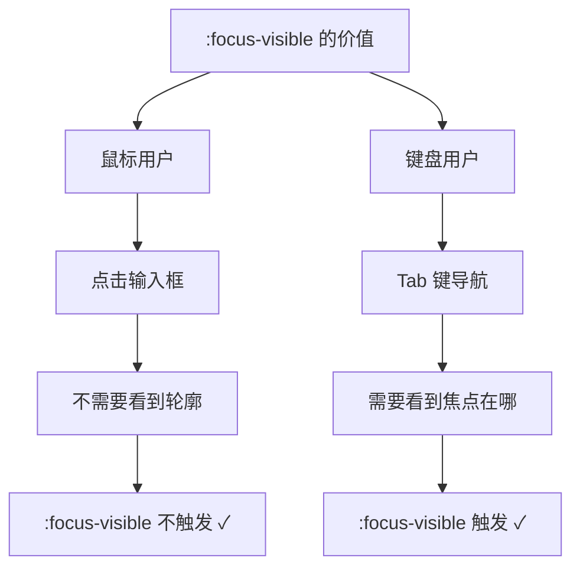
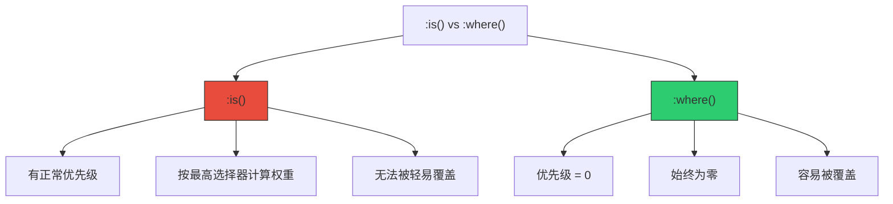
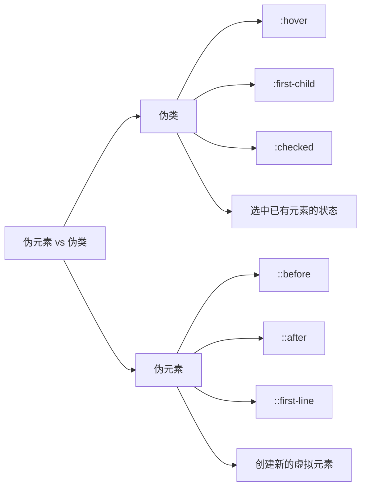
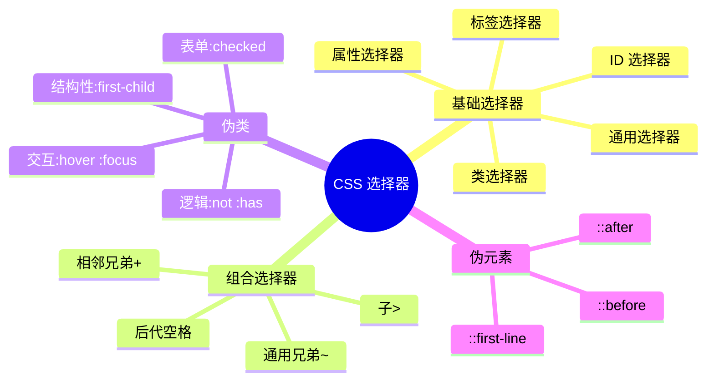

+++
title = "第7章 组合选择器与伪类"
weight = 70
date = "2026-03-27T16:53:00+08:00"
type = "docs"
description = ""
isCJKLanguage = true
draft = false
+++

# 第七章：组合选择器与伪类

> 如果说基础选择器是"单兵作战"，那组合选择器就是"联合作战"。学会了组合选择器，你就能选中那些"爸爸的儿子的孙子"——精确到骨头里去。而伪类呢，就是给元素加上各种"状态滤镜"：第一个孩子要表扬、鼠标悬停的要高亮、选中的要打勾... CSS 伪类就是来干这个的。

## 7.1 组合选择器

### 7.1.1 后代选择器（空格）——div p，选中 div 内所有 p

**后代选择器**（Descendant Selector）用空格连接两个选择器，表示"选中第一个选择器的后代中符合第二个选择器的所有元素"。

```css
/* 选中所有在 article 里面的 p 标签 */
article p {
  line-height: 1.8;
  margin-bottom: 15px;
}

/* 选中所有在 .sidebar 里面的链接 */
.sidebar a {
  color: #3498db;
  text-decoration: none;
}

.sidebar a:hover {
  text-decoration: underline;
}

/* 选中所有在 nav 里面的 ul 里面的 li */
nav ul li {
  display: inline-block;
  padding: 10px 15px;
}
```

```html
<!-- HTML 结构示例 -->
<article class="blog-post">
  <h2>文章标题</h2>
  <p>第一段内容，<strong>这段是粗体</strong>，也是后代。</p>
  <div class="quote">
    <p>引用段落，也是后代。</p>
  </div>
  <p>第二段内容。</p>
</article>
```

```css
/* article p 会选中所有这3个 p 标签 */
/* 因为它们都是 article 的后代 */
/* 不管嵌套多深都行 */
```

**后代选择器的应用场景：**

```css
/* 1. 文章内容样式 */
.article-content p {
  font-size: 16px;
  line-height: 1.8;
  color: #333;
  margin-bottom: 1em;
}

.article-content h2 {
  font-size: 24px;
  color: #2c3e50;
  margin-top: 2em;
  margin-bottom: 0.5em;
}

.article-content ul {
  padding-left: 25px;
  margin-bottom: 1em;
}

.article-content li {
  margin-bottom: 0.5em;
}

/* 2. 卡片内的标题和内容 */
.card-title {
  font-size: 20px;
}

.card-content p {
  font-size: 14px;
  color: #666;
  line-height: 1.6;
}
```

### 7.1.2 子选择器（>）——div > p，只选中直接子元素 p

**子选择器**（Child Selector）用 `>` 连接，表示"只选中直接子元素"，不包含孙子及更深层的后代。

```css
/* 后代选择器（空格）：选中所有后代 */
.article-content p {
  color: #333;
}

/* 子选择器（>）：只选中直接子元素 */
.article-content > p {
  font-size: 18px;
  font-weight: bold;
}
```

```html
<!-- HTML 结构 -->
<article class="article-content">
  <p>直接子元素 p ← 子选择器会选中这个</p>

  <div class="wrapper">
    <p>孙子元素 p ← 子选择器不会选中这个！</p>
  </div>

  <div>
    <div>
      <p>曾孙子元素 p ← 子选择器更不会选中！</p>
    </div>
  </div>

  <p>另一个直接子元素 p ← 子选择器会选中这个</p>
</article>
```

**子选择器的应用场景：**

```css
/* 1. 只选中第一层的直接列表项 */
.nav > ul > li {
  display: inline-block;
}

/* 不包括嵌套在 li 里面的 ul 中的 li */

/* 2. 表单的直接子输入框 */
.form > input {
  border: 2px solid #3498db;
}

/* 不包括 form 里面 div 里面的 input */
```

### 7.1.3 相邻兄弟选择器（+）——h1 + p，选中 h1 后紧跟的 p

**相邻兄弟选择器**（Adjacent Sibling Selector）用 `+` 连接，表示"选中紧跟在第一个选择器后面的那个元素"。

```css
/* 选中紧跟在 h1 后面的 p */
h1 + p {
  font-size: 18px;
  color: #666;
  margin-top: 10px;
}

/* 选中紧跟在 .intro 后面的段落 */
.intro + p {
  color: #2c3e50;
  font-weight: 500;
}
```

```html
<h1>文章标题</h1>
<p>← 相邻兄弟选择器会选中这个 p</p>  <!-- 紧跟在 h1 后面 -->

<p>← 相邻兄弟选择器不会选中这个 p</p>  <!-- 没有紧跟 h1 -->

<div>中间插了一脚</div>

<p>← 相邻兄弟选择器不会选中这个 p</p>  <!-- h1 和 p 之间隔了 div -->
```

**相邻兄弟选择器的实际应用：**

```css
/* 1. 文章标题和正文的间距 */
h1 + p {
  margin-top: 20px;
  font-size: 1.2em;
  color: #666;
}

/* 2. 列表项之间的分隔线 */
.list-item + .list-item {
  border-top: 1px solid #eee;
  margin-top: 10px;
  padding-top: 10px;
}

/* 3. 第一个输入框不需要上边距 */
.input-group + .input-group {
  margin-top: 15px;
}
```

### 7.1.4 通用兄弟选择器（~）——h1 ~ p，选中 h1 后所有 p

**通用兄弟选择器**（General Sibling Selector）用 `~` 连接，表示"选中第一个选择器后面所有符合条件的兄弟元素"。

```css
/* 选中 h1 后所有的 p */
h1 ~ p {
  color: #666;
  line-height: 1.6;
}

/* 选中 .title 后面所有的 .item */
.title ~ .item {
  background: #f9f9f9;
  padding: 10px;
  margin-bottom: 5px;
}
```

```html
<h1>大标题</h1>
<p>← 通用兄弟选择器会选中这个</p>  <!-- 紧跟 -->
<p>← 通用兄弟选择器会选中这个</p>  <!-- 隔一个也选 -->
<p>← 通用兄弟选择器会选中这个</p>  <!-- 隔 N 个也选 -->
<div>不是 p，不会被选中</div>
<p>← 通用兄弟选择器会选中这个</p>  <!-- 还是选 -->
```

**组合选择器对比总结：**

| 选择器 | 语法 | 选中范围 |
|--------|------|----------|
| 后代 | `div p` | div 里面所有 p（包含孙子） |
| 子 | `div > p` | div 的直接子元素 p |
| 相邻兄弟 | `h1 + p` | h1 后面**紧跟**的 p |
| 通用兄弟 | `h1 ~ p` | h1 后面**所有** p |



---

## 7.2 结构性伪类

### 7.2.1 :root——文档根元素（HTML 中是 html），权重高于 html 选择器，常用于定义全局 CSS 变量

**`:root`** 是一个超级有用的伪类，它选中文档的根元素——在 HTML 中就是 `<html>` 标签。但是它的权重比直接写 `html {}` 更高，所以用它来定义 CSS 变量是最佳实践。

```css
/* 用 :root 定义全局 CSS 变量 */
:root {
  /* 颜色变量 */
  --primary-color: #3498db;
  --secondary-color: #2ecc71;
  --danger-color: #e74c3c;
  --warning-color: #f39c12;

  /* 字体变量 */
  --font-family: "Microsoft YaHei", "Segoe UI", sans-serif;
  --font-size-base: 16px;
  --line-height: 1.6;

  /* 间距变量 */
  --spacing-xs: 4px;
  --spacing-sm: 8px;
  --spacing-md: 16px;
  --spacing-lg: 24px;
  --spacing-xl: 32px;

  /* 圆角变量 */
  --border-radius-sm: 4px;
  --border-radius-md: 8px;
  --border-radius-lg: 16px;

  /* 阴影变量 */
  --shadow-sm: 0 2px 4px rgba(0, 0, 0, 0.1);
  --shadow-md: 0 4px 12px rgba(0, 0, 0, 0.15);
  --shadow-lg: 0 8px 24px rgba(0, 0, 0, 0.2);
}

/* 使用变量 */
.button {
  background-color: var(--primary-color);
  font-family: var(--font-family);
  padding: var(--spacing-md);
  border-radius: var(--border-radius-md);
  box-shadow: var(--shadow-sm);
}
```

```css
/* :root vs html 的权重对比 */

/* html 标签选择器，权重 = 1 */
html {
  font-size: 16px;
  color: #333;
}

/* :root 伪类选择器，权重 = 0-1-0（高于普通元素选择器） */
:root {
  font-size: 18px;  /* 会覆盖上面的 16px，因为伪类权重更高 */
  color: #666;       /* 会覆盖上面的 #333 */
}
```

### 7.2.2 :first-child——第一个子元素

**`:first-child`** 选中父元素下的第一个子元素。

```css
/* 选中每个列表的第一个项 */
li:first-child {
  font-weight: bold;
  color: #3498db;
}

/* 选中每个 .card 的第一个子元素 */
.card:first-child {
  border-top-left-radius: 12px;
  border-top-right-radius: 12px;
}

/* 选中 article 里面第一个 p */
article p:first-child {
  font-size: 18px;
  font-weight: 500;
}
```

```html
<ul>
  <li>← :first-child 会选中这个 ← :first-child 会选中这个</li>  <!-- 第一个 -->
  <li>第二个</li>
  <li>第三个</li>
</ul>
```

### 7.2.3 :last-child——最后一个子元素

**`:last-child`** 选中父元素下的最后一个子元素。

```css
/* 选中每个列表的最后一项 */
li:last-child {
  border-bottom: none;  /* 列表最后一项不加底边 */
}

/* 选中 .menu 的最后一个链接 */
.menu a:last-child {
  color: #e74c3c;  /* 最后一项标红 */
}

/* 选中 article 里面最后一个 p */
article p:last-child {
  margin-bottom: 0;  /* 最后一段落不加下边距 */
}
```

### 7.2.4 :first-of-type——同类型子元素的第一个

**`:first-of-type`** 和 `:first-child` 类似，但它是选中**同类型**子元素中的第一个。

```html
<div class="container">
  <p>第一个 p ← :first-child 和 :first-of-type 都选中它</p>
  <p>第二个 p</p>
  <span>第一个 span ← :first-of-type 会选中它</span>
  <p>第三个 p</p>
  <span>第二个 span</span>
</div>
```

```css
/* :first-child vs :first-of-type 的区别 */

.container > :first-child {
  /* 选中.container的直接子元素中的第一个（不管是什么标签） */
  background: #f0f0f0;
}

.container > :first-of-type {
  /* 选中.container的同类型子元素中的第一个 */
  background: #e0e0e0;
}
```

### 7.2.5 :last-of-type——同类型子元素的最后一个

**`:last-of-type`** 选中同类型子元素中的最后一个。

```css
/* 选中每种类型子元素的最后一个 */
p:last-of-type {
  margin-bottom: 0;
}

h2:last-of-type {
  margin-top: 30px;
}
```

### 7.2.6 :only-child——父元素中唯一的子元素

**`:only-child`** 选中父元素中**唯一的一个子元素**。

```css
/* 选中只有一个子元素的父容器 */
.card:only-child {
  /* 整个卡片居中 */
  display: flex;
  justify-content: center;
  align-items: center;
  min-height: 200px;
}

/* 选中 .avatar-list 中唯一的后代 */
.avatar-list:only-child {
  margin: 0;
}
```

```html
<div class="card">
  <p>← :only-child 会选中这个 ← :only-child 会选中这个</p>
  <!-- 只有一个子元素 -->
</div>

<div class="card">
  <p>第一个</p>
  <p>第二个</p>
  <!-- 有两个子元素，:only-child 不生效 -->
</div>
```

### 7.2.7 :only-of-type——父元素中同类型唯一的子元素

**`:only-of-type`** 选中父元素中同类型唯一的子元素。

```css
/* 选中唯一一张图片 */
article img:only-of-type {
  width: 100%;
  border-radius: 12px;
}

/* 选中唯一一个小标题 */
section h3:only-of-type {
  font-size: 28px;
  color: #3498db;
}
```

### 7.2.8 :nth-child()——选中第 n 个子元素

**`:nth-child()`** 是最强大的结构性伪类，可以选中第 n 个子元素。

```css
/* 选中第 3 个子元素 */
li:nth-child(3) {
  background: #3498db;
  color: white;
}

/* 选中前 3 个子元素（通过公式）*/
li:nth-child(-n+3) {
  font-weight: bold;
}

/* 选中从第 4 个开始的所有子元素 */
li:nth-child(n+4) {
  color: #999;
}
```

### 7.2.8.1 常见写法——:nth-child(2)（第2个）、:nth-child(odd)（奇数）、:nth-child(even)（偶数）

```css
/* 选中第 2 个 */
li:nth-child(2) {
  background: #2ecc71;
}

/* odd = 奇数 */
li:nth-child(odd) {
  background: #f5f5f5;
}

/* even = 偶数 */
li:nth-child(even) {
  background: #fff;
}

/* 斑马条纹效果 */
tr:nth-child(odd) {
  background: #f9f9f9;
}

tr:nth-child(even) {
  background: #fff;
}
```

### 7.2.8.2 公式写法——:nth-child(2n+1)（第1、3、5...个）、:nth-child(3n)（第3、6、9...个）

```css
/* 2n+1 = 1, 3, 5, 7... （奇数位置）*/
/* 等同于 odd */
li:nth-child(2n+1) {
  font-weight: bold;
}

/* 2n = 2, 4, 6, 8... （偶数位置）*/
/* 等同于 even */
li:nth-child(2n) {
  background: #f0f0f0;
}

/* 3n = 3, 6, 9, 12... （3的倍数）*/
li:nth-child(3n) {
  color: #e74c3c;  /* 每第三个高亮 */
}

/* 3n+1 = 1, 4, 7, 10... （3的倍数加1）*/
li:nth-child(3n+1) {
  padding-left: 0;
}

/* 3n+2 = 2, 5, 8, 11... （3的倍数加2）*/
li:nth-child(3n+2) {
  padding-left: 20px;
}

/* -n+3 = 前 3 个（-0+3, -1+3, -2+3）*/
li:nth-child(-n+3) {
  font-weight: bold;
  color: #3498db;
}
```

**`:nth-child()` 常用场景：**

```css
/* 1. 网格布局的每一行第一个和最后一个特殊处理 */
.grid-item:nth-child(3n+1) {
  /* 每一行的第一个 */
  clear: left;
}

/* 2. 表单奇偶行不同背景 */
.form-row:nth-child(odd) {
  background: #f9f9f9;
}

/* 3. 步骤指示器的进度点 */
.step:nth-child(1) { /* 第一步 */ }
.step:nth-child(2) { /* 第二步 */ }
.step:nth-child(3) { /* 第三步 */ }

/* 4. 删除线效果 */
li:nth-child(3n) {
  text-decoration: line-through;
  opacity: 0.7;
}
```

### 7.2.9 :nth-last-child()——从最后一个开始计数

**`:nth-last-child()`** 和 `:nth-child()` 类似，但是从**最后一个**开始计数。

```css
/* 选中倒数第 1 个 = 最后一个 */
li:nth-last-child(1) {
  border-bottom: none;
}

/* 选中倒数第 3 个 */
li:nth-last-child(3) {
  color: #e74c3c;
}

/* 选中倒数前 3 个 */
li:nth-last-child(-n+3) {
  font-weight: bold;
}

/* 斑马条纹（从后往前数）*/
tr:nth-last-child(odd) {
  background: #f9f9f9;
}
```

### 7.2.10 :nth-child vs :nth-of-type——前者从所有子元素计数，后者只计同类型

```html
<div class="container">
  <p>第1个p</p>
  <span>第1个span</span>
  <p>第2个p</p>
  <span>第2个span</span>
  <p>第3个p</p>
</div>
```

```css
/* :nth-child(2) - 从所有子元素中数第2个 */
.container > :nth-child(2) {
  color: red;  /* 选中"第1个span"，因为它是第二个子元素 */
}

/* :nth-of-type(2) - 从同类型子元素中数第2个 */
.container > p:nth-of-type(2) {
  color: blue;  /* 选中"第2个p" */
}

.container > span:nth-of-type(2) {
  color: green;  /* 选中"第2个span" */
}
```

### 7.2.11 :empty——没有子元素（也不含文本节点）的元素

**`:empty`** 选中完全空白的元素——既没有子元素，也没有文本。

```css
/* 选中空的占位元素 */
.placeholder:empty {
  display: none;
}

/* 选中没有内容的提示框 */
.alert:empty {
  display: none;
}

/* 选中空的单元格 */
td:empty {
  background: #f5f5f5;
  /* 给空单元格一个特殊背景色 */
}
```

```html
<div class="card">
  <!-- :empty 会选中这个 -->
</div>

<div class="card">
  <p>有内容的卡片</p>
</div>
<!-- :empty 不会选中 -->
```

---

## 7.3 链接与交互伪类

### 7.3.1 链接四状态——:link（未访问）、:visited（已访问）、:hover（悬停）、:active（按下），LVHA 顺序不能乱

链接有四个状态，对应四个伪类，是前端工程师必须掌握的基础知识。

```css
/* 链接的四个状态 */

/* :link - 未访问的链接 */
a:link {
  color: #3498db;
  text-decoration: none;
}

/* :visited - 已访问的链接（浏览器记录过的）*/
a:visited {
  color: #9b59b6;  /* 传统上用紫色表示已访问 */
}

/* :hover - 鼠标悬停 */
a:hover {
  color: #2980b9;
  text-decoration: underline;
}

/* :active - 鼠标按下的一瞬间 */
a:active {
  color: #e74c3c;
  transform: scale(0.98);  /* 按下时轻微缩小 */
}
```

**LVHA 顺序法则：** 记住这个口诀：**L**o**V**e **HA**te = **L**i**V**e **H**A**te

```css
/* 正确顺序：:link → :visited → :hover → :active */
a {
  color: #3498db;
}

a:link {
  color: #3498db;
}

a:visited {
  color: #9b59b6;
}

a:hover {
  color: #2980b9;
  text-decoration: underline;
}

a:active {
  color: #e74c3c;
}

/* ⚠️ 错误示范：顺序乱了会导致样式失效 */
/*
a:hover {
  color: red;
}
a:link {
  color: blue;  ← 这个:hover 可能永远没机会生效
}
*/
```

**链接样式的现代写法：**

```css
/* 现代写法：把基础样式写在 a 标签上，然后用伪类覆盖 */
a {
  color: #3498db;
  text-decoration: none;
  transition: color 0.2s ease;
}

a:hover {
  color: #2980b9;
  text-decoration: underline;
}

a:visited {
  color: #8e44ad;
}

a:active {
  color: #c0392b;
}
```

### 7.3.2 :focus——获得焦点时（点击输入框、Tab 键聚焦）

**`:focus`** 选中获得焦点的元素，比如点击输入框时。

```css
/* 输入框获得焦点时的样式 */
input:focus,
textarea:focus {
  border-color: #3498db;
  box-shadow: 0 0 0 3px rgba(52, 152, 219, 0.2);
  outline: none;  /* 去掉浏览器默认的蓝色轮廓 */
}

/* 按钮获得焦点时的样式 */
button:focus {
  outline: 2px solid #3498db;
  outline-offset: 2px;
}

/* 链接获得焦点时的样式 */
a:focus {
  outline: 2px solid #3498db;
  outline-offset: 2px;
}
```

### 7.3.3 :focus-visible——只有键盘聚焦时触发，区分鼠标和键盘

**`:focus-visible`** 是一个更智能的 `:focus`——它只在键盘操作（Tab 键）时生效，鼠标点击时不生效。

```css
/* 键盘聚焦时显示轮廓（对无障碍访问很重要）*/
button:focus-visible {
  outline: 2px solid #3498db;
  outline-offset: 2px;
}

/* 鼠标点击时不显示轮廓 */
button:focus:not(:focus-visible) {
  outline: none;
}

/* 现代 CSS 的简洁写法 */
button:focus {
  outline: none;  /* 默认不显示 */
}

button:focus-visible {
  outline: 2px solid #3498db;  /* 只有键盘聚焦时才显示 */
}
```

**为什么 `:focus-visible` 很重要？**



### 7.3.4 :focus-within——选中包含焦点子元素的父元素

**`:focus-within`** 非常实用——当父元素内部有元素获得焦点时，父元素也会被选中。

```css
/* 当表单内有输入框获得焦点时，整个表单高亮 */
.form-group:focus-within {
  border-color: #3498db;
  background-color: #f8f9fa;
}

/* 导航下拉菜单 */
.nav-item:focus-within .dropdown {
  display: block;  /* 子菜单获得焦点时显示下拉菜单 */
}

/* 输入框组 */
.input-group:focus-within {
  box-shadow: 0 0 0 3px rgba(52, 152, 219, 0.2);
}
```

```html
<div class="form-group">
  <label>用户名</label>
  <input type="text" />
  <!-- 当 input 获得焦点时，.form-group 也会应用 :focus-within 样式 -->
</div>
```

### 7.3.5 :target——URL 锚点指向的元素

**`:target`** 非常酷——当 URL 中有锚点（#xxx）指向某个元素时，该元素就会应用 `:target` 样式。

```css
/* 被锚点指向的元素高亮显示 */
:target {
  background-color: #fffacd;
  border-left: 3px solid #ffd700;
  padding-left: 15px;
}

/* 单页应用中切换内容 */
.section {
  display: none;
}

.section:target {
  display: block;  /* 被锚点指向时显示 */
}

.section:target + .section {
  display: none;  /* 隐藏其他 */
}
```

```html
<!-- 导航 -->
<nav>
  <a href="#section1">第一部分</a>
  <a href="#section2">第二部分</a>
  <a href="#section3">第三部分</a>
</nav>

<!-- 内容 -->
<section id="section1">第一部分内容</section>
<section id="section2">第二部分内容</section>
<section id="section3">第三部分内容</section>

<!-- 当 URL 是 page.html#section2 时，id="section2" 的元素就会应用 :target 样式 -->
```

---

## 7.4 表单伪类

表单伪类是 CSS 中最实用的选择器之一，可以根据表单字段的状态自动应用不同样式。

### 7.4.1 :checked——选中的复选框/单选框

```css
/* 复选框选中时的样式 */
input[type="checkbox"]:checked {
  background-color: #3498db;
  border-color: #3498db;
}

/* 自定义复选框 */
.checkbox-wrapper {
  display: flex;
  align-items: center;
  cursor: pointer;
}

.checkbox-wrapper input[type="checkbox"] {
  display: none;  /* 隐藏原生复选框 */
}

.checkbox-wrapper .custom-checkbox {
  width: 20px;
  height: 20px;
  border: 2px solid #ddd;
  border-radius: 4px;
  margin-right: 10px;
  transition: all 0.2s;
}

.checkbox-wrapper input[type="checkbox"]:checked + .custom-checkbox {
  background-color: #3498db;
  border-color: #3498db;
}

/* 单选框选中样式 */
input[type="radio"]:checked {
  border-color: #3498db;
}

input[type="radio"]:checked::after {
  content: "";
  display: block;
  width: 10px;
  height: 10px;
  background: #3498db;
  border-radius: 50%;
  margin: 3px;
}
```

### 7.4.2 :valid——通过验证的表单字段

```css
/* 输入框内容合法时显示绿色边框 */
input:valid {
  border-color: #2ecc71;
  background-color: rgba(46, 204, 113, 0.1);
}

/* 邮箱格式正确时 */
input[type="email"]:valid {
  border-color: #2ecc71;
}

/* URL 格式正确时 */
input[type="url"]:valid {
  border-color: #2ecc71;
}
```

### 7.4.3 :invalid——未通过验证的表单字段

```css
/* 输入框内容非法时显示红色边框 */
input:invalid {
  border-color: #e74c3c;
  background-color: rgba(231, 76, 60, 0.1);
}

/* 输入框内容为空且必填时（不填写就验证失败）*/
input:invalid:not(:placeholder-shown) {
  border-color: #e74c3c;
}

/* 错误提示 */
input:invalid:not(:placeholder-shown)::after {
  content: "请输入有效的内容";
  color: #e74c3c;
  font-size: 12px;
}
```

### 7.4.4 :required——必填的表单字段

```css
/* 必填字段添加星号标记 */
input:required {
  border-left: 3px solid #e74c3c;
}

/* 必填字段聚焦时的高亮 */
input:required:focus {
  border-color: #3498db;
  box-shadow: 0 0 0 3px rgba(52, 152, 219, 0.2);
}
```

### 7.4.5 :optional——非必填的表单字段

```css
/* 可选字段使用不同的样式 */
input:optional {
  border-style: dashed;  /* 虚线边框表示可选 */
  border-color: #ccc;
}
```

### 7.4.6 :disabled——禁用的表单字段

```css
/* 禁用状态 */
input:disabled {
  background-color: #f5f5f5;
  color: #999;
  cursor: not-allowed;
  opacity: 0.7;
}

/* 禁用状态的按钮 */
button:disabled {
  background-color: #ccc;
  cursor: not-allowed;
  opacity: 0.6;
}

/* 禁用状态的 select */
select:disabled {
  cursor: not-allowed;
}
```

### 7.4.7 :enabled——启用的表单字段（默认）

```css
/* 启用状态的字段 */
input:enabled {
  background-color: white;
  cursor: text;
}

/* :enabled 和 :disabled 对比 */
input:enabled {
  border-color: #3498db;
}

input:disabled {
  border-color: #ddd;
  background: #f5f5f5;
}
```

### 7.4.8 :placeholder-shown——占位符文字显示时的输入框

```css
/* 占位符显示时隐藏输入框边框 */
input:placeholder-shown {
  border-color: #ccc;
  background-color: #f9f9f9;
}

/* 占位符显示时隐藏 label */
.input-group:has(input:placeholder-shown) label {
  opacity: 0.5;
}

/* 浮动标签效果 */
.input-group {
  position: relative;
}

.input-group input {
  padding: 20px 16px 6px;
  border: 1px solid #ddd;
  border-radius: 4px;
  font-size: 16px;
}

.input-group input:focus {
  border-color: #3498db;
}

.input-group label {
  position: absolute;
  left: 16px;
  top: 50%;
  transform: translateY(-50%);
  color: #999;
  transition: all 0.2s;
  pointer-events: none;
}

/* 输入内容时标签上移 */
.input-group input:focus + label,
.input-group input:not(:placeholder-shown) + label {
  top: 8px;
  font-size: 12px;
  color: #3498db;
  transform: none;
}
```

### 7.4.9 :read-only——只读字段

```css
/* 只读输入框 */
input:read-only {
  background-color: #f5f5f5;
  color: #666;
  cursor: not-allowed;
}

/* contenteditable 的只读状态 */
[contenteditable="true"]:read-only {
  background-color: #f9f9f9;
  outline: none;
}
```

### 7.4.10 :read-write——非只读字段（默认）

```css
/* 可编辑状态 */
input:read-write {
  background-color: white;
  border-color: #ddd;
}

/* 可编辑时聚焦高亮 */
input:read-write:focus {
  border-color: #3498db;
  box-shadow: 0 0 0 3px rgba(52, 152, 219, 0.2);
}
```

### 7.4.11 :in-range——值在 min/max 范围内的输入框

```css
/* 值在范围内的输入框 */
input[type="number"]:in-range,
input[type="range"]:in-range {
  border-color: #2ecc71;
  background-color: rgba(46, 204, 113, 0.1);
}
```

```html
<input type="number" min="1" max="10" value="5" />
<!-- 当值在 1-10 范围内时，:in-range 生效 -->
```

### 7.4.12 :out-of-range——值超出 min/max 范围的输入框

```css
/* 值超出范围的输入框 */
input[type="number"]:out-of-range,
input[type="range"]:out-of-range {
  border-color: #e74c3c;
  background-color: rgba(231, 76, 60, 0.1);
}

/* 超出范围时显示警告 */
input:out-of-range::after {
  content: "请输入 1-10 之间的数字";
  color: #e74c3c;
  font-size: 12px;
}
```

**表单伪类实战示例：**

```css
/* 完整的表单验证样式 */
.form-field {
  margin-bottom: 20px;
}

.form-field label {
  display: block;
  margin-bottom: 8px;
  font-weight: 500;
}

.form-field input {
  width: 100%;
  padding: 12px 16px;
  border: 2px solid #ddd;
  border-radius: 8px;
  font-size: 16px;
  transition: all 0.2s;
}

/* 聚焦状态 */
.form-field input:focus {
  border-color: #3498db;
  box-shadow: 0 0 0 3px rgba(52, 152, 219, 0.2);
  outline: none;
}

/* 验证状态 */
.form-field input:valid:not(:placeholder-shown) {
  border-color: #2ecc71;
}

.form-field input:invalid:not(:placeholder-shown) {
  border-color: #e74c3c;
}

/* 必填标记 */
.form-field input:required + .label::after {
  content: " *";
  color: #e74c3c;
}

/* 禁用状态 */
.form-field input:disabled {
  background-color: #f5f5f5;
  cursor: not-allowed;
}
```

---

## 7.5 逻辑伪类

### 7.5.1 :not()——否定伪类，:not(.active) 选中不含 .active 类的元素

**`:not()`** 是 CSS 中最强大的逻辑伪类，它可以对选择器取反——选中"不符合条件"的元素。

```css
/* 选中所有非 .active 的按钮 */
button:not(.active) {
  opacity: 0.6;
  cursor: pointer;
}

/* 选中所有非第一个的 li */
li:not(:first-child) {
  border-top: 1px solid #eee;
}

/* 选中所有不是链接的元素 */
:not(a) {
  /* 这里是除了链接以外的所有元素 */
}

/* 组合使用：选中既不是 .primary 也不是 .danger 的按钮 */
button:not(.primary):not(.danger) {
  background: #95a5a6;
}

/* 选中不是第一个也不是最后一个的 li */
li:not(:first-child):not(:last-child) {
  font-style: italic;
}
```

```html
<ul>
  <li class="active">第一项 ← :not(.active) 不选这个</li>
  <li>第二项 ← :not(.active) 选中这个</li>
  <li>第三项 ← :not(.active) 选中这个</li>
</ul>
```

### 7.5.2 :is()——简化复杂选择器，如 :is(h1, h2, h3) { }，匹配任一选择器

**`:is()`** 可以把多个选择器合并成一个，简化代码。

```css
/* 之前：需要写三遍 */
h1 { font-size: 32px; color: #333; }
h2 { font-size: 28px; color: #333; }
h3 { font-size: 24px; color: #333; }

/* 现在：用 :is() 一行搞定（但通常还是分开写以保持语义） */
:is(h1, h2, h3) {
  color: #333;
  margin-bottom: 15px;
}

/* 如果确实要统一字号 */
:is(h1, h2, h3) {
  font-size: 2em;  /* 相对单位更灵活 */
  color: #333;
}

/* 更复杂的例子 */
:is(.card, .modal, .dialog) h2 {
  font-size: 24px;
  color: #2c3e50;
}

/* 表单元素的统一样式 */
:is(input, textarea, select):focus {
  border-color: #3498db;
  box-shadow: 0 0 0 3px rgba(52, 152, 219, 0.2);
}
```

### 7.5.3 :where()——同 :is()，但优先级恒为 0，:where() 的特异性始终为零

**`:where()`** 和 `:is()` 用法完全一样，但有一个关键区别：**优先级为 0**。

```css
/* :is() 有正常的优先级计算 */
:is(#header, .sidebar) h1 {
  color: blue;  /* 权重 = ID(100) + 元素(1) = 101 */
}

/* :where() 优先级永远是 0 */
:where(#header, .sidebar) h1 {
  color: red;  /* 权重 = 0 + 元素(1) = 1 */
}

/* 实际应用：第三方样式覆盖 */
.third-party-button:where(.btn) {
  /* 可以用 :where() 来降低选择器优先级 */
  /* 更容易被覆盖 */
}
```



### 7.5.4 :has()——父选择器，div:has(.child) 选中包含 .child 的 div，是目前功能最强的伪类

**`:has()`** 是 CSS 选择器史上最强大的伪类！它实现了真正的"父选择器"功能。

```css
/* 选中包含 .child 的 .parent */
.parent:has(.child) {
  background: #f9f9f9;
}

/* 选中包含图片的卡片 */
.card:has(img) {
  border: 2px solid #3498db;
}

/* 选中包含图标的按钮 */
.button:has(.icon) {
  display: inline-flex;
  align-items: center;
  gap: 8px;
}

/* 选中包含错误提示的表单组 */
.form-group:has(.error-message) {
  border-color: #e74c3c;
}

.form-group:has(.error-message) label {
  color: #e74c3c;
}

/* 选中包含选中复选框的行 */
.table-row:has(input[type="checkbox"]:checked) {
  background: rgba(46, 204, 113, 0.1);
}

/* 选中不包含任何子元素的 div */
div:has(> *:first-child:last-child) {
  /* 这会选择只有唯一一个子元素的 div */
}
```

```html
<div class="parent">
  <div class="child">← .parent:has(.child) 会选中这个父 div</div>
</div>

<div class="parent">
  <p>没有 .child</p>
</div>
<!-- 这个不会被选中 -->
```

**`:has()` 的实际应用：**

```css
/* 表单验证：必填字段为空时父容器变红 */
.form-group:has(input:invalid:not(:placeholder-shown)) {
  border-color: #e74c3c;
  background-color: rgba(231, 76, 60, 0.05);
}

/* 购物车有物品时显示数量 */
.cart-icon:has(.cart-count) {
  position: relative;
}

.cart-count {
  position: absolute;
  top: -5px;
  right: -5px;
  background: #e74c3c;
  color: white;
  font-size: 12px;
  padding: 2px 6px;
  border-radius: 50%;
}

/* 表格行选中效果 */
.table-row:has(input[type="checkbox"]:checked) {
  background: rgba(52, 152, 219, 0.1);
}

/* 导航当前页面高亮 */
.nav-item:has(a.current) {
  background: #3498db;
}
```

---

## 7.6 语言与方向伪类

### 7.6.1 :lang()——根据语言属性选中元素，如 :lang(en)、:lang(zh-CN)

**`:lang()`** 根据 HTML 元素的 `lang` 属性来选择元素，非常适合多语言网站。

```css
/* 为英文内容设置特殊字体 */
:lang(en) {
  font-family: "Georgia", serif;
  font-style: italic;
}

/* 为中文内容设置特殊样式 */
:lang(zh-CN) {
  font-family: "Microsoft YaHei", "PingFang SC", sans-serif;
  line-height: 1.8;
}

/* 为日文内容设置特殊样式 */
:lang(ja) {
  font-family: "Hiragino Sans", "Yu Gothic", sans-serif;
}

/* 引用符号样式 */
q:lang(en) {
  quotes: '"' '"';
}

q:lang(zh-CN) {
  quotes: '"' '"';
}

q:lang(ja) {
  quotes: "「" "」";
}
```

```html
<p lang="en">This is an English paragraph.</p>
<p lang="zh-CN">这是一段中文内容。</p>
<p lang="ja">これは日本語の段落です。</p>
```

### 7.6.2 :dir()——根据文本方向选中元素，:dir(ltr)（从左到右）、:dir(rtl)（从右到左）

**`:dir()`** 根据文本方向选择元素，是 RTL（从右到左）语言（如阿拉伯语、希伯来语）的最佳拍档。

```css
/* 从左到右的文字（中文、英文等）*/
:dir(ltr) {
  text-align: left;
}

/* 从右到左的文字（阿拉伯语、希伯来语等）*/
:dir(rtl) {
  text-align: right;
}

/* RTL 布局中的导航 */
:dir(rtl) .nav {
  padding-right: 20px;
  padding-left: 0;
}

/* RTL 布局中的图标翻转 */
:dir(rtl) .icon-arrow {
  transform: scaleX(-1);  /* 箭头图标反转 */
}

/* RTL 布局中的浮动方向 */
:dir(rtl) .float-left {
  float: right;
}

:dir(rtl) .float-right {
  float: left;
}
```

---

## 7.7 伪元素

伪元素和伪类很像，但有一个关键区别：**伪元素创建并选中文档中不存在的新元素**。伪元素的写法是 `::`（两个冒号），但单冒号 `:` 也能正常工作（历史兼容）。

### 7.7.1 ::before——元素内容前插入虚拟元素，需配合 content 属性

**`::before`** 在元素内容**之前**插入一个虚拟元素。

```css
/* 在链接前加图标 */
a::before {
  content: "🔗 ";
  margin-right: 5px;
}

/* 在标题前加装饰线 */
h2::before {
  content: "";
  display: inline-block;
  width: 4px;
  height: 20px;
  background: #3498db;
  margin-right: 10px;
  vertical-align: middle;
}

/* 在卡片前加引号 */
blockquote::before {
  content: """;
  font-size: 48px;
  color: #3498db;
  font-family: Georgia, serif;
  line-height: 1;
  display: block;
  margin-bottom: 10px;
}
```

### 7.7.2 ::after——元素内容后插入虚拟元素，需配合 content 属性

**`::after`** 在元素内容**之后**插入一个虚拟元素。

```css
/* 在按钮后加箭头 */
.btn::after {
  content: " →";
}

/* 清除浮动（经典用法）*/
.clearfix::after {
  content: "";
  display: table;
  clear: both;
}

/* 给必填项加星号 */
label.required::after {
  content: " *";
  color: #e74c3c;
}

/* 给外链加图标 */
a[href^="http"]::after {
  content: " ↗";
  color: #3498db;
  font-size: 12px;
}
```

### 7.7.3 ::first-line——元素的第一行，只能用于块级元素

**`::first-line`** 选中元素内容的第一行。

```css
/* 首行特殊样式 */
p::first-line {
  font-weight: bold;
  color: #2c3e50;
}

/* 首行更大字号 */
.intro::first-line {
  font-size: 1.5em;
  font-weight: 600;
}

/* 首行首字母特殊处理 */
p::first-letter {
  font-size: 3em;
  float: left;
  line-height: 1;
  padding-right: 8px;
  color: #e74c3c;
}
```

### 7.7.4 ::first-letter——元素的第一个字母，只能用于块级元素

**`::first-letter`** 选中元素的第一个字母/汉字，常用于实现"首字下沉"效果。

```css
/* 首字下沉效果 */
p::first-letter {
  font-size: 3em;
  float: left;
  line-height: 1;
  padding-right: 10px;
  color: #e74c3c;
  font-weight: bold;
}

/* 杂志风格的第一个字母 */
.article-title::first-letter {
  font-size: 4em;
  float: left;
  line-height: 0.8;
  padding-right: 12px;
  color: #3498db;
  font-family: Georgia, serif;
}

/* 图标风格的第一个字符 */
.icon-label::first-letter {
  content: "🔍";
  font-size: 1.5em;
  margin-right: 5px;
}
```

### 7.7.5 ::selection——自定义选中文字样式，可设 color 和 background

**`::selection`** 选中用户用鼠标选中的文字。

```css
/* 选中文字高亮 */
::selection {
  background: rgba(52, 152, 219, 0.3);
  color: #2c3e50;
}

/* 暗黑风格的选中效果 */
.dark-theme ::selection {
  background: rgba(255, 255, 255, 0.2);
  color: #fff;
}

/* 品牌色的选中效果 */
.brand-theme ::selection {
  background: #3498db;
  color: white;
}
```

### 7.7.6 ::placeholder——自定义占位符样式，需加前缀（::-webkit-input-placeholder 等）

**`::placeholder`** 自定义输入框占位符的样式。

```css
/* 基础占位符样式 */
input::placeholder {
  color: #999;
  font-style: italic;
}

/* 高级占位符样式 */
input::placeholder {
  color: #ccc;
  font-size: 14px;
  font-style: normal;
}

/* 占位符聚焦效果 */
input:focus::placeholder {
  color: #3498db;
  opacity: 0.8;
}

/* 不同浏览器的兼容写法 */
input::placeholder {
  color: #999;
}

::-webkit-input-placeholder {
  color: #999;
}

::-moz-placeholder {
  color: #999;
  opacity: 1;
}

:-ms-input-placeholder {
  color: #999;
}
```

### 7.7.7 ::marker——自定义列表标记的样式，如 li::marker { color: red; }

**`::marker`** 自定义列表的标记符号（圆点、数字等）。

```css
/* 改变列表标记颜色 */
li::marker {
  color: #3498db;
}

/* 改变列表标记字体 */
li::marker {
  font-family: "Font Awesome";
  content: "✓ ";
}

/* 有序列表的数字样式 */
ol::marker {
  color: #e74c3c;
  font-weight: bold;
}

/* 导航列表的箭头标记 */
.nav li::marker {
  content: "→ ";
  color: #3498db;
}
```

### 7.7.8 ::cue——自定义媒体字幕的样式

**`::cue`** 自定义 `<track>` 元素显示的字幕样式。

```css
/* 字幕样式 */
video::cue {
  background: rgba(0, 0, 0, 0.8);
  color: white;
  font-family: "Microsoft YaHei", sans-serif;
  font-size: 18px;
  padding: 5px 10px;
  border-radius: 4px;
}

/* 字幕中的时间码样式 */
video::cue(timestamp) {
  color: #ffd700;
}
```

### 7.7.9 ::file-selector-button——文件选择按钮的样式

**`::file-selector-button`** 自定义文件选择按钮的样式。

```css
/* 文件上传按钮样式 */
input[type="file"]::file-selector-button {
  background: #3498db;
  color: white;
  border: none;
  padding: 8px 16px;
  margin-right: 10px;
  border-radius: 4px;
  cursor: pointer;
  transition: background 0.2s;
}

input[type="file"]::file-selector-button:hover {
  background: #2980b9;
}
```

### 7.7.10 ::backdrop——元素进入全屏时的背景样式，用于 video:fullscreen::backdrop

**`::backdrop`** 全屏元素背后的背景样式。

```css
/* 视频全屏时的背景 */
video:fullscreen::backdrop {
  background: black;
}

/* 图片全屏时的背景 */
img:fullscreen::backdrop {
  background: rgba(0, 0, 0, 0.9);
}
```

**伪元素汇总表：**

| 伪元素 | 说明 | 典型用途 |
|--------|------|----------|
| `::before` | 元素内容前插入 | 加图标、加装饰 |
| `::after` | 元素内容后插入 | 加箭头、清除浮动 |
| `::first-line` | 第一行 | 首行特殊样式 |
| `::first-letter` | 第一个字母 | 首字下沉 |
| `::selection` | 选中文字 | 高亮颜色 |
| `::placeholder` | 占位符文字 | 输入框占位符样式 |
| `::marker` | 列表标记 | 列表符号样式 |
| `::backdrop` | 全屏背景 | 全屏时背景色 |



---

## 本章小结

恭喜你完成了第七章的学习！让我们来回顾一下这章的精华：

### 核心知识点

| 小节 | 重点内容 |
|------|----------|
| 7.1 组合选择器 | 后代（空格）、子（>）、相邻兄弟（+）、通用兄弟（~） |
| 7.2 结构性伪类 | :root、:first-child、:nth-child()、:empty 等 |
| 7.3 链接与交互伪类 | :link、:visited、:hover、:focus、:focus-within |
| 7.4 表单伪类 | :checked、:valid、:invalid、:disabled、:placeholder-shown |
| 7.5 逻辑伪类 | :not()、:is()、:where()、:has() |
| 7.6 语言与方向伪类 | :lang()、:dir() |
| 7.7 伪元素 | ::before、::after、::first-line、::first-letter 等 |

### 选择器分类图



### 实战建议

1. **优先使用类选择器**：日常开发以类选择器为主
2. **善用组合选择器**：减少 HTML 结构依赖
3. **掌握 :has()**：这是目前最强大的选择器
4. **区分 :focus 和 :focus-visible**：对无障碍访问很重要

### 下章预告

下一章我们将学习选择器优先级，这是 CSS 中最容易被忽略但又极其重要的知识点。理解了优先级，你才能真正掌握 CSS 的层叠规则！


