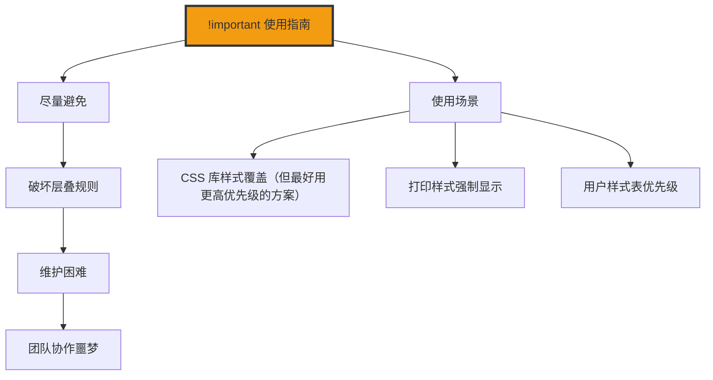

+++
title = "第8章 选择器优先级"
weight = 80
date = "2026-03-27T16:53:00+08:00"
type = "docs"
description = ""
isCJKLanguage = true
draft = false
+++

# 第八章：选择器优先级

> CSS 的层叠规则就像一场"权力游戏"——当多个选择器同时想要控制同一个元素的同一个属性时，谁说了算？这就是优先级要解决的问题。学会了优先级，你就能精准地控制"谁的话更大声"，而不是被浏览器的默认规则搞得一头雾水。

## 8.1 优先级计算

### 8.1.1 通用选择器 * ——权重 0

通用选择器 `*` 的权重是**最低的**，几乎可以忽略不计。

```css
/* * 的权重 = 0 */
/* 任何其他选择器都能覆盖它 */

* {
  color: red;  /* 权重 0 */
}

p {
  color: blue;  /* 权重 1，大于 0，所以蓝色胜出 */
}
```

```html
<p>这段文字是什么颜色？</p>
<!-- 答案是蓝色，因为 p 标签选择器权重更高 -->
```

### 8.1.2 标签选择器、伪元素——权重 1

```css
/* 标签选择器权重 = 1 */
p {
  color: red;  /* 权重 1 */
}

div {
  color: blue;  /* 权重 1，和 p 一样，后写的胜出 */
}

/* 伪元素权重 = 1 */
::first-letter {
  color: green;  /* 权重 1 */
}
```

```html
<p>文字颜色？</p>
<!-- 如果只有这两个选择器，颜色取决于谁后写 -->
```

### 8.1.3 类选择器、属性选择器、伪类——权重 10

```css
/* 类选择器权重 = 10 */
.btn {
  color: red;  /* 权重 10 */
}

/* 属性选择器权重 = 10 */
[type="text"] {
  color: blue;  /* 权重 10 */
}

/* 伪类权重 = 10 */
:hover {
  color: green;  /* 权重 10 */
}

/* 一个类选择器权重 10，直接碾压 10 个标签选择器（10 × 1 = 10），无需数量叠加 */
/* 但打不过一个 ID 选择器（100）*/
```

```html
<button class="btn">按钮</button>
<!-- 类选择器 .btn 权重 10 -->
```

### 8.1.4 ID 选择器——权重 100

```css
/* ID 选择器权重 = 100 */
#header {
  color: red;  /* 权重 100 */
}

/* 10 个类选择器（10 × 10 = 100）≈ 1 个 ID选择器（100），几乎持平 */
/* 11 个类选择器（11 × 10 = 110）> 1 个 ID选择器（100），理论上可以胜出 */
.header.header.header.header.header.header.header.header.header.header.header {
  color: blue;  /* 权重 (0, 11, 0, 0)，略高于 ID 的 (1, 0, 0, 0) */
}
```

```html
<header id="header" class="header">导航栏</header>
<!-- ID 选择器 #header 权重 100 -->
```

### 8.1.5 内联样式（style 属性）——权重 1000

```html
<!-- 内联样式权重 = 1000 -->
<header id="header" class="header" style="color: purple;">
  导航栏
</header>
<!-- style="color: purple" 权重 1000，优先级最高 -->
```

---

## 8.2 比较方法

### 8.2.1 四位数比较法——将各选择器的 ID、Class、Element 数量写成四位数 (a,b,c,d)，如 #header .nav li → (1,1,1,0)，比较时从左到右逐位比较，位数高者优先

四位数比较法是 CSS 优先级计算的官方标准方法。每一个选择器都可以转换成一个四位数 (a, b, c, d)：

```
(a, b, c, d)
 │   │   │   └── d = 通用选择器数量
 │   │   └── c = 标签选择器 + 伪元素数量
 │   └── b = 类选择器 + 属性选择器 + 伪类数量
 └── a = ID 选择器数量
```

**记忆口诀：a（爱）ID（身份证）> b（杯）Class > c（菜）Tag > d（的）*通用**

即：**ID > 类/属性/伪类 > 标签/伪元素 > 通用选择器**

```css
/* 示例 1：#header .nav li → (1, 1, 1, 0) */
#header .nav li {
  /* #header = 1个ID = 1 */
  /* .nav = 1个类 = 1 */
  /* li = 1个标签 = 1 */
  /* 总计 = (1, 1, 1, 0) */
}

/* 示例 2：div.container #main .item → (1, 2, 1, 0) */
div.container #main .item {
  /* div = 1个标签 */
  /* .container = 1个类 */
  /* #main = 1个ID */
  /* .item = 1个类 */
  /* 总计 = (1, 2, 1, 0) */
}

/* 示例 3：* body .card p → (0, 1, 2, 1) */
* body .card p {
  /* * = 1个通用 */
  /* body = 1个标签 */
  /* .card = 1个类 */
  /* p = 1个标签 */
  /* 总计 = (0, 1, 2, 1) */
}
```

**比较规则：依次比较 a 位 → b 位 → c 位 → d 位**

```css
/* 选择器 A */
#header .nav li → (1, 1, 1, 0)

/* 选择器 B */
.sidebar .menu span → (0, 2, 1, 0)

/* 比较：a位 1 vs 0 → A 胜出！不用看后面的了 */
```

```css
/* 选择器 A */
.container .item → (0, 2, 0, 0)

/* 选择器 B */
ul li → (0, 0, 2, 0)

/* 比较：a位 0 vs 0 → 平局 */
/* 比较：b位 2 vs 0 → B 胜出！ */
```

**更复杂的例子：**

```css
/* 选择器 A */
nav ul li a.link → (0, 1, 4, 0)

/* 选择器 B */
#nav .menu .item → (1, 2, 0, 0)

/* 比较：a位 0 vs 1 → B 胜出！ */
/* B 的 ID 选择器权重更高 */
```

**实战中的优先级比较：**

```css
/* 场景：你想让 .highlight 覆盖 h1 的样式 */

h1 {
  color: blue;  /* (0, 0, 1, 0) */
}

.highlight {
  color: red;   /* (0, 1, 0, 0) */
}

/* 比较：(0, 1, 0, 0) vs (0, 0, 1, 0) */
/* a位：0 vs 0 → 平局 */
/* b位：1 vs 0 → .highlight 胜出！ */

h1.highlight {
  color: green; /* (0, 1, 1, 0) */
}

/* 比较：(0, 1, 1, 0) vs (0, 1, 0, 0) */
/* a位：0 vs 0 → 平局 */
/* b位：1 vs 1 → 平局 */
/* c位：1 vs 0 → h1.highlight 胜出！ */
```

### 8.2.2 !important 优先级最高——会覆盖所有普通声明

`!important` 是**声明级别**的特殊规则，一旦加上，它就会**无视选择器优先级**（包括内联样式），覆盖所有普通声明。它的效力比任何选择器都高，属于"规则破坏王"。

> ⚠️ 注意：`!important` 不是选择器权重，而是声明级别的修饰符。在优先级计算中，只有普通声明才按选择器权重比较。

```css
/* 普通声明 */
p {
  color: blue;  /* 普通声明 */
}

/* !important 声明——无视任何选择器权重，直接覆盖 */
p {
  color: red !important;  /* 这条会覆盖上面的蓝色，即使蓝色来自 ID 选择器 */
}
```

## 8.3 !important 的使用

### 8.3.1 不推荐滥用——导致样式难以维护

```css
/* ⚠️ 滥用 !important 的后果 */

/* 以后无论写什么选择器都很难覆盖它 */
.super-important {
  color: red !important;  /* 这个红色永远无法被覆盖 */
}

/* 团队协作时会导致混乱 */
/* A 用了 !important，B 不得不也用 !important */
/* 然后 C 又用了更高优先级的 !important */
/* 最后代码变成了一锅粥 */
```

### 8.3.2 实际开发建议——不要用内联样式、不要用 !important、保持选择器简洁

```css
/* ✅ 正确的做法 */

/* 1. 用合理的优先级结构 */
.header {
  color: blue;  /* 基础样式 */
}

.header .logo {
  color: red;   /* 子元素覆盖父元素，自然而然 */
}

/* 2. 用 CSS 变量控制主题 */
:root {
  --primary-color: #3498db;
}

.button {
  background: var(--primary-color);  /* 通过变量控制，方便切换 */
}

/* 3. 用 class 组合 */
.btn {
  padding: 12px 24px;
  border-radius: 6px;
}

.btn-primary {
  background: #3498db;
  color: white;
}

.btn-danger {
  background: #e74c3c;
  color: white;
}

/* 4. 必要时用 JavaScript 动态切换 class */
```



---

## 本章小结

恭喜你完成了第八章的学习！让我们来回顾一下这章的精华：

### 核心知识点

| 选择器 | 权重 |
|--------|------|
| 通用选择器 `*` | 0 |
| 标签选择器、伪元素 | 1 |
| 类选择器、属性选择器、伪类 | 10 |
| ID 选择器 | 100 |
| 内联样式 | 1000 |
| `!important` | 最高（声明级别，非选择器权重） |

### 优先级计算口诀

```
优先级（从高到低）：
  !important（声明级） > 内联样式 > ID选择器 > 类/属性/伪类 > 标签/伪元素 > 通用选择器

!important 是"规则破坏王"，无论选择器强弱，一票否决。
普通声明才按下方数字比较：
  内联1000 > ID100 > 类10 > 标签1 > 通用0
```

### 四位数比较法

```
四位数格式：(a, b, c, d)
  a = ID 选择器数量
  b = 类选择器 + 属性选择器 + 伪类数量
  c = 标签选择器 + 伪元素数量
  d = 通用选择器数量

示例：
  #header .nav li    → (1, 1, 1, 0)
  .sidebar p         → (0, 1, 1, 0)
```

### 下章预告

下一章我们将开始学习第四部分：盒模型——CSS 布局的核心。盒模型是 CSS 布局的基石，理解了盒模型，你才能真正掌握元素的尺寸计算和布局原理！

