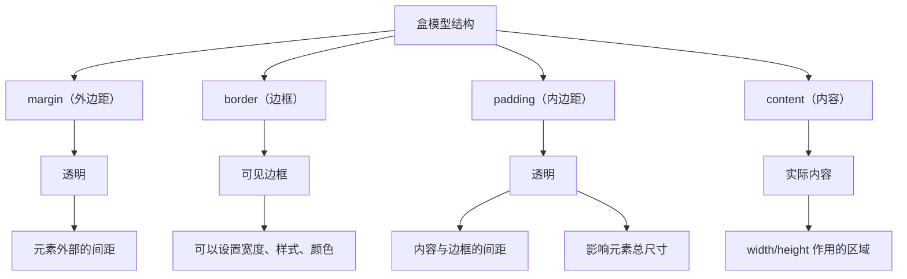

+++
title = "第9章 盒模型基础"
weight = 90
date = "2026-03-27T16:53:00+08:00"
type = "docs"
description = ""
isCJKLanguage = true
draft = false
+++

# 第九章：盒模型基础

> 盒模型是 CSS 布局的"基因"。每一个 HTML 元素在页面上都是一个盒子，这个盒子由四个部分组成：content（内容）、padding（内边距）、border（边框）和 margin（外边距）。理解了盒模型，你就能精准控制元素的尺寸和位置——CSS 布局的精髓，全在这一章。
>
> 顺便说一句：CSS 里大部分"玄学 bug"，归根结底都是盒模型没搞明白。去问问身边的开发者，十个里有九个曾在 margin 折叠上翻过车。😏

## 9.1 盒模型的四个部分

### 9.1.1 content（内容区）——width 和 height 作用的区域

**content（内容区）** 是盒子的"核心地带"，元素的实际内容（文字、图片、子元素）就放在这里。

```css
/* content 区域由 width 和 height 控制 */
.box {
  width: 300px;       /* 内容区宽度 */
  height: 200px;      /* 内容区高度 */

  background-color: #f0f0f0;  /* 背景色会填满 content 和 padding 区域 */
}
```

```html
<div class="box">
  <!-- 这里是 content 内容 -->
  <p>这段文字就在 content 区域</p>
  
</div>
```

### 9.1.2 padding（内边距）——内容区与边框之间，透明，会影响元素总尺寸

**padding（内边距）** 是 content 和 border 之间的"缓冲地带"。它是透明的，不会遮挡背景色。

```css
/* padding 会把 content 往里推 */
.box {
  width: 300px;
  padding: 20px;  /* 上下左右各 20px */

  /* 如果设置背景色，padding 区域也会有背景 */
  background-color: #f0f0f0;
}
```



### 9.1.3 border（边框）——元素边缘线条，占据实际尺寸

**border（边框）** 是盒子的"外壳"，围绕在 padding 外围。

```css
/* border 的三个属性 */
.box {
  width: 300px;
  padding: 20px;

  border-width: 2px;      /* 边框宽度 */
  border-style: solid;      /* 边框样式 */
  border-color: #333;        /* 边框颜色 */

  /* 也可以用缩写 */
  border: 2px solid #333;
}
```

### 9.1.4 margin（外边距）——元素与外部的间距，透明，不影响背景色

**margin（外边距）** 是元素与外部（其他元素）之间的"隔离带"。它是透明的，不会显示背景色。

```css
/* margin 是元素外部的间距 */
.box {
  width: 300px;
  margin: 20px;  /* 上下左右各 20px */

  /* margin 区域不会显示背景色 */
  background-color: #f0f0f0;
}
```

**盒模型可视化图：**

```
┌──────────────────────────────────────────────────────┐
│                      margin                           │
│  ┌────────────────────────────────────────────┐    │
│  │                    border                     │    │
│  │  ┌────────────────────────────────────┐  │    │
│  │  │              padding                  │  │    │
│  │  │  ┌────────────────────────────┐  │  │    │
│  │  │  │                            │  │  │    │
│  │  │  │         content           │  │  │    │
│  │  │  │                            │  │  │    │
│  │  │  └────────────────────────────┘  │  │    │
│  │  └────────────────────────────────────┘  │    │
│  └────────────────────────────────────────────┘    │
└──────────────────────────────────────────────────────┘
```

---

## 本章小结

恭喜你完成了第九章的学习！让我们来回顾一下盒模型的四个部分：

```
┌─────────────────────────────────────┐
│              margin                 │
│  ┌─────────────────────────────┐   │
│  │            border            │   │
│  │  ┌───────────────────────┐ │   │
│  │  │        padding         │ │   │
│  │  │  ┌─────────────────┐ │ │   │
│  │  │  │     content      │ │ │   │
│  │  │  └─────────────────┘ │ │   │
│  │  └───────────────────────┘ │   │
│  └─────────────────────────────┘   │
└─────────────────────────────────────┘

- content：width 和 height 作用的区域
- padding：内容与边框之间的透明区域，影响尺寸
- border：可见的边框线条
- margin：元素外部的透明间距
```

### 下章预告

下一章我们将学习外边距折叠（Margin Collapsing），这是盒模型中最容易让人困惑的现象之一。准备好被"外边距折叠"搞晕了吗？

---

## 9.2 外边距折叠（Margin Collapsing）

外边距折叠是 CSS 中最"反直觉"的现象之一。想象一下：你给两个元素各设置了 20px 的下边距，以为它们之间会有 40px 的间距，结果只有 20px——这不是 bug，这是 CSS 的"特异功能"。

### 9.2.1 两个块级元素相邻——上下 margin 取较大值合并，不是相加

```css
.box1 {
  margin-bottom: 20px;
}

.box2 {
  margin-top: 30px;
}

/* 它们之间的实际间距是多少？ */
/* 答案是 30px（取较大值），不是 50px！ */
```

```html
<div class="box1">第一个盒子</div>
<div class="box2">第二个盒子</div>
<!-- 间距是 30px，不是 50px！ -->
```

### 9.2.2 父子元素之间——第一个子元素的 margin-top 与父元素的 margin-top 合并，最后一个子元素的 margin-bottom 与父元素的 margin-bottom 合并

```css
.parent {
  margin-top: 20px;
}

.child {
  margin-top: 30px;
}

/* 父子之间的实际间距是多少？ */
/* 答案是 30px（取较大值），不是 50px！ */
/* 原理：子元素的 margin-top 会"穿透"父元素，与父元素的 margin-top 折叠， */
/*       最终效果由较大值（30px）决定。 */
```

### 9.2.3 空块级元素——上下 margin 直接合并

```css
.empty {
  margin-top: 20px;
  margin-bottom: 30px;
}

/* 空元素：没有内容、没有 padding、没有 border，上下 margin 直接"抱团取暖"合并为 30px */
```

### 9.2.4 阻断折叠——给父元素加 overflow:hidden/auto、padding-top、border-top，或将父元素设为 flex/inline-block/grid

如果你不想让 margin 折叠，可以用以下方法"阻断"它：

```css
/* 提示：负 margin 也会参与折叠（两个负值取绝对值更大的那个），阻断方法同理。 */
/* 方法 1：给父元素加 overflow: hidden 或 auto */
.parent {
  overflow: hidden;
}

/* 方法 2：给父元素加 padding-top */
.parent {
  padding-top: 1px;
}

/* 方法 3：给父元素加 border-top */
.parent {
  border-top: 1px solid transparent;
}

/* 方法 4：把父元素设为 flex 或 grid */
.parent {
  display: flex;
  flex-direction: column;
}

/* 方法 5：把父元素设为 inline-block */
.parent {
  display: inline-block;
  width: 100%;
}
```

---

## 9.3 手动计算尺寸

了解了盒模型的四个组成部分后，我们来手动计算一下元素在两种 box-sizing 模式下分别占用多少空间。

### 9.3.1 content-box 总宽度 = width + padding-left + padding-right + border-left + border-right + margin-left + margin-right

```css
.box {
  width: 200px;
  padding-left: 20px;
  padding-right: 20px;
  border-left: 5px;
  border-right: 5px;
  margin-left: 10px;
  margin-right: 10px;
}

/* content-box 模式下，width = 内容区宽度，不含 padding 和 border */
/* 元素实际占用的总宽度 = 200(content) + 20 + 20(padding) + 5 + 5(border) + 10 + 10(margin) = 270px */
```

### 9.3.2 border-box 总宽度 = width（已包含 padding 和 border）+ margin-left + margin-right

```css
.box {
  width: 200px;
  padding-left: 20px;
  padding-right: 20px;
  border-left: 5px;
  border-right: 5px;
  margin-left: 10px;
  margin-right: 10px;
}

/* border-box 模式下，width 已包含 padding 和 border（但不含 margin） */
/* 元素实际占用的总宽度 = 200(width，含 padding+border) + 10 + 10(margin) = 220px */
```


