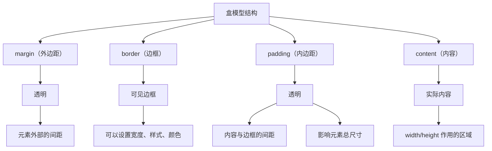

+++
title = "第9章 盒模型基础"
weight = 90
date = "2026-03-27T16:53:00+08:00"
type = "docs"
description = ""
isCJKLanguage = true
draft = false
+++

# 第九章：盒模型基础

> 盒模型是 CSS 布局的"基因"。每一个 HTML 元素在页面上都是一个盒子，这个盒子由四个部分组成：content（内容）、padding（内边距）、border（边框）和 margin（外边距）。理解了盒模型，你就能精准控制元素的尺寸和位置——CSS 布局的精髓，全在这一章。
>
> 顺便说一句：CSS 里大部分"玄学 bug"，归根结底都是盒模型没搞明白。去问问身边的开发者，十个里有九个曾在 margin 折叠上翻过车。😏

## 9.1 盒模型的四个部分

### 9.1.1 content（内容区）——width 和 height 作用的区域

**content（内容区）** 是盒子的"核心地带"，元素的实际内容（文字、图片、子元素）就放在这里。

```css
/* content 区域由 width 和 height 控制 */
.box {
  width: 300px;       /* 内容区宽度 */
  height: 200px;      /* 内容区高度 */

  background-color: #f0f0f0;  /* 背景默认从内容一路铺到边框外沿（background-clip: border-box） */
}
```

```html
<div class="box">
  <!-- 这里是 content 内容 -->
  <p>这段文字就在 content 区域</p>
  
</div>
```

### 9.1.2 padding（内边距）——内容区与边框之间，透明，会影响元素总尺寸

**padding（内边距）** 是 content 和 border 之间的"缓冲地带"。它本身是透明的，但**元素的背景色会一直铺到 padding 区域**（默认 `background-clip: border-box`），所以看起来像是"内容区变大了"。

```css
/* padding 会把 content 往里推 */
.box {
  width: 300px;
  padding: 20px;  /* 上下左右各 20px */

  /* 如果设置背景色，padding 区域也会有背景 */
  background-color: #f0f0f0;
}
```


```mermaid
graph TD
    A["盒模型结构"] --> B["margin（外边距）"]
    A --> C["border（边框）"]
    A --> D["padding（内边距）"]
    A --> E["content（内容）"]

    B --> B1["透明"]
    B1 --> B2["元素外部的间距"]

    C --> C1["可见边框"]
    C1 --> C2["可以设置宽度、样式、颜色"]

    D --> D1["透明"]
    D1 --> D2["内容与边框的间距"]
    D1 --> D3["影响元素总尺寸"]

    E --> E1["实际内容"]
    E1 --> E2["width/height 作用的区域"]
```

### 9.1.3 border（边框）——元素边缘线条，占据实际尺寸

**border（边框）** 是盒子的"外壳"，围绕在 padding 外围。

```css
/* border 的三个属性 */
.box {
  width: 300px;
  padding: 20px;

  border-width: 2px;      /* 边框宽度 */
  border-style: solid;      /* 边框样式 */
  border-color: #333;        /* 边框颜色 */

  /* 也可以用缩写 */
  border: 2px solid #333;
}
```

### 9.1.4 margin（外边距）——元素与外部的间距，透明，不影响背景色

**margin（外边距）** 是元素与外部（其他元素）之间的"隔离带"。它在边框之外，**元素自己的背景色不会画到 margin 里**——那一块露出来的是父元素的背景。

```css
/* margin 是元素外部的间距 */
.box {
  width: 300px;
  margin: 20px;  /* 上下左右各 20px */

  /* margin 区域不会显示背景色 */
  background-color: #f0f0f0;
}
```

**盒模型可视化图：**

```
┌──────────────────────────────────────────────────────┐
│                      margin                           │
│  ┌────────────────────────────────────────────┐    │
│  │                    border                     │    │
│  │  ┌────────────────────────────────────┐  │    │
│  │  │              padding                  │  │    │
│  │  │  ┌────────────────────────────┐  │  │    │
│  │  │  │                            │  │  │    │
│  │  │  │         content           │  │  │    │
│  │  │  │                            │  │  │    │
│  │  │  └────────────────────────────┘  │  │    │
│  │  └────────────────────────────────────┘  │    │
│  └────────────────────────────────────────────┘    │
└──────────────────────────────────────────────────────┘
```

---

### 9.1.5 四个部分速记

把四个部分摆在一起看一遍：

```
┌─────────────────────────────────────┐
│              margin                 │
│  ┌─────────────────────────────┐   │
│  │            border            │   │
│  │  ┌───────────────────────┐ │   │
│  │  │        padding         │ │   │
│  │  │  ┌─────────────────┐ │ │   │
│  │  │  │     content      │ │ │   │
│  │  │  └─────────────────┘ │ │   │
│  │  └───────────────────────┘ │   │
│  └─────────────────────────────┘   │
└─────────────────────────────────────┘

- content：width 和 height 作用的区域
- padding：内容与边框之间的透明区域，会被元素背景填满
- border：可见的边框线条
- margin：元素外部的透明间距，永远不显示元素自身背景
```

---

### 9.1.6 一个反直觉的细节：width: auto 和 width: 100% 不是一回事

块级元素不写 `width` 时，它的宽度是 `auto`——意思是"撑满父容器的可用空间，但要先扣掉自己的 padding、border 和 margin"。正因为有"扣掉"这一步，`auto` 永远不会溢出父容器：

```css
/* 父容器内容区 300px 宽 */
.auto {
  width: auto;        /* 实际内容区 = 300 - 20 - 20 - 5 - 5 = 250px，总宽度仍是 300px */
  padding: 0 20px;
  border: 5px solid #333;
}

.full {
  width: 100%;        /* 内容区 = 300px，再加上 padding 和 border，总宽度 = 350px，溢出了！ */
  padding: 0 20px;
  border: 5px solid #333;
}
```

> 记忆口诀：**`auto` 是"先占位再扣减"，`100%` 是"按父容器内容区算，padding 和 border 另算"**。所以在 `content-box` 下，想把元素撑满父容器又不溢出，用 `width: auto` 比 `width: 100%` 更安全；实在要用 `100%`，就配合 `box-sizing: border-box`（见第 10 章）。

---

## 9.2 外边距折叠（Margin Collapsing）

外边距折叠是 CSS 中最"反直觉"的现象之一。想象一下：你给两个元素各设置了 20px 的下边距，以为它们之间会有 40px 的间距，结果只有 20px——这不是 bug，这是 CSS 的"特异功能"。

先记住折叠的**适用前提**，不满足前提的盒子之间根本不会折叠：

- 只发生在**普通流中的块级盒子**（block-level，且不是 BFC 根）之间
- **行内块（inline-block）、浮动元素、绝对/固定定位元素、flex 项目和 grid 项目**都不参与外边距折叠
- **水平方向（左右 margin）永远不会折叠**，只有上下方向会

### 9.2.1 两个块级元素相邻——上下 margin 取较大值合并，不是相加

```css
.box1 {
  margin-bottom: 20px;
}

.box2 {
  margin-top: 30px;
}

/* 它们之间的实际间距是多少？ */
/* 答案是 30px（取较大值），不是 50px！ */
```

```html
<div class="box1">第一个盒子</div>
<div class="box2">第二个盒子</div>
<!-- 间距是 30px，不是 50px！ -->
```

### 9.2.2 父子元素之间——第一个子元素的 margin-top 与父元素的 margin-top 合并，最后一个子元素的 margin-bottom 与父元素的 margin-bottom 合并

```css
.parent {
  margin-top: 20px;
}

.child {
  margin-top: 30px;
}

/* 父子之间的实际间距是多少？ */
/* 答案是 30px（取较大值），不是 50px！ */
/* 原理：子元素的 margin-top 会"穿透"父元素，与父元素的 margin-top 折叠， */
/*       最终效果由较大值（30px）决定。 */
```

### 9.2.3 空块级元素——上下 margin 直接合并

```css
.empty {
  margin-top: 20px;
  margin-bottom: 30px;
}

/* 空元素：没有内容、没有 padding、没有 border，上下 margin 直接"抱团取暖"合并为 30px */
```

### 9.2.4 阻断折叠——给父元素加 overflow:hidden/auto、padding-top、border-top，或将父元素设为 flex/inline-block/grid

如果你不想让 margin 折叠，可以用以下方法"阻断"它：

```css
/* 提示：负 margin 也会参与折叠（两个负值取绝对值更大的那个），阻断方法同理。 */
/* 方法 1：给父元素加 overflow: hidden 或 auto */
.parent {
  overflow: hidden;
}

/* 方法 2：给父元素加 padding-top */
.parent {
  padding-top: 1px;
}

/* 方法 3：给父元素加 border-top */
.parent {
  border-top: 1px solid transparent;
}

/* 方法 4：把父元素设为 flex 或 grid */
.parent {
  display: flex;
  flex-direction: column;
}

/* 方法 5：把父元素设为 inline-block */
.parent {
  display: inline-block;
  width: 100%;
}
```

> 别死记这五条，抓住本质就行：**只要父元素和子元素之间隔着一层"东西"（padding、border、BFC 边界），或者父元素不再是普通流里的块级盒子，折叠就断了**。`overflow: hidden/auto` 生效是因为它让父元素变成了 BFC 根。

---

## 9.3 手动计算尺寸

了解了盒模型的四个组成部分后，我们来手动计算一下元素在两种 box-sizing 模式下分别占用多少空间。

### 9.3.1 content-box 总宽度 = width + padding-left + padding-right + border-left + border-right + margin-left + margin-right

```css
.box {
  width: 200px;
  padding-left: 20px;
  padding-right: 20px;
  border-left: 5px solid #333;
  border-right: 5px solid #333;
  margin-left: 10px;
  margin-right: 10px;
}

/* content-box 模式下，width = 内容区宽度，不含 padding 和 border */
/* 元素实际占用的总宽度 = 200(content) + 20 + 20(padding) + 5 + 5(border) + 10 + 10(margin) = 270px */
```

> ⚠️ 这里必须写 `5px solid` 而不能只写 `5px`。**只给宽度、不给样式时，`border-style` 默认是 `none`，浏览器会把边框宽度按 0 处理**——这是新手最常踩的坑之一，也是"明明写了 border 却不显示"的头号原因。

### 9.3.2 border-box 总宽度 = width（已包含 padding 和 border）+ margin-left + margin-right

```css
.box {
  width: 200px;
  padding-left: 20px;
  padding-right: 20px;
  border-left: 5px solid #333;
  border-right: 5px solid #333;
  margin-left: 10px;
  margin-right: 10px;
}

/* border-box 模式下，width 已包含 padding 和 border（但不含 margin） */
/* 元素实际占用的总宽度 = 200(width，含 padding+border) + 10 + 10(margin) = 220px */
```

> 理解这两种算法后你就能明白：**同一段 CSS，`.box` 在 `content-box` 下占地 270px，在 `border-box` 下只占 220px**。这也是为什么现代项目几乎都会全局设置 `box-sizing: border-box`——写 `width: 200px` 时得到一个真的 200px 宽的盒子，比每次都心算 padding 加 border 靠谱得多。第 10 章会专门讲这件事。

---

## 9.4 几个高频踩坑点

### 9.4.1 百分比 padding / margin 一律按"宽度"算

这是规范里最反直觉的规定之一：**`padding-top`、`padding-bottom`、`margin-top`、`margin-bottom` 写成百分比时，参照的都是包含块的"宽度"，而不是高度**。

```css
.banner {
  width: 100%;
  padding-top: 56.25%;   /* 高度 = 宽度 × 56.25% = 16:9 的经典写法 */
  background: #333;
  color: #fff;
}
```

> 这个"怪规定"的好处是：只要容器宽度定了，横向和纵向的百分比就有统一基准，不会因为父元素高度为 `auto` 而无法计算。所以用 `padding-top: 56.25%` 做 16:9 占位盒，至今仍是兼容性最好的做法（新项目也可以直接用 `aspect-ratio: 16 / 9`）。

### 9.4.2 行内元素（inline）的上下 padding 不撑开行高

```css
span {
  background: yellow;
  padding: 20px 0;   /* 左右有效，上下会"画"出来但不会把行撑高 */
}
```

行内元素的 `padding-top` / `padding-bottom` 会绘制背景，但**不会改变行盒的高度**，结果就是背景糊到上下相邻的文字上。要让上下 padding 真正参与布局，把元素变成 `inline-block` 或 `block`。

### 9.4.3 margin 可以为负

`margin` 是盒模型里唯一允许负值的部分（`padding` 和 `border` 必须非负）：

```css
.overlap {
  margin-top: -10px;   /* 元素向上移动 10px，可能与上一个元素重叠 */
}
```

负 margin 常用于让两个盒子重叠、让元素突破父容器限制（比如"贴边"效果），但也会让布局变得难以维护，慎用。

### 9.4.4 该用哪个盒子，先想清楚"width 指的是谁"

写尺寸之前先问自己一句：**我写的 `width: 300px`，是想要内容区 300px，还是想要整个盒子 300px？**

- 想要"内容区 300px"——保持 `content-box`（默认），但要记得加上 padding 和 border
- 想要"盒子整体 300px"——用 `border-box`，这是绝大多数 UI 场景的真实需求

---

## 9.5 本章小结

这一章我们围绕着"盒子"建立了 CSS 布局最基础的心智模型：

1. **四个组成部分**：content（内容区）、padding（内边距）、border（边框）、margin（外边距），由内到外层层包裹
2. **谁能被背景填满**：背景默认铺到**边框外沿**（`background-clip: border-box`），所以 padding 会被元素自己的背景染色，margin 不会
3. **`width: auto` vs `width: 100%`**：`auto` 先占位再扣减 padding/border，`100%` 按父容器内容区算、padding 和 border 另算，后者更容易溢出
4. **外边距折叠**：普通流中相邻块级盒子的上下 margin 取较大值合并（父子之间、空元素自身也会折叠），行内块、浮动、定位、flex/grid 项目不参与折叠
5. **百分比基准**：上下方向的百分比 padding/margin 也按包含块的**宽度**计算
6. **尺寸计算**：`content-box` 总宽 = width + padding + border + margin；`border-box` 总宽 = width（已含 padding 与 border）+ margin

> 下一章：`box-sizing` 到底改了什么？它为什么能让尺寸计算变简单？以及 `border-box` 有哪些容易忽略的边界情况——第 10 章见。
