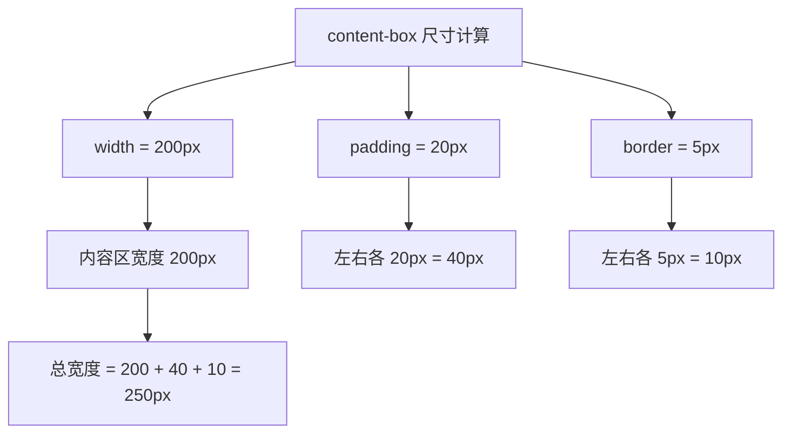

+++
title = "第10章 盒尺寸"
weight = 100
date = "2026-03-27T16:53:00+08:00"
type = "docs"
description = ""
isCJKLanguage = true
draft = false
+++

# 第十章：box-sizing

> box-sizing 属性决定了元素的尺寸是如何计算的。没有它，你永远算不准元素的实际宽度——padding 加了、border 加了，元素就像打了激素一样越来越宽。学会它，你就是布局界的"精确制导"！

## 10.1 content-box（默认值）

### 10.1.1 width = 内容区的宽度，padding 和 border 在 width 之外叠加

**content-box** 是浏览器的默认 box-sizing 模式。在这种模式下，`width` 属性只包括内容区的宽度，padding 和 border 会额外叠加到元素尺寸上。

```css
/* 默认的 content-box 模式 */
.box {
  box-sizing: content-box;  /* 这是默认值，可以省略 */

  width: 200px;           /* 内容区宽度 */
  padding: 20px;           /* padding 会额外叠加 */
  border: 5px solid #333; /* border 也会额外叠加 */

  /* 元素实际总宽度 = 200 + 20 + 20 + 5 + 5 = 250px */
  /* 元素实际总高度 = height + padding + border */
}
```



### 10.1.2 设置 width: 200px，padding: 20px，border: 5px，则元素总宽度 = 200 + 20 + 20 + 5 + 5 = 250px

```css
/* 让我们来算一算 */
.card {
  box-sizing: content-box;  /* 默认值 */

  width: 200px;
  padding: 20px;
  border: 5px solid #333;
  margin: 10px;
}

/*
  计算过程：
  - width: 200px（内容区）
  - padding-left: 20px
  - padding-right: 20px
  - border-left: 5px
  - border-right: 5px
  - margin-left: 10px（这个不计入元素尺寸，但占用布局空间）

  元素实际总宽度 = 200 + 20 + 20 + 5 + 5 = 250px
  元素在布局中占用的空间 = 250 + 10 + 10 = 270px
*/

---

## 10.2 border-box（推荐）

### 10.2.1 width = 内容 + padding + border 的总和

**border-box** 是现代 CSS 开发中推荐使用的 box-sizing 模式。在这种模式下，`width` 已经包含了 padding 和 border，非常符合直觉。

```css
/* border-box 模式 */
.box {
  box-sizing: border-box;  /* 推荐使用 */

  width: 200px;           /* 总宽度 */
  padding: 20px;          /* 包含在 width 内 */
  border: 5px solid #333; /* 包含在 width 内 */
}

/* 元素实际总宽度 = 200px */
/* 内容区实际宽度 = 200 - 20 - 20 - 5 - 5 = 150px */
```

### 10.2.2 设置 width: 200px，padding: 20px，border: 5px，则内容区实际宽度 = 200 - 20 - 20 - 5 - 5 = 150px

```css
/* border-box 的计算 */
.card {
  box-sizing: border-box;

  width: 200px;
  padding: 20px;
  border: 5px solid #333;
  margin: 10px;
}

/*
  计算过程：
  - width: 200px（包含 padding 和 border）
  - 内容区实际宽度 = 200 - 20 - 20 - 5 - 5 = 150px

  border-box 的好处：设置多少宽度，元素就占多少宽度
*/
```

### 10.2.3 现代开发推荐，尺寸计算更直观

```css
/* content-box vs border-box 对比 */

.content-box {
  box-sizing: content-box;
  width: 200px;
  padding: 20px;
  border: 5px solid #333;
  /* 实际宽度 = 200 + 20 + 20 + 5 + 5 = 250px */
}

.border-box {
  box-sizing: border-box;
  width: 200px;
  padding: 20px;
  border: 5px solid #333;
  /* 实际宽度 = 200px（padding 和 border 已包含在内）*/
}
```

## 10.3 全局设置

### 10.3.1 推荐写法——* { box-sizing: border-box; }

```css
/* 现代 CSS 开发的标准开局 */
*, *::before, *::after {
  box-sizing: border-box;
}

/* 这样所有元素的 box-sizing 默认就是 border-box */
```

> ⚠️ **重要提醒**：`box-sizing` 默认是不继承的！如果不用 `* { box-sizing: border-box; }` 全局设置，子元素默认仍是 `content-box`。因此**强烈推荐使用上述全局设置**，而不是在每个元素上单独设置。

---

## 本章小结

恭喜你完成了第十章的学习！让我们来回顾一下 box-sizing 的两种模式：

### 两种 box-sizing 模式对比

| 模式 | width 包含的内容 | 公式 |
|------|-----------------|------|
| content-box（默认） | 只有内容区 | 总宽度 = width + padding + border |
| border-box（推荐） | 内容区 + padding + border | 总宽度 = width |

### 实际开发建议

> 💡 **强烈推荐**：在所有项目中全局使用 `border-box`：

```css
/* 全局设置 */
*, *::before, *::after {
  box-sizing: border-box;
}
```

这样设置后，所有元素的 `width` 就是元素在页面上实际占用的宽度，不需要额外计算 padding 和 border。

### 下章预告

下一章我们将开始学习第五部分：CSS 属性详解。首先是文字与字体属性，这是网页设计中最常用的属性之一！


