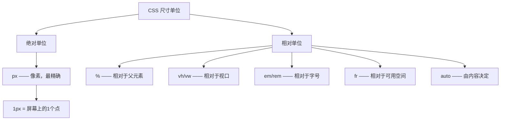

+++
title = "第14章 CSS尺寸与溢出"
weight = 140
date = "2026-03-27T16:53:00+08:00"
type = "docs"
description = ""
isCJKLanguage = true
draft = false
+++

# 第十四章：尺寸与溢出属性

> 一个元素到底有多"大"？这个问题看似简单，但如果你回答不上来，可能意味着你还没完全理解 CSS 的尺寸系统。CSS 的尺寸属性就像是一个元素的身高体重秤——width 决定横向有多宽，height 决定纵向有多高。但这只是表面现象，因为还有一堆"限制器"（max-width、min-width）以及"溢出处理"（overflow）在背后虎视眈眈。这一章，我们就来好好聊聊元素的尺寸和溢出那些事儿。

## 14.1 width 和 height

### 14.1.1 默认值是 auto——由内容决定尺寸

在 CSS 的世界里，每一个元素都像一个"变形金刚"——它们的尺寸默认是由内容决定的。这个神奇的特性有一个专门的名字：`auto`。

**什么是 `auto`？** 简单来说，`auto` 就是"让浏览器看着办"。当你没有明确指定元素的宽高时，浏览器会根据元素的内容来自动计算它的尺寸。这就像是点外卖时说"随便来一份"，最后来什么取决于厨师的心情。

```css
/* 默认情况下，width 和 height 都是 auto */
/* 浏览器会根据内容自动计算尺寸 */

.auto-box {
  /* 没有写 width，默认就是 auto */
  /* 没有写 height，默认也是 auto */
  background-color: #f0f0f0;
  padding: 20px;
  border: 2px solid #3498db;
}

/* 这个盒子的宽度 = 父元素宽度 - padding - border */
/* 这个盒子的高度 = 内容的高度 */
```

```html
<div class="auto-box">
  <p>这是一段文字</p>
  <p>这是另一段文字，会让盒子变高</p>
  <p>内容越多，盒子越高——这就是 auto 的魔力</p>
</div>
```

**`auto` 的表现因元素类型而异：**

块级元素（div、p、h1 等）的 `width` 默认是 `100%`，会撑满父元素的整个宽度。而行内元素（span、a、strong 等）的 `width` 和 `height` 基本上都是 `auto`，由内容决定。

```css
/* 块级元素的表现 */
.block-element {
  /* 默认 width: 100%，会占满整行 */
  background-color: #e8f4f8;
  padding: 10px;
  margin-bottom: 10px;
}

/* 块级元素设置 height: auto */
.block-with-auto-height {
  height: auto;  /* 由内容决定高度 */
  background-color: #fff3cd;
  padding: 20px;
}

/* 行内元素的表现 */
.inline-element {
  /* width 和 height 都是 auto，由内容决定 */
  background-color: #d4edda;
  padding: 5px;
}
```

```html
<!-- 块级元素占满整行 -->
<div class="block-element">我是块级元素，我很宽！</div>

<!-- 行内元素有多宽取决于内容 -->
<span class="inline-element">我只有这么宽</span>
<span class="inline-element">我比隔壁那个稍微宽一点点</span>
```

**`auto` 的实际应用场景：**

```css
/* 让内容自然撑开的高度 */
.natural-height {
  height: auto;  /* 默认值，可以不写，但写了更清晰 */
  min-height: 200px;  /* 最小高度保证 */
}

/* 让图片保持比例 */
.responsive-image {
  width: auto;  /* 宽度auto，高度会自动按比例计算 */
  max-width: 100%;
  height: auto;
}
```

```html
<!-- 图片会保持原始宽高比 -->

```

> 💡 **小技巧**：`auto` 是 CSS 中最"聪明"的默认值。它让元素能够自适应内容，同时也为响应式设计提供了基础。理解 `auto` 的行为，是掌握 CSS 尺寸系统的第一步。

### 14.1.2 固定值——width: 300px; height: 200px;

如果说 `auto` 是"看情况而定"，那么固定值就是"我说了算"。当你明确写下一个具体的数值时，浏览器就会老老实实地按照你的指令来。

**固定值的写法：**

```css
/* 像素（px）——最常用的固定单位 */
/* 像素是屏幕上的最小发光点，绝对单位，写多少就是多少 */

.fixed-box {
  width: 300px;   /* 精确的300像素 */
  height: 200px;  /* 精确的200像素 */
  background-color: #3498db;
  color: white;
  text-align: center;
  line-height: 200px;  /* 200px刚好等于height，单行文字可垂直居中 */
}
```

```html
<div class="fixed-box">
  固定尺寸的盒子
</div>
```

**固定值的常见单位：**

```css
/* 像素 px —— 绝对单位，最精确 */
.pixel-box {
  width: 300px;
  height: 200px;
}

/* 厘米 cm —— 绝对单位，通常用于打印 */
.print-box {
  width: 10cm;
  height: 5cm;
}

/* 毫米 mm —— 绝对单位 */
.mm-box {
  width: 50mm;
  height: 30mm;
}

/* 英寸 in —— 绝对单位，1英寸 = 2.54厘米 */
.inch-box {
  width: 3in;
  height: 2in;
}

/* 点 pt —— 绝对单位，常用于打印排版 */
.pt-box {
  width: 200pt;
  height: 150pt;
}
```

**固定值的适用场景：**

```css
/* 头像——通常需要固定尺寸 */
.avatar {
  width: 80px;
  height: 80px;
  border-radius: 50%;  /* 变成圆形 */
  object-fit: cover;   /* 保持比例填充 */
}

/* 图标——通常固定尺寸 */
.icon {
  width: 24px;
  height: 24px;
}

/* 按钮——固定内边距让按钮更均匀 */
.button {
  width: 120px;
  height: 44px;  /* 足够大的点击区域 */
  background-color: #3498db;
  color: white;
  border: none;
  border-radius: 6px;
  cursor: pointer;
}

/* 侧边栏——固定宽度 */
.sidebar {
  width: 250px;
  height: 100vh;  /* 占满视口高度 */
  background-color: #2c3e50;
  color: white;
  position: fixed;
  left: 0;
  top: 0;
}
```

```html
<!-- 各种固定尺寸元素的实际应用 -->


<button class="button">点击我</button>
<aside class="sidebar">侧边栏内容</aside>
```

**固定值 vs `auto` 的对比：**

```css
/* 固定值——无论内容多少，尺寸不变 */
.fixed {
  width: 200px;
  height: 100px;
  background-color: #3498db;
  overflow: hidden;  /* 内容太多会溢出 */
}

/* auto——尺寸由内容决定 */
.auto {
  width: auto;
  height: auto;
  background-color: #2ecc71;
  padding: 20px;
}

/* min-content——由内容最小需求决定（CSS3）*/
.min-content {
  width: min-content;  /* 宽度由最宽内容决定 */
  background-color: #e74c3c;
  padding: 10px;
}

/* max-content——由内容自然宽度决定（CSS3）*/
.max-content {
  width: max-content;  /* 宽度由内容自然排列决定 */
  background-color: #9b59b6;
  padding: 10px;
}
```

```html
<div class="fixed">我只有200px宽，不管内容有多少</div>
<div class="auto">我的宽高由内容决定，内容多就高</div>
<div class="min-content">我的宽度是最窄能显示内容的宽度</div>
<div class="max-content">我的宽度是不换行的自然宽度</div>
```

**固定值的注意事项：**

```css
/* ⚠️ 固定宽度可能带来的问题 */

/* 1. 溢出问题——内容太多会撑破盒子 */
.overflow-box {
  width: 150px;
  height: 100px;
  background-color: #f39c12;
  border: 2px solid #e67e22;
}

/* 2. 响应式问题——小屏幕可能放不下（移动端用户的噩梦😱）*/
.not-responsive {
  width: 800px;  /* 在手机上可能会溢出 */
  height: 600px;
  background-color: #1abc9c;
}
```

> 💡 **小技巧**：固定值虽然精确，但在响应式设计中需要谨慎使用。最好的做法是结合 `max-width`、`min-width` 等限制器一起使用，让元素在固定和自适应之间找到平衡。

## 14.2 百分比尺寸

### 14.2.1 width: 50%——相对于父元素的内容区域宽度

百分比是 CSS 中最"灵活"的单位之一。它不像像素那样死板，也不像 `auto` 那样完全交给浏览器。百分比是一种"相对论"——你的尺寸取决于你的父元素。

**什么是百分比尺寸？**

百分比尺寸是相对于父元素的某个值来计算的。比如你设置 `width: 50%`，意思就是"我要占父元素宽度的的一半"。

```css
/* 百分比是相对于父元素的对应属性值计算的 */

.parent {
  width: 400px;  /* 父元素宽度是 400px */
  height: 200px;
  background-color: #ecf0f1;
}

.child {
  width: 50%;    /* 子元素宽度 = 父元素宽度的 50% = 200px */
  height: 50%;   /* 子元素高度 = 父元素高度的 50% = 100px */
  background-color: #3498db;
  color: white;
  text-align: center;
}
```

```html
<div class="parent">
  父元素（400px × 200px）
  <div class="child">
    子元素（200px × 100px = 父元素的50%）
  </div>
</div>
```

**百分比 vs 像素的对比：**

```css
/* 像素——固定不变 */
.pixel-width {
  width: 300px;  /* 永远是300px，不管父元素多宽 */
}

/* 百分比——随父元素变化 */
.percent-width {
  width: 50%;    /* 父元素宽度的50%，父元素变我就变 */
}

/* 响应式设计中，百分比是主力军 */
.container {
  width: 80%;    /* 占父元素80%的宽度 */
  max-width: 1200px;  /* 但不超过1200px */
  margin: 0 auto;  /* 水平居中 */
}

.main-content {
  width: 70%;    /* 主内容区占70% */
  float: left;
}

.sidebar {
  width: 30%;    /* 侧边栏占30% */
  float: right;
}
```

```html
<div class="container">
  <article class="main-content">
    <h1>主内容</h1>
    <p>这段文字会随着容器宽度变化而变化</p>
  </article>
  <aside class="sidebar">
    <h2>侧边栏</h2>
    <p>侧边栏内容</p>
  </aside>
</div>
```

**百分比的常见应用场景：**

```css
/* 流体布局——让元素随屏幕缩放 */
.fluid-layout {
  width: 100%;
  max-width: 1400px;  /* 但有最大宽度限制 */
  margin: 0 auto;
  padding: 0 20px;
}

/* 栅格系统的基础 */
.row {
  width: 100%;
  display: flex;
}

.col-6 {
  width: 50%;  /* 一半宽度 */
}

.col-4 {
  width: 33.333%;  /* 三分之一宽度 */
}

.col-3 {
  width: 25%;  /* 四分之一宽度 */
}

/* 头像的响应式尺寸 */
.profile-image {
  width: 100%;     /* 随容器缩放 */
  height: auto;    /* 高度自动保持比例 */
  max-width: 200px;  /* 最大200px */
  border-radius: 50%;  /* 圆形头像 */
}
```

**高度的百分比——有点特殊：**

```css
/* ⚠️ 高度的百分比计算是有条件的 */

/* 父元素必须有明确的高度 */
.parent-with-height {
  height: 400px;
  background-color: #ecf0f1;
}

.child-percent {
  width: 50%;
  height: 50%;  /* = 400px × 50% = 200px ✅ */
}

/* 如果父元素没有明确高度，高度百分比可能不生效 */
.parent-without-height {
  height: auto;  /* 没有固定高度 */
  background-color: #ffeaa7;
}

.child-in-percent-height {
  height: 50%;  /* = auto？浏览器可能显示为0或忽略 ⚠️ */
}

/* 常见陷阱：body和html */
html, body {
  height: 100%;  /* html和body必须都设100% */
  margin: 0;
}

.full-height-div {
  height: 100%;  /* 才能正确生效 */
  background-color: #74b9ff;
}
```

```html
<!-- 高度百分比需要父元素有明确高度 -->
<div class="parent-with-height">
  <div class="child-percent">
    我的高度是父元素的50%
  </div>
</div>

<!-- 如果父元素没有固定高度，高度百分比可能无效 -->
<div class="parent-without-height">
  <div class="child-in-percent-height">
    我的高度可能不是你想要的
  </div>
</div>
```

> 💡 **小技巧**：宽度的百分比计算是"无条件"的，但高度的百分比计算需要父元素有明确的 height 值。如果你想让子元素占满父元素的高度，记得先给父元素设定高度，或者使用 `height: 100vh`（视口高度）。

### 14.2.2 包含块有 padding 时，百分比相对于包含块的 width（不包括 padding）

这是一个容易让人犯晕的细节：当父元素有 padding 时，百分比宽度到底是怎么计算的？

**包含块的概念：**

包含块（Containing Block）是 CSS 布局中一个很重要的概念。简单来说，一个元素的尺寸百分比是相对于它的"包含块"计算的。

```css
/* 包含块 = 父元素的内容区域（不包括padding） */

.parent-with-padding {
  width: 400px;
  padding: 50px;  /* 左右各50px的padding */
  background-color: #ecf0f1;
}

.child-of-padding {
  width: 50%;    /* 50% × 400px = 200px */
  /* 注意：这个50%是相对于父元素的content宽度（400px） */
  /* 而不是父元素的实际宽度（400px + 100px padding）！ */
  height: 100px;
  background-color: #3498db;
  color: white;
  text-align: center;
}
```

```html
<div class="parent-with-padding">
  父元素（400px宽 + 50px padding）
  <div class="child-of-padding">
    我的宽度 = 400px × 50% = 200px
    （相对于内容区域，不包括padding）
  </div>
</div>
```

**图解百分比宽度的计算：**

```
┌─────────────────────────────────────────────────────┐
│                    父元素                              │
│  ┌─────────────────────────────────────────────┐    │
│  │ padding-left: 50px                          │    │
│  │  ┌───────────────────────────────────────┐ │    │
│  │  │            content: 400px               │ │    │
│  │  │  ┌─────────────────────────────┐  │ │    │
│  │  │  │  子元素 width: 50%         │  │ │    │
│  │  │  │  = 400px × 50% = 200px    │  │ │    │
│  │  │  └─────────────────────────────┘  │ │    │
│  │  └───────────────────────────────────────┘ │    │
│  │ padding-right: 50px                         │    │
│  └─────────────────────────────────────────────┘    │
└─────────────────────────────────────────────────────┘

子元素的50% = 父元素的content宽度（400px）× 50% = 200px
不是 (400px + 50px + 50px) × 50% = 250px
```

**实际开发中的注意事项：**

```css
/* 场景：创建两栏布局，栏之间有间距 */

/* 方法1：使用padding + 百分比 */
.layout-with-padding {
  font-size: 0;  /* 消除inline元素间隙 */
}

.column {
  width: 50%;
  padding: 20px;
  /* 因为padding包含在width内（border-box） */
  /* 所以实际内容区只有 50% - 40px */
  box-sizing: border-box;
}

/* 方法2：使用gap（推荐）*/
.layout-with-gap {
  display: flex;
  gap: 40px;  /* 直接设置间距 */
}

.gap-column {
  flex: 1;    /* 平分空间 */
}

/* 方法3：calc计算 */
.calc-column {
  width: calc(50% - 20px);  /* 精确控制 */
  margin-right: 40px;
}
```

**box-sizing 对百分比计算的影响：**

```css
/* content-box（默认）——百分比相对于内容区 */
.content-box-parent {
  width: 400px;
  padding: 50px;
  box-sizing: content-box;  /* 默认值 */
}

.content-box-child {
  width: 50%;  /* = 400px × 50% = 200px */
  /* padding额外叠加，不包含在50%内 */
}

/* border-box——百分比相对于整个元素 */
.border-box-parent {
  width: 400px;
  padding: 50px;
  box-sizing: border-box;  /* 推荐写法 */
}

.border-box-child {
  width: 50%;  /* = 400px × 50% = 200px */
  /* padding已经包含在50%内 */
  padding: 20px;
  /* 实际内容区 = 200px - 40px = 160px */
}
```

> 💡 **小技巧**：现代开发中，建议全局使用 `box-sizing: border-box`，这样 width 的百分比计算会更符合直觉——百分比始终是相对于元素的实际宽度，包括 padding。

## 14.3 max-width / min-width

### 14.3.1 max-width——限制元素最大宽度，常用于防止图片或文字过宽

`max-width` 是 CSS 中的"限速器"——它告诉浏览器："这个元素最多只能这么宽，不许再宽了！"这在防止内容过度伸展方面非常有用。

**什么是 `max-width`？**

想象一下你在一辆车上设置了巡航定速——车会按你设定的最高速度行驶，但如果你把速度设成"无限"，那车就会一路狂飙到它能达到的最快速度。`max-width` 就是给元素的宽度设置了一个"最高限速"。

```css
/* max-width 的基本用法 */

/* 没有max-width——内容有多宽，元素就多宽（可能很丑） */
.no-max-width {
  background-color: #f8f9fa;
  padding: 20px;
  margin-bottom: 20px;
}

/* 有max-width——最大宽度受限 */
.with-max-width {
  max-width: 800px;  /* 最多800px */
  background-color: #e8f4f8;
  padding: 20px;
}
```

```html
<div class="no-max-width">
  <p>这段文字可以无限长，如果你的屏幕足够宽，这行文字可能会从屏幕左边一直延伸到屏幕右边，读起来眼睛都要转晕了！</p>
</div>

<div class="with-max-width">
  <p>这段文字最多只会延伸到800px的宽度，不管屏幕有多宽，阅读体验都很舒适！</p>
</div>
```

**`max-width` 的实际应用场景：**

```css
/* 1. 文章内容的最大宽度——让阅读更舒适 */
.article-content {
  max-width: 700px;  /* 文章太宽会影响阅读，这个宽度刚刚好 */
  margin: 0 auto;    /* 居中显示 */
  line-height: 1.8;
}

/* 2. 图片的最大宽度——防止图片撑破布局 */
.responsive-image {
  max-width: 100%;   /* 图片最大宽度不超过容器 */
  height: auto;      /* 高度自动保持比例 */
  display: block;
}

/* 3. 卡片的最大宽度——保持合理的宽度比例 */
.card {
  max-width: 350px;  /* 卡片不会太宽 */
  background-color: white;
  border-radius: 8px;
  box-shadow: 0 2px 8px rgba(0, 0, 0, 0.1);
  overflow: hidden;
}

.card-image {
  width: 100%;
  height: 200px;
  object-fit: cover;
}

/* 4. 输入框的最大宽度——不会无线伸展 */
.search-input {
  max-width: 400px;
  width: 100%;     /* 默认占满父容器 */
  padding: 12px 16px;
  border: 2px solid #ddd;
  border-radius: 25px;
  font-size: 16px;
}
```

**`max-width` vs `width` 的对比：**

```css
/* width —— 固定宽度，不管内容多少 */
.fixed-width {
  width: 600px;
  background-color: #ffe6e6;
  padding: 20px;
  border: 2px dashed #e74c3c;
}

/* max-width —— 最大宽度限制 */
.limited-width {
  max-width: 600px;
  width: 100%;  /* 尽可能宽，但不超过max */
  background-color: #e6f7ff;
  padding: 20px;
  border: 2px dashed #3498db;
}
```

```html
<!-- width: 600px 意味着永远是600px -->
<div class="fixed-width">
  固定600px宽
</div>

<!-- max-width: 600px + width: 100% 意味着：容器小于600px时靠拢容器，大于600px时最多600px -->
<div class="limited-width">
  最多600px宽，但可以更窄
</div>
```

**`max-width` 的特殊值——`none`（默认值）：**

```css
/* none —— 不限制最大宽度（默认行为） */
.unlimited {
  max-width: none;  /* 默认值，等于不写 */
}

/* 等同于不设置 max-width */
```

**`max-width` 和 `width: 100%` 的组合技巧：**

```css
/* 常见组合：占满容器但有上限 */
.constrained-fluid {
  width: 100%;        /* 默认占满父容器 */
  max-width: 1200px;  /* 但不超过1200px */
  margin: 0 auto;     /* 居中 */
  padding: 0 20px;    /* 左右留白 */
}

/* 更优雅的写法：利用 calc() */
.fluid-with-gaps {
  width: calc(100% - 40px);  /* 左右各留20px */
  max-width: 1200px;
  margin: 0 auto;
}
```

> 💡 **小技巧**：`max-width` 设置后，元素可以比这个值小，但永远不能比这个值大。这让它成为响应式设计的利器——配合 `width: 100%` 使用，可以让元素在窄屏上占满屏幕，在宽屏上又不至于太宽。

### 14.3.2 min-width——限制元素最小宽度

如果说 `max-width` 是"限速器"，那 `min-width` 就是"保底器"——它告诉浏览器："这个元素至少要这么宽，不许再窄了！"

**什么是 `min-width`？**

想象你去买手机套餐，运营商说"最低消费 50 元"——不管你怎么省，每月至少得花 50 块。`min-width` 就是这个"最低消费"——元素可以更宽，但绝不能更窄。

```css
/* min-width 的基本用法 */

/* 没有min-width——元素可以很窄 */
.no-min-width {
  background-color: #fff3cd;
  padding: 20px;
  margin-bottom: 20px;
}

/* 有min-width——元素不能比这个值更窄 */
.with-min-width {
  min-width: 400px;  /* 至少400px宽 */
  background-color: #d4edda;
  padding: 20px;
}
```

```html
<div class="no-min-width">
  试试把这个容器拖窄一点！我可以变得非常窄，窄到文字都挤成一团
</div>

<div class="with-min-width">
  无论你怎么拖，我都不会比400px更窄！这就是min-width的魔力
</div>
```

**`min-width` 的实际应用场景：**

```css
/* 1. 输入框的最小宽度——保证可点击区域 */
.input-min-width {
  min-width: 200px;   /* 输入框至少200px宽 */
  padding: 12px 16px;
  border: 2px solid #3498db;
  border-radius: 6px;
}

/* 2. 按钮的最小宽度——让按钮文字完整显示 */
.button-min-width {
  min-width: 120px;  /* 按钮至少120px宽 */
  padding: 12px 24px;
  background-color: #3498db;
  color: white;
  border: none;
  border-radius: 6px;
  cursor: pointer;
  text-align: center;
}

/* 3. 表格单元格的最小宽度——防止内容挤扁 */
.table-cell-min {
  min-width: 100px;  /* 单元格至少100px */
  padding: 10px;
  border: 1px solid #ddd;
}

/* 4. 弹性布局中的保底宽度 */
.flex-container {
  display: flex;
  gap: 20px;
}

.flex-item {
  flex: 1;           /* 尽可能等分空间 */
  min-width: 250px;  /* 但每个item至少250px */
}
```

**`min-width` 和 `max-width` 一起用：**

```css
/* 组合使用：给宽度设定一个范围 */
.in-range {
  width: 100%;           /* 默认占满容器 */
  min-width: 300px;      /* 至少300px */
  max-width: 600px;     /* 最多600px */
  margin: 0 auto;
  padding: 20px;
  background-color: linear-gradient(135deg, #667eea, #764ba2);
  color: white;
  border-radius: 10px;
}

/* 实际效果：元素会在300px到600px之间"弹性伸缩" */
/* 容器 < 300px → 元素强制保持300px（可能溢出）*/
/* 容器 > 600px → 元素保持在600px */
/* 容器在300-600px之间 → 元素跟随容器宽度 */
```

**`min-width: 0` 的特殊用法：**

```css
/* 有时候需要强制让元素可以比内容更窄 */

.normal-case {
  /* 默认情况下，flex子元素的min-width是auto */
  /* 也就是min-width等于内容的最小宽度 */
  flex: 1;
}

.can-shrink {
  flex: 1;
  min-width: 0;  /* 强制允许收缩到0 */
  /* 常用在flex布局中让文字可以省略显示 */
  overflow: hidden;
  text-overflow: ellipsis;
  white-space: nowrap;
}
```

> 💡 **小技巧**：`min-width` 在响应式布局中非常有用，但要注意不要设置得过大，否则在小屏幕上可能导致横向滚动。另外，`min-width` 设置得过小等于没设置，设置得过大又可能破坏布局——找到一个合适的平衡点很重要。

## 14.4 max-height / min-height

### 14.4.1 min-height: 100vh——让元素至少和视口一样高，实现整屏效果

`vh`（Viewport Height）是 CSS3 引入的一个相对单位，它相对于视口的高度。`100vh` 就是视口高度的 100%，也就是一整个屏幕的高度。配合 `min-height` 使用，可以实现各种整屏效果。

**什么是 `vh` 单位？**

`vh` 的全称是 "viewport height"，翻译过来就是"视口高度"。1vh 等于视口高度的 1%。如果你的浏览器窗口高度是 900px，那么 1vh = 9px，100vh = 900px。

```css
/* vh 单位的基本用法 */

.viewport-height {
  height: 100vh;  /* 正好一屏的高度 */
  background-color: #2c3e50;
  color: white;
  display: flex;
  align-items: center;
  justify-content: center;
}

.half-height {
  height: 50vh;   /* 半屏高度 */
  background-color: #3498db;
  color: white;
  display: flex;
  align-items: center;
  justify-content: center;
}

.quarter-height {
  height: 25vh;   /* 四分之一屏高度 */
  background-color: #2ecc71;
  color: white;
  display: flex;
  align-items: center;
  justify-content: center;
}
```

```html
<div class="viewport-height">
  我正好占满整个屏幕（100vh）
</div>

<div class="half-height">
  我只占半个屏幕（50vh）
</div>

<div class="quarter-height">
  我只占四分之一屏幕（25vh）
</div>
```

**`min-height: 100vh` 的应用场景：**

```css
/* 1. 全屏页面布局 */
.full-page {
  min-height: 100vh;  /* 至少一屏高 */
  display: flex;
  flex-direction: column;
}

.header {
  height: 60px;  /* 固定高度的头部 */
  background-color: #2c3e50;
  color: white;
}

.content {
  flex: 1;      /* 中间内容区占满剩余空间 */
  background-color: #ecf0f1;
  padding: 20px;
}

.footer {
  height: 50px;  /* 固定高度的底部 */
  background-color: #34495e;
  color: white;
}

/* 2. 全屏背景页面 */
.fullscreen-hero {
  min-height: 100vh;
  background: linear-gradient(135deg, #667eea 0%, #764ba2 100%);
  color: white;
  display: flex;
  flex-direction: column;
  justify-content: center;
  align-items: center;
}

.hero-title {
  font-size: 3rem;
  margin-bottom: 1rem;
}

.hero-subtitle {
  font-size: 1.5rem;
  opacity: 0.9;
}

/* 3. 移动端适配的全屏弹窗 */
.fullscreen-modal {
  position: fixed;
  top: 0;
  left: 0;
  width: 100%;
  min-height: 100vh;  /* 至少一屏高 */
  background-color: rgba(0, 0, 0, 0.9);
  z-index: 1000;
  display: flex;
  justify-content: center;
  align-items: center;
}

/* 4. 最小高度保证内容不被压缩 */
.safe-area {
  min-height: 100vh;
  min-height: 100dvh;  /* 动态视口高度，移动端更准确 */
  padding-bottom: env(safe-area-inset-bottom);
}
```

**`100vh` vs `100%` 的区别：**

```css
/* 100% —— 相对于父元素高度 */
.parent-400 {
  height: 400px;
  background-color: #ecf0f1;
}

.child-100 {
  height: 100%;  /* = 400px */
  background-color: #3498db;
  color: white;
}

/* 100vh —— 相对于视口高度 */
.viewport-100 {
  height: 100vh;  /* = 浏览器窗口高度 */
  background-color: #e74c3c;
  color: white;
}
```

```html
<!-- 100% 相对于最近的设置了高度的父元素 -->
<div class="parent-400">
  <div class="child-100">
    高度是父元素的100% = 400px
  </div>
</div>

<!-- 100vh 始终等于浏览器视口的高度 -->
<div class="viewport-100">
  高度是视口的100%，不管父元素多高
</div>
```

**`100vh` 在移动端的小问题：**

```css
/* ⚠️ 移动端的问题：地址栏可能影响100vh */

/* 传统方法：使用100vh，然后处理滚动 */
.legacy-full {
  height: 100vh;
  overflow-y: auto;
}

/* 现代方法：使用动态视口高度dvh */
.modern-full {
  min-height: 100vh;
  min-height: 100dvh;  /* iOS Safari 15+ 支持 */
}

/* 组合方案：同时提供fallback */
.robust-full {
  min-height: 100vh;
  min-height: 100dvh;  /* 现代浏览器用dvh */
  overflow-y: auto;
}
```

> 💡 **小技巧**：`100vh` 是一个很方便的"一屏"解决方案，但在移动端使用时要注意地址栏的问题。`100dvh`（动态视口高度）是更现代的选择，但需要确认你的目标浏览器是否支持。

### 14.4.2 max-height——限制元素最大高度

`max-height` 和 `max-width` 是亲兄弟，只不过一个限制宽度，一个限制高度。它的作用是"给高度设置一个上限"——元素可以矮，但绝不能比这个值更高。

**什么是 `max-height`？**

想象一下你买了个收纳箱，箱子上写着"最高水位 30cm"——你可以往里倒 10cm 的水，也可以倒 25cm 的水，但绝对不能倒超过 30cm。`max-height` 就是收纳箱上的那条"最高水位线"。

```css
/* max-height 的基本用法 */

/* 没有max-height —— 内容有多高，元素就多高 */
.no-max-height {
  background-color: #fff3cd;
  padding: 20px;
  margin-bottom: 20px;
}

/* 有max-height —— 最高只能这么高 */
.with-max-height {
  max-height: 150px;  /* 最高150px */
  background-color: #d4edda;
  padding: 20px;
  overflow: hidden;  /* 超出部分隐藏 */
}
```

```html
<div class="no-max-height">
  <p>这段文字可以无限长，容器会自动增高来容纳它。这在没有max-height限制的情况下是正常的。</p>
  <p>但是有时候我们不希望容器太高，比如侧边栏的内容区，我们希望它和主内容区对齐。</p>
</div>

<div class="with-max-height">
  <p>这个容器最多只能有150px高！</p>
  <p>超出这个高度的内容会被... 诶，怎么不见了？</p>
  <p>那是因为我们设置了 overflow: hidden，多出来的内容被藏起来了！</p>
</div>
```

**`max-height` 的实际应用场景：**

```css
/* 1. 折叠/展开效果的基础 */
.collapsible {
  max-height: 0;        /* 默认折叠，高度为0 */
  overflow: hidden;
  transition: max-height 0.3s ease;
}

.collapsible.expanded {
  max-height: 500px;    /* 展开时最多500px */
}

/* 2. 下拉菜单的最大高度 */
.dropdown-menu {
  max-height: 300px;    /* 菜单最多显示300px */
  overflow-y: auto;      /* 超出部分可以滚动 */
  background-color: white;
  border: 1px solid #ddd;
  border-radius: 4px;
  box-shadow: 0 2px 10px rgba(0, 0, 0, 0.1);
}

/* 3. 图片的最大高度限制 */
.image-with-max-height {
  max-height: 400px;  /* 图片最高400px */
  width: auto;         /* 宽度自动保持比例 */
  display: block;
}

/* 4. 卡片内容限制 */
.limited-card {
  max-height: 200px;  /* 卡片最多200px高 */
  overflow: hidden;   /* 超出部分隐藏 */
  position: relative;
}

.limited-card::after {
  content: "";
  position: absolute;
  bottom: 0;
  left: 0;
  right: 0;
  height: 50px;
  background: linear-gradient(transparent, white);  /* 渐变遮罩 */
}

/* 5. 文字截断（配合max-height和line-height） */
.text-clamp {
  max-height: 3.6em;         /* 3行文字的高度 */
  line-height: 1.2em;         /* 每行1.2em */
  overflow: hidden;
}
```

**`max-height` 和 `height: auto` 的配合：**

```css
/* 常见陷阱：height: auto + max-height 组合问题 */

/* 这种情况max-height可能不生效 */
.problematic {
  height: auto;     /* auto会无视max-height的限制吗？ */
  max-height: 200px;
  overflow: hidden;
}

/* 正确做法：直接用max-height，不设置明确的高度 */
.correct {
  max-height: 200px;  /* 只设置max-height */
  overflow: hidden;    /* 超出隐藏 */
}

/* 或者用min-height保底 */
.with-min {
  min-height: 100px;  /* 至少100px */
  max-height: 200px;    /* 最多200px */
  overflow: hidden;
}
```

**`max-height: none` 的默认值：**

```css
/* none —— 不限制最大高度（默认行为） */
.unlimited-height {
  max-height: none;  /* 默认值，等于不写 */
}

/* 常用在覆盖之前设置的max-height */
.override-previous {
  max-height: none;  /* 取消之前设置的max-height限制 */
}
```

> 💡 **小技巧**：`max-height` 经常和 `overflow: hidden` 或 `overflow-y: auto` 配合使用。另外，`max-height` 可以用过渡动画实现折叠展开效果，但要注意设置一个足够大的值来容纳最大可能的内容高度。

## 14.5 aspect-ratio 宽高比

### 14.5.1 基本用法——aspect-ratio: 16/9，设置元素宽高比例

`aspect-ratio` 是 CSS 新引入的一个属性，它允许你直接设置元素的宽高比例。这就像是给元素配备了一把"比例尺"——宽度变化时，高度会自动按比例调整，保持固定的比例不变。

**什么是 `aspect-ratio`？**

想象一下你买了一个 16:9 的显示器，这意味着屏幕的宽度是高度的 16/9 倍。如果宽度是 1600px，那高度就是 900px。这个"16:9"就是宽高比。`aspect-ratio` 属性就是让你在 CSS 中也能设置这种比例。

```css
/* aspect-ratio 的基本用法 */

/* 16:9 的比例 */
.video-container {
  width: 100%;
  max-width: 800px;
  aspect-ratio: 16 / 9;  /* 设置为16:9比例 */
  background-color: #000;
}

/* 4:3 的比例 */
.tv-screen {
  width: 400px;
  aspect-ratio: 4 / 3;  /* 4:3比例 */
  background-color: #333;
}

/* 1:1 的比例（正方形） */
.square-box {
  width: 200px;
  aspect-ratio: 1 / 1;  /* 1:1 = 正方形 */
  /* 也可以写成 aspect-ratio: 1; */
  background-color: #3498db;
}
```

```html
<div class="video-container">
  <!-- 这个容器会保持16:9的比例 -->
  <!-- 宽度变化时，高度自动按比例调整 -->
</div>

<div class="square-box">
  <!-- 正方形容器，宽高永远相等 -->
</div>
```

**`aspect-ratio` 的多种写法：**

```css
/* 分数形式（推荐） */
.ratio-16-9 {
  aspect-ratio: 16 / 9;
}

.ratio-4-3 {
  aspect-ratio: 4 / 3;
}

.ratio-1-1 {
  aspect-ratio: 1 / 1;
}

/* 小数形式 */
.ratio-1-778 {
  aspect-ratio: 1.778;  /* 约等于16:9 */
}

/* 简写形式（斜杠可省略） */
.ratio-shorthand {
  aspect-ratio: 16 9;  /* 斜杠可以省略，用空格 */
}

/* auto 关键字 —— 保持元素默认的比例计算方式 */
.auto-ratio {
  aspect-ratio: auto;  /* 默认值，让浏览器决定 */
}
```

**常见比例的参考值：**

```css
/* 常用比例的 aspect-ratio 值 */

/* 16:9 —— 视频、电影、演示文稿 */
.video { aspect-ratio: 16 / 9; }

/* 4:3 —— 传统电视、演示文稿 */
.legacy { aspect-ratio: 4 / 3; }

/* 21:9 —— 超宽屏幕电影 */
.ultrawide { aspect-ratio: 21 / 9; }

/* 1:1 —— 头像、图标、正方形 */
.square { aspect-ratio: 1; }

/* 3:2 —— 照片、卡片 */
.photo { aspect-ratio: 3 / 2; }

/* 2:3 —— 竖向照片 */
.portrait { aspect-ratio: 2 / 3; }

/* 黄金比例 ≈ 1.618:1 */
.golden { aspect-ratio: 1.618; }
```

### 14.5.2 应用——响应式图片（img { width: 100%; aspect-ratio: 16/9; object-fit: cover; }）和视频容器

`aspect-ratio` 最常见的应用场景是响应式图片和视频容器。在没有 `aspect-ratio` 之前，我们通常需要用 padding 的百分比 hack 来实现类似效果。现在有了 `aspect-ratio`，一切都变得简单多了。

**响应式图片：**

```css
/* 现代方法：使用 aspect-ratio */

.responsive-image {
  width: 100%;
  height: auto;             /* 高度由内容决定？不 */
  aspect-ratio: 16 / 9;     /* 保持16:9比例 */
  object-fit: cover;         /* 图片填充容器，裁剪多余部分 */
  display: block;
}

/* 正方形头像 */
.avatar {
  width: 150px;
  height: auto;        /* 高度由比例决定 */
  aspect-ratio: 1;   /* 1:1 = 正方形 */
  object-fit: cover;  /* 图片填充，裁剪成正圆 */
  border-radius: 50%; /* 结合使用变成圆形 */
}

/* 3:2 比例的照片卡片 */
.photo-card {
  width: 100%;
  aspect-ratio: 3 / 2;  /* 3:2照片比例 */
  overflow: hidden;        /* 超出部分隐藏 */
}

.photo-card img {
  width: 100%;
  height: 100%;
  object-fit: cover;  /* 图片填充整个容器 */
}
```

```html
<!-- 响应式图片：容器保持16:9，图片自动裁剪填充 -->
<div class="responsive-image">
  
</div>

<!-- 圆形头像 -->
<div class="avatar">
  
</div>
```

**视频容器：**

```css
/* 视频容器的经典问题：如何让视频保持比例？ */

/* 方案1：aspect-ratio（现代方法）*/
.video-wrapper {
  width: 100%;
  max-width: 800px;
  aspect-ratio: 16 / 9;  /* 16:9比例 */
  background-color: #000;  /* 视频加载前的背景色 */
}

.video-wrapper video {
  width: 100%;
  height: 100%;
  object-fit: cover;  /* 视频填充容器 */
}

/* 方案2：iframe嵌入YouTube/Vimeo */
.iframe-wrapper {
  position: relative;
  width: 100%;
  aspect-ratio: 16 / 9;
}

.iframe-wrapper iframe {
  position: absolute;
  top: 0;
  left: 0;
  width: 100%;
  height: 100%;
  border: none;
}

/* 响应式视频的完整代码 */
.responsive-video {
  position: relative;
  width: 100%;
  aspect-ratio: 16 / 9;
  background-color: #000;
}

.responsive-video video,
.responsive-video iframe,
.responsive-video object,
.responsive-video embed {
  position: absolute;
  top: 0;
  left: 0;
  width: 100%;
  height: 100%;
  border: none;
}
```

```html
<!-- 响应式视频容器 -->
<div class="responsive-video">
  <iframe
    src="https://www.youtube.com/embed/VIDEO_ID"
    title="YouTube video"
    allowfullscreen>
  </iframe>
</div>
```

**`aspect-ratio` 和 `width` / `height` 的配合：**

```css
/* aspect-ratio 会让元素在宽度或高度其中一个确定时 */
/* 自动计算另一个尺寸 */

/* 场景1：只设置宽度，高度由比例决定 */
.width-first {
  width: 400px;
  aspect-ratio: 16 / 9;
  /* 宽度400px → 高度 = 400 / (16/9) = 225px */
}

/* 场景2：只设置高度，宽度由比例决定 */
.height-first {
  height: 300px;
  aspect-ratio: 16 / 9;
  /* 高度300px → 宽度 = 300 * (16/9) ≈ 533px */
}

/* 场景3：同时设置宽高，aspect-ratio作为最大比例限制 */
.both-set {
  width: 600px;
  height: 400px;
  aspect-ratio: 16 / 9;
  /* 实际计算：min(600, 400 * 16/9) = min(600, 711) = 600 */
  /* 宽度600px，高度保持400px（不强制比例）*/
  /* aspect-ratio 作为"建议比例"而非"强制比例" */
}
```

**`aspect-ratio` 与 `box-sizing` 的关系：**

```css
/* aspect-ratio 计算的是 content box 的比例 */

/* content-box（默认） */
.content-box-container {
  width: 400px;
  padding: 20px;
  aspect-ratio: 16 / 9;
  box-sizing: content-box;
  /* content-box: width 不含 padding，width = 400px 是内容区宽度 */
  /* aspect-ratio 作用于 content box，所以内容高度 = 400 / (16/9) = 225px */
  /* 元素总高度 = content高度 + padding = 225 + 40 = 265px */
}

/* border-box（推荐） */
.border-box-container {
  width: 400px;
  padding: 20px;
  aspect-ratio: 16 / 9;
  box-sizing: border-box;
  /* border-box: width 已包含 padding，元素总宽固定为 400px */
  /* aspect-ratio 作用于 border box 自身，所以高度 = 400 / (16/9) = 225px */
  /* 内容区实际可用高度 = 225px - 40px = 185px */
  /* 元素总高度 = 225px */
}
```

> 💡 **小技巧**：`aspect-ratio` 是一个相对较新的 CSS 属性（Chrome 88+、Firefox 89+、Safari 15+ 支持）。如果要兼容非常老的浏览器，需要使用 padding hack 作为 fallback。另外，`aspect-ratio` 和 `object-fit: cover` 是黄金搭档——前者保证容器比例，后者保证内容填充方式。

## 14.6 overflow 溢出处理

### 14.6.1 visible（默认）、hidden（溢出隐藏）、scroll（始终显示滚动条）、auto（溢出时显示滚动条）

当元素的内容超出它的尺寸范围时，就发生了"溢出"。溢出的内容该何去何从？这就需要 `overflow` 属性来决定了。

**什么是"溢出"？**

想象一下你有一个快递箱（元素），里面装了很多东西（内容）。如果东西太多塞不下，就会从箱子里溢出来。在 CSS 中，`overflow` 属性就是决定这些"溢出来的东西"该怎么处理的规则——是偷偷藏起来？展示出来？还是给它加个滚动条让它滚走？

```css
/* overflow 的四种值 */

.box {
  width: 200px;
  height: 150px;
  border: 2px solid #3498db;
  margin-bottom: 30px;
}

/* visible —— 默认值，溢出内容正常显示 */
.visible-box {
  overflow: visible;  /* 溢出的内容会直接显示在盒子外面 */
  background-color: #f8f9fa;
}

/* hidden —— 溢出内容被隐藏 */
.hidden-box {
  overflow: hidden;  /* 溢出的内容直接消失，像被黑洞吸走 */
  background-color: #e8f4f8;
}

/* scroll —— 始终显示滚动条（即使内容没溢出）*/
.scroll-box {
  overflow: scroll;  /* 不管需不需要，都显示滚动条 */
  background-color: #fff3cd;
}

/* auto —— 只有溢出时才显示滚动条 */
.auto-box {
  overflow: auto;    /* 智能滚动条，需要时才出现 */
  background-color: #d4edda;
}
```

```html
<div class="box visible-box">
  <p>我是visible。我不会隐藏溢出的内容，内容会直接显示在盒子外面。这是浏览器的默认行为。</p>
  <p>所以你可以看到这些文字超出了盒子的边界。</p>
</div>

<div class="box hidden-box">
  <p>我是hidden。溢出的内容会被完全隐藏起来，你看不到我正在说的这些话。</p>
  <p>当然，内容还在那里，只是看不见而已。</p>
</div>

<div class="box scroll-box">
  <p>我是scroll。我会始终显示滚动条。</p>
  <p>即使内容没有溢出，滚动条也在这里。</p>
</div>

<div class="box auto-box">
  <p>我是auto。我很智能！</p>
  <p>只有当内容真的溢出时，滚动条才会出现。</p>
</div>
```

**`overflow` 的实际应用场景：**

```css
/* 1. 文字截断——单行省略 */
.text-overflow {
  width: 200px;
  overflow: hidden;           /* 隐藏溢出 */
  white-space: nowrap;        /* 不换行 */
  text-overflow: ellipsis;  /* 显示省略号 */
  /* 这三个配合使用是经典组合 */
}

/* 2. 卡片内容限制 */
.card-limited {
  width: 280px;
  height: 200px;
  overflow: hidden;          /* 超出高度的内容隐藏 */
  position: relative;
}

/* 卡片底部渐变遮罩 */
.card-limited::after {
  content: "";
  position: absolute;
  bottom: 0;
  left: 0;
  right: 0;
  height: 60px;
  background: linear-gradient(transparent, white);
}

/* 3. 代码块滚动 */
.code-block {
  width: 100%;
  max-height: 400px;
  overflow: auto;           /* 超出400px时出现滚动条 */
  background-color: #1e1e1e;  /* VS Code风格深色背景 */
  color: #d4d4d4;
  padding: 16px;
  font-family: 'Consolas', 'Monaco', monospace;
  font-size: 14px;
  line-height: 1.5;
  border-radius: 8px;
}

/* 4. 图片画廊 */
.gallery {
  width: 300px;
  height: 200px;
  overflow: hidden;        /* 超出部分隐藏 */
  border-radius: 8px;
}

.gallery img {
  width: 100%;
  height: 100%;
  object-fit: cover;
  transition: transform 0.3s ease;
}

.gallery:hover img {
  transform: scale(1.1);  /* hover时放大图片 */
}
```

**`overflow: visible` 的特殊行为：**

```css
/* ⚠️ overflow: visible 的两个特殊之处 */

/* 1. 设置 overflow: hidden 会创建新的 Block Formatting Context (BFC) */
.hidden-creates-bfc {
  overflow: hidden;  /* 这会让元素形成独立的格式化上下文 */
}

/* 2. overflow: visible 和 overflow: hidden 不同时设置会产生意想不到的效果 */
.cross-visibility {
  overflow-x: hidden;  /* 水平溢出隐藏 */
  overflow-y: visible;  /* 垂直溢出显示 */
  /* 这会让垂直溢出内容显示在元素外面 */
}
```

**`overflow` 的缩写特性：**

```css
/* overflow 可以单独设置水平和垂直 */

/* 完整写法 */
.full-overflow {
  overflow-x: scroll;
  overflow-y: hidden;
}

/* 缩写写法 */
.shorthand-overflow {
  overflow: scroll hidden;  /* x方向scroll，y方向hidden */
}

/* 两个值 */
.two-values {
  overflow: hidden auto;  /* 水平hidden，垂直auto */
}

/* 一个值 —— 两个方向都用同一个值 */
.one-value {
  overflow: hidden;  /* 两个方向都是hidden */
}
```

**`overflow` 与 Flexbox / Grid 的关系：**

```css
/* ⚠️ 在 Flexbox 和 Grid 中，overflow 的行为可能不同 */

/* Flex 项目 */
.flex-container {
  display: flex;
}

.flex-item {
  width: 100px;
  height: 100px;
  overflow: auto;  /* flex项目内的溢出处理 */
}

/* Grid 项目 */
.grid-container {
  display: grid;
  grid-template-columns: repeat(3, 1fr);
}

.grid-item {
  overflow: auto;  /* grid项目内的溢出处理 */
}
```

> 💡 **小技巧**：`overflow: hidden` 是最常用的溢出处理方式，但要注意它会创建新的块格式化上下文（BFC），这可能会影响元素的布局行为。如果你不希望创建 BFC，可以考虑使用 `clip: rect(0, 0, 0, 0)` 或 CSS 的 `clip-path` 属性。

## 14.7 overflow-x / overflow-y

### 14.7.1 分别控制水平方向和垂直方向的溢出处理

有时候你只需要控制水平方向的溢出，有时候只需要控制垂直方向。`overflow-x` 和 `overflow-y` 就是为此而生——它们让你可以分别控制两个方向的溢出处理方式。

**什么是 `overflow-x` 和 `overflow-y`？**

想象一下一个包装箱，顶部和底部用一种方式封口（垂直溢出处理），左右两侧用另一种方式封口（水平溢出处理）。`overflow-x` 就是处理左右两侧的封口方式，`overflow-y` 就是处理顶部和底部的封口方式。

```css
/* overflow-x —— 控制水平方向（左右）*/

.overflow-x-scroll {
  width: 300px;
  overflow-x: scroll;  /* 水平方向始终显示滚动条 */
  overflow-y: hidden;  /* 垂直方向隐藏溢出 */
  background-color: #f8f9fa;
  border: 2px solid #3498db;
  margin-bottom: 20px;
  white-space: nowrap;  /* 防止换行 */
}

/* overflow-y —— 控制垂直方向（上下）*/
.overflow-y-scroll {
  width: 200px;
  height: 150px;
  overflow-x: hidden;  /* 水平方向隐藏溢出 */
  overflow-y: auto;     /* 垂直方向智能滚动条 */
  background-color: #e8f4f8;
  border: 2px solid #2ecc71;
}
```

```html
<!-- 横向滚动容器 -->
<div class="overflow-x-scroll">
  <span>这段超长的横向文字可以左右滚动🔍</span>
  <span>另一个很长很长的文字段落🔍</span>
  <span>再来一个更长的横向内容🔍</span>
</div>

<!-- 纵向滚动容器 -->
<div class="overflow-y-scroll">
  <p>第一段垂直内容</p>
  <p>第二段内容会占据更多垂直空间</p>
  <p>第三段内容让容器产生了垂直滚动条</p>
  <p>第四段继续增加高度...</p>
  <p>第五段更多内容...</p>
</div>
```

**常见应用场景：**

```css
/* 1. 横向滚动的图片画廊 */
.horizontal-gallery {
  display: flex;
  gap: 16px;
  overflow-x: auto;        /* 横向溢出时出现滚动条 */
  overflow-y: hidden;      /* 垂直不溢出 */
  padding: 16px;
  background-color: #f5f5f5;
  -webkit-overflow-scrolling: touch;  /* iOS惯性滚动 */
}

/* 隐藏滚动条但保留功能 */
.hide-scrollbar {
  overflow-x: auto;           /* 允许滚动 */
  scrollbar-width: none;      /* Firefox隐藏滚动条 */
  -ms-overflow-style: none;   /* IE/Edge隐藏滚动条 */
}

.hide-scrollbar::-webkit-scrollbar {
  display: none;  /* Chrome/Safari隐藏滚动条 */
}

/* 2. 表格横向滚动（移动端适配） */
.table-wrapper {
  overflow-x: auto;         /* 表格超出时横向滚动 */
  overflow-y: hidden;       /* 垂直不溢出 */
  -webkit-overflow-scrolling: touch;
}

.table-wrapper table {
  min-width: 600px;  /* 保证表格最小宽度 */
}

/* 3. 代码块横向滚动 */
.code-scroll {
  overflow-x: auto;        /* 横向溢出时出现滚动条 */
  overflow-y: hidden;      /* 垂直不溢出 */
  background-color: #282c34;
  padding: 16px;
  border-radius: 8px;
  white-space: pre;       /* 保持代码原始格式，包括空格和换行 */
  overflow-wrap: normal;    /* 不折行 */
}

/* 4. 聊天消息列表（垂直滚动，水平不滚动）*/
.chat-messages {
  height: 400px;
  overflow-x: hidden;      /* 水平不溢出 */
  overflow-y: auto;         /* 垂直滚动 */
  padding: 16px;
  background-color: #fff;
}

.chat-message {
  max-width: 80%;          /* 消息最大宽度 */
  padding: 10px 16px;
  border-radius: 16px;
  margin-bottom: 8px;
  word-wrap: break-word;   /* 长单词换行 */
  overflow-wrap: break-word; /* 上述属性的现代标准写法，二选一即可 */
}
```

**`overflow-x/y` 的常见组合：**

```css
/* 组合1：只能横向滚动，不能纵向滚动 */
.horizontal-only {
  overflow-x: auto;     /* 横向自动 */
  overflow-y: hidden;   /* 纵向隐藏 */
  white-space: nowrap;  /* 不换行 */
}

/* 组合2：只能纵向滚动，不能横向滚动 */
.vertical-only {
  overflow-x: hidden;   /* 横向隐藏 */
  overflow-y: auto;     /* 纵向自动 */
}

/* 组合3：两个方向都可以滚动 */
.both-scrollable {
  overflow-x: auto;  /* 横向自动 */
  overflow-y: auto;  /* 纵向自动 */
}

/* 组合4：两个方向都隐藏溢出 */
.both-hidden {
  overflow-x: hidden;  /* 横向隐藏 */
  overflow-y: hidden;   /* 纵向隐藏 */
}

/* 组合5：一个方向隐藏，另一个方向滚动 */
.mixed-mode {
  overflow-x: scroll;  /* 水平始终显示滚动条 */
  overflow-y: auto;    /* 垂直自动 */
}
```

**`overflow-x/y` 与 `overflow` 缩写的关系：**

```css
/* overflow 是 overflow-x 和 overflow-y 的缩写 */

/* overflow: auto; */
/* 等同于 */
overflow-x: auto;
overflow-y: auto;

/* overflow: hidden scroll; */
/* 等同于 */
overflow-x: hidden;
overflow-y: scroll;

/* overflow-x 和 overflow-y 会覆盖缩写设置 */
.container {
  overflow: hidden;          /* 先设置缩写：两个方向都是hidden */
  overflow-x: auto;           /* 然后单独设置x方向为auto */
  overflow-y: visible;        /* 单独设置y方向为visible */
  /* 最终结果：x方向auto，y方向visible */
}
```

**`overflow-y: visible` 的特殊行为：**

```css
/* ⚠️ overflow-y: visible 的特殊规则 */

/* 当 overflow-x 不是 visible 时，overflow-y 的 visible 会被重置为 auto */
.tricky-case {
  overflow-x: hidden;         /* 水平隐藏 */
  overflow-y: visible;         /* 这个 visible 会被浏览器悄悄重置为 auto */
  /* 浏览器表面上接受了你的 visible，但背地里改成了 auto 😏 */
}

/* 如果想让两个方向都可见，必须使用 visible 但需要用其他方式实现 */
.visible-both-ways {
  max-height: none;   /* 不限制高度 */
  /* 或者使用 clip 属性 */
}

/* ⚠️ 另一个陷阱：overflow 默认值是 visible，但大多数元素会形成结界（BFC），
   让 visible 的溢出行为和想象中不太一样 */
.bfc-gotcha {
  overflow: visible;  /* 默认值 */
  /* 但如果父元素也有 overflow: hidden/scroll/auto，visible 就失效了 */
}
```

> 💡 **小技巧**：`overflow-x` 和 `overflow-y` 在移动端开发中特别有用，比如横向滚动的图片轮播、表格的横向滚动等。记得在 iOS 上添加 `-webkit-overflow-scrolling: touch` 来获得惯性滚动的体验。

## 14.8 resize 调整尺寸

### 14.8.1 none（默认）、both（水平和垂直）、horizontal（只有水平）、vertical（只有垂直）

`resize` 属性是一个"小众但实用"的 CSS 属性。它允许用户通过拖动来调整元素的尺寸。这个属性通常和 `overflow` 属性配合使用——没有溢出处理，`resize` 基本没什么意义。

**什么是 `resize`？**

想象一下你有一个可以拉伸的橡皮筋盒子。你可以把它的宽度拉大拉小，也可以把高度拉大拉小。`resize` 就是控制这个"橡皮筋"可以在哪个方向上拉伸。

```css
/* resize 的基本用法 */

/* 需要配合 overflow 一起使用才能生效 */
.resizable-box {
  width: 300px;
  height: 200px;
  padding: 20px;
  border: 2px solid #3498db;
  overflow: auto;           /* 必须设置 overflow，否则 resize 不生效 */
  resize: both;              /* 可以水平和垂直方向调整 */
  background-color: #f8f9fa;
}

/* 只允许水平调整 */
.resize-horizontal {
  width: 300px;
  height: 200px;
  padding: 20px;
  border: 2px solid #2ecc71;
  overflow: auto;
  resize: horizontal;      /* 只能水平拖动调整宽度 */
  background-color: #e8f8f5;
}

/* 只允许垂直调整 */
.resize-vertical {
  width: 300px;
  height: 200px;
  padding: 20px;
  border: 2px solid #e74c3c;
  overflow: auto;
  resize: vertical;         /* 只能垂直拖动调整高度 */
  background-color: #fdf2f2;
}

/* 不允许调整（默认） */
.no-resize {
  width: 300px;
  height: 200px;
  padding: 20px;
  border: 2px solid #95a5a6;
  resize: none;             /* 不允许调整尺寸 */
  background-color: #ecf0f1;
}
```

```html
<div class="resizable-box">
  <h3>双向可调</h3>
  <p>你可以用右下角的控制点向任意方向拖动，调整这个框的宽度和高度。</p>
  <p>注意：需要设置 overflow 才能生效！</p>
</div>

<div class="resize-horizontal">
  <h3>只能横向调</h3>
  <p>你只能水平拖动调整宽度，垂直方向被锁定了。</p>
</div>

<div class="resize-vertical">
  <h3>只能纵向调</h3>
  <p>你只能垂直拖动调整高度，水平方向被锁定了。</p>
</div>

<div class="no-resize">
  <h3>禁止调整</h3>
  <p>这个框不允许调整尺寸，右下角的控制点不会出现。</p>
</div>
```

**`resize` 的实际应用场景：**

```css
/* 1. 文本域（textarea）的用户调整 */
textarea {
  width: 100%;
  min-width: 200px;
  max-width: 600px;
  min-height: 100px;
  padding: 12px;
  border: 2px solid #ddd;
  border-radius: 8px;
  resize: vertical;      /* 允许用户垂直调整高度 */
  font-family: inherit;
  font-size: 16px;
  line-height: 1.6;
  transition: border-color 0.2s;
}

textarea:focus {
  outline: none;
  border-color: #3498db;
}

/* 2. 代码编辑器的用户调整 */
.code-editor {
  width: 100%;
  min-width: 400px;
  min-height: 300px;
  padding: 16px;
  border: 2px solid #333;
  border-radius: 8px;
  background-color: #1e1e1e;  /* 深色编辑器背景 */
  color: #d4d4d4;
  font-family: 'Consolas', 'Monaco', monospace;
  font-size: 14px;
  resize: both;           /* 允许双向调整 */
  overflow: auto;         /* 配合overflow使用 */
}

/* 3. 图片预览框 */
.image-preview {
  width: 300px;
  height: 300px;
  border: 2px dashed #3498db;
  border-radius: 12px;
  padding: 16px;
  resize: both;
  overflow: hidden;
  background-color: #f8f9fa;
  display: flex;
  align-items: center;
  justify-content: center;
}

.image-preview img {
  max-width: 100%;
  max-height: 100%;
  object-fit: contain;
}

/* 4. 注释框 */
.comment-box {
  width: 100%;
  max-width: 600px;
  min-height: 120px;
  padding: 16px;
  border: 2px solid #ddd;
  border-radius: 12px;
  resize: vertical;
  overflow: auto;
  font-size: 16px;
  line-height: 1.6;
}

.comment-box:focus {
  border-color: #3498db;
  outline: none;
}

/* 5. 拖动调整大小的对话框 */
.resizable-dialog {
  width: 400px;
  min-width: 300px;
  max-width: 90vw;
  min-height: 200px;
  max-height: 80vh;
  padding: 24px;
  border: 1px solid #ddd;
  border-radius: 16px;
  box-shadow: 0 10px 40px rgba(0, 0, 0, 0.15);
  resize: both;
  overflow: auto;
}
```

**`resize` 的浏览器支持与限制：**

```css
/* ⚠️ resize 的一些限制 */

/* 1. resize 不能用于所有元素 */
/* 有效的元素必须满足以下条件之一： */
/*    - 设置了 overflow 不是 visible */
/*    - 设置了 display 不是 inline */

.inline-span {
  resize: both;           /* ❌ 无效！行内元素 */
  overflow: hidden;
}

.block-div {
  resize: both;          /* ✅ 有效！块级元素配合 overflow */
  overflow: hidden;
}

/* 2. 拖动控制点的位置 */
/* resize: horizontal —— 控制点在右边 */
.resize-h {
  resize: horizontal;
  overflow: hidden;
  border-right: none;    /* 隐藏右侧边框让拖动更明显 */
}

/* resize: vertical —— 控制点在底部 */
.resize-v {
  resize: vertical;
  overflow: hidden;
  border-bottom: none;   /* 隐藏底部边框让拖动更明显 */
}

/* resize: both —— 控制点在右下角 */
.resize-b {
  resize: both;
  overflow: hidden;
}

/* 3. 拖动范围的最小尺寸 */
.constrained-resize {
  width: 200px;
  height: 150px;
  min-width: 100px;      /* 最小宽度限制 */
  min-height: 100px;     /* 最小高度限制 */
  resize: both;
  overflow: auto;
  border: 2px solid #3498db;
}
```

**`resize` 与其他属性的配合：**

```css
/* 配合 box-sizing */
.box-sizing-resize {
  width: 300px;
  height: 200px;
  padding: 20px;
  box-sizing: border-box;  /* padding 包含在 width 内 */
  resize: both;
  overflow: hidden;
  border: 2px solid #e74c3c;
}

/* 配合 min/max 限制 */
.limited-resize {
  width: 300px;
  height: 200px;
  min-width: 150px;
  max-width: 500px;
  min-height: 100px;
  max-height: 400px;
  resize: both;
  overflow: hidden;
  border: 2px solid #2ecc71;
}

/* 配合 Flexbox */
.flex-resize {
  display: flex;
  gap: 20px;
}

.flex-resize .editor {
  flex: 1;
  min-width: 200px;
  min-height: 300px;
  resize: both;
  overflow: hidden;
  border: 2px solid #3498db;
  padding: 16px;
}

.flex-resize .preview {
  flex: 1;
  min-width: 200px;
  resize: both;
  overflow: hidden;
  border: 2px solid #9b59b6;
  padding: 16px;
}
```

> 💡 **小技巧**：`resize` 属性虽然不常用，但在某些场景下可以提供很好的用户体验。最常见的应用就是让用户可以自己调整 textarea（文本域）的高度，或者调整代码编辑器的大小。记住，一定要配合 `overflow` 属性一起使用，否则不会生效！

---

## 本章小结

恭喜你完成了第十四章的学习！让我们来回顾一下这章的精华：

### 核心知识点

| 属性 | 说明 |
|------|------|
| width / height | 元素的尺寸，默认值是 auto（由内容决定） |
| max-width / min-width | 宽度的上限和下限 |
| max-height / min-height | 高度的上限和下限 |
| aspect-ratio | 设置元素的宽高比例 |
| overflow | 溢出内容的处理方式 |
| overflow-x / overflow-y | 分别控制水平和垂直方向的溢出 |
| resize | 允许用户调整元素尺寸 |

### 尺寸单位的对比



### 溢出处理的四种模式

| 值 | 说明 | 滚动条 |
|-----|------|--------|
| visible | 显示溢出内容（默认） | 无 |
| hidden | 隐藏溢出内容 | 无 |
| scroll | 始终显示滚动条 | 始终显示 |
| auto | 溢出时显示滚动条 | 按需显示 |

### 实战建议

1. **响应式图片**：使用 `max-width: 100%` 配合 `height: auto`
2. **全屏布局**：使用 `min-height: 100vh` 实现整屏效果
3. **文字截断**：`overflow: hidden` + `text-overflow: ellipsis` + `white-space: nowrap`
4. **可调整大小的输入框**：`resize` + `overflow` 配合使用

### 下章预告

下一章我们将学习表格属性，看看如何用 CSS 来美化那些枯燥的表格数据！


