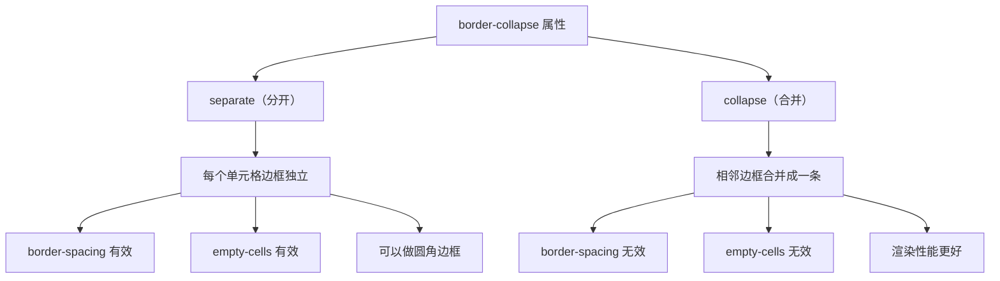

+++
title = "第15章 表格属性"
weight = 150
date = "2026-03-27T16:53:00+08:00"
type = "docs"
description = ""
isCJKLanguage = true
draft = false
+++

# 第十五章：表格属性

> 表格是数据展示的重要形式，但默认的表格样式往往让人"不忍直视"。这一章，我们将学习如何用 CSS 把那些"丑陋"的表格变成"颜值与实力并存"的数据展示利器。从边框合并到单元格对齐，从间距控制到布局优化，我们一起来探索表格的 CSS 美化之道。

## 15.1 表格布局属性

### 15.1.1 border-collapse——collapse（合并相邻单元格的边框）/ separate（分开，默认），设置后 border-spacing 失效

`border-collapse` 是表格样式化的基础属性之一。它决定了表格的边框是"合并"还是"分开"。这个属性听起来简单，但它直接影响表格的整体外观。

**什么是 `border-collapse`？**

想象一下你有一堆积木（单元格），每块积木都有自己的边框。`border-collapse: separate` 就像是把每块积木分开摆放，积木之间有间隙；而 `border-collapse: collapse` 则是把相邻的边框"焊接"在一起，变成一条边框。

```css
/* border-collapse 的两种值 */

/* separate —— 默认值，边框分开显示 */
.separate-table {
  border-collapse: separate;
  border: 2px solid #3498db;  /* 外边框 */
  width: 100%;
}

.separate-table td,
.separate-table th {
  border: 1px solid #ddd;  /* 每个单元格都有自己的边框 */
  padding: 12px;
}

/* collapse —— 边框合并 */
.collapse-table {
  border-collapse: collapse;  /* 边框合并 */
  width: 100%;
}

.collapse-table td,
.collapse-table th {
  border: 1px solid #3498db;  /* 边框合并后只显示一条线 */
  padding: 12px;
}
```

```html
<!-- separate 模式：边框分开，有间隙 -->
<table class="separate-table">
  <tr>
    <th>姓名</th>
    <th>年龄</th>
    <th>城市</th>
  </tr>
  <tr>
    <td>张三</td>
    <td>25</td>
    <td>北京</td>
  </tr>
  <tr>
    <td>李四</td>
    <td>30</td>
    <td>上海</td>
  </tr>
</table>

<!-- collapse 模式：边框合并成一条线 -->
<table class="collapse-table">
  <tr>
    <th>姓名</th>
    <th>年龄</th>
    <th>城市</th>
  </tr>
  <tr>
    <td>王五</td>
    <td>28</td>
    <td>广州</td>
  </tr>
</table>
```

**`border-collapse` 对比图：**

```
border-collapse: separate（分开）
┌─────────────────────────────┐
│  外边框                      │
│  ┌───────┬───────┬───────┐  │
│  │ 姓名  │ 年龄  │ 城市  │  │
│  ├───────┼───────┼───────┤  │
│  │ 张三  │  25   │ 北京  │  │
│  ├───────┼───────┼───────┤  │
│  │ 李四  │  30   │ 上海  │  │
│  └───────┴───────┴───────┘  │
│       每个单元格边框分开       │
└─────────────────────────────┘

border-collapse: collapse（合并）
┌─────────────────────────────┐
│                             │
│  姓名  │  年龄  │  城市   │
│────────┼────────┼─────────│
│  王五  │   28   │  广州   │
│────────┼────────┼─────────│
│  赵六  │   35   │  深圳   │
│                             │
└─────────────────────────────┘
       边框合并成一条线
```

**`border-collapse` 的实际应用：**

```css
/* 现代表格设计通常使用 collapse */
.modern-table {
  border-collapse: collapse;  /* 合并边框是现代设计的主流 */
  width: 100%;
  font-family: -apple-system, BlinkMacSystemFont, "Segoe UI", Roboto, sans-serif;
}

.modern-table th,
.modern-table td {
  border: 1px solid #e0e0e0;  /* 浅灰色边框 */
  padding: 14px 16px;
  text-align: left;
}

.modern-table th {
  background-color: #f8f9fa;  /* 表头浅灰背景 */
  font-weight: 600;
  color: #333;
  border-bottom: 2px solid #3498db;  /* 表头底部加粗边框 */
}

.modern-table tr:hover td {
  background-color: #f5f8ff;  /* 行hover高亮 */
}

/* 带圆角的表格（separate 模式） */
.rounded-corner-table {
  border-collapse: separate;  /* separate 配合 border-spacing: 0 */
  border-spacing: 0;         /* 边框间距设为0 */
  border: 1px solid #ddd;
  border-radius: 12px;       /* 表格圆角 */
}

.rounded-corner-table {
  /* 注意：直接对 table 设置 overflow: hidden 在某些浏览器中无效
     圆角效果需要配合外层容器使用 */
}

.rounded-corner-table th,
.rounded-corner-table td {
  border: none;
  border-bottom: 1px solid #eee;
  padding: 14px 16px;
}

.rounded-corner-table th {
  background-color: #3498db;
  color: white;
}

.rounded-corner-table tr:last-child td {
  border-bottom: none;  /* 最后一行无底边框 */
}
```

> 💡 **小技巧**：`border-collapse: collapse` 是现代表格设计的主流选择，它让表格看起来更简洁、专业。但如果需要实现圆角边框或其他特殊效果，需要使用 `border-collapse: separate` 配合 `border-spacing: 0`。

### 15.1.2 border-spacing——当 border-collapse: separate 时，设置相邻单元格之间的距离

`border-spacing` 用来控制单元格之间的间距。不过这个属性只有在 `border-collapse: separate` 的情况下才会生效——如果边框都合并了，哪来的间距呢？

**什么是 `border-spacing`？**

想象一下课桌之间留有过道（间距），学生（单元格）坐在自己的位置上。`border-spacing` 就是那个过道的宽度。

```css
/* border-spacing 的用法 */

.default-spacing {
  border-collapse: separate;  /* 必须配合 separate 使用 */
  border-spacing: 10px;      /* 水平和垂直间距都是10px */
  width: 100%;
}

/* 也可以分别设置水平和垂直间距 */
.custom-spacing {
  border-collapse: separate;
  border-spacing: 20px 10px;  /* 水平20px，垂直10px */
  /* 语法：border-spacing: 水平间距 垂直间距; */
}

.cell {
  border: 1px solid #ddd;
  padding: 12px;
}
```

```html
<table class="default-spacing">
  <tr>
    <td class="cell">间距10px</td>
    <td class="cell">单元格1</td>
  </tr>
  <tr>
    <td class="cell">单元格2</td>
    <td class="cell">单元格3</td>
  </tr>
</table>
```

**`border-spacing` 的特殊值：**

```css
/* border-spacing: 0 —— 无间距，单元格紧贴 */
.no-spacing {
  border-collapse: separate;
  border-spacing: 0;  /* 等于 border-spacing: 0 0; */
  width: 100%;
  border: 2px solid #3498db;
}

.no-spacing td {
  border: 1px solid #ddd;
  padding: 12px;
}

/* 利用 border-spacing 实现棋盘效果 */
.checkerboard {
  border-collapse: separate;
  border-spacing: 2px;  /* 2px间距作为"棋盘格线" */
  background-color: #333;  /* 间距的颜色就是背景色 */
  width: 100%;
}

.checkerboard td {
  background-color: white;  /* 白色格子 */
  padding: 20px;
  text-align: center;
}

.checkerboard tr:nth-child(odd) td:nth-child(odd),
.checkerboard tr:nth-child(even) td:nth-child(even) {
  background-color: #f0f0f0;  /* 灰格 */
}

.checkerboard tr:nth-child(odd) td:nth-child(even),
.checkerboard tr:nth-child(even) td:nth-child(odd) {
  background-color: white;  /* 白格 */
}
```

**`border-spacing` 与 `collapse` 的冲突：**

```css
/* ⚠️ border-collapse: collapse 会让 border-spacing 失效 */

.conflict-table {
  border-collapse: collapse;   /* 合并边框 */
  border-spacing: 50px;      /* 这个设置会被忽略！ */
  width: 100%;
}

.conflict-table td {
  border: 1px solid #ddd;
  padding: 12px;
}

/* 如果你想让 border-spacing 生效，必须用 separate */
.correct-spacing {
  border-collapse: separate;  /* separate 模式 */
  border-spacing: 15px;       /* 这个才生效 */
  width: 100%;
}

.correct-spacing td {
  border: 1px solid #ddd;
  padding: 12px;
}
```

> 💡 **小技巧**：`border-spacing` 在现代 CSS 设计中使用得越来越少，因为大多数设计师更倾向于使用 `border-collapse: collapse` 来获得简洁的表格外观。但如果需要实现格子状的特殊效果，`border-collapse: separate` 配合 `border-spacing` 是一个不错的选择。

### 15.1.3 table-layout——fixed（列宽由表格首行定义）/ auto（由内容决定，默认），fixed 可提升大表格渲染性能

`table-layout` 决定了浏览器如何计算表格的列宽。这个属性看似简单，但对大型表格的渲染性能有很大影响。

**什么是 `table-layout`？**

想象一下装修工人确定房间格局：有的工人会等所有家具都搬进来再决定每个房间的大小（auto），有的工人会先量好尺寸然后让家具去适应（fixed）。

```css
/* table-layout 的两种值 */

/* auto —— 默认值，列宽由内容决定 */
.auto-layout {
  table-layout: auto;  /* 默认值 */
  width: 100%;
  border-collapse: collapse;
}

.auto-layout td,
.auto-layout th {
  border: 1px solid #ddd;
  padding: 12px;
}

/* fixed —— 列宽由表格首行（或 width 定义）决定 */
.fixed-layout {
  table-layout: fixed;  /* 固定列宽 */
  width: 100%;
  border-collapse: collapse;
}

.fixed-layout td,
.fixed-layout th {
  border: 1px solid #ddd;
  padding: 12px;
}

/* 当设置为 fixed 时，通常配合 width 一起使用 */
.fixed-table {
  table-layout: fixed;
  width: 600px;  /* 固定表格总宽度 */
  border-collapse: collapse;
}

/* 如果首行的单元格设置了 width，整个列都会使用这个宽度 */
.fixed-table th:first-child {
  width: 200px;  /* 第一列固定200px */
}

.fixed-table th:nth-child(2) {
  width: 150px;  /* 第二列固定150px */
}
```

```html
<!-- auto 模式：列宽由内容决定 -->
<table class="auto-layout">
  <tr>
    <th>姓名姓名姓名姓名</th>
    <th>年龄</th>
  </tr>
  <tr>
    <td>张三</td>
    <td>25</td>
  </tr>
</table>
<!-- 第一列会被撑得很宽，因为内容很长 -->

<!-- fixed 模式：列宽固定 -->
<table class="fixed-layout">
  <tr>
    <th>姓名姓名姓名姓名</th>
    <th>年龄</th>
  </tr>
  <tr>
    <td>张三</td>
    <td>25</td>
  </tr>
</table>
<!-- 第一列宽度由首行定义，内容可能被截断或溢出 -->
```

**`table-layout: fixed` 的优势：**

```css
/* fixed 模式的特点 */

.performance-table {
  table-layout: fixed;  /* 固定列宽，渲染更快 */
  width: 100%;
  border-collapse: collapse;
}

/* 1. 渲染性能好 - 浏览器不需要计算每个单元格的内容 */
.performance-table td {
  border: 1px solid #ddd;
  padding: 12px;
  overflow: hidden;      /* 超出的内容隐藏 */
  text-overflow: ellipsis;  /* 显示省略号 */
  white-space: nowrap;     /* 不换行 */
}

/* 2. 可以精确控制每列宽度 */
.precise-columns {
  table-layout: fixed;
  width: 800px;
}

.precise-columns th:nth-child(1) { width: 30%; }  /* 30%宽度 */
.precise-columns th:nth-child(2) { width: 50%; }  /* 50%宽度 */
.precise-columns th:nth-child(3) { width: 20%; }  /* 20%宽度 */

/* 3. 配合 text-overflow 实现单元格文字截断 */
.truncate-cell {
  table-layout: fixed;
  width: 100%;
}

.truncate-cell td {
  max-width: 150px;          /* 最大宽度 */
  overflow: hidden;
  text-overflow: ellipsis;   /* 超出显示省略号 */
  white-space: nowrap;        /* 不换行 */
}
```

**`table-layout: auto` vs `fixed` 对比：**

```css
/* auto —— 内容决定列宽 */
.auto-table {
  table-layout: auto;
  width: 100%;
  border-collapse: collapse;
}

/* fixed —— 定义决定列宽 */
.fixed-table {
  table-layout: fixed;
  width: 100%;
  border-collapse: collapse;
}

/* 对比效果 */
.comparison td {
  border: 1px solid #ddd;
  padding: 12px;
}

.comparison .long-content {
  /* 内容很长时 */
}

.comparison .short-content {
  /* 内容很短时 */
}
```

```html
<table class="comparison auto-table">
  <tr>
    <td class="long-content">这是一个非常非常长的内容，会把整列都撑开</td>
    <td class="short-content">短</td>
  </tr>
</table>

<table class="comparison fixed-table">
  <tr>
    <th style="width: 70%;">标题1</th>
    <th style="width: 30%;">标题2</th>
  </tr>
  <tr>
    <td class="long-content">即使内容很长，宽度也是70%</td>
    <td class="short-content">30%</td>
  </tr>
</table>
```

> 💡 **小技巧**：`table-layout: fixed` 是大型表格（几百行以上）的首选，因为它能显著提升渲染性能。但要注意，使用 fixed 模式时，列宽是由表格首行（thead 中的 th）或 width 属性定义的，所以要确保首行的宽度定义正确。

### 15.1.4 empty-cells——show（显示空单元格边框）/ hide（隐藏空单元格边框），当 border-collapse: separate 时有效

`empty-cells` 控制当单元格为空（没有内容）时是否显示边框。这个属性只在 `border-collapse: separate` 时才会生效。

**什么是"空单元格"？**

空单元格指的是没有任何内容的单元格，包括没有文本、没有空格、没有任何可见元素。

```css
/* empty-cells 的两种值 */

/* show —— 显示空单元格的边框（默认） */
.show-empty {
  border-collapse: separate;
  empty-cells: show;  /* 默认值，可以不写 */
  width: 100%;
  border: 2px solid #3498db;
}

/* hide —— 隐藏空单元格的边框 */
.hide-empty {
  border-collapse: separate;
  empty-cells: hide;  /* 空单元格边框不显示 */
  width: 100%;
  border: 2px solid #2ecc71;
}

.show-empty td,
.hide-empty td,
.show-empty th,
.hide-empty th {
  border: 1px solid #ddd;
  padding: 12px;
}
```

```html
<!-- show 模式：空单元格显示边框 -->
<table class="show-empty">
  <tr>
    <th>姓名</th>
    <th>年龄</th>
    <th>备注</th>
  </tr>
  <tr>
    <td>张三</td>
    <td>25</td>
    <td></td>  <!-- 空单元格，但边框显示 -->
  </tr>
  <tr>
    <td>李四</td>
    <td></td>  <!-- 空单元格，边框显示 -->
    <td>无年龄数据</td>
  </tr>
</table>

<!-- hide 模式：空单元格边框被隐藏 -->
<table class="hide-empty">
  <tr>
    <th>姓名</th>
    <th>年龄</th>
    <th>备注</th>
  </tr>
  <tr>
    <td>王五</td>
    <td>30</td>
    <td></td>  <!-- 空单元格，边框被隐藏 -->
  </tr>
</table>
```

**`empty-cells` 的实际应用场景：**

```css
/* 1. 数据表格中隐藏"无数据"的空单元格 */
.data-table {
  border-collapse: separate;
  empty-cells: hide;  /* 空数据不显示边框 */
  width: 100%;
  border: 1px solid #e0e0e0;
}

.data-table th,
.data-table td {
  border: 1px solid #e0e0e0;
  padding: 12px 16px;
}

/* 2. 日历组件的空白格子 */
.calendar-table {
  border-collapse: separate;
  empty-cells: hide;
  border-spacing: 4px;
}

.calendar-table td {
  width: 40px;
  height: 40px;
  border: 1px solid #ddd;
  text-align: center;
  border-radius: 50%;
}

/* 3. 棋盘类表格 */
.chess-table {
  border-collapse: separate;
  border-spacing: 2px;  /* 用间距做棋盘格线，border-spacing 的颜色 = 背景色 */
  background-color: #333;  /* 深色背景作为格线颜色 */
}

.chess-table td {
  width: 50px;
  height: 50px;
  background-color: white;  /* 默认白格 */
}

.chess-table tr:nth-child(odd) td:nth-child(even),
.chess-table tr:nth-child(even) td:nth-child(odd) {
  background-color: #333;  /* 交错深色格子 */
}
```

**`empty-cells` 与 `border-collapse` 的关系：**

```css
/* ⚠️ empty-cells 只在 border-collapse: separate 时生效 */

.both-separate {
  border-collapse: separate;  /* 生效 */
  empty-cells: hide;          /* ✅ 有效 */
}

.both-collapse {
  border-collapse: collapse;   /* 合并模式 */
  empty-cells: hide;           /* ❌ 无效，被忽略 */
  width: 100%;
}

.both-collapse td {
  border: 1px solid #ddd;
  padding: 12px;
}
```

> 💡 **小技巧**：`empty-cells` 在现代 CSS 中使用得不多，因为大多数设计师会选择在数据层面处理"空数据"的显示（比如显示"-"或"N/A"）。但如果你的表格确实需要隐藏空单元格的边框，这个属性还是很有用的。

## 15.2 表格对齐

### 15.2.1 text-align——单元格内容水平对齐

`text-align` 在表格中的用法和在普通元素中一样，用来控制单元格内容的水平对齐方式。它决定了文字在单元格中是靠左、居中还是靠右。

**什么是 `text-align`？**

想象一下老师批改作业，有的老师喜欢把评语写在左边（靠左对齐），有的老师喜欢写在中间（居中对齐），还有的老外喜欢写在右边（靠右对齐）。`text-align` 就是这个"评语位置"的控制权。

```css
/* text-align 的四种基本值 */

/* left —— 靠左对齐（默认，用于大多数语言）*/
.align-left {
  text-align: left;
}

/* center —— 居中对齐 */
.align-center {
  text-align: center;
}

/* right —— 靠右对齐 */
.align-right {
  text-align: right;
}

/* justify —— 两端对齐（适合英文） */
.align-justify {
  text-align: justify;
}

/* 表格中的具体应用 */
.data-table {
  width: 100%;
  border-collapse: collapse;
}

.data-table th,
.data-table td {
  border: 1px solid #ddd;
  padding: 12px 16px;
}

/* 表头通常居中对齐 */
.data-table th {
  background-color: #f8f9fa;
  text-align: center;
  font-weight: 600;
}

/* 数字列通常靠右对齐，方便比较大小 */
.data-table .number-col {
  text-align: right;
}

/* 操作按钮列居中对齐 */
.data-table .action-col {
  text-align: center;
}
```

```html
<table class="data-table">
  <tr>
    <th>姓名</th>              <!-- 居中 -->
    <th>年龄</th>               <!-- 居中 -->
    <th class="action-col">操作</th>  <!-- 居中 -->
  </tr>
  <tr>
    <td>张三</td>               <!-- 默认靠左 -->
    <td class="number-col">25</td>  <!-- 靠右 -->
    <td class="action-col">
      <button>编辑</button>
    </td>
  </tr>
  <tr>
    <td>李四</td>
    <td class="number-col">30</td>
    <td class="action-col">
      <button>编辑</button>
    </td>
  </tr>
</table>
```

**`text-align` 的实用场景：**

```css
/* 1. 财务报表表格 */
.finance-table {
  width: 100%;
  border-collapse: collapse;
  font-size: 14px;
}

.finance-table th,
.finance-table td {
  border: 1px solid #ddd;
  padding: 10px 14px;
}

.finance-table th {
  background-color: #f5f5f5;
  text-align: center;
  font-weight: 600;
}

/* 货币金额靠右对齐 */
.finance-table .amount {
  text-align: right;
  font-family: 'Consolas', monospace;  /* 等宽字体更整齐 */
}

/* 2. 时间表格 */
.time-table {
  width: 100%;
  border-collapse: collapse;
}

.time-table td {
  text-align: center;
  padding: 12px;
  border: 1px solid #e0e0e0;
}

/* 时间列靠左对齐 */
.time-table .time-slot {
  text-align: left;
  font-weight: 500;
}

/* 3. 状态标签居中 */
.status-cell {
  text-align: center;
}

.status-tag {
  display: inline-block;
  padding: 4px 12px;
  border-radius: 20px;
  font-size: 12px;
}

.status-tag.success {
  background-color: #d4edda;
  color: #155724;
}

.status-tag.warning {
  background-color: #fff3cd;
  color: #856404;
}

.status-tag.danger {
  background-color: #f8d7da;
  color: #721c24;
}
```

**`text-align` 与 `direction` 的关系：**

```css
/* text-align 会受 direction 属性影响 */

/* 从左到右（默认）*/
.ltr-table {
  direction: ltr;  /* 默认值 */
  text-align: left;   /* 靠左对齐 */
}

/* 从右到左（如阿拉伯语、希伯来语）*/
.rtl-table {
  direction: rtl;
  text-align: right;   /* 在RTL中，right指向"左边" */
}

.rtl-table .start-align {
  text-align: start;   /* 块级开始方向 */
}

.rtl-table .end-align {
  text-align: end;     /* 块级结束方向 */
}
```

> 💡 **小技巧**：在表格中，数字列（如金额、数量）建议使用 `text-align: right`，因为这样更方便读者比较大小。想象一下一列数字靠左对齐，123 和 456 的末尾根本对不齐，比较起来多费劲！

### 15.2.2 vertical-align——top（内容靠上）/ middle（居中）/ bottom（靠下）/ baseline（基线对齐），垂直对齐

`vertical-align` 用来控制单元格内容的垂直对齐方式。它决定了内容在单元格中是靠上、居中还是靠下显示。

**什么是 `vertical-align`？**

想象一下一个书架（单元格），书（内容）可以放在书架的顶部（靠上）、中间（居中）或者底部（靠下）。`vertical-align` 就是决定"书放在哪一层"的属性。

```css
/* vertical-align 的四种基本值 */

/* top —— 内容靠上 */
.valign-top {
  vertical-align: top;
}

/* middle —— 内容居中 */
.valign-middle {
  vertical-align: middle;
}

/* bottom —— 内容靠下 */
.valign-bottom {
  vertical-align: bottom;
}

/* baseline —— 内容基线对齐（默认）*/
.valign-baseline {
  vertical-align: baseline;
}

/* 表格中的具体应用 */
.vertical-table {
  width: 300px;
  height: 200px;  /* 给表格设置固定高度才能看出垂直对齐效果 */
  border-collapse: collapse;
}

.vertical-table td {
  border: 1px solid #ddd;
  padding: 12px;
}

.vertical-table .top-cell {
  vertical-align: top;
}

.vertical-table .middle-cell {
  vertical-align: middle;
}

.vertical-table .bottom-cell {
  vertical-align: bottom;
}
```

```html
<table class="vertical-table">
  <tr>
    <td class="top-cell">
      <strong>靠上对齐</strong><br>
      内容紧贴单元格顶部
    </td>
    <td class="middle-cell">
      <strong>居中对齐</strong><br>
      内容垂直居中
    </td>
    <td class="bottom-cell">
      <strong>靠下对齐</strong><br>
      内容紧贴单元格底部
    </td>
  </tr>
</table>
```

**`vertical-align` 的实用场景：**

```css
/* 1. 图标和文字垂直居中 */
.icon-cell {
  height: 50px;
  vertical-align: middle;  /* 图标和文字垂直居中 */
}

.icon-cell img {
  width: 24px;
  height: 24px;
  vertical-align: middle;  /* 图片本身也要设置 */
}

/* 2. 按钮在单元格中垂直居中 */
.button-cell {
  height: 60px;
  vertical-align: middle;
}

.button-cell button {
  vertical-align: middle;
}

/* 3. 多行文字的垂直居中 */
.multi-line-cell {
  height: 120px;
  vertical-align: middle;  /* 多行文字整体居中 */
  text-align: center;
}

/* 4. 表格顶部对齐（常用）*/
.top-align-table {
  vertical-align: top;  /* 所有单元格内容靠上 */
}

.top-align-table td {
  padding-top: 20px;  /* 顶部间距更大 */
}

/* 5. 表头和数据垂直居中 */
.header-cell {
  height: 50px;
  vertical-align: middle;  /* 表头内容垂直居中 */
}

.data-cell {
  height: 40px;
  vertical-align: middle;  /* 数据垂直居中 */
}
```

**`vertical-align` 与 `baseline` 的特殊关系：**

```css
/* ⚠️ baseline 对齐有一个特殊的行为 */

/* baseline 是表格单元格的默认值 */
/* 但如果单元格内容是空的，baseline 的位置可能会出乎意料 */

.baseline-table {
  width: 300px;
  border-collapse: collapse;
}

.baseline-table td {
  border: 1px solid #ddd;
  padding: 30px 12px;  /* 较大的上下padding */
  height: 80px;
}

.baseline-table .empty-cell {
  /* 空单元格的baseline位置 */
}

/* 如果想让空单元格的内容也垂直居中，使用 middle 或 top */
.correct-empty-cell {
  vertical-align: middle;
}

/* baseline 对齐的原理：内容的基线与单元格的基线对齐 */
/* 单元格的基线位置取决于内容的类型 */

/* 当单元格有多个行文字时，baseline对齐会让文字基线对齐 */
.multi-line-baseline td {
  vertical-align: baseline;
}
```

**`vertical-align` 与 Flexbox 的对比：**

```css
/* 在表格中垂直居中，通常使用 vertical-align: middle */

/* 但如果需要更复杂的垂直居中，可以考虑使用 Flexbox */
.flex-cell {
  display: flex;
  align-items: center;    /* 垂直居中 */
  justify-content: center;  /* 水平居中 */
  height: 100px;
}

/* 或者使用 CSS Grid */
.grid-cell {
  display: grid;
  align-items: center;      /* 垂直居中 */
  justify-items: center;   /* 水平居中 */
  height: 100px;
}
```

```html
<!-- 使用 Flexbox 进行单元格内容居中 -->
<table>
  <tr>
    <td class="flex-cell">
      <div>
        <p>使用 Flexbox</p>
        <p>垂直和水平都居中</p>
      </div>
    </td>
  </tr>
</table>
```

> 💡 **小技巧**：`vertical-align: middle` 是表格中最常用的垂直对齐方式。但要注意，它只能让单行内容真正垂直居中。对于多行内容，可能需要配合 line-height 或者使用 Flexbox/Grid 来实现更精确的垂直居中。

---

## 本章小结

恭喜你完成了第十五章的学习！让我们来回顾一下这章的精华：

### 核心知识点

| 属性 | 说明 |
|------|------|
| border-collapse | 边框合并（collapse）或分开（separate） |
| border-spacing | 单元格之间的间距 |
| table-layout | 列宽计算方式（auto 由内容决定，fixed 由首行决定）|
| empty-cells | 空单元格的边框显示（show）或隐藏（hide）|
| text-align | 水平对齐（左、中、右） |
| vertical-align | 垂直对齐（上、中、下、基线） |

### 边框模式对比



### 实战建议

1. **现代表格设计**：使用 `border-collapse: collapse` 获得简洁外观
2. **数字列对齐**：使用 `text-align: right` 方便比较
3. **垂直居中**：使用 `vertical-align: middle`
4. **大表格优化**：使用 `table-layout: fixed` 提升渲染性能
5. **单元格内边距**：使用 `padding` 而不是 `border-spacing` 来控制间距

### 下章预告

下一章我们将学习列表与计数器属性，看看如何用 CSS 来美化列表和创建高级计数效果！


