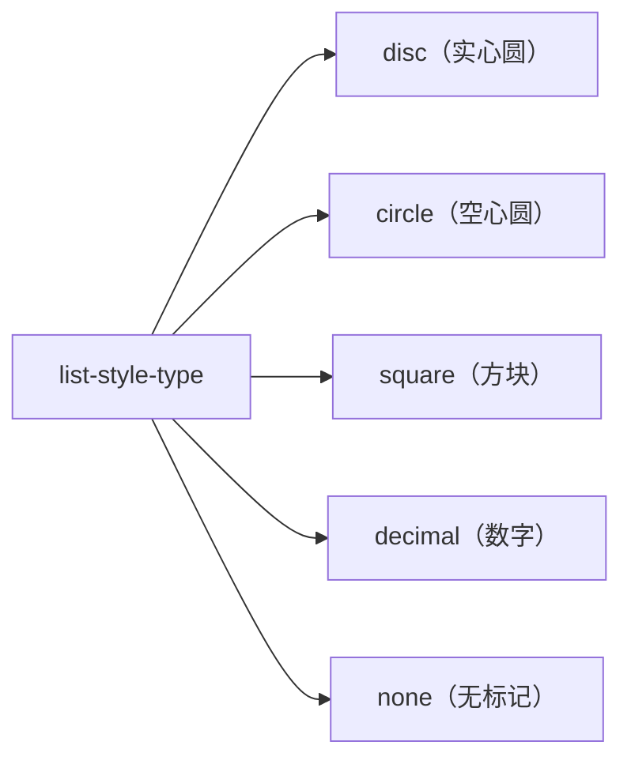
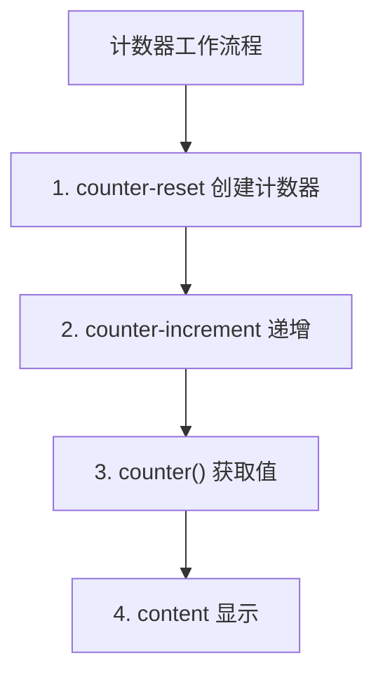

+++
title = "第16章 列表与计数器属性"
weight = 160
date = "2026-03-27T16:53:00+08:00"
type = "docs"
description = ""
isCJKLanguage = true
draft = false
+++

# 第十六章：列表与计数器属性

> 列表是我们日常生活中经常遇到的东西——购物清单、待办事项、排行榜... CSS 提供了丰富的列表样式控制。而 CSS 计数器更是一个"隐藏的神器"，它可以让你不依赖 JavaScript 就能实现自动编号功能。这一章，我们将一起探索列表和计数器的奥妙。

## 16.1 列表属性

### 16.1.1 list-style-type——disc（实心圆）、circle（空心圆）、square（方块）、decimal（数字）、none（无标记）

`list-style-type` 是控制列表标记样式的属性。默认的列表标记可能是圆点、数字或者字母，但通过这个属性，你可以把它们变成任何你想要的样式。

**什么是列表标记？**

想象一下超市的购物清单，每一项前面都有一个"√"或者序号。"√"或序号就是列表标记。`list-style-type` 就是控制这些标记样式的属性。

```css
/* list-style-type 的各种值 */

/* 无序列表标记类型 */
.ul-disc {
  list-style-type: disc;    /* 实心圆（默认）*/
}

.ul-circle {
  list-style-type: circle;  /* 空心圆 */
}

.ul-square {
  list-style-type: square;  /* 方块 */
}

.ul-none {
  list-style-type: none;    /* 无标记 */
}

/* 有序列表标记类型 */
.ol-decimal {
  list-style-type: decimal;           /* 阿拉伯数字（1, 2, 3...）*/
}

.ol-decimal-leading-zero {
  list-style-type: decimal-leading-zero; /* 带前导零的数字（01, 02, 03...）*/
}

.ol-lower-alpha {
  list-style-type: lower-alpha;     /* 小写字母（a, b, c...）*/
}

.ol-upper-alpha {
  list-style-type: upper-alpha;     /* 大写字母（A, B, C...）*/
}

.ol-lower-roman {
  list-style-type: lower-roman;     /* 小写罗马数字（i, ii, iii...）*/
}

.ol-upper-roman {
  list-style-type: upper-roman;     /* 大写罗马数字（I, II, III...）*/
}

.ol-lower-greek {
  list-style-type: lower-greek;     /* 小写希腊字母（α, β, γ...）*/
}
```

```html
<h3>无序列表标记类型</h3>
<ul class="ul-disc">
  <li>实心圆（默认）</li>
  <li>列表项二</li>
  <li>列表项三</li>
</ul>

<ul class="ul-circle">
  <li>空心圆</li>
  <li>列表项二</li>
</ul>

<ul class="ul-square">
  <li>方块</li>
  <li>列表项二</li>
</ul>

<ul class="ul-none">
  <li>无标记（常用于自定义图标列表）</li>
  <li>列表项二</li>
</ul>

<h3>有序列表标记类型</h3>
<ol class="ol-decimal">
  <li>阿拉伯数字（1, 2, 3...）</li>
  <li>列表项二</li>
</ol>

<ol class="ol-decimal-leading-zero">
  <li>带前导零（01, 02, 03...）</li>
  <li>列表项二</li>
</ol>

<ol class="ol-lower-alpha">
  <li>小写字母（a, b, c...）</li>
  <li>列表项二</li>
</ol>

<ol class="ol-upper-roman">
  <li>大写罗马数字（I, II, III...）</li>
  <li>列表项二</li>
</ol>
```

**`list-style-type` 的实用场景：**

```css
/* 1. 自定义图标列表（先清除默认标记）*/
.icon-list {
  list-style-type: none;  /* 先清除默认标记 */
  padding-left: 0;
  margin: 0;
}

.icon-list li {
  padding-left: 24px;     /* 给图标留出空间 */
  position: relative;       /* 用于定位图标 */
  margin-bottom: 8px;
}

.icon-list li::before {
  content: "✓";            /* 自定义图标字符 */
  position: absolute;
  left: 0;
  color: #2ecc71;         /* 绿色对勾 */
  font-weight: bold;
}

/* 2. 导航菜单列表 */
.nav-list {
  list-style-type: none;
  padding: 0;
  margin: 0;
  display: flex;
  gap: 20px;
}

.nav-list li a {
  text-decoration: none;
  color: #333;
}

/* 3. 步骤指示器 */
.step-list {
  list-style-type: none;
  counter-reset: step-counter;
  padding: 0;
}

.step-list li {
  counter-increment: step-counter;
  padding-left: 40px;
  position: relative;
  margin-bottom: 20px;
}

.step-list li::before {
  content: counter(step-counter);
  position: absolute;
  left: 0;
  width: 28px;
  height: 28px;
  background-color: #3498db;
  color: white;
  border-radius: 50%;
  text-align: center;
  line-height: 28px;
  font-weight: bold;
}
```

**`list-style-type` 缩写：**

```css
/* list-style-type 可以和其他属性一起缩写 */
/* list-style: type position image; */

/* 完整写法 */
.full-style {
  list-style-type: square;
  list-style-position: outside;
  list-style-image: none;
}

/* 缩写写法 */
.shorthand-style {
  list-style: square outside none;
}

/* 最简写法 */
.minimal-style {
  list-style: none;  /* 清除所有列表样式 */
}
```

> 💡 **小技巧**：当你想使用自定义图标作为列表标记时，首先需要设置 `list-style-type: none` 来清除默认标记，然后通过 `::before` 伪元素来添加自定义图标。这是最灵活的自定义列表标记方式。

### 16.1.2 list-style-position——inside（标记在内容区内）、outside（标记在内容区外，默认）

`list-style-position` 控制列表标记相对于列表项内容的位置——是"在内容里面"还是"在内容外面"。

**什么是列表标记位置？**

想象一下书的目录，每一章的标题前有序号。如果序号紧贴着标题文字，那就是"inside"（里面）；如果序号在标题左边一点的位置，那就是"outside"（外面）。

```css
/* list-style-position 的两种值 */

/* outside —— 标记在内容区外（默认）*/
.position-outside {
  list-style-position: outside;  /* 默认值 */
  background-color: #f8f9fa;
  padding: 16px;
  margin-bottom: 20px;
}

/* inside —— 标记在内容区内 */
.position-inside {
  list-style-position: inside;
  background-color: #e8f4f8;
  padding: 16px;
}

.list-item {
  background-color: white;
  padding: 12px;
  margin-bottom: 8px;
  border-left: 3px solid #3498db;
}
```

```html
<ul class="position-outside">
  <li class="list-item">
    <strong>outside（默认）</strong> - 标记在内容区外面。
    标记和第一行文字对齐，第二行文字会缩进。
    这是一个比较长的列表项，用于演示outside的效果。
  </li>
  <li class="list-item">第二项</li>
</ul>

<ul class="position-inside">
  <li class="list-item">
    <strong>inside</strong> - 标记在内容区里面。
    标记成为内容的一部分，和文字一起缩进。
    所有文字都会相对于标记对齐。
  </li>
  <li class="list-item">第二项</li>
</ul>
```

**`list-style-position` 的实际效果对比：**

```
list-style-position: outside（默认）
┌──────────────────────────────────────┐
│ ● 标记在内容区外面                │
│   标记和第一行对齐                   │
│   第二行文字会缩进到标记位置           │
└──────────────────────────────────────┘

list-style-position: inside
┌──────────────────────────────────────┐
│   ● 标记在内容区里面                 │
│     标记成为内容的一部分               │
│     所有文字都相对于标记对齐           │
└──────────────────────────────────────┘
```

**`list-style-position` 的实用场景：**

```css
/* 1. 带边框的列表 */
.bordered-list {
  list-style-position: outside;
  padding-left: 20px;
  border-left: 4px solid #3498db;
  background-color: #f8f9fa;
}

.bordered-list li {
  padding: 10px 0;
  border-bottom: 1px solid #eee;
}

.bordered-list li:last-child {
  border-bottom: none;
}

/* 2. 引用列表 */
.quote-list {
  list-style-position: inside;
}

.quote-list li {
  padding-left: 20px;
  text-indent: -20px;  /* 文字缩进到标记位置 */
  color: #555;
  font-style: italic;
  margin-bottom: 12px;
}

.quote-list li::before {
  content: "" "";  /* 使用引号作为标记 */
  color: #3498db;
}

/* 3. 任务清单 */
.task-list {
  list-style-position: outside;
}

.task-list li {
  position: relative;
  padding-left: 30px;
  margin-bottom: 8px;
}

.task-list li::before {
  content: "☐";  /* 未完成的任务 */
  position: absolute;
  left: 0;
  font-size: 18px;
}

.task-list li.completed::before {
  content: "☑";  /* 已完成的任务 */
  color: #2ecc71;
}
```

```html
<ul class="task-list">
  <li>完成 CSS 教程第一章</li>
  <li class="completed">完成 CSS 教程第二章</li>
  <li>完成 CSS 教程第三章</li>
</ul>
```

> 💡 **小技巧**：`list-style-position: inside` 在某些场景下很有用，比如你想要列表项的背景色包含标记。但要注意，`inside` 会让文字换行时缩进到标记位置，可能影响阅读体验。

### 16.1.3 list-style-image——用图片替代列表标记，不推荐，用 ::before 伪元素更灵活

`list-style-image` 允许你使用图片作为列表标记。但这个属性在现代 CSS 开发中已经不推荐使用了，因为 `::before` 伪元素提供了更灵活的控制方式。

**什么是 `list-style-image`？**

想象一下菜单上的菜品图片——用图片来替代简单的文字或符号。`list-style-image` 就是这个"菜品图片"，只不过它替代的是列表的标记。

```css
/* list-style-image 的用法 */

.image-list {
  list-style-image: url("marker.png");  /* 使用图片作为标记 */
  /* 现代开发中不推荐这种写法 */
}

/* ⚠️ list-style-image 的问题 */

/* 问题1：图片大小不好控制 */
.problematic-list {
  list-style-image: url("small-icon.png");
  /* 图片太小或太大都不好调整 */
}

/* 问题2：图片位置不好控制 */
.problematic-list2 {
  list-style-image: url("marker.png");
  /* 图片和文字的对齐位置不好精确控制 */
}

/* 问题3：图片和标记类型需要分开设置 */
.mixed-list {
  list-style-type: square;              /* 还要设置一个备用类型 */
  list-style-image: url("marker.png"); /* 图片加载失败时显示方块 */
}
```

**现代替代方案：使用 ::before 伪元素**

```css
/* 推荐：使用 ::before 伪元素替代 list-style-image */

.custom-marker-list {
  list-style: none;  /* 清除默认标记 */
  padding: 0;
}

.custom-marker-list li {
  position: relative;
  padding-left: 28px;  /* 给标记留出空间 */
  margin-bottom: 8px;
  line-height: 1.6;
}

.custom-marker-list li::before {
  content: url("marker.png");  /* 图片URL作为content */
  position: absolute;
  left: 0;
  top: 50%;
  transform: translateY(-50%);  /* 垂直居中 */
  width: 20px;
  height: 20px;
  background-image: url("marker.png");
  background-size: contain;
  background-repeat: no-repeat;
}

/* 更灵活的版本：使用 emoji 或 SVG */
.emoji-list {
  list-style: none;
  padding: 0;
}

.emoji-list li {
  position: relative;
  padding-left: 28px;
  margin-bottom: 10px;
}

.emoji-list li::before {
  content: "👉";  /* 使用 emoji 作为标记 */
  position: absolute;
  left: 0;
  top: 50%;
  transform: translateY(-50%);
}

/* 箭头列表 */
.arrow-list {
  list-style: none;
  padding: 0;
}

.arrow-list li {
  position: relative;
  padding-left: 20px;
  margin-bottom: 8px;
}

.arrow-list li::before {
  content: "→";  /* 使用箭头符号 */
  position: absolute;
  left: 0;
  color: #3498db;
  font-weight: bold;
}

/* 使用 CSS 绘制的图标 */
.css-icon-list {
  list-style: none;
  padding: 0;
}

.css-icon-list li {
  position: relative;
  padding-left: 24px;
  margin-bottom: 12px;
}

.css-icon-list li::before {
  content: "";
  position: absolute;
  left: 0;
  top: 6px;
  width: 10px;
  height: 10px;
  background-color: #2ecc71;
  border-radius: 50%;  /* 圆点 */
}

.css-icon-list li.check::before {
  background-color: transparent;
  border: 2px solid #2ecc71;
  border-radius: 0;
  width: 12px;
  height: 6px;
  border-top: none;
  border-right: none;
  transform: rotate(-45deg);
  top: 8px;
}
```

```html
<ul class="custom-marker-list">
  <li>使用背景图片的自定义标记</li>
  <li>可以精确控制大小和位置</li>
</ul>

<ul class="emoji-list">
  <li>👉 使用 emoji 作为标记</li>
  <li>🎯 灵活多变</li>
  <li>✨ 不需要额外图片资源</li>
</ul>

<ul class="arrow-list">
  <li>→ 箭头列表</li>
  <li>→ 简洁明了</li>
  <li>→ 易于维护</li>
</ul>
```

> 💡 **小技巧**：现代 CSS 开发中，强烈推荐使用 `::before` 伪元素来替代 `list-style-image`。因为 `::before` 可以让你完全控制标记的大小、位置、颜色，甚至可以添加多个图标或复杂的设计。

### 16.1.4 list-style——type position image 缩写

`list-style` 是 `list-style-type`、`list-style-position` 和 `list-style-image` 的缩写属性。使用缩写可以让代码更简洁。

**`list-style` 的缩写语法：**

```css
/* 完整写法 */
.full-list-style {
  list-style-type: disc;
  list-style-position: outside;
  list-style-image: none;
}

/* 缩写写法 */
.shorthand-list-style {
  /* 顺序可以是任意的 */
  list-style: disc outside none;
  /* 或者 */
  list-style: none outside disc;
  /* 或者 */
  list-style: url("marker.png") inside square;
}
```

```html
<ul class="shorthand-list-style">
  <li>使用 list-style 缩写的列表</li>
  <li>代码更简洁</li>
  <li>更易维护</li>
</ul>
```

**`list-style` 缩写值的顺序：**

```css
/* list-style: <list-style-type> <list-style-position> <list-style-image> */

/* 常用组合 */

/* 无标记列表（最常用）*/
.no-marker {
  list-style: none;  /* 清除所有样式 */
  padding-left: 0;
}

/* 自定义图标 + 外部标记 */
.custom-outside {
  list-style: none;  /* 先清除默认 */
  padding-left: 24px;
}

.custom-outside li::before {
  content: "✓";
  position: absolute;
  left: 0;
  color: #2ecc71;
}

/* 带图片标记 */
.image-marker {
  list-style: square outside url("marker.png");
  /* 如果图片加载失败，显示 square */
}

/* 带内联标记 */
.inside-marker {
  list-style: decimal inside;
}
```

**`list-style` 的实际应用：**

```css
/* 1. 全局列表样式重置 */
ul, ol {
  list-style: none;  /* 清除默认样式 */
  padding-left: 0;
  margin: 0;
}

/* 2. 导航菜单 */
.nav-menu {
  list-style: none;          /* 无标记 */
  display: flex;              /* 水平排列 */
  gap: 24px;                 /* 间距 */
}

.nav-menu li a {
  text-decoration: none;
  color: #333;
  font-weight: 500;
  transition: color 0.2s;
}

.nav-menu li a:hover {
  color: #3498db;
}

/* 3. 文章目录 */
.article-toc {
  list-style: none;           /* 无标记 */
  padding-left: 0;
  border-left: 2px solid #eee;
}

.article-toc li {
  padding-left: 16px;
  margin-bottom: 8px;
  border-left: 2px solid transparent;
  transition: border-color 0.2s;
}

.article-toc li:hover {
  border-left-color: #3498db;
}

.article-toc li a {
  text-decoration: none;
  color: #555;
}

.article-toc li a:hover {
  color: #3498db;
}

/* 4. 面包屑导航 */
.breadcrumb {
  list-style: none;           /* 无标记 */
  display: flex;               /* 水平排列 */
  align-items: center;
  gap: 8px;
  font-size: 14px;
}

.breadcrumb li:not(:last-child)::after {
  content: "/";                /* 使用 / 分隔 */
  color: #999;
  margin-left: 8px;
}

.breadcrumb li a {
  text-decoration: none;
  color: #666;
}

.breadcrumb li:last-child {
  color: #333;
  font-weight: 500;
}
```

```html
<!-- 导航菜单 -->
<ul class="nav-menu">
  <li><a href="/">首页</a></li>
  <li><a href="/products">产品</a></li>
  <li><a href="/about">关于</a></li>
  <li><a href="/contact">联系</a></li>
</ul>

<!-- 文章目录 -->
<ol class="article-toc">
  <li><a href="#section1">第一章：入门</a></li>
  <li><a href="#section2">第二章：进阶</a></li>
  <li><a href="#section3">第三章：高级</a></li>
</ol>

<!-- 面包屑导航 -->
<ol class="breadcrumb">
  <li><a href="/">首页</a></li>
  <li><a href="/products">产品</a></li>
  <li><a href="/products/electronics">电子产品</a></li>
  <li>智能手机</li>
</ol>
```

> 💡 **小技巧**：`list-style: none` 是现代 CSS 开发中最常用的列表样式重置写法。配合 `padding-left: 0` 可以完全清除列表的默认样式，然后你就可以用 `::before` 伪元素来添加任何你想要的标记样式了。

## 16.2 CSS 计数器

### 16.2.1 counter-reset——创建或重置计数器，如 counter-reset: my-counter;

CSS 计数器是一个强大但鲜为人知的功能。它允许你创建"虚拟计数器"，并在列表项或其他元素中自动递增编号，而无需使用 JavaScript。

**什么是 CSS 计数器？**

想象一下一个自动编号机。你设置一个起始数字，然后每使用一次，数字就自动加一。CSS 计数器就是这个"自动编号机"，只不过它是纯 CSS 实现的，不需要 JavaScript。

```css
/* counter-reset 的基本用法 */

/* 创建一个名为 my-counter 的计数器，起始值为 0 */
.counter-reset {
  counter-reset: my-counter;
}

/* 也可以创建多个计数器 */
.multiple-counters {
  counter-reset:
    section-counter    /* 章节计数器 */
    item-counter 5     /* 项目计数器，起始值为5 */
    figure-counter;     /* 图表计数器，默认起始值为0 */
}

/* counter-reset: none —— 取消计数器重置 */
.no-reset {
  counter-reset: none;  /* 不重置任何计数器 */
}
```

**计数器的生命周期：**

```css
/* 计数器的作用域是整个元素及其后代 */

/* 在父元素上创建计数器 */
.counter-container {
  counter-reset: item-counter;  /* 创建计数器 */
}

/* 子元素可以使用这个计数器 */
.counter-container .item {
  /* 可以使用和递增 item-counter */
}

.counter-container .nested {
  /* 也可以使用 item-counter */
}
```

### 16.2.2 counter-increment——递增计数器，如 counter-increment: my-counter（默认每次递增 1）

`counter-increment` 用来递增（增加）计数器的值。默认情况下，每次递增 1，但你也可以指定其他增量。

```css
/* counter-increment 的基本用法 */

.increment-default {
  counter-increment: my-counter;  /* 默认每次递增 1 */
}

/* 指定增量 */
.increment-2 {
  counter-increment: my-counter 2;  /* 每次递增 2 */
}

.increment-10 {
  counter-increment: step-counter 10;  /* 每次递增 10 */
}

/* 递减（使用负数）*/
.decrement {
  counter-increment: reverse-counter -1;  /* 每次递减 1 */
}

/* counter-increment: none —— 不递增 */
.no-increment {
  counter-increment: none;  /* 不递增任何计数器 */
}
```

### 16.2.3 counter()——使用计数器值，如 content: counter(my-counter);

`counter()` 函数用来获取计数器的当前值，通常配合 `content` 属性一起使用，在 `::before` 或 `::after` 伪元素中显示计数器。

```css
/* counter() 的基本用法 */

.counter-item {
  counter-reset: my-counter;  /* 创建并重置计数器 */
}

.counter-item li {
  counter-increment: my-counter;  /* 每个li递增计数器 */
}

.counter-item li::before {
  content: counter(my-counter);  /* 显示计数器的值 */
  /* 显示效果：1, 2, 3... */
}

/* 计数器与列表的完美配合 */
.numbered-list {
  counter-reset: numbered-item;
  list-style: none;  /* 清除默认列表样式 */
  padding: 0;
}

.numbered-list li {
  counter-increment: numbered-item;
  padding-left: 40px;  /* 给计数器留出空间 */
  position: relative;
  margin-bottom: 12px;
}

.numbered-list li::before {
  content: counter(numbered-item);  /* 显示编号 */
  position: absolute;
  left: 0;
  top: 0;
  width: 28px;
  height: 28px;
  background-color: #3498db;
  color: white;
  border-radius: 50%;
  text-align: center;
  line-height: 28px;
  font-weight: bold;
  font-size: 14px;
}
```

```html
<ol class="numbered-list">
  <li>这是第一个列表项，前面显示 1</li>
  <li>这是第二个列表项，前面显示 2</li>
  <li>这是第三个列表项，前面显示 3</li>
</ol>
```

### 16.2.4 counters()——嵌套计数器，如 content: counters(my-counter, ".");（输出 1.2.3）

`counters()` 函数用于处理嵌套的计数器。比如一个多层嵌套的列表，每一层都需要显示 "1.2.3" 这样的编号，`counters()` 就能派上用场。

```css
/* counters() 的基本用法 */

.nested-counter-list {
  counter-reset: level-1;  /* 创建一个顶层计数器 */
  list-style: none;
  padding-left: 0;
}

.level-1-item {
  counter-increment: level-1;
  counter-reset: level-2;  /* 重置第二层计数器 */
}

.level-1-item::before {
  content: counter(level-1) ". ";
  font-weight: bold;
}

.level-2-item {
  counter-increment: level-2;
  padding-left: 40px;
}

.level-2-item::before {
  content: counter(level-1) "." counter(level-2) ". ";
  /* 显示效果：1.1, 1.2, 2.1... */
}

/* 使用 counters() 自动处理嵌套 */
.auto-nested {
  counter-reset: item;
  list-style: none;
  padding-left: 20px;
}

.auto-nested li {
  counter-increment: item;
}

.auto-nested li::before {
  content: counters(item, ".") " ";
  /* counters() 会自动处理嵌套级别 */
  /* 第一级：1, 2, 3... */
  /* 第二级（嵌套在1下）：1.1, 1.2... */
  /* 第三级：1.1.1, 1.1.2... */
}
```

```html
<ol class="auto-nested">
  <li>第一章
    <ol>
      <li>第一章第一节</li>
      <li>第一章第二节
        <ol>
          <li>1.2.1 小节</li>
          <li>1.2.2 小节</li>
        </ol>
      </li>
    </ol>
  </li>
  <li>第二章
    <ol>
      <li>第二章第一节</li>
    </ol>
  </li>
</ol>
```

**计数器的样式设置：**

```css
/* 计数器也可以设置样式 */

/* 设置编号的格式 */
.format-list {
  counter-reset: item;
  list-style: none;
}

.format-list li {
  counter-increment: item;
}

.format-list li::before {
  content: counter(item, upper-alpha);  /* 使用大写字母 */
  /* 显示效果：A, B, C... */
}

/* 可用的格式类型 */
/* decimal - 阿拉伯数字（1, 2, 3...）*/
/* decimal-leading-zero - 带前导零（01, 02...）*/
/* lower-alpha - 小写字母（a, b, c...）*/
/* upper-alpha - 大写字母（A, B, C...）*/
/* lower-roman - 小写罗马数字（i, ii, iii...）*/
/* upper-roman - 大写罗马数字（I, II, III...）*/
/* lower-greek - 小写希腊字母（α, β, γ...）*/
```

**计数器的实际应用场景：**

```css
/* 1. 自动编号的文章章节 */
.article {
  counter-reset: section;
}

.article h2 {
  counter-increment: section;
  counter-reset: subsection;
}

.article h2::before {
  content: counter(section) ". ";
  color: #3498db;
  font-weight: bold;
}

.article h3 {
  counter-increment: subsection;
}

.article h3::before {
  content: counter(section) "." counter(subsection) " ";
  color: #666;
}

/* 2. 图片自动编号（图1、图2...）*/
.gallery {
  counter-reset: figure-num;
}

.gallery figure {
  counter-increment: figure-num;
}

.gallery figcaption::before {
  content: "图" counter(figure-num) ": ";
  font-weight: bold;
  color: #3498db;
}

/* 3. 脚注编号 */
.footnote-ref {
  counter-increment: footnote;
  font-size: 12px;
  color: #3498db;
  cursor: pointer;
}

.footnote-ref::before {
  content: "[" counter(footnote) "]";
}

.footnote {
  counter-increment: footnote;
  font-size: 12px;
  color: #666;
}

.footnote::before {
  content: "[" counter(footnote) "] ";
}

/* 4. 步骤指示器 */
.workflow {
  counter-reset: step;
  display: flex;
  gap: 20px;
}

.workflow-step {
  counter-increment: step;
  flex: 1;
  text-align: center;
  position: relative;
}

.workflow-step::before {
  content: counter(step);
  display: block;
  width: 40px;
  height: 40px;
  margin: 0 auto 10px;
  line-height: 40px;
  background-color: #3498db;
  color: white;
  border-radius: 50%;
  font-weight: bold;
}
```

> 💡 **小技巧**：CSS 计数器是一个被严重低估的功能。它可以实现很多需要 JavaScript 才能完成的编号功能，比如自动目录、章节编号、图片编号等。而且 CSS 计数器是纯 CSS 实现的，性能比 JavaScript 更好。

## 16.3 @counter-style 自定义计数样式

### 16.3.1 基本语法——@counter-style custom { system: numeric; symbols: "I" "II" "III"; }

`@counter-style` 是 CSS 提供的一个强大功能，它允许你定义自定义的计数样式。如果内置的计数类型（decimal、disc 等）不能满足需求，你可以通过 `@counter-style` 创建完全自定义的计数系统。

**什么是 @counter-style？**

想象一下你开了一家餐厅，需要用独特的编号方式来给菜品编号。内置的 "1, 2, 3..." 太普通了，你想用罗马数字，或者用emoji，或者用自定义符号。`@counter-style` 就是让你创建"自定义菜品编号系统"的工具。

```css
/* @counter-style 的基本语法 */

/* 定义一个自定义计数器样式 */
@counter-style custom-roman {
  /* 系统类型 */
  system: numeric;           /* 使用数字系统 */

  /* 符号定义 */
  symbols: "I" "II" "III" "IV" "V" "VI" "VII" "VIII" "IX" "X";
  /* 对应 1, 2, 3, 4, 5, 6, 7, 8, 9, 10 */
}

/* 使用自定义计数器 */
.roman-list {
  list-style: custom-roman;
}
```

```html
<ol class="roman-list">
  <li>第一章 - 介绍</li>
  <li>第二章 - 基础</li>
  <li>第三章 - 进阶</li>
  <li>第四章 - 高级</li>
  <li>第五章 - 实战</li>
</ol>
<!-- 显示为：I, II, III, IV, V... -->
```

**@counter-style 的完整结构：**

```css
/* 定义一个更完整的自定义计数器 */
@counter-style emoji-counter {
  /* 系统类型 */
  system: fixed -1;  /* 从 -1 开始编号 */

  /* 符号定义 */
  symbols: "😀" "😁" "😂" "🤣" "😃" "😄" "😅";

  /* 前缀 */
  prefix: "";

  /* 后缀 */
  suffix: "、";
}

/* 使用 */
.emoji-list {
  list-style: emoji-counter;
}
```

```html
<ul class="emoji-list">
  <li>开心的表情</li>
  <li>微笑</li>
  <li>大笑</li>
</ul>
<!-- 显示为：😀、😁、😂... -->
```

### 16.3.2 内置系统——cyclic（循环）、numeric（数字）、alphabetic（字母）、additive（加法）、fixed（固定符号）、extends（扩展内置）

`@counter-style` 提供了多种"系统"来定义计数规则，每种系统适合不同的场景。

**1. cyclic（循环系统）——循环使用给定的符号**

```css
/* cyclic 系统：循环使用符号列表 */
@counter-style cyclic-dots {
  system: cyclic;
  symbols: "●" "○" "◎";  /* 只有3个符号，循环使用 */
  /* 1=●, 2=○, 3=◎, 4=●, 5=○... */
}

.cyclic-list {
  list-style: cyclic-dots;
}
```

**2. numeric（数字系统）——将数字转换为符号**

```css
/* numeric 系统：用符号表示数字 */
@counter-style dice {
  system: numeric;
  symbols: "⚀" "⚁" "⚂" "⚃" "⚄" "⚅";  /* 骰子点数 */
}

.dice-list {
  list-style: dice;
}
```

```html
<ol class="dice-list">
  <li>摇到1点</li>
  <li>摇到2点</li>
  <li>摇到3点</li>
  <li>摇到4点</li>
  <li>摇到5点</li>
  <li>摇到6点</li>
</ol>
<!-- 显示为：⚀、⚁、⚂、⚃、⚄、⚅、⚀（循环）... -->
```

**3. alphabetic（字母系统）——使用字母序列**

```css
/* alphabetic 系统：使用字母序列 */
@counter-style alpha-asterisk {
  system: alphabetic;
  symbols: "①" "②" "③" "④" "⑤";  /* 带圈数字 */
}

.alpha-list {
  list-style: alpha-asterisk;
}
```

**4. additive（加法系统）——通过加法组合符号**

```css
/* additive 系统：罗马数字使用加法 */
@counter-style roman-upper {
  system: additive;
  range: 1 3999;
  additive-symbols:
    1000 "M"
    900 "CM"
    500 "D"
    400 "CD"
    100 "C"
    90 "XC"
    50 "L"
    40 "XL"
    10 "X"
    9 "IX"
    5 "V"
    4 "IV"
    1 "I";
}

.roman-upper-list {
  list-style: roman-upper;
}
```

**5. fixed（固定符号系统）——使用固定符号，超出后回退**

```css
/* fixed 系统：固定符号，超出后使用备选 */
@counter-style zodiac {
  system: fixed;
  symbols: "♈" "♉" "♊" "♋" "♌" "♍" "♎" "♏" "♐" "♑" "♒" "♓";  /* 12星座 */
  suffix: " ";
}

.zodiac-list {
  list-style: zodiac;
}
```

```html
<ol class="zodiac-list">
  <li>白羊座</li>
  <li>金牛座</li>
  <li>双子座</li>
  <!-- ... -->
</ol>
```

**6. extends（扩展系统）——扩展内置样式**

```css
/* extends 系统：扩展已有样式 */
@counter-style my-dots {
  system: extends disc;  /* 扩展 disc */
  suffix: ": ";          /* 修改后缀 */
}

.extended-list {
  list-style: my-dots;
}
```

### 16.3.3 negative——定义负数的符号，如 negative: "(" ")";

`negative` 属性允许你定义负数的表示方式。

```css
/* 定义负数符号 */
@counter-style signed {
  system: numeric;
  symbols: "-0" "1" "2" "3" "4" "5";
  negative: "(" ")";  /* 负数用括号包裹 */
}

.signed-list {
  list-style: signed;
}
```

```html
<ol class="signed-list">
  <li>正数项</li>
  <li>另一个正数项</li>
</ol>
<!-- 显示为：1, 2... -->
<!-- 如果需要负数，可以这样： -->
<ol class="signed-list" start="-3">
  <li>负数项</li>
</ol>
<!-- 显示为：(3), (2), (1)... -->
```

### 16.3.4 prefix / suffix——计数器前后缀，如 prefix: "第";

`prefix` 和 `suffix` 属性用于添加计数器的前缀和后缀。

```css
/* 定义带前缀后缀的计数器 */
@counter-style chapter-style {
  system: numeric;
  symbols: "1" "2" "3" "4" "5";
  prefix: "第";     /* 前缀 */
  suffix: "章";     /* 后缀 */
  /* 显示效果：第1章、第2章、第3章... */
}

.chapter-list {
  list-style: chapter-style;
}

/* 常用组合 */
@counter-style section-style {
  system: numeric;
  symbols: "1" "2" "3" "4" "5";
  prefix: "§ ";
  suffix: " - ";
}

.section-list {
  list-style: section-style;
}

/* 图注样式 */
@counter-style figure-style {
  system: numeric;
  symbols: "1" "2" "3" "4" "5";
  prefix: "图 ";
  suffix: ": ";
}

.figure-list {
  list-style: figure-style;
}
```

```html
<ol class="chapter-list">
  <li>CSS 基础</li>
  <li>选择器详解</li>
  <li>盒模型入门</li>
</ol>
<!-- 显示为：第1章、第2章、第3章... -->

<ol class="figure-list">
  <li>网站截图</li>
  <li>设计稿</li>
  <li>最终效果</li>
</ol>
<!-- 显示为：图 1:、图 2:、图 3:... -->
```

> 💡 **小技巧**：`@counter-style` 是 CSS 中非常强大的功能，但浏览器支持情况不一。在使用前，请确认你的目标浏览器是否支持。必要的情况下，可以准备一个 fallback 方案。

## 16.4 quotes 引号属性

### 16.4.1 quotes——定义引号字符，如 quotes: "«" "»" "‹" "›";

`quotes` 属性用于定义 `<q>` 元素（行内引用）使用的引号字符。这个属性可以让你自定义引号的样式，支持多级嵌套引用。

**什么是 `quotes` 属性？**

想象一下写作文时用的引号——第一层用""，第二层用''，第三层又用""。`quotes` 属性就是定义这些引号"长什么样"的规则。

```css
/* quotes 的基本用法 */

/* 定义引号字符 */
.quote-style {
  quotes: "«" "»" "‹" "›";
  /* 第一个是开引号，第二个是闭引号 */
}

/* 使用 <q> 元素 */
.quote-style q {
  font-style: italic;
}
```

```html
<p class="quote-style">
  老子说：<q>道可道，非常道</q>。
</p>
<!-- 显示为：老子说：«道可道，非常道»。 -->

<p class="quote-style">
  老师说：<q>这句诗的意思是<q>长江后浪推前浪</q>的精神</q>。
</p>
<!-- 嵌套引用显示为：老师说：«这句诗的意思是‹长江后浪推前浪‹的精神»。 -->
```

**`quotes` 的语法详解：**

```css
/* quotes 可以定义多级引号 */
/* 格式：quotes: 开1 闭1 开2 闭2 开3 闭3... */

/* 两级引号 */
.two-level {
  quotes: """ """";  /* 第一级用""，第二级用"" */
}

/* 三级引号 */
.three-level {
  quotes: "《" "》" "「" "」" "『" "』";
  /* 第一级用《》，第二级用「」，第三级用『』 */
}

/* 常用引号组合 */
.angle-quotes {
  quotes: "«" "»" "‹" "›";
  /* 西文尖引号，最常用 */
}

.double-quotes {
  quotes: "" "" "" "";
  /* 英文双引号 */
}

.chinese-quotes {
  quotes: "「" "」" "『" "』";
  /* 中文引号 */
}

.single-quotes {
  quotes: "'" "'";
  /* 单引号 */
}

/* none —— 不显示引号 */
.no-quotes {
  quotes: none;
}

.no-quotes q::before {
  content: none;  /* 不显示任何内容 */
}
```

**`quotes` 的实际应用场景：**

```css
/* 1. 西方风格的引用 */
.western-quote {
  quotes: """ """" "‘" "’";
}

.western-quote q {
  font-style: italic;
}

.western-quote q::before {
  content: open-quote;  /* 使用 open-quote */
  color: #3498db;
}

.western-quote q::after {
  content: close-quote;  /* 使用 close-quote */
  color: #3498db;
}

/* 2. 中文风格的引用 */
.chinese-quote {
  quotes: """ """ "『" "』";
}

.chinese-quote q {
  color: #555;
}

.chinese-quote q::before {
  content: open-quote;
  margin-right: 0.2em;
}

.chinese-quote q::after {
  content: close-quote;
  margin-left: 0.2em;
}

/* 3. 多级嵌套引用 */
.nested-quote {
  quotes: "（" "）" "【" "】" "「" "」";
}

.nested-quote q {
  color: #333;
}

.nested-quote q q {
  color: #666;
  font-size: 0.9em;
}

/* 4. 自定义引号样式 */
.fancy-quote {
  quotes: "❝" "❞" "❛" "❜";
}

.fancy-quote q {
  font-family: Georgia, serif;
  font-style: italic;
}

.fancy-quote q::before {
  content: open-quote;
  font-size: 1.5em;
  color: #e74c3c;
  vertical-align: -0.3em;
  margin-right: 0.1em;
}

.fancy-quote q::after {
  content: close-quote;
  font-size: 1.5em;
  color: #e74c3c;
  vertical-align: -0.3em;
  margin-left: 0.1em;
}
```

```html
<!-- 西方风格引用 -->
<p class="western-quote">
  莎士比亚说：<q>To be, or not to be, that is the question</q>。
</p>
<!-- 显示为：莎士比亚说：<To be, or not to be, that is the question>。 -->

<!-- 中文风格引用 -->
<p class="chinese-quote">
  孔子说：<q>学而时习之，不亦说乎</q>。
</p>
<!-- 显示为：孔子说：「学而时习之，不亦说乎」。 -->

<!-- 多级嵌套 -->
<p class="nested-quote">
  作者说：<q>这就是<q>嵌套引用</q>的效果</q>。
</p>
<!-- 显示为：作者说：（这就是【嵌套引用】的效果）。 -->
```

**`open-quote` 和 `close-quote` 特殊值：**

```css
/* open-quote 和 close-quote 是特殊的 CSS 关键字 */

/* open-quote —— 插入开引号 */
.open-quote-example::before {
  content: open-quote;  /* 使用 quotes 定义的开引号 */
}

/* close-quote —— 插入闭引号 */
.close-quote-example::after {
  content: close-quote;  /* 使用 quotes 定义的闭引号 */
}

/* no-open-quote —— 插入但不增加嵌套层级 */
.no-nest-example::before {
  content: no-open-quote;  /* 不显示引号，但层级增加 */
}

/* no-close-quote —— 同理 */
.no-nest-example::after {
  content: no-close-quote;
}
```

**`quotes` 与语言的关系：**

```css
/* 可以根据语言自动应用不同的引号风格 */

/* 英文页面 */
:lang(en) {
  quotes: """ """" "‘" "’";
}

/* 法文页面 */
:lang(fr) {
  quotes: "« " " »" "‹ " " ›";
}

/* 德文页面 */
:lang(de) {
  quotes: "„" "“" "‚" "‘";
}

/* 中文页面 */
:lang(zh) {
  quotes: """ """ 「」『」;
}
```

> 💡 **小技巧**：`quotes` 属性在现代网页中使用得不多，因为大多数开发者更倾向于直接用 CSS 绘制引号（如 `::before { content: "«"; }`）。但 `quotes` 属性配合 `<q>` 元素使用，可以让代码更语义化，也更容易维护。

---

## 本章小结

恭喜你完成了第十六章的学习！让我们来回顾一下这章的精华：

### 核心知识点

| 属性 | 说明 |
|------|------|
| list-style-type | 列表标记类型（disc、circle、square、decimal、none等） |
| list-style-position | 标记位置（inside/outside） |
| list-style-image | 图片标记（不推荐，用::before更灵活）|
| list-style | 列表样式缩写 |
| counter-reset | 创建/重置计数器 |
| counter-increment | 递增计数器 |
| counter() | 获取计数器值 |
| counters() | 嵌套计数器 |
| @counter-style | 自定义计数样式 |
| quotes | 定义引号字符 |

### 列表样式对比



### 计数器工作流程



### 实战建议

1. **自定义列表标记**：使用 `list-style: none` 清除默认样式，配合 `::before` 伪元素添加自定义图标
2. **自动编号**：使用 CSS 计数器实现章节编号、图片编号等
3. **嵌套编号**：使用 `counters()` 处理多层嵌套列表
4. **自定义引号**：使用 `quotes` 属性配合 `<q>` 元素

### 下章预告

下一章我们将学习图片与替换元素属性，看看如何用 CSS 来控制图片和替换元素的显示效果！


