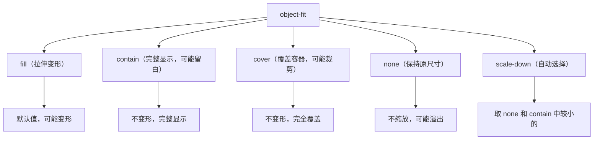

+++
title = "第17章 图片与替换元素属性"
weight = 170
date = "2026-03-27T16:53:00+08:00"
type = "docs"
description = ""
isCJKLanguage = true
draft = false
+++

# 第十七章：图片与替换元素属性

> 图片是网页中最常见的媒体类型之一。但你有没有遇到过这种情况：图片太大变形了、图片太小显得模糊、或者图片比例不对导致布局混乱？这一章，我们将学习如何用 CSS 来优雅地处理这些问题，让图片展示变得得心应手。

## 17.1 object-fit 替换元素适配

### 17.1.1 fill——内容拉伸填满容器（默认），可能变形

`object-fit` 是 CSS3 引入的属性，用来控制替换元素（如 ``、`<video>`）如何适应容器的尺寸。它类似于 `background-size`，但专门用于替换元素。

**什么是"替换元素"？**

替换元素（Replaced Element）是指元素的外部内容会替换元素本身内容的元素。常见的替换元素包括：``、`<video>`、`<iframe>`、`<canvas>`、`<svg>`、`<input type="image">` 等。这些元素的"外观"是由外部资源决定的，而不是由 CSS 内容属性决定的。

**`fill` 是 object-fit 的默认值——也是最"暴力"的一个：**

```css
/* fill —— 默认值，内容拉伸填满容器 */

/* ⚠️ 默认行为：图片会被强制变形！ */
/* 你的圆脸 → 变成椭圆脸，浏览器表示：我不关心比例 */
.fill-container {
  width: 300px;
  height: 200px;
}

.fill-container img {
  width: 100%;
  height: 100%;
  object-fit: fill;  /* 默认值 */
  /* 图片会被强制拉伸/压缩以填满整个容器 */
  /* 可能导致图片变形 */
}
```

```html
<div class="fill-container">
  
  <!-- 如果原图是竖屏（600x900），现在被强制压扁成 300x200 -->
  <!-- 人脸会变胖，比例完全失真 -->
</div>
```

**`fill` 的效果示意：**

```
原图（600x900，竖屏）：        容器（300x200）：
┌─────┐                        ┌─────────┐
│     │                        │         │
│     │                        │         │
│     │  → object-fit:fill →  │         │
│     │                        │         │
│     │                        │         │
└─────┘                        └─────────┘
        人脸变胖，比例失真
```

> 💡 **小技巧**：`object-fit: fill` 是默认值，但在大多数情况下你可能不需要这个行为。如果你不想图片变形，使用其他 `object-fit` 值。

### 17.1.2 contain——完整装入容器，不裁剪，可能有空白，不变形

`contain` 会让内容完整地显示在容器内，同时保持原始比例。如果容器的比例和内容的比例不匹配，容器会留出空白。

```css
/* contain —— 完整显示，不裁剪，可能有空白 */

/* 特点： */
/* 1. 保持原始比例（不变形）*/
/* 2. 完整显示内容（不裁剪）*/
/* 3. 可能产生空白（如果比例不匹配）*/

.contain-container {
  width: 300px;
  height: 200px;
  background-color: #f0f0f0;  /* 空白区域显示背景色 */
}

.contain-container img {
  width: 100%;
  height: 100%;
  object-fit: contain;  /* 完整显示，保持比例 */
}
```

```html
<div class="contain-container">
  
  <!-- 图片完整显示在 300x200 的容器内 -->
  <!-- 保持竖屏比例，容器左右可能有空白 -->
</div>
```

**`contain` 的效果示意：**

```
容器（300x200，横宽比）：        contain 效果：
┌─────────┐                        ┌─────────┐
│         │                        │ ┌─────┐ │
│         │                        │ │     │ │
│         │  → object-fit:contain→ │ │     │ │
│         │                        │ │     │ │
│         │                        │ └─────┘ │
└─────────┘                        └─────────┘
        空白        图片完整显示，左右留白
```

**`contain` 的实际应用场景：**

```css
/* 1. 产品图片展示（不裁剪）*/
.product-gallery {
  width: 300px;
  height: 300px;
  background-color: #f8f9fa;
  border: 1px solid #eee;
  border-radius: 8px;
  display: flex;
  align-items: center;
  justify-content: center;
}

.product-gallery img {
  max-width: 100%;
  max-height: 100%;
  object-fit: contain;  /* 保证产品完整显示 */
}

/* 2. 头像展示（需要是完整的）*/
.avatar-contain {
  width: 100px;
  height: 100px;
  border-radius: 8px;
  overflow: hidden;
  background-color: #eee;
}

.avatar-contain img {
  width: 100%;
  height: 100%;
  object-fit: contain;  /* 完整显示，但可能有空白 */
}

/* 3. Logo 展示（保持比例）*/
.logo-container {
  width: 200px;
  height: 80px;
  background-color: white;
  border: 1px solid #ddd;
  display: flex;
  align-items: center;
  justify-content: center;
}

.logo-container img {
  max-width: 90%;
  max-height: 90%;
  object-fit: contain;
}
```

### 17.1.3 cover——完全覆盖容器，会裁剪，不变形

`cover` 会让内容完全覆盖容器，同时保持原始比例。如果内容的比例和容器的比例不匹配，内容会被裁剪——这是它和 `contain` 最本质的区别。

```css
/* cover —— 覆盖容器，会裁剪，不变形 */

/* 特点： */
/* 1. 保持原始比例（不变形）*/
/* 2. 完全覆盖容器（内容必须撑满整个容器）*/
/* 3. 可能裁剪内容（如果比例不匹配，边缘bye-bye）*/

.cover-container {
  width: 300px;
  height: 200px;
  overflow: hidden;  /* 超出部分隐藏 */
}

.cover-container img {
  width: 100%;
  height: 100%;
  object-fit: cover;  /* 完全覆盖，可能裁剪 */
}
```

```html
<div class="cover-container">
  
  <!-- 图片完全覆盖 300x200 的容器 -->
  <!-- 如果原图比例不同，可能裁剪掉边缘部分 -->
</div>
```

**`cover` 的效果示意：**

```
原图（800x600，横屏）：          容器（300x200，竖宽比）：
┌────────────────────┐            ┌─────────┐
│                    │            │         │
│                    │            │         │
│                    │ → cover → │         │
│                    │            │         │
│                    │            │         │
└────────────────────┘            └─────────┘
                         中间部分填充，上下可能被裁剪

原图（600x900，竖屏）：          容器（300x200，横宽比）：
     ┌─────┐                      ┌─────────┐
     │     │                      │         │
     │     │                      │         │
     │     │ → cover →           │         │
     │     │                      │         │
     │     │                      │         │
     └─────┘                      └─────────┘
              中间部分填充，左右可能被裁剪
```

**`cover` 的实际应用场景：**

```css
/* 1. Hero 背景图 */
.hero-section {
  width: 100%;
  height: 500px;
  overflow: hidden;
}

.hero-section img {
  width: 100%;
  height: 100%;
  object-fit: cover;  /* 背景图完全覆盖 */
  object-position: center center;  /* 图片居中 */
}

/* 2. 卡片封面图 */
.card-cover {
  width: 100%;
  height: 180px;
  overflow: hidden;
  border-radius: 8px 8px 0 0;
}

.card-cover img {
  width: 100%;
  height: 100%;
  object-fit: cover;
  transition: transform 0.3s ease;  /* hover 时放大效果 */
}

.card-cover:hover img {
  transform: scale(1.05);  /* 鼠标悬停时图片放大 */
}

/* 3. 头像（圆形裁剪）*/
.avatar-cover {
  width: 100px;
  height: 100px;
  border-radius: 50%;  /* 圆形容器 */
  overflow: hidden;
  border: 3px solid white;
  box-shadow: 0 2px 8px rgba(0, 0, 0, 0.15);
}

.avatar-cover img {
  width: 100%;
  height: 100%;
  object-fit: cover;  /* 填充并裁剪成正圆 */
  /* 人的脸部会在中间位置 */
}
```

### 17.1.4 none——保持原尺寸，不缩放

`none` 让内容保持原始尺寸，不会被缩放。如果内容比容器大，会溢出；如果比容器小，保持原样。

```css
/* none —— 保持原尺寸，不缩放 */

/* 特点： */
/* 1. 不改变内容尺寸*/
/* 2. 不保持比例*/
/* 3. 可能溢出或留白 */

.none-container {
  width: 300px;
  height: 200px;
  overflow: auto;  /* 超出可以滚动查看 */
  border: 1px solid #ddd;
}

.none-container img {
  object-fit: none;  /* 保持原始尺寸 */
  /* 不缩放，可能溢出容器 */
}
```

```html
<div class="none-container">
  
  <!-- 小图标保持原始尺寸（可能只有 24x24） -->
  <!-- 放在 300x200 的容器里，大部分是空白 -->
</div>
```

**`none` 的实际应用场景：**

```css
/* 1. 展示原始图片尺寸 */
.original-size-demo {
  width: 600px;
  height: 400px;
  overflow: auto;
  border: 1px solid #ddd;
  padding: 10px;
}

.original-size-demo img {
  object-fit: none;  /* 保持原始尺寸 */
}

/* 2. SVG 图标（通常不需要缩放）*/
.icon-container {
  width: 24px;
  height: 24px;
  overflow: visible;  /* 图标可以超出容器 */
}

.icon-container svg {
  width: 100%;
  height: 100%;
  object-fit: none;
}
```

### 17.1.5 scale-down——内容尺寸受限，自动选择不会超出原尺寸的方案

`scale-down` 的逻辑有点"智能纠结"：它会比较 `none` 和 `contain` 两种方式下内容实际显示的尺寸，然后选**较小的那个**。也就是说：如果内容比容器小，它就保持原样（`none` 的效果）；如果内容比容器大，它就缩放到容器内（`contain` 的效果）。总之——图片永远不会被放大。翻译成人话就是："多大的萝卜就装多大的坑，别硬塞。"

```css
/* scale-down —— 取 none 和 contain 中较小的 */

/* 特点： */
/* 1. 当内容很小时 → 使用 none（保持原样，不放大）*/
/* 2. 当内容很大时 → 使用 contain（缩小到容器内）*/
/* 3. 内容适中时 → 可能需要缩小到 fit */

.scale-down-container {
  width: 300px;
  height: 200px;
  background-color: #f0f0f0;
  display: flex;
  align-items: center;
  justify-content: center;
}

.scale-down-container img {
  max-width: 100%;
  max-height: 100%;
  object-fit: scale-down;  /* 自动选择合适的尺寸 */
  /* 小图不会放大，大图会缩小 */
}
```

```html
<div class="scale-down-container">
  
  <!-- 小图标保持 24x24，不被放大 -->
</div>

<div class="scale-down-container">
  
  <!-- 大图会缩小到 fit 容器，可能有空白 -->
</div>
```

**`object-fit` 完整对比：**

```css
/* object-fit 五种值的完整对比 */

.fit-demo {
  width: 250px;
  height: 180px;
  background-color: #f0f0f0;
  border: 2px solid #3498db;
  margin-bottom: 20px;
}

.fit-demo img {
  width: 100%;
  height: 100%;
}

/* fill（默认）—— 拉伸填满，可能变形 */
.demo-fill img { object-fit: fill; }

/* contain —— 完整显示，可能留白，不变形 */
.demo-contain img { object-fit: contain; }

/* cover —— 覆盖容器，可能裁剪，不变形 */
.demo-cover img { object-fit: cover; }

/* none —— 保持原尺寸，不缩放 */
.demo-none img { object-fit: none; }

/* scale-down —— 取 none 或 contain 中较小的 */
.demo-scale-down img { object-fit: scale-down; }
```

> 💡 **小技巧**：`object-fit: cover` 是现代网页设计中最常用的图片适配方式，特别适合需要固定比例的卡片、头像等场景。如果需要显示完整图片不受裁剪，使用 `object-fit: contain`。

## 17.2 object-position 位置

### 17.2.1 控制替换元素在容器内的位置，默认 50% 50%（居中）

`object-position` 用来控制替换元素（如图片）在容器内的位置。类似于 `background-position`，但专门用于 `object-fit` 场景。

**什么是 `object-position`？**

想象一下你用 cover 模式裁剪一张照片。默认情况下，裁剪的是图片的中间部分。但如果图片的主体在边缘（比如一个人站在照片的左边），你可能想让裁剪保留左边的人物，而不是中间的蓝天白云。`object-position` 就是控制"保留哪一部分"的属性。

```css
/* object-position 的基本用法 */

/* 默认居中 */
.position-default {
  object-position: 50% 50%;  /* 默认值，居中 */
}

/* 关键字定位 */
.position-top {
  object-position: top;        /* 顶部 */
  /* 等于 50% 0% */
}

.position-bottom {
  object-position: bottom;    /* 底部 */
  /* 等于 50% 100% */
}

.position-left {
  object-position: left;       /* 左边 */
  /* 等于 0% 50% */
}

.position-right {
  object-position: right;     /* 右边 */
  /* 等于 100% 50% */
}

.position-center {
  object-position: center;    /* 正中间 */
  /* 等于 50% 50% */
}

/* 组合定位 */
.position-top-left {
  object-position: top left;  /* 左上角 */
}

.position-bottom-right {
  object-position: bottom right;  /* 右下角 */
}
```

```html
<!-- 默认居中：显示图片中间部分 -->
<div class="cover-container">
  
</div>

<!-- 顶部：显示图片顶部内容 -->
<div class="cover-container">
  
</div>
```

**`object-position` 的数值写法：**

```css
/* 数值和百分比定位 */

.position-numeric {
  object-position: 0 0;      /* 左上角 */
}

.position-numeric-2 {
  object-position: 100% 100%;  /* 右下角 */
}

.position-numeric-3 {
  object-position: 20px 30px;  /* 水平偏移20px，垂直偏移30px */
}

.position-numeric-4 {
  object-position: -20px -30px;  /* 负值允许元素部分在容器外 */
}
```

```html
<div class="cover-container">
  
  <!-- 图片左上角对齐容器左上角 -->
</div>

<div class="cover-container">
  
  <!-- 图片向左向上各偏移20px/30px，可能部分在容器外 -->
</div>
```

### 17.2.2 用法——object-position: top center; 或 object-position: 20px 30px;

`object-position` 最常见的用途是配合 `object-fit: cover` 使用，让图片在裁剪时保留最重要的内容。

```css
/* object-position 的实际应用 */

/* 1. 人物照片：保留人物而不是背景 */
.person-card {
  width: 100%;
  height: 200px;
  overflow: hidden;
  border-radius: 8px;
}

.person-card img {
  width: 100%;
  height: 100%;
  object-fit: cover;
  /* 人通常在图片中下方，所以用 bottom center 保留人脸 */
  object-position: center bottom;
}

/* 2. 风景照片：保留天空还是地面？ */
.landscape-card {
  width: 100%;
  height: 180px;
  overflow: hidden;
}

.landscape-card img {
  width: 100%;
  height: 100%;
  object-fit: cover;
  /* 如果天空更漂亮，用 top center 保留天空 */
  object-position: top center;
}

/* 3. Logo：通常需要居中显示 */
.logo-display {
  width: 200px;
  height: 100px;
  background-color: #f5f5f5;
  border-radius: 8px;
}

.logo-display img {
  width: 100%;
  height: 100%;
  object-fit: contain;  /* 完整显示 logo */
  object-position: center center;  /* logo 居中 */
}

/* 4. 产品图：让产品居中显示 */
.product-card {
  width: 100%;
  height: 250px;
  overflow: hidden;
  background-color: #fff;
}

.product-card img {
  width: 100%;
  height: 100%;
  object-fit: cover;
  /* 产品通常在图片中心偏上 */
  object-position: center top;
}
```

**`object-position` 与 `object-fit` 的配合：**

```css
/* object-fit 和 object-position 配合使用 */

/* 场景：一张人物照片，主体在左下角 */
.portrait-container {
  width: 300px;
  height: 300px;
  border-radius: 50%;
  overflow: hidden;
  border: 4px solid #3498db;
}

.portrait-container img {
  width: 100%;
  height: 100%;
  object-fit: cover;                    /* 覆盖容器，保持比例 */
  object-position: center bottom;       /* 显示人物脸部 */
  /* 人物在图片下方，cover 会裁剪上方，保留脸部 */
}

/* 场景：一张产品照，需要保留产品而不是背景 */
.product-container {
  width: 100%;
  height: 200px;
  overflow: hidden;
}

.product-container img {
  width: 100%;
  height: 100%;
  object-fit: cover;         /* 覆盖容器 */
  object-position: center;    /* 产品在中心 */
}
```

**`object-position` 的实用技巧：**

```css
/* 1. 响应式图片位置切换 */
.responsive-image {
  width: 100%;
  height: 300px;
}

.responsive-image img {
  width: 100%;
  height: 100%;
  object-fit: cover;
  /* PC端显示顶部内容 */
  object-position: top;
}

/* 在窄屏幕上显示中间内容 */
@media (max-width: 768px) {
  .responsive-image img {
    object-position: center;
  }
}

/* 2. Hover 时改变焦点 */
.focus-image img {
  width: 100%;
  height: 100%;
  object-fit: cover;
  object-position: center center;
  transition: object-position 0.3s ease;
}

.focus-image:hover img {
  object-position: top center;  /* hover 时焦点上移 */
}

/* 3. 创建视差效果 */
.parallax-container {
  width: 100%;
  height: 500px;
  overflow: hidden;
}

.parallax-container img {
  width: 100%;
  height: 120%;  /* 比容器高 */
  object-fit: cover;
  /* 初始位置 */
}

.parallax-container:hover img {
  /* 鼠标悬停时轻微移动图片 */
  transform: scale(1.1);
}
```

> 💡 **小技巧**：`object-position` 是一个经常被忽略的属性，但它对于创建高质量的图片展示非常重要。当你使用 `object-fit: cover` 时，记得根据图片内容调整 `object-position`，确保最重要的内容不会被意外裁剪掉。

## 17.3 image-rendering 图像渲染

### 17.3.1 auto（默认，由浏览器决定）、pixelated（像素风格放大，用于像素艺术）、crisp-edges（边缘锐化，用于图标）

`image-rendering` 属性告诉浏览器在缩放图片时应该使用什么样的渲染算法。这个属性在处理像素艺术或需要保持锐利边缘的图片时特别有用。

**什么是图像渲染？**

想象一下你把一张马赛克图片放大。浏览器需要决定：是把每个像素"糊成一团"变模糊，还是保持每个像素的"棱角分明"？这就是"图像渲染"要解决的问题。

```css
/* image-rendering 的各种值 */

/* auto —— 浏览器自动决定（默认）*/
.render-auto {
  image-rendering: auto;
  /* 浏览器会权衡速度和显示质量 */
}

/* pixelated —— 像素风格放大，用于像素艺术 */
.render-pixelated {
  image-rendering: pixelated;
  /* 放大时保持像素感，不模糊 */
  /* Chrome: pixelated, Firefox: crisp-edges */
}

/* crisp-edges —— 边缘锐化，用于图标 */
.render-crisp {
  image-rendering: crisp-edges;
  /* 尽量保持边缘锐利 */
  /* 可能会降低平滑度 */
}
```

```html
<!-- 原图：8x8 像素艺术 -->


<!-- auto：图片会被平滑模糊 -->
<!-- pixelated：图片保持像素风格，放大后仍能看到明显的像素点 -->
```

**`image-rendering` 的实际应用场景：**

```css
/* 1. 像素游戏风格网站 */
.pixel-game-site {
  background-color: #1a1a2e;
}

.pixel-art {
  image-rendering: pixelated;  /* 像素艺术 */
  width: 64px;
  height: 64px;
}

/* 2. 图标放大显示 */
.icon-enlarged {
  image-rendering: -webkit-optimize-contrast;  /* Safari/Chrome 优化 */
  image-rendering: crisp-edges;              /* 边缘锐化 */
  width: 128px;
  height: 128px;
}

/* 3. emoji 表情显示 */
.emoji-display {
  image-rendering: auto;  /* emoji 通常需要平滑渲染 */
  width: 48px;
  height: 48px;
}

/* 4. 照片展示 */
.photo-display {
  image-rendering: auto;  /* 照片默认 auto 就好 */
  width: 100%;
  max-width: 1200px;
}

/* 5. 解决 PNG 透明边缘模糊问题 */
.png-with-transparency {
  image-rendering: -webkit-optimize-contrast;
  /* 保持 PNG 透明边缘的锐利度 */
}
```

**`image-rendering` 兼容性写法：**

```css
/* 兼容不同浏览器的写法 */

.cross-browser-render {
  /* 标准属性 */
  image-rendering: pixelated;
  /* Safari */
  -webkit-image-rendering: pixelated;
  /* Firefox 旧版本 */
  image-rendering: crisp-edges;
}

/* 另一个兼容方案 */
.optimized-image {
  image-rendering: -webkit-optimize-contrast;  /* Safari/Chrome */
  image-rendering: crisp-edges;                /* Firefox */
  image-rendering: pixelated;                   /* 新版 Firefox */
}
```

> 💡 **小技巧**：现代浏览器对 `image-rendering` 的支持已经比较完善。但如果你需要支持非常老的浏览器，可能需要使用 `-webkit-` 前缀。对于普通的照片展示，使用默认的 `auto` 即可，不需要特别设置。

## 17.4 field-sizing 表单字段自动尺寸

### 17.4.1 field-sizing: content——表单字段根据内容自动调整尺寸（如 textarea），需浏览器支持

`field-sizing` 是 CSS 的一个新属性，目前只有少数浏览器支持。它允许表单字段（如 `<textarea>`）根据内容自动调整尺寸。

**什么是 `field-sizing`？**

想象一下你用微信发消息，输入框会随着你输入的文字自动变高，直到达到某个最大高度。`field-sizing: content` 就是让表单字段拥有这种"自动适应内容"的能力。

```css
/* field-sizing 的值 */

/* content —— 根据内容自动调整尺寸 */
.field-content {
  field-sizing: content;  /* 高度随内容增加 */
  min-height: 44px;        /* 最小高度 */
  max-height: 200px;       /* 最大高度 */
  overflow-y: auto;         /* 超出后滚动 */
}

/* border-box —— 盒模型方式计算（默认）*/
.field-border-box {
  field-sizing: border-box;  /* 默认行为 */
  height: 100px;             /* 固定高度 */
}
```

```html
<!-- field-sizing: content 让 textarea 自动适应内容 -->
<textarea class="field-content" placeholder="输入内容，框会自动变大...">
</textarea>
```

**`field-sizing` 的实际应用场景：**

```css
/* 1. 自动高度的评论框 */
.auto-expand-comment {
  field-sizing: content;
  width: 100%;
  min-height: 44px;     /* 最小高度 */
  max-height: 300px;    /* 最大高度限制 */
  padding: 12px 16px;
  border: 2px solid #ddd;
  border-radius: 8px;
  font-family: inherit;
  font-size: 16px;
  line-height: 1.5;
  resize: none;          /* 不允许手动调整 */
  overflow-y: auto;      /* 超出滚动 */
  transition: border-color 0.2s;
}

.auto-expand-comment:focus {
  border-color: #3498db;
  outline: none;
}

/* 2. 聊天输入框 */
.chat-input {
  field-sizing: content;
  width: 100%;
  min-height: 40px;
  max-height: 120px;
  padding: 10px 16px;
  border: 1px solid #ddd;
  border-radius: 20px;
  font-size: 15px;
  line-height: 1.4;
}

/* 3. 自动展开的搜索框 */
.auto-expand-search {
  field-sizing: content;
  min-width: 200px;
  max-width: 400px;
  padding: 8px 16px;
  border: 1px solid #ddd;
  border-radius: 20px;
  font-size: 14px;
}
```

**`field-sizing` 的浏览器支持：**

```css
/* ⚠️ field-sizing 目前支持有限 */
/* 目前只有 Chrome 123+ 支持 */

/* 使用 @supports 检测 */
@supports (field-sizing: content) {
  .auto-expand {
    field-sizing: content;
    height: auto;
  }
}

/* 回退方案：使用 JS 或不设置 */
.fallback-expand {
  /* 旧浏览器：不设置 field-sizing */
  /* 或者使用 JavaScript 实现类似功能 */
}
```

> 💡 **小技巧**：`field-sizing: content` 是一个非常有用的新属性，但目前浏览器支持有限。在生产环境中使用前，请确认你的目标浏览器是否支持。如果需要兼容旧浏览器，可以考虑使用 JavaScript 来实现类似功能。

---

## 本章小结

恭喜你完成了第十七章的学习！让我们来回顾一下这章的精华：

### 核心知识点

| 属性 | 说明 |
|------|------|
| object-fit | 控制替换元素的适配方式（fill/contain/cover/none/scale-down） |
| object-position | 控制替换元素在容器内的位置 |
| image-rendering | 控制图片缩放时的渲染方式 |
| field-sizing | 表单字段自动尺寸（content） |

### object-fit 五种值对比



### 实战建议

1. **图片卡片**：使用 `object-fit: cover` 配合 `object-position` 保留重点内容
2. **产品图片**：使用 `object-fit: contain` 保证产品完整显示
3. **头像**：使用 `object-fit: cover` 配合 `border-radius: 50%` 裁剪成圆形
4. **像素艺术**：使用 `image-rendering: pixelated` 保持像素风格

### 下章预告

下一章我们将学习多列布局，看看如何用 CSS 实现报纸杂志风格的多列排版！


