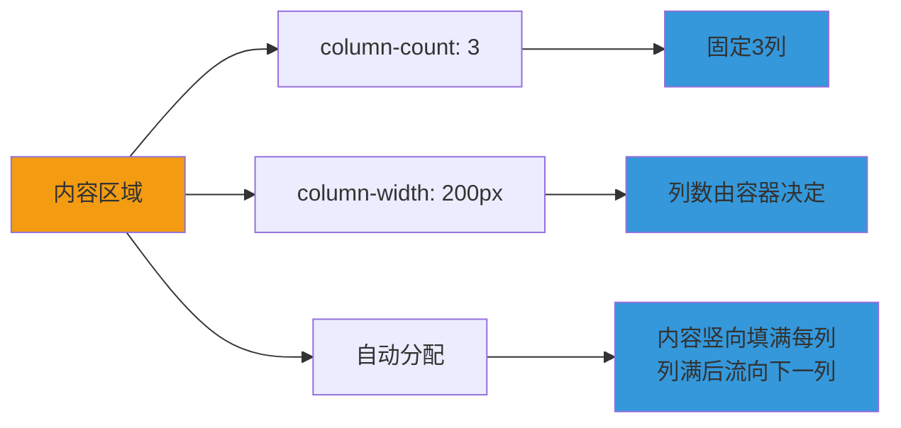

+++
title = "第18章 多列布局"
weight = 180
date = "2026-03-27T16:53:00+08:00"
type = "docs"
description = ""
isCJKLanguage = true
draft = false
+++

# 第十八章：多列布局

> 想象一下报纸的排版——密密麻麻的文字被分成好几列，你只需要从上到下阅读完一列，然后跳到下一列。多列布局（Multi-column Layout）就是 CSS 给你提供的"报纸排版"能力，让长篇内容自动分成多列显示，既美观又实用。

## 18.1 column-count 和 column-width

### 18.1.1 column-count——指定列数，如 column-count: 3;

`column-count` 用来指定内容的列数。如果你想要一个固定的三列布局，直接设置 `column-count: 3` 即可。

**什么是多列布局？**

想象一下你有一篇很长的文章，如果只用一列显示，页面会很长，读者需要滚很久才能看完。但如果分成三列，文章会自动"流淌"到下一列，页面就会短得多。这就是多列布局的魅力。

```css
/* column-count 的基本用法 */

/* 设置为3列 */
.three-columns {
  column-count: 3;
  /* 文章内容会自动分成3列 */
}

/* 设置为2列 */
.two-columns {
  column-count: 2;
}

/* 设置为1列（等于不分割）*/
.one-column {
  column-count: 1;
}

/* 设置为4列 */
.four-columns {
  column-count: 4;
}
```

```html
<article class="three-columns">
  <p>这是第一段文字，会从上到下填满第一列...</p>
  <p>这是第二段文字，继续填充第一列，直到第一列填满...</p>
  <p>这是第三段文字，如果第一列满了，会自动流到第二列...</p>
  <p>这是第四段文字，会在第二列继续填充...</p>
  <p>这是第五段文字，最后会流到第三列。</p>
</article>
```

**`column-count` 的实际应用场景：**

```css
/* 1. 文章正文分栏 */
.article-text {
  column-count: 2;  /* 双栏排版 */
  column-gap: 40px;  /* 列间距40px */
  text-align: justify;  /* 两端对齐 */
  font-size: 16px;
  line-height: 1.8;
}

/* 2. 新闻列表 */
.news-grid {
  column-count: 3;
  column-gap: 20px;
}

.news-item {
  break-inside: avoid;  /* 防止新闻标题被截断 */
  margin-bottom: 20px;
  padding: 16px;
  background-color: white;
  border-radius: 8px;
  box-shadow: 0 2px 8px rgba(0, 0, 0, 0.1);
}

/* 3. 瀑布流卡片布局 */
.masonry-grid {
  column-count: 4;
  column-gap: 16px;
}

.masonry-item {
  break-inside: avoid;
  margin-bottom: 16px;
  border-radius: 8px;
  overflow: hidden;
}

.masonry-item img {
  width: 100%;
  display: block;
}
```

### 18.1.2 column-width——指定列宽，浏览器自动计算列数，如 column-width: 200px;

`column-width` 用来指定每列的"理想宽度"。浏览器会根据容器的宽度和这个值来自动计算应该有多少列。

**什么是 `column-width`？**

想象一下你有一块宽度可变的布料，你告诉裁缝"每列至少要 200px 宽"。裁缝会根据布料的宽度决定能做几列——如果布料是 600px 宽，就做 3 列；如果布料变成 1000px 宽，就做 5 列。

```css
/* column-width 的基本用法 */

/* 每列至少200px宽 */
.auto-columns {
  column-width: 200px;
  /* 浏览器会自动计算列数 */
  /* 容器宽度 / 200px = 列数 */
}

/* 每列至少300px宽 */
.wide-columns {
  column-width: 300px;
}
```

```html
<div class="auto-columns">
  <p>这段文字会自动根据容器宽度分配到多列中。</p>
  <p>容器越宽，列数越多；容器越窄，列数越少。</p>
  <p>这是响应式的多列布局。</p>
</div>
```

**`column-width` vs `column-count` 的区别：**

```css
/* column-count —— 固定列数 */

/* 一定是3列，不管容器有多宽 */
.fixed-columns {
  column-count: 3;
  /* 容器很宽时，每列会非常宽 */
  /* 容器很窄时，每列会非常窄 */
}

/* column-width —— 最小列宽 */

/* 每列至少250px，列数由容器决定 */
.fluid-columns {
  column-width: 250px;
  /* 容器900px → 3列（900/250=3.6，向下取整）*/
  /* 容器1200px → 4列（1200/250=4.8，向下取整）*/
  /* 容器400px → 1列（400/250=1.6，向下取整）*/
}
```

### 18.1.3 两者配合——column-width 设置最小宽度，column-count 设置最大列数

当你同时设置 `column-width` 和 `column-count` 时，它们会互相限制：列宽决定每列的最小宽度，列数决定最大列数。

```css
/* 同时设置 column-width 和 column-count */

/* 每列至少200px，但最多4列 */
.combined-columns {
  column-width: 200px;  /* 每列最小200px */
  column-count: 4;       /* 最多4列 */
  /* 效果：列数在1-4之间，每列至少200px */
}

/* 响应式多列布局的推荐写法 */
.responsive-columns {
  column-width: 250px;   /* 每列最小250px */
  column-count: 3;       /* 但最多3列 */
  column-gap: 30px;      /* 列间距30px */
}

/* 实际效果：*/
/* 容器宽度750px以下 → 1列（太窄了）*/
/* 容器宽度750-1000px → 2列 */
/* 容器宽度1000-1250px → 3列 */
/* 容器宽度1250px以上 → 保持3列（不再增加）*/
```

```html
<div class="responsive-columns">
  <p>这段文字会使用响应式多列布局。</p>
  <p>容器宽时列数多，窄时列数少。</p>
  <p>但列数不会超过3列，宽度不会小于250px。</p>
</div>
```

**多列布局的属性汇总：**

```css
/* 多列布局的完整设置 */

.multi-column-layout {
  /* 列数控制 */
  column-count: 3;       /* 固定列数 */
  column-width: 250px;   /* 最小列宽 */

  /* 列间距 */
  column-gap: 40px;     /* 列与列之间的间距 */

  /* 列边框（分隔线）*/
  column-rule: 1px solid #ddd;  /* 列之间的分隔线 */
  column-rule-width: 1px;
  column-rule-style: solid;
  column-rule-color: #ddd;
}
```

> 💡 **小技巧**：多列布局最适合的场景是"内容驱动的布局"——比如长篇文章、新闻列表、瀑布流卡片等。如果你想创建的是"固定栏数的响应式布局"，Flexbox 或 Grid 可能更合适。

## 18.2 column-gap 和 column-rule

### 18.2.1 column-gap——列与列之间的间距

`column-gap` 用来控制多列布局中列与列之间的间距。

```css
/* column-gap 的基本用法 */

/* 默认间距 */
.normal-gap {
  column-gap: 1em;  /* 默认值，通常是1em */
}

/* 自定义间距 */
.wide-gap {
  column-gap: 40px;  /* 40px 间距 */
}

.narrow-gap {
  column-gap: 10px;  /* 10px 间距 */
}

/* 使用 column-count 和 column-gap */
.gapped-columns {
  column-count: 3;
  column-gap: 30px;  /* 三列之间各30px间距 */
}
```

### 18.2.2 column-rule——列之间的分隔线，语法同 border，如 column-rule: 1px solid #ccc;

`column-rule` 用来在列与列之间绘制分隔线，语法和 `border` 完全一样。

```css
/* column-rule 的基本用法 */

/* 完整写法 */
.rule-columns {
  column-count: 3;
  column-rule: 1px solid #ccc;  /* 分隔线样式 */
  /* 等同于：*/
  column-rule-width: 1px;
  column-rule-style: solid;
  column-rule-color: #ccc;
}

/* 不同风格的列分隔线 */
.dashed-rule {
  column-count: 3;
  column-rule: 2px dashed #3498db;  /* 虚线分隔 */
}

.dotted-rule {
  column-count: 3;
  column-rule: 2px dotted #e74c3c;  /* 点线分隔 */
}

.double-rule {
  column-count: 3;
  column-rule: 3px double #2ecc71;  /* 双线分隔 */
}
```

**`column-gap` 和 `column-rule` 的实际应用：**

```css
/* 1. 报纸风格的栏目 */
.newspaper-columns {
  column-count: 3;
  column-gap: 30px;           /* 列间距30px */
  column-rule: 1px solid #ccc;  /* 列分隔线 */
  text-align: justify;           /* 两端对齐 */
  font-size: 15px;
  line-height: 1.7;
}

.newspaper-columns h2 {
  column-span: all;  /* 标题横跨所有列 */
  text-align: center;
  margin-bottom: 20px;
}

/* 2. 画廊展示 */
.gallery-columns {
  column-count: 4;
  column-gap: 20px;
  column-rule: 1px solid #eee;
}

.gallery-columns figure {
  break-inside: avoid;
  margin-bottom: 15px;
}

.gallery-columns img {
  width: 100%;
  border-radius: 4px;
}

/* 3. 目录导航 */
.toc-columns {
  column-count: 2;
  column-gap: 40px;
  column-rule: 1px dashed #ddd;
}

.toc-columns li {
  margin-bottom: 8px;
}
```

## 18.3 column-span 跨列

### 18.3.1 column-span: all——让元素横跨所有列，如标题跨列

`column-span` 属性允许元素横跨所有列，打破多列布局的限制。

```css
/* column-span 的用法 */

/* 横跨所有列 */
.spanning-header {
  column-span: all;  /* 横跨所有列 */
  text-align: center;
  margin-bottom: 20px;
  padding-bottom: 10px;
  border-bottom: 2px solid #3498db;
}

/* 不横跨（默认）*/
.no-span {
  column-span: none;  /* 默认值 */
}

/* 使用 column-span 的完整示例 */
.magazine-layout {
  column-count: 3;
  column-gap: 30px;
  text-align: justify;
}

.magazine-layout h1 {
  column-span: all;  /* 标题横跨所有列 */
  text-align: center;
  font-size: 2em;
  margin-bottom: 20px;
}

.magazine-layout h2 {
  column-span: all;  /* 小标题也横跨 */
  font-size: 1.5em;
  margin-top: 20px;
  margin-bottom: 10px;
}
```

```html
<article class="magazine-layout">
  <h1>杂志风格标题（横跨所有列）</h1>

  <p>这是第一段正文，会分列显示...</p>
  <p>这是第二段正文...</p>

  <h2>章节标题（也横跨所有列）</h2>

  <p>这是新章节的正文...</p>
</article>
```

**`column-span` 的注意事项：**

```css
/* ⚠️ column-span 的限制 */

/* 1. 只能设置为 all 或 none，不支持部分跨列 */
.limited-span {
  column-span: all;  /* 只能全跨，不支持 column-span: 2 */
}

/* 2. 跨列元素会打断内容的流动 */
.spanning-element {
  column-span: all;  /* 这个元素会断开列的流动 */
}

/* 3. 跨列元素后的内容会重新开始分列 */
.after-span {
  /* 这个内容会在跨列元素下方重新开始分列 */
}
```

## 18.4 break-inside 与分页

### 18.4.1 break-inside: avoid——防止元素被分割到两列

当内容从一个列流动到另一个列时，可能会发生元素被"切断"的情况。`break-inside` 用来防止元素在列之间被分割。

```css
/* break-inside 的用法 */

/* 防止元素被分割 */
.no-break {
  break-inside: avoid;  /* 防止元素被截断到两列 */
  /* 也可以用 page-break-inside: avoid（兼容旧浏览器）*/
}
```

**`break-inside` 的实际应用：**

```css
/* 1. 防止卡片被截断 */
.multi-column-cards {
  column-count: 3;
  column-gap: 20px;
}

.card {
  break-inside: avoid;  /* 防止卡片被截断 */
  margin-bottom: 20px;
  padding: 20px;
  background-color: white;
  border-radius: 8px;
  box-shadow: 0 2px 8px rgba(0, 0, 0, 0.1);
}

.card img {
  width: 100%;
  border-radius: 4px;
  margin-bottom: 12px;
}

.card h3 {
  margin-bottom: 8px;
}

/* 2. 防止段落被截断 */
.article-columns {
  column-count: 2;
  column-gap: 40px;
}

.article-columns p {
  break-inside: avoid;  /* 防止段落被截断 */
  margin-bottom: 1em;
}

/* 3. 防止图片被截断 */
.image-column {
  column-count: 2;
}

.image-column figure {
  break-inside: avoid;
  margin-bottom: 20px;
}

.image-column img {
  width: 100%;
  display: block;
}

.image-column figcaption {
  text-align: center;
  font-size: 14px;
  color: #666;
  margin-top: 8px;
}
```

### 18.4.2 break-inside: avoid-page——防止元素被分割到两页（打印时）

`break-inside: avoid-page` 主要用于打印场景，防止元素被分割到两页。

```css
/* 打印友好的分列布局 */

.print-columns {
  column-count: 2;
  column-gap: 30px;
  column-rule: 1px solid #ccc;
}

.print-columns .figure {
  break-inside: avoid-page;  /* 防止图片被分页 */
  margin-bottom: 20px;
}

.print-columns .quote {
  break-inside: avoid-page;  /* 防止引用被分页 */
  padding: 16px;
  background-color: #f8f9fa;
  border-left: 4px solid #3498db;
}

/* 打印样式 */
@media print {
  .print-columns {
    column-count: 2;
    column-gap: 20mm;
  }
}
```

### 18.4.3 break-before/after: avoid——防止在元素前/后换列或换页

`break-before` 和 `break-after` 用来控制在元素之前或之后是否允许换列/换页。

```css
/* break-before 和 break-after */

/* 在元素前避免换列 */
.no-break-before {
  break-before: avoid;  /* 在此元素前不换列 */
  break-before: avoid-page;  /* 打印时：在元素前不换页 */
}

/* 在元素后避免换列 */
.no-break-after {
  break-after: avoid;  /* 在此元素后不换列 */
  break-after: avoid-page;  /* 打印时：在元素后不换页 */
}

/* 强制在元素前换列 */
.break-before {
  break-before: column;  /* 强制开始新列 */
  break-before: always;  /* 打印时：强制开始新页 */
}

/* 强制在元素后换列 */
.break-after {
  break-after: column;  /* 强制结束当前列 */
  break-after: always;  /* 打印时：强制结束当前页 */
}
```

**实际应用示例：**

```css
/* 完整的多列布局示例 */

.complete-columns {
  column-count: 3;
  column-width: 250px;
  column-gap: 30px;
  column-rule: 1px solid #e0e0e0;
}

/* 标题横跨所有列 */
.complete-columns h1,
.complete-columns h2 {
  column-span: all;
  text-align: center;
  margin-bottom: 20px;
}

/* 章节标题在列之间适当分隔 */
.complete-columns h3 {
  break-after: avoid;  /* 防止章节标题后立即换列 */
  margin-top: 20px;
  padding-bottom: 10px;
  border-bottom: 1px solid #eee;
}

/* 图片和引用不被截断 */
.complete-columns figure,
.complete-columns blockquote {
  break-inside: avoid;
  margin: 16px 0;
}

/* 列表项不被截断 */
.complete-columns li {
  break-inside: avoid;
  margin-bottom: 8px;
}

/* 代码块不被截断 */
.complete-columns pre,
.complete-columns code {
  break-inside: avoid;
}
```

### 18.4.4 page-break-before/after——打印分页，avoid（避免分页）/ always（强制分页）

`page-break-before` 和 `page-break-after` 是用于打印样式的传统属性，虽然已被 `break-before` 和 `break-after` 取代，但在旧浏览器中仍需要使用。

```css
/* 打印分页控制（传统写法）*/

/* 避免在元素前分页 */
.no-page-break-before {
  page-break-before: avoid;  /* 避免在元素前换页 */
}

/* 强制在元素前分页 */
.force-page-break-before {
  page-break-before: always;  /* 强制在元素前开始新页 */
}

/* 避免在元素后分页 */
.no-page-break-after {
  page-break-after: avoid;  /* 避免在元素后换页 */
}

/* 强制在元素后分页 */
.force-page-break-after {
  page-break-after: always;  /* 强制在元素后开始新页 */
}

/* 现代写法（推荐）*/
.modern-break {
  break-before: always;
  break-after: always;
}

/* 兼容性写法 */
.compatible-break {
  page-break-before: always;  /* 旧浏览器 */
  break-before: always;       /* 现代浏览器 */
}
```

**打印友好的多列布局：**

```css
/* 打印样式优化 */

@media print {
  /* 打印时减少列数或使用单列 */
  .article {
    column-count: 1 !important;
  }

  /* 防止标题被分页 */
  h1, h2, h3 {
    page-break-after: avoid;
    break-after: avoid;
  }

  /* 防止图片、表格、引用被分页 */
  img, table, blockquote {
    page-break-inside: avoid;
    break-inside: avoid;
  }

  /* 强制章节标题在新页开始 */
  .chapter-title {
    page-break-before: always;
    break-before: always;
  }
}
```

> 💡 **小技巧**：多列布局的 `break-*` 属性不仅影响屏幕显示，还影响打印效果。在创建需要打印的长文档时，记得同时考虑屏幕样式和打印样式。

---

## 本章小结

恭喜你完成了第十八章的学习！让我们来回顾一下这章的精华：

### 核心知识点

| 属性 | 说明 |
|------|------|
| column-count | 指定列数（固定值） |
| column-width | 指定列宽（浏览器自动计算列数） |
| column-gap | 列与列之间的间距 |
| column-rule | 列之间的分隔线 |
| column-span | 元素横跨所有列（all/none） |
| break-inside | 防止元素被分割到两列 |
| break-before/after | 控制元素前后的分列/分页 |

### 多列布局工作原理



### 实战建议

1. **长文章排版**：使用 `column-count: 2` 或 `3` 配合 `column-gap`
2. **瀑布流布局**：使用 `column-count` 配合 `break-inside: avoid`
3. **杂志风格**：使用 `column-span: all` 让标题横跨所有列
4. **打印友好**：使用 `break-inside: avoid-page` 防止元素被分页

### 下章预告

下一章我们将开始学习第六部分：布局系统。首先是 display 属性与文档流，理解它们是掌握 CSS 布局的基础！


