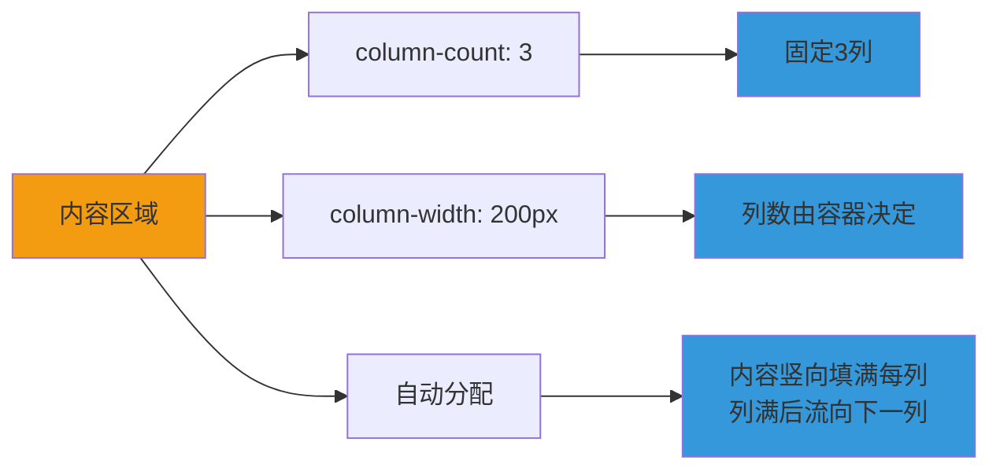

+++
title = "第18章 多列布局"
weight = 180
date = "2026-03-27T16:53:00+08:00"
type = "docs"
description = ""
isCJKLanguage = true
draft = false
+++

# 第十八章：多列布局

> 想象一下报纸的排版——密密麻麻的文字被分成好几列，你只需要从上到下阅读完一列，然后跳到下一列。多列布局（Multi-column Layout）就是 CSS 给你提供的"报纸排版"能力，让长篇内容自动分成多列显示，既美观又实用。

## 18.1 column-count 和 column-width

### 18.1.1 column-count——指定列数，如 column-count: 3;

`column-count` 用来指定内容的列数。如果你想要一个固定的三列布局，直接设置 `column-count: 3` 即可。

**什么是多列布局？**

想象一下你有一篇很长的文章，如果只用一列显示，页面会很长，读者需要滚很久才能看完。但如果分成三列，文章会自动"流淌"到下一列，页面就会短得多。这就是多列布局的魅力。

```css
/* column-count 的基本用法 */

/* 设置为3列 */
.three-columns {
  column-count: 3;
  /* 文章内容会自动分成3列 */
}

/* 设置为2列 */
.two-columns {
  column-count: 2;
}

/* 设置为1列（等于不分割）*/
.one-column {
  column-count: 1;
}

/* 设置为4列 */
.four-columns {
  column-count: 4;
}
```

```html
<article class="three-columns">
  <p>这是第一段文字，会从上到下填满第一列...</p>
  <p>这是第二段文字，继续填充第一列，直到第一列填满...</p>
  <p>这是第三段文字，如果第一列满了，会自动流到第二列...</p>
  <p>这是第四段文字，会在第二列继续填充...</p>
  <p>这是第五段文字，最后会流到第三列。</p>
</article>
```

**`column-count` 的实际应用场景：**

```css
/* 1. 文章正文分栏 */
.article-text {
  column-count: 2;  /* 双栏排版 */
  column-gap: 40px;  /* 列间距40px */
  text-align: justify;  /* 两端对齐 */
  font-size: 16px;
  line-height: 1.8;
}

/* 2. 新闻列表 */
.news-grid {
  column-count: 3;
  column-gap: 20px;
}

.news-item {
  break-inside: avoid;  /* 防止新闻标题被截断 */
  margin-bottom: 20px;
  padding: 16px;
  background-color: white;
  border-radius: 8px;
  box-shadow: 0 2px 8px rgba(0, 0, 0, 0.1);
}

/* 3. 瀑布流卡片布局 */
.masonry-grid {
  column-count: 4;
  column-gap: 16px;
}

.masonry-item {
  break-inside: avoid;
  margin-bottom: 16px;
  border-radius: 8px;
  overflow: hidden;
}

.masonry-item img {
  width: 100%;
  display: block;
}
```

### 18.1.2 column-width——指定列宽，浏览器自动计算列数，如 column-width: 200px;

`column-width` 用来指定每列的"理想宽度"。浏览器会根据容器的宽度和这个值来自动计算应该有多少列。

**什么是 `column-width`？**

想象一下你有一块宽度可变的布料，你告诉裁缝"每列至少要 200px 宽"。裁缝会根据布料的宽度决定能做几列——如果布料是 600px 宽，就做 3 列；如果布料变成 1000px 宽，就做 5 列。

```css
/* column-width 的基本用法 */

/* 每列至少200px宽 */
.auto-columns {
  column-width: 200px;
  /* 浏览器会自动计算列数，但公式不是简单的"容器宽度 / 200px" */
}

/* 每列至少300px宽 */
.wide-columns {
  column-width: 300px;
}
```

**列数到底怎么算出来的？**

只看 `column-width` 时，规范给出的公式是（`U` 是容器的可用宽度，`gap` 是 `column-gap`）：

```
列数 N = max(1, floor((U + gap) / (column-width + gap)))
每列实际宽度 W = (U + gap) / N - gap
```

两个容易被忽略的点：

1. **`gap` 要算进公式里。** 每个列宽之间都夹着一个列间距，所以不能直接用 `U / column-width`。
2. **`column-gap` 不写时默认是 `normal`，在多列布局里等于 `1em`**（下面 18.2.1 会再展开）。也就是说即使你只写了一句 `column-width: 250px;`，列与列之间也默认有 1em 的间距。

举例（`column-width: 250px`，默认 `gap = 1em = 16px`）：

| 容器宽度 U | 计算过程 | 列数 N | 每列实际宽度 W |
|------------|----------|--------|----------------|
| 900px | floor((900+16)/266) = floor(3.44) | 3 列 | (916/3) - 16 ≈ 289px |
| 1200px | floor((1200+16)/266) = floor(4.57) | 4 列 | (1216/4) - 16 = 288px |
| 400px | floor((400+16)/266) = floor(1.56) | 1 列 | (416/1) - 16 = 400px（不够分两列，直接单列铺满） |

注意最后一行：**列数最少是 1，不会出现"半列"**。容器太窄时，`column-width` 只是"理想值"，实际列宽会被拉宽到撑满容器。

```html
<div class="auto-columns">
  <p>这段文字会自动根据容器宽度分配到多列中。</p>
  <p>容器越宽，列数越多；容器越窄，列数越少。</p>
  <p>这是响应式的多列布局。</p>
</div>
```

**`column-width` vs `column-count` 的区别：**

```css
/* column-count —— 固定列数 */

/* 一定是3列，不管容器有多宽 */
.fixed-columns {
  column-count: 3;
  /* 容器很宽时，每列会非常宽 */
  /* 容器很窄时，每列会非常窄 */
}

/* column-width —— 最小列宽 */

/* 每列至少250px，列数由容器决定 */
.fluid-columns {
  column-width: 250px;
  /* 假设 column-gap 默认 1em（16px），每列至少 250px：
     容器 900px  → floor((900+16)/266) = 3 列，每列 ≈ 289px
     容器 1200px → floor((1200+16)/266) = 4 列，每列 288px
     容器 400px  → 只能 1 列，宽度被撑满到 400px */
}
```

### 18.1.3 两者配合——column-width 设置最小宽度，column-count 设置最大列数

当你同时设置 `column-width` 和 `column-count` 时，它们会互相限制：列宽决定每列的最小宽度，列数决定最大列数。

```css
/* 同时设置 column-width 和 column-count */

/* 每列至少200px，但最多4列 */
.combined-columns {
  column-width: 200px;  /* 每列最小200px */
  column-count: 4;       /* 最多4列 */
  /* 效果：列数在 1-4 之间，每列至少 200px（实际宽度会被拉开以填满容器）*/
}

/* 响应式多列布局的推荐写法 */
.responsive-columns {
  column-width: 250px;   /* 每列最小250px */
  column-count: 3;       /* 但最多3列 */
  column-gap: 30px;      /* 列间距30px */
}

/* 两个值同时存在时，规范里的公式变成：
     N = min(column-count, max(1, floor((U + gap) / (column-width + gap))))
   代入 column-width: 250px、column-gap: 30px、column-count: 3：
     N = min(3, floor((U + 30) / 280))

   实际效果：
     容器宽度 < 530px       → 1 列（连两列都排不下）
     容器宽度 530px ~ 809px → 2 列
     容器宽度 ≥ 810px       → 3 列（到顶了，再加宽也只是把每列拉宽）
   校验一下临界值：U = 810 时，(810+30)/280 = 3，正好凑够 3 列，
   此时每列宽度 = (810+30)/3 - 30 = 250px，刚好等于 column-width。 */
```

```html
<div class="responsive-columns">
  <p>这段文字会使用响应式多列布局。</p>
  <p>容器宽时列数多，窄时列数少。</p>
  <p>但列数不会超过3列，宽度不会小于250px。</p>
</div>
```

**多列布局的属性汇总：**

```css
/* 多列布局的完整设置 */

.multi-column-layout {
  /* 列数控制 */
  column-count: 3;       /* 固定列数 */
  column-width: 250px;   /* 最小列宽 */

  /* 列间距 */
  column-gap: 40px;     /* 列与列之间的间距 */

  /* 列边框（分隔线）*/
  column-rule: 1px solid #ddd;  /* 列之间的分隔线 */
  column-rule-width: 1px;
  column-rule-style: solid;
  column-rule-color: #ddd;
}
```

> 💡 **小技巧**：多列布局最适合的场景是"内容驱动的布局"——比如长篇文章、新闻列表、瀑布流卡片等。如果你想创建的是"固定栏数的响应式布局"，Flexbox 或 Grid 可能更合适。

### 18.1.4 columns——column-width 和 column-count 的缩写

`columns` 是 `column-width` 和 `column-count` 的缩写属性，两个值顺序随便写——浏览器靠"带不带单位"来区分：带单位的是列宽，纯数字的是列数。

```css
/* columns 缩写 */

/* 等价于 column-count: 3; column-width: 200px; */
.shorthand-1 {
  columns: 3 200px;
}

/* 顺序反过来也一样 */
.shorthand-2 {
  columns: 200px 3;
}

/* 只写列数：等价于 column-count: 3; column-width: auto; */
.count-only {
  columns: 3;
}

/* 只写列宽：等价于 column-width: 200px; column-count: auto; */
.width-only {
  columns: 200px;
}

/* ⚠️ 同样是"2"，带单位含义就完全不同 */
.plain-two {
  columns: 2;    /* 2 列 */
}

.not-columns {
  columns: 2ch;  /* 这不是"2列"，而是 column-width: 2ch */
}
```

**多列布局的属性总表：**

| 属性 | 作用 | 初始值 |
|------|------|--------|
| `column-count` | 列数上限 | `auto` |
| `column-width` | 每列的理想（最小）宽度 | `auto` |
| `columns` | 上面两个的缩写 | 见各自属性 |
| `column-gap` | 列间距 | `normal`（多列里等于 `1em`） |
| `column-rule` | 列分隔线，语法同 `border` | 见各长属性 |
| `column-rule-style` | 分隔线样式 | `none`（不写它就看不到线） |
| `column-span` | 元素是否横跨所有列 | `none` |
| `column-fill` | 列高如何填充/平衡 | `balance` |
| `break-inside` / `break-before` / `break-after` | 控制分列/分页位置 | `auto` |

> ⚠️ **多列属性只对"块级容器"生效。** 规范里写得很清楚：`column-*` 作用于 block containers（表格包装盒除外）。所以下面这些写法是**没有效果的**：
>
> ```css
> /* ❌ 行内元素：要先把 display 改成 block / inline-block 才有列 */
> .inline-thing { display: inline; column-count: 3; }
>
> /* ❌ flex / grid 容器本身就是另一种布局模式，不会再去做多列 */
> .flex-thing { display: flex; column-count: 3; }
> .grid-thing { display: grid; column-count: 3; }
>
> /* ✅ 正确姿势：多列用在自己的块级容器上 */
> .article-body { display: block; column-count: 3; }
> ```

## 18.2 column-gap、column-rule 和 column-fill

### 18.2.1 column-gap——列与列之间的间距

`column-gap` 用来控制多列布局中列与列之间的间距。

```css
/* column-gap 的基本用法 */

/* 默认间距 */
.normal-gap {
  column-gap: normal;  /* 初始值就是 normal，多列布局里 normal 计算成 1em */
}

/* 自定义间距 */
.wide-gap {
  column-gap: 40px;  /* 40px 间距 */
}

.narrow-gap {
  column-gap: 10px;  /* 10px 间距 */
}

/* 使用 column-count 和 column-gap */
.gapped-columns {
  column-count: 3;
  column-gap: 30px;  /* 三列之间各30px间距 */
}
```

> 💡 **`normal` 的坑**：`column-gap` 的初始值是 `normal`，但它的含义**取决于用在哪儿**——
>
> | 使用场景 | `column-gap: normal` 计算成 |
> |----------|------------------------------|
> | 多列布局（multicol） | `1em`（也就是当前 font-size 的 1 倍） |
> | Flexbox | `0` |
> | Grid | `0` |
>
> 规范原文是"`normal` 在多列容器上取 `1em`，其它所有场景取 `0px`"。所以"多列里默认有间距、Flex 里默认没间距"并不是浏览器的脾气，而是规范规定。另外 `column-gap` 是**多列、Flexbox、Grid 三处共用**的属性名，它和 `gap` 缩写是同一套东西。

### 18.2.2 column-rule——列之间的分隔线，语法同 border，如 column-rule: 1px solid #ccc;

`column-rule` 用来在列与列之间绘制分隔线，语法和 `border` 完全一样。

```css
/* column-rule 的基本用法 */

/* 完整写法 */
.rule-columns {
  column-count: 3;
  column-rule: 1px solid #ccc;  /* 分隔线样式 */
  /* 等同于：*/
  column-rule-width: 1px;
  column-rule-style: solid;
  column-rule-color: #ccc;
}

/* 不同风格的列分隔线 */
.dashed-rule {
  column-count: 3;
  column-rule: 2px dashed #3498db;  /* 虚线分隔 */
}

.dotted-rule {
  column-count: 3;
  column-rule: 2px dotted #e74c3c;  /* 点线分隔 */
}

.double-rule {
  column-count: 3;
  column-rule: 3px double #2ecc71;  /* 双线分隔 */
}
```

> ⚠️ **关于 `column-rule` 的三条硬规则**（很多教程都会漏掉）：
>
> 1. **分隔线不占空间。** 它画在列间距的正中间，画多粗都不会把列挤窄、也不会改变任何元素的位置。如果线比间距还粗，线会直接压在相邻列的文字上（甚至溢出容器）。
> 2. **`column-rule-style` 初始值是 `none`。** 所以只写 `column-rule-width` 或 `column-rule-color` 是**看不到线**的——和 `border` 一模一样的坑，必须有 `style`。
> 3. **只在"两边都有内容的相邻两列之间"才画线。** 只有一列时不画；某列是空的时候，它与相邻列之间也不会出现分隔线。这也是为什么最后一列右边不会多出一条线。
>
> ```css
> /* ❌ 看不到任何线：缺 style */
> .no-rule {
>   column-count: 3;
>   column-rule-width: 2px;
>   column-rule-color: red;
> }
>
> /* ✅ 正确：给全三件套（或直接用 column-rule 缩写） */
> .has-rule {
>   column-count: 3;
>   column-rule: 2px solid red;
> }
> ```

**`column-gap` 和 `column-rule` 的实际应用：**

```css
/* 1. 报纸风格的栏目 */
.newspaper-columns {
  column-count: 3;
  column-gap: 30px;           /* 列间距30px */
  column-rule: 1px solid #ccc;  /* 列分隔线 */
  text-align: justify;           /* 两端对齐 */
  font-size: 15px;
  line-height: 1.7;
}

.newspaper-columns h2 {
  column-span: all;  /* 标题横跨所有列 */
  text-align: center;
  margin-bottom: 20px;
}

/* 2. 画廊展示 */
.gallery-columns {
  column-count: 4;
  column-gap: 20px;
  column-rule: 1px solid #eee;
}

.gallery-columns figure {
  break-inside: avoid;
  margin-bottom: 15px;
}

.gallery-columns img {
  width: 100%;
  border-radius: 4px;
}

/* 3. 目录导航 */
.toc-columns {
  column-count: 2;
  column-gap: 40px;
  column-rule: 1px dashed #ddd;
}

.toc-columns li {
  margin-bottom: 8px;
}
```

### 18.2.3 column-fill——列高怎么"填"

多列布局默认会**平衡各列高度**：所有内容平均分配，让每列长度尽量接近（所以最后看到的是"齐头齐尾"的等高列）。这个行为由 `column-fill` 控制。

```css
/* column-fill 的三个值 */

/* balance：内容在所有列之间平均分配（初始值）*/
.balanced {
  column-count: 3;
  column-fill: balance;
  /* 效果：三列高度基本一致，最后一列不会特别空 */
}

/* auto：按顺序把前面几列填满，填满一列再填下一列
   —— 只有在容器高度被固定（或处于分页环境）时才看得到差别 */
.sequential {
  column-count: 3;
  height: 300px;      /* 必须给出确定高度，否则内容会把容器撑高，各列又变成"等高" */
  column-fill: auto;
  /* 效果：第一列填满 300px，才轮到第二列 */
}

/* balance-all：分页环境里连"最后一段碎片"也要平衡（用得很少）*/
.page-balanced {
  column-fill: balance-all;
}
```

| 取值 | 行为 | 什么时候用 |
|------|------|------------|
| `balance` | 所有列平均分配内容，列高一致（默认） | 网页上的文章分栏，最常用 |
| `auto` | 依次填满每一列，后面的列可能空着 | 固定高度的栏目、做成"多列连续滚动"的效果 |
| `balance-all` | 每个分页片段内部也做平衡 | 打印排版等分页场景 |

> 💡 **为什么我写了 `column-fill: auto` 却没效果？** 因为它通常只在**容器有确定高度**（`height` 或 `max-height`）或**处于分页环境（打印）**时才体现出来。网页上容器高度一般是 `auto`，内容会直接把容器撑高，几列自然就一样高了。

> ⚠️ **多列的"瀑布流"其实是伪瀑布流。** 用 `column-count` 做卡片墙虽然简单，但排列顺序是**竖向**的：内容先填满第一列，再填第二列。也就是说第 2 张卡片可能落在第 1 列最下方，视觉顺序和 HTML 顺序不一致（对键盘 Tab 顺序、屏幕阅读器也会造成困惑）。想要"按行铺排的等高网格"可以用 Grid；而高度不一的真正瀑布流，目前主要是 JavaScript 计算位置（或等 CSS masonry 规范落地）。

## 18.3 column-span 跨列

### 18.3.1 column-span: all——让元素横跨所有列，如标题跨列

`column-span` 属性允许元素横跨所有列，打破多列布局的限制。

```css
/* column-span 的用法 */

/* 横跨所有列 */
.spanning-header {
  column-span: all;  /* 横跨所有列 */
  text-align: center;
  margin-bottom: 20px;
  padding-bottom: 10px;
  border-bottom: 2px solid #3498db;
}

/* 不横跨（默认）*/
.no-span {
  column-span: none;  /* 默认值 */
}

/* 使用 column-span 的完整示例 */
.magazine-layout {
  column-count: 3;
  column-gap: 30px;
  text-align: justify;
}

.magazine-layout h1 {
  column-span: all;  /* 标题横跨所有列 */
  text-align: center;
  font-size: 2em;
  margin-bottom: 20px;
}

.magazine-layout h2 {
  column-span: all;  /* 小标题也横跨 */
  font-size: 1.5em;
  margin-top: 20px;
  margin-bottom: 10px;
}
```

```html
<article class="magazine-layout">
  <h1>杂志风格标题（横跨所有列）</h1>

  <p>这是第一段正文，会分列显示...</p>
  <p>这是第二段正文...</p>

  <h2>章节标题（也横跨所有列）</h2>

  <p>这是新章节的正文...</p>
</article>
```

**`column-span` 的注意事项：**

```css
/* ⚠️ column-span 的限制 */

/* 1. 只能设置为 all 或 none，不支持部分跨列 */
.limited-span {
  column-span: all;  /* 只能全跨，不支持 column-span: 2 */
}

/* 2. 跨列元素会打断内容的流动，把多列"切成上下两段" */
.spanning-element {
  column-span: all;
  /* 它会把多列分成两个"列组"：
     上面那部分内容先在列里排完（且会自动平衡高度），
     跨列元素自己横跨整个容器宽度，
     跨列元素下面的内容再从第一列开始重新分列。 */
}

/* 3. 跨列元素后的内容会重新开始分列 */
.after-span {
  /* 这个内容会在跨列元素下方"从第一列重新开始" */
}
```

| 取值 | 含义 |
|------|------|
| `none` | 默认值。元素正常待在某一列里，不跨列 |
| `all` | 元素横跨所有列，成为一个"跨列块"（spanner） |

> 💡 **实用组合：** 想让标题跨列、但正文仍旧自动分栏，就把 `column-span: all` 写在 `h1` / `h2` 上（如上面的 `.magazine-layout`）。浏览器支持情况：Chrome 6+、Firefox 71+、Safari 5.1+（老版本 Safari 需要 `-webkit-column-span`），现在可以放心使用。

## 18.4 break-inside 与分页

### 18.4.1 break-inside: avoid——防止元素被分割到两列

当内容从一个列流动到另一个列时，可能会发生元素被"切断"的情况。`break-inside` 用来防止元素在列之间被分割。

```css
/* break-inside 的用法 */

/* 防止元素被分割 */
.no-break {
  break-inside: avoid;  /* 防止元素被截断到两列 */
  /* 也可以用 page-break-inside: avoid（兼容旧浏览器）*/
}
```

`break-inside` 的完整取值：

| 取值 | 含义 |
|------|------|
| `auto` | 默认值，允许在元素内部断开 |
| `avoid` | 尽量不要在元素内部断开（分列、分页都尽量避开） |
| `avoid-column` | 只在分列时避免断开（Firefox 92+ 起支持） |
| `avoid-page` | 只在分页时避免断开（打印场景） |
| `avoid-region` | 避免在 CSS Regions 内断开（几乎用不到） |

> ⚠️ **`break-inside: avoid` 不是"保险箱"**：
>
> 1. 如果这个元素**本身就比一列还高**，浏览器只能把它切开——"避免"是尽力而为，不是强制命令；
> 2. 给大量元素都加上 `avoid` 后，浏览器为了不切开它们，可能会在列尾留下较大的空白（因为一整个卡片塞不进剩余空间），反而更难看；
> 3. 老浏览器只认 `page-break-inside`，所以常见写法是两条都写（新浏览器会把老写法当作别名）。

**`break-inside` 的实际应用：**

```css
/* 1. 防止卡片被截断 */
.multi-column-cards {
  column-count: 3;
  column-gap: 20px;
}

.card {
  break-inside: avoid;  /* 防止卡片被截断 */
  margin-bottom: 20px;
  padding: 20px;
  background-color: white;
  border-radius: 8px;
  box-shadow: 0 2px 8px rgba(0, 0, 0, 0.1);
}

.card img {
  width: 100%;
  border-radius: 4px;
  margin-bottom: 12px;
}

.card h3 {
  margin-bottom: 8px;
}

/* 2. 防止段落被截断 */
.article-columns {
  column-count: 2;
  column-gap: 40px;
}

.article-columns p {
  break-inside: avoid;  /* 防止段落被截断 */
  margin-bottom: 1em;
}

/* 3. 防止图片被截断 */
.image-column {
  column-count: 2;
}

.image-column figure {
  break-inside: avoid;
  margin-bottom: 20px;
}

.image-column img {
  width: 100%;
  display: block;
}

.image-column figcaption {
  text-align: center;
  font-size: 14px;
  color: #666;
  margin-top: 8px;
}
```

### 18.4.2 break-inside: avoid-page——防止元素被分割到两页（打印时）

`break-inside: avoid-page` 主要用于打印场景，防止元素被分割到两页。

```css
/* 打印友好的分列布局 */

.print-columns {
  column-count: 2;
  column-gap: 30px;
  column-rule: 1px solid #ccc;
}

.print-columns .figure {
  break-inside: avoid-page;  /* 防止图片被分页 */
  margin-bottom: 20px;
}

.print-columns .quote {
  break-inside: avoid-page;  /* 防止引用被分页 */
  padding: 16px;
  background-color: #f8f9fa;
  border-left: 4px solid #3498db;
}

/* 打印样式 */
@media print {
  .print-columns {
    column-count: 2;
    column-gap: 20mm;
  }
}
```

### 18.4.3 break-before/after: avoid——防止在元素前/后换列或换页

`break-before` 和 `break-after` 用来控制在元素之前或之后是否允许换列/换页。

```css
/* break-before 和 break-after */

/* —— 通用值：不分场景，一律"尽量别在这里断" —— */
.avoid-break-before {
  break-before: avoid;
  /* 在此元素前尽量不换列、也不换页 */
}

/* —— 只在某一种场景下避免断 —— */
.avoid-page-before {
  break-before: avoid-page;    /* 打印时：尽量不在元素前换页 */
}

.avoid-column-before {
  break-before: avoid-column;  /* 排版时：尽量不在元素前换列 */
}

/* —— 强制断开 —— */
.force-column-before {
  break-before: column;        /* 强制从这个元素开始新的一列 */
}

.force-page-before {
  break-before: page;          /* 强制从这个元素开始新的一页（打印） */
}

/* break-after 的取值完全一样，只是控制"元素之后" */
.avoid-break-after {
  break-after: avoid;
}

.force-column-after {
  break-after: column;
}
```

> ⚠️ **两个常见错误：**
>
> 1. **别在同一个规则里连写两次同一个属性。** 像 `break-before: avoid; break-before: avoid-page;` 这种写法，后面的会**直接覆盖**前面的，只剩一个在生效——这不是"两个都生效"，而是"白写一句"。
> 2. **强制换页要用 `page`，不要用 `always`。** `break-before: always` 是从 `page-break-before: always` 平移过来的老写法：**Chrome 和 Safari 并不支持**（Firefox 支持）。规范里 `break-before` 的合法值只有 `auto | avoid | avoid-page | page | left | right | recto | verso | avoid-column | column | avoid-region | region`，想强制换页请写 `break-before: page`。
>
> 另外 `break-*` 的引擎支持也不完全一致（截止撰稿时）：Firefox 尚未支持 `avoid-column` / `column` / `avoid-page` 这几个值，Safari 在多列容器里对 `break-before` / `break-after` 的支持也不完整。涉及分列、分页的关键排版，建议同时在浏览器里实测，并在打印预览里核对。

**实际应用示例：**

```css
/* 完整的多列布局示例 */

.complete-columns {
  column-count: 3;
  column-width: 250px;
  column-gap: 30px;
  column-rule: 1px solid #e0e0e0;
}

/* 标题横跨所有列 */
.complete-columns h1,
.complete-columns h2 {
  column-span: all;
  text-align: center;
  margin-bottom: 20px;
}

/* 章节标题在列之间适当分隔 */
.complete-columns h3 {
  break-after: avoid;  /* 防止章节标题后立即换列 */
  margin-top: 20px;
  padding-bottom: 10px;
  border-bottom: 1px solid #eee;
}

/* 图片和引用不被截断 */
.complete-columns figure,
.complete-columns blockquote {
  break-inside: avoid;
  margin: 16px 0;
}

/* 列表项不被截断 */
.complete-columns li {
  break-inside: avoid;
  margin-bottom: 8px;
}

/* 代码块不被截断 */
.complete-columns pre,
.complete-columns code {
  break-inside: avoid;
}
```

### 18.4.4 page-break-before/after——打印分页，avoid（避免分页）/ always（强制分页）

`page-break-before` / `page-break-after` / `page-break-inside` 是打印分页的"老三代"属性。CSS 碎片化规范把它们定义为 `break-*` 的**遗留缩写（legacy shorthands）**，映射关系是：

| 老写法（`page-break-*`） | 新写法（`break-*`） |
|--------------------------|----------------------|
| `page-break-before: always` | `break-before: page` |
| `page-break-before: auto / left / right / avoid` | 同名值，照搬 |
| `page-break-after: always` | `break-after: page` |
| `page-break-inside: avoid` | `break-inside: avoid` |

也就是说新浏览器会自动把老写法"翻译"成新写法，两者同时写时以后写的为准。实践中：**旧的 `page-break-*` 用来兼容老浏览器，新的 `break-*` 用来支持分列和多列场景**。

```css
/* 打印分页控制（传统写法）*/

/* 避免在元素前分页 */
.no-page-break-before {
  page-break-before: avoid;  /* 避免在元素前换页 */
}

/* 强制在元素前分页 */
.force-page-break-before {
  page-break-before: always;  /* 强制在元素前开始新页 */
}

/* 避免在元素后分页 */
.no-page-break-after {
  page-break-after: avoid;  /* 避免在元素后换页 */
}

/* 强制在元素后分页 */
.force-page-break-after {
  page-break-after: always;  /* 强制在元素后开始新页 */
}

/* 现代写法（推荐）*/
.modern-break {
  break-before: page;   /* ✅ 强制换页（Chrome / Safari / Firefox 都支持） */
  break-after: page;
}

/* 兼容性写法 */
.compatible-break {
  page-break-before: always;  /* 旧浏览器走这条 */
  break-before: page;         /* 现代浏览器走这条 */
  /* 两条都写也没问题：老的 page-break-* 在新浏览器里被当作 break-* 的别名，
     写法一致、结果一致，不会互相打架。 */
}
```

**打印友好的多列布局：**

```css
/* 打印样式优化 */

@media print {
  /* 打印时减少列数或使用单列 */
  .article {
    column-count: 1 !important;
  }

  /* 防止标题被分页 */
  h1, h2, h3 {
    page-break-after: avoid;
    break-after: avoid;
  }

  /* 防止图片、表格、引用被分页 */
  img, table, blockquote {
    page-break-inside: avoid;
    break-inside: avoid;
  }

  /* 强制章节标题在新页开始 */
  .chapter-title {
    page-break-before: always;
    break-before: page;   /* ⚠️ 别写成 always：Chrome / Safari 不认这个值 */
  }
}
```

> 💡 **小技巧**：多列布局的 `break-*` 属性不仅影响屏幕显示，还影响打印效果。在创建需要打印的长文档时，记得同时考虑屏幕样式和打印样式。

> 📌 **顺带一提：`orphans` 和 `widows`。** 这两个属性专门管"段落被拆开时最少留几行"——`orphans` 管断开处**上面**至少留几行，`widows` 管断开处**下面**至少留几行，都只收整数、默认值都是 `2`。
>
> ```css
> @media print {
>   p {
>     orphans: 3;  /* 段落被拆页/拆列时，上一页至少留 3 行 */
>     widows: 3;   /* 下一页至少留 3 行，避免孤零零一行跑到下一页 */
>   }
> }
> ```
>
> 它们对"整段文字被切分"的观感影响很大，是排版类文档的常规配置。

---

## 本章小结

恭喜你完成了第十八章的学习！让我们来回顾一下这章的精华：

### 核心知识点

| 属性 | 说明 |
|------|------|
| column-count | 指定列数（固定值） |
| column-width | 指定列宽（浏览器自动计算列数） |
| columns | column-width 与 column-count 的缩写 |
| column-gap | 列与列之间的间距 |
| column-rule | 列之间的分隔线 |
| column-span | 元素横跨所有列（all/none） |
| column-fill | 列高如何填充（balance / auto / balance-all） |
| break-inside | 防止元素被分割到两列 |
| break-before/after | 控制元素前后的分列/分页 |
| orphans / widows | 段落被拆开时上下最少保留几行（打印排版） |

### 多列布局工作原理


```mermaid
graph LR
    A["内容区域"] --> B["column-count: 3"]
    A --> C["column-width: 200px"]
    A --> D["自动分配"]

    B --> E["固定3列"]
    C --> F["列数由容器决定"]
    D --> G["内容竖向填满每列<br/>列满后流向下一列"]

    style A fill:#f39c12
    style E fill:#3498db
    style F fill:#3498db
    style G fill:#3498db
```

### 实战建议

1. **长文章排版**：使用 `column-count: 2` 或 `3` 配合 `column-gap`
2. **瀑布流布局**：使用 `column-count` 配合 `break-inside: avoid`
3. **杂志风格**：使用 `column-span: all` 让标题横跨所有列
4. **打印友好**：使用 `break-inside: avoid-page` 防止元素被分页

### 本章易错点速查

| 容易写错的地方 | 正确认识 |
|----------------|----------|
| "列数 = 容器宽度 ÷ column-width" | 要算上列间距：`N = max(1, floor((U + gap) / (column-width + gap)))`，实际列宽是 `(U + gap)/N - gap` |
| `column-width` 是"每列固定宽度" | 它是"理想的最小宽度"，实际每列会被拉开以填满容器；容器不够宽时退化为 1 列 |
| 同时写 count 和 width 时"两个都严格生效" | 公式是 `N = min(count, max(1, floor((U+gap)/(width+gap))))`：count 是上限，width 保证下限，实际以容器宽度为准 |
| `column-gap` 默认是 `0` | 多列里默认 `normal` = `1em`；只有 Flex / Grid 里 `normal` 才等于 `0` |
| 只写 `column-rule-width` / `-color` 就能看到分隔线 | 还必须给 `column-rule-style`（初始值 `none`），和 `border` 一样的坑 |
| 分隔线会占宽度、把列挤窄 | 分隔线画在列间距正中间，**不占空间**；比间距粗时会压住文字 |
| 每两列之间都会有分隔线 | 只有"相邻两列都有内容"时才画；单列、空列旁边不画 |
| `column-count` 写在 `display: flex` 的元素上 | 多列属性只对块级容器（block containers）生效，flex / grid / 行内元素上无效 |
| 以为多列是"横向按行排" | 多列是**竖向填充**：先填满第一列再填第二列，卡片墙会变成"列优先"的伪瀑布流 |
| `column-fill: auto` 总能看到效果 | 通常需要容器有确定高度（或处于分页环境）才看得出来，否则各列自然等高 |
| `column-span: 2` 局部跨列 | 只有 `none` 和 `all`，不支持跨指定列数 |
| 用 `break-before: always` 强制换页 | Chrome / Safari 不认这个值，应写 `break-before: page` |
| 在同一个规则里写两遍 `break-before` | 后者覆盖前者，只有一条生效，应拆成不同规则或用正确取值 |
| `break-inside: avoid` 一定能保住元素不被切 | 元素本身高于一列时仍会被切开；"avoid"只是"尽量" |

### 下章预告

下一章我们将开始学习第六部分：布局系统。首先是 display 属性与文档流，理解它们是掌握 CSS 布局的基础！
