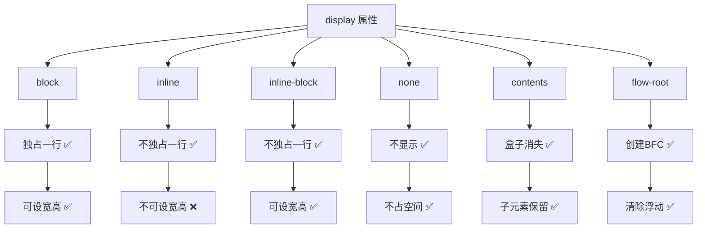

+++
title = "第19章 display属性与文档流"
weight = 190
date = "2026-03-27T16:53:00+08:00"
type = "docs"
description = ""
isCJKLanguage = true
draft = false
+++

# 第十九章：display 属性与文档流

> CSS 布局的核心是"文档流"——浏览器默认排列元素的方式。而 `display` 属性则是控制元素如何参与文档流的关键。理解这两个概念，就等于掌握了 CSS 布局的第一把钥匙。想象一下，文档流就像河流，元素就像河里的船只，`display` 属性决定了你是一艘货船（块级）还是一艘快艇（行内）。

## 19.1 文档流

### 19.1.1 浏览器默认布局方式——块级元素垂直排列，行内元素水平排列

文档流（Document Flow）是浏览器默认的布局方式。简单来说，就是浏览器按照 HTML 文档中的顺序，依次排列页面上元素的方式。

**什么是文档流？**

想象一下排队买东西：有些人"占地方"很大，一个人就要占一整排（块级元素）；有些人很小，可以好几个人挤在一排（行内元素）。文档流就是这个"排队规则"——浏览器按照这个规则把元素排列在页面上。

```html
<!-- 文档流的简单示例 -->

<!-- 块级元素：每个占一整行 -->
<div>我是块级元素1，占一整行</div>
<div>我是块级元素2，占一整行</div>
<div>我是块级元素3，占一整行</div>

<!-- 行内元素：多个可以在一行 -->
<span>行内1</span>
<span>行内2</span>
<span>行内3</span>

<!-- 混合 -->
<div>这是块级div</div>
<p>这也是块级p</p>
<span>这是行内span，</span>
<strong>这也是行内strong，</strong>
<em>还有行内em</em>
```

**文档流的排列规则：**

```
文档流排列示意：

块级元素排列（垂直）：
┌────────────────────────┐
│      块级元素 1         │ ← 独占一行
├────────────────────────┤
│      块级元素 2         │ ← 独占一行
├────────────────────────┤
│      块级元素 3         │ ← 独占一行
└────────────────────────┘

行内元素排列（水平）：
┌────────────────────────────────────┐
│ [行内1] [行内2] [行内3] → →
└────────────────────────────────────┘
```

### 19.1.2 块级元素——div、p、h1、ul、li、section、article 等，默认宽度 100%，独占一行

块级元素（Block-level Elements）是文档流中的"大块头"。它们的特点是：**独占一行**，可以设置宽高，宽度默认是父元素的 100%。

**常见的块级元素：**

```html
<!-- 常见块级元素 -->
<div>通用块级容器</div>
<p>段落，段落之间有上下间距</p>
<h1>一级标题，字号最大</h1>
<h2>二级标题</h2>
<h3>三级标题</h3>
<h4>四级标题</h4>
<h5>五级标题</h5>
<h6>六级标题，字号最小</h6>
<ul>无序列表
  <li>列表项1</li>
  <li>列表项2</li>
</ul>
<ol>有序列表
  <li>列表项1</li>
  <li>列表项2</li>
</ol>
<li>列表项（块级）</li>
<section>语义化区块</section>
<article>文章内容</article>
<aside>侧边栏</aside>
<nav>导航栏</nav>
<header>头部区域</header>
<footer>底部区域</footer>
<main>主要内容</main>
<form>表单</form>
<table>表格</table>
<address>地址信息</address>
```

**块级元素的特点：**

```css
/* 块级元素的默认特点 */

.block-element {
  /* 1. 独占一行 */
  display: block;  /* 默认值 */

  /* 2. 宽度默认是父元素的100% */
  width: 100%;  /* 默认值，不需要写 */

  /* 3. 高度由内容决定（除非设置明确高度）*/
  height: auto;  /* 默认值 */

  /* 4. 可以设置宽高 */
  width: 300px;
  height: 200px;

  /* 5. 可以设置外边距和内边距 */
  margin: 20px;
  padding: 20px;

  /* 6. 上下外边距会折叠 */
  margin-top: 10px;
  margin-bottom: 20px;
  /* 实际间距可能只有20px（取较大值）*/
}
```

### 19.1.3 行内元素——span、a、strong、em 等，默认宽度由内容决定，不独占一行

行内元素（Inline Elements）是文档流中的"小个子"。它们的特点是：**不独占一行**，多个行内元素可以排在一行，宽度由内容决定。

**常见的行内元素：**

```html
<!-- 常见行内元素 -->
<span>通用行内容器</span>
<a href="#">链接，蓝色带下划线</a>
<strong>强调文本，加粗</strong>
<em>斜体文本，强调</em>
<b>加粗文本</b>
<i>斜体文本</i>
<u>带下划线文本</u>
<s>带删除线文本</s>
<mark>高亮文本</mark>
<small>小号文本</small>
<sub>下标</sub>
<sup>上标</sup>

<button>按钮（块级元素，但可以和其他元素在一行）</button>
<input type="text"> <!-- 输入框（替换元素），是自闭合空元素 -->
<label>标签</label>
<br>换行（空元素）
```

**行内元素的特点：**

```css
/* 行内元素的默认特点 */

.inline-element {
  /* 1. 不独占一行 */
  display: inline;  /* 默认值 */

  /* 2. 宽度由内容决定 */
  width: auto;  /* 默认值，无法设置固定宽度 */

  /* 3. 高度由内容决定 */
  height: auto;

  /* 4. 水平方向的外边距和内边距有效 */
  margin-left: 10px;
  margin-right: 10px;
  padding-left: 10px;
  padding-right: 10px;

  /* 5. ⚠️ 垂直方向的外边距和内边距不占据布局空间 */
  margin-top: 50px;   /* ⚠️ 不生效，行内元素垂直外边距不参与块级布局计算 */
  margin-bottom: 50px;  /* ⚠️ 不生效，同上 */
  padding-top: 50px;     /* ⚠️ 不占据块级布局空间，可能被裁剪 */
  padding-bottom: 50px;  /* ⚠️ 不占据块级布局空间，可能被裁剪 */
  /* 注意：行内元素的垂直 margin 不会像块级元素那样折叠，而是直接应用于元素本身 */

  /* 6. ⚠️ 不能设置固定宽高 */
  width: 200px;   /* ⚠️ 不生效 */
  height: 100px;  /* ⚠️ 不生效 */
}
```

**块级元素 vs 行内元素对比：**

```css
/* 对比示例 */

.block-box {
  display: block;
  width: 300px;  /* ✅ 有效 */
  height: 100px;  /* ✅ 有效 */
  margin: 20px;  /* ✅ 有效 */
  padding: 20px;  /* ✅ 有效 */
  background-color: #3498db;
  color: white;
  text-align: center;
}

.inline-box {
  display: inline;
  width: 300px;  /* ⚠️ 无效！ */
  height: 100px;  /* ⚠️ 无效！ */
  margin: 20px;  /* ✅ 左右有效，上下无效 */
  padding: 20px;  /* ✅ 左右有效，上下可能显示但占空间 */
  background-color: #2ecc71;
  color: white;
}
```

```html
<div class="block-box">
  块级元素：独占一行，可以设置宽高
</div>

<span class="inline-box">
  行内元素：不独占一行，多个可以并排
</span>
<span class="inline-box">
  另一个行内元素
</span>
```

**行内元素如何"变块级"：**

```css
/* 使用 display 属性改变元素类型 */

.inline-as-block {
  display: block;  /* 变成块级元素 */
  width: 200px;   /* 现在有效了 */
  margin: 10px auto;  /* 可以居中了 */
}

.block-as-inline {
  display: inline;  /* 变成行内元素 */
  /* width 和 height 失效了 */
  /* 但可以和别的元素排在一行 */
}
```

> 💡 **小技巧**：理解文档流是 CSS 布局的基础。记住：**块级元素独占一行，行内元素可以并排**。如果想让块级元素并排，使用 `display: inline-block`、`float` 或 `flex`。

## 19.2 display 属性值

### 19.2.1 display: block——块级，独占一行，可设宽高

`display: block` 将元素设置为块级元素。这是 CSS 中最常用的显示方式之一。

```css
/* display: block 的特点 */

/* 1. 独占一行 */
.block-element {
  display: block;
}

/* 2. 可以设置宽高 */
.block-element {
  display: block;
  width: 300px;
  height: 200px;
}

/* 3. 宽度默认100% */
.full-width {
  display: block;
  /* width: 100% 是默认值 */
}

/* 实际应用 */
.card {
  display: block;
  width: 100%;
  max-width: 400px;
  padding: 20px;
  background-color: white;
  border-radius: 8px;
  box-shadow: 0 2px 8px rgba(0, 0, 0, 0.1);
}
```

```html
<!-- display: block 的元素会独占一行 -->
<div class="block-element">
  我是一个块级元素
</div>

<!-- 可以设置宽高 -->
<div class="card">
  我是一个卡片，可以设置宽高
</div>
```

### 19.2.2 display: inline——行内，不独占一行，宽高由内容决定

`display: inline` 将元素设置为行内元素。

```css
/* display: inline 的特点 */

/* 1. 不独占一行 */
.inline-element {
  display: inline;
}

/* 2. 宽高由内容决定，无法设置固定宽高 */
.inline-element {
  display: inline;
  width: 300px;   /* ⚠️ 无效 */
  height: 200px;  /* ⚠️ 无效 */
}

/* 3. 只能设置水平方向的 margin 和 padding */
.inline-element {
  display: inline;
  margin-left: 10px;   /* ✅ 有效 */
  margin-right: 10px;
  padding-left: 10px;  /* ✅ 有效 */
  padding-right: 10px;
  margin-top: 20px;    /* ⚠️ 垂直方向不占据空间 */
  padding-top: 20px;   /* ⚠️ 可能显示但不占空间 */
}
```

```html
<!-- 多个 inline 元素可以在一行 -->
<span class="inline-element">行内1</span>
<span class="inline-element">行内2</span>
<span class="inline-element">行内3</span>
```

### 19.2.3 display: inline-block——对外像行内（不独占一行），对内像块级（可设宽高）

`display: inline-block` 是 `inline` 和 `block` 的"混血儿"。对外它像行内元素（不独占一行），对内它像块级元素（可以设置宽高）。

```css
/* display: inline-block 的特点 */

/* 1. 不独占一行（对外像行内）*/
.inline-block-element {
  display: inline-block;
}

/* 2. 可以设置宽高（对内像块级）*/
.inline-block-element {
  display: inline-block;
  width: 200px;    /* ✅ 有效 */
  height: 100px;   /* ✅ 有效 */
}

/* 3. 多个 inline-block 可以在一行 */
.nav-item {
  display: inline-block;
  width: 100px;
  height: 40px;
  background-color: #3498db;
  color: white;
  text-align: center;
  line-height: 40px;
}
```

```html
<!-- 多个 inline-block 可以并排 -->
<nav>
  <span class="nav-item">首页</span>
  <span class="nav-item">产品</span>
  <span class="nav-item">关于</span>
  <span class="nav-item">联系</span>
</nav>
```

**`inline-block` vs `block` vs `inline` 对比：**

```css
/* display 属性值对比 */

/* block：独占一行，可以设置宽高 */
.demo-block {
  display: block;
  width: 200px;
  height: 100px;
  margin: 10px;
  background-color: #3498db;
}

/* inline：不独占一行，不能设置宽高 */
.demo-inline {
  display: inline;
  margin: 10px;
  padding: 10px;
  background-color: #2ecc71;
}

/* inline-block：混合体，不独占一行但可以设置宽高 */
.demo-inline-block {
  display: inline-block;
  width: 200px;
  height: 100px;
  margin: 10px;
  padding: 10px;
  background-color: #e74c3c;
}
```

```html
<!-- 对比效果 -->

<div class="demo-block">block1</div>
<div class="demo-block">block2</div>
<!-- 两个block各占一行 -->

<span class="demo-inline">inline1</span>
<span class="demo-inline">inline2</span>
<span class="demo-inline">inline3</span>
<!-- 三个inline在一行，但宽高设置无效 -->

<span class="demo-inline-block">inline-block1</span>
<span class="demo-inline-block">inline-block2</span>
<!-- 两个inline-block在一行，且可以设置宽高 -->
```

### 19.2.4 display: none——不显示，不占据空间（不同于 visibility:hidden）

`display: none` 会让元素完全消失，不仅不可见，而且**不占据任何空间**。这与 `visibility: hidden` 不同。

```css
/* display: none 的特点 */

/* 1. 完全不显示 */
.hidden-element {
  display: none;
  /* 元素从页面布局中完全消失 */
}

/* 2. 不占据空间 */
.no-space {
  display: none;
  /* 下面的元素会"顶上来"填补空位 */
}

/* 实际应用：响应式显示/隐藏 */
.desktop-only {
  display: none;
}

@media (min-width: 768px) {
  .desktop-only {
    display: block;  /* 大屏幕显示 */
  }

  .mobile-only {
    display: none;  /* 大屏幕隐藏 */
  }
}
```

```html
<!-- display: none 的元素完全不存在于布局中 -->
<div class="hidden-element">
  看不到我，也占不了我的空间
</div>
<div>我会顶上去填补空位</div>
```

**`display: none` vs `visibility: hidden` 对比：**

```css
/* 两种隐藏方式的对比 */

/* display: none */
.display-none {
  display: none;  /* 完全消失，不占空间 */
}

/* visibility: hidden */
.visibility-hidden {
  visibility: hidden;  /* 不可见，但占空间 */
}
```

```html
<!-- visibility: hidden：元素不可见，但空间还在 -->
<div style="visibility: hidden;">
  我不可见，但我占的位置还在
</div>
<div>我会紧贴在我下面的元素，不会填补上面的空位</div>

<!-- display: none：元素完全消失，空间也被回收 -->
<div style="display: none;">
  我完全消失，空间也被回收了
</div>
<div>我会顶上去填补空位</div>
```

### 19.2.5 display: contents——让容器本身消失，只影响子元素的布局，常用于消除父容器对布局的影响

`display: contents` 是一个比较"奇怪"的值。它会让元素的盒子完全消失，但保留子元素的渲染。

```css
/* display: contents 的特点 */

/* 1. 元素的盒子消失 */
.contents-element {
  display: contents;
  /* 这个元素本身不产生任何盒子 */
  /* 但它的子元素仍然正常渲染 */
}

/* 2. 常用于消除不必要的包装容器 */
.card-wrapper {
  display: contents;
  /* 容器消失，但里面的内容还在 */
}
```

```html
<!-- 原始结构 -->
<article class="card-wrapper">
  <h2>标题</h2>
  <p>内容段落</p>
  
</article>

<!-- display: contents 后，相当于变成 -->
<!-- <h2>标题</h2>
     <p>内容段落</p>
      -->
```

**`display: contents` 的实用场景：**

```css
/* 1. 消除布局影响的父容器 */
.grid-wrapper {
  /* 这个wrapper本来会影响布局 */
  display: contents;
  /* 现在它消失了，但子元素正常渲染 */
}

/* 2. Semantic wrapper without layout impact */
.article-header {
  /* 你可能需要一个语义化的header包裹 */
  display: contents;
  /* 但不想它影响布局 */
}

/* 3. 配合CSS Grid使用 */
.grid-container {
  display: grid;
  grid-template-columns: repeat(3, 1fr);
}

.grid-item-wrapper {
  display: contents;
  /* 子元素直接成为grid项目 */
}
```

### 19.2.6 display: flow-root——创建新的 BFC，最简单的清除浮动方案

`display: flow-root` 是一个专门用来创建 BFC（Block Formatting Context）的值。它就像是一个"结界"，让元素内部的布局与外部隔离。

```css
/* display: flow-root 的特点 */

/* 1. 创建新的 BFC */
.flow-root-element {
  display: flow-root;
  /* 这个元素内部形成独立的格式化上下文 */
}

/* 2. 清除浮动（最简单的方案）*/
.clearfix {
  display: flow-root;
  /* 子元素的浮动不会溢出 */
}
```

**`overflow: hidden` vs `display: flow-root` 清除浮动对比：**

```css
/* 方案1：overflow: hidden（传统方案）*/
.clearfix-overflow {
  overflow: hidden;  /* 副作用：可能裁剪内容 */
  /* 会创建 BFC */
}

/* 方案2：display: flow-root（现代方案，推荐）*/
.clearfix-flow-root {
  display: flow-root;  /* 更语义化，没有副作用 */
  /* 会创建 BFC */
}

/* 方案3：clearfix 伪元素（经典方案）*/
.clearfix::after {
  content: "";
  display: block;
  clear: both;
}

/* 方案4：display: flow-root（最简洁）*/
.flow-root-wrapper {
  display: flow-root;
  /* 直接使用，无需伪元素 */
}
```

### 19.2.7 visibility: hidden——不显示，但占据空间

`visibility: hidden` 和 `display: none` 都会让元素不可见，但有一个关键区别：**`visibility: hidden` 会保留元素占据的空间**。

```css
/* visibility: hidden 的特点 */

/* 1. 不可见 */
.hidden {
  visibility: hidden;
}

/* 2. 占据空间 */
.space-reserved {
  visibility: hidden;
  /* 下面的元素不会填补空位 */
}

/* 3. 子元素可以被 visibility: visible 恢复 */
.parent-hidden {
  visibility: hidden;
}

.child-visible {
  visibility: visible;  /* 子元素可以恢复显示 */
}
```

```html
<!-- visibility: hidden：不可见但空间保留 -->
<div class="hidden" style="height: 100px; background: red;">
  我不可见，但我的100px高度还在
</div>
<div style="background: blue;">
  我会紧贴在红色块的下方，不会填补空位
</div>
```

### 19.2.8 visibility: collapse——用于表格行/列隐藏，不占据空间

`visibility: collapse` 主要用于表格，与 `display: none` 类似，但它只用于表格元素。

```css
/* visibility: collapse 的特点 */

/* 用于表格行或列时 */
tr.collapse {
  visibility: collapse;  /* 行隐藏且不占空间 */
}

colgroup.collapse {
  visibility: collapse;  /* 列隐藏且不占空间 */
}

/* 用于其他元素时，等同于 hidden */
div.collapse {
  visibility: collapse;  /* 等同于 visibility: hidden */
}
```

```html
<table>
  <tr>
    <td>第1行</td>
    <td>数据</td>
  </tr>
  <tr class="collapse">
    <td>第2行（被隐藏）</td>
    <td>数据</td>
    <!-- 这行会完全消失，不占空间 -->
  </tr>
  <tr>
    <td>第3行</td>
    <td>数据</td>
  </tr>
</table>
```

> 💡 **小技巧**：`display: flow-root` 是目前最简洁的清除浮动方案，比传统的 `clearfix` 伪元素方案更现代、更易读。

## 19.3 inline-block 间隙问题

### 19.3.1 间隙产生原因——HTML 中的换行符被浏览器解析为空格

使用 `display: inline-block` 时，你可能会发现元素之间莫名其妙地出现了一个小间隙。这个间隙是由于 HTML 中的换行符（回车）被浏览器解析为空格导致的。

**什么是 `inline-block` 间隙？**

```css
/* 间隙问题演示 */

.inline-block-wrapper {
  font-size: 0;  /* 解决方案：把父元素字体设为0，消除换行产生的空格 */
}

.inline-block-item {
  display: inline-block;
  width: 100px;
  height: 100px;
  background-color: #3498db;
  font-size: 16px;  /* 子元素要恢复字体大小 */
}
```

### 19.3.2 解决方法——父元素设置 font-size: 0; 或用注释拼接元素、或用 flex 替代

**解决方案1：设置父元素 `font-size: 0`**

```css
/* font-size: 0 解决方案 */

.no-gap-wrapper {
  font-size: 0;  /* 把父元素的字体设为0 */
}

.no-gap-item {
  display: inline-block;
  width: 100px;
  height: 100px;
  font-size: 16px;  /* 子元素必须恢复字体大小 */
  margin: 0;         /* 可以配合 margin 消除间距 */
}
```

**解决方案2：使用注释消除换行符**

```html
<!-- 使用注释消除换行符 -->
<div class="inline-block-item">1</div><!--
--><div class="inline-block-item">2</div><!--
--><div class="inline-block-item">3</div>
```

**解决方案3：使用 Flexbox 替代**

```css
/* Flexbox 替代方案 */

.flex-wrapper {
  display: flex;  /* 使用 Flexbox 代替 inline-block */
  gap: 10px;     /* 使用 gap 控制间距 */
}

.flex-item {
  width: 100px;
  height: 100px;
  background-color: #3498db;
}

/* 这是最推荐的现代方案 */
```

**完整示例对比：**

```css
/* 有间隙的 inline-block */
.with-gap {
  display: inline-block;
  width: 100px;
  height: 100px;
  background-color: #3498db;
  color: white;
  text-align: center;
  line-height: 100px;
}

/* 解决方案1：font-size: 0 */
.font-size-zero-wrapper {
  font-size: 0;  /* 消除换行符产生的空格 */
}

.font-size-zero-wrapper .with-gap {
  font-size: 16px;  /* 子元素恢复字体 */
}

/* 解决方案2：使用 flexbox */
.flex-wrapper {
  display: flex;
  gap: 0;  /* 无间隙，无需额外设置子元素 */
}
```

```html
<!-- 有间隙的布局 -->
<div class="with-gap">1</div>
<div class="with-gap">2</div>
<div class="with-gap">3</div>
<!-- 元素之间会有几像素的间隙 -->

<!-- 无间隙的布局 -->
<div class="flex-wrapper">
  <div class="with-gap">1</div>
  <div class="with-gap">2</div>
  <div class="with-gap">3</div>
</div>
<!-- 使用 flexbox，没有间隙问题 -->
```

## 19.4 appearance

### 19.4.1 appearance: none——去除浏览器默认样式，如去除按钮原生样式、去除 select 下拉箭头

`appearance` 属性用于**去除**浏览器的原生外观，让元素可以完全通过 CSS 自定义样式（注意：各浏览器前缀是必须的）。

**什么是 `appearance`？**

```css
/* appearance: none 重置默认样式 */

/* 去除按钮原生样式 */
.reset-button {
  appearance: none;
  -webkit-appearance: none;  /* Safari/Chrome */
  -moz-appearance: none;    /* Firefox */
  background: none;
  border: none;
  cursor: pointer;
}

/* 去除 select 下拉箭头 */
.reset-select {
  appearance: none;
  -webkit-appearance: none;
  -moz-appearance: none;
  background-image: url("arrow.png");  /* 自定义箭头 */
  background-position: right center;
  background-repeat: no-repeat;
  padding-right: 30px;
}
```

**`appearance` 的实用场景：**

```css
/* 1. 自定义复选框 */
.checkbox-wrapper {
  display: flex;
  align-items: center;
  cursor: pointer;
}

.custom-checkbox {
  appearance: none;
  -webkit-appearance: none;
  -moz-appearance: none;
  width: 20px;
  height: 20px;
  border: 2px solid #ddd;
  border-radius: 4px;
  margin-right: 10px;
  cursor: pointer;
  position: relative;
}

.custom-checkbox:checked {
  background-color: #3498db;
  border-color: #3498db;
}

.custom-checkbox:checked::after {
  content: "✓";
  position: absolute;
  top: 50%;
  left: 50%;
  transform: translate(-50%, -50%);
  color: white;
  font-size: 14px;
}

/* 2. 自定义单选框 */
.radio-wrapper {
  display: flex;
  align-items: center;
  cursor: pointer;
  margin-bottom: 10px;
}

.custom-radio {
  appearance: none;
  -webkit-appearance: none;
  -moz-appearance: none;
  width: 20px;
  height: 20px;
  border: 2px solid #ddd;
  border-radius: 50%;
  margin-right: 10px;
  cursor: pointer;
  position: relative;
}

.custom-radio:checked {
  border-color: #3498db;
}

.custom-radio:checked::after {
  content: "";
  position: absolute;
  top: 50%;
  left: 50%;
  transform: translate(-50%, -50%);
  width: 10px;
  height: 10px;
  background-color: #3498db;
  border-radius: 50%;
}

/* 3. 自定义下拉框 */
.custom-select {
  appearance: none;
  -webkit-appearance: none;
  -moz-appearance: none;
  width: 100%;
  padding: 12px 40px 12px 16px;
  border: 2px solid #ddd;
  border-radius: 8px;
  background-color: white;
  background-image: url("data:image/svg+xml;charset=UTF-8,%3csvg xmlns='http://www.w3.org/2000/svg' viewBox='0 0 24 24' fill='none' stroke='%23333' stroke-width='2'%3e%3cpolyline points='6,9 12,15 18,9'%3e%3c/polyline%3e%3c/svg%3e");
  background-repeat: no-repeat;
  background-position: right 12px center;
  background-size: 16px;
  cursor: pointer;
}

.custom-select:focus {
  outline: none;
  border-color: #3498db;
}
```

```html
<!-- 自定义复选框 -->
<label class="checkbox-wrapper">
  <input type="checkbox" class="custom-checkbox">
  <span>我同意用户协议</span>
</label>

<!-- 自定义单选框 -->
<label class="radio-wrapper">
  <input type="radio" name="gender" class="custom-radio">
  <span>男</span>
</label>
<label class="radio-wrapper">
  <input type="radio" name="gender" class="custom-radio">
  <span>女</span>
</label>

<!-- 自定义下拉框 -->
<select class="custom-select">
  <option>选项1</option>
  <option>选项2</option>
  <option>选项3</option>
</select>
```

---

## 本章小结

恭喜你完成了第十九章的学习！让我们来回顾一下这章的精华：

### 核心知识点

| 属性 | 说明 |
|------|------|
| display: block | 块级元素，独占一行，可设宽高 |
| display: inline | 行内元素，不独占一行，不可设宽高 |
| display: inline-block | 行内块级，混合体 |
| display: none | 完全消失，不占空间 |
| display: contents | 元素盒子消失，子元素保留 |
| display: flow-root | 创建新 BFC，清除浮动 |
| visibility: hidden | 不可见，但占空间 |
| appearance: none | 重置浏览器默认样式 |

### display 属性值对比



### 实战建议

1. **inline-block 间隙**：使用 Flexbox 替代是最现代的解决方案
2. **清除浮动**：`display: flow-root` 是最简洁的方案
3. **自定义表单元素**：使用 `appearance: none` 配合自定义样式

### 下章预告

下一章我们将学习格式化上下文（Formatting Context），理解 BFC 和 IFC 是掌握高级布局的关键！


