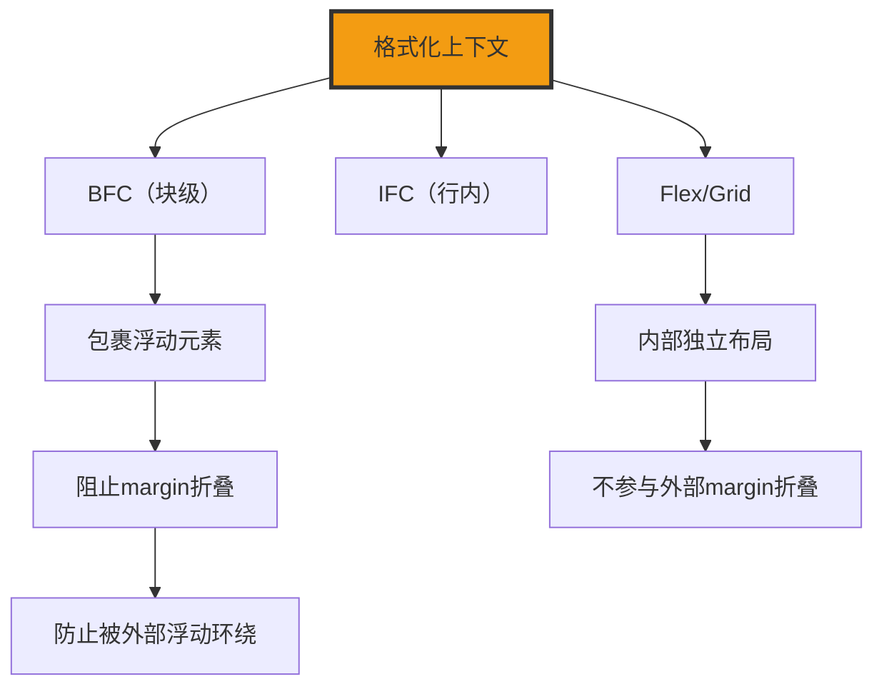

+++
title = "第20章 格式化上下文"
weight = 200
date = "2026-03-27T16:53:00+08:00"
type = "docs"
description = ""
isCJKLanguage = true
draft = false
+++

# 第二十章：格式化上下文

> 格式化上下文（Formatting Context）是 CSS 布局中一个相对高级的概念。理解它，你就能解释很多"奇怪"的布局现象——比如为什么父元素高度塌陷、为什么 margin 会重叠、为什么 overflow:hidden 能清除浮动。这些问题的答案，都藏在格式化上下文中。

## 20.1 BFC 块级格式化上下文

### 20.1.1 什么是 BFC——Block Formatting Context，块级元素参与的区域，形成独立的渲染区域

BFC（Block Formatting Context，块级格式化上下文）是 CSS 布局中最重要的概念之一。简单来说，BFC 是一个独立的渲染区域，在这个区域内的元素按照块级布局规则排列，但这个区域本身与外部是隔离的。

**什么是 BFC？**

想象一下一个透明的玻璃鱼缸（格式化上下文）。鱼缸里有自己的水流（内部布局），鱼缸里的水不会流到外面去，但鱼缸里的鱼（子元素）可以自由游动。BFC 就像是这个玻璃鱼缸——它有自己的内部布局规则，但不会影响外部元素。

```css
/* BFC 的特点 */

/* 形成 BFC 的元素 */
.bfc-container {
  display: flow-root;  /* 创建一个 BFC */
  /* 或者使用其他方式 */
}
```

**BFC 的形成条件：**

```css
/* 以下属性会让元素形成 BFC */

/* 1. overflow 不为 visible */
.overflow-bfc {
  overflow: hidden;  /* hidden/auto/scroll 均可 */
}

/* 2. display 为 flow-root */
.flow-root-bfc {
  display: flow-root;  /* 专门用来创建 BFC */
}

/* 3. display 为 inline-block */
.inline-block-bfc {
  display: inline-block;
}

/* 4. position 为 absolute 或 fixed */
.position-bfc {
  position: absolute;
  /* 或 position: fixed */
}

/* 5. display 为 flex 或 grid 的直接子元素 */
.flex-bfc {
  display: flex;
}

/* 6. 多列布局 */
.multi-column-bfc {
  column-count: 2;  /* 形成 BFC */
}

/* 7. display: table */
.table-bfc {
  display: table;  /* 也会形成 BFC */
}

/* 8. float 不为 none */
.float-bfc {
  float: left;  /* 触发 BFC */
}
```

### 20.1.2 触发 BFC 的方式——overflow:hidden/auto/scroll、display:flow-root/inline-block/table、float不为none、position:absolute/fixed、display:flex/grid、column-count/column-width

触发 BFC 的方式有很多种，每种都有不同的适用场景。

```css
/* 触发 BFC 的各种方式 */

/* 方式1：overflow 不为 visible */
.method-overflow {
  overflow: hidden;   /* 推荐用 hidden 或 auto */
  /* 注意：visible 会让 BFC 失效 */
}

/* 方式2：display: flow-root */
.method-flow-root {
  display: flow-root;  /* 最语义化的方式 */
}

/* 方式3：display: inline-block */
.method-inline-block {
  display: inline-block;  /* 会产生一个 BFC */
}

/* 方式4：position: absolute / fixed */
.method-position {
  position: absolute;
  /* 或 position: fixed; */
}

/* 方式5：display: flex 或 grid */
.method-flex {
  display: flex;  /* flex 容器内部形成 BFC */
}

.method-grid {
  display: grid;  /* grid 容器内部形成 BFC */
}

/* 方式6：column-count 或 column-width */
.method-columns {
  column-count: 2;  /* 多列容器形成 BFC */
}

/* 方式7：display: table */
.method-table {
  display: table;  /* 也会形成 BFC */
}

/* 方式8：float 不为 none */
.method-float {
  float: left;  /* 触发 BFC */
}
```

### 20.1.3 BFC 的特性——包裹浮动元素（不塌陷）、阻止 margin 折叠、防止内部元素被外部浮动环绕

BFC 有三个非常重要的特性，这些特性解释了为什么很多"奇怪"的 CSS 布局问题都可以用 BFC 来解决。

**特性1：包裹浮动元素（不塌陷）**

```css
/* BFC 包裹浮动元素，解决父元素高度塌陷问题 */

/* 问题：没有触发 BFC 的父元素，高度塌陷 */
.parent-collapsed {
  border: 2px solid red;
}

.parent-collapsed .float-child {
  float: left;  /* 浮动元素脱离文档流 */
  width: 100px;
  height: 100px;
  background-color: #3498db;
}

/* 解决方案：让父元素触发 BFC */
.parent-with-bfc {
  display: flow-root;  /* 触发 BFC */
  border: 2px solid green;
}

.parent-with-bfc .float-child {
  float: left;
  width: 100px;
  height: 100px;
  background-color: #2ecc71;
}
```

```html
<!-- 问题：父元素高度塌陷 -->
<div class="parent-collapsed">
  <div class="float-child">浮动元素</div>
</div>
<!-- 父元素高度为0，背景边框显示不正确 -->

<!-- 解决：父元素触发 BFC -->
<div class="parent-with-bfc">
  <div class="float-child">浮动元素</div>
</div>
<!-- 父元素高度被撑开 -->
```

**特性2：阻止 margin 折叠**

```css
/* BFC 阻止 margin 折叠 */

/* 问题：上下 margin 折叠 */
.margin-collapse {
  background-color: #f8f9fa;
  padding: 20px;
}

.margin-collapse .top-box {
  margin-bottom: 20px;
  background-color: #3498db;
}

.margin-collapse .bottom-box {
  margin-top: 30px;
  background-color: #2ecc71;
}

/* 解决方案：让一个元素触发 BFC */
.margin-collapse .bottom-box {
  display: flow-root;  /* 触发 BFC，阻止折叠 */
}
```

```html
<div class="margin-collapse">
  <div class="top-box">上盒子，margin-bottom: 20px</div>
  <!-- 间距是 30px，不是 50px（折叠了）-->

  <div class="bottom-box">下盒子，margin-top: 30px</div>
  <!-- 解决方案：给下盒子触发 BFC，间距变成 50px -->
</div>
```

**特性3：阻挡外部元素环绕（不重叠）**

```css
/* BFC 阻挡外部元素环绕 */

.float-box {
  float: left;
  width: 100px;
  height: 100px;
  background-color: #3498db;
  margin-right: 20px;
}

.normal-text {
  /* 普通文本会环绕浮动元素 */
  /* 但如果触发了 BFC，文本会被阻挡 */
}

.bfc-text {
  display: flow-root;  /* 触发 BFC */
  /* BFC 内部的元素不会被外部浮动元素环绕 */
}
```

> 💡 **小技巧**：BFC 的这三个特性非常实用——`overflow: hidden` 或 `display: flow-root` 可以同时解决浮动塌陷、margin 折叠和文本环绕三个问题。

## 20.2 IFC 行内格式化上下文

### 20.2.1 什么是 IFC——Inline Formatting Context，行内元素参与的区域

IFC（Inline Formatting Context，行内格式化上下文）是行内元素参与布局的区域。在 IFC 中，行内元素水平排列，形成一个"行框"（Line Box）。

**什么是 IFC？**

IFC 是行内元素排列的区域。当一行内容放不下时，会自动换行形成新的 Line Box。

```css
/* IFC 的特点 */

/* IFC 由行内元素组成 */
.inline-elements {
  /* 行内元素会在 IFC 中排列 */
}

.inline-elements span {
  /* 每个 span 都在 IFC 中 */
}

.inline-elements strong {
  /* strong 也在同一个 IFC 中 */
}
```

**IFC 的基本概念：**

```css
/* IFC 由一个或多个行框（Line Box）组成 */

/* 行框的高度由最高元素的 ascent 和最低元素的 descent 决定 */

/* 示例 */
.ifc-container {
  font-size: 16px;
  line-height: 1.5;
  /* 行框高度 ≈ 16 * 1.5 = 24px */
}

.ifc-container .tall {
  font-size: 24px;  /* 更高的文字 */
  /* 会影响行框高度 */
}
```

### 20.2.2 行框高度计算——由最高元素的 ascent 和最低元素的 descent 决定，line-height 和 vertical-align 影响行框高度

IFC 中行框（Line Box）的高度是由其内部所有行内元素共同决定的。

**行框高度计算原理：**

```css
/* 行框高度的构成 */

/* ascent + descent = line-height */

.ifc-line {
  line-height: 24px;  /* 定义行高 */
  font-size: 16px;      /* 影响 ascent */
}

/* 不同 vertical-align 会影响行框 */
.align-top {
  vertical-align: top;   /* 元素顶部对齐 */
}

.align-bottom {
  vertical-align: bottom;  /* 元素底部对齐 */
}

.align-middle {
  vertical-align: middle;  /* 元素中部对齐 */
}

.align-baseline {
  vertical-align: baseline;  /* 基线对齐，默认 */
}
```

**行框高度计算示例：**

```css
/* 行框高度计算示例 */

.line-box-demo {
  line-height: 1.5;  /* 行高1.5 */
}

.line-box-demo .normal {
  font-size: 16px;
  vertical-align: baseline;
}

.line-box-demo .tall {
  font-size: 24px;
  vertical-align: top;  /* 会撑高行框 */
}

.line-box-demo .short {
  font-size: 12px;
  vertical-align: bottom;  /* 也会影响行框 */
}
```

## 20.3 flex/grid 格式化上下文

### 20.3.1 flex/grid 容器内部形成独立的格式化上下文，与 BFC 的作用有重叠但机制不同

Flex 容器和 Grid 容器内部会形成独立的格式化上下文，它们与 BFC 有相似的功能，但机制不同。

```css
/* Flex/Grid 格式化上下文 */

/* Flex 容器 */
.flex-container {
  display: flex;  /* 内部形成 flex 格式化上下文 */
}

/* Grid 容器 */
.grid-container {
  display: grid;  /* 内部形成 grid 格式化上下文 */
}

/* Flex/Grid 的特性与 BFC 类似但不同 */

/* 包裹浮动元素 */
.flex-wrapper {
  display: flex;
  /* Flex 项目会被正确包裹 */
}

/* 阻止 margin 折叠 */
.grid-wrapper {
  display: grid;
  /* Grid 项目不会 margin 折叠 */
}
```

### 20.3.2 容器外的布局不会影响容器内，容器内也不参与外部的 margin 折叠

Flex/Grid 容器内部形成独立的布局区域，外部的布局变化不会影响内部。

```css
/* Flex/Grid 容器的隔离性 */

/* 外部的 margin 折叠不会传入容器内 */
.outer-margin {
  margin-top: 50px;
}

.flex-isolated {
  display: flex;
  /* 外部的 margin 不会影响内部布局 */
  /* 内部的 margin 也不会与外部折叠 */
}

.flex-isolated .item {
  margin: 10px;
  /* 每个项目的 margin 是独立的，不会折叠 */
}
```

**Flex/Grid 与 BFC 的对比：**

```css
/* 对比 Flex/Grid 和传统 BFC */

/* BFC 的触发方式 */
.bfc-overflow {
  overflow: hidden;
}

.bfc-flow-root {
  display: flow-root;
}

/* Flex/Grid 自动形成格式化上下文 */
.flex-context {
  display: flex;
}

.grid-context {
  display: grid;
}

/* 两者的共同点：包裹浮动、阻止 margin 折叠 */

/* 两者的区别： */
/* 1. BFC 是块级布局，Flex/Grid 是自己的布局系统 */
/* 2. Flex/Grid 的布局能力更强大 */
/* 3. Flex/Grid 不需要触发条件 */
```

---

## 本章小结

恭喜你完成了第二十章的学习！让我们来回顾一下这章的精华：

### 核心知识点

| 概念 | 说明 |
|------|------|
| BFC | Block Formatting Context，块级格式化上下文 |
| IFC | Inline Formatting Context，行内格式化上下文 |
| BFC 特性 | 包裹浮动、阻止 margin 折叠、阻挡外部环绕 |
| 触发 BFC | overflow、flow-root、inline-block、table、float、position、flex/grid、columns |

### 格式化上下文图解



### 实战建议

1. **清除浮动**：使用 `display: flow-root` 或 `overflow: hidden`
2. **阻止 margin 折叠**：让元素触发 BFC
3. **复杂布局**：使用 Flexbox 或 Grid，它们自带格式化上下文
4. **理解原理**：了解 BFC 的三个特性可以解释很多 CSS 布局问题

### 下章预告

下一章我们将学习浮动布局，看看 float 是如何工作的，以及它的常见问题和使用场景！


