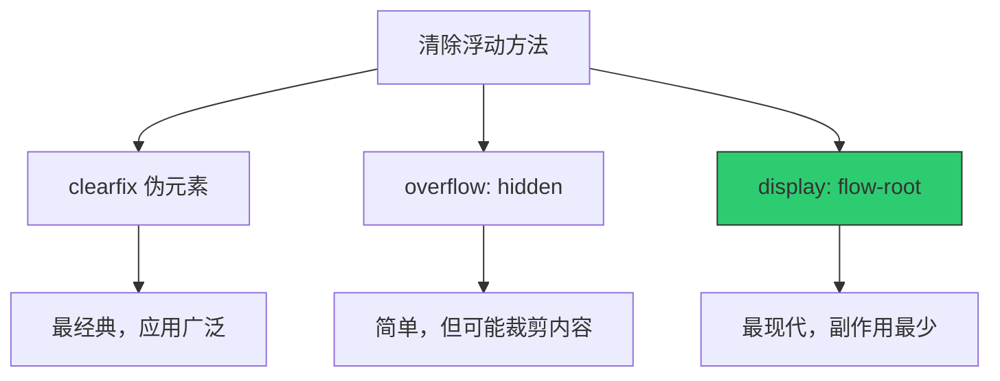

+++
title = "第21章 浮动布局"
weight = 210
date = "2026-03-27T16:53:00+08:00"
type = "docs"
description = ""
isCJKLanguage = true
draft = false
+++

# 第二十一章：浮动布局

> 浮动（Float）是 CSS 中历史悠久的布局方式，虽然现在 Flexbox 和 Grid 已经成为主流，但浮动在某些场景下仍然有用武之地。理解浮动的原理和清除方法，对于阅读老代码和维护旧项目非常重要。想象一下，浮动就像是在报纸排版中让图片"浮"到文字旁边，让文字环绕图片排列。

## 21.1 float 的作用

### 21.1.1 float: left——元素向左浮动，后续内容在右侧环绕

`float` 属性让元素"浮"起来，脱离正常的文档流。浮动元素首先水平移动到容器的左边缘或右边缘（取决于 left/right），然后在垂直方向上"下沉"到不会被其他浮动元素遮挡的位置——就像在水中扔下一块木板，它先漂到一边，再等待时机找到自己的容身之所。

**什么是浮动？**

想象一下一张报纸，文章中间有一张图片，文字围绕着图片排列。`float: left` 就是让图片"浮"到左边，文字在右边环绕；`float: right` 则让图片"浮"到右边，文字在左边环绕。

```css
/* float: left —— 向左浮动 */

.float-left {
  float: left;
  width: 200px;
  height: 200px;
  margin-right: 20px;
  background-color: #3498db;
  padding: 10px;
}

.float-left img {
  width: 100%;
  height: 100%;
  object-fit: cover;
}
```

```html
<div class="article">
  <div class="float-left">
    
  </div>
  <p>这是第一段文字，会环绕在浮动元素的右侧。浮动元素会向上移动，直到触碰到容器的顶部或其他浮动元素。</p>
  <p>这是第二段文字，继续环绕在浮动元素右侧。</p>
  <p>这是第三段文字，当文字高度超过浮动元素高度时，会在浮动元素下方继续排列。</p>
</div>
```

### 21.1.2 float: right——元素向右浮动

```css
/* float: right —— 向右浮动 */

.float-right {
  float: right;
  width: 200px;
  height: 200px;
  margin-left: 20px;
  background-color: #2ecc71;
}
```

```html
<div class="article">
  <p>文字从左边开始排列。</p>
  <div class="float-right">
    浮动元素
  </div>
  <p>这段文字会在浮动元素的左侧环绕。</p>
</div>
```

### 21.1.3 float: none——不浮动

```css
/* float: none —— 不浮动（默认）*/

.no-float {
  float: none;  /* 默认值，元素不浮动 */
}
```

**浮动的效果示意图：**

```
┌─────────────────────────────────────┐
│                                     │
│  ┌────┐  文字环绕在浮动元素的右边     │
│  │    │  文字环绕在浮动元素的右边     │
│  │ 浮 │  文字环绕在浮动元素的右边     │
│  │ 动 │                                 │
│  │ 元 │  当文字高度超过浮动元素时，     │
│  │ 素 │  会继续在浮动元素下方排列       │
│  └────┘                                 │
│  文字从新的一行开始                      │
│                                     │
└─────────────────────────────────────┘
```

## 21.2 浮动的问题

### 21.2.1 父容器高度塌陷——浮动元素脱离文档流，父容器高度不再被撑开

浮动最经典的问题就是"父容器高度塌陷"。当所有子元素都浮动后，父容器会认为自己没有子元素，高度变成 0。

**什么是父容器高度塌陷？**

```css
/* 问题演示 */

.parent {
  border: 2px solid red;
  /* 边框显示的区域就是父容器的实际高度 */
}

.float-child {
  float: left;
  width: 100px;
  height: 100px;
  background-color: #3498db;
  margin-right: 10px;
}
```

```html
<!-- 问题：父容器高度塌陷 -->
<div class="parent">
  <div class="float-child">浮动元素1</div>
  <div class="float-child">浮动元素2</div>
  <div class="float-child">浮动元素3</div>
</div>
<!-- 父容器边框会收缩成一条线，高度为0或接近0 -->
```

**为什么会塌陷？**

浮动元素会"脱离文档流"，也就是说它们不再"属于"父容器的布局计算。父容器看不到浮动元素，所以不会把它们算进高度里。

## 21.3 清除浮动的方法

### 21.3.1 clearfix 伪元素（推荐）——在浮动元素父容器加 clearfix 类，::after 伪元素设置 content:''、display:block、clear:both

`clearfix` 是最经典的清除浮动方法，通过在浮动元素父容器后添加一个清除浮动的伪元素。

```css
/* clearfix 方法 */

/* 给父容器添加 clearfix 类 */
.clearfix::after {
  content: "";           /* 伪元素内容为空 */
  display: block;         /* 必须是块级元素 */
  clear: both;            /* 清除两侧浮动 */
}

/* 完整的 clearfix 代码 */
.clearfix::after {
  content: "";
  display: block;
  clear: both;
}

/* 也可以加更多属性 */
.clearfix::after {
  content: "";
  display: block;
  clear: both;
  height: 0;
  overflow: hidden;
  visibility: hidden;
}
```

```html
<!-- 使用 clearfix -->
<div class="parent clearfix">
  <div class="float-child">浮动元素1</div>
  <div class="float-child">浮动元素2</div>
  <div class="float-child">浮动元素3</div>
</div>
<!-- 父容器现在会被浮动元素撑开 -->
```

**clearfix 的原理：**

```css
/* ::after 伪元素的特点： */
/* 1. 位于父容器内部的最后 */
/* 2. 设置 clear: both 后，会被推到浮动元素下方 */
/* 3. 设置 display: block 后，会撑开父容器 */
/* 4. 设置 content: "" 后，不显示任何内容 */
```

### 21.3.2 overflow: hidden（推荐）——父容器设置 overflow:hidden，触发 BFC 包裹浮动

`overflow: hidden` 会触发 BFC（块级格式化上下文），而 BFC 会自动包裹浮动元素。

```css
/* overflow 方法 */

/* 给父容器设置 overflow: hidden */
.overflow-clear {
  overflow: hidden;  /* 触发 BFC，包裹浮动元素 */
  /* 或使用 overflow: auto; */
}
```

```html
<div class="parent overflow-clear">
  <div class="float-child">浮动元素1</div>
  <div class="float-child">浮动元素2</div>
</div>
<!-- 父容器会被浮动元素撑开 -->
```

**overflow 方法的优缺点：**

```css
/* 优点：简单，一行代码搞定 */
.simple-fix {
  overflow: hidden;
}

/* 缺点：可能裁剪内容 */
.overflow-problem {
  overflow: hidden;
  /* 如果有子元素需要超出父容器显示，会被裁剪掉 */
}

.overflow-problem .tooltip {
  position: absolute;
  top: -50px;  /* 这个定位可能会被裁剪 */
}
```

### 21.3.3 display: flow-root（最现代）——父容器设置 display:flow-root，副作用最小

`display: flow-root` 是最现代的清除浮动方案，专门为创建 BFC 设计，没有 `overflow: hidden` 的副作用。

```css
/* flow-root 方法 */

/* 给父容器设置 display: flow-root */
.flow-root-clear {
  display: flow-root;  /* 触发 BFC，不会有副作用 */
}
```

```html
<div class="parent flow-root-clear">
  <div class="float-child">浮动元素1</div>
  <div class="float-child">浮动元素2</div>
</div>
<!-- 父容器会被浮动元素撑开，而且不会有裁剪问题 -->
```

**三种清除浮动方法对比：**

```css
/* 方法1：clearfix 伪元素 */
.clearfix::after {
  content: "";
  display: block;
  clear: both;
}

/* 方法2：overflow */
.overflow-fix {
  overflow: hidden;
}

/* 方法3：display: flow-root */
.flow-root-fix {
  display: flow-root;
}
```

```html
<!-- 推荐使用 display: flow-root，代码最简洁，副作用最少 -->
<div class="parent flow-root-fix">
  <div class="float-child">浮动元素</div>
</div>
```

## 21.4 浮动的典型应用

### 21.4.1 两栏布局——左栏 float:left，右侧内容设置 margin-left 留出空间

```css
/* 两栏浮动布局 */

.page-wrapper {
  max-width: 1200px;
  margin: 0 auto;
}

.sidebar {
  float: left;              /* 侧边栏左浮动 */
  width: 250px;             /* 固定宽度 */
  background-color: #f8f9fa;
  min-height: 400px;
}

.main-content {
  margin-left: 270px;       /* 留出侧边栏宽度 + 间距 */
  min-height: 400px;
}

/* 或者让主内容区也浮动 */
.main-content-alt {
  float: right;
  width: calc(100% - 270px);  /* 剩余宽度 */
  min-height: 400px;
}
```

```html
<div class="page-wrapper">
  <aside class="sidebar">
    <h2>侧边栏</h2>
    <p>导航菜单</p>
    <ul>
      <li>菜单项1</li>
      <li>菜单项2</li>
      <li>菜单项3</li>
    </ul>
  </aside>

  <main class="main-content">
    <h1>主内容</h1>
    <p>这是主内容区域，会自动避开侧边栏。</p>
  </main>
</div>
```

### 21.4.2 文字环绕图片——给图片设置 float:left，文字自然环绕

```css
/* 文字环绕图片 */

.article-image {
  float: left;
  width: 300px;
  height: 200px;
  margin-right: 20px;
  margin-bottom: 10px;
  border-radius: 8px;
  object-fit: cover;
}

.article-text {
  /* 不需要额外设置，文字会自动环绕浮动元素 */
}
```

```html
<article>
  
  <p class="article-text">
    这段文字会环绕在图片的右侧。当文字高度超过图片高度时，
    会自动在图片下方继续排列。这种布局在杂志和报纸中非常常见。
  </p>
  <p class="article-text">
    另一段文字，继续环绕排列。
  </p>
</article>
```

**文字环绕的完整示例：**

```css
/* 完整的文字环绕布局 */

.float-image-left {
  float: left;
  width: 250px;
  height: 180px;
  margin-right: 24px;
  margin-bottom: 16px;
  border-radius: 8px;
  overflow: hidden;
}

.float-image-left img {
  width: 100%;
  height: 100%;
  object-fit: cover;
  display: block;
}

.article-body {
  line-height: 1.8;
  font-size: 16px;
  color: #333;
}

.article-body p {
  margin-bottom: 1em;
  text-align: justify;  /* 两端对齐 */
}

/* 清除浮动后的第一个段落 */
.float-image-left + p {
  /* 可以在这里添加清除浮动 */
}
```

---

## 本章小结

恭喜你完成了第二十一章的学习！让我们来回顾一下这章的精华：

### 核心知识点

| 属性 | 说明 |
|------|------|
| float: left | 元素向左浮动 |
| float: right | 元素向右浮动 |
| float: none | 不浮动（默认）|
| clear | 清除浮动（left/right/both）|

### 清除浮动的方法



### 实战建议

1. **现代布局**：优先使用 Flexbox 或 Grid，浮动已不再是主流
2. **清除浮动**：使用 `display: flow-root` 最简洁
3. **文字环绕**：这是浮动现在最常用的场景之一
4. **理解原理**：即使不常用，也要理解浮动的工作原理

### 下章预告

下一章我们将学习定位布局（Position），看看如何使用 position 属性来创建各种定位效果！


