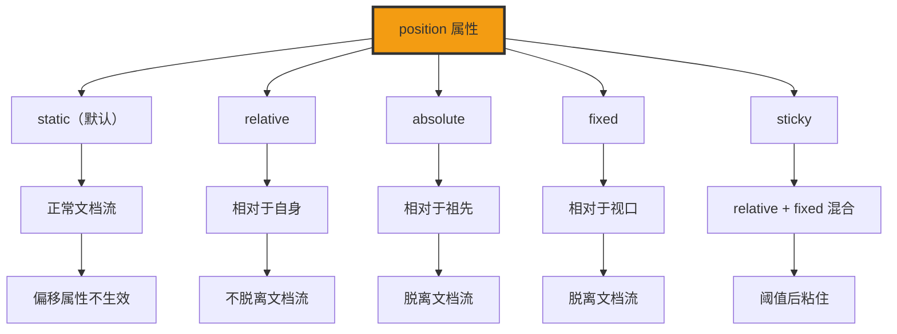

+++
title = "第22章 定位布局"
weight = 220
date = "2026-03-27T16:53:00+08:00"
type = "docs"
description = ""
isCJKLanguage = true
draft = false
+++

# 第二十二章：定位布局

> 定位（Position）是 CSS 中最强大的布局手段之一。通过 `position` 属性，你可以把元素放到页面的任何位置，实现层叠效果、固定导航、回到顶部按钮等各种复杂布局。想象一下，`position` 就是 CSS 给你的"魔法棒"，可以让你把元素"传送"到任何你想要的地方。

## 22.1 position 五个值

### 22.1.1 static——默认值，正常文档流定位，所有偏移属性（top/left 等）不生效

`position: static` 是所有元素的默认值。在 static 定位下，元素按照正常文档流排列，`top`、`left`、`right`、`bottom`、`z-index` 属性都不生效。

```css
/* position: static（默认值）*/

.static-element {
  position: static;  /* 默认值，可以不写 */

  /* 这些属性在 static 定位下都不生效 */
  top: 100px;     /* ❌ 无效 */
  left: 50px;     /* ❌ 无效 */
  right: 20px;    /* ❌ 无效 */
  bottom: 30px;   /* ❌ 无效 */
  z-index: 999;  /* ❌ 无效 */
}
```

```html
<div class="static-element">
  我是 static 定位，按照正常文档流排列
</div>
```

### 22.1.2 relative——相对于元素自身原来的位置定位，不脱离文档流，其他元素位置不变

`position: relative` 让元素相对于它**原本应该出现的位置**进行定位。元素仍然占据原本的空间，其他元素的位置不会改变。

**什么是 relative 定位？**

想象一下你把一本书从书架上拿下来，然后往右移动了 10 厘米。书本原来的位置还留着一个"影子"（空间），其他书不会补上来。`position: relative` 就是这个"影子"效果——元素移动了，但原来的位置还在。

```css
/* position: relative */

.relative-element {
  position: relative;

  /* 相对于原位置偏移 */
  top: 20px;      /* 向下移动20px */
  left: 30px;     /* 向右移动30px */

  /* 负值：向相反方向移动 */
  top: -20px;     /* 向上移动20px */
  right: 30px;    /* 向左移动30px */

  /* 元素仍然占据原位置 */
  /* 其他元素的位置不变 */
}
```

```html
<div class="container">
  <div class="box static">普通元素</div>
  <div class="box relative">相对定位元素</div>
  <div class="box static">另一个普通元素</div>
</div>
```

**relative 定位的效果：**

```
原位置          移动后
┌──────┐       ┌──────┐
│ 元素  │  →   │ 元素  │
│      │       │      │
└──────┘       └──┬───┘
│ 元素2 │        2 │
└──────┘       └──────┘

元素移动了，但原来的空间（虚线框）还在
其他元素不会占据这个空间
```

**relative 定位的实用场景：**

```css
/* 1. 微调元素位置 */
.adjust-position {
  position: relative;
  top: -2px;  /* 向上微调2px */
  left: 5px;   /* 向右微调5px */
}

/* 2. 作为绝对定位子元素的包含块 */
.parent-relative {
  position: relative;  /* 子元素的定位参照 */
}

.child-absolute {
  position: absolute;
  top: 0;
  left: 0;
}

/* 3. 元素叠加的基础 */
.layered-element {
  position: relative;
  z-index: 10;
}
```

### 22.1.3 absolute——相对于最近已定位的祖先元素定位，脱离文档流（absolute 定位的元素其包含块是最近已定位祖先）

`position: absolute` 让元素相对于**最近的已定位祖先元素**进行定位。如果找不到已定位的祖先，就相对于初始包含块（通常是 `<html>`）定位。绝对定位的元素会脱离文档流，不占据空间。

**什么是 absolute 定位？**

想象一下你在玩 VR 游戏，你的角色"传送"到了某个位置，但你原来的身体消失了（脱离文档流），其他玩家看不到你占的空间。`position: absolute` 就是这个"传送"效果——元素移动了，原来的空间也被其他元素占据了。

```css
/* position: absolute */

.absolute-element {
  position: absolute;

  /* 相对于已定位祖先定位 */
  top: 0;          /* 距离祖先顶部0 */
  right: 0;        /* 距离祖先右边0 */
  bottom: 0;       /* 距离祖先底部0 */
  left: 0;         /* 距离祖先左边0 */

  /* 也可以使用具体数值 */
  top: 20px;
  left: 30px;

  /* 元素脱离文档流，不占据空间 */
  /* 其他元素会填补它的位置 */
}
```

```html
<div class="parent">
  <div class="child absolute">
    我是绝对定位元素
  </div>
  <div class="sibling">
    我会向上移动填补绝对定位元素的位置
  </div>
</div>
```

**absolute 定位的效果：**

```
定位前：                    定位后：
┌────────────────┐        ┌────────────────┐
│ 父元素          │        │ 父元素          │
│ ┌────────────┐ │        │ ┌────────────┐ │
│ │ 绝对定位元素  │ │   →   │ └────────────┘ │  空间被回收
│ │            │ │        │                │
│ └────────────┘ │        │                │
│ ┌────────────┐ │        │ ┌────────────┐ │
│ │ 兄弟元素    │ │        │ │ 兄弟元素上移  │ │
│ └────────────┘ │        │ └────────────┘ │
└────────────────┘        └────────────────┘
```

**absolute 定位的包含块：**

```css
/* 绝对定位的包含块是"最近的已定位祖先" */

/* 情况1：没有已定位祖先，相对于html */
.no-positioned-ancestor {
  position: absolute;
  top: 0;
  right: 0;
  /* 相对于 <html> 定位 */
}

/* 情况2：父元素是已定位祖先 */
.parent-positioned {
  position: relative;  /* 父元素已定位 */
}

.parent-positioned .child-absolute {
  position: absolute;
  top: 0;
  right: 0;
  /* 相对于父元素定位 */
}

/* 情况3：多层嵌套，找最近的已定位祖先 */
.grandparent-positioned {
  position: relative;
}

.grandparent-positioned .parent {
  /* 不定位也没关系 */
}

.grandparent-positioned .parent .child-absolute {
  position: absolute;
  top: 0;
  left: 0;
  /* 相对于 grandparent（最近的已定位祖先）定位 */
}
```

### 22.1.4 fixed——相对于浏览器视口定位，脱离文档流，页面滚动时位置不变

`position: fixed` 让元素相对于**浏览器视口**定位，无论页面如何滚动，元素的位置始终固定不变。

**什么是 fixed 定位？**

想象一下你戴着一副 AR 眼镜，眼镜里显示的内容会"固定"在屏幕的某个位置，不管你怎么转头，内容始终在同一个地方。`position: fixed` 就是这个"AR 效果"——元素固定在视口上，不随页面滚动。

```css
/* position: fixed */

.fixed-element {
  position: fixed;

  /* 相对于视口定位 */
  top: 0;            /* 固定在视口顶部 */
  left: 0;           /* 固定在视口左边 */

  /* 也可以固定在角落 */
  top: 20px;
  right: 20px;

  /* 固定在底部 */
  bottom: 0;
  left: 0;

  /* 元素脱离文档流 */
  width: 100%;
  height: 60px;
  background-color: #3498db;
}
```

```html
<!-- 固定顶部导航栏 -->
<header class="fixed-header">
  <nav>固定导航栏</nav>
</header>

<!-- 回到顶部按钮 -->
<button class="back-to-top">↑</button>

<!-- 固定底部栏 -->
<footer class="fixed-footer">固定底部</footer>
```

**fixed 定位的实用场景：**

```css
/* 1. 固定顶部导航 */
.fixed-nav {
  position: fixed;
  top: 0;
  left: 0;
  right: 0;
  height: 60px;
  background-color: white;
  box-shadow: 0 2px 10px rgba(0, 0, 0, 0.1);
  z-index: 1000;
}

/* 2. 固定侧边栏 */
.fixed-sidebar {
  position: fixed;
  top: 80px;
  left: 20px;
  width: 250px;
  background-color: white;
  border-radius: 8px;
  box-shadow: 0 2px 10px rgba(0, 0, 0, 0.1);
}

/* 3. 固定右下角按钮 */
.fixed-button {
  position: fixed;
  bottom: 30px;
  right: 30px;
  width: 50px;
  height: 50px;
  background-color: #3498db;
  color: white;
  border-radius: 50%;
  box-shadow: 0 4px 12px rgba(0, 0, 0, 0.3);
  cursor: pointer;
}

/* 4. 全屏遮罩 */
.modal-overlay {
  position: fixed;
  top: 0;
  left: 0;
  right: 0;
  bottom: 0;
  background-color: rgba(0, 0, 0, 0.5);
  z-index: 999;
}
```

### 22.1.5 sticky——相对定位和固定定位的混合，滚动到指定阈值前表现为 relative，之后表现为 fixed（需要指定 top/left 等偏移）

`position: sticky` 是 CSS3 新增的定位方式，元素在滚动过程中会"粘"在某个位置。

**什么是 sticky 定位？**

想象一下你在刷微博，想看下一条微博时需要往上滑，但评论区"粘"在顶部不动，等你看完评论区往下拉时，评论区又跟着下来了。`position: sticky` 就是这个"粘"效果——元素在滚动到阈值前表现像 relative，超过阈值后表现像 fixed。

```css
/* position: sticky */

.sticky-element {
  position: sticky;
  top: 0;  /* 滚动到距离视口顶部0时"粘"住 */

  /* 也可以设置其他边 */
  bottom: 20px;  /* 滚动到距离视口底部20px时"粘"住 */
  left: 0;        /* 距离左边0时粘住 */
  right: 0;       /* 距离右边0时粘住 */
}
```

```html
<!-- 粘性导航栏 -->
<header class="sticky-nav">
  <nav>粘性导航栏</nav>
</header>

<main>
  <section>内容1</section>
  <section>内容2</section>
  <section>内容3</section>
</main>
```

**sticky 定位的效果：**

```
滚动前：                        滚动到阈值后：
┌────────────────────┐        ┌────────────────────┐
│ ┌──────────────────┐│        │ ┌──────────────────┐│
│ │ 粘性元素          ││        │ │ 粘性元素（已粘住）  ││
│ │ position: sticky  ││        │ └──────────────────┘│
│ │ top: 0           ││        │                       │
│ └──────────────────┘│        │ 内容继续滚动...       │
│                      │        │                       │
│ 内容1                 │        │ 内容1                 │
│ 内容2                 │        │ 内容2                 │
│ ...                  │        │ ...                  │
└────────────────────┘        └────────────────────┘
```

**sticky 定位的注意事项：**

```css
/* ⚠️ sticky 定位的注意事项 */

/* 1. 必须指定 top/left/right/bottom 之一 */
.no-work {
  position: sticky;
  /* ❌ 没有指定偏移，不会生效 */
}

.need-offset {
  position: sticky;
  top: 0;  /* ✅ 指定偏移后才能生效 */
}

/* 2. 父元素 overflow 属性可能影响效果 */
.parent-overflow {
  overflow: auto;  /* ⚠️ 可能导致 sticky 失效 */
}

/* 3. 父元素必须有足够的高度（能滚动出视差） */
.short-parent {
  height: 200px;  /* ⚠️ 父元素太短，没有足够的滚动距离，sticky 根本没机会"粘" */
}

.tall-parent {
  height: 2000px;  /* ✅ 有足够滚动空间，sticky 才能大显身手 */
}
```

**sticky 定位的实用场景：**

```css
/* 1. 粘性表头 */
.sticky-table-header {
  position: sticky;
  top: 0;
  background-color: white;
  z-index: 10;
  box-shadow: 0 2px 5px rgba(0, 0, 0, 0.1);
}

/* 2. 粘性侧边栏 */
.sticky-sidebar {
  position: sticky;
  top: 80px;  /* 留出顶部导航高度 */
  align-self: flex-start;
}

/* 3. 粘性分类标签 */
.sticky-tags {
  position: sticky;
  top: 60px;
  background-color: white;
  padding: 10px 0;
  z-index: 5;
}

/* 4. 多列粘性布局 */
.sticky-grid {
  display: grid;
  grid-template-columns: 200px 1fr 200px;
}

.sticky-left {
  position: sticky;
  top: 20px;
  height: fit-content;
}

.sticky-right {
  position: sticky;
  top: 20px;
  height: fit-content;
}
```

## 22.2 定位的偏移属性

### 22.2.1 top、right、bottom、left——top/bottom 为正时元素向 下/上 移动，left/right 为正时元素向左/右 移动

定位的偏移属性（top、right、bottom、left）决定了元素相对于其定位基准的偏移量。记一个简单的规律：**top 填正数往下跑，left 填正数往右跑**。

```css
/* 偏移属性的效果 */

.relative-element {
  position: relative;
}

/* top: 正值 → 元素向下移动 */
.top-positive {
  position: relative;
  top: 20px;  /* 向下移动20px ✓ */
}

/* top: 负值 → 元素向上移动 */
.top-negative {
  position: relative;
  top: -20px;  /* 向上移动20px ✓ */
}

/* right: 正值 → 元素向左移动 */
.right-positive {
  position: relative;
  right: 30px;  /* 向左移动30px ✓ */
}

/* right: 负值 → 元素向右移动 */
.right-negative {
  position: relative;
  right: -30px;  /* 向右移动30px ✓ */
}
```

> **为什么 `right: 30px` 是向左移？** 想象一下：你把元素的"右边"往左拉 30px，元素自然被扯过去，就是向左移动了。同理，`bottom: 30px` 是向上移动。有点反直觉？CSS 的偏移属性名字取得确实有点"直译"味道，多用几次就习惯了 😏

```html
<div class="container">
  <div class="box">原始位置</div>
  <div class="box top-positive">top: 20px（向下）</div>
  <div class="box top-negative">top: -20px（向上）</div>
</div>
```

## 22.3 绝对定位的居中技巧

### 22.3.1 方法一——position:absolute; top:50%; left:50%; transform:translate(-50%,-50%);

绝对定位元素可以使用 `transform: translate()` 来实现居中效果。

```css
/* 方法1：transform 居中 */

.centered-box {
  position: absolute;
  top: 50%;         /* 移动到父元素50%的位置 */
  left: 50%;        /* 移动到父元素50%的位置 */
  transform: translate(-50%, -50%);  /* 向左上移动自身宽高的50% */
  width: 200px;
  height: 150px;
  background-color: #3498db;
}
```

```html
<div class="parent" style="position: relative; height: 300px;">
  <div class="centered-box">
    完美居中
  </div>
</div>
```

### 22.3.2 方法二——position:absolute; top:0; bottom:0; left:0; right:0; margin:auto;（元素需要有明确宽高）

```css
/* 方法2：margin:auto 居中 */

.centered-margin {
  position: absolute;
  top: 0;        /* 填满父元素 */
  bottom: 0;
  left: 0;
  right: 0;
  margin: auto;   /* 自动分配外边距 */
  width: 200px;   /* 需要明确宽度 */
  height: 150px;  /* 需要明确高度 */
  background-color: #2ecc71;
}
```

## 22.4 z-index 层叠顺序

### 22.4.1 z-index 只对定位元素有效——position 不是 static 时才有效

`z-index` 决定元素的层叠顺序，数值越大的元素越在上层。

```css
/* z-index 的基本用法 */

/* 默认层叠顺序 */
.box-1 { background-color: #3498db; }
.box-2 { background-color: #2ecc71; }
.box-3 { background-color: #e74c3c; }

/* 设置 z-index */
.box-1 {
  position: relative;
  z-index: 10;  /* 在最上层 */
}

.box-2 {
  position: relative;
  z-index: 5;   /* 在中间层 */
}

.box-3 {
  position: relative;
  z-index: 1;   /* 在最下层 */
}
```

### 22.4.2 数值越大越靠上——z-index: 10 比 z-index: 5 的元素显示在上层

```css
/* z-index 数值越大越靠上 */
.layer-top {
  position: absolute;
  top: 20px;
  left: 20px;
  z-index: 10;
}

.layer-middle {
  position: absolute;
  top: 40px;
  left: 40px;
  z-index: 5;
}

.layer-bottom {
  position: absolute;
  top: 60px;
  left: 60px;
  z-index: 1;
}
```

### 22.4.3 层叠上下文——position 配合 z-index、opacity<1、transform 等会创建新的层叠上下文，子元素的 z-index 只在当前层叠上下文内比较

层叠上下文（Stacking Context）是一个独立的层叠环境，子元素的层叠顺序只在当前层叠上下文内比较。

```css
/* 层叠上下文 */

.context-1 {
  position: relative;
  z-index: 1;  /* ✅ position + z-index:auto 以外的值 → 创建层叠上下文 */
}

.context-1 .child-high {
  z-index: 100;  /* 只能在 context-1 内部比较 */
}

.context-2 {
  position: relative;
  z-index: 0;  /* ✅ z-index:0 也创建层叠上下文 */
}

.context-2 .child-999 {
  z-index: 999;  /* 只能在 context-2 内部比较 */
}

/* context-1 和 context-2 的比较 */
/* 因为 context-1 的 z-index 是 1，context-2 是 0 */
/* 所以 context-1 的所有子元素都在 context-2 的所有子元素之上 */
/* child-high 哪怕 z-index 只有 100，也永远压在 child-999（z-index 999）之上 */
/* 因为 999 在 context-2 里，100 在 context-1 里，1 > 0 决定了胜负 😏 */
```

> **⚠️ 常见误区**：`position: relative` 单独使用（不写 z-index 或 z-index: auto）**不会**创建新的层叠上下文！必须同时指定 `z-index` 为具体数值（0、1、10……都可以）才会创建。`position: fixed` 也一样。`transform`、`opacity < 1` 等同样会创建层叠上下文。

### 22.4.4 层叠顺序规则——背景/边框 → 负 z-index 子元素 → 块级盒子 → 浮动盒子 → inline 盒子 → z-index:0 子元素 → 正 z-index 子元素

标准层叠顺序（从下到上）：

```css
/* 层叠顺序（从下到上）*/

/* 1. 背景和边框 */
.background-layer {
  background-color: #ddd;
  /* 最底层 */
}

/* 2. 负 z-index 的子元素 */
.negative-z {
  position: absolute;
  z-index: -1;  /* 在背景之上 */
}

/* 3. 块级盒子 */
.block-box {
  display: block;  /* 默认 */
}

/* 4. 浮动盒子 */
.float-box {
  float: left;
}

/* 5. inline 盒子 */
.inline-box {
  display: inline;
}

/* 6. z-index: 0 的子元素 */
.zero-z {
  position: relative;
  z-index: 0;
}

/* 7. 正 z-index 的子元素 */
.positive-z {
  position: relative;
  z-index: 1;  /* 最上层 */
}
```

## 22.5 定位布局的典型场景

### 22.5.1 固定顶部导航——position:fixed; top:0; width:100%;

```css
/* 固定顶部导航 */

.fixed-header {
  position: fixed;
  top: 0;
  left: 0;
  right: 0;
  height: 60px;
  background-color: white;
  box-shadow: 0 2px 10px rgba(0, 0, 0, 0.1);
  z-index: 1000;
  display: flex;
  align-items: center;
  padding: 0 20px;
}

.fixed-header .logo {
  font-size: 20px;
  font-weight: bold;
}

.fixed-header nav {
  flex: 1;
  display: flex;
  justify-content: flex-end;
  gap: 20px;
}

.fixed-header nav a {
  text-decoration: none;
  color: #333;
}
```

### 22.5.2 回到顶部按钮——position:fixed; bottom:30px; right:30px;

```css
/* 回到顶部按钮 */

.back-to-top {
  position: fixed;
  bottom: 30px;
  right: 30px;
  width: 50px;
  height: 50px;
  background-color: #3498db;
  color: white;
  border: none;
  border-radius: 50%;
  font-size: 24px;
  cursor: pointer;
  box-shadow: 0 4px 12px rgba(0, 0, 0, 0.2);
  opacity: 0;
  visibility: hidden;
  transition: opacity 0.3s, visibility 0.3s;
  z-index: 999;
}

.back-to-top.visible {
  opacity: 1;
  visibility: visible;
}

.back-to-top:hover {
  background-color: #2980b9;
  transform: translateY(-2px);
}
```

### 22.5.3 模态框遮罩——position:fixed; top:0; left:0; width:100%; height:100%; 加 rgba 背景

```css
/* 模态框遮罩 */

.modal-overlay {
  position: fixed;
  top: 0;
  left: 0;
  right: 0;
  bottom: 0;
  background-color: rgba(0, 0, 0, 0.5);
  display: flex;
  align-items: center;
  justify-content: center;
  z-index: 1000;
  opacity: 0;
  visibility: hidden;
  transition: opacity 0.3s, visibility 0.3s;
}

.modal-overlay.active {
  opacity: 1;
  visibility: visible;
}

.modal-content {
  background-color: white;
  padding: 30px;
  border-radius: 12px;
  max-width: 500px;
  width: 90%;
  box-shadow: 0 10px 40px rgba(0, 0, 0, 0.2);
}
```

### 22.5.4 吸底按钮——position:sticky; bottom:0; 或 position:fixed; bottom:0;

```css
/* 吸底按钮 */

.sticky-footer {
  position: sticky;
  bottom: 0;
  height: 60px;
  background-color: white;
  box-shadow: 0 -2px 10px rgba(0, 0, 0, 0.1);
  display: flex;
  align-items: center;
  justify-content: center;
  padding: 0 20px;
  z-index: 100;
}

/* 或者使用 fixed */
.fixed-footer {
  position: fixed;
  bottom: 0;
  left: 0;
  right: 0;
  height: 60px;
  background-color: white;
  box-shadow: 0 -2px 10px rgba(0, 0, 0, 0.1);
  display: flex;
  align-items: center;
  justify-content: center;
  z-index: 100;
}
```

## 22.6 clip 裁剪

### 22.6.1 clip: rect(top, right, bottom, left)——裁剪绝对定位或固定定位元素，如 clip: rect(1em, 10px, 3em, 0)，仅支持 left 语法

`clip` 属性用于裁剪绝对定位或固定定位元素。

```css
/* clip 属性（已废弃，推荐使用 clip-path）*/

.clipped-element {
  position: absolute;
  clip: rect(0, 100px, 100px, 0);  /* 裁剪左上100x100区域 */
  /* 语法：rect(top, right, bottom, left) */
}
```

### 22.6.2 clip-path——更现代的裁剪方式，支持圆形、椭圆、多边形

```css
/* clip-path 裁剪 */

.clip-circle {
  clip-path: circle(50%);  /* 圆形裁剪 */
}

.clip-ellipse {
  clip-path: ellipse(50% 30%);  /* 椭圆形裁剪 */
}

.clip-polygon {
  clip-path: polygon(50% 0%, 100% 50%, 50% 100%, 0% 50%);  /* 菱形 */
}

.clip-inset {
  clip-path: inset(10px 20px 30px 40px);  /* 内嵌矩形 */
}
```

---

## 本章小结

恭喜你完成了第二十二章的学习！让我们来回顾一下这章的精华：

### 核心知识点

| position 值 | 说明 |
|-------------|------|
| static | 默认，正常文档流 |
| relative | 相对于自身位置 |
| absolute | 相对于已定位祖先 |
| fixed | 相对于视口 |
| sticky | 滚动阈值前后切换 |

### position 对比



### 实战建议

1. **固定导航**：使用 `position: fixed`
2. **居中定位**：`top: 50%; left: 50%; transform: translate(-50%, -50%)`
3. **吸底效果**：使用 `position: sticky`
4. **层叠控制**：使用 `z-index`，注意层叠上下文

### 下章预告

下一章我们将学习 Flexbox 布局，这是现代 CSS 布局的主力军！


