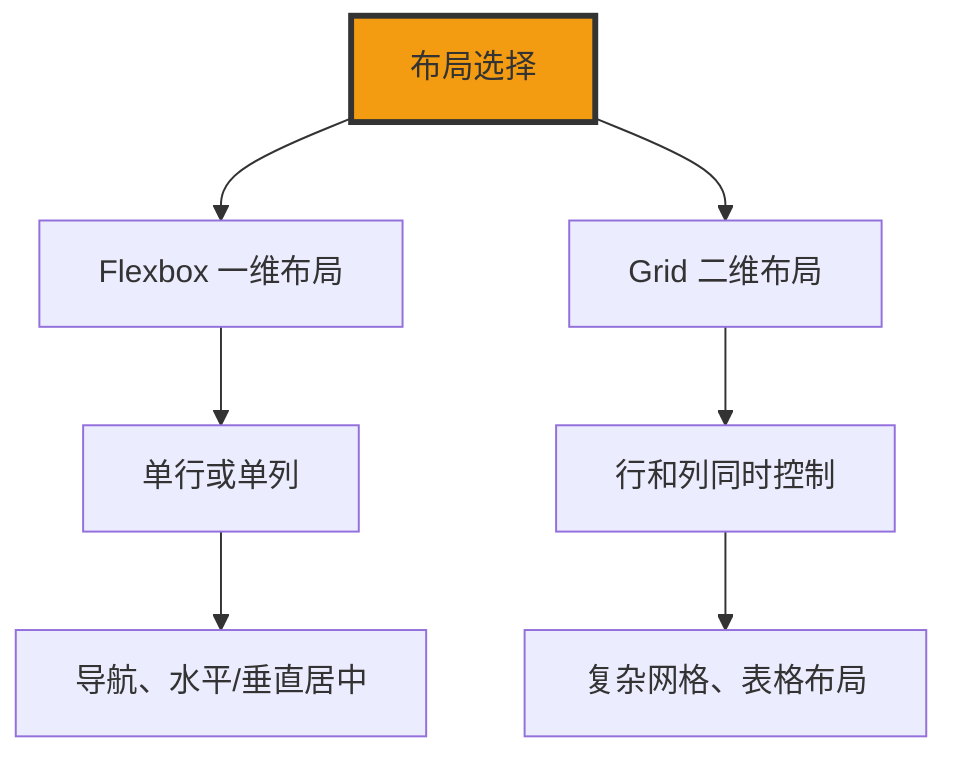

+++
title = "第23章 弹性盒子布局"
weight = 230
date = "2026-03-27T16:53:00+08:00"
type = "docs"
description = ""
isCJKLanguage = true
draft = false
+++

# 第二十三章：Flexbox 布局

> Flexbox（弹性盒布局）是 CSS3 引入的强大布局系统，它可以让你轻松实现各种对齐、分布、响应式布局。Flexbox 就像是一个"万能的盒子"，里面的物品可以自动调整位置和大小。学会 Flexbox，你就拥有了现代 CSS 布局的瑞士军刀！
>
> **警告：** 一旦学会 Flexbox，你可能会忍不住在所有地方用它——这是正常的，我们都有过这个阶段。

## 23.1 基本概念

### 23.1.1 启用——display: flex（块级容器）或 display: inline-flex（行内容器）

Flexbox 通过 `display` 属性启用。设置 `display: flex` 或 `display: inline-flex` 后，元素就变成了 Flex 容器，它的所有直接子元素都变成了 Flex 项目。

**什么是 Flexbox？**

想象一下一个弹性的收纳盒（Flex 容器），里面放了很多小盒子（Flex 项目）。收纳盒可以让小盒子自动调整位置、大小和排列方式，而不需要你一个一个去设置。

```css
/* 启用 Flexbox */

/* display: flex —— 块级容器 */
.flex-container {
  display: flex;  /* 容器本身是块级元素 */
  /* 宽度默认100%，可以设置宽高 */
}

/* display: inline-flex —— 行内容器 */
.inline-flex-container {
  display: inline-flex;  /* 容器本身是行内元素 */
  /* 宽度由内容决定 */
}
```

```html
<div class="flex-container">
  <!-- 这些子元素都变成了 Flex 项目 -->
  <div class="flex-item">项目1</div>
  <div class="flex-item">项目2</div>
  <div class="flex-item">项目3</div>
</div>
```

### 23.1.2 容器和项目——父容器是 Flex 容器，子元素（直接子元素）是 Flex 项目

Flexbox 布局有两个角色：**Flex 容器**（父元素）和 **Flex 项目**（子元素）。

```css
/* Flex 容器 */
.flex-container {
  display: flex;
  /* 容器的样式 */
}

/* Flex 项目 */
.flex-container .flex-item {
  /* 项目的样式 */
}
```

### 23.1.3 主轴和交叉轴——默认主轴是水平线（从左到右），交叉轴是垂直线（从上到下）

Flexbox 有两个轴：**主轴**（Main Axis）和**交叉轴**（Cross Axis）。

```css
/* Flexbox 的轴 */

.flex-container {
  display: flex;

  /* 默认主轴是水平方向（从左到右）*/
  /* 默认交叉轴是垂直方向（从上到下）*/

  /* 改变主轴方向 */
  flex-direction: row;           /* 水平（默认）*/
  flex-direction: row-reverse;    /* 水平反向 */
  flex-direction: column;          /* 垂直 */
  flex-direction: column-reverse; /* 垂直反向 */
}
```

```
flex-direction: row（默认）
主轴 →
交叉轴 ↓
┌─────┬─────┬─────┐
│ 项目1 │ 项目2 │ 项目3 │
└─────┴─────┴─────┘

flex-direction: column
主轴 ↓
交叉轴 →
┌─────────────┐
│    项目1      │
├─────────────┤
│    项目2      │
├─────────────┤
│    项目3      │
└─────────────┘
```

## 23.2 容器属性

### 23.2.1 flex-direction——row（默认，从左到右）/ row-reverse（从右到左）/ column（从上到下）/ column-reverse（从下到上）

`flex-direction` 决定主轴的方向，也就是 Flex 项目的排列方向。

```css
/* flex-direction 的四个值 */

/* row —— 主轴水平，从左到右（默认）*/
.direction-row {
  flex-direction: row;
}

/* row-reverse —— 主轴水平，从右到左 */
.direction-row-reverse {
  flex-direction: row-reverse;
}

/* column —— 主轴垂直，从上到下 */
.direction-column {
  flex-direction: column;
}

/* column-reverse —— 主轴垂直，从下到上 */
.direction-column-reverse {
  flex-direction: column-reverse;
}
```

```
flex-direction 对比：
┌──────────────────────────────────────┐
│                                      │
│  row:           项目1 → 项目2 → 项目3  │
│                                      │
│  row-reverse:  项目3 ← 项目2 ← 项目1  │
│                                      │
│  column:        项目1                 │
│                    ↓                 │
│                 项目2                 │
│                    ↓                 │
│                 项目3                 │
│                                      │
│  column-reverse: 项目3                │
│                    ↑                 │
│                 项目2                 │
│                    ↑                 │
│                 项目1                 │
│                                      │
└──────────────────────────────────────┘
```

### 23.2.2 flex-wrap——nowrap（默认，不换行项目会被压缩）/ wrap（换行，第一行在上方）/ wrap-reverse（换行，第一行在下方）

`flex-wrap` 决定 Flex 项目是否换行以及换行的方向。

> 💡 记忆技巧：`nowrap` 就是"给我硬塞，塞不下也得塞！"——直到溢出（overflow）成为你的新朋友。

```css
/* flex-wrap 的三个值 */

/* nowrap —— 不换行（默认）*/
.no-wrap {
  flex-wrap: nowrap;
  /* 项目会被压缩以适应容器宽度 */
}

/* wrap —— 换行，第一行在上方 */
.wrap {
  flex-wrap: wrap;
  /* 放不下时自动换行 */
}

/* wrap-reverse —— 换行，第一行在下方 */
.wrap-reverse {
  flex-wrap: wrap-reverse;
  /* 换行方向反转 */
}
```

```
flex-wrap 效果：

nowrap（不换行）：
┌─────────────────────────────────────┐
│ 项目1 │ 项目2 │ 项目3 │ 项目4 │ 项目5 │ → 溢出
└─────────────────────────────────────┘

wrap（换行）：
┌────────────────────────┐
│ 项目1 │ 项目2 │ 项目3 │
├────────────────────────┤
│ 项目4 │ 项目5 │       │
└────────────────────────┘

wrap-reverse（换行反转）：
┌────────────────────────┐
│ 项目4 │ 项目5 │       │
├────────────────────────┤
│ 项目1 │ 项目2 │ 项目3 │
└────────────────────────┘
```

### 23.2.3 flex-flow——flex-direction 和 flex-wrap 的缩写

```css
/* flex-flow 是 flex-direction 和 flex-wrap 的缩写 */

/* 完整写法 */
.manual {
  flex-direction: row;
  flex-wrap: wrap;
}

/* 缩写写法 */
.shorthand {
  flex-flow: row wrap;  /* direction: row, wrap: wrap */
}

/* 默认值 */
.default {
  flex-flow: row nowrap;  /* 默认值 */
}
```

### 23.2.4 justify-content——主轴对齐方式，flex-start（靠主轴起点，默认）/ flex-end（靠主轴终点）/ center（居中）/ space-between（两端对齐，项目之间间距相等）/ space-around（每个项目两侧间距相等，项目之间间距是两侧间距的两倍）/ space-evenly（项目之间和两侧间距完全相等）

`justify-content` 决定 Flex 项目在主轴上的对齐方式。

```css
/* justify-content 的六个值 */

/* flex-start —— 靠主轴起点（默认）*/
.justify-start {
  justify-content: flex-start;
}

/* flex-end —— 靠主轴终点 */
.justify-end {
  justify-content: flex-end;
}

/* center —— 居中 */
.justify-center {
  justify-content: center;
}

/* space-between —— 两端对齐，项目之间间距相等 */
.justify-between {
  justify-content: space-between;
}

/* space-around —— 两侧间距相等，项目之间间距是两侧间距的两倍 */
.justify-around {
  justify-content: space-around;
}

/* space-evenly —— 项目之间和两侧间距完全相等 */
.justify-evenly {
  justify-content: space-evenly;
}
```

```
justify-content 效果（主轴为水平）：
┌─────────────────────────────────────┐
│ flex-start:    │项目1│项目2│项目3│     │
│ flex-end:      │     │项目1│项目2│项目3│
│ center:        │  │项目1│项目2│项目3│  │
│ space-between: │项目1│项目2│项目3│    │
│ space-around:  │ 项目1│项目2│项目3 │   │
│ space-evenly: │  项目1│项目2│项目3  │  │
└─────────────────────────────────────┘
```

### 23.2.5 align-items——交叉轴单行对齐方式，stretch（项目被拉伸到容器高度，默认，但项目不能有固定高度）/ flex-start（交叉轴起点对齐）/ flex-end（交叉轴终点对齐）/ center（居中对齐）/ baseline（按项目内文字基线对齐）

`align-items` 决定 Flex 项目在交叉轴上的对齐方式。

```css
/* align-items 的五个值 */

/* stretch —— 拉伸到容器高度（默认）*/
.align-stretch {
  align-items: stretch;  /* 默认值 */
}

/* flex-start —— 靠交叉轴起点对齐 */
.align-start {
  align-items: flex-start;
}

/* flex-end —— 靠交叉轴终点对齐 */
.align-end {
  align-items: flex-end;
}

/* center —— 居中对齐 */
.align-center {
  align-items: center;
}

/* baseline —— 按文字基线对齐 */
.align-baseline {
  align-items: baseline;
}
```

```
align-items 效果（交叉轴为垂直方向）：
┌─────────────────────────────────────┐
│ stretch    │项目1│ （拉伸到容器高度）│
│            │项目2│                   │
├─────────────────────────────────────┤
│ flex-start │项目1│ （靠顶部对齐）    │
├─────────────────────────────────────┤
│ flex-end   │   项目1│ （靠底部对齐）│
│            │   项目2│               │
├─────────────────────────────────────┤
│ center     │  项目1│ （垂直居中）   │
│            │  项目2│                │
├─────────────────────────────────────┤
│ baseline   │项目A│ （文字基线对齐） │
│            │ B  │                   │
└─────────────────────────────────────┘
```

### 23.2.6 align-content——交叉轴多行对齐方式，需要 flex-wrap:wrap 且有多行（总宽度超过容器宽度），值与 align-items 类似

`align-content` 只在 `flex-wrap: wrap` 且有多行时才会生效。

> ⚠️ `align-content` 是一个"挑剔"的属性——你必须同时满足 `flex-wrap: wrap` **和** 多行两个条件，它才肯工作。少了任何一个，它就装作没看见（不生效）。

```css
/* align-content 的六个值 */

/* stretch —— 拉伸每行（默认）*/
.content-stretch {
  align-content: stretch;
}

/* flex-start —— 靠交叉轴起点 */
.content-start {
  align-content: flex-start;
}

/* flex-end —— 靠交叉轴终点 */
.content-end {
  align-content: flex-end;
}

/* center —— 居中 */
.content-center {
  align-content: center;
}

/* space-between —— 两端对齐 */
.content-between {
  align-content: space-between;
}

/* space-around —— 两侧间距相等 */
.content-around {
  align-content: space-around;
}
```

```
align-content 效果（多行时交叉轴对齐）：
┌─────────────────────────────────────┐
│ flex-start: │ 项目1 │ 项目2 │       │
│             │ 项目3 │ 项目4 │       │
├─────────────────────────────────────┤
│ flex-end:   │       │ 项目1 │ 项目2 │
│             │       │ 项目3 │ 项目4 │
├─────────────────────────────────────┤
│ center:     │       │ 项目1 │       │
│             │       │ 项目3 │       │
├─────────────────────────────────────┤
│ space-between:│项目1│项目2│项目3│   │
│             │项目4│                │
├─────────────────────────────────────┤
│ space-around: │ 项目1 │ 项目2 │    │
│             │ 项目3 │ 项目4 │      │
└─────────────────────────────────────┘
注意：align-content 只有在 flex-wrap:wrap 且项目换行后才生效！
```

### 23.2.7 gap——项目之间的间距（2021 年起 Flexbox 全面支持 gap），row-gap（行间距）column-gap（列间距）gap（缩写）

```css
/* gap 属性设置项目间距 */

/* 设置行间距和列间距 */
.gap-example {
  display: flex;
  flex-wrap: wrap;
  gap: 20px;           /* 同时设置行列间距 */
  /* 等于 gap: 20px 20px; */
}

/* 分别设置行列间距 */
.row-col-gap {
  display: flex;
  flex-wrap: wrap;
  row-gap: 30px;      /* 行间距30px */
  column-gap: 10px;    /* 列间距10px */
}
```

## 23.3 项目属性

### 23.3.1 flex-grow——放大比例，默认 0 不放大，设为 1 则吸收所有剩余空间（每个项目都设 1 则等分）

`flex-grow` 决定 Flex 项目如何分配剩余空间。

> 💰 `flex-grow` 就像是"剩余空间的资本主义"——默认谁也不分（0），但只要你愿意（设为 1 或更大），就可以贪婪地吸收剩余空间。如果所有人（所有项目）都 `flex-grow: 1`，那叫共产主义——等分剩余空间。

```css
/* flex-grow 的用法 */

.flex-container {
  display: flex;
  width: 800px;
}

.flex-item {
  width: 100px;
  /* 默认 flex-grow: 0，不放大 */
}

/* flex-grow: 1 的项目会占据剩余空间 */
.grow-item {
  flex-grow: 1;  /* 吸收剩余空间 */
}
```

```
flex-grow 效果：
容器宽度 800px，项目1和2各100px，项目3 flex-grow: 1
┌─────┬─────┬─────────────────┐
│ 100 │ 100 │     600        │
│项目1 │项目2 │   项目3(grow) │
└─────┴─────┴─────────────────┘
```

### 23.3.2 flex-shrink——缩小比例，默认 1 可缩小，设为 0 不缩小（可能导致溢出）

`flex-shrink` 决定 Flex 项目如何收缩以适应容器空间。

> 🔥 血泪教训：如果你不希望项目被压缩，`flex-shrink: 0` 是你的好朋友。但小心——它也可能带来溢出（overflow）这位不速之客。

```css
/* flex-shrink 的用法 */

.shrink-item {
  flex-shrink: 0;  /* 不收缩，可能导致溢出 */
}

.normal-shrink {
  flex-shrink: 1;  /* 默认值，可收缩 */
}
```

### 23.3.3 flex-basis——项目在主轴上的初始大小，默认 auto（按项目自身尺寸或内容尺寸）

`flex-basis` 决定 Flex 项目在分配剩余空间之前的初始大小。

```css
/* flex-basis 的用法 */

.basis-item {
  flex-basis: 200px;  /* 初始大小200px */
}

.basis-auto {
  flex-basis: auto;  /* 默认值，按自身尺寸 */
}
```

### 23.3.4 flex——推荐写法，flex:1（等于 flex:1 1 0%），flex:auto（等于 flex:1 1 auto），flex:none（等于 flex:0 0 auto）

`flex` 是 `flex-grow`、`flex-shrink`、`flex-basis` 的缩写。

```css
/* flex 缩写 */

/* flex: 1 —— 平均分配，等分剩余空间 */
.equal-share {
  flex: 1;
  /* 等于 flex: 1 1 0% */
  /* 初始大小为0，然后所有项目等分剩余空间 */
}

/* flex: auto —— 自动计算大小，可放大可缩小 */
.auto-flex {
  flex: auto;
  /* 等于 flex: 1 1 auto */
  /* 初始大小由内容决定，再分配剩余空间 */
}

/* flex: none —— 不参与空间分配，保持固定大小 */
.fixed-flex {
  flex: none;
  /* 等于 flex: 0 0 auto */
  /* 不参与放大和缩小，保持内容尺寸 */
}

/* flex: 1 2 —— grow=1, shrink=2, basis=0% */
.mixed-flex {
  flex: 1 2;
  /* 等于 flex: 1 2 0% */
}
```

### 23.3.5 align-self——单独覆盖容器的 align-items

```css
/* align-self 覆盖容器的 align-items */

.container {
  display: flex;
  align-items: flex-start;  /* 默认所有项目靠上 */
}

.special-item {
  align-self: flex-end;  /* 这个项目单独靠下 */
}
```

### 23.3.6 order——项目排列顺序，数值越小越靠前，默认 0（可以为负数）

```css
/* order 改变项目排列顺序 */

.item-1 { order: 3; }  /* 最后显示 */
.item-2 { order: 1; }  /* 第二显示 */
.item-3 { order: 2; }  /* 第三显示 */
/* 默认 order: 0，按 HTML 顺序显示 */
```

## 23.4 Flexbox 固定搭配

### 23.4.1 水平居中——justify-content: center

```css
.center-horizontal {
  display: flex;
  justify-content: center;
}
```

### 23.4.2 垂直居中——align-items: center

```css
.center-vertical {
  display: flex;
  align-items: center;
  height: 300px;
}
```

### 23.4.3 水平垂直同时居中——justify-content: center + align-items: center

```css
.center-both {
  display: flex;
  justify-content: center;
  align-items: center;
  height: 300px;
}
```

### 23.4.4 导航栏左中右布局——justify-content: space-between，左中右三个区

```css
.nav-bar {
  display: flex;
  justify-content: space-between;
  align-items: center;
  height: 60px;
  padding: 0 20px;
  background-color: white;
  box-shadow: 0 2px 10px rgba(0, 0, 0, 0.1);
}

.nav-logo {
  font-weight: bold;
  font-size: 20px;
}

.nav-links {
  display: flex;
  gap: 20px;
}

.nav-actions {
  display: flex;
  gap: 10px;
}
```

```html
<nav class="nav-bar">
  <div class="nav-logo">Logo</div>
  <div class="nav-links">
    <a href="#">首页</a>
    <a href="#">产品</a>
    <a href="#">关于</a>
  </div>
  <div class="nav-actions">
    <button>登录</button>
  </div>
</nav>
```

### 23.4.5 底部固定栏——父容器 display:flex; flex-direction:column; min-height:100vh; main{flex:1}

```css
.page-layout {
  display: flex;
  flex-direction: column;
  min-height: 100vh;
}

.header {
  height: 60px;
  background-color: #3498db;
}

.main {
  flex: 1;  /* 占据所有剩余空间 */
  background-color: #f8f9fa;
}

.footer {
  height: 50px;
  background-color: #2c3e50;
}
```

### 23.4.6 均等分列——每个项目 flex: 1

```css
.equal-columns {
  display: flex;
  gap: 20px;
}

.equal-columns > * {
  flex: 1;  /* 每个项目等分空间 */
}
```

### 23.4.7 流式卡片列表——flex-wrap:wrap + 每个卡片设置 flex-basis

```css
.card-grid {
  display: flex;
  flex-wrap: wrap;
  gap: 20px;
}

.card {
  flex: 1 1 300px;  /* 可放大可缩小，最小300px */
  background-color: white;
  border-radius: 8px;
  padding: 20px;
  box-shadow: 0 2px 8px rgba(0, 0, 0, 0.1);
}
```

## 23.5 Flexbox 常见坑（避坑指南🕳️）

### 23.5.1 flex-basis:auto 和 flex-basis:0 的区别——auto 先按项目自身尺寸或内容尺寸，再处理剩余空间；0 完全不参考自身尺寸，直接按 flex-grow 比例分配

> 🤔 `flex-basis: 0` vs `auto` 是一个经典的"面试题"——也是新人最容易踩的坑之一。记住：0 = 不管你内容多宽，我只按比例分；auto = 先看看你有多宽，再分剩下的。

```css
/* flex-basis: auto（默认）*/
.auto-basis {
  flex: 1 1 auto;  /* 先看项目自身尺寸，再分配 */
}

/* flex-basis: 0 */
.zero-basis {
  flex: 1 1 0%;  /* 完全按 flex-grow 比例分配 */
}
```

### 23.5.2 flex-shrink 默认为 1——内容可能被压缩，设 flex-shrink:0 可防止

```css
/* 默认 flex-shrink: 1，内容可能被压缩 */
.shrink-warning {
  flex-shrink: 1;  /* 默认值 */
}

/* 防止压缩 */
.no-shrink {
  flex-shrink: 0;  /* 不压缩，保持原尺寸 */
}
```

### 23.5.3 align-content 不生效——必须满足 flex-wrap:wrap 且有多行（项目总宽度超过容器宽度）

```css
/* align-content 生效的条件 */
.align-content-works {
  display: flex;
  flex-wrap: wrap;  /* 必须换行 */
  /* 且项目总宽度超过容器宽度 */
  align-content: center;
}
```

### 23.5.4 项目没有设置宽高时 stretch 不生效——需要项目没有设置固定高度（交叉轴方向）才能被拉伸

```css
/* stretch 生效的条件 */
.stretch-works {
  align-items: stretch;  /* 默认值 */
}

.stretch-works .item {
  /* 不能有固定高度 */
  /* height: 100px; ← 这会让 stretch 失效 */
}
```

---

## 本章小结

恭喜你完成了第二十三章的学习！让我们来回顾一下 Flexbox 的核心知识：

### 核心知识点

| 容器属性 | 说明 |
|----------|------|
| display | flex 或 inline-flex |
| flex-direction | 主轴方向 |
| flex-wrap | 是否换行 |
| justify-content | 主轴对齐 |
| align-items | 交叉轴对齐（单行）|
| align-content | 交叉轴对齐（多行）|
| gap | 项目间距 |

### 项目属性

| 项目属性 | 说明 |
|----------|------|
| flex-grow | 放大比例 |
| flex-shrink | 缩小比例 |
| flex-basis | 初始大小 |
| flex | 缩写 |
| align-self | 单独覆盖对齐 |
| order | 排列顺序 |

### Flexbox vs Grid



### 下章预告

下一章我们将学习 Grid 布局，这是 CSS 布局的"全局规划师"！如果说 Flexbox 是一个专注单行/单列的专家，那 Grid 就是能同时统筹行和列的霸道总裁。准备好了吗？


