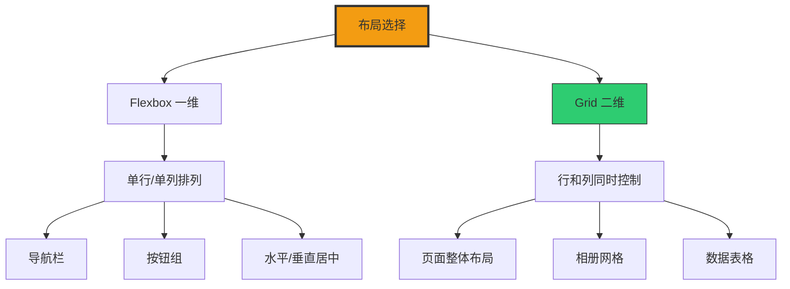

+++
title = "第24章 网格布局"
weight = 240
date = "2026-03-27T16:53:00+08:00"
type = "docs"
description = ""
isCJKLanguage = true
draft = false
+++

# 第二十四章：Grid 布局

> 想象一下，如果你要布置一个房间，你会怎么做？买好家具之后，是不是要决定沙发放哪儿、电视放哪儿、茶几放哪儿？Grid 布局就是 CSS 给你的"房间布置图"——你可以精确地决定每一个元素该放在哪一行、哪一列。就像城市规划师一样，你现在是 CSS 布局的城市规划师！Flexbox 是单行道，只能往一个方向走；Grid 则是十字路口，行和列同时控制，这就是二维布局的威力！

## 24.1 基本概念

### 24.1.1 启用——display: grid（块级网格）或 display: inline-grid（行内网格）

Grid 布局的开启方式和 Flexbox 类似，只需要给父容器加上 `display: grid` 或 `display: inline-grid` 即可。一旦开启，整个布局世界就变得规整起来——元素不再随心所欲地乱跑，而是乖乖地排列在你画好的网格里。

**什么是 Grid 布局？**

打个比方，Grid 就像是Excel表格——有行有列，每个格子都有固定的地址。你只需要告诉元素"你住第1行第2列"，它就会乖乖搬过去。而 Flexbox 更像是俄罗斯方块——元素一个挨着一个排列，但没有固定的网格线。

```css
/* Grid 布局需要先在父容器上开启 */
.grid-container {
  /* display: grid 会让容器变成"网格容器" */
  /* 容器本身还是块级元素，会占据一整行 */
  display: grid;

  /* 设置列宽 */
  grid-template-columns: 200px 200px 200px;

  /* 设置行高 */
  grid-template-rows: 100px 100px 100px;

  /* 行列之间的间距 */
  gap: 20px;
}

/* display: inline-grid 则不同 */
.inline-grid-container {
  display: inline-grid;

  /* 它不会占据一整行 */
  /* 宽度由内容决定，像行内元素一样 */
  grid-template-columns: 150px 150px;
  gap: 10px;
}
```

```html
<!-- 使用 Grid 布局的典型结构 -->
<div class="grid-container">
  <div class="grid-item">单元格1</div>
  <div class="grid-item">单元格2</div>
  <div class="grid-item">单元格3</div>
  <div class="grid-item">单元格4</div>
  <div class="grid-item">单元格5</div>
  <div class="grid-item">单元格6</div>
</div>
```

**什么时候用 `grid` vs `inline-grid`？**

```css
/* grid —— 块级网格，占据一整行 */
.full-width-grid {
  display: grid;
  /* 宽度默认100%，适合作为页面主布局 */
  grid-template-columns: repeat(3, 1fr);
}

/* inline-grid —— 行内网格，宽度由内容决定 */
.inline-width-grid {
  display: inline-grid;
  /* 适合放在文字中间的小网格 */
  grid-template-columns: 50px 50px 50px;
}
```

> 💡 **小贴士**：`display: grid` 是最常用的开启方式，因为它会自动填满容器宽度，方便我们做响应式布局。

### 24.1.2 与 Flexbox 的区别——Flexbox 是一维布局（单行或单列），Grid 是二维布局（行和列同时控制）

这是一个经常被问到的问题：Grid 和 Flexbox 有什么区别？我应该用哪个？

**用生活例子来解释**

想象你要摆一排椅子（Flexbox）vs 布置一个教室（Grid）：

- **Flexbox**：你有一排椅子，只需要决定它们怎么排——靠左、靠右、居中、均匀分布。这一排椅子可以伸缩，但只有一排。
- **Grid**：你有一个教室，要决定每排有几张桌子、每列有多宽、哪个学生坐哪个位置。行列同时控制。

```css
/* Flexbox 适合的场景：一维分布 */
.flex-nav {
  display: flex;
  /* 导航栏只需要水平排列，不需要关心"行"的概念 */
  justify-content: space-between;
  align-items: center;
  height: 60px;
}

/* Grid 适合的场景：二维分布 */
.grid-dashboard {
  display: grid;
  /* 仪表盘需要同时控制行和列 */
  grid-template-columns: 200px 1fr 200px;
  grid-template-rows: auto 1fr auto;
  height: 100vh;
}
```

```
Flexbox（Flexbox 一维布局）：
┌─────────────────────────────────────┐
│  Logo    导航菜单        登录按钮  │
└─────────────────────────────────────┘
  → 只需要控制水平方向

Grid（Grid 二维布局）：
┌─────────┬─────────────────┬─────────┐
│         │                 │         │
│  侧边栏  │      主内容      │  小工具  │
│         │                 │         │
│         ├─────────────────┤         │
│         │                 │         │
│         │                 │         │
└─────────┴─────────────────┴─────────┘
  → 同时控制行和列
```

**什么时候用 Flexbox？什么时候用 Grid？**

```css
/* 用 Flexbox：*/
/* 1. 导航栏、按钮组、水平居中 */
.navbar {
  display: flex;
  justify-content: space-between;
}

/* 2. 垂直居中 */
.center-wrapper {
  display: flex;
  align-items: center;
  justify-content: center;
  height: 100vh;
}

/* 3. 卡片列表（自动换行）*/
.card-list {
  display: flex;
  flex-wrap: wrap;
  gap: 20px;
}

/* 用 Grid：*/
/* 1. 页面整体布局 */
.page-layout {
  display: grid;
  grid-template-areas:
    "header header"
    "sidebar main"
    "footer footer";
  grid-template-rows: auto 1fr auto;
}

/* 2. 数据表格、相册网格 */
.photo-grid {
  display: grid;
  grid-template-columns: repeat(auto-fill, minmax(200px, 1fr));
  gap: 16px;
}

/* 3. 需要精确控制元素位置 */
.exact-placement {
  display: grid;
  grid-template-columns: 1fr 2fr;
}

.featured-item {
  grid-column: 1 / 3;  /* 横跨整行 */
}
```

> 💡 **小贴士**：实际上，Flexbox 和 Grid 可以完美配合使用。用 Grid 做整体页面骨架，用 Flexbox 做组件内部布局，这是现代 CSS 布局的最佳实践！

## 24.2 容器属性

### 24.2.1 grid-template-columns——定义列宽

`grid-template-columns` 决定了你的网格有多少列、每列有多宽。这是 Grid 布局中最常用的属性之一。

**基本语法**

```css
/* 直接写死每列宽度 */
.fixed-columns {
  display: grid;
  grid-template-columns: 200px 300px 200px;
  /* 三列，分别是200px、300px、200px */
}

/* 使用 repeat() 函数简化 */
.repeated-columns {
  display: grid;
  grid-template-columns: repeat(3, 200px);
  /* 三列，每列200px，等于 200px 200px 200px */
}
```

```html
<div class="fixed-columns">
  <div>第一列 200px</div>
  <div>第二列 300px</div>
  <div>第三列 200px</div>
</div>
```

**fr 单位——Grid 专属的比例单位**

`fr` 是"fraction（分数）"的缩写，它是 Grid 布局中最神奇的单位，代表"可用空间的等分"。

```css
/* fr 单位的魔力 */
.equal-columns {
  display: grid;
  grid-template-columns: 1fr 1fr 1fr;
  /* 三列等宽，各占可用空间的1/3 */
  gap: 20px;
}

.ratio-columns {
  display: grid;
  grid-template-columns: 1fr 2fr 1fr;
  /* 三列，比例是1:2:1 */
  /* 如果容器宽度是1000px，则分别是250px、500px、250px */
  gap: 20px;
}
```

```
fr 单位计算示意（容器宽度1000px，间距20px × 3 = 60px，因为有4条隐式网格线产生3个间距）：
可用空间 = 1000 - 60 = 940px

1fr 2fr 1fr 比例总和 = 1 + 2 + 1 = 4
第一列 = 940 × 1/4 = 235px
第二列 = 940 × 2/4 = 470px
第三列 = 940 × 1/4 = 235px
```

**响应式神器：auto-fill 和 auto-fit**

这两个关键字让 Grid 布局变得超级响应式，完全不需要媒体查询！

```css
/* auto-fill：尽可能多地填充列 */
.auto-fill-grid {
  display: grid;
  /* 每列至少200px，自动计算能放几列 */
  grid-template-columns: repeat(auto-fill, minmax(200px, 1fr));
  gap: 20px;
  /* 容器变宽就自动增加列数 */
}

/* auto-fit：和 auto-fill 类似，但空列会塌陷 */
.auto-fit-grid {
  display: grid;
  grid-template-columns: repeat(auto-fit, minmax(200px, 1fr));
  gap: 20px;
  /* 当内容撑不满时，auto-fit 会让列合并 */
}
```

```html
<!-- auto-fill vs auto-fit 的区别 -->
<div class="auto-fill-grid">
  <!-- auto-fill：保持列的位置，即使没有内容 -->
  <div>1</div>
  <div>2</div>
</div>
<!-- 如果只有2个元素，auto-fill 会留出第3列的位置 -->

<div class="auto-fit-grid">
  <div>1</div>
  <div>2</div>
</div>
<!-- 如果只有2个元素，auto-fit 会让它们自动扩展填满 -->
```

> 💡 **小贴士**：大多数情况下用 `auto-fit` 比 `auto-fill` 更实用，因为它会自动适应内容数量。

### 24.2.2 grid-template-rows——定义行高

`grid-template-rows` 和 `grid-template-columns` 类似，只不过控制的是行的高度。

```css
/* 固定行高 */
.fixed-rows {
  display: grid;
  grid-template-rows: 100px 200px 100px;
  /* 三行，分别是100px、200px、100px */
}

/* 使用 minmax() 灵活设置 */
.flexible-rows {
  display: grid;
  grid-template-rows: minmax(100px, auto) 1fr minmax(80px, auto);
  /* 第一行最小100px，最大自适应 */
  /* 第二行占据剩余空间 */
  /* 第三行最小80px，最大自适应 */
}
```

### 24.2.3 grid-template-areas——用命名区域构建布局

这是 Grid 最酷的功能之一——你可以用文字描述布局！

```css
/* 用文字"画"出布局 */
.page-layout {
  display: grid;
  grid-template-areas:
    "header header header"    /* 第一行：header占满 */
    "sidebar main aside"      /* 第二行：sidebar、main、aside */
    "footer footer footer";   /* 第三行：footer占满 */
  grid-template-rows: 60px 1fr 50px;  /* 行高分别是60px、1fr、50px */
  grid-template-columns: 200px 1fr 200px;  /* 列宽分别是200px、1fr、200px */
  min-height: 100vh;
  gap: 1px;
  background-color: #eee;  /* gap的颜色 */
}

/* 告诉每个元素它属于哪个区域 */
.page-header {
  grid-area: header;    /* 对应 header */
  background: #3498db;
}

.page-sidebar {
  grid-area: sidebar;  /* 对应 sidebar */
  background: #2ecc71;
}

.page-main {
  grid-area: main;      /* 对应 main */
  background: white;
}

.page-aside {
  grid-area: aside;     /* 对应 aside */
  background: #f39c12;
}

.page-footer {
  grid-area: footer;    /* 对应 footer */
  background: #34495e;
  color: white;
}
```

```html
<div class="page-layout">
  <header class="page-header">我是头部，会横跨整行</header>
  <aside class="page-sidebar">我是侧边栏</aside>
  <main class="page-main">我是主内容区</main>
  <aside class="page-aside">我是右边栏</aside>
  <footer class="page-footer">我是底部，会横跨整行</footer>
</div>
```

**grid-template-areas 可视化**

```
你写的代码：
grid-template-areas:
  "header header header"
  "sidebar main aside"
  "footer footer footer";

实际效果：
┌─────────┬─────────┬─────────┐
│           header              │
├─────────┼─────────┼─────────┤
│  sidebar │   main  │  aside  │
├─────────┼─────────┼─────────┤
│           footer              │
└─────────┴─────────┴─────────┘
```

### 24.2.4 grid-auto-columns / rows——控制隐式网格尺寸

当你的 HTML 内容比 grid-template 定义的多时，Grid 会自动创建"隐式"行或列。`grid-auto-columns` 和 `grid-auto-rows` 就是用来控制这些自动创建的行列尺寸的。

```css
/* 场景：你的内容可能有10个，但只定义了3个 */
.auto-columns-grid {
  display: grid;
  /* 只定义了3列，每列1fr */
  grid-template-columns: repeat(3, 1fr);
  /* 但内容可能有20个div！ */

  /* 隐式列的宽度控制 */
  grid-auto-columns: 150px;
  /* 超出3列的内容，每列宽度150px */
}

/* 隐式行的高度控制 */
.auto-rows-grid {
  display: grid;
  grid-template-rows: 100px 100px;
  /* 只定义2行 */

  /* 隐式行的高度控制 */
  grid-auto-rows: 80px;
  /* 超出2行的内容，每行高度80px */
}
```

### 24.2.5 grid-auto-flow——row（按行排列，默认）/ column（按列排列）/ dense（自动填充空位）

`grid-auto-flow` 控制元素如何流入网格。

```css
/* 默认：按行排列 */
.row-flow {
  display: grid;
  grid-template-columns: repeat(3, 1fr);
  grid-auto-flow: row;  /* 默认值 */
  /* 元素填满一行再去下一行 */
}

/* 按列排列 */
.column-flow {
  display: grid;
  grid-template-columns: repeat(2, 1fr);  /* 先定义2列 */
  grid-auto-flow: column;                 /* 然后告诉 Grid 按列填充 */
  /* 元素填满第1列的3个格子，再去第2列的3个格子 */
}

/* 开启自动填充（自动填满空位）*/
.dense-flow {
  display: grid;
  grid-template-columns: repeat(3, 1fr);
  grid-auto-flow: dense;
  /* 如果有元素位置空出来，会自动尝试用后面的元素填充 */
}
```

### 24.2.6 grid-template 缩写——grid-template: rows / columns

```css
/* 完整写法 */
.full-grid {
  display: grid;
  grid-template-columns: 200px 1fr 200px;
  grid-template-rows: auto 1fr auto;
  gap: 20px;
}

/* 缩写写法 */
.shorthand-grid {
  display: grid;
  /* rows / columns */
  grid-template:
    auto 1fr auto / 200px 1fr 200px;
  gap: 20px;
}
```

## 24.3 单位与函数

### 24.3.1 fr 单位——相对于可用空间的分数

`fr` 是 Grid 布局的灵魂单位，它代表"可用空间的等分"。

```css
/* fr 的工作原理 */
.fr-magic {
  display: grid;
  grid-template-columns: 1fr 2fr 1fr;
  /* 假设容器宽度是 1000px，gap 是 40px（20px × 2）*/
  gap: 20px;
  /* 可用空间 = 1000 - 40 = 960px */
  /* 比例总和 = 1 + 2 + 1 = 4 */
  /* 第一列 = 960 × 1/4 = 240px */
  /* 第二列 = 960 × 2/4 = 480px */
  /* 第三列 = 960 × 1/4 = 240px */
}
```

**fr 和固定单位混用**

```css
/* 混用 fr 和固定单位 */
.mixed-columns {
  display: grid;
  grid-template-columns: 250px 1fr 1fr;
  /* 左侧边栏固定250px，右侧两列平分剩余空间 */
  /* 如果容器1200px，剩余空间 = 1200 - 250 - 40(gap) = 910px */
  /* 第二列 = 910 × 1/2 = 455px */
  /* 第三列 = 910 × 1/2 = 455px */
  /* 注意：这里的 1fr 不是 250px，而是平分 910px 后的 455px！ */
}
```

### 24.3.2 minmax(min, max)——定义尺寸范围

`minmax()` 函数让你可以设置一个"最小到最大"的范围。翻译成人话就是："别小于 X，别大于 Y，自己看着办！"

```css
/* minmax(最小值, 最大值) */
.minmax-grid {
  display: grid;
  grid-template-columns: minmax(200px, 1fr) 1fr;
  /* 第一列：最小200px，最大能有多宽就多宽（1fr）*/
  /* 第二列：平分剩余空间 */
}

/* 常用组合：minmax(auto, 300px) */
.self-adjust {
  display: grid;
  grid-template-columns: minmax(auto, 300px) 1fr;
  /* 第一列：由内容决定宽度，但最多300px（内容少就窄，内容多也不超过300px）*/
  /* 适合那种"窄了不行、宽了也没用"的场景 */
}
```

**实际应用：响应式列**

```css
/* 最经典的响应式 Grid */
.responsive-grid {
  display: grid;
  grid-template-columns: repeat(auto-fit, minmax(250px, 1fr));
  gap: 20px;
  /* 每列最小250px，自动计算能放几列 */
  /* 容器变窄就自动换行，不需要媒体查询 */
}
```

### 24.3.3 auto-fill 和 auto-fit——自动填充

这两个是 Grid 响应式的神器，但它们有微妙的区别。

```css
/* auto-fill：尽可能多地填充列，保留空列位置 */
.auto-fill-demo {
  display: grid;
  grid-template-columns: repeat(auto-fill, minmax(150px, 1fr));
  gap: 20px;
}

/* auto-fit：自动扩展填满可用空间 */
.auto-fit-demo {
  display: grid;
  grid-template-columns: repeat(auto-fit, minmax(150px, 1fr));
  gap: 20px;
}
```

```
auto-fill vs auto-fit 对比（容器宽度800px，3个元素，每个minmax 150px）：

auto-fill（保留空列）：
┌────────┬────────┬────────┬────────┐
│  元素1  │  元素2  │  元素3  │  (空列) │
└────────┴────────┴────────┴────────┘

auto-fit（自动扩展）：
┌─────────────────┬─────────────────┐
│     元素1        │     元素2        │
├─────────────────┴─────────────────┤
│              元素3                   │
└───────────────────────────────────┘
```

### 24.3.4 min-content / max-content——内容的最小/最大尺寸

```css
/* 根据内容自适应 */
.content-grid {
  display: grid;
  grid-template-columns: min-content max-content 1fr;
  /* 第一列宽度由最长内容决定 */
  /* 第二列宽度由内容决定 */
  /* 第三列平分剩余 */
}
```

## 24.4 项目定位

### 24.4.1 grid-column-start / end——列线定位

Grid 有"网格线"，每条线都有编号（1、2、3...）。

```css
/* 定位到特定网格线 */
.special-item {
  grid-column-start: 1;  /* 从第1条线开始 */
  grid-column-end: 3;      /* 到第3条线结束（跨2列）*/
}
```

```
网格线编号示意（3列4行）：
     1      2      3      4
   ┌──────┬──────┬──────┐
1  │      │      │      │
   ├──────┼──────┼──────┤
2  │      │ 跨2列│      │
   │      │ (1→3)│      │
   └──────┴──────┴──────┘
```

### 24.4.2 grid-row-start / end——行线定位

```css
/* 跨2行 */
.vertical-span {
  grid-row-start: 1;
  grid-row-end: 3;  /* 从第1行到第3行（跨2行）*/
}
```

### 24.4.3 grid-column / grid-row 缩写

```css
/* 缩写语法 */
.shorthand-item {
  /* grid-column: 开始线 / 结束线; */
  grid-column: 1 / 3;  /* 从第1线到第3线 */
  grid-row: 1 / 2;    /* 从第1行到第2行 */
}

/* 使用 span 关键字 */
.span-item {
  grid-column: 1 / span 2;  /* 从第1线开始，跨2列 */
  grid-row: span 3;         /* 跨3行 */
}
```

### 24.4.4 span 关键字——跨越列/行

```css
/* span 关键字让计算更简单 */
.span-examples {
  /* 从当前列开始，跨2列 */
  grid-column: span 2;

  /* 从第2行开始，跨3行 */
  grid-row: 2 / span 3;
}
```

### 24.4.5 grid-area——指定项目对应的命名区域

```css
/* 对应 grid-template-areas 中的命名 */
.feature-article {
  grid-area: featured;  /* 对应 .featured 区域 */
}
```

### 24.4.6 命名网格线

```css
/* 给网格线起名字 */
.named-lines {
  display: grid;
  grid-template-columns:
    [col-start] 200px
    [col-content] 1fr
    [col-end];
  gap: 20px;
}

.named-item {
  grid-column: col-start / col-content;
}
```

## 24.5 对齐属性

### 24.5.1 justify-items——网格项目在单元格内的水平对齐

```css
/* 项目在各自单元格内的水平对齐 */
.justify-start { justify-items: start; }
.justify-center { justify-items: center; }
.justify-end { justify-items: end; }
.justify-stretch { justify-items: stretch; }  /* 默认，拉伸填满 */
```

### 24.5.2 align-items——网格项目在单元格内的垂直对齐

```css
/* 项目在各自单元格内的垂直对齐 */
.align-start { align-items: start; }
.align-center { align-items: center; }
.align-end { align-items: end; }
.align-stretch { align-items: stretch; }  /* 默认 */
```

### 24.5.3 place-items——align-items 和 justify-items 的缩写

```css
/* place-items 是 align-items 和 justify-items 的缩写 */
/* 语法：place-items: <align-items> <justify-items>; */

.both-center { place-items: center; }           /* 水平和垂直都居中 */
.aligned-start { place-items: start end; }      /* 水平start，垂直end */
```

### 24.5.4 justify-content——整个网格在容器内的水平对齐

当网格总尺寸小于容器时，可以控制网格在容器内的对齐方式。

```css
/* 网格在容器内的水平对齐 */
.justify-content-start { justify-content: start; }
.justify-content-center { justify-content: center; }
.justify-content-end { justify-content: end; }
.justify-content-space-between { justify-content: space-between; }
```

### 24.5.5 align-content——整个网格在容器内的垂直对齐

```css
/* 网格在容器内的垂直对齐 */
.align-content-center { align-content: center; }
.align-content-space-between { align-content: space-between; }
```

### 24.5.6 place-content——align-content 和 justify-content 的缩写

```css
/* place-content 是 align-content 和 justify-content 的缩写 */
.center-grid { place-content: center; }
```

### 24.5.7 justify-self / align-self——单个项目覆盖对齐方式

```css
/* 单独控制某个项目的对齐 */
.self-item {
  justify-self: center;  /* 水平居中 */
  align-self: end;        /* 垂直底部对齐 */
}

/* 或者用缩写 */
.self-item {
  place-self: center end;
}
```

### 24.5.8 place-self——align-self 和 justify-self 的缩写

```css
.self-centered {
  place-self: center;  /* 水平和垂直都居中 */
}
```

## 24.6 Grid 固定搭配

### 24.6.1 响应式卡片网格

这是最经典的 Grid 应用，完全不需要媒体查询！

```css
/* 响应式卡片网格 */
.responsive-card-grid {
  display: grid;
  /* 每张卡片最小250px，自动计算能放几列 */
  grid-template-columns: repeat(auto-fit, minmax(250px, 1fr));
  gap: 24px;
  padding: 24px;
}

.card {
  background: white;
  border-radius: 12px;
  padding: 24px;
  box-shadow: 0 2px 8px rgba(0, 0, 0, 0.08);
  transition: transform 0.2s, box-shadow 0.2s;
}

.card:hover {
  transform: translateY(-4px);
  box-shadow: 0 8px 24px rgba(0, 0, 0, 0.12);
}
```

```html
<div class="responsive-card-grid">
  <div class="card">
    <h3>卡片标题</h3>
    <p>卡片内容卡片内容卡片内容卡片内容</p>
  </div>
  <div class="card">
    <h3>另一张卡片</h3>
    <p>响应式布局让每张卡片自动适应空间</p>
  </div>
  <div class="card">
    <h3>第三张卡片</h3>
    <p>不需要任何媒体查询！</p>
  </div>
</div>
```

### 24.6.2 圣杯布局

经典的三栏布局，用 Grid 轻松实现。

```css
/* 圣杯布局 */
.holy-grail {
  display: grid;
  grid-template-areas:
    "header header header"
    "sidebar main aside"
    "footer footer footer";
  grid-template-rows: 70px 1fr 60px;
  grid-template-columns: 220px 1fr 180px;
  min-height: 100vh;
  gap: 0;
}

.holy-grail > header {
  grid-area: header;
  background: #3498db;
  color: white;
  display: flex;
  align-items: center;
  padding: 0 24px;
}

.holy-grail > aside.sidebar {
  grid-area: sidebar;
  background: #ecf0f1;
  padding: 24px;
}

.holy-grail > main {
  grid-area: main;
  padding: 24px;
  background: white;
}

.holy-grail > aside.aside {
  grid-area: aside;
  background: #f8f9fa;
  padding: 24px;
}

.holy-grail > footer {
  grid-area: footer;
  background: #2c3e50;
  color: white;
  display: flex;
  align-items: center;
  justify-content: center;
}
```

### 24.6.3 12 栏系统

设计系统常用的12栏网格。

```css
/* 12栏网格系统 */
.col-12 {
  display: grid;
  grid-template-columns: repeat(12, 1fr);
  gap: 20px;
}

/* 各占几列的辅助类 */
.col-span-1 { grid-column: span 1; }
.col-span-2 { grid-column: span 2; }
.col-span-3 { grid-column: span 3; }
.col-span-4 { grid-column: span 4; }
.col-span-6 { grid-column: span 6; }
.col-span-8 { grid-column: span 8; }
.col-span-12 { grid-column: span 12; }

/* 响应式版本 */
@media (max-width: 768px) {
  [class*="col-span-"] {
    grid-column: span 12;
  }
}
```

## 24.7 subgrid 子网格

### 24.7.1 基本用法——grid-template-columns: subgrid 或 grid-template-rows: subgrid

Subgrid 是 Grid 布局中相对较新的功能，让嵌套的网格可以"继承"父网格的轨道。

> ⚠️ **注意**：下面这个例子先演示一个常见的**错误观念**——很多人以为给子元素开 `display: grid` 再用 `span` 就能跨父轨道。错！那只是子元素自己建了一个等宽列网格，和父网格半毛钱关系都没有！真正的 subgrid 要用 `subgrid` 关键字。

```css
/* ❌ 错误示范：这不是 subgrid！ */
.card-grid {
  display: grid;
  grid-template-columns: repeat(3, 1fr);
  gap: 24px;
}

.card {
  display: grid;
  grid-row: span 3;              /* 跨父网格的3行 ✓ */
  grid-template-rows: auto 1fr auto; /* 但这个是子网格自己定义的行，不是继承！ */
}

.card-image {
  grid-column: span 3;  /* 这是卡片的3列，不是父网格的列！ */
}
```

### 24.7.2 典型场景——对齐卡片网格内部内容

下面才是**真正的 subgrid**——用 `grid-template-columns: subgrid` 让卡片的列轨道直接继承父网格：

```css
/* ✅ 正确示范：用 subgrid 让卡片继承父网格的列轨道 */
.product-grid {
  display: grid;
  grid-template-columns: repeat(auto-fit, minmax(280px, 1fr));
  gap: 32px;
}

.product-card {
  display: grid;
  /* 子网格继承父网格的列轨道 */
  grid-template-columns: subgrid;
  grid-row: span 3;  /* 跨父网格的3行 */
}

.product-card img {
  grid-column: 1 / -1;  /* 横跨父网格的所有列 ✓ */
}

.product-card h3 {
  grid-column: 1 / -1;
}

.product-card p {
  grid-column: 1 / -1;
}

.product-card button {
  grid-column: 1 / -1;
}
```

```css
/* 让所有卡片的标题对齐、内容对齐、按钮对齐 */
.product-grid {
  display: grid;
  grid-template-columns: repeat(auto-fit, minmax(280px, 1fr));
  gap: 32px;
}

.product-card {
  display: grid;
  /* 子网格继承父网格的列轨道 */
  grid-template-columns: subgrid;
  grid-row: span 3;
}

.product-card img {
  grid-column: 1 / -1;  /* 横跨所有列 */
}

.product-card h3 {
  grid-column: 1 / -1;
}

.product-card p {
  grid-column: 1 / -1;
}

.product-card button {
  grid-column: 1 / -1;
}
```

## 24.8 Grid 常见坑

### 24.8.1 隐式网格行高不受控——当项目数量超过显式定义的行数时生效

> 😱 **恐怖故事**：你定义了一个 `grid-template-rows: 100px 100px`，自信满满地以为只会有 2 行。结果 HTML 里莫名其妙多了 8 个元素，Grid 默默给你创建了 8 行隐式网格，每行高度由内容决定——你的完美布局瞬间崩塌。解决方案？`grid-auto-rows: minmax(100px, auto)`，让 Grid 知道隐式行也得守规矩！

```css
/* 问题：内容超出时行高不受控制 */
.problem-grid {
  display: grid;
  grid-template-rows: 100px 100px;
  /* 只有2行，但可能有10个元素 */
}

/* 解决方案：设置隐式行高 */
.solution-grid {
  display: grid;
  grid-template-rows: 100px 100px;
  /* 控制自动创建的行的尺寸 */
  grid-auto-rows: minmax(100px, auto);
}
```

### 24.8.2 gap vs grid-gap——grid-gap 是旧名，gap 是标准写法

> 💀 **考古时间**：你可能会在一些老代码里看到 `grid-gap`、`grid-row-gap`、`grid-column-gap`。这些属性已经「入土为安」了——CSS 标准把它们合并成了 `gap`、`row-gap`、`column-gap`。所以，看到 `grid-gap` 就当它是个遗留文物，别再用了！

```css
/* 旧写法（已废弃）*/
.old-grid {
  grid-gap: 20px;
  /* 或者 */
  grid-gap: 20px 10px;  /* 行间距 列间距 */
}

/* 标准写法 */
.new-grid {
  gap: 20px;
  /* 或者分别设置 */
  row-gap: 20px;
  column-gap: 10px;
}
```

### 24.8.3 fr 单位在有固定大小时的行为

```css
/* fr 计算的是"可用空间" */
.calculation-grid {
  display: grid;
  grid-template-columns: 200px 1fr 200px;
  width: 1000px;
  gap: 20px;
  /* 可用空间 = 1000 - 200 - 200 - 20 - 20 = 560px */
  /* 1fr = 560px */
}
```

---

## 本章小结

恭喜你完成了第二十四章的学习！Grid 布局是 CSS 最强大的布局系统之一。

### 核心知识点

| 属性 | 说明 |
|------|------|
| display: grid | 启用网格布局 |
| grid-template-columns | 定义列宽 |
| grid-template-rows | 定义行高 |
| grid-template-areas | 用文字描述布局 |
| fr 单位 | 可用空间的等分 |
| minmax() | 尺寸范围 |
| auto-fit / auto-fill | 自动填充列 |
| grid-column / row | 项目定位 |
| justify-items / align-items | 单元格内对齐 |
| place-items | 对齐缩写 |

### Grid vs Flexbox



### 实战建议

1. **页面布局用 Grid**：整体骨架用 Grid 更规范
2. **组件内部用 Flexbox**：卡片、导航等内部布局用 Flexbox
3. **响应式用 auto-fit**：`repeat(auto-fit, minmax(250px, 1fr))` 是黄金组合
4. **用命名区域**：`grid-template-areas` 让布局代码可读性更高

### 下章预告

下一章我们将学习响应式设计，让网页适配各种屏幕尺寸！

