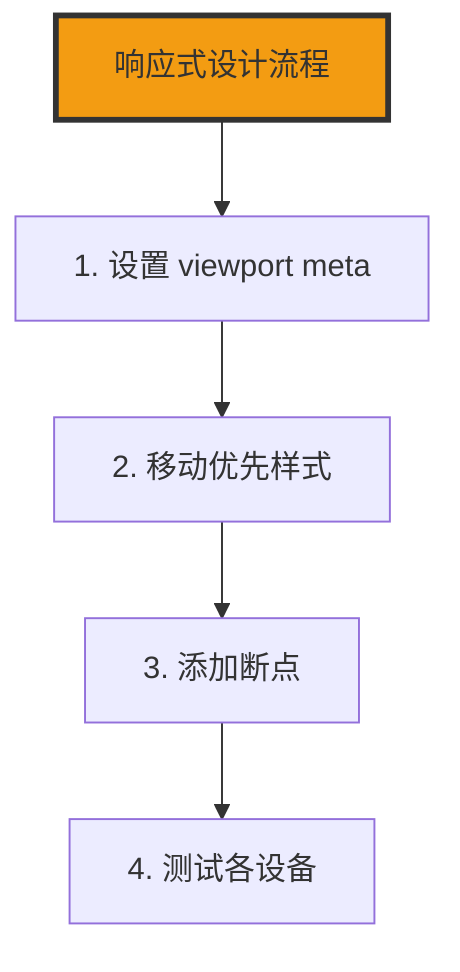

+++
title = "第25章 响应式设计"
weight = 250
date = "2026-03-27T16:53:00+08:00"
type = "docs"
description = ""
isCJKLanguage = true
draft = false
+++

# 第二十五章：响应式设计

> 想象一下，你开了一家餐厅，但只提供一种尺寸的椅子——要么太小坐着挤得慌，要么太大坐上去像掉进了洞里。用户得多不爽？更不爽的是，你还得给每个用户单独建一个餐厅！响应式设计就是让你的"椅子"能适应不同"身材"的"用户"——不同的屏幕尺寸。一套代码，多种体验，妈妈再也不用担心我为手机、平板、桌面各写一套 CSS 了！

## 25.1 视口

### 25.1.1 <meta name="viewport">——必须设置在 HTML head 中，content="width=device-width, initial-scale=1.0"

视口（Viewport）是浏览器的可见区域。如果不设置视口 meta 标签，移动端浏览器会默认以桌面端的方式渲染页面，然后把整个页面缩放到一个很小很小的尺寸来适应屏幕——这就是为什么没有设置视口的网页在手机上看起来字体小得跟蚂蚁似的。

**视口 meta 标签是响应式设计的第一步！没有它，一切响应式都是空谈。**

```html
<!-- 必须在 HTML 的 <head> 中设置 -->
<!DOCTYPE html>
<html lang="zh-CN">
<head>
  <meta charset="UTF-8">
  <!-- 这是响应式设计的入场券，没有它就别玩响应式了 -->
  <meta name="viewport" content="width=device-width, initial-scale=1.0">
  <title>我的响应式网站</title>
</head>
<body>
  <p>终于可以开始响应式设计了！</p>
</body>
</html>
```

**视口 meta 标签的参数解析：**

| 参数 | 说明 | 值 |
|------|------|-----|
| width=device-width | 视口宽度 = 设备宽度 | 常用 |
| initial-scale=1.0 | 初始缩放比例为1.0（不缩放）| 常用 |
| minimum-scale | 允许的最小缩放比例 | 0.1 ~ 10 |
| maximum-scale | 允许的最大缩放比例 | 0.1 ~ 10 |
| user-scalable | 是否允许用户缩放 | yes / no |

```html
<!-- 完整版视口设置 -->
<meta name="viewport" content="width=device-width, initial-scale=1.0, minimum-scale=1.0, maximum-scale=5.0, user-scalable=yes">

<!-- 常用简化版 -->
<meta name="viewport" content="width=device-width, initial-scale=1.0">
```

### 25.1.2 视口单位——vw（视口宽度的1%）、vh（视口高度的1%）、vmin、vmax

视口单位是相对于浏览器可见区域大小的单位，是响应式设计中非常实用的工具。

**什么是视口单位？**

想象一下，你把屏幕分成100份。`1vw` 就是屏幕宽度的1%，`1vh` 就是屏幕高度的1%。如果屏幕宽度是375px（iPhone），那 `1vw` 就等于 3.75px。

```css
/* vw：视口宽度的1% */
.vw-demo {
  width: 50vw;  /* 宽度是视口宽度的50% */
  /* 在375px宽的屏幕上，50vw = 187.5px */
}

/* vh：视口高度的1% */
.vh-demo {
  height: 100vh;  /* 高度是视口高度的100% */
  /* 正好一屏高 */
}

/* vmin：vw 和 vh 中较小的那个 */
.vmin-demo {
  width: 90vmin;  /* 宽度是视口较小边的90% */
  /* 在375x812的屏幕上，vmin=375，90vmin=337.5px */
}

/* vmax：vw 和 vh 中较大的那个 */
.vmax-demo {
  width: 90vmax;  /* 宽度是视口较大边的90% */
  /* 在375x812的屏幕上，vmax=812，90vmax=730.8px */
}
```

```html
<div class="vw-demo">
  我的宽度是视口的50%
</div>

<div class="vh-demo">
  我的高度是视口的100%，正好一屏高
</div>

<div class="vmin-demo">
  我的宽度是视口较窄边的90%
</div>
```

**视口单位的实际应用：**

```css
/* 1. 全屏英雄区域 */
.hero-section {
  height: 100vh;
  display: flex;
  align-items: center;
  justify-content: center;
  background: linear-gradient(135deg, #667eea 0%, #764ba2 100%);
  color: white;
}

/* 2. 响应式字体大小 */
.fluid-text {
  font-size: calc(16px + 2vw);
  /* 最小16px，最大随视口增加 */
}

/* 3. 正方形容器（响应式）*/
.square-container {
  width: 50vmin;
  height: 50vmin;
  /* 始终是正方形 */
}
```

## 25.2 媒体查询

### 25.2.1 基本语法——@media 媒体类型 and (媒体特性) { CSS }

媒体查询是响应式设计的核心武器。它允许你根据不同的屏幕条件应用不同的 CSS 样式。

**什么是媒体查询？**

想象一下，你是一个变色龙，环境（屏幕大小）变化时，你的颜色（样式）也跟着变化。媒体查询就是这个"变色机制"。

```css
/* 媒体查询基本语法 */
@media screen and (max-width: 768px) {
  /* 当屏幕宽度小于等于768px时，这些样式生效 */
  body {
    background-color: lightblue;
  }

  .container {
    padding: 10px;
  }
}
```

```html
<!-- 媒体查询写在 CSS 中，不需要修改 HTML -->
<style>
  /* 默认样式（桌面端）*/
  .box {
    width: 300px;
    background: blue;
  }

  /* 媒体查询（移动端）*/
  @media (max-width: 768px) {
    .box {
      width: 100%;
      background: lightblue;
    }
  }
</style>

<div class="box">
  在桌面端宽度300px，在移动端宽度100%
</div>
```

### 25.2.2 常用写法——@media (min-width: 768px) { } 或 @media screen and (max-width: 768px) { }

媒体查询有两种主要写法：最小宽度（移动优先）和最大宽度（桌面优先）。

**最小宽度写法（移动优先，推荐）**

```css
/* 移动优先：先写移动端样式，然后逐步增加大屏幕样式 */
/* 所有媒体查询都使用 min-width */

.container {
  padding: 10px;  /* 默认（移动端）*/
  font-size: 14px;
}

@media (min-width: 768px) {
  /* 平板及更大屏幕 */
  .container {
    padding: 20px;
    font-size: 16px;
  }
}

@media (min-width: 1024px) {
  /* 笔记本及更大屏幕 */
  .container {
    padding: 30px;
    font-size: 17px;
  }
}

@media (min-width: 1280px) {
  /* 桌面端 */
  .container {
    max-width: 1200px;
    margin: 0 auto;
  }
}
```

**最大宽度写法（桌面优先）**

```css
/* 桌面优先：先写桌面端样式，然后逐步减少小屏幕样式 */
/* 所有媒体查询都使用 max-width */

.container {
  padding: 30px;  /* 默认（桌面端）*/
  max-width: 1400px;
  margin: 0 auto;
}

@media (max-width: 1024px) {
  /* 笔记本及更小屏幕 */
  .container {
    padding: 25px;
  }
}

@media (max-width: 768px) {
  /* 平板及更小屏幕 */
  .container {
    padding: 20px;
  }
}

@media (max-width: 480px) {
  /* 手机端 */
  .container {
    padding: 15px;
  }
}
```

### 25.2.3 媒体类型——screen（屏幕）、print（打印）、all（所有）

```css
/* screen：屏幕设备 */
@media screen {
  body {
    font-size: 16px;
  }
}

/* print：打印设备 */
@media print {
  body {
    font-size: 12pt;  /* 打印用pt单位 */
    color: black;
    background: white;
  }

  /* 打印时隐藏不必要的元素 */
  .navbar, .sidebar, .advertisement {
    display: none;
  }
}

/* all：所有设备 */
@media all {
  * {
    box-sizing: border-box;
  }
}
```

### 25.2.4 @supports 特性查询——@supports (display: grid) { }

`@supports` 不是媒体查询，而是用来检测浏览器是否支持某个 CSS 特性。

```css
/* 检测浏览器是否支持 Grid */
@supports (display: grid) {
  .layout {
    display: grid;
  }
}

/* 检测多个条件（必须同时满足）*/
@supports (display: flex) and (backdrop-filter: blur(10px)) {
  .glass-effect {
    display: flex;
    backdrop-filter: blur(10px);
  }
}

/* 检测任一条件（满足一个即可）*/
@supports (display: grid) or (display: flexbox) {
  .layout {
    display: flex;
  }
}

/* 否定检测：浏览器不支持某个特性时 */
@supports not (backdrop-filter: blur(10px)) {
  .glass-effect {
    /* 降级：浏览器不支持毛玻璃效果时，用半透明背景替代 */
    background: rgba(255, 255, 255, 0.8);
  }
}
```

## 25.3 移动优先 vs 桌面优先

### 25.3.1 移动优先（推荐）——先写移动端样式，然后逐步增加大屏幕样式，所有媒体查询用 min-width

移动优先是现代响应式设计的主流方法论。简单来说，就是**先为手机设计，然后逐步增强平板、桌面端的体验**。

**为什么推荐移动优先？**

1. **手机用户越来越多**：移动端流量已经超过桌面端
2. **约束激发创造力**：手机屏幕小，逼着你简化内容
3. **性能考虑**：手机优先意味着更少的资源加载

```css
/* 移动优先的工作流程 */

/* 第一步：写基础样式（手机端）*/
.article-card {
  display: block;           /* 手机端不需要flex */
  padding: 16px;
  margin-bottom: 16px;
  background: white;
}

.article-title {
  font-size: 20px;          /* 手机端字号小一点 */
  margin-bottom: 12px;
}

.article-image {
  width: 100%;              /* 图片占满宽度 */
  height: auto;
  margin-bottom: 12px;
}

/* 第二步：平板样式（min-width: 768px）*/
@media (min-width: 768px) {
  .article-card {
    display: flex;           /* 平板开始用flex */
    padding: 24px;
  }

  .article-image {
    width: 200px;          /* 图片缩小到200px */
    margin-bottom: 0;
    margin-right: 24px;
  }
}

/* 第三步：桌面样式（min-width: 1024px）*/
@media (min-width: 1024px) {
  .article-title {
    font-size: 28px;      /* 桌面端字号大一点 */
  }

  .article-image {
    width: 300px;
  }
}
```

### 25.3.2 桌面优先——先写桌面样式，然后逐步减少小屏幕样式，所有媒体查询用 max-width

桌面优先是传统方法，先设计桌面端，然后逐步为移动端做适配。

```css
/* 桌面优先的工作流程 */

/* 第一步：写基础样式（桌面端）*/
.article-card {
  display: flex;
  max-width: 1200px;
  margin: 0 auto;
  padding: 32px;
}

.article-image {
  width: 400px;
  height: 250px;
}

/* 第二步：平板样式（max-width: 1024px）*/
@media (max-width: 1024px) {
  .article-card {
    padding: 24px;
  }

  .article-image {
    width: 300px;
    height: 200px;
  }
}

/* 第三步：手机样式（max-width: 768px）*/
@media (max-width: 768px) {
  .article-card {
    display: block;
    padding: 16px;
  }

  .article-image {
    width: 100%;
    height: auto;
    margin-bottom: 16px;
  }
}
```

## 25.4 断点设计

### 25.4.1 常用断点参考值

断点是媒体查询的"触发点"，当屏幕尺寸达到或超过这个点时，样式就会发生变化。

```css
/* 常用断点参考 */

/* 超小型设备（320px - 480px）*/
/* 早期的智能手机 */
@media (min-width: 320px) {
  html {
    font-size: 14px;
  }
}

/* 小型设备（480px - 768px）*/
/* 大屏智能手机 */
@media (min-width: 480px) {
  .container {
    padding-left: 16px;
    padding-right: 16px;
  }
}

/* 平板竖屏（768px - 1024px）*/
/* iPad 竖屏 */
@media (min-width: 768px) {
  .container {
    padding-left: 24px;
    padding-right: 24px;
  }

  .sidebar {
    display: block;
  }
}

/* 平板横屏 / 小笔记本（1024px - 1280px）*/
/* iPad 横屏、笔记本 */
@media (min-width: 1024px) {
  .container {
    max-width: 960px;
    margin: 0 auto;
  }
}

/* 桌面端（1280px - 1920px）*/
/* 桌面显示器 */
@media (min-width: 1280px) {
  .container {
    max-width: 1200px;
  }
}

/* 大屏桌面（1920px+）*/
/* 大屏显示器、4K */
@media (min-width: 1920px) {
  .container {
    max-width: 1400px;
  }

  html {
    font-size: 18px;
  }
}
```

### 25.4.2 基于内容而非设备

最好的断点不是根据某个具体的设备设置的，而是根据内容的"自然断点"——当内容开始看起来不对劲的时候，就是该加断点的时候了。

```css
/* 内容驱动的断点 */

/* 当一行文字超过70个字符时，分成两列 */
.article-content {
  max-width: 70ch;  /* ch单位是当前字体下"0"的宽度 */
}

/* 当侧边栏开始挤压主内容时，切换布局 */
@media (min-width: 900px) {
  .layout {
    display: flex;
    gap: 40px;
  }

  .main-content {
    flex: 1;
  }

  .sidebar {
    width: 280px;
  }
}

/* 当卡片排列开始拥挤时，增加列间距 */
@media (min-width: 600px) {
  .card-grid {
    display: grid;
    grid-template-columns: repeat(2, 1fr);
    gap: 24px;
  }
}

@media (min-width: 900px) {
  .card-grid {
    grid-template-columns: repeat(3, 1fr);
  }
}
```

## 25.5 响应式固定搭配

### 25.5.1 图片响应式——img { max-width: 100%; height: auto; }

图片是最需要响应式处理的元素之一。一个在大屏幕上美美的图片，在小屏幕上可能会把页面撑得乱七八糟。

```css
/* 图片响应式的基本原则 */

/* 让图片最大宽度不超过容器 */
.responsive-image {
  max-width: 100%;   /* 图片最大宽度等于容器宽度 */
  height: auto;       /* 高度自动保持比例 */
  display: block;      /* 消除图片底部的空隙 */
}

/* 配合 object-fit 的更高级用法 */
.cropped-image {
  width: 100%;
  height: 300px;      /* 固定高度 */
  object-fit: cover;   /* 裁剪填充 */
  object-position: center center;  /* 居中裁剪 */
}

/* 响应式图片容器 */
.image-wrapper {
  position: relative;
  width: 100%;
  aspect-ratio: 16 / 9;  /* 固定比例 */
  overflow: hidden;
}

.image-wrapper img {
  position: absolute;
  top: 0;
  left: 0;
  width: 100%;
  height: 100%;
  object-fit: cover;
}
```

### 25.5.2 流体文字——font-size: clamp(16px, 2vw, 24px);

`clamp()` 函数让字体大小在最小值和最大值之间"流体"变化，不需要媒体查询就能实现响应式字体。

```css
/* clamp() 的语法：clamp(最小值, 首选值, 最大值) */

/* 流体标题 */
.fluid-heading {
  font-size: clamp(24px, 5vw, 48px);
  /* 最小24px，最大48px，中间随视口平滑变化 */
}

/* 流体正文 */
.fluid-body {
  font-size: clamp(14px, 3vw, 18px);
  /* 14px ~ 18px 之间变化，视口越宽字体越大 */
}

/* 响应式段落间距 */
.fluid-paragraph {
  margin-bottom: clamp(12px, 2vw, 24px);
}

/* 不同级别的标题 */
h1 { font-size: clamp(2rem, 5vw, 4rem); }
h2 { font-size: clamp(1.5rem, 4vw, 3rem); }
h3 { font-size: clamp(1.25rem, 3vw, 2rem); }
h4 { font-size: clamp(1rem, 2vw, 1.5rem); }
```

### 25.5.3 单列变多列

这是响应式布局最常见的场景之一——在大屏幕上是多列布局，在小屏幕上变成单列。

```css
/* 响应式多列布局 */

/* 默认单列（手机）*/
.multi-column {
  display: block;
}

.column {
  padding: 20px;
  margin-bottom: 20px;
}

/* 平板开始多列（768px）*/
@media (min-width: 768px) {
  .multi-column {
    display: flex;  /* 使用flex实现多列 */
    gap: 24px;
  }

  .column {
    flex: 1;         /* 等宽flex */
    margin-bottom: 0;
  }
}

/* 桌面端三列（1024px）*/
@media (min-width: 1024px) {
  .multi-column {
    flex-wrap: wrap;
    gap: 24px;
  }

  .column {
    flex: 1 1 calc(33.333% - 16px);  /* 重新写 flex，避免被上面的 flex: 1 覆盖 */
  }
}

/* 或者使用 Grid 更简洁 */
.grid-multi-column {
  display: grid;
  grid-template-columns: 1fr;
  gap: 24px;
}

@media (min-width: 768px) {
  .grid-multi-column {
    grid-template-columns: repeat(2, 1fr);
  }
}

@media (min-width: 1024px) {
  .grid-multi-column {
    grid-template-columns: repeat(3, 1fr);
  }
}
```

### 25.5.4 `<picture>` 和 `srcset`——HTML 层的响应式图片

CSS 的 `max-width: 100%` 只能让图片"不溢出"，但真正聪明的响应式图片应该**加载适合当前屏幕的图片**——小屏加载小图，大屏加载大图，节省流量、提升性能。

**`<picture>`：基于媒体条件选择图片**

```html
<!-- 根据屏幕宽度选择不同的图片源 -->
<picture>
  <!-- 屏幕宽度 >= 1024px 时，加载大图 -->
  <source media="(min-width: 1024px)" srcset="hero-large.jpg">

  <!-- 屏幕宽度 >= 768px 时，加载中图 -->
  <source media="(min-width: 768px)" srcset="hero-medium.jpg">

  <!-- 默认图片（小屏或都不匹配时） -->
  
</picture>
```

**`srcset` + `sizes`：让浏览器决定加载哪张图**

```html
<!-- srcset 定义多张图片及其宽度，sizes 告诉浏览器这张图在不同屏幕上的显示宽度 -->

```

**常见的响应式图片场景：**

| 场景 | 推荐方案 |
|------|---------|
| 固定比例的横幅图 | `srcset` + `sizes` |
| 艺术方向（不同构图） | `<picture>` + 不同图片 |
| 图标（SVG） | 不需要响应式，一个矢量图打天下 |
| 用户头像 | `srcset` + `sizes`，或固定几个尺寸 |

> 💡 **小技巧**：永远保留 `src` 属性作为兜底，浏览器不支持 `srcset` 时至少能加载一张图。

## 25.6 容器查询

### 25.6.1 container-type——先在容器上设置 container-type: inline-size（创建容器查询上下文）

容器查询是 CSS 响应式的未来——它允许你根据**容器自身的大小**而不是**视口的大小**来改变样式。

**什么是容器查询？**

想象一下，你是一个变形金刚，你的"变身"不是根据周围环境（视口），而是根据你穿的衣服大小（容器大小）。这就是容器查询的核心思想。

```css
/* 启用容器查询：先在容器上设置 container-type */
.card-container {
  container-type: inline-size;
  /* 创建了一个容器查询上下文 */
}

/* 或者给容器起个名字 */
.card-wrapper {
  container-type: inline-size;
  container-name: card;  /* 给容器命名 */
}
```

### 25.6.2 container-name——给容器命名，用于 @container 查询

```css
/* 有名字的容器 */
.sidebar-container {
  container-type: inline-size;
  container-name: sidebar;
}

.main-container {
  container-type: inline-size;
  container-name: main;
}
```

### 25.6.3 @container——用 @container (min-width: 400px) { } 查询容器自身宽度

```css
/* 容器查询语法 */
/* @container [容器名] (条件) { 样式 } */

/* 通用容器查询 */
.card-container {
  container-type: inline-size;
}

.card {
  padding: 12px;
}

@container (min-width: 400px) {
  .card {
    padding: 24px;
    display: flex;
  }
}

@container (min-width: 600px) {
  .card {
    padding: 32px;
  }
}

/* 命名容器的查询 */
@container sidebar (min-width: 300px) {
  .sidebar-content {
    display: block;
  }
}
```

### 25.6.4 @container 相对单位——cqi（容器 inline 方向的1%）、cqb（容器块级方向的1%）

```css
/* 容器相对单位 */
.fluid-card {
  container-type: inline-size;
}

.card-title {
  font-size: clamp(16px, 5cqi, 28px);
  /* cqi = 容器 inline 方向（水平）的1% */
  /* cqb = 容器块级方向（垂直）的1% */
}
```

## 25.7 color-scheme

### 25.7.1 color-scheme: light / dark / light dark

`color-scheme` 属性声明页面支持的色彩方案，让浏览器知道该显示亮色还是暗色模式的样式。

```css
/* 声明支持亮色和暗色模式 */
:root {
  color-scheme: light dark;
  /* 告诉浏览器：我两个模式都支持 */
}

/* 亮色模式样式 */
:root[color-scheme="light"] {
  --bg-color: #ffffff;
  --text-color: #333333;
}

/* 暗色模式样式 */
:root[color-scheme="dark"] {
  --bg-color: #1a1a1a;
  --text-color: #ffffff;
}

/* 或者使用 prefers-color-scheme 媒体查询（效果相同，选一种即可）*/
@media (prefers-color-scheme: light) {
  :root {
    --bg-color: #ffffff;
    --text-color: #333333;
  }
}

@media (prefers-color-scheme: dark) {
  :root {
    --bg-color: #1a1a1a;
    --text-color: #ffffff;
  }
}

/* 应用变量 */
body {
  background-color: var(--bg-color);
  color: var(--text-color);
}
```

---

## 本章小结

恭喜你完成了第二十五章的学习！响应式设计让你的网站能适应各种屏幕尺寸。

### 核心知识点

| 知识点 | 说明 |
|---------|------|
| viewport meta | 必须设置的响应式入场券 |
| 媒体查询 @media | 响应式核心武器 |
| 移动优先 | 推荐的工作流程 |
| 视口单位 vw/vh | 响应式尺寸单位 |
| 响应式图片 srcset/picture | HTML 层节省流量 |
| 容器查询 @container | 未来的响应式 |
| color-scheme | 声明支持的色彩模式 |

### 响应式设计流程



### 常用断点参考

| 设备 | 断点 |
|------|------|
| 手机 | < 480px |
| 平板竖屏 | 480px ~ 768px |
| 平板横屏 | 768px ~ 1024px |
| 笔记本 | 1024px ~ 1280px |
| 桌面 | 1280px+ |

### 下章预告

下一章我们将学习滚动相关属性，让页面滚动更丝滑！

