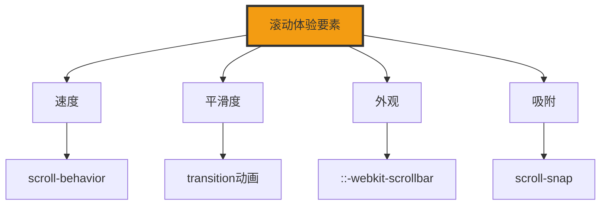

+++
title = "第26章 滚动属性"
weight = 260
date = "2026-03-27T16:53:00+08:00"
type = "docs"
description = ""
isCJKLanguage = true
draft = false
+++

# 第二十六章：滚动相关属性

> 想象一下，你在网上阅读一篇长文章，滚动鼠标滚轮时，页面像蜗牛一样卡顿，你会不会直接关掉网页？滚动体验直接影响用户的浏览感受。这一章我们就来学习如何让页面滚动丝滑如德芙巧克力！

## 26.1 平滑滚动

### 26.1.1 scroll-behavior: smooth——让锚点跳转和 scrollIntoView 方法平滑滚动

`scroll-behavior` 是 CSS 滚动体验的第一步。当你点击一个锚点链接时，页面是瞬间跳过去的，还是"滑"过去的？smooth 就是让滚动像坐滑梯一样平滑。

**什么是平滑滚动？**

想象你坐滑梯，顶部直接跳到地面（instant）和坐滑梯滑下去（smooth），你更喜欢哪个体验？smooth 就是 CSS 给你的"滑梯"。

```css
/* 平滑滚动基础 */

/* 1. 全局启用平滑滚动 */
html {
  scroll-behavior: smooth;
  /* 当你点击锚点链接时，页面会平滑滚动到目标位置 */
}

/* 2. 在特定容器上启用 */
.scroll-container {
  scroll-behavior: smooth;
  overflow-y: auto;
}

/* 3. 禁用平滑滚动（特殊情况）*/
.no-smooth-scroll {
  scroll-behavior: auto;
}
```

```html
<!DOCTYPE html>
<html>
<head>
  <style>
    html {
      scroll-behavior: smooth;  /* 全站启用平滑滚动 */
    }
  </style>
</head>
<body>
  <!-- 点击这个链接，页面会平滑滚动到目标位置 -->
  <a href="#section2">跳到第二部分</a>

  <section id="section1">
    <h2>第一部分</h2>
    <p>滚动鼠标滚轮，页面会平滑滚动</p>
  </section>

  <section id="section2">
    <h2>第二部分</h2>
    <p>看，页面是不是像滑梯一样平滑地滑下来了？</p>
  </section>
</body>
</html>
```

**scroll-behavior 的应用场景：**

```css
/* 1. 单页应用（SPA）的锚点跳转 */
.single-page-app {
  scroll-behavior: smooth;
}

/* 2. 回到顶部按钮 */
/* 注意：scroll-behavior 要加在滚动容器（html）上才生效 */
html {
  scroll-behavior: smooth;
}

.back-to-top {
  position: fixed;
  bottom: 30px;
  right: 30px;
  /* 这里加 scroll-behavior 是无效的哦！按钮又不会滚动~ */
  /* 正确做法是配合 JS 或把 smooth 设在 html 上 */
}

/* 3. Tab 切换内容区 */
.tab-content {
  scroll-behavior: smooth;
  overflow-y: auto;
}
```

### 26.1.2 scrollIntoView()——JavaScript 方法，element.scrollIntoView({ behavior: 'smooth' })

`scrollIntoView` 是一个 JavaScript 方法，可以编程控制滚动到指定元素。配合 `behavior: 'smooth'` 参数就能实现平滑滚动。

```javascript
// JavaScript 中使用平滑滚动

// 获取要滚动到的元素
const targetElement = document.getElementById('section2');

// 方法1：默认滚动（瞬间跳转）
targetElement.scrollIntoView();

// 方法2：平滑滚动
targetElement.scrollIntoView({
  behavior: 'smooth'
});

// 方法3：滚动到元素顶部
targetElement.scrollIntoView({
  behavior: 'smooth',
  block: 'start'  // 'start'/'center'/'end'/'nearest'
});

// 方法4：滚动到元素并水平对齐
targetElement.scrollIntoView({
  behavior: 'smooth',
  inline: 'start'  // 'start'/'center'/'end'/'nearest'
});

// 方法5：完整API
targetElement.scrollIntoView({
  behavior: 'auto',          // 'auto' | 'smooth'
  block: 'start',           // 'start' | 'center' | 'end' | 'nearest'
  inline: 'nearest'         // 'start' | 'center' | 'end' | 'nearest'
});
```

```javascript
// 实际应用：回到顶部按钮
const backToTopBtn = document.getElementById('backToTop');

backToTopBtn.addEventListener('click', () => {
  window.scrollTo({
    top: 0,
    behavior: 'smooth'  // 平滑滚动回顶部
  });
});

// 或者更简单的方式
backToTopBtn.addEventListener('click', () => {
  document.body.scrollIntoView({
    behavior: 'smooth',
    block: 'start'
  });
});
```

**scrollIntoView 的兼容性写法：**

```javascript
// 兼容性写法
function smoothScrollTo(element) {
  if ('scrollBehavior' in document.documentElement.style) {
    // 浏览器支持 smooth，直接用
    element.scrollIntoView({ behavior: 'smooth' });
  } else {
    // 降级方案：使用 setTimeout 模拟平滑
    const targetY = element.offsetTop;
    const startY = window.pageYOffset;
    const duration = 500;  // 500ms
    const startTime = performance.now();

    function step(currentTime) {
      const elapsed = currentTime - startTime;
      const progress = Math.min(elapsed / duration, 1);
      const easeProgress = progress * (2 - progress);  // 缓动函数

      window.scrollTo(0, startY + (targetY - startY) * easeProgress);

      if (progress < 1) {
        requestAnimationFrame(step);
      }
    }

    requestAnimationFrame(step);
  }
}
```

## 26.2 自定义滚动条

### 26.2.1 ::-webkit-scrollbar——webkit 内核浏览器的滚动条整体样式

自定义滚动条是提升网页质感的重要细节。默认的滚动条又粗又丑，在某些设计风格下显得格格不入（比如精致的暗色主题），`::-webkit-scrollbar` 让你可以把它打扮得漂漂亮亮——换色、圆角、缩放，一个都不落下。

**什么是 ::-webkit-scrollbar？**

滚动条由几部分组成：`::-webkit-scrollbar` 是整体样式，`::-webkit-scrollbar-track` 是轨道（背景），`::-webkit-scrollbar-thumb` 是滑块（可以拖动的部分）。

```css
/* 自定义滚动条基础样式 */

/* 整体样式（宽高、圆角）*/
.custom-scrollbar {
  scrollbar-width: thin;  /* Firefox */
  scrollbar-color: #888 #f1f1f1;  /* Firefox */
}

.custom-scrollbar::-webkit-scrollbar {
  width: 8px;   /* 滚动条宽度 */
  height: 8px;  /* 滚动条高度 */
}

/* 轨道（背景）*/
.custom-scrollbar::-webkit-scrollbar-track {
  background: #f1f1f1;  /* 轨道背景色 */
  border-radius: 4px;   /* 圆角 */
}

/* 滑块（可拖动部分）*/
.custom-scrollbar::-webkit-scrollbar-thumb {
  background: #888;   /* 滑块颜色 */
  border-radius: 4px;  /* 圆角 */
  transition: background 0.2s;  /* hover 效果 */
}

/* hover 状态 */
.custom-scrollbar::-webkit-scrollbar-thumb:hover {
  background: #555;  /* 鼠标悬停时滑块变深 */
}
```

```html
<div class="custom-scrollbar" style="height: 300px; overflow-y: auto;">
  <p>滚动我！</p>
  <p>你会发现滚动条变好看了！</p>
  <p>这是一个自定义滚动条的演示区域</p>
  <p>内容足够多才会出现滚动条</p>
  <p>内容1</p>
  <p>内容2</p>
  <p>内容3</p>
  <p>内容4</p>
  <p>内容5</p>
  <p>内容6</p>
</div>
```

### 26.2.2 ::-webkit-scrollbar-track——滚动条轨道（背景）

轨道是滚动条的"滑道"，滑块在上面滑动。

```css
/* 轨道样式 */

/* 基础轨道 */
.styled-track::-webkit-scrollbar-track {
  background: #f0f0f0;  /* 轨道背景 */
}

/* 有内边距的轨道 */
.padded-track::-webkit-scrollbar-track {
  background: #f9f9f9;
  padding: 2px;  /* 轨道内边距 */
}

/* 渐变轨道 */
.gradient-track::-webkit-scrollbar-track {
  background: linear-gradient(to right, #f0f0f0, #e0e0e0);
}

/* 有圆角的轨道 */
.rounded-track::-webkit-scrollbar-track {
  background: #f1f1f1;
  border-radius: 10px;
}
```

### 26.2.3 ::-webkit-scrollbar-thumb——滚动条滑块（可拖动部分）

滑块是用户可以拖动来控制滚动位置的"把手"。

```css
/* 滑块样式 */

/* 基础滑块 */
.styled-thumb::-webkit-scrollbar-thumb {
  background: #888;
  border-radius: 4px;
}

/* hover 效果 */
.hover-thumb::-webkit-scrollbar-thumb:hover {
  background: #555;
}

/* 更粗的滑块 */
.thick-thumb::-webkit-scrollbar-thumb {
  background: #666;
  border-radius: 8px;
}

/* 渐变滑块 */
.gradient-thumb::-webkit-scrollbar-thumb {
  background: linear-gradient(180deg, #3498db, #2980b9);
  border-radius: 4px;
}

/* 滑块悬停效果 */
.interactive-thumb::-webkit-scrollbar-thumb {
  background: #3498db;
  transition: background 0.2s;
}

.interactive-thumb::-webkit-scrollbar-thumb:hover {
  background: #2980b9;
}
```

### 26.2.4 scrollbar-width——Firefox 滚动条宽度

Firefox 不支持 `::-webkit-scrollbar`，但它有自己的滚动条定制方式。

```css
/* Firefox 滚动条样式 */

/* scrollbar-width: thin 让滚动条更细 */
.thin-scrollbar {
  scrollbar-width: thin;  /* auto | thin | none */
  scrollbar-color: #888 #f1f1f1;  /* thumb track */
}

/* thin 滚动条 */
.thin {
  scrollbar-width: thin;
  scrollbar-color: #888 #f1f1f1;
}

/* none：隐藏滚动条 */
.hidden-scrollbar {
  scrollbar-width: none;  /* 隐藏滚动条 */
}
```

### 26.2.5 scrollbar-color——scrollbar-color: thumb-color track-color

`scrollbar-color` 是 Firefox 专有属性，语法简洁：`scrollbar-color: 滑块颜色 轨道颜色`。

```css
/* scrollbar-color 语法 */

/* 滑块颜色 轨道颜色 */
.colored-scrollbar {
  scrollbar-color: #3498db #f1f1f1;
  /* 滑块是蓝色，轨道是浅灰色 */
}

/* 常见颜色组合 */
.blue-scrollbar {
  scrollbar-color: #3498db #e8f4fc;
}

.green-scrollbar {
  scrollbar-color: #2ecc71 #e8f8f5;
}

.purple-scrollbar {
  scrollbar-color: #9b59b6 #f4ecf7;
}

/* 深色主题滚动条 */
.dark-scrollbar {
  scrollbar-color: #555 #2c2c2c;
  /* 滑块深灰，轨道更深灰 */
}
```

## 26.3 滚动快照

### 26.3.1 scroll-snap-type——x（水平吸附）/ y（垂直吸附）/ both / mandatory（强制吸附）/ proximity（浏览器自行决定）

滚动快照（Scroll Snap）是一种"强制的优雅"。当用户滚动停止时，页面会自动吸附到某个"快照点"，让滚动有一个明确的停止位置，而不是随意停在任何地方。

**什么是滚动快照？**

想象你翻杂志，翻一页是一整页，不会停在半页中间——那太难受了对吧？滚动快照就是这个效果——页面滚动时会自动"翻页"到完整的内容区块。用户松手后，CSS 帮你决定停在哪，不用担心停在尴尬的位置。

```css
/* 滚动快照容器 */
.scroll-snap-container {
  /* 必须设置 overflow 才有效 */
  overflow-x: auto;  /* 或 overflow-y: auto */
  overflow-y: auto;
  /* 启用滚动快照 */
  scroll-snap-type: y mandatory;  /* 垂直方向，强制吸附 */
  /* mandatory: 强制吸附（滚动停止时必定吸附到某个点）*/
  /* proximity: 浏览器自行决定（接近快照点时才吸附）*/
}
```

```html
<div class="scroll-snap-container">
  <section class="snap-item">第1页</section>
  <section class="snap-item">第2页</section>
  <section class="snap-item">第3页</section>
</div>
```

### 26.3.2 scroll-snap-align——start（吸附到起点）/ end（吸附到终点）/ center（吸附到中心）

`scroll-snap-align` 决定内容在吸附时的对齐方式。

```css
/* 每个快照项的吸附对齐 */

/* 吸附到起始边（左侧或顶部）*/
.snap-start {
  scroll-snap-align: start;
}

/* 吸附到结束边（右侧或底部）*/
.snap-end {
  scroll-snap-align: end;
}

/* 吸附到中心 */
.snap-center {
  scroll-snap-align: center;
}
```

### 26.3.3 scroll-snap-stop——normal（默认，可跳过吸附点）/ always（必须停在每个吸附点）

`scroll-snap-stop` 控制用户是否可以跳过快照点。

```css
/* 强制停在每个快照点 */
.must-stop {
  scroll-snap-align: start;
  scroll-snap-stop: always;
  /* 用户滚动时必须停在每个section */
}

/* 可以跳过快照点（默认）*/
.can-skip {
  scroll-snap-align: start;
  scroll-snap-stop: normal;  /* 默认值 */
}
```

## 26.4 滚动内边距与外边距

### 26.4.1 scroll-padding——滚动容器的内边距，影响 scroll-snap 的吸附位置

`scroll-padding` 让你可以在滚动容器内部留出一块"缓冲区"，这样吸附点就不会紧贴容器边缘。

```css
/* scroll-padding 示例 */

/* 滚动容器内边距 */
.snap-container {
  overflow-x: auto;
  scroll-snap-type: x mandatory;
  /* 吸附位置距离边缘留出空间 */
  scroll-padding: 20px;
}

/* 只设置某一边 */
.one-side-padding {
  scroll-padding-top: 40px;   /* 顶部留40px空间 */
  scroll-padding-bottom: 20px;  /* 底部留20px空间 */
}
```

### 26.4.2 scroll-margin——滚动项目的外部边距，同样影响吸附计算

`scroll-margin` 是在滚动项目本身上设置的，影响吸附位置的计算。

```css
/* scroll-margin 示例 */

/* 每个滚动项目的外边距 */
.snap-item {
  scroll-snap-align: start;
  scroll-margin: 10px;  /* 吸附位置会考虑这个边距 */
}

/* 只设置某一边 */
.first-item {
  scroll-margin-left: 30px;  /* 左边距30px */
}
```

## 26.5 scrollbar-gutter

### 26.5.1 scrollbar-gutter: auto——自动处理滚动条占位，避免布局抖动

当页面内容超出视口出现滚动条时，滚动条会占用一定宽度，可能导致页面内容突然向左偏移。`scrollbar-gutter` 解决了这个"跳动"问题。

```css
/* scrollbar-gutter 解决布局抖动 */

/* auto：滚动条出现时自动预留空间 */
.stable-layout {
  scrollbar-gutter: auto;
}

/* stable：滚动条始终预留空间（即使不滚动）*/
/* ⚠️ 注意：stable 值目前仅为 Firefox 实验性支持，标准 CSS 只有 auto */
.always-space {
  scrollbar-gutter: stable;
  overflow-y: auto;
}
```

## 26.6 overscroll-behavior

### 26.6.1 滚动链控制，contain（禁止滚动链）、none（允许滚动链传递）

滚动链（Scroll Chaining）是一个"爱管闲事"的行为——当一个滚动区域滚到底了，继续滚动竟然还会带动外部父容器一起滚。听起来很贴心，但在嵌套滚动场景下，这种"贴心"往往让人崩溃。

```css
/* overscroll-behavior 示例 */

/* 禁止滚动链：子容器滚到底不带动父容器 */
.no-chain {
  overscroll-behavior: contain;
  /* 当这个容器滚到底，不会触发父容器的滚动 */
}

/* 允许滚动链（默认）*/
.with-chain {
  overscroll-behavior: auto;
}

/* 禁止滚动链并禁止弹性效果（iOS橡皮筋效果）*/
.no-bounce {
  overscroll-behavior: none;  /* 禁止滚动链传递和橡皮筋弹性效果 */
}
```

### 26.6.2 overscroll-behavior-x / overscroll-behavior-y——分别控制水平和垂直方向

```css
/* 分别控制两个方向 */

/* 禁止水平滚动链 */
.no-x-chain {
  overscroll-behavior-x: contain;
}

/* 允许垂直滚动链 */
.allow-y-chain {
  overscroll-behavior-y: auto;
}
```

---

## 本章小结

### 核心知识点

| 属性 | 说明 |
|------|------|
| scroll-behavior | 平滑滚动 |
| ::-webkit-scrollbar | 自定义滚动条 |
| scroll-snap-type | 滚动吸附 |
| scroll-padding | 吸附位置内边距 |
| scrollbar-gutter | 滚动条占位 |
| overscroll-behavior | 滚动链控制 |

### 滚动体验要素



### 下章预告

下一章我们将学习逻辑属性与书写模式，支持全球化的 CSS！

